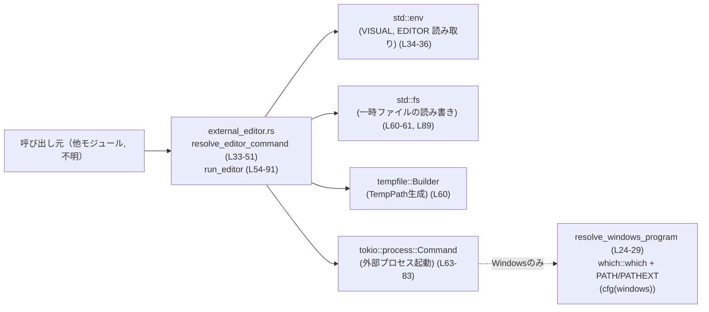
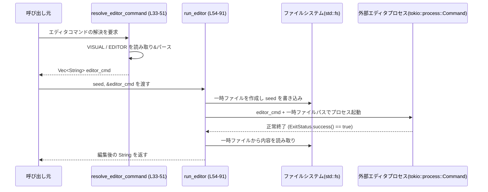

# tui/src/external_editor.rs コード解説

## 0. ざっくり一言

環境変数 `VISUAL` / `EDITOR` からエディタコマンドを解決し、一時ファイルを使って外部エディタを起動・編集結果を取得するためのユーティリティモジュールです（`tui/src/external_editor.rs:L31-51, L53-91`）。

---

## 1. このモジュールの役割

### 1.1 概要

- このモジュールは、**外部エディタを使って文字列を編集する**問題を解決するために存在し、次の機能を提供します。  
  - `VISUAL` / `EDITOR` 環境変数からエディタコマンドを決定する機能（`resolve_editor_command`）（`tui/src/external_editor.rs:L31-51`）。
  - 指定されたエディタコマンドで一時ファイルを編集し、編集後の内容を返す機能（`run_editor`）（`tui/src/external_editor.rs:L53-91`）。

### 1.2 アーキテクチャ内での位置づけ

このモジュール単体から分かる範囲での依存関係を示します。



呼び出し元（TUI 部分など）がこのモジュールの関数を呼び、モジュール内部で環境変数・ファイルシステム・外部プロセスにアクセスする構造になっています。

### 1.3 設計上のポイント

- **環境変数ベースの設定**  
  - エディタ選択は `VISUAL` → `EDITOR` の優先順位で決定されます（`tui/src/external_editor.rs:L34-36`）。
- **OS ごとのコマンド文字列パース**  
  - Windows では `winsplit`、Unix 系では `shlex` を使ってコマンド文字列を分割しています（`tui/src/external_editor.rs:L37-46`）。
- **専用エラー型 `EditorError`**  
  - 「未設定」「パース失敗（非 Windows）」「空コマンド」の3種のエラーを列挙体で表現しています（`tui/src/external_editor.rs:L11-20`）。
- **Windows 向けの実行ファイル解決**  
  - `Command::new("code")` だけでは `.cmd` などの shim を拾えないため、`which::which` を使って PATH + PATHEXT を解決する補助関数があります（`tui/src/external_editor.rs:L22-29`）。
- **一時ファイルを介したエディタ連携**  
  - `tempfile::Builder` で `.md` 拡張子の一時ファイルを作成し、`seed` を書き込んでからエディタを起動し、そのファイルを編集させる設計です（`tui/src/external_editor.rs:L53-61`）。
- **非同期処理と外部プロセス**  
  - `tokio::process::Command` の `status().await` で外部エディタの終了を待ちます（`tui/src/external_editor.rs:L77-83`）。
- **テストによる振る舞いの検証**  
  - 環境変数の優先順位・未設定時エラー・外部スクリプトによる編集結果の検証用テストが含まれています（`tui/src/external_editor.rs:L93-170`）。

---

## 2. 主要な機能一覧

- エディタコマンド解決: `VISUAL` / `EDITOR` からコマンド文字列を取得し、引数を含む `Vec<String>` に分割する（`resolve_editor_command`）（`tui/src/external_editor.rs:L31-51`）。
- Windows 用実行ファイルパス解決: PATH + PATHEXT を考慮してプログラム名から実行可能ファイルパスを求める（`resolve_windows_program`、Windows 限定）（`tui/src/external_editor.rs:L22-29`）。
- 外部エディタ実行: seed 文字列を一時ファイルに書き出し、エディタを起動し、編集後の内容を読み取って返す（`run_editor`）（`tui/src/external_editor.rs:L53-91`）。
- テスト用環境変数ガード: `VISUAL` / `EDITOR` の値を退避してテスト終了時に復元する（`EnvGuard`）（`tui/src/external_editor.rs:L101-120`）。

---

## 3. 公開 API と詳細解説

### 3.1 型一覧（構造体・列挙体など）

| 名前 | 種別 | 役割 / 用途 | 定義位置 |
|------|------|-------------|----------|
| `EditorError` | 列挙体 (enum) | エディタコマンド解決時のエラーを表す。`MissingEditor` / `ParseFailed` (非 Windows) / `EmptyCommand` を持つ | `tui/src/external_editor.rs:L11-20` |
| `EnvGuard` | 構造体 (テスト用) | テスト内で `VISUAL` / `EDITOR` 環境変数の元の値を保持し、`Drop` 時に復元する RAII ヘルパー | `tui/src/external_editor.rs:L101-104` |

※ `EnvGuard` は `#[cfg(test)]` のモジュール内にあり、テスト専用です（`tui/src/external_editor.rs:L93-171`）。

---

### 3.2 関数詳細

#### `resolve_editor_command() -> std::result::Result<Vec<String>, EditorError>`

**概要**

`VISUAL` 環境変数、なければ `EDITOR` 環境変数からエディタコマンドの文字列を取得し、OS に応じたルールで分割して `Vec<String>` を返します（`tui/src/external_editor.rs:L31-51`）。

**引数**

- 引数はありません。

**戻り値**

- `Ok(Vec<String>)`  
  - `parts[0]` がプログラム名（またはパス）、`parts[1..]` が引数の列です（`tui/src/external_editor.rs:L37-46`）。
- `Err(EditorError)`  
  - 環境変数が未設定・パース失敗・空コマンドの場合に返されます（`tui/src/external_editor.rs:L34-49`）。

**内部処理の流れ**

1. `env::var("VISUAL")` を読み取ろうとする（`tui/src/external_editor.rs:L34`）。
2. 失敗した場合は `env::var("EDITOR")` を試す（`tui/src/external_editor.rs:L35`）。
3. 両方とも失敗した場合、エラーは `EditorError::MissingEditor` にマップされます（Unicode でない場合も同様）（`tui/src/external_editor.rs:L36`）。
4. 取得した文字列 `raw` を OS ごとの方法で分割して `parts` を得ます（`tui/src/external_editor.rs:L37-46`）。
   - Windows: `winsplit::split(&raw)`（`tui/src/external_editor.rs:L38-41`）。
   - 非 Windows: `shlex::split(&raw)` の戻り値 `Option<Vec<String>>` を `EditorError::ParseFailed` に変換（`tui/src/external_editor.rs:L42-45`）。
5. `parts.is_empty()` の場合は `EditorError::EmptyCommand` を返します（`tui/src/external_editor.rs:L47-49`）。
6. それ以外は `Ok(parts)` を返します（`tui/src/external_editor.rs:L50`）。

**Examples（使用例）**

テストコードでは、`VISUAL` が優先されることを確認しています（`tui/src/external_editor.rs:L129-139`）。

```rust
use tui::external_editor::{resolve_editor_command, EditorError}; // モジュールパスは仮。本チャンクでは不明。

fn choose_editor() -> std::result::Result<Vec<String>, EditorError> {
    // 環境変数 VISUAL, EDITOR からエディタコマンドを決定する
    let cmd = resolve_editor_command()?; // Err の場合 EditorError が返る
    Ok(cmd)
}
```

テストに基づく具体例（`VISUAL` が設定されている場合）（`tui/src/external_editor.rs:L131-138`）:

```rust
// 事前に環境変数を設定する
unsafe {
    std::env::set_var("VISUAL", "vis");
    std::env::set_var("EDITOR", "ed");
}

let cmd = resolve_editor_command().unwrap();
assert_eq!(cmd, vec!["vis".to_string()]);
```

**Errors / Panics**

- `Err(EditorError::MissingEditor)`  
  - `VISUAL` と `EDITOR` が両方とも存在しない、または Unicode でない場合（`tui/src/external_editor.rs:L34-36`）。
- `Err(EditorError::ParseFailed)`（非 Windows のみ）  
  - `shlex::split(&raw)` が `None` を返した場合（構文的に不正なコマンド文字列）（`tui/src/external_editor.rs:L42-45`）。
- `Err(EditorError::EmptyCommand)`  
  - パース結果 `parts` が空だった場合（環境変数が空文字または空白のみなど）（`tui/src/external_editor.rs:L47-49`）。
- Panic  
  - この関数内には `unwrap` などの明示的な `panic!` はありません。

**Edge cases（エッジケース）**

- `VISUAL` / `EDITOR` が存在しない場合  
  → `EditorError::MissingEditor`（`tui/src/external_editor.rs:L34-36`）。
- 環境変数値が空文字列または空白のみで `parts.is_empty()` になる場合  
  → `EditorError::EmptyCommand`（`tui/src/external_editor.rs:L47-49`）。
- 非 Windows でクォートが不正な文字列（例: `"vim "unclosed`）  
  → `shlex::split` が `None` を返し、`EditorError::ParseFailed`（`tui/src/external_editor.rs:L42-45`）。
- 環境変数値が非 Unicode の場合  
  → `env::var` がエラーになり、`EditorError::MissingEditor` として処理されます（`tui/src/external_editor.rs:L34-36`）。

**使用上の注意点**

- 環境変数はプロセス全体で共有されるため、**並行テスト中の変更は競合**する可能性があります。  
  テストでは `serial_test::serial` でシリアル化しています（`tui/src/external_editor.rs:L129-143`）。
- この関数は `EditorError` を返すので、上位層では `match` などでエラーの種類ごとに扱いを分けることが可能です。

---

#### `run_editor(seed: &str, editor_cmd: &[String]) -> color_eyre::eyre::Result<String>`

**概要**

`seed` 文字列を一時ファイルに書き出し、`editor_cmd` で指定された外部エディタを起動してそのファイルを編集させ、編集後のファイル内容を文字列として返す非同期関数です（`tui/src/external_editor.rs:L53-91`）。

**引数**

| 引数名 | 型 | 説明 |
|--------|----|------|
| `seed` | `&str` | 編集前の初期内容。UTF-8 文字列として一時ファイルに書き込まれる（`tui/src/external_editor.rs:L53, L61`）。 |
| `editor_cmd` | `&[String]` | エディタコマンドとその引数を要素に持つスライス。`editor_cmd[0]` がプログラム名、それ以降が引数として扱われます（`tui/src/external_editor.rs:L63-76`）。 |

**戻り値**

- `Ok(String)`  
  - 外部エディタによって編集された後のファイル内容。UTF-8 として読み込まれた文字列です（`tui/src/external_editor.rs:L89-90`）。
- `Err(color_eyre::eyre::Report)`  
  - 一時ファイル作成・書き込み・外部プロセス実行・読み込みのいずれかでエラーが発生した場合。  
    `color_eyre::Result` は `Result<T, Report>` の型エイリアスです（`tui/src/external_editor.rs:L5-6, L54`）。

**内部処理の流れ**

1. `editor_cmd.is_empty()` なら `"editor command is empty"` というメッセージでエラーを返す（`tui/src/external_editor.rs:L55-57`）。
2. `tempfile::Builder` で `.md` 拡張子の一時ファイルを作成し、すぐに `TempPath` に変換してファイルハンドルを閉じる（Windows 対策）（`tui/src/external_editor.rs:L59-60`）。
3. `std::fs::write(&temp_path, seed)?` で `seed` を一時ファイルに書き込む（同期 I/O）（`tui/src/external_editor.rs:L61`）。
4. `tokio::process::Command` を作成:
   - Windows: `resolve_windows_program(&editor_cmd[0])` を使って実行可能パスを決定（`tui/src/external_editor.rs:L63-68`）。
   - 非 Windows: `Command::new(&editor_cmd[0])`（`tui/src/external_editor.rs:L69-72`）。
5. 引数があれば `cmd.args(&editor_cmd[1..])` で追加する（`tui/src/external_editor.rs:L74-76`）。
6. 一時ファイルパスを最後の引数として追加し、標準入出力・標準エラーを親プロセスから継承 (`Stdio::inherit`) した上で `status().await?` で終了コードを待機（`tui/src/external_editor.rs:L77-83`）。
7. `status.success()` が `false` なら `"editor exited with status {status}"` というメッセージでエラーを返す（`tui/src/external_editor.rs:L85-87`）。
8. 正常終了なら `std::fs::read_to_string(&temp_path)?` でファイル内容を読み込み、`Ok(contents)` を返す（`tui/src/external_editor.rs:L89-90`）。
9. 関数を抜けるときに `TempPath` が drop され、一時ファイルが削除されます（`tui/src/external_editor.rs:L60` の `into_temp_path()` の仕様に依存）。

**Examples（使用例）**

Unix 環境でのテストでは、シェルスクリプトをエディタとして使い、ファイル内容を書き換えています（`tui/src/external_editor.rs:L155-170`）。

```rust
// シンプルなスクリプトを「エディタ」として利用する例（Unix のテストから簡略化）
use std::fs;
use std::os::unix::fs::PermissionsExt;
use tempfile::tempdir;

#[tokio::main]
async fn main() -> color_eyre::Result<()> {
    let dir = tempdir()?;                                          // 一時ディレクトリを作成
    let script_path = dir.path().join("edit.sh");                  // スクリプトパス
    fs::write(&script_path, "#!/bin/sh\nprintf \"edited\" > \"$1\"\n")?;
    let mut perms = fs::metadata(&script_path)?.permissions();
    perms.set_mode(0o755);                                         // 実行権限を付与
    fs::set_permissions(&script_path, perms)?;

    let cmd = vec![script_path.to_string_lossy().to_string()];     // editor_cmd を構築
    let result = run_editor("seed", &cmd).await?;                  // 外部「エディタ」を実行
    assert_eq!(result, "edited".to_string());                      // 編集後の内容を確認

    Ok(())
}
```

アプリケーションコードでの典型的な組み合わせ例（`resolve_editor_command` と併用）:

```rust
async fn edit_text_with_default_editor(seed: &str) -> color_eyre::Result<String> {
    // 環境変数からエディタコマンドを解決
    let editor_cmd = resolve_editor_command()?;       // EditorError は color_eyre::Report に変換していないので注意

    // 実際のアプリでは EditorError -> Report の変換などが必要
    let result = run_editor(seed, &editor_cmd).await?; // 外部エディタで編集
    Ok(result)
}
```

※ 上記のような組み合わせで使うことが想定されますが、実際の呼び出しコードはこのチャンクには現れません。

**Errors / Panics**

- `Err(Report::msg("editor command is empty"))`  
  - `editor_cmd` が空スライスの場合（`tui/src/external_editor.rs:L55-57`）。
- `Err(Report)`（`?` 演算子経由）  
  - 一時ファイルの作成に失敗した場合（`tempfile()?`）（`tui/src/external_editor.rs:L60`）。
  - 一時ファイルへの書き込みに失敗した場合（`fs::write`）（`tui/src/external_editor.rs:L61`）。
  - 外部プロセスの起動や終了待機に失敗した場合（`status().await?`）（`tui/src/external_editor.rs:L82-83`）。
  - 編集後のファイル読み込みに失敗した場合（`fs::read_to_string`）（`tui/src/external_editor.rs:L89`）。
- `Err(Report::msg(format!("editor exited with status {status}")))`  
  - 外部エディタの終了ステータスが成功でない場合（`tui/src/external_editor.rs:L85-87`）。
- Panic  
  - 関数本体に `unwrap` や `expect` はなく、`?` のみなので、panic は想定されていません。

**Edge cases（エッジケース）**

- `editor_cmd` が空  
  → 早期に `"editor command is empty"` エラー（`tui/src/external_editor.rs:L55-57`）。
- `editor_cmd[0]` が存在するが無効なプログラム名  
  → `Command::new` / 実行時に OS 側でエラーとなり、`status().await?` で `Err` が返る可能性（`tui/src/external_editor.rs:L63-83`）。
- エディタ実行中にユーザーが異常終了させた場合  
  → `status.success()` が `false` となり、`"editor exited with status {status}"` エラー（`tui/src/external_editor.rs:L85-87`）。
- 外部エディタがファイルを空に書き換えた場合  
  → `Ok("")`（空文字）として返る（`tui/src/external_editor.rs:L89-90`）。
- 一時ファイルが何らかの理由で削除された場合  
  → `fs::read_to_string` がエラーになり、`Err(Report)` が返る（`tui/src/external_editor.rs:L89`）。

**使用上の注意点**

- **非同期コンテキストでの同期 I/O**  
  - 一時ファイルの読み書きに `std::fs` を使っているため、`run_editor` 実行中はスレッドがブロックされます（`tui/src/external_editor.rs:L60-61, L89`）。  
    外部エディタの起動時間が支配的であることが多いとはいえ、高頻度で呼び出す場合には影響に注意が必要です。
- **外部コマンドの実行**  
  - `editor_cmd` の内容に応じて任意の外部プログラムが実行されるため、**信頼できる入力からのみ** `editor_cmd` を構築する前提が置かれています（`tui/src/external_editor.rs:L63-76`）。
- **標準入出力の継承**  
  - `Stdio::inherit()` を使っているため、外部エディタは呼び出し元プロセスと同じ標準入出力を利用します（`tui/src/external_editor.rs:L79-81`）。  
    非対話的環境（例: バックグラウンドジョブや一部の CI 環境）ではエディタが期待通りに動作しない可能性があります。
- **一時ファイルのライフサイクル**  
  - `TempPath` はスコープ終了時にファイルを削除するため、関数から返された `String` 以外にファイルパスを保持してはいけない前提です（`tui/src/external_editor.rs:L60`）。

---

#### `resolve_windows_program(program: &str) -> std::path::PathBuf`（Windows 限定）

**概要**

Windows 環境で、`program` という名前の実行ファイルを PATH + PATHEXT を考慮して検索し、完全パスを返します。見つからなければ元の文字列を `PathBuf` に変換して返します（`tui/src/external_editor.rs:L22-29`）。

**引数**

| 引数名 | 型 | 説明 |
|--------|----|------|
| `program` | `&str` | 実行したいプログラム名（例: `"code"`） |

**戻り値**

- `std::path::PathBuf`  
  - `which::which(program)` が成功した場合: 見つかった実行可能ファイルのパス。  
  - 失敗した場合: `PathBuf::from(program)` の結果（`tui/src/external_editor.rs:L28`）。

**内部処理の流れ**

1. `which::which(program)` で PATH + PATHEXT を考慮してプログラムを探す（`tui/src/external_editor.rs:L28`）。
2. 成功した場合はそのパスを返す。
3. エラーの場合は `PathBuf::from(program)` を返す（`unwrap_or_else` によるフォールバック）（`tui/src/external_editor.rs:L28`）。

**Examples（使用例）**

この関数の直接の使用例は本チャンクにはテストとして現れませんが、`run_editor` の Windows 分岐で以下のように使われています（`tui/src/external_editor.rs:L63-68`）。

```rust
#[cfg(windows)]
let mut cmd = Command::new(resolve_windows_program(&editor_cmd[0]));
```

**Errors / Panics**

- `which::which` のエラーは `unwrap_or_else` によって隠蔽され、panic にはなりません（`tui/src/external_editor.rs:L28`）。
- `PathBuf::from(program)` は常に成功するため、panic はありません。

**Edge cases（エッジケース）**

- `program` が空文字列の場合  
  → `which::which` が失敗し、`PathBuf::from("")` が返ります。後続の `Command::new` で OS 依存のエラーになる可能性があります（`tui/src/external_editor.rs:L28, L63-68`）。
- PATH に該当プログラムが存在しない場合  
  → `PathBuf::from(program)` が返り、絶対パスが解決されないまま `Command::new` に渡されます。

**使用上の注意点**

- この関数は Windows の `.cmd` / `.bat` シムなどを解決するための補助関数です（コメントより）（`tui/src/external_editor.rs:L26-27`）。
- フォールバックの `PathBuf::from(program)` が使われた場合、実行時にプログラムが見つからない可能性が残ります。

---

### 3.3 その他の関数

テスト用および補助的な関数をまとめます。

| 関数名 / 実装 | 役割（1 行） | 定義位置 |
|---------------|--------------|----------|
| `EnvGuard::new() -> Self` | 現在の `VISUAL` / `EDITOR` の値を `Option<String>` として保存する（テスト用） | `tui/src/external_editor.rs:L106-112` |
| `impl Drop for EnvGuard::drop(&mut self)` | `EnvGuard` の破棄時に `restore_env` を使って環境変数を元に戻す | `tui/src/external_editor.rs:L115-119` |
| `restore_env(key: &str, value: Option<String>)` | `Some` なら `env::set_var`、`None` なら `env::remove_var` で環境変数を復元/削除する（テスト用） | `tui/src/external_editor.rs:L122-127` |
| `resolve_editor_prefers_visual()` | `VISUAL` が設定されているとき `EDITOR` より優先されることを検証するテスト | `tui/src/external_editor.rs:L129-139` |
| `resolve_editor_errors_when_unset()` | `VISUAL` / `EDITOR` が両方未設定の場合 `MissingEditor` が返ることを検証するテスト | `tui/src/external_editor.rs:L141-152` |
| `run_editor_returns_updated_content()` | シェルスクリプトをエディタとして使い、`run_editor` が編集後内容を返すことを検証するテスト（Unix 限定） | `tui/src/external_editor.rs:L155-170` |

---

## 4. データフロー

### 4.1 `resolve_editor_command` と `run_editor` の典型的な流れ

この図は、環境変数からエディタコマンドを取得し、それを使って `run_editor` でテキストを編集する典型的なシーケンスを示します。



Windows では、`run_editor` 内部で `resolve_windows_program` が `editor_cmd[0]` の解決に使われます（`tui/src/external_editor.rs:L63-68`）。

---

## 5. 使い方（How to Use）

### 5.1 基本的な使用方法

このモジュールの主な利用フローは:

1. 環境変数からエディタコマンドを解決する（`resolve_editor_command`）。
2. 編集したい文字列とコマンドを渡して `run_editor` を呼ぶ。
3. 返ってきた文字列をアプリケーション側で利用する。

```rust
use color_eyre::Result;
// モジュールパスはこのチャンクからは不明なので仮とします。
use crate::external_editor::{resolve_editor_command, run_editor};

async fn edit_note() -> Result<()> {
    // 1. エディタコマンドを環境変数から解決する
    let cmd = resolve_editor_command()
        .map_err(|e| color_eyre::Report::msg(format!("failed to resolve editor: {e}")))?;

    // 2. 初期内容を seed として外部エディタを起動する
    let seed = "# メモ\nここに内容を書きます。\n";
    let edited = run_editor(seed, &cmd).await?;   // 外部エディタで編集

    // 3. 編集後の内容を利用する
    println!("編集結果:\n{}", edited);

    Ok(())
}
```

> 実際のモジュールパスやエラー変換の方針は、このチャンクには現れていないため不明です。

### 5.2 よくある使用パターン

- **標準エディタでテキストを編集する UI アクション**  
  - TUI で「本文を編集」アクションが選択されたときに、現在の本文を `seed` として `run_editor` に渡し、戻り値をそのまま本文に反映するパターンが想定できます（コードからの推論）。

- **テストでの利用（簡易エディタとしてスクリプトを使用）**  
  - テストでは、シェルスクリプト `edit.sh` を `editor_cmd` として渡し、`"$1"`（一時ファイルパス）に `"edited"` と書き込ませることで `run_editor` の挙動を検証しています（`tui/src/external_editor.rs:L155-170`）。

### 5.3 よくある間違い

コードから推測できる誤用パターンと正しいパターンの例です。

```rust
// 誤り例: editor_cmd を空のまま渡してしまう
async fn wrong(seed: &str) -> color_eyre::Result<String> {
    let editor_cmd: Vec<String> = vec![];
    // ここで "editor command is empty" エラーになる（L55-57）
    run_editor(seed, &editor_cmd).await
}

// 正しい例: resolve_editor_command を通して editor_cmd を用意する
async fn correct(seed: &str) -> color_eyre::Result<String> {
    let cmd = resolve_editor_command()
        .map_err(|e| color_eyre::Report::msg(format!("failed to resolve editor: {e}")))?;
    let result = run_editor(seed, &cmd).await?;
    Ok(result)
}
```

### 5.4 使用上の注意点（まとめ）

- **前提条件**
  - `resolve_editor_command` を使う場合、`VISUAL` または `EDITOR` が適切に設定されている必要があります（`tui/src/external_editor.rs:L34-36`）。
  - `run_editor` に渡す `editor_cmd` は少なくとも 1 要素（プログラム名）を持っている必要があります（`tui/src/external_editor.rs:L55-57`）。

- **セキュリティ・安全性**
  - `run_editor` は `editor_cmd` に指定された任意の外部プログラムを実行するため、**信頼できない入力から `editor_cmd` を構築すべきではありません**（`tui/src/external_editor.rs:L63-76`）。
  - 環境変数の操作はプロセス全体に影響するため、テストなどで変更する場合は他スレッドとの競合に注意が必要です。テストでは `serial_test::serial` で直列実行にしています（`tui/src/external_editor.rs:L129-143`）。

- **並行性 / 非同期**
  - `run_editor` は `async fn` ですが、内部で `std::fs` による同期 I/O を行っています（`tui/src/external_editor.rs:L60-61, L89`）。  
    外部エディタの起動・操作時間が支配的とはいえ、I/O ブロッキングが完全に排除されているわけではありません。
  - テストでは `#[tokio::test]` を用いて非同期関数をテストしています（`tui/src/external_editor.rs:L155-169`）。

- **エラー処理**
  - `resolve_editor_command` は独自の `EditorError` を返す一方、`run_editor` は `color_eyre::Result` を返します。  
    両者を組み合わせて使う場合、エラー型の変換方針を決めておく必要があります（このチャンクには変換ロジックは現れていません）。

- **観測性（ログ等）**
  - このモジュールはログ出力を持たず、失敗要因はすべて `Result` のエラーとして返されます（`tui/src/external_editor.rs:L33-51, L53-90`）。  
    追加でログが必要な場合は呼び出し側でエラーをログに記録する構成になります。

---

## 6. 変更の仕方（How to Modify）

### 6.1 新しい機能を追加する場合

- **エディタ解決ロジックを拡張したい場合**
  1. `resolve_editor_command` 内の環境変数読み取り部分（`tui/src/external_editor.rs:L34-36`）を修正し、例えば `MY_EDITOR` のような独自変数を追加で参照する。
  2. 追加した変数の優先順位に応じて `or_else` チェーンを調整する。
  3. 新しい条件の振る舞いを検証するテストを `mod tests` に追加する（`tui/src/external_editor.rs:L93-170`）。

- **一時ファイルの拡張子や保存場所を変えたい場合**
  1. `run_editor` の `Builder::new().suffix(".md")` 部分（`tui/src/external_editor.rs:L60`）を変更する。
  2. 必要であれば `Builder` に `prefix` や `tempdir` の指定を追加する。

- **エディタ起動オプションを共通で付与したい場合**
  1. `run_editor` 内の `cmd.args(&editor_cmd[1..])` 以外に、固定引数を追加するコードを挿入する（`tui/src/external_editor.rs:L74-76`）。
  2. 既存の `editor_cmd` の解釈との整合性を確認する。

### 6.2 既存の機能を変更する場合

- **影響範囲の確認**
  - `resolve_editor_command` と `run_editor` はどちらも `pub(crate)` であり、クレート内の他モジュールから利用されている可能性があります（呼び出し元はこのチャンクには現れません）。  
    変更前にリポジトリ全体での参照箇所を検索する必要があります。
- **契約（前提条件・戻り値）の維持**
  - `resolve_editor_command` の戻り値として「空でない `Vec<String>`」を期待しているコードがあると考えられるため、`EmptyCommand` の条件を変える場合は注意が必要です（`tui/src/external_editor.rs:L47-50`）。
  - `run_editor` は「成功時に外部エディタが正常終了している」「編集結果が String で返る」という契約を暗黙に持っています（`tui/src/external_editor.rs:L85-90`）。
- **テストの更新**
  - 環境変数の優先順位やエラー条件を変更した場合、対応するテスト（`resolve_editor_prefers_visual`, `resolve_editor_errors_when_unset`）の期待値も更新する必要があります（`tui/src/external_editor.rs:L129-152`）。
  - `run_editor` の挙動を変更した場合は、シェルスクリプトを用いたテスト（`run_editor_returns_updated_content`）の内容も確認します（`tui/src/external_editor.rs:L155-170`）。

---

## 7. 関連ファイル

このチャンクだけからは、同一クレート内の他ファイルとの具体的な関連は読み取れません。ただし、使用している外部クレート／標準ライブラリとの関係は次の通りです。

| パス / クレート | 役割 / 関係 |
|-----------------|------------|
| `std::env` | `VISUAL` / `EDITOR` 環境変数の取得・設定・削除に使用（`tui/src/external_editor.rs:L1, L34-36, L109-110, L122-126, L133-136, L146-147`）。 |
| `std::fs` | 一時ファイルおよびテスト用スクリプトの読み書きに使用（`tui/src/external_editor.rs:L2, L61, L89, L162-165`）。 |
| `std::process::Stdio` | 外部エディタプロセスの標準入出力の継承設定に使用（`tui/src/external_editor.rs:L3, L77-81`）。 |
| `tokio::process::Command` | 非同期で外部エディタプロセスを起動・待機するために使用（`tui/src/external_editor.rs:L9, L63-83`）。 |
| `tempfile::Builder` | 一時ファイルを安全に生成するために使用（`tui/src/external_editor.rs:L7, L60, L160`）。 |
| `thiserror::Error` | `EditorError` のエラーメッセージを実装するために使用（`tui/src/external_editor.rs:L8, L11-20`）。 |
| `color_eyre::eyre::{Result, Report}` | 詳細なエラーレポートを扱うための `Result` 型と `Report` 型を提供（`tui/src/external_editor.rs:L5-6, L54-57`）。 |
| `which::which`（cfg(windows)） | Windows で実行可能ファイルの実パスを決定するために使用（`tui/src/external_editor.rs:L22-29`）。 |
| `winsplit` / `shlex` | エディタコマンドの文字列を OS ごとのルールでトークン化するために使用（`tui/src/external_editor.rs:L37-46`）。 |

呼び出し元となる他モジュールのファイルパスや構造については、このチャンクには現れないため不明です。
