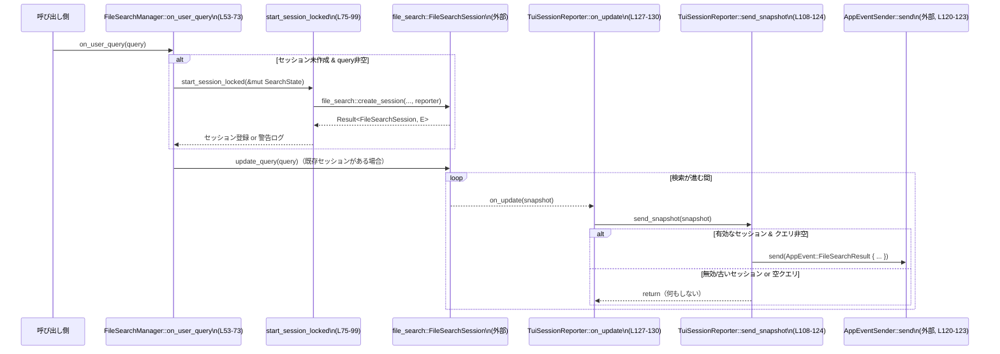

# tui/src/file_search.rs コード解説

## 0. ざっくり一言

`@` 記法によるファイル検索のために、1つの `codex-file-search` セッションを管理し、ユーザー入力の都度クエリを更新し、結果をアプリ全体のイベント (`AppEvent`) として配信する管理モジュールです（`tui/src/file_search.rs:L1-6,16-20`）。

---

## 1. このモジュールの役割

### 1.1 概要

- `ChatComposer` からの `AppEvent::StartFileSearch(query)`（ドキュメントコメントに記載）に対応して、ファイル検索セッションを開始・更新・破棄する責務を持ちます（`tui/src/file_search.rs:L1-6`）。
- 現在の検索ルートディレクトリごとに 1 セッションのみ保持し、クエリが空になったらセッションを破棄します（`tui/src/file_search.rs:L16-26,52-65`）。
- `codex_file_search` からの検索スナップショットを受け取り、`AppEvent::FileSearchResult` としてアプリに送信します（`tui/src/file_search.rs:L102-106,108-124`）。

### 1.2 アーキテクチャ内での位置づけ

このファイルは、TUI アプリの中で「ファイル検索のオーケストレーター」として動作します。

- 上流：`ChatComposer` → （どこかで）`FileSearchManager::on_user_query` を呼び出す層
- 下流：`codex_file_search` クレートのセッションと、そのコールバック `SessionReporter`
- 横断：アプリ全体へのイベント送信 `AppEventSender`

```mermaid
flowchart LR
    subgraph TUI["TUI 層"]
        CCM["ChatComposer\n(ドキュメントのみ, L1-6)"]
        FSM["FileSearchManager\n(L16-100)"]
    end

    subgraph Core["ファイル検索エンジン"]
        CFS["file_search::FileSearchSession\n(外部クレート)"]
        REP["TuiSessionReporter\n(L102-125)"]
    end

    EVS["AppEventSender\n(外部モジュール, L13-14)"]
    APP["AppEvent::FileSearchResult\n(外部モジュール, L120-123)"]

    CCM -->|"@トークン変更に応じて\non_user_query呼び出し想定"| FSM
    FSM -->|"create_session(..., reporter)\n(L75-91)"| CFS
    CFS -->|"SessionReporter::on_update\n(L127-130)"| REP
    REP -->|"send(AppEvent::FileSearchResult)\n(L108-124)"| EVS --> APP
```



※ `ChatComposer` 側の具体的なコードはこのチャンクには現れないため不明です。呼び出し元の名前はドキュメントコメントにのみ記載されています（`tui/src/file_search.rs:L1-6`）。

### 1.3 設計上のポイント

- **単一セッション管理**  
  - `SearchState.session: Option<FileSearchSession>` により、現在の検索ルートにつき 1 つのセッションのみ保持します（`tui/src/file_search.rs:L22-26`）。
- **共有状態の同期**  
  - `SearchState` を `Arc<Mutex<_>>` で共有し、`FileSearchManager`（呼び出し元スレッド）と `TuiSessionReporter`（検索エンジン側のコールバック）が同じ状態を安全に扱えるようにしています（`tui/src/file_search.rs:L16-20,22-26,31`）。
- **セッションの世代管理**  
  - `session_token` を `wrapping_add` でインクリメントし、古いセッションからの結果を無視するための世代管理に利用しています（`tui/src/file_search.rs:L22-26,75-77,112`）。
- **クエリの空チェック**  
  - クエリが空になったときはセッションを破棄し、レポーター側でも `latest_query` や `snapshot.query` が空なら結果を送らないようにしています（`tui/src/file_search.rs:L62-65,112-115`）。
- **エラーハンドリング**  
  - `create_session` の失敗は `tracing::warn!` をログ出力し、セッションを `None` にするだけでパニックは起こさない設計です（`tui/src/file_search.rs:L83-99`）。
  - `Mutex::lock().unwrap()` によるロック取得失敗時にはパニックしますが、Clippy の警告を抑制することで意図的に許容しています（`tui/src/file_search.rs:L46-47,54-55,110-111`）。

---

## 2. コンポーネント一覧と主要な機能

### 2.1 型インベントリ

| 名前 | 種別 | 公開範囲 | 行 | 役割 / 用途 |
|------|------|----------|----|-------------|
| `FileSearchManager` | 構造体 | `pub(crate)` | `tui/src/file_search.rs:L16-20` | ファイル検索セッションのライフサイクルとクエリ更新を管理するメインの管理オブジェクト |
| `SearchState` | 構造体 | モジュール内のみ | `tui/src/file_search.rs:L22-26` | 最新クエリ、現在のセッション、セッショントークンをまとめた共有状態 |
| `TuiSessionReporter` | 構造体 | モジュール内のみ | `tui/src/file_search.rs:L102-106` | `file_search::SessionReporter` 実装。スナップショットを受け取り `AppEvent::FileSearchResult` を送信する |

### 2.2 関数 / メソッドインベントリ

| 所属 | 関数名 | シグネチャ（簡略） | 公開範囲 | 行 | 概要 |
|------|--------|--------------------|----------|----|------|
| `FileSearchManager` | `new` | `fn new(search_dir: PathBuf, tx: AppEventSender) -> Self` | `pub` | `L28-39` | 検索ディレクトリとイベント送信機を受け取り、空状態のマネージャを作成 |
| `FileSearchManager` | `update_search_dir` | `fn update_search_dir(&mut self, new_dir: PathBuf)` | `pub` | `L44-50` | 検索ディレクトリ変更時にセッションを破棄し、クエリをリセット |
| `FileSearchManager` | `on_user_query` | `fn on_user_query(&self, query: String)` | `pub` | `L52-73` | ユーザーが `@` トークンを編集するたびに呼ばれ、セッションの作成・クエリ更新・破棄を行う中心メソッド |
| `FileSearchManager` | `start_session_locked` | `fn start_session_locked(&self, st: &mut SearchState)` | モジュール内のみ | `L75-99` | `SearchState` ロック取得中に新しい `FileSearchSession` を開始し、レポーターを紐付ける |
| `TuiSessionReporter` | `send_snapshot` | `fn send_snapshot(&self, snapshot: &FileSearchSnapshot)` | モジュール内のみ | `L108-124` | セッショントークン・クエリの整合性をチェックし、検索結果を `AppEvent` として送信 |
| `TuiSessionReporter`（trait impl） | `on_update` | `fn on_update(&self, snapshot: &FileSearchSnapshot)` | `pub`（trait 実装として） | `L127-130` | 検索エンジンからの更新通知ごとに `send_snapshot` を呼び出す |
| `TuiSessionReporter`（trait impl） | `on_complete` | `fn on_complete(&self)` | `pub`（trait 実装として） | `L132-132` | 検索完了時のフック。現在は何もしない |

### 2.3 主要な機能一覧（機能ベース）

- ファイル検索セッションの生成・破棄・再生成管理
- ユーザーの `@` クエリ文字列に応じたインクリメンタルな検索更新
- 空クエリ時の即時セッション終了と検索停止
- 古いセッションからの結果をトークンとクエリの状態でフィルタリング
- 検索スナップショットをアプリケーションの `AppEvent::FileSearchResult` に変換して通知

---

## 3. 公開 API と詳細解説

### 3.1 型一覧（公開 API 観点）

| 名前 | 種別 | 公開範囲 | 役割 / 用途 |
|------|------|----------|-------------|
| `FileSearchManager` | 構造体 | `pub(crate)` | クレート内から利用されるファイル検索のフロントエンド。検索ディレクトリとクエリを受け取り、内部で `codex_file_search` を駆動する |

他の型 (`SearchState`, `TuiSessionReporter`) はモジュール内部実装であり、外部から直接利用することは想定されていません（`tui/src/file_search.rs:L22-26,102-106`）。

---

### 3.2 関数詳細

#### `FileSearchManager::new(search_dir: PathBuf, tx: AppEventSender) -> Self`

**概要**

- 検索ディレクトリとアプリへのイベント送信機を受け取り、空の検索セッション状態を持つ `FileSearchManager` を構築します（`tui/src/file_search.rs:L28-39`）。

**引数**

| 引数名 | 型 | 説明 |
|--------|----|------|
| `search_dir` | `PathBuf` | ファイル検索のルートディレクトリ |
| `tx` | `AppEventSender` | `AppEvent` をアプリ全体へ送るための送信オブジェクト |

**戻り値**

- `FileSearchManager`  
  - `SearchState` は `latest_query = ""`, `session = None`, `session_token = 0` で初期化されます（`tui/src/file_search.rs:L31-35`）。

**内部処理の流れ**

1. `SearchState` を `latest_query` 空、`session` なし、`session_token` 0 で生成（`L31-35`）。
2. それを `Arc<Mutex<_>>` で包み `state` に格納（`L31`）。
3. `search_dir` と `app_tx` を引数からコピーして `FileSearchManager` を返す（`L36-38`）。

**Examples（使用例）**

```rust
use std::path::PathBuf;
// use crate::app_event_sender::AppEventSender; // 実際のパスはこのファイルからのみ判別可能

fn init_manager(search_dir: PathBuf, app_tx: AppEventSender) -> FileSearchManager {
    // ファイル検索マネージャを作成する
    FileSearchManager::new(search_dir, app_tx)
}
```

※ `AppEventSender` の生成方法はこのチャンクには現れないため不明です。

**Errors / Panics**

- コンストラクタ内部で `panic` は発生しません（ロック取得なども行っていないため、`tui/src/file_search.rs:L28-39` より）。

**Edge cases（エッジケース）**

- `search_dir` が存在しないパスであっても、この関数では検証されません。実際に使われるのは `create_session` 呼び出し時です（`L83-85`）。

**使用上の注意点**

- `FileSearchManager` インスタンスは、後続の `on_user_query` および `update_search_dir` 呼び出しで再利用する前提のオブジェクトです。

---

#### `FileSearchManager::update_search_dir(&mut self, new_dir: PathBuf)`

**概要**

- 検索ディレクトリを新しいパスに更新し、現在のセッションを破棄してクエリをリセットします（`tui/src/file_search.rs:L41-50`）。

**引数**

| 引数名 | 型 | 説明 |
|--------|----|------|
| `new_dir` | `PathBuf` | 新しいファイル検索ルートディレクトリ |

**戻り値**

- なし（`()`）。

**内部処理の流れ**

1. `self.search_dir` を `new_dir` で上書き（`L45`）。
2. 共有状態 `self.state` のロックを `lock().unwrap()` で取得（`L46-47`）。
3. `st.session.take()` で現在のセッションを破棄（`L48`）。
4. `st.latest_query.clear()` でクエリ文字列を空にする（`L49`）。

**Errors / Panics**

- `Mutex::lock().unwrap()` により、もしロックがポイズン状態であればパニックが発生します（`tui/src/file_search.rs:L46-47`）。
  - `#[expect(clippy::unwrap_used)]` が付いており、`unwrap` 使用を意図的に許容していることが分かります。

**Edge cases**

- 既に `session` が `None` の場合でも `take()` は単に `None` を返し、特別な影響はありません（`L48`）。
- `latest_query` が既に空でも `clear()` による副作用はありません（`L49`）。

**使用上の注意点**

- ディレクトリ変更後、再び `on_user_query` が呼ばれたタイミングで新しいディレクトリを使ったセッションが作成されます（`tui/src/file_search.rs:L67-69,83-85`）。
- `&mut self` を要求するため、複数スレッドから同じ `FileSearchManager` を共有してディレクトリ変更を同時に行うことはできません。

---

#### `FileSearchManager::on_user_query(&self, query: String)`

**概要**

- ユーザーが `@` トークンを編集するたびに呼ばれ、以下を行います（`tui/src/file_search.rs:L52-73`）:
  - 入力に変化がない場合は何もしない
  - クエリが空ならセッションを破棄
  - セッションがない場合は開始
  - 既存セッションに対して `update_query` を呼び出し

**引数**

| 引数名 | 型 | 説明 |
|--------|----|------|
| `query` | `String` | 現在の `@` トークン内容（検索クエリ） |

**戻り値**

- なし（`()`）。

**内部処理の流れ**

1. `self.state` のロックを `lock().unwrap()` で取得し、`st` として可変参照を得る（`L54-55`）。
2. 新しい `query` が `st.latest_query` と完全一致する場合、何もせず早期リターン（`L56-58`）。
3. `st.latest_query` をクリアし、新しい `query` をコピーして保持（`L59-60`）。
4. `query` が空文字列なら、`st.session.take()` でセッションを破棄し、リターン（`L62-65`）。
5. `st.session` が `None` の場合は `start_session_locked(&mut st)` で新セッションを開始（`L67-69`）。
6. セッションが存在する場合は `session.update_query(&query)` を呼び、検索クエリを更新（`L70-71`）。

**Errors / Panics**

- `Mutex::lock().unwrap()` によるロック取得失敗時にパニックが発生する可能性があります（`tui/src/file_search.rs:L54-55`）。
- `session.update_query(&query)` の内部挙動（エラーの有無）は `codex_file_search` の実装に依存し、このチャンクからは不明です。

**Edge cases**

- 同じクエリが連続で渡された場合、セッション更新やイベント送信は発生しません（`L56-58`）。
- 最初の非空クエリ呼び出し時にのみ新しいセッションが作成されます（`L62-69`）。
- 空文字列が渡された場合、既存セッションは破棄され、以後の結果は届かなくなります（`L62-65`）。

**使用上の注意点**

- `query` は `String` として所有権を受け取りますが、内部では `latest_query` へコピーするため、呼び出し側で大きな文字列を頻繁に渡すとコピーコストが発生します（`L59-60`）。
- 関数内で `SearchState` のロックを保持したまま `session.update_query` を呼び出しているため、`update_query` が重い処理である場合、他スレッドから `SearchState` へのアクセスがブロックされる点に注意が必要です（`tui/src/file_search.rs:L54-55,67-71`）。

---

#### `FileSearchManager::start_session_locked(&self, st: &mut SearchState)`

**概要**

- `SearchState` のロックが取得されている前提で、新しいファイル検索セッションを開始し、`TuiSessionReporter` を紐付けます（`tui/src/file_search.rs:L75-99`）。

**引数**

| 引数名 | 型 | 説明 |
|--------|----|------|
| `st` | `&mut SearchState` | すでにロック済みの検索状態。内部で `session_token` と `session` を更新する |

**戻り値**

- なし（`()`）。

**内部処理の流れ**

1. `st.session_token` を `wrapping_add(1)` で増やし、新しいセッション世代を作成（`L75-77`）。
2. `TuiSessionReporter` を `Arc` で生成し、`state` と `app_tx`、`session_token` を共有（`L78-82`）。
3. `file_search::create_session` を呼び、以下を引数として渡す（`L83-91`）:
   - 検索ディレクトリのベクタ（1 要素：`self.search_dir.clone()`）
   - `FileSearchOptions`（`compute_indices: true` を明示し、残りは `Default::default()`）
   - 上記の `reporter`
   - `cancel_flag` として `None`
4. `create_session` の戻り値が `Ok(session)` の場合、`st.session = Some(session)` として保持（`L92-93`）。
5. `Err(err)` の場合、`tracing::warn!` ログを出力し、`st.session = None` とする（`L94-97`）。

**Errors / Panics**

- `create_session` 自体は `Result` を返し、エラーはログ出力のみにとどまり、パニックしません（`tui/src/file_search.rs:L83-99`）。
- この関数内ではロック取得を行っていないため、ロック関連のパニックは発生しません（ロックは呼び出し側で取得済み）。

**Edge cases**

- `wrapping_add` により `session_token` が `usize` の最大値から 0 に戻る（オーバーフロー）場合でもパニックせず、トークンは循環します（`L75-77`）。
- `create_session` が何度も失敗する場合、`on_user_query` から見るとセッションは常に `None` のままですが、コード上はそれを特別扱いしていません（`L67-69,92-97`）。

**使用上の注意点**

- この関数は `SearchState` のロック中に呼び出すことを前提としており、外部から直接呼ぶことは想定されていません（`on_user_query` からのみ呼び出し、`tui/src/file_search.rs:L67-69`）。
- `cancel_flag: None` を渡しているため、検索エンジン側でサポートされているキャンセル機構があっても、このコードからは利用していません（`L90-91`）。

---

#### `TuiSessionReporter::send_snapshot(&self, snapshot: &file_search::FileSearchSnapshot)`

**概要**

- `codex_file_search` から渡されるスナップショットを検査し、現在のセッションかつクエリが有効な場合に `AppEvent::FileSearchResult` を送信します（`tui/src/file_search.rs:L108-124`）。

**引数**

| 引数名 | 型 | 説明 |
|--------|----|------|
| `snapshot` | `&FileSearchSnapshot` | 現在の検索結果スナップショット（クエリ文字列とマッチリストを含む） |

**戻り値**

- なし（`()`）。

**内部処理の流れ**

1. `state` のロックを `lock().unwrap()` で取得し、`st` として借用（`L110-111`）。
2. 以下のいずれかが真であれば早期リターン（`L112-116`）:
   - `st.session_token != self.session_token`（古いセッションからの結果）
   - `st.latest_query.is_empty()`（ユーザー側ではもはや検索していない）
   - `snapshot.query.is_empty()`（スナップショット自体が空クエリ）
3. `snapshot.query.clone()` でクエリ文字列をローカル変数 `query` にコピー（`L118`）。
4. `drop(st)` でロックを解放し、以降の処理がロックに依存しないようにする（`L119`）。
5. `snapshot.matches.clone()` を使い、`AppEvent::FileSearchResult { query, matches }` を `app_tx.send(...)` で送信（`L120-123`）。

**Errors / Panics**

- ロック取得に失敗した場合、`unwrap()` によりパニックする可能性があります（`tui/src/file_search.rs:L110-111`）。
- `app_tx.send(...)` の戻り値やエラー有無はこのチャンクからは分かりません。戻り値は無視されています（`L120-123`）。

**Edge cases**

- ユーザー入力のクエリが空に変更された後に届いたスナップショットは、`st.latest_query.is_empty()` により無視されます（`L112-115`）。
- 新しいセッションを開始した後に古いセッションから届いたスナップショットは、`session_token` 不一致で無視されます（`L75-77,112`）。
- `snapshot.query` が空文字列の場合も、結果は送信されません（`L114-115`）。

**使用上の注意点**

- ロックを取得した状態で長時間の処理をしないよう、クエリとマッチのクローン後すぐに `drop(st)` でロックを解放している点が、並行性の観点から重要です（`tui/src/file_search.rs:L118-119`）。

---

#### `impl file_search::SessionReporter for TuiSessionReporter`

##### `fn on_update(&self, snapshot: &file_search::FileSearchSnapshot)`

**概要**

- ファイル検索エンジンからの更新通知を受け取り、そのまま `send_snapshot` に委譲します（`tui/src/file_search.rs:L127-130`）。

**内部処理の流れ**

1. 引数の `snapshot` を `self.send_snapshot(snapshot)` に渡して呼び出すだけです（`L129`）。

**Errors / Panics**

- `send_snapshot` と同じ条件でパニックの可能性があります（ロック取得失敗時など、`tui/src/file_search.rs:L110-111`）。

##### `fn on_complete(&self)`

**概要**

- 検索完了時に `codex_file_search` から呼び出されますが、現在の実装では何も行いません（`tui/src/file_search.rs:L132`）。

**使用上の注意点**

- 完了イベントに対してアプリ側で特別な処理をしたい場合、このメソッドに処理を追加するのが自然な拡張ポイントです。

---

### 3.3 その他の関数

- このファイル内の関数はすべて上記で詳細解説済みです。

---

## 4. データフロー

ここでは、「ユーザーが `@` クエリを入力し、検索結果が `AppEvent` として届く」までの代表的なフローを示します。

### 4.1 処理の要点

1. 上位コンポーネントが `FileSearchManager::on_user_query`（L53-73）を呼び出す。
2. 必要に応じて `start_session_locked`（L75-99）が新しい `FileSearchSession` を生成し、`TuiSessionReporter` を登録。
3. 検索エンジンがクエリに基づいて検索し、進捗に応じて `SessionReporter::on_update`（L127-130）を呼ぶ。
4. `TuiSessionReporter::send_snapshot`（L108-124）がセッションとクエリの整合性を確認してから、`AppEvent::FileSearchResult` を `AppEventSender` 経由で送る。

### 4.2 シーケンス図



---

## 5. 使い方（How to Use）

### 5.1 基本的な使用方法

呼び出し元から見た基本的なフローは以下のとおりです。

1. `FileSearchManager` を作成する。
2. ユーザーの `@` クエリ変更のたびに `on_user_query` を呼ぶ。
3. `AppEventSender` 側で `AppEvent::FileSearchResult` を受信し、UI に反映する。

```rust
use std::path::PathBuf;
// use crate::app_event_sender::AppEventSender;
// use crate::app_event::AppEvent;

// 1. マネージャの初期化
let search_dir = PathBuf::from("/path/to/project");        // 検索ルート
let app_tx: AppEventSender = /* どこかで生成済み */;       // このチャンクには生成方法は現れない
let mut manager = FileSearchManager::new(search_dir, app_tx.clone());

// 2. ユーザー入力に応じた更新
manager.on_user_query("@foo".to_string());                 // 最初のクエリ → セッションが作成される
manager.on_user_query("@foob".to_string());                // クエリ更新 → 既存セッションに update_query

// 3. クエリを消した場合
manager.on_user_query("".to_string());                     // クエリ空 → セッション破棄
```

### 5.2 よくある使用パターン

- **カレントディレクトリ変更時の再設定**

```rust
use std::path::PathBuf;

fn on_cwd_changed(manager: &mut FileSearchManager, new_cwd: PathBuf) {
    // 作業ディレクトリ変更に伴い検索ルートを更新し、セッションをリセット
    manager.update_search_dir(new_cwd);
    // 次回 on_user_query 呼び出し時に新しいディレクトリでセッションが作られる
}
```

- **イベントドリブンなクエリ更新**

`AppEvent::StartFileSearch(query)` のようなイベントを受け取るループがあるとして、そのたびに `on_user_query` を呼ぶ構成が想定されます（ドキュメントコメントより、`tui/src/file_search.rs:L1-6`）。具体的なイベントループ実装はこのチャンクには存在しません。

### 5.3 よくある間違い

```rust
// 間違い例: 作業ディレクトリが変わっても検索ディレクトリを更新しない
// その場合、古いディレクトリを対象に検索を続けてしまう可能性がある
fn on_resume_without_update(manager: &FileSearchManager, query: String) {
    manager.on_user_query(query); // update_search_dir を呼んでいない
}

// 正しい例: 再開時に検索ディレクトリを更新した上でクエリを送る
fn on_resume_with_update(manager: &mut FileSearchManager, new_dir: PathBuf, query: String) {
    manager.update_search_dir(new_dir); // セッションとクエリをリセット
    manager.on_user_query(query);       // 新しいディレクトリで検索開始
}
```

### 5.4 使用上の注意点（まとめ）

- **ロックとパニック**  
  - `Mutex::lock().unwrap()` を使用しているため、ロックがポイズンされた場合はパニックします（`tui/src/file_search.rs:L46-47,54-55,110-111`）。この挙動を前提に、ロックのポイズンを致命的とみなす設計になっています。
- **古いセッション結果のフィルタ**  
  - `session_token` と `latest_query` のチェックにより、古いセッションや空クエリに対する結果は破棄されます（`tui/src/file_search.rs:L75-77,112-115`）。
- **キャンセル制御**  
  - `create_session` に `cancel_flag: None` を渡しているため、検索中断の制御は行っていません（`L90-91`）。セッションを破棄しても、内部でどのタイミングまで計算が続くかは `codex_file_search` の実装に依存します。
- **パフォーマンス**  
  - クエリ文字列とマッチリストをクローンしてからロックを解放する構造により、ロック保持時間を短く保とうとしていますが、クローン自体のコストは入力サイズに比例します（`tui/src/file_search.rs:L118-123`）。

---

## 6. 変更の仕方（How to Modify）

### 6.1 新しい機能を追加する場合

- **検索結果の整形やフィルタリングを追加したい場合**
  1. `TuiSessionReporter::send_snapshot` 内で、`snapshot.matches.clone()` の直前または直後にフィルタ処理を追加するのが自然です（`tui/src/file_search.rs:L118-123`）。
  2. `AppEvent::FileSearchResult` のペイロード構造を変更する場合は、`crate::app_event::AppEvent` を併せて更新する必要があります（`L13-14,120-123`）。

- **検索オプションを外部から指定したい場合**
  1. `FileSearchManager::new` の引数に `FileSearchOptions` 相当の設定を追加する。
  2. `start_session_locked` 内の `FileSearchOptions { compute_indices: true, ..Default::default() }` を、その設定で上書きする（`tui/src/file_search.rs:L83-88`）。

### 6.2 既存の機能を変更する場合

- **クエリ空文字での挙動を変えたい場合**
  - 現在はセッション破棄とクエリクリアを行っています（`tui/src/file_search.rs:L62-65`）。  
    変更する際は、`TuiSessionReporter::send_snapshot` 側の `latest_query.is_empty()` チェック（`L112-115`）も整合性を取る必要があります。

- **古いセッション結果の扱いを変えたい場合**
  - `session_token` を用いたフィルタリング（`L75-77,112`）を別の仕組みに変える場合、少なくとも以下を追跡する必要があります。
    - `SearchState.session_token` の更新箇所（`L22-26,75-77`）
    - `TuiSessionReporter` が `session_token` をコピーして保持する箇所（`L78-82,103-106`）

- **エラー処理の強化**
  - `create_session` の `Err(err)` を単にログに流すのではなく、アプリ側に通知したい場合は、`AppEvent::FileSearchResult` とは別のエラー用イベントを `AppEventSender` に送るロジックを追加する必要があります（`tui/src/file_search.rs:L94-97`）。

---

## 7. 関連ファイル

| パス / シンボル | 役割 / 関係 |
|----------------|------------|
| `codex_file_search`（`use codex_file_search as file_search;`） | 検索セッション (`FileSearchSession`)、スナップショット (`FileSearchSnapshot`)、オプション (`FileSearchOptions`)、レポーター (`SessionReporter`)、`create_session` 関数を提供する外部クレート（`tui/src/file_search.rs:L8,22-26,75-91,108-130`）。 |
| `crate::app_event::AppEvent` | 検索結果をアプリ全体に通知するためのイベント列挙体。ここでは `AppEvent::FileSearchResult { query, matches }` を送信しています（`tui/src/file_search.rs:L13,120-123`）。 |
| `crate::app_event_sender::AppEventSender` | `AppEvent` を送信するためのインターフェース。`FileSearchManager` と `TuiSessionReporter` がこれを保持して `send` を呼び出します（`tui/src/file_search.rs:L14,16-20,102-106,120-123`）。 |
| `tracing` クレート | セッション開始失敗時の警告ログ出力に使用されています（`tui/src/file_search.rs:L94-95`）。 |

---

## 8. Bugs / Security / Contracts / Edge Cases のまとめ

- **潜在的なパニック要因**  
  - `Mutex::lock().unwrap()` によるロック取得失敗でパニックしうる（`tui/src/file_search.rs:L46-47,54-55,110-111`）。これは「ロックポイズンは復旧しない」という契約を前提にした設計です。
- **セッション世代管理の契約**  
  - 新しいセッションを開始するたびに `session_token` を増加させること、およびレポーター側で一致をチェックすることにより、「結果は常に最新セッションのものだけ」が送られる契約になっています（`tui/src/file_search.rs:L75-77,112`）。
- **クエリ非空の契約**  
  - 空クエリ状態では検索結果イベントを送らない（`latest_query.is_empty()` と `snapshot.query.is_empty()` の両方でフィルタリング）のが契約です（`tui/src/file_search.rs:L62-65,112-115`）。
- **セキュリティ観点**  
  - このファイルではファイルシステムへの直接アクセスやパス検証は行っておらず、`codex_file_search` に委ねています（`tui/src/file_search.rs:L83-85`）。入力パスの検証やディレクトリトラバーサル対策は、検索ルートを渡す側（`FileSearchManager::new`／`update_search_dir` の呼び出し元）と `codex_file_search` の実装に依存します。

このチャンクにはテストコードは含まれていません（`#[cfg(test)]` 等は存在しない）。
