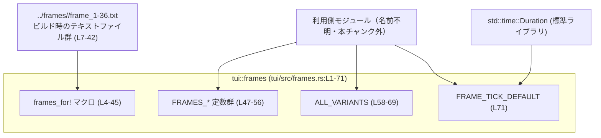
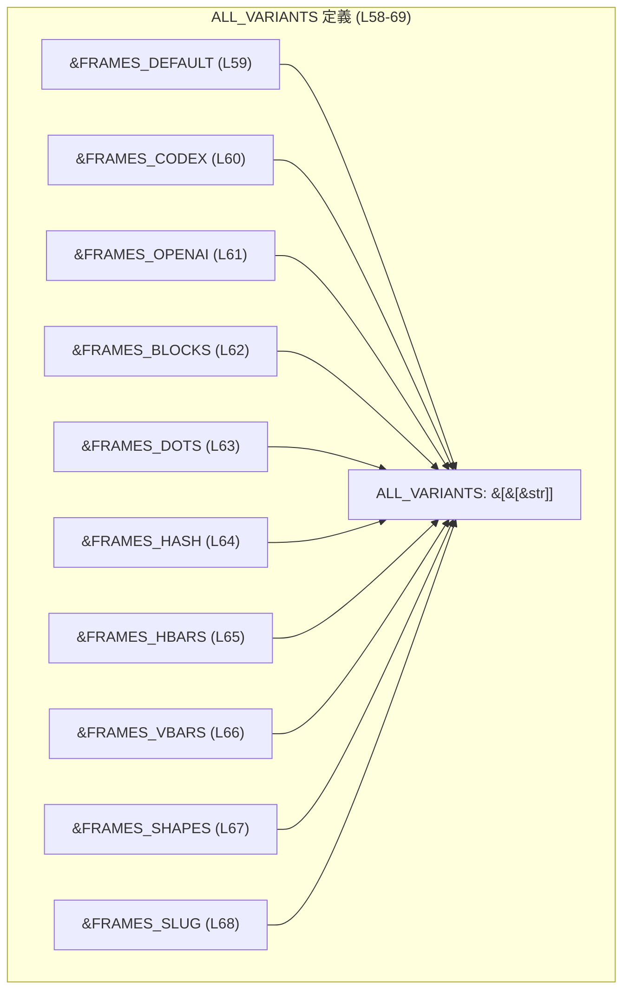
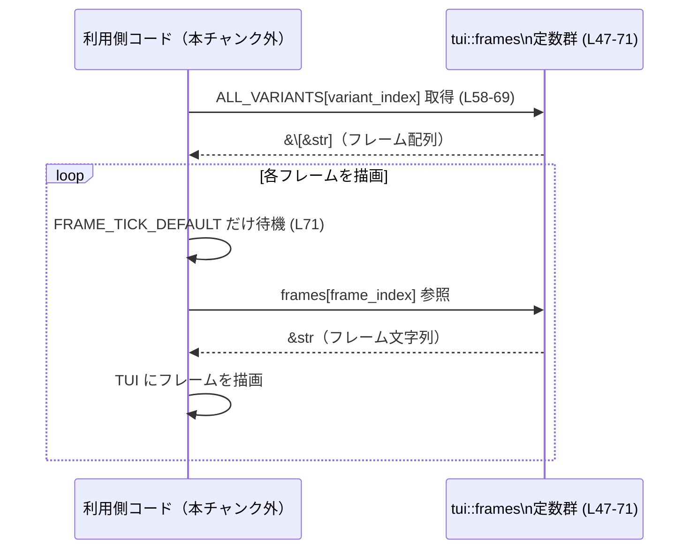

# tui/src/frames.rs

## 0. ざっくり一言

`frames.rs` は、TUI のアニメーション用フレーム（テキストファイル）をコンパイル時に埋め込み、各バリアントごとのフレーム配列と、それらの一覧、およびデフォルトのフレーム間隔を提供するモジュールです（`tui/src/frames.rs:L1-71`）。

---

## 1. このモジュールの役割

### 1.1 概要

- このモジュールは **テキストベースのアニメーションフレームをコンパイル時に埋め込む問題** を解決するために存在し、以下の機能を提供します（`tui/src/frames.rs:L3-71`）。
  - 任意のディレクトリから 36 枚のフレームを読み込むマクロ `frames_for!`。
  - `default` / `codex` / `openai` など複数のアニメーションバリアントごとのフレーム配列。
  - すべてのバリアントをまとめた `ALL_VARIANTS`。
  - フレーム更新のデフォルト間隔 `FRAME_TICK_DEFAULT`。

### 1.2 アーキテクチャ内での位置づけ

このモジュールは、TUI 側の「アニメーション描画ロジック」から参照される **リソース定義層** に相当します。標準ライブラリと静的テキストファイルに依存しますが、自身は他のクレート内コードに依存していません。



> 利用側モジュールの具体名や場所は、このチャンクには現れません（呼び出し関係は一般的な利用イメージです）。

### 1.3 設計上のポイント

- **コンパイル時埋め込み**  
  - `include_str!` マクロでフレームテキストを埋め込むことで、実行時にファイル I/O を行わずに済む設計になっています（`tui/src/frames.rs:L7-42`）。
- **固定長フレーム数**  
  - すべてのバリアントが `&str` の配列長 36 固定で定義されています（`tui/src/frames.rs:L47-56`）。
- **crate 内限定公開**  
  - すべて `pub(crate)` で公開されており、同一クレート内からのみ参照可能です（`tui/src/frames.rs:L47-71`）。
- **エラーハンドリング方針**  
  - このモジュール内に実行時エラー処理はありません。`include_str!` の失敗は **コンパイルエラー** になるため、実行時には「フレームが存在する」ことが保証されます（`tui/src/frames.rs:L7-42`）。
- **並行性**  
  - すべて `const` かつ `&'static str` のイミュータブルデータで構成されているため、複数スレッドから同時に参照しても競合は発生しません。

---

## 2. 主要な機能一覧

このモジュールが提供する主な機能の一覧です。

- `frames_for!` マクロ: 指定ディレクトリから 36 枚のフレームテキストを配列 `[&str; 36]` として埋め込む（`tui/src/frames.rs:L4-42`）。
- アニメーションバリアント定数:
  - `FRAMES_DEFAULT` / `FRAMES_CODEX` / `FRAMES_OPENAI` / `FRAMES_BLOCKS` / `FRAMES_DOTS` / `FRAMES_HASH` / `FRAMES_HBARS` / `FRAMES_VBARS` / `FRAMES_SHAPES` / `FRAMES_SLUG`（`tui/src/frames.rs:L47-56`）。
- `ALL_VARIANTS`: すべてのバリアント定数への参照をまとめたスライス `&[&[&str]]`（`tui/src/frames.rs:L58-69`）。
- `FRAME_TICK_DEFAULT`: フレーム更新間隔のデフォルト値として使われる `Duration`（`tui/src/frames.rs:L71`）。

---

## 3. 公開 API と詳細解説

### 3.1 コンポーネント（マクロ・定数）一覧

> 関数・構造体は定義されていないため、この表ではマクロと定数を「コンポーネント」として整理します。

| 名前 | 種別 | 型 / シグネチャ | 役割 / 用途 | 定義位置 |
|------|------|-----------------|-------------|----------|
| `frames_for!` | マクロ | `frames_for!($dir: literal) -> [&'static str; 36]`（展開結果） | 指定ディレクトリ配下の `frame_1.txt` 〜 `frame_36.txt` を `include_str!` で読み込み、36 要素の配列リテラルを生成する | `tui/src/frames.rs:L4-42` |
| `FRAMES_DEFAULT` | 定数 | `pub(crate) const FRAMES_DEFAULT: [&str; 36]` | `"default"` バリアントのフレーム列 | `tui/src/frames.rs:L47` |
| `FRAMES_CODEX` | 定数 | `pub(crate) const FRAMES_CODEX: [&str; 36]` | `"codex"` バリアントのフレーム列 | `tui/src/frames.rs:L48` |
| `FRAMES_OPENAI` | 定数 | `pub(crate) const FRAMES_OPENAI: [&str; 36]` | `"openai"` バリアントのフレーム列 | `tui/src/frames.rs:L49` |
| `FRAMES_BLOCKS` | 定数 | `pub(crate) const FRAMES_BLOCKS: [&str; 36]` | `"blocks"` バリアントのフレーム列 | `tui/src/frames.rs:L50` |
| `FRAMES_DOTS` | 定数 | `pub(crate) const FRAMES_DOTS: [&str; 36]` | `"dots"` バリアントのフレーム列 | `tui/src/frames.rs:L51` |
| `FRAMES_HASH` | 定数 | `pub(crate) const FRAMES_HASH: [&str; 36]` | `"hash"` バリアントのフレーム列 | `tui/src/frames.rs:L52` |
| `FRAMES_HBARS` | 定数 | `pub(crate) const FRAMES_HBARS: [&str; 36]` | `"hbars"` バリアントのフレーム列 | `tui/src/frames.rs:L53` |
| `FRAMES_VBARS` | 定数 | `pub(crate) const FRAMES_VBARS: [&str; 36]` | `"vbars"` バリアントのフレーム列 | `tui/src/frames.rs:L54` |
| `FRAMES_SHAPES` | 定数 | `pub(crate) const FRAMES_SHAPES: [&str; 36]` | `"shapes"` バリアントのフレーム列 | `tui/src/frames.rs:L55` |
| `FRAMES_SLUG` | 定数 | `pub(crate) const FRAMES_SLUG: [&str; 36]` | `"slug"` バリアントのフレーム列 | `tui/src/frames.rs:L56` |
| `ALL_VARIANTS` | 定数 | `pub(crate) const ALL_VARIANTS: &[&[&str]]` | すべてのバリアント配列への参照をまとめたスライス | `tui/src/frames.rs:L58-69` |
| `FRAME_TICK_DEFAULT` | 定数 | `pub(crate) const FRAME_TICK_DEFAULT: Duration` | フレーム更新のデフォルト間隔（80ms） | `tui/src/frames.rs:L71` |

### 3.2 関数詳細（マクロ・重要定数）

> このファイルには通常の関数はありませんが、インターフェースとして重要な **マクロ** と **定数** をテンプレートに沿って説明します。

#### `frames_for!($dir: literal) -> [&'static str; 36]`

**概要**

- 指定されたディレクトリ名（文字列リテラル）をもとに、`../frames/<dir>/frame_1.txt` 〜 `frame_36.txt` を `include_str!` で読み込み、36 要素の `&'static str` 配列リテラルを生成するマクロです（`tui/src/frames.rs:L4-42`）。
- 配列要素数は常に 36 に固定されています（`tui/src/frames.rs:L7-42`）。

**引数**

| 引数名 | 型 | 説明 |
|--------|----|------|
| `$dir` | `literal`（文字列リテラル） | フレームファイルを格納したディレクトリ名。例: `"default"`（`tui/src/frames.rs:L47`）。 |

**戻り値**

- 展開結果は `[&'static str; 36]` という配列リテラルです（型注釈は呼び出し側で指定されています。例: `FRAMES_DEFAULT: [&str; 36] = frames_for!("default");` `tui/src/frames.rs:L47`）。

**内部処理の流れ（マクロ展開イメージ）**

1. `$dir` に渡された文字列リテラルと `"../frames/"`、`"/frame_N.txt"` を `concat!` で結合し、ファイルパス文字列を生成します（`tui/src/frames.rs:L7-42`）。
2. 生成したパスを `include_str!` マクロに渡し、フレームテキストをコンパイル時に埋め込みます（`tui/src/frames.rs:L7-42`）。
3. 上記を `frame_1` 〜 `frame_36` まで繰り返し、36 要素の `&str` 配列リテラルとして返します（`tui/src/frames.rs:L7-42`）。

```mermaid
graph TD
    A["マクロ呼び出し\nframes_for!(\"default\") (L47)"] --> B["concat!(\"../frames/\", \"default\", \"/frame_1.txt\") など (L7-42)"]
    B --> C["include_str!(...) で文字列を埋め込み (L7-42)"]
    C --> D["[&str; 36] 配列リテラルにまとめる (L6-42)"]
```

**Examples（使用例）**

新しいアニメーションバリアント `spinner` を追加する例です（このコードは説明用であり、実際のファイル構成はこのチャンクからは分かりません）。

```rust
// 新しいバリアント "spinner" のフレームを定義する例
// frames.rs と同じモジュール内に追加する想定

// 36 フレーム分のテキストファイル:
//   tui/frames/spinner/frame_1.txt 〜 frame_36.txt
// が存在していることが前提です。

pub(crate) const FRAMES_SPINNER: [&str; 36] = frames_for!("spinner"); // "spinner" ディレクトリの36フレームを埋め込む

// 既存の ALL_VARIANTS にも追加する場合は、配列に FRAMES_SPINNER を追加します。
// （ALL_VARIANTS の定義を書き換える必要があります）
```

**Errors / Panics**

- `include_str!`:
  - 対象ファイルが存在しない、もしくはパスが誤っている場合、**コンパイルエラー** になります（`tui/src/frames.rs:L7-42`）。
  - 実行時にパニックすることはありません（読み込みはコンパイル時に完了します）。
- コンパイル時エラーの例:
  - `../frames/<dir>/frame_1.txt` 〜 `frame_36.txt` のいずれかが欠けている。
  - ディレクトリ名 `$dir` を誤字にするなどして、ディレクトリそのものが存在しない。

**Edge cases（エッジケース）**

- `$dir` が文字列リテラル以外（変数や式）の場合  
  → シンタックスエラー（マクロのパターン `$dir:literal` にマッチしない）。
- ファイル数が 36 枚未満 / 36 枚より多い場合  
  → マクロ側は固定で `frame_1.txt` 〜 `frame_36.txt` を参照するため、「不足」はコンパイルエラー、「余分」は単に読み込まれません。
- パスに対する OS 固有の問題（パスの大文字小文字、ファイルシステム）  
  → これもコンパイルエラーとして表面化します。このチャンクには OS ごとの挙動に関する記述はありません。

**使用上の注意点**

- `$dir` はコンパイル時に決まる固定ディレクトリでなければなりません（`literal` であるため）。動的にパスを変えることはできません。
- フレーム数を「36 枚以外」にしたい場合、このマクロの定義自体を変更する必要があります（`tui/src/frames.rs:L7-42`）。呼び出し側だけでは変えられません。
- ファイルパスは `tui/src/frames.rs` からの相対パス `../frames/` を基準としているため、プロジェクトのディレクトリ構成を変更する際はこことの整合性に注意が必要です。

---

#### `ALL_VARIANTS: &[&[&str]]`

**概要**

- 定義済みのすべてのフレーム配列定数（`FRAMES_DEFAULT` 〜 `FRAMES_SLUG`）への参照をまとめたスライスです（`tui/src/frames.rs:L58-69`）。
- 利用側はインデックスでバリアントを選択できます。

**引数**

- 定数のため引数はありません。

**戻り値**

- 型: `&'static [&'static [&'static str]]`（シンタックス上は `&[&[&str]]`）。
- 意味:
  - 第一階層: バリアントのリスト（`ALL_VARIANTS[variant_index]`）。
  - 第二階層: 1 バリアント内のフレーム列（`ALL_VARIANTS[variant_index][frame_index]`）。

**内部処理の流れ**

1. 事前に定義された各バリアント定数（`FRAMES_DEFAULT` 〜 `FRAMES_SLUG`）への参照を配列リテラル `&[ ... ]` に列挙します（`tui/src/frames.rs:L58-68`）。
2. その配列リテラルへの参照が `ALL_VARIANTS` の値になります（`tui/src/frames.rs:L58`）。



**Examples（使用例）**

```rust
// 同一クレート内の別モジュールから利用する例
// 実際のパス（crate::tui::frames か crate::frames かなど）は、このチャンクからは分かりません。
// ここでは frames モジュールとして仮定しています。

use std::thread;                           // スリープのために thread をインポート
use crate::frames::{ALL_VARIANTS, FRAME_TICK_DEFAULT}; // フレーム配列とデフォルト間隔をインポート（パスは一例）

pub fn run_default_spinner() {             // デフォルトバリアントのスピナーを表示する関数
    let frames = ALL_VARIANTS[0];          // 0番目のバリアントを選択（FRAMES_DEFAULT を指すと想定）
    let mut i = 0usize;                    // フレームインデックス
    loop {                                 // 無限ループでアニメーション
        let frame = frames[i % frames.len()]; // 周期的にフレームを取得（範囲内に収める）
        println!("{frame}");               // フレームを標準出力に描画
        thread::sleep(FRAME_TICK_DEFAULT); // デフォルト間隔だけ待機
        i += 1;                            // 次のフレームへ
    }
}
```

> 上記の `ALL_VARIANTS[0]` がどのバリアントに対応するかは、`ALL_VARIANTS` の定義順に依存します（`tui/src/frames.rs:L59-68`）。この順序は契約の一部として扱われます。

**Errors / Panics**

- `ALL_VARIANTS` 自体はコンパイル時に初期化される単なるスライスであり、定義に起因する実行時エラーはありません。
- ただし、**利用側でのインデックスアクセス** によってランタイムパニックが発生しうります（一般的な Rust のスライスアクセス挙動に基づく説明です）。
  - `ALL_VARIANTS[idx]` で `idx >= ALL_VARIANTS.len()` の場合 → パニック。
  - `frames[frame_idx]` で `frame_idx >= frames.len()` の場合 → パニック。

**Edge cases（エッジケース）**

- `ALL_VARIANTS` に新しいバリアントを追加し忘れる場合  
  → 定数定義自体はコンパイルされますが、利用側で「存在しないバリアントインデックス」を選ばないように設計する必要があります。
- バリアントの順序変更  
  → `ALL_VARIANTS` の定義順が変わることで、既存コードで使用しているインデックスの意味が変わる可能性があります。

**使用上の注意点**

- インデックスアクセスには境界チェックが必要です。ユーザー入力や設定ファイルの値をそのままインデックスとして使うと、パニックの原因になります。
- 「どのインデックスがどのバリアントか」を利用側のコードや設定に埋め込む場合、`ALL_VARIANTS` の定義順と合わせて管理する必要があります。

---

### 3.3 その他の定数（一覧）

| 名前 | 種別 | 役割（1 行） | 定義位置 |
|------|------|--------------|----------|
| `FRAMES_DEFAULT` | 定数 `[&str; 36]` | `"default"` ディレクトリの 36 フレーム配列 | `tui/src/frames.rs:L47` |
| `FRAMES_CODEX` | 定数 `[&str; 36]` | `"codex"` ディレクトリの 36 フレーム配列 | `tui/src/frames.rs:L48` |
| `FRAMES_OPENAI` | 定数 `[&str; 36]` | `"openai"` ディレクトリの 36 フレーム配列 | `tui/src/frames.rs:L49` |
| `FRAMES_BLOCKS` | 定数 `[&str; 36]` | `"blocks"` ディレクトリの 36 フレーム配列 | `tui/src/frames.rs:L50` |
| `FRAMES_DOTS` | 定数 `[&str; 36]` | `"dots"` ディレクトリの 36 フレーム配列 | `tui/src/frames.rs:L51` |
| `FRAMES_HASH` | 定数 `[&str; 36]` | `"hash"` ディレクトリの 36 フレーム配列 | `tui/src/frames.rs:L52` |
| `FRAMES_HBARS` | 定数 `[&str; 36]` | `"hbars"` ディレクトリの 36 フレーム配列 | `tui/src/frames.rs:L53` |
| `FRAMES_VBARS` | 定数 `[&str; 36]` | `"vbars"` ディレクトリの 36 フレーム配列 | `tui/src/frames.rs:L54` |
| `FRAMES_SHAPES` | 定数 `[&str; 36]` | `"shapes"` ディレクトリの 36 フレーム配列 | `tui/src/frames.rs:L55` |
| `FRAMES_SLUG` | 定数 `[&str; 36]` | `"slug"` ディレクトリの 36 フレーム配列 | `tui/src/frames.rs:L56` |
| `FRAME_TICK_DEFAULT` | 定数 `Duration` | フレーム更新間隔のデフォルト値（80ms） | `tui/src/frames.rs:L71` |

---

## 4. データフロー

このファイル単体では処理フローを持つ関数はありませんが、**典型的な利用イメージ** として、「利用側コードがアニメーションを描画する」場合のデータフローを示します。  
※この図は一般的な利用像であり、実際に同一のコードが存在するかはこのチャンクからは分かりません。



要点:

- このモジュールは「データ（文字列）を提供するだけ」であり、描画や時間管理のロジックは他のモジュールに委ねられます。
- 時間間隔は `FRAME_TICK_DEFAULT` を用いて `thread::sleep` や非同期タイマーなどから利用されることが想定されますが、その実装はこのチャンクには現れません。

---

## 5. 使い方（How to Use）

### 5.1 基本的な使用方法

同一クレート内の他モジュールから、デフォルトバリアントのスピナーをシンプルに描画する例です。

```rust
// 同一クレート内で frames モジュールが公開されていると仮定した使用例です。
// 実際のモジュールパスは、このチャンクからは分かりません。

use std::thread;                                     // スリープに利用
use crate::frames::{FRAMES_DEFAULT, FRAME_TICK_DEFAULT}; // デフォルトフレームとデフォルト間隔をインポート

pub fn run_simple_spinner() {                        // シンプルなスピナー関数
    let frames = &FRAMES_DEFAULT;                    // デフォルトバリアントのフレーム配列を取得
    let mut i = 0usize;                              // フレームインデックス
    loop {                                           // 無限ループでスピナーを回す
        let frame = frames[i % frames.len()];        // 配列長で割った余りでインデックスを周期的に計算
        println!("{frame}");                         // 現在のフレームを出力（実際の TUI では別 API で描画）
        thread::sleep(FRAME_TICK_DEFAULT);           // デフォルトの 80ms 待機
        i += 1;                                      // 次のフレームへ
    }
}
```

### 5.2 よくある使用パターン

1. **バリアントをインデックスで選択する**

```rust
// variant_index に応じてバリアントを選択するパターン
use crate::frames::{ALL_VARIANTS, FRAME_TICK_DEFAULT};

fn run_spinner_with_variant(variant_index: usize) {
    if variant_index >= ALL_VARIANTS.len() {         // インデックスの範囲チェック
        eprintln!("未知のバリアント番号: {}", variant_index); // 不正な場合の簡易エラーハンドリング
        return;                                      // スピナーは起動しない
    }

    let frames = ALL_VARIANTS[variant_index];        // 選択したバリアントのフレーム配列
    // あとは 5.1 の例と同様に frames をループして描画する
}
```

1. **バリアントを名前（定数）で固定する**

```rust
// 「特定のバリアントを固定で使う」パターン
use crate::frames::{FRAMES_BLOCKS, FRAME_TICK_DEFAULT};

fn run_blocks_spinner_once() {
    for frame in FRAMES_BLOCKS.iter() {              // フレーム配列を順にたどる
        println!("{frame}");                         // 各フレームを描画
        std::thread::sleep(FRAME_TICK_DEFAULT);      // デフォルト間隔だけ待機
    }
}
```

### 5.3 よくある間違い

```rust
// 間違い例: インデックス範囲チェックをしていない
fn bad(variant_index: usize) {
    let frames = crate::frames::ALL_VARIANTS[variant_index]; // variant_index が範囲外だとランタイムパニック
}

// 正しい例: 範囲チェックを行う
fn good(variant_index: usize) {
    let all = crate::frames::ALL_VARIANTS;          // すべてのバリアント一覧を取得
    if let Some(frames) = all.get(variant_index) {  // get を使って Option で取得
        // frames を使って安全にアニメーションを描画できる
    } else {
        // 不正なインデックスに対するフォールバック処理を書く
    }
}
```

**ポイント**

- スライスや配列を `[]` でインデックスアクセスすると、範囲外はパニックになります。
- `get` メソッドを使うと `Option` で安全に扱えるため、ユーザー入力を扱う場合は特に有用です。

### 5.4 使用上の注意点（まとめ）

- **前提条件**
  - `tui/frames/<variant>/frame_1.txt` 〜 `frame_36.txt` がビルド時に存在している必要があります（`tui/src/frames.rs:L7-42`）。
- **バグ・セキュリティ観点**
  - このモジュールは外部入力を扱っておらず、すべてコンパイル時に決まった文字列だけを提供します。
  - ランタイムで任意のパスを開くことはないため、ファイルパスインジェクション等のリスクはこのファイル範囲ではありません。
- **並行性**
  - すべてが `const` かつ `&'static str` であり、ミュータブルなグローバル状態を持ちません。複数スレッドから同時に参照しても安全です。
- **パフォーマンス**
  - フレームはバイナリに埋め込まれるため、実行時 I/O はありませんが、その分バイナリサイズはフレームの総文字数に比例して増加します。
  - フレーム配列の走査は単純なインデックスアクセスであり、オーバーヘッドは小さいです。

---

## 6. 変更の仕方（How to Modify）

### 6.1 新しい機能を追加する場合（新バリアントの追加）

1. **フレームファイルの追加**

   - `tui/frames/<new_name>/frame_1.txt` 〜 `frame_36.txt` を作成します。  
     （パスは `../frames/` を起点とするため、`frames.rs` から見た相対パスと整合する必要があります `tui/src/frames.rs:L7-42`）

2. **定数の追加**

   - `frames.rs` に新しいバリアント定数を追加します。

   ```rust
   // 例: "spinner" バリアントを追加
   pub(crate) const FRAMES_SPINNER: [&str; 36] = frames_for!("spinner"); // L47-56 と同じパターンで追加
   ```

3. **ALL_VARIANTS への登録**

   - `ALL_VARIANTS` の配列に `&FRAMES_SPINNER` を追加します（`tui/src/frames.rs:L58-69`）。

   ```rust
   pub(crate) const ALL_VARIANTS: &[&[&str]] = &[
       &FRAMES_DEFAULT,
       // ... 既存のバリアント
       &FRAMES_SLUG,
       &FRAMES_SPINNER, // 新しいバリアントを最後に追加する例
   ];
   ```

4. **利用側からの参照**

   - バリアントをインデックスで選ぶコードがある場合、**どのインデックスが新バリアントになるか** を決めて、必要に応じて利用側のロジックや設定値の説明を更新します。

### 6.2 既存の機能を変更する場合

- **フレーム数を変更したい場合**
  - 現状は 1〜36 の固定です（`tui/src/frames.rs:L7-42`）。フレーム数を増減したい場合は:
    - `frames_for!` マクロ内の `include_str!` 行数を変更。
    - すべての `FRAMES_*` 定数の型（配列長）を変更。
    - `ALL_VARIANTS` の型 `&[&[&str; N]]` に合わせた変更（現状は `&[&[&str]]` のため、呼び出し側は `len()` ベースで書いておくと変更に強くなります）。
- **フレーム間隔（速度）を変更したい場合**
  - `FRAME_TICK_DEFAULT` の値（`Duration::from_millis(80)`）を変更します（`tui/src/frames.rs:L71`）。
  - 利用側で他の値を使っている箇所がないか確認します（このチャンクには利用コードは現れません）。
- **バリアントの順序を変更したい場合**
  - `ALL_VARIANTS` の並び順を変えると、インデックスに紐づく意味が変わります（`tui/src/frames.rs:L59-68`）。
  - インデックスベースでバリアントを選んでいるコードや設定がある場合は、影響範囲を確認する必要があります。

---

## 7. 関連ファイル

このモジュールと密接に関係するリソース・ファイル（コード以外も含む）の一覧です。

| パス | 役割 / 関係 |
|------|------------|
| `tui/frames/default/frame_1.txt` 〜 `frame_36.txt` | `FRAMES_DEFAULT` に対応するフレームファイル群（`frames_for!("default")` から参照、`tui/src/frames.rs:L7-42,L47`）。 |
| `tui/frames/codex/frame_1.txt` 〜 `frame_36.txt` | `FRAMES_CODEX` 用フレームファイル群（`tui/src/frames.rs:L7-42,L48`）。 |
| `tui/frames/openai/frame_1.txt` 〜 `frame_36.txt` | `FRAMES_OPENAI` 用フレームファイル群（`tui/src/frames.rs:L7-42,L49`）。 |
| `tui/frames/blocks/frame_1.txt` 〜 `frame_36.txt` | `FRAMES_BLOCKS` 用フレームファイル群（`tui/src/frames.rs:L7-42,L50`）。 |
| `tui/frames/dots/frame_1.txt` 〜 `frame_36.txt` | `FRAMES_DOTS` 用フレームファイル群（`tui/src/frames.rs:L7-42,L51`）。 |
| `tui/frames/hash/frame_1.txt` 〜 `frame_36.txt` | `FRAMES_HASH` 用フレームファイル群（`tui/src/frames.rs:L7-42,L52`）。 |
| `tui/frames/hbars/frame_1.txt` 〜 `frame_36.txt` | `FRAMES_HBARS` 用フレームファイル群（`tui/src/frames.rs:L7-42,L53`）。 |
| `tui/frames/vbars/frame_1.txt` 〜 `frame_36.txt` | `FRAMES_VBARS` 用フレームファイル群（`tui/src/frames.rs:L7-42,L54`）。 |
| `tui/frames/shapes/frame_1.txt` 〜 `frame_36.txt` | `FRAMES_SHAPES` 用フレームファイル群（`tui/src/frames.rs:L7-42,L55`）。 |
| `tui/frames/slug/frame_1.txt` 〜 `frame_36.txt` | `FRAMES_SLUG` 用フレームファイル群（`tui/src/frames.rs:L7-42,L56`）。 |
| `tui/src/lib.rs` や `tui/src/main.rs` など | このモジュールを `mod frames;` として宣言し、`pub(crate)` な定数群を利用している可能性がありますが、このチャンクには具体的な記述はありません。 |

テストコード（`tests/` や `*_test.rs`）との関係は、このチャンクには現れないため不明です。
