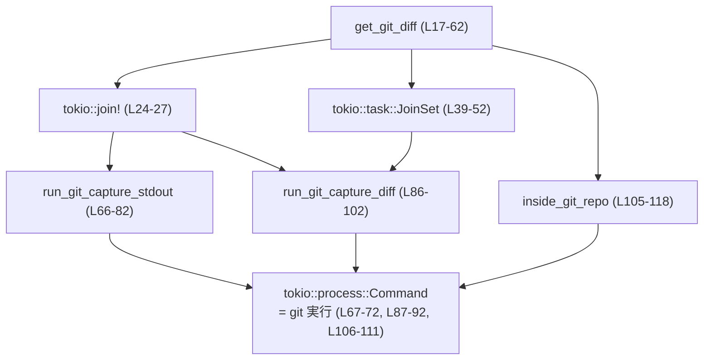
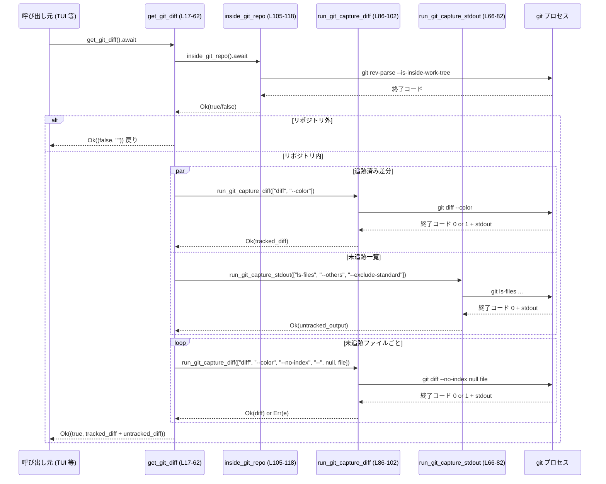

# tui/src/get_git_diff.rs

## 0. ざっくり一言

ワーキングディレクトリに対して、現在の Git 差分（追跡済み変更と未追跡ファイルの差分）を非同期で取得するユーティリティモジュールです（get_git_diff.rs:L1-6, L17-62）。

---

## 1. このモジュールの役割

### 1.1 概要

- このモジュールは、**カレントディレクトリ配下の Git 差分を 1 本の文字列として取得する**ために存在します（get_git_diff.rs:L1-6, L17-62）。
- Git リポジトリ内かどうかを判定し、リポジトリ外であれば「リポジトリ外」というフラグと空文字列を返します（get_git_diff.rs:L17-21）。
- 追跡済みファイルの差分（`git diff --color`）と、未追跡ファイルごとの差分（`git diff --no-index /dev/null <file>`）を組み合わせて 1 つの差分文字列にします（get_git_diff.rs:L23-51, L61）。

### 1.2 アーキテクチャ内での位置づけ

このファイル内の関数と、外部コンポーネント（Tokio・`git` コマンド）の依存関係は次のようになっています。



- `get_git_diff` が公開 API（crate 内公開）であり、他の 3 関数は内部ヘルパーです（get_git_diff.rs:L17, L66, L86, L105）。
- すべての Git 操作は `tokio::process::Command` を介した外部プロセス呼び出しです（get_git_diff.rs:L67-72, L87-92, L106-111）。
- 非同期ランタイムとして Tokio を前提としており、`tokio::join!` と `tokio::task::JoinSet` を利用した並行実行を行います（get_git_diff.rs:L24-27, L39-52）。

### 1.3 設計上のポイント

- **非同期・並行実行**
  - リポジトリ内であれば、追跡済み差分取得と未追跡ファイル列挙を `tokio::join!` で並行実行します（get_git_diff.rs:L23-29）。
  - 未追跡ファイルそれぞれの差分取得は、`JoinSet` による多数タスクの並列実行で行われます（get_git_diff.rs:L39-52）。
- **エラーハンドリング方針**
  - Git コマンドの非ゼロ終了コードは原則エラー扱いですが、`git diff` が差分ありで返す終了コード 1 は成功扱いにしています（get_git_diff.rs:L84-85, L94-95）。
  - `git` が見つからない場合など OS レベルの `NotFound` は、場所によっては「リポジトリ外」や「そのファイルの差分は無視」として扱います（get_git_diff.rs:L55-56, L116）。
- **安全性**
  - `unsafe` は一切使用しておらず、外部コマンド実行も `Command::args` を使っておりシェルを経由しないため、引数にファイル名を渡してもシェルインジェクションにはなりません（get_git_diff.rs:L67-71, L87-91, L48-49）。
- **API 契約**
  - 戻り値の `bool` は「Git リポジトリ内かどうか」のフラグであり、`false` の場合 `String` は常に空文字列になる、という契約になっています（get_git_diff.rs:L17-21）。

---

## 2. 主要な機能一覧

- `get_git_diff`: カレントディレクトリの Git 差分（追跡済み＋未追跡）を取得し、リポジトリ内フラグとともに返す（get_git_diff.rs:L17-62）。
- `run_git_capture_stdout`: 任意の Git コマンドを実行し、`stdout` を UTF-8 文字列として取得する。非ゼロ終了コードはエラー（get_git_diff.rs:L64-82）。
- `run_git_capture_diff`: 差分系の Git コマンドを実行し、終了コード 0 または 1 を成功とみなして `stdout` を返す（get_git_diff.rs:L84-102）。
- `inside_git_repo`: カレントディレクトリが Git リポジトリ内かどうかを判定する（get_git_diff.rs:L104-118）。

### 2.1 コンポーネントインベントリー

#### 関数一覧

| 名前 | 可視性 | 種別 | 役割 / 用途 | 行範囲 |
|------|--------|------|-------------|--------|
| `get_git_diff` | `pub(crate)` | `async fn` | Git リポジトリ内判定と差分の統合取得 | get_git_diff.rs:L17-62 |
| `run_git_capture_stdout` | `async fn` | ヘルパー | 任意 Git コマンドの `stdout` を取得（非ゼロ終了コードはエラー） | get_git_diff.rs:L66-82 |
| `run_git_capture_diff` | `async fn` | ヘルパー | 差分系 Git コマンドの `stdout` 取得（終了コード 1 も成功扱い） | get_git_diff.rs:L86-102 |
| `inside_git_repo` | `async fn` | ヘルパー | `git rev-parse` により Git リポジトリ内か判定 | get_git_diff.rs:L105-118 |

#### 外部依存コンポーネント

| コンポーネント | 用途 | 行範囲 |
|----------------|------|--------|
| `tokio::process::Command` | `git` プロセスの起動と I/O 取得 | get_git_diff.rs:L67-72, L87-92, L106-111 |
| `tokio::join!` | 2 つの非同期処理（diff と ls-files）を並行実行 | get_git_diff.rs:L24-27 |
| `tokio::task::JoinSet` | 未追跡ファイルごとの `git diff` を多数並列実行 | get_git_diff.rs:L39-52 |
| `std::io` | `io::Result`, `io::ErrorKind` によるエラー表現 | get_git_diff.rs:L8, L54-56, L116 |
| `std::path::Path` | `/dev/null` や `NUL` などのパス表現 | get_git_diff.rs:L9, L32-38 |
| `std::process::Stdio` | 子プロセスの標準入出力設定 | get_git_diff.rs:L10, L69-70, L89-90, L108-109 |

---

## 3. 公開 API と詳細解説

### 3.1 型一覧（構造体・列挙体など）

このファイル内で新たに定義される構造体・列挙体はありません。

主な「公開」インターフェースは関数 `get_git_diff` の戻り値 `io::Result<(bool, String)>` です（get_git_diff.rs:L17）。

| 名前 | 種別 | 役割 / 用途 |
|------|------|-------------|
| `(bool, String)` | タプル | `bool`: Git リポジトリ内かどうか / `String`: 差分文字列 |

---

### 3.2 関数詳細

#### `get_git_diff() -> io::Result<(bool, String)>`

**概要**

- カレントディレクトリが Git リポジトリ内かどうかを判定し、リポジトリ内であれば追跡済みの差分と未追跡ファイルの差分を連結して返します（get_git_diff.rs:L17-21, L23-61）。
- リポジトリ外の場合は `Ok((false, String::new()))` を返します（get_git_diff.rs:L19-20）。

**引数**

なし（カレントディレクトリと実行環境の Git に依存）。

**戻り値**

- `Ok((in_repo, diff))`:
  - `in_repo: bool` – カレントディレクトリが Git リポジトリ内なら `true`（get_git_diff.rs:L17-21）。
  - `diff: String` – 追跡済み・未追跡ファイルの差分を連結した文字列。リポジトリ外 (`in_repo == false`) の場合は空文字列（get_git_diff.rs:L19-21, L61）。
- `Err(e)`:
  - Git コマンド実行やプロセス起動が失敗した際の `io::Error`（get_git_diff.rs:L24-29, L52-57）。

**内部処理の流れ（アルゴリズム）**

1. `inside_git_repo().await?` を呼び出し、Git リポジトリ内かどうか判定する（get_git_diff.rs:L18-19）。
2. リポジトリ外であれば `Ok((false, String::new()))` を即座に返す（get_git_diff.rs:L19-20）。
3. リポジトリ内であれば、`tokio::join!` で次の 2 つを並行に実行する（get_git_diff.rs:L23-27）。
   - `run_git_capture_diff(&["diff", "--color"])` – 追跡済みファイルの差分取得。
   - `run_git_capture_stdout(&["ls-files", "--others", "--exclude-standard"])` – 未追跡ファイルの一覧取得。
4. 上記 2 つの結果を `?` でアンラップし、それぞれ `tracked_diff` と `untracked_output` に格納する（get_git_diff.rs:L28-29）。
5. OS に応じてヌルデバイス（`/dev/null` または `NUL`）のパス文字列 `null_path` を作成する（get_git_diff.rs:L31-38）。
6. `untracked_output` を改行で分割し、空行を除外して、各ファイルごとに次の処理を `JoinSet` にタスクとして登録する（get_git_diff.rs:L39-51）。
   - `git diff --color --no-index -- <null_path> <file>` を実行し、その `stdout` を取得（get_git_diff.rs:L47-49）。
7. `join_set.join_next().await` でタスクが完了するたびに結果を受け取り、次のように処理する（get_git_diff.rs:L52-58）。
   - `Ok(Ok(diff))` の場合、`untracked_diff` に差分文字列を追記。
   - `Ok(Err(err))` かつ `err.kind() == io::ErrorKind::NotFound` の場合、そのファイルの差分は無視。
   - それ以外の `Ok(Err(err))` はエラーとして呼び出し元へ返す（`return Err(err)`）。
   - `Err(_)`（タスクの Join エラー）は無視。
8. 最後に追跡済み差分と未追跡差分を結合し、`Ok((true, format!("{tracked_diff}{untracked_diff}")))` を返す（get_git_diff.rs:L61）。

**Examples（使用例）**

以下の例では `get_git_diff` が同一モジュール内で参照可能であり、Tokio ランタイム上で実行されることを前提とします。

```rust
use std::io;                                           // io::Result のためにインポート
// get_git_diff は同じモジュール / クレート内にあると仮定する

#[tokio::main]                                         // Tokio ランタイムを起動するマクロ
async fn main() -> io::Result<()> {                    // main も async 関数にする
    let (in_repo, diff) = get_git_diff().await?;       // Git 差分を非同期で取得

    if !in_repo {                                      // Git リポジトリ外だった場合
        println!("Not inside a Git repository.");      // その旨を表示
        return Ok(());                                 // 終了
    }

    if diff.is_empty() {                               // 差分文字列が空か確認
        println!("No changes detected.");              // 変更なしの場合のメッセージ
    } else {
        println!("{}", diff);                          // 差分をそのまま表示（カラー付き）
    }

    Ok(())                                             // 正常終了
}
```

**Errors / Panics**

- `Err(io::Error)` が返る可能性のある主なケース:
  - `inside_git_repo` 内で `git` プロセス起動時に EACCES など `NotFound` 以外の OS エラーが発生した場合（get_git_diff.rs:L113-118）。
  - `run_git_capture_diff` や `run_git_capture_stdout` 内で、`git` プロセス起動エラーまたは終了コードが期待値以外だった場合（get_git_diff.rs:L72, L77-81, L92, L97-101）。
  - 未追跡ファイルの差分取得タスクで、`NotFound` 以外の `io::Error` が返った場合（get_git_diff.rs:L56）。
- パニックの可能性:
  - `null_device.to_str().unwrap_or("/dev/null")` では `unwrap_or` を使っているため、`to_str()` が `None` の場合でもパニックにはなりません（get_git_diff.rs:L38）。このため、この関数内には明示的な `panic!` 相当の処理はありません。

**Edge cases（エッジケース）**

- Git リポジトリ外:
  - `inside_git_repo` が `Ok(false)` を返した場合、`get_git_diff` は `Ok((false, String::new()))` を返します（get_git_diff.rs:L19-20）。
- Git がインストールされていない:
  - `inside_git_repo` 内では `NotFound` を `Ok(false)` として扱うため、リポジトリ外と同様の結果になります（get_git_diff.rs:L116）。
  - ただし、リポジトリ内判定前に他の Git コマンドを呼ばない設計なので、`get_git_diff` 全体としては `Ok((false, String::new()))` が返る想定です。
- 未追跡ファイルが存在しない:
  - `untracked_output` が空文字列や空行のみの場合、ループが 1 回も回らず `untracked_diff` は空のままです（get_git_diff.rs:L39-45）。
- 未追跡ファイルが非常に多い:
  - ファイル数分のタスクが `JoinSet` に追加されるため、同時に多数の `git diff` プロセスが起動される可能性があります（get_git_diff.rs:L39-52）。
- 個々の未追跡ファイルの差分取得で `io::ErrorKind::NotFound`:
  - そのファイルの差分はスキップされ、他のファイルの処理は継続します（get_git_diff.rs:L55-56）。

**使用上の注意点**

- **非同期ランタイム前提**:
  - `async fn` であり、Tokio ランタイム上で `.await` する必要があります（get_git_diff.rs:L17, L24-27, L39-52）。
- **環境前提**:
  - 実行環境の `PATH` 上に `git` コマンドが存在していることが前提です。存在しない場合はリポジトリ外とみなされるか、`io::Error` が返ります（get_git_diff.rs:L106-111, L116）。
- **パフォーマンス**:
  - 未追跡ファイルが非常に多い場合、`JoinSet` による多数の並列 `git diff` 実行は CPU・I/O に負荷をかける可能性があります（get_git_diff.rs:L39-52）。
- **差分フォーマット**:
  - `--color` オプションを付けているため、戻り値の `diff` 文字列には ANSI カラーコードが含まれます（get_git_diff.rs:L25, L48）。

---

#### `run_git_capture_stdout(args: &[&str]) -> io::Result<String>`

**概要**

- `git <args...>` を実行し、標準出力を UTF-8 文字列として返します（get_git_diff.rs:L64-76）。
- 終了コードが 0 以外の場合はエラーとして `io::Error` を返します（get_git_diff.rs:L74-81）。

**引数**

| 引数名 | 型 | 説明 |
|--------|----|------|
| `args` | `&[&str]` | `git` コマンドに渡す引数リスト（例: `["ls-files", "--others"]`） |

**戻り値**

- `Ok(stdout)` – 標準出力を UTF-8（非 ASCII バイトは `from_utf8_lossy` により代替文字を含む可能性あり）の `String` として返します（get_git_diff.rs:L75）。
- `Err(e)` – プロセス起動エラー、または終了コード非ゼロを `io::ErrorKind::Other` でラップしたエラー（get_git_diff.rs:L72, L77-81）。

**内部処理の流れ**

1. `Command::new("git")` に `args` を設定し、`stdout` はパイプ、`stderr` は捨てるよう構成する（get_git_diff.rs:L67-70）。
2. `.output().await?` でプロセスを待ち、`Output` 構造体を取得する（get_git_diff.rs:L71-72）。
3. `output.status.success()` が `true` なら `stdout` を `String::from_utf8_lossy` で文字列化して返す（get_git_diff.rs:L74-75）。
4. それ以外の場合は、エラーメッセージを含む `io::Error::other` を返す（get_git_diff.rs:L77-81）。

**Examples**

```rust
use std::io;

// async コンテキスト内で実行する例
async fn list_untracked_files() -> io::Result<()> {
    // `git ls-files --others --exclude-standard` を実行
    let output = run_git_capture_stdout(&["ls-files", "--others", "--exclude-standard"]).await?;
    // 結果をそのまま表示（1 行 1 ファイル）
    println!("{}", output);
    Ok(())
}
```

**Errors / Panics**

- プロセス起動に失敗した場合、`output().await?` によって OS レベルの `io::Error` がそのまま伝播します（get_git_diff.rs:L71-72）。
- `git` が終了コード 0 以外で終了した場合、`io::ErrorKind::Other` の `io::Error` が返ります（get_git_diff.rs:L77-81）。
- パニックは使用しておらず、`unwrap` などもありません。

**Edge cases**

- `stdout` が UTF-8 でない場合は、`String::from_utf8_lossy` により不正バイトが置換文字に変換されます（get_git_diff.rs:L75）。
- `stderr` は常に破棄されるため、Git のエラーメッセージは呼び出し元から直接見えません（get_git_diff.rs:L70）。

**使用上の注意点**

- `args` はシェルを通さずそのまま `git` に渡されるため、空文字列などを渡してもシェル解釈は発生しませんが、Git 側のバリデーションに依存します（get_git_diff.rs:L67-69）。
- 終了コードの意味は引数のコマンド内容に依存するため、「成功でも 1 を返すコマンド」（例: `git diff`）にはこの関数は適しません。その場合は `run_git_capture_diff` を使います（get_git_diff.rs:L84-85）。

---

#### `run_git_capture_diff(args: &[&str]) -> io::Result<String>`

**概要**

- 差分取得用の Git コマンドを実行し、標準出力を文字列として返します（get_git_diff.rs:L84-96）。
- Git の仕様に従い、終了コード 1（差分が存在する場合）も成功扱いにします（get_git_diff.rs:L84-85, L94-95）。

**引数**

| 引数名 | 型 | 説明 |
|--------|----|------|
| `args` | `&[&str]` | 差分系 Git コマンドの引数（例: `["diff", "--color"]`） |

**戻り値**

- `Ok(stdout)` – 終了コードが 0 または 1 の場合、`stdout` を UTF-8 文字列として返します（get_git_diff.rs:L94-95）。
- `Err(e)` – それ以外の終了コード、またはプロセス起動エラー（get_git_diff.rs:L92, L97-101）。

**内部処理の流れ**

1. `Command::new("git")` で `git <args...>` を起動し、`stdout` をパイプ、`stderr` を捨てる（get_git_diff.rs:L87-90）。
2. `.output().await?` でプロセス完了を待つ（get_git_diff.rs:L91-92）。
3. `output.status.success()` または `output.status.code() == Some(1)` の場合は成功とみなし、`stdout` を `String::from_utf8_lossy` で返す（get_git_diff.rs:L94-95）。
4. その他の終了コードの場合はエラーメッセージを持つ `io::Error::other` を返す（get_git_diff.rs:L97-101）。

**Examples**

```rust
use std::io;

// async コンテキスト内で差分を取得する例
async fn show_tracked_diff() -> io::Result<()> {
    // 追跡済みファイルの差分をカラー付きで取得
    let diff = run_git_capture_diff(&["diff", "--color"]).await?;
    println!("{}", diff); // 差分を表示
    Ok(())
}
```

**Errors / Panics**

- プロセス起動エラーはそのまま `io::Error` として返されます（get_git_diff.rs:L91-92）。
- 終了コードが 0 または 1 以外（例: オプションエラー、致命的エラー）は `io::ErrorKind::Other` の `io::Error` になります（get_git_diff.rs:L97-101）。
- パニックはありません。

**Edge cases**

- 差分が存在しない場合:
  - Git は通常終了コード 0 を返し、`stdout` が空かヘッダのみになります。
- 差分が存在する場合:
  - Git は終了コード 1 を返しますが、この関数では成功扱いとして `stdout` を返します（get_git_diff.rs:L94-95）。
- 非 UTF-8 出力:
  - `String::from_utf8_lossy` により不正バイトは置換されます（get_git_diff.rs:L95）。

**使用上の注意点**

- 差分系以外のコマンド（`git status` など）の実行にも使えますが、終了コード 1 を成功とみなす仕様が適切かどうかはコマンドによります。
- `stderr` が破棄されるため、Git のエラーメッセージはログ等には残りません（get_git_diff.rs:L90）。

---

#### `inside_git_repo() -> io::Result<bool>`

**概要**

- 現在のディレクトリが Git リポジトリ内かどうかを判定します（get_git_diff.rs:L104-118）。
- `git rev-parse --is-inside-work-tree` の終了コードに基づきブール値を返します。

**引数**

なし。

**戻り値**

- `Ok(true)` – `git rev-parse --is-inside-work-tree` が正常終了した場合（get_git_diff.rs:L113-114）。
- `Ok(false)` – `git rev-parse` が非ゼロ終了コード、または `git` が見つからなかった場合（get_git_diff.rs:L115-116）。
- `Err(e)` – 上記以外の OS レベルのエラーが発生した場合（get_git_diff.rs:L117-118）。

**内部処理の流れ**

1. `Command::new("git")` に `["rev-parse", "--is-inside-work-tree"]` を設定し、`stdout` と `stderr` を捨てる（get_git_diff.rs:L106-109）。
2. `.status().await` で終了ステータスのみ取得する（get_git_diff.rs:L110-111）。
3. `match status` で結果を次のように分類する（get_git_diff.rs:L113-118）。
   - `Ok(s) if s.success()` – `Ok(true)`。
   - `Ok(_)` – `Ok(false)`。
   - `Err(e) if e.kind() == io::ErrorKind::NotFound` – `Ok(false)`（`git` 未インストールとみなす）。
   - `Err(e)` – その他のエラーとして `Err(e)` を返す。

**Examples**

```rust
use std::io;

// async コンテキストでリポジトリ内判定を行う例
async fn check_repo() -> io::Result<()> {
    let in_repo = inside_git_repo().await?;             // Git リポジトリ内か判定

    if in_repo {
        println!("Inside a Git repository.");
    } else {
        println!("Not inside a Git repository or git not installed.");
    }

    Ok(())
}
```

**Errors / Panics**

- `git` の起動時に `NotFound` 以外の OS エラーが発生した場合にのみ `Err(e)` が返ります（get_git_diff.rs:L117-118）。
- `stdout` を読み取っていないため、文字コード関連のエラーは発生しません。
- パニックはありません。

**Edge cases**

- `git` がインストールされていない:
  - `io::ErrorKind::NotFound` を検出し、`Ok(false)` として扱います（get_git_diff.rs:L116）。
- `.git` ディレクトリが壊れている / 権限不足:
  - その場合の挙動は `git rev-parse` の終了コードや OS エラーに依存しますが、終了コード非ゼロであれば `Ok(false)`、起動自体が OS エラーなら `Err(e)` になります（get_git_diff.rs:L113-118）。

**使用上の注意点**

- `stdout` の内容（`true` / `false` の文字列）には依存しておらず、終了コードのみ見ています。そのため、このコマンドの仕様変更（成功時は 0, 失敗時は非 0という一般的な慣習）が前提となっています。
- `git` が `PATH` にない環境では「リポジトリ外」と同じ `Ok(false)` が返るため、「Git 未インストール」と「単にリポジトリ外」を区別できない点に注意してください（get_git_diff.rs:L115-116）。

---

### 3.3 その他の関数

- このファイル内の関数はすべて上記で詳細解説済みです。

---

## 4. データフロー

このモジュールを利用した典型的なシナリオとして、「UI から Git 差分を取得する」場合のデータフローを示します。

1. 呼び出し元（例: TUI メインループ）が `get_git_diff().await` を実行する。
2. `get_git_diff` はまず `inside_git_repo` でリポジトリ内かを判定する（get_git_diff.rs:L18-19）。
3. リポジトリ内であれば、`run_git_capture_diff` と `run_git_capture_stdout` を `tokio::join!` で並列に実行し、追跡済み差分と未追跡ファイル一覧を取得する（get_git_diff.rs:L23-29）。
4. 未追跡ファイル一覧を元に、ファイルごとに `run_git_capture_diff` をタスクとして実行し、その結果を連結する（get_git_diff.rs:L39-55）。
5. 最終的に `(true, diff_string)` を呼び出し元へ返却する（get_git_diff.rs:L61）。



（図中の関数名と行番号は get_git_diff.rs 内の定義位置に対応します。）

---

## 5. 使い方（How to Use）

### 5.1 基本的な使用方法

`get_git_diff` を用いて、現在の差分を取得し TUI 等に表示する基本フローの例です。`get_git_diff` がスコープ内にあることを前提としています。

```rust
use std::io;

// Tokio ランタイム上で get_git_diff を呼び出す例
#[tokio::main]
async fn main() -> io::Result<()> {
    // カレントディレクトリの Git 差分を取得
    let (in_repo, diff) = get_git_diff().await?;

    if !in_repo {
        println!("Not a Git repository (or git not installed).");
        return Ok(());
    }

    if diff.is_empty() {
        println!("Working tree clean.");
    } else {
        // ANSI カラーシーケンスを含んだ差分が得られる
        println!("{}", diff);
    }

    Ok(())
}
```

### 5.2 よくある使用パターン

1. **差分の有無だけ知りたい**

```rust
use std::io;

async fn has_changes() -> io::Result<bool> {
    let (in_repo, diff) = get_git_diff().await?;        // 差分を取得
    if !in_repo {                                       // リポジトリ外なら false
        return Ok(false);
    }
    Ok(!diff.is_empty())                               // 差分文字列が空かどうかで判定
}
```

1. **未追跡ファイルの差分を別枠で表示したい**

このモジュールは追跡済みと未追跡を区別して返さないため、厳密な分離はできませんが、「未追跡ファイルの diff は `git diff --no-index /dev/null file` 形式」であることを前提に、呼び出し側でマーカーを挿入するなどの拡張を検討する場合は、`get_git_diff` を分解して `run_git_capture_*` を直接使うのが自然です（get_git_diff.rs:L25, L48）。

### 5.3 よくある間違い

```rust
// 間違い例: 非同期ランタイム外で .await を使おうとしている
/*
fn main() {
    // コンパイルエラー: async fn を .await するにはランタイムが必要
    let result = get_git_diff().await;
}
*/

// 正しい例: Tokio ランタイム上で .await する
use std::io;

#[tokio::main]
async fn main() -> io::Result<()> {
    let (in_repo, diff) = get_git_diff().await?;
    println!("in_repo = {in_repo}, diff length = {}", diff.len());
    Ok(())
}
```

```rust
// 間違い例: リポジトリ外フラグを見ずに diff を前提とする
async fn print_diff_wrong() -> std::io::Result<()> {
    let (_in_repo, diff) = get_git_diff().await?;
    // リポジトリ外でも diff は空文字列なので、ここだけでは判別できない
    println!("{}", diff);
    Ok(())
}

// 正しい例: bool フラグもあわせて判定する
async fn print_diff_correct() -> std::io::Result<()> {
    let (in_repo, diff) = get_git_diff().await?;
    if !in_repo {
        println!("Not a Git repository.");
        return Ok(());
    }
    println!("{}", diff);
    Ok(())
}
```

### 5.4 使用上の注意点（まとめ）

- **非同期・並行性**
  - `get_git_diff` は内部で `tokio::join!` と `JoinSet` を利用し、多数の `git` プロセスを並行実行します（get_git_diff.rs:L23-27, L39-52）。
  - 同期コードから使う場合は、必ず Tokio ランタイムの中で `.await` する必要があります。
- **エラー挙動**
  - 追跡済み差分や未追跡一覧の取得でエラーが発生した場合、`io::Error` として呼び出し元へ伝播します（get_git_diff.rs:L28-29, L56）。
  - 未追跡ファイル単位の `NotFound` エラー（おそらく `git` 実行ファイルの一時的な欠如など）は無視されます（get_git_diff.rs:L55-56）。
- **セキュリティ**
  - 外部コマンドの起動には `Command::args` を使用しており、シェルを経由しないため、ファイル名にスペースや記号が含まれていてもシェルインジェクションにはなりません（get_git_diff.rs:L67-69, L87-89, L48-49）。
  - 使用する `git` のパスは `PATH` に依存するため、意図しない `git` バイナリが使用される可能性がある点には注意が必要です（一般的な外部コマンド実行上の注意）。
- **パフォーマンス**
  - 未追跡ファイルが非常に多い場合、同時に多数の `git diff --no-index` が実行され、時間・CPU・I/O を消費します（get_git_diff.rs:L39-52）。
  - 大規模リポジトリでの利用を想定する場合は、呼び出し頻度を抑える、または並列度の制限を検討する余地があります（設計上の考慮点であり、コード上の制限はありません）。

---

## 6. 変更の仕方（How to Modify）

### 6.1 新しい機能を追加する場合

例として、「ステージングされた変更のみの diff を別途取得したい」場合の手順です。

1. **取得ロジックの追加先**
   - 追跡済み差分取得ロジックは `get_git_diff` 内の `run_git_capture_diff(&["diff", "--color"])` です（get_git_diff.rs:L24-26）。
   - ステージングされた変更の diff は `git diff --cached` で取得できるため、同様に `run_git_capture_diff(&["diff", "--cached", "--color"])` を呼ぶコードを `get_git_diff` か新関数内に追加するのが自然です。
2. **ヘルパー再利用**
   - 実行部分は既存の `run_git_capture_diff`/`run_git_capture_stdout` を再利用し、エラーハンドリングの一貫性を保つと、コードの意味を理解しやすくなります（get_git_diff.rs:L66-82, L86-102）。
3. **戻り値の拡張**
   - 追加の情報（ステージングのみの差分）を `get_git_diff` からも返したい場合、戻り値型 `(bool, String)` を変更する必要があります。
   - このとき、既存の呼び出し側との互換性（`bool` がリポジトリ内フラグであり、`String` が追跡済み＋未追跡の差分、という契約）をどこまで維持するかを検討する必要があります（get_git_diff.rs:L17-21, L61）。

### 6.2 既存の機能を変更する場合

変更時に確認すべきポイントを列挙します。

- **Git コマンドのオプションを変更する**
  - 追跡済み差分のコマンドは `["diff", "--color"]`（get_git_diff.rs:L25）、未追跡 diff は `["diff", "--color", "--no-index", "--", null_path, file]`（get_git_diff.rs:L48）です。
  - オプションを変更した場合、Git の終了コードの意味が変わる可能性があるため、`run_git_capture_diff` の「終了コード 1 を成功とみなす」前提が維持されるか確認してください（get_git_diff.rs:L94-95）。
- **エラー処理方針を変える**
  - 現状、未追跡ファイルの diff 取得における `NotFound` のみ無視されます（get_git_diff.rs:L55-56）。
  - これをすべてのエラーで無視したり、逆に `NotFound` もエラーとしたい場合は、`get_git_diff` の `match res` 部分を修正します（get_git_diff.rs:L52-58）。
- **並列度を制限する**
  - 現状、未追跡ファイル数だけ `JoinSet` にタスクが追加されます（get_git_diff.rs:L39-51）。
  - 並列度を制限するには、このループにセマフォやバッチ処理を挟む形で変更するのが自然です。
- **契約の確認**
  - `bool` がリポジトリ内フラグであること、`false` の場合は `diff` が空であることは、他のコードが前提としている可能性が高いため、変更する場合は呼び出し側への影響を確認します（get_git_diff.rs:L17-21）。

---

## 7. 関連ファイル

このチャンクには、`get_git_diff` を呼び出しているコードや、TUI 側の表示ロジックは含まれていません。そのため、実際にどのモジュールから利用されているかは不明です。

現時点でコードから分かる関連は次の通りです。

| パス | 役割 / 関係 |
|------|------------|
| `tui/src/get_git_diff.rs` | 本モジュール。Git 差分取得ユーティリティを提供する。 |
| （不明） | `get_git_diff` を呼び出している TUI コンポーネントやサービス層のファイルは、このチャンクには現れません。 |

呼び出し元や周辺アーキテクチャとの関係を詳しく把握するには、リポジトリ全体で `get_git_diff` を参照している箇所を検索する必要があります。
