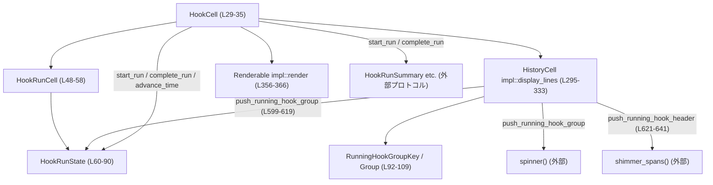
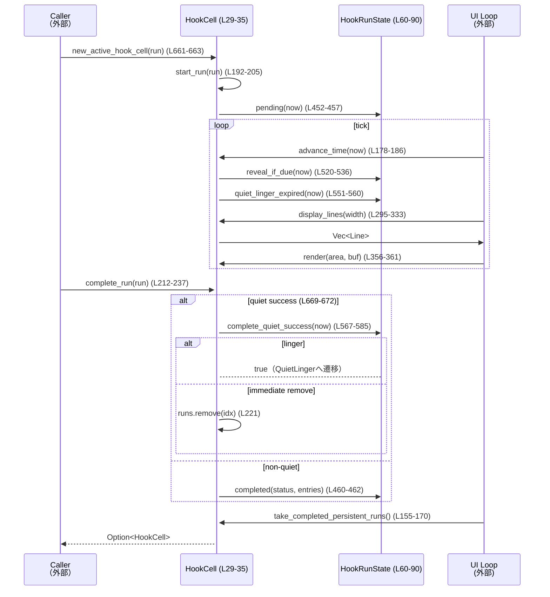
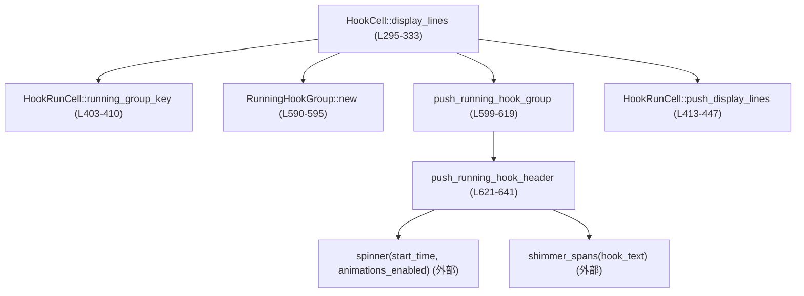

# tui/src/history_cell/hook_cell.rs コード解説

## 0. ざっくり一言

- フック（`HookRunSummary`）の開始・終了イベントを受けて、**いつ画面に表示するか／いつ消すか** を管理する「小さな状態マシン付き履歴セル」の実装です（`HookCell`, `HookRunState`; `hook_cell.rs:L29-35, L60-90`）。
- きわめて短時間で終わるフックや出力のない成功フックを、**履歴に残さず・フラッシュしないように制御**します（ファイル先頭のモジュールコメント; `hook_cell.rs:L1-12`）。

---

## 1. このモジュールの役割

### 1.1 概要

このモジュールは次の問題を解決するために存在し、以下の機能を提供します。

- 問題:  
  - フック処理は非常に短時間で終わる場合や、出力なしで成功する場合が多く、**常に画面に表示するとチラつきやノイズが多くなる**（`hook_cell.rs:L1-12`）。
- 機能:
  - 各フック実行に対し `HookRunState` で表示状態を管理し、**一定時間経過までは非表示**、**静かな成功は短時間だけ残して自動で消去**します（`HookRunState`, `HOOK_RUN_REVEAL_DELAY`, `QUIET_HOOK_MIN_VISIBLE`; `hook_cell.rs:L37-46, L60-90, L451-457, L567-585`）。
  - 同じ種類のフックが同時に走っている場合、**複数行を 1 行にグルーピングして表示**します（`RunningHookGroup`, `display_lines`; `hook_cell.rs:L92-109, L295-333`）。
  - `HistoryCell` / `Renderable` を実装し、履歴ビューと ratatui の描画に統合されます（`hook_cell.rs:L293-354, L356-366`）。

### 1.2 アーキテクチャ内での位置づけ

このファイル内で確認できる依存関係は次の通りです。

- `HookCell`:
  - 上位インターフェース: `super::HistoryCell`（履歴セル共通インターフェース; `hook_cell.rs:L13, L293-354`）
  - 描画: `crate::render::renderable::Renderable` + ratatui (`Paragraph`, `Text`, `Line`, `Buffer` など; `hook_cell.rs:L15, L22-25, L356-366`)
  - アニメーション: `crate::exec_cell::spinner` と `crate::shimmer::shimmer_spans` を利用してスピナーとシマー効果を描画（`hook_cell.rs:L14, L16, L621-641`）
  - プロトコル: `codex_protocol::protocol::{HookRunSummary, HookRunStatus, HookOutputEntry, HookOutputEntryKind, HookEventName}` に依存（`hook_cell.rs:L17-21, L225-231, L246-252, L460-462, L487-488, L670-672, L674-688, L691-698, L701-708`）

内部構成を簡略化した依存図です（このファイルのみを対象）。



> 外部関数 `spinner`, `shimmer_spans` やプロトコル型の中身は、このチャンクには現れません（`crate::exec_cell::spinner`, `crate::shimmer::shimmer_spans`, `codex_protocol::protocol::*`; `hook_cell.rs:L14, L16-21`）。

### 1.3 設計上のポイント

コードから読み取れる設計上の特徴です。

- 明示的な状態マシン:
  - `HookRunState` で 4 状態（`PendingReveal`, `VisibleRunning`, `QuietLinger`, `Completed`）を表現し、状態遷移専用のメソッドを持ちます（`hook_cell.rs:L60-90, L452-457, L460-462, L520-536, L567-585`）。
- 時間ベースの制御:
  - `Instant` と `Duration` を使い、**最初は非表示 → 一定時間経過後に表示 → 静かな成功は一定時間後に削除**というポリシーを実装しています（`HOOK_RUN_REVEAL_DELAY`, `QUIET_HOOK_MIN_VISIBLE`, `advance_time`, `reveal_if_due`, `quiet_linger_expired`, `complete_quiet_success`; `hook_cell.rs:L37-46, L178-186, L520-536, L551-560, L567-585`）。
- 表示ロジックと状態保持の分離:
  - 実行単位は `HookRunCell` と `HookRunState` で管理し、テキスト行生成は `display_lines` と `push_display_lines` / `push_running_hook_group` で行います（`hook_cell.rs:L48-58, L295-333, L413-447, L599-619`）。
- グルーピング:
  - 同じ `event_name` と `status_message` の連続する「走行中」フックを 1 行にまとめるため、`RunningHookGroupKey` と `RunningHookGroup` を使っています（`hook_cell.rs:L92-109, L295-333, L403-410`）。
- エラー処理 / 安全性:
  - このモジュールには `unsafe` や明示的なエラー型は登場せず、**不整合は Option / bool で扱う**方針です。例: 完了イベントに対応する `id` が無ければ `complete_run` は `false` を返して何もしません（`hook_cell.rs:L212-215`）。
  - 全てのミューテーションメソッドは `&mut self` を要求しており、スレッド間共有を前提とした同期処理は行っていません（例: `start_run`, `complete_run`, `advance_time`; `hook_cell.rs:L178-186, L192-205, L212-237`）。

---

## 2. 主要な機能一覧

このモジュールが提供する主な機能です。

- フック実行セルの生成:
  - `new_active_hook_cell`: 実行中フックからアクティブな `HookCell` を作成（`hook_cell.rs:L661-663`）。
  - `new_completed_hook_cell`: 履歴から復元した完了フックから `HookCell` を作成（`hook_cell.rs:L665-667`）。
- 実行状態管理:
  - `HookCell::start_run`: フック開始イベントを登録／更新し、初期状態 `PendingReveal` を設定（`hook_cell.rs:L192-205`）。
  - `HookCell::complete_run`: フック完了イベントを反映し、**静かな成功を履歴から隠すロジック**を実装（`hook_cell.rs:L212-237, L669-672`）。
  - `HookCell::advance_time`: 時刻に応じて `PendingReveal → VisibleRunning` や `QuietLinger` の削除を行う（`hook_cell.rs:L178-186, L520-536, L551-560`）。
  - `HookCell::take_completed_persistent_runs`: 出力やエラーのある完了フックだけを取り出し、履歴用セルに分離（`hook_cell.rs:L155-170, L485-493`）。
- 描画・履歴表示:
  - `HookCell` に対する `HistoryCell::display_lines` 実装: ランニングフックのグルーピングと、完了フックのヘッダ＋エントリ行描画（`hook_cell.rs:L295-333, L413-447, L599-619, L621-641`）。
  - `HookCell::transcript_lines`: 履歴用テキスト（トランスクリプト）として同じ内容を返す（`hook_cell.rs:L337-338`）。
  - `Renderable` 実装: ratatui で `Paragraph` として描画（`hook_cell.rs:L356-366`）。
  - `transcript_animation_tick`: アニメーション用の粗いタイマーチック値を提供（`hook_cell.rs:L342-353`）。
- 表示ポリシー:
  - `hook_run_is_quiet_success`: 「静かな成功」かどうかの判定（`hook_cell.rs:L669-672`）。
  - `hook_completed_bullet`: 完了ステータスに応じたマーカーの色・スタイル（`hook_cell.rs:L674-688`）。
  - `hook_output_prefix`: 各 `HookOutputEntryKind` に応じたプレフィックス文字列（`hook_cell.rs:L691-698`）。
  - `hook_event_label`: イベント名のラベル文字列（`hook_cell.rs:L701-708`）。

---

## 3. 公開 API と詳細解説

### 3.1 型一覧（構造体・列挙体など）

このファイルに定義される主要な型の一覧です。

| 名前 | 種別 | 可視性 | 定義位置 | 役割 / 用途 |
|------|------|--------|----------|-------------|
| `HookCell` | 構造体 | `pub(crate)` | `hook_cell.rs:L29-35` | 1つの「フック履歴セル」を表す。複数の `HookRunCell` を保持し、時間経過とイベントに応じた表示制御を行う。`HistoryCell` と `Renderable` を実装。 |
| `HookRunCell` | 構造体 | モジュール内 | `hook_cell.rs:L48-58` | 個々のフック実行（1 `HookRunSummary`）の状態を表す。`id`, `event_name`, `status_message`, `state` を保持。 |
| `HookRunState` | 列挙体 | モジュール内 | `hook_cell.rs:L60-90` | フック実行のライフサイクル状態（`PendingReveal`, `VisibleRunning`, `QuietLinger`, `Completed`）を表現する状態マシン。 |
| `RunningHookGroupKey` | 構造体 | モジュール内 | `hook_cell.rs:L92-96` | ランニングフックのグルーピングキー。`event_name` と `status_message` の組み合わせ。 |
| `RunningHookGroup` | 構造体 | モジュール内 | `hook_cell.rs:L102-109` | 連続する同種フック群をまとめる表示用グループ。最小開始時刻と件数を保持。 |

### 3.2 重要関数の詳細

ここでは特に重要な 7 関数について詳しく説明します。

#### 3.2.1 `HookCell::start_run(&mut self, run: HookRunSummary)`

**定義位置**

- `hook_cell.rs:L192-205`

**概要**

- フック開始イベントを `HookCell` に反映する関数です。  
- 同じ `id` の実行が既に存在する場合は、**新しいメタデータで上書きしつつ状態をリセット**します（`hook_cell.rs:L194-199`）。
- 存在しない場合は、新しい `HookRunCell` を作成し、`PendingReveal` 状態で登録します（`hook_cell.rs:L200-205, L452-457`）。

**引数**

| 引数名 | 型 | 説明 |
|--------|----|------|
| `self` | `&mut HookCell` | セル内部の `runs` を更新可能な参照。 |
| `run`  | `HookRunSummary` | フック実行の概要情報。`id`, `event_name`, `status_message` などを含む（`tests::hook_run_summary` から構造が分かる; `hook_cell.rs:L762-777`）。 |

**戻り値**

- 戻り値はありません。`self.runs` に副作用を与えます（`hook_cell.rs:L192-205`）。

**内部処理の流れ**

1. `now = Instant::now()` を取得（`hook_cell.rs:L193`）。
2. `self.runs` 内に同じ `id` を持つ `HookRunCell` があるか探索（`iter_mut().find`）（`hook_cell.rs:L194`）。
3. 見つかった場合:
   - `event_name` と `status_message` を新しい `run` からコピーしなおす（`hook_cell.rs:L195-196`）。
   - `state` を `HookRunState::pending(now)`（`PendingReveal`）に再初期化（`hook_cell.rs:L197, L452-457`）。
4. 見つからない場合:
   - 新しい `HookRunCell` を作成し、`id`, `event_name`, `status_message`, `state = pending(now)` で `self.runs` に push（`hook_cell.rs:L200-205`）。

**Examples（使用例）**

実行中フック用セルを作成し、開始イベントを登録する例です。

```rust
use codex_protocol::protocol::{HookRunSummary, HookRunStatus, HookEventName};
use tui::history_cell::hook_cell::new_active_hook_cell; // 実際のパスは crate 構成に依存

fn on_hook_start(summary: HookRunSummary) {
    // アクティブな HookCell を作成する（内部で start_run が呼ばれる）       // hook_cell.rs:L661-663
    let mut cell = new_active_hook_cell(summary, /*animations_enabled*/ true);

    // 以後、別の開始イベントで同じ id が来た場合は cell.start_run(...) を再度呼ぶ   // hook_cell.rs:L192-199
    // cell.start_run(new_summary);
}
```

**Errors / Panics**

- パニックを起こしうる操作（`unwrap`, インデックスアクセスなど）は使用していません。
- 存在しない `id` に対する特別なエラー処理は不要で、新規行として追加されます。

**Edge cases（エッジケース）**

- 同じ `id` で複数回 `start_run` が呼ばれた場合:
  - 一つの行に統合され、`PendingReveal` 状態に戻ります（`hook_cell.rs:L194-199`）。
- `status_message` が `None` または空文字列の場合:
  - グルーピングキーで `None` として扱われ、ヘッダ表示でもステータス文は省略されます（`hook_cell.rs:L95, L403-410, L635-640`）。

**使用上の注意点**

- `id` は begin/end イベントを対応づける不変条件として機能するので、**同一実行に対して一貫した `id` を与える必要があります**（`hook_cell.rs:L50-51, L188-191`）。
- `start_run` は `Instant::now()` を内部で呼び出すため、テストで時間制御したい場合は `reveal_running_runs_*_for_test` 系のヘルパーを併用します（`hook_cell.rs:L277-289`）。

---

#### 3.2.2 `HookCell::complete_run(&mut self, run: HookRunSummary) -> bool`

**定義位置**

- `hook_cell.rs:L212-237`

**概要**

- フック完了イベントをセルに反映する関数です。
- 「静かな成功（`status == Completed` かつ `entries` 空）」かどうかで扱いを分けます（`hook_run_is_quiet_success`; `hook_cell.rs:L669-672`）。
  - 静かな成功: 状態に応じて即時削除か一時的に `QuietLinger` に移行します（`hook_cell.rs:L216-223, L567-585`）。
  - その他: `Completed` 状態にして履歴に残します（`hook_cell.rs:L225-235, L460-462`）。

**引数**

| 引数名 | 型 | 説明 |
|--------|----|------|
| `self` | `&mut HookCell` | セル内部の状態を更新するための可変参照。 |
| `run`  | `HookRunSummary` | 完了時点の実行サマリ。`status`, `entries` などが埋まっていることを想定。 |

**戻り値**

- `bool`:
  - `true`: 同じ `id` の実行がセル内に存在し、処理された。
  - `false`: 該当 `id` がセル内に存在せず、何もしなかった（`hook_cell.rs:L213-215`）。

**内部処理の流れ**

1. `self.runs` 内で `id == run.id` のインデックスを検索（`position`）（`hook_cell.rs:L213`）。
   - 見つからなければ `false` を返して終了（`hook_cell.rs:L214-215`）。
2. `hook_run_is_quiet_success(&run)` を評価し、「静かな成功」か判定（`hook_cell.rs:L216, L669-672`）。
3. 静かな成功の場合:
   - 対応する `HookRunCell` の `state.complete_quiet_success(Instant::now())` を呼ぶ（`hook_cell.rs:L217-219`）。
   - 戻り値が `false` の場合、その実行はすぐ削除（`self.runs.remove(index)`）（`hook_cell.rs:L221`）。
     - これは「表示されたことがない」か「最低可視時間を既に満たした」場合を意味します（`hook_cell.rs:L567-580`）。
4. 静かな成功でない場合:
   - `run` から `event_name`, `status_message`, `status`, `entries` を取り出して構造体分解（`hook_cell.rs:L225-231`）。
   - 対応する `HookRunCell` に対し、`event_name`, `status_message` を更新し、`HookRunState::completed(status, entries)` を設定（`hook_cell.rs:L232-235`）。

**Examples（使用例）**

簡略化した完了イベントハンドラ例です。

```rust
use codex_protocol::protocol::{HookRunSummary, HookRunStatus};
use tui::history_cell::hook_cell::new_active_hook_cell;

fn on_hook_finish(cell: &mut HookCell, summary: HookRunSummary) {
    // 完了イベントを反映                                                // hook_cell.rs:L212-237
    let found = cell.complete_run(summary);

    if !found {
        // このセルに見つからなければ、別セルや新規セルに割り当てるなどの処理が必要
        // （この振る舞いは本チャンクには現れません）
    }
}
```

**Errors / Panics**

- `self.runs[index]` のインデックスアクセスは、事前の `position` 探索で存在確認しているため安全です（`hook_cell.rs:L213-215, L217-221`）。
- `Instant::now()` の呼び出しに伴う特別なエラー処理はありません。

**Edge cases（エッジケース）**

- セル内に `id` が存在しない:
  - `false` を返し、状態は一切変更されません（`hook_cell.rs:L213-215`）。
- 静かな成功で、状態が `VisibleRunning` 以外（`PendingReveal` や `Completed`）だった場合:
  - `complete_quiet_success` は即座に `false` を返し、呼び出し側は `self.runs.remove(index)` を実行しないため、行は残りません（`hook_cell.rs:L567-575, L217-223`）。
- 静かな成功で、`VisibleRunning` だが `QUIET_HOOK_MIN_VISIBLE` を既に満たしている場合:
  - `complete_quiet_success` が `false` を返し、行は即削除されます（`hook_cell.rs:L577-580, L221`）。
- 非静かな完了（警告やエラーあり）:
  - `Completed` 状態として履歴に残り、`take_completed_persistent_runs` で抽出対象になります（`hook_cell.rs:L225-235, L485-493, L155-170`）。

**使用上の注意点**

- 呼び出し側は `false` が返る場合を考慮し、**どのセルがその `id` を持っているかの管理**が必要です（この管理は本ファイル外で行われます）。
- 「静かな成功」を完全に履歴から隠したい設計なので、**成功だけを常に履歴に残したい**場合は `hook_run_is_quiet_success` の条件に注意が必要です（`hook_cell.rs:L669-672`）。

---

#### 3.2.3 `HookCell::advance_time(&mut self, now: Instant) -> bool`

**定義位置**

- `hook_cell.rs:L178-186`

**概要**

- 現在時刻 `now` に基づいて、各 `HookRunState` のタイマー依存状態を前進させる関数です。
  - `PendingReveal` → `VisibleRunning` への遷移（`reveal_if_due`）と、
  - `QuietLinger` 状態の期限切れによる削除（`quiet_linger_expired`）を行います。
- いずれかの実行に変更があったかどうかを `bool` で返し、UI側の再描画判断に利用できます。

**引数**

| 引数名 | 型 | 説明 |
|--------|----|------|
| `self` | `&mut HookCell` | 状態遷移と削除を行うための可変参照。 |
| `now`  | `Instant` | 現在時刻。呼び出し側で決めた時刻を使えるので、テスト等で制御可能。 |

**戻り値**

- `bool`:  
  - `true`: 少なくとも1つの実行の状態が変化した、または `runs` の長さが変化した（`hook_cell.rs:L179-186`）。
  - `false`: 状態・要素数ともに変わらなかった。

**内部処理の流れ**

1. 呼び出し前の `self.runs.len()` を `old_len` に保存（`hook_cell.rs:L179`）。
2. `changed` フラグを `false` に初期化（`hook_cell.rs:L180`）。
3. 各 `run` について `run.state.reveal_if_due(now)` を呼び、戻り値を OR して `changed` を更新（`hook_cell.rs:L181-183, L520-536`）。
4. `runs.retain(|run| !run.state.quiet_linger_expired(now))` で、`QuietLinger` 期限切れの実行を削除（`hook_cell.rs:L184, L551-560`）。
5. `changed || self.runs.len() != old_len` を返す（`hook_cell.rs:L185`）。

**Examples（使用例）**

タイマー駆動の UI ループ内での利用例です。

```rust
use std::time::Instant;

fn tick(cell: &mut HookCell) {
    let now = Instant::now();                        // 現在時刻を取得
    let changed = cell.advance_time(now);            // 状態を前進させる  // hook_cell.rs:L178-186

    if changed && cell.should_render() {             // 何か変わった & 表示対象あり  // hook_cell.rs:L146-149
        // 再描画をスケジュールする
        // （実際の描画は Renderable::render 経由; hook_cell.rs:L356-366）
    }
}
```

**Errors / Panics**

- `retain` / `reveal_if_due` 内でのパニック要因は見当たりません。
- `Instant` に対して `>=` 比較を行うだけで、オーバーフロー処理などは `checked_sub` を使うテスト用ヘルパーでのみ存在します（`hook_cell.rs:L395-397`）。

**Edge cases（エッジケース）**

- `runs` が空の場合:
  - ループは実行されず、`changed` は `false`、`len` も変わらないため `false` を返します。
- `now` が過去の時刻の場合:
  - `reveal_if_due` の条件 `now < reveal_deadline` が満たされやすくなるため、「まだ表示しない」方向に働きますが、特別扱いはしていません（`hook_cell.rs:L528-529`）。
- `QuietLinger` のみが存在する場合:
  - `quiet_linger_expired` により、期限を過ぎた実行は削除されます（`hook_cell.rs:L552-560`）。

**使用上の注意点**

- `advance_time` を呼ばないと `PendingReveal` から `VisibleRunning` への遷移も `QuietLinger` の削除も行われないため、**定期的に呼び出す**ことが前提です。
- `now` を `Instant::now()` で毎回取得するか、外部タイマーに合わせて渡すかは呼び出し側の設計によります。

---

#### 3.2.4 `HookCell::take_completed_persistent_runs(&mut self) -> Option<HookCell>`

**定義位置**

- `hook_cell.rs:L155-170`

**概要**

- 完了済み実行のうち「履歴に残すべきもの」（persistent output）だけを**新しい `HookCell` として切り出す**関数です。
- 元のセルには `has_persistent_output == false` の実行だけが残り、「静かな成功」などはアクティブセル側で自然に消えるようにします（`hook_cell.rs:L151-155, L485-493`）。

**引数**

- `self: &mut HookCell` — 内部の `runs` を再構成するための可変参照。

**戻り値**

- `Option<HookCell>`:
  - `Some(cell)`: 1件以上の persistent run が存在し、それらだけを持つ新しい `HookCell` が返る。
  - `None`: persistent run が一つもなかった。

**内部処理の流れ**

1. `completed`（persistent）と `remaining`（非 persistent）用の `Vec` を用意（`hook_cell.rs:L156-157`）。
2. `self.runs.drain(..)` で全要素を取り出して走査（`hook_cell.rs:L158`）。
3. 各 `run` について `run.state.has_persistent_output()` を判定（`hook_cell.rs:L159, L485-493`）。
   - `true` なら `completed` に push。
   - `false` なら `remaining` に push。
4. `self.runs = remaining` として元のセルの中身を差し替え（`hook_cell.rs:L165`）。
5. `completed` が空でなければ `Some(Self { runs: completed, animations_enabled: self.animations_enabled })` を返す（`hook_cell.rs:L166-169`）。

**Examples（使用例）**

アクティブセルから履歴セルを取り出す例です。

```rust
fn drain_persistent_history(active: &mut HookCell, history: &mut Vec<HookCell>) {
    if let Some(done_cell) = active.take_completed_persistent_runs() { // hook_cell.rs:L155-170
        history.push(done_cell);                                      // 履歴リストに追加
    }

    if active.should_flush() {                                        // もはや active でなくて良いか   // hook_cell.rs:L141-144
        // active セルを一覧から除去する等の処理
    }
}
```

**Errors / Panics**

- `drain(..)` と `push` / 代入だけで、エラーパスやパニックを引き起こすコードはありません。

**Edge cases（エッジケース）**

- persistent run が一つも無い場合:
  - `completed` は空で `None` が返ります。元の `self.runs` には `remaining`（非 persistent）だけが残ります。
- 完了していない（`PendingReveal`, `VisibleRunning`, `QuietLinger`）状態だけしかない場合:
  - いずれも `has_persistent_output == false` のため、`completed` は空のままです（`hook_cell.rs:L485-493`）。

**使用上の注意点**

- 呼び出し後の `self` からは persistent run が取り除かれているため、**同じ完了実行を二重に描画したくない場合**に有用です。
- 新しく返された `HookCell` は `animations_enabled` フラグを引き継ぎますが、`runs` は全て `Completed` 状態のはずなので、アニメーションは行われません（`HookRunState::start_time` が `None` であるため; `hook_cell.rs:L499-505`）。

---

#### 3.2.5 `impl HistoryCell for HookCell::display_lines(&self, _width: u16) -> Vec<Line<'static>>`

**定義位置**

- `hook_cell.rs:L295-333`

**概要**

- 現在の `HookCell` の状態から、**画面やトランスクリプトに描画するテキスト行のリスト**を構築します。
- 特徴:
  - `RunningHookGroup` を使って、連続する「走行中フック」を 1 行にまとめる（`hook_cell.rs:L295-333, L92-109, L403-410`）。
  - 「完了」行が現れたときは、直前のグルーピング行を確定させてから個別行を描画（`hook_cell.rs:L303-311`）。

**引数**

| 引数名 | 型 | 説明 |
|--------|----|------|
| `self` | `&HookCell` | 描画対象となるセル。 |
| `_width` | `u16` | 横幅。ここではグルーピングや改行には使用していません（未使用変数）。 |

**戻り値**

- `Vec<Line<'static>>`: ratatui の `Line` で表現された行のリスト（`hook_cell.rs:L295-333`）。

**内部処理の流れ**

1. `lines` と `running_group: Option<RunningHookGroup>` を初期化（`hook_cell.rs:L296-297`）。
2. 各 `run` について:
   - `run.state.should_render()` が `false`（`PendingReveal`）ならスキップ（`hook_cell.rs:L299-301, L475-481`）。
   - `run.running_group_key()` を呼び、グルーピング対象か判定（`hook_cell.rs:L303, L403-410`）。
3. グルーピング対象でない (`None`) 場合:
   - 現在の `running_group` があれば `push_running_hook_group` で確定描画（`hook_cell.rs:L305-308, L599-619`）。
   - `push_hook_line_separator` で空行区切りを挿入（必要なら）（`hook_cell.rs:L309-310, L644-648`）。
   - `run.push_display_lines` で個別の完了行などを追加（`hook_cell.rs:L310-311, L413-447`）。
4. グルーピング対象 (`Some(key)`) の場合:
   - 既存の `running_group` が同じ `key` なら `group.count += 1` とし、最も古い `start_time` を保持（`hook_cell.rs:L314-321`）。
   - `key` が異なる、または `running_group` が `None` の場合:
     - 以前の `group` があれば描画してから、新しい `RunningHookGroup::new(key, run.state.start_time())` に差し替え（`hook_cell.rs:L324-327, L589-595`）。
5. ループ終了後、`running_group` が残っていれば `push_running_hook_group` で描画（`hook_cell.rs:L330-331`）。
6. `lines` を返す（`hook_cell.rs:L333`）。

**Examples（使用例）**

描画されるテキストの概念的なイメージを示す例です。

```rust
fn debug_print_lines(cell: &HookCell) {
    let lines = cell.display_lines(80);                // hook_cell.rs:L295-333
    for line in lines {
        // 簡略化のため content 文字列のみ表示
        println!("{}", line.to_string());             // 実際の to_string 実装は ratatui に依存
    }
}
```

**Errors / Panics**

- `running_group.replace(...)` の戻り値に対する `if let Some(group)` は安全です（`hook_cell.rs:L324-327`）。
- ベクタ操作 (`push`, `extend`) のみで、パニックを発生させるようなインデックス計算はありません。

**Edge cases（エッジケース）**

- すべて `PendingReveal` で `should_render == false` な場合:
  - `lines` は空ベクタのまま返されます。
- 最初の行が完了行の場合:
  - `lines` が空なので `push_hook_line_separator` は何も挿入しません（`hook_cell.rs:L645-648`）。
- 同じイベント・ステータスメッセージのランニングフックが離れて存在する場合:
  - 「隣り合っている」ものだけをグルーピングし、間に別の種類の行が挟まると別グループになります（`hook_cell.rs:L318-321`）。

**使用上の注意点**

- `_width` はここでは使用していないため、折り返し等は `Paragraph` 側（`Wrap { trim: false }`）に任されています（`hook_cell.rs:L358-360`）。
- トランスクリプト出力も `transcript_lines` で同じ実装を再利用しているため、**画面と履歴の表示が一致する**ことが保証されます（`hook_cell.rs:L336-338`）。

---

#### 3.2.6 `HookRunState::reveal_if_due(&mut self, now: Instant) -> bool`

**定義位置**

- `hook_cell.rs:L520-536`

**概要**

- `PendingReveal` 状態の実行について、「表示可能な時刻」を過ぎていれば `VisibleRunning` に遷移させる関数です。
- その他の状態に対しては何も変更せず `false` を返します。

**引数**

| 引数名 | 型 | 説明 |
|--------|----|------|
| `self` | `&mut HookRunState` | 状態遷移の対象。 |
| `now`  | `Instant` | 現在時刻。 |

**戻り値**

- `bool`:
  - `true`: 状態が `PendingReveal` から `VisibleRunning` に変更された。
  - `false`: まだ期限前、または `PendingReveal` 以外の状態だった。

**内部処理の流れ**

1. `self` が `HookRunState::PendingReveal { start_time, reveal_deadline }` であるかパターンマッチ（`hook_cell.rs:L521-525`）。
   - そうでなければ `false` で早期リターン。
2. `now < *reveal_deadline` ならまだ表示しないので `false` を返す（`hook_cell.rs:L528-529`）。
3. それ以外の場合、`self` を `VisibleRunning { start_time: *start_time, visible_since: now }` に書き換え、`true` を返す（`hook_cell.rs:L531-535`）。

**Examples（使用例）**

`advance_time` 内で実際に使用されています（`hook_cell.rs:L181-183`）。

```rust
fn reveal_all_due(runs: &mut [HookRunState], now: Instant) -> usize {
    let mut count = 0;
    for state in runs {
        if state.reveal_if_due(now) {    // hook_cell.rs:L520-536
            count += 1;
        }
    }
    count
}
```

**Errors / Panics**

- パターンマッチで `self` を借用し、新しい値で上書きしているだけで、パニックの要因はありません。

**Edge cases（エッジケース）**

- `now` が `reveal_deadline` とちょうど同じ場合:
  - `now < *reveal_deadline` が偽になるため、即座に `VisibleRunning` へ遷移します（`hook_cell.rs:L528-535`）。
- `PendingReveal` 以外の状態で呼び出した場合:
  - 何もせず `false` を返します（`hook_cell.rs:L521-527`）。

**使用上の注意点**

- `reveal_if_due` 自体は時間計測のポリシーを知らないため、**必ず `HOOK_RUN_REVEAL_DELAY` を用いた初期化（`pending` 呼び出し）とセットで利用する必要があります**（`hook_cell.rs:L452-457`）。

---

#### 3.2.7 `HookRunState::complete_quiet_success(&mut self, now: Instant) -> bool`

**定義位置**

- `hook_cell.rs:L567-585`

**概要**

- `VisibleRunning` 状態の「静かな成功」を **`QuietLinger` に変換するか、即座に削除対象とするか** を決める関数です。
- 可視期間が十分でない場合は `QuietLinger` に遷移し、残りの可視期間を保持します。  
  十分に経過していれば `false` を返し、呼び出し側で行を削除させます（`hook_cell.rs:L578-580, L221`）。

**引数**

| 引数名 | 型 | 説明 |
|--------|----|------|
| `self` | `&mut HookRunState` | 対象となる状態。`VisibleRunning` であることが前提。 |
| `now`  | `Instant` | 完了イベントを受信した時刻。 |

**戻り値**

- `bool`:
  - `true`: `VisibleRunning` → `QuietLinger` に遷移した（まだ linger すべき）。
  - `false`: 即削除してよい（`PendingReveal` だった、またはすでに十分な可視期間が経過している）。

**内部処理の流れ**

1. `self` が `HookRunState::VisibleRunning { start_time, visible_since, .. }` かパターンマッチ（`hook_cell.rs:L568-572`）。
   - そうでなければ `false` を返す（`hook_cell.rs:L573-575`）。
2. `minimum_deadline = *visible_since + QUIET_HOOK_MIN_VISIBLE` を計算（`hook_cell.rs:L576-577`）。
3. `now >= minimum_deadline` なら、既に最低可視時間を満たしているので `false` を返す（`hook_cell.rs:L578-580`）。
4. そうでなければ、`self` を `QuietLinger { start_time, removal_deadline: minimum_deadline }` に書き換え、`true` を返す（`hook_cell.rs:L581-585`）。

**Examples（使用例）**

`HookCell::complete_run` からの使用（静かな成功時）です（`hook_cell.rs:L216-223`）。

```rust
fn handle_quiet_success(state: &mut HookRunState, now: Instant) -> bool {
    state.complete_quiet_success(now)  // hook_cell.rs:L567-585
}
```

**Errors / Panics**

- `QUIET_HOOK_MIN_VISIBLE` は固定の `Duration` であり、`Instant + Duration` のオーバーフローは通常想定されません（`hook_cell.rs:L42-46, L576-577`）。

**Edge cases（エッジケース）**

- `PendingReveal` のまま静かな成功が届いた場合:
  - `VisibleRunning` ではないので `false` を返し、呼び出し側（`complete_run`）は即削除します（`hook_cell.rs:L568-575, L216-223`）。
- `VisibleRunning` だが `visible_since + QUIET_HOOK_MIN_VISIBLE <= now` の場合:
  - 最低可視時間は既に満たされているので、`QuietLinger` を経ずに削除されます（`hook_cell.rs:L578-580`）。

**使用上の注意点**

- あくまで「静かな成功」に対するポリシーであり、**出力や警告を伴う完了には使われません**。それらは `Completed` 状態で履歴に残ります（`hook_cell.rs:L225-235, L485-493`）。
- `start_time` を `QuietLinger` に持ち越すことで、スピナーの位相が変わらないよう設計されています（`hook_cell.rs:L577, L581-583`）。

---

### 3.3 その他の関数・メソッド一覧

重要度が比較的低い、補助的な関数や単純なラッパーです（すべてこのファイル内で完結）。

#### HookCell 関連

| 名前 | 定義位置 | 役割（1行） |
|------|----------|-------------|
| `HookCell::new_active` | `hook_cell.rs:L113-120` | 新しい空の `HookCell` を作成し、即座に `start_run` で1件登録する。外部公開ラッパーは `new_active_hook_cell`。 |
| `HookCell::new_completed` | `hook_cell.rs:L123-130` | 履歴からの完了フック1件を含む `HookCell` を作成する。外部公開ラッパーは `new_completed_hook_cell`。 |
| `HookCell::is_empty` | `hook_cell.rs:L132-134` | `runs` が空かどうか。 |
| `HookCell::is_active` | `hook_cell.rs:L137-139` | いずれかの `HookRunState` が `is_active == true` かどうか。 |
| `HookCell::should_flush` | `hook_cell.rs:L141-144` | 現在は非アクティブだが、行は残っている場合に `true`。アクティブスロットから除去する目安。 |
| `HookCell::should_render` | `hook_cell.rs:L146-149` | 1件以上 `should_render == true` な実行があるかどうか。 |
| `HookCell::has_visible_running_run` | `hook_cell.rs:L172-175` | 1件以上 `is_running_visible == true` な実行があるかどうか。 |
| `HookCell::next_timer_deadline` | `hook_cell.rs:L262-267` | 全実行の `next_timer_deadline` のうち最も早い `Instant`。 |
| `HookCell::expire_quiet_runs_now_for_test` | `hook_cell.rs:L269-273` | テスト用; 全 QuietLinger を即時期限切れにする。 |
| `HookCell::reveal_running_runs_now_for_test` | `hook_cell.rs:L276-281` | テスト用; 全 PendingReveal の `reveal_deadline` を今にする。 |
| `HookCell::reveal_running_runs_after_delayed_redraw_for_test` | `hook_cell.rs:L284-289` | テスト用; `visible_since` より十分前の `reveal_deadline` を設定し、遅延描画シナリオを再現。 |

#### HistoryCell / Renderable 関連

| 名前 | 定義位置 | 役割 |
|------|----------|------|
| `HookCell::transcript_lines` | `hook_cell.rs:L337-338` | `display_lines` と同じ内容をトランスクリプト出力として返す。 |
| `HookCell::transcript_animation_tick` | `hook_cell.rs:L342-353` | アニメーション有効時のみ、最も古い可視ランニング実行の経過時間から粗い tick 値（600ms 単位）を算出する。 |
| `HookCell::render` | `hook_cell.rs:L357-361` | `display_lines` の結果を `Paragraph` に包み、指定領域に描画。 |
| `HookCell::desired_height` | `hook_cell.rs:L363-365` | `HistoryCell::desired_height` に委譲して必要高さを計算。 |

#### HookRunCell 関連

| 名前 | 定義位置 | 役割 |
|------|----------|------|
| `HookRunCell::expire_quiet_linger_now_for_test` | `hook_cell.rs:L370-376` | テスト用; QuietLinger の `removal_deadline` を今にする。 |
| `HookRunCell::reveal_running_now_for_test` | `hook_cell.rs:L380-386` | テスト用; PendingReveal の `reveal_deadline` を今にする。 |
| `HookRunCell::reveal_running_after_delayed_redraw_for_test` | `hook_cell.rs:L390-399` | テスト用; `QUIET_HOOK_MIN_VISIBLE` を考慮した遅延描画シナリオのために deadline を調整。 |
| `HookRunCell::running_group_key` | `hook_cell.rs:L403-410` | `is_running_visible` な場合にグルーピングキーを生成。 |
| `HookRunCell::push_display_lines` | `hook_cell.rs:L413-447` | 単一の実行を行リストに追加（ランニングヘッダ or 完了ヘッダ＋エントリ）。 |

#### HookRunState 関連（3.2 で扱ったもの以外）

| 名前 | 定義位置 | 役割 |
|------|----------|------|
| `HookRunState::pending` | `hook_cell.rs:L452-457` | `PendingReveal` の初期状態を作成。`HOOK_RUN_REVEAL_DELAY` を適用。 |
| `HookRunState::completed` | `hook_cell.rs:L460-462` | `Completed` 状態を作成。 |
| `HookRunState::is_active` | `hook_cell.rs:L465-471` | タイマーまたは完了イベント待ち状態かどうか。 |
| `HookRunState::should_render` | `hook_cell.rs:L475-481` | 現在のレンダリングで表示すべき状態かどうか。 |
| `HookRunState::has_persistent_output` | `hook_cell.rs:L485-493` | 履歴に残すべき完了状態かどうか。 |
| `HookRunState::start_time` | `hook_cell.rs:L499-505` | アクティブ状態の開始時刻。Completed では `None`。 |
| `HookRunState::is_running_visible` | `hook_cell.rs:L509-513` | ランニング行として可視状態かどうか。 |
| `HookRunState::next_timer_deadline` | `hook_cell.rs:L539-548` | 次にタイマーで処理すべき時刻（PendingReveal / QuietLinger）。 |
| `HookRunState::quiet_linger_expired` | `hook_cell.rs:L551-560` | QuietLinger の期限が切れているかどうか。 |

#### グルーピング・描画ヘルパー

| 名前 | 定義位置 | 役割 |
|------|----------|------|
| `RunningHookGroup::new` | `hook_cell.rs:L590-595` | 1件目のランニングフックからグループを作成。 |
| `push_running_hook_group` | `hook_cell.rs:L599-619` | グループ化されたランニングフック1行を描画。 |
| `push_running_hook_header` | `hook_cell.rs:L621-641` | ランニングフック用ヘッダ行（スピナー＋シマー／ボールド＋ステータス）を生成。 |
| `push_hook_line_separator` | `hook_cell.rs:L644-648` | 行間の空行セパレータ。先頭には挿入しない。 |
| `earliest_instant` | `hook_cell.rs:L652-658` | 2つの `Option<Instant>` から最も早い時刻を返す。 |

#### 外部公開ヘルパー・表示ポリシー

| 名前 | 定義位置 | 役割 |
|------|----------|------|
| `new_active_hook_cell` | `hook_cell.rs:L661-663` | `HookCell::new_active` を crate 内向けに公開するラッパー。 |
| `new_completed_hook_cell` | `hook_cell.rs:L665-667` | `HookCell::new_completed` のラッパー。 |
| `hook_run_is_quiet_success` | `hook_cell.rs:L669-672` | 成功かつ出力なしを「静かな成功」と判定。 |
| `hook_completed_bullet` | `hook_cell.rs:L674-688` | 完了行の先頭に出す箇条書き記号をステータスに応じて装飾。 |
| `hook_output_prefix` | `hook_cell.rs:L691-698` | 各 `HookOutputEntryKind` 用のテキストプレフィックス。 |
| `hook_event_label` | `hook_cell.rs:L701-708` | イベント名から表示ラベル文字列を返す。 |

---

## 4. データフロー

### 4.1 代表的な処理シナリオ（開始 → 表示 → 完了）

1回のフック実行が開始・表示・完了するまでの流れです。

1. 上位コードが `HookRunSummary` を受け取り、`new_active_hook_cell` または既存セルの `start_run` を呼ぶ（`hook_cell.rs:L661-663, L192-205`）。
2. UI のタイマー／レンダーループが `advance_time(now)` を呼び、必要に応じて `PendingReveal` を `VisibleRunning` に遷移（`hook_cell.rs:L178-186, L520-536`）。
3. 描画フェーズで `display_lines` → `render` により、ランニング行が表示される（`hook_cell.rs:L295-333, L356-361`）。
4. 完了イベント到着時に `complete_run` が呼ばれ、静かな成功なら `QuietLinger` or 即削除、そうでなければ `Completed` へ（`hook_cell.rs:L212-237, L567-585`）。
5. 再度 `advance_time` により `QuietLinger` の期限切れを検知し削除（`hook_cell.rs:L551-560, L184-185`）。
6. `take_completed_persistent_runs` で履歴用セルへ切り出され、アクティブセルからは除去される（`hook_cell.rs:L155-170`）。

これをシーケンス図で表します（行番号付き）。



### 4.2 ランニングフック行の構築フロー

ランニング状態の描画に関する内部呼び出しの関係です。



- ランニング状態 (`is_running_visible == true`) の `HookRunCell` は `running_group_key` を通じてグループ化対象となり、`RunningHookGroup` にまとめられます（`hook_cell.rs:L403-410, L295-333`）。
- グループまたは単体のランニング行はどちらも `push_running_hook_header` を通じてスピナーとシマー／ボールド装飾付きのヘッダ行になります（`hook_cell.rs:L413-425, L599-619, L621-641`）。

---

## 5. 使い方（How to Use）

### 5.1 基本的な使用方法

典型的な利用フロー（擬似コード）です。外側のイベントループはこのファイルには現れないため、想定される使われ方として示します。

```rust
use std::time::Instant;
use codex_protocol::protocol::HookRunSummary;
use tui::history_cell::hook_cell::{
    HookCell,
    new_active_hook_cell,
};

struct Model {
    active_hook: Option<HookCell>,   // 現在アクティブなフックセル
    history: Vec<HookCell>,          // 完了フックの履歴
}

impl Model {
    // フック開始時に呼ばれる
    fn on_hook_start(&mut self, summary: HookRunSummary) {
        self.active_hook = Some(new_active_hook_cell(summary, true)); // hook_cell.rs:L661-663
    }

    // フック完了時に呼ばれる
    fn on_hook_complete(&mut self, summary: HookRunSummary) {
        if let Some(cell) = &mut self.active_hook {
            let handled = cell.complete_run(summary);                 // hook_cell.rs:L212-237
            if !handled {
                // 必要に応じて別セルを探すなど（この処理は本ファイル外）
            }
        }
    }

    // UI のタイマー／フレームごとに呼ばれる
    fn on_tick(&mut self) {
        if let Some(cell) = &mut self.active_hook {
            let now = Instant::now();
            let changed = cell.advance_time(now);                     // hook_cell.rs:L178-186

            // 完了フックを履歴に移動
            if let Some(done_cell) = cell.take_completed_persistent_runs() { // L155-170
                self.history.push(done_cell);
            }

            // アクティブセルとして不要になったら捨てる
            if cell.should_flush() {                                  // hook_cell.rs:L141-144
                self.active_hook = None;
            }

            if changed && cell.should_render() {                      // hook_cell.rs:L146-149
                // Terminal 再描画をスケジュール
            }
        }
    }
}
```

描画側では、`Renderable` 実装を通じて `HookCell::render` を使います（`hook_cell.rs:L356-366`）。

### 5.2 よくある使用パターン

1. **アニメーション有効／無効の切り替え**

   - `new_active_hook_cell` / `new_completed_hook_cell` の `animations_enabled` フラグで制御します（`hook_cell.rs:L661-667`）。
   - アニメーション無効時は、スピナーは固定表示になり、ヘッダテキストはボールドのみになります（`hook_cell.rs:L629-634`）。

2. **トランスクリプト用キャッシュキー**

   - `transcript_animation_tick` で `Option<u64>` の tick 値を取得し、同じ値であれば再レンダリングをスキップするなどの用途が考えられます（`hook_cell.rs:L342-353`）。
   - テストでも、ランニングフックの可視性と `animations_enabled` の組み合わせに応じて値が変わることが確認されています（`hook_cell.rs:L732-760`）。

### 5.3 よくある間違い（想定される誤用）

**例1: `advance_time` を呼び忘れる**

```rust
// 誤り: フック開始・完了だけ処理し、advance_time を全く呼ばない
fn on_tick_wrong(cell: &mut HookCell) {
    // no-op
}

// 正しい例: 毎フレームまたは一定間隔で advance_time を呼び出す
fn on_tick_correct(cell: &mut HookCell) {
    let now = Instant::now();
    cell.advance_time(now);     // hook_cell.rs:L178-186
}
```

- `advance_time` を呼ばないと `PendingReveal` → `VisibleRunning` 遷移や `QuietLinger` の削除が行われません。

**例2: `complete_run` の戻り値を無視し、セル割り当てを誤る**

```rust
// 誤り: どの HookCell にも存在しない id の完了イベントを無条件に処理済みとみなす
fn on_hook_complete_wrong(cell: &mut HookCell, run: HookRunSummary) {
    cell.complete_run(run);         // 戻り値を無視
}

// 正しい例: false 時のハンドリングを明示する
fn on_hook_complete_correct(cells: &mut [HookCell], run: HookRunSummary) {
    for cell in cells {
        if cell.complete_run(run.clone()) {  // hook_cell.rs:L212-237
            return;
        }
    }
    // どのセルにも見つからなかった場合の処理をここに書く
}
```

### 5.4 使用上の注意点（まとめ）

- **単一スレッド前提**:
  - このモジュールにはスレッド同期機構がなく、すべての更新メソッドが `&mut self` を要求します（例: `start_run`, `complete_run`, `advance_time`; `hook_cell.rs:L178-186, L192-205, L212-237`）。  
    一般に、UI スレッド上でのみアクセスする設計が想定されます。
- **時間の扱い**:
  - `Instant` を用いた比較で reveal/linger の判定を行うため、**モノトニックな時刻進行**を前提としています（`hook_cell.rs:L520-536, L551-560, L567-585`）。
- **静かな成功の扱い**:
  - 成功 + 出力なしのフックは履歴に残りません（「静かな成功」; `hook_run_is_quiet_success`；`hook_cell.rs:L669-672`）。  
    履歴にすべての成功を残したい場合は、この方針を理解しておく必要があります。
- **表示コンテンツの安全性**:
  - 出力テキストは `HookOutputEntry.text` をそのまま表示しています（`hook_cell.rs:L438-443`）。  
    端末制御シーケンスなどを含む場合の扱いは ratatui / 上位層の責務であり、このモジュールではエスケープ等は行っていません。

---

## 6. 変更の仕方（How to Modify）

### 6.1 新しい機能を追加する場合

例として、「新しいフックイベント種別」を追加する場合を考えます。

1. **プロトコル側の追加（このチャンクには現れない）**
   - `HookEventName` に新しいバリアントを追加（外部ファイル）。

2. **表示ラベルの追加**
   - `hook_event_label` に対応する分岐を追加します（`hook_cell.rs:L701-708`）。

   ```rust
   fn hook_event_label(event_name: HookEventName) -> &'static str {
       match event_name {
           HookEventName::PreToolUse => "PreToolUse",
           // ...
           HookEventName::NewEvent => "NewEvent", // 新規追加
       }
   }
   ```

3. **グルーピングキーへの影響**
   - `RunningHookGroupKey` は `event_name` を含むだけなので、新しいイベント種別は自動的にグルーピング対象になります（`hook_cell.rs:L92-96, L403-410`）。

4. **テスト**
   - 新種別の表示やグルーピングに関するテストを、このファイルの `tests` モジュールに追加することが一貫性のある場所です（`hook_cell.rs:L711-779`）。

### 6.2 既存の機能を変更する場合（契約・テストの観点）

変更時に注意すべき契約とテストの関連です。

- **`hook_run_is_quiet_success` の条件変更**
  - ここを変更すると、「どの完了が履歴に残るか」が変わります（`hook_cell.rs:L669-672`）。
  - 影響:
    - `HookCell::complete_run` の静かな成功分岐（`hook_cell.rs:L216-223`）。
    - `HookCell::add_completed_run` での無視ロジック（`hook_cell.rs:L242-245`）。
    - `take_completed_persistent_runs` の対象集合（`HookRunState::has_persistent_output`; `hook_cell.rs:L485-493`）。
- **タイミング定数の変更**
  - `HOOK_RUN_REVEAL_DELAY` / `QUIET_HOOK_MIN_VISIBLE`（`hook_cell.rs:L37-46`）を変えると、表示ポリシーが全体に影響します。
  - テストコードには `reveal_running_runs_after_delayed_redraw_for_test` や `visible_hook_*` テストが依存しているので、必要に応じて更新が必要です（`hook_cell.rs:L285-289, L741-760`）。
- **テストの存在**
  - `tests` モジュールでは次のような振る舞いが検証されています（`hook_cell.rs:L711-779`）。
    - `hook_completed_bullet` が警告付き Completed の場合デフォルト色＋太字になること（`hook_cell.rs:L719-730, L674-688`）。
    - `transcript_animation_tick` が:
      - pending 状態では `None`（`hook_cell.rs:L732-738`）。
      - 可視ランニング + アニメーション有効で `Some(0)`（`hook_cell.rs:L740-748`）。
      - 可視ランニング + アニメーション無効で `None`（`hook_cell.rs:L750-760`）。

変更時には、これらのテストが期待する挙動を維持するか、意図が変わるならテストも更新する必要があります。

---

## 7. 関連ファイル

このモジュールと密接に関係する外部要素（コードから参照が確認できるもの）です。

| パス / 型 | 役割 / 関係 |
|-----------|------------|
| `super::HistoryCell` | Hook 履歴セルが実装すべき共通インターフェース。`display_lines`, `transcript_lines`, `desired_height` などを規定していると推測されます（定義はこのチャンクには現れません; `hook_cell.rs:L13, L293-354, L363-365`）。 |
| `crate::render::renderable::Renderable` | ratatui 上で描画可能なコンポーネントの共通トレイト。`HookCell` に対して実装されています（`hook_cell.rs:L15, L356-366`）。 |
| `crate::exec_cell::spinner` | スピナー用 `Span` を生成する関数。ランニングフックのヘッダで使用（`hook_cell.rs:L14, L629`）。 |
| `crate::shimmer::shimmer_spans` | シマーアニメーション付き文字列を `Span` 列に変換する関数。アニメーション有効時のヘッダ装飾に使用（`hook_cell.rs:L16, L631`）。 |
| `codex_protocol::protocol::HookRunSummary` | フック実行全体を表すプロトコル・サマリ。`start_run`, `complete_run`, `add_completed_run` の入力（`hook_cell.rs:L21, L192-205, L212-237, L242-259, L661-667, L762-777`）。 |
| `codex_protocol::protocol::HookRunStatus` | フック実行のステータス（Running, Completed, Failed, etc.）。表示ロジックと静かな成功判定に使用（`hook_cell.rs:L20, L84-87, L487-488, L669-672, L674-688`）。 |
| `codex_protocol::protocol::{HookOutputEntry, HookOutputEntryKind}` | フックの出力エントリとその種別。完了行のサブテキストとプレフィックスに使用（`hook_cell.rs:L18-19, L87-88, L438-443, L691-698`）。 |
| `codex_protocol::protocol::HookEventName` | フックイベントの種類（PreToolUse など）。表示ラベル・グルーピングに使用（`hook_cell.rs:L17, L52-53, L414, L701-708`）。 |
| `ratatui::prelude::*`, `ratatui::widgets::{Paragraph, Wrap}` | TUI 描画のための型。`Line`, `Span`, `Buffer`, `Rect` などを通じて `HookCell::render` に利用（`hook_cell.rs:L22-25, L356-361`）。 |

---

### バグの可能性とセキュリティ観点（補足）

- **バグの可能性（このチャンクから読み取れる範囲）**
  - `HookCell` のメソッドは `&mut self` を要求しており、**同時書き込み**はコンパイル時に防がれます。
  - `complete_run` が見つからない `id` に対して `false` を返す挙動は明示的であり、上位コードがそれを無視した場合のみ不整合が起こりえます（`hook_cell.rs:L212-215`）。
  - 時刻計算は `Instant` と `Duration` のみで、`checked_sub` を用いるなどオーバーフローに配慮した箇所もあります（テストヘルパー; `hook_cell.rs:L395-397`）。

- **セキュリティ**
  - このモジュールはファイル I/O やネットワーク、外部コマンド実行等を行っておらず、**UI レベルの整形ロジック**に留まります。
  - 出力テキストはそのまま表示されるため、ターミナル制御コードの扱い等は ratatui / 上位層に委ねられています（`hook_cell.rs:L438-443`）。このファイル単体からは追加のセキュリティ機構は読み取れません。
