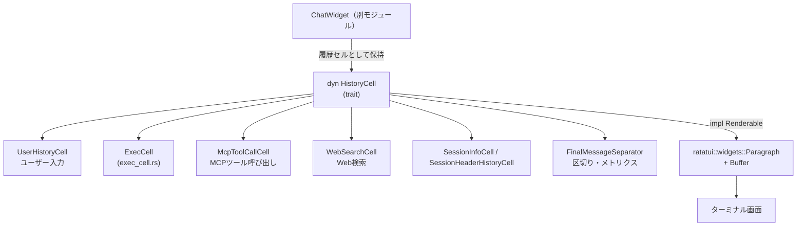
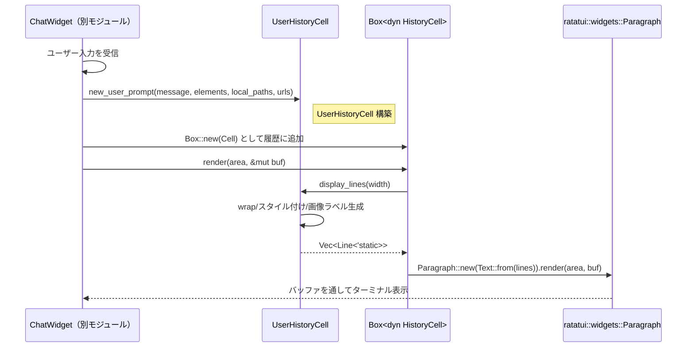
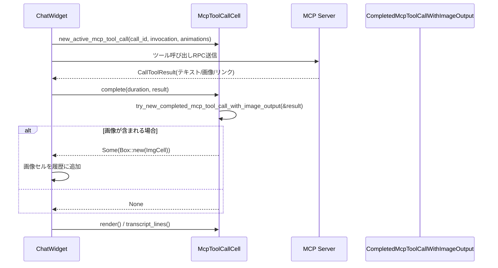

# tui/src/history_cell.rs

## 0. ざっくり一言

Codex TUI の会話履歴に表示される「1セル」を表現するための共通トレイト `HistoryCell` と、その具体実装（ユーザー発話、MCPツール呼び出し、Web検索、セッション情報など）および補助ユーティリティをまとめたモジュールです。

> 行番号について  
> 提供されたチャンクには行番号情報が含まれていないため、以下では根拠を `history_cell.rs:L?-?` のように表記します。この `L?-?` は位置の目安であり、実際の行番号ではありません。

---

## 1. このモジュールの役割

### 1.1 概要

- このモジュールは、**会話履歴を構成する 1 要素（セル）を抽象化・描画する**ために存在し、`HistoryCell` トレイトと多数の実装型を提供します。
- 各セルは「論理行（`Vec<Line<'static>>`）」を生成し、ターミナル幅に応じた高さ計算と transcript 表示（`Ctrl+T` オーバーレイ）も担います。
- MCPツール呼び出し・Web検索・パッチ適用・セッション情報・警告/エラーなど、**Codex が行った操作や状態変化を TUI 上に要約表示する**のが主目的です。

### 1.2 アーキテクチャ内での位置づけ

`ChatWidget` など UI 側コンポーネントと `ratatui` の間で、履歴要素を抽象化するレイヤーです。



- `ChatWidget` は `Box<dyn HistoryCell>` のリストとして履歴を保持（コメントに明示）し、レンダリング時に `Renderable` 実装経由で `ratatui` に渡します。
- 本モジュールは `exec_cell`, `diff_render`, `tooltips`, `legacy_core::config` などと連携し、**履歴の表示ロジックのみ**を担当します。

### 1.3 設計上のポイント

- **共通トレイト `HistoryCell`**  
  - `display_lines(width)` / `desired_height(width)` / `transcript_lines(width)` / `desired_transcript_height(width)` などの共通インターフェースを定義 (`history_cell.rs:L?-?`)。
  - `Send + Sync + Any` 制約により、スレッド間移動や `Any` によるダウンキャストが可能。
- **高さ計算の一元化**  
  - デフォルト `desired_height` は `Paragraph::line_count(width)` を使って、URL のような「折り返し必須の長いトークン」も含めた実際の“行数”を測定 (`history_cell.rs:L?-?`)。
- **transcript オーバーレイ対応**  
  - `transcript_lines` / `desired_transcript_height` と `transcript_animation_tick()` により、`Ctrl+T` オーバーレイでのキャッシュとアニメーション更新を制御 (`history_cell.rs:L?-?`)。
- **安全性重視の文字列処理**  
  - ユーザー入力や `TextElement.byte_range` を扱う箇所では UTF-8 の境界チェックを行い、不正範囲はスキップしてパニックを回避 (`build_user_message_lines_with_elements` 内、`is_char_boundary` チェック)。
- **センシティブ情報のマスキング**  
  - MCP 設定表示では `format_env_display` や HTTP ヘッダ名のみを表示し、シークレット値は出力しない設計（テストで確認、`new_mcp_tools_output` / `new_mcp_tools_output_from_statuses` 付近）。
- **アニメーションと時間依存表示**  
  - MCPツール呼び出しや Web検索などでは `Instant` と `spinner()` を使い、進行中/完了の状態を視覚的に表現 (`McpToolCallCell`, `WebSearchCell`, `McpInventoryLoadingCell`)。

---

## 2. 主要な機能一覧（コンポーネントインベントリー）

> 行位置は `history_cell.rs:L?-?` としています（実際の行番号は不明）。

### 2.1 抽象インターフェース

- `trait HistoryCell` (`L?-?`):  
  会話履歴セルの共通インターフェース。論理行生成・高さ計算・transcript表示・アニメーション tick・ストリーム継続フラグなど。

- `impl Renderable for Box<dyn HistoryCell>` (`L?-?`):  
  `HistoryCell` を `ratatui` の `Renderable` として描画するブリッジ。高さに応じて自動スクロール。

### 2.2 一般メッセージ系セル

- `UserHistoryCell` (`L?-?`):  
  ユーザー入力メッセージ + リッチテキスト要素 + 画像参照を表示。
- `AgentMessageCell` (`L?-?`):  
  エージェント（Codex）側メッセージの 1行または続き行。ストリーミング時の継続フラグあり。
- `PlainHistoryCell` (`L?-?`):  
  既に構築済みの `Vec<Line>` をそのまま表示する素朴なセル。
- `PrefixedWrappedHistoryCell` (`L?-?`):  
  任意テキストを、先頭行と継続行用のプレフィックス付きでワードラップする汎用セル。
- `CompositeHistoryCell` (`L?-?`):  
  複数の `HistoryCell` を縦に結合して 1 セルとして扱う合成セル。

### 2.3 セッション情報・ヘッダ・ツールチップ

- `SessionHeaderHistoryCell` (`L?-?`):  
  モデル名・reasoning level・fast ステータス・カレントディレクトリを枠付きカードとして表示。
- `SessionInfoCell` (`L?-?`):  
  セッションヘッダ + 初回ヘルプ or ツールチップ/モデル変更通知をまとめたラッパー。
- `TooltipHistoryCell` (`L?-?`):  
  Markdown で書かれた Tip をインデント付きで表示。
- `UpdateAvailableHistoryCell` (`L?-?`):  
  CLI のアップデート案内を枠付きカードとして表示。

### 2.4 コマンド実行 / 背景ターミナル

- `UnifiedExecInteractionCell` (`L?-?`):  
  背景ターミナルへの入力（`stdin`）または「待機のみ」を表示。
- `UnifiedExecProcessesCell` + `UnifiedExecProcessDetails` (`L?-?`):  
  `/ps` 風の「背景ターミナルの一覧」を表示。コマンドと最近の出力を要約。
- `PatchHistoryCell` (`L?-?`):  
  `HashMap<PathBuf, FileChange>` をもとに `create_diff_summary` でパッチのファイルレベル要約を表示。
- `FinalMessageSeparator` (`L?-?`):  
  ターン間の区切り線。経過時間や `RuntimeMetricsSummary` を短いラベルにして中央に埋め込む。

### 2.5 MCP / Web / ツール関連

- `McpToolCallCell` (`L?-?`):  
  MCP ツール呼び出しのヘッダ（進行中/成功/失敗）と、ツール結果のテキスト/リソースリンク/エラーを表示。画像結果があれば別セルを返す。
- `CompletedMcpToolCallWithImageOutput` (`L?-?`):  
  MCP 画像出力が存在することを示すシンプルなセル（中身は `DynamicImage` 保持のみ）。
- `WebSearchCell` (`L?-?`):  
  Web検索リクエストの進行/完了とクエリ詳細を表示。
- `McpInventoryLoadingCell` (`L?-?`):  
  MCP インベントリ取得中のスピナー表示セル。
- `empty_mcp_output()` / `new_mcp_tools_output_from_statuses()` など (`L?-?`):  
  MCP サーバ設定や利用可能ツールの一覧を `/mcp` コマンド出力として表示。

### 2.6 リクエスト/プラン/パッチ・イベント系

- `RequestUserInputResultCell` (`L?-?`):  
  `request_user_input` の質問と回答を一覧表示。シークレット回答はマスク。
- `ProposedPlanCell` / `ProposedPlanStreamCell` (`L?-?`):  
  提案されたプランを Markdown 由来の本文として表示（ストリーム版は行列をそのまま保持）。
- `PlanUpdateCell` (`L?-?`):  
  チェックボックス風の todo リスト形式でプラン更新を表示。
- `DeprecationNoticeCell` (`L?-?`):  
  廃止予定機能の要約 + 詳細メッセージ。
- `new_patch_event` / `new_patch_apply_failure` / `new_view_image_tool_call` / `new_image_generation_call` など (`L?-?`):  
  パッチ提案・パッチ適用失敗・画像閲覧・画像生成などの履歴イベント生成関数。
- `new_warning_event` / `new_info_event` / `new_error_event` (`L?-?`):  
  警告/情報/エラー行を生成するヘルパー。

### 2.7 Reasoning 要約系

- `ReasoningSummaryCell` (`L?-?`):  
  推論サマリ本文を Markdown として描画し、淡色・イタリックで表示。
- `new_reasoning_summary_block` (`L?-?`):  
  reasoning バッファ全体から `**ヘッダ**` とサマリ本文を切り出して、`ReasoningSummaryCell` を生成。

### 2.8 ユーティリティ

- `with_border` / `with_border_with_inner_width` (`L?-?`):  
  任意の `Vec<Line>` を枠線付きカードにする共通ロジック。
- `padded_emoji` (`L?-?`):  
  絵文字 + ヘアスペース(U+200A)を返し、見た目上の適切な余白を確保。
- `runtime_metrics_label` / `format_duration_ms` / `pluralize` (`L?-?`):  
  `RuntimeMetricsSummary` を人間可読なラベル文字列に整形。
- `wrap_with_prefix` / `split_request_user_input_answer` (`L?-?`):  
  質問・回答のラップと「user_note: …」の分離。

---

## 3. 公開 API と詳細解説

### 3.1 主要な型一覧

> 代表的な型に絞っています。`定義位置` の `L?-?` は行番号不明を意味します。

| 名前 | 種別 | 役割 / 用途 | 定義位置（目安） |
|------|------|------------|------------------|
| `HistoryCell` | トレイト | 履歴セル共通インターフェース。幅依存の行生成・高さ計算・transcript・アニメーション tick。 | `history_cell.rs:L?-?` |
| `UserHistoryCell` | 構造体 | ユーザー発話とテキスト要素・画像参照の表示。 | `L?-?` |
| `ReasoningSummaryCell` | 構造体 | reasoning サマリ本文を Markdown で淡色表示。 | `L?-?` |
| `AgentMessageCell` | 構造体 | エージェントメッセージ（stream 中の先頭/継続行）。 | `L?-?` |
| `PlainHistoryCell` | 構造体 | 既存の行ベクタをそのまま表示するシンプルなセル。 | `L?-?` |
| `PrefixedWrappedHistoryCell` | 構造体 | プレフィックス付きでワードラップする汎用セル。 | `L?-?` |
| `CompositeHistoryCell` | 構造体 | 複数セルの結合表示。 | `L?-?` |
| `SessionHeaderHistoryCell` | 構造体 | モデル/ディレクトリ等を枠付きで表示するヘッダ。 | `L?-?` |
| `SessionInfoCell` | 構造体 | セッションヘッダ + ヘルプ/ツールチップ/モデル変更をまとめたセル。 | `L?-?` |
| `McpToolCallCell` | 構造体 | MCP ツール呼び出しのヘッダ + 結果を表示。 | `L?-?` |
| `WebSearchCell` | 構造体 | Web 検索呼び出しのヘッダ + 詳細を表示。 | `L?-?` |
| `McpInventoryLoadingCell` | 構造体 | MCP インベントリ取得中のスピナー表示。 | `L?-?` |
| `RequestUserInputResultCell` | 構造体 | request_user_input の質問と回答の一覧。 | `L?-?` |
| `ProposedPlanCell` / `ProposedPlanStreamCell` | 構造体 | 提案プラン（静的版/ストリーム版）表示。 | `L?-?` |
| `PlanUpdateCell` | 構造体 | チェックボックス風のプラン更新表示。 | `L?-?` |
| `PatchHistoryCell` | 構造体 | パッチ変更のファイルごとのサマリ表示。 | `L?-?` |
| `FinalMessageSeparator` | 構造体 | 「Worked for…」やランタイムメトリクスを含む区切り線。 | `L?-?` |
| `DeprecationNoticeCell` | 構造体 | 非推奨機能の告知。 | `L?-?` |
| `UpdateAvailableHistoryCell` | 構造体 | CLI アップデート通知。 | `L?-?` |
| `UnifiedExecInteractionCell` | 構造体 | 背景ターミナルとのやり取り表示。 | `L?-?` |
| `UnifiedExecProcessDetails` | 構造体 | 背景ターミナル 1 セッションの表示用情報。 | `L?-?` |
| `ApprovalDecisionActor` | enum | 承認アクター（User / Guardian）。表示文言の分岐に使用。 | `L?-?` |

この他、テスト専用型や内部用構造体（`TooltipHistoryCell`, `CompletedMcpToolCallWithImageOutput` など）も存在します。

### 3.2 重要関数/メソッド 詳細（7件）

#### 1. `trait HistoryCell`（主に `display_lines` / `desired_height` / transcript 系）

**概要**

- 会話履歴の1セルを表現するための抽象インターフェースです。
- 幅に応じた行生成・高さ計算、transcript 表示、および時間依存のアニメーション tick を定義します。  
  （`history_cell.rs:L?-?`）

**主なメソッド**

| メソッド | 役割 |
|---------|------|
| `fn display_lines(&self, width: u16) -> Vec<Line<'static>>` | メインビューに表示する論理行を生成。 |
| `fn desired_height(&self, width: u16) -> u16` | ビューポートで必要な行数を返す（デフォルト実装あり）。 |
| `fn transcript_lines(&self, width: u16) -> Vec<Line<'static>>` | transcript オーバーレイ用の行を生成（デフォルトは `display_lines`）。 |
| `fn desired_transcript_height(&self, width: u16) -> u16` | transcript 用の高さ。空白行バグ回避ロジック付き。 |
| `fn is_stream_continuation(&self) -> bool` | ストリーム中の「継続セル」かどうか（`AgentMessageCell` などで使用）。 |
| `fn transcript_animation_tick(&self) -> Option<u64>` | 時間依存 UI 用の coarse tick 値。 |

**内部処理の流れ（`desired_height` デフォルト）**

1. `display_lines(width)` で論理行を取得。
2. `Paragraph::new(Text::from(lines))` を生成し、`Wrap { trim: false }` でラップ設定。
3. `line_count(width)` で実際に描画される行数（折り返し込み）を取得。
4. `usize -> u16` に変換し、失敗時は `0` を返す。

**Errors / Panics**

- `desired_height` / `desired_transcript_height` は `try_into().unwrap_or(0)` を使用しており、変換失敗時も panic せず 0 を返します。
- `desired_transcript_height` では「単一の空白行が 2 行とカウントされる」ratatui のバグを検知し、その場合は 1 に補正しています。

**Edge cases**

- `width == 0` の場合: `Paragraph::line_count(0)` の挙動に依存しますが、いくつかの実装では `width == 0` のとき空ベクタを返すことで安全側に倒しています（例: `PrefixedWrappedHistoryCell`, `UnifiedExecInteractionCell`）。
- transcript に時間依存のスピナーなどが含まれるセル (`McpToolCallCell`, `McpInventoryLoadingCell`) は `transcript_animation_tick` を `Some(tick)` にし、`Ctrl+T` キャッシュが更新されるようにしています。

**使用上の注意点**

- 新しいセル型を追加する場合は、**少なくとも `display_lines` を実装**する必要があります。
- 独自の高さ計算や transcript 表示が必要な場合のみ、`desired_height` / `transcript_lines` / `desired_transcript_height` をオーバーライドします。
- 時間依存表示（スピナー等）があるセルは、`transcript_animation_tick` を実装しないと transcript が「静止画」に見える可能性があります。

---

#### 2. `impl Renderable for Box<dyn HistoryCell>::render` / `desired_height`

**シグネチャ**

```rust
impl Renderable for Box<dyn HistoryCell> {
    fn render(&self, area: Rect, buf: &mut Buffer) { ... }
    fn desired_height(&self, width: u16) -> u16 { ... }
}
```

**概要**

- `HistoryCell` を `ratatui` の `Renderable` として描画する実装です。
- セルの内容がビューポートより長い場合は、**自動的に下端にスクロール**して最新の行を見せる動作を行います。  
  （`history_cell.rs:L?-?`）

**引数**

| 引数名 | 型 | 説明 |
|--------|----|------|
| `area` | `Rect` | 描画領域（位置と幅高さ）。 |
| `buf`  | `&mut Buffer` | `ratatui` の描画バッファ。 |

**内部処理の流れ**

1. `self.display_lines(area.width)` でセルの論理行を取得。
2. `Paragraph::new(Text::from(lines)).wrap(Wrap { trim: false })` を構築。
3. 高さ `area.height` と `Paragraph::line_count(area.width)` を比較し、オーバーフロー行数を計算。
4. オーバーフロー行数を `u16` に変換（失敗時は `u16::MAX`）し、`Paragraph::scroll((y, 0))` でその分だけ縦スクロール。
5. `paragraph.render(area, buf)` で描画。

**Errors / Panics**

- `u16::try_from(overflow).unwrap_or(u16::MAX)` としているため、オーバーフローが `u16` に収まらない場合でも panic せず最大値にフォールバックします。

**Edge cases**

- `area.height == 0` の場合、`y = 0` としてスクロールなしで呼び出します（結果として何も表示されないが安全）。
- セルの `desired_height` は `HistoryCell::desired_height` に委譲しています。

**使用上の注意点**

- 新たな `HistoryCell` 実装は `Renderable` 実装を意識する必要はありませんが、**`display_lines` が `width` に依存していること**を前提に設計すると表示崩れを避けられます。

---

#### 3. `UserHistoryCell::display_lines(&self, width: u16) -> Vec<Line<'static>>`

**概要**

- ユーザー入力メッセージ・テキスト要素 (`TextElement`)・リモート画像 URL の一覧を、会話ビュー用の行に変換します。  
  （`history_cell.rs:L?-?`）

**引数**

| 引数名 | 型 | 説明 |
|--------|----|------|
| `width` | `u16` | ビューポート幅（セル全体）。LIVEプレフィックス分は内部で控除。 |

**戻り値**

- `Vec<Line<'static>>`: プレフィックス・ラップ・空行を含んだ論理行列。

**内部処理の流れ**

1. **ラップ幅の計算**  
   - `wrap_width = width.saturating_sub(LIVE_PREFIX_COLS + 1).max(1)` として、左プレフィックス + 右マージン 1 列を確保。
2. **スタイル決定**  
   - 本文スタイル `style = user_message_style()`、テキスト要素用スタイル `element_style = style.fg(Color::Cyan)`。
3. **リモート画像行の構築**（あれば）  
   - `remote_image_urls` を列挙し、`remote_image_display_line(element_style, index+1)` で `[Image #N]` 風ラベル行を生成。
   - `adaptive_wrap_lines` でラップ。
4. **メッセージ本文の構築**  
   - `message` が空 かつ `text_elements` が空なら None。
   - `text_elements` が空なら:
     - `trim_end_matches(['\r', '\n'])` で末尾の改行を削除。
     - 行ごとに `style` を適用し `adaptive_wrap_lines` でラップ。
     - `trim_trailing_blank_lines` で末尾の空行を1つだけに抑える。
   - `text_elements` があるなら:
     - `build_user_message_lines_with_elements` で、`byte_range` を考慮しつつ要素を行内にインライン挿入。UTF-8 境界チェックで不正範囲をスキップ。
     - その後 `adaptive_wrap_lines`・`trim_trailing_blank_lines`。
5. 両方とも None の場合は空ベクタを返す（何も表示しない）。
6. それ以外:
   - 先頭に空行（スタイル付き）を追加。
   - 画像があれば `"  "` プレフィックスでインデントして追加し、その後に空行。
   - 本文は `"› ".bold().dim()` を初期プレフィックス、 `"  "` を継続プレフィックスとして `prefix_lines` でインデント。
   - 末尾に空行を 1 行追加。

**Errors / Panics**

- UTF-8 バイト境界は `is_char_boundary` で検査し、不正な `TextElement.byte_range` は単にスキップするため panic しません。
- `width` に対しては `saturating_sub` と `max(1)` を併用しており、0 や小さい値でも安全側で処理されます。

**Edge cases**

- `width` が極端に小さい（`LIVE_PREFIX_COLS + 1` 以下）場合でも、`wrap_width` は最小 1 として処理されます。
- メッセージが空で画像のみのとき: 画像リストだけがプレフィックス付きで表示されます（テストで検証）。
- メッセージ末尾に複数の空行がある場合: `trim_trailing_blank_lines` により、履歴表示上は不要な空白が抑制されます（テスト `user_history_cell_trims_trailing_blank_message_lines*` 参照）。

**使用上の注意点**

- `text_elements` の `byte_range` は UTF-8 境界を前提にしていますが、守られていなくても無視されるだけでセル全体は壊れません。
- ローカル画像パス (`local_image_paths`) は保持されますが、このセルでは表示に使用していません（表示用はリモート URL ベース）。

---

#### 4. `SessionHeaderHistoryCell::display_lines(&self, width: u16) -> Vec<Line<'static>>`

**概要**

- セッションヘッダカード（`>_ OpenAI Codex (vX)`、モデル表示、ディレクトリ表示）を、枠線付きボックスとして描画します。  
  （`history_cell.rs:L?-?`）

**引数**

| 引数名 | 型 | 説明 |
|--------|----|------|
| `width` | `u16` | ビューポート幅。枠線等を考慮して内側幅を計算。 |

**戻り値**

- 枠線込みの `Vec<Line<'static>>`。

**内部処理の流れ**

1. `card_inner_width(width, SESSION_HEADER_MAX_INNER_WIDTH)` で内側幅を決定。`width < 4` のときは `None` を返し、空行列。
2. タイトル行用 `title_spans` を構築:  
   `">_ OpenAI Codex (v{version})"` を dim/bold を組み合わせて表現。
3. モデル行:
   - `"model:"` と `"directory:"` のラベル幅を揃えるために `format!("{model_label:<label_width$}")` 形式で整形。
   - モデル名 (`self.model_style` 適用)、`reasoning_label`（minimal〜xhigh / none）、`show_fast_status` が真なら `"fast"` ラベルを magenta で追加。
   - `/model to change` のヒントも付与。
4. ディレクトリ行:
   - `format_directory(Some(dir_max_width))` でホーム相対表示 + 幅に応じた中央トランケートを適用。
5. これら 4 行を `with_border` に渡し、枠線付きのカードに変換。

**Errors / Panics**

- `card_inner_width` / `with_border` では `saturating_sub` と `max` を使用し、幅に応じて安全に処理します。
- トランケート処理は `UnicodeWidthStr` ベースで行われ、マルチバイト文字列の途中で切断しないよう配慮されています（テストで確認）。

**Edge cases**

- 非常に狭い幅 (`width < 4`) の場合、カードが描けないため空ベクタを返します。
- ディレクトリが長い場合は `center_truncate_path` により中間を `…` で省略（テスト `session_header_directory_center_truncates` 等で確認）。
- reasoning_effort が `None` の場合は reasoning ラベルを表示しません。

**使用上の注意点**

- モデル名のスタイルや色を変えたい場合は、`SessionHeaderHistoryCell::new_with_style` を使用して `model_style` を渡します。

---

#### 5. `new_session_info(...) -> SessionInfoCell`

**シグネチャ（簡略）**

```rust
pub(crate) fn new_session_info(
    config: &Config,
    requested_model: &str,
    event: SessionConfiguredEvent,
    is_first_event: bool,
    tooltip_override: Option<String>,
    auth_plan: Option<PlanType>,
    show_fast_status: bool,
) -> SessionInfoCell
```

**概要**

- `SessionConfiguredEvent` をもとに、セッションヘッダ + 初回ヘルプ or ツールチップ + モデル差分表示を組み合わせた `SessionInfoCell` を構築します。  
  （`history_cell.rs:L?-?`）

**内部処理の流れ**

1. `SessionConfiguredEvent { model, reasoning_effort, .. }` を取り出す。
2. `SessionHeaderHistoryCell::new` を使い、`model`, `reasoning_effort`, `show_fast_status`, `config.cwd`, `CODEX_CLI_VERSION` からヘッダセルを生成。
3. `parts` ベクタにヘッダセルを `Box<dyn HistoryCell>` で追加。
4. `is_first_event` が `true` の場合:
   - 「To get started, describe a task…」以下のヘルプ行群を `PlainHistoryCell` として追加。
5. `is_first_event == false` の場合:
   - `config.show_tooltips` が `true` なら、`tooltip_override` を優先し、なければ `tooltips::get_tooltip(auth_plan, is_fast_tier)` を使用して `TooltipHistoryCell` を追加。
   - `requested_model != model` の場合、`"model changed:"` 以下 3 行の `PlainHistoryCell` を追加。
6. 最後に `SessionInfoCell(CompositeHistoryCell { parts })` を返す。

**Errors / Panics**

- `tooltips::get_tooltip` は `Option<String>` を返し、存在しない場合は何も追加しないためエラーにはなりません。
- `Config`/`SessionConfiguredEvent` のフィールドに対して直接 panicking 操作は行っていません。

**Edge cases**

- `is_first_event = true` の場合:
  - ツールチップと NUX (Model just became available) は表示されず、ヘルプ文が優先される（テストで検証）。
- `config.show_tooltips = false` の場合:
  - `tooltip_override` があっても表示されません（テスト `session_info_hides_tooltips_when_disabled`）。
- `requested_model == model` の場合:
  - モデル変更行は追加されません。

**使用上の注意点**

- 初回セッション開始時 (`is_first_event = true`) かどうかでヘルプ表示が変わる点に注意が必要です。
- `tooltip_override` を渡すと、`tooltips::get_tooltip` の結果より優先されます。

---

#### 6. `McpToolCallCell::display_lines(&self, width: u16) -> Vec<Line<'static>>`

**概要**

- MCP ツール呼び出しの「ヘッダ（Calling/Called + ツール名）」と、「結果（テキスト/リンク/エラー）」を、幅に応じて折り返して表示します。  
  （`history_cell.rs:L?-?`）

**内部処理の流れ（要約）**

1. **ステータス・バレット決定**
   - `self.success()` で `Option<bool>` を取得:
     - `Some(true)` → 成功（緑バレット）。
     - `Some(false)` → 失敗（赤バレット）。
     - `None` → 進行中（`spinner` によるアニメーション）。
   - `header_text = "Called"` or `"Calling"` を決定。
2. **ヘッダ行構築**
   - `format_mcp_invocation(self.invocation.clone())` で `server.tool(args)` 形式の `Line` を生成。
   - `compact_header` に `bullet + " " + header_text.bold() + " "` を乗せ、残り幅に `invocation_line` をインラインに収められるか判定。
   - 収まる場合: 1 行にまとめて表示。
   - 収まらない場合: ヘッダ行と、`invocation_line` のラップ行（`adaptive_wrap_line` + `prefix_lines("  └ ", "    ")`）を別行として表示。
3. **詳細行（結果コンテンツ）**
   - `detail_wrap_width = (width as usize).saturating_sub(4).max(1)` を計算（プレフィックス分を除去）。
   - `self.result` が `Some` の場合:
     - `Ok(CallToolResult { content, .. })`:  
       各 `serde_json::Value` ブロックに対して `render_content_block(block, detail_wrap_width)` を実行:
       - `rmcp::model::Content` に parse できれば `RawContent` の種別に応じてテキスト or プレースホルダ文字列（`<image content>` 等）に整形。
       - parse 失敗時はそのまま JSON 文字列を `format_and_truncate_tool_result` で整形。
       - 各行を `adaptive_wrap_line` で折り返し、dim スタイルで追加。
     - `Err(err)`:  
       `"Error: {err}"` を整形・折り返しして dim で表示。
4. **詳細行のプレフィックス**
   - 詳細行が存在する場合、ヘッダがインラインなら `"  └ "`、改行されている場合は `"    "` を初期プレフィックスとして `prefix_lines` でインデント。

**Errors / Panics**

- JSON デシリアライズエラーや base64 デコードエラーは `Result::ok()?` / `map_err(|e| { error!(...); e }).ok()?` として握りつぶし、単に結果を表示しないかプレースホルダを表示するだけで panic はしません。
- `format_mcp_invocation` 内の `serde_json::to_string` 失敗時も `unwrap_or_else` で `Value::to_string()` にフォールバックしています。

**Edge cases**

- 進行中の呼び出し (`result.is_none()`):  
  - スピナー + `"Calling"` ラベルのみが表示されます。
- コンテンツが空 (`content.is_empty()`):  
  - 詳細行は表示されません（ヘッダのみ）。
- 画像が含まれる場合:  
  - 本セルでは `<image content>` のようなテキスト表示のみ。実際の画像は `complete()` 内で別セル `CompletedMcpToolCallWithImageOutput` として追加されます（`try_new_completed_mcp_tool_call_with_image_output`）。

**使用上の注意点**

- 呼び出し完了時には `complete(duration, result)` を呼び、必要なら追加セルを履歴に挿入します。
- 表示幅が狭い場合、`server.tool(args)` 部分は複数行に折り返され、詳細行のプレフィックスも `"  └ "` / `"    "` によって揃えられます。

---

#### 7. `new_reasoning_summary_block(full_reasoning_buffer: String, cwd: &Path) -> Box<dyn HistoryCell>`

**概要**

- reasoning ブロック全体のテキストから、`**ヘッダ**` 部分とサマリ本文を切り出し、履歴用の `ReasoningSummaryCell` を生成します。  
  （`history_cell.rs:L?-?`）

**内部処理の流れ**

1. `full_reasoning_buffer.trim()` で前後の空白を除去。
2. 最初の `"**"` の位置 `open` を探す。見つからなければ fallback パスへ。
3. `open + 2` 以降で次の `"**"` の位置 `close` を探す。見つからなければ fallback。
4. `after_close_idx = open + 2 + close + 2` を計算し、そこより後ろに文字があれば:
   - `header_buffer = full[..after_close_idx]`
   - `summary_buffer = full[after_close_idx..]`
   - `ReasoningSummaryCell::new(header_buffer, summary_buffer, cwd, transcript_only = false)` を返す。
5. 上記条件を満たさない場合:
   - `ReasoningSummaryCell::new("".to_string(), full_reasoning_buffer.to_string(), cwd, transcript_only = true)` を返す。

**Errors / Panics**

- 文字列インデックスは `find("**")` の結果から計算されるため、UTF-8 境界を壊さない形でスライスをとっています。
- `cwd.to_path_buf()` のみでファイルシステムアクセスはありません。

**Edge cases**

- `**ヘッダ` で閉じ `**` が無い場合:  
  reasoning 全体を transcript-only の `ReasoningSummaryCell` で表示します（テスト `reasoning_summary_block_falls_back_when_header_is_missing`）。
- `**ヘッダ**` しかなくサマリが無い場合:  
  ヘッダのみをサマリとして扱い、transcript-only で表示（テストで確認）。
- サマリが URL のような長いトークンを含む場合:  
  `ReasoningSummaryCell::display_lines` が `adaptive_wrap_lines` を利用し、`desired_height` と実際の高さが整合するようになっています（テスト `reasoning_summary_height_matches_wrapped_rendering_for_url_like_content`）。

**使用上の注意点**

- `full_reasoning_buffer` は reasoning サマリを含む生テキストである前提です。
- `cwd` は後から描画される Markdown 内ローカルファイルリンクの相対解決に使用されるため、**記録時点の cwd をスナップショット**して渡す必要があります（コメントでも明記）。

---

### 3.3 その他の主な関数一覧（抜粋）

| 関数名 | 役割（1 行） |
|--------|--------------|
| `new_user_prompt(...) -> UserHistoryCell` | ユーザー入力（本文・テキスト要素・画像）から `UserHistoryCell` を構築。 |
| `new_unified_exec_interaction(...) -> UnifiedExecInteractionCell` | 背景ターミナルとのインタラクション（入力 or 待機）イベントセルを生成。 |
| `new_unified_exec_processes_output(...) -> CompositeHistoryCell` | `/ps` コマンド出力用に、コマンド行 + プロセス要約セルをまとめて生成。 |
| `new_approval_decision_cell(...) -> Box<dyn HistoryCell>` | 実行/ネットワーク承認の結果を 1 行サマリとして表示。 |
| `new_guardian_denied_*` / `new_guardian_approved_action_request` | Guardian による承認/拒否イベントをサマリ表示。 |
| `new_review_status_line(message: String)` | レビュー状態をシアン 1 行で表示。 |
| `new_mcp_inventory_loading(animations_enabled: bool)` | MCP インベントリ取得中のスピナーセルを生成。 |
| `new_plan_update(update: UpdatePlanArgs) -> PlanUpdateCell` | プラン更新イベントを todo リスト形式に変換。 |
| `new_proposed_plan(...) -> ProposedPlanCell` | 提案プランの Markdown を静的セルに変換。 |
| `new_patch_event(...) -> PatchHistoryCell` | ファイル変更サマリからパッチ提案セルを構築。 |
| `new_warning_event` / `new_info_event` / `new_error_event` | 警告/情報/エラーの単一行セルを生成。 |
| `runtime_metrics_label(RuntimeMetricsSummary) -> Option<String>` | 最終メッセージ区切り用にランタイムメトリクスを 1 行ラベルへ整形。 |

---

## 4. データフロー

ここでは代表的な 2 つのシナリオを示します。

### 4.1 ユーザー入力 → 履歴表示の流れ



要点:

- `ChatWidget` は `new_user_prompt` を呼んで `UserHistoryCell` を作成し、`Box<dyn HistoryCell>` として保持します。
- レンダリング時は `Renderable` 実装が `display_lines` を呼び出し、ラップやプレフィックス処理の済んだ `Line` 行列を `ratatui` に渡します。

### 4.2 MCP ツール呼び出し → 結果表示 + 画像セル



要点:

- 進行中は `McpToolCallCell` がスピナー付き `"Calling"` 行を表示し、`transcript_animation_tick` でオーバーレイ更新を促します。
- 完了後は `complete()` が結果を内部に保持し、`display_lines` がテキスト/エラー/リソースリンクを整形します。
- 画像ブロックが 1 つ以上含まれていれば、補助セル `CompletedMcpToolCallWithImageOutput` を追加して「画像出力がある」ことを通知します。

---

## 5. 使い方（How to Use）

### 5.1 基本的な使用方法

`HistoryCell` を直接扱うコードは概ね次のような流れになります。

```rust
use tui::history_cell::{
    new_session_info,
    new_user_prompt,
    new_active_mcp_tool_call,
    HistoryCell,
};
use ratatui::prelude::*;

// Config / SessionConfiguredEvent は別モジュールから取得する
fn build_initial_cells(config: &Config, event: SessionConfiguredEvent) -> Vec<Box<dyn HistoryCell>> {
    // セッション情報セル
    let session_info = new_session_info(
        config,
        "gpt-4o",
        event,
        /*is_first_event*/ true,
        /*tooltip_override*/ None,
        /*auth_plan*/ None,
        /*show_fast_status*/ true,
    );

    // ユーザー入力セル
    let user_cell = new_user_prompt(
        "Fix the failing tests in history_cell.rs".to_string(),
        Vec::new(),                       // TextElement なし
        Vec::new(),                       // ローカル画像なし
        Vec::new(),                       // リモート画像なし
    );

    vec![
        Box::new(session_info) as Box<dyn HistoryCell>,
        Box::new(user_cell) as Box<dyn HistoryCell>,
    ]
}

// 描画側では Box<dyn HistoryCell> を Renderable として扱える
fn render_cell(cell: &Box<dyn HistoryCell>, area: Rect, buf: &mut Buffer) {
    cell.render(area, buf);
}
```

### 5.2 よくある使用パターン

- **背景ターミナルの操作ログ**

  ```rust
  // 入力付きインタラクション
  let cell = new_unified_exec_interaction(
      Some("echo hello".to_string()),
      "ls\npwd".to_string()
  );
  let box_cell: Box<dyn HistoryCell> = Box::new(cell);
  ```

- **MCP ツール呼び出しの進行表示**

  ```rust
  let invocation = McpInvocation {
      server: "search".into(),
      tool: "find_docs".into(),
      arguments: Some(serde_json::json!({ "query": "ratatui styling" })),
  };

  let mut cell = new_active_mcp_tool_call(
      "call-1".into(),
      invocation,
      /*animations_enabled*/ true,
  );

  // 完了時
  let result: Result<codex_protocol::mcp::CallToolResult, String> = /* ... */;
  if let Some(extra_cell) = cell.complete(Duration::from_millis(500), result) {
      // extra_cell は画像結果用セル（存在する場合のみ）
      // ChatWidget 側で履歴に追加する
  }
  ```

- **プラン更新イベント**

  ```rust
  let update = UpdatePlanArgs {
      explanation: Some("Refine error handling".into()),
      plan: vec![
          PlanItemArg { step: "Audit existing errors".into(), status: StepStatus::Completed },
          PlanItemArg { step: "Add retries".into(), status: StepStatus::InProgress },
      ],
  };
  let cell = new_plan_update(update);
  ```

### 5.3 よくある間違いと正しい例

```rust
// 誤り例: width=0 の前提でセルを利用し、何も表示されないのをバグと誤解する
let lines = user_cell.display_lines(0);
// lines は空ベクタになる可能性が高い

// 正しい例: 実際のビューポート幅を渡す
let width = area.width;
let lines = user_cell.display_lines(width);
```

```rust
// 誤り例: MCP ツール結果完了前に result を前提とした処理を行う
let cell = new_active_mcp_tool_call(...);
let lines = cell.display_lines(80);
// result が None のため詳細は描画されない

// 正しい例: complete() 呼び出し後に詳細表示を期待する
let mut cell = new_active_mcp_tool_call(...);
// RPC 完了後
cell.complete(duration, result);
let lines = cell.display_lines(80);
```

### 5.4 使用上の注意点（まとめ）

- **幅に依存する API**  
  - ほぼすべての `display_lines` / `desired_height` は `width` に強く依存します。  
    実際のターミナル幅を渡すことが前提です。
- **時間依存セルの扱い**  
  - スピナー付きセル (`McpToolCallCell`, `McpInventoryLoadingCell`, `WebSearchCell`) は `Instant` を内部に持ち、呼び出しのたびに表示が変わります。タイトなループで頻繁に再描画すると CPU 負荷が上がる可能性があります。
- **センシティブ情報**  
  - MCP 設定出力では値はマスクされますが、環境変数名やヘッダ名は表示されます。ログ収集などを行う場合は、その点を考慮する必要があります。
- **テキスト要素の byte_range**  
  - 不正なバイト範囲は無視されるだけですが、期待通りのハイライトが行われないことがあります。上位層で正しい範囲を渡すことが重要です。

---

## 6. 変更の仕方（How to Modify）

### 6.1 新しいセル種別を追加する場合

1. **構造体の定義**
   - `HistoryCell` を実装する新しい構造体（例: `MyNewCell`）を定義し、表示に必要なフィールドを持たせます。
2. **`HistoryCell` 実装**
   - `display_lines(&self, width: u16)` を実装し、必要に応じて:
     - `desired_height`（特殊な折り返しロジックがある場合）  
     - `transcript_lines` / `desired_transcript_height`（transcript 専用表示がある場合）  
     - `transcript_animation_tick`（スピナーなどがある場合）  
     をオーバーライドします。
3. **コンストラクタ関数の追加**
   - `new_...` 形式のヘルパー関数をモジュールに追加すると、呼び出し側が簡潔に使用できます（他の `new_*` 関数を参照）。
4. **`ChatWidget` 側への統合**
   - 別モジュールの `ChatWidget` 等で、対応するイベント発生時に新セルを生成して履歴に追加するロジックを足します。
5. **テスト**
   - `tests` モジュールのように、`render_lines` を用いたスナップショットテストまたは文字列比較テストを追加すると、レイアウト崩れ検出に有効です。

### 6.2 既存機能を変更する場合の注意点

- **高さ計算の契約**
  - `desired_height` は `display_lines` の行数とは一致しない場合があります（長い URL など）。`Paragraph::line_count` と整合していることが重要です。
- **transcript とメインビューの同期**
  - 時間依存セルでは、`transcript_animation_tick` が `None` のままだと transcript が更新されません。可視性要件に応じて tick を更新する必要があります。
- **センシティブ情報の出力**
  - MCP 関連の出力 (`new_mcp_tools_output_from_statuses` など) を変更する場合は、**シークレットを誤って平文で出さない**よう、既存のマスキングロジックに倣う必要があります。
- **テストスナップショット**
  - 本ファイルには多数の `insta::assert_snapshot!` テストがあり、見た目の変更はこれらを更新する必要があります。変更前後で意図した差分かを確認してください。

---

## 7. 関連ファイル

| パス | 役割 / 関係 |
|------|------------|
| `tui/src/history_cell/hook_cell.rs` | `HookCell`, `new_active_hook_cell`, `new_completed_hook_cell` を提供。コードはこのチャンクには含まれていませんが、同じ `HistoryCell` 体系の一部です。 |
| `tui/src/exec_cell.rs` | コマンド実行セル `ExecCell` 等を定義し、本モジュールの `HistoryCell` 実装（テスト内）と組み合わせて表示されています。 |
| `tui/src/diff_render.rs` | `create_diff_summary` を提供し、`PatchHistoryCell` が差分サマリ表示に利用します。 |
| `tui/src/live_wrap.rs`, `tui/src/wrapping.rs` | `adaptive_wrap_line(s)` や `RtOptions` など、URL などを壊さない改行ロジックを提供。多くのセルのラップ処理の基盤です。 |
| `tui/src/markdown.rs` | `append_markdown` を提供し、`ReasoningSummaryCell`, `TooltipHistoryCell`, `ProposedPlanCell` などが Markdown → `Vec<Line>` 変換に利用します。 |
| `tui/src/style.rs` | `user_message_style`, `proposed_plan_style` などスタイル定義を提供します。 |
| `tui/src/ui_consts.rs` | `LIVE_PREFIX_COLS` を定義し、`UserHistoryCell` のラップ幅計算に使用されます。 |
| `legacy_core::config` 他 | `Config`, MCP 設定、ツールチップなど、`new_session_info`, MCP 出力系関数で参照されるドメイン設定。 |

---

### 安全性・エラー・並行性のまとめ（横断的）

- **所有権 / 借用**  
  - すべてのセル型は所有データ（`String`, `PathBuf` など）を内部に保持し、`display_lines` は `&self` で読み取り専用のため、Rust の所有権システムによりデータ競合は防がれます。
- **エラーハンドリング**  
  - JSON デコード・base64 デコード・画像デコードはいずれも `Result` を `ok()?` などで落とし、失敗時はログ (`tracing::error!`) を出して `None` を返す設計で、ユーザーへの表示は省略またはプレースホルダになります。
  - 行数計算などの変換エラーは `unwrap_or` でデフォルト値にフォールバックし、panic を避けています。
- **並行性**  
  - トレイトが `Send + Sync` を要求しているため、`Box<dyn HistoryCell>` はスレッド間で安全に移動・共有可能です。ただし通常の使用では TUI スレッド内でのみ操作される想定です。
  - 内部に `Instant` や `Duration` を持つセルはありますが、`Arc<Mutex<...>>` などの共有可変状態は使用していません。

---

### バグ/セキュリティ上の観点（簡潔）

- MCP/HTTP 設定の出力では、ヘッダ値・トークンをマスクする設計であり、ログにシークレットが漏れないよう配慮されています（テスト `mcp_tools_output_masks_sensitive_values` 参照）。
- MCP 画像デコード失敗時は `tracing::error!` で記録しつつ結果を捨てるだけのため、サービス拒否やクラッシュにはつながりにくい設計です。
- 長い URL やトークンについて専用ラップ処理 (`adaptive_wrap_line(s)` + `take_prefix_by_width`) が使われており、途中でトークンが分断されないようになっています。これによりリンクコピペ性が保たれます。

このモジュールを理解しておけば、Codex TUI の「履歴の見え方」を安全に拡張・調整できるようになります。
