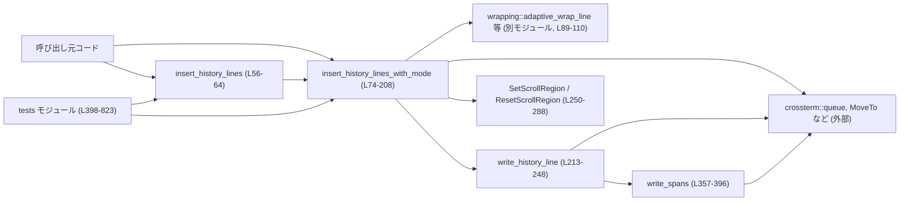
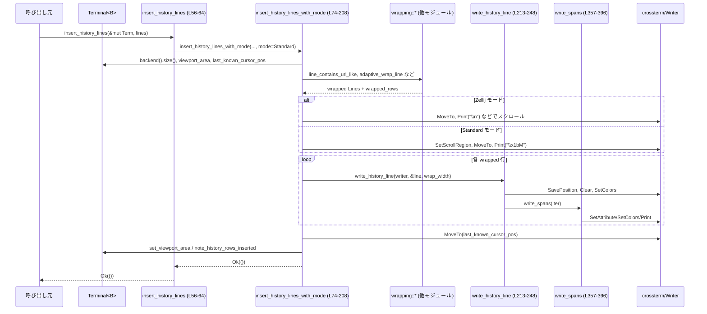

# tui/src/insert_history.rs コード解説

## 0. ざっくり一言

端末のスクロール領域（履歴行）に「過去の出力行」を**ビューポートの上側に差し込む**ためのユーティリティです。  
通常の端末と Zellij で挙動が違うことを吸収しつつ、URL や Markdown 由来のスタイルを保ったまま行を挿入します（`insert_history.rs:L32-L208, L213-L248, L357-L396`）。

---

## 1. このモジュールの役割

### 1.1 概要

- このモジュールは、**スクロールバック（履歴）に行を追加しつつ、現在のビューポートを維持**する処理を提供します（`insert_history.rs:L54-L64, L74-L208`）。
- 端末の種類に応じて、  
  - DECSTBM/Reverse Index を使った高速なスクロール（通常端末）  
  - Zellij 互換のための単純な改行スクロール  
  の 2 通りのエスケープ列戦略を切り替えます（`insert_history.rs:L32-L42, L119-L145, L146-L194`）。
- URL を含む行の折り返し・色付きのプレフィックスなど、Markdown レンダリング結果の見た目を壊さないようにしながら、スクリーンバッファを更新します（`insert_history.rs:L89-L117, L213-L248, L357-L396`）。

### 1.2 アーキテクチャ内での位置づけ

主な依存関係とコールグラフを簡略化すると次のようになります。



- 呼び出し元は `crate::custom_terminal::Terminal<B>` を持っており、`insert_history_lines` または `insert_history_lines_with_mode` を呼び出します（`insert_history.rs:L56-L64, L74-L81`）。
- 行挿入の前処理として URL に配慮した折り返しを `crate::wrapping` モジュールに委譲しています（`insert_history.rs:L89-L110`）。
- 実際の文字描画は `write_history_line` → `write_spans` → `crossterm::queue!` という流れで行われます（`insert_history.rs:L213-L248, L357-L396`）。
- スクロール領域の設定・解除を行うために、独自の `SetScrollRegion` / `ResetScrollRegion` 型を `crossterm::Command` として実装しています（`insert_history.rs:L250-L288`）。

### 1.3 設計上のポイント

コードから読み取れる設計上の特徴は次の通りです。

- **モード切り替えによる責務分離**  
  - `InsertHistoryMode` によって、通常端末用と Zellij 用の挿入戦略を分けつつ、同じ API (`insert_history_lines_with_mode`) で扱えるようにしています（`insert_history.rs:L32-L51, L119-L145, L146-L194`）。
- **URL を壊さないラップ戦略**  
  - URL らしき行をそのまま流し、混在行は適応的ラップを行うことで、端末側の URL 検出機能を活かしつつ、プレフィックスなどの体裁も崩さないようにしています（`insert_history.rs:L89-L110`）。
- **カーソル位置の保存・復元**  
  - `insert_history_lines_with_mode` の処理中にカーソルを動かしますが、最後に `last_known_cursor_pos` に戻すことで、呼び出し元から見たカーソル位置を変えない方針です（`insert_history.rs:L86-L87, L196-L197`）。
- **`Terminal` への変更は明示的に記録**  
  - ビューポート位置の更新や挿入された履歴行数は `Terminal` のメソッド経由で記録し、後続描画に利用できるようにしています（`insert_history.rs:L84-L85, L200-L205`）。
- **スタイル差分の最小エスケープ出力**  
  - `ModifierDiff` と `write_spans` で、前後のスタイル差分に応じて必要最小限の ANSI 属性変更コードを出すようになっています（`insert_history.rs:L290-L355, L357-L388`）。
- **Rust の安全性**  
  - このファイル内に `unsafe` ブロックはなく、すべての端末操作は `Write` と `crossterm::Command` を通じて行われるため、メモリ安全性は Rust の型システムで担保されています（`insert_history.rs` 全体）。

---

## 2. コンポーネント一覧（インベントリー）

### 2.1 型・関数一覧

主な型・関数・メソッドを表にまとめます（行番号はこのファイル断片内の相対行番号です）。

| 名前 | 種別 | 公開 | 役割 / 用途 | 定義位置 |
|------|------|------|-------------|----------|
| `InsertHistoryMode` | enum | 公開 | 履歴挿入時の端末モード（Standard / Zellij）を表す | `insert_history.rs:L32-L42` |
| `InsertHistoryMode::new` | 関数（関連関数） | 公開 | `bool` からモードを選択する簡易コンストラクタ | `insert_history.rs:L44-L51` |
| `insert_history_lines` | 関数 | 公開 | 標準モードで履歴行を挿入する高レベル API | `insert_history.rs:L54-L64` |
| `insert_history_lines_with_mode` | 関数 | 公開 | モード指定付きで履歴行を挿入するコア関数 | `insert_history.rs:L74-L208` |
| `write_history_line` | 関数 | 非公開 | 折り返し済み 1 行を、背景クリアとスタイル適用つきで描画 | `insert_history.rs:L210-L248` |
| `SetScrollRegion` | 構造体 | 公開 | DECSTBM スクロール領域設定用の `crossterm::Command` | `insert_history.rs:L250-L268` |
| `ResetScrollRegion` | 構造体 | 公開 | スクロール領域を画面全体に戻す `crossterm::Command` | `insert_history.rs:L270-L288` |
| `ModifierDiff` | 構造体 | 非公開 | 前後の `Modifier` 差分を計算し、必要な ANSI 属性変更を発行 | `insert_history.rs:L290-L355` |
| `ModifierDiff::queue` | メソッド | 非公開 | 差分に基づき `SetAttribute` コマンドを `queue!` | `insert_history.rs:L295-L353` |
| `write_spans` | 関数 | 非公開 | `Span` 列をスタイル付きで描画し、最後にスタイルをリセット | `insert_history.rs:L357-L396` |
| `tests` モジュール内各テスト | 関数 | テストのみ | 色や折り返し、Zellij モード挙動の回帰テスト | `insert_history.rs:L398-L823` |

---

## 3. 公開 API と詳細解説

### 3.1 型一覧（公開）

| 名前 | 種別 | 役割 / 用途 | 関連関数 |
|------|------|-------------|----------|
| `InsertHistoryMode` | enum | 履歴挿入時のエスケープ戦略を表すモード | `new` / `insert_history_lines_with_mode` |
| `SetScrollRegion` | 構造体 | `ESC [top;bottom r` を出す `crossterm::Command` | `Command::write_ansi` |
| `ResetScrollRegion` | 構造体 | `ESC [r` を出す `crossterm::Command` | 同上 |

### 3.2 重要関数の詳細

#### `InsertHistoryMode::new(is_zellij: bool) -> InsertHistoryMode`

**概要**

- `bool` フラグから `Standard` / `Zellij` のどちらかを選ぶコンストラクタです（`insert_history.rs:L44-L51`）。

**引数**

| 引数名 | 型 | 説明 |
|--------|----|------|
| `is_zellij` | `bool` | Zellij 上で動作している場合に `true` |

**戻り値**

- `InsertHistoryMode::Zellij` または `InsertHistoryMode::Standard`。

**内部処理の流れ**

1. `is_zellij` が `true` なら `Self::Zellij` を返す。
2. それ以外は `Self::Standard` を返す（`insert_history.rs:L45-L50`）。

**Examples（使用例）**

```rust
let mode = InsertHistoryMode::new(std::env::var("ZELLIJ").is_ok());
// Zellij 環境なら Zellij モード、それ以外は Standard モード
```

**Errors / Panics / Edge cases**

- エラーもパニックも発生しません。

**使用上の注意点**

- 単なる `bool` からの変換なので、実際に Zellij 上かどうかの判定ロジックは呼び出し側で適切に行う必要があります。

---

#### `pub fn insert_history_lines<B>(terminal: &mut Terminal<B>, lines: Vec<Line>) -> io::Result<()>`

（`insert_history.rs:L54-L64`）

**概要**

- 現在のビューポートの**直前（上側）**に `lines` を履歴として挿入する高レベル関数です。
- 内部で `InsertHistoryMode::Standard` を指定して `insert_history_lines_with_mode` を呼び出します。

**引数**

| 引数名 | 型 | 説明 |
|--------|----|------|
| `terminal` | `&mut crate::custom_terminal::Terminal<B>` | 対象のカスタム端末。ビューポートなどの状態を保持（`insert_history.rs:L56-L57`）。 |
| `lines` | `Vec<Line>` | 挿入したい行のリスト（`ratatui::text::Line`） |

**型パラメータ**

- `B: Backend + Write`  
  - `ratatui::prelude::Backend` と `std::io::Write` を実装しているバックエンド（`insert_history.rs:L60-L61`）。

**戻り値**

- 成功時：`Ok(())`  
- 失敗時：端末への書き込みや `queue!` マクロ由来の `io::Error`（`insert_history.rs:L63` 経由で伝播）。

**内部処理の流れ**

1. 呼び出し引数をそのまま `insert_history_lines_with_mode` に渡し、モードに `InsertHistoryMode::Standard` を指定するだけの薄いラッパです（`insert_history.rs:L63`）。

**Examples（使用例）**

```rust
use ratatui::text::Line;

fn add_history_line<B: ratatui::prelude::Backend + std::io::Write>(
    term: &mut crate::custom_terminal::Terminal<B>,
) -> std::io::Result<()> {
    let line = Line::from("hello history"); // 単純な 1 行
    insert_history_lines(term, vec![line])  // ビューポート上に挿入
}
```

**Errors / Panics**

- 内部の `insert_history_lines_with_mode` からの `io::Error` をそのまま返します。
- この関数自身では `panic!` は使用していません。

**Edge cases**

- `lines` が空 `Vec` の場合は、内部で `wrapped_lines == 0` となり、`note_history_rows_inserted` が呼ばれない以外は特に変化がない形で処理が終わります（`insert_history.rs:L103-L117, L203-L205`）。

**使用上の注意点**

- `terminal` への可変参照 `&mut` が必要なため、同時に複数スレッドから同じ端末を操作することは Rust の型システム上できません。これにより、端末状態の競合を防いでいます。
- Zellij で動かす場合は、この関数ではなく `insert_history_lines_with_mode` に `InsertHistoryMode::Zellij` を明示的に渡す必要があります。

---

#### `pub fn insert_history_lines_with_mode<B>(terminal: &mut Terminal<B>, lines: Vec<Line>, mode: InsertHistoryMode) -> io::Result<()>`

（`insert_history.rs:L74-L208`）

**概要**

- 指定したモード（`Standard` / `Zellij`）に応じて、履歴行をビューポート上に挿入する**コア関数**です。
- URL の有無・種類に応じた折り返し、スクロール領域の設定、カーソル位置の維持、`Terminal` の状態更新を一括して行います。

**引数**

| 引数名 | 型 | 説明 |
|--------|----|------|
| `terminal` | `&mut crate::custom_terminal::Terminal<B>` | 書き込み対象の端末。ビューポートや履歴行数などを持つ（`insert_history.rs:L75-L87`）。 |
| `lines` | `Vec<Line>` | 挿入するロジカル行（折り返し前の行）リスト（`insert_history.rs:L76`）。 |
| `mode` | `InsertHistoryMode` | エスケープ戦略を表すモード（`insert_history.rs:L77, L119-L145, L146-L194`）。 |

**型パラメータ**

- `B: Backend + Write`（`insert_history.rs:L79-L80`）

**戻り値**

- 成功時：`Ok(())`  
- 失敗時：`queue!` などで発生した `io::Error`。

**内部処理の流れ（標準モード & Zellij モード共通）**

1. 端末からスクリーンサイズを取得（失敗時は `Size::new(0, 0)` にフォールバック）（`insert_history.rs:L82`）。
2. `terminal.viewport_area` を `area` にコピーし、最終的に変更があれば `set_viewport_area` で更新する準備を行う（`insert_history.rs:L84-L85, L200-L201`）。
3. `last_known_cursor_pos` と `backend_mut()` を取得し、以降の描画に使う（`insert_history.rs:L86-L87`）。
4. **行の事前折り返し**（`insert_history.rs:L89-L117`）  
   - 各 `Line` について：
     - `line_contains_url_like(line)` かつ `!line_has_mixed_url_and_non_url_tokens(line)` なら、その行は分割せずそのまま 1 行として扱う（URL を壊さない）（`insert_history.rs:L104-L107`）。
     - それ以外は `adaptive_wrap_line(line, RtOptions::new(wrap_width))` に通して、URL を壊さないような独自ルールで折り返す（`insert_history.rs:L108-L110`）。
   - 折り返し後の各行の `width()` を用いて、実際に何行の物理行に相当するかを算出し、合計を `wrapped_rows` に加算する（`insert_history.rs:L111-L117`）。
5. `wrapped_rows` を `wrapped_lines: u16` にキャストする（`insert_history.rs:L117`）。

**Zellij モードの処理**

- `matches!(mode, InsertHistoryMode::Zellij)` 分岐内（`insert_history.rs:L119-L145`）。

1. ビューポートの下側の空き (`space_below`) を計算し、下方へシフトできる行数 (`shift_down`) を決める（`insert_history.rs:L120-L122`）。
2. シフトしきれない分はスクリーン全体を上にスクロールするために `\n` を送る（`scroll_up_amount`）（`insert_history.rs:L123-L130`）。
3. シフトできた分だけ `area.y` を増やし、ビューポートが下にずれたことを記録する（`insert_history.rs:L132-L135`）。
4. 追加すべき履歴行の描画開始位置 `cursor_top` を `area.top()` から `scroll_up_amount + shift_down` を引いて計算し、カーソルをそこに移動（`insert_history.rs:L137-L138`）。
5. 折り返し済み `wrapped` を上から順に描画  
   - 2 行目以降は `\r\n` を明示的に追加しつつ `write_history_line` を呼ぶ（`insert_history.rs:L140-L145`）。

**Standard モードの処理**

- `else` ブロック内（`insert_history.rs:L146-L194`）。

1. まず「ビューポートの下側に空きがあるならそこを使う」処理：  
   - `area.bottom() < screen_size.height` の場合（`insert_history.rs:L147`）：
     - `wrapped_lines` か `screen_size.height - area.bottom()` の小さいほうだけ、`ESC M`（Reverse Index）でスクロールバックを下に押し出す（`insert_history.rs:L148-L155`）。
     - その間、スクロール領域を `top_1based..screen_size.height` に限定し、ビューポートの位置を `area.y += scroll_amount` で下げる（`insert_history.rs:L150-L161`）。
   - そうでない場合は単に `cursor_top = area.top().saturating_sub(1)` とし、直上の行から履歴を積み上げる（`insert_history.rs:L162-L164`）。
2. 続いて、「画面上部〜ビューポート上端」だけをスクロール対象とするスクロール領域を設定（`SetScrollRegion(1..area.top())`）（`insert_history.rs:L166-L181`）。
3. `cursor_top` にカーソルを置き（`MoveTo`）、`wrapped` 各行について `\r\n` の後 `write_history_line` を呼ぶ（`insert_history.rs:L183-L191`）。
4. 最後に `ResetScrollRegion` を出してスクロール領域をクリアする（`insert_history.rs:L193`）。

**共通の後処理**

1. カーソルを `last_known_cursor_pos` に戻す（`insert_history.rs:L196-L197`）。
2. `should_update_area` が `true` なら `terminal.set_viewport_area(area)` を呼び、ビューポート位置を更新（`insert_history.rs:L199-L201`）。
3. `wrapped_lines > 0` のとき、`terminal.note_history_rows_inserted(wrapped_lines)` で挿入した履歴行数を記録（`insert_history.rs:L203-L205`）。
4. `Ok(())` を返す（`insert_history.rs:L207`）。

**Examples（使用例）**

通常端末での使用例:

```rust
use ratatui::text::Line;
use tui::insert_history::{insert_history_lines, InsertHistoryMode};

fn push_history<B: ratatui::prelude::Backend + std::io::Write>(
    term: &mut crate::custom_terminal::Terminal<B>,
) -> std::io::Result<()> {
    let lines = vec![
        Line::from("> blockquote"), // Markdown blockquote 風
        Line::from("Some explanation"),
    ];
    insert_history_lines(term, lines)
}
```

Zellij 対応を含めた使用例:

```rust
use ratatui::text::Line;
use tui::insert_history::{insert_history_lines_with_mode, InsertHistoryMode};

fn push_history_zellij_aware<B: ratatui::prelude::Backend + std::io::Write>(
    term: &mut crate::custom_terminal::Terminal<B>,
    is_zellij: bool,
) -> std::io::Result<()> {
    let mode = InsertHistoryMode::new(is_zellij);
    let lines = vec![Line::from("zellij compatible history")];
    insert_history_lines_with_mode(term, lines, mode)
}
```

**Errors / Panics**

- `queue!` マクロ・`MoveTo` などを介したすべての I/O エラーが `io::Result` として伝播します（`insert_history.rs:L124-L130, L140-L145, L151-L155, L181-L193`）。
- `terminal.backend().size().unwrap_or(...)` は失敗時にパニックせず、サイズ `(0, 0)` にフォールバックします（`insert_history.rs:L82`）。
- この関数内での `panic!` 呼び出しはありません。

**Edge cases（典型例）**

- **画面サイズ 0 の場合**  
  - `Size::new(0, 0)` になり、`wrap_width` は `area.width.max(1)` により 1 にはなりますが、`space_below` や `screen_size.height` が 0 なので、多くのスクロール操作は `0` のまま実行されます（`insert_history.rs:L82-L83, L100`）。
- **挿入行が非常に多い場合**  
  - `wrapped_rows: usize` を `u16` にキャストしており、`wrapped_rows > u16::MAX` の場合は上位が切り捨てられます（`insert_history.rs:L111-L117`）。実用上問題になりにくいものの、理論上は行数カウントが狂う可能性があります。
- **ビューポートがすでに画面末尾まで達している場合**  
  - Standard モードでは `area.bottom() < screen_size.height` が偽となり、`cursor_top = area.top().saturating_sub(1)` から描画を始めるため、ビューポート直上の行を押し上げる形になります（`insert_history.rs:L147-L164`）。

**使用上の注意点**

- すべて同期 I/O であり、端末への書き込みはブロッキングです。高頻度に呼ぶと全体のレスポンスに影響する可能性があります。
- `Terminal` への可変借用が必要なので、非同期コンテキストで共有したい場合には、呼び出し側で適切な排他制御（Mutex 等）が必要です。ただし、このモジュール自身は並行性制御を行いません。
- `wrapped_lines` を `u16` として扱っているため、履歴行数のカウントやビューポート更新ロジックは `u16` 上限を暗黙の前提としています。

---

#### `fn write_history_line<W: Write>(writer: &mut W, line: &Line, wrap_width: usize) -> io::Result<()>`

（`insert_history.rs:L213-L248`）

**概要**

- 折り返し済みまたは単一の `Line` を、指定幅 `wrap_width` をもとに物理行数を計算し、必要な「続き行」をクリアしたうえでスタイル付きで描画します。

**引数**

| 引数名 | 型 | 説明 |
|--------|----|------|
| `writer` | `&mut W` | `std::io::Write` を実装する出力先（端末バックエンドなど） |
| `line` | `&Line` | 描画対象の `ratatui::text::Line` |
| `wrap_width` | `usize` | 1 物理行あたりの幅。`line.width()` から物理行数を計算するのに使用 |

**戻り値**

- 成功時：`Ok(())`  
- 失敗時：`queue!` 経由の `io::Error`。

**内部処理の流れ**

1. `line.width()` を `wrap_width` で割って、物理行数 `physical_rows` を計算（最小値 1）（`insert_history.rs:L214`）。
2. `physical_rows > 1` の場合：  
   - 現在位置を `SavePosition` で保存（`insert_history.rs:L215-L216`）。
   - 2 行目以降の行頭まで下に移動し、`Clear(ClearType::UntilNewLine)` で各行をクリアする（`insert_history.rs:L217-L220`）。
   - 最後に `RestorePosition` で元のカーソルに戻る（`insert_history.rs:L221`）。
3. `line` の行全体スタイル（前景色/背景色）を `SetColors` で適用し、改めて行をクリア（`ClearType::UntilNewLine`）（`insert_history.rs:L223-L236`）。
4. 行レベルスタイルを各 `Span` にマージした `merged_spans` を作成し（`style.patch(line.style)`）、`write_spans` に渡す（`insert_history.rs:L237-L247`）。

**Examples（使用例）**

通常は `insert_history_lines_with_mode` 経由で呼ばれるため、直接呼び出す場面はあまりありませんが、概念的には次のような使い方です。

```rust
use ratatui::text::{Line, Span};

fn demo<W: std::io::Write>(w: &mut W) -> std::io::Result<()> {
    let mut line = Line::from(vec![
        Span::raw("> "),
        Span::raw("Hello world"),
    ]);
    // 行全体を緑に
    line = line.style(ratatui::style::Color::Green);
    write_history_line(w, &line, 40)
}
```

**Errors / Panics**

- `queue!` により I/O エラーがそのまま `Err(io::Error)` として返ります。
- パニックはありません。

**Edge cases**

- `line.width()` が 0 の場合でも `max(1)` で 1 行とみなされるため、少なくとも 1 行分のクリアと出力が行われます（`insert_history.rs:L214`）。
- 非常に長い行の場合は `physical_rows` が大きくなり、その分 `MoveDown` + `Clear` ループが増えますが、ロジック自体は単純な線形処理です。

**使用上の注意点**

- 「1 論理行が複数物理行に跨っていた以前の内容」をクリアしたい場面を想定しているため、同じ場所に別の内容を重ね書きする場合に便利ですが、他用途に使うと、意図せず複数行を消してしまう可能性があります。

---

#### `struct SetScrollRegion(pub Range<u16>);` と `impl Command for SetScrollRegion`

（`insert_history.rs:L250-L268`）

**概要**

- 端末のスクロール領域（DECSTBM）を設定する `crossterm::Command` 実装です。
- `Range<u16>` の `start`/`end` から `ESC [start;end r` を生成します（`insert_history.rs:L253-L256`）。

**重要メソッド**

- `fn write_ansi(&self, f: &mut impl fmt::Write) -> fmt::Result`  
  - `\x1b[{};{}r` を書き込みます（`insert_history.rs:L254-L256`）。
- `#[cfg(windows)] fn execute_winapi(&self) -> std::io::Result<()>`  
  - Windows の WinAPI 経由での実行はサポートせず、呼ばれると `panic!` します（`insert_history.rs:L258-L261`）。
- `#[cfg(windows)] fn is_ansi_code_supported(&self) -> bool`  
  - `true` を返し、ANSI コードとしてはサポートされることを示します（`insert_history.rs:L263-L267`）。

**Errors / Panics**

- `write_ansi` 自体は `fmt::Result` を返すのみで `panic!` はありません。
- Windows で WinAPI バックエンドに対して `execute_winapi` が呼ばれた場合は `panic!` します。  
  ただし、本モジュールでは `queue!(writer, SetScrollRegion(...))` として ANSI 経由で使う設計になっており、コメントでも「use ANSI instead」と明記されています（`insert_history.rs:L258-L261`）。

---

#### `struct ResetScrollRegion;` と `impl Command for ResetScrollRegion`

（`insert_history.rs:L270-L288`）

**概要**

- スクロール領域を画面全体に戻す (`ESC [r`) コマンドの実装です（`insert_history.rs:L274-L276`）。

**重要メソッド**

- `write_ansi` / `execute_winapi` / `is_ansi_code_supported` の役割は `SetScrollRegion` と同様です。

---

#### `fn write_spans<'a, I>(writer: &mut impl Write, content: I) -> io::Result<()>`

（`insert_history.rs:L357-L396`）

**概要**

- 連続した `Span` 列を、スタイル差分を最小限の ANSI シーケンスで反映しつつ、文字列を描画する低レベル関数です。
- 最後に前景色・背景色・属性をリセットします（`insert_history.rs:L390-L395`）。

**引数**

| 引数名 | 型 | 説明 |
|--------|----|------|
| `writer` | `&mut impl Write` | 出力先 |
| `content` | `I: IntoIterator<Item = &'a Span<'a>>` | 描画したいスパン列のイテレータ |

**内部処理の流れ**

1. 現在の前景色・背景色・修飾子を `Color::Reset` / 空の `Modifier` で初期化（`insert_history.rs:L361-L363`）。
2. 各 `span` について：
   - `span.style.add_modifier` / `sub_modifier` から有効な `modifier` を構築し、前の `last_modifier` と異なれば `ModifierDiff` を作成して `diff.queue(&mut writer)` で必要な `SetAttribute` コマンドを送る（`insert_history.rs:L365-L375`）。
   - 次の前景色・背景色を `span.style.fg` / `bg` から取り出し、前回値と異なれば `SetColors(Colors::new(next_fg.into(), next_bg.into()))` を出す（`insert_history.rs:L376-L385`）。
   - 最後に `Print(span.content.clone())` で文字列を出力する（`insert_history.rs:L387`）。
3. ループ後、前景色・背景色・属性を Reset に戻す（`insert_history.rs:L390-L395`）。

**Errors / Panics**

- `queue!` および `diff.queue` の内部で発生した I/O エラーを `io::Result` として返します。
- `panic!` はありません。

**Edge cases / 使用上の注意**

- `Span` が長くても単純なループ処理なので、性能上は文字数に対して線形のコストです。
- `Span::content` はクローンして出力しているため、非常に大きな `String` を多数含むケースではコピーコストがかかります（`insert_history.rs:L242-L245, L387`）。
- テスト `writes_bold_then_regular_spans` で、太字 `"A"` と通常 `"B"` の連続出力に対して正しい属性の ON/OFF が行われることを確認しています（`insert_history.rs:L406-L432`）。

---

### 3.3 その他の関数・メソッド

| 関数名 / メソッド名 | 役割（1 行） | 定義位置 |
|--------------------|--------------|----------|
| `ModifierDiff::queue` | 前後の `Modifier` 差分から必要な `SetAttribute` を発行する | `insert_history.rs:L295-L353` |
| `tests::vt100_*` 一連 | 折り返し・色・URL 行挙動・Zellij モードなどを end-to-end で検証するテスト群 | `insert_history.rs:L434-L823` |

---

## 4. データフロー

### 4.1 代表的シナリオ：ビューポート上に Markdown 行を挿入

「ビューポートの直上に、スタイル付き Markdown 行を 1 行挿入する」場合のデータフローです。



要点：

- `Terminal` からは **スクリーンサイズ・ビューポート・カーソル位置** を読み出し、最後にビューポートと履歴行数だけを更新します。
- 実際の描画は `writer`（`Backend + Write`）への `queue!` で行い、`crossterm` が ANSI エスケープを生成します。
- スタイル情報は `Line::style` と `Span::style` に分かれており、`write_history_line` で行スタイルをスパンにマージしてから `write_spans` が差分ベースで適用します。

---

## 5. 使い方（How to Use）

### 5.1 基本的な使用方法

標準モードで履歴行を挿入する最小例です。

```rust
use ratatui::layout::Rect;
use ratatui::text::Line;
use tui::insert_history::insert_history_lines;

fn main() -> std::io::Result<()> {
    // ここでは仮に VT100Backend を使用していると仮定
    let backend = crate::test_backend::VT100Backend::new(80, 24);
    let mut term = crate::custom_terminal::Terminal::with_options(backend)?;
    
    // ビューポートを画面下部の 1 行に置く
    let viewport = Rect::new(0, 23, 80, 1);
    term.set_viewport_area(viewport);

    // 挿入したい履歴行を作成
    let lines = vec![
        Line::from("> This is a quote"),  // 1 行目
        Line::from("Some explanation"),   // 2 行目
    ];

    // ビューポートの上に履歴行を差し込む
    insert_history_lines(&mut term, lines)?;

    Ok(())
}
```

この例では、ビューポートは画面最下段にあり、履歴行がその直上から順に挿入されます。

### 5.2 よくある使用パターン

1. **Zellij 対応のためのモード切り替え**

```rust
use tui::insert_history::{insert_history_lines_with_mode, InsertHistoryMode};

fn add_history_zellij_aware<B: ratatui::prelude::Backend + std::io::Write>(
    term: &mut crate::custom_terminal::Terminal<B>,
) -> std::io::Result<()> {
    let is_zellij = std::env::var("ZELLIJ").is_ok();
    let mode = InsertHistoryMode::new(is_zellij);

    let lines = vec![ratatui::text::Line::from("history line")];
    insert_history_lines_with_mode(term, lines, mode)
}
```

1. **Markdown レンダリング結果をそのまま挿入**

`crate::markdown_render::render_markdown_text` の戻り値から `Line` の配列を取得し、そのまま渡すパターンがテストでも使われています（`insert_history.rs:L593-L608`）。

```rust
let md = "# Title\n\n1. First\n   - Second level\n";
let text = crate::markdown_render::render_markdown_text(md);
insert_history_lines(&mut term, text.lines.clone())?;
```

### 5.3 よくある間違い

```rust
// 間違い例: ビューポートを未設定のまま呼び出す
// Terminal::viewport_area の初期値次第では、意図しない位置に履歴が入る可能性がある
let backend = VT100Backend::new(80, 24);
let mut term = crate::custom_terminal::Terminal::with_options(backend)?;
// term.set_viewport_area(...) を呼んでいない
insert_history_lines(&mut term, vec![Line::from("history")])?;

// 正しい例: ビューポートを明示的に設定してから呼び出す
use ratatui::layout::Rect;
let viewport = Rect::new(0, 23, 80, 1);
term.set_viewport_area(viewport);
insert_history_lines(&mut term, vec![Line::from("history")])?;
```

### 5.4 使用上の注意点（まとめ）

- **ビューポート位置の前提**  
  - `terminal.viewport_area` を前提にスクロール領域とカーソル位置を計算するため、呼び出し前に妥当な値がセットされている必要があります（`insert_history.rs:L84-L85, L147-L164, L181-L183`）。
- **同一端末への並行アクセス**  
  - API は `&mut Terminal<B>` を受け取るため、同時に複数スレッドから同じ端末を操作することは型レベルで禁止されています。この設計により、端末状態のデータ競合やレースコンディションが防がれています。
- **Windows でのスクロール領域コマンド**  
  - `SetScrollRegion`/`ResetScrollRegion` の `execute_winapi` は Windows で呼ばれると `panic!` しますが、本モジュールは ANSI 経由でのみ使用する設計になっています（`insert_history.rs:L258-L261, L278-L281`）。
- **非常に大量の履歴行**  
  - `wrapped_rows` の `u16` へのキャストによるオーバーフローの可能性があり、極端な行数ではビューポート移動や履歴行数カウントが正確でなくなる恐れがあります（`insert_history.rs:L111-L117, L203-L205`）。

---

## 6. 変更の仕方（How to Modify）

### 6.1 新しい機能を追加する場合

例：`InsertHistoryMode` に新しいモード（例: `Simple`) を追加したい場合。

1. **モード追加**
   - `InsertHistoryMode` enum にバリアントを追加（`insert_history.rs:L39-L41`）。
2. **モード選択ロジックの拡張**
   - `InsertHistoryMode::new` に新モードへの分岐を追加（`insert_history.rs:L45-L50`）。
3. **`insert_history_lines_with_mode` の分岐追加**
   - `if matches!(mode, InsertHistoryMode::Zellij)` の分岐に加えて、新モード専用の処理分岐を追加するか、既存の Standard/Zellij ロジックのどちらかを再利用する（`insert_history.rs:L119-L146`）。
4. **テスト追加**
   - `mod tests` に新モード用のテストを追加し、期待するスクリーン出力を検証（`insert_history.rs:L398-L823` を参考）。

### 6.2 既存の機能を変更する場合

- **折り返し戦略を変えたい場合**  
  - URL 判定やラップのアルゴリズムは `crate::wrapping` 側の関数で実装されています（`insert_history.rs:L89-L110`）。  
    - URL 専用の扱いを変えたい場合は `line_contains_url_like` / `line_has_mixed_url_and_non_url_tokens` のロジックを確認し、必要に応じて編集します。
- **スタイル適用ロジックを変えたい場合**
  - 行レベルスタイルとスパンレベルスタイルの合成は `write_history_line` の `style.patch(line.style)` と `write_spans` の差分適用により実現されています（`insert_history.rs:L237-L245, L365-L375`）。
  - 特定の Modifier が扱われていない／追加したい場合は、`ModifierDiff::queue` に対応する `SetAttribute` の処理を追加します（`insert_history.rs:L300-L351`）。

変更時の共通注意点：

- `insert_history_lines_with_mode` は **カーソル位置を呼び出し前後で不変に保つ**設計です。カーソル操作を追加するときは、最後に `MoveTo(last_known_cursor_pos.x, last_known_cursor_pos.y)` を維持できるようにする必要があります（`insert_history.rs:L196-L197`）。
- スクロール領域の設定・解除は必ずペアで行い、例外パスでも `ResetScrollRegion` が実行されるように注意する必要があります（現在は直線的な処理フローで例外パスはありません）。

---

## 7. 関連ファイル

このモジュールと密接に関係する他ファイル・モジュールは、コード中の `use` とテストから次のように読み取れます。

| パス / モジュール | 役割 / 関係 |
|------------------|------------|
| `crate::custom_terminal::Terminal` | 端末のバックエンド・ビューポート・履歴行数などを保持するカスタム端末型。`insert_history_lines*` の第一引数として利用（`insert_history.rs:L56-L57, L74-L76, L398-L404`）。 |
| `crate::wrapping` モジュール | `RtOptions`, `adaptive_wrap_line`, `line_contains_url_like`, `line_has_mixed_url_and_non_url_tokens` を提供し、URL を壊さない行折り返しロジックを担う（`insert_history.rs:L5-L8, L89-L110`）。 |
| `crate::markdown_render` | Markdown テキストから `Line` 群を生成するテキストレンダラ。挙動の回帰テストで使用（`insert_history.rs:L401, L593-L608`）。 |
| `crate::test_backend::VT100Backend` | テスト用の VT100 互換バックエンド。エスケープシーケンスの実際のスクリーン状態を検証するために使用（`insert_history.rs:L402, L435-L823`）。 |
| `crossterm` | 端末制御（カーソル移動・色・スクロール領域設定など）を抽象化する外部クレート。このモジュールでは `queue!` マクロと `Command` 実装を利用（`insert_history.rs:L9-L24, L223-L236, L250-L288, L295-L353, L357-L396`）。 |
| `ratatui` | TUI レイアウト・スタイル・テキスト表現を提供する外部クレート。`Line`, `Span`, `Color`, `Modifier` などがここから来ています（`insert_history.rs:L25-L30, L213-L248, L357-L396`）。 |

---

### 付記：安全性・エラー・並行性のまとめ

- **メモリ安全性**  
  - このファイルでは `unsafe` ブロックを使用しておらず、すべての操作は `Write` と外部クレートの安全な API を通じて行われます。
- **エラーハンドリング**  
  - すべての外向き API（`insert_history_lines*` / `write_history_line` / `write_spans`）は `io::Result<()>` を返し、`?` 演算子でエラーを呼び出し元に伝播しています（`insert_history.rs:L56-L64, L74-L208, L213-L248, L357-L396`）。
  - スクリーンサイズ取得失敗時は `unwrap_or` でデフォルト値 `(0, 0)` にフォールバックしており、パニックを避けています（`insert_history.rs:L82`）。
- **並行性**  
  - `&mut Terminal<B>` と `&mut Write` を取る設計により、**同一端末に対する同時書き込み**はコンパイル時に排除されます。  
  - 非同期環境で複数タスクから利用する場合は、呼び出し側で明示的な同期（Mutex など）が必要ですが、このモジュール自身はロック等を持たず、純粋に同期 API として実装されています。
