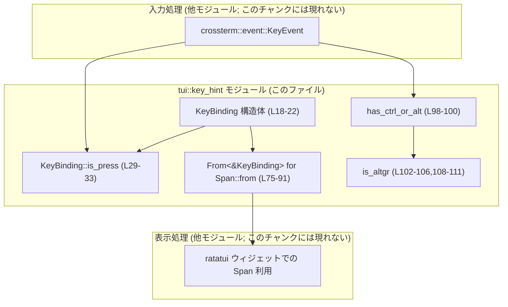
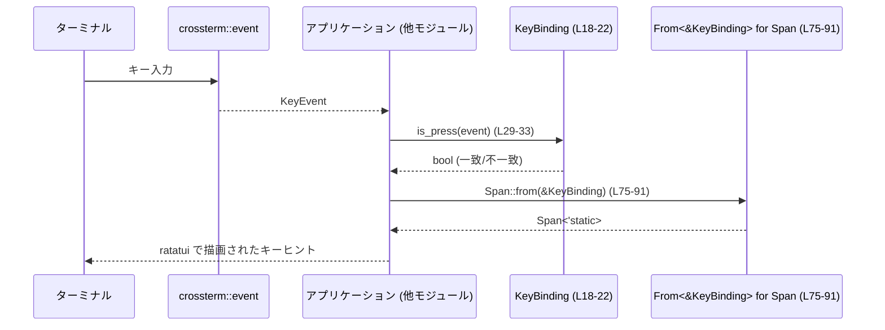

# tui/src/key_hint.rs

## 0. ざっくり一言

crossterm の `KeyEvent` と組み合わせて使うための **キー入力バインディング** と、ratatui 用の **キーヒント表示（`Span`）** を生成するユーティリティをまとめたモジュールです。

---

## 1. このモジュールの役割

### 1.1 概要

- このモジュールは **キーボード入力の条件（キー + 修飾キー）を表現し、`KeyEvent` と一致判定する** ための仕組みを提供します。
- さらに、そのキー操作をユーザーに表示するための **ヒント文字列を ratatui の `Span` で生成** します。
- 修飾キー（Ctrl / Shift / Alt / AltGr）に関する簡易判定ユーティリティも含んでいます。

主な用途は「TUI 上で、あるキー入力で操作を発火しつつ、その操作のショートカットを画面下部などに整形して表示する」ことです。

### 1.2 アーキテクチャ内での位置づけ

このモジュールは、外部クレートと以下のように連携する前提で設計されています（定義はこのファイルには含まれませんが、型の import から読み取れます）。

- 入力側  
  - `crossterm::event::KeyEvent` / `KeyCode` / `KeyModifiers` / `KeyEventKind`（`key_hint.rs:L1-4`）
- 表示側  
  - `ratatui::text::Span` と `ratatui::style::Style` / `Stylize`（`key_hint.rs:L5-7`）

想定される利用関係を簡略化した依存関係図です。



※ 呼び出し元（入力ループやウィジェット）はこのチャンクには現れないため「不明」としています。

### 1.3 設計上のポイント

- **シンプルな値オブジェクトとしての `KeyBinding`**  
  - `KeyCode` と `KeyModifiers` の 2 フィールドだけを持つ不変構造体です（`key_hint.rs:L18-22`）。
  - `Clone`, `Copy`, `Debug`, `Eq`, `PartialEq` が `derive` されており、軽量コピーと比較が前提になっています（`key_hint.rs:L18`）。

- **コンパイル時に定義しやすい API**  
  - `KeyBinding::new` および `plain` / `alt` / `shift` / `ctrl` / `ctrl_alt` は `const fn` として定義されています（`key_hint.rs:L25-27,L36-54`）。  
    → `const` や `static` でキーバインド一覧を定義しやすい構造です。

- **イベント種別の絞り込み**  
  - `is_press` は `KeyEventKind::Press` と `KeyEventKind::Repeat` のみを「押下」と見なします（`key_hint.rs:L29-33`）。  
    → `KeyEventKind::Release` はマッチしません。

- **プラットフォーム依存の Alt 表示**  
  - Alt キーの表示は `ALT_PREFIX` により、macOS とそれ以外で分岐します（`key_hint.rs:L9-16`）。  
    - テスト時と macOS 実行時は `"⌥ + "`、それ以外は `"alt + "` です。

- **修飾キー表現の一元化**  
  - `modifiers_to_string` で `KeyModifiers` から `"ctrl + shift + alt + "` 形式の文字列を生成します（`key_hint.rs:L56-67`）。

- **AltGr の判定（Windows とその他で分岐）**  
  - Windows では `ALT` と `CONTROL` の組み合わせを AltGr と見なし（`key_hint.rs:L102-106`）、  
    `has_ctrl_or_alt` で除外するロジックがあります（`key_hint.rs:L98-100`）。
  - 非 Windows 環境では `is_altgr` は常に `false` です（`key_hint.rs:L108-111`）。

- **安全性と並行性**  
  - このファイルには `unsafe` ブロックはなく、グローバルな可変状態もありません。  
    → すべての関数は純粋な計算か値生成であり、データ競合やパニックを伴う処理は含まれていません。

---

## 2. 主要な機能一覧（コンポーネントインベントリー）

このチャンク内に定義されている主な型・関数の一覧です。

### 型

| 名前 | 種別 | 役割 / 用途 | 定義位置 |
|------|------|-------------|----------|
| `KeyBinding` | 構造体 | 1つの `KeyCode` とその `KeyModifiers` の組み合わせを表現し、`KeyEvent` との一致判定や表示用 `Span` への変換に使う | `key_hint.rs:L18-22` |

### 関数・関連実装

| 名前 | 種別 | 役割 / 用途 | 定義位置 |
|------|------|-------------|----------|
| `KeyBinding::new` | 関連関数 (`const fn`) | 任意のキーと修飾キーから `KeyBinding` を生成 | `key_hint.rs:L25-27` |
| `KeyBinding::is_press` | メソッド | 渡された `KeyEvent` がこの `KeyBinding` に対応する「押下/リピート」イベントかを判定 | `key_hint.rs:L29-33` |
| `plain` | 関数 (`const fn`) | 修飾キーなし (`KeyModifiers::NONE`) の `KeyBinding` を生成 | `key_hint.rs:L36-38` |
| `alt` | 関数 (`const fn`) | Alt 修飾付きの `KeyBinding` を生成 | `key_hint.rs:L40-42` |
| `shift` | 関数 (`const fn`) | Shift 修飾付きの `KeyBinding` を生成 | `key_hint.rs:L44-46` |
| `ctrl` | 関数 (`const fn`) | Ctrl 修飾付きの `KeyBinding` を生成 | `key_hint.rs:L48-50` |
| `ctrl_alt` | 関数 (`const fn`) | Ctrl+Alt 修飾付きの `KeyBinding` を生成 | `key_hint.rs:L52-53` |
| `modifiers_to_string` | 関数 | `KeyModifiers` から `"ctrl + shift + alt + "` 形式の文字列を生成 | `key_hint.rs:L56-67` |
| `impl From<KeyBinding> for Span<'static>::from` | トレイト実装 | 所有している `KeyBinding` から `Span` を生成（内部で参照版に委譲） | `key_hint.rs:L70-73` |
| `impl From<&KeyBinding> for Span<'static>::from` | トレイト実装 | `KeyBinding` 参照から表示用 `Span` を生成 | `key_hint.rs:L75-91` |
| `key_hint_style` | 関数 | キーヒント表示に用いるスタイル（dim）を返す | `key_hint.rs:L94-96` |
| `has_ctrl_or_alt` | 関数 | AltGr を除外しつつ Ctrl または Alt が押されているかを判定 | `key_hint.rs:L98-100` |
| `is_altgr` (Windows) | 関数 | Windows で AltGr（Alt+Ctrl）かどうかを判定 | `key_hint.rs:L102-106` |
| `is_altgr` (非 Windows) | 関数 | 非 Windows 環境では常に `false` を返すダミー実装 | `key_hint.rs:L108-111` |

---

## 3. 公開 API と詳細解説

### 3.1 型一覧（構造体・列挙体など）

| 名前 | 種別 | 役割 / 用途 | 主なフィールド | 定義位置 |
|------|------|-------------|----------------|----------|
| `KeyBinding` | 構造体 | キーバインド（キー + 修飾キー）を表現し、`KeyEvent` との一致判定と `Span` への変換の基礎となる | `key: KeyCode` / `modifiers: KeyModifiers` | `key_hint.rs:L18-22` |

- `KeyBinding` 自体は `pub(crate)` のため、クレート外には公開されませんが、クレート内からは自由に利用できます（`key_hint.rs:L18`）。

---

### 3.2 関数詳細（主要 7 件）

#### `KeyBinding::new(key: KeyCode, modifiers: KeyModifiers) -> KeyBinding`

**概要**

- 任意の `KeyCode` と `KeyModifiers` から `KeyBinding` を生成する基本コンストラクタです（`key_hint.rs:L25-27`）。

**引数**

| 引数名 | 型 | 説明 |
|--------|----|------|
| `key` | `KeyCode` | 押下対象のキーを表す crossterm の列挙型 |
| `modifiers` | `KeyModifiers` | Ctrl / Alt / Shift 等の修飾キーの組み合わせ |

**戻り値**

- 指定されたキーと修飾キーを持つ `KeyBinding`。

**内部処理の流れ**

1. フィールド `key` と `modifiers` に引数をそのまま格納して `Self { key, modifiers }` を返します（`key_hint.rs:L26`）。

**Examples（使用例）**

```rust
use crossterm::event::{KeyCode, KeyModifiers};          // KeyCode と KeyModifiers をインポート
use crate::key_hint::KeyBinding;                        // モジュールパスはプロジェクトに合わせて調整

// Ctrl + C のキーバインドを作成する
const CTRL_C: KeyBinding = KeyBinding::new(              // const fn のため const 定義が可能
    KeyCode::Char('c'),                                  // 'c' キー
    KeyModifiers::CONTROL,                               // Ctrl 修飾
);
```

**Errors / Panics**

- 入力値に対するエラー検証は行っておらず、パニックも発生しません（単純な構造体の生成のみ）。

**Edge cases（エッジケース）**

- `modifiers` に複数ビット（Ctrl+Shift など）が立っていても、そのまま格納されます。
- `KeyCode` がどのキーを意味するかは crossterm 側の仕様に依存します（このチャンクには定義がありません）。

**使用上の注意点**

- `const fn` である点を活かし、`const` / `static` でキーバインド一覧を定義する前提のコードがある場合、`const` でなくなってしまう変更は影響が大きいため注意が必要です。

---

#### `KeyBinding::is_press(&self, event: KeyEvent) -> bool`

**概要**

- 与えられた `KeyEvent` が、この `KeyBinding` で表現されるキー + 修飾キーの **押下（またはリピート）イベント** であるかを判定するメソッドです（`key_hint.rs:L29-33`）。

**引数**

| 引数名 | 型 | 説明 |
|--------|----|------|
| `event` | `KeyEvent` | crossterm から取得したキーイベント |

**戻り値**

- `bool`  
  - `true`: `event.code` と `event.modifiers` が `self` と一致し、かつ `event.kind` が `Press` または `Repeat` の場合。  
  - `false`: 上記以外。

**内部処理の流れ**

1. `self.key == event.code` でキーコードが一致するか確認（`key_hint.rs:L30`）。
2. `self.modifiers == event.modifiers` で修飾キーの組み合わせが完全一致するか確認（`key_hint.rs:L31`）。
3. `event.kind` が `KeyEventKind::Press` または `KeyEventKind::Repeat` のいずれかであるかをチェック（`key_hint.rs:L32`）。
4. 上記 3 条件をすべて満たしたときに `true` を返します。

**Examples（使用例）**

```rust
use crossterm::event::{self, Event, KeyCode, KeyEvent, KeyModifiers, KeyEventKind};
use crate::key_hint::{KeyBinding, plain};               // モジュールパスは適宜調整

// 'q' 単体押下を終了キーとして扱うバインド
const QUIT_KEY: KeyBinding = plain(KeyCode::Char('q'));

fn handle_event(ev: KeyEvent) {
    // QUIT_KEY に対応する押下/リピートかどうか判定
    if QUIT_KEY.is_press(ev) {                          // key_hint.rs:L29-33 に基づく一致判定
        // 終了処理
    }
}
```

**Errors / Panics**

- 内部でパニックを起こす可能性のある操作は行っていません。
- `KeyEvent` がどのような値であっても、単に比較するだけです。

**Edge cases（エッジケース）**

- `event.kind` が `KeyEventKind::Release` の場合、キーと修飾キーが一致していても必ず `false` になります（`key_hint.rs:L32`）。
- 修飾キーが一部だけ一致する場合（例: `KeyBinding` は `Ctrl+X`、イベントは `Ctrl+Shift+X`）も `false` です。  
  → `modifiers == event.modifiers` で完全一致を要求しているため（`key_hint.rs:L31`）。
- キーコードだけが一致し修飾キーが異なる場合も `false` です。

**使用上の注意点**

- 「Ctrl が押されていればよい」などの **部分一致** 判定は行いません。部分一致が必要な場合は `event.modifiers.contains(...)` を使う別ロジックが必要になります。
- `KeyEventKind::Repeat` も「押下」として扱われるため、高速なリピート入力を許可したくない場合は、呼び出し側で `event.kind` を別途フィルタする必要があります。

---

#### `plain(key: KeyCode) -> KeyBinding`

**概要**

- 修飾キーなし（`KeyModifiers::NONE`）の `KeyBinding` を生成するユーティリティ関数です（`key_hint.rs:L36-38`）。

**引数**

| 引数名 | 型 | 説明 |
|--------|----|------|
| `key` | `KeyCode` | 修飾なしで扱いたいキー |

**戻り値**

- `KeyModifiers::NONE` を持つ `KeyBinding`。

**内部処理の流れ**

1. `KeyBinding::new(key, KeyModifiers::NONE)` を呼び出して結果を返します（`key_hint.rs:L37`）。

**Examples（使用例）**

```rust
use crossterm::event::KeyCode;
use crate::key_hint::plain;

// 'h' 単体押下でヘルプを開くバインド
const HELP_KEY: KeyBinding = plain(KeyCode::Char('h')); // 修飾キーなし
```

**Errors / Panics**

- ありません。

**Edge cases（エッジケース）**

- 実際の `KeyEvent` 側に `Shift` や `Alt` が付いていると、`is_press` ではマッチしません。  
  → 修飾キーの完全一致が必要なためです。

**使用上の注意点**

- 「大文字の 'H'」など、プラットフォームによっては `Shift` 修飾が付くケースがあり得るため、実際に送られてくる `KeyEvent` の内容に注意が必要です（詳細は crossterm の仕様に依存し、このチャンクには現れません）。

---

#### `ctrl_alt(key: KeyCode) -> KeyBinding`

**概要**

- Ctrl + Alt の両方が押された状態での `KeyBinding` を生成するユーティリティ関数です（`key_hint.rs:L52-53`）。

**引数**

| 引数名 | 型 | 説明 |
|--------|----|------|
| `key` | `KeyCode` | Ctrl+Alt と組み合わせたいキー |

**戻り値**

- `KeyModifiers::CONTROL.union(KeyModifiers::ALT)` を持つ `KeyBinding`。

**内部処理の流れ**

1. `KeyModifiers::CONTROL.union(KeyModifiers::ALT)` で Ctrl+Alt の複合修飾を生成します（`key_hint.rs:L53`）。
2. それを第二引数として `KeyBinding::new` に渡します。

**Examples（使用例）**

```rust
use crossterm::event::KeyCode;
use crate::key_hint::ctrl_alt;

// Ctrl + Alt + R をリロード操作として扱う
const RELOAD_KEY: KeyBinding = ctrl_alt(KeyCode::Char('r'));
```

**Errors / Panics**

- ありません。

**Edge cases（エッジケース）**

- Windows では AltGr が内部的に Alt+Ctrl の組み合わせとして扱われる場合があり、`has_ctrl_or_alt` では AltGr が除外される一方、`KeyBinding::is_press` では単に修飾キーの一致で判定されます。  
  AltGr の扱いは `is_altgr` の実装と crossterm の挙動に依存します（`key_hint.rs:L102-106`）。

**使用上の注意点**

- AltGr を Ctrl+Alt として扱いたくない場合は、`KeyBinding` を定義するだけでなく、イベント処理側で AltGr を特別扱いする必要があります。

---

#### `impl From<&KeyBinding> for Span<'static> { fn from(binding: &KeyBinding) -> Span<'static> }`

**概要**

- `KeyBinding` 参照から、表示用の `Span<'static>` を生成する変換です（`key_hint.rs:L75-91`）。  
  例: `"ctrl + c"`、`"⌥ + enter"`、`"pgdn"` などの表示に変換します。

**引数**

| 引数名 | 型 | 説明 |
|--------|----|------|
| `binding` | `&KeyBinding` | 文字列表現に変換したいバインド |

**戻り値**

- `Span<'static>`  
  - テキスト: `"<修飾キー文字列><キー文字列>"` の形式。  
  - スタイル: `key_hint_style()`（dim スタイル）が適用された `Span`（`key_hint.rs:L90-91,L94-96`）。

**内部処理の流れ**

1. 構造体分解で `key` と `modifiers` を取り出し（`key_hint.rs:L77`）、`modifiers_to_string(*modifiers)` で修飾キー文字列を生成（`key_hint.rs:L78`）。
2. `key` について `match` し、特定のキーはわかりやすい名前に変換（`key_hint.rs:L79-87`）。
   - `Enter` → `"enter"`（`key_hint.rs:L80`）
   - `Char(' ')`（スペース）→ `"space"`（`key_hint.rs:L81`）
   - `Up/Down/Left/Right` → 矢印 `"↑" / "↓" / "←" / "→"`（`key_hint.rs:L82-85`）
   - `PageUp` → `"pgup"`、`PageDown` → `"pgdn"`（`key_hint.rs:L86-87`）
   - それ以外 → `format!("{key}")` で文字列化し、`to_ascii_lowercase()`（`key_hint.rs:L88`）。
3. `format!("{modifiers}{key}")` で修飾キー文字列とキー文字列を結合（`key_hint.rs:L90`）。
4. `Span::styled(..., key_hint_style())` で dim スタイルを付与した `Span` を返します（`key_hint.rs:L90-91,L94-96`）。

**Examples（使用例）**

```rust
use crossterm::event::{KeyCode, KeyModifiers};
use crate::key_hint::{KeyBinding, plain, ctrl};
use ratatui::text::Span;

// 'q' 単体のバインドを Span に変換
let quit = plain(KeyCode::Char('q'));                   // key_hint.rs:L36-38
let quit_span: Span = Span::from(&quit);                // "q" (dim スタイル)

// Ctrl + C のバインドを Span に変換
let copy = KeyBinding::new(KeyCode::Char('c'), KeyModifiers::CONTROL);
let copy_span: Span = (&copy).into();                   // "ctrl + c" (dim スタイル)
```

**Errors / Panics**

- `format!` と `to_ascii_lowercase` は通常の条件下ではパニックを起こしません。
- 未知の `KeyCode` に対しても `_ => format!("{key}")` にフォールバックし、パニックやエラーにはなりません（`key_hint.rs:L88`）。

**Edge cases（エッジケース）**

- 未対応の特殊キーは `format!("{key}")` の結果に依存します（`KeyCode` の `Display`/`Debug` 実装に依存）。  
  表示が期待通りでない場合は `match` 節を拡張する必要があります。
- 修飾キーがない場合、`modifiers_to_string` は空文字列を返し、単に `"enter"` や `"space"` 等になります（`key_hint.rs:L56-67`）。

**使用上の注意点**

- 返される `Span<'static>` は `'static` ライフタイムですが、内部で生成しているのは `String` からの所有文字列なので、ライフタイム管理上の問題はありません。
- テキストは常に ASCII 小文字に変換されます（`format!("{key}").to_ascii_lowercase()`）。大文字を表示したい場合は実装変更が必要です。

---

#### `has_ctrl_or_alt(mods: KeyModifiers) -> bool`

**概要**

- AltGr を除外した上で、Ctrl または Alt が押されているかどうかを判定する関数です（`key_hint.rs:L98-100`）。

**引数**

| 引数名 | 型 | 説明 |
|--------|----|------|
| `mods` | `KeyModifiers` | チェック対象の修飾キー集合 |

**戻り値**

- `bool`  
  - `true`: Ctrl または Alt が含まれ、かつ AltGr ではないと判定された場合。  
  - `false`: それ以外。

**内部処理の流れ**

1. `mods.contains(KeyModifiers::CONTROL)` または `mods.contains(KeyModifiers::ALT)` で Ctrl/Alt のいずれかが含まれるか判定（`key_hint.rs:L99`）。
2. `is_altgr(mods)` が `false` であることを確認（`key_hint.rs:L99`）。
3. 上記 2 条件の論理積 (`&&`) を返します。

**Examples（使用例）**

```rust
use crossterm::event::KeyModifiers;
use crate::key_hint::has_ctrl_or_alt;

fn handle_mods(mods: KeyModifiers) {
    if has_ctrl_or_alt(mods) {
        // Ctrl または Alt が押されている (AltGr は除外) として扱う
    }
}
```

**Errors / Panics**

- ありません。

**Edge cases（エッジケース）**

- Windows で AltGr が Alt+Ctrl として表現されている場合、`is_altgr` が `true` になり `has_ctrl_or_alt` は `false` を返します（`key_hint.rs:L102-106`）。
- 非 Windows 環境では `is_altgr` が常に `false` なので、AltGr がどのように表現されるかによっては `has_ctrl_or_alt` が `true` になる場合があります（`key_hint.rs:L108-111`）。

**使用上の注意点**

- 「Ctrl または Alt が押されたショートカットのみを検出したいが、AltGr は通常の文字入力として扱いたい」といった用途を想定した設計です。挙動は OS と crossterm のキー表現に依存する点に注意が必要です。

---

#### `is_altgr(mods: KeyModifiers) -> bool`（Windows / 非 Windows）

**概要**

- 渡された修飾キー集合が AltGr を表しているかどうかを判定する関数です。  
  実装は OS によってコンパイル時に切り替わります（`key_hint.rs:L102-106,L108-111`）。

**引数**

| 引数名 | 型 | 説明 |
|--------|----|------|
| `mods` / `_mods` | `KeyModifiers` | チェック対象の修飾キー集合 |

**戻り値**

- Windows (`#[cfg(windows)]`):  
  - `true`: `ALT` と `CONTROL` の両方を含む場合。  
  - `false`: それ以外。
- 非 Windows (`#[cfg(not(windows))]`):  
  - 常に `false`。

**内部処理の流れ**

- Windows 版（`key_hint.rs:L102-106`）:
  1. `mods.contains(KeyModifiers::ALT)` と `mods.contains(KeyModifiers::CONTROL)` の両方を満たした場合に `true` を返します。
- 非 Windows 版（`key_hint.rs:L108-111`）:
  1. 引数は `_mods` という名前で未使用とし、無条件に `false` を返します。

**Examples（使用例）**

```rust
use crossterm::event::KeyModifiers;
use crate::key_hint::is_altgr;

fn is_alt_gr_input(mods: KeyModifiers) -> bool {
    is_altgr(mods)                                        // Windows では Alt+Ctrl として判定
}
```

**Errors / Panics**

- ありません。

**Edge cases（エッジケース）**

- Windows 以外の OS では AltGr の特別扱いは行われません（`false` 固定）。
- Windows 版では、単に「Alt と Ctrl が両方押されているかどうか」で判定するため、他の修飾キー（Shift など）が同時に押されていても AltGr と見なすかどうかは、この実装では区別されません。

**使用上の注意点**

- AltGr の実装・表現はターミナルや OS によって異なることがあります。この関数のロジックが実際の AltGr 表現と完全に一致することは保証されず、必要であれば呼び出し元で追加の判定を行う必要があります。

---

### 3.3 その他の関数

| 関数名 | 役割（1 行） | 定義位置 |
|--------|--------------|----------|
| `alt(key: KeyCode) -> KeyBinding` | Alt 修飾付きの `KeyBinding` を生成するショートカット関数 | `key_hint.rs:L40-42` |
| `shift(key: KeyCode) -> KeyBinding` | Shift 修飾付きの `KeyBinding` を生成するショートカット関数 | `key_hint.rs:L44-46` |
| `ctrl(key: KeyCode) -> KeyBinding` | Ctrl 修飾付きの `KeyBinding` を生成するショートカット関数 | `key_hint.rs:L48-50` |
| `modifiers_to_string(modifiers: KeyModifiers) -> String` | `KeyModifiers` を `"ctrl + shift + alt + "` の形に変換する内部ユーティリティ | `key_hint.rs:L56-67` |
| `impl From<KeyBinding> for Span<'static>::from` | 所有する `KeyBinding` から `Span` への変換（参照版への委譲） | `key_hint.rs:L70-73` |
| `key_hint_style() -> Style` | すべてのキーヒント表示に共通の dim スタイルを返す内部関数 | `key_hint.rs:L94-96` |

---

## 4. データフロー

### 4.1 代表的な処理シナリオ

典型的な流れは次のようになります。

1. アプリケーション側で `KeyBinding` を定義（例: `plain(KeyCode::Char('q'))`）。
2. 入力ループで crossterm から `KeyEvent` を読み取る。
3. `KeyBinding::is_press` で、そのイベントが該当のショートカットかどうかを判定。
4. 同じ `KeyBinding` を `Span::from(&binding)` で表示用テキストに変換し、ratatui ウィジェットに組み込む。

これをシーケンス図で表すと以下のようになります（関数名と行番号を併記しています）。



- 入力の取得と描画の処理自体はこのチャンクにはありませんが、`KeyBinding` と `Span` の間でデータがどのように流れているかが分かります。

---

## 5. 使い方（How to Use）

### 5.1 基本的な使用方法

`KeyBinding` を使ってキー入力を処理し、そのショートカットを画面に表示する基本的な例です。  
モジュールパス `crate::key_hint` は、実際のプロジェクト構成に合わせて調整が必要です。

```rust
use crossterm::event::{self, Event, KeyCode, KeyEvent};
use ratatui::text::{Span, Line};
use crate::key_hint::{plain, KeyBinding};              // このファイルの API をインポート

// 'q' 単体で終了するショートカット
const QUIT_KEY: KeyBinding = plain(KeyCode::Char('q')); // key_hint.rs:L36-38

fn handle_key(ev: KeyEvent) -> bool {                   // 1つの KeyEvent を処理する関数
    if QUIT_KEY.is_press(ev) {                          // 押下/リピート判定 (L29-33)
        return true;                                    // true を返して終了要求
    }
    false
}

fn key_hint_line() -> Line<'static> {                   // 画面下部に表示するヒント行を組み立てる
    let quit_span: Span = Span::from(&QUIT_KEY);        // "q" (dim) に変換 (L75-91)
    Line::from(vec![
        Span::raw("Quit: "),                            // 生テキスト
        quit_span,                                      // キーヒント
    ])
}

// 簡易的なイベントループ例（エラー処理などは簡略化）
fn run() -> crossterm::Result<()> {
    loop {
        match event::read()? {
            Event::Key(ev) => {
                if handle_key(ev) {                     // キー入力を処理
                    break;
                }
            }
            _ => {}
        }
    }
    Ok(())
}
```

### 5.2 よくある使用パターン

1. **キーバインド一覧を `const` / `static` で定義**

```rust
use crossterm::event::KeyCode;
use crate::key_hint::{plain, ctrl, alt};

pub const HELP: KeyBinding   = plain(KeyCode::Char('h')); // ヘルプ
pub const QUIT: KeyBinding   = plain(KeyCode::Char('q')); // 終了
pub const COPY: KeyBinding   = ctrl(KeyCode::Char('c'));  // コピー
pub const SWITCH: KeyBinding = alt(KeyCode::Tab);         // タブ切り替え
```

- `KeyBinding` のコンストラクタがすべて `const fn` のため、このような定義が可能です（`key_hint.rs:L25-27,L36-54`）。

1. **ratatui のウィジェットで複数のキーヒントを表示**

```rust
use ratatui::text::{Span, Line};
use crate::key_hint::{HELP, QUIT};                      // 上で定義したバインド

fn footer_line() -> Line<'static> {
    Line::from(vec![
        Span::from(&HELP),                              // "h"
        Span::raw("  "),                                // 区切りスペース
        Span::from(&QUIT),                              // "q"
    ])
}
```

### 5.3 よくある間違い

```rust
use crossterm::event::{KeyCode, KeyEvent};
use crate::key_hint::{KeyBinding, plain};

// 間違い例: KeyEventKind::Release をそのまま渡してマッチしないと勘違いする
fn wrong(ev: KeyEvent) {
    let key = plain(KeyCode::Char('q'));
    if key.is_press(ev) {                               // Release イベントでは常に false (L29-33)
        // ここには来ない
    }
}

// 正しい考え方: Press / Repeat のみがマッチする設計
fn correct(ev: KeyEvent) {
    let key = plain(KeyCode::Char('q'));
    // Press / Repeat のときだけ呼ばれるようにフィルタする、など
    if key.is_press(ev) {
        // q が押された
    }
}
```

- `is_press` は `Press` / `Repeat` のみを対象としているため、`Release` イベントを渡しても *動かないバグ* ではなく、仕様どおりの挙動です（`key_hint.rs:L32`）。

別の例:

```rust
use crossterm::event::KeyCode;
use crate::key_hint::plain;

// 間違い例: Shift を押しながら 'h' を打つと HELP にマッチすると期待する
const HELP: KeyBinding = plain(KeyCode::Char('h'));     // 修飾なし (L36-38)

// 実際には、イベント側に Shift が含まれると HELP.is_press(ev) は false になる。
// 修飾キーの完全一致が要求されるため (L31)。
```

### 5.4 使用上の注意点（まとめ）

- **エラー処理**  
  - 本モジュールの関数はすべて純粋な計算であり、`Result` を返したりパニックを起こしたりするコードは含まれていません。
- **並行性**  
  - グローバルな可変状態を持たず、`KeyBinding` も不変構造体のため、複数スレッドから同じ値を同時に読む用途でも問題になる要素は見当たりません（このチャンクの範囲での話です）。
- **Alt / AltGr の扱い**  
  - `has_ctrl_or_alt` / `is_altgr` の挙動は OS とターミナル環境に依存します。AltGr を特殊扱いしたい場合は、実際のイベント値を確認することが重要です（`key_hint.rs:L98-111`）。
- **表示文字列の仕様**  
  - キー名は一部のキー（Enter, Space, PgUp/PgDn, 矢印など）以外は `format!("{key}")` + 小文字化で決まります（`key_hint.rs:L79-88`）。必要に応じて `match` 節を拡張する必要があります。

---

## 6. 変更の仕方（How to Modify）

### 6.1 新しい機能を追加する場合

1. **新しい修飾キー組み合わせ用のヘルパーを増やす**

   - 例: Ctrl+Shift 用などを追加したい場合は、`plain` / `alt` / `shift` / `ctrl` / `ctrl_alt` と同じパターンで `const fn` を追加するのが自然です（`key_hint.rs:L36-54`）。
   - 追加したヘルパーは `KeyBinding::new` を内部で呼ぶ形に揃えると一貫性があります。

2. **表示テキストのカスタマイズを増やす**

   - 例えば `Home` / `End` / `Tab` などのキーに特別なラベルを付けたい場合は、`impl From<&KeyBinding> for Span` 内の `match key` 部分を拡張します（`key_hint.rs:L79-88`）。
   - 新しいパターンを追加しても `_ => ...` のフォールバックが残るようにしておくと安全です。

3. **スタイルの変更やテーマ対応**

   - 現在は `key_hint_style()` が `Style::default().dim()` を返すのみです（`key_hint.rs:L94-96`）。
   - テーマ対応したい場合は、この関数に引数を追加するか、外部からスタイルを受け取る API を新設する方向での変更が考えられます。

### 6.2 既存の機能を変更する場合

- **`KeyBinding::is_press` の仕様変更**

  - 修飾キーの「部分一致」を許容するように変更する場合、`self.modifiers == event.modifiers` の比較を変える必要があります（`key_hint.rs:L31`）。
  - 影響範囲として、`is_press` を利用しているすべての箇所で挙動が変わるため、呼び出し元の意図を確認することが重要です。

- **Alt / AltGr 判定の変更**

  - `has_ctrl_or_alt` や `is_altgr` を変更する場合、ショートカットの検出ロジック全体に影響します（`key_hint.rs:L98-111`）。
  - Windows と非 Windows で `cfg` による分岐があるため、両方の実装を同時に考慮する必要があります。

- **`const fn` 制約の維持**

  - `KeyBinding::new` や各種ヘルパー関数から `const` を外すと、`const` / `static` によるキーバインド定義がコンパイルエラーになる可能性があります。  
    変更時には、`const` な使用箇所の有無を事前に確認する必要があります。

---

## 7. 関連ファイル

このチャンクには、同一クレート内の他のモジュールやテストファイルの情報は含まれていません。そのため、具体的な関連ファイルのパスは不明です。

外部クレートとしては以下が直接関係します。

| パス / クレート | 役割 / 関係 |
|-----------------|------------|
| `crossterm::event::{KeyCode, KeyEvent, KeyEventKind, KeyModifiers}` | 入力イベントとキー/修飾キーの表現に利用（`key_hint.rs:L1-4`） |
| `ratatui::style::{Style, Stylize}` | キーヒントのスタイル（dim）定義に利用（`key_hint.rs:L5-6,L94-96`） |
| `ratatui::text::Span` | キーヒント表示用のテキスト単位として利用（`key_hint.rs:L7,L70-73,L75-91`） |

テストコードや、このモジュールを実際に呼び出している入力処理・描画処理のモジュールは、このチャンクには現れていないため「不明」となります。
