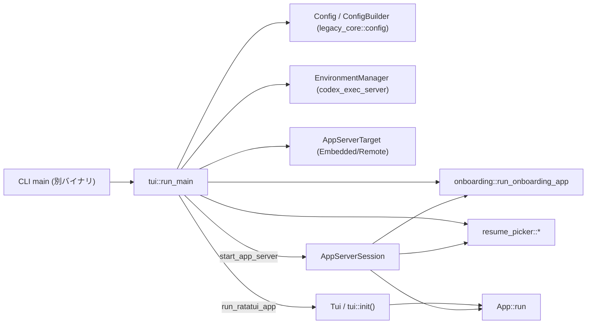
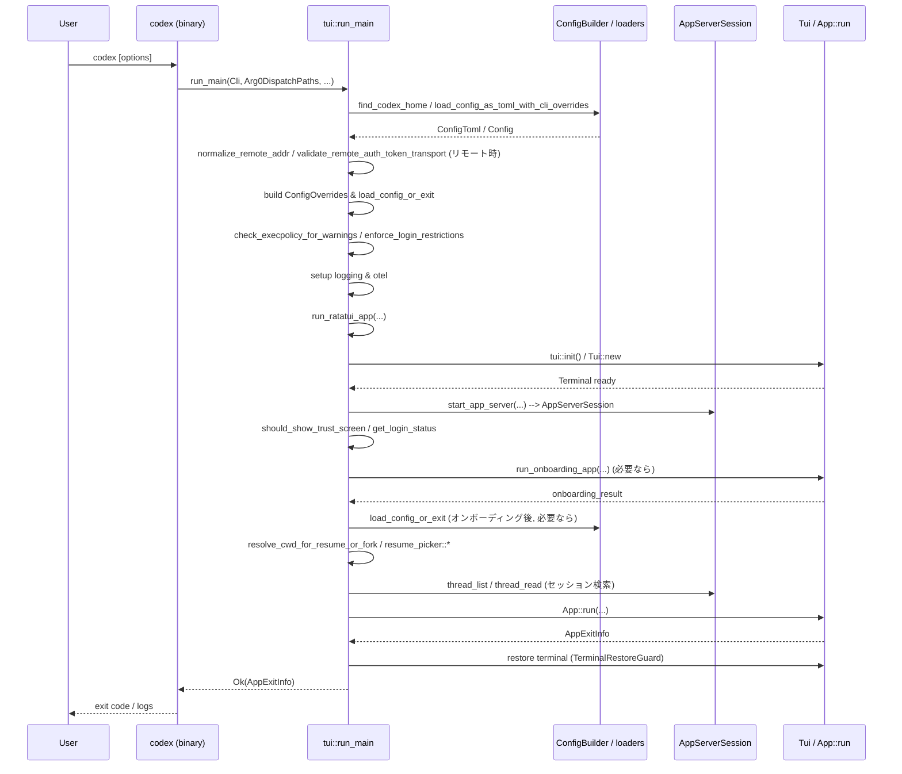

# tui/src/lib.rs コード解説

## 0. ざっくり一言

Codex の TUI (`codex-tui`) 全体のエントリポイントとなるライブラリです。  
設定読み込み・アプリサーバ起動・オンボーディング・セッション再開／フォーク・ターミナル初期化などをまとめて orchestration し、TUI アプリ本体 `App` を起動します。

> 注: この回答ではソースコードの行番号情報が与えられていないため、指示にある厳密な `L開始-終了` 形式の行番号は付記できません。根拠は関数名・モジュール名と該当コード片で示します。

---

## 1. このモジュールの役割

### 1.1 概要

- このモジュールは **TUI 全体の起動・終了処理を統括する「フロントコントローラ」** です。
- CLI オプションと設定ファイル、環境変数を集約し、**AppServer（埋め込み or リモート）と TUI を初期化** します。
- さらに、**オンボーディング画面・ディレクトリ信頼確認・ログイン状態確認・セッション再開／フォーク** といった、ユーザーフローの分岐を実装します。
- 多くの機能はサブモジュール（`app`, `tui`, `onboarding`, `resume_picker` など）に委譲し、本ファイルは制御フローとエラーハンドリングに集中しています。

### 1.2 アーキテクチャ内での位置づけ

主な依存関係を簡略化した図です（ノード数を絞っています）。



位置づけのポイント:

- このファイルは CLI バイナリからのみ呼ばれる想定で、**公開 API は「ライブラリとしてのエントリポイントと UI 部品の再エクスポート」** に限られます。
- 実際の UI 描画、入力処理、ビジネスロジックは `app`・`tui`・`public_widgets` 等に分離されています。
- App サーバ（埋め込み or リモート）との通信は `AppServerSession` 経由で隠蔽されています。

### 1.3 設計上のポイント

コードから読み取れる設計上の特徴を列挙します。

- **責務の分割**
  - このモジュール: 設定ロード、環境・ログ設定、AppServer 起動、TUI 全体の制御フロー。
  - サブモジュール: 表示（`tui`, `render`）、アプリ状態管理（`app`）、オンボーディング（`onboarding`）、セッション選択（`resume_picker`）など。
- **状態管理**
  - 長寿命の共有状態: `Config`、`EnvironmentManager`、`AppServerSession`、`Tui` など。
  - `Arc` を用いて `EnvironmentManager` 等をスレッド安全に共有。
  - ターミナル状態の復元は `TerminalRestoreGuard` による RAII (`Drop`) で行い、パニック時も復元される設計です。
- **エラーハンドリング方針**
  - recover 可能なものは `Result` で返し、呼び出し元に伝播（`?` 演算子・`color_eyre` を利用）。
  - 進行不能な初期化エラー（設定・権限・ログイン等）は `eprintln!`＋`std::process::exit(1)` でプロセス終了（library でも CLI 前提の設計）。
  - `color_eyre` によるリッチなエラー表示と `tracing` によるログ記録を併用。
- **並行性・非同期**
  - App サーバとの通信、ファイル・DB アクセスはすべて `async` 関数で非同期実行。
  - ログ出力には `tracing_appender::non_blocking` を使用し、I/O によるブロックを回避。
  - panic hook を上書きして `tracing::error!` に流しつつ、元の hook をチェーンして backtrace を保持。
- **安全性（セキュリティ）**
  - リモート WebSocket アドレスの正規化・検証 (`normalize_remote_addr`, `validate_remote_auth_token_transport`) により、**認証トークンは TLS (`wss`) かループバック `ws` のみで送る**よう制限。
  - ログファイルは UNIX で `chmod 600` 相当のパーミッションで作成。
  - OSS モデル利用時の provider 準備 (`ensure_oss_provider_ready`) や、Exec ポリシー／ログイン制限のチェックを起動時に実施。

---

## 2. 主要な機能一覧

このモジュールが提供する主要な機能を箇条書きにします。

- TUI エントリポイント:
  - `run_main`: CLI 引数・リモート設定を受け取り、設定ロード・ログ設定・AppServer 起動を行った上で TUI を起動。
- App サーバの起動と接続:
  - `AppServerTarget` と `start_app_server`: 埋め込みサーバ or リモート WebSocket サーバへの接続を抽象化。
  - `start_embedded_app_server` / `start_embedded_app_server_with`: 同一プロセス内の App サーバを起動。
  - `connect_remote_app_server`: WebSocket URL に対してリモート App サーバクライアントを構築。
- リモート接続の検証:
  - `normalize_remote_addr`: WebSocket アドレス文字列を正規化し、`ws://host:port`/`wss://host:port` 形式を強制。
  - `validate_remote_auth_token_transport`: 認証トークン付き接続が `wss` またはループバック `ws` のみになるよう検証。
- セッション選択／再開／フォーク:
  - `lookup_session_target_with_app_server`, `lookup_session_target_by_name_with_app_server`, `lookup_latest_session_target_with_app_server`:
    App サーバ（およびローカルインデックス）からセッションを検索。
  - `read_session_cwd`, `read_session_model`: セッションの作業ディレクトリ・モデル名を DB / rollout ログから復元。
  - `resolve_cwd_for_resume_or_fork`: セッション再開／フォーク時に、現在の CWD と履歴 CWD の不一致を検出し、ユーザに選択させる。
- TUI 起動と UI 設定:
  - `run_ratatui_app`: ターミナル初期化、オンボーディング、セッション選択、`App::run` 呼び出しをまとめる。
  - `determine_alt_screen_mode`: CLI フラグと設定、およびターミナル検出結果から alternate screen 利用可否を決定。
  - `TerminalRestoreGuard`: panic を含むあらゆる終了パスでターミナルを復元。
- 認証・オンボーディング:
  - `LoginStatus`, `get_login_status`: 軽量な account 読み出しでログイン状態を判定。
  - `should_show_trust_screen`, `should_show_onboarding`, `should_show_login_screen`: プロジェクト trust 状態・モデルプロバイダ・ログイン状態から、オンボーディング／信頼確認画面を表示すべきかを決定。

---

## 3. 公開 API と詳細解説

### 3.1 型一覧（構造体・列挙体など）

主に外部から見えるもの＋コアロジックに関わる型を整理します。

| 名前 | 可視性 | 種別 | 役割 / 用途 |
|------|--------|------|-------------|
| `Cli` | `pub` | 構造体（別モジュール） | CLI 引数を表す型。`run_main` の入力として利用されます。`mod cli;` から `pub use cli::Cli;` で再公開。 |
| `Terminal` | `pub` | 構造体 | ラッパーされたターミナルバックエンド。`custom_terminal::Terminal` を再公開。 |
| `AppExitInfo` | `pub` | 構造体 | TUI 実行終了時の情報（トークン使用量・スレッド ID・更新アクション・終了理由）を保持。`app` モジュールから再公開。 |
| `ExitReason` | `pub` | enum | アプリ終了理由（ユーザ要求／致命的エラーなど）を表す。`AppExitInfo` とともに返却されます。 |
| `ComposerAction` | `pub` | enum | 公開ウィジェット `composer_input` の動作を表す。外部から TUI の入力コンポーネントを使う際に利用。 |
| `ComposerInput` | `pub` | 構造体 | 外部から利用可能な入力コンポーネント。 |
| `UpdateAction` | `pub` | enum | アップデートを行う際のアクション（別モジュール `update_action` より再公開）。 |
| `AppServerTarget` | `pub(crate)` | enum | App サーバ接続の種別: `Embedded` or `Remote { websocket_url, auth_token }`。 |
| `LoginStatus` | `pub` | enum | 認証状態: `AuthMode(AppServerAuthMode)` または `NotAuthenticated`。 |
| `ResolveCwdOutcome` | `pub(crate)` | enum | セッション再開／フォーク時に CWD をどう扱うかの結果 (`Continue(Option<PathBuf>)` / `Exit`)。 |
| `TerminalRestoreGuard` | `struct` (private) | 構造体 | Drop ガード。スコープを抜ける際にターミナル状態を復元。 |

### 3.2 関数詳細（最大 7 件）

#### `run_main(cli: Cli, arg0_paths: Arg0DispatchPaths, loader_overrides: LoaderOverrides, remote: Option<String>, remote_auth_token: Option<String>) -> std::io::Result<AppExitInfo>`

**概要**

TUI のメインエントリポイントです。CLI 引数と環境に基づいて:

1. リモート接続パラメータを検証・構築し、
2. 設定ファイルと CLI オーバーライドを読み込み、
3. ログ／トレーシング／フィードバック／クラウド要件を初期化し、
4. 必要であれば OSS プロバイダやログイン制限を確認した上で、
5. `run_ratatui_app` を呼び出します。

**引数**

| 引数名 | 型 | 説明 |
|--------|----|------|
| `cli` | `Cli` | CLI 引数（CWD、プロファイル、各種フラグ、`--oss` など）。 |
| `arg0_paths` | `Arg0DispatchPaths` | 実行ファイルのパス群。サンドボックスやラッパーの場所などを含む。 |
| `loader_overrides` | `LoaderOverrides` | 設定ローダの追加オーバーライド（テストや特殊環境向け）。 |
| `remote` | `Option<String>` | リモート App サーバの WebSocket URL（`ws://` or `wss://`）。 |
| `remote_auth_token` | `Option<String>` | リモート接続で利用する認証トークン。 |

**戻り値**

- `Ok(AppExitInfo)`:
  - TUI が正常終了した場合の情報（スレッド ID、終了理由など）。
- `Err(std::io::Error)`:
  - `run_ratatui_app` から返された `color_eyre::Error` を文字列化してラップしたもの。

**内部処理の流れ（アルゴリズム）**

ざっくり 10 ステップ程度に要約します。

1. **リモート認証 URL の検証**  
   - `remote` と `remote_auth_token` がどちらも `Some` の場合、  
     `validate_remote_auth_token_transport(websocket_url)` を呼んで、`wss` またはループバック `ws` であることを確認。
2. **`AppServerTarget` の決定**  
   - `remote` がある場合は `AppServerTarget::Remote { websocket_url, auth_token }`、ない場合は `Embedded`。
   - リモート時にのみ `remote_cwd_override` を `cli.cwd` から設定。
3. **sandbox/approval の決定**  
   - `--full-auto` / `--dangerously-bypass-approvals-and-sandbox` フラグに応じて `SandboxMode` と `AskForApproval` を上書き。
4. **CLI config オーバーライド文字列のパース**  
   - `cli.config_overrides.raw_overrides` を `codex_utils_cli::CliConfigOverrides::parse_overrides()` で TOML キー値に変換。
   - 失敗時は `eprintln!` して `std::process::exit(1)`。
5. **`codex_home` 探索と `config.toml` 読み込み**  
   - `find_codex_home()` でホームディレクトリを見つける。失敗時は exit(1)。
   - `EnvironmentManager::from_env()` と `config_cwd_for_app_server_target()` で config 用 CWD を決定。
   - `load_config_as_toml_with_cli_overrides()` で `config.toml` を読み込む。`ConfigLoadError` の場合はソース付きで表示。
6. **OSS プロバイダ・モデル選択**  
   - `cli.oss` フラグなら `resolve_oss_provider` によりプロバイダを決定。未設定なら `oss_selection::select_oss_provider` で対話的に選ばせる。
   - モデル指定 (`cli.model`) がなければ、`get_default_model_for_oss_provider` から provider に対応するデフォルトモデルを選択。
7. **`ConfigOverrides` の構築と `Config` の構築**  
   - モデルや sandbox/approval、CWD などを `ConfigOverrides` にまとめ、`load_config_or_exit()` で `Config` を構築。
   - ここでは CLI オーバーライドとクラウド要件ローダも渡されます。
8. **Exec ポリシー・ログイン制限・ログ設定の初期化**
   - `check_execpolicy_for_warnings()` で policy ロードエラーを検査。エラー時は exit(1)。
   - `set_default_client_residency_requirement()` を呼び、居住要件を設定。
   - `add_dir_warning_message()` で `--add-dir` と sandbox 設定の整合性をチェック。エラー時は exit(1)。
   - `AppServerTarget::Embedded` のときは `enforce_login_restrictions()` を呼び、必要なログイン条件を満たしているか検証。失敗時は exit(1)。
   - ログディレクトリ作成・`codex-tui.log` を `600` パーミッションで開き、`tracing_subscriber` + Otel + log_db をセットアップ。
9. **OSS プロバイダの準備と Otel 初期化**  
   - `cli.oss` かつ provider 指定がある場合、`ensure_oss_provider_ready()` で必要なモデル等を準備。
   - `legacy_core::otel_init::build_provider()` を `catch_unwind` 付きで呼び、panic してもメッセージを `stderr` に出して無効化する。
10. **メイン TUI の起動**  
    - すべての初期化が完了したら `run_ratatui_app(...)` を await。
    - `color_eyre::Result<AppExitInfo>` を `map_err` で `std::io::Error` に変換して返す。

**Examples（使用例）**

CLI バイナリ側の `main` 関数での典型的な利用例です。

```rust
use codex_tui::{Cli, run_main};
use codex_arg0::Arg0DispatchPaths;
use codex_tui::legacy_core::config_loader::LoaderOverrides;

#[tokio::main]
async fn main() -> std::io::Result<()> {
    // clap 等で CLI 引数をパースして Cli を構築する
    let cli = Cli::parse();

    // 実行ファイルのパス情報を構築
    let arg0_paths = Arg0DispatchPaths::default();

    // 必要に応じて設定ローダのオーバーライドを指定
    let loader_overrides = LoaderOverrides::default();

    // リモート App サーバは使わないケース
    let exit_info = codex_tui::run_main(
        cli,
        arg0_paths,
        loader_overrides,
        None,      // remote URL
        None,      // remote auth token
    ).await?;

    eprintln!("Exit reason: {:?}", exit_info.exit_reason);
    Ok(())
}
```

**Errors / Panics**

- `Err(std::io::Error)` になる条件（代表例）
  - `run_ratatui_app` が `Err(color_eyre::Report)` を返した場合。
  - `ensure_oss_provider_ready(...)` が `Err` を返した場合。
  - ログファイルのオープンや `create_dir_all` が失敗した場合。
- **プロセスが即時終了する（`exit(1)`）ケース**
  - CLI オーバーライドのパース失敗。
  - `codex_home` の探索失敗。
  - `config.toml` のロード失敗。
  - Exec policy ロードエラー、`add_dir_warning_message` のエラー。
  - Embedded モードで `enforce_login_restrictions` が `Err` を返した場合。
- **panic**
  - `run_main` 自身は panic を明示的に発生させませんが、依存関数内で panic する可能性はあります。
  - panic は `run_ratatui_app` 内の panic hook により `tracing` に記録され、ターミナル復元後に color-eyre の panic handler が動きます。

**Edge cases（エッジケース）**

- `remote` が `Some` だが `remote_auth_token` が `None`:
  - 認証なしのリモート接続として扱われます。`validate_remote_auth_token_transport` は呼ばれません。
- `cli.oss == true` かつ `oss_provider` 未指定:
  - `oss_selection::select_oss_provider` でユーザに対話的に選ばせます。
  - ユーザがキャンセルすると `std::io::Error::other("OSS provider selection was cancelled by user")` を返します。
- `RUST_LOG` 未設定:
  - デフォルトで `EnvFilter::new("codex_core=info,codex_tui=info,codex_rmcp_client=info")` が利用されます。
- Otel 初期化が panic or error:
  - Otel は無効化されますが、TUI 起動自体は継続されます。

**使用上の注意点**

- ライブラリとして呼び出す場合も、**プロセスを `exit(1)` で落とす挙動が含まれる**ことに留意する必要があります（純粋なライブラリ用途には適しません）。
- 非同期関数なので、**Tokio などの async ランタイム上から呼び出す前提**です。
- `run_main` は `tracing_subscriber::registry().try_init()` を呼びます。呼び出し側で既に tracing を初期化している場合、ここは失敗しますが `let _ =` でエラーは無視されます。

---

#### `run_ratatui_app(...) -> color_eyre::Result<AppExitInfo>`

**概要**

`run_main` から呼び出される、「TUI 本体のライフサイクル」を管理する関数です。  
ターミナル初期化・アップデートプロンプト・オンボーディング・AppServer 起動・セッション再開／フォーク処理・`App::run` 実行・ターミナル復元をまとめています。

**引数（主要なもの）**

| 引数名 | 型 | 説明 |
|--------|----|------|
| `cli` | `Cli` | CLI 引数（`prompt` や `fork_*`, `resume_*` フラグなど）。 |
| `arg0_paths` | `Arg0DispatchPaths` | 実行ファイルパス群。 |
| `loader_overrides` | `LoaderOverrides` | 設定ローダのオーバーライド。 |
| `app_server_target` | `AppServerTarget` | 埋め込み or リモート接続先。 |
| `remote_cwd_override` | `Option<PathBuf>` | リモートモード時に利用する CWD の上書き。 |
| `initial_config` | `Config` | `run_main` でロード済みの初期設定。 |
| `overrides` | `ConfigOverrides` | CLI・ハーネスからの設定オーバーライド。 |
| `cli_kv_overrides` | `Vec<(String, toml::Value)>` | CLI からのキー値オーバーライド。 |
| `cloud_requirements` | `CloudRequirementsLoader` | クラウド要件ローダ。 |
| `feedback` | `CodexFeedback` | フィードバック用ロガー／メタデータ。 |
| `remote_url` | `Option<String>` | リモート接続 URL、App 内で表示に使う。 |
| `remote_auth_token` | `Option<String>` | リモート認証トークン。 |
| `environment_manager` | `Arc<EnvironmentManager>` | Exec サーバ環境管理。 |

**戻り値**

- `Ok(AppExitInfo)` — TUI 終了時の情報。
- `Err(color_eyre::Report)` — 初期化エラー、AppServer 起動失敗などが含まれる。

**内部処理の流れ（概要）**

1. `remote_mode` フラグを判定し、`color_eyre::install()` を呼ぶ。
2. `tooltips::announcement::prewarm()` でツールチップ情報をプリロード。
3. panic hook を上書きし、panic メッセージを `tracing::error!` に出してから従来の hook を呼ぶ。
4. `tui::init()` でターミナルを初期化し、`Tui` ラッパーを構築。`TerminalRestoreGuard` を生成。
5. （リリースビルドのみ）更新プロンプト (`update_prompt::run_update_prompt_if_needed`) を表示し、更新を実行する場合は TUI を畳んで `AppExitInfo` を返す。
6. `session_log::maybe_init` でセッションログを初期化。
7. `start_app_server(...)` を呼び AppServer を起動。失敗時はターミナル復元・セッションログ終了の上、エラーを返す。
8. `LoginStatus`・`should_show_trust_screen` を計算し、オンボーディングが必要か判定。
   - 必要な場合は `run_onboarding_app` を実行。ユーザが終了を選べば App を起動せずに `AppExitInfo` を返す。
   - オンボーディングで信頼/ログイン状態が変わった場合、`cloud_requirements` を再構築し、`load_config_or_exit` で Config を再ロード。
9. `fork` / `resume` フラグに応じてセッション選択を行う。
   - `lookup_session_target_with_app_server` / `lookup_latest_session_target_with_app_server` / `resume_picker::*` を利用。
   - 見つからない場合はユーザ向けメッセージ付きで `ExitReason::Fatal(...)` を含む `AppExitInfo` を返す。
10. 再開/フォーク時は `resolve_cwd_for_resume_or_fork` を呼び、履歴 CWD と現在 CWD の違いをユーザに確認させる。
    - ユーザが終了を選んだ場合は App を起動せず終了。
    - CWD に応じて `load_config_or_exit_with_fallback_cwd` で Config を再ロード。
11. ハイライトテーマを最終 Config から設定 (`render::highlight::set_theme_override`)。
12. `set_default_client_residency_requirement` と trust screen 判定、Windows sandbox NUX フラグなどを更新。
13. `determine_alt_screen_mode` で alternate screen の使用有無を決定し、`tui.set_alt_screen_enabled` に反映。
14. 必要なら再度 `start_app_server` を呼び、`AppServerSession` を構築。
15. `App::run(...)` を呼んで TUI メインループを実行。
16. `TerminalRestoreGuard` を使ってターミナルを復元し、`session_log::log_session_end()` を呼ぶ。
17. `App::run` の戻り値（`Result<AppExitInfo, color_eyre::Report>`）をそのまま返却。

**Examples（使用例）**

`run_main` を直接使うのが基本のため、`run_ratatui_app` を外部から呼ぶ想定はありません。  
テストやカスタム起動ロジックで使う場合の擬似コード:

```rust
// 簡略化したイメージ。実際には run_main を使うのが標準です。
let cli = Cli::default();
let arg0_paths = Arg0DispatchPaths::default();
let loader_overrides = LoaderOverrides::default();
let cloud_requirements = CloudRequirementsLoader::default();
let feedback = codex_feedback::CodexFeedback::new();
let environment_manager = Arc::new(EnvironmentManager::from_env());

let config_overrides = ConfigOverrides::default();
let cli_kv_overrides = Vec::new();
let initial_config = ConfigBuilder::default()
    .harness_overrides(config_overrides.clone())
    .build()
    .await?;

let exit_info = run_ratatui_app(
    cli,
    arg0_paths,
    loader_overrides,
    AppServerTarget::Embedded,
    None,
    initial_config,
    config_overrides,
    cli_kv_overrides,
    cloud_requirements,
    feedback,
    None,
    None,
    environment_manager,
).await?;
```

**Errors / Panics**

- `Err(color_eyre::Report)`:
  - AppServer 起動失敗。
  - Onboarding 中のエラー。
  - 各種 I/O (`tui::init`, CWD 解決、config 再読み込みなど) のエラー。
- panic:
  - `run_ratatui_app` 内で panic が起こると panic hook により `tracing::error!` で記録された後、元の panic handler（color-eyre）が動きます。
  - `TerminalRestoreGuard` の `Drop` により、panic 経路でもターミナルが復元される設計です。

**Edge cases（エッジケース）**

- AppServer 起動に失敗した場合:
  - TUI をクリア・ターミナル復元・セッションログ終了のうえ、エラーを返します。App の実行は行われません。
- オンボーディングの途中でユーザが「終了」を選択した場合:
  - App は起動されず、`ExitReason::UserRequested` を含む `AppExitInfo` が返されます。
- `fork_last` / `resume_last` でセッションが見つからない場合:
  - `SessionSelection::StartFresh` として新規セッションが開始されます。

**使用上の注意点**

- `run_ratatui_app` は内部で tracing・panic hook・ターミナル状態など「プロセス全体に影響する設定」を変更します。
- 通常は `run_main` 経由で呼び、アプリ全体をこの関数に委ねる前提の設計です。

---

#### `start_app_server(target: &AppServerTarget, ...) -> color_eyre::Result<AppServerClient>`

**概要**

App サーバの起動・接続を抽象化する関数です。  
`AppServerTarget` が `Embedded` なら同一プロセス内でサーバを起動し、`Remote` なら WebSocket 経由でリモートサーバに接続します。

**引数（主要）**

| 引数名 | 型 | 説明 |
|--------|----|------|
| `target` | `&AppServerTarget` | 起動モード (`Embedded` or `Remote { ... }`)。 |
| `arg0_paths` | `Arg0DispatchPaths` | 実行パス群（Embedded 起動に利用）。 |
| `config` | `Config` | App サーバに渡す設定。 |
| `cli_kv_overrides` | `Vec<(String, toml::Value)>` | CLI オーバーライド。 |
| `loader_overrides` | `LoaderOverrides` | 設定ローダオーバーライド。 |
| `cloud_requirements` | `CloudRequirementsLoader` | クラウド要件ローダ。 |
| `feedback` | `CodexFeedback` | フィードバック・ロガー。 |
| `environment_manager` | `Arc<EnvironmentManager>` | Exec サーバ環境。 |

**戻り値**

- `Ok(AppServerClient)` — `InProcess` or `Remote` の enum。  
- `Err(color_eyre::Report)` — 接続失敗、起動失敗など。

**内部処理**

- `match target` で分岐:
  - `Embedded`:
    - `start_embedded_app_server(...)` を呼び、`InProcessAppServerClient` を起動。
    - `AppServerClient::InProcess(client)` にラップして返す。
  - `Remote { websocket_url, auth_token }`:
    - `connect_remote_app_server(websocket_url.clone(), auth_token.clone())` を呼び、`AppServerClient::Remote` を返す。

**使用上の注意点**

- `config` や `cloud_requirements` は `Embedded`/`Remote` の両方で同じ型ですが、`Embedded` の場合のみ `EnvironmentManager` のローカル設定が意味を持ちます。
- リモート接続時には、`run_main` から事前に `validate_remote_auth_token_transport` を呼んでいる前提です。

---

#### `normalize_remote_addr(addr: &str) -> color_eyre::Result<String>`

**概要**

ユーザ指定の WebSocket アドレス文字列を検証・正規化し、  
**`ws://host:port` または `wss://host:port`** 形式のみを許可するユーティリティです。

**引数**

| 引数名 | 型 | 説明 |
|--------|----|------|
| `addr` | `&str` | ユーザが指定したリモートアドレス（例: `"ws://127.0.0.1:4500"`）。 |

**戻り値**

- `Ok(String)`:
  - `Url::parse` で parse 可能、かつ
  - スキームが `ws` or `wss`、
  - ホストが存在し、明示的ポートが付与され、
  - パスが `/`、クエリ・フラグメントなし  
 という条件を満たす場合、正規化された URL 文字列を返します（例: `"ws://127.0.0.1:4500/"`）。
- `Err(color_eyre::Report)`:
  - 上記条件を満たさない場合、エラーメッセージ中に  
    `expected 'ws://host:port' or 'wss://host:port'` と含まれます。

**内部処理の流れ**

1. `Url::parse(addr)` を試みる。失敗したら即座に `bail!`。
2. パースに成功したら、以下をチェック:
   - スキームが `ws` または `wss`。
   - `host_str()` が `Some(...)`。
   - `remote_addr_has_explicit_port(addr, &parsed)` が `true`。
   - `path == "/"`、`query`・`fragment` が `None`。
3. すべて満たす場合に `Ok(parsed.to_string())` を返す。
4. 条件から外れるものは `bail!` で同じエラーメッセージを返す。

**Examples（使用例）**

```rust
// OK 例
let url = normalize_remote_addr("ws://127.0.0.1:4500")
    .expect("ws URL should normalize");
assert_eq!(url, "ws://127.0.0.1:4500/");

// wss のデフォルトポート 443 指定も OK
let url = normalize_remote_addr("wss://example.com:443")
    .expect("wss URL should normalize");
assert_eq!(url, "wss://example.com/");

// NG 例: ポート指定がない
let err = normalize_remote_addr("wss://example.com")
    .expect_err("missing port should be rejected");
assert!(err.to_string().contains("expected `ws://host:port` or `wss://host:port`"));
```

**Errors / Panics**

- `Url::parse` のエラーは `color_eyre::Report` にラップされて返ります。
- panic は発生しません。

**Edge cases**

- `"127.0.0.1:4500"` のようなホスト:ポートのみの表記は拒否。
- 認証情報 (`user:pass@host`) やパス付き (`ws://host:port/path`) も拒否。
- IPv6 の `[::1]:port` 形式も `remote_addr_has_explicit_port` 内で対応しています。

**使用上の注意点**

- この関数は **デフォルトポート省略のショートカット（例: `wss://example.com`）を許可しません**。  
  必ず `:port` を付ける必要があります。
- エラーメッセージはテストで検証されているため、ロジック変更時はテスト更新が必要になります。

---

#### `validate_remote_auth_token_transport(websocket_url: &str) -> color_eyre::Result<()>`

**概要**

認証トークン付きリモート接続で、**安全なトランスポートのみを許可するための検証**です。

- `wss://`（TLS）の URL、または
- `ws://` かつ `localhost` / ループバック IP（`127.0.0.1`, `[::1]`）  
のみを許可します。

**引数**

| 引数名 | 型 | 説明 |
|--------|----|------|
| `websocket_url` | `&str` | 事前に `normalize_remote_addr` 済みの WebSocket URL。 |

**戻り値**

- `Ok(())` — 許可された URL。
- `Err(color_eyre::Report)` — 不許可な URL。

**内部処理**

1. `Url::parse(websocket_url)` を試み、エラーなら `Report` にラップ。
2. `websocket_url_supports_auth_token(&parsed)` を呼び出し、`true` なら `Ok(())`。
   - 具体的には:
     - `("wss", Some(_))` → OK。
     - `("ws", Some(Host::Domain("localhost")))` → OK。
     - `("ws", Some(Host::Ipv4(addr)))` かつ `addr.is_loopback()` → OK。
     - `("ws", Some(Host::Ipv6(addr)))` かつ `addr.is_loopback()` → OK。
3. それ以外は `bail!` で  
   `"remote auth tokens require 'wss://' or loopback 'ws://' URLs; got '{websocket_url}'"`  
   としてエラー。

**Examples**

```rust
// 許可される例
validate_remote_auth_token_transport("ws://127.0.0.1:4500/")
    .expect("loopback ws should be allowed");
validate_remote_auth_token_transport("wss://example.com:443/")
    .expect("wss should be allowed");

// 拒否される例
let err = validate_remote_auth_token_transport("ws://example.com:4500/")
    .expect_err("non-loopback ws should be rejected");
assert!(
    err.to_string()
        .contains("remote auth tokens require `wss://` or loopback `ws://` URLs")
);
```

**使用上の注意点**

- トークンを `ws://` で送る場合でも、**ループバック以外のホストは拒否**されます（中間者攻撃リスク低減）。
- `run_main` の先頭で `remote_auth_token` が `Some` のときにしか呼ばない設計です。

---

#### `read_session_cwd(config: &Config, thread_id: ThreadId, path: Option<&Path>) -> Option<PathBuf>`

**概要**

セッション（スレッド）の作業ディレクトリを復元するためのユーティリティです。  
**優先順位付きに複数のソースから CWD を探します**。

1. SQLite ベースの state DB（存在すれば）。
2. rollout ログ (`RolloutLine::TurnContext`) の最新行。
3. rollout ログの `SessionMeta` 行。

**引数**

| 引数名 | 型 | 説明 |
|--------|----|------|
| `config` | `&Config` | DB 位置・Feature フラグ等を含む設定。 |
| `thread_id` | `ThreadId` | 対象セッションの ID。 |
| `path` | `Option<&Path>` | rollout ログファイルへのパス。`None` の場合は DB のみを参照。 |

**戻り値**

- `Some(PathBuf)` — 見つかった CWD。
- `None` — DB にも rollout にも情報がない／読み取りエラー。

**内部処理の流れ**

1. `get_state_db(config).await` で state DB コンテキスト（SQLite）を取得。
2. `state_db_ctx.get_thread(thread_id).await` に成功し、`metadata.cwd` が存在すれば `Some(metadata.cwd)` を返す。
3. それ以外の場合:
   - `path` が `None` なら即 `None` を返す。
   - `read_latest_turn_context(path).await` を呼び出し、最後の `RolloutItem::TurnContext` を探し、その `cwd` を返す。
   - それも見つからない場合は `read_session_meta_line(path).await` で `SessionMeta` 行を読み、`meta.cwd` を返す。
   - 途中でエラーが起きた場合は `warn!` ログを残し、`None` を返す。

**Examples**

テストコードから単純化した例:

```rust
let config = /* Config を構築 */;
let thread_id = ThreadId::new();
let rollout_path = Path::new("rollout.jsonl");

// state DB がない & path が None → None
assert_eq!(
    read_session_cwd(&config, thread_id, None).await,
    None
);
```

別の例（rollout ログを優先）:

```rust
// ログファイルには複数 TurnContext 行があり、最後のものの cwd が採用される
let cwd = read_session_cwd(&config, thread_id, Some(&rollout_path))
    .await
    .expect("expected cwd");
println!("session cwd = {}", cwd.display());
```

**Edge cases**

- state DB が有効（Feature::Sqlite）かつ `thread_id` が存在する場合:
  - rollout ログに別の cwd が記録されていても、**DB の cwd が優先される**（テストで確認済み）。
- DB も rollout も存在せず、`path == None`:
  - `None` を返します。
- rollout ログが壊れている（JSON パース失敗など）:
  - `read_latest_turn_context` は失敗した行をスキップしつつ最後まで探します。完全に失敗すると `None` となり、`read_session_meta_line` も失敗すれば `warn!` を出して `None`。

**使用上の注意点**

- CWD 解決に失敗すると `None` になるため、呼び出し側で「CWD 未知の場合の扱い」を必ず考慮する必要があります（`resolve_cwd_for_resume_or_fork` では `None` をそのまま「プロンプト不要」と見なすなど）。
- 大きな rollout ログを毎回後ろから読み込むため、非常に大きなファイルではパフォーマンスへの影響があります（とはいえ 1 セッション単位の JSONL なので実用上は問題ない設計です）。

---

#### `resolve_cwd_for_resume_or_fork(...) -> color_eyre::Result<ResolveCwdOutcome>`

**概要**

セッション再開／フォーク時に、**当時の作業ディレクトリと現在の CWD の差異をユーザに確認**し、どちらを採用するか決める関数です。

**引数（主要）**

| 引数名 | 型 | 説明 |
|--------|----|------|
| `tui` | `&mut Tui` | 画面表示に使う TUI コンテキスト。 |
| `config` | `&Config` | DB・rollout ログなどにアクセスするための設定。 |
| `current_cwd` | `&Path` | 現在プロセスの作業ディレクトリ。 |
| `thread_id` | `ThreadId` | 対象セッション ID。 |
| `path` | `Option<&Path>` | rollout ログへのパス。 |
| `action` | `CwdPromptAction` | `Resume` or `Fork` など。 |
| `allow_prompt` | `bool` | true のときのみユーザに選択肢を提示する。 |

**戻り値**

- `Ok(ResolveCwdOutcome::Continue(Some(PathBuf)))`:
  - 採用する CWD が決まった場合（元セッション CWD / 現在 CWD / どちらも同じ）。
- `Ok(ResolveCwdOutcome::Continue(None))`:
  - 履歴 CWD が判明しない場合。
- `Ok(ResolveCwdOutcome::Exit)`:
  - ユーザが「終了」を選んだ場合。
- `Err(color_eyre::Report)`:
  - プロンプト表示や CWD 読み取りで重大なエラーが発生した場合。

**内部処理**

1. `read_session_cwd(config, thread_id, path).await` で履歴 CWD を取得。`None` なら `Continue(None)` を返す。
2. `allow_prompt` が `true` かつ `cwds_differ(current_cwd, &history_cwd)` が `true` の場合:
   - `cwd_prompt::run_cwd_selection_prompt(tui, action, current_cwd, &history_cwd).await` を呼ぶ。
   - 結果に応じて:
     - `CwdSelection::Current` → `Continue(Some(current_cwd.to_path_buf()))`
     - `CwdSelection::Session` → `Continue(Some(history_cwd))`
     - `Exit` → `Exit`
3. それ以外の場合（同一 CWD / プロンプト禁止）は `Continue(Some(history_cwd))` を返す。

**使用上の注意点**

- `allow_prompt == false` の場合、履歴 CWD が存在すれば自動でそれを採用し、プロンプトは出しません。
- `cwds_differ` は `path_utils::paths_match_after_normalization` を利用しており、単純な文字列比較ではなく正規化後のパスを比較します。

---

### 3.3 その他の関数

補助的な関数を役割付きで一覧化します。

| 関数名 | 役割（1 行） |
|--------|--------------|
| `start_embedded_app_server` | In-process AppServer を標準設定で起動し、`InProcessAppServerClient` を返すラッパー。 |
| `start_embedded_app_server_with` | `start_client` クロージャを差し替え可能な汎用版（テストで起動失敗をシミュレートするために利用）。 |
| `connect_remote_app_server` | `RemoteAppServerClient::connect` を呼び、`AppServerClient::Remote` を構築。 |
| `start_app_server_for_picker` | セッションピッカー用に AppServer を起動し、`AppServerSession` を返すヘルパ。 |
| `normalize_remote_addr` | WebSocket URL を検証・正規化する（詳細は上記）。 |
| `remote_addr_has_explicit_port` | `Url` と元文字列からポート指定が明示されているかどうかを判定。 |
| `websocket_url_supports_auth_token` | URL が auth token 用トランスポートとして許可されるか判定。 |
| `lookup_session_target_by_name_with_app_server` | App サーバに対してタイトル検索を行い、見つからなければローカル index にフォールバック。 |
| `lookup_session_target_with_app_server` | UUID 形式 ID または名前からセッションを検索する高レベル関数。 |
| `lookup_latest_session_target_with_app_server` | 最新更新セッション（オプションで CWD フィルタ・非対話セッション含む）を取得。 |
| `latest_session_lookup_params` | `ThreadListParams` を構築するヘルパ。 |
| `config_cwd_for_app_server_target` | Embedded/Remote モード・Exec サーバの有無に応じて Config 用 CWD を決定。 |
| `latest_session_cwd_filter` | 再開／フォーク時の CWD フィルタを構築。 |
| `resolve_session_thread_id` | ユーザ入力 ID から `ThreadId` を解決（UUID 文字列 or rollout の `SessionMeta`）。 |
| `read_session_model` | セッションのモデル名を state DB → rollout の順で解決。 |
| `read_latest_turn_context` | rollout JSONL ファイルから最後の `TurnContextItem` を探す。 |
| `cwds_differ` | CWD が異なるかどうかを正規化の上で判定。 |
| `restore` | `tui::restore()` を呼び、失敗時は `stderr` にメッセージを出す。 |
| `determine_alt_screen_mode` | CLI フラグ・config・ターミナル multiplexer 検出から alternate screen の有無を決定。 |
| `get_login_status` | account 読み出しでログイン状態を軽量に判定。 |
| `load_config_or_exit` | config 再構築の薄いラッパー。失敗時に `exit(1)`。 |
| `load_config_or_exit_with_fallback_cwd` | fallback CWD を指定可能な config 再ロード関数。 |
| `should_show_trust_screen` | プロジェクト trust_level が `None` かどうかを判定。 |
| `should_show_onboarding` | trust screen / login screen の要否を統合的に判定。 |
| `should_show_login_screen` | model_provider が OpenAI 相当で、かつ未ログインかどうかを判定。 |

---

## 4. データフロー

### 4.1 代表的な処理シナリオ: CLI 起動 → TUI 実行 → 終了

CLI ユーザが `codex` コマンドを実行したときの代表的なフローです。



要点:

- 設定ロード → AppServer 起動 → TUI 起動 の順に依存しており、どれかが失敗すると後続は行われません。
- オンボーディングやセッション選択は TUI 初期化後、AppServer 起動後に実行されます。
- 全経路で `TerminalRestoreGuard` が Drop されることで、ターミナルは常に復元されます。

---

## 5. 使い方（How to Use）

### 5.1 基本的な使用方法

最も典型的な利用パターンは「CLI バイナリから TUI を起動する」です。

```rust
use codex_tui::{Cli, run_main};
use codex_arg0::Arg0DispatchPaths;
use codex_tui::legacy_core::config_loader::LoaderOverrides;

#[tokio::main]
async fn main() -> std::io::Result<()> {
    // clap 等を用いて CLI struct を構築
    let cli = Cli::parse();

    let arg0_paths = Arg0DispatchPaths::default();
    let loader_overrides = LoaderOverrides::default();

    // リモート App サーバに接続する場合は URL を渡す
    let remote_url = std::env::var("CODEX_REMOTE_WS").ok();
    let remote_auth_token = std::env::var("CODEX_REMOTE_TOKEN").ok();

    let exit_info = codex_tui::run_main(
        cli,
        arg0_paths,
        loader_overrides,
        remote_url,
        remote_auth_token,
    ).await?;

    // 必要に応じて exit_info をログなどに記録
    eprintln!("Exit reason: {:?}", exit_info.exit_reason);
    Ok(())
}
```

ポイント:

- 非同期ランタイム（Tokio）が必要です。
- `run_main` がログ・トレーシング・Otel を初期化するため、通常は別途初期化する必要はありません。

### 5.2 よくある使用パターン

1. **Embedded モードのみをサポートする CLI**

```rust
let exit_info = codex_tui::run_main(
    cli,
    Arg0DispatchPaths::default(),
    LoaderOverrides::default(),
    None, // remote URL
    None, // remote auth token
).await?;
```

1. **リモート App サーバ専用モード**

```rust
let remote = Some("wss://codex.example.com:443".to_string());
let token = Some(std::env::var("CODEX_REMOTE_TOKEN")?);

let exit_info = codex_tui::run_main(
    cli,
    Arg0DispatchPaths::default(),
    LoaderOverrides::default(),
    remote,
    token,
).await?;
```

この場合、`run_main` 内で `validate_remote_auth_token_transport` により URL が検証されます。

### 5.3 よくある間違い

```rust
// 間違い例: 認証トークン付きで、非 TLS の public ws を使う
let remote = Some("ws://codex.example.com:4500".to_string());
let token  = Some("secret-token".to_string());

let result = codex_tui::run_main(cli, paths, overrides, remote, token).await;
// → validate_remote_auth_token_transport でエラーになり、std::io::Error として失敗する
```

```rust
// 正しい例: トークン付きは TLS (wss) または loopback ws のみ
let remote = Some("wss://codex.example.com:443".to_string());
let token  = Some("secret-token".to_string());

let exit_info = codex_tui::run_main(cli, paths, overrides, remote, token).await?;
```

### 5.4 使用上の注意点（まとめ）

- **プロセス終了**: 設定ロードなどの初期化段階で recover 不可能なエラーが起きると `std::process::exit(1)` します。ライブラリとして埋め込みたい場合は注意が必要です。
- **ログ・Otel**: `run_main` が `tracing_subscriber::try_init()` を呼ぶため、他の部分で logging を初期化していると競合する場合があります（エラーは握りつぶされますが、意図した設定にならない可能性がある）。
- **ターミナル**: TUI 実行中はターミナルの alternate screen や raw mode が有効になりますが、`TerminalRestoreGuard` により通常は自動で復元されます。外部でターミナルモードを切り替えるようなことは避ける方が安全です。

---

## 6. 変更の仕方（How to Modify）

### 6.1 新しい機能を追加する場合

1. **起動フローに関わる機能（例: 追加のオンボーディングステップ）**
   - 関連ファイル: `onboarding` ディレクトリと本ファイルの `run_ratatui_app`。
   - 手順:
     1. 新しいオンボーディング画面ロジックを `onboarding` サブモジュールに追加。
     2. `run_ratatui_app` 内のオンボーディング分岐 (`should_show_onboarding` 周辺) に、新しいステップを組み込む。
     3. 新しい状態に応じて config を再ロードする必要があれば、`load_config_or_exit_with_fallback_cwd` を呼ぶ。

2. **新しいリモート接続モード・検証ルールの追加**
   - 関連ファイル: 本ファイルの `normalize_remote_addr`, `validate_remote_auth_token_transport`, `websocket_url_supports_auth_token`。
   - 手順:
     1. URL 検証ルールを変更する場合は、まずテスト (`mod tests`) を追加・更新する。
     2. ルール変更に合わせてユーザー向けエラーメッセージも更新する（テストはメッセージ文字列もチェックしている）。

3. **ログ／トレーシングの拡張**
   - 関連ファイル: 本ファイルの `run_main` ログ初期化部分、`legacy_core::otel_init`。
   - `tracing_subscriber::registry()` に新しい layer を `with(...)` して追加する。

### 6.2 既存の機能を変更する場合

- **影響範囲の確認**
  - `run_main` / `run_ratatui_app` は TUI 起動の中心なので、変更前にテストモジュール内でどのテストが依存しているか確認する。
  - AppServer 周りは `AppServerSession` と `codex_app_server_protocol` の RPC に依存しているため、プロトコルの変更が必要な場合は別クレートとの整合性を確認する。

- **注意すべき契約（前提条件・返り値の意味）**
  - `normalize_remote_addr` や `validate_remote_auth_token_transport` はエラーメッセージ・許可条件がテストで固定されています。
  - `read_session_cwd` / `read_session_model` は「state DB が優先」の契約を持っており、テストで確認されています。

- **関連テストの確認**
  - `mod tests` にはこのファイルの主要な振る舞い（remote URL 検証、CWD 解決、trust プロンプトなど）をカバーするテストがあります。変更時には必ず更新・追加してください。

---

## 7. 関連ファイル

このモジュールと密接に関係するファイル・ディレクトリです。

| パス | 役割 / 関係 |
|------|------------|
| `tui/src/app.rs` | `App::run` を定義する TUI アプリ本体。`run_ratatui_app` から呼び出される。 |
| `tui/src/tui.rs` | ターミナル初期化 (`tui::init`, `tui::restore`) と低レベル TUI バックエンド。 |
| `tui/src/onboarding` | オンボーディング画面・ログイン画面・trust screen を提供。`run_ratatui_app` から利用。 |
| `tui/src/resume_picker.rs` | セッションの再開／フォーク選択 UI。`run_ratatui_app` 内で呼び出される。 |
| `tui/src/session_log.rs` | 高精度なセッションイベントログの初期化・終了処理。 |
| `tui/src/render/highlight.rs` | ハイライトテーマ設定 (`set_theme_override`, `validate_theme_name`)。テーマ警告のロジックで本ファイルから呼び出される。 |
| `legacy_core::config`（別クレート） | `Config` 型と `ConfigBuilder` を提供し、設定全体を管理。 |
| `legacy_core::config_loader` | `CloudRequirementsLoader`, `ConfigLoadError`, `format_config_error_with_source` など設定ローダ周辺。 |
| `codex_app_server_client` | AppServer クライアント（InProcess・Remote 両方）と `AppServerClient` enum を提供。 |
| `codex_state` | state DB（SQLite）のラッパーとセッションメタデータ管理。`get_state_db`, `log_db` を通じて利用。 |

---

## Rust 言語固有の安全性・エラー・並行性について

最後に、このファイルでの Rust 特有の設計を簡潔にまとめます。

- **所有権・借用**
  - 設定 (`Config`) は基本的に `clone()` して渡し、`Arc<Config>` に包んで AppServer に共有するなど、所有権の境界が明確です。
  - `EnvironmentManager` は `Arc<EnvironmentManager>` で共有し、スレッド安全に利用されます。

- **エラー処理 (`Result`, `?`, `color_eyre`)**
  - 非致命的エラーは `Result`＋`?` で呼び出し元へ伝播。
  - ユーザに表示すべき初期化エラーは `color_eyre::eyre::Report` としてラップし、`map_err` で `std::io::Error` に変換して CLI に返しています。
  - どうしても進めない状態（Config のパース失敗など）は `std::process::exit(1)` を使い、エラー処理を簡潔にしています。

- **非同期・並行性**
  - ファイル I/O や DB アクセスは `tokio::fs`, `async fn` を用いて非同期に行い、TUI のレスポンスを保ちます。
  - AppServer との通信はすべて非同期 RPC (`request_typed`, `thread_list` など) で行われます。
  - ログは `tracing_appender::non_blocking` によって別スレッドにオフロードされ、TUI のレンダリングスレッドをブロックしません。

- **panic 安全性**
  - `TerminalRestoreGuard` の `Drop` 実装により、panic 経路でもターミナル復元が保証される設計です。
  - panic hook の上書きは `std::panic::take_hook` → `set_hook` で行い、ログ出力だけを追加しつつ元の hook を尊重しています。

以上が `tui/src/lib.rs` に関する公開 API・コアロジック・データフロー・安全性/エラー/並行性の整理です。
