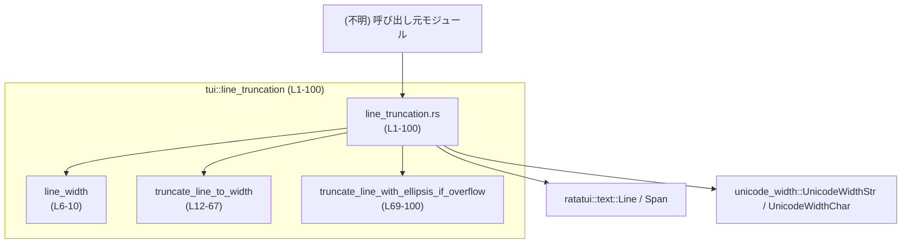
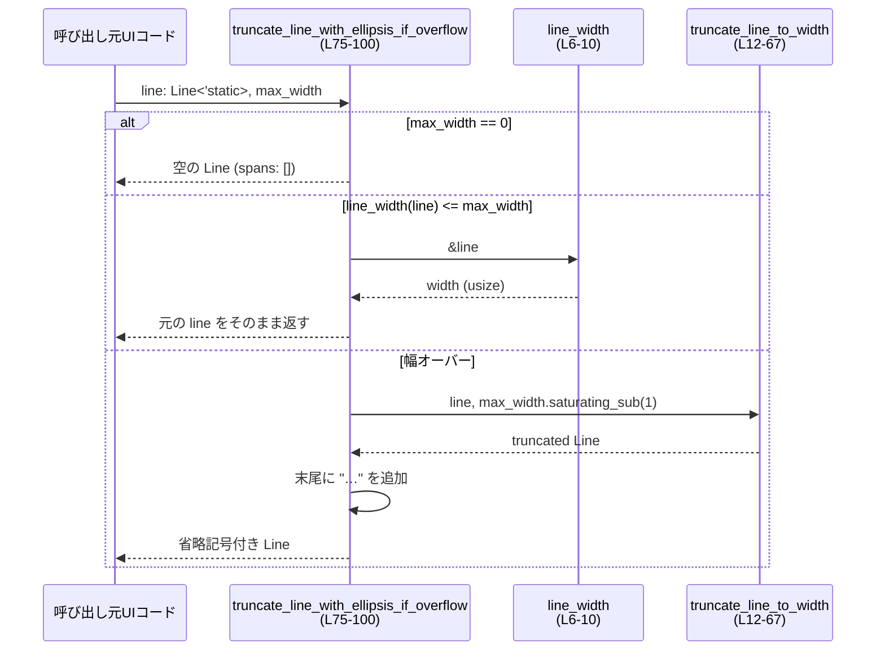

# tui/src/line_truncation.rs コード解説

## 0. ざっくり一言

- ratatui の `Line` を対象に、「表示幅（Unicode 幅）」を計算し、指定幅に収まるように行を切り詰めるヘルパー関数群です。
- オプションとして、幅を超えた場合に行末へ「…」を付けるユーティリティも提供します。

---

## 1. このモジュールの役割

### 1.1 概要

- このモジュールは **ターミナル上での見かけの幅（全角・半角を考慮したセル幅）に基づいて `Line` を切り詰める** 問題を解決するために存在しています。
- 具体的には、次の機能を提供します。
  - `Line` の表示幅（セル幅）の計算（`line_width`）（根拠: `tui/src/line_truncation.rs:L6-10`）
  - 指定した最大幅に収まるように `Line` を切り詰める（`truncate_line_to_width`）（L12-67）
  - オーバーフロー時のみ、末尾に「…」を付けて切り詰める（`truncate_line_with_ellipsis_if_overflow`）（L69-100）

### 1.2 アーキテクチャ内での位置づけ

- このファイルは、TUI レイヤ内で **テキスト整形（line wrapping / truncation）** に関する内部ヘルパーとみなせます。
- 外部依存:
  - `ratatui::text::Line`, `Span`: 行とスタイル付きテキストの型（L1-2）
  - `unicode_width::{UnicodeWidthStr, UnicodeWidthChar}`: 文字列・文字ごとの幅計算（L3-4）
- このチャンクには、このモジュールを呼び出す側のコードは現れないため、実際にどのウィジェット／画面から呼ばれているかは不明です。

依存関係を簡略図で表すと次のようになります。



### 1.3 設計上のポイント

- **副作用のない純粋関数**
  - すべての関数は引数として `Line` を受け取り、新しい `Line` を返すだけで、グローバル状態を変更しません（L6, L12, L75）。
  - スレッド間で共有しても内部状態は持たないため、並行呼び出しによる競合はありません。
- **Unicode 幅に対応したトランケーション**
  - 行全体の幅計算に `UnicodeWidthStr::width` を使用し（L8, L26）、部分トランケーション時に `UnicodeWidthChar::width` を用いることで（L47）、全角文字や結合文字を考慮した切り詰めを行います。
- **高速パスと低速パスの分離**
  - `truncate_line_with_ellipsis_if_overflow` は、まず `line_width` で幅を一度だけ測り（L83）、収まる場合は元の `line` をそのまま返す「高速パス」を持ちます（L83-85）。
  - 幅超過時のみ、より重い `truncate_line_to_width`（部分文字列切り出しループ）を呼び出す構造です（L87）。
- **`'static` ライフタイムの利用**
  - トランケーション関数は `Line<'static>` を値として取り、`Line<'static>` を返します（L12, L75）。
  - 内部で `String` を所有した `Span`（owned `Cow<'static, str>`）を生成するため、呼び出し元から見てライフタイム上の制約は緩く、安全に返却できます（L55-56）。

---

## 2. 主要な機能一覧

- `line_width`: `Line` 全体の Unicode セル幅を返すヘルパー（L6-10）。
- `truncate_line_to_width`: `Line` を指定の最大セル幅に収まるように切り詰めた新しい `Line` を返す（L12-67）。
- `truncate_line_with_ellipsis_if_overflow`: 幅を超えた場合のみ `truncate_line_to_width` で切り詰めた上で末尾に「…」を付与する（L69-100）。

---

## 3. 公開 API と詳細解説

※ここでは **ファイル内で定義されているコンポーネント** を一覧化します（pub(crate) のためモジュール外には公開されませんが、crate 内部 API として扱います）。

### 3.1 型一覧（構造体・列挙体など）

このファイル内で新たに定義される型はありませんが、外部型の利用状況を整理します。

| 名前 | 種別 | 定義元 | 役割 / 用途 | 使用箇所（行） |
|------|------|--------|-------------|----------------|
| `Line<'a>` | 構造体 | `ratatui::text::Line` | 1 行分のテキストとスタイル・配置を表す | 関数引数・戻り値（L6, L12, L75, L62-66, L95-99） |
| `Span<'a>` | 構造体 | `ratatui::text::Span` | 行中の部分文字列とそのスタイル | `Line` の構成要素として利用（L14, L23, L25, L29, L56, L80, L94） |

### 3.1.1 関数・コンポーネント インベントリー

| 名前 | 種別 | 可視性 | シグネチャ | 定義箇所 |
|------|------|--------|------------|----------|
| `line_width` | 関数 | `pub(crate)` | `fn line_width(line: &Line<'_>) -> usize` | `tui/src/line_truncation.rs:L6-10` |
| `truncate_line_to_width` | 関数 | `pub(crate)` | `fn truncate_line_to_width(line: Line<'static>, max_width: usize) -> Line<'static>` | `tui/src/line_truncation.rs:L12-67` |
| `truncate_line_with_ellipsis_if_overflow` | 関数 | `pub(crate)` | `fn truncate_line_with_ellipsis_if_overflow(line: Line<'static>, max_width: usize) -> Line<'static>` | `tui/src/line_truncation.rs:L69-100` |

---

### 3.2 関数詳細（最大 7 件）

#### `line_width(line: &Line<'_>) -> usize`

**概要**

- `ratatui::text::Line` 全体の表示幅（Unicode セル幅）を計算し、`usize` で返します（L6-10）。
- 行を構成するすべての `Span` のテキスト幅を合計した値です。

**引数**

| 引数名 | 型 | 説明 |
|--------|----|------|
| `line` | `&Line<'_>` | 幅を計算したい行への参照。ライフタイムは任意。 |

**戻り値**

- `usize`: `line` のテキスト部分の合計セル幅。`unicode_width::UnicodeWidthStr::width` の合計です（L7-9）。

**内部処理の流れ**

1. `line.iter()` で行内の `Span` を順に走査します（L7）。
2. 各 `Span` について `span.content.as_ref()`（`&str`）を取り出し、`UnicodeWidthStr::width` でセル幅を求めます（L8）。
3. それらを `.sum()` で合計し、結果を返します（L9）。

**Examples（使用例）**

```rust
use ratatui::text::Line;
// line_truncation.rs と同じモジュール内、または pub(crate) をインポート済みと仮定

fn example_line_width() {
    // 'static な文字列から Line<'static> を生成（全角文字を含む）
    let line: Line<'static> = Line::from("abc全角"); // "abc"=3, "全角"=2文字*2セル=4（環境により異なるが unicode_width 想定）

    let width = line_width(&line); // 行の表示幅を計算
    // width はおおよそ 7 セル（環境依存だが、ロジックとしては合計値）
}
```

**Errors / Panics**

- 関数内でエラー型は使用しておらず、`Result` も返しません。
- 明示的な `panic!` はありません。
- 使用している `UnicodeWidthStr::width` は通常 panic しない前提の API であり、このチャンクからは panic 条件は読み取れません。

**Edge cases（エッジケース）**

- 空行（`line` が `Span` を 1 つも持たない）  
  → `iter()` が空のため合計幅は `0` になります。
- すべての文字がゼロ幅（結合文字のみ等）の場合  
  → `UnicodeWidthStr::width` が `0` を返すため、結果は `0` になります。
- 全角・半角が混在する場合  
  → 各文字のセル幅に基づいて合計されるため、バイト数や文字数とは一致しません。

**使用上の注意点**

- 戻り値は **端末上のセル幅基準** であり、**文字数やバイト数ではありません**。
- この関数は読み取り専用の参照を受け取るため、所有権は移動せず安全に呼び出せます（Rust の借用ルール上も問題ありません）。

---

#### `truncate_line_to_width(line: Line<'static>, max_width: usize) -> Line<'static>`

**概要**

- 入力の `Line<'static>` を **`max_width` セル以内** に収まるように切り詰めた新しい `Line<'static>` を返します（L12-67）。
- 幅を超える最初の `Span` で文字単位のトランケーションを行い、それ以降の `Span` は破棄します。

**引数**

| 引数名 | 型 | 説明 |
|--------|----|------|
| `line` | `Line<'static>` | 切り詰め対象の行。所有権が移動します（L12, L17-21）。 |
| `max_width` | `usize` | 許容する最大セル幅。`0` の場合は空行を返します（L13-15）。 |

**戻り値**

- `Line<'static>`:  
  - `line` の `style` と `alignment` をそのまま引き継ぎ（L17-21, L62-65）、
  - `spans` を幅制限に従って切り詰めた新しい行です。

**内部処理の流れ（アルゴリズム）**

1. **幅 0 の特例処理**  
   - `max_width == 0` の場合、空の `Vec<Span<'static>>` から `Line` を生成して返します（L13-15）。
2. **Line の分解と出力用バッファの準備**
   - `line` を分解して `style`, `alignment`, `spans` を取得（L17-21）。
   - `used`（現在までに使用した幅）を 0 で初期化（L22）。
   - 出力用 `spans_out` を `spans.len()` 分の容量を確保して生成（L23）。
3. **Span ごとの処理ループ**（L25-60）
   - 各 `span` について `UnicodeWidthStr::width(span.content.as_ref())` で幅を求める（L26）。
   - 幅が 0 の `Span` はそのまま出力に追加し（L28-30）、幅は増加させず次へ。
   - `used >= max_width` の時点でループを終了（L33-35）。
   - `used + span_width <= max_width` なら、`span` 全体が収まるのでそのまま追加し、`used` に幅を加算（L37-40）。
4. **部分トランケーション**
   - 上記どちらにも当てはまらない場合（`span` の一部だけが入る）：
     1. `span` の `style` と `content` への参照を取得（L43-44）。
     2. `text.char_indices()` で文字ごとのバイトオフセットと文字を走査（L46）。
     3. 各文字に対し `UnicodeWidthChar::width(ch).unwrap_or(0)` でセル幅を求め（L47）、`used + ch_width > max_width` ならそこで打ち切り（L48-50）。
     4. 収まる文字について `end_idx` を更新しつつ、`used` に幅を加算（L51-52）。
     5. `end_idx > 0` なら `text[..end_idx]` の部分文字列を `String` にし、`Span::styled` でスタイル付き `Span` として出力に追加（L55-56）。
   - 部分トランケーション後は、残りの `Span` は処理せずループを終了します（L59）。
5. **新しい Line の構築**
   - 元の `style` と `alignment` を引き継ぎ、`spans_out` を `spans` として新しい `Line` を構築して返します（L62-66）。

**Examples（使用例）**

```rust
use ratatui::text::{Line, Span};

// crate 内で line_truncation.rs の関数にアクセスできる前提
fn example_truncate_line_to_width() {
    // 'static な文字列リテラルから Line<'static> を作成
    let line: Line<'static> = Line::from("とても長いタイトルです");

    // 最大幅 10 セルに切り詰める
    let truncated: Line<'static> = truncate_line_to_width(line, 10);

    // truncated は 10 セル以内に収まるように途中で切られた行になる
    // 以降 truncated をウィジェットに渡して描画に使う
}
```

**Errors / Panics**

- 明示的な `panic!` 呼び出しはありません。
- 文字列スライス `text[..end_idx]` は、`char_indices` から得られたバイトオフセットを使っており（L46, L51）、常に UTF-8 の文字境界になるため、**UTF-8 境界違反による panic のリスクは避けられています**。
- `UnicodeWidthChar::width(ch).unwrap_or(0)` は `unwrap_or(0)` であり、エラーや panic にはなりません（L47）。

**Edge cases（エッジケース）**

- `max_width == 0`  
  → 空の行（`spans` 空）を返します（L13-15）。
- 最初の非ゼロ幅文字すら収まらない場合  
  → `end_idx` が 0 のままになり、部分 `Span` は追加されず、それ以前に追加済みの `Span`（ゼロ幅のみなど）だけが残ります（L55-56）。
- ゼロ幅文字のみの `Span`  
  → `span_width == 0` と判定され、そのまま出力にコピーされます（L28-30）。
- 結合文字や幅 0 の文字を含む `Span`  
  → 文字ごとの幅は `UnicodeWidthChar::width(ch).unwrap_or(0)` で計算されるため、幅 0 の文字は幅を増やさずにそのまま部分文字列に含まれます。

**使用上の注意点**

- `line` の所有権を消費する関数です（引数が by-value）。呼び出し後に元の `line` は使えません。
- `max_width` は **セル数** を表します。ASCII 1 文字 = 1 セル、全角 1 文字 = 2 セルといった扱いになります（`unicode_width` に依存）。
- 性能的には文字単位の走査が発生するため、非常に長い行や大量の行に対して頻繁に呼び出す場合はコストを考慮する必要があります（特に overflow が発生しやすいケース）。

---

#### `truncate_line_with_ellipsis_if_overflow(line: Line<'static>, max_width: usize) -> Line<'static>`

**概要**

- 行が `max_width` セルを超える場合にのみ、幅を 1 セル分短く切り詰めたうえで末尾に「…」を付与する関数です（L69-100）。
- 収まる場合は `line` を変更せず、そのまま返す「高速パス」を持ちます（L83-85）。

**引数**

| 引数名 | 型 | 説明 |
|--------|----|------|
| `line` | `Line<'static>` | 切り詰め＋省略記号付与の対象となる行。所有権を消費します（L75-78）。 |
| `max_width` | `usize` | 行全体（省略記号を含む）が収まるべき最大セル幅（L77）。 |

**戻り値**

- `Line<'static>`:
  - 必要なら `truncate_line_to_width` によって短くし、末尾に「…」を付けた行、
  - もしくは変更を加えない元の `line`（幅が足りている場合）。

**内部処理の流れ**

1. **幅 0 の特例処理**  
   - `max_width == 0` の場合、空行を返します（L79-81）。  
     → 省略記号も付きません。
2. **高速パス（オーバーフローなし）**
   - `line_width(&line) <= max_width` なら、`line` をそのまま返します（L83-85）。
   - このとき `truncate_line_to_width` は呼ばれないため、文字単位走査は行われません。
3. **オーバーフロー時の処理**
   - `max_width.saturating_sub(1)` を計算し（L87）、その分だけ短い幅で `truncate_line_to_width` を呼び出します（L87）。
     - ここで 1 セル分の余裕を作り、その後に「…」を 1 セルとして追加する意図が読み取れます（ただし「…」の幅 1 セルであることは `unicode_width` の仕様に依存）。
   - 返ってきた `Line` を分解し、`style`, `alignment`, `spans` を取得（L88-92）。
   - `spans.last()` のスタイルを省略記号のスタイルとして使用し（L93）、`"…"` を `Span::styled` で追加します（L94）。
   - 最後に、同じ `style`, `alignment`, 修正済み `spans` で新しい `Line` を構築して返します（L95-99）。

**Examples（使用例）**

```rust
use ratatui::text::Line;

// line_truncation.rs のあるモジュールから利用するケース
fn example_truncate_with_ellipsis() {
    // 'static な文字列リテラルを使うことで Line<'static> を作る
    let line: Line<'static> = Line::from("とても長い説明文です。すべてを表示すると幅を超えます。");

    // セル幅 20 を上限とし、必要なら「…」を付ける
    let rendered: Line<'static> = truncate_line_with_ellipsis_if_overflow(line, 20);

    // rendered の幅は概ね 20 セル以内に収まり、末尾に「…」が付いている可能性があります
}
```

**Errors / Panics**

- 関数自体はエラー型を返さず、明示的な `panic!` も使用していません。
- 内部で呼び出す `line_width` および `truncate_line_to_width` の安全性については、それぞれの説明に準じます。
- `max_width.saturating_sub(1)` を利用しているため、`max_width == 0` の場合でも underflow による panic は発生しません（ただし、その前に明示的な `max_width == 0` チェックで早期 return しており、実際には `saturating_sub` は 0 以外のケースでのみ意味を持ちます）（L79-81, L87）。

**Edge cases（エッジケース）**

- `max_width == 0`  
  → 空行を返し、`"…"` は付きません（L79-81）。
- 幅がちょうど `max_width` の行  
  → `line_width(&line) <= max_width` の条件を満たすため、行はそのまま返され、省略記号も付きません（L83-85）。
- `max_width == 1` で幅超過する行  
  - `max_width.saturating_sub(1)` は 0 となり、`truncate_line_to_width` は空の行を返します（L87）。
  - その後、省略記号だけが追加されるため、結果は 1 セル分の「…」のみになります（L93-94）。
- 行がゼロ幅（空行やゼロ幅文字のみ）で `max_width > 0`  
  → `line_width(&line)` が 0 となり、オーバーフローなしと判断されるため、行は変更されません（L83-85）。

**使用上の注意点**

- この関数も `Line<'static>` の所有権を消費します。
- 実装コメントにもあるように、**短い UI 行** を対象としたユーティリティであり（L69-74）、大量の長文コンテンツをループ内で頻繁に処理する用途では、パフォーマンスを再評価する前提とされています。
- 末尾の「…」は `spans.last()` のスタイルを引き継ぐため、最後の文字と同じスタイルで表示されます（L93-94）。行全体のスタイルとは異なる可能性があります。

---

### 3.3 その他の関数

- このファイルには、上記 3 つ以外の関数は定義されていません。

---

## 4. データフロー

ここでは、「幅制限付きで行を描画する」という典型的なシナリオでのデータフローを示します。  

### 4.1 処理の要点

1. 呼び出し元（UI 描画コード）が `Line<'static>` とセル幅 `max_width` を用意します。
2. `truncate_line_with_ellipsis_if_overflow` に渡し、必要なら切り詰め＋「…」付与された `Line` を取得します。
3. その内部で、まず `line_width` で幅をチェックし、オーバーフロー時のみ `truncate_line_to_width` で実際のトランケーションが行われます。

### 4.2 シーケンス図



---

## 5. 使い方（How to Use）

### 5.1 基本的な使用方法

#### 例1: シンプルな幅トランケーション

```rust
use ratatui::text::Line;
// line_truncation.rs と同じ crate 内で、関数がインポート済みとする

fn render_fixed_width_cell(cell_width: usize) {
    // 'static な文字列リテラルで Line<'static> を生成
    let line: Line<'static> = Line::from("とても長い列タイトル");

    // 固定幅セルに収まるように切り詰める（省略記号なし）
    let truncated = truncate_line_to_width(line, cell_width);

    // truncated をテーブルセルなどに描画に使う
}
```

#### 例2: オーバーフロー時のみ「…」を付ける

```rust
use ratatui::text::Line;

fn render_with_ellipsis(cell_width: usize) {
    // ここでは単純な例として 'static str を使用
    let line: Line<'static> = Line::from("説明文が長い場合に省略表示する例です");

    // cell_width を超えるときだけ末尾に「…」を付ける
    let rendered = truncate_line_with_ellipsis_if_overflow(line, cell_width);

    // rendered をラベル等に渡して描画する
}
```

### 5.2 よくある使用パターン

- **幅チェックのみをしたい場合**  
  → `line_width` だけを使い、オーバーフロー判定などに利用できます（L6-10）。

- **「必ず収めたいが、省略記号は不要」な場合**  
  → `truncate_line_to_width` を直接使用し、セル内に確実に収める（L12-67）。

- **「オーバーフローしたときだけユーザーに伝えたい」場合**  
  → `truncate_line_with_ellipsis_if_overflow` を使うことで、幅が足りないときだけ「…」が表示されます（L75-100）。

### 5.3 よくある間違い

このファイル単体から推測できる範囲での「誤用パターン」を挙げます。

```rust
use ratatui::text::Line;

fn wrong_usage(cell_width: usize) {
    let line: Line<'static> = Line::from("短いテキスト");

    // 誤解されがちな例: max_width == 0 で省略記号を期待する
    // 実際には空行が返り、「…」は付きません
    let rendered = truncate_line_with_ellipsis_if_overflow(line, 0);

    // rendered は spans が空の Line
}
```

- `max_width == 0` のときに「…」付きの 1 セル表示を期待すると挙動と食い違います（設計としては「0 はまったく表示しない」意味になっています）（L79-81）。
- `Line<'static>` の所有権が move されるため、同じ `line` を複数回再利用しようとすると、追加のクローンや再生成が必要になる点に注意が必要です（L12, L75）。

### 5.4 使用上の注意点（まとめ）

- **所有権**: 2 つのトランケーション関数は `Line<'static>` を by-value で受け取るため、呼び出し後に元の値は使えません。
- **ライフタイム `'static`**:
  - 引数・戻り値が `Line<'static>` ですが、内部では `String` を所有した `Span` を生成して返しているため、スタック変数の寿命が尽きても安全です（Owned データ）。  
  - `'static` は「`'static` な参照も保持できる」という型上の上限であり、「実際に静的メモリに置く」という意味ではありません。
- **パフォーマンス**:
  - 幅が足りているケースでは `truncate_line_with_ellipsis_if_overflow` の処理は `line_width` の 1 回の呼び出しだけで済みます（L83-85）。
  - 頻繁にオーバーフローする長いテキストに対して多用すると、部分トランケーションの文字走査コストが蓄積する可能性があります（L46-53）。

---

## 6. 変更の仕方（How to Modify）

### 6.1 新しい機能を追加する場合

例: 「任意の省略記号（`"..."` や `"…"` 以外）を使いたい」機能を追加する場合。

1. **新しい関数の追加先**
   - 同じファイル `tui/src/line_truncation.rs` に新関数を追加するのが自然です（既存のトランケーション関連ロジックが集中しているため）。
2. **既存ロジックの再利用**
   - 幅計算は `line_width` を再利用（L6-10）。
   - 実際のトランケーションは `truncate_line_to_width` を再利用し、余白の幅だけ調整する形にすると一貫性が保たれます（L12-67）。
3. **呼び出し経路**
   - 呼び出し元 UI コードからの利用方法は `truncate_line_with_ellipsis_if_overflow` と似たインターフェースにすると移行が容易です。
4. **セル幅の考慮**
   - 新しい省略記号のセル幅を `unicode_width` で確認し、その幅分だけ `max_width` から差し引くようにする必要があります（`max_width.saturating_sub(...)` のパターンを流用）（L87）。

### 6.2 既存の機能を変更する場合

- **影響範囲の確認**
  - `truncate_line_with_ellipsis_if_overflow` は `line_width` と `truncate_line_to_width` に依存しているため（L83, L87）、これらのシグネチャや意味を変えると直ちに影響が出ます。
- **前提条件・契約の維持**
  - `truncate_line_to_width` の結果は「幅が `max_width` セル以内に収まる」ことが暗黙の契約になっています。ここを崩すと、`truncate_line_with_ellipsis_if_overflow` の「`max_width - 1` で切って +「…」でちょうど `max_width` に収まる」という前提が崩れます。
- **テストと使用箇所の確認**
  - このチャンクにはテストは存在しないため、別ファイルにテストがある場合はそこも確認が必要です（テストファイルはこのチャンクには現れません）。
  - 呼び出し元コード（UI コンポーネントなど）がこの挙動に依存していないか、検索して確認する必要があります（呼び出し元はこのチャンクには現れません）。

---

## 7. 関連ファイル

このチャンクから分かる範囲で、密接に関係する外部コンポーネントを列挙します。

| パス / モジュール | 役割 / 関係 |
|------------------|------------|
| `tui/src/line_truncation.rs` | 本モジュール。行の幅計算とトランケーション処理を提供する。 |
| `ratatui::text::Line` | 行テキスト＋スタイル情報を表す型。本モジュールの主要な引数・戻り値として使用（L1, L6, L12, L75）。 |
| `ratatui::text::Span` | 行中の部分文字列とスタイルを表す型。`Line` の構成要素として利用（L2, L25-30, L56, L94）。 |
| `unicode_width::UnicodeWidthStr` | 文字列のセル幅計算を提供し、`line_width` と `truncate_line_to_width` で利用（L3, L8, L26）。 |
| `unicode_width::UnicodeWidthChar` | 文字単位のセル幅計算を提供し、部分トランケーション時の 1 文字ずつの幅チェックに使用（L3, L47-48）。 |
| （不明）UI 描画コード | `truncate_line_to_width` や `truncate_line_with_ellipsis_if_overflow` を実際に呼び出している側。どのファイルかはこのチャンクには現れません。 |

このファイル単体からは、セキュリティ上の懸念となるような外部入力や I/O は扱っておらず、すべてインメモリなテキスト処理であることが読み取れます。
