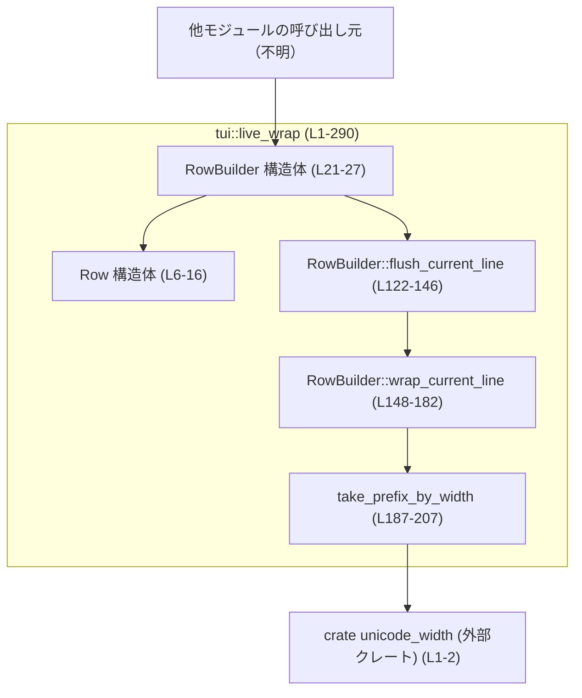
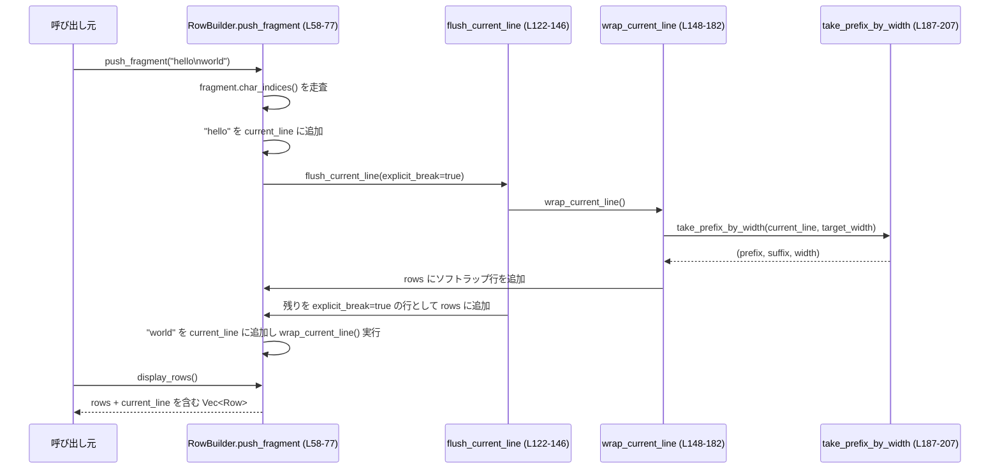

# tui/src/live_wrap.rs

## 0. ざっくり一言

Unicode の表示幅を考慮しながら、入力テキストをインクリメンタルに「画面行（Row）」へ折り返すためのユーティリティです（`Row` と `RowBuilder`、`take_prefix_by_width` を提供します。根拠: `live_wrap.rs:L4-27, L187-207`）。

---

## 1. このモジュールの役割

### 1.1 概要

- このモジュールは **テキストを TUI 上の行幅に合わせて折り返す問題** を解決するために存在し、  
  **Unicode 幅を考慮した行分割（ソフトラップ/ハードラップの区別）** を提供します（`Row`, `RowBuilder`。`live_wrap.rs:L4-27`）。
- 入力は任意に分割されたフラグメント（チャンク）として与えられ、**フラグメントの切り方に依存しない（fragmentation invariance）** 出力を目指しています（テスト `fragmentation_invariance_long_token`。`live_wrap.rs:L252-267`）。
- 低レベル関数 `take_prefix_by_width` により、1 行分の最大表示幅に収まるプレフィックスを取り出すことができます（`live_wrap.rs:L185-207`）。

### 1.2 アーキテクチャ内での位置づけ

このファイル単体で見ると、依存関係は次のようになっています。



- 呼び出し元（アプリケーションや TUI レイヤ）は `RowBuilder` を生成し、`push_fragment` や `display_rows` を通じて入出力を行う設計になっています（`live_wrap.rs:L29-31, L58-77, L95-104`）。
- Unicode 幅の計算は外部クレート `unicode_width` に委譲されています（`live_wrap.rs:L1-2, L193-195`）。
- 他ファイルや上位モジュールとの関係はこのチャンクには現れないため **不明** です。

### 1.3 設計上のポイント

コードから読み取れる主な設計上の特徴です。

- **インクリメンタル処理 / フラグメント不変性**  
  - テキストを任意サイズのフラグメントで `push_fragment` しても、同じテキストを一括で渡した場合と同じ行分割になるように設計されています（テスト `fragmentation_invariance_long_token`。`live_wrap.rs:L252-267`）。
- **論理行と表示行の分離**  
  - `current_line` は改行までの「論理行」のバッファで、`rows` は折り返された「表示行」の履歴を保持します（`live_wrap.rs:L23-26`）。
- **ソフトラップ vs 明示的改行の区別**  
  - `Row.explicit_break` により、「明示的な改行（`\n` や `end_line`）」と「幅による自動折り返し」を区別しています（`live_wrap.rs:L7-10, L79-82, L122-146`）。
- **Unicode 幅対応**  
  - `UnicodeWidthStr::width` と `UnicodeWidthChar::width` により、ASCII だけでなく Emoji・CJK などの全角文字も幅 2 として扱います（`live_wrap.rs:L1-2, L14-15, L193-195`）。
- **安全性**  
  - `unsafe` は一切使っていません。  
  - 文字列スライスは `char_indices` から得たインデックスで行われ、UTF-8 の境界を壊さない実装になっています（`live_wrap.rs:L63-71, L193-200`）。
- **エラーハンドリング方針**  
  - すべての公開 API はパニックを明示的には発生させず、`Result` も返しません。入力が極端に大きい場合のメモリ確保失敗など、Rust 標準のランタイムエラー以外の失敗パスはありません（コード全体に `panic!` / `unwrap` が存在しないことによる推論。`live_wrap.rs:L1-290`）。
- **並行性**  
  - フィールドは `usize`, `String`, `Vec<Row>` だけで、内部可変性も共有状態も持ちません（`live_wrap.rs:L21-26`）。  
  - `RowBuilder` のメソッドはすべて `&mut self` を要求するため、通常の Rust の所有権/借用ルールによりデータ競合はコンパイル時に防がれます。

---

## 2. 主要な機能一覧

このモジュールが提供する主な機能です。

- `Row`: 折り返し済み 1 行分のテキストと、「明示的改行かどうか」のフラグを表す構造体です（`live_wrap.rs:L4-16`）。
- `RowBuilder`:  
  - 指定された幅 (`target_width`) に従ってテキストをインクリメンタルに折り返すビルダーです（`live_wrap.rs:L18-27, L29-183`）。
  - テキストフラグメントの投入 (`push_fragment`)、現在の行群の取得 (`rows`, `display_rows`)、古い行のドレイン (`drain_rows`, `drain_commit_ready`)、行幅の変更 (`set_width`) を提供します。
- `take_prefix_by_width`:  
  - 文字列の先頭から、表示幅が `max_cols` 以下になる最大のプレフィックスと、その残り（サフィックス）を返す低レベル関数です（`live_wrap.rs:L185-207`）。

---

## 3. 公開 API と詳細解説

### 3.1 型一覧（構造体・列挙体など）

| 名前 | 種別 | 役割 / 用途 | 定義位置 |
|------|------|-------------|----------|
| `Row` | 構造体 | 折り返し結果の 1 行分を表す。`text` に行内容、`explicit_break` に「明示的改行かどうか」を保持する。 | `live_wrap.rs:L4-10` |
| `RowBuilder` | 構造体 | 入力テキストを段階的に受け取り、`Row` の列として折り返すビルダー。論理行バッファ `current_line` と出力行 `rows` を内部に持つ。 | `live_wrap.rs:L18-27` |

`Row` のメソッド:

| メソッド名 | 公開? | 役割 / 用途 | 定義位置 |
|-----------|-------|-------------|----------|
| `Row::width(&self) -> usize` | 公開 | `text` の Unicode 表示幅（列数）を返す。`unicode_width::UnicodeWidthStr::width` の薄いラッパー。 | `live_wrap.rs:L12-16` |

`RowBuilder` のメソッド（コンポーネントインベントリー）:

| メソッド名 | 公開? | 役割 / 用途 | 定義位置 |
|-----------|-------|-------------|----------|
| `RowBuilder::new(target_width: usize) -> Self` | 公開 | 指定幅で新しいビルダーを生成する。幅 0 が渡されても 1 に丸める。 | `live_wrap.rs:L29-36` |
| `RowBuilder::width(&self) -> usize` | 公開 | 現在のターゲット幅を返す。 | `live_wrap.rs:L38-40` |
| `RowBuilder::set_width(&mut self, width: usize)` | 公開 | ターゲット幅を変更し、保持しているすべての行を再ラップする。幅 0 は 1 に丸める。 | `live_wrap.rs:L42-55` |
| `RowBuilder::push_fragment(&mut self, fragment: &str)` | 公開 | テキストフラグメントを追加し、必要に応じて折り返しを更新する。フラグメント内の `'\n'` も処理する。 | `live_wrap.rs:L57-77` |
| `RowBuilder::end_line(&mut self)` | 公開 | 論理行の終わりを明示的にマークする（`\n` を押し込むのと同等）。 | `live_wrap.rs:L79-82` |
| `RowBuilder::drain_rows(&mut self) -> Vec<Row>` | 公開 | これまで生成された行（`rows`）をすべてドレインして返す。 | `live_wrap.rs:L84-87` |
| `RowBuilder::rows(&self) -> &[Row]` | 公開 | 生成済みの行をスナップショットとして参照する（ドレインしない）。 | `live_wrap.rs:L89-92` |
| `RowBuilder::display_rows(&self) -> Vec<Row>` | 公開 | 生成済み行に加え、未確定の現在行 (`current_line`) も 1 行として含めた表示用行群を返す。 | `live_wrap.rs:L94-104` |
| `RowBuilder::drain_commit_ready(&mut self, max_keep: usize) -> Vec<Row>` | 公開 | 表示行数が `max_keep` を超える分だけ、最も古い `Row` をドレインして返す。スクロールのコミットなどに使える。 | `live_wrap.rs:L106-120` |
| `RowBuilder::flush_current_line(&mut self, explicit_break: bool)` | 非公開 | `current_line` を幅に従って `rows` にフラッシュし、必要に応じて明示的改行行を追加する。 | `live_wrap.rs:L122-146` |
| `RowBuilder::wrap_current_line(&mut self)` | 非公開 | `current_line` の内容を `take_prefix_by_width` を使って繰り返し折り返し、`rows` にソフトラップとして追加する。最後の部分は `current_line` に残す。 | `live_wrap.rs:L148-182` |

グローバル関数:

| 関数名 | 公開? | 役割 / 用途 | 定義位置 |
|--------|-------|-------------|----------|
| `take_prefix_by_width(text: &str, max_cols: usize) -> (String, &str, usize)` | 公開 | 文字列 `text` から、表示幅 `max_cols` 以下の最大プレフィックスを取り出し、その文字列・残りのスライス・プレフィックスの幅を返す。 | `live_wrap.rs:L185-207` |

### 3.2 関数詳細（主要 7 件）

#### `RowBuilder::new(target_width: usize) -> RowBuilder`

**概要**

- 指定した最大列幅で `RowBuilder` を初期化します（`live_wrap.rs:L29-36`）。
- `target_width` が 0 の場合でも `max(1)` により 1 列以上が保証されます。

**引数**

| 引数名 | 型 | 説明 |
|--------|----|------|
| `target_width` | `usize` | 折り返し対象とする最大表示幅（0 の場合は 1 に丸められる）。 |

**戻り値**

- `RowBuilder` インスタンス。内部の `current_line` や `rows` は空で、`target_width` のみが設定されています。

**内部処理の流れ**

1. `target_width.max(1)` で 1 以上に補正した値をフィールドに保存します（`live_wrap.rs:L31-32`）。
2. `current_line` と `rows` を空文字列・空ベクタで初期化します（`live_wrap.rs:L33-34`）。

**Examples（使用例）**

```rust
use tui::live_wrap::RowBuilder; // 仮のパス。実際のクレート構成に依存します。

fn main() {
    // 幅 80 列で折り返す RowBuilder を作成する
    let mut rb = RowBuilder::new(80);

    // テキストを追加していく
    rb.push_fragment("Hello, world!");
}
```

**Errors / Panics**

- 明示的なパニックはありません。メモリ確保に失敗した場合のみランタイムエラーになります。

**Edge cases（エッジケース）**

- `target_width == 0` の場合でも `1` に補正されます（`live_wrap.rs:L31-32`）。
- 非常に大きな `target_width` を渡すと、それに応じた大きな行を保持する可能性があります。

**使用上の注意点**

- 折り返し幅を後から変更したい場合は `set_width` を使用します（`live_wrap.rs:L42-55`）。
- 同じ `RowBuilder` を複数スレッドから使う場合は、通常どおり `&mut RowBuilder` を 1 スレッドに限定する必要があります（Rust の借用規則に従う）。

---

#### `RowBuilder::set_width(&mut self, width: usize)`

**概要**

- 折り返し幅を変更し、これまでに蓄積された行 (`rows` と `current_line`) をすべて再ラップします（`live_wrap.rs:L42-55`）。

**引数**

| 引数名 | 型 | 説明 |
|--------|----|------|
| `width` | `usize` | 新しい最大列幅（0 の場合は 1 に補正される）。 |

**戻り値**

- なし。

**内部処理の流れ**

1. `self.target_width` を `width.max(1)` に更新します（`live_wrap.rs:L43`）。
2. これまでの `rows` をすべてドレインし、それぞれの `Row.text` を連結します。`explicit_break == true` の行の後には `'\n'` を挿入して、論理行の境界を保持します（`live_wrap.rs:L45-51`）。
3. 連結したテキストに、現在の `current_line` を追加します（`live_wrap.rs:L52`）。
4. `current_line` をクリアし、連結した全テキストを `push_fragment` に渡し、新しい幅に基づいて再ラップします（`live_wrap.rs:L53-55`）。

**Examples（使用例）**

```rust
use tui::live_wrap::RowBuilder;

fn main() {
    let mut rb = RowBuilder::new(80);
    rb.push_fragment("a long line that may be wrapped");

    // 幅を 40 列に変更して再ラップ
    rb.set_width(40);

    // すべての行の幅が 40 以下になっている
    for row in rb.rows() {
        assert!(row.width() <= 40);
    }
}
```

**Errors / Panics**

- 明示的なパニックはありません。
- 既存行と現在行を全て 1 つの `String` に連結するため、そのサイズに応じたメモリ確保が行われます。

**Edge cases（エッジケース）**

- `width == 0` は `1` に補正されます（`live_wrap.rs:L43`）。
- 既に大量の行が溜まっている場合、そのテキストすべてを一度に連結するため、一時的にメモリ使用量が増えます。
- 以前ドレインされた行（`drain_rows` や `drain_commit_ready` で取り出されたもの）は再ラップ対象には含まれません。

**使用上の注意点**

- 頻繁に幅を変える用途では、毎回全テキストの再ラップコストがかかるため、パフォーマンスに注意が必要です。
- 行幅の変更が UI イベント（ウィンドウリサイズ）に紐づく場合は、そのイベント発生頻度に応じて呼び出しをスロットルする設計が望ましいです（コードからは制御されていないため、呼び出し側の責任になります）。

---

#### `RowBuilder::push_fragment(&mut self, fragment: &str)`

**概要**

- テキストフラグメントを現在の論理行バッファに追加し、必要に応じて折り返しや改行処理を行います（`live_wrap.rs:L57-77`）。
- フラグメント内に `'\n'` が含まれている場合、その位置で論理行を分割し、`explicit_break` を付けた `Row` を生成します。

**引数**

| 引数名 | 型 | 説明 |
|--------|----|------|
| `fragment` | `&str` | 新しく追加するテキスト。空文字列の場合は何もしない。 |

**戻り値**

- なし。

**内部処理の流れ**

1. `fragment` が空であれば早期リターンします（`live_wrap.rs:L59-61`）。
2. `start` を 0 として、`fragment.char_indices()` を走査します（`live_wrap.rs:L62-63`）。
3. `ch == '\n'` の位置ごとに:
   - `start < i` なら、`fragment[start..i]` を `current_line` に追加します（`live_wrap.rs:L66-67`）。
   - `flush_current_line(true)` を呼んで論理行をフラッシュします（`live_wrap.rs:L69-69`）。
   - `start` を次の位置 (`i + ch.len_utf8()`) に更新します（`live_wrap.rs:L70`）。
4. ループ終了後、`start < fragment.len()` であれば、残りのテキスト `fragment[start..]` を `current_line` に追加し、`wrap_current_line()` を呼んで幅による折り返しを行います（`live_wrap.rs:L73-76`）。

**Examples（使用例）**

```rust
use tui::live_wrap::{RowBuilder, Row};

fn main() {
    let mut rb = RowBuilder::new(10);

    // 改行を含むフラグメントを 1 回で渡す
    rb.push_fragment("hello\nworld!!");

    // 表示行を取得
    let rows = rb.display_rows();
    // rows[0].text == "hello", explicit_break == true
    // rows[1].text の先頭は "world!!" になる
    assert!(rows[0].explicit_break);
    assert!(rows[1].text.starts_with("world"));
}
```

**Errors / Panics**

- 文字列インデックスは `char_indices` から得た UTF-8 境界に基づくため、スライス時のパニックは発生しません（`live_wrap.rs:L63-71`）。
- その他の明示的なエラーはありません。

**Edge cases（エッジケース）**

- `fragment` が空の場合は何も起きません（`live_wrap.rs:L59-61`）。
- フラグメントの先頭や末尾が `'\n'` の場合、空行（`text == ""`, `explicit_break == true`）として `Row` が生成されます（`live_wrap.rs:L66-71, L122-146`）。
- 非常に長い単語（空白を含まない文字列）でも、`wrap_current_line` と `take_prefix_by_width` により幅で安全に分割されます（`live_wrap.rs:L148-182, L185-207`）。
- ゼロ幅文字だけからなるフラグメントの場合、`take_prefix_by_width` が `prefix_width == 0` を返すため、1 文字ずつ行として出力されます（`live_wrap.rs:L156-167, L191-197`）。

**使用上の注意点**

- ストリーム入力（ログやプロセスの標準出力など）をそのままフラグメントとして渡しても、改行を適切に保持した行群が得られます。
- 途中で `set_width` を呼ぶ場合、すでに `push_fragment` 済みのテキストも含めて再ラップされる点を考慮する必要があります。

---

#### `RowBuilder::display_rows(&self) -> Vec<Row>`

**概要**

- 既に確定した `rows` に加え、まだ改行されていない中途半端な行 (`current_line`) も 1 行として含めた、表示用の `Row` 列を返します（`live_wrap.rs:L94-104`）。

**引数**

- なし（`&self` のみ）。

**戻り値**

- `Vec<Row>`:  
  - 先頭から `self.rows` のクローン。  
  - `current_line` が空でない場合、その内容を `explicit_break: false` として最後に 1 行追加したもの。

**内部処理の流れ**

1. `self.rows.clone()` で確定行を複製し、`out` に格納します（`live_wrap.rs:L95-96`）。
2. `current_line` が空でなければ、`Row { text: current_line.clone(), explicit_break: false }` を `out` に `push` します（`live_wrap.rs:L97-101`）。
3. `out` を返します（`live_wrap.rs:L103-104`）。

**Examples（使用例）**

```rust
use tui::live_wrap::RowBuilder;

fn main() {
    let mut rb = RowBuilder::new(10);
    rb.push_fragment("hello");

    // まだ改行していないので、current_line も 1 行として含まれる
    let rows = rb.display_rows();
    assert_eq!(rows.len(), 1);
    assert_eq!(rows[0].text, "hello");
    assert_eq!(rows[0].explicit_break, false);
}
```

**Errors / Panics**

- `clone` と `to_vec` 程度の処理しか行わないため、通常のメモリ確保エラー以外は想定されません。

**Edge cases（エッジケース）**

- `current_line` が空の場合、`rows()` と `display_rows()` の結果は同じ行集合になります。
- `rows` が非常に多い場合、`clone` によりメモリ使用量が一時的に増えることがあります。

**使用上の注意点**

- 実際の TUI 描画では、`display_rows()` を使うと入力途中の行もリアルタイムに表示できます。
- ログ保存など「確定した行」だけが必要な場合は `rows()` や `drain_rows()` を使う方が効率的です。

---

#### `RowBuilder::drain_commit_ready(&mut self, max_keep: usize) -> Vec<Row>`

**概要**

- 「表示に必要な最大行数 `max_keep`」を基準に、古い行を前からドレインして返します（`live_wrap.rs:L106-120`）。
- 現在の未確定行（`current_line`）も 1 行としてカウントに含めたうえで、`max_keep` を超える分だけ確定済み行から削除します。

**引数**

| 引数名 | 型 | 説明 |
|--------|----|------|
| `max_keep` | `usize` | 表示用に保持したい最大行数。確定行＋未確定行を合わせた数で評価する。 |

**戻り値**

- `Vec<Row>`: ドレインされた古い行。元の順番を保ったまま返されます（`live_wrap.rs:L115-119`）。

**内部処理の流れ**

1. `display_count = rows.len() + (current_line が空なら 0, そうでなければ 1)` を計算します（`live_wrap.rs:L109`）。
2. `display_count <= max_keep` であれば、何も削除せず空ベクタを返します（`live_wrap.rs:L110-112`）。
3. そうでなければ、`to_commit = display_count - max_keep` を計算します（`live_wrap.rs:L113`）。
4. 実際に削除できる行数は `commit_count = to_commit.min(rows.len())` として、確定行数を超えないように制限します（`live_wrap.rs:L114`）。
5. `rows.remove(0)` を `commit_count` 回繰り返して、先頭から古い行を `drained` に詰めて返します（`live_wrap.rs:L115-119`）。

**Examples（使用例）**

```rust
use tui::live_wrap::RowBuilder;

fn main() {
    let mut rb = RowBuilder::new(5);
    rb.push_fragment("line1\nline2\nline3\n");

    // 既に 3 行ある状態で max_keep = 2 を指定
    let drained = rb.drain_commit_ready(2);

    // 最も古い 1 行だけがドレインされる
    assert_eq!(drained.len(), 1);
    assert_eq!(drained[0].text, "line1");
}
```

**Errors / Panics**

- `Vec::remove(0)` を繰り返し呼んでいるため、インデックス範囲外アクセスは起こりません（ループ回数は `rows.len()` 以内に制限されているため。`live_wrap.rs:L114-118`）。

**Edge cases（エッジケース）**

- `max_keep == 0` の場合、`display_count` が 0 を超えていれば `rows` が可能な限りドレインされますが、`current_line` 自体は削除されません。
- `rows` が空で `current_line` のみ存在する場合、何もドレインされません（`commit_count` が 0 になるため）。

**使用上の注意点**

- `rows.remove(0)` はベクタの前詰めが必要なため、`rows` が非常に大きい場合は O(n²) 的なコストになる可能性があります。
- 長時間稼働する TUI で大量の行を扱う場合は、より効率的なデータ構造（両端キューなど）への置き換えを検討する余地がありますが、本モジュール内ではそのような最適化は行われていません。

---

#### `RowBuilder::wrap_current_line(&mut self)`（非公開）

**概要**

- 現在の論理行 `current_line` を `target_width` に収まるようにソフトラップし、行幅から溢れた部分を `Row` として `rows` に追加します（`live_wrap.rs:L148-182`）。
- 最後の 1 部分（`target_width` 以下に収まる残り）は `current_line` に残し、まだ確定済み行としては出力しません。

**引数**

- なし（`&mut self` のみ）。

**戻り値**

- なし。

**内部処理の流れ（アルゴリズム）**

1. `current_line` が空であれば何もせず終了します（`live_wrap.rs:L151-153`）。
2. それ以外の場合、ループの各イテレーションで:
   1. `take_prefix_by_width(&self.current_line, self.target_width)` を呼び、`prefix`, `suffix`, `taken` を得ます（`live_wrap.rs:L154-155`）。
   2. `taken == 0` の場合は、「表示幅が 0 の文字列（ゼロ幅文字列）など」で進捗がないと判断し、先頭 1 文字を強制的に 1 行として `rows` に追加し、`current_line` をその残りに更新してループ継続します（`live_wrap.rs:L156-167`）。
   3. `suffix.is_empty()` であれば、プレフィックスが `current_line` 全体を表し、かつ `target_width` 以下に収まっているので、これ以上の折り返しは行わず、そのまま `current_line` に残してループを抜けます（`live_wrap.rs:L170-172`）。
   4. そうでない場合（`suffix` が非空）のみ、`prefix` を 1 行として `rows` に追加し、`current_line` を `suffix` に差し替えてループを続けます（`live_wrap.rs:L173-180`）。

**Examples（使用例）**

- 直接呼ぶことはできませんが、`push_fragment` 経由で実行されます（`live_wrap.rs:L73-76`）。

**Errors / Panics**

- `take_prefix_by_width` で使用するインデックスは UTF-8 境界に基づくため、スライスでパニックが発生することはありません。
- `taken == 0` の場合には必ず先頭 1 文字を消費するため、無限ループを避ける設計になっています（`live_wrap.rs:L156-167`）。

**Edge cases（エッジケース）**

- 行全体が `target_width` 以下の場合は何も `rows` に追加されず、そのまま `current_line` に保持されます。
- `UnicodeWidthChar::width` が `None` を返す文字は幅 0 として扱われるため（`unwrap_or(0)`）、そのような文字だけからなる行は「1 文字ずつ 0 幅行」として分割されます。

**使用上の注意点**

- 非公開メソッドのため、通常は意識する必要はありませんが、折り返しロジックを変更する場合にはこの関数の挙動が中心になります。

---

#### `take_prefix_by_width(text: &str, max_cols: usize) -> (String, &str, usize)`

**概要**

- 文字列 `text` の先頭から、表示幅（列数）が `max_cols` 以下となる最大のプレフィックスを取り出します（`live_wrap.rs:L185-207`）。
- プレフィックス文字列・残りのスライス・プレフィックス幅をタプルで返します。

**引数**

| 引数名 | 型 | 説明 |
|--------|----|------|
| `text` | `&str` | 対象となる UTF-8 文字列。 |
| `max_cols` | `usize` | プレフィックスに許容される最大表示幅。0 の場合、常に空のプレフィックスが返る。 |

**戻り値**

- `(prefix: String, suffix: &str, prefix_width: usize)`:
  - `prefix`: `max_cols` 列以内に収まる先頭部分（所有権を持つ `String`）。
  - `suffix`: `prefix` を除いた残りのスライス（元の `text` を指す `&str`）。
  - `prefix_width`: `prefix` の表示幅（列数）。

**内部処理の流れ（アルゴリズム）**

1. `max_cols == 0` または `text.is_empty()` の場合、空の `String` と元の `text` をそのまま返します（`live_wrap.rs:L187-190`）。
2. それ以外の場合、`cols`（累積幅）と `end_idx`（プレフィックス終端バイト位置）を 0 に初期化します（`live_wrap.rs:L191-192`）。
3. `text.char_indices()` を順に走査し:
   - 各 `ch` について `UnicodeWidthChar::width(ch).unwrap_or(0)` で表示幅を取得します（`live_wrap.rs:L193-195`）。
   - `cols.saturating_add(ch_width) > max_cols` なら、それ以上追加できないのでループを抜けます（`live_wrap.rs:L195-196`）。
   - そうでなければ `cols += ch_width; end_idx = i + ch.len_utf8()` と更新します（`live_wrap.rs:L198-199`）。
   - `cols == max_cols` になったところで早期にループを抜けます（`live_wrap.rs:L200-201`）。
4. 最終的な `end_idx` までを `prefix` として `String` に変換し、その後ろを `suffix` として `&str` のまま返します（`live_wrap.rs:L204-206`）。

**Examples（使用例）**

```rust
use tui::live_wrap::take_prefix_by_width;

fn main() {
    // ASCII の例
    let (prefix, suffix, width) = take_prefix_by_width("hello world", 5);
    assert_eq!(prefix, "hello");
    assert_eq!(suffix, " world");
    assert_eq!(width, 5);

    // Emoji を含む例（😀 は幅 2 と想定）
    let (p2, s2, w2) = take_prefix_by_width("😀😀 你好", 6);
    // テストと同様に "😀😀 " までが取得されることを期待
    assert_eq!(p2, "😀😀 ");
    assert_eq!(w2, 5); // 幅 2 + 2 + 1 = 5
}
```

**Errors / Panics**

- `text[..end_idx]` は `char_indices` から取得した境界に基づいているため、UTF-8 の不正境界アクセスによるパニックは起こりません。
- `UnicodeWidthChar::width(ch)` が `None` の場合は `0` として扱い、パニックにはなりません（`unwrap_or(0)`。`live_wrap.rs:L194-195`）。

**Edge cases（エッジケース）**

- `max_cols == 0` のときは必ず `(empty String, text, 0)` が返ります（`live_wrap.rs:L187-190`）。
- すべて幅 0 の文字で構成された文字列では、`prefix_width == 0` のまま `prefix` が `text` 全体になり、`suffix` は空になります。
- `text` の表示幅が `max_cols` 未満の場合、`prefix` は `text` 全体、`suffix` は空になります。

**使用上の注意点**

- 単体で利用する場合、`prefix` が `String`（所有権あり）、`suffix` が `&str`（借用）である点に注意が必要です。
- `max_cols` を 0 以外で使用するのが通常の想定です；0 を渡すと常に空プレフィックスになるため、呼び出し側で無限ループしないよう注意が必要です。

---

### 3.3 その他の関数

公開 API だが単純なラッパー・アクセス関数であるもの、およびテスト関数一覧です。

| 関数名 | 種別 | 役割（1 行） | 定義位置 |
|--------|------|--------------|----------|
| `Row::width(&self) -> usize` | メソッド | `self.text.width()` を呼び出して行の表示幅を返す。 | `live_wrap.rs:L12-15` |
| `RowBuilder::width(&self) -> usize` | メソッド | 現在の `target_width` を返す。 | `live_wrap.rs:L38-40` |
| `RowBuilder::end_line(&mut self)` | メソッド | `flush_current_line(true)` を呼び出し、現在の論理行を明示的改行として終了させる。 | `live_wrap.rs:L79-82, L122-146` |
| `RowBuilder::drain_rows(&mut self) -> Vec<Row>` | メソッド | `std::mem::take(&mut self.rows)` で確定行をすべてドレインして返す。 | `live_wrap.rs:L84-87` |
| `RowBuilder::rows(&self) -> &[Row]` | メソッド | 確定行 `rows` のスライスをそのまま返す。 | `live_wrap.rs:L89-92` |

テスト関数（`#[cfg(test)]` 内）:

| 関数名 | 種別 | 目的 | 定義位置 |
|--------|------|------|----------|
| `rows_do_not_exceed_width_ascii` | テスト | ASCII のみの入力で行幅が `target_width` を超えないことを検証。 | `live_wrap.rs:L214-232` |
| `rows_do_not_exceed_width_emoji_cjk` | テスト | Emoji / CJK を含む場合に Unicode 幅を正しく扱うことを検証。 | `live_wrap.rs:L234-250` |
| `fragmentation_invariance_long_token` | テスト | 長いトークンを一括と分割で流し込んだ場合に出力が一致することを検証。 | `live_wrap.rs:L252-267` |
| `newline_splits_rows` | テスト | `'\n'` が `explicit_break` として扱われ、行分割されることを検証。 | `live_wrap.rs:L269-277` |
| `rewrap_on_width_change` | テスト | `set_width` 呼び出し後に全行が新しい幅以下に再ラップされることを検証。 | `live_wrap.rs:L280-288` |

---

## 4. データフロー

ここでは、代表的なシナリオとして「改行を含むテキストフラグメントを `push_fragment` に渡し、その後 `display_rows` で表示用行を取得する」場合のデータフローを説明します。

1. 呼び出し元が `RowBuilder::push_fragment("hello\nworld")` を呼び出す（`live_wrap.rs:L58-77`）。
2. `push_fragment` が `'\n'` を検出した位置までを `current_line` に追加し、`flush_current_line(true)` を呼び出します（`live_wrap.rs:L63-71`）。
3. `flush_current_line` 内で、その時点の `current_line` が `wrap_current_line` に渡され、幅に応じて `rows` に分割されます（`live_wrap.rs:L122-125, L148-182`）。
4. 明示的改行であるため、残っている `current_line`（最後の部分）が `explicit_break: true` を付けて `rows` に追加されます（`live_wrap.rs:L127-142`）。
5. 次のフラグメント部分 `"world"` が `current_line` に積まれ、`wrap_current_line` を通じて幅に応じた折り返しが行われます（`live_wrap.rs:L73-76, L148-182`）。
6. 表示時に `display_rows` を呼ぶと、`rows` に加えて未確定の `current_line` も行として含めたベクタが返されます（`live_wrap.rs:L94-104`）。

これをシーケンス図で表すと次のようになります。



---

## 5. 使い方（How to Use）

### 5.1 基本的な使用方法

典型的なフローは「ビルダー初期化 → フラグメントを順次投入 → 表示用行の取得」です。

```rust
use tui::live_wrap::{RowBuilder, Row}; // 実際のパスはクレート構成に依存

fn main() {
    // 1. 折り返し幅を指定してビルダーを作成する
    let mut rb = RowBuilder::new(10); // 幅 10 列

    // 2. テキストをフラグメントとして追加する
    rb.push_fragment("hello ");
    rb.push_fragment("world\nthis is a long line");

    // 3. 表示用の行を取得する（未確定行も含む）
    let display_rows: Vec<Row> = rb.display_rows();
    for row in &display_rows {
        println!("{:?} (explicit_break={})", row.text, row.explicit_break);
    }

    // 4. ログ等にコミットしたい行を取り出す
    let committed: Vec<Row> = rb.drain_commit_ready(100); // 最新 100 行だけ保持
    // committed に入っている行は rb 側からは削除されている
}
```

### 5.2 よくある使用パターン

1. **ストリーム状のテキストをそのまま流し込む**

   - プロセスの標準出力やログストリームなどを数十〜数百バイト程度の塊で読み、そのまま `push_fragment` に渡す。
   - フラグメント分割に依存しない出力が得られる（`fragmentation_invariance_long_token` テスト参照。`live_wrap.rs:L252-267`）。

2. **ウィンドウリサイズ時に再ラップする**

   - 端末サイズ変更イベントを受け取ったタイミングで `set_width(new_width)` を呼び出し、既存の行をすべて新しい幅で再構成する（`live_wrap.rs:L42-55`）。

3. **スクロールバックバッファとして利用する**

   - 表示可能な行数を `max_keep` として `drain_commit_ready(max_keep)` を周期的に呼び、古い行をアプリ側のログ領域に移すなどの用途。

### 5.3 よくある間違い

```rust
use tui::live_wrap::RowBuilder;

fn wrong_usage() {
    let mut rb = RowBuilder::new(10);

    // 間違い例: 行終端を意識せずに rows() だけを使う
    rb.push_fragment("hello");
    let rows = rb.rows();
    // rows は確定した行だけ。まだ改行していないため、要素数は 0 の可能性がある

    // 正しい例: 入力途中の行も表示したい場合は display_rows() を使う
    let display_rows = rb.display_rows();
    assert_eq!(display_rows.len(), 1);
}

fn correct_usage() {
    let mut rb = RowBuilder::new(10);
    rb.push_fragment("hello");
    rb.end_line(); // 明示的に改行を入れる

    // この時点で rows() からも 1 行取得できる
    let rows = rb.rows();
    assert_eq!(rows.len(), 1);
    assert!(rows[0].explicit_break);
}
```

### 5.4 使用上の注意点（まとめ）

- **前提条件**
  - テキストは UTF-8 である必要があります（Rust の `&str` であるため）。
  - 行幅は 1 以上で扱われ、0 を指定したい場合は `take_prefix_by_width` を直接使う必要があります（`live_wrap.rs:L31-32, L187-190`）。

- **パフォーマンス上の注意**
  - `set_width` は保持しているすべての行を再ラップするため、頻繁に呼ぶとコストが高くなります（`live_wrap.rs:L42-55`）。
  - `drain_commit_ready` は `Vec::remove(0)` を複数回呼ぶため、長大な履歴を持つ場合は削除コストが増大します（`live_wrap.rs:L115-118`）。

- **並行性**
  - すべてのメソッドが `&mut self` を取る設計であり、同一の `RowBuilder` を同時に複数スレッドから操作することはできません。  
    これは Rust の借用ルールによりコンパイル時に強制されます。
  - `Row`, `RowBuilder` のフィールドは `Send + Sync` な型（`String`, `bool`, `Vec<Row>`）だけで構成されるため、自体はスレッド間移動が可能ですが、利用パターンとしては 1 スレッド上での逐次処理が想定されます。

- **潜在的なバグ / セキュリティ上の注意**
  - このモジュールは外部入力をパースするわけではなく、単に文字列を折り返すだけなので、典型的なセキュリティリスク（SQL インジェクションなど）は関与しません。
  - `take_prefix_by_width` は未知の Unicode 幅（`width == None`）を 0 として扱うため、特定の制御文字が画面に表示される実装では実際の見え方と幅が一致しない可能性があります（`live_wrap.rs:L193-195`）。  
    これは表示崩れの原因にはなり得ますが、メモリ安全性やパニックに直結するものではありません。

- **観測性（ログ / デバッグ）**
  - このモジュール自体にはログ出力やメトリクスはありません。挙動を確認したい場合は、呼び出し側で `display_rows` の結果をログに残すなどの対応が必要です。

---

## 6. 変更の仕方（How to Modify）

### 6.1 新しい機能を追加する場合

- **行に付加情報を持たせたい場合（例: 色・スタイル）**
  - `Row` に追加フィールド（例: `style`）を追加するのが自然です（`live_wrap.rs:L6-10`）。
  - それに伴い、`RowBuilder` 内部で `Row` を生成している箇所（`flush_current_line`, `wrap_current_line`, `display_rows` など）で新フィールドを適切に初期化する必要があります（`live_wrap.rs:L130-133, L139-141, L161-164, L176-178, L97-101`）。
  - コメントに「Step 1: plain-text only. ANSI-carry and styled spans will be added later.」とあり、将来的な拡張が示唆されていますが、具体的な設計はこのチャンクからは **不明** です（`live_wrap.rs:L19-20`）。

- **別の折り返しアルゴリズム（単語単位など）を導入したい場合**
  - 現在の折り返しロジックは `wrap_current_line` と `take_prefix_by_width` に集中しています（`live_wrap.rs:L148-182, L185-207`）。
  - 単語単位で折り返したい場合などは、`take_prefix_by_width` の代わりに別の「プレフィックス決定関数」を導入し、`wrap_current_line` から呼ぶように変更するのが自然です。

### 6.2 既存の機能を変更する場合

- **影響範囲の確認**
  - 折り返し関係の変更（`wrap_current_line`, `take_prefix_by_width`）は、すべてのテストに影響する可能性があります（`live_wrap.rs:L148-182, L185-207, L214-288`）。
  - 改行処理（`flush_current_line`, `push_fragment`, `end_line`）を変更する場合も、`newline_splits_rows` を含む複数テストに影響します（`live_wrap.rs:L57-82, L122-146, L269-277`）。

- **契約（前提条件・返り値の意味）の留意点**
  - `Row.explicit_break` の意味（明示的改行かどうか）は API 利用者にとって重要な契約です。これを変えると上位 UI の改行表示やスクロールロジックに影響します（`live_wrap.rs:L7-10`）。
  - `fragmentation_invariance`（フラグメント分割に依存しない結果）はテストで保証されている特性なので、これを維持するかどうかは慎重に判断する必要があります（`live_wrap.rs:L252-267`）。

- **関連するテストの再確認**
  - 変更後は少なくとも次のテストを確認する必要があります。
    - 幅制約関連: `rows_do_not_exceed_width_ascii`, `rows_do_not_exceed_width_emoji_cjk`, `rewrap_on_width_change`（`live_wrap.rs:L214-232, L234-250, L280-288`）。
    - 改行・フラグメント関連: `fragmentation_invariance_long_token`, `newline_splits_rows`（`live_wrap.rs:L252-267, L269-277`）。

---

## 7. 関連ファイル

このモジュールと直接関係する外部ファイルやディレクトリについて、このチャンクから分かる範囲をまとめます。

| パス / ライブラリ | 役割 / 関係 |
|-------------------|------------|
| `unicode_width` クレート | `UnicodeWidthChar`, `UnicodeWidthStr` を提供し、Unicode 文字の表示幅計算に用いられています（`live_wrap.rs:L1-2, L14-15, L193-195`）。 |
| `tui/src/live_wrap.rs` 内 `mod tests` | このモジュールのテストを含む内部モジュール。折り返しロジックとフラグメント不変性、改行処理を検証しています（`live_wrap.rs:L209-289`）。 |
| その他の TUI 関連ファイル | このチャンクには現れないため、役割や存在は **不明** です。 |

このファイル単体で完結したテキスト折り返しロジックを提供しており、外部とは主に `Row` と `RowBuilder`、`take_prefix_by_width` を通じて連携する構造になっています。
