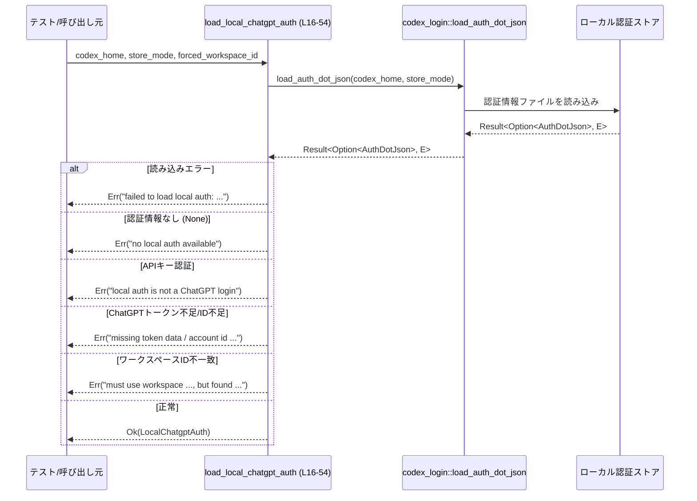
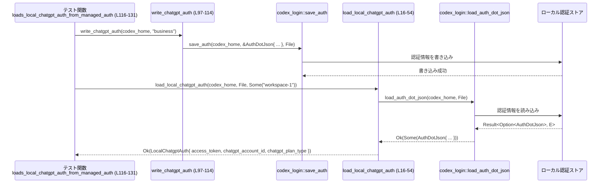

tui/src/local_chatgpt_auth.rs の解説レポート
================================================

## 0. ざっくり一言

Codex のローカル認証ストアから **ChatGPT ログイン由来のトークン情報だけ** を抽出し、  
ワークスペース ID やプラン種別を検証したうえで `LocalChatgptAuth` として返す、テスト専用ヘルパーです  
（ファイル全体が `#![cfg(test)]` のため、テストビルドでのみ有効です: `local_chatgpt_auth.rs:L1`）。

---

## 1. このモジュールの役割

### 1.1 概要

- このモジュールは、Codex のローカル認証情報のうち **ChatGPT アカウントでログインした認証情報** を読み出し、テストコードから扱いやすい形に変換するために存在します。
- 具体的には、`auth.json` 等から読み込んだ `AuthDotJson` から
  - アクセストークン
  - ChatGPT ワークスペース（アカウント）ID
  - ChatGPT プラン種別（文字列）
  を取り出し、`LocalChatgptAuth` として返します（`local_chatgpt_auth.rs:L9-14, L16-54`）。
- API キー認証やトークン欠如・ID 不一致など、条件を満たさない場合には `Result<_, String>` の `Err` として分かりやすいメッセージを返します（`L21-23, L24-25, L28-30, L32-35, L36-41`）。

### 1.2 アーキテクチャ内での位置づけ

このファイルはテスト専用のユーティリティであり、外部クレート `codex_login` が提供する認証ストア読み書き関数に依存しています。

```mermaid
graph LR
    A[local_chatgpt_auth.rs<br/>(L1-212)] --> B[codex_login::load_auth_dot_json<br/>(外部crate)]
    A --> C[codex_config::types::AuthCredentialsStoreMode<br/>(外部crate)]
    A --> D[codex_app_server_protocol::AuthMode<br/>(外部crate)]
    A --> E[codex_login::save_auth<br/>(tests, L112-113)]
    A --> F[codex_login::auth::login_with_chatgpt_auth_tokens<br/>(tests, L176-182)]
    A --> G[tempfile::TempDir<br/>(tests, L70)]
```

- `load_local_chatgpt_auth` は `codex_login::load_auth_dot_json` をラップし、ChatGPT 用の認証かどうかの判定と整形を担当します（`L16-54`）。
- テストコードは `save_auth` や `login_with_chatgpt_auth_tokens` で事前に認証情報を保存し、本関数の挙動を検証しています（`L97-114, L150-160, L176-182`）。

外部クレート側の具体的な実装はこのチャンクには現れないため、詳細な挙動は不明です。

### 1.3 設計上のポイント

- **テスト専用モジュール**
  - ファイル先頭に `#![cfg(test)]` が付いており、このモジュール自体がテストビルド時にのみコンパイルされます（`L1`）。
- **シンプルなデータ構造**
  - `LocalChatgptAuth` は必要最小限の 3 フィールド（アクセストークン・アカウント ID・プラン種別）だけを持ちます（`L9-13`）。
- **明示的なエラーハンドリング**
  - 戻り値は `Result<LocalChatgptAuth, String>` で、エラー理由ごとに異なる文字列メッセージを返しています（`L21-23, L24-25, L28-30, L32-35, L36-41`）。
- **状態を持たない純粋関数**
  - グローバル状態や内部キャッシュを持たず、入力（パス・ストアモード・期待ワークスペース ID）に対して毎回同じ結果を返します。
- **並行性**
  - このモジュール内のコードは可変な共有状態を保持しておらず、`&Path` など不変参照のみを受け取っているため、関数自体はスレッド安全性に関する特別な配慮を必要としない構造になっています（`L16-20`）。
  - ただし、実際にマルチスレッドから呼び出せるかどうかは、外部関数 `load_auth_dot_json` やファイルシステムアクセスの実装に依存し、このチャンクからは不明です。

---

## 2. 主要な機能一覧

### 2.1 機能の箇条書き

- ChatGPT ローカル認証の読み込み: `load_local_chatgpt_auth` でローカル認証ストアから ChatGPT ログイン情報を読み出し、`LocalChatgptAuth` に変換する（`L16-54`）。
- ChatGPT トークンプラン種別の取得と正規化: `get_chatgpt_plan_type_raw()` から取得したプラン名を ASCII 小文字化して保持する（`L44-47`）。
- テスト用 JWT 生成: `fake_jwt` でヘッダ `"alg": "none"` の簡易 JWT を生成し、テスト用のトークンとして利用する（`L72-95`）。
- テスト用ローカル認証ファイル生成: `write_chatgpt_auth` で管理対象の ChatGPT 認証情報をローカルストアに保存する（`L97-114`）。
- 動作検証テスト:
  - 正常系（管理 auth からの読み込み）検証（`L116-131`）
  - 認証情報が存在しない場合のエラー検証（`L133-145`）
  - API キー認証の拒否検証（`L147-170`）
  - 管理 auth を外部エフェメラルトークンより優先することの検証（`L172-193`）
  - usage-based プラン名の文字列が変化しないことの検証（`L195-210`）

### 2.2 コンポーネントインベントリー（構造体・関数一覧）

| 種別 | 名前 | 可視性 | 役割概要 | 定義位置 |
|------|------|--------|----------|----------|
| struct | `LocalChatgptAuth` | `pub(crate)` | ChatGPT ローカル認証情報（アクセストークン・アカウント ID・プラン種別）の簡略ビュー | `local_chatgpt_auth.rs:L9-14` |
| fn | `load_local_chatgpt_auth` | `pub(crate)` | ローカル認証ストアから ChatGPT ログイン情報を取得・検証し、`LocalChatgptAuth` として返す | `local_chatgpt_auth.rs:L16-54` |
| fn | `fake_jwt` | private（tests） | テスト用の簡易 JWT 文字列を作成するヘルパー | `local_chatgpt_auth.rs:L72-95` |
| struct | `Header` | private（`fake_jwt` 内ローカル） | `fake_jwt` の JWT ヘッダ用構造体 | `local_chatgpt_auth.rs:L73-77` |
| fn | `write_chatgpt_auth` | private（tests） | ChatGPT 認証情報を `AuthDotJson` として保存するテストヘルパー | `local_chatgpt_auth.rs:L97-114` |
| test fn | `loads_local_chatgpt_auth_from_managed_auth` | `#[test]` | 管理された ChatGPT 認証が正しく読み込まれることを検証 | `local_chatgpt_auth.rs:L116-131` |
| test fn | `rejects_missing_local_auth` | `#[test]` | 認証情報が存在しない場合にエラーを返すことを検証 | `local_chatgpt_auth.rs:L133-145` |
| test fn | `rejects_api_key_auth` | `#[test]` | API キー認証の場合に拒否されることを検証 | `local_chatgpt_auth.rs:L147-170` |
| test fn | `prefers_managed_auth_over_external_ephemeral_tokens` | `#[test]` | 管理 auth が外部エフェメラルトークンより優先されることを検証 | `local_chatgpt_auth.rs:L172-193` |
| test fn | `preserves_usage_based_plan_type_wire_name` | `#[test]` | usage-based プラン名が小文字化によって崩れないことを検証 | `local_chatgpt_auth.rs:L195-210` |

---

## 3. 公開 API と詳細解説

### 3.1 型一覧（構造体・列挙体など）

| 名前 | 種別 | 可視性 | 役割 / 用途 | フィールド概要 | 定義位置 |
|------|------|--------|-------------|----------------|----------|
| `LocalChatgptAuth` | 構造体 | `pub(crate)` | ローカルに保存された ChatGPT 認証情報の要約 | `access_token: String` – ChatGPT アクセストークン（`L11`）<br>`chatgpt_account_id: String` – ワークスペース/アカウント ID（`L12`）<br>`chatgpt_plan_type: Option<String>` – プラン種別（小文字化された文字列、存在しない場合は `None`、`L13`） | `local_chatgpt_auth.rs:L9-14` |

テスト用のローカル構造体 `Header`（`fake_jwt` 内）は JWT ヘッダ専用であり、本モジュール外からは利用できません（`L73-77`）。

---

### 3.2 関数詳細（コア関数）

#### `load_local_chatgpt_auth(codex_home: &Path, auth_credentials_store_mode: AuthCredentialsStoreMode, forced_chatgpt_workspace_id: Option<&str>) -> Result<LocalChatgptAuth, String>`

**概要**

- Codex のローカル認証ストア（`codex_home` 配下）から認証情報を読み込み、  
  それが **ChatGPT ログイン由来** であることを確認したうえで `LocalChatgptAuth` に変換して返します（`local_chatgpt_auth.rs:L16-54`）。
- 認証情報が存在しない・API キー認証である・ChatGPT トークン情報が欠けている・期待ワークスペース ID と異なる場合などには、`Err(String)` で詳細なメッセージを返します（`L21-23, L24-25, L28-30, L32-35, L36-41`）。

**引数**

| 引数名 | 型 | 説明 |
|--------|----|------|
| `codex_home` | `&Path` | 認証情報が保存されている Codex のホームディレクトリを指すパス（`L17`）。具体的なファイル名やレイアウトは `load_auth_dot_json` の実装に依存し、このチャンクからは不明です。 |
| `auth_credentials_store_mode` | `AuthCredentialsStoreMode` | 認証情報の保存モード（例としてテストでは `File` が使用されています: `L112-113, L123, L139, L158, L185, L202`）。どのようなモードが存在するかの詳細は外部クレート側にあり、このチャンクには現れません。 |
| `forced_chatgpt_workspace_id` | `Option<&str>` | 期待する ChatGPT ワークスペース ID。`Some(id)` の場合、実際の `chatgpt_account_id` がこの ID と一致することを検証します（`L36-41`）。`None` の場合は一致検証を行いません。 |

**戻り値**

- `Ok(LocalChatgptAuth)`:
  - ローカルに保存された認証情報が ChatGPT ログイン由来であり、
  - トークン・アカウント ID が存在し、（かつ `forced_chatgpt_workspace_id` が設定されていればそれと一致し）
  - プラン種別文字列を取得して小文字化できた場合  
  に返されます（`L31-53`）。
- `Err(String)`:
  - 何らかの理由で ChatGPT 認証情報として扱えない場合に、理由を示す文字列とともに返されます（詳細は「Errors」参照）。

**内部処理の流れ（アルゴリズム）**

コードの主要ステップは次の通りです（`local_chatgpt_auth.rs:L21-53`）:

1. **認証情報の読み込み**
   - `load_auth_dot_json(codex_home, auth_credentials_store_mode)` を呼び出します（`L21`）。
   - 読み込み中のエラーは `map_err` で `"failed to load local auth: {err}"` に変換され、`Err(String)` として返されます（`L21-22`）。
   - 成功時に `None`（認証が存在しない）だった場合は `"no local auth available"` を返します（`L23`）。

2. **API キー認証の拒否**
   - `auth.auth_mode` が `Some(AuthMode::ApiKey)`、または `auth.openai_api_key.is_some()` のいずれかが真なら（`L24`）、
     `"local auth is not a ChatGPT login"` として即座に `Err` を返します（`L24-25`）。
   - これにより「ChatGPT ログイン」ではなく「API キー認証」であるケースを除外します。

3. **トークン情報の存在チェック**
   - `auth.tokens` が `None` の場合は `"local ChatGPT auth is missing token data"` で `Err` を返します（`L28-30`）。
   - そうでなければ `tokens` を取り出して以降の処理に用います（`L28-31`）。

4. **アクセストークンとアカウント ID の取得**
   - `access_token` は単純に `tokens.access_token` をムーブして取得します（`L31`）。
   - `chatgpt_account_id` は
     - まず `tokens.account_id` を優先し（`L32-33`）、
     - それが `None` の場合は `tokens.id_token.chatgpt_account_id.clone()` を fallback として利用し（`L34`）、
     - 両方とも `None` の場合は `"local ChatGPT auth is missing chatgpt account id"` エラーとします（`L32-35`）。

5. **期待ワークスペース ID との一致確認**
   - `forced_chatgpt_workspace_id` が `Some(expected_workspace)` の場合に限り（`L36`）、
     取得した `chatgpt_account_id` と `expected_workspace` が等しいかをチェックします（`L36-37`）。
   - 異なる場合は `"local ChatGPT auth must use workspace {expected_workspace}, but found {chatgpt_account_id:?}"` という詳細なエラーを返します（`L39-41`）。

6. **プラン種別の取得と正規化**
   - `tokens.id_token.get_chatgpt_plan_type_raw()` でプラン種別の「生の文字列」を `Option<&str>` などから取得し（`L44-46`）、  
     これに `to_ascii_lowercase()` をかけて小文字の `String` に変換した `Option<String>` を得ます（`L47`）。
   - 取得できなかった場合は `chatgpt_plan_type` は `None` になります。

7. **結果の構築**
   - 最後に `LocalChatgptAuth { access_token, chatgpt_account_id, chatgpt_plan_type }` を組み立てて `Ok(...)` で返します（`L49-53`）。

**処理フロー図（読み込み〜返却）**



**Examples（使用例）**

以下は、テストコードと同様に `TempDir` を使って一時的な Codex ホームディレクトリを用意し、  
ファイルベースの認証情報から ChatGPT 認証を読み出す例です（実際にはテスト用のヘルパー `write_chatgpt_auth` を利用しています）。

```rust
use std::path::Path;                                        // Path 型を使用するためにインポート
use codex_config::types::AuthCredentialsStoreMode;          // ストアモードの列挙体
use tempfile::TempDir;                                      // 一時ディレクトリを作るためのクレート

// 同じファイル(local_chatgpt_auth.rs)内の関数/型を利用する
use crate::local_chatgpt_auth::{load_local_chatgpt_auth, LocalChatgptAuth};

// テストなどでの典型的な利用例
fn example_use() -> Result<(), String> {
    let codex_home = TempDir::new()                         // 一時ディレクトリを作成
        .expect("tempdir");                                 // テストなので expect で簡略化

    // ここで本来は save_auth などを使って ChatGPT 認証を codex_home に保存しておく
    // （この詳細は別crate `codex_login` の実装に依存し、このモジュールには現れません）

    // ChatGPT 認証を読み出し、ワークスペース ID を検証する
    let auth: LocalChatgptAuth = load_local_chatgpt_auth(
        codex_home.path(),                                  // 認証ファイルが置かれたディレクトリ
        AuthCredentialsStoreMode::File,                     // ファイルベースのストアを指定
        Some("workspace-1"),                                // 期待するワークスペース ID
    )?;                                                     // Result を ? で伝播、Err(String) なら呼び出し元に返る

    // 読み出した情報を利用する
    println!("access_token: {}", auth.access_token);        // アクセストークン
    println!("account_id: {}", auth.chatgpt_account_id);    // ワークスペース ID
    println!("plan_type: {:?}", auth.chatgpt_plan_type);    // プラン種別（Option）

    Ok(())
}
```

**Errors / Panics**

この関数自体は `unwrap` や `expect` を使用しておらず、  
`load_auth_dot_json` の戻り値も `Result` として扱っているため、  
本モジュール内のコードだけを見る限り、**この関数から直接 panic が発生する経路はありません**（`L21-53`）。

`Err(String)` になる条件とメッセージは以下の通りです:

| 条件 | エラーメッセージ | 根拠 |
|------|------------------|------|
| `load_auth_dot_json` がエラーを返した場合 | `"failed to load local auth: {err}"` | `local_chatgpt_auth.rs:L21-22` |
| 認証情報が存在しない場合（`Option::None`） | `"no local auth available"` | `local_chatgpt_auth.rs:L23` |
| 認証モードが API キー、または `openai_api_key` が Some の場合 | `"local auth is not a ChatGPT login"` | `local_chatgpt_auth.rs:L24-25` |
| `auth.tokens` が `None` の場合 | `"local ChatGPT auth is missing token data"` | `local_chatgpt_auth.rs:L28-30` |
| `tokens.account_id` も `tokens.id_token.chatgpt_account_id` も `None` の場合 | `"local ChatGPT auth is missing chatgpt account id"` | `local_chatgpt_auth.rs:L32-35` |
| `forced_chatgpt_workspace_id = Some(expected)` かつ `chatgpt_account_id != expected` の場合 | `"local ChatGPT auth must use workspace {expected_workspace}, but found {chatgpt_account_id:?}"` | `local_chatgpt_auth.rs:L36-41` |

なお、`load_auth_dot_json` 自体がどのような条件でエラーを返すかは外部クレートの実装に依存し、このチャンクからは不明です。

**Edge cases（エッジケース）**

- **ローカル認証がまだ保存されていない（ファイル未作成など）**
  - `load_auth_dot_json` が `Ok(None)` を返した場合、本関数は `"no local auth available"` の `Err` になります（`L21-23`）。
- **API キー認証しか存在しない**
  - `auth.auth_mode = Some(AuthMode::ApiKey)` または `openai_api_key.is_some()` の場合、  
    ChatGPT ログインではないとみなして `"local auth is not a ChatGPT login"` を返します（`L24-25`）。
- **トークン情報が欠落している**
  - `auth.tokens` が `None` の場合は `"local ChatGPT auth is missing token data"`（`L28-30`）。
- **アカウント ID が欠落している**
  - `tokens.account_id` も `tokens.id_token.chatgpt_account_id` も無い場合、  
    `"local ChatGPT auth is missing chatgpt account id"` となります（`L32-35`）。
- **期待ワークスペース ID 不一致**
  - `forced_chatgpt_workspace_id = Some("workspace-1")` のように指定しているにもかかわらず、  
    実際の `chatgpt_account_id` が `"workspace-2"` など異なる値だった場合、  
    `"must use workspace workspace-1, but found \"workspace-2\""` といった形のエラーを返します（`L36-41`）。
- **プラン種別が存在しない**
  - `tokens.id_token.get_chatgpt_plan_type_raw()` が `None` を返した場合、  
    `chatgpt_plan_type` フィールドは `None` となり、エラーにはなりません（`L44-47`）。
- **プラン名の大文字・小文字混在**
  - 取得したプラン種別は `to_ascii_lowercase()` によって小文字化されるため（`L44-47`）、  
    `"Business"` などの表記揺れは `"business"` に正規化されます。
  - usage-based プラン名 `"self_serve_business_usage_based"` は元々小文字のため、そのまま保持されることがテストで確認されています（`L195-210`）。

**使用上の注意点**

- **テスト専用であること**
  - ファイル全体に `#![cfg(test)]` が付いているため、本関数はテストビルド時にのみコンパイルされます（`L1`）。
  - 本番コードから利用することは想定されていません。
- **`codex_home` と `auth_credentials_store_mode` の組み合わせ**
  - 認証情報は `load_auth_dot_json` の実装に従って保存・読み出されるため、  
    `save_auth` などで保存するときと同じ `AuthCredentialsStoreMode` を指定する必要があります（テストでは常に `File` を利用: `L112-113, L123, L139, L158, L185, L202`）。
- **ワークスペース ID の強制**
  - CI テストなどで「必ず特定のワークスペース ID であること」を保証したい場合は `forced_chatgpt_workspace_id` に `Some(id)` を渡す必要があります（`L36-41`）。
  - 逆に、任意のワークスペースを許容する場合は `None` を渡します（`L139-141, L165-166`）。
- **エラーメッセージ依存**
  - テストコードではエラーメッセージ文字列を `assert_eq!` で比較しています（`L144, L169`）。  
    そのため、メッセージを変更するとテストが失敗する点に注意が必要です。

---

### 3.3 その他の関数

補助関数・テスト関数の一覧です。

| 関数名 | 種別 | 役割（1 行） | 定義位置 |
|--------|------|--------------|----------|
| `fake_jwt(email: &str, account_id: &str, plan_type: &str) -> String` | テストヘルパー | `"alg": "none"` の簡易 JWT 文字列を生成し、テスト用トークンとして利用する | `local_chatgpt_auth.rs:L72-95` |
| `write_chatgpt_auth(codex_home: &Path, plan_type: &str)` | テストヘルパー | ChatGPT 認証 (`AuthDotJson`) をローカルストア（`AuthCredentialsStoreMode::File`）に保存する | `local_chatgpt_auth.rs:L97-114` |
| `loads_local_chatgpt_auth_from_managed_auth()` | `#[test]` | 管理された ChatGPT 認証から正常に `LocalChatgptAuth` が読み込まれることを検証する | `local_chatgpt_auth.rs:L116-131` |
| `rejects_missing_local_auth()` | `#[test]` | 認証情報が存在しない場合に `"no local auth available"` エラーとなることを検証する | `local_chatgpt_auth.rs:L133-145` |
| `rejects_api_key_auth()` | `#[test]` | API キー認証のみ存在する場合に `"local auth is not a ChatGPT login"` エラーとなることを検証する | `local_chatgpt_auth.rs:L147-170` |
| `prefers_managed_auth_over_external_ephemeral_tokens()` | `#[test]` | 管理 auth が外部エフェメラルトークンより優先されることを検証する | `local_chatgpt_auth.rs:L172-193` |
| `preserves_usage_based_plan_type_wire_name()` | `#[test]` | usage-based プラン名文字列が小文字化により変化しないことを検証する | `local_chatgpt_auth.rs:L195-210` |

---

## 4. データフロー

### 4.1 代表的な処理シナリオ

「管理された ChatGPT 認証から `LocalChatgptAuth` を読み込む」ケース（`loads_local_chatgpt_auth_from_managed_auth`）を例に、  
データがどのように流れるかを示します（`local_chatgpt_auth.rs:L116-131`）。

1. テストで `TempDir` を使って一時ディレクトリを作る（`L118`）。
2. `write_chatgpt_auth` により、そのディレクトリ配下に ChatGPT 認証情報を保存する（`L119, L97-114`）。
3. `load_local_chatgpt_auth` を呼び出し、ファイルから認証情報を読み出す（`L121-126`）。
4. 関数内部で API キーでないこと、トークン・アカウント ID の存在、ワークスペース ID の一致などを検証し、  
   `LocalChatgptAuth` を作成して返す（`L21-53`）。
5. テストコード側で `chatgpt_account_id` や `chatgpt_plan_type`、`access_token` を検証する（`L128-130`）。

### 4.2 シーケンス図



この図は、ファイルベースの認証ストアを経由して `LocalChatgptAuth` が構築される流れを表しています。

---

## 5. 使い方（How to Use）

### 5.1 基本的な使用方法

このモジュールはテスト専用であり、典型的な使い方は「テスト前に認証情報を書き込み、その後 `load_local_chatgpt_auth` で読み出して検証する」という流れです。

```rust
use std::path::Path;
use codex_config::types::AuthCredentialsStoreMode;
use tempfile::TempDir;

use crate::local_chatgpt_auth::{load_local_chatgpt_auth, LocalChatgptAuth};

// （必要に応じて）テスト用に認証情報を書き込むヘルパー
fn setup_chatgpt_auth(codex_home: &Path) {
    // 実際のコードでは codex_login::save_auth などを使って
    // ChatGPT 認証情報を codex_home 配下に保存する
}

#[test]
fn example_test() {
    let codex_home = TempDir::new().expect("tempdir");         // 一時ディレクトリを用意
    setup_chatgpt_auth(codex_home.path());                     // 事前に ChatGPT 認証を書き込む

    let auth: LocalChatgptAuth = load_local_chatgpt_auth(
        codex_home.path(),                                     // 認証ストアのルートディレクトリ
        AuthCredentialsStoreMode::File,                        // 保存に使用したモード（ここでは File）
        Some("workspace-1"),                                   // 期待するワークスペース ID
    )
    .expect("chatgpt auth should load");                       // テストなので expect で失敗を検知

    assert_eq!(auth.chatgpt_account_id, "workspace-1");        // ID を検証
    assert!(auth.chatgpt_plan_type.is_some());                 // プラン種別が存在することを検証
    assert!(!auth.access_token.is_empty());                    // アクセストークンが空でないことを検証
}
```

### 5.2 よくある使用パターン

1. **ワークスペース ID を強制するテスト**

   - CI や統合テストで「必ず特定ワークスペースでログインしていること」を保証する場合、
     `forced_chatgpt_workspace_id` に `Some("workspace-1")` のように具体的な ID を渡します（`L121-125, L184-188, L200-204`）。

2. **ワークスペース ID を問わないテスト**

   - 認証情報が存在することだけを確認したい場合は、`forced_chatgpt_workspace_id` に `None` を渡します（`L139-141, L165-166`）。

3. **API キー認証を明示的に拒否する検証**

   - `AuthDotJson` に `auth_mode: Some(AuthMode::ApiKey)` と `openai_api_key` を設定し、  
     `load_local_chatgpt_auth` が `"local auth is not a ChatGPT login"` を返すことを確認するテストが用意されています（`L147-170`）。

### 5.3 よくある間違い

```rust
use codex_config::types::AuthCredentialsStoreMode;
use tempfile::TempDir;
use crate::local_chatgpt_auth::load_local_chatgpt_auth;

// 間違い例: 保存時と異なるストアモードを指定している可能性
#[test]
fn wrong_store_mode_example() {
    let codex_home = TempDir::new().expect("tempdir");

    // （仮）ここで AuthCredentialsStoreMode::File 以外のモードで保存したとする
    // save_auth(codex_home.path(), &auth, AuthCredentialsStoreMode::Keychain);

    let result = load_local_chatgpt_auth(
        codex_home.path(),
        AuthCredentialsStoreMode::File,                         // 保存時と異なるモードを指定
        None,
    );

    // 認証情報が見つからず "no local auth available" となる可能性がある
    assert!(result.is_err());
}

// 正しい例: 保存時と同じストアモードを指定する
#[test]
fn correct_store_mode_example() {
    let codex_home = TempDir::new().expect("tempdir");

    // save_auth(codex_home.path(), &auth, AuthCredentialsStoreMode::File); // File で保存したと仮定

    let result = load_local_chatgpt_auth(
        codex_home.path(),
        AuthCredentialsStoreMode::File,                         // 保存時と同じモード
        None,
    );

    // 認証情報があれば Ok(...) になる
    // （実際には auth を書き込んでから呼び出す必要があります）
    let _ = result.is_ok();
}
```

- また、API キー認証しか用意していない状態で本関数を呼び出すと `"local auth is not a ChatGPT login"` のエラーになることもテストによって確認されています（`L147-170`）。

### 5.4 使用上の注意点（まとめ）

- 本モジュールは **テスト専用** (`#![cfg(test)]`) であり、本番コードからの利用は想定されていません（`L1`）。
- 認証の保存時と同じ `AuthCredentialsStoreMode` を指定しないと、認証情報が見つからない可能性があります（`L112-113, L158-159`）。
- `forced_chatgpt_workspace_id` を指定した場合はワークスペース ID の不一致でエラーになるため、  
  テスト側で期待値を正しく把握しておく必要があります（`L36-41, L121-125, L184-188`）。
- このモジュール内では秘密情報（アクセストークンなど）をログ出力していませんが、  
  エラーメッセージに `load_auth_dot_json` のエラー内容を含めて返すため（`L21-22`）、  
  上位コードでそれをログに出す場合はログの扱いに注意が必要です。

---

## 6. 変更の仕方（How to Modify）

### 6.1 新しい機能を追加する場合

1. **`LocalChatgptAuth` にフィールドを追加したい場合**
   - 例: ChatGPT ユーザのメールアドレスを保持したい場合。
   - 手順:
     1. `LocalChatgptAuth` に新しいフィールドを追加する（`local_chatgpt_auth.rs:L9-13`）。
     2. `load_local_chatgpt_auth` 内で `auth.tokens` または `tokens.id_token` から対応する情報を取得し、構造体の初期化式に追加する（`L31-53`）。
     3. 関連するテストで新フィールドの値を検証するアサーションを追加する（`L116-131` 等）。

2. **追加の検証ロジックを入れたい場合**
   - 例: トークンの有効期限チェックなど。
   - 手順:
     1. `load_local_chatgpt_auth` 内で、既存のチェック（API キー判定・トークン存在確認・ワークスペース一致確認）に続けて検証ロジックを追加する（`L24-41` の近辺）。
     2. 条件を満たさない場合のエラーメッセージを定義し、`Err(String)` として返す。
     3. そのケースを再現するテストを新規に追加する。

### 6.2 既存の機能を変更する場合

- **エラー文言を変更する場合**
  - 影響:
    - テストコードが `assert_eq!` で文字列一致を検証しているため（`L144, L169`）、エラー文言を変更すると該当テストも更新が必要です。
- **プラン種別の正規化方法を変える場合**
  - 現在は `to_ascii_lowercase()` によって単純に ASCII 小文字化しています（`L44-47`）。
  - 変換ルールを変えた場合、「`preserves_usage_based_plan_type_wire_name`」テスト（`L195-210`）の期待値も更新する必要があります。
- **ワークスペース ID の取得ロジックを変更する場合**
  - 現在は `tokens.account_id` を優先し、`None` の場合に `tokens.id_token.chatgpt_account_id.clone()` を利用しています（`L32-35`）。
  - 取得順位を変更すると、`prefers_managed_auth_over_external_ephemeral_tokens` などのテストが意図と一致しなくなる可能性があるため、  
    テストの仕様と合わせて見直す必要があります（`L172-193`）。

---

## 7. 関連ファイル

このモジュールは他クレートの型・関数に依存しています。実際のファイルパスはこのチャンクには現れないため不明ですが、モジュールパスとして関係を示します。

| パス / モジュール | 役割 / 関係 |
|-------------------|------------|
| `codex_login::load_auth_dot_json` | ローカル認証ストアから `AuthDotJson` を読み込む関数。`load_local_chatgpt_auth` がコア処理の入口として利用しています（`local_chatgpt_auth.rs:L21`）。具体的な読み込み方法やファイルレイアウトはこのチャンクからは不明です。 |
| `codex_config::types::AuthCredentialsStoreMode` | 認証情報の保存モードを表す型。テストでは `AuthCredentialsStoreMode::File` が使用されています（`local_chatgpt_auth.rs:L112-113, L123, L139, L158, L185, L202`）。 |
| `codex_app_server_protocol::AuthMode` | 認証モード（API キー vs ChatGPT など）を表す列挙体。API キー認証を判別するために利用しています（`local_chatgpt_auth.rs:L5, L24, L101, L153`）。 |
| `codex_login::AuthDotJson` | ローカルに保存される認証情報の構造体。`write_chatgpt_auth` および `rejects_api_key_auth` テストで生成・保存しています（`local_chatgpt_auth.rs:L63, L100-111, L152-157`）。 |
| `codex_login::save_auth` | `AuthDotJson` をローカルストアに保存する関数。テストで認証情報の事前準備に使われます（`local_chatgpt_auth.rs:L65, L112-113, L150-160`）。 |
| `codex_login::auth::login_with_chatgpt_auth_tokens` | 「外部エフェメラルトークン」を保存するために使用されていると推測される関数。`prefers_managed_auth_over_external_ephemeral_tokens` テストで利用されます（`local_chatgpt_auth.rs:L64, L176-182`）。具体的な保存先や優先順位はこのチャンクからは不明です。 |
| `codex_login::token_data::TokenData` | トークンデータを保持する構造体。`write_chatgpt_auth` で `AuthDotJson.tokens` を構築する際に利用します（`local_chatgpt_auth.rs:L66, L103-109`）。 |
| `codex_login::token_data::parse_chatgpt_jwt_claims` | ChatGPT 用 JWT からクレーム（`chatgpt_account_id` や `chatgpt_plan_type`）をパースする関数。テストで ID トークンを構築する際に使われています（`local_chatgpt_auth.rs:L104-105`）。 |

---

## Bugs / Security / Tests / パフォーマンスに関する補足（まとめ）

- **Bugs（バグの可能性）**
  - このモジュール内のコードにおいて、明確な論理バグは見当たりません。  
    すべての `Option` / `Result` はパターンごとに明示的に扱われています（`L21-23, L28-30, L32-35, L44-47`）。
  - `Option::or(...)` を使っているため、`tokens.id_token.chatgpt_account_id.clone()` は `tokens.account_id` が `Some` の場合でも常に一度クローンされます（`L32-35`）。  
    これはパフォーマンス上の小さなコストにはなり得ますが、テスト用ユーティリティであることを踏まえると実害は小さいと考えられます。

- **Security（セキュリティ）**
  - 本ファイルはテスト専用であり、本番バイナリには含まれません（`L1`）。
  - `fake_jwt` は `"alg": "none"` の JWT を生成し、署名検証も行っていませんが（`L72-95`）、これはテスト専用のヘルパーであるため、直接的なセキュリティリスクにはなりません。
  - アクセストークンやアカウント ID をログ出力したり外部に送信したりする処理は含まれていません。

- **Tests（テストカバレッジ）**
  - 正常系（管理 auth の読み込み）: `loads_local_chatgpt_auth_from_managed_auth`（`L116-131`）。
  - 認証情報無し: `rejects_missing_local_auth`（`L133-145`）。
  - API キー認証のみ: `rejects_api_key_auth`（`L147-170`）。
  - 管理 auth vs 外部エフェメラルトークン: `prefers_managed_auth_over_external_ephemeral_tokens`（`L172-193`）。
  - usage-based プラン名の保持: `preserves_usage_based_plan_type_wire_name`（`L195-210`）。
  - 上記により、このモジュールが持つ主要な分岐はほぼすべてテストされていると考えられます。

- **Performance / Scalability（参考情報）**
  - ファイル IO と JSON パース（`load_auth_dot_json` と `save_auth`）に依存しており、呼び出し頻度が高いとそれなりのコストがありますが、このモジュールはテスト専用であるため、大規模スケールでの性能問題は主な関心事ではないと考えられます。
  - 並列実行については、このモジュール自体は共有可変状態を持っていませんが、同じ `codex_home` ディレクトリを複数スレッドから同時に操作した場合の挙動は `codex_login` 側の実装に依存し、このチャンクからは不明です。
