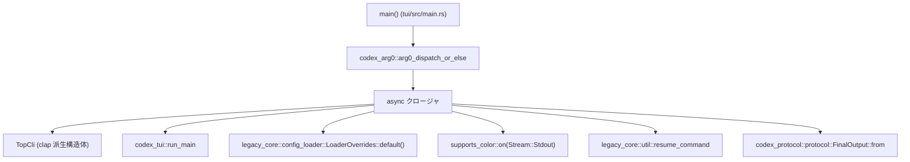
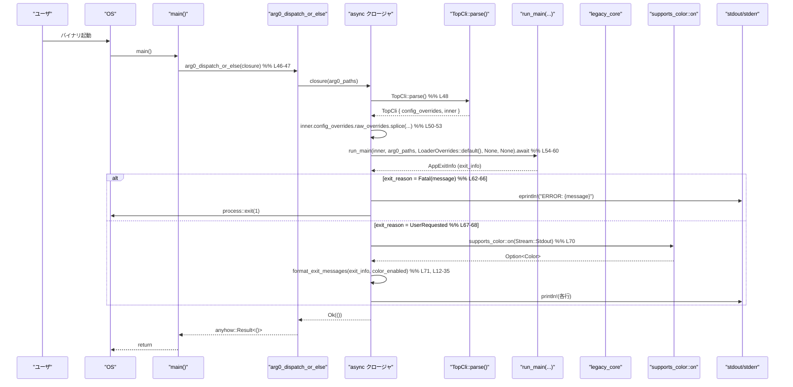

# tui/src/main.rs コード解説

## 0. ざっくり一言

- TUI アプリケーションの **エントリポイント**として、CLI 引数をパースし、`codex_tui::run_main` に処理を委譲するモジュールです。
- 実行後に得られる `AppExitInfo` から **トークン使用量の出力**と、必要に応じて **セッション再開用コマンドの案内**を整形して表示します。

---

## 1. このモジュールの役割

### 1.1 概要

- このモジュールは、TUI アプリケーションのプロセス起動時に最初に実行される **`main` 関数**を提供し、全体の起動・終了フローを制御します（`tui/src/main.rs:L46-75`）。
- `clap` による CLI 引数パース（`TopCli`）と、構成ファイルの上書き設定（`CliConfigOverrides`）を統合し、`codex_tui::run_main` へ渡します（`tui/src/main.rs:L37-44, L48-55`）。
- 実行結果として得られる `AppExitInfo` を元に、エラー終了時の扱い（即座に `process::exit(1)`）と、正常終了時のトークン使用量・再開コマンドのメッセージ出力を行います（`tui/src/main.rs:L62-72`）。

### 1.2 アーキテクチャ内での位置づけ

このファイルは「CLI バイナリの入口」として、複数の外部クレートに依存しつつ、最小限のオーケストレーションを行う位置づけです。

- CLI → `TopCli`（`clap` 派生）
- 起動ラッパ → `codex_arg0::arg0_dispatch_or_else`
- メイン処理 → `codex_tui::run_main`
- セッション再開補助 → `codex_app_server_client::legacy_core::util::resume_command`
- 表示色判定 → `supports_color::on`
- トークン使用量 → `codex_protocol::protocol::FinalOutput`



> `arg0_dispatch_or_else` や `run_main` の内部実装は、このチャンクには現れません。上記は呼び出し関係のみを示した図です。

### 1.3 設計上のポイント

- **最小限の責務**  
  - このファイルは「CLI パース + 実行 + 終了処理」に限定されており、ビジネスロジックは `codex_tui::run_main` 側に委譲されています（`tui/src/main.rs:L54-60`）。
- **状態をほぼ持たない**  
  - 定義されている状態は `TopCli` 構造体のみで、プロセス内で長く保持されるグローバル状態はありません（`tui/src/main.rs:L37-44`）。
- **エラーハンドリング方針**
  - `run_main(...).await?` により、メイン処理からのエラーは `anyhow::Result<()>` として上位へ伝播します（`tui/src/main.rs:L54-61`）。
  - `ExitReason::Fatal` の場合はメッセージを標準エラーに出力し、`std::process::exit(1)` で即時終了します（`tui/src/main.rs:L62-66`）。
- **非同期実行環境**
  - `arg0_dispatch_or_else` に非同期クロージャを渡す形で `run_main` を `await` しており、この関数側が非同期ランタイムを用意していると考えられますが、このチャンクには実装がないため詳細は不明です（`tui/src/main.rs:L46-47`）。
- **カラー対応の有無**
  - `supports_color::on(Stream::Stdout)` により、標準出力がカラー対応かどうかを判定し、再開コマンドの表示に ANSI カラーエスケープを付与するかを切り替えます（`tui/src/main.rs:L70-71, L26-31`）。

---

## 2. 主要な機能一覧

- CLI 引数のパースと統合（`TopCli` + `clap::Parser`）（`tui/src/main.rs:L37-44, L48`）
- 設定オーバーライド (`CliConfigOverrides`) の前置きマージ（`tui/src/main.rs:L50-53`）
- TUI メイン処理の実行 (`codex_tui::run_main`) と非同期エラー伝播（`tui/src/main.rs:L54-61`）
- 終了理由 (`ExitReason`) に応じたプロセス終了コード制御（`tui/src/main.rs:L62-68`）
- `AppExitInfo` からのトークン使用量出力とセッション再開用コマンド案内の整形（`tui/src/main.rs:L12-35, L70-72`）

### コンポーネントインベントリー（関数・構造体）

| 名前                    | 種別     | 役割 / 用途                                             | ソース位置                        |
|-------------------------|----------|----------------------------------------------------------|-----------------------------------|
| `TopCli`               | 構造体   | CLI 全体の引数（設定上書き + 内部 CLI）を束ねる         | `tui/src/main.rs:L37-44`         |
| `format_exit_messages` | 関数     | `AppExitInfo` からトークン使用量と再開コマンド文を生成 | `tui/src/main.rs:L12-35`         |
| `main`                 | 関数     | プロセスのエントリポイント。CLI パース〜実行〜終了処理 | `tui/src/main.rs:L46-75`         |

---

## 3. 公開 API と詳細解説

このファイル自体はバイナリクレートの `main.rs` であり、外部クレートから再利用される「公開 API」はありませんが、エントリポイントとして重要な 2 関数と 1 構造体が定義されています。

### 3.1 型一覧（構造体・列挙体など）

| 名前      | 種別   | 役割 / 用途                                                                                           | ソース位置                |
|-----------|--------|--------------------------------------------------------------------------------------------------------|---------------------------|
| `TopCli` | 構造体 | `clap` による CLI 引数定義のトップレベル。設定オーバーライドと TUI 内部 CLI (`Cli`) をまとめて保持。 | `tui/src/main.rs:L37-44` |

`TopCli` のフィールド:

- `config_overrides: CliConfigOverrides`  
  - `#[clap(flatten)]` により、設定オーバーライド用の CLI オプション群をトップレベルに展開する（`tui/src/main.rs:L39-40`）。
- `inner: Cli`  
  - 同じく `#[clap(flatten)]` で、`codex_tui::Cli` が定義する CLI オプションをインライン展開する（`tui/src/main.rs:L42-43`）。

`CliConfigOverrides` や `Cli` の詳細は別ファイルに定義されており、このチャンクからは不明です。

---

### 3.2 関数詳細

#### `format_exit_messages(exit_info: AppExitInfo, color_enabled: bool) -> Vec<String>`

**概要**

- メイン処理の実行結果を表す `AppExitInfo` から、標準出力に表示するメッセージ行のリストを生成します（`tui/src/main.rs:L12-35`）。
- トークン使用量と、セッション再開用コマンド（存在する場合）を含めます。

**引数**

| 引数名          | 型           | 説明                                                                                 |
|-----------------|--------------|--------------------------------------------------------------------------------------|
| `exit_info`     | `AppExitInfo` | メイン処理の終了情報。トークン使用量・スレッド ID・スレッド名などを含む構造体。      |
| `color_enabled` | `bool`       | ANSI カラーを利用して表示してよいかどうか。`supports_color::on` の結果に基づく。    |

> `AppExitInfo` の定義は `codex_tui` クレート側で行われており、このチャンクには現れません。ここではフィールド名から分かる範囲のみ説明しています。

**戻り値**

- `Vec<String>`  
  - 出力すべきメッセージ行を順番に格納したベクタです。  
  - 含まれる可能性があるのは以下の 2 種類です:
    - トークン使用量を表す行（`FinalOutput::from(token_usage).to_string()` の結果）
    - セッション再開方法を案内する `"To continue this session, run {command}"` 形式の行

**内部処理の流れ（アルゴリズム）**

1. `AppExitInfo` から `token_usage`, `thread_id`, `thread_name` をパターンマッチで取り出す（`tui/src/main.rs:L13-18`）。
2. 空の `Vec<String>` を作成する（`tui/src/main.rs:L20`）。
3. `token_usage.is_zero()` が `false` の場合のみ、トークン使用量行を追加する（`tui/src/main.rs:L21-23`）。
   - `codex_protocol::protocol::FinalOutput::from(token_usage).to_string()` で文字列化。
4. `legacy_core::util::resume_command(thread_name.as_deref(), thread_id)` を呼び、セッション再開コマンドの有無を判定する（`tui/src/main.rs:L25`）。
5. 再開コマンドが `Some(resume_cmd)` で返ってきた場合:
   - `color_enabled` が `true` なら ANSI エスケープシーケンスでシアン色に装飾する（`tui/src/main.rs:L26-27`）。
   - `false` なら元の文字列をそのまま使う（`tui/src/main.rs:L28-30`）。
   - `"To continue this session, run {command}"` の形式で 1 行を生成してベクタに追加する（`tui/src/main.rs:L31`）。
6. 最後に `lines` ベクタを返す（`tui/src/main.rs:L34-35`）。

**Examples（使用例）**

`AppExitInfo` のコンストラクタやフィールド構成がこのチャンクにはないため、以下は擬似コードレベルの例です。実際には `codex_tui` 側の `AppExitInfo` 定義に従う必要があります。

```rust
use codex_tui::AppExitInfo;

// 疑似コード: 実際の AppExitInfo 構築方法はこのチャンクからは不明
let exit_info = AppExitInfo {
    token_usage: some_token_usage,  // トークン使用量オブジェクト
    thread_id: some_thread_id,      // セッションを表す ID
    thread_name: Some("session-1".to_string()),
    // 他のフィールドは省略
};

let color_enabled = true; // supports_color::on(Stream::Stdout).is_some() 相当
let lines = format_exit_messages(exit_info, color_enabled);  // tui/src/main.rs:L12-35

for line in lines {
    println!("{line}");
}
```

**Errors / Panics**

- この関数内で `Result` を返したり `?` 演算子を使ってはいないため、**明示的なエラー戻り値はありません**。
- 標準ライブラリ・外部クレート呼び出し (`is_zero`, `FinalOutput::from`, `resume_command`, `to_string`) がパニックを起こしうるかは、このチャンクからは分かりません。
- コレクション操作は単純な `Vec::push` のみで、インデックスアクセスなどによる明示的なパニックの可能性はありません。

**Edge cases（エッジケース）**

- `token_usage.is_zero() == true` の場合（`tui/src/main.rs:L21-23`）
  - トークン使用量の行は **一切出力されません**。
- `legacy_core::util::resume_command(...)` が `None` を返した場合（`tui/src/main.rs:L25-32`）
  - 「To continue this session...」の行は追加されません。
- `thread_name` が `None` の場合
  - `thread_name.as_deref()` により `Option<&str>` として `None` が渡されます。  
    `resume_command` がこの場合にどう振る舞うかは、このチャンクには現れません。
- `color_enabled == false` の場合
  - 再開コマンドはプレーンな文字列として出力され、ANSI カラーコードは付与されません（`tui/src/main.rs:L26-30`）。

**使用上の注意点**

- `AppExitInfo` のフィールド意味（`token_usage`, `thread_id`, `thread_name`）は `codex_tui` / `codex_app_server_client` 側の契約に従います。この関数自身は値を検証していません。
- 出力される再開コマンド文字列は、ユーザがそのままシェルに貼り付けて利用することが想定されます。`resume_command` 内部でどの程度サニタイズされているかは、このチャンクからは分からないため、一般的なセキュリティ上の配慮（信頼できるソースからのコマンドのみを実行するなど）が必要です。
- `color_enabled` の決定は呼び出し側に委ねられており、不整合（実際には非対応の端末にカラー付き文字列を送るなど）が起きないよう、`supports_color` 等の結果を素直に渡すことが前提になります。

---

#### `main() -> anyhow::Result<()>`

**概要**

- このバイナリのエントリポイントです（`tui/src/main.rs:L46-75`）。
- `arg0_dispatch_or_else` に非同期クロージャを渡し、CLI パース・設定統合・メイン処理呼び出し・終了処理を一括して実行します。

**引数**

- 引数は取りません（標準的な Rust の `main` 関数と同様）。
- 実際の CLI 引数は `TopCli::parse()`（`clap`）が `std::env::args()` から取得すると考えられますが、このチャンクには実装がないため詳細は不明です（`tui/src/main.rs:L48`）。

**戻り値**

- `anyhow::Result<()>`  
  - 正常終了時: `Ok(())`  
  - `run_main` など非同期処理からエラーが返された場合: `Err(anyhow::Error)` として上位（OS）に返されます。  
  - ただし `ExitReason::Fatal` の場合は `std::process::exit(1)` で即座にプロセス終了するため、この戻り値は到達しません（`tui/src/main.rs:L63-66`）。

**内部処理の流れ（アルゴリズム）**

1. `arg0_dispatch_or_else` を呼び出し、`Arg0DispatchPaths` を受け取る非同期クロージャを渡す（`tui/src/main.rs:L46-47`）。
2. クロージャ内で `TopCli::parse()` を呼び、CLI 引数を構造体にパースする（`tui/src/main.rs:L48`）。
3. `let mut inner = top_cli.inner;` により、TUI 用の CLI (`Cli`) を取り出して可変束縛する（`tui/src/main.rs:L49`）。
4. `inner.config_overrides.raw_overrides.splice(0..0, top_cli.config_overrides.raw_overrides);` により、トップレベルのオーバーライドを `inner` 側の `raw_overrides` の先頭に挿入してマージする（`tui/src/main.rs:L50-53`）。
   - `0..0` を指定しているため、「先頭に挿入」という意味になります。
5. `run_main(inner, arg0_paths, LoaderOverrides::default(), None, None).await?;` を呼び、メイン処理を実行する（`tui/src/main.rs:L54-61`）。
   - 第 3 引数に `legacy_core::config_loader::LoaderOverrides::default()` を渡しており、コンフィグ読み込みのオーバーライドを初期化しています。
   - 第 4・5 引数の `remote` と `remote_auth_token` は `None` 固定です（コメント付きで明示）。
   - `await?` により、エラーがあれば即座にクロージャから `Err` を返します。
6. `exit_info.exit_reason` を `match` し、終了理由に応じて処理を分岐する（`tui/src/main.rs:L62-68`）。
   - `ExitReason::Fatal(message)`:
     - `eprintln!("ERROR: {message}");` で標準エラーにエラーメッセージを出力（`tui/src/main.rs:L63-64`）。
     - `std::process::exit(1);` で終了コード 1 として即時終了（`tui/src/main.rs:L65`）。
   - `ExitReason::UserRequested`:
     - 何もせず次の処理へ進む（`tui/src/main.rs:L67-68`）。
7. `supports_color::on(Stream::Stdout).is_some()` で標準出力がカラー対応かどうかを判定し、`color_enabled` を決める（`tui/src/main.rs:L70`）。
8. `format_exit_messages(exit_info, color_enabled)` を呼び、返ってきた各行を `println!` で標準出力に出力する（`tui/src/main.rs:L71-72`）。
9. `Ok(())` を返して非同期クロージャを終了し、全体として `arg0_dispatch_or_else` の戻り値を `main` の戻り値として返す（`tui/src/main.rs:L74-75`）。

**Examples（使用例）**

この `main` 関数は Rust プログラムのエントリポイントであり、通常は他のコードから直接呼び出しません。  
基本的な利用形態は「バイナリとして起動する」ことです。

```bash
# Cargo からこのバイナリを起動する例（バイナリ名・パッケージ名はこのチャンクからは不明）
$ cargo run -- <任意の CLI オプション>
```

テストコードなどで内部フローを再利用したい場合、実質的な処理は `codex_tui::run_main` 側にあるため、そこを直接呼ぶ構成になると考えられますが、`run_main` のシグネチャや契約はこのチャンクからは詳細不明です。

**Errors / Panics**

- `run_main(...).await?` により、`run_main` が返すエラーは `anyhow::Error` に変換され、`main` の戻り値として伝播します（`tui/src/main.rs:L54-61`）。
- `ExitReason::Fatal` の場合は `std::process::exit(1)` が呼ばれ、Rust 的な意味での「エラー戻り値」は使われません（`tui/src/main.rs:L63-66`）。
  - この呼び出しにより、スコープ内の変数の `Drop` が行われない点は一般的な `process::exit` の性質です。
- `TopCli::parse()`（`clap` によるパース）が失敗した場合の挙動（例: 自動的にヘルプを表示して `std::process::exit` するかどうか）は、`clap` の仕様に依存しており、このチャンクだけからは断定できません。
- `splice(0..0, ...)` はベクタの先頭への挿入として使われており、この範囲指定 `0..0` 自体は空範囲なので、インデックスエラーによるパニックは起こりません（`tui/src/main.rs:L50-53`）。

**Edge cases（エッジケース）**

- `run_main` がエラーを返した場合
  - `await?` によりクロージャから即座に `Err` が返り、そのまま `main` の戻り値になります（`tui/src/main.rs:L54-61`）。
  - この場合、`exit_reason` の分岐や `format_exit_messages` は実行されません。
- `ExitReason::Fatal` の場合
  - トークン使用量や再開コマンドは **一切表示されません**。エラーメッセージと終了コード 1 のみです（`tui/src/main.rs:L62-66`）。
- `ExitReason::UserRequested` の場合
  - エラーは発生していないが、ユーザ操作による終了であることを示すと考えられます。このチャンクでは追加情報は出ず、通常の `format_exit_messages` のみが呼ばれます（`tui/src/main.rs:L67-72`）。
- `supports_color::on(Stream::Stdout)` が `None` の場合
  - カラー非対応とみなされ、再開コマンドはプレーンな文字列で出力されます（`tui/src/main.rs:L70-71`）。

**使用上の注意点**

- この `main` 関数は `arg0_dispatch_or_else` に重く依存しており、非同期ランタイムや `Arg0DispatchPaths` の扱いはそちらに委任されています。`arg0_dispatch_or_else` の仕様変更がある場合、このファイルの挙動にも影響する可能性があります（`tui/src/main.rs:L46-47`）。
- `std::process::exit(1)` の使用により、`ExitReason::Fatal` の場合は通常の `Drop` 処理や `defer` 的な後処理がスキップされます。共有リソースのクリーンアップを `Drop` に依存している場合、本ファイル外の設計にも注意が必要です。
- 設定オーバーライドのマージ順序は `splice(0..0, ...)` によって「トップレベルのオーバーライドを先頭にする」ことが暗黙の契約になっています（`tui/src/main.rs:L50-53`）。後から意味を変えると、既存ユーザの期待する上書き優先順位が変わる可能性があります。

---

### 3.3 その他の関数

このファイルには、上記 2 つ以外の関数は定義されていません。

---

## 4. データフロー

ここでは、ユーザがこの TUI バイナリを起動してから終了するまでの典型的なフローを示します。

1. OS がプロセスを起動し、`main()` が呼ばれる（`tui/src/main.rs:L46-47`）。
2. `arg0_dispatch_or_else` が `Arg0DispatchPaths` を解決しつつ、非同期クロージャを実行する。
3. クロージャ内で `TopCli::parse()` により CLI 引数が構造体にパースされる（`tui/src/main.rs:L48`）。
4. 設定オーバーライドがマージされ、`run_main` が実行される（`tui/src/main.rs:L49-60`）。
5. `run_main` から `AppExitInfo` が返され、`exit_reason` に応じて終了処理が分岐する（`tui/src/main.rs:L61-68`）。
6. 正常系では `format_exit_messages` によりメッセージが生成され、標準出力に表示される（`tui/src/main.rs:L70-72, L12-35`）。



---

## 5. 使い方（How to Use）

### 5.1 基本的な使用方法

このモジュールは、コンパイルされたバイナリとして利用されることを前提としています。  
具体的なバイナリ名やパッケージ名はこのチャンクからは分かりませんが、一般的な利用イメージは以下のとおりです。

```bash
# 開発中に Cargo から起動する場合（バイナリ名は Cargo.toml に依存）
$ cargo run -- <CLI オプション>

# インストール済みバイナリとして起動する場合
$ <バイナリ名> <CLI オプション>
```

起動すると、内部では次の流れで処理されます。

1. CLI 引数が `TopCli` にパースされる。
2. 設定オーバーライドが統合された `Cli` が `run_main` に渡される。
3. 終了時に、トークン使用量と、可能ならセッション再開用コマンドが表示される。

### 5.2 よくある使用パターン

※ このファイル単体からは具体的な CLI オプション名は分からないため、抽象的なパターンのみを記述します。

1. **通常の対話セッション開始**
   - CLI オプションでサーバやプロジェクトを指定し、TUI を起動する。
   - セッション終了時に、トークン使用量と `To continue this session, run ...` が表示される。
2. **致命的エラー発生時**
   - `run_main` 内部のエラーなどにより `ExitReason::Fatal` が返された場合、
   - `ERROR: ...` というメッセージだけが標準エラーに表示され、プロセスは終了コード 1 で終了する（`tui/src/main.rs:L62-66`）。

### 5.3 よくある間違い（想定されるもの）

このファイルは直接「呼び出される」ことはなく、もっぱらバイナリの入口として使われますが、変更時に起こりそうな誤用を挙げます。

```rust
// 誤り例: 設定オーバーライドのマージ順序を維持せずに上書きしてしまう
inner.config_overrides = top_cli.config_overrides;

// 正しい例: 既存の raw_overrides の先頭に top_cli 側を挿入する
inner
    .config_overrides
    .raw_overrides
    .splice(0..0, top_cli.config_overrides.raw_overrides); // tui/src/main.rs:L50-53
```

```rust
// 誤り例: ExitReason::Fatal でも通常の終了処理を続行してしまう
match exit_info.exit_reason {
    ExitReason::Fatal(message) => {
        eprintln!("ERROR: {message}");
        // process::exit(1) を呼ばないため、中途半端な状態で後続処理が走る
    }
    ExitReason::UserRequested => {}
}
```

### 5.4 使用上の注意点（まとめ）

- バイナリ起動時の振る舞いは `codex_tui::run_main` と `arg0_dispatch_or_else` に大きく依存しており、これらの仕様変更があるとユーザ体験にも影響します。
- 致命的エラー時には `std::process::exit(1)` により即時終了するため、プロセス終了前に行いたい追加処理がある場合は、`ExitReason::Fatal` を返す側（`run_main` など）で適切に行う必要があります。
- 端末がカラー非対応の場合、再開コマンドはプレーンな文字列として出力されます。ログ収集などの用途では ANSI エスケープを含まないため、そのまま扱いやすい形式です。

---

## 6. 変更の仕方（How to Modify）

### 6.1 新しい機能を追加する場合

1. **CLI オプションを追加したい場合**
   - `TopCli` または `codex_tui::Cli` にフィールドを追加します。
   - `TopCli` に追加する場合は、`#[clap(flatten)]` の外に新規フィールドを定義し、`clap` の属性を付けます（`tui/src/main.rs:L37-44`）。
   - `run_main` 側で新しいオプションに応じた挙動を実装する必要があります（`run_main` の定義はこのチャンクにはありません）。

2. **終了時メッセージを拡張したい場合**
   - `format_exit_messages` を変更・拡張します（`tui/src/main.rs:L12-35`）。
   - 例えば、追加統計情報を `AppExitInfo` から取り出して行を増やすなど。

3. **退出理由のパターンを増やしたい場合**
   - `ExitReason` に新たなバリアントを追加する場合は、`match exit_info.exit_reason` にも対応する分岐を追加する必要があります（`tui/src/main.rs:L62-68`）。

### 6.2 既存の機能を変更する場合

- **設定オーバーライドの優先順位を変えたい**
  - 現在は `splice(0..0, ...)` により「トップレベルのオーバーライドが先頭に来る」仕様になっています（`tui/src/main.rs:L50-53`）。
  - これを変更する場合は、既存ユーザが期待している「どちらが優先されるか」の契約が変わる点に注意が必要です。

- **致命的エラー時の終了コードを変更したい**
  - `std::process::exit(1)` の数値を変更します（`tui/src/main.rs:L65`）。
  - OS や呼び出し元スクリプトがこの終了コードを監視している場合、互換性に影響します。

- **カラー表示仕様を変更したい**
  - ANSI エスケープシーケンス `\u{1b}[36m` / `\u{1b}[39m` を変更／削除します（`tui/src/main.rs:L26-27`）。
  - 他の部分（`supports_color::on`）との整合性を保つことが必要です。

- **契約（前提条件・返り値）について確認すべき点**
  - `run_main` の戻り値型と `ExitReason` の意味（`tui/src/main.rs:L54-61`）。
  - `AppExitInfo` に含まれるフィールドの意味と、ゼロトークン時に `is_zero()` がどう定義されているか（`tui/src/main.rs:L13-15, L21-23`）。
  - `legacy_core::util::resume_command` の引数・戻り値と、どのような場合に `None` が返るのか（`tui/src/main.rs:L25`）。

---

## 7. 関連ファイル

このモジュールと密接に関係する型・関数は、別クレートや別モジュールに定義されています。ファイルパスはこのチャンクからは分からないため、モジュールパスで記載します。

| パス / モジュール                                           | 役割 / 関係                                                                                                    |
|-------------------------------------------------------------|-----------------------------------------------------------------------------------------------------------------|
| `codex_tui::run_main`                                      | TUI アプリケーションのメインロジックを実行し、`AppExitInfo` を返す非同期関数（`tui/src/main.rs:L54-61` から呼び出し）。 |
| `codex_tui::Cli`                                           | TUI 用の CLI オプション定義。`TopCli.inner` として保持される（`tui/src/main.rs:L42-43, L49`）。               |
| `codex_tui::AppExitInfo`                                   | 終了時の情報（トークン使用量・スレッド情報・終了理由など）を保持する型（`tui/src/main.rs:L12-18, L61-63`）。  |
| `codex_tui::ExitReason`                                    | アプリケーションの終了理由を表す列挙体。`Fatal` / `UserRequested` などを持つ（`tui/src/main.rs:L62-68`）。     |
| `codex_utils_cli::CliConfigOverrides`                      | CLI 経由で設定値を上書きするための構造体。`TopCli` と `Cli` の両方に関係（`tui/src/main.rs:L39-40, L50-53`）。 |
| `codex_app_server_client::legacy_core::config_loader`      | `LoaderOverrides::default()` を通じて設定読み込みの挙動を調整するモジュール（`tui/src/main.rs:L57-58`）。      |
| `codex_app_server_client::legacy_core::util::resume_command` | セッション再開用のコマンド文字列を生成するユーティリティ（`tui/src/main.rs:L25-31`）。                        |
| `codex_protocol::protocol::FinalOutput`                    | トークン使用量をユーザ向け文字列に変換するための型（`tui/src/main.rs:L21-23`）。                               |
| `codex_arg0::{Arg0DispatchPaths, arg0_dispatch_or_else}`   | arg0 ディスパッチパターンに基づく起動ラッパ。非同期クロージャを実行する（`tui/src/main.rs:L3-4, L46-47`）。   |
| `supports_color::on`                                       | 出力ストリームがカラー対応かどうかを判定するユーティリティ（`tui/src/main.rs:L10, L70`）。                     |

> これらのモジュールの具体的な実装は、このチャンクには含まれていません。詳細な挙動を把握するには、それぞれのクレート内の定義を参照する必要があります。
