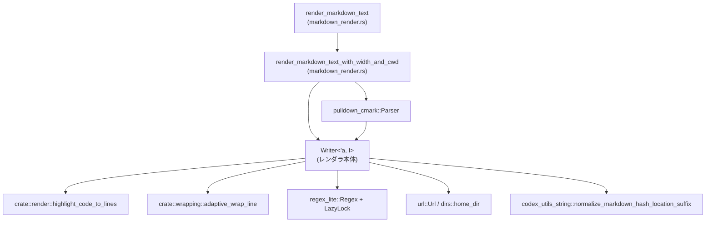
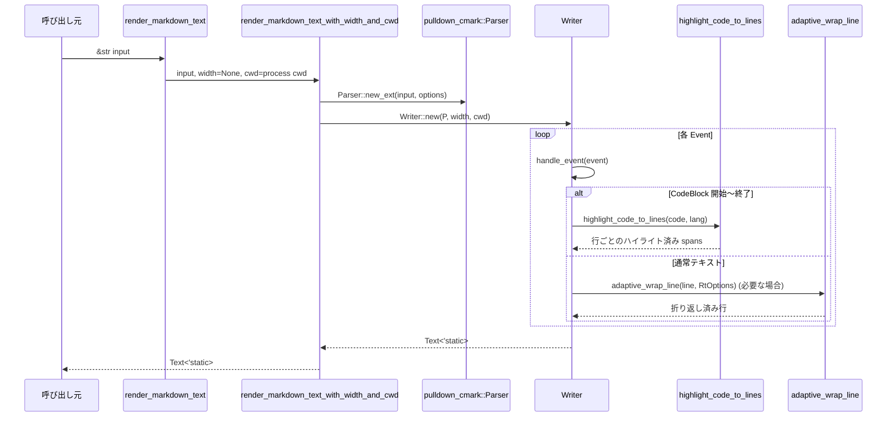
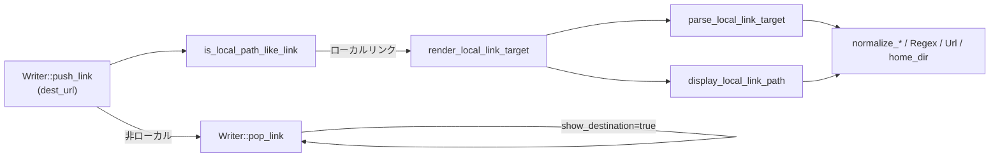

# tui/src/markdown_render.rs コード解説

## 0. ざっくり一言

TUI 用に Markdown をパースし、`ratatui::text::Text` にレンダリングするモジュールです。  
特に「ローカルファイルへのリンク」を通常の Web リンクと異なるポリシーで表示し、コードブロックのシンタックスハイライトや、折り返し幅に応じたインデント付き改行を行います。

> ※提供チャンクには行番号情報が含まれていないため、以下の「根拠」欄の `L?-?` は「本ファイル内の該当定義」という意味であり、厳密な行番号ではありません。

---

## 1. このモジュールの役割

### 1.1 概要

- このモジュールは **Markdown テキストを TUI で表示可能なスタイル付きテキストに変換する** ために存在し、以下の機能を提供します。
  - `pulldown_cmark` で Markdown をイベント列にパース
  - 見出し・リスト・引用・インラインコードなどの要素ごとに `ratatui::text::Text` を構築
  - コードブロックをシンタックスハイライトしつつ、行折り返しは行わない
  - ローカルファイルリンクを、ラベルではなく **正規化されたパス表示** に置き換える
  - 指定幅に応じた折り返しと、リスト・引用のインデント維持

### 1.2 アーキテクチャ内での位置づけ

主な依存関係とデータフローは以下のようになっています。



- 呼び出し側は通常 `render_markdown_text` を利用します。
- 内部では `render_markdown_text_with_width_and_cwd` → `Writer` に処理が委譲されます。
- `Writer` が `pulldown_cmark::Event` を順に処理し、`Text<'static>` を構築します。
- コードブロックの行は `highlight_code_to_lines` に渡され、色付き `Span` 列として戻ります。
- 折り返しは `adaptive_wrap_line` + `RtOptions` によって行われます。
- ローカルリンクのパス解析・正規化は `Url` / `Regex` / `home_dir` / `normalize_markdown_hash_location_suffix` などの補助関数群が担当します。

### 1.3 設計上のポイント

- **ストリーミング処理**
  - `Writer` は `pulldown_cmark::Event` イテレータを1つずつ処理し、TUI 用の行を構築するストリーム型設計です。
- **状態管理**
  - パラグラフ内かどうか、コードブロック内か、リストの深さ、リンクの状態などを多数のフィールドで明示的に管理します。
- **インデントと折り返し**
  - `IndentContext` と `prefix_spans` により、ネストしたリストや引用のインデントを維持しつつ、行折り返し時も整形されたテキストになるよう制御しています。
- **ローカルリンクの特別扱い**
  - `is_local_path_like_link` でローカルパスと判断したリンクはラベルを表示せず、**解決されたパス文字列 + 位置情報** をコード風スタイルで表示します。
- **安全性 / エラー**
  - 主に `Option` / `Result` / `LazyLock` を利用し、パース失敗や不正 URL は `None` を返す形で無害化しています。
  - 正規表現のコンパイル失敗時のみ `panic!` を使用していますが、パターンはリテラルであり実行時に変わらないため、実質的には安全とみなせます。
- **並行性**
  - グローバル状態は `LazyLock<Regex>` のみで、`LazyLock` 自体がスレッド安全です。
  - それ以外の状態は `Writer` インスタンスごとのローカル値であり、スレッド間で共有されません。

---

## 2. 主要な機能一覧

- Markdown 全体レンダリング: Markdown 文字列を `ratatui::text::Text<'static>` に変換する。
- 幅指定付きレンダリング: 折り返し幅と作業ディレクトリを指定可能なレンダリング。
- 行折り返しとインデント制御: リストや引用のインデントを維持しながらテキストを折り返す。
- 見出し・強調・コード・引用などの装飾スタイル付与。
- コードブロックのシンタックスハイライトと折り返し抑制。
- ローカルリンクの解析・正規化・短縮表示（`file://`, 絶対 / 相対 / `~/` / Windows パス対応）。
- `#L..` や `:line[:col]` 形式の位置指定サフィックスの抽出・正規化。

---

## 3. 公開 API と詳細解説

### 3.1 型一覧（構造体・列挙体など）

> 行番号は取得できないため、根拠は「このファイルに定義されていること」のみを示します。

| 名前 | 種別 | 公開範囲 | 役割 / 用途 | 根拠 |
|------|------|----------|-------------|------|
| `MarkdownStyles` | 構造体 | モジュール内(private) | 見出し・コード・強調・リンクなどに用いる `ratatui::style::Style` のセットを保持します。 | `markdown_render.rs:L?-?` |
| `IndentContext` | 構造体 | モジュール内(private) | 現在のインデント（引用やリストのプレフィックス）とリストマーカー情報を表します。 | `markdown_render.rs:L?-?` |
| `LinkState` | 構造体 | モジュール内(private) | 処理中リンクの destination や、ローカルリンク用の表示テキストを保持します。 | `markdown_render.rs:L?-?` |
| `Writer<'a, I>` | 構造体 | モジュール内(private) | `pulldown_cmark::Event` イテレータを受け取り、`Text<'static>` を構築するレンダラ本体です。 | `markdown_render.rs:L?-?` |
| `COLON_LOCATION_SUFFIX_RE` | `static LazyLock<Regex>` | モジュール内(private) | `:line[:col][-line2[:col]]` 形式のサフィックス検出用正規表現です。 | `markdown_render.rs:L?-?` |
| `HASH_LOCATION_SUFFIX_RE` | `static LazyLock<Regex>` | モジュール内(private) | `#L..` 形式の位置指定フラグメント検出用正規表現です。 | `markdown_render.rs:L?-?` |

### 3.2 関数詳細（重要な 7 件）

#### `render_markdown_text(input: &str) -> Text<'static>`

**概要**

- デフォルトの折り返し設定（幅指定なし）とカレントディレクトリを用いて Markdown テキストを `Text<'static>` に変換する公開 API です。

**引数**

| 引数名 | 型 | 説明 |
|--------|----|------|
| `input` | `&str` | レンダリング対象の Markdown テキスト |

**戻り値**

- `ratatui::text::Text<'static>`  
  ratatui の `Paragraph` などにそのまま渡せるスタイル付きテキストです。

**内部処理の流れ**

1. `render_markdown_text_with_width(input, None)` を呼び出すだけの薄いラッパーです。
2. 折り返し幅を指定しないことで、`Writer` 内部の折り返し処理は無効になります。

**Examples（使用例）**

```rust
use ratatui::widgets::Paragraph;
use tui::markdown_render::render_markdown_text;

fn render_markdown_paragraph(markdown: &str) -> Paragraph<'static> {
    // Markdown を Text<'static> に変換する
    let text = render_markdown_text(markdown);        // 所有権を Text に移す
    Paragraph::new(text)                              // Paragraph に包んで返す
}
```

**Errors / Panics**

- この関数自体は `Result` を返さず、内部でもパニックしません。
- 正規表現の静的初期化が失敗すると `panic!` しますが、パターンはソースコードに埋め込みのため通常想定されません。

**Edge cases（エッジケース）**

- 空文字列 `""` の場合: `Text` は空行のみを持つか、空のテキストになります。
- 非 Markdown 文字列: そのままテキストとして表示されます。

**使用上の注意点**

- 折り返し幅を制御したい場合は `render_markdown_text_with_width` 系を使用する必要があります。
- カレントディレクトリに依存してローカルリンク表示を短縮するため、プロセスの `current_dir` が重要になる場合があります。

---

#### `render_markdown_text_with_width_and_cwd(input: &str, width: Option<usize>, cwd: Option<&Path>) -> Text<'static>`

**概要**

- 折り返し幅と「ローカルリンク短縮用の作業ディレクトリ」を明示的に指定して Markdown をレンダリングします。
- このモジュールの実質的なコア公開 API です（`pub(crate)`）。

**引数**

| 引数名 | 型 | 説明 |
|--------|----|------|
| `input` | `&str` | レンダリング対象 Markdown |
| `width` | `Option<usize>` | 折り返し幅（`Some(w)` で幅 w を指定、`None` で折り返しなし） |
| `cwd` | `Option<&Path>` | ローカル絶対パスを短縮表示する際の基準ディレクトリ |

**戻り値**

- `Text<'static>`: 折り返しとローカルリンク処理が反映された TUI 用テキスト。

**内部処理の流れ**

1. `Options::empty()` から `pulldown_cmark` のパーサオプションを作成し、取り消し線を有効化。
2. `Parser::new_ext(input, options)` で Markdown をイベント列に変換。
3. `Writer::new(parser, width, cwd)` でレンダラを初期化。
4. `Writer::run()` を実行してイベント列をすべて処理。
5. `Writer` が構築した `self.text` を返します。

**Examples（使用例）**

```rust
use std::path::Path;
use tui::markdown_render::render_markdown_text_with_width_and_cwd;

fn render_with_width_and_cwd(md: &str) {
    let cwd = Path::new("/workspace/project");  // ローカルリンク短縮の基準
    let text = render_markdown_text_with_width_and_cwd(
        md,
        Some(80),                                // 80桁で折り返し
        Some(cwd),                               // この cwd を基準にパスを短縮
    );
    // text を Paragraph などで表示する
}
```

**Errors / Panics**

- `Parser::new_ext` などは失敗しない前提で使用されています。
- `cwd` が無効であっても (存在しないパスなど) この関数では検証されず、そのまま文字列として扱われます。

**Edge cases**

- `width = None`: 折り返しは行われません。`Writer::flush_current_line` で `wrap_width` が `None` のため、そのまま出力されます。
- `cwd = None`: ローカルリンクは短縮されず、絶対パスのまま表示されます。

**使用上の注意点**

- ローカルリンクの短縮表示が必要ない場合でも、`cwd` を変に変更すると表示パスが想定と異なるものになる可能性があります。
- 折り返し幅が極端に小さいと、リストのインデントなどで見づらくなることがあります。

---

#### `Writer<'a, I>::handle_event(&mut self, event: Event<'a>)`

**概要**

- `pulldown_cmark::Event` を1つ受け取り、内部状態を更新しつつ `Text` に反映する中核処理です。
- すべての Markdown 構造はここから `start_tag` / `end_tag` / `text` などに分岐します。

**引数**

| 引数名 | 型 | 説明 |
|--------|----|------|
| `event` | `pulldown_cmark::Event<'a>` | Markdown パーサから得られるイベント |

**戻り値**

- なし（`self.text` と内部状態を更新します）。

**内部処理の流れ**

1. `prepare_for_event(&event)` で、ローカルリンク直後の soft break をインライン扱いにするかどうかを判定。
2. `match event` で分岐:
   - `Event::Start(tag)` → `start_tag(tag)`
   - `Event::End(tag)` → `end_tag(tag)`
   - `Event::Text(text)` → `text(text)`
   - `Event::Code(code)` → `code(code)`
   - `Event::SoftBreak` → `soft_break()`
   - `Event::HardBreak` → `hard_break()`
   - `Event::Rule` → 水平線 (`"———"`) を挿入
   - `Event::Html` / `Event::InlineHtml` → `html(...)`
   - フットノートやタスクリストマーカーなど未対応要素は無視

**Examples（概念的な使用例）**

`Writer` は直接使うことはありませんが、概念的には次のような流れで使われます。

```rust
use pulldown_cmark::{Parser, Options};
use tui::markdown_render::render_markdown_text_with_width_and_cwd;

// 実際には Writer はモジュール内でのみ利用されます
fn conceptual() {
    let options = Options::empty();
    let parser = Parser::new_ext("# Title", options);
    // Writer::new(parser, Some(80), None).run(); // 実際のコードはモジュール内
    let _ = render_markdown_text_with_width_and_cwd("# Title", Some(80), None);
}
```

**Errors / Panics**

- `match` で網羅的にイベントを処理しており、パニックしない実装になっています。
- 未対応のタグ（テーブルなど）は単に無視されるだけです。

**Edge cases**

- `Event::Rule` の前にすでに行が存在する場合、空行を挟んで水平線を出力します。
- HTML ブロックはプレーンテキストとして扱われ、TUI 上で HTML として解釈されることはありません。

**使用上の注意点**

- 新しい Markdown 要素に対応したい場合は、この `handle_event` と `start_tag` / `end_tag` にケースを追加する必要があります。
- ローカルリンク表示の挙動（soft break の扱いなど）も `prepare_for_event` と併せてここに依存します。

---

#### `Writer<'a, I>::flush_current_line(&mut self)`

**概要**

- `current_line_content` にバッファされている行を実際に `self.text.lines` にプッシュします。
- 必要に応じて `adaptive_wrap_line` を使って行折り返しを行います。

**引数**

- なし (`&mut self` のみ)

**戻り値**

- なし（内部の `text.lines` を更新します）。

**内部処理の流れ**

1. `current_line_content` が `Some` でなければ何もしません。
2. コードブロック内 (`current_line_in_code_block == true`) または折り返し幅なし (`wrap_width == None`) の場合:
   - インデント `current_initial_indent` を `line.spans` の前に付与し、そのまま 1 行として `self.text.lines.push(...)`。
3. それ以外の場合（通常のテキスト行）:
   - `RtOptions::new(width)` に初期・後続インデントを設定。
   - `adaptive_wrap_line(&line, opts)` で折り返し済みの行列を得る。
   - 各行を `line_to_static` で `'static` に変換し、スタイルを付けて `self.text.lines` へ。
4. 作業用フィールドをリセット (`current_initial_indent.clear()` など)。

**Examples（概念的な使用例）**

`Writer` が内部で利用するため、呼び出し側からは直接使いません。  
実際には `push_line` やイベント処理の最後で自動的に呼ばれます。

**Errors / Panics**

- `adaptive_wrap_line` が返す行列に対して安全な操作のみを行っており、パニック要素は見当たりません。
- `wrap_width` が `0` のような値で来た場合の挙動は、`RtOptions::new(width)` と `adaptive_wrap_line` 側の契約に依存します（このコードからは不明）。

**Edge cases**

- コードブロック内 (`current_line_in_code_block == true`) の行は折り返されません。コピー＆ペーストしやすさを優先した挙動です。
- インデントだけの行 (`spans` が空) でも、インデントがある限り `Line` は出力されます。

**使用上の注意点**

- 折り返しロジックを変えたい場合は、この関数と `push_line` の両方を確認する必要があります。
- 行スタイル全体（引用の緑色など）はここではなく `push_line` 側で決定されます。

---

#### `parse_local_link_target(dest_url: &str) -> Option<(String, Option<String>)>`

**概要**

- ローカルリンクの destination 文字列を、`(正規化済みパス文字列, 位置サフィックス)` に分解します。
- `file://` URL, 絶対/相対パス, `~/` パス, Windows パス, `#L..` / `:line[:col]` 形式を扱います。

**引数**

| 引数名 | 型 | 説明 |
|--------|----|------|
| `dest_url` | `&str` | Markdown のリンク destination 部分の文字列 |

**戻り値**

- `Option<(String, Option<String>)>`  
  - `Some((path, suffix))`:
    - `path`: `~/` 展開やセパレータ正規化後のパス文字列
    - `suffix`: `Some("#L10")` や `Some(":10:5")` のような位置サフィックス（あれば）
  - `None`: `file://` 形式なのにローカルパスへ変換できなかった場合のみ

**内部処理の流れ**

1. `dest_url` が `"file://"` 始まりなら:
   - `Url::parse(dest_url)` を試み、失敗したら `None`。
   - 成功したら `file_url_to_local_path_text(&url)` でパス文字列を作成。
   - `url.fragment()` を `normalize_hash_location_suffix_fragment` で位置サフィックスに変換。
2. それ以外の場合:
   - まず `rsplit_once('#')` と `normalize_hash_location_suffix_fragment` により、`#L..` 形式を優先的に抽出。
   - 位置サフィックスがまだない場合、`extract_colon_location_suffix` で末尾の `:line[:col]` 形式を抽出。
   - 抽出した位置サフィックスを除いた残りを `urlencoding::decode` で URL デコード。
   - `expand_local_link_path` で `~/` 展開とセパレータ正規化を行う。
3. `(正規化済みパス, Option<位置サフィックス>)` を `Some` で返す。

**Examples（使用例）**

```rust
use tui::markdown_render::parse_local_link_target;

fn example_parse() {
    // file:// 形式
    let (path, suffix) = parse_local_link_target("file:///home/user/file.rs#L10")
        .expect("valid file url");
    // path == "/home/user/file.rs"（セパレータは '/' に正規化される）
    // suffix == Some("#L10".to_string()) （正規化済み）

    // colon 形式
    let (path2, suffix2) = parse_local_link_target("/proj/src/main.rs:42").unwrap();
    // path2 == "/proj/src/main.rs"
    // suffix2 == Some(":42".to_string())
}
```

**Errors / Panics**

- `Url::parse` 失敗時は `None` を返し、パニックしません。
- URL デコード失敗時は `unwrap_or` で元の文字列を使うため、パニックしません。

**Edge cases**

- `dest_url` が `"path#section"` のような位置指定ではない `#` を含む場合:
  - `normalize_hash_location_suffix_fragment` が `None` を返すため、`#section` はパスの一部として扱われます。
- Windows ドライブレター（`"C:/..."`）に含まれるコロンは、末尾サフィックス判定の対象外です（正規表現が末尾の `:数字` のみを対象とするため）。

**使用上の注意点**

- この関数は `is_local_path_like_link` と組み合わせて use される前提です。URL など「明らかに非ローカル」なリンクはここには渡されません。
- パスの存在確認や権限チェックは行っておらず、純粋に文字列の変換だけを行います。

---

#### `display_local_link_path(path_text: &str, cwd: Option<&Path>) -> String`

**概要**

- 正規化済みのローカルパス文字列から、実際に表示するパス文字列を決めます。
- 絶対パスは `cwd` 以下にある場合のみ相対パスに短縮し、それ以外は絶対パスのまま表示します。

**引数**

| 引数名 | 型 | 説明 |
|--------|----|------|
| `path_text` | `&str` | `normalize_local_link_path_text` 済みのパス文字列 |
| `cwd` | `Option<&Path>` | セッションの作業ディレクトリ（短縮基準）。`None` の場合は短縮しない |

**戻り値**

- `String`: 表示用のパス文字列。

**内部処理の流れ**

1. `normalize_local_link_path_text(path_text)` でバックスラッシュなどを `'/'` に正規化。
2. `is_absolute_local_link_path` で絶対パスかどうか判定。
   - 絶対パスでない場合はそのまま返す。
3. `cwd` が `Some` であれば:
   - `cwd` を `normalize_local_link_path_text` で正規化。
   - `strip_local_path_prefix(&path_text, &cwd_text)` で `cwd` をプレフィックスとして取り除けるか確認。
   - 取り除ける場合は、その残りを返す（先頭 `"/"` は除去）。
4. 上記に当てはまらない場合は、元の `path_text` をそのまま返す。

**Examples（使用例）**

```rust
use std::path::Path;
use tui::markdown_render::display_local_link_path;

fn example_display() {
    let cwd = Path::new("/workspace/project");
    let shown = display_local_link_path("/workspace/project/src/lib.rs", Some(cwd));
    assert_eq!(shown, "src/lib.rs"); // cwd 以下なので短縮される

    let shown2 = display_local_link_path("/opt/other/file.rs", Some(cwd));
    assert_eq!(shown2, "/opt/other/file.rs"); // cwd の外なので短縮されない
}
```

**Errors / Panics**

- パニックする経路はありません。`strip_local_path_prefix` も安全な文字列操作のみです。

**Edge cases**

- `cwd` が `/` または `//` の場合:
  - `/tmp/x` → `tmp/x` のように、ルート直下のパスも短縮対象になります。
- `path_text` が `cwd` と完全一致する場合:
  - `strip_local_path_prefix` は `None` を返し、フルパスを維持します（空文字への短縮を避けるため）。

**使用上の注意点**

- `cwd` はファイルシステム上の存在とは無関係に文字列として扱われるので、誤った `cwd` を渡すと意図しない表示になる可能性があります。
- Windows UNC パスや `C:/...` もセパレータを `'/'` に変えた上で同じロジックにかけられます。

---

#### `Writer<'a, I>::start_codeblock` / `Writer<'a, I>::end_codeblock`

**概要**

- コードブロックの開始と終了を処理し、必要に応じてシンタックスハイライトを行います。
- ハイライト対象となる言語トークンを CommonMark の info string から抽出します。

**引数（start_codeblock）**

| 引数名 | 型 | 説明 |
|--------|----|------|
| `lang` | `Option<String>` | fenced code block の info string（`"rust,no_run"` など） |
| `indent` | `Option<Span<'static>>` | インデント用の `Span`（インデントコードブロック用） |

**戻り値**

- いずれのメソッドも戻り値なし（`self` の状態を更新）。

**内部処理の流れ（start_codeblock）**

1. `flush_current_line()` で現在行を確定。
2. すでにテキストがあれば空行を 1 つ挿入。
3. `in_code_block = true` をセット。
4. `lang` から最初のトークンだけ抜き出して（`,`・空白・タブで分割）、言語名を抽出。
5. `code_block_lang` に言語名（`Some(lang)` または `None`）を格納し、`code_block_buffer` をクリア。
6. `IndentContext` をスタックに push し、コードブロックのインデントを設定。

**内部処理の流れ（end_codeblock）**

1. `code_block_lang.take()` で言語名を取り出し、`Some(lang)` なら:
   - `std::mem::take(&mut code_block_buffer)` でコード全文を取得。
   - 空でなければ `highlight_code_to_lines(&code, &lang)` を呼び出し、ハイライト済み行列を得る。
   - 各行について `push_line(Line::default())` → `push_span(span)` で TUI 行を構築。
2. `needs_newline = true` に設定し、`in_code_block = false` に戻す。
3. インデントスタックからコードブロック用コンテキストを pop。

**Examples（挙動確認の観点）**

```rust
let md = "```rust,no_run\nfn main() {}\n```\n";
let text = render_markdown_text(md);
// text.lines 内の該当行に、シンタックスハイライト済みの RGB カラーが含まれることをテストで検証しています。
```

**Errors / Panics**

- `highlight_code_to_lines` の契約に依存しますが、このコードからはパニック経路は見えません。
- 未知の言語名の場合、ハイライトライブラリ側でデフォルト扱いになるか無色になる可能性があります（詳細は外部関数側の挙動次第）。

**Edge cases**

- `code_block_lang` が `None`（言語不明）の場合:
  - `code_block_buffer` は使われず、`text` イベントごとの通常処理でコード行が追加されますが、`current_line_in_code_block` により折り返しは抑止されます。
- CRLF (`\r\n`) コードブロック:
  - コメントにある通り、`pulldown_cmark` が複数 `Text` イベントに分割する場合でも、バッファへの追加は改行を挿入せず連結します。

**使用上の注意点**

- `code_block_buffer` に蓄積した文字列は、`end_codeblock` でのみ消費されます。コードブロック中に他のイベントが挟まる前提はありません。
- 折り返しを行いたくない行（例: コマンドラインなど）を code block で書けば、幅指定があっても折り返されません。

---

### 3.3 その他の関数（概要）

> 主に内部ヘルパーであり、外部から直接呼び出す想定はありません。

| 関数名 | 役割（1 行） | 根拠 |
|--------|--------------|------|
| `render_markdown_text_with_width` | カレントディレクトリを取得し、`render_markdown_text_with_width_and_cwd` を呼び出すラッパー。 | `markdown_render.rs:L?-?` |
| `should_render_link_destination` | リンク destination がローカルパスかどうかに基づき、括弧付き URL を表示するか判定。 | `markdown_render.rs:L?-?` |
| `Writer::new` | `Writer` の初期状態（スタイル、フラグ類、バッファなど）を構築。 | `markdown_render.rs:L?-?` |
| `Writer::run` | イテレータから `Event` を読み出し続け、`handle_event` に委譲。 | `markdown_render.rs:L?-?` |
| `Writer::prepare_for_event` | ローカルリンク直後のソフト改行を「説明テキストの一部」として扱うか決定。 | `markdown_render.rs:L?-?` |
| `Writer::start_tag` / `end_tag` | `Tag` / `TagEnd` 別にパラグラフやリスト、リンク、引用などの開始 / 終了処理を行う。 | `markdown_render.rs:L?-?` |
| `Writer::start_paragraph` / `end_paragraph` | パラグラフの空行挿入やフラグ更新を行う。 | `markdown_render.rs:L?-?` |
| `Writer::start_heading` / `end_heading` | 見出しのスタイルと先頭 `#` を付与し、終端で改行フラグを更新。 | `markdown_render.rs:L?-?` |
| `Writer::start_blockquote` / `end_blockquote` | 引用符 `"> "` をインデントスタックに追加・削除。 | `markdown_render.rs:L?-?` |
| `Writer::text` | 通常テキストイベントを行単位に分割し、インラインスタイルを適用して追加。 | `markdown_render.rs:L?-?` |
| `Writer::code` | インラインコードを `styles.code` で装飾した `Span` として追加。 | `markdown_render.rs:L?-?` |
| `Writer::html` | HTML ブロック/インラインを、インラインスタイルを保ったプレーンテキストとして追加。 | `markdown_render.rs:L?-?` |
| `Writer::hard_break` / `soft_break` | 改行（強制 / ソフト）イベントを `push_line` に変換。ローカルリンク直後は特別扱い。 | `markdown_render.rs:L?-?` |
| `Writer::start_list` / `end_list` | リストの深さや番号カウンタを更新。 | `markdown_render.rs:L?-?` |
| `Writer::start_item` | リスト項目のマーカー (`"- "` や `"1. "`) と、そのインデントをインデントスタックに追加。 | `markdown_render.rs:L?-?` |
| `Writer::push_inline_style` / `pop_inline_style` | 現在のインラインスタイルスタックを更新。 | `markdown_render.rs:L?-?` |
| `Writer::push_link` / `pop_link` | リンク状態を設定し、終了時に destination またはローカルパス表示を挿入。 | `markdown_render.rs:L?-?` |
| `Writer::suppressing_local_link_label` | ローカルリンクの表示テキストを destination から生成する場合に、ラベル出力を抑制するか判定。 | `markdown_render.rs:L?-?` |
| `Writer::push_line` | 新しい論理行を開始し、インデントや blockquote スタイルを設定。 | `markdown_render.rs:L?-?` |
| `Writer::push_span` | 現在行に `Span` を追加、なければ新しい行を作成。 | `markdown_render.rs:L?-?` |
| `Writer::push_blank_line` | インデントコンテキストに応じて適切な空行を挿入。 | `markdown_render.rs:L?-?` |
| `Writer::prefix_spans` | インデントスタックから現在行に付与すべきプレフィックス `Span` 列を構築。 | `markdown_render.rs:L?-?` |
| `is_local_path_like_link` | `file://`, `/`, `~/`, `./`, Windows パスなど「ローカルパス風」かを判定。 | `markdown_render.rs:L?-?` |
| `render_local_link_target` | `parse_local_link_target` と `display_local_link_path` を組み合わせて、表示用文字列を生成。 | `markdown_render.rs:L?-?` |
| `normalize_hash_location_suffix_fragment` | `L12` や `L12C3-L14C9` 形式のフラグメントを正規化された `#L..` サフィックスに変換。 | `markdown_render.rs:L?-?` |
| `extract_colon_location_suffix` | 末尾の `:line[:col][-line2[:col]]` サフィックスを抽出。 | `markdown_render.rs:L?-?` |
| `expand_local_link_path` | `~/` をホームディレクトリに展開しつつセパレータを正規化。 | `markdown_render.rs:L?-?` |
| `file_url_to_local_path_text` | `file://` URL をローカルパス文字列に変換し、UNC/Windows パスも扱う。 | `markdown_render.rs:L?-?` |
| `normalize_local_link_path_text` | パス文字列のセパレータを `'/'` に統一し、UNC パスを `//server/share` 形式に整形。 | `markdown_render.rs:L?-?` |
| `is_absolute_local_link_path` | `/`, `//`, `C:/` のような絶対パスかどうかを判定。 | `markdown_render.rs:L?-?` |
| `trim_trailing_local_path_separator` | 末尾の `'/'` を除去（ただし `/` や `C:/` などは維持）。 | `markdown_render.rs:L?-?` |
| `strip_local_path_prefix` | `cwd` の直下にあるパスなら、`cwd` 部分を取り除いた相対部分を返す。 | `markdown_render.rs:L?-?` |

---

## 4. データフロー

### 4.1 Markdown レンダリング全体の流れ

`render_markdown_text` を呼び出してから `Text<'static>` が得られるまでの典型的な流れです。



要点:

- `Parser` が Markdown をイベント列に変換し、`Writer` がそれを 1 パスで `Text` へ変換します。
- コードブロックのみ、バッファリング → ハイライト関数呼び出し → 行追加、という別経路を通ります。
- 折り返しは `flush_current_line` 内の `adaptive_wrap_line` 経路のみで行われます（コードブロックは除外）。

### 4.2 ローカルリンク処理の流れ



- `push_link` 時に `dest_url` がローカルパスの場合、`LinkState.local_target_display` にレンダリング済みパスを持ちます。
- リンク内の `Text` / `Code` イベントは `suppressing_local_link_label` により抑制されます。
- `pop_link` 時に `local_target_display` があれば、コード風スタイルでパス文字列を行に挿入します。

---

## 5. 使い方（How to Use）

### 5.1 基本的な使用方法

もっとも単純な利用パターンは、Markdown を `Text<'static>` に変換し、それを `ratatui` のウィジェットに渡すことです。

```rust
use ratatui::widgets::{Paragraph, Block, Borders};
use ratatui::layout::Rect;
use ratatui::Frame;
use tui::markdown_render::render_markdown_text;

// フレーム内に Markdown を描画する例
fn draw_markdown<B: ratatui::backend::Backend>(f: &mut Frame<B>, area: Rect, md: &str) {
    // Markdown を TUI 用の Text に変換
    let text = render_markdown_text(md);                // 'static な Text を生成

    // Paragraph ウィジェットとして表示
    let para = Paragraph::new(text)
        .block(Block::default().title("Transcript").borders(Borders::ALL));
    f.render_widget(para, area);                        // フレームに描画
}
```

### 5.2 よくある使用パターン

1. **折り返し幅を指定して表示**

```rust
use tui::markdown_render::render_markdown_text_with_width;

fn render_with_wrap(md: &str) {
    // 40 桁を上限に折り返す
    let text = render_markdown_text_with_width(md, Some(40));
    // Paragraph::new(text) などで表示
}
```

1. **履歴ビューで「セッションの cwd」に合わせてローカルパスを短縮**

```rust
use std::path::Path;
use tui::markdown_render::render_markdown_text_with_width_and_cwd;

fn render_session_view(md: &str, session_cwd: &Path) {
    let text = render_markdown_text_with_width_and_cwd(
        md,
        Some(80),                  // 画面幅に近い値を指定
        Some(session_cwd),        // セッションごとの cwd
    );
    // 同じセッションの他セルも同じ cwd で描画するとパス表示が揃う
}
```

### 5.3 よくある間違い

```rust
use tui::markdown_render::render_markdown_text_with_width_and_cwd;
use std::path::Path;

// 間違い例: 異なる cwd で同じセッションのメッセージをレンダリングしてしまう
fn wrong(md: &str) {
    let cwd1 = Path::new("/workspace/proj1");
    let cwd2 = Path::new("/workspace/proj2");
    let _t1 = render_markdown_text_with_width_and_cwd(md, Some(80), Some(cwd1));
    let _t2 = render_markdown_text_with_width_and_cwd(md, Some(80), Some(cwd2)); // 同じ Markdown でもパス表示が変わる
}

// 正しい例: セッション内では同じ cwd を使う
fn correct(md: &str, session_cwd: &Path) {
    let _t = render_markdown_text_with_width_and_cwd(md, Some(80), Some(session_cwd));
}
```

- ローカルリンク表示は `cwd` に依存するため、同じセッション内では同じ `cwd` を使う必要があります。

### 5.4 使用上の注意点（まとめ）

- **ローカルリンク**
  - `file://`, `/`, `~/`, `./`, `../`, Windows ドライブレターや UNC パスなどのみがローカルリンクとして扱われます。
  - ローカルリンクでは、リンクラベルは無視され、**実際のパス + 位置サフィックス** がコードスタイルで表示されます。
- **コードブロック**
  - 折り返しは行われません。長い行も 1 行として扱われます。
  - fenced code の info string にメタデータ（`"rust,no_run"` など）が含まれていても、先頭のトークンだけで言語判定が行われます。
- **安全性 / エラー**
  - ファイルシステムへのアクセスや I/O は行いません。パスはあくまで文字列として扱われます。
  - URL パースや URL デコード失敗は `None` または元文字列の利用として処理され、パニックしません。
- **並行性**
  - `LazyLock<Regex>` 以外に共有状態はなく、`Text` の生成は `render_markdown_text*` の呼び出しごとに独立しています。

---

## 6. 変更の仕方（How to Modify）

### 6.1 新しい機能を追加する場合

1. **新しい Markdown 要素をサポートする（例: テーブル）**
   - `Writer::start_tag` / `Writer::end_tag` 内の `match Tag/TagEnd` にテーブル関連のブランチを追加します。
   - 必要なら `IndentContext` を拡張して、テーブルのインデントやセル境界の情報を持てるようにします。
   - レンダリング結果の `Text` 形式を決めたら、テストモジュール（`markdown_render_tests` または `tests`）にケースを追加します。

2. **スタイルをカスタマイズする**
   - `MarkdownStyles` の `Default` 実装を変更することで、見出し・引用・リンクの色や装飾を変えられます。
   - `Writer` のフィールド `styles` に直接依存しているため、スタイルの追加・削除は `start_*` / `text` / `code` などの利用箇所も併せて確認します。

3. **ローカルリンク形式の拡張**
   - 新しい位置指定フォーマットを扱いたい場合:
     - 正規表現 `COLON_LOCATION_SUFFIX_RE` / `HASH_LOCATION_SUFFIX_RE` を修正。
     - `normalize_hash_location_suffix_fragment` / `extract_colon_location_suffix` のロジックを更新。
     - 既存フォーマットが壊れていないことをテストで確認します。

### 6.2 既存の機能を変更する場合

- **折り返し挙動を変える**
  - `Writer::flush_current_line` と `push_line` を確認します。
  - `RtOptions` の初期インデント / 後続インデント設定がリスト・引用の整形に影響するため、変更時はリスト・引用のテストケースを重点的に確認します。

- **ローカルリンクの短縮規則を変更する**
  - `display_local_link_path`, `strip_local_path_prefix`, `is_absolute_local_link_path` を中心に確認します。
  - Windows / Unix / UNC それぞれのパス表現を想定したテストを追加・更新する必要があります。

- **位置サフィックスの扱いを変える**
  - `parse_local_link_target`, `normalize_hash_location_suffix_fragment`, `extract_colon_location_suffix` を変更します。
  - 既存の `#L..` / `:line[:col]` を利用しているコード・リンクがないか、上位レイヤの仕様も確認してください。

- **テストの影響範囲**
  - このファイルには `#[cfg(test)]` な `tests` モジュールと `markdown_render_tests` の include があり、多数の挙動がテストされています。
  - 特にリスト・引用・コードブロック・URL 風文字列の折り返しはテストで厳密に検証されているため、仕様変更時はこれらのテストを確認する必要があります。

---

## 7. 関連ファイル

このモジュールと密接に関係する外部モジュール・クレートは次の通りです。

| パス / クレート | 役割 / 関係 |
|-----------------|------------|
| `crate::render::highlight::highlight_code_to_lines` | コードブロックのシンタックスハイライトを行い、`ratatui::text::Line` の列を返す関数です。`end_codeblock` から呼び出されます。 |
| `crate::render::line_utils::line_to_static` | 折り返し処理後の一時的な `Line` を `'static` ライフタイムの `Line` に変換するヘルパーです。 |
| `crate::wrapping::RtOptions` / `crate::wrapping::adaptive_wrap_line` | テキスト行の折り返しロジックをカプセル化したモジュールで、本モジュールはそれを利用してリストや引用のインデントを保ったまま折り返します。 |
| `codex_utils_string::normalize_markdown_hash_location_suffix` | `#L..` 形式の位置サフィックスを正規化するユーティリティ関数で、`normalize_hash_location_suffix_fragment` から呼び出されます。 |
| `pulldown_cmark` | Markdown をイベント列に変換するパーサクレートで、`Parser`, `Event`, `Tag`, `HeadingLevel` などを使用しています。 |
| `ratatui::text::{Text, Line, Span}` | TUI 描画用のテキスト構造で、本モジュールの出力の中心的な型です。 |
| `regex_lite::Regex` + `std::sync::LazyLock` | 位置サフィックス用の正規表現をスレッド安全に遅延初期化して共有するために利用されています。 |
| `url::Url` | `file://` URL をローカルパス文字列に変換するために使用されています。 |
| `dirs::home_dir` | `~/path` 形式のローカルリンクをホームディレクトリに展開するための関数です。 |
| `markdown_render_tests.rs` | `mod markdown_render_tests` から `include!` されるテストコードで、このモジュールの挙動をさらに詳細に検証していると推測されます（内容は本チャンクには含まれていません）。 |

このレポートは、`tui/src/markdown_render.rs` に含まれる情報のみをもとに作成されています。それ以外のファイルの内部実装や外部関数の詳細な挙動は、このチャンクからは分かりません。
