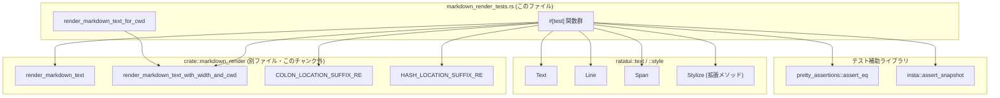
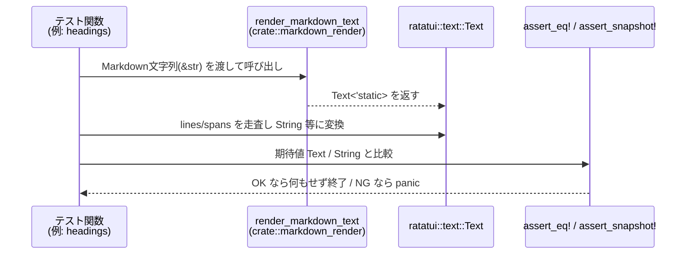

# tui/src/markdown_render_tests.rs

## 0. ざっくり一言

Markdown 文字列を `ratatui::text::Text` にレンダリングする `crate::markdown_render` モジュールの **仕様をテストで定義している統合テスト集** です。段落・見出し・引用・リスト・コードブロック・リンク・ファイルパス整形など、端末 UI 向け Markdown レンダラの振る舞いを網羅的に検証します。

---

## 1. このモジュールの役割

### 1.1 概要

- このモジュールは、`render_markdown_text` および `render_markdown_text_with_width_and_cwd` の **期待される出力フォーマット** をテストを通じて定義します。
- Markdown の要素（見出し・リスト・引用・コードブロック・リンク・HTML など）が `ratatui::text::Text` / `Line` / `Span` にどのようにマッピングされるかを検証します。
- ローカルファイルリンク・`file://` URL を、カレントディレクトリ (`cwd`) を基準としたパス表現に正規化するパス処理の仕様もテストします。

### 1.2 アーキテクチャ内での位置づけ

このファイル自体はテストモジュールであり、プロダクションコードは `crate::markdown_render` 側にあります。依存関係は次の通りです。



> `crate::markdown_render` の内部実装はこのチャンクには現れません。そのためレンダラ内部のアルゴリズムは不明です。

### 1.3 設計上のポイント

コードから読み取れる範囲での特徴です。

- **仕様＝テスト**  
  各 `#[test]` が特定の Markdown 構文に対する期待出力を 1 ケースずつ固定し、実質的にレンダラの仕様書になっています。
- **Text/Line/Span ベースの検証**  
  - シンプルなケースでは `Text` や `Line` を構築して `assert_eq!` で比較します。
  - 複雑なケースでは `Text` を `Vec<String>` に変換して「目に見える文字列」だけを比較します（スタイルは無視）。
- **スタイル（色・装飾）と形状（テキスト）を分離してチェック**  
  見出しやリンクなど、スタイルが重要な箇所では `Stylize` を用いた期待値を直接比較し、  
  一方で長い Markdown 全体のスナップショットではテキストのみを対象とします。
- **パス正規化テスト**  
  ローカルファイルリンクに対して:
  - `cwd` に対する相対パス化
  - `%` エンコードのデコード
  - `:74` や `#L74C3-L76C9` のような行/列/範囲サフィックスの扱い  
  を細かくテストしています。
- **安全性・並行性**  
  - `unsafe` ブロックは存在せず、このファイルのコードはメモリ安全です。
  - 共有ミュータブル状態やスレッド生成はなく、テストはすべて単一スレッド前提の純粋な関数テストです。
- **パニック条件**  
  - `expect("one line")` や `unwrap()` を利用するテストがありますが、これは「想定どおりの行が出力されなければテスト失敗」とするためのものです。

---

## 2. 主要な機能一覧（テスト観点）

このファイルはテスト専用ですが、**結果として定義されるレンダラの機能**を機能別に整理します。

- 段落・改行:
  - 空文字列・単一段落・ソフトブレーク（`paragraph_*` 系）  
- 見出し:
  - `#`〜`######` のスタイル（太字・下線・イタリック）の違い（`headings`）
- 引用（blockquote）:
  - 単純な `>` 引用、ネスト、リスト内引用、コードブロック・見出しとの組み合わせなど（`blockquote_*`, `nested_blockquote_*`）
- 箇条書き・番号付きリスト:
  - 入れ子、ソフトブレーク、タイト／ルーズなアイテム、5 階層までの混在リスト（`list_*`, `nested_*`, `*_continuation_paragraph_*`）
- インライン装飾:
  - 強調（`*` / `_`）、太字（`**`）、取り消し線（`~~`）、インラインコード（`` `code` ``）（`inline_code`, `strong`, `emphasis`, `strikethrough`, `strong_emphasis`）
- リンク:
  - 通常 URL リンクの表示形式（`link`, `url_link_shows_destination`）
  - ローカルファイルリンク・`file://` URI の整形（多数の `file_link_*` 系テスト）
- コードブロック:
  - フェンス付きコード（既知言語／未知言語／未指定）、インデントコード、リスト内コード、ネストしたフェンスなど（`code_block_*` 系）
- 水平線:
  - `---` が em dash 3 つ "———" になること（`horizontal_rule_renders_em_dashes`）
- HTML:
  - インライン／ブロック HTML をそのままテキストとして出力すること（`html_*` 系）
- 複合シナリオ:
  - 多数の Markdown 機能を一度に検証するスナップショットテスト（`markdown_render_complex_snapshot`）

---

## 3. 公開 API と詳細解説

このファイル自体が外部 API を提供するわけではありませんが、**テストから見える「事実上の API」** として、`render_markdown_text` と `render_markdown_text_with_width_and_cwd` の使い方・振る舞いを記述します。

### 3.1 型一覧（主に他モジュール由来）

このファイル内に新しい型定義はありませんが、テストで頻繁に登場する重要な型を整理します。

| 名前 | 種別 | 出典 | 役割 / 用途 |
|------|------|------|-------------|
| `Text<'static>` | 構造体 | `ratatui::text::Text` | 複数行テキスト表現。Markdown レンダリングの結果を保持します。 |
| `Line<'static>` | 構造体 | `ratatui::text::Line` | 一行分のテキスト（`Span` の列）を表現します。 |
| `Span<'static>` | 構造体 | `ratatui::text::Span` | 部分文字列とスタイル（色・装飾）を保持します。 |
| `Stylize` | トレイト | `ratatui::style::Stylize` | `"text".bold()` など、スタイル付与用の拡張メソッド群です。 |
| `Path` | 構造体 | `std::path::Path` | ファイルシステム上のパス表現。`cwd` とリンク先の組み合わせテストで利用します。 |

> これらの型の定義は他ファイル（外部クレート）にあり、このチャンクには現れません。

### 3.2 関数詳細（代表 7 件）

#### `render_markdown_text_for_cwd(input: &str, cwd: &Path) -> Text<'static>`

**概要（役割）**

- テスト用のヘルパー関数です。Markdown 文字列とカレントディレクトリ (`cwd`) を受け取り、幅指定なしで `render_markdown_text_with_width_and_cwd` を呼び出します。  
  定義位置: `markdown_render_tests.rs:L?-?`（行番号はこのチャンクからは特定できません）

**引数**

| 引数名 | 型 | 説明 |
|--------|----|------|
| `input` | `&str` | レンダリング対象の Markdown テキスト。 |
| `cwd` | `&Path` | ローカルファイルリンクの相対化などに用いるカレントディレクトリ。 |

**戻り値**

- `Text<'static>`: Markdown をレンダリングした結果の TUI テキスト表現です。

**内部処理の流れ**

1. 幅指定に `None` を渡し、折り返し幅の制約を無効化します。
2. `cwd` を `Some(cwd)` として `render_markdown_text_with_width_and_cwd` に渡します。
3. その戻り値 `Text<'static>` をそのまま返却します。

**Examples（使用例）**

```rust
use std::path::Path;
use ratatui::text::Text;

// テスト内での典型的な使い方
let cwd = Path::new("/Users/example/code/codex");
let text: Text = render_markdown_text_for_cwd(
    "[file](file:///Users/example/code/codex/file.txt#L10)",
    cwd,
);

// text.lines[0].spans[0].content は、cwd に対する相対パス＋位置情報になる想定です。
```

**Errors / Panics**

- この関数自体は `Result` を返さず、内部で `unwrap` なども使用していないため、ここから直接パニックは発生しません。
- 実際の失敗は、`render_markdown_text_with_width_and_cwd` 内部実装に依存します（このチャンクには現れません）。

**Edge cases（エッジケース）**

- `input` が空文字列の場合でも、そのまま下位関数に渡されます。どのような `Text` が返るかは `render_markdown_text_with_width_and_cwd` 依存です。
- `cwd` が実在しないパスであっても、この関数は単に値を渡すだけで検証しません。

**使用上の注意点**

- テスト専用ヘルパーであり、ライブラリ本体の公開 API ではありません。
- `cwd` を変えるとファイルリンクの表示が変化するため、テストでは必ず期待値に合わせて `cwd` を指定する必要があります。

---

#### `headings()`

**概要**

- `#`〜`######` の Markdown 見出しが、TUI 上で適切な装飾（太字・下線・イタリック）を伴う `Text` へ変換されることをテストします。  
  定義位置: `markdown_render_tests.rs:L?-?`

**引数 / 戻り値**

- テスト関数のため引数・戻り値はありません (`fn headings()`)。

**内部処理の流れ**

1. 複数行の Markdown 文字列 `md` を定義します（`# Heading 1` 〜 `###### Heading 6`）。
2. `render_markdown_text(md)` を呼び出して `Text` を得ます。
3. 期待される `Text` 構造を `Text::from_iter([...])` で構築します。
   - 各見出し行について、プレフィックス（`"# "`, `"## "` など）と本文をそれぞれ `Span` として作成し、`Stylize` でスタイルを付与します。
   - 見出しの間に空行 (`Line::default()`) を挿入します。
4. `pretty_assertions::assert_eq!` で `text` と `expected` を比較します。

**確認している仕様の要点**

- H1 (`#`): プレフィックス `"# "` と本文 `"Heading 1"` が **太字＋下線**。
- H2 (`##`): プレフィックスと本文が **太字**。
- H3 (`###`): プレフィックスと本文が **太字＋イタリック**。
- H4〜H6: プレフィックスと本文が **イタリック**。
- 各見出しの間には一行の空行が挿入される。

**Edge cases**

- このテストでは、前後のテキストやインライン装飾を含まない純粋な見出しのみを扱っているため、複合ケース（見出し内にリンクやコードが含まれる等）は別テストに委ねられています（このチャンクには登場しません）。

**使用上の注意点**

- 見出しレベルごとの装飾（bold/italic/underline）が UI のデザインとして埋め込まれているため、デザインポリシーを変更する場合、このテストの期待値を更新する必要があります。

---

#### `blockquote_in_ordered_list_on_next_line()`

**概要**

- 番号付きリストの項目行と、その次の行で始まる引用 `> ...` が、**同じ行にインライン結合されるべき**ことをテストします。  
  定義位置: `markdown_render_tests.rs:L?-?`

**内部処理の流れ**

1. Markdown 入力:

   ```markdown
   1.
      > quoted
   ```

2. `render_markdown_text(md)` を実行し、`Text` の各 `Line` を `String` に連結して `Vec<String>` に変換します。
3. 結果が `["1. > quoted"]` となることを `assert_eq!` で検証します。

**確認している仕様の要点**

- リストマーカー `1.` と、次行の引用 `> quoted` が **ひとつの論理行** にまとめられる。
- 行頭のインデント（`"   "`）は、リスト内引用を「同じリストアイテム内のコンテンツ」とみなすトリガーになっています。

**Errors / Panics**

- `lines.next().expect("one line")` を使っている類似テスト（`list_item_with_inline_blockquote_on_same_line`）と同様、行が 1 行でない場合テストがパニックしますが、これは「仕様から外れたレンダリングを検出するため」の意図された挙動です。

**Edge cases**

- 複数行の引用／空行を含む引用は他のテスト（`blockquote_two_paragraphs_inside_ordered_list_has_blank_line` など）でカバーされています。
- 異なるインデント幅（例えば 2 文字や 4 文字など）で同じ挙動になるかどうかは、このチャンクからは不明です。

**使用上の注意点**

- Markdown レンダラ側で「リスト直後の行で、十分にインデントされた `>` 行はリストアイテムの継続」と扱っていることを前提にしています。  
  レンダラのパーサを変更する際には、ここでの期待値との整合性を確認する必要があります。

---

#### `nested_five_levels_mixed_lists()`

**概要**

- ordered/unordered が混在した **最大 5 階層の入れ子リスト** において、インデントと番号・箇条書きマーカーが正しくレンダリングされることをテストします。  
  定義位置: `markdown_render_tests.rs:L?-?`

**内部処理の流れ**

1. Markdown 入力:

   ```markdown
   1. First
      - Second level
        1. Third level (ordered)
           - Fourth level (bullet)
             - Fifth level to test indent consistency
   ```

2. `render_markdown_text(md)` を実行し、`Text` を得ます。
3. 期待値 `Text` を構築します:
   - 1 行目: `"1. "` （シアン系の色で `light_blue`）＋ `"First"`.
   - 2 行目: `"    - "` ＋ `"Second level"`.
   - 3 行目: `"        1. "`（`light_blue`）＋ `"Third level (ordered)"`.
   - 4 行目: `"            - "` ＋ `"Fourth level (bullet)"`.
   - 5 行目: `"                - "` ＋ `"Fifth level to test indent consistency"`.
4. `assert_eq!(text, expected)` で完全一致を確認します。

**確認している仕様の要点**

- リストの階層が深くなるごとに、先頭インデントが 4 文字ずつ増加する。
- ordered リストのマーカー（`"1. "` など）は `light_blue` で強調されるが、`"- "` はデフォルト色のまま。
- ordered/unordered が混在してもインデント規則は一貫している。

**Edge cases**

- このテストは 5 階層までを検証していますが、6 階層以上の挙動はこのチャンクには現れません。
- 行が長くなった場合の折り返し（wrap）はここでは検証していません。幅指定付きのテストは `unordered_list_local_file_link_stays_inline_with_following_text` などに存在します。

**使用上の注意点**

- 階層ごとのインデント幅や色付きマーカーのポリシーを変更した場合、このテストを含む多くのリスト系テストの期待値を見直す必要があります。

---

#### `file_link_hides_destination()`

**概要**

- ローカルファイルへの Markdown リンクが、**表示上は相対パスだけを示し、URL 部分を隠す** ことをテストします。  
  定義位置: `markdown_render_tests.rs:L?-?`

**内部処理の流れ**

1. Markdown 入力:

   ```markdown
   [codex-rs/tui/src/markdown_render.rs](/Users/example/code/codex/codex-rs/tui/src/markdown_render.rs)
   ```

2. `cwd` を `/Users/example/code/codex` として `render_markdown_text_for_cwd` を呼び出します。
3. 結果 `Text` を `Text::from(Line::from_iter(["codex-rs/tui/src/markdown_render.rs".cyan()]))` と比較します。

**確認している仕様の要点**

- 表示テキストは **ラベルではなく、URL のパス部分を `cwd` からの相対パスに正規化したもの** になる。
- URL (`/Users/example/...`) の絶対パスは表示されず、相対パス `codex-rs/tui/src/markdown_render.rs` のみが表示される。
- 表示は `cyan()` スタイルが適用された一つの `Span` として表現される。
- `(` や `)` などの付随文字（通常のリンクで使われる `" (URL)"` など）は表示されない。

**Edge cases**

- `cwd` の外にあるファイルについては別テスト（`file_link_keeps_absolute_paths_outside_cwd`）で扱われます。
- `%` エンコード済みパス・`#L74C3` や `:74:3-76:9` といった行番号サフィックス付きのパスは、別のファイルリンクテスト群で個別に検証されています。

**使用上の注意点**

- ローカルファイルリンクの UX として、「ユーザには相対パスだけが見える」ことを前提に UI を設計する必要があります。
- セキュリティ上、このレンダリングは単に文字列の変換のみであり、ファイルを実際に開いたりアクセスしたりはしていません（このチャンクからも I/O は読み取れません）。

---

#### `code_block_known_lang_has_syntax_colors()`

**概要**

- フェンス付きコードブロックで、既知言語（ここでは `rust`）が指定された場合に **構文ハイライト（色付き `Span`）が付く** ことをテストします。  
  定義位置: `markdown_render_tests.rs:L?-?`

**内部処理の流れ**

1. Markdown 入力:

   ```markdown
   ```rust
   fn main() {}
   ```

   ```
2. `render_markdown_text(...)` を実行し、結果 `Text` を取得します。

3. 各行の `Span` の `content` を連結し、空でない行だけを `Vec<&str>` に残します。
4. その内容がちょうど `["fn main() {}"]` になることを確認します（コード内容が変化していないこと）。
5. さらに、`text.lines.iter().flat_map(|l| l.spans.iter()).any(|sp| sp.style.fg.is_some())` により、少なくとも 1 つの `Span` に前景色 (`fg`) が設定されていること（= 構文ハイライトが行われていること）を検証します。

**確認している仕様の要点**

- 内容保持:
  - コードブロック内部のテキストは、改変されずに `Text` に出力される（改行や空行は別途フィルタしていますが、`fn main() {}` 自体はそのまま）。
- 構文ハイライト:
  - 既知言語（`rust`）の場合、少なくとも一つの `Span` の `style.fg` が `Some(_)` になる。
  - 未知言語や言語指定なしの場合の挙動は別テスト（`code_block_unknown_lang_plain`, `code_block_no_lang_plain`）で対照的に確認されています。

**Edge cases**

- 長いコードブロックや複数行のコードに対する色分けの詳細は、このテスト単体からは分かりませんが、`code_block_multiple_lines_*` 系のテストが別途挙動をカバーしています。
- 使用されるハイライトテーマや具体的な色は、このテストでは検証していません（色が付いていることだけを確認しています）。

**使用上の注意点**

- クレート内部で利用しているシンタックスハイライタ（たとえば `syntect` など）はこのチャンクには出てこないため、実装詳細は不明です。
- 新しい言語をサポートする場合、既知言語扱いになれば、このテストと同様のハイライト付き挙動を期待して別途テストを追加することが望ましいです。

---

#### `markdown_render_complex_snapshot()`

**概要**

- 非常に多くの Markdown 機能（見出し、太字・イタリック、インラインコード、リンク、画像、引用、リスト、タスクリスト、テーブル、HTML、エスケープ、絵文字ショートコード、脚注、水平線、複数種のコードブロック、定義リスト、文字実体参照など）を 1 つの長い Markdown で網羅し、**レンダリング結果のテキスト形状をスナップショットとして固定**する統合テストです。  
  定義位置: `markdown_render_tests.rs:L?-?`

**内部処理の流れ**

1. 複数行の長い Markdown 文字列 `md` を定義します（ファイル末尾付近の大きな `r#"... "#;` 部分）。
2. `render_markdown_text(md)` を呼び出し、`Text` を得ます。
3. 各 `Line` の `Span` の `content` を連結して一行の文字列にし、それらを `Vec<String>` に集めて `"\n"` で join した `rendered` を作成します。
4. `insta::assert_snapshot!(rendered)` を呼び出し、前回のスナップショットと比較します。

**確認している仕様の要点**

- 個別のテストでカバーしきれない **異なる要素の組み合わせ** を含む複合ケースの挙動。
- レンダリング結果の **行分割** と **テキスト内容** が安定していること。
- スタイル（色・装飾）は検証しておらず、「文字列としての形」だけを検証しています。

**Errors / Panics**

- スナップショットが存在しない場合や、更新された場合は `insta` 側のメカニズムによって失敗します。
- `insta::assert_snapshot` はテキスト差分を人間が確認しながらスナップショットを更新する運用を前提としています。

**Edge cases**

- このテストに含まれる全ての Markdown 機能を列挙することは可能ですが、詳細な仕様はスナップショットファイル側に依存します（このチャンクにはスナップショット内容は含まれていません）。
- UI デザインや段組を大幅に変えると、多数の行が変更され、スナップショット更新コストが高くなる可能性があります。

**使用上の注意点**

- 新機能を追加すると、`rendered` の内容が変わる可能性が高いため、このテストがよく壊れます。設計上、「全体仕様の回帰チェック」として利用されていると解釈できます。
- 差分の確認は `insta` の出力に依存します（このチャンクにはその運用方法は現れません）。

---

### 3.3 その他の関数（コンポーネントインベントリー）

以下は、このファイル内に定義されている他のテスト関数の一覧です。  
行番号はこのチャンク単体からは特定できないため、`L?-?` としています。

| 関数名 | 種別 | 役割（1 行） | 定義位置 |
|--------|------|--------------|----------|
| `empty` | テスト関数 | 空文字列をレンダリングした結果が `Text::default()` になることを検証します。 | `markdown_render_tests.rs:L?-?` |
| `paragraph_single` | テスト関数 | 単一の段落が 1 行の `Text` として出力されることを検証します。 | 同上 |
| `paragraph_soft_break` | テスト関数 | 単一改行がソフトブレークとして、2 行の `Text` に分割されることを検証します。 | 同上 |
| `paragraph_multiple` | テスト関数 | 段落間の空行（2 つの改行）が空行 `Line::default()` を挟んで表現されることを検証します。 | 同上 |
| `blockquote_single` | テスト関数 | `> Blockquote` が緑色 (`.green()`) の行としてレンダリングされることを確認します。 | 同上 |
| `blockquote_soft_break` | テスト関数 | ブロック引用内のソフトブレークが `>` 付きの複数行として表現されることを検証します。 | 同上 |
| `blockquote_multiple_with_break` | テスト関数 | 2 つの別々のブロック引用が空行で区切られてレンダリングされることを確認します。 | 同上 |
| `blockquote_three_paragraphs_short_lines` | テスト関数 | ブロック引用内の複数段落と空行が `>` 付き行と空の `>` 行で表現されることを検証します。 | 同上 |
| `blockquote_nested_two_levels` | テスト関数 | `>` と `>>` による二重ネストの引用が 2 段階の `>` プレフィックスでレンダリングされることを確認します。 | 同上 |
| `blockquote_with_list_items` | テスト関数 | ブロック引用内の箇条書き `-` が `"> - "` 付きでレンダリングされることを検証します。 | 同上 |
| `blockquote_with_ordered_list` | テスト関数 | ブロック引用内の ordered list が、番号部分のみ `light_blue` でスタイルされた形になることを検証します。 | 同上 |
| `blockquote_list_then_nested_blockquote` | テスト関数 | リスト行に続くネストしたブロック引用が、正しくインデント付きの `>` で表示されることを確認します。 | 同上 |
| `list_item_with_inline_blockquote_on_same_line` | テスト関数 | `1. > quoted` のように、リストマーカーと引用が同一行にある場合のレンダリングを確認します。 | 同上 |
| `blockquote_surrounded_by_blank_lines` | テスト関数 | 通常テキストと空行に挟まれたブロック引用の行構造を検証します。 | 同上 |
| `blockquote_in_unordered_list_on_next_line` | テスト関数 | `-` に続く次行の `> quoted` が `- > quoted` として 1 行にまとまることを確認します。 | 同上 |
| `blockquote_two_paragraphs_inside_ordered_list_has_blank_line` | テスト関数 | ordered リスト内ブロック引用の 2 段落のあいだに空行（揃った `>` 行）が入ることを確認します。 | 同上 |
| `blockquote_inside_nested_list` | テスト関数 | ネストしたリスト内のブロック引用が適切なインデントで保持されることを検証します。 | 同上 |
| `list_item_text_then_blockquote` | テスト関数 | リスト項目本文の後に来るブロック引用が別行として保持されることを確認します。 | 同上 |
| `list_item_blockquote_then_text` | テスト関数 | リスト項目最初の行が空で、次の行の引用が `1. > quoted` に結合され、その後の本文が `>` 付きで続くことを検証します。 | 同上 |
| `list_item_text_blockquote_text` | テスト関数 | テキスト → 引用 → テキストの順に並ぶリストアイテムの行構造をテストします。 | 同上 |
| `blockquote_with_heading_and_paragraph` | テスト関数 | ブロック引用内の見出し行と通常段落行がどのように行分割されるかを検証します（スタイルは別テスト）。 | 同上 |
| `blockquote_heading_inherits_heading_style` | テスト関数 | ブロック引用内の見出しが、外側と同じ見出しスタイルを持ちつつ引用全体として緑色になることを確認します。 | 同上 |
| `blockquote_with_code_block` | テスト関数 | ブロック引用内のフェンスコードが引用記号付きのコード行としてレンダリングされることを確認します。 | 同上 |
| `blockquote_with_multiline_code_block` | テスト関数 | ブロック引用内の複数行フェンスコードが `> first`, `> second` のように行ごとに引用マークが付くことを検証します。 | 同上 |
| `nested_blockquote_with_inline_and_fenced_code` | テスト関数 | 二重引用内のインラインコードとフェンスコードがプレーンテキストとして期待どおり連結されることを検証します（バッククオート除去など）。 | 同上 |
| `list_unordered_single` | テスト関数 | 単一の `-` リスト項目が `"- ", "List item 1"` としてレンダリングされることを確認します。 | 同上 |
| `list_unordered_multiple` | テスト関数 | 複数の `-` リスト項目が 2 行の `Text` になることを検証します。 | 同上 |
| `list_ordered` | テスト関数 | ordered リストで番号部分が `light_blue` スタイルになることを検証します。 | 同上 |
| `list_nested` | テスト関数 | 単純な 2 階層（`-` の下に `-`）のインデント表現を検証します。 | 同上 |
| `list_ordered_custom_start` | テスト関数 | `3.` から始まる ordered リストの番号表示が正しく維持されることを確認します。 | 同上 |
| `nested_unordered_in_ordered` | テスト関数 | ordered リストの下に unordered リストがネストされたケースを検証します。 | 同上 |
| `nested_ordered_in_unordered` | テスト関数 | unordered の下に ordered がネストされたケースを検証します。 | 同上 |
| `loose_list_item_multiple_paragraphs` | テスト関数 | ルーズなリストアイテム（段落間に空行）の継続行がインデント付きでレンダリングされることを検証します。 | 同上 |
| `tight_item_with_soft_break` | テスト関数 | タイトなリストアイテム内のソフトブレークがインデント付き別行となることを確認します。 | 同上 |
| `deeply_nested_mixed_three_levels` | テスト関数 | 3 階層の混在リスト（ordered→unordered→ordered）のインデントとスタイルを検証します。 | 同上 |
| `loose_items_due_to_blank_line_between_items` | テスト関数 | リストアイテム間の空行があっても、各アイテムが単一行でレンダリングされることを確認します。 | 同上 |
| `mixed_tight_then_loose_in_one_list` | テスト関数 | 同じリスト内でタイトなアイテムとルーズなアイテムが混在するケースの挙動を検証します。 | 同上 |
| `ordered_item_with_indented_continuation_is_tight` | テスト関数 | ordered アイテムの次行がインデントされている場合、同じアイテムの継続とみなされることをテストします。 | 同上 |
| `inline_code` | テスト関数 | インラインコード `` `Inline code` `` がシアン色 (`.cyan()`) の `Span` になることを検証します。 | 同上 |
| `strong` | テスト関数 | `**Strong**` が太字 `Strong` のみの行としてレンダリングされることを確認します。 | 同上 |
| `emphasis` | テスト関数 | `*Emphasis*` がイタリック `Emphasis` としてレンダリングされることを検証します。 | 同上 |
| `strikethrough` | テスト関数 | `~~Strikethrough~~` が `crossed_out()` スタイル付きでレンダリングされることを検証します。 | 同上 |
| `strong_emphasis` | テスト関数 | 太字とイタリックの組み合わせ `**Strong *emphasis***` の入れ子スタイルを確認します。 | 同上 |
| `link` | テスト関数 | HTTP リンク `[Link](https://example.com)` が `"Link (URL)"` 形式で表示され、URL 部分がシアン＋下線になることを検証します。 | 同上 |
| `load_location_suffix_regexes` | テスト関数 | `COLON_LOCATION_SUFFIX_RE` と `HASH_LOCATION_SUFFIX_RE` が少なくとも初期化されることを確認します（利用テスト）。 | 同上 |
| `file_link_decodes_percent_encoded_bare_path_destination` | テスト関数 | `%` エンコードされたパスが UTF-8 へデコードされて表示されることを検証します。 | 同上 |
| `file_link_appends_line_number_when_label_lacks_it` | テスト関数 | ラベルに行番号がないファイルリンクに対して、URL 側の `:74` などのサフィックスが付与されることを確認します。 | 同上 |
| `file_link_keeps_absolute_paths_outside_cwd` | テスト関数 | `cwd` の外部パスの場合、絶対パスをそのまま表示することを検証します。 | 同上 |
| `file_link_appends_hash_anchor_when_label_lacks_it` | テスト関数 | `file://...#L74C3` のようなアンカーから行・列情報 `:74:3` を抽出して付与する挙動をテストします。 | 同上 |
| `file_link_uses_target_path_for_hash_anchor` | テスト関数 | ラベル側に `#L74C3` が付いている場合でも、実際のパスは URL 側に合わせることを検証します。 | 同上 |
| `file_link_appends_range_when_label_lacks_it` | テスト関数 | `:74:3-76:9` 形式の範囲指定をラベルに補う挙動をテストします。 | 同上 |
| `file_link_uses_target_path_for_range` | テスト関数 | ラベルに範囲付きパスがある場合でも、最終表示パスは URL 側に従うことを検証します。 | 同上 |
| `file_link_appends_hash_range_when_label_lacks_it` | テスト関数 | `#L74C3-L76C9` 形式の範囲アンカーを `:74:3-76:9` に変換してラベルに付与することを確認します。 | 同上 |
| `multiline_file_link_label_after_styled_prefix_does_not_panic` | テスト関数 | 太字テキストの後ろでラベルが複数行に分かれたファイルリンクがあってもパニックしないことを確認します。 | 同上 |
| `file_link_uses_target_path_for_hash_range` | テスト関数 | `#L74C3-L76C9` 範囲付きの `file://` URL で、パスと範囲が正しく表示されることを検証します。 | 同上 |
| `url_link_shows_destination` | テスト関数 | `[docs](https://example.com/docs)` が `"docs (URL)"` として表示されることを確認します。 | 同上 |
| `markdown_render_file_link_snapshot` | テスト関数 | 単一のファイルリンク付きテキストのレンダリング結果を平文へ変換し、`insta` スナップショットで検証します。 | 同上 |
| `unordered_list_local_file_link_stays_inline_with_following_text` | テスト関数 | 幅指定 (`Some(72)`) のもとで、箇条書き行のファイルリンクと後続テキストが 1 行内に収まりつつ、長い行は適切に折り返されることを検証します。 | 同上 |
| `unordered_list_local_file_link_soft_break_before_colon_stays_inline` | テスト関数 | `\n  :` によるソフトブレーク後も、ファイルパスと説明文が一行にまとめられることを検証します。 | 同上 |
| `consecutive_unordered_list_local_file_links_do_not_detach_paths` | テスト関数 | 連続する箇条書きのファイルリンク行で、パスと説明文が分離せず、各行が独立してレンダリングされることを確認します。 | 同上 |
| `code_block_unknown_lang_plain` | テスト関数 | 未知言語ラベル付きコードブロックに対して、色付き `Span` が一つも付かないことを検証します。 | 同上 |
| `code_block_no_lang_plain` | テスト関数 | 言語ラベルなしコードブロックに対して、色なしで内容が保持されることを確認します。 | 同上 |
| `code_block_multiple_lines_root` | テスト関数 | ルートレベルの複数行コードブロックが 2 行の `Text` として保持されることを検証します。 | 同上 |
| `code_block_indented` | テスト関数 | インデントされたコードブロック（4 スペース）が、そのインデントを保持したままレンダリングされることを確認します。 | 同上 |
| `horizontal_rule_renders_em_dashes` | テスト関数 | `---` が `"———"`（em dash 3 つ）として出力されることを検証します。 | 同上 |
| `code_block_with_inner_triple_backticks_outer_four` | テスト関数 | 4 つのバッククオートで囲まれたコードブロック内に 3 つのバッククオートを含むフェンスをそのまま表示することを検証します。 | 同上 |
| `code_block_inside_unordered_list_item_is_indented` | テスト関数 | 箇条書き項目内のコードブロック最初の行が 2 文字インデントされることを確認します。 | 同上 |
| `code_block_multiple_lines_inside_unordered_list` | テスト関数 | 箇条書き内の複数行コードブロックで各行が同じインデントを保つことを検証します。 | 同上 |
| `code_block_inside_unordered_list_item_multiple_lines` | テスト関数 | 上と実質同じケースを、冗長に確認するテストです。 | 同上 |
| `ordered_item_with_code_block_and_nested_bullet` | テスト関数 | ordered アイテム内のコードブロックと、その後のネストした箇条書きのインデントが期待通りであることを確認します。 | 同上 |
| `html_inline_is_verbatim` | テスト関数 | インライン HTML `<span>world</span>` がタグを含めてそのまま表示されることを検証します。 | 同上 |
| `html_block_is_verbatim_multiline` | テスト関数 | 複数行の HTML ブロックが、そのまま各行として表示されることを確認します。 | 同上 |
| `html_in_tight_ordered_item_soft_breaks_with_space` | テスト関数 | ordered アイテム内の HTML 行が `   ` インデントを保持しつつタグごと表示されることを検証します。 | 同上 |
| `html_continuation_paragraph_in_unordered_item_indented` | テスト関数 | unordered アイテムに続く HTML 段落が 2 文字インデントでレンダリングされることを確認します。 | 同上 |
| `unordered_item_continuation_paragraph_is_indented` | テスト関数 | 箇条書き内の継続段落がインデント付きで別行として表示されることを検証します。 | 同上 |
| `ordered_item_continuation_paragraph_is_indented` | テスト関数 | ordered アイテム内の継続段落が 3 文字インデントで表示されることを確認します。 | 同上 |
| `nested_item_continuation_paragraph_is_indented` | テスト関数 | ネストされたリスト項目に続く継続段落のインデント幅が正しく計算されることを検証します。 | 同上 |
| `code_block_preserves_trailing_blank_lines` | テスト関数 | フェンスコード内に意図的に入れた末尾の空行が、レンダリング結果でも保持されることを確認します。 | 同上 |

> メタ情報には `functions=92` とありますが、このチャンクから読み取れるのは上記ヘルパー 1 件＋テスト関数 84 件です。残りについてはこのチャンクには現れません。

---

## 4. データフロー

### 4.1 典型的なテストのデータフロー

テスト関数からレンダラまでの流れを簡単なシーケンス図で示します。



- ファイルリンク系テストでは、`render_markdown_text_with_width_and_cwd` 経由で `cwd: &Path` と `width: Option<usize>` もレンダラに渡され、パスの正規化や改行位置の計算に利用されます。
- スナップショットテストでは、`Assert` として `insta::assert_snapshot!` が呼ばれ、`rendered: String` 全体が既存スナップショットと比較されます。

---

## 5. 使い方（How to Use）

### 5.1 基本的な使用方法（レンダラのテストパターン）

このファイルのパターンを真似ることで、新しい Markdown 機能のテストを追加できます。

```rust
use ratatui::text::{Line, Text};
use crate::markdown_render::render_markdown_text;

// 1. 入力 Markdown を定義する
let md = "# Title\n\nHello, world!";

// 2. レンダリングする
let text: Text = render_markdown_text(md);

// 3. 期待される Text を組み立てる
let expected = Text::from_iter([
    Line::from_iter(["# ".bold().underlined(), "Title".bold().underlined()]),
    Line::default(),
    Line::from("Hello, world!"),
]);

// 4. 比較する
pretty_assertions::assert_eq!(text, expected);
```

- `Line::from_iter` で `Span` を列挙し、必要なら `Stylize` トレイトのメソッド（`bold`, `italic`, `cyan`, `green` など）で装飾を付与します。
- 大規模なケースでは、`Text` を `Vec<String>` に変換してテキストのみ比較するスタイルも用いられています。

### 5.2 よくある使用パターン

- **Text 構造ごと比較するパターン**
  - 見出し、インライン装飾、単純なリストなど、スタイルまで含めて仕様を固定したい場合に使用します。
- **平文へ変換して比較するパターン**
  - 長い Markdown、引用＋コードブロックなど構造が複雑な場合に用い、スタイルは無視して行構造だけを検証します。
- **スナップショットテスト**
  - `insta::assert_snapshot!` を使って、テキスト全体を 1 つのスナップショットとして管理します。仕様変更時にはスナップショット更新が必要です。

### 5.3 よくある間違い

```rust
// 間違い例: スタイルを考慮せず Text を直接 == で比較しようとしている
let text = render_markdown_text("# Heading");
// let expected = Text::from("Heading"); // 見出しとしての装飾が欠けている
// assert_eq!(text, expected); // テストは意図せず失敗する

// 正しい例: 見出しレベルに応じた装飾を含めて期待値を構築する
let expected = Text::from(
    Line::from_iter(["# ".bold().underlined(), "Heading".bold().underlined()])
);
assert_eq!(text, expected);
```

- レンダラの仕様としてスタイルが重要な場合、期待値でも同じスタイルを設定しないとテストが不必要に失敗します。

### 5.4 使用上の注意点（まとめ）

- このファイルはテスト専用であり、ビルドされたバイナリの API には含まれません。
- `render_markdown_text` / `_with_width_and_cwd` の仕様を変えると、多数のテストが一度に壊れる可能性があります。
  - 仕様変更かバグ修正かを明確にしながら、どのテストを更新・削除すべきか判断する必要があります。
- スナップショットテストは非常に強力ですが、小さな変更でも大きな差分が出るため、運用時にはレビューと更新手順を確立しておくことが重要です。

---

## 6. 変更の仕方（How to Modify）

### 6.1 新しい機能を追加する場合（テスト観点）

1. **対象機能のカテゴリを決める**  
   例: 新しいインライン装飾、別種のリンク、テーブル拡張など。
2. **単体テストを追加する**  
   - このファイル内の類似テスト（`inline_code`, `file_link_*`, `code_block_*` など）を参考に、最小限の Markdown 入力と期待出力を定義します。
3. **必要に応じてスナップショットテストを拡張する**  
   - `markdown_render_complex_snapshot` 相当の統合テストにもケースを加えるか、別のスナップショットテストを追加します。
4. **テスト名を明確にする**  
   - 既存の命名規則 (`blockquote_*`, `list_*`, `code_block_*` など) に合わせることで、後から仕様を探しやすくなります。

### 6.2 既存の機能を変更する場合

- **影響範囲の確認**
  - 見出しスタイル変更 → `headings` と、引用内見出しテスト `blockquote_heading_inherits_heading_style` などを確認。
  - リストのインデントポリシー変更 → `list_*`, `nested_*`, `*_continuation_paragraph_*` 系テストが影響します。
  - ファイルリンク表現変更 → 全ての `file_link_*`, `unordered_list_local_file_link_*`, `markdown_render_file_link_snapshot` などを確認する必要があります。
- **契約（前提条件）の意識**
  - 多くのテストが「行頭のインデント幅」「`>` や `-` の位置」を暗黙の前提として持っています。
  - パーサの挙動を変える際は、それらが依存する前提が変わっていないか注意します。
- **スナップショットの更新**
  - レンダリング方針の意図的な変更であれば、`insta` のワークフローに則ってスナップショットを更新する必要があります。
  - バグ修正の場合は、スナップショットの差分がそのまま仕様修正のドキュメントになります。

---

## 7. 関連ファイル

このモジュールと密接に関係するファイル・モジュールです（このチャンクには出てきませんが、import から推測できる範囲）。

| パス / モジュール | 役割 / 関係 |
|-------------------|------------|
| `tui/src/markdown_render.rs`（推定） | `crate::markdown_render::{render_markdown_text, render_markdown_text_with_width_and_cwd, COLON_LOCATION_SUFFIX_RE, HASH_LOCATION_SUFFIX_RE}` を定義していると推測されます。このテストファイルの主な対象です。 |
| `ratatui::text` | `Text`, `Line`, `Span` 型を提供し、Markdown レンダリング結果の表現形式となります。 |
| `ratatui::style` | `Stylize` トレイトを提供し、色やスタイル（太字・イタリック等）の付与に使われます。 |
| `pretty_assertions` | `assert_eq!` を拡張してテスト失敗時の差分表示を見やすくするクレートです。 |
| `insta` | テキストスナップショットテスト用クレートで、レンダリング結果の回帰テストに利用されています。 |

> `markdown_render` モジュールの具体的な実装やその他の関連ファイルについては、このチャンクには現れないため詳細不明です。
