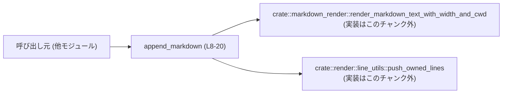
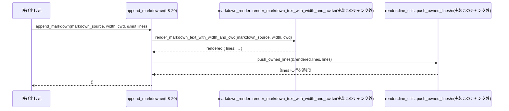

# `tui/src/markdown.rs` コード解説

---

## 0. ざっくり一言

このモジュールは、**Markdown 文字列を ratatui 用の `Line` ベクタに追記する薄いラッパ関数と、その振る舞いを確認するテスト群**で構成されています（`tui/src/markdown.rs:L4-20,22-120`）。

---

## 1. このモジュールの役割

### 1.1 概要

- このモジュールは、Markdown テキストをレンダリングし、既存の `Vec<Line<'static>>` に行として追加するための関数 `append_markdown` を提供します（`tui/src/markdown.rs:L4-20`）。
- 実際の Markdown レンダリングや行変換は、他モジュール `crate::markdown_render` と `crate::render::line_utils` に委譲されています（`tui/src/markdown.rs:L14-19`）。
- 併設されているテストは、**引用リンクの表示・インデント付きコードブロック・プレーンテキスト・番号付きリスト**などのケースで、期待するレンダリング結果になることを確認します（`tui/src/markdown.rs:L40-119`）。

### 1.2 アーキテクチャ内での位置づけ

このモジュールは、TUI 全体の中で **「Markdown レンダリング機能」へのファサード（窓口）」** として働きます。

- 呼び出し元（TUI 画面ロジックなど）は、このモジュールの `append_markdown` を呼びます。
- `append_markdown` は Markdown レンダラー `crate::markdown_render::render_markdown_text_with_width_and_cwd` を呼び出します（`tui/src/markdown.rs:L14-18`）。
- レンダリング結果に含まれる行（`rendered.lines`）を、`crate::render::line_utils::push_owned_lines` で TUI 用 `Vec<Line<'static>>` に追加します（`tui/src/markdown.rs:L19`）。

依存関係を簡略化した図は次のとおりです。



> `render_markdown_text_with_width_and_cwd` および `push_owned_lines` の実装は、このチャンクには現れません（`tui/src/markdown.rs:L14-19`）。

### 1.3 設計上のポイント

コードから読み取れる設計上の特徴は次のとおりです。

- **責務の分割**
  - `append_markdown` は「Markdown テキストを渡して、生成された行を指定のバッファに追加する」責務のみを持ち、実際のレンダリングロジックは別モジュールに委譲しています（`tui/src/markdown.rs:L14-19`）。
- **状態管理**
  - モジュール自身はグローバル状態を持たず、`append_markdown` は引数として受け取った `&mut Vec<Line<'static>>` のみを更新します（`tui/src/markdown.rs:L8-13,19`）。
- **エラーハンドリング**
  - `append_markdown` は `Result` を返さず、内部で呼んでいる関数も戻り値が `Result` ではないシグネチャに見えます（`render_markdown_text_with_width_and_cwd` の戻り値は束縛 `rendered` のみで `?` 等を使っていません。`tui/src/markdown.rs:L14-18`）。
  - したがって、エラー処理の方針は内部モジュール側に委譲され、このモジュールでは特別なエラーハンドリングは行っていません。
- **並行性**
  - `append_markdown` は同期関数であり、スレッドや async/await は使用していません（`tui/src/markdown.rs:L8-20`）。
  - 共有可変状態は `&mut Vec<Line<'static>>` のみで、排他制御は呼び出し側に任されています。

---

## 2. 主要な機能一覧

このモジュールが提供する主要な機能は次のとおりです。

- `append_markdown`: Markdown 文字列をレンダリングし、その結果の行を `Vec<Line<'static>>` に追記する（`tui/src/markdown.rs:L4-20`）。
- テストユーティリティ `lines_to_strings`: `Vec<Line<'static>>` を結合して `Vec<String>` に変換し、アサーションを行いやすくする（`tui/src/markdown.rs:L28-38`）。
- 各種テスト関数:
  - `citations_render_as_plain_text`: 「引用リンク」がプレーンテキストとして保持されることを検証（`tui/src/markdown.rs:L40-53`）。
  - `indented_code_blocks_preserve_leading_whitespace`: インデント付きコードブロックが先頭スペースを保持することを検証（`tui/src/markdown.rs:L55-63`）。
  - `append_markdown_preserves_full_text_line`: プレーンテキスト 1 行が 1 行としてレンダリングされることを検証（`tui/src/markdown.rs:L65-85`）。
  - `append_markdown_matches_tui_markdown_for_ordered_item`: 単独の番号付きリスト行が分割されないことを検証（`tui/src/markdown.rs:L87-97`）。
  - `append_markdown_keeps_ordered_list_line_unsplit_in_context`: 文脈中の番号付きリスト行が分割されないことを検証（`tui/src/markdown.rs:L99-119`）。

---

## 3. 公開 API と詳細解説

### 3.1 コンポーネント一覧（関数インベントリー）

このチャンクに現れる関数の一覧です。

| 名前 | 種別 | 役割 / 用途 | 定義位置 |
|------|------|-------------|----------|
| `append_markdown` | 関数（pub(crate)） | Markdown をレンダリングし、行を `Vec<Line<'static>>` に追記するフロント関数 | `tui/src/markdown.rs:L8-20` |
| `lines_to_strings` | 関数（テスト用） | `Vec<Line<'static>>` からスパン文字列を結合し、`Vec<String>` に変換する | `tui/src/markdown.rs:L28-38` |
| `citations_render_as_plain_text` | 関数（`#[test]`） | 引用表示のテキストが変形されないことを検証 | `tui/src/markdown.rs:L40-53` |
| `indented_code_blocks_preserve_leading_whitespace` | 関数（`#[test]`） | インデント付きコード行の先頭空白が保持されることを検証 | `tui/src/markdown.rs:L55-63` |
| `append_markdown_preserves_full_text_line` | 関数（`#[test]`） | プレーンな 1 行テキストが 1 行のままレンダリングされることを検証 | `tui/src/markdown.rs:L65-85` |
| `append_markdown_matches_tui_markdown_for_ordered_item` | 関数（`#[test]`） | 番号付きリスト行の表現が期待通りになることを検証 | `tui/src/markdown.rs:L87-97` |
| `append_markdown_keeps_ordered_list_line_unsplit_in_context` | 関数（`#[test]`） | 文脈中の番号付きリスト行が分割されないことを検証 | `tui/src/markdown.rs:L99-119` |

このモジュール内で新しい構造体や列挙体は定義されていません。

---

### 3.2 関数詳細

#### `append_markdown(markdown_source: &str, width: Option<usize>, cwd: Option<&Path>, lines: &mut Vec<Line<'static>>)`

**概要**

- Markdown ソース文字列をレンダリングし、その結果の行を `lines` ベクタの末尾に追記します（`tui/src/markdown.rs:L4-20`）。
- 実際の Markdown パース・レンダリングと、`Vec<Line<'static>>` への変換はそれぞれ `crate::markdown_render` と `crate::render::line_utils` に委譲されています（`tui/src/markdown.rs:L14-19`）。
- ドキュメントコメントによると、`cwd` を指定することで **ローカルファイルリンクの表示をセッションの作業ディレクトリに合わせる**ユースケースを想定しています（`tui/src/markdown.rs:L4-7`）。

**引数**

| 引数名 | 型 | 説明 |
|--------|----|------|
| `markdown_source` | `&str` | レンダリング対象の Markdown テキスト（`tui/src/markdown.rs:L8-9`）。 |
| `width` | `Option<usize>` | レンダリング時の幅情報を表すオプション値。詳細な意味はこのチャンクからは不明ですが、そのままレンダラーに渡されます（`tui/src/markdown.rs:L10,14-17`）。 |
| `cwd` | `Option<&Path>` | ローカルファイルリンクの解決に使うカレントディレクトリの候補。`Some` の場合、プロセスの実際のカレントディレクトリと異なっても、リンク表示を安定させる意図がドキュメントから読み取れます（`tui/src/markdown.rs:L6-7,11,14-18`）。 |
| `lines` | `&mut Vec<Line<'static>>` | レンダリングされた行を追記するバッファ。既存要素は保持され、そのまま末尾に新しい行が追加されます（`tui/src/markdown.rs:L12,19`）。 |

**戻り値**

- 戻り値はありません（`()`）。すべての出力は `lines` の更新として反映されます（`tui/src/markdown.rs:L8-13,19`）。

**内部処理の流れ（アルゴリズム）**

1. `crate::markdown_render::render_markdown_text_with_width_and_cwd` を呼び出し、`markdown_source`, `width`, `cwd` をそのまま渡してレンダリングを行います（`tui/src/markdown.rs:L14-18`）。
   - 結果は `rendered` という変数に束縛されます（`tui/src/markdown.rs:L14`）。
2. `rendered.lines` を `crate::render::line_utils::push_owned_lines` に渡し、`lines` ベクタに追記します（`tui/src/markdown.rs:L19`）。
3. 関数を終了します（`tui/src/markdown.rs:L20`）。

フローをシーケンス図で示すと次のようになります。



**Examples（使用例）**

テストコードから抜粋した、基本的な使用例です。

```rust
use ratatui::text::Line;
// append_markdown は同一クレート内から呼び出す想定です。

fn render_simple_markdown() {
    let src = "Before\n\n    code 1\n\nAfter\n"; // レンダリング対象の Markdown 文字列（L58）
    let mut out: Vec<Line<'static>> = Vec::new(); // 出力バッファを用意する（L59）

    // 幅指定なし・cwd なしでレンダリングして追記（L60）
    append_markdown(src, /* width */ None, /* cwd */ None, &mut out);

    // out にはレンダリング済みの行が順に格納される
    // テストでは、["Before", "", "    code 1", "", "After"] になることが検証されている（L61-62）
}
```

プレーンテキスト 1 行をレンダリングする例（テストより）:

```rust
fn render_single_line() {
    let src = "Hi! ... specific change?\n"; // 1 行だけのプレーンテキスト（L67）
    let mut out = Vec::new();

    append_markdown(src, None, None, &mut out); // L69

    // out.len() == 1 が期待されている（L70-73）
    assert_eq!(out.len(), 1);

    // 出力行の全スパンを連結した文字列が元のテキストと等しいことが検証されている（L75-84）
}
```

**Errors / Panics**

- この関数は `Result` を返さず、`?` や `unwrap` なども使っていません（`tui/src/markdown.rs:L8-20`）。
- したがって、エラーやパニックが起こりうるとすれば、それは
  - `render_markdown_text_with_width_and_cwd` 内部、
  - `push_owned_lines` 内部
  に起因しますが、その挙動はこのチャンクには現れません（`tui/src/markdown.rs:L14-19`）。
- 本モジュールのコードだけからは、どの入力でエラーになるかを判断することはできません。

**Edge cases（エッジケース）**

テストから読み取れるエッジケースと、その挙動（少なくとも現行実装とテストの前提）を列挙します。

- **引用リンクのようなテキスト**
  - 入力: `"Before 【F:/x.rs†L1】\nAfter 【F:/x.rs†L3】\n"`（`tui/src/markdown.rs:L42`）
  - 挙動: 出力行は `"Before 【F:/x.rs†L1】"` と `"After 【F:/x.rs†L3】"` の 2 行で、テキストは変形されないことがテストで期待されています（`tui/src/markdown.rs:L45-52`）。
- **インデント付きコードブロック**
  - 入力: `"Before\n\n    code 1\n\nAfter\n"`（`tui/src/markdown.rs:L58`）
  - 挙動: 出力行の 3 行目が `"    code 1"` となり、先頭 4 スペースがそのまま保持されることが期待されています（`tui/src/markdown.rs:L61-62`）。
- **プレーンテキスト 1 行**
  - 入力: 長い 1 行の文字列（`tui/src/markdown.rs:L67`）
  - 挙動: 出力は 1 行のみで、内容が完全に一致することが期待されています（`tui/src/markdown.rs:L70-84`）。
- **番号付きリスト（単独行）**
  - 入力: `"1. Tight item\n"`（`tui/src/markdown.rs:L90-91`）
  - 挙動: 出力が `"1. Tight item"` という 1 行になり、`"1."` と `"Tight item"` に分割されないことが期待されています（`tui/src/markdown.rs:L95-97`）。
- **番号付きリスト（前に文脈行がある場合）**
  - 入力: `"Loose vs. tight list items:\n1. Tight item\n"`（`tui/src/markdown.rs:L102`）
  - 挙動:
    - 行のどこかに `"1. Tight item"` がそのまま存在する（`tui/src/markdown.rs:L111`）。
    - `["1.", "Tight item"]` という 2 行の組み合わせが出現しないこと（`tui/src/markdown.rs:L115-118`）。

これらは **テストで期待されている挙動** であり、`append_markdown` 単体ではなく、依存モジュールを含む全体の振る舞いとして成立しています。

**使用上の注意点**

- **追記のみでクリアはしない**
  - 関数内部では `lines.clear()` のような操作は行っておらず、`push_owned_lines` で追記するだけです（`tui/src/markdown.rs:L19`）。
  - 既存の表示内容を完全に置き換えたい場合、呼び出し側で `lines.clear()` を行う必要があります。
- **幅 (`width`) とカレントディレクトリ (`cwd`) はそのまま委譲される**
  - `width` と `cwd` はそのままレンダラーに渡されており、この関数では追加の加工をしていません（`tui/src/markdown.rs:L14-18`）。
  - ドキュメントコメントにあるとおり、ストリーミング表示と非ストリーミング表示で相対パス表記を揃えたい場合、呼び出し側が適切な `cwd` を渡す必要があります（`tui/src/markdown.rs:L4-7`）。
- **並行呼び出し**
  - 引数に `&mut Vec<Line<'static>>` を取るため、コンパイラが同一ベクタへの同時可変アクセスを静的に防ぎます。
  - 同じ `lines` を複数スレッドから操作する場合は、呼び出し側で `Mutex` などによる排他制御が必要になります（このモジュール内にはそのような制御はありません）。

---

#### `lines_to_strings(lines: &[Line<'static>]) -> Vec<String>`

**概要**

- `Line<'static>` の配列から、各行の全スパン (`spans`) の `content` を結合し、1 行ごとに `String` として返すテスト用ユーティリティです（`tui/src/markdown.rs:L28-38`）。
- テストで、レンダリング結果が期待する文字列列と一致するかどうかを検証するために使われています（例: `tui/src/markdown.rs:L45,61,96,106`）。

**引数**

| 引数名 | 型 | 説明 |
|--------|----|------|
| `lines` | `&[Line<'static>]` | Markdown レンダリング後の行配列への参照（`tui/src/markdown.rs:L28`）。 |

**戻り値**

- `Vec<String>`: 各 `Line` の `spans` に含まれる `content` を連結した文字列の配列です（`tui/src/markdown.rs:L29-37`）。

**内部処理の流れ**

1. `lines.iter()` で `Line` のスライスを反復します（`tui/src/markdown.rs:L29-30`）。
2. 各 `Line` について、`l.spans.iter()` でスパンを反復し、`s.content.clone()` で内容を複製します（`tui/src/markdown.rs:L31-35`）。
3. スパンごとの文字列を `collect::<String>()` で 1 つの `String` に結合します（`tui/src/markdown.rs:L35`）。
4. それぞれの行に対して得られた `String` を `collect()` で `Vec<String>` にまとめて返します（`tui/src/markdown.rs:L37`）。

**Examples（使用例）**

テスト内での使用例:

```rust
let mut out = Vec::new();
append_markdown(src, None, None, &mut out); // Markdown をレンダリング（L44,60,69,90,104）

let rendered = lines_to_strings(&out);      // 行を Vec<String> に変換（L45,61,96,106）
// rendered を assert_eq! の対象として利用する（L46-52,62,97）
```

**Errors / Panics**

- `lines_to_strings` はエラーを返さず、内部でも `unwrap` などは使用していません（`tui/src/markdown.rs:L28-38`）。
- パニックが発生するとすれば、`Line` や `Span` の実装が `content.clone()` や `collect::<String>()` 中にパニックする場合ですが、その詳細はこのチャンクからは分かりません。

**Edge cases**

- `lines` が空スライスであれば、単に空の `Vec<String>` が返されます（イテレータの通常の挙動からの推論。コード上で特別扱いはありません。`tui/src/markdown.rs:L29-37`）。
- 各 `Line` にスパンが 0 個の場合、その行は空文字列として処理されます（`spans.iter()` が空で `collect::<String>()` すると空文字列になるため。`tui/src/markdown.rs:L31-36`）。

**使用上の注意点**

- 本関数は `#[cfg(test)] mod tests` 内に定義されており、通常のビルドではコンパイルされません（`tui/src/markdown.rs:L22-27`）。
- 実運用コードでの利用を意図したものではなく、テスト補助としての利用に限定されます。

---

### 3.3 その他の関数（テスト）

補助的な（テスト用）関数をまとめます。

| 関数名 | 役割（1 行） | 定義位置 |
|--------|--------------|----------|
| `citations_render_as_plain_text` | 引用形式のテキストがプレーンテキストとして保持されることを検証する | `tui/src/markdown.rs:L40-53` |
| `indented_code_blocks_preserve_leading_whitespace` | インデント付きコード行の先頭スペースが保たれることを検証する | `tui/src/markdown.rs:L55-63` |
| `append_markdown_preserves_full_text_line` | プレーンテキスト 1 行が 1 行のまま保持されることを検証する | `tui/src/markdown.rs:L65-85` |
| `append_markdown_matches_tui_markdown_for_ordered_item` | 単独行の番号付きリストが分割されないことを検証する | `tui/src/markdown.rs:L87-97` |
| `append_markdown_keeps_ordered_list_line_unsplit_in_context` | 前後に文脈行がある番号付きリスト行が分割されないことを検証する | `tui/src/markdown.rs:L99-119` |

これらはいずれも `append_markdown` の期待される振る舞い（契約）を具体的な入力例でチェックする役割を持ちます。

---

## 4. データフロー

代表的な処理シナリオとして、「Markdown テキストを TUI 表示用の行に変換してバッファに追記する」流れを示します。

1. 呼び出し元が `markdown_source`（Markdown テキスト）と `lines`（既存の行バッファ）を用意する。
2. `append_markdown(markdown_source, width, cwd, &mut lines)` を呼び出す（`tui/src/markdown.rs:L8-13`）。
3. `append_markdown` が `render_markdown_text_with_width_and_cwd` で Markdown をレンダリングし（`tui/src/markdown.rs:L14-18`）、行情報を取得する。
4. その行情報を `push_owned_lines` で `lines` ベクタに追記する（`tui/src/markdown.rs:L19`）。
5. 呼び出し元は更新された `lines` を TUI 上に描画する（描画部分はこのチャンクには現れません）。

シーケンス図は 3.2 に記載したとおりです（`append_markdown (L8-20)` の流れ）。

---

## 5. 使い方（How to Use）

### 5.1 基本的な使用方法

`append_markdown` を使って、Markdown テキストを TUI 用行バッファに追記する基本的な流れです。

```rust
use ratatui::text::Line;
// append_markdown がこのモジュール内にある前提の例です。

fn main() {
    // 1. 入力となる Markdown テキストを用意する
    let markdown_source = "Before\n\n    code 1\n\nAfter\n"; // L58

    // 2. 出力用の Vec<Line<'static>> を用意する
    let mut lines: Vec<Line<'static>> = Vec::new();

    // 3. Markdown をレンダリングして行を追記する
    append_markdown(markdown_source, /* width */ None, /* cwd */ None, &mut lines); // L60

    // 4. `lines` を TUI のレンダリング処理に渡して描画する
    //    （描画処理はこのファイルには含まれていません）
}
```

ポイント:

- `lines` は呼び出し元で初期化し、可変参照で渡します（`tui/src/markdown.rs:L12`）。
- 既存の行がある場合、その末尾に Markdown レンダリング結果が追記されます（`tui/src/markdown.rs:L19`）。

### 5.2 よくある使用パターン

コードから確実に読み取れる範囲で、典型的なパターンを整理します。

1. **幅指定なし / カレントディレクトリ指定なし**

   テストではすべて `width: None`, `cwd: None` で呼び出しており（`tui/src/markdown.rs:L44,60,69,90,104`）、この形が基本形と言えます。

   ```rust
   let mut out = Vec::new();
   append_markdown("1. Tight item\n", None, None, &mut out); // L90-94
   ```

2. **セッションごとの `cwd` を揃える用途**

   ドキュメントコメントにあるように、セッションのワーキングディレクトリを別途管理している場合、その `cwd` を渡すことで「ストリーミング時と非ストリーミング時で相対パスの見え方を揃える」ことが想定されています（`tui/src/markdown.rs:L4-7`）。  
   このチャンクには具体的な呼び出し例はありませんが、`cwd` が `Option<&Path>` であることから、`Some(session_cwd)` / `None` を切り替える使い方が考えられます（仕様の詳細はこのチャンクからは断定できません）。

### 5.3 よくある間違い（想定される誤用と正しいパターン）

コード上確認できる振る舞いに基づき、起こりうる誤用と注意点を整理します。

```rust
// 誤りの例: 既存行を消したいのに append_markdown だけを呼ぶ
let mut lines = vec![/* すでに何行かある */];
append_markdown("# New", None, None, &mut lines);
// → この時点で、元の行 + 新しい Markdown の行がすべて残る（L19）

// 正しい例: 古い内容を消してから新しい Markdown を描画したい場合
let mut lines = vec![/* すでに何行かある */];
lines.clear(); // 古い行を破棄（この操作は呼び出し側で行う必要がある）
append_markdown("# New", None, None, &mut lines);
```

- `append_markdown` 内に `clear` や再割り当ての処理はなく、`push_owned_lines` で追記するのみです（`tui/src/markdown.rs:L19`）。  
  既存内容の置き換えを期待すると、行が増え続けてしまう可能性があります。

### 5.4 使用上の注意点（まとめ）

- **前提条件**
  - `lines` に対して有効な可変参照を持っていること（コンパイル時に保証されます）。
  - `markdown_source` が有効な UTF-8 文字列であること（`&str` の性質）。
- **禁止事項 / 注意**
  - 同じ `Vec<Line<'static>>` を複数のスレッドから同時に書き換える場合、この関数だけでは安全性は確保されません。スレッド間共有時は `Mutex<Vec<Line<'static>>>` などを使った排他制御が必要です。
- **エラー・パニック**
  - 本モジュール内では明示的なエラー処理がなく、依存関数に起因するパニックをこの関数では捕捉しません（`tui/src/markdown.rs:L14-19`）。
- **パフォーマンス**
  - 処理内容は Markdown レンダリング + `Vec` への追記であり、時間計算量は少なくとも入力テキスト長に比例すると考えられます（一般的なレンダリング処理の特性。詳しいアルゴリズムはこのチャンクには出てきません）。
  - 高頻度で大量のテキストをレンダリングする場合は、レンダラーや `push_owned_lines` の実装側のコストも考慮する必要があります。

---

## 6. 変更の仕方（How to Modify）

### 6.1 新しい機能を追加する場合

このモジュールは薄いラッパであり、機能拡張の多くは他モジュールで行うのが自然です。

- **Markdown レンダリングのスタイルや解釈を変えたい場合**
  - `append_markdown` は単に `render_markdown_text_with_width_and_cwd` を呼び出しているだけなので（`tui/src/markdown.rs:L14-18`）、具体的なレンダリング仕様を変更する場合は `crate::markdown_render` 側を変更するのが自然です（実装はこのチャンクには現れません）。
- **行の追加方法（色付けや結合方法）を変えたい場合**
  - `push_owned_lines` の実装に手を入れる必要があります（`tui/src/markdown.rs:L19`）。
- **append_markdown に新たなオプションを追加したい場合**
  1. `append_markdown` の引数に新しいパラメータを追加する（`tui/src/markdown.rs:L8-13`）。
  2. その値を `render_markdown_text_with_width_and_cwd` または `push_owned_lines` に渡すようにする（`tui/src/markdown.rs:L14-19`）。
  3. 既存の呼び出し箇所（このファイル外）をすべてアップデートする。
  4. このファイル内のテストも必要に応じて更新する（`tui/src/markdown.rs:L40-119`）。

### 6.2 既存の機能を変更する場合

`append_markdown` の振る舞いを変えるときに注意すべき点です。

- **影響範囲の確認**
  - このモジュール内のテスト関数は、`append_markdown` の具体的な振る舞い（インデント保持・行分割の有無など）を前提にしています（`tui/src/markdown.rs:L40-53,55-63,65-85,87-97,99-119`）。
  - 仕様変更によりこれらの期待が変わる場合、テストの修正または追加が必要です。
- **契約の維持**
  - 特に次の性質はテストで明示されているため、変更時には意図を明確にする必要があります。
    - 引用テキストがプレーンに保持されること（`tui/src/markdown.rs:L40-53`）。
    - インデント付きコードの先頭空白が保持されること（`tui/src/markdown.rs:L55-63`）。
    - プレーンテキスト 1 行が 1 行のままレンダリングされること（`tui/src/markdown.rs:L65-85`）。
    - 番号付きリスト行が意図せず分割されないこと（`tui/src/markdown.rs:L87-97,99-119`）。
- **テストコードの確認**
  - 仕様変更後は、少なくともこのファイル内の 5 つのテストすべてが意図通りの仕様をカバーしているかを確認する必要があります（`tui/src/markdown.rs:L40-119`）。

---

## 7. 関連ファイル

このモジュールと密接に関係するモジュール／テスト要素です。

| パス / モジュール | 役割 / 関係 |
|------------------|------------|
| `crate::markdown_render` | `render_markdown_text_with_width_and_cwd` を提供するモジュール。Markdown テキストを中間表現（`rendered.lines` を含む構造）に変換します（呼び出しのみがこのチャンクに現れます。`tui/src/markdown.rs:L14-18`）。実際のファイルパスはこのチャンクには現れません。 |
| `crate::render::line_utils` | `push_owned_lines` を提供するモジュール。`rendered.lines` から `Vec<Line<'static>>` に行を追記する責務を持ちます（呼び出しのみがこのチャンクに現れます。`tui/src/markdown.rs:L19`）。 |
| `tui/src/markdown.rs`（`mod tests` 内） | `append_markdown` の挙動を検証する 5 つの単体テストを含むモジュール（`tui/src/markdown.rs:L22-120`）。 |

このチャンクには上記関連モジュールの実装は含まれておらず、詳細な仕様や内部アルゴリズムは不明です。そのため、本レポートでは `append_markdown` から見えるインターフェースとテストで示される期待値の範囲に限定して説明しています。
