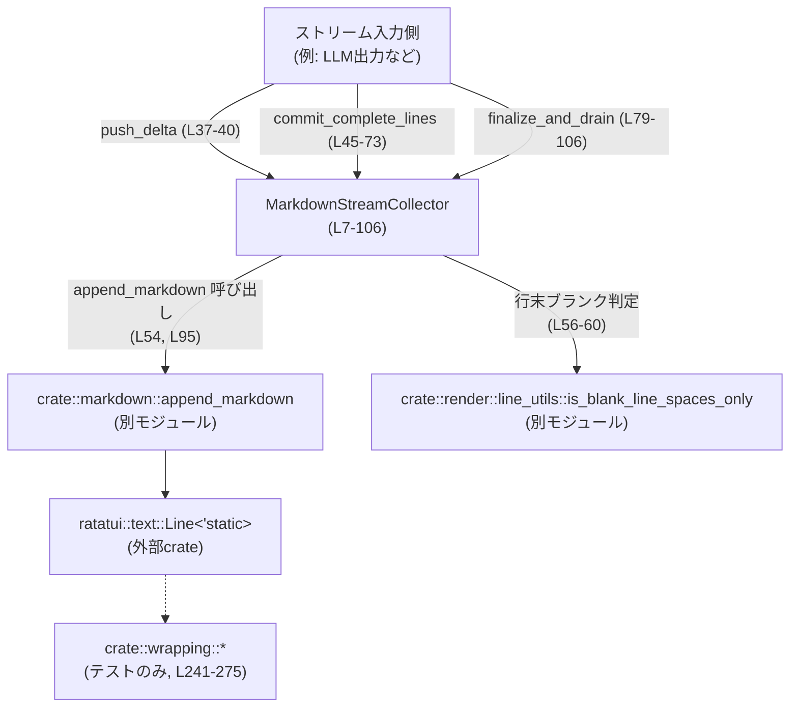
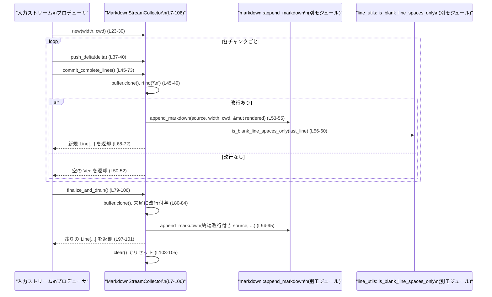

# tui/src/markdown_stream.rs コード解説

---

## 0. ざっくり一言

Markdown のストリーム（チャンクごとの文字列）を受け取り、**改行で区切られた「論理行」が完成したタイミングでだけ ratatui の `Line` にレンダリングして返すためのコレクタ**です（`MarkdownStreamCollector`、`tui/src/markdown_stream.rs:L7-106`）。

---

## 1. このモジュールの役割

### 1.1 概要

- このモジュールは **ストリーミング入力の Markdown 文字列**を扱い、  
  **「完全に終端した行」だけをレンダリングしてクライアントに渡す**役割を持ちます。
- 内部では常にバッファ全体を `crate::markdown::append_markdown` に渡して再レンダリングし、  
  前回までに返した行数を基準に「新しく増えた行のみ」を返却します（`commit_complete_lines`、`L45-73`）。
- ストリーム終了時には、末尾に改行が無くても一時的に改行を補って最終行までをレンダリングし、状態をリセットします（`finalize_and_drain`、`L79-106`）。

### 1.2 アーキテクチャ内での位置づけ

主な依存関係とデータの流れは以下のようになっています。



- 本モジュールは **状態を持つストリームコレクタ**のみを提供し、  
  実際の Markdown → `Line` 変換は `crate::markdown` に委譲しています（`L54`, `L95`）。
- ブランク行（空行 / スペースだけの行）の扱いの調整には `crate::render::line_utils` を利用しています（`L56-60`）。
- テストでは、さらに `crate::wrapping` を用いて折り返し時のスタイル維持を検証しています（`L241-248`）。

### 1.3 設計上のポイント

- **状態管理**
  - 内部に `buffer: String` と `committed_line_count: usize` を持ち、  
    「これまでレンダリングして返した行数」を記録します（`L10-11`）。
  - 幅 `width` と作業ディレクトリ `cwd` はコンストラクタで固定し、ストリームのライフタイムを通じて保持します（`L12-13`, `L23-30`）。
- **ストリーミング設計**
  - `push_delta` で生テキストを末尾に追加するだけで、解析は行いません（`L37-40`）。
  - `commit_complete_lines` の呼び出し時にのみ、バッファ全体を Markdown としてレンダリングし、  
    「最後の改行まで」「最後の空行は未完扱い」というポリシーで新規行を返します（`L45-62`）。
- **安全性・エラーハンドリング**
  - すべて安全な Rust コードで書かれており、`Result` は返さずパニックになりうる箇所も明示的にはありません。
  - `Vec` のスライス範囲は `committed_line_count` と `complete_line_count` の大小関係でガードされており、  
    範囲外アクセスを避けています（`L55-66`, `L97-101`）。
- **並行性**
  - すべてのメソッドは `&mut self` を取る同期メソッドであり、  
    1 インスタンスは単一スレッド（あるいは外側でロックされた文脈）からの利用を前提とする構造になっています。
- **テストの厚さ**
  - 様々な Markdown 構造（引用、リスト、フェンスコード、HTML ブロック、UTF-8 境界など）に対して  
    「ストリーミング結果」と「一括レンダリング結果」が一致することを多数のテストで検証しています（`L419-724`）。

---

## 2. 主要な機能一覧

### 2.1 コンポーネント一覧（インベントリ）

| 名前 | 種別 | 行範囲 | 役割 / 用途 |
|------|------|--------|-------------|
| `MarkdownStreamCollector` | 構造体 | `tui/src/markdown_stream.rs:L7-14` | Markdown ストリームを蓄積し、行単位でレンダリング結果を取り出すためのコレクタ |
| `MarkdownStreamCollector::new` | メソッド | `L17-30` | レンダリング幅と作業ディレクトリを固定してコレクタを構築する |
| `MarkdownStreamCollector::clear` | メソッド | `L32-35` | 内部バッファとコミット済み行数をリセットし、同じ設定で新しいストリームを開始できるようにする |
| `MarkdownStreamCollector::push_delta` | メソッド | `L37-40` | 新しい Markdown 文字列チャンクを内部バッファ末尾に追加する |
| `MarkdownStreamCollector::commit_complete_lines` | メソッド | `L42-73` | バッファ全体をレンダリングし、「最後の改行まで」「最後の空行を除く」新規行だけを返す |
| `MarkdownStreamCollector::finalize_and_drain` | メソッド | `L75-106` | ストリームを終了し、末尾に改行がなくても全行をレンダリングして未出力分を返し、状態をリセットする |
| `test_cwd` | 関数（テストのみ） | `L109-114` | テスト用に安定した絶対パスの作業ディレクトリ (`std::env::temp_dir`) を返す |
| `simulate_stream_markdown_for_tests` | 関数（テストのみ） | `L117-133` | 複数のチャンクを順に `push_delta` と `commit_complete_lines` に流し込み、必要なら `finalize_and_drain` を呼ぶテスト用ヘルパ |
| `tests` モジュール | モジュール（テストのみ） | `L135-724` | ストリーミングと一括レンダリングの一致性、スタイル保持、UTF-8 安全性などを検証する多数の `#[tokio::test]` を含む |

### 2.2 提供機能の概要

- ストリーム蓄積とチャンク追加: `push_delta` で逐次 Markdown 文字列を追加（`L37-40`）。
- 完全行のコミット:
  - 改行で終端した行をまとめてレンダリングし、前回コミット以降に増えた行だけを返す（`commit_complete_lines`, `L45-73`）。
- ストリームの終了処理:
  - 末尾が改行で終わっていなくても補完してレンダリングし、残りの行を返して内部状態をリセットする（`finalize_and_drain`, `L79-106`）。
- テスト用ストリームシミュレーション:
  - 任意のチャンク列でストリーミングレンダリングをシミュレーションする関数（`simulate_stream_markdown_for_tests`, `L117-133`）。

---

## 3. 公開 API と詳細解説

### 3.1 型一覧

| 名前 | 種別 | 行範囲 | 役割 / 用途 |
|------|------|--------|-------------|
| `MarkdownStreamCollector` | 構造体 | `L7-14` | Markdown ストリームのテキストと進捗（コミット済み行数）を保持し、ratatui `Line` へのレンダリングを管理する |

フィールドの概要（`L10-13`）:

- `buffer: String`  
  これまでに受け取った Markdown 文字列すべてを連結したバッファです。
- `committed_line_count: usize`  
  直近のコミットまでにクライアントへ返した論理行数を記録します。
- `width: Option<usize>`  
  レンダリング時の幅（折り返し幅など）を `crate::markdown::append_markdown` に渡すための値です。`None` の場合の意味は他モジュール側の実装に依存します。
- `cwd: PathBuf`  
  相対パスのローカルファイルリンクの表示に利用される作業ディレクトリです。コンストラクタでスナップショットされます（`L17-22`, `L23-29`）。

### 3.2 重要な関数詳細

#### `MarkdownStreamCollector::new(width: Option<usize>, cwd: &Path) -> Self`  （`L17-30`）

**概要**

- 指定されたレンダリング幅と作業ディレクトリを使う `MarkdownStreamCollector` を生成します。
- `cwd` は `PathBuf` にコピーされ、ストリームのライフタイムを通じて固定されます（`L23-29`）。

**引数**

| 引数名 | 型 | 説明 |
|--------|----|------|
| `width` | `Option<usize>` | Markdown をレンダリングする際の幅。`Some(w)` のとき `w` 文字幅、`None` のときの扱いは `append_markdown` に依存します。 |
| `cwd` | `&Path` | ローカルファイルリンクの解決などに使われる作業ディレクトリ。コンストラクタ内で `PathBuf` にコピーされます。 |

**戻り値**

- 新しい `MarkdownStreamCollector`。`buffer` は空文字列、`committed_line_count` は 0 に初期化されます（`L25-27`）。

**内部処理の流れ**

1. `buffer` を空の `String` で初期化（`L25`）。
2. `committed_line_count` を 0 に設定（`L26`）。
3. `width` をそのままフィールドに保存（`L27`）。
4. `cwd` を `to_path_buf()` でコピーし、フィールドに保存（`L28`）。

**Examples（使用例）**

```rust
use std::path::Path;
use tui::markdown_stream::MarkdownStreamCollector; // 実際のパスはcrate構成に依存

// カレントディレクトリを基準に幅指定なしでコレクタを作成する例
let cwd = std::env::current_dir().expect("cwd");
let mut collector = MarkdownStreamCollector::new(None, cwd.as_path());

// ここから push_delta / commit_complete_lines を呼び出してストリーム処理を行う
```

**Errors / Panics**

- 関数自体は `Result` を返さず、明示的なパニックもありません。
- 内部では `String::new` と `PathBuf` の確保のみのため、通常はメモリアロケーション失敗（OOM）の場合を除きパニック要因はありません。

**Edge cases（エッジケース）**

- `cwd` に無効なパスが渡されたとしても、この関数は検証を行わず、そのまま `PathBuf` として保持します。リンク解決時の挙動は `append_markdown` 側に依存します（このファイルのコードからは詳細不明）。

**使用上の注意点**

- ドキュメントコメントに「同じ `cwd` をストリームライフサイクル全体で再利用すべき」とあります（`L19-22`）。  
  これは、ストリームの途中で CWD を変えると同じリンクのレンダリング結果が変わる可能性があるためです。

---

#### `MarkdownStreamCollector::push_delta(&mut self, delta: &str)`  （`L37-40`）

**概要**

- 受け取った Markdown テキストチャンクを、内部バッファの末尾にそのまま追加します。
- 自身では改行や Markdown 構文の解析を一切行いません。

**引数**

| 引数名 | 型 | 説明 |
|--------|----|------|
| `delta` | `&str` | 追加する Markdown 文字列チャンク。UTF-8 であることを前提とします。 |

**戻り値**

- なし（`()`）。

**内部処理の流れ**

1. `tracing::trace!` で `delta` の内容をトレースログに出力します（`L38`）。
2. `self.buffer.push_str(delta)` で内部バッファ末尾に連結します（`L39`）。

**Examples（使用例）**

```rust
// コレクタにチャンクを 2 回追加する例
collector.push_delta("Hello, ");
collector.push_delta("world!\n");

// 必要に応じて commit_complete_lines を呼ぶ
let new_lines = collector.commit_complete_lines();
```

**Errors / Panics**

- 明示的なエラー／パニックはありません。
- `push_str` による再割り当てでメモリ不足が起きた場合は Rust ランタイムによるパニックが起きる可能性があります。

**Edge cases（エッジケース）**

- `delta` が空文字列でも、そのままログだけ出力され、バッファは変化しません。
- `delta` がマルチバイト文字の途中で切れていても（例: UTF-8 の途中バイト）、この関数はそれを検証しません。  
  ただし、後続チャンクで残りが補われ、全体としては有効な UTF-8 になる前提で設計されています。  
  テスト `utf8_boundary_safety_and_wide_chars` でその前提の下での挙動が検証されています（`L428-460`）。

**使用上の注意点**

- 文字列境界（UTF-8 コードポイントの途中）でチャンクが分かれてもテストでは問題ないことが確認されていますが（`L428-460`）、  
  生バイト列を `&str` に変換するようなコードは、別途 UTF-8 の妥当性を保証する必要があります。

---

#### `MarkdownStreamCollector::commit_complete_lines(&mut self) -> Vec<Line<'static>>`  （`L42-73`）

**概要**

- 内部バッファ全体を Markdown としてレンダリングし、「**最後の改行までに完全に終端した行**」だけを `Vec<Line<'static>>` として返します。
- すでに前回までに返した行は `committed_line_count` で記録されており、今回は新しく増えた行だけが返されます。

**引数**

- なし（`&mut self` のみ）。

**戻り値**

- 新たに完成した論理行の `Vec<ratatui::text::Line<'static>>`。  
  新しく完成した行が無い場合は空ベクタになります（`L64-66`）。

**内部処理の流れ**

1. `self.buffer` を `clone` して `source` としてローカルに持ちます（`L45-46`）。
2. `source.rfind('\n')` で最後の改行位置を検索します（`L47`）。
   - 見つかった場合: その位置まで（改行を含む）を `source[..=last_newline_idx].to_string()` で切り出します（`L48-49`）。
   - 見つからない場合: まだ 1 行も完了していないとみなし、空の `Vec` を返します（`L50-52`）。
3. 空の `rendered: Vec<Line<'static>>` を用意し、`markdown::append_markdown` に `&source` を渡してレンダリングします（`L53-55`）。
4. `complete_line_count` を `rendered.len()` で初期化し（`L55`）、  
   最後の行が「スペースのみのブランク行」の場合は 1 行分減算します（`L56-61`）。  
   - ブランク判定には `crate::render::line_utils::is_blank_line_spaces_only` を使用（`L56-60`）。
5. すでにコミット済み行数 `self.committed_line_count` が `complete_line_count` 以上であれば、  
   新規行は無いとみなし空の `Vec` を返します（`L64-66`）。
6. そうでない場合は、`rendered[self.committed_line_count..complete_line_count]` のスライスを `to_vec()` して返します（`L68-72`）。
7. 同時に `self.committed_line_count` を `complete_line_count` に更新します（`L71`）。

**Examples（使用例）**

```rust
use ratatui::text::Line;

// コレクタの初期化
let cwd = std::env::current_dir().unwrap();
let mut c = MarkdownStreamCollector::new(None, cwd.as_path());

// 改行を含まない状態でコミット → 何も返らない
c.push_delta("Hello, world");
assert!(c.commit_complete_lines().is_empty());

// 改行を追加して行を完成させる
c.push_delta("!\n");
let lines: Vec<Line<'static>> = c.commit_complete_lines();
assert_eq!(lines.len(), 1);
```

※ 上記パターンはテスト `no_commit_until_newline` と同等の挙動です（`L140-149`）。

**Errors / Panics**

- 範囲外アクセスを防ぐために `if self.committed_line_count >= complete_line_count { return Vec::new(); }` でガードしています（`L64-66`）。
- `markdown::append_markdown` は `Result` ではなく副作用で `rendered` を埋める API のため、ここではエラー処理を行っていません（`L53-55`）。
- 通常運用では、範囲外スライスや明示的なパニック箇所は見当たりません。

**Edge cases（エッジケース）**

- **改行が 1 つも含まれない場合**: 早期に `Vec::new()` が返り、`committed_line_count` も更新されません（`L47-52`）。
- **レンダリング結果が末尾に空行を含む場合**:  
  その空行は「未完成のセパレータ」とみなされ、今回のコミットから除外されます（`L55-62`）。  
  これは、段落の境界などで Markdown レンダラが挿入する空行を扱うためと推測されますが、  
  詳細な意図はコメントには明記されていません。
- **同じソースに対して繰り返し呼び出した場合**:  
  新たな改行が無い限り `complete_line_count` は増えず、2 回目以降は空ベクタが返ります（`L64-66`）。

**使用上の注意点**

- このメソッドは毎回 `self.buffer.clone()` と `String::to_string()` によるコピーを行うため、  
  長大なストリームで高頻度に呼び出す場合はメモリ割り当てコストが増加します（`L45-49`）。
- ストリーム完了時の最終行（改行で終わらない行）は、このメソッドでは返されません。  
  その場合は `finalize_and_drain` を併用する必要があります（`L79-106`）。

---

#### `MarkdownStreamCollector::finalize_and_drain(&mut self) -> Vec<Line<'static>>`  （`L75-106`）

**概要**

- ストリームの終了時に呼び出し、内部バッファの残り（未コミット分）をすべてレンダリングして返します。
- バッファ末尾が改行で終わっていなくても一時的な改行を追加し、最終行までを確実にレンダリングします（`L81-84`）。
- 実行後は `clear()` を呼び出して buffer と `committed_line_count` をリセットします（`L103-105`）。

**引数**

- なし（`&mut self` のみ）。

**戻り値**

- これまでに返していない残りの行の `Vec<Line<'static>>`。  
  すでに全行がコミット済みの場合は空ベクタです（`L97-101`）。

**内部処理の流れ**

1. `self.buffer` を `raw_buffer` としてクローンし（`L80`）、さらに `source` にクローンします（`L81`）。
2. `source` が `'\n'` で終わっていなければ末尾に 1 文字追加します（`L82-84`）。
3. `tracing::debug!` および `tracing::trace!` で、元の長さと改行追加後の長さ、ソース本体をログ出力します（`L85-92`）。
4. 空の `rendered` ベクタを用意し、`markdown::append_markdown` で `source` をレンダリングします（`L94-95`）。
5. すでに `self.committed_line_count` が `rendered.len()` 以上であれば空ベクタを返します（`L97-99`）。
6. そうでない場合は、`rendered[self.committed_line_count..].to_vec()` を返します（`L100-101`）。
7. 最後に `self.clear()` を呼び、内部バッファとコミット済み行数をリセットします（`L103-105`）。

**Examples（使用例）**

```rust
// 改行なしで終わる 1 行の入力
let cwd = std::env::current_dir().unwrap();
let mut c = MarkdownStreamCollector::new(None, cwd.as_path());

c.push_delta("Line without newline");
// commit_complete_lines ではまだ何も返らない可能性がある
let interim = c.commit_complete_lines();
assert!(interim.is_empty());

// finalize_and_drain で最終行を取得できる
let final_lines = c.finalize_and_drain();
assert_eq!(final_lines.len(), 1);

// finalize の後は buffer と行数がクリアされる
assert!(c.commit_complete_lines().is_empty());
```

※ テスト `finalize_commits_partial_line` がこのケースを確認しています（`L151-157`）。

**Errors / Panics**

- `commit_complete_lines` 同様、`markdown::append_markdown` からのエラーは返されません。
- 範囲外スライスを防ぐために `if self.committed_line_count >= rendered.len()` でガードしています（`L97-99`）。

**Edge cases（エッジケース）**

- **途中までコミット済みの場合**:  
  すでに `commit_complete_lines` で一部行を返している場合でも、  
  `self.committed_line_count` を基準に残りの行だけが返されます（`L97-101`）。
- **何も追加されていない場合**:  
  `rendered.len()` が 0 かつ `self.committed_line_count` も 0 なので、空ベクタが返されます。
- **末尾が空行で終わる場合**:  
  `commit_complete_lines` とは異なり、ここでは末尾のブランク行を特別扱いしていません。  
  実際にどのような行が返るかは `append_markdown` の挙動に依存します。

**使用上の注意点**

- このメソッドは「ストリームの終了」を意味しており、呼び出し後に同じコレクタを新しいストリームで再利用する場合、`buffer` は空になりますが `width` と `cwd` は保持されます（`L32-35`, `L103-105`）。
- ドキュメントコメント中に「Optionally unwraps ```markdown language fences in non-test builds」とありますが（`L75-78`）、  
  このファイル内にはその処理は存在せず、`append_markdown` 側の実装に依存していると考えられます。ただし、コードからは断定できません。

---

#### `simulate_stream_markdown_for_tests(deltas: &[&str], finalize: bool) -> Vec<Line<'static>>`  （テスト専用, `L117-133`）

**概要**

- テスト用のユーティリティ関数で、複数の文字列チャンク `deltas` を順に `MarkdownStreamCollector` に流し込み、  
  改行を含むチャンクごとに `commit_complete_lines` を呼び出すことで、ストリーミングレンダリングをシミュレートします。
- `finalize` が `true` の場合は最後に `finalize_and_drain` を呼びます（`L129-131`）。

**引数**

| 引数名 | 型 | 説明 |
|--------|----|------|
| `deltas` | `&[&str]` | ストリームとして順に追加するチャンク列。 |
| `finalize` | `bool` | 最後に `finalize_and_drain` を呼ぶかどうか。 |

**戻り値**

- ストリーミング処理を通じて得られた全ての `Line<'static>` のベクタ。

**内部処理の流れ**

1. `test_cwd()` でテスト用の作業ディレクトリを取得し（`L121`）、`width = None` でコレクタを生成します。
2. `deltas` を順にループし、各チャンクを `collector.push_delta(d)` で追加します（`L123-124`）。
3. そのチャンク `d` に `'\n'` が含まれていれば、その時点で `commit_complete_lines` を呼び、得られた行を `out` に追加します（`L125-127`）。
4. ループ終了後、`finalize` が `true` であれば `finalize_and_drain` を呼び、その結果も `out` に追加します（`L129-131`）。
5. 最終的な `out` を返します（`L132`）。

**Examples（使用例）**

テストコード内での利用例（`L160-167`）:

```rust
let out = super::simulate_stream_markdown_for_tests(&["> Hello\n"], /*finalize*/ true);
assert_eq!(out.len(), 1);
```

**Errors / Panics**

- 本関数自体はエラーを返しません。
- 内部の `append_markdown` などからパニックが起きる可能性は、このファイルのコードからは判断できません。

**Edge cases（エッジケース）**

- `deltas` のどの要素にも `'\n'` が含まれていない場合、`commit_complete_lines` は一度も呼ばれず、  
  `finalize` が `false` であれば空ベクタが返ります（`L125-131`）。
- 改行をチャンク境界で分割しても（例: `"\n"` を単独チャンクにする）、  
  テストではストリーミング結果がフルレンダリング結果と一致することが確認されています（`assert_streamed_equals_full`, `L681-695`）。

**使用上の注意点**

- `#[cfg(test)]` でガードされているため、通常のビルドではコンパイルされません（`L116-120`）。  
  実運用での利用は想定されていません。

---

### 3.3 その他の関数

| 関数名 | 行範囲 | 役割（1 行） |
|--------|--------|--------------|
| `MarkdownStreamCollector::clear(&mut self)` | `L32-35` | バッファとコミット済み行数を初期状態に戻す（幅と cwd は保持） |
| `test_cwd() -> PathBuf` | `L109-114` | テスト用に `std::env::temp_dir()` を返すヘルパ |
| `lines_to_plain_strings(lines: &[Line]) -> Vec<String>` | `L406-417` | 複数の `Line` を span の内容連結したプレーンな文字列列へ変換するテスト用ヘルパ |
| `assert_streamed_equals_full(deltas: &[&str])` | `L681-695` | ストリーミングと一括レンダリングの結果が一致することを検証するテスト専用非公開関数 |

テストの多数の `#[tokio::test]` 関数はここでは一覧化しませんが、主に以下の観点を検証しています（`L140-724`）。

- 改行が来るまでコミットしないこと（`no_commit_until_newline`、`L140-149`）。
- `finalize_and_drain` が末尾の行をコミットすること（`L151-157`）。
- 引用 (`>`) のスタイルが緑色で維持されること（`L159-207`, `L241-275`）。
- 多段ネストされたリストのマーカー色が LightBlue になること（`L209-238`, `L463-509`）。
- UTF-8 境界やワイド文字をまたいだチャンク分割でもストリーミングとフルレンダリングが一致すること（`L428-460`）。
- リスト・フェンスコード・HTML ブロックなど様々な構造での重複／欠落が無いこと（`L419-426`, `L549-578`, `L575-678`, `L698-724`）。

---

## 4. データフロー

### 4.1 典型的な処理シナリオ

典型的なストリーミング処理は以下の順序で行われます。

1. `MarkdownStreamCollector::new` でコレクタを作成（`L17-30`）。
2. 入力ストリームからチャンク文字列を受け取るたびに `push_delta` でバッファに追加（`L37-40`）。
3. 適当なタイミング（多くのテストでは「そのチャンクに改行が含まれているとき」）で  
   `commit_complete_lines` を呼び、新規の完成行だけを受け取る（`L45-73`）。
4. ストリームの終端で `finalize_and_drain` を呼び、未コミット分の行を全て取り出し、内部状態をリセット（`L79-106`）。

この流れをシーケンス図で表すと次のようになります。



テストでは、このフローが「一括で `append_markdown` に全文を渡した場合の結果」と一致することが  
`assert_streamed_equals_full` を通じて検証されています（`L681-695`）。

---

## 5. 使い方（How to Use）

### 5.1 基本的な使用方法

以下は、同期的なストリーム（例: 行が徐々に届く標準入力や LLM のストリーム）に対して  
`MarkdownStreamCollector` を利用する典型的なパターンです。

```rust
use std::path::Path;
use ratatui::text::Line;
use tui::markdown_stream::MarkdownStreamCollector; // 実際のパスはcrate構成に依存

fn render_stream<I>(chunks: I, cwd: &Path) -> Vec<Line<'static>>
where
    I: IntoIterator<Item = String>, // チャンク列
{
    let mut collector = MarkdownStreamCollector::new(None, cwd);
    let mut all_lines = Vec::new();

    for chunk in chunks {
        // チャンクをバッファに追加
        collector.push_delta(&chunk);                // (L37-40)

        // ここでは簡易に「常にコミットする」例
        // 実際には chunk に '\n' が含まれる場合のみ呼ぶなどの最適化も可能
        let new_lines = collector.commit_complete_lines(); // (L45-73)
        all_lines.extend(new_lines);
    }

    // ストリーム終了時に未コミット行を回収
    let tail_lines = collector.finalize_and_drain();       // (L79-106)
    all_lines.extend(tail_lines);

    all_lines
}
```

### 5.2 よくある使用パターン

- **改行検出によるコミット頻度の削減**  
  テストヘルパ `simulate_stream_markdown_for_tests` は、各チャンクに `'\n'` が含まれるときだけ  
  `commit_complete_lines` を呼び出すパターンを採用しています（`L123-127`）。  
  これにより不要な再レンダリング回数を減らせます。

- **ストリーム終了時の明示的な `finalize_and_drain` 呼び出し**  
  改行で終わらない最終行を拾うためには `finalize_and_drain` が必要です。  
  テスト `finalize_commits_partial_line` がこのケースを確認しています（`L151-157`）。

### 5.3 よくある間違い（想定されるもの）

コードから推測できる典型的な誤用・注意点を挙げます。

```rust
// 誤り例: finalize_and_drain を呼ばない
let mut c = MarkdownStreamCollector::new(None, cwd);
// ... いくつかのチャンクを push_delta & commit_complete_lines する
let lines = c.commit_complete_lines(); // ここまでで改行のない末尾行は返らない

// ストリームが終わっているのに finalize_and_drain を呼ばない
// → 最終行が UI に表示されない可能性がある
```

```rust
// 正しい例: ストリーム終了時に finalize_and_drain を呼ぶ
let mut c = MarkdownStreamCollector::new(None, cwd);
// ... チャンク処理 ...
let mut lines = c.commit_complete_lines();
lines.extend(c.finalize_and_drain()); // これで末尾行も取得
```

また、内部状態を直接書き換えるような API は提供されていないため、  
`buffer` や `committed_line_count` を外部から変更することはできませんが、  
`clear()` を途中で呼ぶとそれまでの出力との整合性が失われる点には注意が必要です（`L32-35`）。

### 5.4 使用上の注意点（まとめ）

- **ストリーム完了時には必ず `finalize_and_drain` を呼び出すこと**  
  これを行わないと、改行で終わらない最終行がレンダリングされません（`L79-84`）。
- **単一スレッドまたは外部同期前提**  
  すべてのメソッドが `&mut self` を取るため、同一インスタンスへの同時アクセスはコンパイル時に禁止されますが、  
  `Arc<Mutex<MarkdownStreamCollector>>` のような形で共有する場合は適切なロックが必要です（コード上は非 `Sync` です）。
- **パフォーマンス面**  
  毎回バッファ全体を `clone` してレンダリングしているため（`L45-49`, `L80-81`）、  
  非常に長いストリームで極めて頻繁に `commit_complete_lines` を呼ぶと、メモリアロケーションとコピーのコストが増えます。
- **UTF-8 境界の安全性**  
  改行位置の探索は `char` ではなくバイトで行われますが、`'\n'` は UTF-8 1 バイト文字のため、  
  `[..=last_newline_idx]` のスライスも有効な UTF-8 になります（`L47-49`）。  
  テスト `utf8_boundary_safety_and_wide_chars`（`L428-460`）もこれを裏付けています。

---

## 6. 変更の仕方（How to Modify）

### 6.1 新しい機能を追加する場合

このモジュールの責務に沿った拡張の入口を整理します。

- **コミットポリシーを変えたい場合**
  - 「どの行までを今回のコミット対象とするか」は `commit_complete_lines` に集中しています（`L45-62`）。
  - 例えば「末尾ブランク行の扱い」や「特定の Markdown ブロック単位でコミットしたい」といった要件がある場合、  
    この関数内で `complete_line_count` を決めるロジックを変更／拡張することになります。

- **ストリームごとのメタ情報を持たせたい場合**
  - `MarkdownStreamCollector` にフィールドを追加し（`L9-13`）、`new` と `clear` を対応する形で更新する必要があります（`L17-30`, `L32-35`）。

- **テストヘルパの追加**
  - 既存の `simulate_stream_markdown_for_tests`（`L117-133`）や `assert_streamed_equals_full`（`L681-695`）のパターンに倣う形で、  
    新しい Markdown パターンを検証するテストを `mod tests` 内に追加できます（`L135-724`）。

### 6.2 既存の機能を変更する場合の注意点

- **影響範囲**
  - `commit_complete_lines` や `finalize_and_drain` の挙動を変えると、  
    テストモジュール内の多数のテストが影響を受けます（引用、リスト、フェンスコード、HTML ブロックなど）。

- **守るべき契約**
  - 多くのテストが「**ストリーミングした結果と、全体を一括レンダリングした結果が一致する**」ことを前提としています。  
    これは `assert_streamed_equals_full` が直接検証している契約です（`L681-695`）。
  - また、「見出しは前の段落と同じ行にインライン化されない」など行構造に関する契約もテストで明示されています（`L277-404`）。

- **変更後の確認**
  - 挙動を変えた場合は、`mod tests` 内の既存テストが変更意図と整合しているか確認し、  
    必要に応じて期待値（`expected` ベクタなど）を更新する必要があります（例: `L663-674` の `expected`）。

---

## 7. 関連ファイル・モジュール

このモジュールと密接に関係する外部モジュールは、コードから次のように読み取れます。

| パス / モジュール | 役割 / 関係 |
|------------------|-------------|
| `crate::markdown` | `append_markdown(&str, Option<usize>, Option<&Path>, &mut Vec<Line<'static>>)` を提供し、Markdown を ratatui `Line` ベクタへレンダリングします（`L54`, `L95`）。ファイルパスはコードからは特定できません。 |
| `crate::render::line_utils` | `is_blank_line_spaces_only(&Line)` により、末尾行がスペースのみかどうかを判定するユーティリティを提供します（`L56-60`）。 |
| `crate::wrapping` | テスト内で `word_wrap_lines` と `RtOptions::new` を通じて折り返し後もスタイルが保持されることを検証するために利用されています（`L241-248`）。 |
| `ratatui::text::Line` | レンダリング結果の 1 行を表す型であり、本モジュールの公開 API の戻り値として利用されます（`L1`, `L45`, `L79`）。 |
| `ratatui::style::Color` | テストで、引用行やリストマーカーの前景色を検証するために利用されています（`L138`, `L159-207`, `L463-509`）。 |
| `tokio` | すべてのテストが `#[tokio::test]` を用いた非同期テストとして定義されており、非同期ランタイム上で実行されます（`L140`, 以降各テスト）。 |

コードからは、これらのモジュールの物理ファイルパス（例: `tui/src/markdown.rs` など）は特定できないため、  
上表では論理モジュールパスのみを示しています。

---

このレポートは、`tui/src/markdown_stream.rs` 単体から読み取れる情報に基づいています。  
他ファイルの詳細な挙動（特に `crate::markdown::append_markdown` など）は、このチャンクには現れないため不明です。
