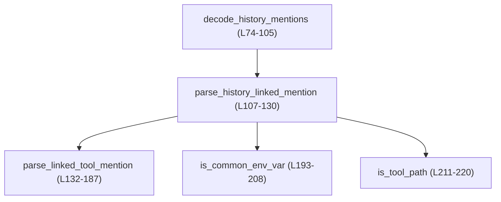
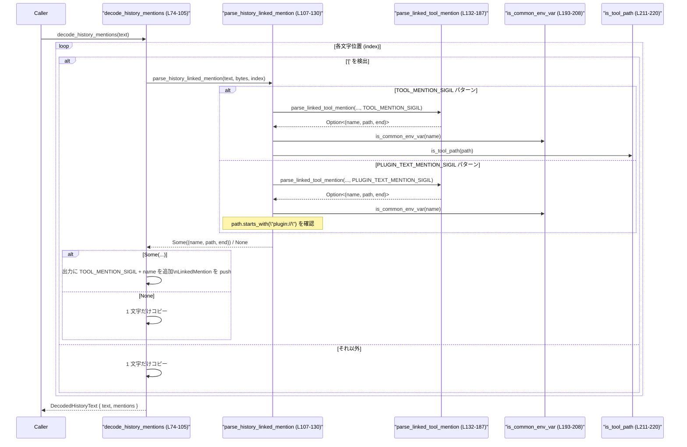

tui/src/mention_codec.rs コード解説
---

## 0. ざっくり一言

このモジュールは、履歴テキスト中の「ツール／プラグインのメンション」を、  

- プレーンな `$name` 形式と  
- Markdown ライクな `[$name](path)` / `[@name](plugin://...)` 形式  

の間で相互変換し、そのメタデータ（リンク先パス）を保持・抽出するためのユーティリティです（`mention_codec.rs:L7-17`, `L20-72`, `L74-105`）。

---

## 1. このモジュールの役割

### 1.1 概要

- このモジュールは **履歴テキストに埋め込まれたツールメンションのエンコード／デコード** を行います。
- 外部から受け取った `[$name](path)` / `[@name](plugin://...)` 形式のリンクを、TUI で使う `$name` 形式と `LinkedMention` の一覧に変換します（デコード）（`mention_codec.rs:L74-105`）。
- 逆に、プレーンテキスト中の `$name` を、対応する `[$name](path)` に張り替えるエンコードも提供します（`mention_codec.rs:L20-72`）。

### 1.2 アーキテクチャ内での位置づけ

このモジュールは、TUI 側の履歴表示・保存ロジックと、`legacy_core` のシンボル定義の間に位置するヘルパです。

依存関係としてコードから読み取れるのは次の通りです。

- 依存する外部モジュール
  - `crate::legacy_core::TOOL_MENTION_SIGIL`（TUI が使うメンション記号、例: `$`）（`mention_codec.rs:L4-5`）
  - `crate::legacy_core::PLUGIN_TEXT_MENTION_SIGIL`（プラグイン向けの別シンボル、例: `@`）（`mention_codec.rs:L4-5`）
- 同モジュール内の呼び出し関係
  - `decode_history_mentions` → `parse_history_linked_mention` → `parse_linked_tool_mention` → `is_common_env_var` / `is_tool_path`（`mention_codec.rs:L80-129`, `L132-220`）

#### 呼び出し関係（Mermaid）



`encode_history_mentions` は他の関数に依存せず、単独で `$name` を `[$name](path)` に変換します（`mention_codec.rs:L20-72`）。

### 1.3 設計上のポイント

コードから読み取れる設計上の特徴は次の通りです。

- **crate 内部向け API**
  - すべて `pub(crate)` または `fn`（モジュール内プライベート）で定義されており、クレート外には公開されていません（`mention_codec.rs:L8`, `L14`, `L20`, `L74`, `L107`, `L132`, `L189`, `L193`, `L211`）。
- **バイト列ベースのパース**
  - `&str` から `as_bytes()` で `&[u8]` を取得し、インデックスと `.get()` を組み合わせてパースしています（`mention_codec.rs:L33-37`, `L75-81`, `L138-171`）。
  - UTF-8 の文字境界は、ASCII に限定したトークン部分のみをバイト単位で扱い、それ以外は `chars()` と `len_utf8()` で進めることで安全に保っています（`mention_codec.rs:L40-48`, `L64-68`, `L94-98`, `L143-154`）。
- **安全性を意識したインデックス操作**
  - 外側のループは常に `while index < bytes.len()` でガードし、`bytes[index]` の範囲外アクセスを防いでいます（`mention_codec.rs:L37`, `L80-82`）。
  - より複雑なパーサ部分では `.get()` と `?` を多用し、境界外アクセスを `None` による早期リターンで避けています（`mention_codec.rs:L144-147`, `L150-152`, `L156-167`, `L171-177`）。
- **環境変数などの誤認識防止**
  - `$PATH` 等のよくある環境変数名を別扱いし、メンションとしては解釈しないロジックを持ちます（`is_common_env_var`, `mention_codec.rs:L193-208`, `L113-116`, `L121-124`）。
- **ツールパスのホワイトリスト**
  - `app://`, `mcp://`, `plugin://`, `skill://`、および `SKILL.md` というファイル名だけをツールパスとして認めるフィルタがあります（`is_tool_path`, `mention_codec.rs:L211-220`）。

---

## 2. 主要な機能一覧

このモジュールが提供する主要な機能は次の通りです。

- 履歴テキストのデコード: `decode_history_mentions`  
  - `[$name](path)` / `[@name](plugin://...)` を `$name` と `LinkedMention` の一覧に変換します（`mention_codec.rs:L74-105`）。
- 履歴テキストのエンコード: `encode_history_mentions`  
  - `$name` と `LinkedMention` の一覧から、`[$name](path)` を埋め込んだテキストを生成します（`mention_codec.rs:L20-72`）。
- リンク形式メンションのパース: `parse_history_linked_mention` / `parse_linked_tool_mention`  
  - `[...]` で始まる箇所から、メンション名とパスを抽出するヘルパです（`mention_codec.rs:L107-130`, `L132-187`）。
- メンション名・パスの検証:
  - `is_mention_name_char`: メンション名を構成できる ASCII 文字の判定（`mention_codec.rs:L189-190`）。
  - `is_common_env_var`: よくある環境変数名かどうかの判定（`mention_codec.rs:L193-208`）。
  - `is_tool_path`: ツールパスとして扱うかどうかの判定（`mention_codec.rs:L211-220`）。

---

## 3. 公開 API と詳細解説

### 3.1 型一覧（構造体）

#### 構造体インベントリー

| 名前 | 種別 | 定義範囲 | 役割 / 用途 |
|------|------|----------|-------------|
| `LinkedMention` | 構造体 | `mention_codec.rs:L7-11` | メンション名 (`$figma` の `figma`) と、そのメンションが指すパス（`app://...` など）を保持します。エンコード／デコードの両方で使われます。 |
| `DecodedHistoryText` | 構造体 | `mention_codec.rs:L13-17` | デコード済みの履歴テキストと、その中に含まれていたメンション一覧（`Vec<LinkedMention>`）をまとめて持つ結果型です。 |

両方とも `Clone + Debug + PartialEq + Eq` を derive しており、テストやロギング、比較に利用しやすい設計です（`mention_codec.rs:L7`, `L13`）。

### 3.2 関数詳細（重要関数）

ここでは本番コード側の 7 関数を対象に詳細を記載します。

---

#### `encode_history_mentions(text: &str, mentions: &[LinkedMention]) -> String`

**定義範囲**: `mention_codec.rs:L20-72`

**概要**

- プレーンテキスト `text` 内の `$name` 形式のメンションを検出し、対応する `LinkedMention` の `path` に基づいて `[$name](path)` 形式に置き換えた文字列を返します。
- メンションの出現順と `mentions` 配列の順序を維持するために、名前ごとにキュー (`VecDeque`) を使っています（`mention_codec.rs:L25-31`）。

**引数**

| 引数名 | 型 | 説明 |
|--------|----|------|
| `text` | `&str` | 元の履歴テキスト。`$name` 形式のメンションが含まれていると想定されます。 |
| `mentions` | `&[LinkedMention]` | 各メンション名に対応するパスの一覧。1 つの名前に対して複数要素がある場合、テキスト中の出現順に対応して先頭から消費されます。 |

**戻り値**

- `String`: メンション部分が `[$name](path)` 形式に置き換えられたテキスト。  
  - 対応する `LinkedMention` がない `$name` はそのまま残ります（`mention_codec.rs:L51-61`）。

**内部処理の流れ**

1. 早期リターン:
   - `mentions` が空、または `text` が空なら変換せず `text.to_string()` を返します（`mention_codec.rs:L21-23`）。
2. メンション一覧を `HashMap<&str, VecDeque<&str>>` に変換:
   - キー: `mention.mention.as_str()`、値: `mention.path.as_str()` を積んだキュー（`mention_codec.rs:L25-31`）。
3. `text.as_bytes()` を取得し、`index` を 0 から走査（`mention_codec.rs:L33-37`）。
4. 各位置で `bytes[index] == TOOL_MENTION_SIGIL as u8` かを確認。一致した場合:
   - 次バイトがメンション名の先頭文字として有効か (`is_mention_name_char`) をチェック（`mention_codec.rs:L39-42`）。
   - 有効なら、メンション名部分（ASCII の英数字等）を最後まで伸ばし `name_end` を求める（`mention_codec.rs:L43-48`）。
   - `&text[name_start..name_end]` を `name` とし、`mentions_by_name[name]` から `path` を 1 件取り出す（`VecDeque::pop_front`）（`mention_codec.rs:L50-51`）。
   - `path` が取得できた場合、`out` に `[$sigilname](path)` を構築し、`index = name_end` に進めます（`mention_codec.rs:L52-59`）。
5. 上記条件に当てはまらない場合:
   - `text[index..].chars().next()` で 1 文字を取得し `out` に追加、`index += ch.len_utf8()` で次の文字へ進みます（`mention_codec.rs:L64-68`）。
6. ループ終了後、`out` を返します（`mention_codec.rs:L71`）。

**Examples（使用例）**

```rust
// 仮に TOOL_MENTION_SIGIL が '$' として、テキストをエンコードする例
use crate::tui::mention_codec::{encode_history_mentions, LinkedMention};

let text = "$figma then $sample then $figma then $other"; // 元テキスト

let mentions = vec![
    LinkedMention {
        mention: "figma".to_string(),
        path: "app://figma-app".to_string(),
    },
    LinkedMention {
        mention: "sample".to_string(),
        path: "plugin://sample@test".to_string(),
    },
    LinkedMention {
        mention: "figma".to_string(),
        path: "/tmp/figma/SKILL.md".to_string(),
    },
];

let encoded = encode_history_mentions(text, &mentions);
assert_eq!(
    encoded,
    "[$figma](app://figma-app) then [$sample](plugin://sample@test) \
     then [$figma](/tmp/figma/SKILL.md) then $other"
);
// この挙動は tests::encode_history_mentions_links_bound_mentions_in_order でも検証されています
// (mention_codec.rs:L281-305)
```

**Errors / Panics**

- この関数内で `Result` や `panic!` は使われておらず、境界チェックも `while index < bytes.len()` により行われているため、通常の使用でパニックを起こすコードは見当たりません（`mention_codec.rs:L37`, `L64-68`）。
- `TOOL_MENTION_SIGIL` を `as u8` してバイト比較しているため、**この sigil が 1 バイトの ASCII 文字である前提**になっていると解釈できます（`mention_codec.rs:L38`）。非 ASCII の場合、単にマッチせず、メンションが変換されない可能性がありますが、メモリ安全性は保持されます。

**Edge cases（エッジケース）**

- `mentions` または `text` が空: 変換を行わず `text` のコピーを返します（`mention_codec.rs:L21-23`）。
- `mentions` に存在しない `$name`:
  - `mentions_by_name.get_mut(name)` が `None` となり、その `$name` はそのままテキストに残ります（`mention_codec.rs:L50-51`, `L61`）。
- 同じ名前のメンションが複数回出現:
  - `VecDeque::pop_front` により、`mentions` の定義順でパスが割り当てられます（`mention_codec.rs:L25-31`, `L51`）。
  - テキスト中の出現回数が `mentions` 内の件数を上回る分については、残りの `$name` は変換されません。
- 非 ASCII 文字を含むテキスト:
  - 非 ASCII 部分は `chars()` と `len_utf8()` でコピーされ、メンション検出はバイト単位の比較のみ行われるため、UTF-8 として安全に処理されます（`mention_codec.rs:L64-68`）。

**使用上の注意点**

- `$name` と `mentions` の `mention` フィールドの文字列が一致しないとリンク化されません。前処理で名前を揃えておく必要があります（`mention_codec.rs:L26-31`, `L50-51`）。
- 名前は ASCII の英数字・`_`・`-` のみをメンション名として扱います（`is_mention_name_char`, `mention_codec.rs:L189-190`）。他の文字を含む名前はメンションとして認識されません。
- 並行性:
  - 関数は引数の `&str` と `&[LinkedMention]` から新しい `String` を生成するだけで、グローバル状態に依存しません。呼び出し側で共有しない限り、スレッド間の競合は発生しません。

---

#### `decode_history_mentions(text: &str) -> DecodedHistoryText`

**定義範囲**: `mention_codec.rs:L74-105`

**概要**

- 履歴テキスト中の `[$name](path)` や `[@name](plugin://...)` を検出して `$name` に戻し、その情報を `LinkedMention` の一覧として収集します。
- TUI 自身が書き出した形式だけでなく、他クライアントからの `[@name](plugin://...)` 形式にも対応しています（コメント, `mention_codec.rs:L112-113`）。

**引数**

| 引数名 | 型 | 説明 |
|--------|----|------|
| `text` | `&str` | デコード対象の履歴テキスト。Markdown ライクなリンクが含まれている可能性があります。 |

**戻り値**

- `DecodedHistoryText`:
  - `text`: `$name` 形式に復元されたテキスト（`mention_codec.rs:L84-85`, `L101-103`）。
  - `mentions`: 検出されたメンションごとの `LinkedMention` の一覧（`mention_codec.rs:L86-89`, `L101-103`）。

**内部処理の流れ**

1. `text.as_bytes()` を取得し、`out`（出力文字列）、`mentions`（`Vec<LinkedMention>`）、`index` を初期化（`mention_codec.rs:L75-78`）。
2. `while index < bytes.len()` でループ（`mention_codec.rs:L80`）。
3. 位置 `index` が `'['`（ASCII）で始まる場合:
   - `parse_history_linked_mention(text, bytes, index)` を呼び出し、メンションとして解釈可能かを判定（`mention_codec.rs:L81-83`）。
   - 成功した場合:
     - `out` に `TOOL_MENTION_SIGIL` と `name` を連結して `$name` を復元（`mention_codec.rs:L84-85`）。
     - 同時に `LinkedMention { mention: name.to_string(), path: path.to_string() }` を `mentions` に push（`mention_codec.rs:L86-89`）。
     - `index = end_index` に進めてループ継続（`mention_codec.rs:L90-91`）。
4. メンションでない場合:
   - `text[index..].chars().next()` で 1 文字をコピーし `index` を `len_utf8()` 分進めます（`mention_codec.rs:L94-98`）。
5. ループ終了後、`DecodedHistoryText { text: out, mentions }` を返却します（`mention_codec.rs:L101-104`）。

**Examples（使用例）**

テストコードと同じケースを例にします（`mention_codec.rs:L227-250`）。

```rust
use crate::tui::mention_codec::{decode_history_mentions, LinkedMention};

let decoded = decode_history_mentions(
    "Use [$figma](app://figma-1), \
     [$sample](plugin://sample@test), \
     and [$figma](/tmp/figma/SKILL.md)."
);

assert_eq!(decoded.text, "Use $figma, $sample, and $figma.");
assert_eq!(
    decoded.mentions,
    vec![
        LinkedMention {
            mention: "figma".to_string(),
            path: "app://figma-1".to_string(),
        },
        LinkedMention {
            mention: "sample".to_string(),
            path: "plugin://sample@test".to_string(),
        },
        LinkedMention {
            mention: "figma".to_string(),
            path: "/tmp/figma/SKILL.md".to_string(),
        },
    ]
);
```

`[@sample](plugin://...)` を扱う挙動は `decode_history_mentions_restores_plugin_links_with_at_sigil` のテストで確認できます（`mention_codec.rs:L252-271`）。

**Errors / Panics**

- パースに失敗した場合は、メンションとして扱わず、元の文字列をそのままコピーするだけであり、エラーを返したりパニックを起こしたりするコードはありません（`mention_codec.rs:L81-83`, `L94-98`）。
- 文字列インデックスは `while index < bytes.len()` の条件により範囲外アクセスを防ぎつつ、`chars().next()` で UTF-8 の境界整合性を保って進められています（`mention_codec.rs:L80`, `L94-98`）。

**Edge cases（エッジケース）**

- `[...` で始まるがメンション形式に合致しない:
  - `parse_history_linked_mention` が `None` を返し、単なる文字列としてコピーされます（`mention_codec.rs:L81-83`, `L94-98`）。
  - 例: `Use [@figma](app://figma-1).` は `@` シンボルだが `plugin://` ではないため、メンションとして扱われず、そのまま残ります（テスト `decode_history_mentions_ignores_at_sigil_for_non_plugin_paths`, `mention_codec.rs:L273-279`）。
- `TOOL_MENTION_SIGIL` が非 ASCII の場合:
  - 出力文字列にそのまま `TOOL_MENTION_SIGIL` が書き込まれるだけで、挙動は Rust の文字処理に委ねられます（`mention_codec.rs:L84`）。

**使用上の注意点**

- デコード結果の `DecodedHistoryText::mentions` の順序は、テキスト中に出現した順と一致します（`mention_codec.rs:L80-89`）。
- `parse_history_linked_mention` のフィルタ条件（環境変数名・パスのプレフィックス）により、**すべての Markdown リンクが対象になるわけではない** 点に注意が必要です（`mention_codec.rs:L113-117`, `L121-125`）。
- 並行性:
  - この関数もグローバル状態を持たず、`&str` から新しい値を生成するだけで、スレッドセーフに呼び出すことができます。

---

#### `parse_history_linked_mention<'a>(text: &'a str, text_bytes: &[u8], start: usize) -> Option<(&'a str, &'a str, usize)>`

**定義範囲**: `mention_codec.rs:L107-130`

**概要**

- 指定位置 `start` が `'['` であることを前提に、`[$name](path)` または `[@name](plugin://...)` 形式のリンクをパースしようとします。
- メンション名がよくある環境変数名ではないこと、パスがツールパスとして妥当であることを確認した上で、`(name, path, end_index)` を返します。

**引数**

| 引数名 | 型 | 説明 |
|--------|----|------|
| `text` | `&'a str` | 元テキスト全体。部分文字列へのスライス参照を返すために `'a` ライフタイムを持ちます。 |
| `text_bytes` | `&[u8]` | `text` のバイト列。インデックスベースのパースに使用します。 |
| `start` | `usize` | `'['` の位置を指すインデックス。 |

**戻り値**

- `Option<(&'a str, &'a str, usize)>`:
  - `Some((name, path, end_index))`:
    - `name`: メンション名部分（`"figma"` 等）。
    - `path`: パス部分（`"app://figma-1"` 等）。
    - `end_index`: リンク全体の直後のインデックス（次の走査開始位置用）。
  - `None`: 形式に合致しない、またはフィルタ条件を満たさない場合。

**内部処理の流れ**

1. TUI のシンボル `TOOL_MENTION_SIGIL` によるパースを試行:
   - `parse_linked_tool_mention(text, text_bytes, start, TOOL_MENTION_SIGIL)` を呼ぶ（`mention_codec.rs:L113-114`）。
   - 成功し `(name, path, _)` が得られた場合:
     - `!is_common_env_var(name)` かつ `is_tool_path(path)` を満たすときだけ `Some(mention)` を返す（`mention_codec.rs:L115-118`）。
2. 上記が失敗またはフィルタで落ちた場合、プラグイン用シンボル `PLUGIN_TEXT_MENTION_SIGIL` で再試行:
   - `parse_linked_tool_mention(..., PLUGIN_TEXT_MENTION_SIGIL)`（`mention_codec.rs:L121-122`）。
   - 成功し `(name, path, _)` が得られた場合:
     - `!is_common_env_var(name)` かつ `path.starts_with("plugin://")` を満たすときだけ `Some` を返す（`mention_codec.rs:L123-126`）。
3. どちらも不成立なら `None`（`mention_codec.rs:L129`）。

**Errors / Panics**

- すべて `Option` ベースで処理されており、エラーは `None` として表現されます。
- `start` が `'['` でない場合でも、後段の `parse_linked_tool_mention` 側で `sigil` チェックにより自然に `None` となり、パニックにはなりません（`mention_codec.rs:L132-141`）。

**Edge cases**

- `$PATH` のような環境変数: `is_common_env_var` により `None` 扱いになります（`mention_codec.rs:L115`, `L123`, `L193-208`）。
- `[@name](app://...)`: シンボルは合致しますが `path` が `"plugin://"` で始まらないため、`None` 扱い（テストで確認, `mention_codec.rs:L273-279`）。

---

#### `parse_linked_tool_mention<'a>(text: &'a str, text_bytes: &[u8], start: usize, sigil: char) -> Option<(&'a str, &'a str, usize)>`

**定義範囲**: `mention_codec.rs:L132-187`

**概要**

- `start` 位置から `[` + `sigil` + `name` + `]` + optional whitespace + `(` + `path` + `)` というパターンを解析する低レベルなパーサです。
- 文字列境界・範囲チェックを `Option` と `.get()` で厳密に行い、安全に `name` と `path` のスライスを返します。

**引数**

| 引数名 | 型 | 説明 |
|--------|----|------|
| `text` | `&'a str` | 元テキスト。`name`／`path` のスライスを返すために参照します。 |
| `text_bytes` | `&[u8]` | `text` のバイト配列。インデックスベースの解析に使用します。 |
| `start` | `usize` | `'['` の位置。 |
| `sigil` | `char` | `$` や `@` など、メンション名の直前に来る 1 文字。 |

**戻り値**

- `Some((name, path, end_index))`:
  - 書式 `[sigilname](path)` を満たす場合。
- `None`:
  - 形式が崩れている、インデックスが範囲外、パスが空などのとき。

**内部処理（要約）**

1. シンボル位置チェック:
   - `sigil_index = start + 1` を計算し、`text_bytes.get(sigil_index) == Some(&(sigil as u8))` か検証（`mention_codec.rs:L138-140`）。
2. メンション名の解析:
   - `name_start = sigil_index + 1` から 1 バイト取得、`is_mention_name_char` か確認（`mention_codec.rs:L143-147`）。
   - `while` ループで連続する有効文字を伸ばし、`name_end` を決める（`mention_codec.rs:L149-154`）。
   - 直後が `']'` であることを確認（`mention_codec.rs:L156-158`）。
3. パスの開始位置と括弧:
   - `path_start = name_end + 1` から ASCII 空白をスキップ（`mention_codec.rs:L160-165`）。
   - 次の文字が `'('` であることを確認（`mention_codec.rs:L166-167`）。
4. パス部分の解析:
   - `path_end = path_start + 1` から `')'` までバイトを進める（`mention_codec.rs:L170-175`）。
   - `text_bytes.get(path_end) == Some(&b')')` で閉じ括弧確認（`mention_codec.rs:L176-177`）。
   - `path = text[path_start + 1..path_end].trim()` でパス文字列を取得（`mention_codec.rs:L180`）。
   - 空文字列なら `None`（`mention_codec.rs:L181-182`）。
5. 結果の構築:
   - `name = &text[name_start..name_end]` とし、`Some((name, path, path_end + 1))` を返す（`mention_codec.rs:L185-186`）。

**Errors / Panics**

- すべてのインデックスアクセスは `.get()` を経由し、`None` による早期終了に変換されているため、インデックス越境によるパニックは発生しません（`mention_codec.rs:L144-147`, `L150-152`, `L156-158`, `L160-167`, `L170-177`）。
- `sigil as u8` は先述の通り 1 バイト ASCII を前提とする設計と読み取れます（`mention_codec.rs:L139`）。

**Edge cases**

- パスに `')'` が含まれる場合:
  - 最初に出現した `')'` でパス終端とみなされます（`mention_codec.rs:L170-175`）。ネストやエスケープはサポートしていません。
- パスが空または空白のみ:
  - `trim()` で空文字列になり、`None` 扱いとなります（`mention_codec.rs:L180-182`）。

---

#### `is_mention_name_char(byte: u8) -> bool`

**定義範囲**: `mention_codec.rs:L189-190`

**概要**

- メンション名に使える文字かどうかをバイト値で判定する関数です。

**判定条件**

- `a-z`, `A-Z`, `0-9`, `_`, `-` を `true` とし、それ以外を `false` とします（`mention_codec.rs:L190`）。

**使用箇所**

- `encode_history_mentions`（`mention_codec.rs:L40-46`）
- `parse_linked_tool_mention`（`mention_codec.rs:L143-154`）

---

#### `is_common_env_var(name: &str) -> bool`

**定義範囲**: `mention_codec.rs:L193-208`

**概要**

- `name` がよく知られた環境変数名（`PATH`, `HOME` など）かどうかを判定します。

**処理**

1. `name.to_ascii_uppercase()` で大文字化（`mention_codec.rs:L194`）。
2. `matches!` で以下のいずれかと完全一致するか判定（`mention_codec.rs:L195-208`）:
   - `"PATH"`, `"HOME"`, `"USER"`, `"SHELL"`, `"PWD"`, `"TMPDIR"`, `"TEMP"`, `"TMP"`, `"LANG"`, `"TERM"`, `"XDG_CONFIG_HOME"`。

**使用箇所**

- `parse_history_linked_mention` にて、「環境変数のような名前はメンションとみなさない」フィルタとして使われます（`mention_codec.rs:L115`, `L123`）。

---

#### `is_tool_path(path: &str) -> bool`

**定義範囲**: `mention_codec.rs:L211-220`

**概要**

- `path` がツールメンションの対象として妥当なパスかどうかを判定します。

**判定条件**

いずれかを満たすと `true`（`mention_codec.rs:L211-220`）。

1. `path.starts_with("app://")`
2. `path.starts_with("mcp://")`
3. `path.starts_with("plugin://")`
4. `path.starts_with("skill://")`
5. 又は、`path.rsplit(['/', '\\']).next()`（最後のパス要素）が `"SKILL.md"` と ASCII 大文字小文字を無視して一致する。

**使用箇所**

- `parse_history_linked_mention` の `TOOL_MENTION_SIGIL` 分岐にて、一般的なツールパスとして受け入れるかどうかのフィルタとして利用されています（`mention_codec.rs:L113-117`）。

---

### 3.3 その他の関数インベントリー

テストを除く関数の一覧です。

| 関数名 | 定義範囲 | 役割（1 行） |
|--------|----------|--------------|
| `encode_history_mentions` | `mention_codec.rs:L20-72` | `$name` 形式のメンションを、対応する `[$name](path)` に置き換えたテキストを生成します。 |
| `decode_history_mentions` | `mention_codec.rs:L74-105` | `[$name](path)` / `[@name](plugin://...)` を `$name` と `LinkedMention` の一覧に変換します。 |
| `parse_history_linked_mention` | `mention_codec.rs:L107-130` | `'['` から始まる位置で、メンションリンクかどうかを高レベルに判定します。 |
| `parse_linked_tool_mention` | `mention_codec.rs:L132-187` | `[<sigil><name>](<path>)` パターンを詳細に解析する低レベルパーサです。 |
| `is_mention_name_char` | `mention_codec.rs:L189-190` | 1 バイトがメンション名の一部として有効か判定します。 |
| `is_common_env_var` | `mention_codec.rs:L193-208` | 名前がよくある環境変数名かどうかを判定します。 |
| `is_tool_path` | `mention_codec.rs:L211-220` | パスがツールメンションとして妥当かどうかを判定します。 |

---

## 4. データフロー

### 4.1 代表的な処理シナリオ: 履歴テキストのデコード

「履歴テキストとして Markdown ライクなリンクを受け取り、TUI 表示用の `$name` とメタ情報に変換する」場合のデータフローです。

1. 呼び出し側が `decode_history_mentions(text)` を呼ぶ（`mention_codec.rs:L74-79`）。
2. 関数内ループで `[` を見つけるたびに、`parse_history_linked_mention` に委譲してメンションかを判定（`mention_codec.rs:L80-83`）。
3. `parse_history_linked_mention` は、`parse_linked_tool_mention`、`is_common_env_var`、`is_tool_path` を使って、形式と内容を検証（`mention_codec.rs:L113-117`, `L121-125`）。
4. メンションと判定された場合には `$name` を出力テキストに書き、`LinkedMention` を `mentions` ベクタに push（`mention_codec.rs:L84-89`）。
5. 最終的に `DecodedHistoryText { text, mentions }` を返却（`mention_codec.rs:L101-104`）。

#### シーケンス図



---

## 5. 使い方（How to Use）

### 5.1 基本的な使用方法

履歴テキストを受け取ってデコードし、その後エンコードして保存し直す、という典型的な流れの例です。

```rust
use crate::tui::mention_codec::{
    decode_history_mentions,
    encode_history_mentions,
    LinkedMention,
};

// 受信済みの履歴テキスト（他クライアント由来）
let raw = "Use [$figma](app://figma-1) and [@sample](plugin://sample@test).";

// デコードして、表示用テキストとメンション一覧を得る
let decoded = decode_history_mentions(raw);
println!("visible text: {}", decoded.text); // 例: "Use $figma and $sample."

// decoded.mentions を元に、別の保存形式にシリアライズすることができます
let mentions: Vec<LinkedMention> = decoded.mentions.clone();

// 後で履歴を再構築するときには、もとのテキストにエンコードし直せます
let reencoded = encode_history_mentions(&decoded.text, &mentions);
// reencoded は raw と同一とは限りませんが、
// `[TOOL_MENTION_SIGIL name](path)` 形式でメンションが埋め込まれます。
```

### 5.2 よくある使用パターン

- **履歴ロード時**
  - ストレージから読み込んだテキストを `decode_history_mentions` に通して `$name` と `LinkedMention` に分離。
  - UI には `DecodedHistoryText::text` を表示し、メンション一覧は補完やポップアップ用データとして利用できます。
- **履歴保存時**
  - ユーザーが編集した `$name` を含むプレーンテキストと、内部で保持している `LinkedMention` 一覧から `encode_history_mentions` を呼び出し、リンク付きのテキストとして保存します。

### 5.3 よくある間違い

```rust
// 誤り例: text と mentions の対応が取れていない
let text = "$figma and $sample";
let mentions = vec![]; // メンション情報を渡していない
let encoded = encode_history_mentions(text, &mentions);
// encoded は "$figma and $sample" のままになり、リンクに変換されません

// 正しい例: text に出現するメンションごとに LinkedMention を準備する
let mentions = vec![
    LinkedMention { mention: "figma".into(), path: "app://figma-1".into() },
    LinkedMention { mention: "sample".into(), path: "plugin://sample@test".into() },
];
let encoded = encode_history_mentions(text, &mentions);
```

### 5.4 使用上の注意点（まとめ）

- メンション名は ASCII 英数字・`_`・`-` のみが対象です。それ以外の文字を含む名前はこのモジュールではメンションとして扱われません（`mention_codec.rs:L189-190`）。
- `$PATH` など環境変数名はメンションとして扱われず、`decode_history_mentions` ではそのまま残る設計です（`mention_codec.rs:L193-208`, `L113-116`, `L121-124`）。
- `encode_history_mentions` は `mentions` の内容を信頼しており、`path` の妥当性チェックは行いません。外部入力をそのまま `path` に渡す場合は、呼び出し側で検証する必要があります（`mention_codec.rs:L25-31`, `L51-57`）。

---

## 6. 変更の仕方（How to Modify）

### 6.1 新しい機能を追加する場合

- **新しいパススキームをサポートしたいとき**
  1. `is_tool_path` の判定条件に新しい `path.starts_with("...://")` を追加します（`mention_codec.rs:L211-215`）。
  2. 必要に応じてテスト `decode_history_mentions_restores_visible_tokens` にケースを追加します（`mention_codec.rs:L227-250`）。

- **メンション名の文字種を拡張したいとき**
  1. `is_mention_name_char` のマッチパターンを変更します（`mention_codec.rs:L189-190`）。
  2. 変更により、`encode_history_mentions` と `parse_linked_tool_mention` の両方の動作が変わるため、関連テストを追加・更新します。

### 6.2 既存の機能を変更する場合の注意点

- **契約（前提条件）**
  - `parse_linked_tool_mention` は `start` が `'['` を指している前提で書かれています（暗黙ですが、`sigil_index = start + 1` の計算から読み取れます, `mention_codec.rs:L138-139`）。呼び出し側でこの前提を崩さないようにする必要があります。
  - `decode_history_mentions` は `parse_history_linked_mention` が返す `end_index` を信頼して `index` を更新しています（`mention_codec.rs:L90`）。`end_index` の計算を変える場合は、UTF-8 境界を崩さないよう注意が必要です（`mention_codec.rs:L170-186`）。
- **テスト・影響範囲**
  - デコード側を変更した場合は、`tests` モジュールの 3 つのデコード関連テストが影響を受けます（`mention_codec.rs:L227-279`）。
  - エンコード側を変更した場合は、`encode_history_mentions_links_bound_mentions_in_order` のみが直接対象ですが、デコードと組み合わせた挙動も確認しておくことが有用です（`mention_codec.rs:L281-305`）。

---

## 7. 関連ファイル

このモジュールと密接に関係すると思われる要素です（コードに直接現れる範囲のみ記載します）。

| パス / シンボル | 役割 / 関係 |
|-----------------|------------|
| `crate::legacy_core::TOOL_MENTION_SIGIL` | TUI が使用するメンションシンボル（例: `$`）を表す定数。`encode_history_mentions` と `decode_history_mentions`、`parse_history_linked_mention` で使用されています（`mention_codec.rs:L4-5`, `L38`, `L84`, `L113-114`）。 |
| `crate::legacy_core::PLUGIN_TEXT_MENTION_SIGIL` | プラグイン向け `@name` 形式のメンションシンボルを表す定数。`parse_history_linked_mention` で使用されています（`mention_codec.rs:L4-5`, `L121-122`）。 |
| `pretty_assertions` クレート | テストで `assert_eq!` の差分を見やすくするために使用されています（`mention_codec.rs:L225`）。 |

---

## 付録: テスト・安全性・性能に関するまとめ

### テスト

- `decode_history_mentions_restores_visible_tokens`（`mention_codec.rs:L227-250`）  
  - 複数種類のツールパス（`app://`, `plugin://`, `SKILL.md` パス）を正しく `$name` と `LinkedMention` に変換できることを確認。
- `decode_history_mentions_restores_plugin_links_with_at_sigil`（`mention_codec.rs:L252-271`）  
  - `[@name](plugin://...)` 形式のプラグインリンクを `$name` に変換できることを確認。
- `decode_history_mentions_ignores_at_sigil_for_non_plugin_paths`（`mention_codec.rs:L273-279`）  
  - `@` シンボルでもパスが `plugin://` でなければメンションとみなさないことを確認。
- `encode_history_mentions_links_bound_mentions_in_order`（`mention_codec.rs:L281-305`）  
  - 同じ名前のメンションに対して、`LinkedMention` の順序に従ってパスが割り当てられることを確認。

### 安全性・セキュリティ

- すべての文字列操作は安全な標準ライブラリ API で行われ、インデックス操作も `.get()` と境界チェックを伴っているため、メモリ安全性は保たれています（`mention_codec.rs:L37-48`, `L64-68`, `L138-177`）。
- `encode_history_mentions` は `path` 内容の検証を行わず、外部入力をそのまま出力テキストに埋め込みます。これは XSS 等の観点では呼び出し側の利用コンテキストに依存するため、このモジュール単体では安全性の評価はできませんが、「検証やエスケープは行わない」という事実はコードから読み取れます（`mention_codec.rs:L25-31`, `L52-57`）。
- 環境変数名や特定のパスプレフィックスをフィルタすることで、意図しない文字列がメンションとして扱われる可能性を減らしています（`mention_codec.rs:L113-117`, `L121-125`, `L193-208`, `L211-220`）。

### 並行性

- すべての関数は引数のみを読み、ローカル変数のみを更新する純粋な関数として実装されています。グローバル可変状態やスレッド操作はこのチャンクには存在しません（`mention_codec.rs:L20-220`）。
- このため、同じ入力に対しては常に同じ結果を返す決定的な挙動となり、スレッド間で並列に安全に呼び出せます（呼び出し側が同じ `String` などを同時に変更しない限り）。

### 性能・スケーラビリティ（簡易）

- 文字列長を `N`、メンション数を `M` とすると、
  - エンコード:
    - `mentions` から `HashMap` を作る部分が `O(M)`（`mention_codec.rs:L25-31`）。
    - テキスト走査が `O(N)`。各位置での操作は定数時間以内です（`mention_codec.rs:L37-69`）。
  - デコード:
    - テキスト走査が `O(N)`。`parse_history_linked_mention`／`parse_linked_tool_mention` もインデックスを 1 回通過する実装です（`mention_codec.rs:L80-99`, `L132-187`）。
- 大きなテキストに対しても線形時間で動作する設計と読み取れます。
