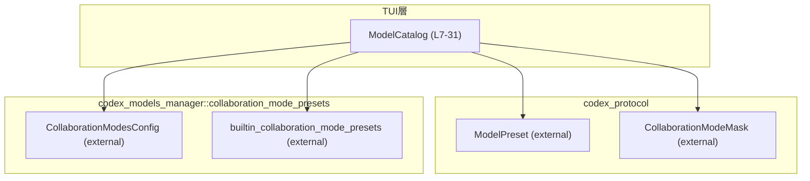
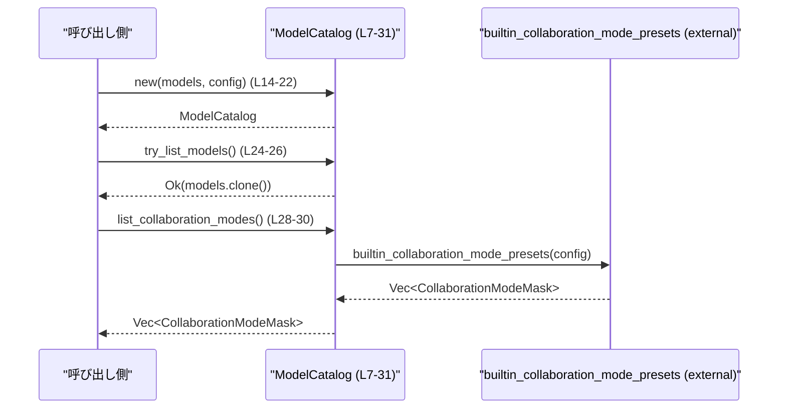

# tui/src/model_catalog.rs コード解説

## 0. ざっくり一言

このファイルは、TUI から利用する「モデル一覧」と「コラボレーションモード一覧」を提供する小さなカタログ構造体 `ModelCatalog` を定義しています（`tui/src/model_catalog.rs:L7-31`）。  
実際のモデル定義やモード定義は外部クレートに委譲し、このモジュールはそれらをまとめて問い合わせ可能にする役割を持ちます。

---

## 1. このモジュールの役割

### 1.1 概要

- このモジュールは、TUI から利用する **モデルプリセット一覧** と **コラボレーションモード一覧** を提供するために存在します。
- `ModelCatalog` 構造体が、`Vec<ModelPreset>` と `CollaborationModesConfig` を保持し（`tui/src/model_catalog.rs:L7-11`）、  
  それを使って
  - モデル一覧の取得（`try_list_models`）
  - コラボレーションモード一覧の取得（`list_collaboration_modes`）
  を行います（`tui/src/model_catalog.rs:L24-30`）。

### 1.2 アーキテクチャ内での位置づけ

`ModelCatalog` は、TUI 層から外部クレート `codex_protocol` / `codex_models_manager` の型・関数をまとめて扱うための薄いラッパになっています。

- 依存関係（import）:
  - `ModelPreset`（モデルプリセット定義）  
    `use codex_protocol::openai_models::ModelPreset;`（`L4`）
  - `CollaborationModeMask`（コラボレーションモード識別用のマスク）  
    `use codex_protocol::config_types::CollaborationModeMask;`（`L3`）
  - `CollaborationModesConfig` と `builtin_collaboration_mode_presets`（モードプリセット生成）  
    `use codex_models_manager::collaboration_mode_presets::...`（`L1-2`）

以下の Mermaid 図は、本チャンク内の `ModelCatalog`（L7-31）を中心とした依存関係を示します。



### 1.3 設計上のポイント

コードから読み取れる設計上の特徴は次のとおりです。

- **責務の分割**
  - `ModelCatalog` は「保持」と「問い合わせ」のみ担当し、  
    モードの具体的な生成ロジックは `builtin_collaboration_mode_presets` に委譲しています（`L28-30`）。
- **状態管理**
  - 内部状態は二つのフィールドのみ:
    - `models: Vec<ModelPreset>`（`L9`）
    - `collaboration_modes_config: CollaborationModesConfig`（`L10`）
  - メソッドはすべて `&self` を取り、内部状態を変更しません（`L24`, `L28`）。
- **エラーハンドリング**
  - モデル一覧取得は `Result<Vec<ModelPreset>, Infallible>` を返し（`L24`）、  
    `Infallible` によって **エラー発生しない契約** が型で表現されています。
  - コラボレーションモード一覧取得は単純な `Vec<CollaborationModeMask>` 返却であり、  
    このモジュール内にはエラー分岐はありません（`L28-30`）。
- **デバッグとクローン**
  - `#[derive(Debug, Clone)]` により、`ModelCatalog` 自体をデバッグ表示・クローン可能にしています（`L7`）。

---

## 2. 主要な機能一覧

- モデルカタログ生成: `ModelCatalog::new` — モデル一覧とコラボモード設定からカタログを構築（`L14-22`）
- モデル一覧の取得: `ModelCatalog::try_list_models` — 保持している `Vec<ModelPreset>` をクローンして返却（`L24-26`）
- コラボレーションモード一覧の取得: `ModelCatalog::list_collaboration_modes` — 保持している設定を用いて `builtin_collaboration_mode_presets` を呼び出し、その結果を返却（`L28-30`）

---

## 3. 公開 API と詳細解説

### 3.1 型一覧（構造体・列挙体など）

| 名前          | 種別     | 役割 / 用途                                                                 | 定義位置                           |
|---------------|----------|------------------------------------------------------------------------------|------------------------------------|
| `ModelCatalog` | 構造体   | モデルプリセット一覧とコラボレーションモード設定を保持し、一覧取得 API を提供 | `tui/src/model_catalog.rs:L7-11` |

### 3.2 関数詳細

#### `ModelCatalog::new(models: Vec<ModelPreset>, collaboration_modes_config: CollaborationModesConfig) -> ModelCatalog`

**概要**

- モデル一覧とコラボレーションモード設定を受け取り、それらを内部に保持する `ModelCatalog` インスタンスを生成します（`L14-22`）。

**引数**

| 引数名                      | 型                          | 説明                                                                                      |
|-----------------------------|-----------------------------|-------------------------------------------------------------------------------------------|
| `models`                    | `Vec<ModelPreset>`          | カタログが保持するモデルプリセット一覧。所有権は `ModelCatalog` に移動します（`L15`）。 |
| `collaboration_modes_config` | `CollaborationModesConfig` | コラボレーションモード生成に使用する設定値。所有権は `ModelCatalog` に移動します（`L16`）。 |

**戻り値**

- `ModelCatalog` — 渡された `models` と `collaboration_modes_config` を内部に保持する新しいインスタンス（`L18-21`）。

**内部処理の流れ**

1. `Self { models, collaboration_modes_config }` で構造体を初期化します（`L18-21`）。
   - フィールド名と引数名が同じため、省略記法を使用しています。

**Examples（使用例）**

> モデル一覧と設定から `ModelCatalog` を生成する例です。  
> モジュールパス（`crate::model_catalog` など）はクレート構成に依存し、このチャンクからは確定できないため一例として示します。

```rust
use codex_protocol::openai_models::ModelPreset;                   // ModelPreset 型をインポート
use codex_models_manager::collaboration_mode_presets::CollaborationModesConfig; // 設定型をインポート
// use crate::model_catalog::ModelCatalog;                        // 実際のモジュールパスはクレート構成に依存する

fn create_catalog(models: Vec<ModelPreset>) -> ModelCatalog {
    // コラボレーションモードの設定を用意する
    let collaboration_modes_config = CollaborationModesConfig {
        default_mode_request_user_input: true,                    // テストコード（L40-41）と同じフィールドを設定
    };

    // ModelCatalog を生成する（所有権は catalog に移動する）
    let catalog = ModelCatalog::new(models, collaboration_modes_config); // new を呼び出して構築（L14-22）

    catalog                                                        // 呼び出し元に返す
}
```

**Errors / Panics**

- 本関数内でエラー処理や `panic!` は行っていません。
- 渡された引数がどのような値でも、そのままフィールドに格納されます（`L18-21`）。

**Edge cases（エッジケース）**

- `models` が空のベクタ `Vec::new()` でも、そのまま保持されます（テストで `Vec::new()` を使っている箇所は `L43`）。
- `collaboration_modes_config` のフィールド値が何であっても、この関数では検証や正規化を行っていません。

**使用上の注意点**

- この関数は引数の所有権を `ModelCatalog` に移すため、呼び出し後に元の `models` / `collaboration_modes_config` 変数は使用できません（Rust の所有権ルールに基づく動作）。
- 設定値を変更したい場合は、新しい `CollaborationModesConfig` を使って別の `ModelCatalog` を構築する必要があります。

---

#### `ModelCatalog::try_list_models(&self) -> Result<Vec<ModelPreset>, Infallible>`

**概要**

- 内部に保持している `models: Vec<ModelPreset>` をクローンし、それを `Result::Ok` で包んで返します（`L24-26`）。
- エラー型として `Infallible` を使用しており、**現実には失敗しない** ことが型で表現されています。

**引数**

| 引数名 | 型             | 説明                                 |
|--------|----------------|--------------------------------------|
| `&self` | `&ModelCatalog` | カタログへの不変参照。内部状態は変更されません。 |

**戻り値**

- `Result<Vec<ModelPreset>, Infallible>`  
  - `Ok(Vec<ModelPreset>)` — 保持しているモデル一覧のクローン（`L25`）。
  - `Err(Infallible)` — この関数からは発生しないことが型で保証されています。

**内部処理の流れ**

1. `self.models.clone()` により、内部の `Vec<ModelPreset>` をクローンします（`L25`）。
2. `Ok(...)` でラップし、そのまま返します（`L25`）。

**Examples（使用例）**

> モデル一覧を取得し、その数を表示する例です。  
> `Infallible` のため `unwrap()` が安全に使えることを示しています。

```rust
use std::convert::Infallible;                                    // Infallible 型
// use crate::model_catalog::ModelCatalog;                       // モジュールパスは一例

fn print_model_count(catalog: &ModelCatalog) -> Result<(), Infallible> {
    // モデル一覧を取得する。エラー型は Infallible なので、Err は発生しない契約。
    let models: Vec<ModelPreset> = catalog.try_list_models()?;   // ? でそのまま伝播しても問題ない（L24-26）

    // 取得したモデル数を出力する
    println!("モデル数: {}", models.len());

    Ok(())                                                       // 正常終了
}
```

**Errors / Panics**

- `Err` は発生しない想定です（エラー型が `Infallible` のため、コンパイラ的にも「到達不能」扱いとなります）。
- この関数内に `panic!` を起こす箇所はありません（`L24-26`）。

**Edge cases（エッジケース）**

- 内部の `models` が空の場合:
  - 空の `Vec<ModelPreset>` を `Ok` で返します。
- 内部の `models` が非常に大きい場合:
  - `clone()` によって全要素が複製されるため、その分のメモリ確保とコピーコストが発生します（Rust の標準 `Vec::clone` の仕様に基づきます）。

**使用上の注意点**

- 返り値は **必ず `Ok`** であるため、`match` で `Err(_)` 分岐を書く必要はありません。
  - ただし、Rust の型システム上は `match` で `Err(e)` パターンを書くことは可能ですが、到達不能コードになります。
- 大量のモデルを頻繁に取得する場合、`clone()` のコストが無視できない可能性があります。
  - その場合、呼び出し側の設計として、クローンを減らすか、参照を返す別 API を検討する余地があります（このファイルにはそのような API は定義されていません）。

---

#### `ModelCatalog::list_collaboration_modes(&self) -> Vec<CollaborationModeMask>`

**概要**

- 内部に保持している `collaboration_modes_config` を用いて、  
  `builtin_collaboration_mode_presets` を呼び出し（`L28-30`）、  
  コラボレーションモードのプリセット一覧 `Vec<CollaborationModeMask>` を返します。

**引数**

| 引数名 | 型             | 説明                                        |
|--------|----------------|---------------------------------------------|
| `&self` | `&ModelCatalog` | カタログへの不変参照。設定を読み出すだけです。 |

**戻り値**

- `Vec<CollaborationModeMask>` — `builtin_collaboration_mode_presets` に `collaboration_modes_config` を渡して得られたプリセット一覧（`L28-30`）。

**内部処理の流れ**

1. `builtin_collaboration_mode_presets(self.collaboration_modes_config)` を呼び出します（`L29`）。
   - ここで `self.collaboration_modes_config` はコピー/クローンのいずれかですが、詳細は `CollaborationModesConfig` の実装に依存し、このチャンクからは不明です。
2. その戻り値 `Vec<CollaborationModeMask>` をそのまま呼び出し元に返します（`L28-30`）。

**Examples（使用例）**

> コラボレーションモード一覧を取得し、マスク値の個数を表示する例です。

```rust
// use crate::model_catalog::ModelCatalog;                       // モジュールパスは一例

fn show_collaboration_mode_count(catalog: &ModelCatalog) {
    // コラボレーションモード一覧を取得する
    let modes: Vec<CollaborationModeMask> = catalog.list_collaboration_modes(); // L28-30

    // モード数を出力する
    println!("利用可能なコラボレーションモード数: {}", modes.len());
}
```

**Errors / Panics**

- この関数自体にはエラー分岐や `panic!` はありません（`L28-30`）。
- `builtin_collaboration_mode_presets` の内部でどのようなエラー処理・パニックがあるかは、このチャンクには現れません。

**Edge cases（エッジケース）**

- `collaboration_modes_config` の設定値の違いにより、戻り値のモード数や内容が変わると推測されますが、  
  具体的な挙動は `builtin_collaboration_mode_presets` の実装に依存し、このファイルからは分かりません。
- `CollaborationModesConfig` のフィールド例として、テストでは `default_mode_request_user_input: true` が使用されています（`L40-41`）。

**使用上の注意点**

- `ModelCatalog` 生成時の `collaboration_modes_config` に基づいて結果が決まります。
  - 生成後に設定を変更する手段はこの構造体には用意されていないため、設定を変えたい場合は新たに `ModelCatalog::new` を呼び出す必要があります。
- 関数呼び出しごとに `builtin_collaboration_mode_presets` を評価するため、  
  その処理コストは外部関数の実装に依存します。このチャンクからはパフォーマンス特性は分かりません。

---

### 3.3 その他の関数

テスト用関数のみが定義されています。

| 関数名                                       | 役割（1 行）                                                                                   | 定義位置                           |
|----------------------------------------------|------------------------------------------------------------------------------------------------|------------------------------------|
| `list_collaboration_modes_matches_core_presets` | `ModelCatalog::list_collaboration_modes` が `builtin_collaboration_mode_presets` と同じ結果を返すことを検証するテスト | `tui/src/model_catalog.rs:L38-48` |

---

## 4. データフロー

このモジュールにおける代表的な処理シナリオは次の 2 つです。

1. `ModelCatalog::new` でモデル一覧と設定を保持するインスタンスを生成（`L14-22`）
2. 生成したインスタンスから
   - `try_list_models` によりモデル一覧を取得（`L24-26`）
   - `list_collaboration_modes` によりコラボレーションモード一覧を取得（`L28-30`）

以下のシーケンス図は、それぞれのメソッド呼び出しの流れを示します。



- `try_list_models` では、`ModelCatalog` 内の `models` ベクタがクローンされ、`Result::Ok` でラップされて呼び出し側に返されます（`L24-26`）。
- `list_collaboration_modes` では、`ModelCatalog` 内の `collaboration_modes_config` を使って  
  外部関数 `builtin_collaboration_mode_presets` が呼び出され、その結果が返されます（`L28-30`）。

---

## 5. 使い方（How to Use）

### 5.1 基本的な使用方法

> `ModelCatalog` を生成し、モデル一覧とコラボレーションモード一覧を取得する一連の流れの例です。  
> モジュールパスは一例であり、このチャンクからは正確なパスは分かりません。

```rust
use codex_protocol::openai_models::ModelPreset;                   // モデルプリセット型
use codex_models_manager::collaboration_mode_presets::CollaborationModesConfig; // コラボモード設定
// use crate::model_catalog::ModelCatalog;                        // 実際のパスはクレート構成に依存

fn main() {
    // 1. モデルプリセット一覧を用意する（実際には外部から取得する想定）
    let models: Vec<ModelPreset> = Vec::new();                    // ここでは空の一覧を例として使用（L43 と同様）

    // 2. コラボレーションモード設定を作成する
    let collaboration_modes_config = CollaborationModesConfig {
        default_mode_request_user_input: true,                    // テストと同じ設定（L40-41）
    };

    // 3. ModelCatalog を生成する
    let catalog = ModelCatalog::new(models, collaboration_modes_config); // L14-22

    // 4. モデル一覧を取得する（Result だが Infallible のため、unwrap が安全）
    let model_list = catalog.try_list_models().unwrap();          // L24-26

    // 5. コラボレーションモード一覧を取得する
    let collaboration_modes = catalog.list_collaboration_modes(); // L28-30

    // 6. 取得した情報を利用する（ここでは件数の表示のみ）
    println!("モデル数: {}", model_list.len());
    println!("コラボレーションモード数: {}", collaboration_modes.len());
}
```

### 5.2 よくある使用パターン

1. **カタログの共有利用**

   `ModelCatalog` のメソッドはすべて `&self` を受け取り状態を変更しないため（`L24`, `L28`）、  
   複数の箇所から同一インスタンスを共有して呼び出すことができます。

   ```rust
   fn use_catalog_in_two_places(catalog: &ModelCatalog) {
       // モデル一覧を利用する
       let models_a = catalog.try_list_models().unwrap();         // 参照からモデル一覧取得（L24-26）

       // 別の処理でも同じカタログを利用する
       let modes_b = catalog.list_collaboration_modes();          // コラボモード一覧取得（L28-30)

       println!("Aで利用するモデル数: {}", models_a.len());
       println!("Bで利用するモード数: {}", modes_b.len());
   }
   ```

2. **設定値に応じたカタログの切り替え**

   `CollaborationModesConfig` によって返されるモードプリセットが変化すると想定されるため、  
   設定ごとに異なる `ModelCatalog` を用意するパターンがありえます。

   ```rust
   fn create_catalogs_for_configs(models: Vec<ModelPreset>) -> (ModelCatalog, ModelCatalog) {
       // 1つ目の設定
       let config1 = CollaborationModesConfig {
           default_mode_request_user_input: true,
       };

       // 2つ目の設定
       let config2 = CollaborationModesConfig {
           default_mode_request_user_input: false,
       };

       // 設定ごとに別々のカタログを構築する
       let catalog1 = ModelCatalog::new(models.clone(), config1); // models をクローンして再利用
       let catalog2 = ModelCatalog::new(models, config2);

       (catalog1, catalog2)
   }
   ```

### 5.3 よくある間違い

コードから推測できる範囲で、起こり得る誤用例とその修正例を示します。

```rust
// 誤り例: try_list_models が Err を返す前提で複雑なエラー処理を書いている
fn wrong_error_handling(catalog: &ModelCatalog) {
    match catalog.try_list_models() {                          // L24-26
        Ok(models) => println!("モデル数: {}", models.len()),
        Err(_e) => eprintln!("モデル取得に失敗しました"),        // Infallible のため実際には到達しない
    }
}

// 正しい例: Infallible であることを前提にシンプルに扱う
fn correct_handling(catalog: &ModelCatalog) {
    let models = catalog.try_list_models().unwrap();           // Err が存在しないので unwrap で問題ない
    println!("モデル数: {}", models.len());
}
```

### 5.4 使用上の注意点（まとめ）

- **所有権**
  - `ModelCatalog::new` は `models` と `collaboration_modes_config` の所有権を取得します（`L14-22`）。
- **不変性**
  - 定義されているメソッドはすべて `&self` を取り、内部状態を書き換えません（`L24`, `L28`）。
- **エラー処理**
  - `try_list_models` は `Infallible` をエラー型に使っており、実質的に失敗しません（`L24`）。
- **パフォーマンス**
  - `try_list_models` は内部の `Vec<ModelPreset>` をクローンするため、モデル数が多いとその分のコストがかかります（`L25`）。
- **並行性**
  - このファイルからは `ModelCatalog` が `Send` / `Sync` かどうかは分かりませんが、  
    メソッドが `&self` だけを取り内部状態を変更しないことから、**共有参照**に対して安全に呼び出せるよう設計されています。

---

## 6. 変更の仕方（How to Modify）

### 6.1 新しい機能を追加する場合

1. **新しい問い合わせ API の追加**
   - 例: フィルタ条件付きでモデル一覧を返すメソッドを追加する場合は、`impl ModelCatalog` ブロック（`L13-31`）に新しいメソッドを追加します。
   - 既存のフィールド `models` / `collaboration_modes_config`（`L9-10`）を再利用することで、一貫したデータソースを利用できます。

2. **新たな設定項目に基づく振る舞い追加**
   - `CollaborationModesConfig` にフィールドが増えた場合、それを利用する新メソッドを `ModelCatalog` に追加することができます。
   - 具体的なモード生成ロジックは、既存の設計に倣い、別モジュール（例: `codex_models_manager::collaboration_mode_presets`）側に置き、この構造体はラッパーとして呼び出す方式が自然です（`L1-2`, `L28-30`）。

### 6.2 既存の機能を変更する場合

- **`try_list_models` の変更**
  - 返り値の型やエラー処理の契約を変更する場合は、影響範囲として:
    - このメソッドの呼び出し箇所（このファイルには現れません）
    - 型シグネチャ（`L24`）
    を確認する必要があります。
- **`list_collaboration_modes` の変更**
  - 現在は `builtin_collaboration_mode_presets` に全て委譲しています（`L28-30`）。
  - もし自前でフィルタ等を行う場合、`builtin_collaboration_mode_presets` の戻り値仕様に依存するため、そのドキュメントおよび実装も併せて確認する必要があります（このチャンクには実装は含まれません）。
- **テストの更新**
  - `list_collaboration_modes` の振る舞いを変える場合、テスト `list_collaboration_modes_matches_core_presets`（`L38-48`）の期待値にも影響します。
  - このテストは「`ModelCatalog` の結果が `builtin_collaboration_mode_presets` と一致する」ことを前提としているため、この前提を変更する場合はテストも適切に修正する必要があります。

---

## 7. 関連ファイル

このモジュールと密接に関係する外部モジュール（このチャンクに `use` として現れるもの）を整理します。

| パス / モジュール                                                 | 役割 / 関係                                                                                       |
|-------------------------------------------------------------------|----------------------------------------------------------------------------------------------------|
| `codex_models_manager::collaboration_mode_presets::CollaborationModesConfig` | コラボレーションモード生成のための設定値を提供し、`ModelCatalog` のフィールドとして保持されます（`L1`, `L10`）。 |
| `codex_models_manager::collaboration_mode_presets::builtin_collaboration_mode_presets` | 設定から `Vec<CollaborationModeMask>` を生成する関数であり、`list_collaboration_modes` から呼び出されます（`L2`, `L28-30`）。 |
| `codex_protocol::config_types::CollaborationModeMask`             | コラボレーションモードを識別するマスク（ビットフラグ等が想定される型）であり、一覧の要素型として使用されます（`L3`, `L28`）。 |
| `codex_protocol::openai_models::ModelPreset`                      | モデルのプリセット構成を表す型であり、`ModelCatalog` の `models` フィールドの要素型です（`L4`, `L9`）。 |
| `std::convert::Infallible`                                       | `try_list_models` のエラー型として使用され、「エラーが発生しない契約」であることを表現します（`L5`, `L24`）。 |

テストコード（`tui/src/model_catalog.rs:L33-48`）は、このモジュールの挙動が外部関数 `builtin_collaboration_mode_presets` と同期していることを検証するために存在します。  
他のファイル内の呼び出し関係については、このチャンクには現れていないため不明です。
