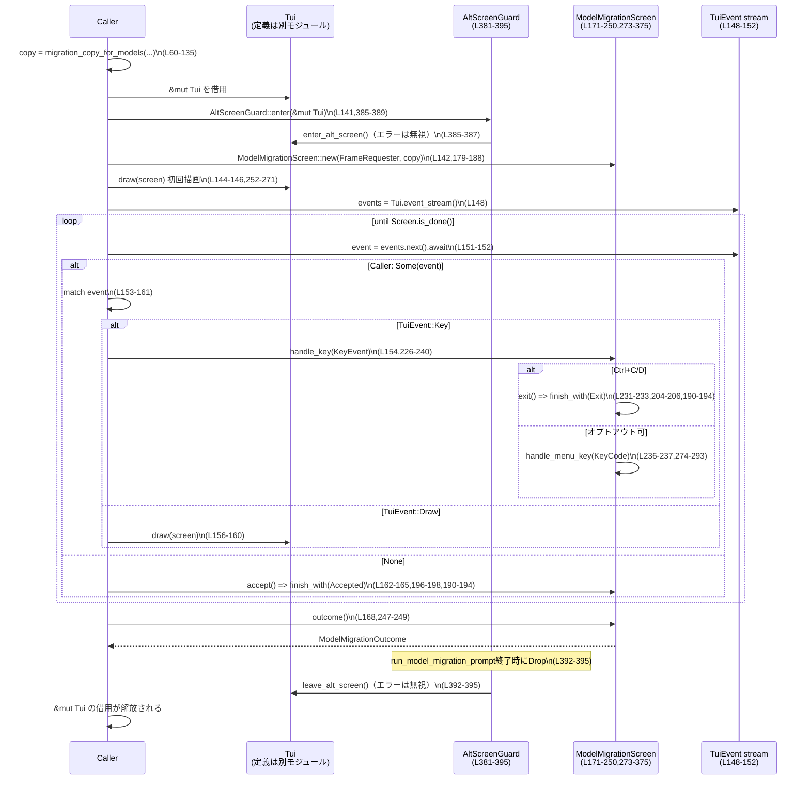

# tui/src/model_migration.rs

## 0. ざっくり一言

モデルの自動アップグレード（「新しいモデルを試す」か「既存モデルを使い続ける」か）を尋ねる **TUIプロンプト画面** を実装するモジュールです。  
コピー文面の生成と、キーボード入力を処理する画面ロジック、描画ロジックをまとめています（`ModelMigrationCopy` / `ModelMigrationScreen` / `run_model_migration_prompt`、`model_migration.rs:L33-39,L171-177,L137-169`）。

---

## 1. このモジュールの役割

### 1.1 概要

- このモジュールは **モデル切り替えをユーザーに確認する TUI プロンプト** を表示し、  
  ユーザーの選択結果（新しいモデルに移行する／既存モデルを使う／プロンプトを中断する）を返すために存在します（`ModelMigrationOutcome`、`model_migration.rs:L25-31`）。
- 文面（コピー）の生成を行う `migration_copy_for_models` と、実際に TUI 上でプロンプトを表示・操作する `run_model_migration_prompt`／`ModelMigrationScreen` に分かれています（`model_migration.rs:L60-135,L137-169,L171-250,L273-375`）。

### 1.2 アーキテクチャ内での位置づけ

このファイル内の主要コンポーネントと、外部依存の関係は次のようになります。

```mermaid
graph TD
  subgraph model_migration.rs (L25-407)
    A[run_model_migration_prompt<br/>(L137-169)]
    B[ModelMigrationScreen<br/>(L171-250,273-375)]
    C[AltScreenGuard<br/>(L381-395)]
    D[migration_copy_for_models<br/>(L60-135)]
  end

  A --> C
  A --> B
  A -->|uses| H[Tui (crate::tui)<br/>(定義はこのチャンク外)]
  A -->|awaits| I[TuiEvent stream<br/>(event_stream, L148-152)]
  B -->|implements| J[WidgetRef<br/>(L252-271)]
  B -->|calls| K[render_markdown_text_with_width<br/>(crate::markdown_render, L317-327)]
  B -->|uses| L[ColumnRenderable / Insets / Paragraph<br/>(crate::render, ratatui, L256-269,L305-375)]
  B -->|uses| M[key_hint / selection_option_row<br/>(L352-374)]
  C -->|calls| H
```

- `Tui` 型や `FrameRequester`、`render_markdown_text_with_width` などの詳細実装はこのファイルには現れません（`model_migration.rs:L1-23`）。  
  名前と利用箇所から、TUI フレーム描画やイベントストリーム、Markdownレンダリングを担当することが推測されますが、挙動はこのチャンクからは断定できません。

### 1.3 設計上のポイント

- **コピー生成と画面状態の分離**  
  - 文面生成は `migration_copy_for_models` と `ModelMigrationCopy` に集約され、描画・入力処理は `ModelMigrationScreen` に集約されています（`model_migration.rs:L33-39,L60-135,L171-177`）。
- **RAII による Alt スクリーン制御**  
  - `AltScreenGuard` が `Drop` 実装で `leave_alt_screen` を呼ぶことで、関数の正常終了・エラー・パニックに関わらず Alt スクリーンから確実に復帰する構造になっています（`model_migration.rs:L381-395`）。
- **非同期イベントループ**  
  - `run_model_migration_prompt` は `async fn` で、`tokio_stream::StreamExt::next` を用いて `TuiEvent` ストリームからイベントを非同期に受信し、`ModelMigrationScreen` に処理を委譲します（`model_migration.rs:L23,L137-169`）。
- **キー入力処理の層分け**  
  - 高レベルの `handle_key` が `KeyEventKind::Release` の無視や Ctrl+Exit の判定を行い、メニュー操作の詳細は `handle_menu_key` に分離されています（`model_migration.rs:L226-240,L274-293`）。
- **言語固有の安全性**  
  - すべて Safe Rust で実装されており、`Drop` とライフタイム（`AltScreenGuard<'a>`）により Tui のライフタイムと Alt スクリーンの対応が静的に保証されています（`model_migration.rs:L381-395`）。
  - `ModelMigrationOutcome` は `Copy` で、結果の取り回しが所有権の移動なしに行えるようになっています（`model_migration.rs:L26-31`）。

---

## 2. 主要な機能とコンポーネント一覧

### 2.1 主要機能一覧

- モデル移行コピーの生成:  
  `migration_copy_for_models` が現在モデル・ターゲットモデル・任意のカスタム文面・Markdown テンプレートから `ModelMigrationCopy` を構築します（`model_migration.rs:L60-135`）。
- モデル移行プロンプトの実行（Alt スクリーン付き）:  
  `run_model_migration_prompt` が Alt スクリーンに入り、プロンプト画面を描画し、ユーザー操作を待って `ModelMigrationOutcome` を返します（`model_migration.rs:L137-169,L381-395`）。
- 画面状態と描画:  
  `ModelMigrationScreen` がコピー・選択状態・完了フラグを管理し、`WidgetRef` 実装で ratatui による描画を行います（`model_migration.rs:L171-177,L252-271,L273-375`）。
- キーボード入力ハンドリング:  
  `ModelMigrationScreen::handle_key` / `handle_menu_key` が `KeyEvent` を受け付け、選択移動・決定・Ctrl+C/D による終了を処理します（`model_migration.rs:L226-240,L274-293,L398-401`）。
- Markdown 表示対応:  
  `ModelMigrationCopy` に Markdown がある場合、`render_markdown_content` を通じて `render_markdown_text_with_width` を使ったラップ付き描画を行います（`model_migration.rs:L34-39,L258-260,L317-338`）。

### 2.2 コンポーネント一覧（型・関数インベントリー）

| 名称 | 種別 | 役割 / 用途 | 定義位置 |
|------|------|-------------|----------|
| `ModelMigrationOutcome` | enum | プロンプト結果（Accepted/Rejected/Exit）を表す（crate 内公開） | `model_migration.rs:L25-31` |
| `ModelMigrationCopy` | struct | 見出し・本文・Markdown テキストと「オプトアウト可能か」を保持（crate 内公開） | `model_migration.rs:L33-39` |
| `MigrationMenuOption` | enum | メニューの二択（TryNewModel / UseExistingModel）を表す内部用 | `model_migration.rs:L41-45` |
| `migration_copy_for_models` | 関数 | モデル名や説明から `ModelMigrationCopy` を組み立てる | `model_migration.rs:L60-135` |
| `run_model_migration_prompt` | `async fn` | TUI 上でプロンプトを実行し、`ModelMigrationOutcome` を返す | `model_migration.rs:L137-169` |
| `ModelMigrationScreen` | struct | プロンプト画面の状態（コピー、選択状態、完了フラグなど）を保持し、キー処理・描画を行う | `model_migration.rs:L171-177` |
| `ModelMigrationScreen::new` ほか | メソッド群 | 状態初期化、結果設定、キー処理、描画補助など | `model_migration.rs:L179-250,L273-375` |
| `AltScreenGuard<'a>` | struct | Alt スクリーンの enter/leave を RAII で管理するガード | `model_migration.rs:L381-383` |
| `AltScreenGuard::enter` | 関数 | Alt スクリーンに入り、`AltScreenGuard` を返す | `model_migration.rs:L385-389` |
| `Drop for AltScreenGuard` | Drop 実装 | `AltScreenGuard` のスコープ終了時に Alt スクリーンを離脱 | `model_migration.rs:L392-395` |
| `is_ctrl_exit_combo` | 関数 | Ctrl+C / Ctrl+D が押されたか判定する | `model_migration.rs:L398-401` |
| `fill_migration_markdown` | 関数 | Markdown テンプレート内の `{model_from}` / `{model_to}` を置換する | `model_migration.rs:L403-407` |
| `tests` モジュール | mod | スナップショットテストとキーハンドリングテスト | `model_migration.rs:L409-627` |

---

## 3. 公開 API と詳細解説

### 3.1 型一覧（構造体・列挙体など）

| 名前 | 種別 | 役割 / 用途 | 定義位置 |
|------|------|-------------|----------|
| `ModelMigrationOutcome` | enum (`Accepted`, `Rejected`, `Exit`) | プロンプトの結果を呼び出し側に返すための値。`Copy` なので所有権移動なしにコピー可能です。 | `model_migration.rs:L25-31` |
| `ModelMigrationCopy` | struct | プロンプトに表示する見出し（`heading`）、本文（`content`）、Markdown テキスト（`markdown`）、オプトアウトの有無（`can_opt_out`）を保持します。 | `model_migration.rs:L33-39` |
| `MigrationMenuOption` | enum | メニューのハイライト状態に対応する内部用列挙体です。`TryNewModel` / `UseExistingModel` の二択のみです。 | `model_migration.rs:L41-45` |
| `ModelMigrationScreen` | struct | プロンプトの状態を保持し、キー入力処理と描画に使われます。`request_frame` で再描画の要求も行います。 | `model_migration.rs:L171-177` |
| `AltScreenGuard<'a>` | struct | `&'a mut Tui` を保持し、`Drop` で Alt スクリーンからの復帰を保証するガードです。 | `model_migration.rs:L381-383` |

### 3.2 関数詳細（主要 6 件）

#### `migration_copy_for_models(...) -> ModelMigrationCopy`（L60-135）

```rust
pub(crate) fn migration_copy_for_models(
    current_model: &str,
    target_model: &str,
    model_link: Option<String>,
    migration_copy: Option<String>,
    migration_markdown: Option<String>,
    target_display_name: String,
    target_description: Option<String>,
    can_opt_out: bool,
) -> ModelMigrationCopy
```

**概要**

- モデル名や説明、任意のカスタム文面・Markdown テンプレートから、プロンプト表示用の `ModelMigrationCopy` を組み立てます（`model_migration.rs:L60-135`）。

**引数**

| 引数名 | 型 | 説明 |
|--------|----|------|
| `current_model` | `&str` | 現在利用中のモデル名。コピー内の「from」に使われます（L62,L105,L123）。 |
| `target_model` | `&str` | 推奨する新しいモデル名。コピー内の「to」に使われます（L63,L105）。 |
| `model_link` | `Option<String>` | モデル詳細ページへの URL。ある場合は文末に「Learn more … at URL」を追記します（L64,L110-115）。 |
| `migration_copy` | `Option<String>` | 完全なカスタム文面。与えられた場合、デフォルトの説明文を置き換えます（L65,L89-100）。 |
| `migration_markdown` | `Option<String>` | Markdown テンプレート。これが `Some` の場合はテキストベースの `heading` / `content` は空になり、Markdown 表示専用になります（L66,L71-81）。 |
| `target_display_name` | `String` | UI に表示されるターゲットモデルの名前。見出しなどに使われます（L67,L84-87,L96-98）。 |
| `target_description` | `Option<String>` | モデルの説明文。`migration_copy` がない場合のデフォルト説明として使われます（L68,L92-100）。 |
| `can_opt_out` | `bool` | ユーザーが「既存モデルを使い続ける」を選択できるかどうか。文末の文言やメニュー表示に影響します（L69,L121-127）。 |

**戻り値**

- `ModelMigrationCopy`  
  - `migration_markdown` が `Some` の場合: `markdown` にテンプレートのプレースホルダを置換した文字列をセットし、`heading` / `content` は空ベクタです（L71-81）。  
  - それ以外: `heading` に見出し文、`content` に本文行のベクタ、`markdown` は `None` です（L84-134）。

**内部処理の流れ**

1. `migration_markdown` が `Some` の場合、`fill_migration_markdown` で `{model_from}` / `{model_to}` を置換し、Markdown 専用の `ModelMigrationCopy` を即座に返します（L71-81,L403-407）。
2. そうでない場合、`target_display_name` を用いて見出し `heading_text` を作成し、太字にします（L84-87）。
3. 説明文 `description_line` を決定します（L88-100）。
   - `migration_copy` が `Some` の場合: それを `Line::from` で使用します（L89-90）。
   - ない場合: `target_description` が非空ならそれを、なければ汎用の推奨文を使います（L92-99）。
4. `migration_copy` が `None` の場合は「We recommend switching from …」の行を本文先頭に追加します（L102-108）。
5. `model_link` が `Some` の場合は `description_line` と URL を連結した行を追加し、なければ `description_line` の行のみを追加します（L110-119）。
6. `can_opt_out` が `true` なら「You can continue using …」の行を、`false` なら「Press enter to continue」の行（dim スタイル）を追加します（L121-127）。
7. 最後に `ModelMigrationCopy` を構築して返します（L129-134）。

**Errors / Panics**

- この関数内部で `Result` や `panic!` を使用していません。標準ライブラリのフォーマットや ratatui の型変換がパニックを起こすかどうかは、このファイルからは分かりません。
- `String` や `Vec` の生成・push は、メモリ不足時にパニックする可能性がありますが、これは Rust 標準の挙動です。

**Edge cases（エッジケース）**

- `migration_markdown` が `Some` の場合、`heading` と `content` は空で、UI は Markdown だけを表示します（L71-81,L258-260）。
- `migration_copy` が `Some` かつ `model_link` も `Some` の場合、本文は「カスタム文面 + Learn more + URL」となり、デフォルトの "We recommend switching …" 行は追加されません（L89-90,L102-108,L110-115）。
- `target_description` が空文字列の場合（`Some("")`）、`filter(|desc| !desc.is_empty())` により無視され、フォールバック文が使われます（L92-99）。
- `model_link` が `None` の場合、URL 行は表示されず、`description_line` のみが表示されます（L116-119）。

**使用上の注意点**

- Markdown ベースのコピーを使いたい場合は `migration_markdown: Some(...)` を渡す必要があり、その場合 `heading` と `content` は使われません（UI 側はこの前提で実装されています）（L71-81,L258-260）。
- テキストベースのコピーと Markdown を同時に表示する用途には対応していません（どちらか一方のみ）（L71-81,L258-264）。
- `model_link` にはすでにスタイル情報が付与される前提で `model_link.cyan().underlined()` を呼んでいるため（L113）、リンクとして強調表示されます。

---

#### `run_model_migration_prompt(tui: &mut Tui, copy: ModelMigrationCopy) -> ModelMigrationOutcome`（L137-169）

**概要**

- `Tui` インスタンス上でモデル移行プロンプト画面を表示し、ユーザーの操作が完了するまで非同期に待ち、最終的な `ModelMigrationOutcome` を返します（`model_migration.rs:L137-169`）。

**引数**

| 引数名 | 型 | 説明 |
|--------|----|------|
| `tui` | `&mut Tui` | フレーム描画やイベントストリーム取得に使用する TUI 実装。具体的な中身はこのファイルには現れません（L138）。 |
| `copy` | `ModelMigrationCopy` | 画面に表示するコピー情報（見出し・本文または Markdown・オプトアウト可否）です（L139）。 |

**戻り値**

- `ModelMigrationOutcome`  
  ユーザーの選択結果を表します。デフォルトは `Accepted` で、特定のキー入力やイベント終了時に他の値になる可能性があります（L185-186,L168-168）。

**内部処理の流れ**

1. `AltScreenGuard::enter` により Alt スクリーンに入り、ガード `alt` を得ます。`alt` がスコープを抜けると Alt スクリーンから自動的に復帰します（L141,L381-395）。
2. `ModelMigrationScreen::new` で画面状態 `screen` を生成します（L142,L179-188）。
3. 一度初回描画を行います（`tui.draw` に `WidgetRef::render_ref` を渡す）（L144-146）。
4. イベントストリームを取得し、`tokio::pin!` でピン留めします（L148-149）。
5. `screen.is_done()` が `false` の間、イベントを `events.next().await` で非同期に待ち受けます（L151-152）。
   - `Some(event)` の場合:
     - `TuiEvent::Key` なら `screen.handle_key` に転送します（L153-155,L226-240）。
     - `TuiEvent::Paste(_)` は無視します（L155）。
     - `TuiEvent::Draw` なら再描画を行います（L156-160）。
   - `None`（イベントストリームが終了）の場合:
     - `screen.accept()` を呼び、受諾として扱ってループを抜けます（L162-165,L196-198）。
6. ループ終了後、`screen.outcome()` を返します（L168-168,L247-249）。

**Errors / Panics**

- `tui.enter_alt_screen()` / `tui.leave_alt_screen()` / `tui.draw()` の返り値は `let _ = ...` で破棄され、エラーは呼び出し元に伝播しません（L141,L144,L157,L393-395）。  
  これにより、Alt スクリーン操作や描画処理の失敗は静かに無視されます。
- `events.next().await` がエラーを返すかどうかは、このファイルからは分かりません。`Option` を返すインターフェースだけが見えています（L151-152）。
- 関数自体は `Result` を返さず、`panic!` も使用していません。

**Edge cases（エッジケース）**

- **イベントストリーム終了**: `events.next().await` が `None` を返すと、`screen.accept()` が呼ばれ、結果は `Accepted` になります（L162-165）。意図としては「イベントが途切れたらアップグレードを受諾」という挙動になっています。
- **Paste イベント**: `TuiEvent::Paste(_)` は何もせず無視されます（L155）。
- **Draw イベント**: `TuiEvent::Draw` が来た場合のみ再描画されますが、`ModelMigrationScreen` 内から `request_frame.schedule_frame()` を呼ぶことで描画要求がスケジュールされる前提です（L157-160,L190-194,L219-223）。

**使用上の注意点**

- この関数は `async fn` なので、Tokio などの非同期ランタイムの中で `.await` して呼び出す必要があります（Rust の言語仕様による要件）。
- `tui` は `&mut Tui` で渡されるため、同じ `Tui` に対して並行して別の `run_model_migration_prompt` を走らせることはコンパイル時に禁止されます（所有権・排他参照のルールによる）。
- Alt スクリーンの enter/leave のエラーは無視されるため、Alt スクリーンに入れなかった場合でも関数は続行します（L385-389,L392-395）。アプリケーション全体でこの挙動が問題になり得るかどうかは、他コードを見ないと判断できません。

---

#### `ModelMigrationScreen::handle_key(&mut self, key_event: KeyEvent)`（L226-240）

**概要**

- `KeyEvent` を受け取り、キー種別や修飾キーに応じてプロンプトの状態（結果・選択）を更新します（`model_migration.rs:L226-240`）。

**引数**

| 引数名 | 型 | 説明 |
|--------|----|------|
| `key_event` | `KeyEvent` | Crossterm のキーイベント。キーコード・修飾キー・イベント種別を含みます（L226-228）。 |

**戻り値**

- 戻り値はありません。`self` のフィールド `done` や `outcome`、`highlighted_option` を更新します（L190-206,L219-223,L243-249）。

**内部処理の流れ**

1. `key_event.kind` が `KeyEventKind::Release` の場合は即座に return し、キーリリースイベントを無視します（L227-228）。
2. `is_ctrl_exit_combo(key_event)` が `true` の場合（Ctrl+C または Ctrl+D）、`self.exit()` を呼び、結果を `Exit` に設定して終了します（L231-233,L398-401,L204-206）。
3. `self.copy.can_opt_out` が `true` の場合は `self.handle_menu_key(key_event.code)` を呼び、メニュー操作に委譲します（L236-237,L274-293）。
4. `can_opt_out` が `false` の場合は、`KeyCode::Esc` または `KeyCode::Enter` なら `self.accept()` を呼びます（L238-239,L196-198）。それ以外のキーは無視されます。

**Errors / Panics**

- このメソッドは `Result` を返さず、`panic!` も使用していません。
- `is_ctrl_exit_combo` も単なる条件判定で、外部 I/O を行いません（L398-401）。

**Edge cases（エッジケース）**

- **キーリリース無視**: 同じキーの押下と離脱で二重にイベントが来る環境でも、押下側のみ処理されます（L227-228）。
- **`can_opt_out == false` の場合**:
  - `Esc` も `Enter` も「受諾」として扱われます（L238-239）。
  - メニューが表示されないため、上下キーや数字キーは何も起こしません（L236-240,L258-267,L341-375）。
- **Ctrl+C / Ctrl+D**: 常に `Exit` として扱われ、`can_opt_out` の値に関係なくプロンプトが終了します（L231-233,L398-401）。

**使用上の注意点**

- Ctrl+C / Ctrl+D をアプリ全体で他目的（例: プロセス全体の終了）に使っている場合、このプロンプト内では `Exit` 扱いになることを考慮する必要があります（キーの意味が UI レベルで変わるため）（L231-233,L398-401）。
- `can_opt_out` によってキーバインドの意味が変わる点（メニューがある／ない、Esc の意味）が UI 仕様として重要です（L236-239,L265-267,L341-375）。

---

#### `impl WidgetRef for &ModelMigrationScreen::render_ref(...)`（L252-271）

```rust
impl WidgetRef for &ModelMigrationScreen {
    fn render_ref(&self, area: Rect, buf: &mut Buffer) { ... }
}
```

**概要**

- ratatui の `WidgetRef` トレイト実装として、`ModelMigrationScreen` の現在の状態を指定された矩形領域に描画します（`model_migration.rs:L252-271`）。

**引数**

| 引数名 | 型 | 説明 |
|--------|----|------|
| `area` | `ratatui::layout::Rect` | 画面上の描画領域。幅は Markdown ラップ幅の計算にも使用します（L253,L259,L320-325）。 |
| `buf` | `&mut ratatui::buffer::Buffer` | 描画対象バッファ。`Clear` や `ColumnRenderable` がここに書き込みます（L253-255,L269）。 |

**戻り値**

- 戻り値はありません。`buf` に描画内容を書き込みます（L269-269）。

**内部処理の流れ**

1. `Clear.render(area, buf)` で描画領域をクリアします（L254-254）。
2. `ColumnRenderable::new()` で縦方向に要素を積むためのコンテナを生成します（L256-256）。
3. 先頭に空行を `column.push("")` で追加します（L257-257）。
4. `self.copy.markdown` が `Some` なら `render_markdown_content` を呼び、Markdown コンテンツを描画します（L258-260,L317-338）。
5. そうでない場合、`heading_line` と空行、本文（`render_content`）を描画します（L261-264,L295-303）。
6. `self.copy.can_opt_out` が `true` の場合は、メニュー（`render_menu`）を描画します（L265-267,L341-375）。
7. 最後に `column.render(area, buf)` で全体をバッファに反映します（L269-269）。

**Errors / Panics**

- `Clear.render` や `column.render` の内部挙動はこのファイルには現れません。一般的には描画中にパニックする可能性はありますが、このコードからは判断できません。

**Edge cases（エッジケース）**

- `markdown` が `Some` の場合、`heading` と `content` は描画されません（L258-260）。
- `can_opt_out == false` の場合、メニュー行やキーヒントは描画されません（L265-267,L341-375）。

**使用上の注意点**

- `WidgetRef` 実装は `&ModelMigrationScreen` に対して実装されており、所有権を移動せずに描画できるため、`screen` をイベントループでミュータブルに扱いつつ描画時には共有参照で借用するパターンに対応しています（L252-252）。
- 描画内容は `ModelMigrationCopy` の状態（Markdown 有無・オプトアウト可否）に依存するため、コピー生成の設計と整合させる必要があります（L33-39,L258-267）。

---

#### `ModelMigrationScreen::render_markdown_content(&self, markdown: &str, area_width: u16, column: &mut ColumnRenderable)`（L317-338）

**概要**

- Markdown テキストを与えられた幅に合わせてラップし、インデント付きの `Paragraph` として `ColumnRenderable` に積み上げます（`model_migration.rs:L317-338`）。

**引数**

| 引数名 | 型 | 説明 |
|--------|----|------|
| `markdown` | `&str` | 描画対象の Markdown テキスト。テンプレート展開後の文字列を想定。（L319,L326） |
| `area_width` | `u16` | 現在の描画領域の幅。インデントを引いたコンテンツ幅の計算に使います（L320,L323-325）。 |
| `column` | `&mut ColumnRenderable` | 段落を積む対象のコンテナです（L321,L328-337）。 |

**戻り値**

- 戻り値はありません。`column` に段落要素を追加します（L328-337）。

**内部処理の流れ**

1. 左インデントとして `horizontal_inset = 2` を設定します（L323-323）。
2. `content_width = area_width.saturating_sub(horizontal_inset)` でコンテンツの横幅を計算し、0 未満にならないよう飽和減算を使います（L324-324）。
3. `wrap_width` を `Option<usize>` として、`content_width > 0` の場合だけ `Some(content_width as usize)` を設定します（L325-325）。
4. `render_markdown_text_with_width(markdown, wrap_width)` で Markdown のレンダリングとラップを行い、行リストを得ます（L326-326）。
5. 各行について、`Paragraph::new(line)` に `.wrap(Wrap { trim: false })` と `.inset(Insets::tlbr(0, horizontal_inset, 0, 0))` を適用し、`column.push` に追加します（L327-337）。

**Errors / Panics**

- `render_markdown_text_with_width` の実装はこのファイルにはないため、その内部でのエラー可能性は不明です（`model_migration.rs:L2,L326`）。
- `saturating_sub` により、`area_width` が小さくても算術オーバーフローは発生しません（L324）。
- それ以外に明示的なパニックはありません。

**Edge cases（エッジケース）**

- `area_width <= horizontal_inset` の場合、`content_width` は 0 となり、`wrap_width` は `None` になります（L324-325）。このとき `render_markdown_text_with_width` がどのようにラップを扱うかは、このファイルからは分かりませんが、テストでは幅 40 でも URL の末尾が見えることが確認されています（L599-625）。
- 非常に長い URL でも末尾 `"tail42"` が表示に残ることがテストで確認されています（L599-625）。

**使用上の注意点**

- Markdown 専用モードでは `heading` / `content` が空のため、ユーザーに必要な情報はすべて Markdown 内に含める必要があります（L71-81,L258-260）。
- 横幅に対するラップの詳細挙動は `render_markdown_text_with_width` に依存するため、Markdown 表示の見た目を変えたい場合はそちらの実装を確認する必要があります。

---

#### `ModelMigrationScreen::render_menu(&self, column: &mut ColumnRenderable)`（L341-375）

**概要**

- オプトアウト可能な場合に表示されるメニュー部分（説明文・選択肢リスト・キーバインドのヒント）を描画用カラムに追加します（`model_migration.rs:L341-375`）。

**引数**

| 引数名 | 型 | 説明 |
|--------|----|------|
| `column` | `&mut ColumnRenderable` | メニューの行を積み上げる対象です（L341-374）。 |

**戻り値**

- なし。`column` に描画用の要素を追加します。

**内部処理の流れ**

1. 空行を追加します（L342-342）。
2. 「Choose how you'd like Codex to proceed.」という説明文を左インデント 2 付き `Paragraph` として追加します（L343-349）。
3. 再度空行を追加します（L350-350）。
4. `MigrationMenuOption::all()`（Try/Use の二択）を `enumerate()` して、各選択肢を `selection_option_row` で行に変換し `column.push` に追加します（L352-357）。
   - `self.highlighted_option == option` によりハイライトの有無を渡します（L356-356）。
5. 空行を追加します（L360-360）。
6. 下部に、矢印キーと Enter キーの使い方を示すキーヒント行を追加します（L361-374）。
   - `key_hint::plain(KeyCode::Up)` などを用いて、スタイリングされたキー表現を組み立てています（L362-369）。

**Errors / Panics**

- `selection_option_row` や `key_hint::plain` の内部挙動はこのファイルにはありません。一般には描画用の行を返すヘルパーと推測されますが、詳細は不明です（L7,L352-357,L362-369）。

**Edge cases（エッジケース）**

- `MigrationMenuOption::all()` は `[TryNewModel, UseExistingModel]` の固定配列を返すため、選択肢は常に 2 つで一定です（L47-50,L352-352）。
- `highlighted_option` によってハイライト状態が変わり、`handle_menu_key` から更新されます（L219-223,L274-293,L352-357）。

**使用上の注意点**

- メニューは `can_opt_out == true` の場合にのみ描画されます（`render_ref` 内の条件、L265-267）。  
  プロンプトを「強制アップグレード」としたい場合は `can_opt_out: false` にする必要があります（L121-127）。
- 選択肢の文言 (`MigrationMenuOption::label`) は固定の英語文字列（"Try new model" / "Use existing model"）です（L52-57）。文言を変えたい場合はここを編集する必要があります。

---

#### `ModelMigrationScreen::handle_menu_key(&mut self, code: KeyCode)`（L274-293）

**概要**

- メニュー表示中（`can_opt_out == true`）におけるキー操作（上下・1/2・Enter/Esc）を処理し、選択状態と確定操作を行います（`model_migration.rs:L274-293`）。

**引数**

| 引数名 | 型 | 説明 |
|--------|----|------|
| `code` | `KeyCode` | 押されたキーのコード。`handle_key` から渡されます（L274,L236-237）。 |

**戻り値**

- なし。`highlighted_option` と `done` / `outcome` を更新します。

**内部処理の流れ**

1. `KeyCode::Up` または `Char('k')` の場合、`TryNewModel` にハイライトを移します（L276-278）。
2. `KeyCode::Down` または `Char('j')` の場合、`UseExistingModel` にハイライトを移します（L279-281）。
3. `Char('1')` の場合、`TryNewModel` をハイライトして `accept()` を呼び、アップグレード受諾として終了します（L282-285）。
4. `Char('2')` の場合、`UseExistingModel` をハイライトして `reject()` を呼び、アップグレード拒否として終了します（L286-289）。
5. `Enter` または `Esc` の場合、`confirm_selection()` を呼び、現在のハイライトに応じて `accept()` または `reject()` を実行します（L290-290,L208-217）。
6. その他のキーは無視します（L291-291）。

**Errors / Panics**

- エラー処理やパニックはありません。すべて状態更新のみです。

**Edge cases（エッジケース）**

- `k` / `j` による移動は Vim 風のキーバインドとして実装されています（L276-281）。
- `1` / `2` 押下時はハイライトも更新されるため、その後 Enter を押しても同じ結果になります（L282-289,L208-217）。
- `confirm_selection()` は `can_opt_out == true` の前提で呼ばれます（`handle_key`ではこの条件下でのみ`handle_menu_key`が呼ばれています、L236-237,L208-214）。

**使用上の注意点**

- キーバインドの追加・変更はこの関数を編集するのが入口になります。`KeyCode` と `MigrationMenuOption` の対応がここに集約されています（L274-293）。
- Escape (`Esc`) は「キャンセル」ではなく「現在ハイライトされている選択肢で確定」として扱われる点に注意が必要です（L290-290,L208-213）。

---

### 3.3 その他の関数（簡易一覧）

| 関数名 | 役割（1 行） | 定義位置 |
|--------|--------------|----------|
| `MigrationMenuOption::all()` | `TryNewModel` と `UseExistingModel` の 2 要素配列を返します。 | `model_migration.rs:L47-50` |
| `MigrationMenuOption::label()` | 各オプションの表示文字列（"Try new model" / "Use existing model"）を返します。 | `model_migration.rs:L52-57` |
| `ModelMigrationScreen::new()` | 初期状態（`done = false`, outcome = `Accepted`, ハイライト = `TryNewModel`）で画面を構築します。 | `model_migration.rs:L179-188` |
| `ModelMigrationScreen::finish_with()` | 結果と完了フラグをセットし、フレーム再描画をスケジュールします。 | `model_migration.rs:L190-194` |
| `ModelMigrationScreen::accept()/reject()/exit()` | それぞれ `ModelMigrationOutcome::Accepted/Rejected/Exit` で `finish_with` を呼びます。 | `model_migration.rs:L196-206` |
| `ModelMigrationScreen::is_done()/outcome()` | 完了フラグと結果を返すゲッターです。 | `model_migration.rs:L243-249` |
| `ModelMigrationScreen::heading_line()` | 行頭に `"> "` を付けた見出し行を生成します。 | `model_migration.rs:L295-299` |
| `ModelMigrationScreen::render_content()` | `self.copy.content` を `render_lines` を通じて描画に追加します。 | `model_migration.rs:L301-303` |
| `ModelMigrationScreen::render_lines()` | 各 `Line` をインデント 2 付きの Paragraph として追加します。 | `model_migration.rs:L305-314` |
| `AltScreenGuard::enter()` | `tui.enter_alt_screen()` を呼び、ガードを返します（エラーは無視）。 | `model_migration.rs:L385-389` |
| `Drop for AltScreenGuard::drop()` | スコープ終了時に `tui.leave_alt_screen()` を呼びます（エラーは無視）。 | `model_migration.rs:L392-395` |
| `is_ctrl_exit_combo()` | Ctrl+C または Ctrl+D かどうかを判定します。 | `model_migration.rs:L398-401` |
| `fill_migration_markdown()` | テンプレートの `{model_from}` / `{model_to}` を文字列置換します。 | `model_migration.rs:L403-407` |

---

## 4. データフロー

ここでは、`run_model_migration_prompt` が呼ばれてから結果が返るまでの典型的なフローを示します。

### 4.1 処理の流れ（高レベル）

1. 呼び出し元が `migration_copy_for_models` などで `ModelMigrationCopy` を用意する（L60-135）。
2. `run_model_migration_prompt(&mut tui, copy).await` を呼ぶ（L137-169）。
3. 関数内で Alt スクリーンに入り、`ModelMigrationScreen` を初期化して一度描画する（L141-146,L179-188,L252-271）。
4. イベントストリームから `TuiEvent` を非同期で受信し続け、`Key` イベントは `handle_key` に転送される（L148-155,L226-240）。
5. `ModelMigrationScreen` 内で状態を更新し、終了条件を満たすと `done = true` になる（L190-206,L208-217）。
6. ループが抜けると `screen.outcome()` が返され、`AltScreenGuard` の Drop で Alt スクリーンから復帰する（L168,L381-395）。

### 4.2 シーケンス図



---

## 5. 使い方（How to Use）

### 5.1 基本的な使用方法

ここでは、TUI アプリケーションの中からモデル移行プロンプトを表示し、結果に応じて挙動を変える例を示します。

```rust
use crate::tui::Tui;                       // Tui 型の定義は別モジュール（このチャンク外）
use crate::tui::model_migration::{
    migration_copy_for_models,
    run_model_migration_prompt,
    ModelMigrationOutcome,
};                                         // モジュールの再エクスポート状況はこのチャンクには現れません

async fn maybe_prompt_model_migration(tui: &mut Tui) -> std::io::Result<()> {
    // 1. コピー情報を組み立てる（テキストベースの例）
    let copy = migration_copy_for_models(
        "gpt-5-codex-mini",                // current_model
        "gpt-5.1-codex-max",               // target_model
        Some("https://www.codex.com/models/gpt-5.1-codex-max".to_string()), // model_link
        None,                              // migration_copy（カスタム文面なし）
        None,                              // migration_markdown（Markdown なし）
        "gpt-5.1-codex-max".to_string(),   // target_display_name
        Some("Codex-optimized flagship for deep and fast reasoning.".to_string()),
        true,                              // can_opt_out: 既存モデルを使い続ける選択肢を出す
    );

    // 2. プロンプトを実行し、ユーザーの選択を待つ
    let outcome = run_model_migration_prompt(tui, copy).await;

    // 3. 結果に応じて処理を分ける
    match outcome {
        ModelMigrationOutcome::Accepted => {
            // 新しいモデルへの移行を続行する
        }
        ModelMigrationOutcome::Rejected => {
            // 既存モデルを使い続ける
        }
        ModelMigrationOutcome::Exit => {
            // プロンプトを中断したので、呼び出し元のフローも中断するなど
        }
    }

    Ok(())
}
```

- `run_model_migration_prompt` は Alt スクリーンの enter/leave を内部で管理するため、呼び出し側では特別なクリーンアップは不要です（L137-169,L381-395）。

### 5.2 よくある使用パターン

#### パターン1: Markdown ベースのプロンプト

Markdown テンプレートを使って、より柔軟なレイアウト・リンクを含むプロンプトを表示する例です。

```rust
use crate::tui::model_migration::{ModelMigrationCopy, run_model_migration_prompt};

async fn show_markdown_migration_prompt(tui: &mut Tui) {
    let template = r#"
# Model Upgrade

We recommend upgrading from **{model_from}** to **{model_to}**.

See the [release notes](https://example.com/releases/{model_to}) for details.
"#;

    // Markdown モードでは heading/content は空で良い
    let copy = ModelMigrationCopy {
        heading: Vec::new(),
        content: Vec::new(),
        can_opt_out: false,                   // オプトアウト不可（メニュー非表示）
        markdown: Some(
            crate::tui::model_migration::fill_migration_markdown(
                template,
                "gpt-5",
                "gpt-5.1",
            ),
        ),
    };

    let outcome = run_model_migration_prompt(tui, copy).await;
    // can_opt_out = false なので、Esc/Enter はどちらも Accepted になります（L238-239）
    assert!(matches!(outcome, ModelMigrationOutcome::Accepted));
}
```

- ここでは `fill_migration_markdown` を直接呼び出していますが、`migration_copy_for_models` に `migration_markdown: Some(template.to_string())` を渡しても同じ結果になります（L71-81,L403-407）。

#### パターン2: テスト環境でのスナップショット描画

テストモジュールで行っているように、`FrameRequester::test_dummy()` と `VT100Backend` を使って、画面のスナップショットを取得するパターンです（L423-454,L456-535）。

```rust
#[test]
fn prompt_snapshot_like_tests() {
    use crate::custom_terminal::Terminal;
    use crate::test_backend::VT100Backend;
    use crate::tui::FrameRequester;
    use crate::tui::model_migration::{ModelMigrationScreen, migration_copy_for_models};
    use ratatui::layout::Rect;

    let backend = VT100Backend::new(60, 22);
    let mut terminal = Terminal::with_options(backend).expect("terminal");
    terminal.set_viewport_area(Rect::new(0, 0, 60, 22));

    let screen = ModelMigrationScreen::new(
        FrameRequester::test_dummy(),
        migration_copy_for_models(
            "gpt-5",
            "gpt-5.1",
            None,
            None,
            None,
            "gpt-5.1".to_string(),
            Some("Broad world knowledge with strong general reasoning.".to_string()),
            true,
        ),
    );

    {
        let mut frame = terminal.get_frame();
        frame.render_widget_ref(&screen, frame.area()); // WidgetRef 実装が使われる（L252-271）
    }
    terminal.flush().expect("flush");

    // snapshot ライブラリで画面内容を検証するなど
}
```

### 5.3 よくある間違い

（推測ではなく、このコードから自然に読み取れる誤用パターンを列挙します）

```rust
// 誤り例: async コンテキスト外で await せずに呼ぶ
fn wrong_use(tui: &mut Tui, copy: ModelMigrationCopy) {
    // コンパイルエラー: `run_model_migration_prompt` は async fn
    // let outcome = run_model_migration_prompt(tui, copy);
}

// 正しい例: 非同期コンテキスト内で await する
async fn correct_use(tui: &mut Tui, copy: ModelMigrationCopy) {
    let outcome = run_model_migration_prompt(tui, copy).await;
}
```

```rust
// 誤り例: can_opt_out の仕様を誤解して、Esc を「キャンセル」と期待する
let copy = migration_copy_for_models(/* ... */, /*can_opt_out*/ false);
let outcome = run_model_migration_prompt(tui, copy).await;
// Esc を押しても outcome は Accepted になる（L238-239）

// 正しい理解: can_opt_out = false のとき Esc/Enter はどちらも受諾
assert!(matches!(outcome, ModelMigrationOutcome::Accepted));
```

### 5.4 使用上の注意点（まとめ）

- **Alt スクリーンの enter/leave**  
  - `AltScreenGuard` 内で `enter_alt_screen` / `leave_alt_screen` を呼びますが、エラーは無視されます（L385-389,L392-395）。  
    Alt スクリーンへの切り替えに失敗してもプロンプトは実行される可能性があります。
- **イベントストリーム終了時の挙動**  
  - `event_stream().next().await` が `None` を返した場合、自動的に `Accepted` として扱われます（L162-165）。  
    これは「イベントが途切れたらアップグレードを受諾する」という仕様になっています。
- **Ctrl+C / Ctrl+D**  
  - これらのキーは `Exit` として扱われます（L398-401,L231-233）。  
    アプリケーション全体での Ctrl+C の意味（プロセス終了など）と整合性を取る必要があります。
- **オプトアウト有無による UI 違い**  
  - `can_opt_out` が `true` の場合のみメニューが表示され、`Rejected` を選択できます（L121-127,L265-267,L341-375）。  
    `false` の場合は単一の「続行」操作として振る舞い、`Rejected` になる経路はありません（L236-239）。

---

## 6. 変更の仕方（How to Modify）

### 6.1 新しい機能を追加する場合

例として、「3つ目の選択肢（たとえば `RemindMeLater`）を追加する」場合の変更ポイントを整理します。

1. **選択肢の列挙体を拡張する**  
   - `MigrationMenuOption` に新しい variant を追加し、`all()` に含めます（L41-50）。
   - `label()` に表示文字列を追加します（L52-57）。
2. **結果列挙体の拡張**  
   - 必要であれば `ModelMigrationOutcome` に新しい variant を追加します（L25-31）。
3. **キー操作の拡張**  
   - `handle_menu_key` に新しいキー（例: `Char('3')`）と新しいオプションの対応を追加します（L274-293）。
4. **メニュー描画の更新**  
   - `MigrationMenuOption::all()` は enumerate されているため、選択肢が 3 つになっても自動的に描画されます（L352-357）。  
     特定の順番や装飾を変更したい場合は、このループを編集します。
5. **結果の扱い**  
   - `confirm_selection` で `highlighted_option` に応じた分岐を追加し、新しい結果 variant を返すようにします（L208-213）。

### 6.2 既存の機能を変更する場合の注意点

- **前提条件（契約）を確認する**  
  - `run_model_migration_prompt` は `Accepted` をデフォルト結果として設計されており、イベントストリーム終了時も `Accepted` になります（L185-186,L162-165）。  
    この前提を変える場合、呼び出し側の期待する挙動も併せて確認する必要があります。
- **キー割り当ての変更**  
  - Ctrl+C / Ctrl+D に別の意味を割り当てたい場合は、`is_ctrl_exit_combo` と `handle_key` を変更します（L226-233,L398-401）。  
    変更後はテスト（`escape_key_accepts_prompt` や `selecting_use_existing_model_rejects_upgrade`）も更新する必要があります（L538-596）。
- **描画レイアウトの変更**  
  - インデントやラップ幅の計算は `render_lines` / `render_markdown_content` に集中しているため（L305-314,L317-337）、レイアウト変更はここが入口になります。
- **テストの更新**  
  - 画面のレイアウトや文言を変えると、スナップショットテスト（`prompt_snapshot*`）が失敗するため、意図した変更であればスナップショットの更新が必要です（L423-535）。

---

## 7. 関連ファイル

このモジュールと密接に関係するコンポーネント（名前は `use` から分かる範囲）をまとめます。

| パス / シンボル | 役割 / 関係 |
|-----------------|------------|
| `crate::tui::Tui` / `FrameRequester` / `TuiEvent` | TUI フレーム描画・イベントストリームの提供元。`run_model_migration_prompt` と `ModelMigrationScreen` から使用されます（L8-10,L137-169,L171-177）。定義はこのチャンクには現れません。 |
| `crate::render::renderable::ColumnRenderable` / `Renderable` / `RenderableExt` | 複数のウィジェットを縦に積んで描画するためのユーティリティとして使われます（L4-6,L256-269,L305-375）。詳細な実装はこのチャンクには現れません。 |
| `crate::render::Insets` | `Paragraph` のインセット（マージン）指定に使用されます（L3,L305-313,L317-337,L343-349,L371-373）。 |
| `crate::markdown_render::render_markdown_text_with_width` | Markdown を指定幅でラップして `Line` の集合に変換する関数です（L2,L317-327）。実装はこのチャンクには現れません。 |
| `crate::selection_list::selection_option_row` | メニュー選択肢の 1 行表示を作成するヘルパーです（L7,L352-357）。 |
| `crate::key_hint` | キーボード操作のヒントをスタイル付き文字列として描画するユーティリティです（L1,L362-369）。 |
| `crossterm::event::{KeyEvent, KeyCode, KeyEventKind, KeyModifiers}` | キーボードイベントの表現に使用されます。入力処理の中心的な依存です（L11-14,L226-240,L274-293,L398-401,L417-418,L554-557,L583-589）。 |
| `ratatui::{widgets, text, prelude}` | 画面描画（Clear, Paragraph, Wrap, Span, Line, Stylize など）に用いられる TUI ライブラリです（L15-22,L254-269,L305-375）。 |
| `tokio_stream::StreamExt` | イベントストリームから非同期に `next()` を取得するためのトレイトです（L23,L151-152）。 |
| テスト関連: `crate::custom_terminal::Terminal`, `crate::test_backend::VT100Backend`, `insta::assert_snapshot` | スナップショットテストと描画検証に使われます（L414-420,L423-535,L599-625）。 |

---

## Bugs / Security / Contracts / Tests / 性能・観察性（補足）

### バグ・セキュリティ上の観点

- このファイル内では外部入力をそのままシェルコマンド等に渡したり、ネットワークやファイル I/O を行ったりしていないため、明白なセキュリティ脆弱性は読み取れません（L1-23,L398-407）。
- `enter_alt_screen` / `leave_alt_screen` / `draw` のエラーを無視しているため（L385-389,L392-395,L144-146,L157-160）、障害発生時の検知が難しくなる可能性がありますが、これは設計方針と受け取れます。バグかどうかは他モジュールの方針とあわせて判断する必要があります。
- `Ctrl+D` を Exit として扱う挙動がアプリ全体の期待と合致しているかは、このファイル単体からは分かりません（L398-401,L231-233）。

### 契約・エッジケースのまとめ

- `run_model_migration_prompt` の契約:
  - イベントストリームが途切れた場合は `Accepted` を返す（L162-165）。
  - `can_opt_out == false` の場合、`Rejected` へ到達する経路は存在しない（L236-239,L265-267,L341-375）。
- `ModelMigrationScreen::handle_key` の契約:
  - KeyRelease イベントは無視される（L227-228）。
  - Ctrl+C/D は常に `Exit` として扱う（L231-233,L398-401）。
- Markdown 表示の契約:
  - `migration_markdown` が `Some` の場合、`heading` / `content` は描画されない（L71-81,L258-260）。

### テスト

テストモジュールでは、以下の点が検証されています（`model_migration.rs:L409-627`）。

- `prompt_snapshot` / `prompt_snapshot_gpt5_family` / `prompt_snapshot_gpt5_codex` / `prompt_snapshot_gpt5_codex_mini`  
  - それぞれ異なるモデル名・オプションで `ModelMigrationScreen` を生成し、ターミナルのスナップショットが期待値と一致することを検証しています（L423-535）。  
  - 画面レイアウトや文言を変更するとこれらが失敗します。
- `escape_key_accepts_prompt`  
  - `can_opt_out == true` の状態で `Esc` を押した場合、`is_done() == true` かつ `outcome() == Accepted` になることを検証しています（L538-564）。  
  - 「Esc は Exit ではなく Enter と同じ意味を持つ」という仕様がテストで固定化されています。
- `selecting_use_existing_model_rejects_upgrade`  
  - `Down` → `Enter` の操作で `Rejected` になることを検証しています（L567-596）。
- `markdown_prompt_keeps_long_url_tail_visible_when_narrow`  
  - 幅 40 の端末に長い URL を Markdown として表示した際、末尾 `"tail42"` が画面に含まれることを確認しています（L599-625）。  
  - これは `render_markdown_text_with_width` の挙動に依存しますが、その関数の実装はこのチャンクには現れません。

### 性能・スケーラビリティ・観察性（このファイルから分かる範囲）

- パフォーマンス:
  - イベントループ内では 1 イベントごとに軽量な状態更新と場合によっては再描画のみを行っており、重い計算やブロッキング I/O は含まれていません（L151-161,L226-240,L252-271）。
  - Markdown のレンダリングは `render_markdown_text_with_width` に委譲されており、Markdown コンテンツが非常に大きい場合の性能はそちらに依存します（L317-327）。
- スケーラビリティ:
  - このモジュールは単一のプロンプト画面専用であり、大量同時接続のようなスケーラビリティとは直接関係しません。  
    ただし `run_model_migration_prompt` が `&mut Tui` を取り、1 つの Tui に対し同時に複数のプロンプトを走らせない構造になっている点は、設計上の制約として理解できます（L137-139）。
- 観察性（Observability）:
  - ログ出力やメトリクス収集はこのファイル内にはありません（`println!` やロガー呼び出しもありません）。  
    挙動の検証は主にスナップショットテストに依存しています（L423-535,L599-625）。
