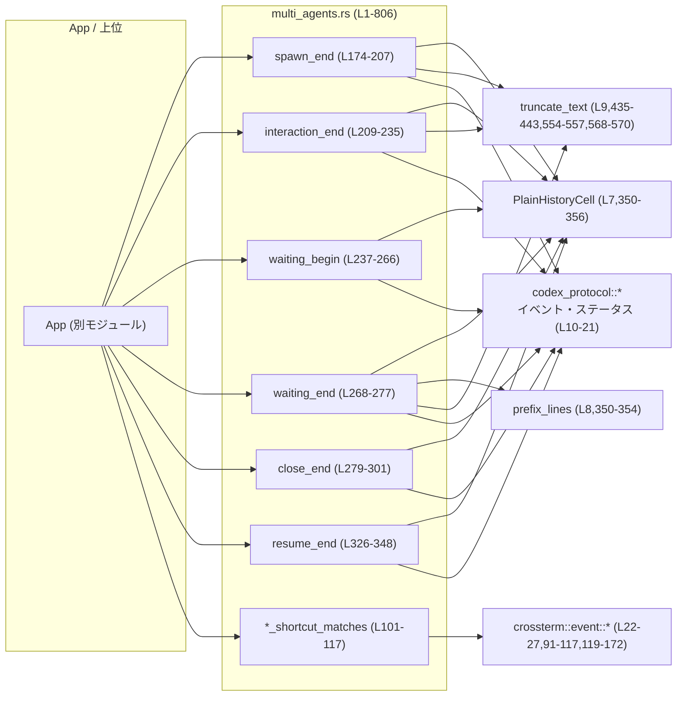
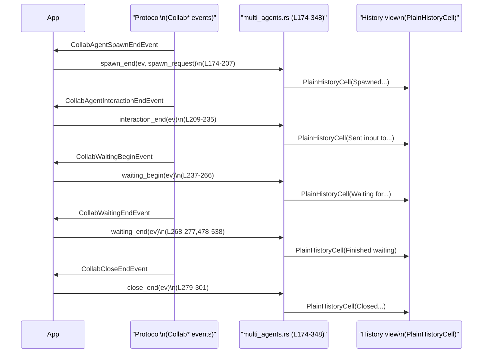
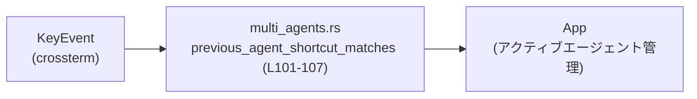

# tui/src/multi_agents.rs

## 0. ざっくり一言

マルチエージェント協調機能に関するイベント（spawn / send / wait / close / resume）を、TUI 上の履歴行（`PlainHistoryCell`）やエージェントピッカーの表示・ショートカット入力に変換するプレゼンテーション層のヘルパーモジュールです（`tui/src/multi_agents.rs:L1-7`）。

---

## 1. このモジュールの役割

### 1.1 概要

- 協調エージェント関連のイベント型（`CollabAgentSpawnEndEvent` など）から、TUI に表示するための `PlainHistoryCell` を構築します（`spawn_end` など、`tui/src/multi_agents.rs:L174-348`）。
- `/agent` ピッカー用のスレッドエントリやラベル表現、ステータスドットなどの UI 契約を一元的に定義します（`AgentPickerThreadEntry`, `agent_label_spans` など、`tui/src/multi_agents.rs:L38-46,392-413`）。
- エージェント切り替えのキーボードショートカット（左右 ALT+←/→）と、macOS 特有のフォールバック（Option+b/f）を解決するヘルパーを提供します（`tui/src/multi_agents.rs:L91-117,L119-172`）。

### 1.2 アーキテクチャ内での位置づけ

- 上位レイヤ: `crate::app::App` が、どのスレッドがアクティブか・いつ閉じるかなどのロジックを持ち、このモジュールは「表示契約」だけを担当するとコメントされています（`tui/src/multi_agents.rs:L1-5`）。
- 下位レイヤ・外部依存:
  - `PlainHistoryCell` に変換して履歴 UI に渡す（`tui/src/multi_agents.rs:L7,L350-356`）。
  - `prefix_lines` で詳細行にインデントや枝線を付ける（`tui/src/multi_agents.rs:L8,L350-354`）。
  - `truncate_text` で長いプロンプト・レスポンスのプレビューを切り詰める（`tui/src/multi_agents.rs:L9,L435-443,L554-557,L568-570`）。
  - `codex_protocol` の各種イベント／ステータス型を入力として利用する（`tui/src/multi_agents.rs:L10-21`）。
  - `crossterm` の `KeyEvent` 系 API でキーボード入力を解釈します（`tui/src/multi_agents.rs:L22-27,L91-117,L119-172`）。

主要依存関係を Mermaid で表すと次のようになります。



### 1.3 設計上のポイント

コードから読み取れる特徴を挙げます。

- **責務分割**
  - データ取得や状態管理は行わず、「イベント → 見た目（テキスト・色・インデント）」の変換ロジックに専念しています（`collab_event`, `title_with_agent` など、`tui/src/multi_agents.rs:L350-377`）。
  - エージェントを表すラベル部（ニックネーム・ロール・スレッド ID）の組み立ては `AgentLabel` と関連ヘルパーに集約しています（`tui/src/multi_agents.rs:L48-53,L380-413`）。

- **状態を持たない関数型設計**
  - すべての関数は引数のみから結果を計算する純粋な関数スタイルであり、モジュール内にグローバルな可変状態は存在しません（`tui/src/multi_agents.rs` 全体に `static mut` や `Cell`/`RefCell` がない）。

- **エラーハンドリング**
  - ここで扱うのは UI 用の文字列整形と集約のみであり、`Result` 型や `panic!` ベースのエラー処理は登場しません。
  - 異常な／足りない情報は「ラベルをデフォルト表示にする」「行を空にする」といったフォールバックで処理されます（例: ニックネームも role もないとき `"Agent"` を返す、`tui/src/multi_agents.rs:L83-88`）。

- **並行性**
  - スレッドや async を直接扱うコードはなく、並行性はより上位レイヤ（アプリケーション側）に任されています。
  - すべて safe Rust で実装されており、`unsafe` ブロックはありません（`tui/src/multi_agents.rs` 全体）。

---

## 2. 主要な機能一覧（コンポーネントインベントリー概観）

### 2.1 主なコンポーネント一覧（型）

| 名前 | 種別 | 役割 / 用途 | 定義位置 |
|------|------|-------------|----------|
| `AgentPickerThreadEntry` | 構造体 | `/agent` ピッカーに表示するスレッド行の情報（ニックネーム・ロール・クローズ状態）を表現します。 | `tui/src/multi_agents.rs:L38-46` |
| `AgentLabel<'a>` | 構造体（内部用） | スレッド ID・ニックネーム・ロールの組を一時的に持ち、ラベル表示用スパンへ変換するための内部表現です。 | `tui/src/multi_agents.rs:L48-53` |
| `SpawnRequestSummary` | 構造体 | スポーン要求のモデル名と推論負荷（`ReasoningEffortConfig`）をまとめ、タイトルに `(model effort)` 形式で表示するために使用します。 | `tui/src/multi_agents.rs:L55-59` |

### 2.2 主な関数一覧（ざっくり）

公開（`pub(crate)`）API を中心に列挙します。

| 関数名 | 役割（1 行） | 定義位置 |
|--------|--------------|----------|
| `agent_picker_status_dot_spans` | ピッカー行の状態ドット（閉じていればグレー、開いていれば緑）を表す `Span` ベクタを生成します。 | `tui/src/multi_agents.rs:L61-68` |
| `format_agent_picker_item_name` | ニックネーム・ロール・メインフラグから、`"Robie [explorer]"` 等の表示名文字列を組み立てます。 | `tui/src/multi_agents.rs:L70-89` |
| `previous_agent_shortcut` | 「前のエージェント」に移動するデフォルトショートカット（Alt+←）のバインディングを返します。 | `tui/src/multi_agents.rs:L91-93` |
| `next_agent_shortcut` | 「次のエージェント」に移動するデフォルトショートカット（Alt+→）のバインディングを返します。 | `tui/src/multi_agents.rs:L95-97` |
| `previous_agent_shortcut_matches` | 受け取った `KeyEvent` が「前のエージェント」ショートカットかどうかを、フォールバックも含めて判定します。 | `tui/src/multi_agents.rs:L101-107` |
| `next_agent_shortcut_matches` | 受け取った `KeyEvent` が「次のエージェント」ショートカットかどうかを判定します。 | `tui/src/multi_agents.rs:L111-117` |
| `spawn_end` | `CollabAgentSpawnEndEvent` から「Spawned ...」または「Agent spawn failed」の履歴セルを生成します。 | `tui/src/multi_agents.rs:L174-207` |
| `interaction_end` | `CollabAgentInteractionEndEvent` から「Sent input to ...」の履歴セルを生成します。 | `tui/src/multi_agents.rs:L209-235` |
| `waiting_begin` | `CollabWaitingBeginEvent` から「Waiting for ...」の履歴セルを生成し、複数相手なら詳細行にリストします。 | `tui/src/multi_agents.rs:L237-266` |
| `waiting_end` | `CollabWaitingEndEvent` から完了したエージェントの一覧とステータスを詳細行に持つ「Finished waiting」セルを生成します。 | `tui/src/multi_agents.rs:L268-277` |
| `close_end` | `CollabCloseEndEvent` から「Closed ...」セルを生成します。 | `tui/src/multi_agents.rs:L279-301` |
| `resume_begin` | `CollabResumeBeginEvent` から「Resuming ...」セルを生成します。 | `tui/src/multi_agents.rs:L303-324` |
| `resume_end` | `CollabResumeEndEvent` から「Resumed ...」セルを生成し、ステータス概要を 1 行追加します。 | `tui/src/multi_agents.rs:L326-348` |

その他の内部ヘルパー（例: `collab_event`, `merge_wait_receivers`, `wait_complete_lines`, `status_summary_spans` など）は 3.3 でまとめます。

---

## 3. 公開 API と詳細解説

### 3.1 型一覧（公開／半公開型）

| 名前 | 種別 | 役割 / 用途 | 主なフィールド | 定義位置 |
|------|------|-------------|----------------|----------|
| `AgentPickerThreadEntry` | 構造体 (`pub(crate)`) | `/agent` ピッカーの 1 行分を表現し、表示時に「ニックネーム」「ロール」「閉じているか」を参照します。 | `agent_nickname: Option<String>`, `agent_role: Option<String>`, `is_closed: bool` | `tui/src/multi_agents.rs:L38-46` |
| `SpawnRequestSummary` | 構造体 (`pub(crate)`) | エージェント生成時のモデル設定と推論負荷を保持し、タイトル `(model effort)` の表示に利用されます。 | `model: String`, `reasoning_effort: ReasoningEffortConfig` | `tui/src/multi_agents.rs:L55-59` |

これらはいずれも `pub(crate)` なので、同一クレート内の他モジュールから利用できます。

---

### 3.2 重要関数の詳細解説（最大 7 件）

#### 1. `format_agent_picker_item_name(agent_nickname: Option<&str>, agent_role: Option<&str>, is_primary: bool) -> String`

**概要**

- `/agent` ピッカーに表示するエージェント名を組み立てます。
- メインスレッドかどうか、ニックネームとロール（役割）文字列の有無に応じて、最適な表示名を返します（`tui/src/multi_agents.rs:L70-89`）。

**引数**

| 引数名 | 型 | 説明 |
|--------|----|------|
| `agent_nickname` | `Option<&str>` | ユーザーフレンドリーなニックネーム。`None` または空白のみの場合は無視されます。 |
| `agent_role` | `Option<&str>` | `worker` などのエージェント種別。`None` または空白のみの場合は無視されます。 |
| `is_primary` | `bool` | メイン（デフォルト）スレッドかどうか。`true` の場合はニックネーム等に関わらず固定文字列を返します。 |

**戻り値**

- `String` — ピッカーに表示する名前。
  - メインスレッド: `"Main [default]"`（`tui/src/multi_agents.rs:L75-77`）
  - ニックネーム＋ロール: `"Robie [explorer]"` のような形式（`tui/src/multi_agents.rs:L83-85`）
  - ニックネームのみ: `"Robie"`（`tui/src/multi_agents.rs:L83-86`）
  - ロールのみ: `"[explorer]"`（`tui/src/multi_agents.rs:L86-87`）
  - どちらもない: `"Agent"`（`tui/src/multi_agents.rs:L87-88`）

**内部処理の流れ**

1. `is_primary` が `true` なら、即座に `"Main [default]"` を返す（`tui/src/multi_agents.rs:L75-77`）。
2. `agent_nickname` と `agent_role` それぞれに対し、`str::trim` で前後空白を除去し、空文字は `None` と扱う（`tui/src/multi_agents.rs:L79-82`）。
3. `(Option<&str>, Option<&str>)` の組で `match` し、上記の 4 パターンの表示を組み立てる（`tui/src/multi_agents.rs:L83-88`）。

**Examples（使用例）**

```rust
// メインスレッドの場合（ニックネーム・ロールは無視される）
let name = format_agent_picker_item_name(Some("Robie"), Some("explorer"), true);
assert_eq!(name, "Main [default]");

// 非メイン、ニックネームとロールあり
let name = format_agent_picker_item_name(Some("Robie"), Some("explorer"), false);
assert_eq!(name, "Robie [explorer]");

// ニックネームのみ
let name = format_agent_picker_item_name(Some("Robie"), None, false);
assert_eq!(name, "Robie");

// どちらもなし
let name = format_agent_picker_item_name(None, None, false);
assert_eq!(name, "Agent");
```

（関数の動作は `tui/src/multi_agents.rs:L70-89` に基づきます）

**Errors / Panics**

- パニック条件や `Result` の `Err` はありません。単純な文字列操作のみです。

**Edge cases（エッジケース）**

- `agent_nickname` や `agent_role` が空白のみの文字列の場合は、`trim` の結果空文字となり、`None` と同等に扱われます（`tui/src/multi_agents.rs:L79-82`）。
- 極端に長いニックネーム／ロールもそのまま返されます。本モジュールでは長さ制限を行っていません。

**使用上の注意点**

- 「メインスレッドかどうか」の判断ロジックは呼び出し元に委ねられています。誤って `is_primary = true` とすると、ニックネーム情報が UI に出なくなります。
- 表示の一貫性のため、ニックネームとロールの前後に余計な空白を含めない前提で設計されていますが、空白は `trim` で除去されます。

---

#### 2. `previous_agent_shortcut_matches(key_event: KeyEvent, allow_word_motion_fallback: bool) -> bool`

**概要**

- 受け取った `KeyEvent` が「前のエージェントに切り替えるショートカット」と見なせるかを判定します。
- 正規ショートカット（Alt+←）に加え、macOS では Option+b をフォールバックとして扱うロジックを含みます（`tui/src/multi_agents.rs:L91-93,L101-107,L119-138`）。

**引数**

| 引数名 | 型 | 説明 |
|--------|----|------|
| `key_event` | `KeyEvent` | `crossterm` から渡されるキーイベント。 |
| `allow_word_motion_fallback` | `bool` | macOS の Option+b/f をフォールバックとして認めるかどうかのフラグ。通常は入力コンポーザーが空のときだけ `true` にする想定です（コメントより、`tui/src/multi_agents.rs:L124-127`）。 |

**戻り値**

- `bool` — このイベントを「前のエージェントへの移動」と解釈すべきかどうか。

**内部処理の流れ**

1. `previous_agent_shortcut()` で定義された正規ショートカットが `key_event` にマッチするかを確認します（`tui/src/multi_agents.rs:L91-93,L105`）。
2. それが `false` の場合、`previous_agent_word_motion_fallback(key_event, allow_word_motion_fallback)` を呼び、macOS 環境では Option+b を判定します（`tui/src/multi_agents.rs:L101-107,L119-138`）。
3. 非 macOS 環境ではフォールバック関数は `false` を返します（`tui/src/multi_agents.rs:L140-146`）。

**フォールバックの判定（macOS）**

- `KeyCode::Char('b')`
- `modifiers: KeyModifiers::ALT`
- `kind: KeyEventKind::Press | KeyEventKind::Repeat`
- かつ `allow_word_motion_fallback` が `true`（`tui/src/multi_agents.rs:L124-137`）

**Examples（使用例）**

```rust
use crossterm::event::{KeyCode, KeyEvent, KeyModifiers};

#[cfg(target_os = "macos")]
{
    // 正規ショートカット: Option + Left
    assert!(previous_agent_shortcut_matches(
        KeyEvent::new(KeyCode::Left, KeyModifiers::ALT),
        false
    ));

    // フォールバック: Option + b（word motion）を許可する場合のみ true
    assert!(previous_agent_shortcut_matches(
        KeyEvent::new(KeyCode::Char('b'), KeyModifiers::ALT),
        true
    ));
    assert!(!previous_agent_shortcut_matches(
        KeyEvent::new(KeyCode::Char('b'), KeyModifiers::ALT),
        false
    ));
}
```

テストでこの振る舞いが確認されています（`tui/src/multi_agents.rs:L688-713`）。

**Errors / Panics**

- ありません。純粋な比較のみです。

**Edge cases**

- macOS 以外のプラットフォームでは、`allow_word_motion_fallback` が `true` でもフォールバックは一切有効にならず、Alt+← のみがマッチします（`tui/src/multi_agents.rs:L140-146,L715-734`）。
- `KeyEventKind` の値が Press/Repeat 以外（Release 等）の場合はフォールバックが発動しません（`tui/src/multi_agents.rs:L131-135`）。

**使用上の注意点**

- コメントにある通り、フォールバックは「コンポーザーが空のとき」のみに有効化する設計意図が示されています（`tui/src/multi_agents.rs:L124-127`）。そうしないと、テキスト編集のワード移動を奪ってしまう可能性があります。
- 他のショートカットとの衝突を避けるため、`allow_word_motion_fallback` の制御は呼び出し側のコンテキストをよく考慮する必要があります。

---

#### 3. `spawn_end(ev: CollabAgentSpawnEndEvent, spawn_request: Option<&SpawnRequestSummary>) -> PlainHistoryCell`

**概要**

- 協調エージェント生成完了イベントから、履歴ビューに表示する 1 セル分の情報を構築します。
- 成功時は新しいエージェントを表すタイトルを表示し、プロンプト内容のプレビュー行を詳細として追加します（`tui/src/multi_agents.rs:L174-207`）。

**引数**

| 引数名 | 型 | 説明 |
|--------|----|------|
| `ev` | `CollabAgentSpawnEndEvent` | プロトコルレイヤから届くエージェント生成完了イベント。`call_id` や `sender_thread_id` などは UI では使っていません（`tui/src/multi_agents.rs:L178-187`）。 |
| `spawn_request` | `Option<&SpawnRequestSummary>` | モデル名と推論負荷。渡された場合、タイトル末尾に `(model effort)` を付与します（`tui/src/multi_agents.rs:L189-198,L416-433`）。 |

**戻り値**

- `PlainHistoryCell` — TUI の履歴行を表すオブジェクト。
  - タイトル行: `"• Spawned Robie [explorer] (gpt-5 high)"` のような形式になることがテストで確認されています（`tui/src/multi_agents.rs:L742-769`）。
  - 詳細行: スポーン時プロンプトの先頭部分（`truncate_text` により長さ制限、`tui/src/multi_agents.rs:L435-443`）。

**内部処理の流れ**

1. `ev` をパターンマッチで分解し、必要なフィールドだけを取り出します（`new_thread_id`, `new_agent_nickname`, `new_agent_role`, `prompt`。`tui/src/multi_agents.rs:L178-187`）。
2. `new_thread_id` の有無でタイトルを分岐（`tui/src/multi_agents.rs:L189-200`）:
   - `Some(thread_id)` の場合は `title_with_agent("Spawned", AgentLabel { ... }, spawn_request)` を呼ぶ（`tui/src/multi_agents.rs:L189-198`）。
   - `None` の場合は `title_text("Agent spawn failed")` で失敗タイトルを生成（`tui/src/multi_agents.rs:L199-200`）。
3. 詳細行ベクタ `details` を初期化し、`prompt_line(&prompt)` が `Some` を返した場合のみ追加（`tui/src/multi_agents.rs:L202-205,L435-444`）。
4. 最後に `collab_event(title, details)` で `PlainHistoryCell` を組み立てて返します（`tui/src/multi_agents.rs:L206-207,L350-356`）。

**Examples（使用例）**

テストコードのスニペット（簡略化）:

```rust
let sender_thread_id = ThreadId::from_string("...001")?;
let robie_id = ThreadId::from_string("...002")?;

let cell = spawn_end(
    CollabAgentSpawnEndEvent {
        call_id: "call-spawn".to_string(),
        sender_thread_id,
        new_thread_id: Some(robie_id),
        new_agent_nickname: Some("Robie".to_string()),
        new_agent_role: Some("explorer".to_string()),
        prompt: "Compute 11! and reply with just the integer result.".to_string(),
        model: "gpt-5".to_string(),
        reasoning_effort: ReasoningEffortConfig::High,
        status: AgentStatus::PendingInit,
    },
    Some(&SpawnRequestSummary {
        model: "gpt-5".to_string(),
        reasoning_effort: ReasoningEffortConfig::High,
    }),
);

let text = cell.display_lines(200)
    .iter()
    .map(|line| line_to_text(line))
    .collect::<Vec<_>>()
    .join("\n");
```

このセルはスナップショットテスト `collab_events_snapshot` で検証されています（`tui/src/multi_agents.rs:L595-684`）。

**Errors / Panics**

- この関数自体にはパニック要因はありません。
- ただし、`PlainHistoryCell::new` や `truncate_text` の内部挙動はこのチャンクからは分かりません。

**Edge cases**

- `new_thread_id` が `None` の場合、タイトルは `"Agent spawn failed"` となり、エージェントラベルは表示されません（`tui/src/multi_agents.rs:L189-200`）。
- `prompt` が空白のみの場合、詳細行は追加されません（`prompt_line` が `None` を返す、`tui/src/multi_agents.rs:L435-439`）。
- `spawn_request` が `None` の場合、モデルと推論負荷の `(...)` はタイトルに付きません（`tui/src/multi_agents.rs:L416-423`）。

**使用上の注意点**

- スポーン失敗を `new_thread_id: None` で表現する契約に依存しています。この規約が変わった場合、UI 上の表現も合わせて見直す必要があります。
- `SpawnRequestSummary` の `reasoning_effort` がデフォルト値かつ `model` が空文字の場合、タイトルに追加情報は表示されない設計です（`tui/src/multi_agents.rs:L421-423`）。

---

#### 4. `interaction_end(ev: CollabAgentInteractionEndEvent) -> PlainHistoryCell`

**概要**

- あるスレッドから別のエージェントへの入力送信が完了したときのイベントを履歴セルに変換します。
- タイトルは `"Sent input to <agent>"`、詳細は送信した `prompt` のプレビューです（`tui/src/multi_agents.rs:L209-235`）。

**引数**

| 引数名 | 型 | 説明 |
|--------|----|------|
| `ev` | `CollabAgentInteractionEndEvent` | 入力送信完了イベント。受信側スレッド ID、ニックネーム、ロール、プロンプトを含みます（`tui/src/multi_agents.rs:L210-218`）。 |

**戻り値**

- `PlainHistoryCell` — タイトル行 +（必要なら）1 行のプロンプトプレビュー。

**内部処理の流れ**

1. `ev` を分解して `receiver_thread_id`、`receiver_agent_nickname`、`receiver_agent_role`、`prompt` を取り出す（`tui/src/multi_agents.rs:L210-218`）。
2. `title_with_agent("Sent input to", AgentLabel { ... }, None)` によりタイトル行を生成（`tui/src/multi_agents.rs:L220-228`）。
3. `prompt_line(&prompt)` で詳細行を生成し、`Some` の場合のみベクタに追加（`tui/src/multi_agents.rs:L230-233,L435-444`）。
4. `collab_event(title, details)` で `PlainHistoryCell` を返す（`tui/src/multi_agents.rs:L234-235,L350-356`）。

**Examples（使用例）**

```rust
let send = interaction_end(CollabAgentInteractionEndEvent {
    call_id: "call-send".to_string(),
    sender_thread_id,
    receiver_thread_id: robie_id,
    receiver_agent_nickname: Some("Robie".to_string()),
    receiver_agent_role: Some("explorer".to_string()),
    prompt: "Please continue and return the answer only.".to_string(),
    status: AgentStatus::Running,
});

// スナップショットテストで他のイベントと一緒に検証される
```

（`tui/src/multi_agents.rs:L622-630`）

**Errors / Panics**

- ありません。

**Edge cases**

- `receiver_agent_nickname`/`role` が `None` の場合、`agent_label_spans` によりスレッド ID または `"agent"` が代わりに表示されます（`tui/src/multi_agents.rs:L392-406`）。
- `prompt` が空白のみの場合、詳細行は表示されません（`prompt_line` の仕様、`tui/src/multi_agents.rs:L435-439`）。

**使用上の注意点**

- ステータス（例: `AgentStatus::Running`）は UI に直接表示されません。状態表示が必要であれば、別セル（`waiting_end` など）の情報を見る前提です。

---

#### 5. `waiting_begin(ev: CollabWaitingBeginEvent) -> PlainHistoryCell`

**概要**

- ある呼び出しで複数エージェントからの応答を待ち始めたことを示すイベントを履歴セルに変換します。
- 相手が 1 つならタイトルにラベルを表示し、複数なら「Waiting for N agents」とし、詳細行に各エージェントのラベル一覧を載せます（`tui/src/multi_agents.rs:L237-266`）。

**引数**

| 引数名 | 型 | 説明 |
|--------|----|------|
| `ev` | `CollabWaitingBeginEvent` | 待ち開始イベント。`receiver_thread_ids` と `receiver_agents` を両方含む場合があります（`tui/src/multi_agents.rs:L238-243`）。 |

**戻り値**

- `PlainHistoryCell` — 「Waiting for ...」タイトル + 必要に応じて相手一覧の詳細行。

**内部処理の流れ**

1. `ev` から `receiver_thread_ids` と `receiver_agents` を取り出し（`tui/src/multi_agents.rs:L238-243`）、`merge_wait_receivers` で統合された `Vec<CollabAgentRef>` を作ります（`tui/src/multi_agents.rs:L244,L447-476`）。
2. `receiver_agents.as_slice()` に対してパターンマッチ（`tui/src/multi_agents.rs:L246-254`）:
   - 1 件のみ: `title_with_agent("Waiting for", agent_label_from_ref(receiver), None)`。
   - 0 件: `title_text("Waiting for agents")`。
   - 複数: `title_text(format!("Waiting for {} agents", receiver_agents.len()))`。
3. 詳細行は、`receiver_agents.len() > 1` の場合のみ `agent_label_line` で各行を作成し、ベクタに格納（`tui/src/multi_agents.rs:L256-263`）。
4. 最後に `collab_event(title, details)` でセルを構築（`tui/src/multi_agents.rs:L265-266,L350-356`）。

**Examples（使用例）**

```rust
let waiting = waiting_begin(CollabWaitingBeginEvent {
    sender_thread_id,
    receiver_thread_ids: vec![robie_id],
    receiver_agents: vec![CollabAgentRef {
        thread_id: robie_id,
        agent_nickname: Some("Robie".to_string()),
        agent_role: Some("explorer".to_string()),
    }],
    call_id: "call-wait".to_string(),
});
```

（`tui/src/multi_agents.rs:L632-641`）

**Errors / Panics**

- ありません。

**Edge cases**

- `receiver_agents` が空だが `receiver_thread_ids` がある場合、`merge_wait_receivers` が匿名の `CollabAgentRef` を生成します（`tui/src/multi_agents.rs:L451-459`）。この場合、ラベルはスレッド ID または `"agent"` になります（`tui/src/multi_agents.rs:L392-406`）。
- `receiver_thread_ids` と `receiver_agents` 両方が空の場合、タイトルは「Waiting for agents」で詳細も空です（`tui/src/multi_agents.rs:L246-253,256-263`）。

**使用上の注意点**

- 呼び出し元は重複した `thread_id` を渡しても、`merge_wait_receivers` が `HashSet` によって重複を抑制します（`tui/src/multi_agents.rs:L462-473`）。

---

#### 6. `waiting_end(ev: CollabWaitingEndEvent) -> PlainHistoryCell`

**概要**

- 「待ち」が完了したときのイベントから「Finished waiting」セルを生成し、各エージェントのステータス（Completed/Errored/etc.）を詳細行として表示します（`tui/src/multi_agents.rs:L268-277`）。

**引数**

| 引数名 | 型 | 説明 |
|--------|----|------|
| `ev` | `CollabWaitingEndEvent` | 待ち完了イベント。`agent_statuses`（詳細情報あり）と `statuses`（`HashMap<ThreadId, AgentStatus>`）の両方を持つことがあります（`tui/src/multi_agents.rs:L269-274`）。 |

**戻り値**

- `PlainHistoryCell` — タイトル行 `"Finished waiting"` + 0 以上のステータス行。

**内部処理の流れ**

1. `ev` から `agent_statuses` と `statuses` を取得（`tui/src/multi_agents.rs:L269-274`）。
2. `wait_complete_lines(&statuses, &agent_statuses)` を呼び、`Vec<Line<'static>>` を得る（`tui/src/multi_agents.rs:L275-276,L478-538`）。
3. `collab_event(title_text("Finished waiting"), details)` でセル生成（`tui/src/multi_agents.rs:L276-277,L358-360,L350-356`）。

`wait_complete_lines` の詳細な挙動:

- 両方空の場合: 「No agents completed yet」1 行のみ返す（`tui/src/multi_agents.rs:L482-484`）。
- `agent_statuses` が空の場合:
  - `statuses` のエントリを `CollabAgentStatusEntry` に変換し、`thread_id.to_string()` の辞書順でソート（`tui/src/multi_agents.rs:L486-497`）。
- `agent_statuses` が非空の場合:
  - まず `agent_statuses` をベースに `entries` を作り、`thread_id` を `HashSet` に収集（`tui/src/multi_agents.rs:L499-503`）。
  - `statuses` 側にしかない追加エントリを `extras` として作成し、同じくソートして `entries` に連結（`tui/src/multi_agents.rs:L504-515`）。

その後、各 `CollabAgentStatusEntry` から次のような 1 行を構築します（`tui/src/multi_agents.rs:L519-537`）:

- `agent_label_spans(AgentLabel { ... })` でエージェント表示（ニックネーム優先）。
- `": "` を dim スタイルで付加。
- `status_summary_spans(&status)` を付加（`Pending init`/`Running`/`Completed`/`Error` などの表示、`tui/src/multi_agents.rs:L544-579`）。

**Examples（使用例）**

テストから:

```rust
let mut statuses = HashMap::new();
statuses.insert(robie_id, AgentStatus::Completed(Some("39916800".into())));
statuses.insert(bob_id, AgentStatus::Errored("tool timeout".into()));

let finished = waiting_end(CollabWaitingEndEvent {
    sender_thread_id,
    call_id: "call-wait".to_string(),
    agent_statuses: vec![
        // Robie and Bob entries...
    ],
    statuses,
});
```

（`tui/src/multi_agents.rs:L643-667`）

**Errors / Panics**

- `HashMap` の操作や `to_string` などのみで、パニック要因は見当たりません（`unwrap` 等を使用していません）。

**Edge cases**

- 完了エージェントが 1 件もいない (`statuses` と `agent_statuses` 両方空) 場合は、「No agents completed yet」という 1 行のみになります（`tui/src/multi_agents.rs:L482-484`）。
- `agent_statuses` と `statuses` の両方に同じ `thread_id` がある場合、そのエージェントは `agent_statuses` 側の情報を優先し、`statuses` 側は `extras` 生成時に除外されます（`tui/src/multi_agents.rs:L500-507`）。

**使用上の注意点**

- `agent_statuses` を「よりリッチな情報源」、`statuses` を「補完用」として扱う設計になっています。両方に同じエージェントを入れる場合は、一貫性のある情報を提供する必要があります。

---

#### 7. `wait_complete_lines(statuses: &HashMap<ThreadId, AgentStatus>, agent_statuses: &[CollabAgentStatusEntry]) -> Vec<Line<'static>>`（内部）

**概要**

- 待機完了時に表示するエージェント一覧行を作るコアロジックです（`tui/src/multi_agents.rs:L478-538`）。
- `CollabWaitingEndEvent` から切り出された 2 種類の情報を統合し、見た目に一貫した順序で並べます。

**引数**

| 引数名 | 型 | 説明 |
|--------|----|------|
| `statuses` | `&HashMap<ThreadId, AgentStatus>` | スレッド ID とステータスのマップ。ニックネーム・ロール情報は含みません。 |
| `agent_statuses` | `&[CollabAgentStatusEntry]` | スレッド ID に加え、ニックネーム・ロール情報を含む一覧。 |

**戻り値**

- `Vec<Line<'static>>` — 各要素が 1 エージェントのステータスを表す行。

**内部処理（要約）**

1. 両方空なら「No agents completed yet」を 1 行返す（`tui/src/multi_agents.rs:L482-484`）。
2. `agent_statuses` が空:
   - `statuses` から `CollabAgentStatusEntry` を生成し、`thread_id.to_string()` の辞書順でソート（`tui/src/multi_agents.rs:L486-497`）。
3. `agent_statuses` が非空:
   - ベースとして `agent_statuses.to_vec()` を使う（`tui/src/multi_agents.rs:L499`）。
   - `entries` の `thread_id` を `HashSet` に集める（`tui/src/multi_agents.rs:L500-503`）。
   - `statuses` 側にしかないものを `extras` として追加し、同様にソート（`tui/src/multi_agents.rs:L504-515`）。
4. 最終的な `entries` を `into_iter` し、各エントリについて `agent_label_spans` と `status_summary_spans` を組み合わせて `Line` を生成（`tui/src/multi_agents.rs:L519-537`）。

**使用上の注意点**

- ソートキーに `thread_id.to_string()` を使っており、`ThreadId` の文字列表現定義に依存します（`tui/src/multi_agents.rs:L496,L514`）。
- `agent_statuses` に重複 `thread_id` があった場合の挙動はコードからは明示されていませんが、そのまま複数行として出力されます（重複排除ロジックは `statuses` マージ部分にのみ存在）。

---

### 3.3 その他の関数（一覧）

| 関数名 | 役割（1 行） | 定義位置 |
|--------|--------------|----------|
| `agent_picker_status_dot_spans` | エージェントピッカー行の左に置くステータスドット（閉じていれば通常色、開いていれば緑）と空白の `Span` を返します。 | `tui/src/multi_agents.rs:L61-68` |
| `previous_agent_shortcut` / `next_agent_shortcut` | Alt+← / Alt+→ のキーバインドを構築します。 | `tui/src/multi_agents.rs:L91-97` |
| `next_agent_shortcut_matches` | 「次のエージェント」ショートカット（Alt+→ と macOS の Option+f フォールバック）を判定します。 | `tui/src/multi_agents.rs:L111-117,L148-172` |
| `collab_event` | タイトルと詳細行のベクタから、枝線付きの `PlainHistoryCell` を生成します。 | `tui/src/multi_agents.rs:L350-356` |
| `title_text` / `title_with_agent` / `title_spans_line` | タイトル行の共通フォーマット（先頭の dim な "• " と太字タイトルなど）を組み立てます。 | `tui/src/multi_agents.rs:L358-371,L373-377` |
| `agent_label_from_ref` / `agent_label_line` / `agent_label_spans` | `CollabAgentRef` や `AgentLabel` からニックネーム・スレッド ID・ロールの表示用 `Span` を生成します。 | `tui/src/multi_agents.rs:L380-390,L392-413` |
| `spawn_request_spans` | `SpawnRequestSummary` から `(model effort)` のようなマゼンタ色の補足情報 `Span` を生成します。 | `tui/src/multi_agents.rs:L416-433` |
| `prompt_line` | プロンプト文字列をトリムし、空でなければ `truncate_text` を通して 1 行の `Line` にします。 | `tui/src/multi_agents.rs:L435-444` |
| `merge_wait_receivers` | `receiver_thread_ids` と `receiver_agents` を統合し、重複しない `Vec<CollabAgentRef>` にまとめます。 | `tui/src/multi_agents.rs:L447-476` |
| `status_summary_line` / `status_summary_spans` | `AgentStatus` から色付きのステータス表示を生成します。完了／エラー時はメッセージプレビューも追加します。 | `tui/src/multi_agents.rs:L540-541,L544-579` |

---

## 4. データフロー

### 4.1 代表的なシナリオ: spawn → send → wait → finished → close

テスト `collab_events_snapshot` に現れる典型シナリオを元にしたデータフローです（`tui/src/multi_agents.rs:L595-684`）。

1. `App` がプロトコルレイヤから `CollabAgentSpawnEndEvent` を受け取り、`spawn_end` に渡して `PlainHistoryCell` を得ます。
2. 続いて `CollabAgentInteractionEndEvent` を `interaction_end` に渡します。
3. `CollabWaitingBeginEvent` / `CollabWaitingEndEvent` をそれぞれ `waiting_begin` / `waiting_end` に渡します。
4. 最後に `CollabCloseEndEvent` を `close_end` に渡します。
5. 各 `PlainHistoryCell` は `display_lines(width)` 等を通じて TUI 画面に描画されます（`PlainHistoryCell` の詳細は別ファイル）。

これを sequence diagram で表すと次のようになります。



### 4.2 キーボードショートカットのフロー

ショートカット判定のデータフローは次の通りです。



- `App` が `crossterm` から `KeyEvent` を受け取る。
- `previous_agent_shortcut_matches` / `next_agent_shortcut_matches` を呼んで該当イベントか判定する（`tui/src/multi_agents.rs:L101-117`）。
- `true` の場合、アクティブスレッドを前後に切り替えるロジックを `App` 側で実行する（`App` の実装はこのチャンクにはありません）。

---

## 5. 使い方（How to Use）

### 5.1 基本的な使用方法

`App` 側から見た典型的な利用フローの擬似コードです。テスト `collab_events_snapshot` を簡略化しています（`tui/src/multi_agents.rs:L595-684`）。

```rust
use codex_protocol::{
    ThreadId,
    protocol::{
        CollabAgentSpawnEndEvent, CollabAgentInteractionEndEvent,
        CollabWaitingBeginEvent, CollabWaitingEndEvent,
        CollabCloseEndEvent, CollabAgentStatusEntry, AgentStatus,
    },
    openai_models::ReasoningEffort as ReasoningEffortConfig,
};
use tui::history_cell::HistoryCell;
use tui::multi_agents::{
    spawn_end, interaction_end, waiting_begin, waiting_end, close_end,
    SpawnRequestSummary,
};

fn handle_collab_events() -> anyhow::Result<()> {
    let sender_thread_id =
        ThreadId::from_string("00000000-0000-0000-0000-000000000001")?; // 呼び出し元スレッド
    let robie_id =
        ThreadId::from_string("00000000-0000-0000-0000-000000000002")?; // 新しいエージェントのスレッド

    // 1. spawn_end: エージェント生成を履歴に追加
    let spawn_cell = spawn_end(
        CollabAgentSpawnEndEvent {
            call_id: "call-spawn".to_string(),
            sender_thread_id,
            new_thread_id: Some(robie_id),
            new_agent_nickname: Some("Robie".to_string()),
            new_agent_role: Some("explorer".to_string()),
            prompt: "Compute 11! and reply with just the integer result.".to_string(),
            model: "gpt-5".to_string(),
            reasoning_effort: ReasoningEffortConfig::High,
            status: AgentStatus::PendingInit,
        },
        Some(&SpawnRequestSummary {
            model: "gpt-5".to_string(),
            reasoning_effort: ReasoningEffortConfig::High,
        }),
    );

    // 2. interaction_end: 入力送信
    let send_cell = interaction_end(CollabAgentInteractionEndEvent {
        call_id: "call-send".to_string(),
        sender_thread_id,
        receiver_thread_id: robie_id,
        receiver_agent_nickname: Some("Robie".to_string()),
        receiver_agent_role: Some("explorer".to_string()),
        prompt: "Please continue and return the answer only.".to_string(),
        status: AgentStatus::Running,
    });

    // 3. waiting_begin: 待ち開始
    let waiting_cell = waiting_begin(CollabWaitingBeginEvent {
        sender_thread_id,
        receiver_thread_ids: vec![robie_id],
        receiver_agents: vec![CollabAgentRef {
            thread_id: robie_id,
            agent_nickname: Some("Robie".to_string()),
            agent_role: Some("explorer".to_string()),
        }],
        call_id: "call-wait".to_string(),
    });

    // 4. waiting_end: 待ち完了 + ステータス
    let mut statuses = HashMap::new();
    statuses.insert(
        robie_id,
        AgentStatus::Completed(Some("39916800".to_string())),
    );
    let finished_cell = waiting_end(CollabWaitingEndEvent {
        sender_thread_id,
        call_id: "call-wait".to_string(),
        agent_statuses: vec![CollabAgentStatusEntry {
            thread_id: robie_id,
            agent_nickname: Some("Robie".to_string()),
            agent_role: Some("explorer".to_string()),
            status: AgentStatus::Completed(Some("39916800".to_string())),
        }],
        statuses,
    });

    // 5. close_end: 閉じたことを表示
    let close_cell = close_end(CollabCloseEndEvent {
        call_id: "call-close".to_string(),
        sender_thread_id,
        receiver_thread_id: robie_id,
        receiver_agent_nickname: Some("Robie".to_string()),
        receiver_agent_role: Some("explorer".to_string()),
        status: AgentStatus::Completed(Some("39916800".to_string())),
    });

    // 6. PlainHistoryCell を UI に登録・描画
    for cell in [spawn_cell, send_cell, waiting_cell, finished_cell, close_cell] {
        for line in cell.display_lines(200) {
            println!("{}", line_to_text(&line)); // テストコードと同様の出力関数
        }
    }

    Ok(())
}
```

### 5.2 よくある使用パターン

1. **キーボードショートカットによるエージェント切り替え**

```rust
use crossterm::event::{read, Event, KeyEvent};
use tui::multi_agents::{previous_agent_shortcut_matches, next_agent_shortcut_matches};

fn handle_keys() -> anyhow::Result<()> {
    loop {
        match read()? {
            Event::Key(key_event) => {
                // compose_is_empty は呼び出し元で管理する状態
                if previous_agent_shortcut_matches(key_event, compose_is_empty()) {
                    // アクティブエージェントを前に
                } else if next_agent_shortcut_matches(key_event, compose_is_empty()) {
                    // アクティブエージェントを次に
                }
            }
            _ => {}
        }
    }
}
```

1. **エージェントピッカーリストの構築**

```rust
use tui::multi_agents::{AgentPickerThreadEntry, agent_picker_status_dot_spans, format_agent_picker_item_name};

fn build_picker_row(entry: &AgentPickerThreadEntry, is_primary: bool) -> String {
    let dots = agent_picker_status_dot_spans(entry.is_closed); // "• " など
    let name = format_agent_picker_item_name(
        entry.agent_nickname.as_deref(),
        entry.agent_role.as_deref(),
        is_primary,
    );
    // 実際の ratatui では Span を使うが、ここでは簡略化
    format!("{}{}", dots[0].content, name)
}
```

### 5.3 よくある間違い（想定）

```rust
// 誤り例: macOSで常にフォールバックを true にしてしまう
if previous_agent_shortcut_matches(key_event, /*allow_word_motion_fallback*/ true) {
    // ← テキスト編集中でも Option+b がエージェント切り替えに奪われる可能性
}

// 正しい例: コンポーザーが空のときだけフォールバックを許可する
let allow_fallback = compose_buffer.is_empty();
if previous_agent_shortcut_matches(key_event, allow_fallback) {
    // 安全にエージェント切り替え
}
```

この使い分けは、コメントにある設計意図に基づきます（`tui/src/multi_agents.rs:L124-127`）。

### 5.4 使用上の注意点（まとめ）

- **前提条件**
  - `Collab*Event` 型は、`codex_protocol` 側の契約に従って正しく初期化されている必要があります。このモジュールは値の妥当性検証を行いません。
  - スレッド ID は `ThreadId` 型で一意と仮定しており、ソートや `HashSet` による重複排除に使われます（`tui/src/multi_agents.rs:L462-473,L486-497,L504-515`）。

- **禁止事項 / セキュリティ**
  - 特に危険な API（`unsafe` や OS リソースアクセス）は使用していません。表示用文字列の生成に限定されるため、このモジュール単体からのセキュリティリスクは低いと考えられます。
  - ただし、プロンプトやエラーメッセージはユーザー入力や外部システムから来る可能性があり、上位レイヤでのサニタイズ方針には従う必要があります。

- **エラー・パニック**
  - モジュール内で明示的な `panic!` はありません。インデックスアクセスもテスト内に限られています（`title.spans[2]` など、`tui/src/multi_agents.rs:L760-768`）。
  - テストが想定する `Span` 配置が変わるとテストが失敗する可能性があります。

- **パフォーマンス**
  - `wait_complete_lines` などで `HashMap` → `Vec` 変換とソートを行っていますが、対象は待機中エージェント数に比例するのみで、UI 更新頻度も高くはない想定です（`tui/src/multi_agents.rs:L486-497,L504-515`）。
  - `truncate_text` や `split_whitespace().collect::<Vec<_>>().join(" ")` など、文字列処理が何度か行われていますが、ログレベルのデータ量であれば一般的には問題になりにくいです（`tui/src/multi_agents.rs:L554-557,L568-570`）。

---

## 6. 変更の仕方（How to Modify）

### 6.1 新しいイベント種別を追加したい場合

例: `CollabPauseEndEvent` のような新しいイベントに対応した履歴行を追加するケース。

1. **プロトコル型の確認**
   - `codex_protocol::protocol` 側に新しいイベント型があることを確認し、このモジュールに `use` を追加します（`Collab*Event` と同様、`tui/src/multi_agents.rs:L12-21` を参照）。

2. **変換関数の追加**
   - 既存の `spawn_end` や `resume_end` と同じパターンで、新しい `pub(crate) fn pause_end(ev: CollabPauseEndEvent) -> PlainHistoryCell` を実装します。
   - タイトルは `title_text` / `title_with_agent` と `status_summary_line` を組み合わせて構築すると、一貫した UI スタイルになります（`tui/src/multi_agents.rs:L358-371,L540-541`）。

3. **テストの追加**
   - `tests` モジュールにスナップショットテストを追加し、`cell_to_text` を使って出力を固定化します（`tui/src/multi_agents.rs:L595-684,L791-805`）。

4. **App からの呼び出し**
   - `App` 側で新しいイベントを受け取ったときに、この関数を呼び出し、履歴ビューへ登録するようにします（`App` 側コードはこのチャンクにはありません）。

### 6.2 既存の機能を変更する場合の注意点

- **影響範囲**
  - `title_with_agent` / `agent_label_spans` / `status_summary_spans` は多数の関数から共通利用されているため（`tui/src/multi_agents.rs:L362-371,L392-413,L544-579`）、見た目の変更は複数のイベント表示に影響します。
  - キーショートカット判定ロジックを変えると、`tests` モジュール内のショートカットテストも更新が必要です（`tui/src/multi_agents.rs:L688-713,L717-734`）。

- **契約（前提条件・返り値の意味）**
  - `waiting_end` は、「`agent_statuses` 優先、`statuses` は補完」という契約で `wait_complete_lines` を呼んでいます。ここを変えると、既存の呼び出し側が期待する表示と変わる可能性があります（`tui/src/multi_agents.rs:L486-517`）。
  - `format_agent_picker_item_name` の `"Main [default]"` など固定文字列を変えると、ユーザー向け UI テキスト仕様に影響するため、翻訳・ドキュメントとの整合性が必要です（`tui/src/multi_agents.rs:L75-77`）。

- **テストとスナップショット**
  - 本モジュールは `insta` によるスナップショットテストを多用しており（`tui/src/multi_agents.rs:L590,L595-684,L773-788`）、表示形式の変更はスナップショット更新を伴います。

---

## 7. 関連ファイル

このモジュールと密接に関係するファイル・モジュールを、コード中の `use` から分かる範囲で挙げます。

| パス / モジュール | 役割 / 関係 |
|-------------------|------------|
| `crate::history_cell::PlainHistoryCell` | 履歴ビューに表示する 1 セルを表す型。`collab_event` などから生成されます（`tui/src/multi_agents.rs:L7,L350-356`）。 |
| `crate::history_cell::HistoryCell` | テストで使用されているトレイトまたは型。`display_lines` を呼び出しています（`tui/src/multi_agents.rs:L585,L760-761,L791-797`）。 |
| `crate::render::line_utils::prefix_lines` | 詳細行の先頭にインデントや枝線 `"  └ "` を付与するヘルパー関数です（`tui/src/multi_agents.rs:L8,L350-354`）。 |
| `crate::text_formatting::truncate_text` | プロンプトやレスポンスのプレビューを、指定グラフェム数で切り詰めるために使用されています（`tui/src/multi_agents.rs:L9,L435-443,L554-557,L568-570`）。 |
| `crate::key_hint` | Alt+←/→ のキーコンビネーションを `KeyBinding` として生成するために使われます（`tui/src/multi_agents.rs:L91-97`）。 |
| `codex_protocol::ThreadId` | スレッド ID を表現する型。ソートや `HashMap` キーに使用されています（`tui/src/multi_agents.rs:L10,L486-497`）。 |
| `codex_protocol::protocol::{Collab*Event, AgentStatus, CollabAgentRef, CollabAgentStatusEntry}` | 上位プロトコルレイヤから渡されるイベント／ステータス型群です（`tui/src/multi_agents.rs:L12-21,L174-207,L209-235,L237-277,L279-348,L478-538`）。 |
| `codex_protocol::openai_models::ReasoningEffort` | エージェント生成時の推論負荷を表す設定。`SpawnRequestSummary` で保持し、タイトルに `(gpt-5 high)` のように表示します（`tui/src/multi_agents.rs:L11,L55-59,L612-619,L751-757`）。 |
| `crossterm::event::{KeyCode, KeyEvent, KeyEventKind, KeyModifiers}` | CLI TUI でのキーボード入力を表す型群。ショートカット判定に使用されています（`tui/src/multi_agents.rs:L22-27,L91-117,L119-172`）。 |
| `ratatui::text::{Line, Span}` / `ratatui::style::Stylize` | 色付きテキスト行を構築する UI ライブラリ。タイトル・ラベル・ステータスのスタイル設定に使われています（`tui/src/multi_agents.rs:L28-30,L350-377,L392-413,L544-579`）。 |

---

### Bugs / Security / Contracts / Edge Cases / Performance の補足

- **Bugs（潜在的な問題）**
  - このチャンクから明確にバグと断定できる挙動は確認できません。
  - `agent_statuses` に重複 `thread_id` がある場合の扱いは明示されておらず、同じエージェントが複数行表示される可能性があります（`tui/src/multi_agents.rs:L499-503`）。これは仕様かどうか、このチャンクだけでは判断できません。

- **Security**
  - 外部入力（プロンプト・エラーメッセージ）を文字列として表示するのみで、シェル実行やファイル操作などは行っていません。TUI レベルでの表示にとどまります。

- **Contracts（契約）**
  - `AgentStatus` の各バリアントに対して、`status_summary_spans` が全てのパターンを網羅しているため、新しいバリアントが追加された場合はコンパイルエラーを通じて検知できます（`tui/src/multi_agents.rs:L544-579`）。
  - `SpawnRequestSummary` のデフォルト判定（`ReasoningEffortConfig::default()`）は「何も表示しない」条件に使われています（`tui/src/multi_agents.rs:L421-423`）。

- **Edge Cases**
  - 文字列が空／空白のみの場合はラベルや詳細行を省略するロジックが多数あり、情報欠損を UI に直接見せない設計です（`tui/src/multi_agents.rs:L79-82,L435-439,L421-423`）。

- **Performance / Scalability**
  - `HashSet` の利用と `Vec` のソートは、待機中エージェント数に O(n log n) で比例しますが、一般にエージェント数はそこまで大きくならない前提に見えます。
  - 連続的な大量イベント処理（非常に多くのエージェント／イベント）に対するスケーラビリティについては、このチャンク単体からは評価できません。

以上が、`tui/src/multi_agents.rs` の公開 API・内部ロジック・データフロー・安全性の整理です。
