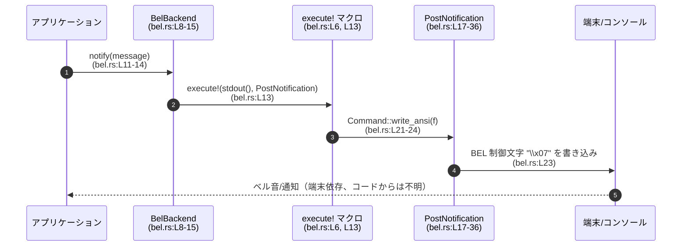

# tui/src/notifications/bel.rs コード解説

---

## 0. ざっくり一言

このモジュールは、標準出力に BEL 制御文字（`\x07`）を書き込むことで「ベル通知」を発生させる通知バックエンドを提供するモジュールです（`BelBackend`, `PostNotification`）。  
crossterm の `Command` と `execute!` マクロを用いて、端末にベル（ビープ音や通知）を送る役割を持ちます（`bel.rs:L5-6, L11-14, L21-24`）。

---

## 1. このモジュールの役割

### 1.1 概要

- このモジュールは **TUI アプリケーションからの通知要求を BEL 制御文字出力に変換する**ために存在し、次の機能を提供します。
  - `BelBackend` 構造体による通知インターフェース（`notify` メソッド）（`bel.rs:L8-15`）
  - `PostNotification` 構造体を通じた crossterm `Command` 実装（`write_ansi` など）（`bel.rs:L17-24`）
- `notify` は受け取ったメッセージ文字列を使わず、常に BEL を 1 文字だけ標準出力へ送出します（`bel.rs:L12-14, L22-24`）。

### 1.2 アーキテクチャ内での位置づけ

このモジュール内と外部ライブラリとの依存関係を簡易に図示します。

```mermaid
graph TD
  subgraph "tui::notifications::bel (bel.rs:L1-37)"
    Bel["BelBackend 構造体\n(bel.rs:L8-15)"]
    Post["PostNotification 構造体\n(bel.rs:L17-36)"]
  end

  Stdout["std::io::stdout()\n(bel.rs:L2-3, L13)"]
  Exec["ratatui::crossterm::execute! マクロ\n(bel.rs:L6, L13)"]
  CmdTrait["crossterm::Command トレイト\n(bel.rs:L5, L21)"]

  Bel -->|notify() で使用| Exec
  Bel -->|BEL 通知コマンドとして| Post
  Exec --> Stdout
  Post -->|実装| CmdTrait
```

- `BelBackend::notify` がエントリポイントとなり、`execute!(stdout(), PostNotification)` を呼びます（`bel.rs:L11-14`）。
- `PostNotification` は crossterm の `Command` トレイトを実装し、`write_ansi` で BEL 文字を出力します（`bel.rs:L21-24`）。
- Windows 向けには、WinAPI 経由の実行を常にエラーにし、ANSI 経由の実行だけを許容する設計になっています（`bel.rs:L26-36`）。

### 1.3 設計上のポイント

- **ステートレスなバックエンド**  
  - `BelBackend` はフィールドを持たないユニット構造体であり（`pub struct BelBackend;`、`bel.rs:L9`）、状態を保持しません。
  - `PostNotification` もユニット構造体で、コマンドとしての識別子のみを表現します（`bel.rs:L19`）。
- **シンプルな通知インターフェース**  
  - `BelBackend::notify(&mut self, _message: &str)` というシグネチャで通知を行いますが、 `_message` は未使用です（先頭に `_` が付いていることから未使用であることが明示、`bel.rs:L12`）。
- **エラーハンドリング**  
  - `notify` は `io::Result<()>` を返し、内部で呼び出す `execute!` マクロの結果（標準出力への書き込み成否）をそのまま返します（`bel.rs:L12-14`）。
  - Windows では `execute_winapi` が常に `Err` を返し（`bel.rs:L27-30`）、WinAPI 経路の利用を抑止する方針になっています。
- **プラットフォーム依存コードの分離**  
  - `execute_winapi` と `is_ansi_code_supported` は `#[cfg(windows)]` で Windows のみコンパイルされます（`bel.rs:L26-27, L33-35`）。
  - 他プラットフォームでは ANSI 経由の `write_ansi` のみが使われる構造です（`bel.rs:L21-24`）。

---

## 2. 主要な機能一覧（コンポーネントインベントリー・概要）

このファイルが提供する主要機能を一覧にします。

- **BEL 通知バックエンド (`BelBackend`)**: 通知要求を受け取り、BEL 制御文字を標準出力に送出するバックエンド（`bel.rs:L8-15`）。
- **BEL 通知コマンド (`PostNotification`)**: crossterm の `Command` として BEL 制御文字を出力するコマンド（`bel.rs:L17-24`）。
- **Windows における WinAPI 実行の抑止**: `PostNotification::execute_winapi` と `is_ansi_code_supported` により、Windows でも ANSI 経由での実行を優先する設計（`bel.rs:L26-36`）。

### コンポーネントインベントリー（型・関数一覧＋根拠行）

#### 型

| 名前              | 種別       | 公開 | 役割 / 用途                                                                 | 根拠 |
|-------------------|------------|------|----------------------------------------------------------------------------|------|
| `BelBackend`      | 構造体     | `pub` | BEL 通知バックエンド本体。ステートレスなユニット構造体。通知メソッド `notify` を持つ。 | `bel.rs:L8-15` |
| `PostNotification`| 構造体     | `pub` | BEL 通知を表す crossterm `Command` 実装。BEL 制御文字を出力する。          | `bel.rs:L17-24` |

#### 関数 / メソッド

| 名前                                           | 所属              | 公開 | 役割 / 用途                                            | 根拠 |
|-----------------------------------------------|-------------------|------|--------------------------------------------------------|------|
| `notify(&mut self, _message: &str) -> io::Result<()>` | `impl BelBackend` | `pub` | BEL 通知を標準出力へ送るエントリポイント。            | `bel.rs:L11-14` |
| `write_ansi(&self, f: &mut impl fmt::Write) -> fmt::Result` | `impl Command for PostNotification` | `pub`（トレイト実装として） | 与えられたライターに BEL 制御文字 `\x07` を書き込む。 | `bel.rs:L21-24` |
| `execute_winapi(&self) -> io::Result<()>`     | 同上（Windowsのみ）| 非公開（トレイト実装） | Windows で WinAPI 経由の実行が行われた場合、常にエラーを返す。 | `bel.rs:L26-30` |
| `is_ansi_code_supported(&self) -> bool`       | 同上（Windowsのみ）| 非公開（トレイト実装） | Windows で ANSI コードがサポートされていると宣言する。| `bel.rs:L33-35` |

---

## 3. 公開 API と詳細解説

### 3.1 型一覧（構造体）

| 名前 | 種別 | 役割 / 用途 | 主な関連メソッド | 根拠 |
|------|------|-------------|------------------|------|
| `BelBackend` | 構造体（ユニット構造体） | 通知バックエンド本体。`notify` メソッドを通じて BEL 通知を発行する。`Debug` と `Default` を derive。 | `notify` | `bel.rs:L8-15` |
| `PostNotification` | 構造体（ユニット構造体） | BEL 通知を表す crossterm `Command` 実装。`write_ansi` で BEL を出力。`Debug`, `Clone` を derive。 | `write_ansi`, `execute_winapi` (Windows), `is_ansi_code_supported` (Windows) | `bel.rs:L17-36` |

### 3.2 関数詳細（コア API）

#### `BelBackend::notify(&mut self, _message: &str) -> io::Result<()>`

**宣言位置**: `tui/src/notifications/bel.rs:L11-14`

**概要**

- `BelBackend` を通じて BEL 通知を発行するメソッドです。
- 引数で受け取ったメッセージは使用されず、常に BEL 制御文字を標準出力に書き込む `PostNotification` コマンドを実行します（`bel.rs:L12-14`）。

**引数**

| 引数名      | 型              | 説明 |
|------------|-----------------|------|
| `&mut self`| `&mut BelBackend` | バックエンド自身への可変参照。内部状態は持ちませんが、インターフェースの都合で可変参照になっています。 |
| `_message` | `&str`          | 通知メッセージ。現実装では未使用であり、変数名先頭の `_` により未使用であることが示されています（`bel.rs:L12`）。 |

**戻り値**

- `io::Result<()>`  
  - 成功時: `Ok(())` を返します。
  - 失敗時: 標準出力への書き込み過程で発生した `io::Error` を `Err` として返します（`execute!` マクロの結果を返す形、`bel.rs:L13`）。

**内部処理の流れ**

1. `ratatui::crossterm::execute!` マクロを呼び出し、第一引数に `stdout()`、第二引数に `PostNotification` を渡します（`bel.rs:L13`）。
2. `stdout()` により標準出力ハンドルを取得します（`bel.rs:L3, L13`）。
3. `execute!` マクロは `PostNotification` が実装する `Command` を通じて BEL 制御文字を書き込みます（`bel.rs:L21-24` と crossterm の仕様）。
4. その結果として返される `io::Result<()>` を、そのまま呼び出し元に返します（`bel.rs:L12-14`）。

**Examples（使用例）**

アプリケーションコードから BEL 通知を送る最小例です。

```rust
use std::io;
use tui::notifications::bel::BelBackend; // パスは実際の crate 構成に依存

fn main() -> io::Result<()> {
    // BelBackend は Default を derive しているので、default() で生成可能です（bel.rs:L8）。
    let mut backend = BelBackend::default();

    // メッセージは現状使われませんが、インターフェースとして渡します（bel.rs:L12）。
    backend.notify("保存が完了しました")?;

    Ok(())
}
```

- 実行時には、端末が BEL (`\x07`) を受け取り、ビープ音や通知を表示するかどうかは端末環境に依存します。

**Errors / Panics**

- **Errors**
  - 標準出力への書き込み失敗時:
    - `execute!(stdout(), PostNotification)` が `io::Error` を返した場合、そのまま `Err` が返ります（`bel.rs:L13`）。
    - たとえばパイプが閉じている、標準出力が利用できない等の I/O エラーが考えられます（これは一般的な I/O の振る舞いであり、このファイルには詳細な条件は記載されていません）。
- **Panics**
  - このメソッド自体は明示的に `panic!` を呼んでいません（`bel.rs:L11-14`）。
  - `execute!` マクロや標準ライブラリ内部でのパニック条件は、このファイルからは分かりません。

**Edge cases（エッジケース）**

- メッセージが空文字列 `""` の場合:
  - `_message` は未使用なので、挙動は通常と同じく BEL を出力します（`bel.rs:L12-14`）。
- 非 UTF-8 などの問題:
  - 引数型が `&str` であるため、呼び出し時点で UTF-8 であることが保証されており、文字コードに起因する問題は発生しません。
- 標準出力がリダイレクトされている場合:
  - BEL 制御文字はリダイレクト先（ファイルなど）に書き込まれるだけで、ベル音は鳴らない可能性があります。これは端末側の挙動であり、このコードからは制御できません。

**使用上の注意点**

- `_message` は現行実装では無視されるため、「メッセージ内容に応じて異なる通知を行う」用途には使えません（`bel.rs:L12`）。
- 短時間に大量の通知を発生させると、ユーザー体験上は不快になる可能性がありますが、パフォーマンス上は極めて軽い処理です（1 文字出力のみ）。
- 標準出力の利用を前提としているため、GUI アプリケーションなど標準出力を持たない環境では期待した動作にならない場合があります。

---

#### `impl Command for PostNotification::write_ansi(&self, f: &mut impl fmt::Write) -> fmt::Result`

**宣言位置**: `tui/src/notifications/bel.rs:L21-24`

**概要**

- crossterm の `Command` トレイト実装の一部として定義されているメソッドで、与えられたフォーマッタ（ライター）に BEL 制御文字 `\x07` を書き込みます（`bel.rs:L22-24`）。

**引数**

| 引数名 | 型                     | 説明 |
|--------|------------------------|------|
| `&self` | `&PostNotification`   | コマンドインスタンスへの参照。ユニット構造体なので中身はありません。 |
| `f`    | `&mut impl fmt::Write` | BEL 文字を書き込む先のフォーマッタ。`execute!` マクロから渡される標準出力ラッパなどが想定されます。 |

**戻り値**

- `fmt::Result`  
  - `write!` マクロの結果をそのまま返します。
  - 成功時は `Ok(())`、失敗時は `Err(fmt::Error)` となります（`bel.rs:L22-24`）。

**内部処理の流れ**

1. `write!(f, "\x07")` を呼び出し、引数 `f` に BEL 制御文字を 1 文字書き込みます（`bel.rs:L23`）。
2. `write!` マクロの戻り値 `fmt::Result`（`Result<(), fmt::Error>` と同等）をそのまま返します（`bel.rs:L22-24`）。

**Examples（使用例）**

`execute!` マクロを使わず、直接 `write_ansi` を使う簡単な例です。

```rust
use std::fmt::Write as FmtWrite;
use tui::notifications::bel::PostNotification; // 実際のモジュールパスはプロジェクト構成に依存
use crossterm::Command;

fn main() {
    let cmd = PostNotification;
    let mut s = String::new();

    // String は fmt::Write を実装しているので、write_ansi に渡せます。
    cmd.write_ansi(&mut s).unwrap();

    assert_eq!(s, "\x07");
}
```

**Errors / Panics**

- **Errors**
  - `fmt::Write` の実装がエラーを返した場合（たとえば内部バッファ制限など）、そのエラーが `fmt::Result` として返されます（`bel.rs:L22-24`）。
- **Panics**
  - このメソッド自身は `panic!` を呼びません。
  - 渡された `fmt::Write` 実装内でパニックが起きる可能性はありますが、このファイルからは条件は分かりません。

**Edge cases（エッジケース）**

- `f` が `String` のようなメモリベース実装の場合:
  - 通常は失敗することなく BEL 文字が追加されます。
- 既に何らかの文字列が書き込まれている場合:
  - その末尾に BEL 文字が追加されるだけで、既存内容には影響しません。

**使用上の注意点**

- このメソッドは BEL 文字のみを書き込むため、複数回呼び出すとその回数だけ BEL が連続します。端末によっては連続したベル音になる可能性があります。
- `fmt::Write` はテキストベースの書き込み用トレイトであり、バイナリストリームへの直接書き込みには向きません（その場合は通常 I/O ライターを利用する必要があります）。

---

### 3.3 その他の関数（Windows 向け補助メソッド）

Windows 環境でのみコンパイルされる `Command` トレイト実装の残り 2 つのメソッドです（`bel.rs:L26-36`）。

| 関数名 | 役割（1 行） | 根拠 |
|--------|--------------|------|
| `execute_winapi(&self) -> io::Result<()>` | WinAPI 経由で `PostNotification` を実行しようとした場合、常に `Err` を返し、「ANSI を使うべき」とメッセージを出す。 | `bel.rs:L26-30` |
| `is_ansi_code_supported(&self) -> bool` | Windows 環境で ANSI コードがサポートされていると示すため、常に `true` を返す。これにより ANSI 実装の利用が促される設計と解釈できます。 | `bel.rs:L33-35` |

- `execute_winapi` が返すエラーのメッセージ文字列は  
  `"tried to execute PostNotification using WinAPI; use ANSI instead"` であり、WinAPI 経由での利用を避ける意図が明示されています（`bel.rs:L28-30`）。
- `#[cfg(windows)]` により、これらは Windows 以外ではそもそもコンパイルされません（`bel.rs:L26, L33`）。

---

## 4. データフロー

### 4.1 代表的な処理シナリオ

典型的な処理は「アプリケーションが `notify` を呼ぶと、標準出力に BEL が 1 文字書き込まれる」という流れです。

1. アプリケーションコードが `BelBackend::notify` を呼び出す（`bel.rs:L11-14`）。
2. `notify` が `execute!(stdout(), PostNotification)` を呼ぶ（`bel.rs:L13`）。
3. `execute!` マクロが `PostNotification` の `write_ansi` を通じて BEL (`\x07`) を標準出力へ書き込む（`bel.rs:L21-24`）。
4. 端末/コンソールが BEL を受け取り、ベル音や通知を表示するかどうかは端末依存となる。

### 4.2 シーケンス図



- 図中の行番号は、このチャンク内の対応箇所を示しています。
- 端末での最終的な挙動（音が鳴るかどうか、どのような通知が出るか）は、このファイルでは制御されておらず「不明」です。

---

## 5. 使い方（How to Use）

### 5.1 基本的な使用方法

`BelBackend` を使って BEL 通知を送信する基本的なフローです。

```rust
use std::io;
use tui::notifications::bel::BelBackend; // 実際のパスは crate 構成に依存します

fn main() -> io::Result<()> {
    // バックエンドの初期化（Default を利用、bel.rs:L8）。
    let mut backend = BelBackend::default();

    // 通知を送信（メッセージは現行実装では無視される、bel.rs:L12）。
    backend.notify("処理が完了しました")?;

    Ok(())
}
```

- このコードは、標準出力に BEL 文字を 1 文字書き込みます。
- 実際にベル音が鳴るかどうかは、使用しているターミナルや OS の設定依存です。

### 5.2 よくある使用パターン

1. **処理完了時のワンショット通知**

```rust
fn process_and_notify(backend: &mut BelBackend) -> std::io::Result<()> {
    // 何らかの処理 …
    // ...

    // 完了時に一度だけベル通知（bel.rs:L11-14）。
    backend.notify("done")
}
```

1. **エラー時のみ通知**

```rust
fn do_task_with_error_beep(backend: &mut BelBackend) -> std::io::Result<()> {
    if let Err(e) = some_fallible_operation() {
        // エラー時だけベル通知を行う。
        let _ = backend.notify("error"); // エラー通知としてベルを鳴らす
        return Err(e);
    }
    Ok(())
}
```

- いずれの場合も、ログやユーザーメッセージは別途表示し、ベルは補助的な通知として用いることが想定されます（メッセージは無視されるため、ベルだけで内容を伝えることはできません）。

### 5.3 よくある間違い

```rust
// 間違い例: メッセージが画面に表示されると誤解している
let mut backend = BelBackend::default();
backend.notify("保存が完了しました"); // 文字列はどこにも表示されない（bel.rs:L12）

// 正しい理解: BEL 制御文字だけが送信される
let mut backend = BelBackend::default();
backend.notify("保存が完了しました")?; // 画面には何も表示されず、ベル音/通知のみ（端末次第）
```

- `_message` は単にインターフェースを満たすために存在し、現実装では使われていません（`bel.rs:L12`）。
- 「メッセージを画面に表示したい」場合には、別途ログ表示やステータスライン更新などが必要になります。

### 5.4 使用上の注意点（まとめ）

- `notify` は **標準出力に 1 文字書き込むだけの非常に軽い処理**ですが、頻繁に鳴らすとユーザーを驚かせる可能性があります。
- Windows でも ANSI 経由の実行を前提にしているため、古いコンソールで ANSI が無効な場合には期待どおり動作しない可能性があります（`is_ansi_code_supported` が常に `true` を返す設計、`bel.rs:L33-35`）。
- 標準出力がリダイレクトされている環境では、ベル音ではなく単に `\x07` がファイルなどに書き込まれるだけになるため、通知機能としては機能しません。

---

## 6. 変更の仕方（How to Modify）

### 6.1 新しい機能を追加する場合

このモジュールに機能追加する際の入り口と依存関係です。

- **メッセージ内容を利用したい場合**
  1. `BelBackend::notify` 内で `_message` を利用する形に変更します（`bel.rs:L11-14`）。
     - 例: メッセージによってベル回数を変える、ログに出力するなど。
  2. 必要であれば、`PostNotification` にフィールドを追加し、メッセージ情報を持たせる設計に変更します（現在はユニット構造体、`bel.rs:L19`）。

- **BEL 以外の通知方法を追加したい場合**
  - このファイルとは別に、新しい `FooNotification` コマンドやバックエンドを定義するのが自然です。
  - ここでは `PostNotification` が BEL 専用であるため（コメント `"Command that emits a BEL desktop notification."`、`bel.rs:L17`）、役割を分けた方が理解しやすくなります。

### 6.2 既存の機能を変更する場合

- **影響範囲の確認**
  - `BelBackend::notify` は、外部から直接呼ばれる可能性が高いエントリポイントです（`bel.rs:L11-14`）。
  - シグネチャ（引数・戻り値）を変える場合は、呼び出し元のすべての箇所に影響します。
- **契約（前提条件・返り値）**
  - `notify` は「成功したら `Ok(())`、I/O エラー時には `Err(io::Error)`」という契約になっています（`bel.rs:L12-14`）。
  - この契約を変える場合（例: 一部の場合にエラーを無視）には、呼び出し側のエラーハンドリングも見直す必要があります。
- **Windows 固有部分**
  - `execute_winapi` と `is_ansi_code_supported` の振る舞いを変えると、Windows 上でのコマンド実行経路が変わる可能性があります（`bel.rs:L26-36`）。
  - crossterm の `Command` トレイト仕様と、実際の利用箇所（`execute!` など）を確認したうえで変更する必要があります。

---

## 7. 関連ファイル

このチャンクから直接参照されているのは外部クレートの機能のみであり、同一プロジェクト内の他ファイルとの関係は分かりません。

| パス / コンポーネント | 役割 / 関係 | 根拠 |
|------------------------|------------|------|
| `std::io`, `std::io::stdout` | I/O エラー型（`io::Result`）と標準出力ハンドルの提供。`notify` および `execute_winapi` の戻り値型で利用。 | `bel.rs:L2-3, L12-13, L27` |
| `std::fmt`             | `fmt::Write` トレイトと `fmt::Result` 型の提供。`write_ansi` のシグネチャで利用。 | `bel.rs:L1, L21-24` |
| `crossterm::Command`   | `PostNotification` が実装するトレイト。`execute!` マクロがコマンドを実行する際のインターフェース。 | `bel.rs:L5, L21` |
| `ratatui::crossterm::execute` | `BelBackend::notify` で使用されるマクロ。指定した `Command` を標準出力に対して実行する。 | `bel.rs:L6, L13` |

- 同一ディレクトリ `tui/src/notifications/` の他ファイル（例: 他の通知バックエンドやモジュール）については、このチャンクには定義や参照が現れていないため、不明です。

---

## Bugs / Security / Contracts / Edge Cases / Tests / Performance（簡易まとめ）

- **Bug らしき点**
  - `_message` が未使用であること自体は意図的（名前に `_` が付いている、`bel.rs:L12`）と考えられますが、「通知内容が表示される」と誤解される余地があります。
  - Windows で crossterm の内部実装が WinAPI 経路を選択した場合、`execute_winapi` が常に `Err` を返すため通知に失敗します（`bel.rs:L27-30`）。ただし実際にその経路が使われるかどうかは crossterm のバージョンと設定依存であり、このファイルからは断定できません。

- **Security**
  - ユーザー入力をフォーマットして出力する箇所はなく、固定の BEL 文字のみを出力しているため、典型的なコードインジェクション等のリスクは見当たりません（`bel.rs:L23`）。

- **Contracts / Edge Cases**
  - 契約: `notify` は「BEL を 1 文字出力し、I/O エラーをそのまま返す」（`bel.rs:L11-14`）。
  - Edge case: 標準出力が存在しない／閉じている場合はエラーとなる可能性がありますが、具体的な挙動は使用環境に依存し、このファイルには記載がありません。

- **Tests（このファイルにはテスト無し）**
  - このチャンクにはテストコードは含まれていません。
  - 典型的には `write_ansi` に `String` を渡して `"\x07"` が書き込まれることを検証するユニットテストが考えられます（設計上の想定であり、このファイルには書かれていません）。

- **Performance / Scalability**
  - 処理は 1 文字の書き込みのみであり、計算量・メモリ使用量ともに極めて小さいです（`bel.rs:L23`）。
  - 多数の通知を連続して行っても、性能面でボトルネックになる可能性は低いと考えられますが、ユーザー体験の観点では注意が必要です。
