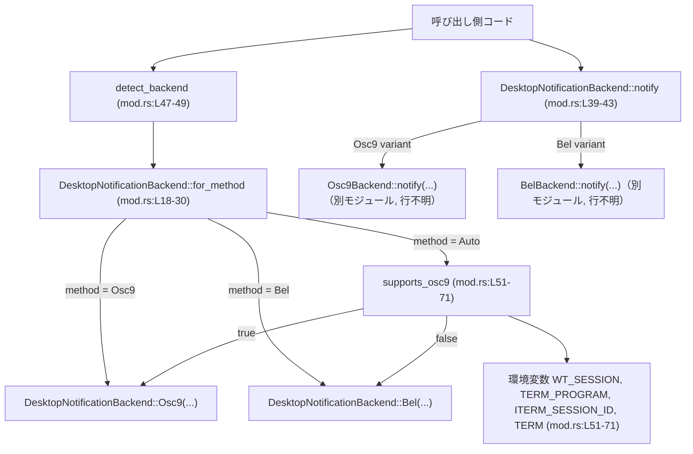
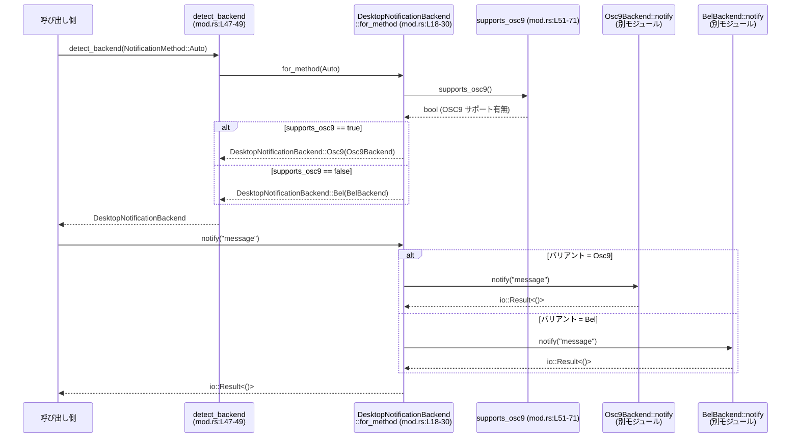

# tui/src/notifications/mod.rs コード解説

## 0. ざっくり一言

このモジュールは、設定値と環境変数に基づいて **デスクトップ通知バックエンド（OSC 9 / BEL）を選択し、通知を送るための共通インターフェース** を提供します（mod.rs:L11-15, L17-45, L47-49, L51-71）。

---

## 1. このモジュールの役割

### 1.1 概要

- このモジュールは、`NotificationMethod`（設定による通知方法指定）に応じて、`Osc9Backend` または `BelBackend` を選択し、統一された API で通知を送るために存在します（mod.rs:L7-9, L11-15, L17-45, L47-49）。
- `NotificationMethod::Auto` のときには、端末環境（環境変数）を調べることで、OSC 9 に対応していれば OSC 9 を、そうでなければ BEL を選択します（mod.rs:L18-30, L51-71）。
- ユーザは `DesktopNotificationBackend` と `detect_backend` を使うことで、バックエンドの詳細を意識せずに通知を送ることができます（mod.rs:L11-15, L17-45, L47-49）。

### 1.2 アーキテクチャ内での位置づけ

このモジュールは、TUI 全体の中で「通知のフロントエンド」に相当します。

- 外部からは `NotificationMethod`（設定モジュール `codex_config::types` で定義）を入力として受け取ります（mod.rs:L8, L18, L47）。
- 内部で `DesktopNotificationBackend` を生成し、`Osc9Backend` / `BelBackend` という具体的なバックエンド型にディスパッチします（mod.rs:L7, L9, L11-15, L18-30, L39-43）。
- 環境変数の読み取りにより、OSC 9 が使えるかどうかを判定します（mod.rs:L51-71）。

以下は、このファイルの処理の依存関係を表した図です（mod.rs:L7-9, L11-15, L18-30, L39-43, L47-49, L51-71）。



### 1.3 設計上のポイント

- **バックエンドの抽象化**  
  - `DesktopNotificationBackend` が enum として OSC 9 / BEL を包み、呼び出し側はこの enum 経由で通知を送ります（mod.rs:L11-15, L39-43）。
- **自動検出ロジックの分離**  
  - バックエンド選択のロジックは `for_method` と `supports_osc9` に集約されています（mod.rs:L18-30, L51-71）。
- **環境変数を用いたヒューリスティック**  
  - `TERM_PROGRAM`, `WT_SESSION`, `ITERM_SESSION_ID`, `TERM` を組み合わせて、OSC 9 サポートの有無を判定します（mod.rs:L51-71）。
  - UTF-8 でない環境変数値は `env::var(...).ok()` により無視され、保守的に「OSC 9 非対応」と扱われます（mod.rs:L57-60, L68-71）。
- **テストにおける環境変数の安全な変更**  
  - `EnvVarGuard` と `Drop` 実装により、テストごとに環境変数の変更を RAII で元に戻します（mod.rs:L81-84, L86-102, L104-113）。
  - `serial_test::serial` によって、環境変数をいじるテストを直列実行に制限しています（mod.rs:L78, L131-133, L144-146）。
- **並行性**  
  - 本体コードは環境変数の読み取りのみで、スレッド間で共有される可変状態は持ちません（mod.rs:L51-71）。
  - テストでは環境変数を書き換えていますが、`serial` と RAII により他テストとの競合を避けています（mod.rs:L78, L81-84, L86-102, L104-113, L131-141, L144-155）。

---

## 2. 主要な機能一覧

### 2.1 コンポーネント一覧（インベントリ）

このチャンクに現れる型・関数の一覧です（行番号はこのファイル内での推定です）。

| 名前 | 種別 | 公開 | 定義位置 | 役割 |
|------|------|------|----------|------|
| `bel` | モジュール | 非公開 | mod.rs:L1 | BEL バックエンド実装を含むモジュール（中身はこのチャンクには現れない） |
| `osc9` | モジュール | 非公開 | mod.rs:L2 | OSC 9 バックエンド実装を含むモジュール（中身はこのチャンクには現れない） |
| `DesktopNotificationBackend` | enum | 公開 | mod.rs:L11-15 | デスクトップ通知バックエンドの選択子（Osc9 / Bel） |
| `DesktopNotificationBackend::for_method` | 関数（関連関数） | 公開 | mod.rs:L18-30 | `NotificationMethod` から適切なバックエンドを生成 |
| `DesktopNotificationBackend::method` | メソッド | 公開 | mod.rs:L32-37 | 自身が表現している通知方法（Osc9 / Bel）を返す |
| `DesktopNotificationBackend::notify` | メソッド | 公開 | mod.rs:L39-44 | 内部のバックエンドに委譲して通知を送る |
| `detect_backend` | 関数 | 公開 | mod.rs:L47-49 | `DesktopNotificationBackend::for_method` の薄いラッパー |
| `supports_osc9` | 関数 | 非公開 | mod.rs:L51-71 | 環境変数から OSC 9 サポートの有無を判定 |
| `tests` | モジュール | テスト時のみ | mod.rs:L74-156 | バックエンド選択ロジックのテスト一式 |
| `EnvVarGuard` | 構造体 | テスト内 | mod.rs:L81-84 | 環境変数の変更と復元を RAII で管理 |
| `EnvVarGuard::set` | 関数 | テスト内 | mod.rs:L86-93 | 環境変数を設定し、元の値を記録 |
| `EnvVarGuard::remove` | 関数 | テスト内 | mod.rs:L95-101 | 環境変数を削除し、元の値を記録 |
| `Drop for EnvVarGuard` | Drop 実装 | テスト内 | mod.rs:L104-113 | スコープ終了時に環境変数を元に戻す |
| `selects_osc9_method` | テスト関数 | テスト内 | mod.rs:L115-121 | `NotificationMethod::Osc9` で OSC 9 バックエンドが選択されることを確認 |
| `selects_bel_method` | テスト関数 | テスト内 | mod.rs:L123-129 | `NotificationMethod::Bel` で BEL バックエンドが選択されることを確認 |
| `auto_prefers_bel_without_hints` | テスト関数 | テスト内 | mod.rs:L131-142 | 環境変数ヒントなしの場合は BEL が選ばれることを確認 |
| `auto_uses_osc9_for_iterm` | テスト関数 | テスト内 | mod.rs:L144-155 | iTerm のセッション環境変数がある場合は OSC 9 が選ばれることを確認 |

### 2.2 提供機能（概要）

- **バックエンド列挙型の提供**  
  - `DesktopNotificationBackend`: OSC 9 / BEL バックエンドをひとつの型にまとめる（mod.rs:L11-15）。
- **バックエンドの自動選択**  
  - `DesktopNotificationBackend::for_method` / `detect_backend`: 設定値と環境に基づき適切なバックエンドを生成（mod.rs:L18-30, L47-49, L51-71）。
- **通知送信 API**  
  - `DesktopNotificationBackend::notify`: バックエンドを意識せずに通知文字列を送る（mod.rs:L39-44）。
- **環境判定ロジック**  
  - `supports_osc9`: 端末種別やセッション情報から OSC 9 サポートを判定（mod.rs:L51-71）。
- **テスト用環境変数ガード**  
  - `EnvVarGuard`: テスト時に環境変数を安全に書き換えるためのユーティリティ（mod.rs:L81-84, L86-102, L104-113）。

---

## 3. 公開 API と詳細解説

### 3.1 型一覧（構造体・列挙体など）

| 名前 | 種別 | 公開範囲 | 役割 / 用途 | 定義位置 |
|------|------|----------|-------------|----------|
| `DesktopNotificationBackend` | enum | 公開 | デスクトップ通知バックエンド（Osc9 / Bel）の実体を保持し、共通インターフェースを提供する | mod.rs:L11-15 |
| `EnvVarGuard` | 構造体 | テストモジュール内のみ | テスト時に環境変数の変更と復元を RAII で管理する | mod.rs:L81-84 |

`BelBackend` / `Osc9Backend` は `bel` / `osc9` モジュールからインポートされていますが、その定義はこのチャンクには現れません（mod.rs:L1-2, L7, L9）。

### 3.2 関数詳細（コア API）

#### `DesktopNotificationBackend::for_method(method: NotificationMethod) -> Self` （mod.rs:L18-30）

**概要**

- 設定で指定された `NotificationMethod` に基づき、`DesktopNotificationBackend` のインスタンスを生成します。
- `NotificationMethod::Auto` の場合は `supports_osc9` を利用してバックエンドを自動選択します（mod.rs:L20-26, L51-71）。

**引数**

| 引数名 | 型 | 説明 |
|--------|----|------|
| `method` | `NotificationMethod` | 通知方法の指定。`Auto`, `Osc9`, `Bel` のいずれか（このチャンクで登場するのはこの 3 つのみ、mod.rs:L20-28）。 |

**戻り値**

- `DesktopNotificationBackend`  
  - `NotificationMethod::Osc9` の場合は `DesktopNotificationBackend::Osc9(Osc9Backend)`（mod.rs:L27）。
  - `NotificationMethod::Bel` の場合は `DesktopNotificationBackend::Bel(BelBackend)`（mod.rs:L28）。
  - `NotificationMethod::Auto` の場合は `supports_osc9()` の結果に応じていずれかを選択（mod.rs:L20-26, L51-71）。

**内部処理の流れ**

1. `match method` で `NotificationMethod` のバリアントを分岐します（mod.rs:L19-29）。
2. `Auto` の場合（mod.rs:L20-26）:
   - `supports_osc9()` を呼び出し、真なら `Osc9(Osc9Backend)`、偽なら `Bel(BelBackend)` を生成します（mod.rs:L21-25）。
3. `Osc9` の場合は常に `Osc9(Osc9Backend)` を生成します（mod.rs:L27）。
4. `Bel` の場合は常に `Bel(BelBackend)` を生成します（mod.rs:L28）。

**Examples（使用例）**

```rust
use codex_config::types::NotificationMethod;              // NotificationMethod をインポート
use tui::notifications::DesktopNotificationBackend;       // 本モジュールの enum をインポート

fn main() {
    // Auto モードでバックエンドを自動検出する（mod.rs:L18-26, L51-71）
    let backend = DesktopNotificationBackend::for_method(NotificationMethod::Auto);

    // 明示的に OSC 9 バックエンドを選ぶことも可能（mod.rs:L27）
    let osc9_backend = DesktopNotificationBackend::for_method(NotificationMethod::Osc9);

    // 明示的に BEL バックエンドを選ぶことも可能（mod.rs:L28）
    let bel_backend = DesktopNotificationBackend::for_method(NotificationMethod::Bel);

    // ここでは実行のみを示し、通知送信は別例で扱います
}
```

**Errors / Panics**

- この関数自体は `Result` を返さず、内部でも `panic!` を呼び出していません（mod.rs:L18-30）。
- 環境変数の取得には `env::var` / `env::var_os` を用いていますが、`supports_osc9()` 内でエラーを `ok()` により無視しているため、エラーがそのまま伝播することはありません（mod.rs:L57-60, L68-71）。

**Edge cases（エッジケース）**

- `NotificationMethod::Auto` かつ、環境変数がすべて未設定または非 UTF-8 の場合  
  → `supports_osc9()` はすべてのパターンにマッチせず、`false` になるため BEL が選択されます（mod.rs:L51-71, L133-141）。
- `NotificationMethod::Auto` かつ、`ITERM_SESSION_ID` のみが設定されている場合  
  → iTerm とみなされ、OSC 9 が選択されることがテストで確認されています（mod.rs:L63-66, L144-155）。
- `NotificationMethod` が将来新しいバリアントを持つように拡張された場合の挙動は、このチャンクからは分かりません（`match` は 3 バリアントのみを扱っています, mod.rs:L19-29）。

**使用上の注意点**

- `supports_osc9()` の選択ロジックは環境変数に依存するため、テストや特定環境では意図しないバックエンドが選ばれる可能性があります。必要であれば `Osc9` / `Bel` を明示的に指定することが前提となります（mod.rs:L21-28, L51-71）。
- 設定値 `NotificationMethod` の取得元（`codex_config` 側）はこのチャンクには現れないため、その値がどのタイミングで決定されるかは別モジュール依存です。

---

#### `DesktopNotificationBackend::method(&self) -> NotificationMethod` （mod.rs:L32-37）

**概要**

- `DesktopNotificationBackend` が内包しているバックエンドの種類（Osc9 / Bel）を `NotificationMethod` として返します（mod.rs:L32-37）。

**引数**

| 引数名 | 型 | 説明 |
|--------|----|------|
| `&self` | `&DesktopNotificationBackend` | 対象のバックエンド enum への参照。所有権は移動しません（借用）。 |

**戻り値**

- `NotificationMethod`  
  - `DesktopNotificationBackend::Osc9(_)` の場合は `NotificationMethod::Osc9`（mod.rs:L34）。
  - `DesktopNotificationBackend::Bel(_)` の場合は `NotificationMethod::Bel`（mod.rs:L35）。

**内部処理の流れ**

1. `match self` により enum のバリアントで分岐（mod.rs:L33-36）。
2. バリアントに応じた `NotificationMethod` を返します。

**Examples（使用例）**

```rust
use codex_config::types::NotificationMethod;
use tui::notifications::DesktopNotificationBackend;

fn print_method(backend: &DesktopNotificationBackend) {
    // 現在のバックエンド種別を取得（mod.rs:L32-37）
    let method: NotificationMethod = backend.method();
    println!("現在の通知方法: {:?}", method);           // Debug 表示は NotificationMethod 側の実装に依存
}
```

**Errors / Panics**

- パターンが 2 つのバリアントに完全対応しており、`panic!` の可能性はコードからは見えません（mod.rs:L33-36）。
- 将来 `DesktopNotificationBackend` が新しいバリアントを持つように拡張された場合、コンパイルエラーを通じてこの関数の修正が必要になります。

**Edge cases**

- `NotificationMethod::Auto` を返すケースは存在しません。`for_method` が `Auto` を具体的なバックエンドに解消してしまうためです（mod.rs:L20-28, L32-37）。

**使用上の注意点**

- この関数は純粋に列挙型の情報を返すのみで、副作用はありません。
- ログやデバッグ用途での利用が主になると考えられますが、それ以上の意味付けはコードからは読み取れません。

---

#### `DesktopNotificationBackend::notify(&mut self, message: &str) -> io::Result<()>` （mod.rs:L39-44）

**概要**

- 各バックエンド固有の `notify` 実装に処理を委譲して、通知メッセージを送信します（mod.rs:L39-43）。
- エラーは `io::Result<()>` で呼び出し元に伝達されます。

**引数**

| 引数名 | 型 | 説明 |
|--------|----|------|
| `&mut self` | `&mut DesktopNotificationBackend` | バックエンドに対する可変参照。内包するバックエンドが内部状態を持ちうることを想定したシグネチャです。 |
| `message` | `&str` | 通知として送信する文字列（UTF-8 文字列スライス）。 |

**戻り値**

- `io::Result<()>`  
  - 成功時は `Ok(())`。  
  - 失敗時は `Err(e)` が返されます。`e` の具体的な型は `std::io::Error` です（`use std::io;` より, mod.rs:L5, L39）。

**内部処理の流れ**

1. `match self` により、`Osc9` / `Bel` バリアントを判定（mod.rs:L40-43）。
2. `Osc9` の場合: 内包する `backend` の `notify(message)` を呼び出します（mod.rs:L41）。
3. `Bel` の場合: 内包する `backend` の `notify(message)` を呼び出します（mod.rs:L42）。
4. 各バックエンドから返ってきた `io::Result<()>` をそのまま呼び出し元に返します。

**Examples（使用例）**

```rust
use codex_config::types::NotificationMethod;
use tui::notifications::{detect_backend, DesktopNotificationBackend};
use std::io;

fn send_notification() -> io::Result<()> {
    // Auto でバックエンドを検出（mod.rs:L47-49）
    let mut backend: DesktopNotificationBackend =
        detect_backend(NotificationMethod::Auto);

    // 通知を送信。失敗時は Err が返る（mod.rs:L39-43）
    backend.notify("ビルドが完了しました")?;

    Ok(())
}
```

**Errors / Panics**

- エラーはすべてバックエンド側の `notify` から `io::Result` 経由で伝わります（mod.rs:L41-42）。
- この関数内で `panic!` は使用されていません（mod.rs:L39-44）。
- バックエンド実装 (`BelBackend`, `Osc9Backend`) の詳細はこのチャンクには現れないため、どの条件で `Err` が返るかは不明です。

**Edge cases**

- `message` が空文字列の場合の扱いはバックエンド実装に依存し、このチャンクからは分かりません。
- `message` が非常に長い場合のパフォーマンスや失敗条件も、バックエンド側の実装に依存します。

**使用上の注意点**

- `&mut self` を要求するため、同じ `DesktopNotificationBackend` を複数スレッドで同時に使う場合は、外側で排他制御（`Mutex` など）が必要になります（モジュール内で並行処理は行っていませんが、呼び出し側の責務です）。
- I/O を伴う処理であるため、高頻度で呼び出すと性能に影響する可能性があります。詳細はバックエンド実装に依存します。

---

#### `pub fn detect_backend(method: NotificationMethod) -> DesktopNotificationBackend` （mod.rs:L47-49）

**概要**

- `DesktopNotificationBackend::for_method` をそのまま呼び出す、シンプルな公開ヘルパー関数です（mod.rs:L47-49）。
- モジュール外からは、この関数を使うことで `DesktopNotificationBackend` 型に直接触れずにバックエンドを取得できます。

**引数**

| 引数名 | 型 | 説明 |
|--------|----|------|
| `method` | `NotificationMethod` | 通知方法の指定。`for_method` にそのまま渡されます。 |

**戻り値**

- `DesktopNotificationBackend`  
  - `DesktopNotificationBackend::for_method(method)` の戻り値がそのまま返されます（mod.rs:L48）。

**内部処理の流れ**

1. 単に `DesktopNotificationBackend::for_method(method)` を呼び出し、その戻り値を返します（mod.rs:L48）。

**Examples（使用例）**

```rust
use codex_config::types::NotificationMethod;
use tui::notifications::detect_backend;

fn main() {
    // Auto 設定からバックエンドを検出（mod.rs:L47-49）
    let backend = detect_backend(NotificationMethod::Auto);
    // あとは backend.notify(...) を使って通知を送る
}
```

**Errors / Panics**

- 自身ではエラーやパニックを発生させません。振る舞いは `for_method` に完全に依存します（mod.rs:L48）。

**Edge cases / 使用上の注意点**

- 機能的には `DesktopNotificationBackend::for_method` のラッパーなので、エッジケースや注意点は `for_method` と同じです。

---

#### `fn supports_osc9() -> bool` （mod.rs:L51-71）

**概要**

- 現在のプロセス環境（環境変数）に基づき、OSC 9 ベースの通知がサポートされているかどうかを判定します（mod.rs:L51-71）。
- 自動選択モード (`NotificationMethod::Auto`) のときにのみ使用されます（mod.rs:L20-26）。

**引数**

- ありません。

**戻り値**

- `bool`  
  - `true`: OSC 9 バックエンドを利用可能と判定。  
  - `false`: BEL バックエンドを利用すべきと判定。

**内部処理の流れ**

1. `WT_SESSION` がセットされているかを `env::var_os("WT_SESSION")` で確認し、セットされていれば即座に `false` を返します（Windows Terminal を想定, mod.rs:L51-53）。
2. `TERM_PROGRAM` を `env::var("TERM_PROGRAM").ok().as_deref()` で取得し、`WezTerm`, `WarpTerminal`, `ghostty` のいずれかなら `true` を返します（mod.rs:L55-61）。
3. `ITERM_SESSION_ID` がセットされていれば `true` を返します（iTerm 判定, mod.rs:L63-66）。
4. `TERM` を `env::var("TERM").ok().as_deref()` で取得し、`xterm-kitty`, `wezterm`, `wezterm-mux` のいずれかなら `true` を返します（mod.rs:L67-71）。
5. 上記のいずれにもマッチしなければ `false` となります。

**Examples（使用例）**

通常は直接呼び出さず、`for_method` 内部で使用されますが、挙動の確認用途としては以下のように利用できます（テストコードなど）。

```rust
// 本来は非公開関数のため、同一モジュール内またはテスト内でのみ使用可能（mod.rs:L51-71）
fn debug_supports_osc9() {
    let supported = super::supports_osc9();
    println!("OSC 9 サポート: {}", supported);
}
```

**Errors / Panics**

- `env::var` の結果は `.ok()` によって `Option` に変換されており、UTF-8 でない値やその他のエラーは単に「値なし」として扱われます（mod.rs:L57-60, L68-71）。
- `panic!` や `unwrap()` は使用されていません（mod.rs:L51-71）。
- `env::var_os` も `Option` なので、エラーは発生しません（mod.rs:L51-53, L63-66）。

**Edge cases**

- 環境変数が一切設定されていない場合  
  → すべてのチェックが失敗し、`false` が返ります（mod.rs:L51-71）。テスト `auto_prefers_bel_without_hints` がこのケースを検証しています（mod.rs:L133-141）。
- 環境変数に未知の値が設定されている場合  
  → `matches!` のパターンに含まれていなければ `false` になります（mod.rs:L57-60, L68-71）。
- UTF-8 でない値が `TERM_PROGRAM` / `TERM` に入っている場合  
  → `env::var` が `Err` を返し、`.ok()` により `None` となるため、「ヒントなし」と同じ扱いです（mod.rs:L57-60, L68-71）。

**使用上の注意点**

- 環境変数に依存するヒューリスティックであり、すべての端末エミュレータを網羅してはいません。必要に応じてパターンの追加・変更が必要になります（mod.rs:L55-60, L67-71）。
- プロセス環境はグローバル状態であり、他スレッドや他ライブラリが同時に環境変数を変更していると、結果が不安定になる可能性があります。ただし本関数は読み取りのみで、副作用はありません（mod.rs:L51-71）。

---

### 3.3 その他の関数・テスト

#### テスト補助関数

| 関数名 | 定義位置 | 役割（1 行） |
|--------|----------|--------------|
| `EnvVarGuard::set` | mod.rs:L86-93 | 指定した環境変数を設定し、元の値を保持しておく。`Drop` 時に元に戻す。 |
| `EnvVarGuard::remove` | mod.rs:L95-101 | 指定した環境変数を削除し、元の値を保持しておく。`Drop` 時に元に戻す。 |
| `Drop::drop` (EnvVarGuard) | mod.rs:L104-113 | 保持していた元の値に基づき、環境変数を復元または削除する。 |

これらの中で `std::env::set_var` / `remove_var` は安全な関数ですが、コード上では `unsafe` ブロックで囲まれています（mod.rs:L89-91, L97-99, L106-111）。これはコンパイラ上の要請ではなく、「グローバルな環境変数の変更は論理的には危険である」という意図を示すためのスタイルであると解釈できます。ただし、これは推測であり、明示的なコメントはありません。

#### テストケース

| テスト名 | 定義位置 | 検証内容 |
|----------|----------|----------|
| `selects_osc9_method` | mod.rs:L115-121 | `NotificationMethod::Osc9` を指定したときに `DesktopNotificationBackend::Osc9(_)` が返ることを確認。 |
| `selects_bel_method` | mod.rs:L123-129 | `NotificationMethod::Bel` を指定したときに `DesktopNotificationBackend::Bel(_)` が返ることを確認。 |
| `auto_prefers_bel_without_hints` | mod.rs:L131-142 | 全ての関連環境変数を削除した状態では Auto が BEL を選択することを確認。 |
| `auto_uses_osc9_for_iterm` | mod.rs:L144-155 | iTerm のセッション環境変数が設定されている場合には Auto が OSC 9 を選択することを確認。 |

すべてのテストが `detect_backend` を経由して `DesktopNotificationBackend` のバリアントを検証しており、これは公開 API の契約（Contract）をテストしている形になっています（mod.rs:L76-77, L115-121, L123-129, L133-141, L146-155）。

---

## 4. データフロー

ここでは、もっとも典型的なシナリオである「Auto 設定でバックエンドを選び、通知を送る」流れを説明します。

1. 呼び出し側が `NotificationMethod::Auto` を指定して `detect_backend` を呼ぶ（mod.rs:L47-49）。
2. `detect_backend` が `DesktopNotificationBackend::for_method(NotificationMethod::Auto)` を呼び出す（mod.rs:L48）。
3. `for_method` 内で `supports_osc9()` が呼ばれ、環境変数から OSC 9 サポートを判定する（mod.rs:L20-26, L51-71）。
4. 判定結果に応じて `DesktopNotificationBackend::Osc9(Osc9Backend)` または `DesktopNotificationBackend::Bel(BelBackend)` を生成する（mod.rs:L21-25）。
5. 呼び出し側が得られた `DesktopNotificationBackend` に対して `notify(message)` を呼び出す（mod.rs:L39-43）。
6. `notify` が内部のバックエンドの `notify` メソッドに処理を委譲し、`io::Result<()>` を受け取る（mod.rs:L41-42）。

このフローを sequence diagram で示します（mod.rs:L18-30, L39-43, L47-49, L51-71）。



---

## 5. 使い方（How to Use）

### 5.1 基本的な使用方法

典型的な流れは以下の通りです。

1. 設定などから `NotificationMethod` を決定する。
2. `detect_backend` で `DesktopNotificationBackend` を取得する。
3. `notify` メソッドで通知を送る。

```rust
use codex_config::types::NotificationMethod;              // 通知方法の設定型（mod.rs:L8）
use tui::notifications::{detect_backend, DesktopNotificationBackend};
use std::io;

fn main() -> io::Result<()> {
    // 1. 設定から通知方法を決定する（ここでは Auto を仮定）
    let method = NotificationMethod::Auto;

    // 2. バックエンドを自動検出（mod.rs:L47-49）
    let mut backend: DesktopNotificationBackend = detect_backend(method);

    // 3. 通知を送信（mod.rs:L39-43）
    backend.notify("処理が完了しました")?;

    Ok(())
}
```

### 5.2 よくある使用パターン

1. **環境に依存しない動作をさせたい場合**  
   → `NotificationMethod::Osc9` または `NotificationMethod::Bel` を明示的に指定します。

```rust
use codex_config::types::NotificationMethod;
use tui::notifications::detect_backend;
use std::io;

fn use_fixed_backend() -> io::Result<()> {
    // 常に BEL バックエンドを使用する（mod.rs:L28, L47-49）
    let mut backend = detect_backend(NotificationMethod::Bel);
    backend.notify("常に BEL で通知します")?;
    Ok(())
}
```

1. **Auto モードで環境変数をテストしたい場合**  
   → テストコード中で `EnvVarGuard` を使い、特定の端末環境をエミュレートします（mod.rs:L81-84, L86-102）。

（これはテスト用であり、実際のアプリケーションコードからは通常使用しません。）

### 5.3 よくある間違い

```rust
use codex_config::types::NotificationMethod;
use tui::notifications::detect_backend;

// 間違い例: backend を共有参照で保持しつつ、&mut self を必要とする notify を複数箇所から同時に呼ぶ
fn wrong_usage() {
    let backend = detect_backend(NotificationMethod::Auto);
    // let result = backend.notify("..."); // コンパイルエラー: &mut self が必要（mod.rs:L39）
}

// 正しい例: &mut backend を扱えるスコープでのみ notify を呼ぶ
fn correct_usage() {
    let mut backend = detect_backend(NotificationMethod::Auto);
    let _ = backend.notify("1つ目の通知");
    let _ = backend.notify("2つ目の通知");
}
```

### 5.4 使用上の注意点（まとめ）

- `DesktopNotificationBackend::notify` は `&mut self` を要求するため、同一インスタンスを複数箇所で同時に使用する場合は同期機構が必要です（mod.rs:L39-43）。
- Auto モードの挙動は環境変数に依存し、環境が変わるとバックエンド選択も変わります（mod.rs:L20-26, L51-71）。
- バックエンド内部の I/O エラーは `io::Result<()>` としてそのまま伝播します（mod.rs:L39-43）。呼び出し側で適切なエラーハンドリングが必要です。
- このモジュール自体は非同期（`async`）を使用していません。非同期コードから利用する場合には、同期 I/O であることを考慮する必要があります。

---

## 6. 変更の仕方（How to Modify）

### 6.1 新しい機能を追加する場合（例: 新しい通知方法）

1. **`NotificationMethod` に新しいバリアントを追加**  
   - これは `codex_config::types::NotificationMethod` 側の変更であり、このチャンクには現れません。
2. **新バックエンドモジュールの追加**  
   - `tui/src/notifications/new_backend.rs` などに新しいバックエンド実装（例: `NewBackend`）を追加します（推測。構成は bel/osc9 に倣う形になります）。
3. **本モジュールでのインポートと enum 拡張**  
   - `use new_backend::NewBackend;` を追加（このチャンクには存在しないため、変更が必要）。
   - `DesktopNotificationBackend` enum に新バリアント（例: `New(NewBackend)`）を追加します（mod.rs:L11-15 の拡張）。
4. **`for_method` の `match` に新バリアント対応を追加**  
   - 新しい `NotificationMethod` バリアントに対して、新バリアントを生成するロジックを追加します（mod.rs:L19-29 の拡張）。
5. **`method` の `match` にも対応を追加**  
   - 新しい enum バリアントに対応して、適切な `NotificationMethod` を返すようにします（mod.rs:L33-36 の拡張）。
6. **テストの追加**  
   - `tests` モジュールに、新バリアント用のテストを追加します（mod.rs:L115-155 に倣う）。

### 6.2 既存の機能を変更する場合（例: 環境判定ロジックの調整）

- **影響範囲の確認**
  - `supports_osc9` の振る舞いを変更すると、`NotificationMethod::Auto` の選択結果が変わります（mod.rs:L20-26, L51-71）。
  - テスト `auto_prefers_bel_without_hints` / `auto_uses_osc9_for_iterm` の結果にも影響します（mod.rs:L131-141, L144-155）。
- **注意すべき契約**
  - 「ヒントが無ければ BEL を選ぶ」「iTerm では OSC 9 を選ぶ」という契約がテストによって暗黙的に定義されています（mod.rs:L133-141, L144-155）。
- **変更時のチェック項目**
  - `NotificationMethod::Osc9` / `NotificationMethod::Bel` がそれぞれ固定のバックエンドにマッピングされるという性質は維持されているか（mod.rs:L27-28）。
  - 新しい端末のサポートを追加する場合、`matches!` のパターンに漏れがないか（mod.rs:L57-60, L68-71）。
  - 環境変数操作を行うテストに新しいパターンを追加するかどうか。

---

## 7. 関連ファイル

このモジュールと密接に関係するファイル・モジュールは以下の通りです。

| パス | 役割 / 関係 |
|------|------------|
| `tui/src/notifications/bel.rs`（推定） | `mod bel;` で参照される BEL バックエンド実装。`BelBackend` 型とその `notify` メソッドを定義していると推測されます（mod.rs:L1, L7, L14, L28, L42）。実際の実装はこのチャンクには現れません。 |
| `tui/src/notifications/osc9.rs`（推定） | `mod osc9;` で参照される OSC 9 バックエンド実装。`Osc9Backend` 型とその `notify` メソッドを定義していると推測されます（mod.rs:L2, L9, L13, L27, L41）。実際の実装はこのチャンクには現れません。 |
| `codex_config::types` | `NotificationMethod` を定義している設定モジュール。`Auto`, `Osc9`, `Bel` などのバリアントがこのチャンクから確認できます（mod.rs:L8, L18-29, L115-121, L123-129, L138-141, L152-153）。 |
| `serial_test` クレート | テストを直列実行にするための属性マクロ `serial` を提供（mod.rs:L78, L131-133, L144-146）。グローバルな環境変数をテストで操作する際の競合を避ける目的で使用されています。 |

---

## Bugs / Security / Contracts / Edge Cases（まとめ）

- **潜在的なバグ・セキュリティ上の懸念**
  - バックエンドの選択が環境変数に依存しているため、外部から環境変数を操作できる状況では、想定外のバックエンドが選択される可能性があります。ただし、通知方法が変わるだけであり、機密情報漏洩などの直接的なセキュリティリスクはコードからは読み取れません（mod.rs:L51-71）。
  - テストでの `unsafe` ブロックはコンパイラ上の必然ではなく、スタイル上のものと考えられます（mod.rs:L89-91, L97-99, L106-111）。`unsafe` 自体による未定義動作のリスクは、`std::env::set_var` / `remove_var` が安全関数であることから低いと言えます。
- **契約 (Contract)**
  - `NotificationMethod::Osc9` → `DesktopNotificationBackend::Osc9(_)`（mod.rs:L27, L115-121）。
  - `NotificationMethod::Bel` → `DesktopNotificationBackend::Bel(_)`（mod.rs:L28, L123-129）。
  - Auto かつヒントなし → BEL（mod.rs:L51-71, L133-141）。
  - Auto かつ iTerm セッション → OSC 9（mod.rs:L63-66, L144-155）。
- **エッジケース**
  - 環境変数が存在しない／未知の端末 → BEL を使用（mod.rs:L51-71, L133-141）。
  - UTF-8 でない環境変数 → 無視され、ヒントなし扱い（mod.rs:L57-60, L68-71）。
  - バックエンドの `notify` でどのような I/O エラーが発生するかは、このチャンクからは不明です。

以上が、本ファイル `tui/src/notifications/mod.rs` の公開 API、コアロジック、データフロー、および安全性・エッジケースに関する整理です。
