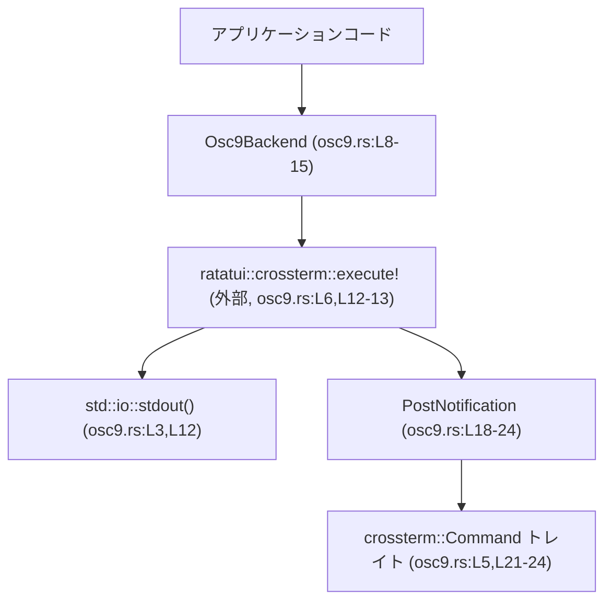

# tui/src/notifications/osc9.rs

## 0. ざっくり一言

OSC 9（Operating System Command 9）という ANSI エスケープシーケンスを使って、ターミナル経由でデスクトップ通知を送るための小さなバックエンド実装です（`Osc9Backend`, `PostNotification`）。  
`crossterm` の `Command` トレイトと `execute!` マクロに統合される形で動作します（`osc9.rs:L5-6,L11-13,L21-24`）。

---

## 1. このモジュールの役割

### 1.1 概要

- このモジュールは **ターミナルから OSC 9 コードを出力して通知を行う** ための機能を提供します。
- `Osc9Backend` が公開バックエンドとして `notify` メソッドを持ち、内部的に `PostNotification` コマンドを発行します（`osc9.rs:L8-15,L18-24`）。
- `PostNotification` は `crossterm::Command` トレイトを実装し、通知用エスケープシーケンス `ESC ] 9;message BEL` を組み立てます（`osc9.rs:L5,L18-24`）。

### 1.2 アーキテクチャ内での位置づけ

このファイル内の依存関係と典型的な呼び出し関係を簡略化した図です。



- アプリケーションは `Osc9Backend::notify` を呼び出します（`osc9.rs:L11-13`）。
- `notify` は `execute!(stdout(), PostNotification(...))` を実行し、標準出力に `PostNotification` コマンドを書き込みます（`osc9.rs:L12-13`）。
- `PostNotification` は `Command` トレイト実装により、`write_ansi` で OSC 9 文字列を生成します（`osc9.rs:L21-24`）。
- Windows 向けには `execute_winapi`, `is_ansi_code_supported` も実装されていますが、このファイル単体からはどの程度使用されるかは分かりません（`osc9.rs:L26-36`）。

### 1.3 設計上のポイント

- **薄いバックエンドラッパ**  
  - `Osc9Backend` はフィールドを持たない 0 サイズ構造体です（`osc9.rs:L8-9`）。
  - 実際の処理はすべて `notify` 内の `execute!` 呼び出しと `PostNotification` に委譲されています（`osc9.rs:L12-13,L21-24`）。
- **エラーハンドリング方針**  
  - `notify` は `io::Result<()>` を返し、`execute!` マクロの結果をそのまま返しています（`osc9.rs:L2,L11-13`）。
  - Windows での `execute_winapi` は必ず `Err` を返す実装になっており、WinAPI 経路での実行はエラー扱いになります（`osc9.rs:L26-31`）。
- **状態を持たない & スレッド安全性の観点**  
  - `Osc9Backend` はフィールドを持たないため、自身に共有状態はありません（`osc9.rs:L8-9`）。
  - ただし `notify` 内で `stdout()` に書き込むため、**複数スレッドから同時に呼ぶと標準出力の出力順序が競合しうる**点が注意事項になります（`osc9.rs:L3,L12-13`）。
- **ANSI 前提の設計（Windows 含む）**  
  - Windows 対応として `execute_winapi` はエラー、`is_ansi_code_supported` は常に `true` を返します（`osc9.rs:L26-36`）。
  - これは「WinAPI 経由ではなく ANSI エスケープシーケンスとして扱うべき」という意図があると解釈できますが、実際にどの経路が使われるかは `crossterm` 側の実装に依存します（このファイルからは詳細不明）。

---

## 2. 主要な機能一覧

- OSC 9 通知バックエンド: `Osc9Backend` 構造体と `notify` メソッドで、メッセージをデスクトップ通知として送る（`osc9.rs:L8-15`）。
- OSC 9 コマンド生成: `PostNotification` 構造体が `Command` トレイトを実装し、OSC 9 エスケープシーケンス文字列 `ESC ] 9;message BEL` を生成する（`osc9.rs:L18-24`）。
- Windows 上の挙動制御: Windows 環境で `execute_winapi` を必ずエラーにし、ANSI コードをサポートすることを宣言する（`osc9.rs:L26-36`）。

---

## 3. 公開 API と詳細解説

### 3.1 型・関数インベントリー

#### 型一覧

| 名前 | 種別 | 公開 | 役割 / 用途 | 定義位置 |
|------|------|------|-------------|----------|
| `Osc9Backend` | 構造体（フィールドなし） | `pub` | OSC 9 通知を送るバックエンド。`notify` メソッドを通じて通知を発行する。 | `osc9.rs:L8-9` |
| `PostNotification` | タプル構造体 (`pub String`) | `pub` | メッセージ文字列を保持し、それを OSC 9 エスケープシーケンスとして出力する `Command` 実装。 | `osc9.rs:L18-19` |
| `impl Command for PostNotification` | トレイト実装 | - | `PostNotification` を `crossterm::Command` として `execute!` から利用可能にする。ANSI 出力および Windows での挙動を定義。 | `osc9.rs:L21-36` |

#### 関数（メソッド）一覧

| 名前 | 所属 | シグネチャ（要約） | 公開 | 定義位置 |
|------|------|--------------------|------|----------|
| `notify` | `impl Osc9Backend` | `pub fn notify(&mut self, message: &str) -> io::Result<()>` | `pub` | `osc9.rs:L11-14` |
| `write_ansi` | `impl Command for PostNotification` | `fn write_ansi(&self, f: &mut impl fmt::Write) -> fmt::Result` | `pub`（トレイトメソッドとして） | `osc9.rs:L22-24` |
| `execute_winapi` | `impl Command for PostNotification`（`#[cfg(windows)]`） | `fn execute_winapi(&self) -> io::Result<()>` | `pub`（トレイトメソッドとして） | `osc9.rs:L26-31` |
| `is_ansi_code_supported` | `impl Command for PostNotification`（`#[cfg(windows)]`） | `fn is_ansi_code_supported(&self) -> bool` | `pub`（トレイトメソッドとして） | `osc9.rs:L33-36` |

> 備考: トレイトメソッドは `impl` 内では `pub` を書きませんが、`Command` トレイトの一部として公開 API になります。

---

### 3.2 関数詳細（テンプレート適用）

#### `Osc9Backend::notify(&mut self, message: &str) -> io::Result<()>`

**概要**

- 渡された `message` を含む `PostNotification` コマンドを標準出力に対して `execute!` で実行し、OSC 9 通知を送ります（`osc9.rs:L11-13`）。
- エラーが発生した場合は `io::Error` として呼び出し元に返します（`osc9.rs:L2,L11-13`）。

**引数**

| 引数名 | 型 | 説明 |
|--------|----|------|
| `&mut self` | `&mut Osc9Backend` | バックエンドインスタンスへの可変参照です。実装上は内部状態は持ちませんが、API としては可変借用を要求します（`osc9.rs:L8-9,L11`）。 |
| `message` | `&str` | 通知として送信するメッセージ文字列です（`osc9.rs:L11`）。 |

**戻り値**

- 型: `io::Result<()>`（`osc9.rs:L2,L11`）
- 意味:
  - `Ok(())`: 通知コマンドの書き込みが成功したことを表します。
  - `Err(e)`: 標準出力への書き込みなど、`execute!` マクロ内部で発生した I/O エラーをそのまま返します（`osc9.rs:L12-13`）。

**内部処理の流れ（アルゴリズム）**

コード（`osc9.rs:L11-13`）:

```rust
pub fn notify(&mut self, message: &str) -> io::Result<()> {
    execute!(stdout(), PostNotification(message.to_string()))
}
```

処理のステップ:

1. `stdout()` を呼び出し、標準出力ハンドルを取得します（`osc9.rs:L3,L12`）。
2. `message.to_string()` で `&str` を所有権を持つ `String` に変換します（`osc9.rs:L12-13`）。
3. その `String` をフィールドとして `PostNotification` 構造体を生成します（`osc9.rs:L18-19,L12-13`）。
4. `execute!(...)` マクロを呼び出し、標準出力に対して `PostNotification` コマンドを実行します（`osc9.rs:L6,L12-13`）。
   - 一般的な `crossterm` の挙動としては、`Command` トレイトの `write_ansi`（および必要に応じて Windows では `execute_winapi`）が呼ばれますが、このファイル単体から具体的な呼び出し順序は分かりません。
5. `execute!` の実行結果（`io::Result<()>`）をそのまま呼び出し元に返します（`osc9.rs:L11-13`）。

**Examples（使用例）**

もっとも基本的な使い方の例です。クレート内から `Osc9Backend` を利用し、通知を 1 回送信します。

```rust
use std::io;                                      // io::Result を扱うため
use crate::notifications::osc9::Osc9Backend;      // このモジュールの Osc9Backend をインポート（パスはファイル階層に基づく）

fn main() -> io::Result<()> {                     // エラー伝播に ? を使うため、main も io::Result を返す
    let mut backend = Osc9Backend::default();     // フィールドを持たないバックエンドをデフォルト生成（osc9.rs:L8-9）
    backend.notify("ビルドが完了しました")?;      // OSC 9 通知を送信。失敗したら Err が main に伝播（osc9.rs:L11-13）
    Ok(())                                        // 正常終了
}
```

**Errors / Panics**

- **Errors**
  - `execute!(stdout(), ...)` 内で I/O エラーが発生した場合、`Err(io::Error)` が返されます（`osc9.rs:L11-13`）。
  - 例としては、標準出力が閉じられている・書き込みが OS によって拒否される等がありますが、これは `std::io::stdout` と `crossterm` の実装に依存し、このファイル単体からは詳細は分かりません。
- **Panics**
  - コード上、明示的に `panic!` は使用していません（`osc9.rs` 全体）。
  - 理論上は `message.to_string()` のメモリ確保や標準出力周りでのランタイムパニックの可能性はありますが、Rust 標準ライブラリの一般的挙動に属し、このファイル特有のパニックは定義されていません。

**Edge cases（エッジケース）**

- `message` が空文字列 `""` の場合  
  - `write_ansi` は `\x1b]9;\x07` を出力することになり（詳細は後述）、特にエラー処理はされていません（`osc9.rs:L22-24`）。
- `message` が非常に長い場合  
  - 文字列コピーと標準出力への書き込みコストが増えます。エラーが起きた場合には `Err(io::Error)` が返りますが、長さによる特別な制限はこのコードからは読み取れません（`osc9.rs:L11-13`）。
- `message` に制御文字や別のエスケープシーケンスが含まれる場合  
  - そのまま出力に埋め込まれます（`write_ansi` が単純な `write!` を行っているため、`osc9.rs:L22-24`）。  
  - これはターミナル側で予期しない挙動を引き起こす可能性があり、セキュリティ/安全性の観点で注意が必要です（詳細は後述）。

**使用上の注意点**

- **結果のチェック**  
  - `notify` は `io::Result<()>` を返すため、`?` で伝播するか、`match` でエラーを適切に処理する必要があります（`osc9.rs:L11-13`）。
- **メッセージの信頼性**  
  - `message` に外部入力（ユーザー入力やネットワークからの文字列）をそのまま渡すと、任意のエスケープシーケンスをターミナルに送り込むことになります。  
    - デバッグ用途以外で不特定多数からの入力をそのまま通知に使うのは避けるほうが安全です（`osc9.rs:L22-24` 参照）。
- **並列呼び出し**  
  - `Osc9Backend` 自体は状態を持たないため、型としては `Send` / `Sync` になり得ますが、`stdout()` への書き込みは他スレッドも利用し得る共有リソースです（`osc9.rs:L3,L12-13`）。  
  - 複数スレッドから同時に `notify` を呼ぶと、通知文字列や他の標準出力内容が混ざる可能性があります。出力順序が重要な場合は、上位でロックするなどの対策が必要です。

---

#### `PostNotification::write_ansi(&self, f: &mut impl fmt::Write) -> fmt::Result`

**概要**

- 保持しているメッセージ文字列を OSC 9 形式の ANSI エスケープシーケンスとして書き込みます（`osc9.rs:L21-24`）。
- 出力される形式は `\x1b]9;{message}\x07`（`ESC ] 9;message BEL`）です。

**引数**

| 引数名 | 型 | 説明 |
|--------|----|------|
| `&self` | `&PostNotification` | 通知メッセージを内部に持つコマンドインスタンスです（`osc9.rs:L18-19,L21-23`）。 |
| `f` | `&mut impl fmt::Write` | ANSI シーケンスを書き出す先。`String` やバッファ、`crossterm` 内部の書き込みラッパなどが渡されます（`osc9.rs:L1,L22`）。 |

**戻り値**

- 型: `fmt::Result`（`osc9.rs:L1,L22`）
- 意味:
  - `Ok(())`: 書き込みが成功した。
  - `Err(e)`: `fmt::Write` 実装側で発生したフォーマット/書き込みエラー。

**内部処理の流れ**

コード（`osc9.rs:L22-23`）:

```rust
fn write_ansi(&self, f: &mut impl fmt::Write) -> fmt::Result {
    write!(f, "\x1b]9;{}\x07", self.0)
}
```

1. フォーマット文字列 `"\x1b]9;{}\x07"` を用意します（`osc9.rs:L23`）。
   - `\x1b` は ESC（エスケープ）文字。
   - `]9;` は OSC 9 のヘッダ部分。
   - `{}` は `self.0`（保持しているメッセージ文字列）で置き換えられます（`osc9.rs:L18-19,L23`）。
   - `\x07` は BEL（ベル）文字で、OSC シーケンスの終端です。
2. `write!` マクロで、このフォーマット文字列を `f` に書き込みます（`osc9.rs:L23`）。
3. `write!` の戻り値（`fmt::Result`）をそのまま返します。

**Examples（使用例）**

`write_ansi` 自体は通常 `execute!` や `crossterm` 内部から呼ばれるため、直接使うことは少ないですが、挙動確認用の例です。

```rust
use std::fmt::Write as FmtWrite;                     // String に対して write! を使うためのトレイト
use crate::notifications::osc9::PostNotification;    // PostNotification をインポート（osc9.rs:L18-19）

fn main() {
    let cmd = PostNotification("Hello".to_string()); // メッセージ "Hello" を持つコマンドを作成
    let mut buf = String::new();                     // 出力先バッファ

    cmd.write_ansi(&mut buf).unwrap();               // ANSI シーケンスを書き込む（osc9.rs:L22-23）

    assert_eq!(buf, "\x1b]9;Hello\x07");             // 期待される OSC 9 シーケンスを検証（osc9.rs:L23）
}
```

**Errors / Panics**

- **Errors**
  - `fmt::Write` 実装 `f` の書き込みが失敗すると `Err(fmt::Error)` が返ります（`osc9.rs:L22-23`）。
- **Panics**
  - この関数自体には `panic!` は含まれていません（`osc9.rs:L22-23`）。

**Edge cases（エッジケース）**

- `self.0` が空文字列  
  - 出力は `\x1b]9;\x07` となります（`osc9.rs:L23`）。  
  - ターミナル側がこれをどう扱うか（空メッセージを無視するかなど）は環境依存です。
- `self.0` に `BEL` や `ESC` などの制御文字が含まれる場合  
  - そのまま埋め込まれます。終端の `\x07` はフォーマット文字列で固定されているため、途中に `\x07` を含んでいてもシーケンスが二重に終了しうるなど、ターミナル側で予期せぬ解釈が起こる可能性があります（`osc9.rs:L23`）。
- `self.0` に非常に長い文字列が入っている場合  
  - 出力が長くなるだけで、特別な処理は行われません（`osc9.rs:L23`）。

**使用上の注意点**

- **入力のサニタイズ**  
  - 外部入力を `PostNotification` に直接格納して `write_ansi` すると、任意の文字列がそのままターミナルに出力されます（`osc9.rs:L18-19,L23`）。  
  - ターミナルに対するエスケープインジェクションを避けたい場合、メッセージから制御文字を取り除くなどのサニタイズが必要です。
- **プロトコルの互換性**  
  - OSC 9 をサポートしていないターミナルでは、このエスケープシーケンスは単なる文字列として表示されるか無視されます。  
  - 対象環境でのサポート状況は、このファイルからは分かりません。

---

#### `PostNotification::execute_winapi(&self) -> io::Result<()>`（`#[cfg(windows)]`）

**概要**

- Windows の WinAPI 経由でのコマンド実行に対する実装ですが、この関数は **必ずエラーを返す** ように定義されています（`osc9.rs:L26-31`）。
- これにより、「WinAPI 経由でこのコマンドを実行しようとするのは誤りであり、ANSI 経由を使うべき」というメッセージを示します。

**引数**

| 引数名 | 型 | 説明 |
|--------|----|------|
| `&self` | `&PostNotification` | 通知メッセージを持つコマンド。引数としては受け取るものの、内容は参照されません（`osc9.rs:L26-27`）。 |

**戻り値**

- 型: `io::Result<()>`（`osc9.rs:L2,L27`）
- 返り値:
  - 常に `Err(std::io::Error::other("tried to execute PostNotification using WinAPI; use ANSI instead"))` を返します（`osc9.rs:L27-30`）。

**内部処理の流れ**

コード（`osc9.rs:L26-31`）:

```rust
#[cfg(windows)]
fn execute_winapi(&self) -> io::Result<()> {
    Err(std::io::Error::other(
        "tried to execute PostNotification using WinAPI; use ANSI instead",
    ))
}
```

1. 引数 `self` は使用しません。
2. `std::io::Error::other(...)` を使って新しい `io::Error` を生成します（`osc9.rs:L28-29`）。
3. その `Err` を即座に返します（`osc9.rs:L27-30`）。

**Examples（使用例）**

通常、アプリケーションコードから直接このメソッドを呼び出すことはありません。  
crossterm が内部で Windows 用の経路として呼び出すことを想定したメソッドです（詳細は外部ライブラリ依存で、このファイルからは不明）。

**Errors / Panics**

- **Errors**
  - *必ず* `Err(io::Error)` を返します。  
    - エラー種別は `ErrorKind::Other`（`Error::other` による）になります（`osc9.rs:L28`）。
- **Panics**
  - コード上で `panic!` は使用していません（`osc9.rs:L26-31`）。

**Edge cases / 使用上の注意点**

- この関数を直接呼び出した場合でも、常にエラーになるため、**成功することを期待して使用すべきではありません**（`osc9.rs:L27-30`）。
- 上位の `crossterm` 側で、このエラーがどのように扱われるか（リトライ・フォールバック・即座に伝播など）は、このファイルからは分かりません。

---

#### `PostNotification::is_ansi_code_supported(&self) -> bool`（`#[cfg(windows)]`）

**概要**

- Windows 環境において、このコマンドが ANSI コードとしてサポートされているかを示します（`osc9.rs:L33-36`）。
- この実装では、**常に `true` を返します**。

**引数**

| 引数名 | 型 | 説明 |
|--------|----|------|
| `&self` | `&PostNotification` | メソッドシグネチャ上の引数であり、この実装では値は使われません（`osc9.rs:L33-35`）。 |

**戻り値**

- 型: `bool`
- 意味:
  - 常に `true` を返し、「ANSI コードとしての実行がサポートされている」というシグナルを出します（`osc9.rs:L34-35`）。

**内部処理**

コード（`osc9.rs:L33-36`）:

```rust
#[cfg(windows)]
fn is_ansi_code_supported(&self) -> bool {
    true
}
```

- 何の条件分岐も行わず、`true` を返しています。

**使用上の注意点**

- `crossterm` の一般的な設計では、この値をもとに ANSI 経路を使うかどうか判断する部分がありますが、具体的な利用方法は外部ライブラリの実装に依存します。
- このファイルでは常に `true` を返しているため、**Windows でも ANSI 経路を使うことを前提にしている**と読み取れます（`osc9.rs:L33-35`）。

---

### 3.3 その他の関数

- このファイルには、上記以外の関数・メソッドは定義されていません（`osc9.rs` 全体）。

---

## 4. データフロー

ここでは、`Osc9Backend::notify` を使って通知を送る場合の代表的なデータフローを示します。

### 処理の要点

- アプリケーションコードは `notify("message")` を呼びます（`osc9.rs:L11-13`）。
- `notify` は `PostNotification(message.to_string())` を`execute!(stdout(), ...)` に渡します（`osc9.rs:L12-13,L18-19`）。
- `execute!` は `Command` トレイト実装（`write_ansi` など）を通じて、OSC 9 エスケープシーケンスを標準出力に書き込みます（`osc9.rs:L21-24`）。

### シーケンス図

```mermaid
sequenceDiagram
    participant App as アプリコード
    participant Backend as Osc9Backend::notify (osc9.rs:L11-13)
    participant Exec as execute! マクロ（外部, osc9.rs:L6,L12）
    participant Stdout as stdout() (osc9.rs:L3,L12)
    participant Cmd as PostNotification::write_ansi (osc9.rs:L22-24)

    App->>Backend: notify("Hello")
    Backend->>Exec: execute!(stdout(), PostNotification("Hello".to_string()))
    Exec->>Stdout: 書き込み用ハンドル取得
    Exec->>Cmd: Command::write_ansi(&cmd, writer)
    Cmd-->>Exec: "\x1b]9;Hello\x07" を writer に書き込み
    Exec-->>Backend: io::Result<()>
    Backend-->>App: io::Result<()>
```

> 注意: `execute!` マクロ内部の具体的な呼び出し順序は `crossterm` の実装に依存し、このファイル単体からは厳密には分かりません。上記は一般的な利用パターンの概念図です。

---

## 5. 使い方（How to Use）

### 5.1 基本的な使用方法

`Osc9Backend` を使って通知を 1 回送る最小限の例です。

```rust
use std::io;                                      // io::Result を扱う
use crate::notifications::osc9::Osc9Backend;      // このファイルの Osc9Backend をインポート（osc9.rs:L8-9）

fn main() -> io::Result<()> {                     // エラー伝播のため main も Result を返す
    let mut backend = Osc9Backend::default();     // フィールドなし構造体なので Default が利用可能（osc9.rs:L8-9）
    backend.notify("処理が完了しました")?;        // 通知を送信。失敗したら Err が main に伝播（osc9.rs:L11-13）
    Ok(())                                        // 正常終了
}
```

### 5.2 よくある使用パターン

1. **アプリケーション内のイベント通知**

```rust
use std::io;                                      // io::Result を扱う
use crate::notifications::osc9::Osc9Backend;      // Osc9Backend のインポート（osc9.rs:L8-9）

fn run_build() -> io::Result<()> {                // ビルド処理全体を表す関数
    // ... ビルド処理 ...
    Ok(())                                        // 処理が成功したとする
}

fn main() -> io::Result<()> {
    let mut backend = Osc9Backend::default();     // バックエンド生成

    if let Err(e) = run_build() {                 // ビルド処理を実行
        backend.notify(&format!("ビルド失敗: {e}"))?; // エラー内容を通知（osc9.rs:L11-13,L18-19）
    } else {
        backend.notify("ビルド成功")?;           // 成功時の通知
    }

    Ok(())
}
```

1. **`PostNotification` を直接使ってシーケンスを生成する（テストやデバッグ用）**

```rust
use std::fmt::Write as FmtWrite;                     // String に対する write! を使うため
use crate::notifications::osc9::PostNotification;    // PostNotification のインポート（osc9.rs:L18-19）

fn main() {
    let cmd = PostNotification("Test".to_string());  // コマンドインスタンス作成
    let mut s = String::new();                       // 出力先バッファ

    cmd.write_ansi(&mut s).unwrap();                 // ANSI シーケンスを書き込む（osc9.rs:L22-23）

    println!("{:?}", s);                             // バッファ内容を確認
}
```

### 5.3 よくある間違い

```rust
use crate::notifications::osc9::Osc9Backend;   // Osc9Backend をインポート（osc9.rs:L8-9）

fn incorrect() {
    let mut backend = Osc9Backend::default();  // バックエンド生成

    // 間違い例: 結果を無視している
    backend.notify("通知します").ok();        // エラーが発生しても握りつぶしてしまう（推奨されない）
}

fn correct() -> std::io::Result<()> {
    let mut backend = Osc9Backend::default();  // 正しい使い方: 戻り値を扱う

    // 正しい例: ? でエラーを呼び出し元へ伝播（osc9.rs:L11-13）
    backend.notify("通知します")?;

    Ok(())
}
```

**典型的な誤りと対策**

- 戻り値 `io::Result<()>` を無視してしまい、通知が失敗しても気づかない。  
  → `?` 演算子やログを使って、エラーを確認・伝播するべきです（`osc9.rs:L11-13`）。
- Windows で OSC 9 がサポートされていない環境で、「通知が来ない」と誤解する。  
  → このコードは単にエスケープシーケンスを出力するだけなので、OS/ターミナル側のサポートが前提になります（`osc9.rs:L22-24`）。

### 5.4 使用上の注意点（まとめ）

- **エラー処理**:  
  - `notify` は `io::Result<()>` を返すため、必ず結果を扱う必要があります（`osc9.rs:L11-13`）。
- **入力の安全性**:  
  - メッセージ文字列はそのままエスケープシーケンスに埋め込まれるため、信頼できない入力を直接通知に使うと、ターミナルへの制御シーケンス注入のリスクがあります（`osc9.rs:L22-24`）。
- **環境依存性**:  
  - OSC 9 のサポートの有無・動作はターミナルエミュレータや OS に依存します。このファイルはあくまで「シーケンスを出力する」責務のみを持ちます。
- **並行性**:  
  - `notify` はグローバルな `stdout()` を使うため、他のコードと標準出力を共有することになります。同時出力が問題になる場合は、適宜ロックやキューイングで制御する必要があります（`osc9.rs:L3,L12-13`）。

---

## 6. 変更の仕方（How to Modify）

### 6.1 新しい機能を追加する場合

例: OSC 9 以外の通知手段（別の OSC コードやベル音など）を追加したい場合。

1. **新しいコマンド型の追加**  
   - `PostNotification` を参考に、新しい構造体と `Command` 実装を追加します（`osc9.rs:L18-24`）。
   - 形式を変えたい場合は、`write_ansi` のフォーマット文字列を変更します。
2. **バックエンド側の拡張**  
   - `Osc9Backend` に新しいメソッド（例: `notify_with_title` など）を追加し、対応するコマンド型を `execute!` で実行するようにします（`osc9.rs:L11-13`）。
3. **Windows での挙動調整**  
   - Windows 向けの挙動を変えたい場合は、`execute_winapi` / `is_ansi_code_supported` の実装を変更し、どう振る舞うかを明示します（`osc9.rs:L26-36`）。  
   - ただし、`crossterm` がこれらをどのように利用するかは外部仕様に依存するため、ライブラリのドキュメントを確認する必要があります。

### 6.2 既存の機能を変更する場合

- **影響範囲の確認**
  - `Osc9Backend::notify` を変更すると、このバックエンドを利用している全てのコードに影響します（`osc9.rs:L11-13`）。
  - `PostNotification` のフォーマット（`write_ansi`）を変更すると、通知として送られるエスケープシーケンスの仕様が変わるため、外部挙動への影響が大きくなります（`osc9.rs:L22-24`）。
- **契約（前提条件・返り値の意味）の維持**
  - `notify` の戻り値が `io::Result<()>` であること、成功時は `Ok(())` であることは、呼び出し元との契約になっていると考えられます（`osc9.rs:L11-13`）。
  - `execute_winapi` が常にエラーを返すという現在の仕様を変える場合は、Windows 上の挙動が大きく変わる可能性があるため、上位コードの期待との整合性を確認する必要があります（`osc9.rs:L26-31`）。
- **テスト**
  - このファイルにはテストコードは含まれていません（`osc9.rs` 全体）。  
  - 変更を行う場合は、少なくとも `write_ansi` の出力文字列を検証するようなテストを別ファイルに追加することが推奨されます。

---

## 7. 関連ファイル

このチャンクから直接分かる関連コンポーネントは、主に外部クレートです。同一クレート内の他ファイルは、このファイルだけでは特定できません。

| パス / クレート | 役割 / 関係 |
|----------------|------------|
| `crossterm::Command`（`osc9.rs:L5,L21-24`） | `PostNotification` が実装するトレイト。`execute!` マクロを通じてコマンドが実行される仕組みを提供します。 |
| `ratatui::crossterm::execute`（`osc9.rs:L6,L12-13`） | `notify` から呼び出されるマクロ。`stdout()` に対して `PostNotification` コマンドを実行します。 |
| `std::io::stdout`（`osc9.rs:L3,L12`） | 通知を出力するデバイス（標準出力）を取得します。 |
| `tui/src/notifications/osc9.rs`（本ファイル） | OSC 9 通知バックエンドおよびコマンドの実装本体です。 |

> 補足: `tui/src/notifications/mod.rs` などのモジュール定義ファイルが存在する可能性はありますが、このチャンクには現れていないため、具体的な構成は不明です。
