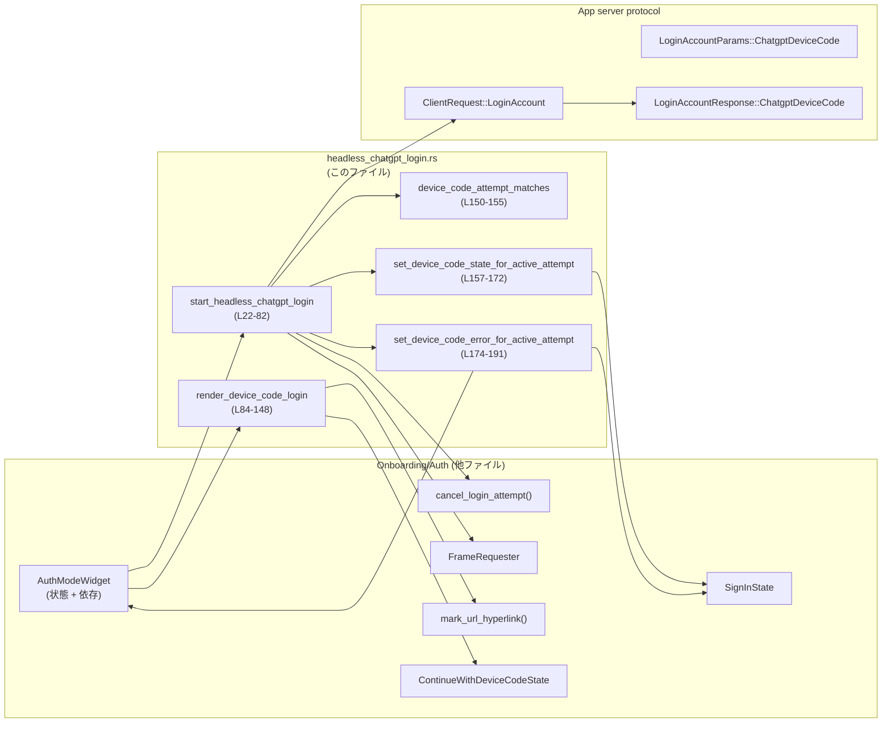
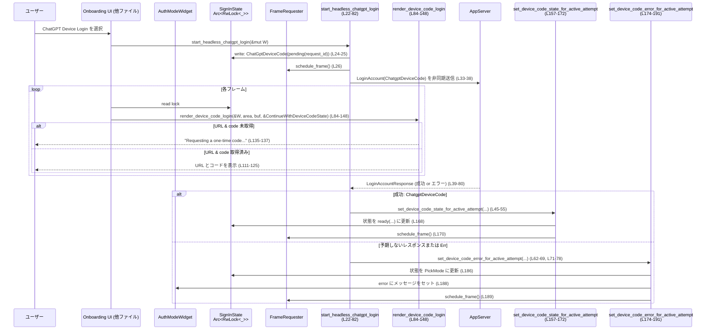

# tui/src/onboarding/auth/headless_chatgpt_login.rs コード解説

## 0. ざっくり一言

ChatGPT アカウントの「デバイスコード方式ログイン」を TUI 上で開始し、その進行状況やエラーを状態に反映しつつ、画面に表示するためのヘッドレス認証用モジュールです。  
(tui/src/onboarding/auth/headless_chatgpt_login.rs:L22-81, L84-148)

---

## 1. このモジュールの役割

### 1.1 概要

- ChatGPT デバイスコード方式のログイン要求をバックエンド（app server）に送り、非同期に結果を待つ処理を開始します。  
  (L22-38)
- レスポンスに応じて `SignInState` とエラー状態を安全に更新し、TUI の再描画を要求します。  
  (L24-27, L45-61, L63-80, L157-172, L174-191)
- ログイン画面に、ブラウザで開く URL とワンタイムコード、注意文言などを描画します。  
  (L84-148)

### 1.2 アーキテクチャ内での位置づけ

このファイルは Onboarding/Auth フローの一部として、**ChatGPT デバイスコードログインモード**に特化したロジックと描画を担当します。

主要な依存関係は以下のとおりです：

- 上位モジュールから提供される状態・UI:
  - `AuthModeWidget`（サインイン画面の状態＋依存オブジェクト）(L15, L22, L84)
  - `SignInState`, `ContinueWithDeviceCodeState`（サインイン状態のステートマシン）(L16-17, L24-25, L150-154)
  - `FrameRequester`（画面再描画要求）(L26, L30, L159-160, L170, L176, L189-190)
- バックエンド通信:
  - `app_server_request_handle.request_typed::<LoginAccountResponse>` (L28, L32-38)
  - `ClientRequest::LoginAccount` / `LoginAccountParams::ChatgptDeviceCode` / `LoginAccountResponse::ChatgptDeviceCode` (L33-37, L40-44)
  - `cancel_login_attempt`（キャンセル用ヘルパ）(L18, L58-60)
- UI 表示まわり:
  - ratatui の `Buffer`, `Rect`, `Paragraph`, `Wrap`, `Line`, `Stylize` (L4-10, L84-88, L113-116, L122-125, L128-131, L135-143)
  - アニメーション用 `shimmer_spans` (L13, L96-104)
  - `mark_url_hyperlink` による URL のハイパーリンク化 (L19, L145-147)

依存関係イメージ：



### 1.3 設計上のポイント

- **リクエストごとの ID による整合性確保**  
  各ログイン試行に `request_id`（UUID 文字列）を割り当て、後から返ってきた非同期レスポンスが「現在も有効な試行」に対応するかどうかを `device_code_attempt_matches` で判定してから状態更新します。  
  (L23-25, L45-49, L150-155, L163-166, L181-184)
- **状態マシンベースの UI 更新**  
  `SignInState::ChatGptDeviceCode` 内の `ContinueWithDeviceCodeState` を `pending` → `ready` → 失敗時 `SignInState::PickMode` と遷移させる設計になっています。  
  (L24-25, L45-55, L168-171, L186-190)
- **非同期処理と UI の分離**  
  実際のネットワークリクエストは `tokio::spawn` 内で行い、UI 側は共有状態（`Arc<RwLock<...>>`）を描画時に読むだけです。  
  (L28-33, L32, L84-88, L157-163, L174-181)
- **TUI 描画のトリガー管理**  
  状態やエラーを変更したタイミングで `FrameRequester::schedule_frame` / `schedule_frame_in` を呼び出し、TUI の再描画を依頼しています。  
  (L26, L30, L98-101, L170, L189-190)
- **テストによる並行更新条件の検証**  
  「アクティブな試行に対してのみ状態を更新する」ことがテストで明示的に検証されています。  
  (L200-205, L220-263, L265-307)

---

## 2. コンポーネント一覧（インベントリ）

### 2.1 関数・モジュール一覧

| 種別 | 名前 | 概要 | 定義位置 |
|------|------|------|----------|
| 関数 | `start_headless_chatgpt_login` | ChatGPT デバイスコードログインを開始し、非同期リクエストを発行するエントリポイント | L22-82 |
| 関数 | `render_device_code_login` | デバイスコードログイン画面の描画を行う | L84-148 |
| 関数 | `device_code_attempt_matches` | 現在の `SignInState` が指定 `request_id` の ChatGPT デバイスコード試行か判定 | L150-155 |
| 関数 | `set_device_code_state_for_active_attempt` | アクティブな試行に対してのみ `SignInState::ChatGptDeviceCode` を新しい状態に更新 | L157-172 |
| 関数 | `set_device_code_error_for_active_attempt` | アクティブな試行にのみエラーを反映し、`SignInState` を `PickMode` に戻す | L174-191 |
| テスト補助 | `pending_device_code_state` | 指定 `request_id` で pending 状態の `SignInState` を生成 | L200-205 |
| テスト | `device_code_attempt_matches_only_for_matching_request_id` | `device_code_attempt_matches` の判定ロジックを検証 | L206-218 |
| テスト | `set_device_code_state_for_active_attempt_updates_only_when_active` | `set_device_code_state_for_active_attempt` がアクティブ試行にのみ作用することを検証 | L220-263 |
| テスト | `set_device_code_error_for_active_attempt_updates_only_when_active` | エラー更新がアクティブ試行にのみ作用することを検証 | L265-307 |

### 2.2 外部型・依存関数（このチャンクに現れるもの）

> 中身の実装はこのファイルには無いため、用途のみ記述します。

| 名前 | 種別 | 用途 / 関係 | 根拠 |
|------|------|-------------|------|
| `AuthModeWidget` | 構造体（推定） | サインイン画面の状態・依存をまとめたウィジェット。サインイン状態、エラー、リクエストハンドル等を保持。 | L15, L22, L84-88 |
| `SignInState` | 列挙体（推定） | サインイン全体の状態。`ChatGptDeviceCode` と `PickMode` バリアントを使用。 | L17, L24-25, L150-154, L186-187, L207-217 |
| `ContinueWithDeviceCodeState` | 構造体／列挙体（推定） | デバイスコードログイン専用の状態。`pending`, `ready` などのコンストラクタや `request_id`, `verification_url`, `user_code`, `login_id` 等のフィールド／メソッドを持つ。 | L16, L24-25, L45-55, L84-89, L108-110, L221-236, L244-262 |
| `FrameRequester` | 構造体（推定） | TUI の再描画をスケジューリングする。`schedule_frame`, `schedule_frame_in`, `test_dummy` を使用。 | L26, L30, L98-101, L159-160, L170, L176, L189, L222 |
| `cancel_login_attempt` | 関数 | アクティブでなくなったログイン試行をバックエンドにキャンセルする | L18, L58-60 |
| `mark_url_hyperlink` | 関数 | Buffer 上の URL をハイパーリンクとしてマーク | L19, L145-147 |
| `onboarding_request_id` | 関数 | App server へのリクエスト ID（別の意味）を生成／取得 | L20, L35 |
| `ClientRequest::LoginAccount` | 列挙体バリアント | App server へのログインリクエスト種別 | L33-36 |
| `LoginAccountParams::ChatgptDeviceCode` | 列挙体バリアント | ChatGPT デバイスコード方式ログインパラメータ | L36 |
| `LoginAccountResponse::ChatgptDeviceCode` | 列挙体バリアント | デバイスコード方式ログインレスポンス（`login_id`, `verification_url`, `user_code` を含む） | L40-44 |
| `Buffer`, `Rect`, `Widget`, `Paragraph`, `Wrap`, `Line`, `Stylize` 他 | ratatui UI 構成要素 | TUI 画面にテキストを描画、スタイル適用、折り返し設定など | L4-10, L84-88, L106-143 |

---

## 3. 公開 API と詳細解説

ここでは、このモジュールが他モジュールから使用される主な関数（`pub(super)` を含む）とコアロジック関数について、詳細に説明します。

### 3.1 型一覧（このファイル内で定義されるもの）

このファイル内で新たに定義される構造体・列挙体はありません。  
(L1-307)

すべての状態型は他モジュール（`super::...`）からインポートされています。  
(L15-20)

### 3.2 主要関数の詳細

#### `start_headless_chatgpt_login(widget: &mut AuthModeWidget)`

**概要**

ChatGPT のデバイスコード方式ログイン試行を開始し、バックエンドへの非同期リクエストを発行します。レスポンスに応じて `SignInState` とエラー状態を更新し、画面更新をスケジュールします。  
(L22-27, L32-81)

**引数**

| 引数名 | 型 | 説明 | 根拠 |
|--------|----|------|------|
| `widget` | `&mut AuthModeWidget` | 認証モード画面のウィジェット。サインイン状態、エラー、リクエストハンドル、フレームリクエスタを内部に持っている。 | L22, L24-31 |

**戻り値**

- なし（`()`）。開始処理は非同期タスクとして `tokio::spawn` に渡されるため、この関数自体はすぐに戻ります。  
  (L22, L32-81)

**内部処理の流れ**

1. 新しい UUID を生成し、文字列化してログイン試行を識別する `request_id` とします。  
   (L23)
2. `widget.sign_in_state` に対して書き込みロックを取り、`SignInState::ChatGptDeviceCode(ContinueWithDeviceCodeState::pending(request_id.clone()))` に設定します。  
   (L24-25)
3. `widget.request_frame.schedule_frame()` を呼び出し、画面の再描画をスケジュールします。  
   (L26)
4. `app_server_request_handle`, `sign_in_state`, `request_frame`, `error` を clone して、`tokio::spawn` に move 可能な形でキャプチャします。  
   (L28-31, L32)
5. 非同期タスク内で `request_handle.request_typed::<LoginAccountResponse>(ClientRequest::LoginAccount { request_id: onboarding_request_id(), params: LoginAccountParams::ChatgptDeviceCode })` を呼び出し、ログイン開始リクエストを発行し `.await` します。  
   (L33-38)
6. `match` でレスポンスを分岐します。  
   (L39-80)
   - `Ok(LoginAccountResponse::ChatgptDeviceCode { login_id, verification_url, user_code })` の場合:
     1. `ContinueWithDeviceCodeState::ready` を使って、`request_id`, `login_id`, `verification_url`, `user_code` から「準備完了」状態の `ContinueWithDeviceCodeState` を作成します。  
        (L45-55)
     2. `set_device_code_state_for_active_attempt` を呼び出して、現在の `SignInState` がこの `request_id` の試行であれば状態を更新します。戻り値 `updated` で成否を受け取ります。  
        (L45-49, L157-166)
     3. `updated == true` なら、`error` に `None` を書き込み、エラー表示をクリアします。  
        (L56-57)
     4. `updated == false` なら、このレスポンスはもはやアクティブでない試行に対応するものとみなし、`cancel_login_attempt(&request_handle, login_id).await` でバックエンドにキャンセルを通知します。  
        (L58-60)
   - `Ok(other)` の場合（予期しないレスポンスバリアント）:
     1. `set_device_code_error_for_active_attempt` を呼び出し、アクティブな試行に対してのみエラーを設定し、`SignInState` を `PickMode` に戻します。  
        (L62-69, L174-191)
   - `Err(err)` の場合（通信エラー等）:
     1. 同様に `set_device_code_error_for_active_attempt` を呼び出し、`err.to_string()` をエラーメッセージとしてセットします。  
        (L71-78)

**Examples（使用例）**

Onboarding のどこかで、ChatGPT ログインモードを開始するときの呼び出し例は次のようになります（疑似コード）:

```rust
// 認証モードウィジェットをどこかで持っているとする
fn on_select_chatgpt_device_login(widget: &mut AuthModeWidget) {
    // ChatGPT デバイスコードログインを開始
    start_headless_chatgpt_login(widget); // L22

    // この関数はすぐ戻るが、バックグラウンドで非同期リクエストが進行する
}
```

**Errors / Panics**

- `RwLock::write().unwrap()` が使用されているため、`sign_in_state` のロックがポイズンされている場合は `panic` になります。  
  (L24, L57)
- 非同期リクエスト中に `request_typed` が `Err` を返しても `panic` はせず、テキスト化したエラーメッセージを `error` に格納します。  
  (L71-78, L174-191)
- `tokio::spawn` が返す `JoinHandle` は無視しているため、タスク内の `panic` は呼び出し元には伝播しません（Rust/Tokio の仕様に基づく説明）。

**Edge cases（エッジケース）**

- 同じウィジェットに対して複数回 `start_headless_chatgpt_login` を呼ぶと、複数の非同期タスクが動きますが、各レスポンスは `request_id` でフィルタされるため、**最後に開始された試行だけが状態を更新**する設計になっています。  
  (L23, L45-49, L150-155, L163-166, L181-184)
- 予期しない `LoginAccountResponse` バリアントが返ってきた場合、状態を `PickMode` に戻し、エラー文言 `"Unexpected account/login/start response: ..."` をセットします。  
  (L62-69, L174-191)

**使用上の注意点**

- `tokio` ランタイム上で呼び出されることを前提としています。`tokio::spawn` を使用するため、非 async コンテキストでもよいですが、全体としては Tokio ランタイムが必要です。  
  (L32)
- `AuthModeWidget` 内部の `sign_in_state`, `error`, `app_server_request_handle`, `request_frame` が正しく初期化されていることが前提です。このファイルからは内部構造は見えません。  
  (L24-31)
- 高頻度で何度も呼び出すと、そのたびに新しい非同期タスクとログイン試行が増えます。レスポンスは `request_id` で保護されていますが、バックエンド側の負荷には注意が必要です（一般的な注意）。

---

#### `render_device_code_login(widget: &AuthModeWidget, area: Rect, buf: &mut Buffer, state: &ContinueWithDeviceCodeState)`

**概要**

ChatGPT デバイスコードログイン画面を描画します。`state` に応じて「準備中」「URL とコード表示」などの内容を切り替え、必要なら URL にハイパーリンクやシマーアニメーションを付与します。  
(L84-148)

**引数**

| 引数名 | 型 | 説明 | 根拠 |
|--------|----|------|------|
| `widget` | `&AuthModeWidget` | 描画に必要な設定（アニメーション有効フラグ、フレームリクエスタなど）を持つウィジェット | L84-88, L96-104, L98-101 |
| `area` | `Rect` | 描画領域 | L85 |
| `buf` | `&mut Buffer` | 描画先バッファ | L87, L141-147 |
| `state` | `&ContinueWithDeviceCodeState` | デバイスコードログインの現在状態（URL / コードなど） | L88, L90-94, L108-110 |

**戻り値**

- なし（描画は `buf` と `area` に対する副作用として行われます）。  
  (L141-143, L145-147)

**内部処理の流れ**

1. `state.is_showing_copyable_auth()` に応じてバナー文言を切り替えます。  
   - `true`: `"Finish signing in via your browser"`  
   - `false`: `"Preparing device code login"`  
   (L90-94)
2. 行頭インデント `"  "` を含む `spans` を作成し、アニメーション設定に応じてバナー文字列を追加します。  
   - `widget.animations_enabled && !widget.animations_suppressed.get()` のとき、`request_frame.schedule_frame_in(100ms)` で次フレームを予約しつつ、`shimmer_spans(banner)` でシマーアニメーション用の spans を追加。  
     (L96-101)
   - そうでないときは単純に `banner` を push。  
     (L102-104)
3. 最初の行（バナー）と空行を `lines` に追加します。  
   (L106)
4. `state.verification_url` と `state.user_code` が両方 `Some` の場合と、それ以外で分岐します。  
   (L108-110)
   - 両方 `Some` の場合:
     - 手順 1, 2 のメッセージと URL 表示、コード表示、フィッシング注意文言を複数行に渡って追加。  
       (L111-132)
     - `verification_url.clone()` を `Some` で返し、後でハイパーリンク化に利用。  
       (L133-134)
   - それ以外の場合:
     - `"Requesting a one-time code..."` を dim スタイルで表示。  
       (L135-137)
     - `None` を返す。
5. 最後に `"Press Esc to cancel"` 行を追加します。  
   (L140)
6. `Paragraph::new(lines).wrap(Wrap{ trim: false }).render(area, buf)` で描画します。  
   (L141-143)
7. `verification_url` が `Some` なら `mark_url_hyperlink(buf, area, url)` を呼び出し、描画上の URL をハイパーリンクとしてマークします。  
   (L145-147)

**Examples（使用例）**

サインイン画面のメイン描画関数からの呼び出し例（疑似コード）:

```rust
fn render_auth_mode(widget: &AuthModeWidget, area: Rect, buf: &mut Buffer) {
    // どこかで SignInState を読んで、ChatGptDeviceCode の状態を取り出しているとする
    if let SignInState::ChatGptDeviceCode(ref state) = *widget.sign_in_state.read().unwrap() {
        render_device_code_login(widget, area, buf, state); // L84
    }
}
```

**Errors / Panics**

- `render_device_code_login` 自体はロック操作などを行っていないため、この関数内での `panic` 要因は主に ratatui / `mark_url_hyperlink` / `shimmer_spans` の内部に依存します。  
  (L84-148)
- URL やコードが `None` の場合でも安全に動作します（その場合 `"Requesting a one-time code..."` を表示）。  
  (L108-110, L135-137)

**Edge cases**

- `verification_url` のみ `Some` で `user_code` が `None` のような半端な状態の場合、`if let (Some(_), Some(_))` が成立しないため、準備中メッセージ側の表示になります。  
  (L108-110, L135-137)
- `animations_enabled` は `true` だが `animations_suppressed.get()` が `true` の場合、アニメーションは無効になり、固定テキスト表示になります。  
  (L96-104)
- 非常に長い URL やコードの改行位置は ratatui の `Wrap` に依存します（`trim: false` のため末尾スペースはトリムされません）。  
  (L141-143)

**使用上の注意点**

- この関数は状態を変更しません。純粋に描画に専念し、副作用は `buf` と `area` に限られます。  
  (L84-148)
- `state` に整合した `SignInState` を前提としているため、呼び出し側で `SignInState::ChatGptDeviceCode` の内部状態のみを渡すなど、正しいバリアントと対応させる必要があります。  
  (L88, L207-211, L221-263)

---

#### `device_code_attempt_matches(state: &SignInState, request_id: &str) -> bool`

**概要**

現在の `SignInState` が ChatGPT デバイスコードモードであり、その内部の `request_id` が引数の `request_id` と一致するかを判定します。  
(L150-155)

**引数**

| 引数名 | 型 | 説明 | 根拠 |
|--------|----|------|------|
| `state` | `&SignInState` | 現在のサインイン状態 | L150 |
| `request_id` | `&str` | 照合対象のリクエスト ID | L150, L153-154 |

**戻り値**

- `bool`: 条件を満たす場合 `true`、それ以外 `false`。  
  (L150-155)

**内部処理**

- `matches!` マクロでパターンマッチを行い、`SignInState::ChatGptDeviceCode(state)` かつ `state.request_id == request_id` の場合のみ `true` を返します。  
  (L151-154)

**Examples**

```rust
let state = SignInState::ChatGptDeviceCode(
    ContinueWithDeviceCodeState::pending("request-1".to_string())
);
assert!(device_code_attempt_matches(&state, "request-1")); // true
assert!(!device_code_attempt_matches(&state, "other"));    // false
```  

(テストからの抜粋 L207-213)

**使用上の注意点**

- `request_id` を識別子として使用するため、`start_headless_chatgpt_login` などで一貫して同じ文字列が使われることが前提です。  
  (L23, L24-25, L45-49, L150-154)

---

#### `set_device_code_state_for_active_attempt(...) -> bool`

```rust
fn set_device_code_state_for_active_attempt(
    sign_in_state: &Arc<RwLock<SignInState>>,
    request_frame: &crate::tui::FrameRequester,
    request_id: &str,
    next_state: ContinueWithDeviceCodeState,
) -> bool
```

**概要**

`sign_in_state` が指定 `request_id` の ChatGPT デバイスコード試行である場合のみ、その内部状態を `next_state` に更新し、画面再描画を要求します。条件に合わなければ状態は変更せず `false` を返します。  
(L157-172)

**引数**

| 引数名 | 型 | 説明 | 根拠 |
|--------|----|------|------|
| `sign_in_state` | `&Arc<RwLock<SignInState>>` | 共有サインイン状態。書き込みロックを取得して更新する。 | L158-159, L163-168 |
| `request_frame` | `&FrameRequester` | フレーム再描画を要求するためのハンドル | L159-160, L170 |
| `request_id` | `&str` | アクティブ試行かどうかを判定するための ID | L160, L164-165 |
| `next_state` | `ContinueWithDeviceCodeState` | 新しいデバイスコード状態（ready など） | L161-162, L168 |

**戻り値**

- `bool`: 状態が更新された場合 `true`、更新しなかった場合 `false`。  
  (L162, L165, L171-172)

**内部処理**

1. `sign_in_state.write().unwrap()` で書き込みロックを取得します。  
   (L163)
2. `device_code_attempt_matches(&guard, request_id)` で現在の状態がこの `request_id` の試行であるかをチェック。  
   - 合致しない場合: `false` を返し、状態を変更しません。  
     (L164-166)
3. 合致する場合: `*guard = SignInState::ChatGptDeviceCode(next_state)` によって新しい状態をセットし、ロックを開放します。  
   (L168-169)
4. `request_frame.schedule_frame()` を呼び、TUI の再描画をスケジュールします。  
   (L170)
5. `true` を返します。  
   (L171-172)

**Examples**

テストでの使用例:

```rust
let request_frame = crate::tui::FrameRequester::test_dummy();
let sign_in_state = pending_device_code_state("request-1"); // L200-205

let updated = set_device_code_state_for_active_attempt(
    &sign_in_state,
    &request_frame,
    "request-1",
    ContinueWithDeviceCodeState::ready(/* ... */),
); // L225-236

assert_eq!(updated, true); // 更新された
```  

(L220-238)

**Errors / Panics**

- `sign_in_state.write().unwrap()` により、`RwLock` がポイズンされていると `panic` になります。  
  (L163)
- その他は `Result` を返さず、失敗は `false` 戻り値で表現される（条件不一致のみ）。  
  (L164-166, L171-172)

**Edge cases**

- `SignInState` が `ChatGptDeviceCode` でも、`request_id` が違う場合は更新されません（`false`）。  
  (L164-166, L244-258)
- `SignInState` が `PickMode` など全く別のバリアントの場合も `false` になります（テストで検証済み）。  
  (L207-217, L244-262)

**使用上の注意点**

- この関数は「現在の試行がアクティブかどうか」を判定する安全弁として使われています。非同期レスポンス処理から状態更新するときには必ずこれを通すことで、古いレスポンスが新しい試行の UI を上書きするのを防いでいます。  
  (L45-49, L157-166, L220-263)
- ロックを取得するため、呼び出しはなるべく短時間で完了するように保たれています（実際に行う処理は単純な代入とフレーム予約のみ）。  
  (L163-171)

---

#### `set_device_code_error_for_active_attempt(...) -> bool`

```rust
fn set_device_code_error_for_active_attempt(
    sign_in_state: &Arc<RwLock<SignInState>>,
    request_frame: &crate::tui::FrameRequester,
    error: &Arc<RwLock<Option<String>>>,
    request_id: &str,
    message: String,
) -> bool
```

**概要**

`sign_in_state` が指定 `request_id` の ChatGPT デバイスコード試行である場合のみ、エラー文言を `error` にセットし、`SignInState` を `PickMode` に戻して画面再描画を要求します。条件に合わなければ何もしません。  
(L174-191)

**引数**

| 引数名 | 型 | 説明 | 根拠 |
|--------|----|------|------|
| `sign_in_state` | `&Arc<RwLock<SignInState>>` | 共有サインイン状態 | L175, L181-187 |
| `request_frame` | `&FrameRequester` | 再描画要求ハンドル | L176, L189 |
| `error` | `&Arc<RwLock<Option<String>>>` | エラー表示用の共有オプション文字列 | L177, L188-189 |
| `request_id` | `&str` | 対象試行の ID | L178, L182-183 |
| `message` | `String` | 設定するエラーメッセージ | L179-180, L188 |

**戻り値**

- `bool`: エラーと状態が更新された場合 `true`、条件不一致で更新しなかった場合 `false`。  
  (L180, L183, L190-191)

**内部処理**

1. `sign_in_state.write().unwrap()` で書き込みロックを取得。  
   (L181)
2. `device_code_attempt_matches(&guard, request_id)` でアクティブ試行かどうか判定。  
   - 不一致なら `false` を返す。  
     (L182-184)
3. 一致する場合: `*guard = SignInState::PickMode` でサインインモード選択状態に戻し、ロックを開放。  
   (L186-187)
4. `error.write().unwrap()` の書き込みロックを取得し、`Some(message)` をセット。  
   (L188)
5. `request_frame.schedule_frame()` を呼び再描画を要求。  
   (L189)
6. `true` を返す。  
   (L190-191)

**Examples**

テストでの使用例:

```rust
let request_frame = crate::tui::FrameRequester::test_dummy();
let error = Arc::new(RwLock::new(None));
let sign_in_state = pending_device_code_state("request-1");

let updated = set_device_code_error_for_active_attempt(
    &sign_in_state,
    &request_frame,
    &error,
    "request-1",
    "device code unavailable".to_string(),
); // L271-278

assert_eq!(updated, true);
assert!(matches!(&*sign_in_state.read().unwrap(), SignInState::PickMode));
assert_eq!(error.read().unwrap().as_deref(), Some("device code unavailable"));
```  

(L265-288)

**Errors / Panics**

- `sign_in_state.write().unwrap()` および `error.write().unwrap()` により、ロックがポイズンされていると `panic` します。  
  (L181, L188)
- 条件不一致時には状態もエラーも変更せず `false` を返します。  
  (L182-184, L190-191)

**Edge cases**

- `SignInState` が対象 `request_id` ではない試行や、`ChatGptDeviceCode` 以外のバリアントの場合、エラーはセットされません（テストで確認済み）。  
  (L292-307)
- `message` が空文字列でも、そのまま `Some("")` として保存されます（コード上では特別扱いなし）。  
  (L179-180, L188)

**使用上の注意点**

- 一度エラーをセットすると `SignInState` は `PickMode` に戻る設計なので、呼び出し側は「ログインフローを中断する」意図で使用する必要があります。  
  (L186-187)
- ネットワークエラー、想定外レスポンスなど、複数種類のエラーソースから共通的に利用されています。  
  (L62-69, L71-78, L174-191)

### 3.3 その他の関数（テスト用・補助）

| 関数名 | 役割 | 定義位置 |
|--------|------|----------|
| `pending_device_code_state` | 指定 `request_id` で `SignInState::ChatGptDeviceCode(ContinueWithDeviceCodeState::pending(...))` を生成するテストヘルパ。アクティブ試行の疑似状態を作るのに使われます。 | L200-205 |
| `device_code_attempt_matches_only_for_matching_request_id` | `device_code_attempt_matches` が request_id の一致・不一致、および `SignInState::PickMode` に対して期待通りの値を返すことを検証します。 | L206-218 |
| `set_device_code_state_for_active_attempt_updates_only_when_active` | アクティブ試行と非アクティブ試行で `set_device_code_state_for_active_attempt` の戻り値と副作用が異なることを検証します。 | L220-263 |
| `set_device_code_error_for_active_attempt_updates_only_when_active` | 同様に、`set_device_code_error_for_active_attempt` の条件付き更新を検証します。 | L265-307 |

---

## 4. データフロー

### 4.1 代表的シナリオ：ChatGPT デバイスコードログイン開始〜表示

以下は、ユーザーが ChatGPT デバイスコードログインを選択したときの、データと処理の流れです。

1. 上位 UI が `start_headless_chatgpt_login(&mut widget)` を呼び出す。  
   (L22-27)
2. `SignInState` が `ChatGptDeviceCode(pending)` にセットされ、フレーム再描画がスケジュールされる。  
   (L24-26)
3. `tokio::spawn` 内で app server への `LoginAccount` リクエストが送信される。  
   (L32-38)
4. 次の描画サイクルで `render_device_code_login` が呼ばれ、まだ `verification_url` / `user_code` が無いので「Requesting a one-time code...」が表示される。  
   (L84-88, L108-110, L135-137)
5. app server から `LoginAccountResponse::ChatgptDeviceCode` が返ると、`set_device_code_state_for_active_attempt` により `SignInState::ChatGptDeviceCode(ready(...))` に更新される（アクティブ試行であれば）。  
   (L40-55, L45-55, L157-172)
6. 再描画がスケジュールされ、次の描画で URL とコード、注意文言、Esc キー案内が表示される。URL は `mark_url_hyperlink` によりハイパーリンクとしてマークされる。  
   (L98-101, L111-132, L140-147)
7. エラーや想定外レスポンスの場合は `set_device_code_error_for_active_attempt` で `SignInState::PickMode` とエラー文言がセットされ、再描画される。  
   (L62-69, L71-78, L174-191)

### 4.2 シーケンス図



---

## 5. 使い方（How to Use）

### 5.1 基本的な使用方法

基本的なフローは「ログイン開始 → 状態の変化に応じて描画」の 2 ステップです。

```rust
use tui::onboarding::auth::headless_chatgpt_login::{
    start_headless_chatgpt_login,
    render_device_code_login,
};
// 実際のモジュールパスはこのファイルからは不明です

fn on_user_selects_chatgpt_login(widget: &mut AuthModeWidget) {
    // 1. ログイン試行を開始（状態を pending にし、非同期リクエストを送る）
    start_headless_chatgpt_login(widget); // L22-27
}

fn render_auth_mode(widget: &AuthModeWidget, area: Rect, buf: &mut Buffer) {
    // 2. サインイン状態を見て、ChatGPT デバイスコードモードなら描画
    if let SignInState::ChatGptDeviceCode(ref state) = *widget.sign_in_state.read().unwrap() {
        render_device_code_login(widget, area, buf, state); // L84-148
    }
}
```

### 5.2 よくある使用パターン

- **成功パターン**  
  - `start_headless_chatgpt_login` 呼び出し後、数フレームの間「Requesting a one-time code...」が表示され、その後 URL / コード表示に切り替わる。  
    (L135-137, L111-125)
- **エラーパターン**  
  - ネットワークエラーなどで `set_device_code_error_for_active_attempt` が呼ばれると、`SignInState` が `PickMode` に戻り、別 UI でエラー文言が表示される（ここではエラー表示方法は不明ですが、`widget.error` に格納されます）。  
    (L71-78, L174-191)

### 5.3 よくある間違い（推定されるもの）

> ここではコードから推測できる誤用を述べます。実際の UI コードはこのチャンクにはありません。

```rust
// 誤り例: sign_in_state を直接書き換える
{
    let mut guard = widget.sign_in_state.write().unwrap();
    *guard = SignInState::ChatGptDeviceCode(
        ContinueWithDeviceCodeState::ready(/* ... */)
    ); // request_id チェックが行われない
}

// 正しい例: 非同期レスポンス側で request_id をチェックしつつ更新する
let updated = set_device_code_state_for_active_attempt(
    &widget.sign_in_state,
    &widget.request_frame,
    &request_id,
    ContinueWithDeviceCodeState::ready(/* ... */),
); // L157-172
```

### 5.4 使用上の注意点（まとめ）

- `start_headless_chatgpt_login` は複数回呼び出し可能ですが、そのたびに新しい非同期リクエストを発行します。古いレスポンスによる状態汚染は `request_id` チェックで防いでいます。  
  (L23, L45-49, L150-166, L220-263)
- 状態更新は必ず `set_device_code_state_for_active_attempt` / `set_device_code_error_for_active_attempt` を経由し、`SignInState` と `error` の整合を保つ設計になっています。  
  (L45-55, L62-69, L71-78, L157-172, L174-191)
- `RwLock::write().unwrap()` を使用しているため、ロックのポイズン時には `panic` します。アプリ全体としてロックポイズンをどう扱うかは別途ポリシーが必要です。  
  (L24, L57, L163, L181, L188)

---

## 6. 変更の仕方（How to Modify）

### 6.1 新しい機能を追加する場合

例: 「ChatGPT デバイスコードログインの進捗表示」を追加したい場合。

1. **状態の拡張**  
   - 進捗に関するフィールド（例: 残り時間など）を `ContinueWithDeviceCodeState` に追加する。  
     この型の定義は別ファイルにあるため、このチャンクには現れません。
2. **状態更新ロジックの追加**  
   - `start_headless_chatgpt_login` の非同期タスク内で、進捗更新を行う app server API があるなら、そのレスポンスを受けて `set_device_code_state_for_active_attempt` を使って `SignInState` を更新する。  
     (L32-81, L157-172)
3. **描画ロジックの変更**  
   - `render_device_code_login` で、`state` に追加したフィールドを参照し、進捗バーやタイマー表示を行う。  
     (L84-148)

### 6.2 既存の機能を変更する場合

- **`SignInState` のバリアント名変更**  
  - `ChatGptDeviceCode` の名前を変える場合、このファイル内では `SignInState::ChatGptDeviceCode` のすべての使用箇所を変更する必要があります。  
    (L24-25, L150-154, L168, L186, L201-203, L208-211, L240-242, L260-262, L303-305)
- **エラーメッセージポリシーの変更**  
  - `format!("Unexpected account/login/start response: {other:?}")` や `err.to_string()` を別の形式に変える場合は、`start_headless_chatgpt_login` の該当行を修正します。  
    (L68-69, L77-78)
- **再描画タイミングの変更**  
  - フレーム予約間隔（現在は 100ms）を変えるには `schedule_frame_in(Duration::from_millis(100))` を修正します。  
    (L98-101)

変更時の注意:

- `set_device_code_state_for_active_attempt` / `set_device_code_error_for_active_attempt` はテストでカバーされているため、シグネチャや振る舞いを変える場合はテストも更新する必要があります。  
  (L220-263, L265-307)

---

## 7. 関連ファイル

このファイルと密接に関連しそうなファイルは、インポートや型名から次のとおり推測できます（実際のパスはこのチャンクには現れません）。

| パス（推定） | 役割 / 関係 | 根拠 |
|-------------|------------|------|
| `tui/src/onboarding/auth/mod.rs` など | `AuthModeWidget`, `SignInState`, `ContinueWithDeviceCodeState`, `cancel_login_attempt`, `mark_url_hyperlink`, `onboarding_request_id` の定義元。 | L15-20, L200-205 |
| `tui/src/tui/frame_requester.rs` など | `FrameRequester` 型と `schedule_frame`, `schedule_frame_in`, `test_dummy` の定義。 | L26, L30, L98-101, L159-160, L170, L176, L189, L222 |
| `tui/src/shimmer.rs` | `shimmer_spans` の実装。バナーへのシマーアニメーションを提供。 | L13, L96-104 |
| `codex_app_server_protocol` クレート内ファイル | `ClientRequest`, `LoginAccountParams`, `LoginAccountResponse` の定義と app server プロトコル仕様。 | L1-3, L33-37, L40-44 |

---

## Bugs / Security / Contracts / Tests / 性能に関する補足

### 潜在的なバグ・セキュリティ観点

- **古いレスポンスによる状態汚染防止**  
  `request_id` と `device_code_attempt_matches` によるチェックがあり、古い試行のレスポンスが新しい試行の状態を上書きしないようになっています。これは非同期 UI における重要な安全性です。  
  (L23, L45-49, L150-166, L220-263)
- **ロックポイズン時の panic**  
  `RwLock::write().unwrap()` はポイズンを扱わないため、その場合アプリがクラッシュする可能性があります。ロックポイズンが起こりうる状況（別スレッド panic など）が許容されない前提であれば妥当ですが、そうでない場合はエラーハンドリングの改善余地があります。  
  (L24, L57, L163, L181, L188)
- **デバイスコードの取り扱い**  
  UI 文言で「Device codes are a common phishing target. Never share this code.」と警告文を表示しており、ユーザーへのセキュリティ注意喚起がなされています。実際の送信先や保存先はこのファイルにはなく、コードは表示のみです。  
  (L128-131)

### コントラクト / エッジケース

- `set_device_code_state_for_active_attempt` / `set_device_code_error_for_active_attempt` のコントラクトはテストで明確に定義されています：**アクティブな試行（request_id 一致かつ ChatGptDeviceCode 状態）にしか作用しない**。  
  (L220-263, L265-307)
- `render_device_code_login` は `verification_url` と `user_code` の両方が `Some` の時のみ URL とコードを表示するという暗黙のコントラクトを持ちます。片方だけ `Some` の状態は「準備中」と扱われます。  
  (L108-110, L111-137)

### テストのカバレッジ

- ロジックの中心である `device_code_attempt_matches`, `set_device_code_state_for_active_attempt`, `set_device_code_error_for_active_attempt` はユニットテストでカバーされています。  
  (L206-218, L220-263, L265-307)
- UI 描画（`render_device_code_login`）や `start_headless_chatgpt_login` の非同期全体フローは、少なくともこのファイル内にはテストがありません。  
  (L84-148, L22-82, L193-307)

### 性能・スケーラビリティ上の観点（簡略）

- 各ログイン試行ごとに 1 つの `tokio::spawn` を行うだけで、処理内容も単一のリクエスト＋レスポンス処理に限られているため、このモジュール単体での負荷は小さいと考えられます。  
  (L32-81)
- アニメーション中は 100ms ごとにフレームを要求するため、多数の同種ウィジェットがあると再描画頻度が高くなりますが、ここでは単一ウィジェット想定と見られます（コードから推測できる範囲）。  
  (L96-101)

以上が、このファイルに基づいて客観的に説明できる内容です。
