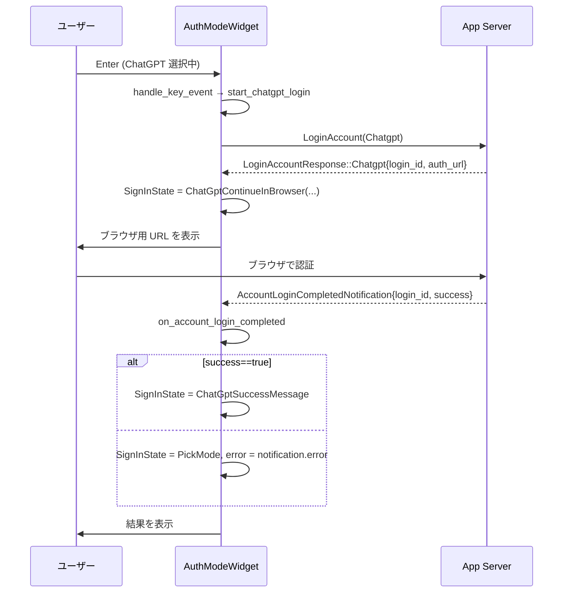
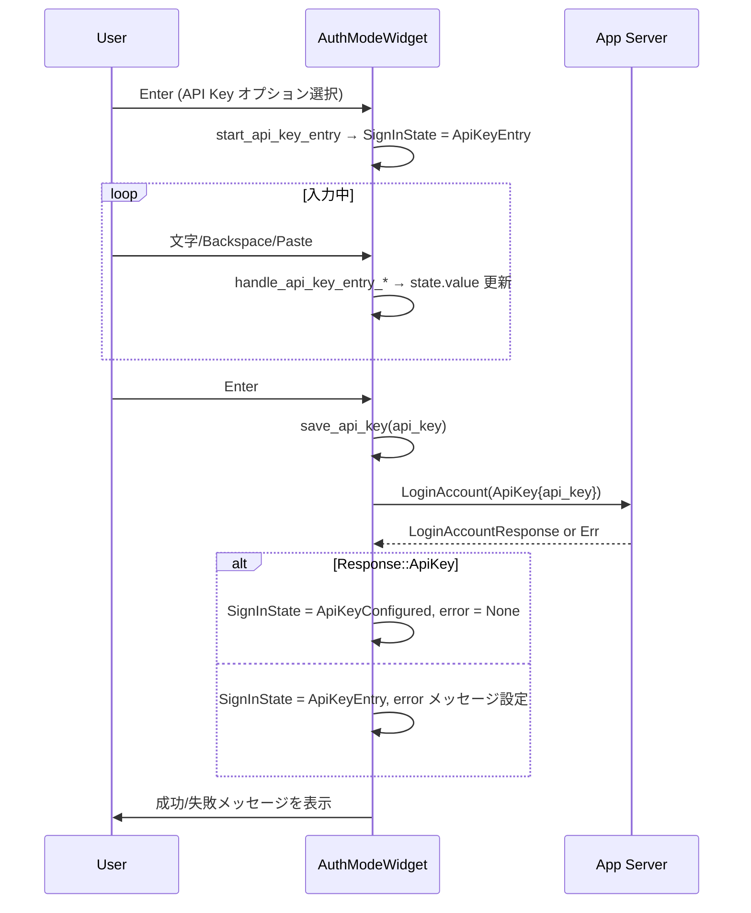

# tui/src/onboarding/auth.rs コード解説

> ※このチャンクには元ファイルの行番号情報が含まれていないため、  
> 「auth.rs:L開始-終了」のような**正確な行番号は付与できません**。  
> 以下では、関数名・型名と「このファイル内」という形で根拠を示します。

---

## 0. ざっくり一言

ChatGPT ログイン／デバイスコードログイン／API キー入力の 3 つのサインイン方法を、TUI（ratatui）上で制御するウィジェットと、その状態管理・App Server との非同期連携をまとめたモジュールです。  
ブラウザ用のログイン URL を OSC 8 でハイパーリンク化するユーティリティも含まれます。

---

## 1. このモジュールの役割

### 1.1 概要

このモジュールは、CLI/TUI 型のオンボーディング画面でユーザーを認証させるための UI ロジックを提供します。具体的には:

- **サインイン方式の選択**（ChatGPT / Device Code / API key）  
- App Server への **ログイン開始リクエスト** と **キャンセルリクエスト** の送受信  
- **認証完了通知** に応じた状態遷移  
- API キー入力画面の編集・バリデーション  
- TUI における **ハイパーリンク表示 (OSC 8)** の付与  

を担うウィジェット `AuthModeWidget` と補助型／補助関数を定義しています。

### 1.2 アーキテクチャ内での位置づけ

主な依存関係・データの流れは以下のようになります。

```mermaid
flowchart LR
    subgraph TUI
        A[AuthModeWidget<br/>KeyboardHandler<br/>WidgetRef]
        S[SignInState]
        E[error: Arc<RwLock<Option<String>>>]
    end

    ASH[AppServerRequestHandle]
    SRV[App Server<br/>(codex_app_server)]
    HHL[headless_chatgpt_login<br/>(別モジュール)]
    FR[FrameRequester]
    LS[LoginStatus]
    Notif1[AccountLoginCompletedNotification]
    Notif2[AccountUpdatedNotification]

    A --> S
    A --> E
    A --> LS
    A --> FR
    A --> ASH

    A -- Device Code ログイン開始/描画 --> HHL

    A -- LoginAccount / CancelLoginAccount<br/>request_typed(...) --> ASH
    ASH --> SRV

    SRV -- AccountLoginCompleted --> Notif1 --> A
    SRV -- AccountUpdated --> Notif2 --> A

    A -- schedule_frame()/schedule_frame_in() --> FR
```

- `AuthModeWidget` は `KeyboardHandler`, `StepStateProvider`, `WidgetRef` を実装し、  
  TUI のキー入力処理・ステップ状態・描画を担います。
- App Server との通信は `AppServerRequestHandle::request_typed` を通じて行われます。
- Device Code ログインに関する詳細なフローは別モジュール `headless_chatgpt_login` に委譲されています。

### 1.3 設計上のポイント

コードから読み取れる設計上の特徴です。

- **状態機械ベースの UI**  
  - `SignInState` enum でオンボーディングの状態を明示的に管理  
  - 各状態ごとに描画・入力処理を切り替え（例: `render_pick_mode`, `render_api_key_entry`）

- **共有状態のスレッドセーフ管理**  
  - `error: Arc<RwLock<Option<String>>>`  
  - `sign_in_state: Arc<RwLock<SignInState>>`  
  → UI スレッドと `tokio::spawn` で起動される非同期タスクから共有・更新されます。

- **非同期処理の分離**  
  - App Server との通信（ログイン開始・キャンセル・API キー保存）はすべて `tokio::spawn` 内の async ブロックで実行し、UI スレッドはロック取得と `FrameRequester` の呼び出しに専念します。

- **入力モードごとの専用ハンドラ**  
  - 通常のサインインモード選択と、API キー入力モードを `handle_api_key_entry_key_event` で分離し、入力欄編集のロジックを局所化しています。

- **セキュリティ配慮した OSC 8 ハイパーリンク生成**  
  - `mark_url_hyperlink` で URL 内の ESC/BEL を除去してから OSC 8 を生成し、  
    ターミナルエスケープインジェクションを防いでいます。

- **強制ログインモードの扱い**  
  - `ForcedLoginMethod` を参照して、API キー／ChatGPT ログインの有効・無効を切り替え、無効なモードは UI 上から選択できないようにしています。

---

## 2. 主要な機能一覧（+ コンポーネントインベントリー）

### 2.1 機能一覧

- サインイン方法の選択 UI（`AuthModeWidget` + `SignInOption`）
- ログイン状態のステートマシン管理（`SignInState`）
- ChatGPT ブラウザログイン開始・キャンセル (`start_chatgpt_login`, `cancel_active_attempt`)
- Device Code ログイン開始・キャンセル (`start_device_code_login`, `cancel_active_attempt`)
- API キー入力 UI と保存処理 (`render_api_key_entry`, `handle_api_key_entry_key_event`, `save_api_key`)
- ログイン完了・アカウント更新通知のハンドリング (`on_account_login_completed`, `on_account_updated`)
- TUI 上の URL に対する OSC 8 ハイパーリンク付与 (`mark_url_hyperlink`)
- 既存 ChatGPT 認証トークンを使ったスキップ (`handle_existing_chatgpt_login`)
- ステップ進捗状態の提供 (`StepStateProvider` 実装)
- 実ブラウザの起動 (`maybe_open_auth_url_in_browser`)

### 2.2 コンポーネントインベントリー（型）

| 型名 | 種別 | 役割 / 用途 |
|------|------|------------|
| `SignInState` | enum | サインインフロー全体の状態を表すステートマシン。PickMode / 各ログイン進行中 / 成功 / API キー入力など。 |
| `SignInOption` | enum (Copy) | UI 上で選択できる「サインイン方式」（ChatGpt / DeviceCode / ApiKey）。 |
| `ApiKeyInputState` | struct | API キー入力画面の入力内容と「環境変数からの事前入力かどうか」のフラグ。 |
| `ContinueInBrowserState` | struct | ChatGPT ブラウザログインの進行中状態。`login_id` と `auth_url` を保持。 |
| `ContinueWithDeviceCodeState` | struct | Device Code ログイン用の状態。リクエスト ID、ログイン ID、検証 URL、ユーザーコードなどを保持。 |
| `AuthModeWidget` | struct | 本モジュールの中核。サインイン UI の描画・入力処理・App Server 連携・エラー状態管理を行う TUI ウィジェット。 |

### 2.3 コンポーネントインベントリー（主要関数）

| 関数 / メソッド | 種別 | 役割（1 行） |
|-----------------|------|--------------|
| `mark_url_hyperlink` | free fn | ratatui の `Buffer` 上のシアン+下線付き文字を OSC 8 ハイパーリンクでラップする。 |
| `cancel_login_attempt` | async free fn | 指定された `login_id` のログイン試行を App Server にキャンセル要求する。 |
| `maybe_open_auth_url_in_browser` | free fn | InProcess クライアント時にログイン URL をブラウザで開く。 |
| `AuthModeWidget::handle_key_event` | trait impl | キー入力に応じてサインインオプション選択やログイン開始／キャンセルを行う。 |
| `AuthModeWidget::cancel_active_attempt` | method | 進行中の ChatGPT / Device Code ログインをキャンセルし、状態を初期化する。 |
| `AuthModeWidget::handle_api_key_entry_key_event` | method | API キー入力画面でのキー入力を処理し、文字編集・保存トリガーを行う。 |
| `AuthModeWidget::save_api_key` | method | 入力された API キーを App Server に送信してログインを試み、状態とエラーを更新する。 |
| `AuthModeWidget::start_chatgpt_login` | method | ChatGPT ログインの開始リクエストを送り、ブラウザログイン UI に遷移する。 |
| `AuthModeWidget::on_account_login_completed` | method | App Server からの認証完了通知を受け取り、成功／失敗に応じて状態を更新する。 |
| `AuthModeWidget::on_account_updated` | method | 認証モード更新通知から `login_status` を更新する。 |

（その他の補助関数については 3.3 で一覧化します）

---

## 3. 公開 API と詳細解説

### 3.1 型一覧（構造体・列挙体など）

| 名前 | 種別 | フィールド / バリアント概要 | 用途 |
|------|------|----------------------------|------|
| `SignInState` | enum | `PickMode`, `ChatGptContinueInBrowser(ContinueInBrowserState)`, `ChatGptDeviceCode(ContinueWithDeviceCodeState)`, `ChatGptSuccessMessage`, `ChatGptSuccess`, `ApiKeyEntry(ApiKeyInputState)`, `ApiKeyConfigured` | サインインフローの UI 状態を一意に表現。描画・入力処理の分岐に利用。 |
| `SignInOption` | enum | `ChatGpt`, `DeviceCode`, `ApiKey` | ユーザーが選択するサインイン方式を表現。 |
| `ApiKeyInputState` | struct | `value: String`, `prepopulated_from_env: bool` | API キー入力欄の内容と、それが環境変数からの事前設定かどうか。 |
| `ContinueInBrowserState` | struct | `login_id: String`, `auth_url: String` | ChatGPT ブラウザログイン進行中の状態。キャンセルや URL 表示に使う。 |
| `ContinueWithDeviceCodeState` | struct | `request_id: String`, `login_id: Option<String>`, `verification_url: Option<String>`, `user_code: Option<String>` | Device Code ログインの状態。`pending` と `ready` の 2 形態を持つ。 |
| `AuthModeWidget` | struct | `request_frame: FrameRequester`, `highlighted_mode: SignInOption`, `error: Arc<RwLock<Option<String>>>`, `sign_in_state: Arc<RwLock<SignInState>>`, `login_status: LoginStatus`, `app_server_request_handle: AppServerRequestHandle`, `forced_login_method: Option<ForcedLoginMethod>`, `animations_enabled: bool`, `animations_suppressed: Cell<bool>` | 認証モード選択画面の中核ウィジェット。入力処理・描画・App Server 連携を一手に引き受ける。 |

`ContinueWithDeviceCodeState` には以下のメソッドがあります。

- `pending(request_id: String) -> Self`  
  → `login_id` 等がまだ来ていない「要求中」状態を生成。
- `ready(request_id, login_id, verification_url, user_code) -> Self`  
  → 認証に必要な情報が揃った状態を生成。
- `login_id(&self) -> Option<&str>`  
  → `login_id` を `Option` として返す。
- `is_showing_copyable_auth(&self) -> bool`  
  → URL とユーザーコードが両方非空なら `true`。コピー可能な情報が揃っているかの判定に利用。

### 3.2 重要関数の詳細

以下では特に重要な 7 つの関数／メソッドについて詳しく説明します。

---

#### `mark_url_hyperlink(buf: &mut Buffer, area: Rect, url: &str)`

**概要**

ratatui の `Buffer` 上で、指定領域 `area` 内の「前景色 Cyan かつ UNDERLINED なセル」を、OSC 8 エスケープシーケンスでラップして、ターミナルにクリック可能なハイパーリンクとして認識させます。  
URL 中の危険な制御文字（ESC, BEL）は事前に削除します。

**引数**

| 引数名 | 型 | 説明 |
|--------|----|------|
| `buf` | `&mut Buffer` | 描画済みのバッファ。対象セルを直接書き換えます。 |
| `area` | `Rect` | ハイパーリンク付与の対象となる矩形領域。 |
| `url` | `&str` | ハイパーリンク先の URL。ESC/BEL は除去されます。 |

**戻り値**

- なし (`()`)

**内部処理の流れ**

1. `url.chars()` から ESC (`\x1B`) と BEL (`\x07`) をフィルタして `safe_url` を作成。
2. `safe_url` が空なら何もせず return（URL 全体が制御文字だった場合に対応）。
3. `area` 内の全セル (`x`, `y`) を走査。
4. 各セルについて:
   - `fg` が `Color::Cyan` でない、または `Modifier::UNDERLINED` が付いていなければスキップ。
   - `cell.symbol()` のトリム済み文字列が空ならスキップ（空白など）。
5. 対象セルに対して、  
   `"\x1B]8;;{safe_url}\x07{sym}\x1B]8;;\x07"`  
   という文字列を `set_symbol` で書き込む。

**Examples（使用例）**

テストコード内の `mark_url_hyperlink_wraps_cyan_underlined_cells` で利用例が確認できます。

```rust
let url = "https://example.com";
let area = Rect::new(0, 0, 20, 1);
let mut buf = Buffer::empty(area);

// URL 部分をシアン+下線付きで描画したと仮定
for (i, ch) in "example".chars().enumerate() {
    let cell = &mut buf[(i as u16, 0)];
    cell.set_symbol(&ch.to_string());
    cell.fg = Color::Cyan;
    cell.modifier = Modifier::UNDERLINED;
}

// ハイパーリンク化
mark_url_hyperlink(&mut buf, area, url);
```

この後、各文字が OSC 8 でラップされ、URL 全体をカバーするハイパーリンクになります。

**Errors / Panics**

- 明示的なエラーや panic は発生しません。  
- `buf[(x, y)]` のインデックスアクセスは `Rect` に合わせてループしているため、範囲外アクセスはしません。

**Edge cases（エッジケース）**

- `url` が空、または ESC/BEL のみの場合  
  → `safe_url` が空になり、何も変更されません。
- 対象セルがシアン+下線付きでない場合  
  → そのセルは変更されません。URL の一部であっても、スタイルが揃っていないとハイパーリンク化されません。
- 既に OSC 8 を含むシンボルが入っている場合  
  → その上から再度書き換えます。

**使用上の注意点**

- この関数は **描画後** に呼び出す必要があります。先に Paragraph などで URL を描画し、その後で `mark_url_hyperlink` を適用します。
- URL 判定は「シアン + 下線 + 非空文字」で行うため、他のシアン下線テキストも巻き込まれる可能性があります。  
  → 対象領域 `area` を URL 部分に絞ると安全です。

---

#### `impl KeyboardHandler for AuthModeWidget::handle_key_event(&mut self, key_event: KeyEvent)`

**概要**

オンボーディング画面でのキー入力を受け取り、サインイン方式選択、ログイン開始、ログインキャンセル、API キー入力モードの処理を行います。

**引数**

| 引数名 | 型 | 説明 |
|--------|----|------|
| `self` | `&mut AuthModeWidget` | 状態を書き換えるため可変参照。 |
| `key_event` | `KeyEvent` | 押されたキーと修飾キー種別。 |

**戻り値**

- なし（`KeyboardHandler` トレイト上のシグネチャに従い、副作用で状態更新）

**内部処理の流れ**

1. まず `handle_api_key_entry_key_event(&key_event)` を呼び出し、  
   - 現在 `SignInState::ApiKeyEntry` の場合はそこで処理して `true` を返し、本メソッドは `return`。
   - それ以外の状態では `false` が返るので、通常のキー処理に進む。

2. `key_event.code` に応じて分岐:
   - `Up` / `'k'` → `move_highlight(-1)` でサインインオプションの選択を上に移動。
   - `Down` / `'j'` → `move_highlight(1)` で下に移動。
   - `'1'` / `'2'` / `'3'` → `select_option_by_index` に 0,1,2 を渡して直接選択。
   - `Enter`:
     - 現在の `sign_in_state` をクローンしてマッチ:
       - `PickMode` → `handle_sign_in_option(self.highlighted_mode)` で選択中の方式を開始。
       - `ChatGptSuccessMessage` → `SignInState::ChatGptSuccess` に遷移。
   - `Esc`:
     - `cancel_active_attempt()` を呼び出し、進行中のログイン試行をキャンセル。
   - その他 → 何もしない。

3. `handle_paste` については別メソッドで `handle_api_key_entry_paste` に委譲。

**Examples（使用例）**

典型的には、TUI イベントループで以下のように使われます（擬似コード）:

```rust
fn on_key(ui: &mut AuthModeWidget, key: KeyEvent) {
    ui.handle_key_event(key);  // サインイン状態に応じた処理が行われる
}
```

**Errors / Panics**

- 内部で `RwLock::read().unwrap()` / `write().unwrap()` を多用しているため、  
  もしどこかでパニックによりロックが Poisoned 状態になった場合、`unwrap()` が panic します。  
  これはモジュール先頭の `#![allow(clippy::unwrap_used)]` によって許容されています。
- 正常なフローでは panic 発生箇所はありません。

**Edge cases（エッジケース）**

- `SignInState::ApiKeyEntry` 以外で文字入力しても、API キー値は更新されません（`handle_api_key_entry_key_event` が即座に `false` を返すため）。
- `highlighted_mode` が現在の selectable options に含まれていない場合、`move_highlight` 内で `unwrap_or(0)` によってインデックス 0 を基準とします。
- `Esc` を押しても、進行中のログインがない場合は何も起きません（`cancel_active_attempt` が早期 return）。

**使用上の注意点**

- API キー入力モードのキー処理はこのメソッド内ではなく `handle_api_key_entry_key_event` によって行われる点に注意が必要です。
- UI 側で `handle_key_event` を呼ぶ前に、別の場所で `sign_in_state` を書き換えている場合は、状態競合を避ける必要があります（`RwLock` で保護されていますが、論理的な競合は起こり得ます）。

---

#### `AuthModeWidget::cancel_active_attempt(&self)`

**概要**

進行中の ChatGPT ブラウザログイン／Device Code ログインをキャンセルし、App Server にキャンセル要求を送りつつ、UI 状態を初期状態（`PickMode`）に戻します。

**引数**

| 引数名 | 型 | 説明 |
|--------|----|------|
| `self` | `&AuthModeWidget` | 内部状態は `RwLock` と `tokio::spawn` で変更されるため、`&self` で十分。 |

**戻り値**

- なし

**内部処理の流れ**

1. `sign_in_state.write().unwrap()` で書き込みロックを取得。
2. 現在の状態に応じて分岐:
   - `ChatGptContinueInBrowser(state)`:
     - `request_handle` と `login_id` をクローンし、`tokio::spawn` 内で `cancel_login_attempt(&request_handle, login_id)` を `await`。
   - `ChatGptDeviceCode(state)`:
     - `state.login_id()` が `Some` なら、その `login_id` を用いて同様に `cancel_login_attempt` を呼ぶタスクを spawn。
   - その他の状態 → そのまま return（キャンセル無し）。
3. 上記 2 ケースでは `*sign_in_state = SignInState::PickMode` に更新。
4. ロックを明示的に `drop`。
5. `set_error(None)` でエラーメッセージをクリア。
6. `request_frame.schedule_frame()` で再描画を要求。

**Examples（使用例）**

`Esc` キー押下時に呼び出されます（`handle_key_event` 内）。

```rust
// Esc キーイベントを受けた場合
widget.cancel_active_attempt();
```

**Errors / Panics**

- `RwLock::write().unwrap()` が Poisoned 状態なら panic する可能性があります。
- `AppServerRequestHandle::request_typed` の失敗は `cancel_login_attempt` 内で無視されています（`let _ = ...`）。キャンセル失敗による UI 側のエラー表示はありません。

**Edge cases**

- 既に `PickMode` などログイン試行中以外の状態のときに呼び出された場合は、何もせず return します。
- Device Code ログインで `login_id` がまだ None（`pending` 状態）の場合、サーバーへのキャンセルは送られませんが、UI 状態だけが `PickMode` に戻ります。

**使用上の注意点**

- サーバー側のキャンセル成否に関わらず、UI は即座に `PickMode` に戻ります。  
  → サーバー側でログイン処理が残っていても、UI 上は「キャンセル済み」となります。
- 長時間ブロックする処理はすべて `tokio::spawn` 内で行っているため、UI スレッドがブロックされることはありません。

---

#### `AuthModeWidget::handle_api_key_entry_key_event(&mut self, key_event: &KeyEvent) -> bool`

**概要**

`SignInState::ApiKeyEntry` 状態でのキー入力を処理し、API キー文字列の編集・保存トリガーを行います。  
その他の状態では何もせず `false` を返し、呼び出し元に処理を委ねます。

**引数**

| 引数名 | 型 | 説明 |
|--------|----|------|
| `self` | `&mut AuthModeWidget` | API キー状態およびエラー・再描画を更新するため可変参照。 |
| `key_event` | `&KeyEvent` | 押されたキー。 |

**戻り値**

- `bool`  
  - `true`: 何らかの処理を行った（= 呼び出し元は追加処理不要）  
  - `false`: `SignInState::ApiKeyEntry` ではなく処理しなかった

**内部処理の流れ**

1. `sign_in_state.write().unwrap()` で書き込みロックを取得。
2. `if let SignInState::ApiKeyEntry(state) = &mut *guard` で現在が API キー入力状態か判定。
   - それ以外ならロックを解放して `false` を返す。
3. 入力キーに応じて分岐:
   - `Esc`:
     - `*guard = SignInState::PickMode` に戻し、`set_error(None)`、`should_request_frame = true`。
   - `Enter`:
     - `state.value.trim()` を取得。
     - 空なら `set_error(Some("API key cannot be empty".to_string()))` し、`should_request_frame = true`。
     - 非空なら `should_save = Some(trimmed)` と記録し、後段で保存処理へ。
   - `Backspace`:
     - `prepopulated_from_env` が `true` なら `value.clear()` して `prepopulated_from_env = false`。
     - そうでなければ末尾 1 文字を `pop()`。
     - `set_error(None)` し `should_request_frame = true`。
   - 通常の文字キー (`KeyEventKind::Press` かつ SUPER/CONTROL/ALT でない):
     - `prepopulated_from_env` が `true` なら一旦 `value.clear()` して `prepopulated_from_env = false`。
     - `state.value.push(c)` で文字を追加。
     - エラーをクリアし、`should_request_frame = true`。
4. ロックを解放。
5. `should_save` が `Some(api_key)` の場合 → `save_api_key(api_key)` を呼び出し。
6. そうでなく `should_request_frame` が `true` の場合 → `request_frame.schedule_frame()` を呼び出し。
7. 最後に `true` を返す。

**Examples（使用例）**

`KeyboardHandler::handle_key_event` 内で最初に呼ばれます。

```rust
if self.handle_api_key_entry_key_event(&key_event) {
    return; // API キー入力モードで処理済み
}
```

**Errors / Panics**

- `RwLock::write().unwrap()` に起因する潜在的な panic 以外に、明示的なエラーはありません。
- API キーが空の場合は、UI 上に `"API key cannot be empty"` が表示されます。

**Edge cases**

- `trim()` 後に空文字列（空白のみ）の場合も「空」と判断され、保存は行われません。
- 事前に `OPENAI_API_KEY` から値が設定されていても、最初の文字入力／Backspace でその値は上書き（クリア）されます。
- `KeyEventKind::Repeat` など `Press` 以外の種別は無視されます。

**使用上の注意点**

- この関数は **API キー入力モード専用** であり、その他の状態では `false` を返すだけです。  
  呼び出し側（`handle_key_event`）で戻り値を見て処理継続の有無を判定する設計になっています。
- `save_api_key` の呼び出しはロック解放後に行われるため、デッドロックを避ける構造になっています。

---

#### `AuthModeWidget::save_api_key(&mut self, api_key: String)`

**概要**

入力された API キーを App Server に送信してログインを試み、結果に応じてエラー状態とサインイン状態を更新します。  
処理は `tokio::spawn` で非同期に行われ、UI スレッドはブロックされません。

**引数**

| 引数名 | 型 | 説明 |
|--------|----|------|
| `self` | `&mut AuthModeWidget` | エラー・状態・再描画を同期的に更新するため可変参照。 |
| `api_key` | `String` | 保存／認証に使用する OpenAI API キー。 |

**戻り値**

- なし

**内部処理の流れ**

1. `is_api_login_allowed()` を確認し、禁止されていれば `disallow_api_login()` を呼んで return。
2. `set_error(None)` でエラーをクリア。
3. `request_handle`, `sign_in_state`, `error`, `request_frame` を clone して `tokio::spawn` 内で使用できるようにする。
4. `tokio::spawn(async move { ... })` を実行。
5. 非同期ブロック内で:
   - `request_handle.request_typed::<LoginAccountResponse>(ClientRequest::LoginAccount { params: LoginAccountParams::ApiKey { api_key: api_key.clone() }, ...})` を `await`。
   - 結果に応じて:
     - `Ok(LoginAccountResponse::ApiKey {})`:
       - `*error.write().unwrap() = None`
       - `*sign_in_state.write().unwrap() = SignInState::ApiKeyConfigured`
     - `Ok(other)`（想定外のレスポンス）:
       - `error` に `"Unexpected account/login/start response: {other:?}"` を設定。
       - `sign_in_state` を `SignInState::ApiKeyEntry(ApiKeyInputState { value: api_key, prepopulated_from_env: false })` に戻す。
     - `Err(err)`:
       - `error` に `"Failed to save API key: {err}"` を設定。
       - `sign_in_state` を上記と同様に API キー入力状態に戻す。
   - 最後に `request_frame.schedule_frame()` で再描画要求。
6. `save_api_key` 本体の最後でも `self.request_frame.schedule_frame()` を呼び、  
   非同期処理開始直後にも画面更新がかかるようにしています。

**Examples（使用例）**

`handle_api_key_entry_key_event` から Enter キー押下時に呼び出されます。

```rust
if let Some(api_key) = should_save {
    self.save_api_key(api_key); // 非同期でサーバーへ送信
}
```

**Errors / Panics**

- `AppServerRequestHandle::request_typed` のエラーは `Err(err)` としてハンドリングされ、UI にエラーメッセージが表示されます。
- `RwLock::write().unwrap()` に起因する panic の可能性があります。

**Edge cases**

- `LoginAccountResponse` が `ApiKey` 以外の variant で返ってきた場合は「Unexpected ...」として扱われ、再度 API キー入力状態に戻ります。
- API キーが無効／保存失敗の場合でも、入力欄には元の `api_key` が残るため、ユーザーは修正して再送できます。

**使用上の注意点**

- `forced_login_method` により API キーが禁止されている場合、本メソッドは `disallow_api_login()` を呼んで終わるため、実際にはサーバーへは何も送信されません（テストで検証されています）。
- API キー文字列は、サーバーエラー後も `AuthModeWidget` 内に平文で残ります。TUI 上でもマスクされず表示される設計です（セキュリティ要件に応じた検討が必要な点）。

---

#### `AuthModeWidget::start_chatgpt_login(&mut self)`

**概要**

ChatGPT アカウントによるログインを開始します。  
既に ChatGPT 認証済みの場合は新たなログインを開始せず、そのまま成功状態へ進みます。

**引数**

| 引数名 | 型 | 説明 |
|--------|----|------|
| `self` | `&mut AuthModeWidget` | 状態とエラー表示を更新するため可変参照。 |

**戻り値**

- なし

**内部処理の流れ**

1. `handle_existing_chatgpt_login()` を呼び出し、既に `LoginStatus` が ChatGPT 系であれば:
   - `SignInState::ChatGptSuccess` をセットし、`request_frame.schedule_frame()` を呼び出して終了。
2. そうでなければ `set_error(None)` でエラーをクリア。
3. `request_handle`, `sign_in_state`, `error`, `request_frame` を clone。
4. `tokio::spawn(async move { ... })` を開始。
5. 非同期ブロック内で:
   - `request_typed::<LoginAccountResponse>(ClientRequest::LoginAccount { params: LoginAccountParams::Chatgpt, ... })` を `await`。
   - 結果に応じて:
     - `Ok(LoginAccountResponse::Chatgpt { login_id, auth_url })`:
       - `maybe_open_auth_url_in_browser(&request_handle, &auth_url)` でブラウザを開く試行。
       - `error` をクリアし、`sign_in_state` を  
         `SignInState::ChatGptContinueInBrowser(ContinueInBrowserState { login_id, auth_url })` に更新。
     - `Ok(other)`（想定外）:
       - `sign_in_state` を `PickMode` に戻し、`error` に `"Unexpected account/login/start response: {other:?}"` を設定。
     - `Err(err)`:
       - `sign_in_state` を `PickMode`、`error` を `err.to_string()` に設定。
   - 最後に `request_frame.schedule_frame()` を呼んで再描画要求。

**Examples（使用例）**

`handle_sign_in_option(SignInOption::ChatGpt)` から呼び出されます。

```rust
match option {
    SignInOption::ChatGpt => {
        if self.is_chatgpt_login_allowed() {
            self.start_chatgpt_login();
        }
    }
    // ...
}
```

**Errors / Panics**

- ロック起因の panic 以外に、`webbrowser::open` のエラーは `tracing::warn!` ログに残されるだけで、UI には表示されません。
- App Server 側のエラーは UI の `error` メッセージとして表示されます。

**Edge cases**

- `AppServerRequestHandle` が `InProcess` でない場合、`maybe_open_auth_url_in_browser` はブラウザを開こうとしません。  
  （リモートクライアントなどサーバー側で URL を開く想定）
- ChatGPT 認証済み (`LoginStatus::AuthMode(AppServerAuthMode::Chatgpt | ChatgptAuthTokens)`) の場合、新たなログイン試行は行われません。

**使用上の注意点**

- このメソッドは UI スレッドから同期的に呼ばれますが、ネットワーク I/O はすべて `tokio::spawn` 内で行われるため、UI はブロックされません。
- Device Code ログインとの排他制御は `SignInState` による論理的な制御に依存しています。

---

#### `AuthModeWidget::on_account_login_completed(&mut self, notification: AccountLoginCompletedNotification)`

**概要**

App Server からの「ログイン完了通知」を処理し、対応するログイン試行（ブラウザ or Device Code）が成功／失敗したことを UI に反映します。

**引数**

| 引数名 | 型 | 説明 |
|--------|----|------|
| `self` | `&mut AuthModeWidget` | 状態とエラー表示を更新。 |
| `notification` | `AccountLoginCompletedNotification` | App Server から届いた通知。`login_id`, `success`, `error` を持つ。 |

**戻り値**

- なし

**内部処理の流れ**

1. `notification.login_id` が `Some(login_id)` でなければ return（ログイン ID 不明の通知は無視）。
2. `sign_in_state.read().unwrap()` で読取りロックを取り、現在の状態が:
   - `SignInState::ChatGptContinueInBrowser(state)` かつ `state.login_id == login_id`  
   - または `SignInState::ChatGptDeviceCode(state)` かつ `state.login_id() == Some(login_id.as_str())`  
   のどちらかにマッチするか判定。
3. 上記いずれにもマッチしなければ return（他のログイン試行向けの通知とみなす）。
4. マッチした場合:
   - `notification.success == true`:
     - `set_error(None)` でエラーをクリア。
     - `*sign_in_state.write().unwrap() = SignInState::ChatGptSuccessMessage` に更新。
   - それ以外:
     - `set_error(notification.error)` でエラーをセット（`Option<String>`）。
     - `sign_in_state` を `SignInState::PickMode` に戻す。
5. `request_frame.schedule_frame()` を呼んで再描画要求。

**Examples（使用例）**

App Server 通知ハンドラから呼び出されます（擬似コード）:

```rust
fn on_notification(widget: &mut AuthModeWidget, n: AccountLoginCompletedNotification) {
    widget.on_account_login_completed(n);
}
```

**Errors / Panics**

- 対象 `login_id` に紐づかない通知は静かに無視されます。
- ロック起因の panic の可能性は他メソッド同様に存在します。

**Edge cases**

- `login_id` が None の通知 → 何もせず return。
- すでに状態が `ChatGptSuccess` などで別ログインフロー中でない場合 → 通知は無視されます。
- 失敗通知で `error: None` の場合 → `set_error(None)` と等価になり、PickMode に戻るもののエラーメッセージは表示されません。

**使用上の注意点**

- `login_id` による紐付けにより、複数のログイン試行が同時に存在しても、該当するものだけが更新される設計です。
- Device Code ログインも `login_id()` で紐付けされるため、サーバー側と `login_id` の扱いが一致している必要があります。

---

### 3.3 その他の関数一覧（抜粋）

| 関数名 | 役割（1 行） |
|--------|--------------|
| `onboarding_request_id()` | UUID ベースのランダムなリクエスト ID を生成し、App Server プロトコル用 `RequestId` に包む。 |
| `cancel_login_attempt(request_handle, login_id)` | `ClientRequest::CancelLoginAccount` を送り、ログイン試行のキャンセルを要求する（レスポンスは無視）。 |
| `ContinueWithDeviceCodeState::is_showing_copyable_auth` | 検証 URL とユーザーコードが両方非空なら `true` を返す。 |
| `AuthModeWidget::is_api_login_allowed` | `forced_login_method` を見て API キーログインが許可されているかを判定。 |
| `AuthModeWidget::is_chatgpt_login_allowed` | 同様に ChatGPT ログインの許可有無を判定。 |
| `AuthModeWidget::displayed_sign_in_options` | 現在の制約下で UI に表示するサインインオプション一覧を返す。 |
| `AuthModeWidget::selectable_sign_in_options` | キーボードで選択可能なサインインオプション一覧を返す（無効化されたものは除外）。 |
| `AuthModeWidget::render_*` シリーズ | 状態ごとの説明文・入力欄・ヒントなどを ratatui の `Paragraph` で描画。 |
| `AuthModeWidget::handle_api_key_entry_paste` | 貼り付け文字列を API キー入力欄に反映し、再描画を要求。 |
| `AuthModeWidget::start_api_key_entry` | API キー入力状態への遷移と、環境変数 `OPENAI_API_KEY` からの事前入力を行う。 |
| `AuthModeWidget::handle_existing_chatgpt_login` | 既に ChatGPT や ChatgptAuthTokens で認証済みなら即座に成功扱いにする。 |
| `AuthModeWidget::start_device_code_login` | Device Code ログインを開始するため、`headless_chatgpt_login::start_headless_chatgpt_login(self)` を呼ぶ。 |
| `AuthModeWidget::on_account_updated` | `AccountUpdatedNotification` から `login_status` を更新する。 |
| `maybe_open_auth_url_in_browser` | InProcess クライアントの場合に限り、`webbrowser::open(url)` を呼ぶ。 |

---

## 4. データフロー

ここでは代表的な 2 つのシナリオのデータフローを示します。

### 4.1 ChatGPT ブラウザログインのフロー

1. ユーザーが `PickMode` 画面で ChatGPT オプションを選択し、Enter を押す。
2. `handle_key_event` → `handle_sign_in_option(SignInOption::ChatGpt)` → `start_chatgpt_login()` が呼ばれる。
3. `start_chatgpt_login` が App Server に `ClientRequest::LoginAccount { Chatgpt }` を送る。
4. サーバーから `LoginAccountResponse::Chatgpt { login_id, auth_url }` が返る。
5. UI は `SignInState::ChatGptContinueInBrowser(ContinueInBrowserState { ... })` に遷移し、ブラウザ用 URL を表示。
6. サーバーで認証完了後、`AccountLoginCompletedNotification { login_id, success, error }` が届く。
7. `on_account_login_completed` が `login_id` を確認し、成功なら `ChatGptSuccessMessage` に遷移、失敗ならエラーを表示して `PickMode` に戻る。



### 4.2 API キー入力・保存のフロー

1. ユーザーが `PickMode` 画面で「Provide your own API key」を選択し Enter。
2. `handle_sign_in_option(SignInOption::ApiKey)` → `start_api_key_entry()` が呼ばれ、`SignInState::ApiKeyEntry(ApiKeyInputState { ... })` に遷移。
3. ユーザーがキーを入力／ペーストする。`handle_api_key_entry_key_event` / `handle_api_key_entry_paste` で `ApiKeyInputState.value` が更新される。
4. Enter キー押下時、非空であれば `save_api_key(api_key)` が呼ばれる。
5. `save_api_key` が非同期に `LoginAccountParams::ApiKey { api_key }` を送信。
6. サーバーから:
   - `LoginAccountResponse::ApiKey {}` → `SignInState::ApiKeyConfigured` に遷移。
   - エラー／想定外レスポンス → `ApiKeyEntry` 状態に戻し、エラーメッセージを表示。



---

## 5. 使い方（How to Use）

### 5.1 基本的な使用方法

典型的な利用は「オンボーディング画面の 1 ステップ」として `AuthModeWidget` を組み込む形になります。  
擬似的な利用例を示します。

```rust
use std::sync::{Arc, RwLock};
use crate::tui::FrameRequester;
use crate::onboarding::auth::{
    AuthModeWidget, SignInState, SignInOption
};
use crate::LoginStatus;
use codex_app_server_client::AppServerRequestHandle;
use codex_protocol::config_types::ForcedLoginMethod;

// 初期化
let auth_widget = AuthModeWidget {
    request_frame: FrameRequester::new(),          // 実際にはアプリ固有の初期化
    highlighted_mode: SignInOption::ChatGpt,       // 初期選択
    error: Arc::new(RwLock::new(None)),
    sign_in_state: Arc::new(RwLock::new(SignInState::PickMode)),
    login_status: LoginStatus::NotAuthenticated,
    app_server_request_handle: app_server_handle,  // どこかで作られたハンドル
    forced_login_method: None,                     // あるいは Some(ForcedLoginMethod::Chatgpt)
    animations_enabled: true,
    animations_suppressed: std::cell::Cell::new(false),
};

// メインループ内でのキー入力処理
fn on_key(auth: &mut AuthModeWidget, key: KeyEvent) {
    auth.handle_key_event(key);
}

// 描画処理（WidgetRef 実装）
fn draw_frame(frame: &mut ratatui::Frame, auth: &AuthModeWidget, area: Rect) {
    auth.render_ref(area, frame.buffer_mut());
}

// サーバーからの通知処理
fn on_account_login_completed(auth: &mut AuthModeWidget,
                              n: AccountLoginCompletedNotification) {
    auth.on_account_login_completed(n);
}

fn on_account_updated(auth: &mut AuthModeWidget,
                      n: AccountUpdatedNotification) {
    auth.on_account_updated(n);
}
```

### 5.2 よくある使用パターン

- **ワークスペースで ChatGPT ログインを強制する**  
  - `forced_login_method: Some(ForcedLoginMethod::Chatgpt)` にすることで、API キーログインが UI 上からも無効化されます。  
    テスト `api_key_flow_disabled_when_chatgpt_forced` で確認されています。

- **既存の ChatGPT 認証トークンを利用してログインをスキップする**  
  - アプリ起動時や `AccountUpdatedNotification` 受信後に `login_status` が `AuthMode(ChatgptAuthTokens)` だった場合、`start_chatgpt_login` は実際のログイン試行を行わず `handle_existing_chatgpt_login` 経由で `ChatGptSuccess` に遷移します。

### 5.3 よくある間違い

```rust
// 間違い例: API キーが禁止されているのに直接 save_api_key を呼ぶ
widget.forced_login_method = Some(ForcedLoginMethod::Chatgpt);
widget.save_api_key("sk-...".to_string()); // UI からは通常呼ばれないが、外部からは呼べてしまう

// 正しい例: is_api_login_allowed を尊重し、UI 経由で遷移させる
if widget.is_api_login_allowed() {
    widget.start_api_key_entry();
}
```

```rust
// 間違い例: on_account_login_completed を呼ばない
// → サーバー側でログインが完了しても UI 状態が更新されない

// 正しい例: 通知受信ごとに必ず AuthModeWidget に伝える
fn on_notification(widget: &mut AuthModeWidget, n: Notification) {
    match n {
        Notification::AccountLoginCompleted(a) => widget.on_account_login_completed(a),
        Notification::AccountUpdated(a) => widget.on_account_updated(a),
        _ => {}
    }
}
```

### 5.4 使用上の注意点（まとめ）

- `AuthModeWidget` の状態（特に `sign_in_state`, `error`）は `Arc<RwLock<...>>` で共有されるため、UI スレッド以外からも書き換えられます。  
  ロジック上の一貫性を保つため、更新箇所をこのモジュールに集約するのが安全です。
- `#![allow(clippy::unwrap_used)]` によりロックの `unwrap()` を多用しているため、ロック Poison を引き起こさないよう、非同期タスク内での panic に注意が必要です。
- API キーは画面上でマスクされずに表示されます。環境に応じてスクリーンショット等の扱いに注意が必要です。

---

## 6. 変更の仕方（How to Modify）

### 6.1 新しいサインイン方式を追加する場合

例: 「GitHub ログイン」を追加する場合の大まかなステップです。

1. **新しいオプションの追加**
   - `SignInOption` に `Github` などのバリアントを追加。
   - `displayed_sign_in_options` / `selectable_sign_in_options` にロジックを追加。

2. **状態の追加**
   - `SignInState` に Github ログイン専用のステート（例: `GithubContinueInBrowser(GithubState)`）を追加。
   - 必要に応じて専用の状態 struct を定義。

3. **描画処理の追加**
   - `render_pick_mode` 内の `match option { ... }` に、新オプションの表示文言を追加。
   - `render_ref` に新しい `SignInState` バリアントに対応する描画関数を追加。

4. **開始処理の追加**
   - `handle_sign_in_option` に新しい `SignInOption` の分岐を追加し、`start_github_login` のようなメソッドを呼ぶ。
   - そのメソッド内で `request_typed` を使って App Server に新しいログインタイプのリクエストを送る。

5. **通知処理の拡張**
   - `on_account_login_completed` において、`login_id` の紐付け対象に新しいステートも含めるようにする。

6. **テストの追加**
   - 既存テストを参考に、新しいオプションが表示されること、キャンセル処理が動くことなどを検証するテストを追加する。

### 6.2 既存の機能を変更する場合

- **影響範囲の確認**
  - `AuthModeWidget` のメソッドは多くが相互に呼び合っているため、変更時には  
    - `handle_key_event` / `handle_sign_in_option` / `render_*` / `start_*` / `on_account_*`  
    の呼び出し関係を確認することが有用です。

- **契約（前提条件・返り値の意味）**
  - `handle_api_key_entry_key_event` は「ApiKeyEntry 状態以外では何もしないで false を返す」という契約に依存して `handle_key_event` が組まれています。
  - `on_account_login_completed` は `login_id` で「自分が開始したログインかどうか」を判定する契約に依存しています。

- **テストと使用箇所の再確認**
  - テストモジュール内に、このファイルの主要フローをカバーするテストが多く存在します（API キー禁止時の挙動、キャンセル挙動、ハイパーリンク生成など）。  
    変更した分岐に対応するテストがあるか、また新しい分岐に対してテストを追加するべきかを確認すると安全です。

---

## 7. 関連ファイル

| パス | 役割 / 関係 |
|------|------------|
| `tui/src/onboarding/onboarding_screen.rs` | `KeyboardHandler`, `StepStateProvider`, `StepState` などを定義し、本モジュールの `AuthModeWidget` がそれらを実装することでオンボーディングフレームワークに組み込まれます。 |
| `tui/src/onboarding/headless_chatgpt_login.rs` | Device Code（ヘッドレス）ログインの開始処理・描画処理を提供し、`start_device_code_login` と `render_ref` から呼び出されます。 |
| `legacy_core::config::ConfigBuilder`（テストから参照） | テスト用に InProcess App Server クライアントをセットアップする際の設定読み込みに使用。 |
| `codex_app_server_client` クレート | `AppServerRequestHandle`, `InProcessAppServerClient` など、App Server との通信を行うための API を提供。 |
| `codex_protocol::config_types::ForcedLoginMethod` | ワークスペース側のポリシーにより、ログイン方法（ChatGPT or API key）を強制するために使用。 |

---

### 補足：安全性 / エラー / 並行性のポイント

- **安全性（セキュリティ）**
  - OSC 8 ハイパーリンク生成時に ESC/BEL を除去し、ターミナルエスケープインジェクションを防いでいます。
  - API キーは TUI 上でマスクされず表示されるため、運用上の注意（スクリーン共有など）が必要です。

- **エラーハンドリング**
  - App Server との通信エラーや想定外レスポンスは、`error: Arc<RwLock<Option<String>>>` にメッセージを格納し、UI に表示されます。
  - キャンセルリクエストの失敗は無視されます（UI 上にエラーを出さない設計）。

- **並行性**
  - `Arc<RwLock<...>>` により UI スレッドと `tokio::spawn` タスク間で状態を共有します。
  - ロックは `unwrap()` で取得しており、Poisoned ロックは panic に繋がりますが、通常パスでは同期的に短時間保持するのみです。
  - `Cell<bool>`（`animations_suppressed`）は `AuthModeWidget` が単一スレッド（UI スレッド）上で使用される前提で利用されています。
