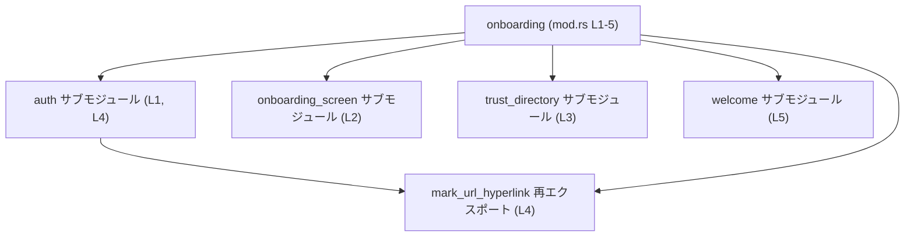

# tui/src/onboarding/mod.rs コード解説

## 0. ざっくり一言

- `onboarding` 配下のサブモジュールを登録し、クレート内で利用するための再エクスポートをまとめているモジュールです（根拠: `tui/src/onboarding/mod.rs:L1-5`）。

---

## 1. このモジュールの役割

### 1.1 概要

- このモジュールは、`auth`, `onboarding_screen`, `trust_directory`, `welcome` の4つのサブモジュールを宣言しています（根拠: `tui/src/onboarding/mod.rs:L1-3,L5`）。
- あわせて、`auth` モジュール内の `mark_url_hyperlink` というアイテムを `onboarding` モジュール直下から利用できるようにクレート内に再エクスポートしています（根拠: `tui/src/onboarding/mod.rs:L4`）。
- このファイル自体には関数・構造体などの実装ロジックは含まれていません（根拠: 全行が `mod` / `use` のみであること: `tui/src/onboarding/mod.rs:L1-5`）。

### 1.2 アーキテクチャ内での位置づけ

- `onboarding` モジュールのルート (`mod.rs`) として、サブモジュールの登録と再エクスポートを行う「入口」の役割を持ちます（根拠: `mod` 宣言と `pub(crate) use` の存在: `tui/src/onboarding/mod.rs:L1-4`）。
- `auth`、`onboarding_screen`、`trust_directory`、`welcome` の具体的な処理内容や他モジュールとの関係は、このチャンクからは分かりません（実装ファイルが含まれていないため）。

依存関係（モジュール間の関係）を簡略化すると、次のようになります。



- 上図は、このチャンクに現れる静的なモジュール依存関係のみを表し、関数呼び出しやデータの流れは含んでいません。

### 1.3 設計上のポイント

- **責務の分離**
  - このファイルは実装ではなく、サブモジュールの登録と可視性（公開範囲）の制御に専念しています（根拠: `mod` / `pub(crate) mod` / `pub(crate) use` のみ: `tui/src/onboarding/mod.rs:L1-5`）。
- **可視性のコントロール**
  - `onboarding_screen` モジュールと `mark_url_hyperlink` は `pub(crate)` で公開されており、同一クレート内からは利用可能ですが、クレート外からは利用できません（根拠: `pub(crate) mod onboarding_screen;`, `pub(crate) use auth::mark_url_hyperlink;`: `tui/src/onboarding/mod.rs:L2,L4`）。
  - `auth`, `trust_directory`, `welcome` は `mod` のみで宣言されており、`onboarding` モジュール内部からのみ直接アクセスできます（根拠: `mod auth;`, `mod trust_directory;`, `mod welcome;`: `tui/src/onboarding/mod.rs:L1,L3,L5`）。
- **エラーハンドリング・並行性**
  - このファイルには実行時ロジックがないため、エラーハンドリングやスレッド並行性に関する処理は含まれていません。この点についての安全性・挙動は、各サブモジュール側の実装に依存します。

---

## 2. 主要な機能一覧

このチャンクから読み取れる「機能」は、実行時処理ではなくモジュール構成に関するものです。

- サブモジュール宣言: `auth`, `onboarding_screen`, `trust_directory`, `welcome` を `onboarding` 配下のモジュールとして登録する（根拠: `tui/src/onboarding/mod.rs:L1-3,L5`）。
- クレート内再エクスポート: `auth` モジュール内の `mark_url_hyperlink` アイテムを `onboarding` モジュール直下からクレート内に公開する（根拠: `tui/src/onboarding/mod.rs:L4`）。

### 2.1 コンポーネント一覧（モジュール・再エクスポート）

このチャンクに登場するコンポーネント（モジュール・再エクスポート）の一覧です。

| 名前                  | 種別                         | 可視性                | 定義位置 | このファイル内での役割                                         | 根拠 |
|-----------------------|------------------------------|-----------------------|----------|------------------------------------------------------------------|------|
| `auth`                | サブモジュール宣言           | 非公開（親モジュール内のみ） | L1       | `auth` 実装ファイルを `onboarding` 配下のサブモジュールとして登録する | `tui/src/onboarding/mod.rs:L1` |
| `onboarding_screen`   | サブモジュール宣言           | クレート内公開 (`pub(crate)`) | L2       | `onboarding_screen` 実装をクレート内で利用可能なモジュールとして登録する | `tui/src/onboarding/mod.rs:L2` |
| `trust_directory`     | サブモジュール宣言           | 非公開                 | L3       | `trust_directory` 実装ファイルをサブモジュールとして登録する   | `tui/src/onboarding/mod.rs:L3` |
| `mark_url_hyperlink`  | 再エクスポートされたアイテム | クレート内公開 (`pub(crate)`) | L4       | `auth` モジュール内の同名アイテムを `onboarding` 直下から利用できるようにする | `tui/src/onboarding/mod.rs:L4` |
| `welcome`             | サブモジュール宣言           | 非公開                 | L5       | `welcome` 実装ファイルをサブモジュールとして登録する           | `tui/src/onboarding/mod.rs:L5` |

補足:

- `mark_url_hyperlink` が関数であるか、定数・型であるかなどの種別は、このチャンクだけからは特定できません（`use` ではアイテム種別が区別されないため）。

このファイルには、関数・構造体・列挙体などの**定義そのもの**は存在しません（根拠: `tui/src/onboarding/mod.rs:L1-5` のすべてが宣言文のみ）。

---

## 3. 公開 API と詳細解説

### 3.1 型一覧（構造体・列挙体など）

このチャンクには、構造体・列挙体・型エイリアスなどの**型定義**は登場しません。

- 該当なし（型定義がないため）。

### 3.2 関数詳細

- このファイル内には関数定義が存在しません（根拠: 全行が `mod` / `use` のみ: `tui/src/onboarding/mod.rs:L1-5`）。
- `mark_url_hyperlink` は `auth` から再エクスポートされているアイテムですが、このチャンクではその定義が見えないため、関数かどうかも含めて詳細を記述できません。

そのため、「関数詳細」のテンプレートを適用できる対象はこのチャンクにはありません。

### 3.3 その他の関数

- 該当なし（このチャンク内に関数がないため）。

---

## 4. データフロー

このファイル自体は実行時のデータ処理を行いませんが、**名前解決（どのモジュールからどのアイテムが参照されるか）**という意味での「フロー」を示すことができます。

### 4.1 再エクスポート `mark_url_hyperlink` の名前解決フロー

他のモジュールが `crate::onboarding::mark_url_hyperlink` を参照する場合の、コンパイル時の名前解決の流れは次のようになります。

```mermaid
sequenceDiagram
    participant Other as 他モジュール
    participant Onboarding as onboarding (mod.rs L1-5)
    participant Auth as auth サブモジュール (L1, L4)

    Other->>Onboarding: use crate::onboarding::mark_url_hyperlink
    Note over Onboarding: `pub(crate) use auth::mark_url_hyperlink;` にマッチ (L4)
    Onboarding->>Auth: auth::mark_url_hyperlink に解決
    Note over Auth: 実際の定義・挙動は auth 実装ファイル側に存在（このチャンクには未掲載）
```

- この図はあくまで**コンパイル時の名前解決の流れ**を表し、`mark_url_hyperlink` がどのようなデータを受け取り・返すか、どのようなエラー処理や並行処理を行うかは、このチャンクからは分かりません。

---

## 5. 使い方（How to Use）

### 5.1 基本的な使用方法

このファイルはモジュール構成の入口なので、典型的な利用は「モジュールや再エクスポートされたアイテムを `use` する」形になります。

#### クレート内から `mark_url_hyperlink` を利用する例

```rust
// onboarding モジュール直下から再エクスポートされたアイテムをインポートする
use crate::onboarding::mark_url_hyperlink; // 根拠: pub(crate) use auth::mark_url_hyperlink; (L4)

// 具体的なシグネチャ（引数・戻り値型）はこのチャンクでは不明のため、呼び出し形は仮に示さない
fn example_usage() {
    // ここで mark_url_hyperlink(...) を呼び出す
    // 型やエラー処理は auth モジュール側の定義に依存する
}
```

- `crate::onboarding` というモジュールパスは、このファイルが `src/onboarding/mod.rs` であることから、Rust のモジュール規則により成り立ちます。

#### クレート内から `onboarding_screen` モジュールを利用する例

```rust
// クレート内で、onboarding_screen モジュール全体をインポートする
use crate::onboarding::onboarding_screen; // 根拠: pub(crate) mod onboarding_screen; (L2)

fn build_ui() {
    // onboarding_screen モジュールにどのような型・関数があるかは
    // このチャンクからは分からないため、具体的な呼び出し例は示せません。
    // 例: onboarding_screen::SomeWidget::new(...);
}
```

### 5.2 よくある使用パターン

このチャンクから推測できる典型的なパターンは、「非公開サブモジュールの代わりに再エクスポートを利用する」ことです。

- `onboarding::auth` には直接アクセスできない（`mod auth;` は非公開）ため、`auth` 内のアイテムをクレート内から利用したい場合は、このファイルで `pub(crate) use ...;` によって再エクスポートされているものを利用します。

```rust
// NG: 非公開サブモジュール auth に直接アクセスしようとしている例
// use crate::onboarding::auth; // これはコンパイルエラーになる（auth は pub ではない）
// 根拠: mod auth; (L1) に pub が付いていない

// OK: 再エクスポートを通じてクレート内から利用する
use crate::onboarding::mark_url_hyperlink; // 根拠: pub(crate) use ... (L4)
```

### 5.3 よくある間違い

このチャンクから想定される誤用と、その修正例です。

```rust
// 間違い例: 非公開モジュールに直接アクセスしようとする
// use crate::onboarding::auth;  // auth は非公開 (mod auth;) のためクレート外からは利用不可

// 正しい例: 再エクスポートされたアイテムを利用する
use crate::onboarding::mark_url_hyperlink; // pub(crate) use auth::mark_url_hyperlink; によってクレート内で利用可能

fn correct_usage() {
    // mark_url_hyperリンクを通じて、auth 側の処理を利用する
}
```

注意点:

- `onboarding_screen` と `mark_url_hyperlink` は `pub(crate)` なので、**同じクレートの別モジュール**からは利用できますが、別クレートからは利用できません（根拠: `pub(crate)` 修飾子: `tui/src/onboarding/mod.rs:L2,L4`）。
- クレート外向け API にしたい場合は、別途 `pub` を使った公開が必要になりますが、そのような宣言はこのチャンクには存在しません。

### 5.4 使用上の注意点（まとめ）

- **可視性に関する注意**
  - `auth`, `trust_directory`, `welcome` は非公開サブモジュールなので、`onboarding` モジュールの外からは直接アクセスできません（根拠: `mod` のみ: `tui/src/onboarding/mod.rs:L1,L3,L5`）。
  - 再エクスポートされた `mark_url_hyperlink` や `onboarding_screen` のモジュールは `pub(crate)` なので、クレート内からのみ利用可能です。
- **エラー処理・並行性**
  - このファイルにはロジックがなく、エラー処理やスレッド安全性に関わるコードは一切含まれていません。これらは各サブモジュール（特に `auth`）の実装に依存します。
- **前提条件**
  - `mark_url_hyperlink` の具体的な使い方（引数・戻り値・エラー条件など）を把握するには、`auth` モジュールの定義を参照する必要があります。このチャンクだけでは前提条件を判断できません。

---

## 6. 変更の仕方（How to Modify）

### 6.1 新しい機能を追加する場合

新しいオンボーディング関連機能をモジュールとして追加する場合、このファイルは次のような変更の入口になります。

1. **サブモジュールを追加する**
   - 例: `mod new_feature;` を追加する（`new_feature.rs` または `new_feature/mod.rs` に対応）。
   - これにより、`onboarding::new_feature` というモジュールが定義されます（根拠: 既存の `mod` 宣言と同じパターン: `tui/src/onboarding/mod.rs:L1,L3,L5`）。

2. **クレート内へ公開するかどうかを決める**
   - クレート内の他のモジュールから利用したい場合は、`pub(crate) mod new_feature;` として宣言します（`onboarding_screen` と同じパターン: `tui/src/onboarding/mod.rs:L2`）。
   - `onboarding` モジュール内部だけでよい場合は、`mod new_feature;` のままで構いません。

3. **個別の関数や型を再エクスポートする場合**
   - `auth` と同様に、`pub(crate) use new_feature::some_item;` を追加することで、`crate::onboarding::some_item` としてクレート内から直接アクセスできるようにできます（根拠: `pub(crate) use auth::mark_url_hyperlink;`: `tui/src/onboarding/mod.rs:L4`）。

### 6.2 既存の機能を変更する場合

- **可視性の変更**
  - 例えば `onboarding_screen` をクレート外向けの API にしたい場合は、`pub(crate) mod onboarding_screen;` を `pub mod onboarding_screen;` に変更することになります。
  - この変更はクレート外からのアクセス範囲に影響するため、公開 API の設計ポリシーと整合しているかを確認する必要があります。
- **再エクスポートの追加・削除**
  - `pub(crate) use auth::mark_url_hyperlink;` を削除すると、クレート内から `crate::onboarding::mark_url_hyperlink` が使えなくなり、代わりに `auth` への直接アクセスが必要になります（ただし `auth` の可視性が許せば、という前提ですが、このチャンクでは `auth` は非公開です）。
  - 逆に新しいアイテムを `auth` 等から再エクスポートする場合は、同様の `pub(crate) use ...;` 行を追加します。
- **影響範囲の確認**
  - 可視性や再エクスポートを変更した場合、それを利用している他モジュールのコンパイルエラーの有無を確認することが必要です。このチャンクには使用箇所が含まれていないため、全体のソースコード検索などが前提となります。

---

## 7. 関連ファイル

このモジュールと密接に関係するファイルは、Rust のモジュール規則から次のように推定されます（`mod X;` は同ディレクトリの `X.rs` または `X/mod.rs` に対応します）。

| パス候補                                     | 役割 / 関係                                                                                   | 根拠 |
|----------------------------------------------|----------------------------------------------------------------------------------------------|------|
| `tui/src/onboarding/auth.rs` または `tui/src/onboarding/auth/mod.rs` | `mod auth;` に対応する実装ファイル。`mark_url_hyperlink` の定義もここに含まれると考えられる。 | `tui/src/onboarding/mod.rs:L1,L4` |
| `tui/src/onboarding/onboarding_screen.rs` または `tui/src/onboarding/onboarding_screen/mod.rs` | `pub(crate) mod onboarding_screen;` に対応する実装ファイル。オンボーディング画面関連の実装が含まれる。 | `tui/src/onboarding/mod.rs:L2` |
| `tui/src/onboarding/trust_directory.rs` または `tui/src/onboarding/trust_directory/mod.rs` | `mod trust_directory;` に対応する実装ファイル。                                               | `tui/src/onboarding/mod.rs:L3` |
| `tui/src/onboarding/welcome.rs` または `tui/src/onboarding/welcome/mod.rs` | `mod welcome;` に対応する実装ファイル。                                                       | `tui/src/onboarding/mod.rs:L5` |

補足:

- これらのファイルの**内容**はこのチャンクには含まれていないため、具体的な処理内容・エラー処理・並行性などについては、この情報だけでは判断できません。
- テストコード（例: `tui/src/onboarding/*_test.rs` や `tests` ディレクトリ配下等）の有無も、このチャンクからは不明です。

---

### バグ・セキュリティ・パフォーマンス・テストに関する補足

このファイル単体について、ユーザー指定の観点を整理すると次のようになります。

- **Bug/Security**
  - 実行時ロジックがないため、直接的なバグやセキュリティホールは読み取れません。
  - 可視性の設定（`pub(crate)` / 非公開）が適切かどうかは、プロジェクト全体の設計ポリシーに依存し、このチャンクだけでは判断できません。
- **Contracts / Edge Cases**
  - 契約（前提条件・不変条件）は、再エクスポートされた `mark_url_hyperlink` や `onboarding_screen` 内のAPIに依存します。このチャンクにはそれらの定義がないため、契約やエッジケースの詳細は不明です。
- **Tests**
  - このチャンクにはテストコードが含まれていません。関連テストは別ファイルに存在する可能性がありますが、このチャンクからは確認できません。
- **Performance / Scalability / Observability**
  - モジュール宣言と再エクスポートのみであり、パフォーマンスやスケーラビリティ、ログ出力・メトリクスなどの観点に直接影響するコードは存在しません。これらは各サブモジュール側の実装に依存します。
