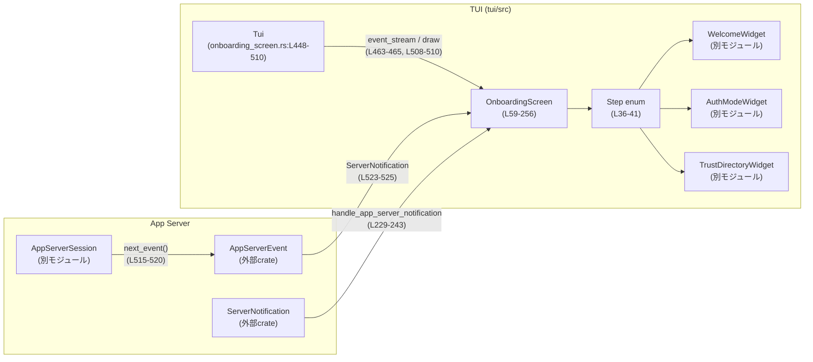
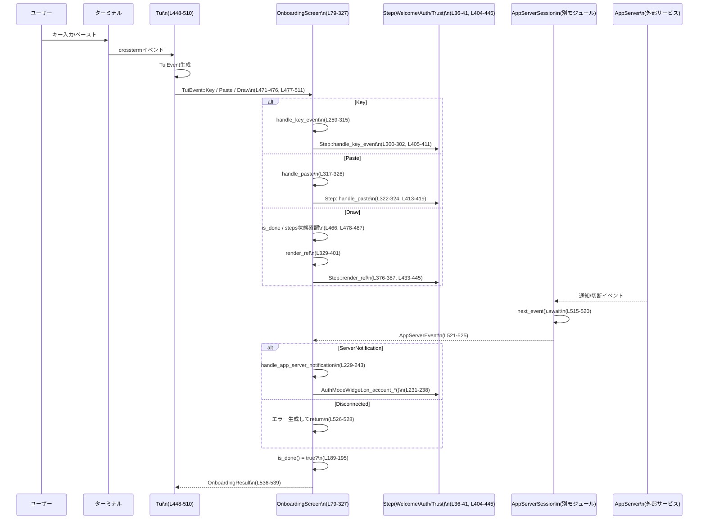

# tui/src/onboarding/onboarding_screen.rs

## 0. ざっくり一言

ターミナル版 UI における「オンボーディング（初回起動時のウェルカム → ログイン → ディレクトリ信頼確認）」フローを、1つの画面として制御・描画し、TUIイベントとアプリサーバーイベントを統合的に処理するモジュールです（`onboarding_screen.rs:L36-540`）。

---

## 1. このモジュールの役割

### 1.1 概要

- このモジュールは、TUIアプリの起動時に表示されるオンボーディングフローを管理するために存在し、  
  「ウェルカム」「認証」「ディレクトリ信頼」の各ステップを順番に進める画面を提供します（`L36-41`, `L59-77`）。
- ユーザーからのキー入力／ペーストと、バックエンド `AppServerSession` からの通知を受け取り、  
  各ステップの状態更新や画面再描画を行います（`L258-327`, `L448-535`）。
- 完了後には、ディレクトリ信頼の選択結果と、アプリ全体を終了すべきかどうかのフラグを返します（`L74-77`, `L536-539`）。

### 1.2 アーキテクチャ内での位置づけ

このファイルは TUI 層とアプリサーバー層の間に位置し、オンボーディング専用の「ミニアプリ」として振る舞います。



### 1.3 設計上のポイント

コードから読み取れる特徴を列挙します。

- **ステップ志向の構成**  
  - `Step` enum で 3 種類のウィジェット（Welcome/Auth/TrustDirectory）をまとめています（`L36-41`）。
  - 各ステップは `StepStateProvider` を実装しており、`Hidden / InProgress / Complete` の状態で進行管理を行います（`L48-53`, `L55-57`, `L144-172`）。
- **入力処理の統一インターフェース**  
  - `KeyboardHandler` トレイトにより、`handle_key_event` / `handle_paste` を統一的に扱い、`OnboardingScreen` と `Step` の両方がこれを実装します（`L43-46`, `L258-327`, `L404-420`）。
- **非同期イベントループ**  
  - `run_onboarding_app` は `tokio::select!` で TUI イベントストリームとオプションの `AppServerSession` イベントを同時に待ち、1つの非同期タスク内で統合的に処理します（`L466-535`）。
- **描画とレイアウト**  
  - `OnboardingScreen` は `WidgetRef` を実装し、各ステップの高さを一度オフスクリーンバッファに描画してから実際のエリアに再描画することで、動的高さレイアウトを実現しています（`L329-401`）。
- **アニメーション抑制**  
  - 認証ステップの状態に応じてアニメーションを全体的に抑制し、ユーザーがコピー用テキストを選択しやすくする設計になっています（`L174-181`, `L330-337`）。
- **エラーハンドリング方針**  
  - オンボーディングループ自体は通常 `Ok` を返し、サーバー切断時のみ `Err` を返します（`L523-528`）。
  - `RwLock::read()` の失敗（ポイズン）は `is_ok_and` により無視し、ロックエラー時には「アクティブでない」と扱う挙動になっています（`L245-255`, `L479-487`）。

---

## 2. 主要な機能一覧

- オンボーディング画面の生成と構成（`OnboardingScreen::new`、`L80-142`）
- ステップ状態に基づく進行管理（現在表示すべきステップの決定、`L144-172`）
- キー入力・ペースト入力の処理とステップへの伝播（`KeyboardHandler` 実装、`L258-327`, `L404-420`）
- 認証ステップの進行状況・APIキー入力アクティブ状態の判定（`L183-187`, `L245-255`）
- ディレクトリ信頼選択結果の取得（`directory_trust_decision`, `L197-208`）
- 画面全体の描画ロジックと動的高さレイアウト（`WidgetRef for &OnboardingScreen`, `L329-401`）
- アプリサーバーからの通知処理（ログイン完了／アカウント更新、`L229-243`）
- オンボーディングアプリのメインループ（`run_onboarding_app`, `L448-540`）

---

## 3. 公開 API と詳細解説

### 3.1 型一覧（構造体・列挙体など）

> 行番号はこのファイルのスニペットに基づくおおよその範囲です。

| 名前 | 種別 | 可視性 | 行範囲 | 役割 / 用途 |
|------|------|--------|--------|-------------|
| `Step` | enum | crate内 | `L36-41` | オンボーディングの個々のステップを表す。各バリアントが対応するウィジェットを保持。 |
| `KeyboardHandler` | trait | crate内 | `L43-46` | キー入力／ペースト入力を処理する共通インターフェース。 |
| `StepState` | enum | crate内 | `L48-53` | ステップの表示状態（Hidden / InProgress / Complete）を表す。 |
| `StepStateProvider` | trait | crate内 | `L55-57` | ステップの `StepState` を取得するインターフェース。 |
| `OnboardingScreen` | struct | crate内 | `L59-64` | オンボーディング画面全体の状態とステップの一覧を管理する中核構造体。 |
| `OnboardingScreenArgs` | struct | crate内 | `L66-72` | オンボーディング画面生成時の引数（表示するステップやログイン状態など）をまとめる。 |
| `OnboardingResult` | struct | crate内 | `L74-77` | オンボーディング終了時の結果（ディレクトリ信頼選択と終了フラグ）を表す。 |

補足として、本ファイル内で扱われるが定義は他モジュールの型:

- `WelcomeWidget`（`crate::onboarding::welcome`、`L23, L36, L92-96, L293-299, L333-335, L383-385, L407, L415, L425, L435-437`）
- `AuthModeWidget`（`crate::onboarding::auth`、`L23-25, L39, L98-113, L177-179, L222-227, L231-238, L245-255, L247-251, L479-483`）
- `TrustDirectoryWidget`（`crate::onboarding::trust_directory`、`L26-27, L40, L125-133, L303-306, L336-337, L409-410, L417-418, L427-428, L441-443`）
- `AppServerSession`（`crate::app_server_session`、`L22, L448-451, L515-520`）

### 3.2 関数詳細（重要なもの）

#### `OnboardingScreen::new(tui: &mut Tui, args: OnboardingScreenArgs) -> Self`（`L80-142`）

**概要**

- オンボーディング画面のインスタンスを構築し、構成に応じて `Step` のリストを初期化します。
- 「Welcome」「Auth」「TrustDirectory」ステップを、引数に応じて追加します。

**引数**

| 引数名 | 型 | 説明 |
|--------|----|------|
| `tui` | `&mut Tui` | フレームリクエスト用ハンドルを取得するための TUI オブジェクト。 |
| `args` | `OnboardingScreenArgs` | 表示するステップやログイン状態、設定をまとめた引数。 |

**戻り値**

- `OnboardingScreen`  
  初期化済みのオンボーディング画面。ステップ配列・フラグが初期状態で設定されています。

**内部処理の流れ**

1. `OnboardingScreenArgs` を分解し、`show_trust_screen` や `show_login_screen` などを取り出します（`L81-87`）。
2. `config` から `cwd`, `codex_home`, `forced_login_method` を抽出します（`L88-90`）。
3. 空の `steps: Vec<Step>` を用意し、必ず `Welcome` ステップを追加します（`L91-96`）。
   - `WelcomeWidget::new` には「既に認証済みかどうか」「フレームリクエスタ」「アニメーション有効フラグ」を渡します。
4. `show_login_screen` が true の場合:
   - `forced_login_method` に応じて、デフォルトのハイライトモード（API キーか ChatGPT）を決定します（`L97-101`）。
   - `app_server_request_handle` が `Some` の場合のみ `Auth` ステップを追加します（`L102-113`）。
   - `None` の場合はログインステップをスキップし、`tracing::warn!` で警告を出します（`L114-116`）。
5. Windows の場合のみ、サンドボックス無効状態であれば警告用フラグを立てます（`L118-121`）。その他の OS では `false` に固定されます（`L121-122`）。
6. `show_trust_screen` が true の場合、`TrustDirectory` ステップを追加し、初期選択やエラー状態などを設定します（`L123-133`）。
7. 最後に、`request_frame` や `is_done` などを初期値とともに `OnboardingScreen` インスタンスとして返します（`L135-141`）。

**Examples（使用例）**

オンボーディング画面を構築し、`run_onboarding_app` に渡す想定の例です。

```rust
use crate::tui::Tui;
use crate::app_server_session::AppServerSession;
use crate::legacy_core::config::Config;
use crate::onboarding::onboarding_screen::{OnboardingScreenArgs, run_onboarding_app};
use crate::LoginStatus;

// 具体的な Config, AppServerSession, Tui の構築方法はこのファイルには出ていません。
async fn run() -> color_eyre::Result<()> {
    let mut tui: Tui = /* どこかで初期化された Tui */ unimplemented!();
    let mut app_server: AppServerSession = /* アプリサーバー接続 */ unimplemented!();
    let config: Config = /* 設定読み込み */ unimplemented!();

    let args = OnboardingScreenArgs {
        show_trust_screen: true,
        show_login_screen: true,
        login_status: LoginStatus::NotAuthenticated,
        app_server_request_handle: Some(app_server.request_handle()),
        config,
    };

    let result = run_onboarding_app(args, Some(&mut app_server), &mut tui).await?;
    if result.should_exit {
        // アプリ全体を終了する処理へ
    }
    Ok(())
}
```

**Errors / Panics**

- 関数自体は `Self` を返すのみで、`Result` などのエラーを返しません。
- パニック要因はこの関数内には見当たりません（`unwrap` などを使用していません）。

**Edge cases（エッジケース）**

- `show_login_screen = true` かつ `app_server_request_handle = None` の場合:
  - 認証ステップは追加されず、警告ログのみ出力されます（`L114-116`）。
- `show_trust_screen = false` の場合:
  - 「ディレクトリ信頼」ステップは表示されません（`L123-133`）。
- `forced_login_method` が `Some(ForcedLoginMethod::Api)` 以外の場合:
  - デフォルトのサインインオプションは ChatGPT 側がハイライトされます（`L98-101`）。

**使用上の注意点**

- `app_server_request_handle` がない場合、ログインステップがスキップされるため、強制ログインを期待している場合は必ずハンドルを渡す必要があります（`L114-116`）。
- `config` には `cwd`, `codex_home`, `forced_login_method`, `animations` フィールドが必要です（`L88-90`, `L92-96`, `L111`）。

---

#### `OnboardingScreen::is_done(&self) -> bool`（`L189-195`）

**概要**

- オンボーディングが終了したかどうかを判定します。
- 内部フラグ `is_done` と、ステップの状態を組み合わせて判定します。

**引数**

- なし（`&self` のみ）。

**戻り値**

- `bool`:  
  - `true` … オンボーディング終了（ループを抜けるべき状態）  
  - `false` … まだ進行中

**内部処理の流れ**

1. `self.is_done` が `true` の場合には即座に `true` を返します（`L190`）。
2. そうでなければ `self.steps` を走査し、`StepState::InProgress` のステップが1つでも存在するかどうかを調べます（`L191-194`）。
3. InProgress なステップが存在「しない」場合（`any(...)` が false）は `true`、  
   存在する場合は `false` を返します（`L189-195`）。

**使用例**

`run_onboarding_app` のメインループ条件として使用されています（`L466`）。

```rust
while !onboarding_screen.is_done() {
    // イベント処理...
}
```

**Errors / Panics**

- エラーやパニックの可能性はありません（単純なブール／イテレータ処理のみ）。

**Edge cases**

- ステップが1つもない `steps.is_empty()` の場合:
  - `any(...)` は false となるため、`!false` により `true` を返します。  
    → ステップなしの `OnboardingScreen` は即座に「完了」とみなされます。

**使用上の注意点**

- ステップの状態更新は各ウィジェット側（`WelcomeWidget` など）の責務であり、この関数自身は状態を変更しません。
- `is_done` フラグはキーイベント処理などからも直接変更されることがあります（`L291`, `L311-312`）。

---

#### `OnboardingScreen::directory_trust_decision(&self) -> Option<TrustDirectorySelection>`（`L197-208`）

**概要**

- TrustDirectory ステップで行われたディレクトリ信頼選択を取得します。
- オンボーディング結果となる値の一部です。

**引数**

- なし（`&self` のみ）。

**戻り値**

- `Option<TrustDirectorySelection>`  
  - `Some(selection)` … ユーザーが何らかの選択を行っている  
  - `None` … ステップが存在しない、またはまだ選択されていない

**内部処理の流れ**

1. `self.steps.iter()` でステップを走査し、`Step::TrustDirectory` バリアントを探します（`L198-201`）。
2. 見つかった場合は、その中の `selection` フィールドを取り出し、一旦 `Some(*selection)` に包みます（`L201-202`）。
3. その後 `.flatten()` により、`Option<Option<TrustDirectorySelection>>` を `Option<TrustDirectorySelection>` に変換します（`L207`）。
   - `selection` が `None` の場合は最終的に `None` になります。

**使用例**

`run_onboarding_app` の戻り値を構成する際に呼び出されています（`L536-538`）。

```rust
Ok(OnboardingResult {
    directory_trust_decision: onboarding_screen.directory_trust_decision(),
    should_exit: onboarding_screen.should_exit(),
})
```

**Errors / Panics**

- パニックやエラーは発生しません。

**Edge cases**

- TrustDirectory ステップが存在しない場合（`show_trust_screen = false`）:
  - `find_map` で何も見つからないため、`None` が返されます。
- ステップは存在するが、`selection` がまだ `None` の場合:
  - `Some(None).flatten()` の結果として `None` が返ります。

**使用上の注意点**

- 呼び出し側は `None` の場合を考慮し、デフォルトの扱い（信頼しない／確認を後回しにするなど）を決める必要があります。

---

#### `OnboardingScreen::handle_key_event(&mut self, key_event: KeyEvent)`（`KeyboardHandler` 実装、`L259-315`）

**概要**

- キーボードイベントを処理し、必要に応じてオンボーディングの終了やステップへのイベント伝播を行います。
- 終了ショートカット（Ctrl+C / Ctrl+D / q）の処理もここで行います。

**引数**

| 引数名 | 型 | 説明 |
|--------|----|------|
| `key_event` | `KeyEvent` | crossterm が提供するキーイベント。コード・モディファイア・種別を含む。 |

**戻り値**

- なし（副作用として `OnboardingScreen` の状態を更新）。

**内部処理の流れ**

1. 押下（Press）またはリピート（Repeat）以外のイベント（Releaseなど）は無視して return します（`L259-262`）。
2. 現在 API キー入力モードがアクティブかどうかを判定します（`is_api_key_entry_active`, `L263`, `L245-255`）。
3. 押下されたキーが終了ショートカットかどうかを判定します（`L264-283`）。
   - `Ctrl+D` または `Ctrl+C` の Press → `should_quit = true`（`L265-276`）。
   - `'q'` の Press → API キー入力中でない場合のみ `should_quit = true`（`L277-282`）。
4. `should_quit` が `true` のとき（`L284-292`）:
   - 認証ステップが InProgress の場合は `cancel_auth_if_active` を呼び、認証試行をキャンセルします（`L285-287`, `L183-187`, `L214-220`）。
   - アプリ自体も終了すべきと判断し、`self.should_exit = true` をセットします（`L289`）。
   - 最終的に `self.is_done = true` とし、オンボーディングを終了状態にします（`L291`）。
5. `should_quit` が `false` のとき（`L292-313`）:
   - まず最初に `Step::Welcome` を探し、存在すればその `handle_key_event` を呼びます（`L293-299`）。
   - 次に `current_steps_mut().last()` で「現在の一番下のステップ」を取得し、その `handle_key_event` を呼びます（`L300-302`）。
   - TrustDirectory ステップの `should_quit()` が true になっていないか確認し、true であれば `should_exit` と `is_done` をセットします（`L303-312`）。
6. 最後に `request_frame.schedule_frame()` を呼び、画面の再描画をスケジュールします（`L314`）。

**Examples（使用例）**

この関数は直接呼び出されず、`run_onboarding_app` 内で `TuiEvent::Key` から呼び出されています（`L471-473`）。

```rust
match event {
    TuiEvent::Key(key_event) => {
        onboarding_screen.handle_key_event(key_event);
    }
    // ...
}
```

**Errors / Panics**

- エラーは返さず、パニックも発生させていません。
- 内部で `RwLock::read()` などを呼ぶ関数を使っていますが、`is_ok_and` でロックエラーを「false扱い」にしているため、ここでパニックにはなりません（`L245-251`）。

**Edge cases**

- APIキー入力中（`SignInState::ApiKeyEntry(_)`）は `'q'` による終了を無効化しているため、誤って画面を閉じてしまうことを防いでいます（`L263`, `L277-282`）。
- `Step::Welcome` が存在する場合、必ず最初に `WelcomeWidget::handle_key_event` が呼ばれます（`L293-299`）。
  - その後 `current_steps_mut().last()` でも Welcome が返るケースでは、同じキーイベントが Welcome に2回渡る可能性があります（`L300-302`）。  
    この挙動が意図的かどうかは、このチャンクからは判断できませんが、コード上はそうなっています。
- TrustDirectory ステップの内部状態 `should_quit()` が true になると、`should_exit` と `is_done` が同時にセットされます（`L303-312`）。

**使用上の注意点**

- `OnboardingScreen` を他から使用する場合、終了キー（Ctrl+C / Ctrl+D / q）の挙動を変えたい場合はこの関数を変更する必要があります。
- 認証プロセス中に終了キーが押されると、`cancel_auth_if_active` が必ず呼ばれ、ログイン試行が中断される前提になっています（`L285-287`）。

---

#### `impl WidgetRef for &OnboardingScreen::render_ref(&self, area: Rect, buf: &mut Buffer)`（`L329-401`）

**概要**

- オンボーディング画面全体を描画するメソッドです。
- 各ステップごとに一時バッファへ描画し、実際に使用されている行数を計測してから本バッファに描画することで、動的な高さレイアウトを行います。

**引数**

| 引数名 | 型 | 説明 |
|--------|----|------|
| `area` | `Rect` | 画面上でこのウィジェットに割り当てられた矩形領域。 |
| `buf` | `&mut Buffer` | ratatui の描画バッファ。 |

**戻り値**

- なし。`buf` に描画結果を書き込みます。

**内部処理の流れ**

1. 認証ステップの状態に応じてアニメーションを抑制するべきか計算し（`should_suppress_animations`, `L330-331`, `L174-181`）、Welcome/Auth に反映します（`L332-337`）。
2. 画面全体を `Clear` で一度クリアします（`L340`）。
3. レイアウト用に `y`（現在の描画開始行）、`bottom`（領域の下端）、`width` を計算します（`L342-344`）。
4. 内部関数 `used_rows` を定義し、一時バッファ中で実際に使われている最終行インデックス＋余白（+2）を返すようにします（`L347-370`）。
   - 各セルのシンボルまたはスタイルが空でない行を探し、最後の行＋2を高さとして採用します（`L351-369`）。
5. `current_steps` を取得し（Completed + InProgress のステップ）（`L372-374`）、先頭から順に処理します（`L375-400`）。
   - まだ描画領域に余裕があるか確認します（`L377-380`）。
   - 一時バッファ `scratch` を作成し（`L381-382`）、Welcome の場合はレイアウト情報を更新します（`L383-385`）。
   - `step.render_ref` で一時バッファに描画し（`L386`）、`used_rows` で高さ `h` を計算します（`L387`）。
   - 高さ `h` が 0 でなければ、その高さ分だけ実バッファ上の領域をクリアし（`L389-395`）、もう一度 `step.render_ref` で本バッファに描画します（`L396`）。
   - `y` を `h` 分だけ進め（`L397`）、次のステップに進みます（`L399-400`）。

**Examples（使用例）**

`run_onboarding_app` 内で、初回描画および `TuiEvent::Draw` を受けたときに呼ばれます。

```rust
tui.draw(u16::MAX, |frame| {
    frame.render_widget_ref(&onboarding_screen, frame.area());
})?;
```

**Errors / Panics**

- この関数自体はエラーを返しません。
- `Buffer` のインデックスアクセスは ratatui の範囲内で行われており、`Rect` に基づいて作られるため、通常パニックにはなりにくい構造です。

**Edge cases**

- `area.width == 0` または `area.height == 0` の場合:
  - `used_rows` は 0 を返し（`L347-350`）、描画処理はほぼ何も行われません。
- ステップ側が何も描画しない場合:
  - `used_rows` が 0 を返すため、そのステップの描画はスキップされます（`L387-388`）。

**使用上の注意点**

- 高さ計算の都合上、各ステップは「余白込み」で描画される（`v + 2`）ため、ステップが増えるほど画面下部に到達しやすくなります。
- 描画コストはおおよそ `O(steps × width × height)` となるため、非常に大きなターミナルサイズでは描画が重くなる可能性があります。

---

#### `OnboardingScreen::handle_app_server_notification(&mut self, notification: ServerNotification)`（`L229-243`）

**概要**

- アプリサーバーからの通知のうち、認証関連のものを認証ウィジェットに転送します。

**引数**

| 引数名 | 型 | 説明 |
|--------|----|------|
| `notification` | `ServerNotification` | サーバーからの通知（外部crate定義）。 |

**戻り値**

- なし。

**内部処理の流れ**

1. `match notification` で通知の種類を分岐します（`L230`）。
2. `ServerNotification::AccountLoginCompleted` の場合:
   - `auth_widget_mut()` で `AuthModeWidget` への可変参照を取得し（`L222-227`）、`on_account_login_completed` を呼びます（`L231-234`）。
3. `ServerNotification::AccountUpdated` の場合:
   - 同様に `AuthModeWidget` を取得して `on_account_updated` を呼びます（`L236-238`）。
4. その他の通知は無視します（`L241-242`）。

**Edge cases**

- `Auth` ステップが存在しない場合（`show_login_screen = false` や app-server ハンドル不在時）は `auth_widget_mut()` が `None` を返し、通知は何も行われません。

**使用上の注意点**

- ここでは通知の内容の検証や例外扱いは行わず、単純にウィジェットに転送しています。詳細なエラーハンドリングは `AuthModeWidget` 側に委ねられます。

---

#### `pub(crate) async fn run_onboarding_app(...) -> Result<OnboardingResult>`（`L448-540`）

**概要**

- オンボーディング画面を起動し、TUIイベントと AppServer イベントを処理するメイン関数です。
- オンボーディングが完了するまでループし、結果として `OnboardingResult` を返します。

**引数**

| 引数名 | 型 | 説明 |
|--------|----|------|
| `args` | `OnboardingScreenArgs` | オンボーディング画面に渡す設定と状態。 |
| `app_server` | `Option<&mut AppServerSession>` | アプリサーバーへの接続。`None` の場合はサーバーイベントを無視。 |
| `tui` | `&mut Tui` | TUI インスタンス。イベントストリームや描画に使用。 |

**戻り値**

- `Result<OnboardingResult>`（`color_eyre::eyre::Result`）
  - `Ok(OnboardingResult)` … オンボーディング正常終了。
  - `Err` … AppServer 切断時にエラーメッセージを包んで返す。

**内部処理の流れ**

1. `OnboardingScreen::new` でオンボーディング画面を構築します（`L455`）。
2. `did_full_clear_after_success` フラグを初期化します（ChatGPT ログイン成功メッセージ表示後の一度きりの全画面クリア用、`L456-457`）。
3. 初回描画として `tui.draw` を呼び、オンボーディング画面を表示します（`L459-461`）。
4. `tui.event_stream()` で TUI イベントストリームを取得し、`tokio::pin!` でピン留めします（`L463-465`）。
5. `while !onboarding_screen.is_done()` のループ内で `tokio::select!` を実行します（`L466-535`）。
   - **TUIイベント側**（`L467-514`）:
     - ストリームから `event` を1件取得（`L468-469`）。
     - `TuiEvent::Key` → `handle_key_event` を呼ぶ（`L471-473`）。
     - `TuiEvent::Paste` → `handle_paste` を呼ぶ（`L474-476`）。
     - `TuiEvent::Draw` → 以下を実行（`L477-511`）:
       - まだ全画面クリアを行っていない & Auth ステップの `sign_in_state` が `ChatGptSuccessMessage` の場合（`L478-487`）:
         - 残留する SGR 属性をリセットした上でターミナル全体をクリアし、`did_full_clear_after_success = true` にします（`L489-507`）。
       - 再度 `tui.draw` でオンボーディング画面を描画します（`L508-510`）。
   - **AppServerイベント側**（`L515-533`、`if app_server.is_some()` でガード）:
     - `app_server.next_event().await` で次のイベントを待ちます（`L515-520`）。
     - `Some(event)` の場合、`match` で分岐（`L521-531`）:
       - `AppServerEvent::ServerNotification(notification)` → `handle_app_server_notification(notification)`（`L523-525`）。
       - `AppServerEvent::Disconnected { message }` → エラーとして `Err(eyre!(message))` を返し、オンボーディングを中止（`L526-528`）。
       - `Lagged` / `ServerRequest` → ここでは何もしません（`L529-530`）。
6. ループを抜けたら、`directory_trust_decision` と `should_exit` を読み取り、`OnboardingResult` にまとめて `Ok` を返します（`L536-539`）。

**Errors / Panics**

- `AppServerEvent::Disconnected { message }` が届いた場合に `Err` を返します（`L526-528`）。
- それ以外はループを抜けたあと `Ok` を返します。
- パニックを発生させるコード（`unwrap`, `expect` など）は使用していません。

**Edge cases**

- `app_server` が `None` の場合:
  - `tokio::select!` のサーバー側ブランチはガード条件により実行されません（`L515-520` の `if app_server.is_some()`）。
  - オンボーディングは TUI イベントのみで進行します。
- `tui_events.next()` が `None` を返した場合（イベントストリーム終了）:
  - `if let Some(event)` で guard しているため、単に何も行わず select を継続します（`L468-470`）。
- ChatGPT 成功メッセージ表示後:
  - 最初の `TuiEvent::Draw` のタイミングで一度だけ、SGR属性リセットとターミナル全体クリアが行われます（`L478-507`）。

**使用上の注意点**

- `run_onboarding_app` は async 関数であり、Tokio ランタイムなど非同期実行環境の中で呼び出す必要があります。
- 戻り値の `OnboardingResult::should_exit` が true の場合、呼び出し側はアプリケーション全体を終了するかどうかを判断する必要があります。

---

### 3.3 その他の関数・メソッド一覧

> 主要なもの以外を一覧形式で整理します。

| 関数/メソッド名 | 所属 | 行範囲 | 役割 |
|----------------|------|--------|------|
| `current_steps_mut(&mut self) -> Vec<&mut Step>` | `OnboardingScreen` | `L144-157` | Hidden を除き、Complete と最初の InProgress までを前から順に収集し、表示中ステップの可変参照リストを返す。 |
| `current_steps(&self) -> Vec<&Step>` | `OnboardingScreen` | `L159-172` | 上記の非可変版。描画やアニメーション制御に使用。 |
| `should_suppress_animations(&self) -> bool` | `OnboardingScreen` | `L174-181` | Auth ステップがアニメーション抑制を要求しているかどうかを判定。 |
| `is_auth_in_progress(&self) -> bool` | `OnboardingScreen` | `L183-187` | Auth ステップが InProgress 状態かどうかを判定。 |
| `should_exit(&self) -> bool` | `OnboardingScreen` | `L210-212` | 内部フラグ `should_exit` を返す単純なゲッタ。 |
| `cancel_auth_if_active(&self)` | `OnboardingScreen` | `L214-220` | すべての Auth ステップに対し `cancel_active_attempt` を呼ぶ。 |
| `auth_widget_mut(&mut self) -> Option<&mut AuthModeWidget>` | `OnboardingScreen` | `L222-227` | 最初の Auth ステップへの可変参照を返すヘルパー。 |
| `is_api_key_entry_active(&self) -> bool` | `OnboardingScreen` | `L245-255` | Auth ステップの `sign_in_state` が `ApiKeyEntry(_)` かどうかを RwLock 経由で確認。 |
| `handle_paste(&mut self, pasted: String)` | `KeyboardHandler for OnboardingScreen` | `L317-326` | ペースト文字列を現在のアクティブステップに伝搬する。空文字は無視。 |
| `KeyboardHandler for Step::handle_key_event` | `impl KeyboardHandler for Step` | `L405-411` | 各ステップ型の `handle_key_event` に委譲。 |
| `KeyboardHandler for Step::handle_paste` | 〃 | `L413-419` | Auth, TrustDirectory にのみペーストを転送。Welcome は無視。 |
| `StepStateProvider for Step::get_step_state` | `impl StepStateProvider for Step` | `L423-429` | 内包するウィジェットのステップ状態を返す。 |
| `WidgetRef for Step::render_ref` | `impl WidgetRef for Step` | `L433-445` | 各ステップウィジェットに描画処理を委譲。 |
| `used_rows(tmp, width, height)` | `render_ref` 内部関数 | `L347-370` | 一時バッファを走査し、使用されている行数（＋余白2行）を計算。 |

---

## 4. データフロー

ここでは、代表的なシナリオとして「ユーザーのキー入力と AppServer の通知を同時に処理するフロー」を示します。

### 4.1 処理の要点

- 1つの async 関数 `run_onboarding_app`（`L448-540`）が、TUIイベントストリームと AppServer イベントを `tokio::select!` で同時に待ち受けます（`L466-535`）。
- TUI イベントは `OnboardingScreen` の `handle_key_event` / `handle_paste` / `render_ref` を通じて処理されます（`L471-476`, `L508-510`）。
- AppServer イベントは `handle_app_server_notification` を通じて Auth ステップに伝達されます（`L523-525`, `L229-243`）。

### 4.2 シーケンス図



---

## 5. 使い方（How to Use）

### 5.1 基本的な使用方法

`run_onboarding_app` を呼び出すのが、このモジュールの主な利用方法です。

```rust
use crate::onboarding::onboarding_screen::{OnboardingScreenArgs, OnboardingResult, run_onboarding_app};
use crate::tui::Tui;
use crate::app_server_session::AppServerSession;
use crate::legacy_core::config::Config;
use crate::LoginStatus;

#[tokio::main] // Tokioランタイム上で実行
async fn main() -> color_eyre::Result<()> {
    // Tui と AppServerSession の初期化。
    // 具体的な構築手順はこのファイルには含まれていません。
    let mut tui: Tui = unimplemented!();
    let mut app_server: AppServerSession = unimplemented!();
    let config: Config = unimplemented!(); // cwd, codex_home, forced_login_method, animations などが必要

    let args = OnboardingScreenArgs {
        show_trust_screen: true,
        show_login_screen: true,
        login_status: LoginStatus::NotAuthenticated,
        app_server_request_handle: Some(app_server.request_handle()),
        config,
    };

    let result: OnboardingResult = run_onboarding_app(args, Some(&mut app_server), &mut tui).await?;

    if result.should_exit {
        // オンボーディングの結果、アプリ全体の終了が望ましい場合の処理
        return Ok(());
    }

    if let Some(selection) = result.directory_trust_decision {
        // ディレクトリ信頼の選択結果に応じた処理
    }

    // 通常のアプリ本体へ遷移
    Ok(())
}
```

### 5.2 よくある使用パターン

1. **認証なしのオンボーディング**

```rust
let args = OnboardingScreenArgs {
    show_trust_screen: true,
    show_login_screen: false, // ログインステップなし
    login_status: LoginStatus::NotAuthenticated,
    app_server_request_handle: None,
    config,
};
let result = run_onboarding_app(args, None, &mut tui).await?;
```

1. **AppServer がない場合でも Welcome 与信のみ**

```rust
let args = OnboardingScreenArgs {
    show_trust_screen: false,
    show_login_screen: false,
    login_status: LoginStatus::Authenticated, // 既ログイン状態
    app_server_request_handle: None,
    config,
};
let result = run_onboarding_app(args, None, &mut tui).await?;
```

### 5.3 よくある間違い

```rust
// 間違い例: show_login_screen を true にしたのに app_server_request_handle を渡していない
let args = OnboardingScreenArgs {
    show_trust_screen: true,
    show_login_screen: true, // ログイン画面を期待している
    login_status: LoginStatus::NotAuthenticated,
    app_server_request_handle: None, // ハンドル未設定
    config,
};
// この場合、Authステップはスキップされ、tracing::warn! のログのみ出力される（L114-116）。
```

```rust
// 正しい例: ログインステップを表示したい場合はハンドルを渡す
let args = OnboardingScreenArgs {
    show_trust_screen: true,
    show_login_screen: true,
    login_status: LoginStatus::NotAuthenticated,
    app_server_request_handle: Some(app_server.request_handle()),
    config,
};
```

### 5.4 使用上の注意点（まとめ）

- `run_onboarding_app` は async 関数のため、Tokio などのランタイム上で実行する必要があります（`L448-452`）。
- `OnboardingResult::should_exit` が true の場合、アプリ本体に進まず終了する前提で設計されています（`L536-539`）。
- Auth ステップで API キー入力中 (`SignInState::ApiKeyEntry(_)`) には `'q'` キーで画面を閉じられないようになっています（`L245-255`, `L277-282`）。  
  ユーザーにとって予期しない挙動とならないよう、UI テキスト／ヘルプで補足することが望ましいです。
- Windows 環境では、サンドボックス無効の場合に TrustDirectory ステップで追加のヒントが表示される前提になっています（`L118-121`, `L125-133`）。

---

## 6. 変更の仕方（How to Modify）

### 6.1 新しいステップを追加する場合

新しいオンボーディングステップ（例: Git の警告ステップなど）を追加する際の入口です。

1. **ステップ型の追加**
   - 別モジュールに新しいウィジェット型（例: `GitWarningWidget`）を実装します。
   - その型が `KeyboardHandler`, `StepStateProvider`, `WidgetRef` を備えている必要があります（既存の `WelcomeWidget` などと同様）。

2. **`Step` enum へのバリアント追加**
   - `Step` に新しいバリアントを追加します（`L36-41` 付近）。

3. **`OnboardingScreen::new` でのステップ追加ロジック**
   - 条件に応じて `steps.push(Step::NewStep(...))` を行います（`L91-96`, `L97-117`, `L123-133` を参考）。

4. **トレイトの実装拡張**
   - `impl KeyboardHandler for Step` に新バリアントの分岐を追加（`L405-411`, `L413-419`）。
   - `impl StepStateProvider for Step` に新バリアントの分岐を追加（`L423-429`）。
   - `impl WidgetRef for Step` に新バリアントの分岐を追加（`L433-445`）。

5. **データフローへの影響確認**
   - 新ステップが InProgress になるタイミングなど、`current_steps` / `current_steps_mut` の仕様と噛み合うか確認します（`L144-172`）。

### 6.2 既存の機能を変更する場合

- **終了条件を変えたい場合**
  - `OnboardingScreen::is_done`（`L189-195`）と、`handle_key_event` 内で `is_done` や `should_exit` をセットしている箇所（`L284-292`, `L303-312`）を合わせて確認します。

- **ショートカットキーを変更したい場合**
  - `handle_key_event` のキー判定ロジック（`L264-283`）を修正します。
  - API キー入力中の `'q'` 無効化ロジックもここに含まれます（`L277-282`）。

- **サーバーイベントの扱いを拡張したい場合**
  - `handle_app_server_notification` の `match` にバリアントを追加し（`L229-243`）、必要に応じて新しいハンドラを Auth ウィジェットなどへ追加します。
  - `run_onboarding_app` の AppServerEvent の `match` 分岐（`L521-531`）も影響範囲です。

- **描画パフォーマンスを調整したい場合**
  - `render_ref` 内部の `used_rows` の走査方法（`L347-370`）や、ステップごとの描画回数（`L381-398`）を確認する必要があります。

---

## 7. 関連ファイル

このモジュールと密接に関係する他ファイル（型の使用から推測できる範囲）:

| パス | 役割 / 関係 |
|------|------------|
| `crate::onboarding::welcome` | `WelcomeWidget` を定義し、Welcome ステップの UI とロジックを提供する（`L23, L36, L92-96` などで使用）。 |
| `crate::onboarding::auth` | `AuthModeWidget`, `SignInOption`, `SignInState` を定義し、ログイン UI と状態管理を提供する（`L23-25, L39, L98-113, L245-255, L479-483`）。 |
| `crate::onboarding::trust_directory` | `TrustDirectoryWidget`, `TrustDirectorySelection` を定義し、ディレクトリ信頼確認 UI と選択状態を提供する（`L26-27, L40, L125-133, L303-306`）。 |
| `crate::tui` | `Tui`, `TuiEvent`, `FrameRequester` を定義し、描画・イベントストリーム・フレームスケジューリングを提供する（`L29-31, L59-61, L258-327, L448-510`）。 |
| `crate::app_server_session` | `AppServerSession` を定義し、`next_event()` で `AppServerEvent` を提供する（`L22, L448-451, L515-520`）。 |
| `crate::legacy_core::config` | `Config` 型を定義し、オンボーディングに必要な設定 (`cwd`, `codex_home`, `forced_login_method`, `animations` など) を保持する（`L1, L81-90`）。 |
| `codex_app_server_client` / `codex_app_server_protocol` | AppServer イベント (`AppServerEvent`) およびサーバー通知 (`ServerNotification`) を定義する外部クレート（`L4-6, L229-243, L521-525`）。 |

---

## 付記: 安全性・エッジケース・バグの可能性について

- **スレッド／並行性**
  - `OnboardingScreen` 自体は単一 async タスク内で使用されており、`&mut` で管理されるためデータ競合は発生しにくい構造です（`L448-540`）。
  - 認証ウィジェット内の `Arc<RwLock<SignInState>>` は、AppServer 側と UI 側で共有される可能性があり、読み出し時には `is_ok_and` を使ってロックポイズンを無視しています（`L245-251`, `L479-483`）。

- **潜在的なバグの可能性（コード上の事実に基づく観察）**
  - `handle_key_event` 内で Welcome ステップに対して「個別に1回」＋「current_steps_mut().last()` 経由でさらに 1 回」の計 2 回 `handle_key_event`が呼ばれる場合があります（`L293-302`）。  
    Welcome が唯一のステップで InProgress の場合などが該当します。  
    この挙動が意図仕様かどうかは、このチャンクからは判断できませんが、コード上は二重呼び出しとなっています。

- **エッジケース**
  - ステップが1つもない構成になった場合（外部から意図的に steps を空にした場合など）は、`is_done()` が即座に true を返し、ループが即終了します（`L189-195`）。
  - AppServer 側が `Lagged` や `ServerRequest` を返しても、このモジュールでは特に処理していません（`L529-530`）。影響の有無は `AppServerSession` 側の設計に依存します。

- **テスト**
  - このファイルにはテストコード（`#[cfg(test)]` など）は含まれていません。挙動の検証は別ファイルまたは統合テスト側で行われている可能性がありますが、このチャンクからは分かりません。
