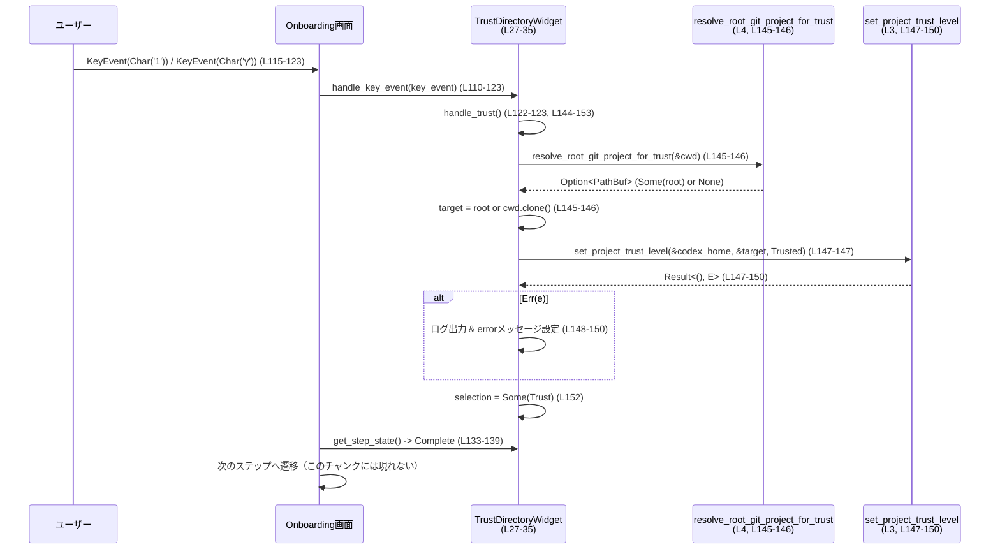

# tui/src/onboarding/trust_directory.rs

## 0. ざっくり一言

ディレクトリ（多くは Git プロジェクト）の「信頼確認」を行うオンボーディング用 TUI ウィジェットで、ユーザーに「このディレクトリを信頼するか」を尋ね、選択に応じてプロジェクトの trust 設定を書き込むコンポーネントです（根拠: `TrustDirectoryWidget` とフィールド群 `tui/src/onboarding/trust_directory.rs:L27-35`, 質問文と選択肢の描画 `L47-66`, trust 設定の更新 `L144-152`）。

---

## 1. このモジュールの役割

### 1.1 概要

- このモジュールは、**現在作業しているディレクトリ（通常は Git プロジェクトのルート）を「信頼するかどうか」ユーザーに確認する**ために存在し、  
  - TUI 上で確認ダイアログを描画する  
  - キーボード入力で選択肢（Trust / Quit）を操作する  
  - Trust を選んだ場合に、設定ストアに「Trusted」フラグを書き込む  
  機能を提供します（`TrustDirectoryWidget` とそのメソッド群 `L27-35, L43-107, L109-162`）。

### 1.2 アーキテクチャ内での位置づけ

主な依存関係は以下の通りです。

- 設定更新: `set_project_trust_level`（legacy_core 側の設定ロジック）`L3`
- プロジェクトルート解決: `resolve_root_git_project_for_trust`（Git ユーティリティ）`L4`
- Trust レベル定義: `TrustLevel::Trusted`（プロトコル定義）`L5`
- 描画: `ratatui` の `WidgetRef`, `Paragraph`, `Line`, `Wrap` など `L9-15, L43-107`
- 入力: `crossterm::event::KeyEvent`, `KeyCode`, `KeyEventKind` `L6-8, L110-129`
- オンボーディングとの連携: `KeyboardHandler`, `StepStateProvider`, `StepState` `L18-19, L26, L109-141`

依存関係を簡略化した図です。

```mermaid
graph TD
  subgraph Onboarding[TUI オンボーディング画面]
    TDW[TrustDirectoryWidget<br/>(L27-35)]
  end

  TDW -->|implements| KeyboardHandler[L18, L109-131]
  TDW -->|implements| StepStateProvider[L19, L133-141]
  TDW -->|renders via| Ratatui[ratatui widgets<br/>L9-15, L43-107]
  TDW -->|uses| KeyEvents[crossterm::event<br/>L6-8, L110-129]
  TDW -->|uses| GitRoot[resolve_root_git_project_for_trust<br/>L4, L145-146]
  TDW -->|uses| Config[set_project_trust_level<br/>L3, L147-150]
  TDW -->|uses| TrustLevel[TrustLevel::Trusted<br/>L5, L147]
```

（図全体の対象コード範囲: `tui/src/onboarding/trust_directory.rs:L3-152`）

### 1.3 設計上のポイント

- **状態を持つウィジェット**  
  - `TrustDirectoryWidget` は、カレントディレクトリ、ハイライト中の選択肢、確定した選択、エラー状態などをフィールドとして保持する stateful なコンポーネントです（`L27-35`）。
- **描画とロジックの分離（trait 実装）**  
  - 描画は `WidgetRef for &TrustDirectoryWidget` の `render_ref` で実装（`L43-107`）、  
    キー操作は `KeyboardHandler for TrustDirectoryWidget` の `handle_key_event`（`L109-131`）、  
    ステップ状態は `StepStateProvider` の `get_step_state`（`L133-141`）に分割されています。
- **信頼設定の更新は外部ロジックに委譲**  
  - 実際の設定書き込みは `set_project_trust_level` に委譲し、このモジュール側ではパスの決定とエラーメッセージの生成のみを行います（`L144-150`）。
- **エラーハンドリング方針**  
  - 設定更新失敗時には `tracing::error!` でログを出しつつ、`self.error` にユーザー向けのエラーメッセージを保存し、次回描画時に赤文字で表示します（`L78-87, L144-150`）。
- **並行性**  
  - すべてのメソッドは `&mut self` または `&self` を受け取る通常の同期処理であり、スレッドや async/await は使われていません（`L109-162`）。  
    Rust の所有権ルールにより、同時に複数スレッドから同じ `TrustDirectoryWidget` を可変参照することはコンパイル時に防がれます。

---

## 2. 主要な機能一覧

- ディレクトリ情報と注意文言の描画: 現在の作業ディレクトリと「信頼するか」の問いを表示します（`L47-61`）。
- 選択肢リストの描画: 「Yes, continue」「No, quit」の二択とハイライト表示を描画します（`L63-76`）。
- エラーメッセージの表示: trust 設定失敗時のメッセージを赤色で表示します（`L78-87`）。
- Enter キーのヒント表示: Enter キーで進む旨と、必要に応じて「sandbox を作成する」ヒントを表示します（`L90-103`）。
- キーボード操作の処理: 上下/`j`/`k`/数字キー/`y`/`n`/Enter による選択・決定を処理します（`L110-129`）。
- ステップ状態の判定: Onboarding 全体から見た「このステップが完了しているか」を返します（`L133-140`）。
- 信頼設定の更新: Git プロジェクトルートを特定し、そのパスに対して `TrustLevel::Trusted` を設定します（`L144-152`）。
- 終了フラグの管理: ユーザーが「Quit」を選んだかどうかを `should_quit` で取得できるようにします（`L155-162`）。

---

## 3. 公開 API と詳細解説

### 3.1 型一覧（構造体・列挙体など）

| 名前 | 種別 | 役割 / 用途 | 定義位置（根拠） |
|------|------|-------------|------------------|
| `TrustDirectoryWidget` | 構造体 | ディレクトリ信頼確認ダイアログの状態と描画・ロジックを保持するメインコンポーネント | `tui/src/onboarding/trust_directory.rs:L27-35` |
| `TrustDirectorySelection` | 列挙体 | ユーザーの選択肢（Trust / Quit）を表す | `tui/src/onboarding/trust_directory.rs:L37-41` |

`TrustDirectoryWidget` のフィールド詳細:

| フィールド名 | 型 | 説明 | 根拠 |
|--------------|----|------|------|
| `codex_home` | `PathBuf` | trust 設定を書き込むための「Codex のホームディレクトリ」パス | `L27-28` |
| `cwd` | `PathBuf` | 現在対象としている作業ディレクトリ（Git ルート解決の起点にも使用） | `L27, L29, L145-146` |
| `show_windows_create_sandbox_hint` | `bool` | Enter キーのヒント文言を「sandbox を作る」バージョンにするかどうかのフラグ | `L27, L30, L94-98` |
| `should_quit` | `bool` | ユーザーが「Quit」を選択したかどうかを示すフラグ | `L27, L31, L155-162` |
| `selection` | `Option<TrustDirectorySelection>` | ユーザーが確定した選択（Trust のみ設定している） | `L27, L32, L152` |
| `highlighted` | `TrustDirectorySelection` | 現在のハイライト位置（Enter でどちらが選ばれるか） | `L27, L33, L63-74, L116-121, L155-157` |
| `error` | `Option<String>` | trust 設定更新に失敗した際のエラーメッセージ | `L27, L34, L78-87, L148-150` |

### 3.2 関数詳細

#### `render_ref(&self, area: Rect, buf: &mut Buffer)`

実装元: `impl WidgetRef for &TrustDirectoryWidget` `tui/src/onboarding/trust_directory.rs:L43-107`

**概要**

- TUI フレームワーク `ratatui` 向けの描画メソッドで、`TrustDirectoryWidget` の現在の状態に基づき、  
  見出し・説明文・選択肢・エラーメッセージ・キー操作のヒントを縦方向のカラムとして描画します（`L47-105`）。

**引数**

| 引数名 | 型 | 説明 |
|--------|----|------|
| `self` | `&TrustDirectoryWidget` | 描画対象のウィジェット状態 |
| `area` | `Rect` | 描画すべき領域（ターミナル上の矩形） |
| `buf` | `&mut Buffer` | 実際の画面バッファ |

（`fn render_ref(&self, area: Rect, buf: &mut Buffer)` 定義 `L44`）

**戻り値**

- 戻り値なし。引数 `buf` を直接書き換えます（`L43-45, L105`）。

**内部処理の流れ**

1. `ColumnRenderable::new()` で縦方向に要素を積んでいくためのコンテナを作成（`L45`）。
2. 「You are in <cwd>」というタイトル行を追加。`cwd` は `PathBuf` を `to_string_lossy` → `String` として挿入します（`L47-51`）。
3. 説明文 `"Do you trust the contents of this directory? ..."` を `Paragraph` として追加し、左インセット 2 スペース・折り返し設定付きで描画（`L54-60`）。
4. 選択肢 `Yes, continue` / `No, quit` の配列を定義し（`L63-66`）、`enumerate` でインデックス付きで走査しながら `selection_option_row` で各行を生成。`self.highlighted` と比較してハイライトを決めます（`L68-74`）。
5. `self.error` が `Some` であれば、赤色の `Paragraph` としてエラーメッセージを追加（`L78-87`）。
6. 最後に「Press <Enter> to continue ...」の行を追加。`show_windows_create_sandbox_hint` に応じて文言を切り替えます（`L90-103`）。
7. 最終的に `column.render(area, buf)` で全体を描画します（`L105`）。

**Examples（使用例）**

テストコードから転用した簡易例です（`L205-223` を元に再構成）。

```rust
use std::path::PathBuf;
use ratatui::Terminal;
use tui::test_backend::VT100Backend; // テスト用バックエンド（実際の環境に合わせて差し替え）
use tui::onboarding::trust_directory::TrustDirectoryWidget;
use tui::onboarding::trust_directory::TrustDirectorySelection;

fn render_trust_dialog() {
    let widget = TrustDirectoryWidget {
        codex_home: PathBuf::from("/tmp/codex_home"),   // 設定書き込み先
        cwd: PathBuf::from("/workspace/project"),       // 対象ディレクトリ
        show_windows_create_sandbox_hint: false,        // ヒント文言のバリエーション
        should_quit: false,
        selection: None,
        highlighted: TrustDirectorySelection::Trust,    // デフォルト選択
        error: None,
    };

    let mut terminal = Terminal::new(VT100Backend::new(70, 14)).expect("terminal"); // `L217-218`
    terminal
        .draw(|f| (&widget).render_ref(f.area(), f.buffer_mut()))  // `L219-220` と同様
        .expect("draw");
}
```

**Errors / Panics**

- この関数自体では `Result` を返さず、`unwrap` や `expect` も使用していないため、panic を起こすコードは含まれていません（`L43-107`）。  
- ただし、内部で使っている他コンポーネント (`ColumnRenderable`, `selection_option_row` など) の実装詳細はこのファイルにはないため、それらの内部で panic が起こらないかどうかは不明です（「このチャンクには現れない」）。

**Edge cases（エッジケース）**

- `error` が `None` の場合: エラー表示用の行は一切描画されません（`if let Some(error) = &self.error` の条件分岐 `L78-88`）。
- `cwd` が非常に長いパスの場合: `to_string_lossy` による変換だけで特別なトリミングなどは行っていないため、レイアウト上折り返しやはみ出しが起こる可能性があります（`L50`）。
- `show_windows_create_sandbox_hint == true` の場合のみ、末尾文言が `" to continue and create a sandbox..."` になります（`L94-98`）。

**使用上の注意点**

- `render_ref` は純粋に描画のみ担当し、内部状態の変更は行いません。選択状態の変更は別途 `handle_key_event` を通して行われます（`L43-107` vs `L109-131`）。
- `&TrustDirectoryWidget` に対して `WidgetRef` が実装されているため、描画時には `(&widget).render_ref(...)` のように参照で呼び出す点に注意が必要です（`L43`）。

---

#### `handle_key_event(&mut self, key_event: KeyEvent)`

実装元: `impl KeyboardHandler for TrustDirectoryWidget` `tui/src/onboarding/trust_directory.rs:L109-131`

**概要**

- キーボードイベントを処理し、ハイライト位置の変更・選択の確定（Trust / Quit）を行うメインの操作ロジックです（`L110-129`）。

**引数**

| 引数名 | 型 | 説明 |
|--------|----|------|
| `self` | `&mut TrustDirectoryWidget` | ウィジェットの内部状態を更新するための可変参照 |
| `key_event` | `KeyEvent` | `crossterm` から渡されるキーイベント（種別・キーコード・修飾キーを含む） |

**戻り値**

- 戻り値なし。`highlighted`, `selection`, `should_quit`, `error` などの内部状態を更新します（`L110-130`）。

**内部処理の流れ**

1. イベント種別が `KeyEventKind::Release` の場合は何もせずに return（キーを離した瞬間のイベントでは動作しないようにする）（`L111-113`）。
2. `key_event.code` に応じて `match` で分岐（`L115-128`）:
   - `KeyCode::Up` または `Char('k')`: ハイライトを `TrustDirectorySelection::Trust` に移動（`L116-118`）。
   - `KeyCode::Down` または `Char('j')`: ハイライトを `TrustDirectorySelection::Quit` に移動（`L119-121`）。
   - `Char('1')` または `Char('y')`: 即座に `handle_trust()` を呼び出し、選択を Trust として処理（`L122-123`）。
   - `Char('2')` または `Char('n')`: 即座に `handle_quit()` を呼び出し、Quit を選択（`L123-124`）。
   - `Enter`: 現在の `highlighted` に応じて `handle_trust()` または `handle_quit()` を呼び出し（`L124-127`）。
   - その他のキー: 何もしない（`_ => {}` `L128`）。

**Examples（使用例）**

テストコード `release_event_does_not_change_selection` と同様のパターンです（`L179-201`）。

```rust
use crossterm::event::{KeyCode, KeyEvent, KeyEventKind, KeyModifiers};
use tui::onboarding::trust_directory::{TrustDirectoryWidget, TrustDirectorySelection};

// 省略: widget の初期化
let mut widget = /* TrustDirectoryWidget 初期化 */;

// Release イベントは無視される
let release = KeyEvent {
    kind: KeyEventKind::Release,                             // `L192-194`
    ..KeyEvent::new(KeyCode::Enter, KeyModifiers::NONE)
};
widget.handle_key_event(release);
assert!(widget.selection.is_none());

// Enter (Press) で現在の highlighted に応じて処理される
let press = KeyEvent::new(KeyCode::Enter, KeyModifiers::NONE); // `L199`
widget.handle_key_event(press);
// highlighted == Quit なら should_quit が true になる `L155-158`
assert!(widget.should_quit());
```

**Errors / Panics**

- 自身はエラー型を返しません。内部で呼び出している `handle_trust` と `handle_quit` が `Result` を返さないため、`handle_key_event` からエラーを伝播させることはありません（`L122-127, L143-158`）。
- `handle_trust` 内で `set_project_trust_level` が失敗した場合はログ出力とエラー文字列設定にとどまり、panic は発生しません（`L147-150`）。

**Edge cases（エッジケース）**

- キーリピート: `KeyEventKind::Repeat`（このファイルには現れませんが、`Release` 以外は処理される）場合、同じキーが押され続けたとみなして処理されます（`L111-113` から推測）。
- 複数回の決定キー押下: Trust / Quit を一度選択した後も `handle_key_event` 自体は `selection` や `should_quit` を再度書き換えることができます。これを抑制するロジックはこのファイルにはありません（`L110-130`）。
- 未定義キー: `match` に列挙されていないキーコードはすべて無視されます（`_ => {}` `L128`）。

**使用上の注意点**

- `handle_key_event` は `&mut self` を取るため、同時に複数スレッドから同じウィジェットを操作することは Rust の所有権システムにより制限されます。
- ステップ完了後にさらにイベントを流しても、`selection` や `should_quit` が変化し得る点に留意が必要です。ステップ管理側で `get_step_state()` の結果に応じてイベントハンドリングを止める必要がある設計と考えられます（`L133-140`）。

---

#### `get_step_state(&self) -> StepState`

実装元: `impl StepStateProvider for TrustDirectoryWidget` `tui/src/onboarding/trust_directory.rs:L133-141`

**概要**

- オンボーディング画面全体から見た、このステップ（ディレクトリ信頼確認）が完了しているかどうかを返します。

**引数**

| 引数名 | 型 | 説明 |
|--------|----|------|
| `self` | `&TrustDirectoryWidget` | 現在状態を参照するための共有参照 |

**戻り値**

- `StepState`（`Complete` または `InProgress`）。  
  `selection` が `Some` であるか、`should_quit` が `true` なら `Complete`、それ以外は `InProgress` を返します（`L135-139`）。

**内部処理の流れ**

1. `if self.selection.is_some() || self.should_quit` という条件式を評価（`L135`）。
2. 条件が真なら `StepState::Complete`、偽なら `StepState::InProgress` を返却（`L136-138`）。

**Errors / Panics**

- 単純な条件分岐のみであり、panic 要素はありません（`L133-140`）。

**Edge cases（エッジケース）**

- `selection` が `None` だが `should_quit == true` の場合: Quit 選択時のように、`selection` を設定せず `should_quit` だけを true にしてもステップは完了扱いになります（`handle_quit` `L155-158` と組み合わせ）。
- `selection` が `Some(Trust)` かつ `should_quit == true` になるケースはこのファイルからは作られていませんが、状態としては許容されており、その場合も `Complete` です（`L135-139`）。

**使用上の注意点**

- オンボーディングフロー側は、このメソッドを基準に「次のステップへ進むかどうか」を判断する設計と読み取れます（`KeyboardHandler` 実装と併用 `L109-141`）。
- 信頼設定の失敗時でも `selection` は `Some(Trust)` にセットされてしまうため、このメソッドは「ユーザー操作が完了したか」を表し、「設定が成功したか」を表してはいない点に注意が必要です（`L147-152`）。

---

#### `handle_trust(&mut self)`

実装元: `impl TrustDirectoryWidget` `tui/src/onboarding/trust_directory.rs:L143-153`

**概要**

- ユーザーが「Trust」を選んだときに呼ばれ、現在ディレクトリ（または Git ルート）を信頼済みとして設定し、選択状態を `Trust` で確定します。

**引数**

| 引数名 | 型 | 説明 |
|--------|----|------|
| `self` | `&mut TrustDirectoryWidget` | 内部状態とエラー状態を更新するための可変参照 |

**戻り値**

- なし。内部の `selection` と `error` を更新します。

**内部処理の流れ**

1. `resolve_root_git_project_for_trust(&self.cwd)` を呼び出し、信頼対象とするべきパス（通常は Git プロジェクトルート）を取得（`L145-146`）。
   - 戻り値が `None` の場合は `self.cwd.clone()` を使います（`unwrap_or_else` によるフォールバック）。
2. `set_project_trust_level(&self.codex_home, &target, TrustLevel::Trusted)` を呼び出し、trust 設定を書き込み（`L147`）。
3. もし `set_project_trust_level` が `Err(e)` を返した場合:
   - `tracing::error!` でエラー内容をログ出力（`L148`）。
   - `self.error = Some(format!("Failed to set trust for {}: {e}", target.display()));` としてユーザー向けエラーメッセージをセット（`L149-150`）。
4. 最後に `self.selection = Some(TrustDirectorySelection::Trust)` で選択確定（`L152`）。

**Errors / Panics**

- `resolve_root_git_project_for_trust` は `Option` を返し、それを `unwrap_or_else` で扱っているため、この関数の中では panic は発生しません（`L145-146`）。
- `set_project_trust_level` からのエラーは握りつぶさずログ＋エラーメッセージ設定を行いますが、この関数自体は `Result` を返さないため、呼び出し元にエラーを伝搬することはありません（`L147-150`）。

**Security / Bugs 観点**

- **Security**: この関数は「どのディレクトリを信頼するか」という安全性に関わるポリシー決定を担いますが、実際の安全性 enforcement は `set_project_trust_level` およびその後の使用側に委ねられています。本ファイルからは、trust 設定がどのような具体的影響（例: 実行許可・プロンプト注入対策）を持つかは分かりません（「このチャンクには現れない」）。
- **潜在的な仕様上の注意点**: trust 設定が失敗しても `selection` は `Trust` にセットされるため、UI 上はステップ完了扱いですが、内部設定は反映されていない可能性があります（`L147-152`）。  
  この挙動が意図されたものかどうかは、他コードがこの状態をどう扱うかによるため、本チャンクだけでは判断できません。

**Edge cases（エッジケース）**

- `self.cwd` が Git 管理下でない場合: `resolve_root_git_project_for_trust(&self.cwd)` が `None` を返した場合、`target` はそのまま `cwd` になります（`L145-146`）。
- 設定書き込みに失敗した場合: `error` にメッセージがセットされ、次回描画時に赤字で表示されますが（`L78-87, L149-150`）、ユーザーは既に Trust を選択済みと見なされます（`L152`）。

**使用上の注意点**

- `handle_trust` は `KeyboardHandler` 経由でのみ呼ばれる設計ですが（`L122-123, L124-127`）、外部から直接呼ぶことも可能です。その場合も trust 設定が即座に書き込まれる点に注意が必要です。
- 高頻度で呼び出される想定ではなく、ユーザー操作による単発の呼び出しを前提とした I/O を含む処理（と推測されますが、実際の I/O の有無は `set_project_trust_level` の実装に依存し、このチャンクには現れません）。

---

#### `handle_quit(&mut self)`

実装元: `impl TrustDirectoryWidget` `tui/src/onboarding/trust_directory.rs:L155-158`

**概要**

- 「Quit」選択が確定したときに呼ばれ、ハイライトを Quit に合わせた上で `should_quit` フラグを立てます。

**引数**

| 引数名 | 型 | 説明 |
|--------|----|------|
| `self` | `&mut TrustDirectoryWidget` | 状態を更新するための可変参照 |

**戻り値**

- なし。

**内部処理の流れ**

1. `self.highlighted = TrustDirectorySelection::Quit;` でハイライトを Quit に変更（`L156`）。
2. `self.should_quit = true;` で終了フラグを立てます（`L157`）。

**Errors / Panics**

- 単純なフィールド代入のみであり、panic 要素はありません（`L155-158`）。

**Edge cases（エッジケース）**

- `selection` フィールドは一切変更しないため、Quit の選択状態は `should_quit` でのみ表現されます（`L155-158`）。
- 複数回呼び出しても `should_quit` が true のままであり、それ以上の副作用はありません。

**使用上の注意点**

- Onboarding ステップ判定では `should_quit` だけで `StepState::Complete` になるため（`L135-139`）、`selection` を使ったロジックを組む場合は、Quit について別途考慮が必要です。

---

#### `should_quit(&self) -> bool`

実装元: `impl TrustDirectoryWidget` `tui/src/onboarding/trust_directory.rs:L160-162`

**概要**

- 外部から「このウィジェットにおいて Quit が選ばれたか」を問い合わせるための公開メソッドです。

**引数**

| 引数名 | 型 | 説明 |
|--------|----|------|
| `self` | `&TrustDirectoryWidget` | 状態を参照するための共有参照 |

**戻り値**

- `bool`: `self.should_quit` フィールドの値をそのまま返します（`L161`）。

**Errors / Panics**

- getter であり、panic 要素はありません（`L160-162`）。

**使用上の注意点**

- Quit 判定には `selection` ではなく `should_quit` を参照する設計になっています（`L155-162`）。
- Onboarding 全体のコントローラは、この値を見てプロセス終了や画面遷移を制御すると考えられますが、そのロジックはこのチャンクには現れません。

---

### 3.3 その他の関数（テスト）

| 関数名 | 役割（1 行） | 定義位置 |
|--------|--------------|----------|
| `release_event_does_not_change_selection` | `KeyEventKind::Release` が選択状態を変えないこと、および Enter (press) で Quit が選択されることを検証するテスト | `tui/src/onboarding/trust_directory.rs:L179-201` |
| `renders_snapshot_for_git_repo` | Git プロジェクト想定の `cwd` に対する描画結果をスナップショットテストする | `tui/src/onboarding/trust_directory.rs:L204-223` |

---

## 4. データフロー

### 4.1 代表的なシナリオ: ユーザーが Trust を選択する

このシナリオでは、ユーザーが `1` キーまたは `y` キーを押して Trust を選択し、その結果として Git ルートが解決され、trust 設定が更新されます。



描画フローは別のタイミングで `render_ref` を呼び出し、`cwd`, `highlighted`, `selection`, `error` に基づいて画面表示を更新します（`L43-107`）。

---

## 5. 使い方（How to Use）

### 5.1 基本的な使用方法

典型的なフローは以下のようになります。

1. `TrustDirectoryWidget` を必要な初期状態で構築する。
2. TUI イベントループの中で `handle_key_event` を呼んで状態を更新する。
3. 各フレームで `render_ref` を呼び出して描画する。
4. `get_step_state` や `should_quit` を見て、オンボーディングの進行や終了を制御する。

擬似コード例（本チャンクのコード・テストを元に構成）:

```rust
use std::path::PathBuf;
use crossterm::event::{self, Event, KeyEvent};
use ratatui::{Terminal, backend::CrosstermBackend};
use tui::onboarding::trust_directory::{TrustDirectoryWidget, TrustDirectorySelection};

fn run_trust_step(codex_home: PathBuf, cwd: PathBuf) -> anyhow::Result<()> {
    // 1. ウィジェットの初期化（L27-35 を参照）
    let mut widget = TrustDirectoryWidget {
        codex_home,
        cwd,
        show_windows_create_sandbox_hint: false,
        should_quit: false,
        selection: None,
        highlighted: TrustDirectorySelection::Trust,
        error: None,
    };

    let mut terminal = Terminal::new(CrosstermBackend::new(std::io::stdout()))?;

    loop {
        // 2. 描画（L43-107）
        terminal.draw(|f| {
            let area = f.size();
            (&widget).render_ref(area, f.buffer_mut());
        })?;

        // 3. 入力処理（L109-131）
        if let Event::Key(key_event) = event::read()? {
            widget.handle_key_event(key_event);

            // 4. ステップ完了・終了判定（L133-141, L160-162）
            if widget.should_quit() {
                // Quit 選択時の処理
                break;
            }
            if widget.get_step_state().is_complete() {
                // Trust 選択完了時の処理（is_complete は仮のメソッド名。
                // 実在するかどうかはこのチャンクには現れません）
                break;
            }
        }
    }

    Ok(())
}
```

※ `StepState` に `is_complete` のようなメソッドがあるかどうかはこのチャンクからは分からないため、上記は概念的な例です（「このチャンクには現れない」）。

### 5.2 よくある使用パターン

- **デフォルト Trust 選択で表示する**  
  - `highlighted: TrustDirectorySelection::Trust` としておき、Enter でそのまま Trust させる（`L27, L33, L124-127`）。
- **Windows 向け sandbox ヒントの有無で切り替える**  
  - `show_windows_create_sandbox_hint` を OS 判定などで切り替え、Enter キーのヒント文言を変更する用途（`L30, L94-98`）。

### 5.3 よくある間違いと正しい使い方

```rust
// 間違い例: Widget を作った後、KeyboardHandler を通して状態を更新していない
let mut widget = TrustDirectoryWidget { /* ... */ };
// 何もイベントを処理しないまま get_step_state を見ている
let state = widget.get_step_state(); // 常に InProgress（L135-139）

// 正しい例: 入力を handle_key_event に渡してから状態を見る
let key_event: KeyEvent = /* crossterm から取得 */;
widget.handle_key_event(key_event);   // 状態が更新される（L110-130）
let state = widget.get_step_state();  // selection や should_quit により Complete に変わり得る
```

```rust
// 間違い例: Quit 判定に selection を使おうとする
if widget.selection == Some(TrustDirectorySelection::Quit) {
    // handle_quit は selection をセットしないので、ここは決して true にならない（L155-158）
}

// 正しい例: should_quit を見る
if widget.should_quit() {             // L160-162
    // Quit が選択されたパス
}
```

### 5.4 使用上の注意点（まとめ）

- **Quit の検知**: Quit は `should_quit` でのみ表現され、`selection` には入りません（`L155-162`）。
- **Trust 設定の失敗**: 設定に失敗しても `selection` は `Some(Trust)` になり、ステップは完了扱いになります。失敗の有無を考慮したい場合は `error` を確認する必要があります（`L147-152, L78-87`）。
- **並行性**: すべての状態更新メソッドは `&mut self` を取るため、1 つの `TrustDirectoryWidget` を複数スレッドから同時に扱うことはできません（コンパイル時に防がれます）。

---

## 6. 変更の仕方（How to Modify）

### 6.1 新しい機能を追加する場合

例: 「一時的に Trust（このセッションだけ）」という第三の選択肢を追加したい場合。

1. **列挙体の拡張**  
   - `TrustDirectorySelection` に新しいバリアントを追加します（`L37-41`）。
2. **描画の拡張**  
   - `options` ベクタに新しい選択肢テキストとバリアントを追加します（`L63-66`）。
3. **キー操作の拡張**  
   - `handle_key_event` の `match` に新しいキー割り当てと、それに対応するハンドラ呼び出しを追加します（`L115-127`）。
4. **ビジネスロジックの追加**  
   - `impl TrustDirectoryWidget` に新しいハンドラメソッド（例: `handle_trust_session_only`）を追加し、既存の `handle_trust` と区別されるロジックを実装します（`L143-153` 付近）。
5. **ステップ状態判定の更新**  
   - `get_step_state` で、新しいバリアントをどう扱うかを検討し、必要に応じて条件式を調整します（`L135-139`）。

### 6.2 既存の機能を変更する場合

- **Trust 設定失敗時の挙動を変えたい**  
  - 現在は失敗しても `selection = Some(Trust)` にしているため、設定成功時にのみ `selection` を更新したい場合は `if let Err(e) = ...` の分岐を `match` に変更し、`Ok(_)` の中で `selection` を設定します（`L147-152`）。
- **キー割り当ての変更**  
  - Vim 風の `j`/`k` キーに加えて他のキーをサポートしたい場合は、`match key_event.code` の分岐を編集します（`L115-123`）。
- **文言の変更**  
  - ダイアログ文言やエラーメッセージはリテラル文字列としてハードコードされているため、国際化や設定ファイルからの読み込みに変更する場合は、`Paragraph::new` や `format!` 呼び出し部を修正します（`L55-57, L149`）。

変更時には、以下を再確認することが推奨されます（事実に基づく一般的注意）:

- `tests` モジュールのテストが期待通り動作するか（`L179-223`）。
- `KeyboardHandler` / `StepStateProvider` の契約（どの状態で Complete と見なすか）が崩れていないか（`L109-141`）。

---

## 7. 関連ファイル

| パス / モジュール | 役割 / 関係 | 根拠 |
|------------------|------------|------|
| `crate::legacy_core::config::set_project_trust_level` | プロジェクトの trust 設定を書き込む関数。本ウィジェットから呼び出される。実装詳細はこのチャンクには現れません。 | `tui/src/onboarding/trust_directory.rs:L3, L147-150` |
| `codex_git_utils::resolve_root_git_project_for_trust` | `cwd` から Git プロジェクトルートを解決するユーティリティ。trust 設定対象のパス決定に使用。実装はこのチャンクには現れません。 | `L4, L145-146` |
| `codex_protocol::config_types::TrustLevel` | `Trusted` などの trust レベル定義。本ウィジェットでは `Trusted` を指定。 | `L5, L147` |
| `crate::onboarding::onboarding_screen::KeyboardHandler` | キーボード入力をハンドリングするためのトレイト。本ウィジェットが実装している。トレイト定義はこのチャンクには現れません。 | `L18, L109-131` |
| `crate::onboarding::onboarding_screen::StepStateProvider` | Onboarding ステップの状態を提供するトレイト。本ウィジェットが実装している。 | `L19, L133-141` |
| `super::onboarding_screen::StepState` | ステップ状態（`Complete` / `InProgress`）の enum。本ウィジェットの `get_step_state` で使用。 | `L26, L133-140` |
| `crate::render::renderable::ColumnRenderable` | 縦方向のレイアウト構築用ユーティリティ。`render_ref` 内で使用。実装詳細はこのチャンクには現れません。 | `L21, L45, L105` |
| `crate::selection_list::selection_option_row` | 選択肢行を描画するためのヘルパー関数。ハイライト処理などを委譲。 | `L24, L68-74` |
| `crate::test_backend::VT100Backend` | テスト用の `ratatui` バックエンド。`renders_snapshot_for_git_repo` で使用。 | `L167, L217-223` |

---

### パフォーマンス / スケーラビリティ / オブザーバビリティ補足

- **パフォーマンス**:  
  - 主な処理はユーザー入力のたびに 1 回程度行われる軽量なロジックと考えられます。重いループや大規模なメモリアロケーションは含まれていません（`L43-107, L109-162`）。
- **オブザーバビリティ**:  
  - trust 設定失敗時に `tracing::error!` でログを出力しているため（`L148`）、監視・デバッグ時にはこれをフックできます。
- **並行性**:  
  - 明示的なスレッドや非同期処理は行っておらず、すべて単一スレッドのイベントループ内で動作する前提の設計と読み取れます（`L109-162`）。
