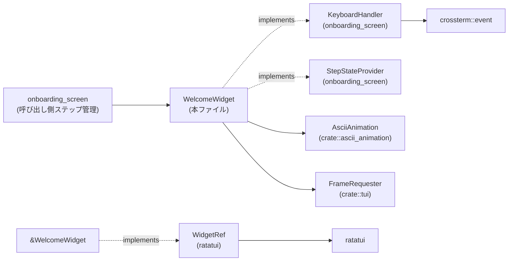
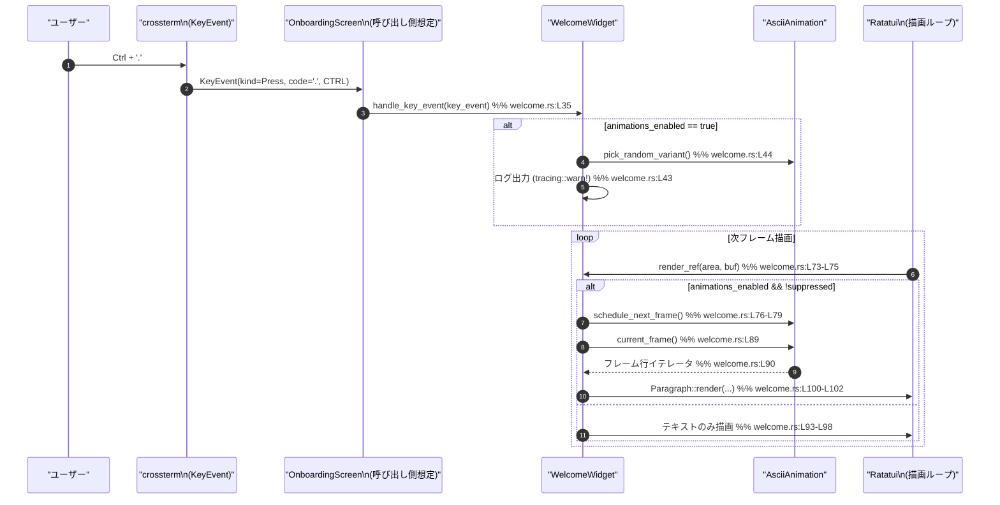

# tui/src/onboarding/welcome.rs コード解説

---

## 0. ざっくり一言

このファイルは、オンボーディング画面で表示される **ウェルカムメッセージ＋ASCIIアニメーション付きの TUI ウィジェット** `WelcomeWidget` を定義し、キーボード入力（Ctrl + `.`）でアニメーションバリアントを切り替える処理と、そのステップの状態管理を行います（[welcome.rs:L26-L32][welcome.rs:L34-L46][welcome.rs:L73-L103][welcome.rs:L106-L112]）。

---

## 1. このモジュールの役割

### 1.1 概要

- このモジュールは、オンボーディングフロー中の「Welcome」ステップに対応する UI コンポーネントを提供します（`WelcomeWidget`）（[welcome.rs:L26-L32]）。
- ASCII アニメーションの表示と、ビュー領域の大きさに応じた表示制御、キーボードショートカットによるアニメーション切り替え、ステップ状態（表示／非表示）の判定をまとめて担当します（[welcome.rs:L34-L46][welcome.rs:L73-L86][welcome.rs:L106-L112]）。

### 1.2 アーキテクチャ内での位置づけ

主な依存関係は次のとおりです。

- `WelcomeWidget` は外部モジュールのトレイト `KeyboardHandler`, `StepStateProvider` を実装し、オンボーディング画面の共通インターフェースに参加します（[welcome.rs:L16-L18][welcome.rs:L34-L47][welcome.rs:L106-L113]）。
- 描画には `ratatui` の `WidgetRef`, `Buffer`, `Rect` などを用い、TUI フレームワークと連携します（[welcome.rs:L5-L7][welcome.rs:L12-L13][welcome.rs:L73-L103]）。
- キー入力には `crossterm::event` の `KeyEvent` などを利用し、Ctrl+`.` をトリガーとしてアニメーションバリアントを変更します（[welcome.rs:L1-L4][welcome.rs:L34-L46]）。
- アニメーション本体は `AsciiAnimation` に委譲し、`FrameRequester` を通じて次フレーム描画を要求します（[welcome.rs:L16][welcome.rs:L19][welcome.rs:L28][welcome.rs:L49-L58][welcome.rs:L73-L79]）。



（図は、このチャンクに現れる依存だけを示しています）

### 1.3 設計上のポイント

- **単一構造体に機能集約**  
  表示状態（ログイン済みか）、アニメーション制御フラグ、レイアウト情報をすべて `WelcomeWidget` が保持し、描画・入力処理・ステップ状態判定を一箇所にまとめています（[welcome.rs:L26-L32][welcome.rs:L34-L46][welcome.rs:L73-L103][welcome.rs:L106-L112]）。
- **内部可変性（Interior Mutability）の利用**  
  `animations_suppressed` と `layout_area` は `Cell` でラップされ、`&self` から安全に更新できるようになっています。これにより、`WidgetRef` が `&WelcomeWidget` に対して実装されていても、描画のたびに内部状態を更新できます（[welcome.rs:L30-L31][welcome.rs:L49-L70][welcome.rs:L73-L103]）。
- **ビューサイズに応じたアニメーション制御**  
  アニメーションは高さ 37 行・幅 60 桁以上の場合のみ描画され、それ以下ではテキストのみ表示されます（`MIN_ANIMATION_HEIGHT`, `MIN_ANIMATION_WIDTH`, `show_animation`）（[welcome.rs:L23-L24][welcome.rs:L80-L85][welcome.rs:L87-L92]）。
- **イベント駆動のアニメーション更新**  
  描画時に `schedule_next_frame` を呼び出し、外部のフレームループに次の描画を依頼する方式になっています（[welcome.rs:L73-L79]）。  
  キー入力では `Ctrl + '.'` を押したときだけアニメーションバリアントを変更します（[welcome.rs:L34-L46]）。
- **安全性・エラーハンドリング**  
  このファイル内では `unsafe` や `Result` を伴う処理はなく、`unwrap_or` による安全なフォールバックのみを使用しています（[welcome.rs:L80]）。

---

## 2. 主要な機能一覧（＋コンポーネントインベントリー）

### 2.1 機能の箇条書き

- ウェルカムメッセージと ASCII アニメーションの描画（[welcome.rs:L73-L103]）。
- ビュー領域サイズに基づくアニメーション表示／非表示の切り替え（[welcome.rs:L23-L24][welcome.rs:L80-L86][welcome.rs:L87-L92]）。
- キーボードショートカット（Ctrl + `.`）によるアニメーションバリアント変更（[welcome.rs:L34-L46]）。
- ログイン状態に基づくオンボーディングステップ状態の返却（Hidden / Complete）（[welcome.rs:L26-L27][welcome.rs:L106-L112]）。
- アニメーション抑制フラグとレイアウト領域の更新 API（[welcome.rs:L49-L70]）。

### 2.2 型・定数インベントリー

| 名前 | 種別 | 行範囲 | 役割 / 用途 |
|------|------|--------|-------------|
| `MIN_ANIMATION_HEIGHT` | `const u16` | `welcome.rs:L23` | アニメーションを描画するための最小高さ（行数） |
| `MIN_ANIMATION_WIDTH`  | `const u16` | `welcome.rs:L24` | アニメーションを描画するための最小幅（桁数） |
| `WelcomeWidget` | 構造体 | `welcome.rs:L26-L32` | Welcome ステップの UI と状態を保持し、描画・入力・ステップ状態判定を行うコンポーネント |

（外部型 `AsciiAnimation`, `FrameRequester`, `StepState`, `KeyboardHandler`, `StepStateProvider`, `WidgetRef` はこのファイルでは宣言されておらず、インポートのみです（[welcome.rs:L16-L19][welcome.rs:L21][welcome.rs:L12]）。）

### 2.3 関数・メソッドインベントリー

| 名前 | 種別 | 行範囲 | 役割（1 行） |
|------|------|--------|--------------|
| `WelcomeWidget::handle_key_event` | トレイトメソッド実装 (`KeyboardHandler`) | `welcome.rs:L34-L46` | Ctrl + `.` 入力時にアニメーションバリアントを切り替える |
| `WelcomeWidget::new` | 関連関数（コンストラクタ） | `welcome.rs:L49-L62` | `WelcomeWidget` の新規インスタンスを生成し初期化する |
| `WelcomeWidget::update_layout_area` | メソッド | `welcome.rs:L64-L66` | レイアウト領域を内部に保存する |
| `WelcomeWidget::set_animations_suppressed` | メソッド | `welcome.rs:L68-L70` | アニメーション抑制フラグを更新する |
| `&WelcomeWidget::render_ref` | トレイトメソッド実装 (`WidgetRef`) | `welcome.rs:L73-L103` | バッファにアニメーションとウェルカムテキストを描画する |
| `WelcomeWidget::get_step_state` | トレイトメソッド実装 (`StepStateProvider`) | `welcome.rs:L106-L112` | ログイン状態に応じてステップ状態（Hidden / Complete）を返す |
| `row_containing` | テスト用ヘルパー関数 | `welcome.rs:L126-L134` | バッファ内で特定文字列を含む行のインデックスを探索する |
| `welcome_renders_animation_on_first_draw` | テスト | `welcome.rs:L136-L150` | アニメーション行の下に Welcome 行が描画されることを検証する |
| `welcome_skips_animation_below_height_breakpoint` | テスト | `welcome.rs:L152-L165` | 高さしきい値未満のときにアニメーションを描画しないことを検証する |
| `ctrl_dot_changes_animation_variant` | テスト | `welcome.rs:L167-L189` | Ctrl + `.` でアニメーションバリアントが変更されることを検証する |

---

## 3. 公開 API と詳細解説

### 3.1 型一覧（構造体・列挙体など）

| 名前 | 種別 | 公開範囲 | 役割 / 用途 |
|------|------|----------|-------------|
| `WelcomeWidget` | 構造体 | `pub(crate)` | オンボーディングの Welcome ステップ用ウィジェット。ログイン状態、アニメーション制御フラグ、レイアウト情報を保持し、描画・入力処理・ステップ状態判定を提供します（[welcome.rs:L26-L32]）。 |

フィールド概要（`WelcomeWidget`）:

- `pub is_logged_in: bool`  
  ログイン済みかどうかを表します。`StepStateProvider` 実装で使用されます（[welcome.rs:L26-L27][welcome.rs:L106-L112]）。
- `animation: AsciiAnimation`  
  アニメーションフレームの管理を委譲するオブジェクトです（[welcome.rs:L28][welcome.rs:L57][welcome.rs:L77-L79][welcome.rs:L89-L90]）。
- `animations_enabled: bool`  
  アニメーション機能自体が有効かどうかを制御します。入力処理・描画両方で参照されます（[welcome.rs:L29][welcome.rs:L36][welcome.rs:L76-L83]）。
- `animations_suppressed: Cell<bool>`  
  一時的なアニメーション抑制フラグです。`Cell` により `&self` から変更可能です（[welcome.rs:L30][welcome.rs:L59-L60][welcome.rs:L68-L70][welcome.rs:L76-L83][welcome.rs:L88]）。
- `layout_area: Cell<Option<Rect>>`  
  レイアウト計算済みの描画領域を保持します。未設定時は `render_ref` 内で `area` 引数にフォールバックします（[welcome.rs:L31][welcome.rs:L64-L66][welcome.rs:L80]）。

### 3.2 重要な関数詳細

#### `WelcomeWidget::new(is_logged_in: bool, request_frame: FrameRequester, animations_enabled: bool) -> Self`

**概要**

- `WelcomeWidget` を初期化するコンストラクタです。ログイン状態・フレームリクエスタ・アニメーション有効フラグを受け取り、内部フィールドに設定します（[welcome.rs:L49-L62]）。

**引数**

| 引数名 | 型 | 説明 |
|--------|----|------|
| `is_logged_in` | `bool` | ログイン済みかどうか。後続の `get_step_state` 判定に使われます（[welcome.rs:L51][welcome.rs:L106-L112]）。 |
| `request_frame` | `FrameRequester` | アニメーションの次フレーム描画要求に用いるオブジェクト。`AsciiAnimation::new` に渡されます（[welcome.rs:L52][welcome.rs:L57]）。 |
| `animations_enabled` | `bool` | アニメーションを有効化するかどうか。`handle_key_event` および描画時の判定に使用されます（[welcome.rs:L53][welcome.rs:L29][welcome.rs:L36][welcome.rs:L82]）。 |

**戻り値**

- 新しく初期化された `WelcomeWidget` インスタンスを返します。`animations_suppressed` は `false`、`layout_area` は `None` に初期化されます（[welcome.rs:L55-L61]）。

**内部処理の流れ**

1. `AsciiAnimation::new(request_frame)` を呼び出してアニメーションオブジェクトを作成します（[welcome.rs:L57]）。
2. `animations_suppressed` を `Cell::new(false)` で初期化し、当初は抑制されない状態にします（[welcome.rs:L59]）。
3. `layout_area` を `Cell::new(None)` で初期化し、外部から設定されるまでは引数 `area` を使うようにします（[welcome.rs:L60][welcome.rs:L80]）。

**Examples（使用例）**

テストコードに近い形での基本的な初期化例です。

```rust
use crate::onboarding::welcome::WelcomeWidget;
use crate::tui::FrameRequester;

// FrameRequester の実際の生成方法はこのチャンクにはありません。
// テストでは FrameRequester::test_dummy() が使用されています（welcome.rs:L139-L141）。
let frame_requester = FrameRequester::test_dummy(); // テスト用ダミー

// ログインしていないユーザー向けに、アニメーション有効な WelcomeWidget を作成
let widget = WelcomeWidget::new(false, frame_requester, true);
```

**Errors / Panics**

- この関数内でエラーやパニックを発生させるコードはありません。`AsciiAnimation::new` の内部挙動についてはこのチャンクでは不明です（[welcome.rs:L57]）。

**Edge cases（エッジケース）**

- `animations_enabled` が `false` の場合でも、ウィジェット自体は問題なく作成されます。その後の描画・入力処理でアニメーション関連の分岐が変わるだけです（[welcome.rs:L36][welcome.rs:L82]）。

**使用上の注意点**

- `request_frame` はアニメーションの駆動に使われるため、実行環境に応じた適切な `FrameRequester` を渡す必要があります（[welcome.rs:L57][welcome.rs:L77]）。
- 並行性: `WelcomeWidget` は `Cell` を含むため、`Sync` ではない可能性があります。複数スレッドから共有することは前提にしていない設計と考えられます（[welcome.rs:L30-L31]）。

---

#### `WelcomeWidget::update_layout_area(&self, area: Rect)`

**概要**

- 描画に使用するレイアウト領域 `Rect` を内部に保存します。`render_ref` 内でアニメーション表示可否の判定に利用されます（[welcome.rs:L64-L66][welcome.rs:L80-L85]）。

**引数**

| 引数名 | 型 | 説明 |
|--------|----|------|
| `area` | `Rect` | レイアウト済みの描画領域。アニメーション描画の基準サイズとして使われます。 |

**戻り値**

- なし（`()`）。

**内部処理の流れ**

1. `self.layout_area.set(Some(area))` により、`Cell<Option<Rect>>` に値を保存します（[welcome.rs:L65]）。
2. 以降の `render_ref` 呼び出しでは、`layout_area` が `Some` であればその値が優先されます（[welcome.rs:L80]）。

**Examples（使用例）**

```rust
// layout_area を更新してから描画する一例
let area = Rect::new(0, 0, 80, 40);
widget.update_layout_area(area);           // 内部の layout_area を設定（welcome.rs:L64-L66）
(&widget).render(area, &mut buf);          // WidgetRef 実装により描画（welcome.rs:L73-L103）
```

**Errors / Panics**

- `Cell::set` はパニックしません。`Rect` はコピー可能な型と想定され、この操作に失敗する要素はありません（[welcome.rs:L64-L66]）。

**Edge cases**

- このメソッドを一度も呼び出さなかった場合、`render_ref` では `layout_area.get().unwrap_or(area)` により、描画時に渡された `area` が使用されます（[welcome.rs:L80]）。そのため、呼び出し忘れによるパニックは発生しません。

**使用上の注意点**

- このメソッドは `&self` で呼び出せるため、外部から共有参照を持ったままレイアウト情報のみを更新するケースでも利用できます。内部で `Cell` を使っているためです（[welcome.rs:L31][welcome.rs:L64-L66]）。
- レイアウト計算と描画のタイミングが分かれている場合、描画前に必ず最新のものに更新しておくと、アニメーションの表示条件（高さ・幅判定）が意図通りになります（[welcome.rs:L80-L85]）。

---

#### `WelcomeWidget::set_animations_suppressed(&self, suppressed: bool)`

**概要**

- アニメーションの一時的な抑制フラグを更新します。抑制中は描画時にアニメーションを描かず、`schedule_next_frame` も呼び出されません（[welcome.rs:L68-L70][welcome.rs:L73-L79][welcome.rs:L82-L83][welcome.rs:L88-L92]）。

**引数**

| 引数名 | 型 | 説明 |
|--------|----|------|
| `suppressed` | `bool` | `true` ならアニメーションを抑制、`false` なら許可します。 |

**戻り値**

- なし。

**内部処理の流れ**

1. `self.animations_suppressed.set(suppressed)` により、内部フラグを書き換えます（[welcome.rs:L69]）。
2. 次回以降の描画・入力処理における条件分岐に反映されます（[welcome.rs:L76-L83][welcome.rs:L88]）。

**Examples（使用例）**

```rust
// 一時的にアニメーションを止めたい場合
widget.set_animations_suppressed(true);   // 抑制 ON（welcome.rs:L68-L70）

// 後で再開する
widget.set_animations_suppressed(false);  // 抑制 OFF
```

**Errors / Panics**

- このメソッド自体にエラーやパニック要因はありません（[welcome.rs:L68-L70]）。

**Edge cases**

- `animations_enabled` が `false` の場合、`animations_suppressed` の値に関わらずアニメーションは描画されません（[welcome.rs:L36][welcome.rs:L82]）。

**使用上の注意点**

- このフラグは `render_ref` 内の `schedule_next_frame` 呼び出しにも影響します。抑制を有効にするとフレーム要求も行われなくなるため、CPU 使用量を抑えたい場合などに使える一方で、再開し忘れに注意する必要があります（[welcome.rs:L76-L79][welcome.rs:L82-L83]）。

---

#### `WelcomeWidget::handle_key_event(&mut self, key_event: KeyEvent)`

（`KeyboardHandler` トレイト実装）

**概要**

- キーイベントを処理し、アニメーションが有効な状態で Ctrl + `.` が押下されたときにランダムなアニメーションバリアントへ切り替えます（[welcome.rs:L34-L46]）。

**引数**

| 引数名 | 型 | 説明 |
|--------|----|------|
| `key_event` | `KeyEvent` | `crossterm::event` から渡されるキーイベントオブジェクトです（[welcome.rs:L2][welcome.rs:L35]）。 |

**戻り値**

- なし。

**内部処理の流れ**

1. `animations_enabled` が `false` の場合は即座に `return` し、入力を無視します（[welcome.rs:L36-L38]）。
2. それ以外の場合、`key_event.kind` が `KeyEventKind::Press` であること（キー押下イベントのみ処理）を確認します（[welcome.rs:L39]）。
3. 同時に `key_event.code == KeyCode::Char('.')` および `key_event.modifiers.contains(KeyModifiers::CONTROL)` を満たすかチェックし、Ctrl + `.` の組み合わせかどうかを判定します（[welcome.rs:L39-L41]）。
4. 条件を満たした場合、`tracing::warn!` でログを出力し（[welcome.rs:L43]）、`self.animation.pick_random_variant()` を呼んでアニメーションバリアントを変更します（[welcome.rs:L44]）。戻り値は `let _ =` により破棄されます。

**Examples（使用例）**

テストに近い形での呼び出し例:

```rust
use crossterm::event::{KeyCode, KeyEvent, KeyModifiers};

// Ctrl + '.' の KeyEvent を生成
let key_event = KeyEvent::new(KeyCode::Char('.'), KeyModifiers::CONTROL);

// アニメーション有効な widget に対してイベントを渡す
widget.handle_key_event(key_event);  // welcome.rs:L35-L46
```

**Errors / Panics**

- この関数内に明示的なパニックや `Result` 処理はありません（[welcome.rs:L35-L46]）。
- `pick_random_variant` の戻り値は `let _ =` により無視されているため、もし `Result` などを返していてもエラーは握りつぶされる設計です（[welcome.rs:L44]）。戻り値の型・失敗条件はこのチャンクからは不明です。

**Edge cases**

- `animations_enabled == false` のときは、Ctrl + `.` を押しても何も起こりません（[welcome.rs:L36-L38]）。
- その他のキー（例えば単純な `.`、または Ctrl + 他キー）では、条件に一致しないためアニメーションバリアントは変更されません（[welcome.rs:L39-L41]）。
- `KeyEventKind` が `Press` 以外（Release / Repeat 等）では反応しません（[welcome.rs:L39]）。

**使用上の注意点**

- `&mut self` を取るため、同時に描画処理（`render_ref`）などと並行して呼ぶことは想定されていません。TUI のイベントループで逐次的に処理される前提と考えられます（[welcome.rs:L35]）。
- ログ出力には `tracing::warn!` が使われているため、ログレベルや出力先の設定に応じて実行時の挙動（ログ量）が変わります（[welcome.rs:L43]）。

---

#### `&WelcomeWidget::render_ref(&self, area: Rect, buf: &mut Buffer)`

（`WidgetRef` トレイト実装）

**概要**

- 指定された領域にウェルカム画面を描画します。アニメーションが有効かつビューサイズがしきい値以上の場合には ASCII アニメーションを描画し、その下にウェルカムテキストを表示します。アニメーションが無効または抑制されている場合はテキストのみを描画します（[welcome.rs:L73-L103]）。

**引数**

| 引数名 | 型 | 説明 |
|--------|----|------|
| `area` | `Rect` | 描画対象の矩形領域。`layout_area` が未設定の場合のフォールバックにも使われます（[welcome.rs:L74][welcome.rs:L80]）。 |
| `buf` | `&mut Buffer` | `ratatui` の描画バッファ。ここに実際の文字情報が書き込まれます（[welcome.rs:L74-L75][welcome.rs:L100-L102]）。 |

**戻り値**

- なし。

**内部処理の流れ**

1. `Clear.render(area, buf)` を呼んで、指定領域をクリアします（[welcome.rs:L75]）。
2. アニメーションが有効かつ抑制されていない場合、`self.animation.schedule_next_frame()` を呼び、次の描画フレームをスケジュールします（[welcome.rs:L76-L79]）。
3. `layout_area` を取得し、`Some` の場合はそれを、`None` の場合は引数 `area` を `layout_area` として使います（[welcome.rs:L80]）。
4. `show_animation` を次の条件で計算します（[welcome.rs:L82-L85]）:
   - `animations_enabled == true`
   - `animations_suppressed == false`
   - `layout_area.height >= MIN_ANIMATION_HEIGHT`
   - `layout_area.width >= MIN_ANIMATION_WIDTH`
5. `lines: Vec<Line>` を初期化します（[welcome.rs:L87]）。
6. `show_animation == true` の場合:
   - `self.animation.current_frame()` から現在のフレームを取得し（[welcome.rs:L89]）、
   - その各行を `lines` に追加し（`lines.extend(frame.lines().map(Into::into))`）（[welcome.rs:L90]）、
   - 空行 `""` を 1 行追加します（[welcome.rs:L91]）。
7. 最後に、`"Welcome to Codex, OpenAI's command-line coding agent"` の文字列を装飾付きで `lines` に追加します（`"Codex".bold()`）（[welcome.rs:L93-L98]）。
8. `Paragraph::new(lines).wrap(Wrap { trim: false }).render(area, buf)` で、行の折り返しを有効にしたパラグラフとして描画します（[welcome.rs:L100-L102]）。

**Examples（使用例）**

テストコードから抜粋した描画例:

```rust
use ratatui::buffer::Buffer;
use ratatui::layout::Rect;

// 最低限のアニメーション表示が可能な領域
let area = Rect::new(0, 0, MIN_ANIMATION_WIDTH, MIN_ANIMATION_HEIGHT); // welcome.rs:L143
let mut buf = Buffer::empty(area);                                      // welcome.rs:L144

(&widget).render(area, &mut buf); // &WelcomeWidget に対する WidgetRef 実装（welcome.rs:L73-L103）
```

**Errors / Panics**

- `layout_area.get().unwrap_or(area)` は `None` の場合に `area` を返すため、ここでパニックが発生することはありません（[welcome.rs:L80]）。
- `frame.lines()` や `Paragraph::render` の内部挙動については、このチャンクからは不明ですが、この関数内に明示的な `unwrap` や危険なインデックス操作はありません（[welcome.rs:L87-L102]）。

**Edge cases**

- **アニメーション無効 (`animations_enabled == false`)**  
  - `schedule_next_frame` は呼ばれず、`show_animation` も `false` になるため、アニメーションは描画されず、ウェルカムテキストのみ描画されます（[welcome.rs:L76-L83][welcome.rs:L87-L92]）。
- **アニメーション抑制 (`animations_suppressed == true`)**  
  - `schedule_next_frame` が呼ばれず、`show_animation` も `false` になります（[welcome.rs:L76-L83]）。
- **ビュー領域がしきい値未満**  
  - 高さ < 37 または 幅 < 60 の場合、`show_animation == false` となり、アニメーションは描画されません。この挙動はテストでも検証されています（[welcome.rs:L80-L85][welcome.rs:L152-L165]）。
- **`layout_area` 未設定**  
  - `layout_area` が `None` の場合でも `unwrap_or(area)` により `area` が利用されるため、パニックは発生せず、しきい値判定も `area` のサイズを元に行われます（[welcome.rs:L80-L85]）。

**使用上の注意点**

- `render_ref` は毎フレーム呼ばれる前提のため、内部での `schedule_next_frame` 呼び出しはアニメーションを継続させる役割を持ちます。アニメーションを止めたい場合は `set_animations_suppressed(true)` または `animations_enabled == false` のインスタンスを用いる必要があります（[welcome.rs:L76-L83]）。
- `WidgetRef` 実装は `&WelcomeWidget` に対して行われているので、描画時には `(&widget).render(area, buf)` のように参照を渡す形になります（[welcome.rs:L73-L75][welcome.rs:L145-L147]）。
- 並行性: `render_ref` は `&self` を取りますが、内部で `Cell` を使っているため、再入可能性には注意が必要です。同時に複数スレッドから描画する設計は想定されていないと考えられます（[welcome.rs:L30-L31][welcome.rs:L73-L80]）。

---

#### `WelcomeWidget::get_step_state(&self) -> StepState`

（`StepStateProvider` トレイト実装）

**概要**

- ログイン状態に応じてオンボーディングステップの状態を返します。`is_logged_in == true` のとき `StepState::Hidden`、`false` のとき `StepState::Complete` を返します（[welcome.rs:L106-L112]）。

**引数**

| 引数名 | 型 | 説明 |
|--------|----|------|
| `self` | `&self` | 読み取り専用の参照。`is_logged_in` フィールドを参照します。 |

**戻り値**

- `StepState` 型の値。  
  - `is_logged_in == true` → `StepState::Hidden`  
  - `is_logged_in == false` → `StepState::Complete`（[welcome.rs:L108-L111]）

**内部処理の流れ**

1. `match self.is_logged_in` によりブール値を分岐します（[welcome.rs:L108]）。
2. `true` のとき `StepState::Hidden` を返し、`false` のとき `StepState::Complete` を返します（[welcome.rs:L109-L111]）。

**Examples（使用例）**

```rust
use crate::onboarding::welcome::WelcomeWidget;

let widget_logged_in = WelcomeWidget::new(true, FrameRequester::test_dummy(), true);
assert!(matches!(widget_logged_in.get_step_state(), StepState::Hidden));   // welcome.rs:L108-L111

let widget_guest = WelcomeWidget::new(false, FrameRequester::test_dummy(), true);
assert!(matches!(widget_guest.get_step_state(), StepState::Complete));    // welcome.rs:L108-L111
```

**Errors / Panics**

- 分岐は bool のみを扱い、`match` は網羅的なのでパニックするケースはありません（[welcome.rs:L108-L111]）。

**Edge cases**

- `is_logged_in` は `bool` のため、他の値は存在せず、エッジケースは単純です。

**使用上の注意点**

- ステップ状態の解釈（Hidden / Complete の意味）は `StepState` の定義に依存し、このチャンクには現れません。オーケストレーション側（`onboarding_screen`）でどのように扱われるかを確認する必要があります（[welcome.rs:L21][welcome.rs:L18]）。

---

### 3.3 その他の関数

| 関数名 | 種別 | 行範囲 | 役割（1 行） |
|--------|------|--------|--------------|
| `row_containing(buf: &Buffer, needle: &str) -> Option<u16>` | テスト用ヘルパー | `welcome.rs:L126-L134` | バッファ内に指定文字列を含む最初の行インデックスを返す |
| `welcome_renders_animation_on_first_draw()` | テスト | `welcome.rs:L136-L150` | アニメーション行 + 1 行下に Welcome 行が描画されることを検証 |
| `welcome_skips_animation_below_height_breakpoint()` | テスト | `welcome.rs:L152-L165` | 高さしきい値未満のときにアニメーションを描画せず、Welcome 行が 0 行目に来ることを検証 |
| `ctrl_dot_changes_animation_variant()` | テスト | `welcome.rs:L167-L189` | Ctrl + `.` 入力で `AsciiAnimation` の現在フレームが変化することを検証 |

---

## 4. データフロー

ここでは、**Ctrl + `.` が押されてアニメーションバリアントが切り替わり、次の描画で新しいフレームが表示される** までの流れを例として示します。



ポイント:

- キー入力は `KeyboardHandler::handle_key_event` に集約され、ここでのみアニメーションバリアントが変更されます（[welcome.rs:L34-L46]）。
- 描画ループでは、毎回 `render_ref` が呼ばれ、アニメーションが有効かつ抑制されていない場合にのみ `schedule_next_frame` と `current_frame` が呼ばれます（[welcome.rs:L73-L79][welcome.rs:L87-L92]）。
- ビューサイズ条件を満たさない場合、`current_frame` は呼ばれず、テキストのみ描画されます（[welcome.rs:L80-L86][welcome.rs:L87-L92]）。

---

## 5. 使い方（How to Use）

### 5.1 基本的な使用方法

このチャンクから推測できる典型的な利用フローは次のとおりです。

1. アプリケーションの起動時に `WelcomeWidget` を初期化する（[welcome.rs:L49-L62]）。
2. オンボーディング画面において、このウィジェットをステップとして保持する（`KeyboardHandler`, `StepStateProvider`, `WidgetRef` を通して利用）（[welcome.rs:L16-L18][welcome.rs:L34-L47][welcome.rs:L73-L103][welcome.rs:L106-L112]）。
3. イベントループ内でキーイベントを `handle_key_event` に渡す。
4. 描画ループ内で `render_ref` を呼んで描画する。
5. 必要に応じて `update_layout_area`, `set_animations_suppressed` を呼んで表示を調整する。

簡略コード例（パターン例）:

```rust
use crate::onboarding::welcome::WelcomeWidget;
use crate::tui::FrameRequester;
use ratatui::buffer::Buffer;
use ratatui::layout::Rect;
use crossterm::event::KeyEvent;

let frame_requester = FrameRequester::test_dummy();   // テスト用（welcome.rs:L139-L141）
let mut welcome = WelcomeWidget::new(false, frame_requester, true); // welcome.rs:L49-L62

// レイアウト計算（実際のコードでは ratatui の layout を使用する想定）
let area = Rect::new(0, 0, 80, 40);
welcome.update_layout_area(area);                     // welcome.rs:L64-L66

// イベントループ（簡略）
fn on_key(key: KeyEvent, welcome: &mut WelcomeWidget) {
    welcome.handle_key_event(key);                    // welcome.rs:L35-L46
}

// 描画ループ（簡略）
fn draw(area: Rect, buf: &mut Buffer, welcome: &WelcomeWidget) {
    (&welcome).render(area, buf);                     // welcome.rs:L73-L103
}
```

※ 実際の `FrameRequester` の生成方法・オンボーディング画面への組み込み方法は、このチャンクには現れません。

### 5.2 よくある使用パターン

1. **アニメーションを完全に無効化したい場合**

   - `WelcomeWidget::new` の `animations_enabled` を `false` にして生成すると、`handle_key_event` が何もしなくなり、描画時にアニメーションは一切描画されません（[welcome.rs:L36-L38][welcome.rs:L82-L83]）。

   ```rust
   let widget = WelcomeWidget::new(false, frame_requester, false);
   // この場合、アニメーション行は描かれず、テキストのみになります。
   ```

2. **一時的にアニメーションを止める場合**

   - 一時停止時にだけ `set_animations_suppressed(true)` を呼び出し、再開時に `false` に戻します（[welcome.rs:L68-L70][welcome.rs:L76-L83]）。

3. **画面サイズに合わせた描画制御**

   - レスポンシブに振る舞わせたい場合、ラッパー側で `Rect` を計算し、それを `update_layout_area` に渡してから `render_ref` を呼び出すことで、アニメーションしきい値判定をレイアウトに合わせられます（[welcome.rs:L64-L66][welcome.rs:L80-L85]）。

### 5.3 よくある間違い（起こり得る誤用）

```rust
// 誤り例: layout_area を設定せずに、意図と異なる area を渡している可能性
let area = Rect::new(0, 0, 10, 10); // アニメーションのしきい値より小さい
(&widget).render(area, &mut buf);   // アニメーションが表示されない（welcome.rs:L80-L85）
```

```rust
// 正しい例: 実際に使用する layout_area を事前に設定し、その値に基づいて描画
let layout_area = Rect::new(0, 0, 80, 40);
widget.update_layout_area(layout_area);     // welcome.rs:L64-L66
(&widget).render(layout_area, &mut buf);    // welcome.rs:L73-L103
```

```rust
// 誤り例: animations_enabled=false にしているのに、キー入力でアニメーション変更を期待する
let mut widget = WelcomeWidget::new(false, frame_requester, false);
widget.handle_key_event(ctrl_dot_event); // 何も起こらない（welcome.rs:L36-L38）
```

```rust
// 正しい例: アニメーション変更を期待する場合は animations_enabled=true で生成する
let mut widget = WelcomeWidget::new(false, frame_requester, true);  // welcome.rs:L49-L62
widget.handle_key_event(ctrl_dot_event);                            // welcome.rs:L35-L46
```

### 5.4 使用上の注意点（まとめ）

- **前提条件**
  - マルチスレッドでの同時描画や入力処理は前提としていない設計です。`Cell` による内部可変性があるためです（[welcome.rs:L30-L31]）。
  - `WelcomeWidget` のライフサイクルは、TUI アプリケーションのイベントループと描画ループに統合される前提です（[welcome.rs:L34-L46][welcome.rs:L73-L103]）。

- **エラー・安全性**
  - このファイル内に `unsafe` ブロックや `unwrap` はなく、パニックの可能性は低い設計です（`unwrap_or` のみ使用）（[welcome.rs:L80]）。
  - `AsciiAnimation` や `FrameRequester` 内部のエラー挙動は、このチャンクからは分かりません。

- **パフォーマンス**
  - アニメーションが有効で抑制されていない場合、描画ごとに `schedule_next_frame` が呼ばれます（[welcome.rs:L76-L79]）。高頻度に呼び出される環境では、必要に応じて `animations_suppressed` を利用することで負荷を抑制できます。
  - ビュー領域がしきい値未満でも `schedule_next_frame` 自体は呼ばれる点に注意が必要です（[welcome.rs:L76-L79][welcome.rs:L80-L85]）。

- **観測性（Observability）**
  - Ctrl + `.` 入力時に `tracing::warn!` でログが出力されます（[welcome.rs:L43]）。キーバインドが効いているかどうかを確認するための手がかりになります。

---

## 6. 変更の仕方（How to Modify）

### 6.1 新しい機能を追加する場合

例として、「別のキーボードショートカットでアニメーションを一時停止する」機能を追加する場合の入口:

1. **入力処理の拡張**
   - `handle_key_event` 内の条件分岐を拡張し、新しいキーコンビネーションに対応させます（[welcome.rs:L39-L45]）。
   - 例えば `KeyCode::Char('p')` などとの組み合わせを追加し、その中で `set_animations_suppressed(true)` を呼び出すことが考えられます（[welcome.rs:L68-L70]）。

2. **描画ロジックの確認**
   - アニメーション抑制フラグが描画にどう影響するかは `render_ref` の `show_animation` 判定で確認できます（[welcome.rs:L82-L85][welcome.rs:L88-L92]）。

3. **ステップ状態の変更が必要な場合**
   - ログイン状態以外の条件（例: 初回起動かどうか）でステップ状態を変更したい場合は、`is_logged_in` 以外のフィールドを構造体に追加し、`get_step_state` のマッチロジックを拡張します（[welcome.rs:L26-L27][welcome.rs:L106-L112]）。

### 6.2 既存の機能を変更する場合

- **アニメーションを表示するしきい値を変更する**
  - `MIN_ANIMATION_HEIGHT`, `MIN_ANIMATION_WIDTH` の定数値を変更します（[welcome.rs:L23-L24]）。
  - 影響範囲は `show_animation` 判定と、それを前提にしたテスト `welcome_skips_animation_below_height_breakpoint` です（[welcome.rs:L80-L85][welcome.rs:L152-L165]）。

- **Welcome メッセージ文言の変更**
  - `lines.push(Line::from(vec![ ... ]))` 内の文字列とスタイルを変更します（[welcome.rs:L93-L98]）。
  - 改行位置や太字部分は `Line` の `Vec` の構成に依存します。

- **Contracts / Edge Cases の維持**
  - テストが表している契約:
    - 「しきい値以上のサイズなら、アニメーションフレーム行＋空行の次に Welcome 行が来る」（[welcome.rs:L136-L150]）。
    - 「しきい値未満の高さでは Welcome 行は 0 行目に来る」（[welcome.rs:L152-L165]）。
    - 「Ctrl + `.` で `AsciiAnimation` の `current_frame` が変化する」（[welcome.rs:L167-L189]）。
  - これらの前提を変える場合は、テストの期待値も合わせて更新する必要があります。

- **リファクタリング観点**
  - 描画ロジック（`render_ref`）と入力ロジック（`handle_key_event`）が一つの構造体にまとまっているため、関心事ごとに分割したい場合には、`WelcomeWidget` を薄い状態コンテナにして、別モジュールにハンドラやビューを切り出すなどの手段が考えられますが、現在のコードからは必須とは読み取れません。

---

## 7. 関連ファイル

このモジュールと密接に関係する他モジュール（ファイルパスはこのチャンクからは特定できません）:

| パス / モジュール名 | 役割 / 関係 |
|---------------------|------------|
| `crate::ascii_animation`（`AsciiAnimation`） | ASCII アートアニメーションのフレーム管理と、`schedule_next_frame`, `current_frame`, `pick_random_variant`, `with_variants` といった API を提供すると推測されます（[welcome.rs:L16][welcome.rs:L28][welcome.rs:L57][welcome.rs:L77-L79][welcome.rs:L89-L90][welcome.rs:L171-L175][welcome.rs:L181-L183]）。 |
| `crate::onboarding::onboarding_screen` | `KeyboardHandler`, `StepStateProvider`, `StepState` を定義し、オンボーディングステップを統合するモジュールです（[welcome.rs:L17-L18][welcome.rs:L21]）。 |
| `crate::tui`（`FrameRequester`） | フレーム再描画要求のためのインターフェースを提供し、`AsciiAnimation::new` やテスト用の `FrameRequester::test_dummy()` で利用されています（[welcome.rs:L19][welcome.rs:L52][welcome.rs:L57][welcome.rs:L139-L141][welcome.rs:L172]）。 |
| `ratatui` | TUI のレイアウトと描画（`Rect`, `Buffer`, `Widget`, `WidgetRef`, `Paragraph`, `Clear`, `Wrap`, `Line` など）を提供します（[welcome.rs:L5-L7][welcome.rs:L9-L13][welcome.rs:L73-L103][welcome.rs:L119-L120]）。 |
| `crossterm::event` | キー入力イベントの表現（`KeyEvent`, `KeyCode`, `KeyModifiers`, `KeyEventKind`）を提供します（[welcome.rs:L1-L4][welcome.rs:L34-L46][welcome.rs:L182]）。 |
| 本ファイル内テストモジュール `tests` | `WelcomeWidget` の描画・入力挙動に関する契約（高さしきい値や Ctrl + `.` の挙動）を検証します（[welcome.rs:L115-L190]）。 |

---

※ 全体として、このファイルは Rust の所有権・借用の観点では `Cell` による内部可変性を利用しつつ、`unsafe` を使わずに UI 状態を管理する設計になっています。エラー処理はファイル内では顕在化しておらず、主に外部コンポーネント（`AsciiAnimation`, `FrameRequester`）側に委譲されている点が特徴です。
