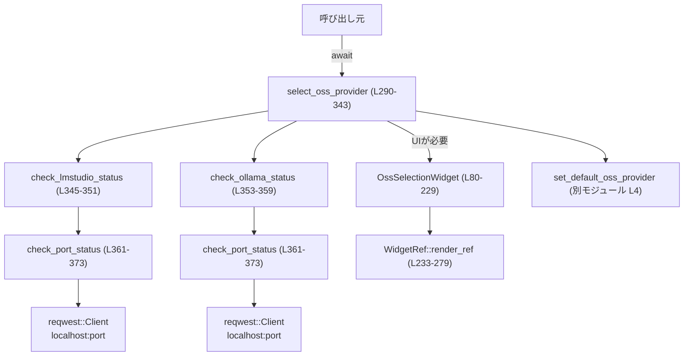

# tui/src/oss_selection.rs コード解説

## 0. ざっくり一言

ローカルで動作する OSS 推論サーバ（LM Studio / Ollama）の起動状況を HTTP で確認し、必要に応じて ratatui + crossterm ベースの TUI でユーザーにどのプロバイダを使うか選択してもらうモジュールです（`select_oss_provider` が公開エントリポイント）。  
根拠: `select_oss_provider` の実装全体（`oss_selection.rs:L290-343`）、状態チェック関数群（`oss_selection.rs:L345-373`）。

---

## 1. このモジュールの役割

### 1.1 概要

- ローカルホスト上の既定ポートに HTTP リクエストを送り、LM Studio / Ollama サーバの稼働状態を判定します。  
  根拠: `check_lmstudio_status` / `check_ollama_status` / `check_port_status`（`oss_selection.rs:L345-373`）。
- 片方だけが起動している場合は自動選択し、両方起動 or 両方停止・不明の場合は TUI を表示してユーザーに選択してもらいます。  
  根拠: `select_oss_provider` のマッチ分岐（`oss_selection.rs:L295-308`）。
- TUI 内では、プロバイダの稼働状態（●/○/?）と説明を表示し、カーソル左右・Enter・Esc・ショートカットキー（L/O）や Ctrl+C によるキャンセルを受け付けます。  
  根拠: `OssSelectionWidget::new`（`oss_selection.rs:L95-147`）、`handle_select_key`（`oss_selection.rs:L180-214`）、`render_ref`（`oss_selection.rs:L233-279`）。
- ユーザーが手動で選んだプロバイダ ID は設定として保存されます。  
  根拠: `set_default_oss_provider` 呼び出し部（`oss_selection.rs:L334-340`）。

### 1.2 アーキテクチャ内での位置づけ

このモジュールは「OSS モデルプロバイダ選択のための UI + ロジック」を一手に引き受けるコンポーネントとして機能しています。

主な依存関係:

- 設定保存: `crate::legacy_core::config::set_default_oss_provider`  
  （このチャンクには定義がないため詳細は不明）`oss_selection.rs:L4`
- プロバイダ情報（ID / デフォルトポート）: `codex_model_provider_info`  
  根拠: `DEFAULT_LMSTUDIO_PORT` 等の use（`oss_selection.rs:L5-8`）
- TUI / 入力: `crossterm`, `ratatui`  
  根拠: use 群（`oss_selection.rs:L9-37`）と `Terminal` / `WidgetRef` 実装（`oss_selection.rs:L232-279`）
- HTTP 通信: `reqwest::Client`  
  根拠: `check_port_status`（`oss_selection.rs:L361-373`）

依存関係の概要を Mermaid 図で示します（このファイル全体: `oss_selection.rs:L1-373`）。



### 1.3 設計上のポイント

- **自動選択と対話的選択の両立**  
  - 片方のみ起動している場合の自動選択、両方同じ状態（Running / NotRunning / Unknown 含む）の場合のみ TUI を表示する構造になっています。  
    根拠: `match (&lmstudio_status, &ollama_status)`（`oss_selection.rs:L295-308`）。
- **状態付き TUI ウィジェット**  
  - `OssSelectionWidget` は選択肢リスト参照と `Paragraph` を持ち、選択状態・完了フラグ・選択結果を内部状態として保持します。  
    根拠: 構造体定義（`oss_selection.rs:L80-92`）。
- **静的な選択肢定義**  
  - LM Studio / Ollama のラベル・説明文・ショートカットキー・provider_id は `LazyLock<Vec<SelectOption>>` に格納され、スレッド安全に初期化されます。  
    根拠: `OSS_SELECT_OPTIONS` 定義（`oss_selection.rs:L63-78`）。
- **非同期 I/O と同期 TUI の混在**  
  - 関数全体は `async fn` で実装されていますが、TUI 部分では `crossterm::event::read()` を同期で呼び出すため、呼び出し側の async ランタイムスレッドをブロックします。  
    根拠: `select_oss_provider` 内の loop と `event::read()` 呼び出し（`oss_selection.rs:L319-329`）。
- **エラー処理方針**  
  - HTTP クライアント生成エラーは `io::Error` として上位に伝播し、それ以外の HTTP リクエストエラーは「NotRunning」とみなします。  
    根拠: `check_port_status` の `map_err(io::Error::other)` と `Err(_) => Ok(false)`（`oss_selection.rs:L361-372`）。
  - TUI 描画 / 入力での I/O エラーは `select_oss_provider` の `io::Result` としてそのまま上位に返します（`?` 演算子）。  
    根拠: `terminal.draw` / `event::read` の `?`（`oss_selection.rs:L320-325`）。

---

## 2. 主要な機能一覧

- OSS プロバイダ選択 API: `select_oss_provider` により、呼び出し元からプロバイダ ID 文字列を取得する。  
  根拠: `oss_selection.rs:L290-343`
- プロバイダ稼働状況チェック: デフォルトポートへの HTTP アクセスによる Running / NotRunning / Unknown 判定。  
  根拠: `check_lmstudio_status` / `check_ollama_status` / `check_port_status`（`oss_selection.rs:L345-373`）
- プロバイダ選択用 TUI ウィジェット: `OssSelectionWidget` と `WidgetRef` 実装による UI 描画とキー入力処理。  
  根拠: `oss_selection.rs:L80-92`,`L94-229`,`L232-279`
- プロバイダ選択結果の永続化: 手動選択されたプロバイダ ID を設定ファイルに保存。  
  根拠: `set_default_oss_provider` 呼び出し（`oss_selection.rs:L334-340`）

---

## 3. 公開 API と詳細解説

### 3.1 型・コンポーネント一覧

#### 構造体・列挙体・静的変数

| 名前 | 種別 | 公開範囲 | 定義位置 | 役割 / 用途 |
|------|------|----------|----------|-------------|
| `ProviderOption` | 構造体 | モジュール内専用 | `oss_selection.rs:L40-44` | 表示用のプロバイダ名と `ProviderStatus` をまとめる内部用構造体。UI 用テキスト生成にのみ使用。 |
| `ProviderStatus` | 列挙体 | モジュール内専用 | `oss_selection.rs:L46-51` | プロバイダの状態を `Running` / `NotRunning` / `Unknown` の 3 状態で表現。 |
| `SelectOption` | 構造体 | モジュール内専用 | `oss_selection.rs:L56-61` | セレクトモードで表示する 1 つの選択肢（ラベル行、説明文、ショートカットキー、provider_id）を表現。 |
| `OSS_SELECT_OPTIONS` | `LazyLock<Vec<SelectOption>>` | モジュール内専用（`static`） | `oss_selection.rs:L63-78` | LM Studio / Ollama の選択肢情報を静的に保持。`OssSelectionWidget::new` で参照。 |
| `OssSelectionWidget<'a>` | 構造体 | `pub` | `oss_selection.rs:L80-92` | プロバイダ選択用の TUI ウィジェット本体。選択肢リスト、説明テキスト、選択状態と結果を保持し、キーイベント処理・描画処理で利用される。 |

#### 関数・メソッド・トレイト実装

| 名前 | 種別 | 公開範囲 | 定義位置 | 役割（1 行） |
|------|------|----------|----------|--------------|
| `OssSelectionWidget::new` | 関連関数 | モジュール内専用 (`fn`) | `oss_selection.rs:L95-147` | プロバイダ状態に応じて説明テキストを組み立て、`OssSelectionWidget` を初期化する。 |
| `OssSelectionWidget::get_confirmation_prompt_height` | メソッド | モジュール内専用 | `oss_selection.rs:L149-152` | 現在の説明テキストを与えられた幅でレンダリングした際の高さ行数を計算する。 |
| `OssSelectionWidget::handle_key_event` | メソッド | `pub` | `oss_selection.rs:L159-168` | crossterm の `KeyEvent` を処理し、ユーザーが選択を完了した場合にプロバイダ ID を返す。 |
| `OssSelectionWidget::normalize_keycode` | 関連関数 | モジュール内専用 | `oss_selection.rs:L173-178` | 文字キーを小文字化してケースインセンシティブな比較を行うための補助関数。 |
| `OssSelectionWidget::handle_select_key` | メソッド | モジュール内専用 | `oss_selection.rs:L180-214` | セレクトモードでのキー操作（左右移動、Enter、Esc、ショートカット、Ctrl+C）を処理する。 |
| `OssSelectionWidget::send_decision` | メソッド | モジュール内専用 | `oss_selection.rs:L216-219` | 選択結果を `selection` に保存し、`done` フラグを立てる。 |
| `OssSelectionWidget::is_complete` | メソッド | `pub` | `oss_selection.rs:L223-225` | ユーザーが選択を完了しているか（`done`）を返す。 |
| `OssSelectionWidget::desired_height` | メソッド | `pub` | `oss_selection.rs:L227-229` | 説明テキスト高さ + ボタン行数から、ウィジェットの望ましい高さを計算する。 |
| `impl WidgetRef for &OssSelectionWidget<'_>::render_ref` | トレイトメソッド | `pub` (トレイトに従う) | `oss_selection.rs:L232-279` | 指定領域に説明文、タイトル、選択ボタン、選択中の説明を描画する。 |
| `get_status_symbol_and_color` | 関数 | モジュール内専用 | `oss_selection.rs:L282-288` | `ProviderStatus` を表現する記号と `Color` を返す。 |
| `select_oss_provider` | 関数 | `pub async` | `oss_selection.rs:L290-343` | プロバイダ状態をチェックし、自動または TUI による選択でプロバイダ ID を返すメイン API。 |
| `check_lmstudio_status` | 関数 | `async`（モジュール内専用） | `oss_selection.rs:L345-351` | LM Studio のデフォルトポートにアクセスして `ProviderStatus` を判定する。 |
| `check_ollama_status` | 関数 | `async`（モジュール内専用） | `oss_selection.rs:L353-359` | Ollama のデフォルトポートにアクセスして `ProviderStatus` を判定する。 |
| `check_port_status` | 関数 | `async`（モジュール内専用） | `oss_selection.rs:L361-373` | 指定ポートの `http://localhost:{port}` に HTTP GET し、成功ステータスかどうかを返す。 |

---

### 3.2 関数詳細

#### `pub async fn select_oss_provider(codex_home: &std::path::Path) -> io::Result<String>`

**概要**

- ローカルの LM Studio / Ollama サーバの状態を確認し、自動または TUI によって利用する OSS プロバイダを選択して、プロバイダ ID（文字列）を返します。  
  根拠: 関数本体（`oss_selection.rs:L290-343`）。

**引数**

| 引数名 | 型 | 説明 |
|--------|----|------|
| `codex_home` | `&std::path::Path` | 設定ファイル等を保存すると思われるディレクトリパス。プロバイダ選択結果の保存に使用（`set_default_oss_provider` に渡される）。`oss_selection.rs:L290,L336-337` |

※ `set_default_oss_provider` の挙動は別モジュールのため、このチャンクからは不明です。

**戻り値**

- `io::Result<String>`  
  - `Ok(provider_id)` の場合: 選択されたプロバイダ ID（例: `LMSTUDIO_OSS_PROVIDER_ID` や `OLLAMA_OSS_PROVIDER_ID`）。  
  - `Err(e)` の場合: HTTP クライアント生成エラー、TUI 描画/入力エラー、ターミナル制御エラーなど I/O 関連の失敗。  
  根拠: 戻り値型宣言と `?` 演算子の利用（`oss_selection.rs:L290-343`）。

**内部処理の流れ**

1. LM Studio / Ollama の状態をそれぞれ `check_lmstudio_status().await` / `check_ollama_status().await` で取得。  
   根拠: `oss_selection.rs:L291-293`
2. `(lmstudio_status, ollama_status)` の組み合わせに応じて自動選択を試みる。  
   - LM Studio Running / Ollama NotRunning → LM Studio を選択して即 `Ok(provider)` を返す。  
   - LM Studio NotRunning / Ollama Running → Ollama を選択して即 `Ok(provider)` を返す。  
   - 上記以外（両方 Running / 両方 NotRunning / いずれか Unknown）は TUI へ。  
   根拠: `match` 文（`oss_selection.rs:L295-308`）
3. `OssSelectionWidget::new(lmstudio_status, ollama_status)` でウィジェットを構築。  
   根拠: `oss_selection.rs:L310`
4. `enable_raw_mode` と `EnterAlternateScreen` でターミナルを TUI 用モードに切り替え、`Terminal<CrosstermBackend>` を生成。  
   根拠: `oss_selection.rs:L312-318`
5. loop 内で以下を繰り返す:  
   - `terminal.draw` によって `render_ref` を使いウィジェットを画面に描画。  
   - `event::read()` でキーボードイベントを同期的に読み取り、`Event::Key` であれば `widget.handle_key_event` に渡す。  
   - `handle_key_event` が `Some(selection)` を返したら `break Ok(selection)` で抜ける。  
   根拠: `oss_selection.rs:L319-329`
6. ループを抜けた後、`disable_raw_mode` と `LeaveAlternateScreen` でターミナル状態を元に戻す。  
   根拠: `oss_selection.rs:L331-332`
7. `result` が `Ok(provider)` の場合は、`set_default_oss_provider(codex_home, provider)` を呼び、保存失敗時のみ `tracing::warn!` で警告ログを出す（呼び出しは続行）。  
   根拠: `oss_selection.rs:L334-340`
8. 最後に `result`（`Ok` または `Err`）をそのまま返す。  
   根拠: `oss_selection.rs:L342`

**Examples（使用例）**

`select_oss_provider` は async 関数なので、何らかの async ランタイム内で `await` する必要があります（どのランタイムかはこのチャンクからは不明です）。

```rust
use std::path::Path;
use std::io;

#[tokio::main] // ランタイムの種類はプロジェクト設定に依存（このチャンクには現れない）
async fn main() -> io::Result<()> {
    let codex_home = Path::new("/path/to/codex_home"); // 設定保存ディレクトリ
    let provider_id = select_oss_provider(codex_home).await?; // ユーザーに選択させる or 自動選択
    println!("Selected OSS provider: {provider_id}");
    Ok(())
}
```

**Errors / Panics**

- `Err(io::Error)` になる主な条件:
  - `reqwest::Client::builder().build()` が失敗した場合  
    （`check_port_status` 内で `map_err(io::Error::other)?` により伝播）`oss_selection.rs:L361-365`
  - `enable_raw_mode`, `disable_raw_mode`, `execute!(..., Enter/LeaveAlternateScreen)` が失敗した場合。`oss_selection.rs:L312-315`,`L331-332`
  - `Terminal::new` や `terminal.draw`, `event::read` が失敗した場合。`oss_selection.rs:L317-323, L324-325`
- panic を明示的に発生させるコードはこのチャンクには現れません。

**Edge cases（エッジケース）**

- LM Studio / Ollama の両方が `NotRunning` でも TUI が表示され、ユーザーはどちらかを選べます（選択しても実際にはサーバが動いていない可能性がある）。  
  根拠: 自動選択条件が「片方 Running かつ他方 NotRunning」のみであること（`oss_selection.rs:L295-305`）
- `ProviderStatus::Unknown` がいずれかに含まれる場合も自動選択せず TUI 表示になります。  
  根拠: `match` に Unknown の専用分岐がないため `_` で UI 側へフォールバック（`oss_selection.rs:L305-308`）
- TUI ループ内で I/O エラーが起きると `?` により即座に `Err` が返され、その場合 `disable_raw_mode` / `LeaveAlternateScreen` は呼ばれません。ターミナルが raw モード・代替画面のまま残る可能性があります。  
  根拠: `let result = loop { ... }` の中で `?` を使い、その後にクリーンアップ処理を書いている構造（`oss_selection.rs:L319-332`）

**使用上の注意点**

- async 関数であるため、必ず async ランタイム内で `await` する必要があります。`reqwest` も非同期 HTTP クライアントを使っているためです（ランタイムの種類はこのチャンクには現れません）。
- TUI 部分で `event::read()` を同期呼び出ししているため、呼び出しスレッドがユーザー操作待ちでブロックされます。並行処理を重ねる場合はスレッド設計に注意が必要です。  
  根拠: `oss_selection.rs:L324-325`
- Ctrl+C によるキャンセル時は `"__CANCELLED__"` という文字列が選択結果となり、`set_default_oss_provider` に渡されます。この値をどう扱うかは別モジュール側の契約に依存します（このチャンクからは不明）。  
  根拠: `handle_select_key` の Ctrl+C 分岐（`oss_selection.rs:L182-188`）と保存処理（`oss_selection.rs:L334-340`）

---

#### `fn OssSelectionWidget::new(lmstudio_status: ProviderStatus, ollama_status: ProviderStatus) -> io::Result<Self>`

**概要**

- LM Studio / Ollama の状態を受け取り、それぞれの状態シンボル（●/○/?）入りの説明テキストを組み立てた `OssSelectionWidget` を生成します。  
  根拠: `oss_selection.rs:L95-147`

**引数**

| 引数名 | 型 | 説明 |
|--------|----|------|
| `lmstudio_status` | `ProviderStatus` | LM Studio サーバの状態。`check_lmstudio_status` の戻り値を想定。 |
| `ollama_status` | `ProviderStatus` | Ollama サーバの状態。Responses/Chat 用に複製して使われる。 |

**戻り値**

- `io::Result<OssSelectionWidget<'_>>`  
  - 現在の実装では常に `Ok(Self { ... })` を返しており、`Err` を返すパスはありません。  
    根拠: `?` を含む処理や `Err` 分岐が存在しないため（`oss_selection.rs:L95-147`）。

**内部処理の流れ**

1. 内部用の `providers: Vec<ProviderOption>` を構築し、LM Studio / Ollama(Responses) / Ollama(Chat) の 3 エントリを作成。Responses と Chat は同じ `ollama_status` の clone と move を共有。  
   根拠: `oss_selection.rs:L96-109`
2. `contents: Vec<Line>` を初期化し、タイトル行、説明行を追加。  
   根拠: `oss_selection.rs:L111-119`
3. `providers` をループし、`get_status_symbol_and_color` で状態シンボルと色を取得して 1 行ずつ追加。  
   根拠: `oss_selection.rs:L121-129`
4. 「● Running  ○ Not Running」「Press Enter ...」といった補足行を追加。  
   根拠: `oss_selection.rs:L130-136`
5. `Paragraph::new(contents).wrap(Wrap { trim: false })` で `confirmation_prompt` を生成。  
   根拠: `oss_selection.rs:L138`
6. `select_options` に `&OSS_SELECT_OPTIONS` をセットし、`selected_option` を 0、`done` を false、`selection` を `None` で初期化する。  
   根拠: `oss_selection.rs:L140-146`

**Examples（使用例）**

`select_oss_provider` 内での利用例が標準パターンです。

```rust
// 状態チェックは別関数
let lmstudio_status = ProviderStatus::Running;
let ollama_status = ProviderStatus::NotRunning;

let widget = OssSelectionWidget::new(lmstudio_status, ollama_status)?;
// ここで widget を TUI レイアウトに組み込んで使う（render_ref を通じて描画）
```

**Errors / Panics**

- 現在の実装では `Err` を返す経路はなく、panic も発生させていません。
- 将来的に `providers` や `confirmation_prompt` 生成で I/O や fallible 操作が追加されると、`Err` が返される可能性がありますが、このチャンクからは未定です。

**Edge cases**

- `providers` ベクタは現時点で 3 要素固定です。状態によって行数が変わることはありません。  
  根拠: `oss_selection.rs:L96-109`
- `OSS_SELECT_OPTIONS` は 2 要素（LM Studio, Ollama）ですが、`providers` の 3 要素と直結はしていないため、UI に表示されるステータス行は 3 行、選択ボタンは 2 個という構成になります。  
  根拠: `OSS_SELECT_OPTIONS`（`oss_selection.rs:L63-78`）と providers（`oss_selection.rs:L96-109`）

**使用上の注意点**

- `confirmation_prompt` の内容はここで固定されるため、動的にプロバイダが増減する設計に変更する場合は、この関数と `OSS_SELECT_OPTIONS` の両方の更新が必要になります。

---

#### `pub fn OssSelectionWidget::handle_key_event(&mut self, key: KeyEvent) -> Option<String>`

**概要**

- crossterm から取得した `KeyEvent` を処理し、選択完了時にプロバイダ ID（または `"__CANCELLED__"`）を返します。キーは `Press` イベントのみを扱い、ウィジェットが表示されている間は常にイベントを消費する前提です。  
  根拠: ドキュメントコメントと本体（`oss_selection.rs:L154-168`）。

**引数**

| 引数名 | 型 | 説明 |
|--------|----|------|
| `key` | `KeyEvent` | crossterm のキーイベント。`KeyEventKind::Press` の場合のみ `handle_select_key` に委譲される。 |

**戻り値**

- `Option<String>`  
  - `Some(selection)` : `send_decision` により選択が確定した場合（プロバイダ ID または `"__CANCELLED__"`）。  
  - `None` : まだ選択が完了していない場合。  
  根拠: `if self.done { self.selection.clone() } else { None }`（`oss_selection.rs:L163-167`）

**内部処理の流れ**

1. `key.kind == KeyEventKind::Press` のときのみ `self.handle_select_key(key)` を呼ぶ。押下以外（KeyEventKind::Release 等）は無視。  
   根拠: `oss_selection.rs:L160-162`
2. `self.done` が `true` であれば `self.selection.clone()` を返し、そうでなければ `None` を返す。  
   根拠: `oss_selection.rs:L163-167`

**Examples（使用例）**

```rust
if let Event::Key(key_event) = event::read()? {
    if let Some(selection) = widget.handle_key_event(key_event) {
        // selection には provider_id か "__CANCELLED__" が入る
        println!("User selected: {selection}");
    }
}
```

根拠: `select_oss_provider` 内のループ（`oss_selection.rs:L319-327`）。

**Errors / Panics**

- 戻り値は `Option` であり、エラーや panic を生成しません。  
  （キー種別やコードは全て `handle_select_key` 側で安全に match されています。）

**Edge cases**

- `KeyEventKind::Repeat` といった Press 以外のイベントは無視されます。そのためキーの長押しによる auto-repeat が KeyEventKind::Repeat で表現される環境では、1 回しか反応しない可能性があります。  
  （`KeyEventKind` のバリアント仕様自体はこのチャンクには現れませんが、Press 以外を弾いていることはコードから読み取れます。`oss_selection.rs:L160`）

**使用上の注意点**

- このメソッドの設計は「ウィジェットが表示されている間、すべてのキーイベントを捕捉する」ことを前提にしているため、呼び出し側で「イベントが消費されたかどうか」を気にする必要はありません。  
  根拠: ドキュメントコメント（`oss_selection.rs:L154-158`）

---

#### `fn OssSelectionWidget::handle_select_key(&mut self, key_event: KeyEvent)`

**概要**

- 選択 UI における具体的なキーバインドを実装するメソッドです。左右矢印で選択肢を移動し、Enter / Esc / ショートカットキー / Ctrl+C で決定またはキャンセルを行います。  
  根拠: `oss_selection.rs:L180-214`

**引数**

| 引数名 | 型 | 説明 |
|--------|----|------|
| `key_event` | `KeyEvent` | キーコードとモディファイアを含むイベント。 |

**戻り値**

- 戻り値はありません。`send_decision` を通じて内部状態 `selection` と `done` を更新します。

**内部処理の流れ**

1. `KeyCode::Char('c')` かつ `KeyModifiers::CONTROL` が押された場合、`"__CANCELLED__"` を選択として `send_decision`。  
   根拠: `oss_selection.rs:L182-188`
2. `KeyCode::Left` の場合、選択インデックスを左に 1 つ移動（端では末尾にラップ）。  
   根拠: `oss_selection.rs:L189-192`
3. `KeyCode::Right` の場合、選択インデックスを右に 1 つ移動（端では先頭にラップ）。  
   根拠: `oss_selection.rs:L193-195`
4. `KeyCode::Enter` の場合、現在の `selected_option` に対応する `provider_id` を選択として `send_decision`。  
   根拠: `oss_selection.rs:L196-199`
5. `KeyCode::Esc` の場合、LM Studio をデフォルトとして選択し `send_decision(LMSTUDIO_OSS_PROVIDER_ID.to_string())`。  
   根拠: `oss_selection.rs:L200-202`
6. 上記以外のキーの場合、`normalize_keycode` で正規化したキーを選択肢ごとのショートカットキーと比較し、一致する選択肢があればその `provider_id` を選択として `send_decision`。  
   根拠: `oss_selection.rs:L203-212`

**Examples（使用例）**

このメソッドは直接呼び出すよりも `handle_key_event` を介して利用されます（`KeyEventKind::Press` フィルタリングなど）。

```rust
// 直接テストしたい場合の例
let mut widget = OssSelectionWidget::new(ProviderStatus::Running, ProviderStatus::Running)?;
widget.handle_select_key(KeyEvent::from(KeyCode::Right));
// selected_option が 1 に移動していることを確認する、といったテストが考えられます。
```

**Errors / Panics**

- インデックス計算は `% self.select_options.len()` を使用しており、`select_options` が空だと panic しますが、実装では静的ベクタ `OSS_SELECT_OPTIONS`（要素数 2）への参照が常にセットされるため、現状この状況は起こりません。  
  根拠: `OssSelectionWidget::new` の初期化（`oss_selection.rs:L140-146`）と `OSS_SELECT_OPTIONS` の定義（`oss_selection.rs:L63-78`）。

**Edge cases**

- Ctrl+C の動作はプロセス終了ではなく `"__CANCELLED__"` という特別な選択値にマップされています。呼び出し側がそれをどう扱うかは別のコードに依存します。  
  根拠: `oss_selection.rs:L182-188`
- Esc で LM Studio を選ぶ仕様のため、「Esc = キャンセル」ではなく「Esc = デフォルト選択」となっています。  
  根拠: `oss_selection.rs:L200-202`

**使用上の注意点**

- キーバインドの仕様はここで固定されており、UI 上のヘルプテキスト（「Press Enter ...」「Ctrl+C to exit」）とも一致しています。キーバインドを変更する場合はヘルプテキストとの整合性に注意が必要です。  
  根拠: ヘルプテキスト生成（`oss_selection.rs:L135-136`）

---

#### `impl WidgetRef for &OssSelectionWidget<'_> { fn render_ref(&self, area: Rect, buf: &mut Buffer) }`

**概要**

- `OssSelectionWidget` を ratatui の描画バッファ上にレンダリングするメソッドです。上部にタイトルと説明テキスト、中央にボタン風の選択肢、下部に選択中の説明文を配置します。  
  根拠: `oss_selection.rs:L232-279`

**引数**

| 引数名 | 型 | 説明 |
|--------|----|------|
| `self` | `&OssSelectionWidget<'_>` | レンダリング対象ウィジェット。 |
| `area` | `Rect` | このウィジェットに割り当てられた描画領域。 |
| `buf` | `&mut Buffer` | ratatui の描画バッファ。 |

**戻り値**

- ありません。`buf` を副作用的に更新します。

**内部処理の流れ**

1. `get_confirmation_prompt_height(area.width)` で説明テキスト部分の高さを計算し、`Layout::default().direction(Vertical)` によって `prompt_chunk` と `response_chunk` に縦分割。  
   根拠: `oss_selection.rs:L234-238`
2. `self.select_options` を走査して、各選択肢のラベル `Line` を生成。選択中のものだけ背景色 Cyan + 文字色 Black、それ以外は DarkGray。  
   根拠: `oss_selection.rs:L240-251`
3. `response_chunk.inner(Margin::new(1, 0))` をさらに縦に 3 分割し、`title_area`,`button_area`,`description_area` を得る。  
   根拠: `oss_selection.rs:L254-259`
4. タイトル文字列 `"Select provider?"` を `title_area` にレンダリング。  
   根拠: `oss_selection.rs:L261`
5. `confirmation_prompt`（Paragraph）を `prompt_chunk` にレンダリング。  
   根拠: `oss_selection.rs:L263`
6. ボタン部分: 選択肢行の幅 + 2 を各ボタンの幅として `Layout::horizontal` で分割し、それぞれの `area` に対応する `Line` をレンダリング。  
   根拠: `oss_selection.rs:L264-274`
7. 説明部分: 現在選択中の `select_options[selected_option].description` を italic + DarkGray スタイルで `description_area.inner(Margin::new(1, 0))` にレンダリング。  
   根拠: `oss_selection.rs:L276-278`

**Examples（使用例）**

`select_oss_provider` 内では次のように使用されています。

```rust
terminal.draw(|f| {
    (&widget).render_ref(f.area(), f.buffer_mut());
})?;
```

根拠: `oss_selection.rs:L320-322`

**Errors / Panics**

- このメソッド自体は `Result` を返さず、panic を明示的に発生させるコードもありません。
- `areas.iter().enumerate()` と `lines[idx]` の対応は、`areas` が `lines` から生成されるためインデックス範囲外にならないことが保証されています。  
  根拠: `areas` 生成が `lines.iter().map(...)` に依存（`oss_selection.rs:L264-270`）

**Edge cases**

- 与えられた `area` が小さすぎる場合、テキストやボタンが切り詰められますが、その挙動は ratatui の標準仕様に従います（このチャンクには詳細実装は現れません）。
- ボタン幅はラベル文字列長に依存するため、ラベルを長くすると横幅も自動的に広がります。  
  根拠: `Constraint::Length(l.width() as u16 + 2)`（`oss_selection.rs:L265-267`）

**使用上の注意点**

- `render_ref` は `&OssSelectionWidget` に対する `WidgetRef` 実装として提供されているため、`&widget` を渡して呼び出すことになります。  
  根拠: `impl WidgetRef for &OssSelectionWidget<'_>`（`oss_selection.rs:L232`）

---

#### `async fn check_port_status(port: u16) -> io::Result<bool>`

**概要**

- `http://localhost:{port}` に 2 秒タイムアウト付きで HTTP GET を送り、レスポンスが 2xx 成功ステータスであれば `true`、それ以外は `false` を返します。  
  根拠: `oss_selection.rs:L361-373`

**引数**

| 引数名 | 型 | 説明 |
|--------|----|------|
| `port` | `u16` | ローカルホストでチェックする TCP ポート番号。 |

**戻り値**

- `io::Result<bool>`  
  - `Ok(true)` : HTTP レスポンスの `status().is_success()` が `true` の場合（通常は 2xx）。  
  - `Ok(false)` : HTTP リクエスト自体は完了したが成功ステータスではない、または `send().await` がエラーを返した場合。  
  - `Err(io::Error)` : HTTP クライアントのビルド時にエラーが発生した場合。  

**内部処理の流れ**

1. `reqwest::Client::builder().timeout(Duration::from_secs(2)).build()` で 2 秒タイムアウト付きクライアントを生成。`build()` 失敗時は `io::Error::other` で `Err` に変換。  
   根拠: `oss_selection.rs:L361-365`
2. `format!("http://localhost:{port}")` で URL を文字列生成。  
   根拠: `oss_selection.rs:L367`
3. `client.get(&url).send().await` を実行し、結果に応じて分岐:  
   - `Ok(response)` → `Ok(response.status().is_success())` を返す。  
   - `Err(_)` → `Ok(false)` を返す（接続失敗などは「NotRunning」扱い）。  
   根拠: `oss_selection.rs:L369-372`

**Examples（使用例）**

```rust
let is_running = check_port_status(1234).await?;
if is_running {
    println!("Server is running on port 1234");
} else {
    println!("Server is not running or returned non-success status");
}
```

**Errors / Panics**

- `Err(io::Error)` はクライアントビルド失敗時のみ発生します。`send()` のエラーは `Ok(false)` に変換されます。  
  根拠: `map_err(io::Error::other)?` と `Err(_) => Ok(false)`（`oss_selection.rs:L361-372`）

**Edge cases**

- サーバが起動していても `/` への GET が 2xx を返さない場合（例: 404 や 500）は `Ok(false)` になります。つまり、「Running」の定義は「ポートが開いていてルートパスが成功ステータスを返すこと」です。  
  根拠: `status().is_success()` を用いていること（`oss_selection.rs:L369-370`）
- タイムアウトは 2 秒で固定されているため、応答の遅いサーバだと NotRunning 扱いになる可能性があります。

**使用上の注意点**

- この関数は非同期であり、`reqwest` の async API を直接利用しているため、何らかの async ランタイム上で `.await` する必要があります。
- 接続失敗を「エラー」ではなく「false（NotRunning）」として扱う設計になっているため、上位層でネットワーク障害と単なる未起動を区別することはできません。

---

#### `async fn check_lmstudio_status() -> ProviderStatus` / `async fn check_ollama_status() -> ProviderStatus`

**概要**

- 各プロバイダのデフォルトポートについて `check_port_status` を呼び出し、その結果から `ProviderStatus` を構築します。  
  根拠: `oss_selection.rs:L345-359`

**引数**

- いずれも引数はありません。

**戻り値**

- `ProviderStatus`  
  - `Ok(true)` → `Running`  
  - `Ok(false)` → `NotRunning`  
  - `Err(_)` → `Unknown`  

**内部処理の流れ**

- それぞれ `check_port_status(DEFAULT_LMSTUDIO_PORT).await` / `check_port_status(DEFAULT_OLLAMA_PORT).await` の結果に対して `match` で 3 通りに分岐する構造です。  
  根拠: `oss_selection.rs:L345-351, L353-359`

**使用上の注意点**

- `check_port_status` が `Err(_)` を返すケースは HTTP クライアント生成の失敗などに限定されるため、`Unknown` はライブラリ初期化の失敗等を示すレアケースです。接続失敗やタイムアウトは `NotRunning` になります。

---

### 3.3 その他の関数・メソッド（一覧）

| 名前 | 定義位置 | 役割（1 行） |
|------|----------|--------------|
| `fn get_confirmation_prompt_height(&self, width: u16) -> u16` | `oss_selection.rs:L149-152` | 説明テキストを与えられた幅でレンダリングした際の行数を返す補助メソッド。 |
| `fn normalize_keycode(code: KeyCode) -> KeyCode` | `oss_selection.rs:L173-178` | `KeyCode::Char` の場合に小文字化し、ショートカットキー比較をケースインセンシティブにする。 |
| `fn send_decision(&mut self, selection: String)` | `oss_selection.rs:L216-219` | `selection` と `done` を更新する小さなヘルパー。 |
| `pub fn is_complete(&self) -> bool` | `oss_selection.rs:L223-225` | `done` フラグの値を返し、ウィジェットの完了状態を外部から確認できるようにする。 |
| `pub fn desired_height(&self, width: u16) -> u16` | `oss_selection.rs:L227-229` | 説明文高さと選択肢数から UI レイアウト上の高さ要求を返す。 |
| `fn get_status_symbol_and_color(status: &ProviderStatus) -> (&'static str, Color)` | `oss_selection.rs:L282-288` | `Running`/`NotRunning`/`Unknown` をそれぞれ "●"/"○"/"?" と色にマップする。 |

---

## 4. データフロー

ここでは「呼び出し元が `select_oss_provider` を呼び出し、ユーザーがキーボードでプロバイダを選択し、その結果が保存されて返る」までの流れを説明します。

### 処理の要点

1. 呼び出し元が `select_oss_provider(codex_home)` を `await` する。  
2. 関数冒頭で LM Studio / Ollama の状態チェックが行われ、自動選択可能なら即座に `Ok(provider_id)` を返す。  
3. 自動選択できない場合、`OssSelectionWidget` を構築し、ターミナルを raw モード・代替画面に切り替える。  
4. ループで画面描画とキー入力処理を繰り返し、ユーザーが選択するとループから抜ける。  
5. ターミナル状態を元に戻し、選択されたプロバイダ ID を設定に保存した上で呼び出し元に返す。

### シーケンス図（`select_oss_provider` 中心, `oss_selection.rs:L290-343`）

```mermaid
sequenceDiagram
    participant Caller as 呼び出し元
    participant SP as select_oss_provider<br/>(L290-343)
    participant LM as check_lmstudio_status<br/>(L345-351)
    participant OL as check_ollama_status<br/>(L353-359)
    participant CPS as check_port_status<br/>(L361-373)
    participant W as OssSelectionWidget<br/>(L80-229)
    participant Term as Terminal + crossterm
    participant CFG as set_default_oss_provider<br/>(別モジュール)

    Caller->>SP: await select_oss_provider(codex_home)
    SP->>LM: await check_lmstudio_status()
    LM->>CPS: await check_port_status(DEFAULT_LMSTUDIO_PORT)
    CPS-->>LM: Ok(true/false/Err)
    LM-->>SP: ProviderStatus

    SP->>OL: await check_ollama_status()
    OL->>CPS: await check_port_status(DEFAULT_OLLAMA_PORT)
    CPS-->>OL: Ok(true/false/Err)
    OL-->>SP: ProviderStatus

    alt 片方のみ Running
        SP-->>Caller: Ok(provider_id)
    else UI 必要
        SP->>W: OssSelectionWidget::new(statuses)
        SP->>Term: enable_raw_mode + EnterAlternateScreen
        loop until selection
            SP->>Term: terminal.draw(&W.render_ref)
            SP->>Term: event::read()
            Term-->>SP: Event::Key(key)
            SP->>W: handle_key_event(key)
            alt Some(selection)
                W-->>SP: Some(provider_id)
                break
            else
                W-->>SP: None
            end
        end
        SP->>Term: disable_raw_mode + LeaveAlternateScreen
        SP->>CFG: set_default_oss_provider(codex_home, provider_id)
        CFG-->>SP: Ok/Err (Err は warn のみ)
        SP-->>Caller: Ok(provider_id)
    end
```

---

## 5. 使い方（How to Use）

### 5.1 基本的な使用方法

最も一般的な使い方は、アプリケーション起動時に「どの OSS プロバイダを使うか」を決める際に `select_oss_provider` を呼び出す形です。

```rust
use std::path::Path;
use std::io;

#[tokio::main] // 具体的なランタイムはプロジェクト設定に依存（このチャンクには現れない）
async fn main() -> io::Result<()> {
    let codex_home = Path::new("/path/to/codex_home");

    // プロバイダ選択（自動 or TUI）
    let provider_id = select_oss_provider(codex_home).await?;

    // 以降の処理で provider_id を使ってクライアントを初期化する、など
    println!("Using provider: {provider_id}");

    Ok(())
}
```

ポイント:

- この関数を呼び出すと、必要に応じてターミナルが全画面 TUI モードに切り替わります。  
  根拠: `enable_raw_mode`, `EnterAlternateScreen`（`oss_selection.rs:L312-315`）
- 状態チェックのため、最大で約 4 秒（2 サービス × タイムアウト 2 秒）の待ち時間が発生する可能性があります。  
  根拠: タイムアウト 2 秒（`oss_selection.rs:L363`）と直列実行（`oss_selection.rs:L291-293`）

### 5.2 よくある使用パターン

1. **起動時の一度だけ選択**  
   - アプリケーション起動時に一度 `select_oss_provider` を呼び出し、返ってきた `provider_id` をプロセス全体で使い回す。  
   - `set_default_oss_provider` によって選択内容が保存されるため、次回起動時に別のロジックでデフォルトを参照することも可能（詳細は別モジュール）。

2. **テストやデバッグ向けに TUI を直接使う**  
   - 状態チェックをモックし、任意の `ProviderStatus` 組み合わせで `OssSelectionWidget::new` を呼び出し、描画結果やキー入力処理をテストする。  

```rust
// 例: 両方 Running の状態でウィジェットだけを表示するテストコードのイメージ
let widget = OssSelectionWidget::new(
    ProviderStatus::Running,
    ProviderStatus::Running,
)?;
// ここで ratatui のテスト用バックエンドに対して render_ref を呼ぶ、など
```

（実際のテストバックエンドの種類やセットアップはこのチャンクには現れません。）

### 5.3 よくある間違いと正しい使い方

```rust
// 間違い例: async コンテキスト外で直接 .await（コンパイルエラーになる）
fn main() {
    let codex_home = Path::new("/path/to/codex_home");
    let provider_id = select_oss_provider(codex_home).await; // エラー: async でない
}

// 正しい例: async ランタイム内で .await する
#[tokio::main] // あるいは他のランタイム
async fn main() -> io::Result<()> {
    let codex_home = Path::new("/path/to/codex_home");
    let provider_id = select_oss_provider(codex_home).await?;
    Ok(())
}
```

```rust
// 注意が必要な例: select_oss_provider を高頻度で呼ぶ
async fn loop_call() {
    loop {
        let provider = select_oss_provider(Path::new("/tmp")).await.unwrap();
        // ...
    }
}

// このモジュールの設計からすると、プロバイダ選択は起動時に 1 回のみ呼ばれる前提と思われます。
// 頻繁に呼び出すと、毎回状態チェックと TUI 表示が走るためユーザー体験が悪化します。
// （「起動時 1 回のみ」が仕様とは断定できませんが、コード構造からはそのように解釈できます。）
```

### 5.4 使用上の注意点（まとめ）

- **ターミナル状態の復元**  
  - TUI ループ内でエラー（例: `event::read` 失敗）が発生すると、`disable_raw_mode` や `LeaveAlternateScreen` が実行されずに関数が `Err` で終了します。呼び出し側でエラー発生時にターミナル状態をリセットする仕組みを別途用意することが望ましいです。  
    根拠: `?` の位置とクリーンアップコードの位置関係（`oss_selection.rs:L319-332`）
- **キャンセル時の扱い**  
  - Ctrl+C でキャンセルした場合も `"__CANCELLED__"` が選択値として扱われ、`set_default_oss_provider` に渡されます。この特別値を上位ロジックでどのように扱うべきか、契約を明確にする必要があります。  
    根拠: `oss_selection.rs:L182-188`, `L334-340`
- **並行性への影響**  
  - TUI 表示中は `event::read()` によりスレッドがブロックされるため、同じスレッドで他の async タスクを動かしている場合はそれらも実質停止します。TUI 処理専用スレッドを用意するなどの設計が必要になる場合があります。  
    根拠: `oss_selection.rs:L324-325`

---

## 6. 変更の仕方（How to Modify）

### 6.1 新しい機能を追加する場合

例: 新しい OSS プロバイダ（例: 「FooServer」）を追加したい場合。

1. **プロバイダ情報の追加**  
   - `codex_model_provider_info` 側に新しいプロバイダ ID とデフォルトポートを追加する必要があります（このチャンクには現れません）。
2. **選択肢定義の追加**  
   - `OSS_SELECT_OPTIONS` に対応する `SelectOption` を 1 エントリ追加します。  
     根拠: `oss_selection.rs:L63-78`
3. **状態表示への反映**  
   - `ProviderOption` や `providers` ベクタに新プロバイダを追加し、`OssSelectionWidget::new` の説明テキストに状態が表示されるようにします。  
     根拠: `oss_selection.rs:L96-109, L121-129`
4. **状態チェック関数の追加**  
   - 新しい `check_foo_status` と `DEFAULT_FOO_PORT` を追加し、`select_oss_provider` 冒頭で同様にチェックします。  
     - どのように自動選択ロジックに組み込むか（複数 Running の場合の優先順位）は設計次第です。
5. **レイアウト調整**  
   - 選択肢数が増えることで `render_ref` の横レイアウトが窮屈になる場合があります。`Layout::horizontal` の設定やウィンドウ幅に応じた折り返しロジックの検討が必要になるかもしれません。  
     根拠: `oss_selection.rs:L264-270`

### 6.2 既存の機能を変更する場合

- **自動選択ロジックの変更**  
  - 影響箇所: `select_oss_provider` の `match` 部分（`oss_selection.rs:L295-308`）。  
  - 変更時は TUI が表示される条件が変わるため、ドキュメントやユーザー期待値も確認する必要があります。
- **キーバインドの変更**  
  - 影響箇所: `handle_select_key` の `match key_event.code`（`oss_selection.rs:L180-213`）、およびヘルプテキスト（`oss_selection.rs:L135`）。  
  - キーの意味とヘルプ表示がズレないように注意します。
- **タイムアウト値の変更**  
  - 影響箇所: `check_port_status` の `Duration::from_secs(2)`（`oss_selection.rs:L363`）。  
  - 値を短くすると false negative（遅いサーバを NotRunning と判定）が増え、長くすると UI 表示までの待ち時間が延びます。
- **エラー処理方針の変更**  
  - 例えば、接続失敗を `Err` にしたい場合は `check_port_status` 内の `Err(_) => Ok(false)` を変更し、それに応じて `check_*_status` と `select_oss_provider` のハンドリングを見直す必要があります。

---

## 7. 関連ファイル

このモジュールと密接に関係するが、このチャンクには定義が現れないファイル・モジュールを整理します。

| パス / モジュール | 役割 / 関係 |
|-------------------|------------|
| `crate::legacy_core::config::set_default_oss_provider` | プロバイダ ID と `codex_home` パスを受け取り、「デフォルトの OSS プロバイダ」を設定ファイル等に保存する関数と思われます。`oss_selection.rs` からは警告ログ出力の有無のみ分かり、内部実装は不明です（`oss_selection.rs:L4, L334-340`）。 |
| `codex_model_provider_info::{DEFAULT_LMSTUDIO_PORT, DEFAULT_OLLAMA_PORT, LMSTUDIO_OSS_PROVIDER_ID, OLLAMA_OSS_PROVIDER_ID}` | LM Studio / Ollama のデフォルトポート番号と、各プロバイダを一意に識別する ID を提供します。`select_oss_provider` や `check_*_status`、UI 上の選択結果に使用されます（`oss_selection.rs:L5-8, L297-303`）。 |
| `reqwest` クレート | 非同期 HTTP クライアント。ローカルの各サーバの稼働状態チェックに利用されます（`oss_selection.rs:L361-372`）。 |
| `crossterm` / `ratatui` | TUI の描画とキーボードイベント取得に利用されるライブラリ群。ターミナル制御やレイアウト管理を提供します（`oss_selection.rs:L9-37, L232-279`）。 |

---

## 補足: 潜在的な不具合・セキュリティ・テスト・観測性に関するメモ

コードレビューというより「安全に使うための注意点」として、事実ベースで補足します。

- **ターミナル状態の取り扱い**  
  - 既に述べたとおり、TUI ループ内でエラーが発生すると raw モード解除や代替画面からの復帰が行われません（`oss_selection.rs:L319-332`）。  
    - 実運用では、呼び出し元で `select_oss_provider` のエラー時に `disable_raw_mode` と `LeaveAlternateScreen` を再度呼ぶ処理を追加するか、スコープガード型を導入することで改善が可能です。
- **HTTP チェックの条件**  
  - 「Running」の判定が「ルートパスへの GET が 2xx」であるため、API サーバがルートパスで 404 を返す構成だと「NotRunning」と判断されます。これは仕様かもしれませんが、テスト時には意識しておく必要があります。  
    根拠: `response.status().is_success()`（`oss_selection.rs:L369-370`）
- **セキュリティ観点**  
  - アクセス対象は `localhost` 固定で、レスポンスボディは利用せずステータスコードのみを見ています。リモートホストやユーザー入力 URL を扱っていないため、このモジュール単体で顕著な攻撃ベクトルは見当たりません。
- **テストしやすい箇所**  
  - 純粋ロジックに近い部分として、`normalize_keycode`（`oss_selection.rs:L173-178`）や `handle_select_key` のキー → 選択結果マッピング、`check_port_status` の結果解釈などはユニットテストしやすい箇所です。
- **観測性**  
  - 現状ログ出力は「設定保存失敗時の warn のみ」です（`oss_selection.rs:L334-340`）。  
    - 状態チェック結果や自動選択か TUI 選択かをログに残したい場合は、その地点に `tracing` ログを追加する余地があります（どのレベル・フォーマットにするかはプロジェクトポリシーによるため、このチャンクからは不明です）。
