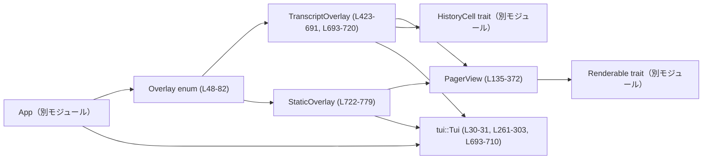
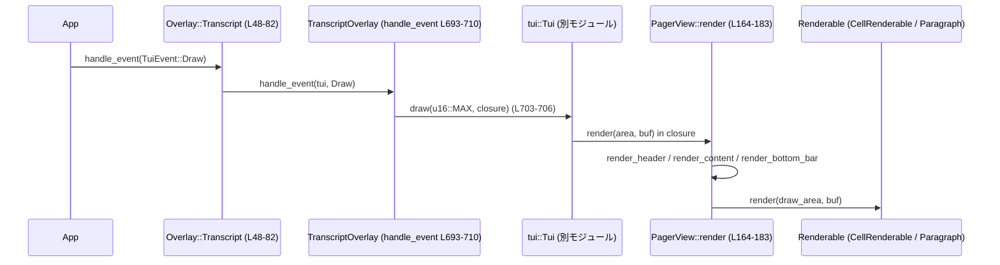
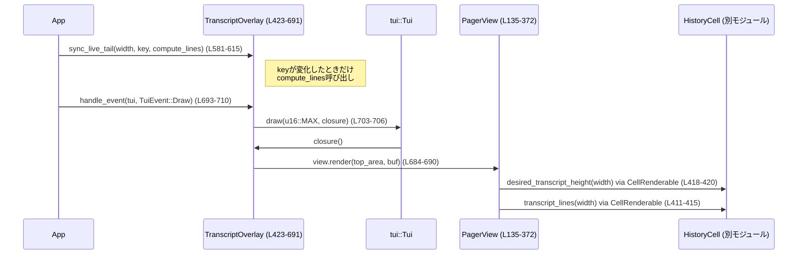

tui/src/pager_overlay.rs

---

## 0. ざっくり一言

- TUI 上で別スクリーン（alternate screen）に表示する **ページャ型オーバーレイ UI**（スクロール可能なトランスクリプト／静的テキスト）を実装するモジュールです（`Overlay`, `TranscriptOverlay`, `StaticOverlay`）。  
- スクロール位置管理・ページング・キーハンドリング・ライブテイル（進行中セルの末尾）のキャッシュなどをまとめて扱います。

> 注: 行番号はこの回答内で 1 から採番したものです。フォーマットは `pager_overlay.rs:L開始-L終了` です。

---

## 1. このモジュールの役割

### 1.1 概要

- このモジュールは **TUI で使うオーバーレイ画面**を提供し、次の 2 種類を扱います。
  - 進行中のチャット履歴を全画面で表示する **トランスクリプトオーバーレイ**（`Ctrl+T`）（`TranscriptOverlay`, `Overlay::Transcript`）。  
  - ヘルプなどの固定テキストを表示する **静的オーバーレイ**（`StaticOverlay`, `Overlay::Static`）。
- トランスクリプトオーバーレイでは、コミット済み履歴 (`HistoryCell`) と、アクティブセル由来の **ライブテイル**を組み合わせて表示し、ライブテイルは専用のキー (`LiveTailKey`, `ActiveCellTranscriptKey`) に基づいてキャッシュされます（`TranscriptOverlay::sync_live_tail`、`pager_overlay.rs:L569-L615`）。

### 1.2 アーキテクチャ内での位置づけ

主な依存関係と役割を簡易図にまとめます。



典型的な描画フロー（トランスクリプトオーバーレイ）のデータ／コールフローは次のようになります。



### 1.3 設計上のポイント

- **責務分割**
  - `Overlay` enum が「どのオーバーレイか」とその切り替えを一元管理（`new_*`, `handle_event`, `is_done`）（L48-81）。
  - `TranscriptOverlay` / `StaticOverlay` はそれぞれのオーバーレイ用の状態と描画ロジックを管理（L423-720, L722-779）。
  - `PagerView` が「任意の `Renderable` のリストをページング表示する汎用レイアウトエンジン」（L135-372）。
- **パフォーマンス**
  - `CachedRenderable` が `desired_height(width)` の結果を幅ごとにキャッシュし、折り返し計算のコストを削減（L374-403）。
  - ライブテイルも `LiveTailKey` / `ActiveCellTranscriptKey` によるキーでキャッシュし、キーが変わったときだけ再計算（L569-615）。
- **スクロールの表現**
  - `scroll_offset: usize` を「コンテンツ先頭からのオフセット」として使用し、`usize::MAX` を「常に末尾に追従する」ためのセンチネル値として扱う（`PagerView::is_scrolled_to_bottom`, L328-346）。
- **エラーハンドリング**
  - 外部 I/O を行う部分（`tui::Tui::draw`）は `std::io::Result<()>` を返し、`?` で上位に伝播（L693-710, L757-772）。
  - キーイベントなど未対応のものは `Ok(())` で無視（`PagerView::handle_key_event`, L261-303）。
- **安全性 / 並行性**
  - UI 状態構造体 (`PagerView`, `TranscriptOverlay`, `StaticOverlay`) は `std::cell::Cell` を内部で使うため `!Sync` になり、**シングルスレッド UI スレッドでの利用を前提**とした設計です（L374-403）。
  - 履歴セルは `Arc<dyn HistoryCell>` で共有しますが、このモジュール内では UI スレッドからのみ読み出しを行っています（L21-23, L423-435, L519-547）。

---

## 2. 主要な機能一覧

- トランスクリプト用オーバーレイの生成と管理
  - `Overlay::new_transcript` / `TranscriptOverlay::new`（L53-56, L452-469）
- 静的テキストオーバーレイの生成
  - `Overlay::new_static_with_lines`, `Overlay::new_static_with_renderables`, `StaticOverlay::with_title`, `StaticOverlay::with_renderables`（L58-67, L727-738）
- オーバーレイ共通のイベント処理
  - `Overlay::handle_event`, `Overlay::is_done`（L69-81）
  - `TranscriptOverlay::handle_event`, `StaticOverlay::handle_event`（L693-710, L757-772）
- ページング／スクロール UI
  - `PagerView` によるコンテンツのスクロール・ページング・ボトム追従（L135-372）
  - キー操作（`↑/↓/PgUp/PgDn/Home/End/Ctrl+U/Ctrl+D`）によるスクロール（`PagerView::handle_key_event`, L261-303）
- 履歴セルのレンダリング
  - `CellRenderable` + `HistoryCell::transcript_lines` / `desired_transcript_height` を使った描画（L405-421）
  - ユーザーセルのハイライトとインデント（`TranscriptOverlay::render_cells`, L471-507）
- ライブテイルのキャッシュと同期
  - `TranscriptOverlay::sync_live_tail` によるキー付きキャッシュ更新（L569-615）
- 下部ヘルプバー・スクロール率の描画
  - `render_key_hints`, `PagerView::render_bottom_bar`, `TranscriptOverlay::render_hints`, `StaticOverlay::render_hints`（L113-132, L229-259, L668-682, L740-746）

---

## 2.1 コンポーネント一覧（インベントリー）

### 型（構造体・列挙体など）

| 名前 | 種別 | 概要 | 行範囲 |
|------|------|------|--------|
| `Overlay` | enum | トランスクリプト／静的オーバーレイのラッパー。共通の生成・イベント処理を提供。 | `pager_overlay.rs:L48-L81` |
| `PagerView` | struct | 任意の `Renderable` リストを縦スクロール／ページング表示するコアビュー。 | `L135-L372` |
| `CachedRenderable` | struct | 内部の `Renderable` の高さ (`desired_height`) を幅ごとにキャッシュするラッパー。 | `L374-L403` |
| `CellRenderable` | struct | 1 つの `HistoryCell` をトランスクリプトとして描画する `Renderable` 実装。 | `L405-L421` |
| `TranscriptOverlay` | struct | トランスクリプト用オーバーレイの状態と描画・イベントロジック。 | `L423-L435, L452-L691, L693-L720` |
| `LiveTailKey` | struct | ライブテイルのキャッシュキー。幅・リビジョン・ストリーム継続フラグ・アニメーション tick を含む。 | `L441-L449` |
| `StaticOverlay` | struct | 静的テキストのページャオーバーレイ。 | `L722-L739, L748-L779` |

### 主な関数（非テスト）

| 関数名 | 概要 | 行範囲 |
|--------|------|--------|
| `render_key_hints` | キーバインドと説明のペアから 1 行のヒント行を描画。 | `L113-L132` |
| `PagerView::new` | ページャビューを初期化。 | `L145-L155` |
| `PagerView::render` | ヘッダ・コンテンツ・フッタを描画し、スクロール位置を調整。 | `L164-L183` |
| `PagerView::render_content` | `renderables` をスクロールオフセットに従って描画。 | `L193-L227` |
| `PagerView::render_bottom_bar` | 下部に境界線とスクロール率（%）を描画。 | `L229-L259` |
| `PagerView::handle_key_event` | ページング／スクロール系キーイベント処理。 | `L261-L303` |
| `PagerView::is_scrolled_to_bottom` | ビューが末尾に追従しているかを判定。 | `L328-L346` |
| `PagerView::ensure_chunk_visible` | 指定インデックスのチャンクが表示領域に入るようスクロール位置を調整。 | `L353-L371` |
| `CachedRenderable::new` | キャッシュラッパーの生成。 | `L381-L388` |
| `CachedRenderable::desired_height` | 高さ＋幅キャッシュ付きで `desired_height` を提供。 | `L395-L402` |
| `TranscriptOverlay::new` | コミット済みセルからトランスクリプトオーバーレイを作成。 | `L452-L469` |
| `TranscriptOverlay::render_cells` | `HistoryCell` 群を `Renderable` 群へ変換（インデント・ハイライトを付与）。 | `L471-L507` |
| `TranscriptOverlay::insert_cell` | コミット済みセルを追加しつつライブテイル・スクロール状態を維持。 | `L519-L547` |
| `TranscriptOverlay::replace_cells` | コミット済みセルを丸ごと置換し、ライブテイルを維持。 | `L554-L567` |
| `TranscriptOverlay::sync_live_tail` | ライブテイルのキー比較と必要時の再構築。 | `L569-L615` |
| `TranscriptOverlay::set_highlight_cell` | 強調表示セルの変更と自動スクロール。 | `L617-L623` |
| `TranscriptOverlay::render` | 上部に transcript、下部にヒントを描画。 | `L684-L690` |
| `TranscriptOverlay::handle_event` | キー／描画イベント処理。 | `L693-L710` |
| `StaticOverlay::with_title` | 行＋タイトルから静的オーバーレイを生成。 | `L727-L731` |
| `StaticOverlay::with_renderables` | 任意の `Renderable` 群＋タイトルから静的オーバーレイを生成。 | `L733-L738` |
| `StaticOverlay::render` | コンテンツ＋ヒント描画。 | `L748-L754` |
| `StaticOverlay::handle_event` | キー／描画イベント処理。 | `L757-L772` |
| `render_offset_content` | 部分的にスクロールされた 1 チャンクをオフスクリーンバッファに描画してから領域にコピー。 | `L781-L805` |

テスト用関数・構造体（`mod tests` 内, L808-L1305）は後述の「テスト」でまとめます。

---

## 3. 公開 API と詳細解説

### 3.1 型一覧（公開 API）

外部モジュールから主に利用される型は以下です（`pub(crate)` なので crate 内公開）。

| 名前 | 種別 | 役割 / 用途 | 行範囲 |
|------|------|-------------|--------|
| `Overlay` | enum | アプリケーション側から扱う「現在表示中のオーバーレイ」のラッパー。`Transcript`/`Static` をまとめて操作。 | `L48-L81` |
| `TranscriptOverlay` | struct | トランスクリプトオーバーレイの状態（履歴セル、ライブテイル、ハイライト）と描画・イベント処理。 | `L423-L435, L452-L691, L693-L720` |
| `StaticOverlay` | struct | 単純なテキストページャオーバーレイ（ヘルプ・説明表示など）。 | `L722-L739, L748-L779` |

`PagerView` や `CachedRenderable` はモジュール内部で完結した実装用コンポーネントです（外部から直接使う前提ではありません）。

---

### 3.2 関数詳細（7件）

#### 1. `Overlay::handle_event(&mut self, tui: &mut tui::Tui, event: TuiEvent) -> Result<()>`

**概要**  
現在のオーバーレイの種類に応じて、`TranscriptOverlay` または `StaticOverlay` の `handle_event` にイベントを委譲します（`pager_overlay.rs:L69-L74`）。

**引数**

| 引数名 | 型 | 説明 |
|--------|----|------|
| `tui` | `&mut tui::Tui` | TUI の描画・イベント制御オブジェクト（別モジュール）。 |
| `event` | `TuiEvent` | キーイベント / 描画トリガなどのイベント列挙体。 |

**戻り値**

- `std::io::Result<()>`  
  - 内部で `tui.draw(...)` を呼び出すため、描画中に発生した I/O エラーが `Err` として返ります。

**内部処理の流れ**

1. `match self` で `Overlay::Transcript(o)` または `Overlay::Static(o)` を判別（L70-72）。
2. 対応するオーバーレイの `handle_event(tui, event)` を呼び出す。
3. その結果（`Result<()>`）をそのまま返す。

**Examples（使用例）**

```rust
// 現在のオーバーレイを保持しているとする
let mut overlay = Overlay::new_transcript(history_cells);  // L53-L56 相当

// アプリケーションのイベントループ内で
fn handle_app_event(tui: &mut crate::tui::Tui, overlay: &mut Overlay, event: crate::tui::TuiEvent) -> std::io::Result<()> {
    overlay.handle_event(tui, event)?;
    if overlay.is_done() {  // L76-L81
        // オーバーレイ終了処理へ
    }
    Ok(())
}
```

**Errors / Panics**

- `TranscriptOverlay::handle_event` / `StaticOverlay::handle_event` 内で `tui.draw(...)` が `Err` を返した場合、そのまま `Err` が返ります（L703-706, L768-771）。
- パニックを起こすコードはこの関数内にはありません。

**Edge cases**

- `event` が `TuiEvent::Key` や `TuiEvent::Draw` 以外であっても、下位オーバーレイ側で `_ => Ok(())` として扱われるため、無視されます（L709-710, L773-774）。

**使用上の注意点**

- `Overlay` の利用者は `handle_event` を常に経由し、内部の `TranscriptOverlay` / `StaticOverlay` に直接アクセスしない前提の設計になっています。
- `is_done()` を併用して、オーバーレイを閉じるタイミングをアプリケーション側で管理します（L76-L81）。

---

#### 2. `PagerView::render(&mut self, area: Rect, buf: &mut Buffer)`

**概要**  
ページャビュー全体（ヘッダ／コンテンツ／ボトムバー）を描画し、直近のコンテンツ高さ・スクロールオフセットを更新します（`L164-L183`）。

**引数**

| 引数名 | 型 | 説明 |
|--------|----|------|
| `area` | `Rect` | このページャが描画される矩形領域（ヘッダ・フッタを含む）。 |
| `buf` | `&mut Buffer` | Ratatui の描画バッファ。 |

**戻り値**

- なし（副作用で `buf` を更新し、内部状態 `scroll_offset`, `last_content_height`, `last_rendered_height` を更新）。

**内部処理の流れ**

1. `Clear.render(area, buf)` で描画領域をクリア（L165）。
2. `render_header(area, buf)` で上部ヘッダを描画（区切り線＋タイトル）（L166, L185-L191）。
3. コンテンツ用領域 `content_area = self.content_area(area)` を計算（ヘッダ・ボトムバーを除外）（L167, L319-L324）。
4. `self.update_last_content_height(content_area.height)` で最後に描画したコンテンツ高さを記録（L168, L315-L317）。
5. `content_height = self.content_height(content_area.width)` で全 renderable の高さ合計を計算し、`last_rendered_height` を更新（L169-170）。
6. `pending_scroll_chunk` が設定されていれば `ensure_chunk_visible` を呼んで、該当チャンクが画面に入るようオフセット調整（L171-L175, L353-L371）。
7. `scroll_offset` を `min(scroll_offset, content_height - content_area.height)` でクランプし、末尾より先へ進まないようにする（L176-178）。
8. `render_content(content_area, buf)` でコンテンツ部分を描画（L180, L193-L227）。
9. `render_bottom_bar(area, content_area, buf, content_height)` で下部区切り線とスクロール率を描画（L182, L229-L259）。

**Examples（使用例）**

外部から `PagerView` を直接使う想定はありませんが、`TranscriptOverlay::render` 内での使用例は次の通りです（L684-L690）。

```rust
pub(crate) fn render(&mut self, area: Rect, buf: &mut Buffer) {
    let top_h = area.height.saturating_sub(3);                      // 上部にコンテンツ領域
    let top = Rect::new(area.x, area.y, area.width, top_h);
    let bottom = Rect::new(area.x, area.y + top_h, area.width, 3);  // 下部にヒント領域
    self.view.render(top, buf);                                     // PagerView を呼び出し
    self.render_hints(bottom, buf);                                 // フッタヒントを描画
}
```

**Errors / Panics**

- この関数自体は `Result` を返さず、`unwrap` なども使用していないため、通常パニックしません。
- 内部で利用する `renderable.render(...)` がパニックする可能性は、その実装次第ですが、このモジュールからは分かりません。

**Edge cases**

- `content_area.height == 0` の場合、`render_content` 内での描画はほぼスキップされ、`render_bottom_bar` で境界線とパーセントのみが描かれます。
- `renderables` が空の場合、`content_height == 0` となり、`render_bottom_bar` のパーセントは常に `100%` になります（L242-L247）。

**使用上の注意点**

- `render` は `last_content_height` / `last_rendered_height` を更新するため、ページングロジックを正しく機能させるには **少なくとも 1 回は描画を行っておく** 必要があります（テスト `transcript_overlay_paging_is_continuous_and_round_trips` でも、最初に `render` を呼んで `page_height` を初期化しています; L1145-L1149）。
- `scroll_offset` に特別な値 `usize::MAX` を入れると「末尾追従扱い」になりますが、このクランプ処理で実際の最大スクロール値に丸められます（L176-L178, L328-L346）。

---

#### 3. `PagerView::handle_key_event(&mut self, tui: &mut tui::Tui, key_event: KeyEvent) -> Result<()>`

**概要**  
ページャに対するキー操作（上下スクロール、ページング、先頭／末尾ジャンプなど）を処理し、必要に応じて再描画をスケジュールします（`L261-L303`）。

**引数**

| 引数名 | 型 | 説明 |
|--------|----|------|
| `tui` | `&mut tui::Tui` | 再描画のスケジュールに使用。 |
| `key_event` | `KeyEvent` | `crossterm` のキーイベント。 |

**戻り値**

- `std::io::Result<()>`  
  - 現在の実装では `tui.frame_requester().schedule_frame_in(...)` は `Result` を返さないため、常に `Ok(())` になりますが、将来の API 変更に備えて `Result` 型になっている可能性があります。

**内部処理の流れ（キーごとの挙動）**

1. `KEY_UP` / `k`: `scroll_offset` を 1 行分減らす（上にスクロール）（L263-L265）。
2. `KEY_DOWN` / `j`: `scroll_offset` を 1 行分増やす（下にスクロール）（L266-L268）。
3. `PageUp` / `Shift+Space` / `Ctrl+B`: 1 ページ分上にスクロール（L269-L275）。
4. `PageDown` / `Space` / `Ctrl+F`: 1 ページ分下にスクロール（L276-L279）。
5. `Ctrl+D`: 半ページ分下にスクロール（L280-L284）。
6. `Ctrl+U`: 半ページ分上にスクロール（L285-L289）。
7. `Home`: `scroll_offset = 0`（先頭へ）（L290-L292）。
8. `End`: `scroll_offset = usize::MAX`（末尾追従モードにする）（L293-L295）。
9. どれにも該当しないキーは `Ok(())` で無視（L296-L299）。
10. いずれかのキーでスクロールした場合、`tui.frame_requester().schedule_frame_in(TARGET_FRAME_INTERVAL)` で近い将来のフレーム描画をスケジュール（L300-L301）。

**Examples（使用例）**

`TranscriptOverlay::handle_event` からの利用例（L693-L702）:

```rust
match event {
    TuiEvent::Key(key_event) => match key_event {
        e if KEY_Q.is_press(e) || KEY_CTRL_C.is_press(e) || KEY_CTRL_T.is_press(e) => {
            self.is_done = true;
            Ok(())
        }
        other => self.view.handle_key_event(tui, other), // ← ここで委譲
    },
    // ...
}
```

**Errors / Panics**

- この関数自体は `schedule_frame_in` を呼ぶだけで、`?` などでエラー伝播は行っていません。現行コード上は常に `Ok(())` が返る実装です。

**Edge cases**

- `scroll_offset` の増減には `saturating_add` / `saturating_sub` を使用しており、`usize` のオーバーフローは起こりません（L264, L267, L274, L278, L283, L288）。
- ページ高さは `page_height(viewport_area)` に依存し、`last_content_height` が未設定の場合は `content_area(viewport_area).height`（実際の描画領域）を使います（L310-L313）。

**使用上の注意点**

- ページングの挙動は、**直近の描画結果に基づく高さ** を使う設計です。描画前に `handle_key_event` を呼んだ場合、初回だけは viewport の高さベースでスクロールします（L310-L313）。
- 末尾にピン留めしたい場合（追従表示）は、`End` キーか、`scroll_offset = usize::MAX` をセットする必要があります（L293-L295, L328-L346）。

---

#### 4. `TranscriptOverlay::insert_cell(&mut self, cell: Arc<dyn HistoryCell>)`

**概要**  
コミット済みの新しい履歴セルを transcript に追加し、その際の **ライブテイルの保持** と **スクロール位置の維持** を行います（`L519-L547`）。

**引数**

| 引数名 | 型 | 説明 |
|--------|----|------|
| `cell` | `Arc<dyn HistoryCell>` | コミット済みの履歴セル（アクティブセルではないことが前提）。 |

**戻り値**

- なし（内部状態 `cells`, `view.renderables`, `view.scroll_offset` を更新）。

**内部処理の流れ**

1. 現在ビューがボトムに追従しているかを `follow_bottom = self.view.is_scrolled_to_bottom()` で記録（L520）。
2. 既にコミット済みセルが存在していたかを `had_prior_cells = !self.cells.is_empty()` で保存（L521）。
3. 現在のライブテイル `tail_renderable` を `take_live_tail_renderable()` で取り外し保持（L522, L646-L648）。
4. 新セルを `self.cells.push(cell)` でコミット済みリストに追加（L523）。
5. `self.view.renderables = Self::render_cells(&self.cells, self.highlight_cell)` によりコミット済みセルの描画リストを再構築（L524）。
6. ライブテイルが存在した場合：
   - 以前はコミット済みセルがなく（`!had_prior_cells`）、かつライブテイルがストリーム継続扱いではなかった場合は、今度はコミット済みセルの後ろに来るため、トップに 1 行のインセット（空行）を付ける（L525-L539）。
   - そうでなければそのまま再利用。
   - そして `.push(tail)` で `renderables` の最後に再追加（L542）。
7. 挿入前にボトム追従していた場合は `scroll_offset = usize::MAX` にリセットし、次回描画でボトムにピン留めされるようにする（L544-L546）。

**Examples（使用例）**

```rust
// overlay が既に表示され、末尾に追従している状態で新セルを追加したい場合
overlay.insert_cell(Arc::new(new_history_cell));
```

このとき、テスト `transcript_overlay_keeps_scroll_pinned_at_bottom` では、挿入後も `view.scroll_offset == usize::MAX` のままであることが検証されています（L1043-L1067）。

**Errors / Panics**

- この関数は `Result` を返さず、パニックを起こすような操作（`unwrap` 等）も行っていません。
- `HistoryCell` 実装側がパニックする可能性はありますが、本関数内では `HistoryCell` のメソッドは直接呼び出していません（描画タイミングまで遅延）。

**Edge cases**

- ライブテイルのみが表示されている状態（最初のコミット前）で、最初のコミットセルを追加する場合：
  - ライブテイルにはインセットが付いていないため、「最初のコミットセルの後ろに来る」タイミングで新たにトップインセットを追加してレイアウトを揃えます（L526-L539）。
- 手動でスクロール位置を変えていた場合（ボトムにいない）は、`follow_bottom` が `false` になるため、挿入後もスクロール位置は維持されます（`transcript_overlay_preserves_manual_scroll_position` テスト、L1069-L1091）。

**使用上の注意点**

- `cell` は **コミット済みセル** である必要があります（doc コメントにも明記, L516-L518）。アクティブセル（進行中）自体は `sync_live_tail` 経由で別扱いです。
- `HistoryCell` 実装は `is_stream_continuation()` の意味に従っている必要があります。これを用いてセル間のインセットの有無が決まるためです（L495-L501）。

---

#### 5. `TranscriptOverlay::sync_live_tail(&mut self, width: u16, active_key: Option<ActiveCellTranscriptKey>, compute_lines: impl FnOnce(u16) -> Option<Vec<Line<'static>>>)`

**概要**  
アクティブセル由来のライブテイルを、指定されたキーと幅に基づいて同期します。キーが変化したときだけ `compute_lines` を呼び、ライブテイルを再構築します（`L569-L615`）。

**引数**

| 引数名 | 型 | 説明 |
|--------|----|------|
| `width` | `u16` | 現在の表示幅。折り返し計算や `desired_height` に影響します。 |
| `active_key` | `Option<ActiveCellTranscriptKey>` | アクティブセルの状態を表すキー（リビジョン・ストリーム継続フラグ・アニメーション tick）。`None` ならライブテイルなし。 |
| `compute_lines` | `FnOnce(u16) -> Option<Vec<Line<'static>>>` | 与えられた幅でアクティブセルの transcript 行を生成するコールバック。何も表示すべきものがなければ `None` を返す。 |

**戻り値**

- なし（内部状態 `view.renderables`, `live_tail_key`, `view.scroll_offset` を更新）。

**内部処理の流れ**

1. `active_key` から `LiveTailKey` を構築して `next_key` を作成（L587-L592）。
2. 既存の `self.live_tail_key` と `next_key` が等しければ何もせず return（L594-L596）。これにより、同じ状態での不要な再計算を防ぐ。
3. 現在のスクロールがボトム追従かどうかを `follow_bottom = self.view.is_scrolled_to_bottom()` で記録（L597）。
4. 既存のライブテイル `take_live_tail_renderable()` を削除し、`self.live_tail_key = next_key` に更新（L599-L600）。
5. `next_key` が `Some(key)` の場合：
   - `lines = compute_lines(width).unwrap_or_default()` を実行（L603）。
   - `lines` が空でなければ `Self::live_tail_renderable(lines, !self.cells.is_empty(), key.is_stream_continuation)` で `Renderable` に変換し、`view.renderables.push(...)` でコミット済みセルの後に追加（L604-L610）。
6. もともとボトム追従していた場合は、`scroll_offset = usize::MAX` に戻す（L612-L614）。

**Examples（使用例）**

テスト `transcript_overlay_renders_live_tail` からの利用例（L911-L924）:

```rust
overlay.sync_live_tail(
    /*width*/ 40,
    Some(ActiveCellTranscriptKey {
        revision: 1,
        is_stream_continuation: false,
        animation_tick: None,
    }),
    |_| Some(vec![Line::from("tail")]),
);
```

**Errors / Panics**

- `compute_lines` の呼び出しはこの関数内から直接行われますが、返り値 `Option<Vec<Line>>` を `unwrap_or_default()` しているため、`None` の場合でも問題ありません（L603）。
- パニックを起こしうる操作（`unwrap` など）はありません。

**Edge cases**

- `active_key == None` の場合：
  - `next_key` が `None` になり、既存のテイルがあれば削除されるだけで新規追加は行われません（L599-L611）。
- `compute_lines(width)` が `None` または空ベクタを返した場合：
  - ライブテイルは描画されません（L603-L605）。
- `active_key` が同じ値で連続して呼ばれた場合：
  - `self.live_tail_key == next_key` で return するため、`compute_lines` は呼ばれません（テスト `transcript_overlay_sync_live_tail_is_noop_for_identical_key` がこれを確認; L932-L955）。

**使用上の注意点**

- **契約条件**: `ActiveCellTranscriptKey` はアクティブセルの transcript 内容またはアニメーション表現が変化するたびに変わるように設計する必要があります。そうでないと、オーバーレイ側のライブテイルが更新されません（doc コメント L575-L581）。
- `compute_lines` は `FnOnce` なので、**1 回の呼び出しでのみ使用**されることが前提です（キーが同じなら呼ばれません）。

---

#### 6. `TranscriptOverlay::handle_event(&mut self, tui: &mut tui::Tui, event: TuiEvent) -> Result<()>`

**概要**  
トランスクリプトオーバーレイ向けのイベントを処理します。終了キー（`q` / `Ctrl+C` / `Ctrl+T`）の処理と、通常のキー／描画イベントの委譲を行います（`L693-L710`）。

**引数**

| 引数名 | 型 | 説明 |
|--------|----|------|
| `tui` | `&mut tui::Tui` | 描画に必要。 |
| `event` | `TuiEvent` | キー／描画イベント。 |

**戻り値**

- `std::io::Result<()>`  
  - 描画時の `tui.draw` のエラーを返します。

**内部処理の流れ**

1. `match event` でイベント種別を判別（L695）。
2. `TuiEvent::Key(key_event)` の場合:
   - `q` / `Ctrl+C` / `Ctrl+T` が押されたら `self.is_done = true` にし、`Ok(())` を返す（L697-L700）。
   - それ以外のキーは `self.view.handle_key_event(tui, other)` に委譲（L701-L702）。
3. `TuiEvent::Draw` の場合:
   - `tui.draw(u16::MAX, |frame| { self.render(frame.area(), frame.buffer); })?` を呼び、現在のオーバーレイを描画（L703-L706）。
4. その他のイベントは `Ok(())` で無視（L709-L710）。

**Examples（使用例）**

```rust
// App のイベントループ（イメージ）
loop {
    let event = next_tui_event();
    transcript_overlay.handle_event(&mut tui, event)?;

    if transcript_overlay.is_done() {
        break; // オーバーレイ終了
    }
}
```

**Errors / Panics**

- `tui.draw` が `Err(e)` を返した場合、この関数も `Err(e)` を返します（L703-L707）。
- その他はパニックを起こしません。

**Edge cases**

- 終了キーを押した後も、`is_done()` をアプリケーション側で確認するまでは、この関数は呼び続けられる可能性があります。その場合、さらにキーイベントが来ても即座に戻るだけです。

**使用上の注意点**

- 終了キーのセットはここで行われるため、**アプリ側は `Overlay::is_done()` を見てオーバーレイを閉じる**必要があります（L76-L81）。
- 描画は `TuiEvent::Draw` でのみ行われるため、CPU 使用量を抑えるためにアプリは `Draw` イベントの発行タイミングを制御します（`tui.frame_requester().schedule_frame_in(...)` は `PagerView::handle_key_event` 内で呼ばれます; L300-L301）。

---

#### 7. `render_offset_content(area: Rect, buf: &mut Buffer, renderable: &dyn Renderable, scroll_offset: u16) -> u16`

**概要**  
1 つの `Renderable` がビューの上端をまたいで表示される場合に、**部分だけ切り出して描画**するためのヘルパー関数です（`L781-L805`）。

**引数**

| 引数名 | 型 | 説明 |
|--------|----|------|
| `area` | `Rect` | 描画先の矩形領域。 |
| `buf` | `&mut Buffer` | 描画バッファ。 |
| `renderable` | `&dyn Renderable` | 行数が高いコンテンツ。 |
| `scroll_offset` | `u16` | この `renderable` の中で、何行分スクロールされているか。 |

**戻り値**

- `u16` : `area` に実際に描画された高さ（行数）。

**内部処理の流れ**

1. `height = renderable.desired_height(area.width)` でコンテンツの総高さを取得（L787）。
2. オフスクリーン描画用のバッファ `tall_buf` を、`height.min(area.height + scroll_offset)` 行分で作成（L788-L793）。
3. `renderable.render(*tall_buf.area(), &mut tall_buf)` で全体（または必要な高さ）をオフスクリーンに描画（L794）。
4. `copy_height = min(area.height, tall_buf.height - scroll_offset)` を計算（L795-L797）。
5. `y` を `0..copy_height` で回し、`src_y = y + scroll_offset` の位置のセルを `buf` の対応位置にコピー（L798-L802）。
6. `copy_height` を返す（L805）。

**Examples（使用例）**

`PagerView::render_content` 内で、コンテンツ上端をまたいで表示するケースで使用されます（L193-L215）。

```rust
if top < 0 {
    let drawn = render_offset_content(area, buf, &**renderable, (-top) as u16);
    drawn_bottom = drawn_bottom.max(area.y + drawn);
}
```

**Errors / Panics**

- `scroll_offset` と `area.height` の和（`area.height + scroll_offset`）が `u16::MAX` を超えると、**デバッグビルドでは整数オーバーフローでパニック**する可能性があります（Rust のデフォルト挙動）。  
  - ただし、実際の TUI では `area.height` と `scroll_offset` は通常かなり小さい値（数百程度）であるため、現実的な運用では問題にならないと考えられます。
- それ以外に `unwrap` などは使用していません。

**Edge cases**

- `copy_height == 0` の場合、何も描画されずに 0 が返ります。これは、`renderable` がほぼ画面上方にスクロールアウトしている場合に発生します。
- `scroll_offset` が `height` 以上にならないよう上位ロジックで制御されている前提ですが、`saturating_sub` を使っているため、`copy_height` 計算時の負値は 0 にクランプされます（L795-L797）。

**使用上の注意点**

- これは低レベルなヘルパーであり、通常は `PagerView` 経由で利用する形になります。外部から直接呼ぶ必要は基本的にありません。
- `renderable.desired_height` と `renderable.render` の実装は、一貫した高さを返す必要があります。高さが実際とずれるとコピー範囲がずれる可能性があります。

---

### 3.3 その他の関数（補助）

| 関数名 | 役割（1行） | 行範囲 |
|--------|-------------|--------|
| `render_key_hints` | キーと説明のペアから 1 行のヘルプテキストを描画する。 | `L113-L132` |
| `PagerView::content_height` | 現在の幅で全 `renderables` の高さ合計を計算する。 | `L157-L162` |
| `PagerView::render_header` | 上部の飾り線とタイトル文字列を描画する。 | `L185-L191` |
| `PagerView::update_last_content_height` | 最後に描画したコンテンツ領域の高さを記録する。 | `L315-L317` |
| `PagerView::content_area` | ヘッダ／フッタを除いた実際のコンテンツ領域を計算する。 | `L319-L324` |
| `PagerView::scroll_chunk_into_view` | 次回描画時に特定チャンクを視界内に入れるよう要求する。 | `L348-L351` |
| `TranscriptOverlay::render_hints` | トランスクリプトフッタのキー説明行を 2 行描画する。 | `L668-L682` |
| `StaticOverlay::render_hints` | 静的オーバーレイのフッタキー説明行を描画する。 | `L740-L746` |

テスト専用のヘルパー (`TestCell`, `paragraph_block`, `buffer_to_text`, `transcript_line_numbers` など) は `mod tests` 内に定義されています（`L830-L853, L957-L975, L1106-L1130`）。

---

## 4. データフロー（代表的シナリオ）

### シナリオ: トランスクリプトオーバーレイでライブテイル付きの描画

1. `App` はメインループ内で `Overlay` を持ち、イベントを `Overlay::handle_event` に渡す（L69-L74）。
2. `TuiEvent::Draw` が来ると、`TranscriptOverlay::handle_event` が `tui.draw` を呼び、描画クロージャ内で `TranscriptOverlay::render` が呼ばれる（L703-L706, L684-L690）。
3. `TranscriptOverlay::render` は `PagerView::render` でコンテンツ部分を描いたあと、下部にキー説明を描画（L684-L690, L668-L682）。
4. その前に、`App` は `TuiEvent::Draw` のタイミングで `TranscriptOverlay::sync_live_tail` を呼び、`ActiveCellTranscriptKey` と `compute_lines` に基づいてライブテイルを必要に応じて更新しておく（L569-L615）。

これをシーケンス図で表します（行範囲をコメントで付記）。



---

## 5. 使い方（How to Use）

### 5.1 基本的な使用方法（トランスクリプトオーバーレイ）

以下は crate 内の疑似的な利用例です。`tui::Tui` や `TuiEvent` の詳細はこのファイルにはありませんが、構造は次のようになります。

```rust
use std::sync::Arc;
use crate::tui::{Tui, TuiEvent};
use crate::history_cell::HistoryCell;
use crate::chatwidget::ActiveCellTranscriptKey;
use crate::tui::TARGET_FRAME_INTERVAL;

// 初期化: コミット済み履歴セルを集める
let committed_cells: Vec<Arc<dyn HistoryCell>> = load_history_cells();
let mut overlay = Overlay::new_transcript(committed_cells); // L53-L56

// イベントループ（簡略化）
fn run_overlay(mut overlay: Overlay, tui: &mut Tui) -> std::io::Result<()> {
    loop {
        let event = next_tui_event();          // アプリ側のイベント取得
        overlay.handle_event(tui, event)?;     // L69-L74

        // 必要ならライブテイルを同期（Ctrl+T の transcript では App 側で呼ぶ契約）
        if let Overlay::Transcript(ref mut trans) = overlay {
            let key: Option<ActiveCellTranscriptKey> = current_active_cell_key();
            trans.sync_live_tail(
                tui.terminal.viewport_area.width,      // 現在の幅
                key,
                |width| compute_active_cell_lines(width),
            );
        }

        if overlay.is_done() {                 // L76-L81
            break;
        }
    }
    Ok(())
}
```

### 5.2 よくある使用パターン

1. **全履歴の閲覧（`Ctrl+T`）**
   - `App` が `Overlay::new_transcript(history_cells)` でオーバーレイに切り替え。
   - イベントループで `Overlay::handle_event` を呼び続け、`is_done` が `true` になるまで待つ。
   - ライブテイルは `sync_live_tail` を、描画ごとにアクティブセルのキーと共に呼び出して維持。

2. **静的ヘルプ画面表示**

```rust
use ratatui::text::Line;
use crate::tui::{Tui, TuiEvent};
use crate::pager_overlay::Overlay; // モジュールパスは仮

let lines = vec![
    Line::from("Help:"),
    Line::from("  q - quit"),
    Line::from("  ↑/↓ - scroll"),
];
let mut overlay = Overlay::new_static_with_lines(lines, "H E L P".to_string()); // L58-L60

// あとはトランスクリプトオーバーレイと同じように handle_event / is_done を使う
```

1. **セル編集ナビゲーション**

- `TranscriptOverlay::set_highlight_cell(Some(index))` を呼ぶと、該当セルがハイライトされ、`scroll_chunk_into_view` によってスクロール位置が自動調整されます（L617-L623, L348-L351）。
- フッタに「edit prev / edit next / edit message」のキー説明が表示されます（L668-L682）。

### 5.3 よくある間違い

```rust
// 間違い例: ActiveCellTranscriptKey が更新されない
transcript_overlay.sync_live_tail(
    width,
    Some(ActiveCellTranscriptKey {
        revision: 1,                         // ← 常に 1 のまま
        is_stream_continuation: false,
        animation_tick: None,
    }),
    compute_lines,
);
// アクティブセルが変化しても revision が変わらないため、
// overlay 上のライブテイルが更新されない。

// 正しい例: アクティブセルの内容やアニメーションが変化するたびにキーを変える
let key = ActiveCellTranscriptKey {
    revision: current_revision,             // アクティブセルの更新ごとにインクリメント
    is_stream_continuation,
    animation_tick: Some(animation_tick),   // アニメーション表示が必要な場合のみ
};
transcript_overlay.sync_live_tail(width, Some(key), compute_lines);
```

```rust
// 間違い例: PagerView を直接操作してスクロールを制御しようとする
// （外部モジュールからは PagerView は見えない前提）
overlay.view.scroll_offset = 0;  // ← tests モジュール内では OK だが外部利用は想定外

// 正しい例: ユーザーに Home/End/PageUp/PageDown キー操作をさせるか、
// App 側が仮想的にキーイベントを送る
overlay.handle_event(tui, TuiEvent::Key(home_key_event))?;
```

### 5.4 使用上の注意点（まとめ）

- **前提条件**
  - `HistoryCell::transcript_lines(width)` と `HistoryCell::desired_transcript_height(width)` は整合している必要があります（レイアウトが `_height` に依存するため; L410-L420）。
  - `ActiveCellTranscriptKey` は **内容やアニメーションの変化を一意に表す**キーであることが前提です（L569-L581）。
- **禁止／非推奨事項**
  - `PagerView`・`TranscriptOverlay` の内部フィールド (`view.renderables`, `cells` など) を外部から直接操作することは想定されていません。テストではモジュール内から操作していますが、通常コードからはしません。
- **パフォーマンス**
  - ライブテイルや `HistoryCell` の transcript 生成は、`sync_live_tail` のキャッシュ戦略に依存しています。キーを適切に変化させないと更新されませんが、逆に無駄に変化させると毎回全文を再計算することになります。
- **並行性**
  - `Cell` を内部で利用しているため、これらの型は `Sync` ではなく、**UI スレッドからシングルスレッドで使う**前提です。

---

## 6. 変更の仕方（How to Modify）

### 6.1 新しい機能を追加する場合

例: 新しい種類のオーバーレイを追加したい場合。

1. **新しいオーバーレイ構造体の追加**
   - `TranscriptOverlay` / `StaticOverlay` と同様の struct を定義し、`view: PagerView` と状態フィールドを持たせます（`L423-L435`, `L722-L725` を参考にする）。
2. **`Overlay` enum へのバリアント追加**
   - `Overlay` に `NewKind(NewOverlay)` のような variant を追加（`L48-L51`）。
   - `Overlay::new_*` 相当のコンストラクタを追加（`L53-L67` を参考）。
3. **`Overlay::handle_event` / `Overlay::is_done` の分岐追加**
   - `match self` に新しいパターンを追加し、新オーバーレイにイベントを委譲（`L69-L81`）。
4. **キー説明の追加**
   - 必要であれば `render_key_hints` 用の定数やペアを新規オーバーレイの `render_hints` に定義（`L668-L682, L740-L746` を参考）。

### 6.2 既存の機能を変更する場合

- **スクロールロジックの変更**
  - ページングやボトム判定ロジックは `PagerView` に集中しているため、`PagerView::handle_key_event`（L261-L303）と `PagerView::is_scrolled_to_bottom`（L328-L346）、`ensure_chunk_visible`（L353-L371）を主に読む必要があります。
  - 変更時は、関連テスト
    - `transcript_overlay_paging_is_continuous_and_round_trips`（L1132-L1198）
    - `pager_view_is_scrolled_to_bottom_accounts_for_wrapped_height`（L1281-L1304）
    などが通ることを確認する必要があります。
- **ライブテイル挙動の変更**
  - キャッシュキーや spacing の挙動は `LiveTailKey`（L441-L449）と `TranscriptOverlay::sync_live_tail`（L569-L615）および `live_tail_renderable`（L650-L666）にまとまっています。
  - ストリーム継続時のインセット有無を変える場合は `live_tail_renderable` の `has_prior_cells && !is_stream_continuation` 条件を見直します（L657-L664）。
- **契約の確認ポイント**
  - `view.renderables` の不変条件: 「コミット済みセルの renderables 群 + Optional ライブテイル 1 個」（doc コメント L425-L427, L641-L647）。
  - `take_live_tail_renderable` は「ライブテイルがあるときは `renderables.len() > cells.len()` で最後の要素がテイル」という前提を置いています（L646-L648）。この前提が崩れるような変更は避ける必要があります。

---

## 7. 関連ファイル

| パス | 役割 / 関係 |
|------|------------|
| `crate::history_cell` | `HistoryCell`, `UserHistoryCell`, `new_patch_event`, `new_approval_decision_cell` などの定義。トランスクリプト表示の元データ型を提供（L21-23, L821-L823, L982-L1008）。 |
| `crate::chatwidget` | `ActiveCellTranscriptKey` の定義と生成ロジック。アクティブセルのライブテイルキーを作る（L21, L913-L923）。 |
| `crate::tui` | `tui::Tui`, `TuiEvent`, `TARGET_FRAME_INTERVAL` などの TUI ランタイムとイベント定義。オーバーレイはここを介して描画される（L30-31, L261-L303, L693-L710）。 |
| `crate::render::renderable` | `Renderable`, `InsetRenderable` などの描画対象インターフェースとそのラッパー（L27-28, L496-L501, L658-L663）。 |
| `crate::style` | `user_message_style` により、ユーザーセルのスタイル（色・反転など）を提供（L29, L480-L487）。 |
| `crate::exec_cell` | テストで利用されている実行セル型と `CommandOutput` 構造体。`HistoryCell` の一種として transcript に現れます（L820, L1010-L1027）。 |
| 外部クレート `ratatui`, `crossterm` | TUI のレイアウトやバッファ (`Rect`, `Buffer`, `Paragraph` など) とキーイベント (`KeyEvent`, `KeyCode`) を提供（L32-L46, L781-L805）。 |

---

## テストの概要（補足）

`mod tests`（L808-L1305）では以下を検証しています。

- フッタのヒント文字列（`edit prev` / `edit next`）が期待通り表示される（L854-L889）。
- トランスクリプトオーバーレイ／静的オーバーレイのスナップショット描画（`insta::assert_snapshot`）でレイアウトの安定性を確認（L891-L909, L1093-L1104, L1200-L1210）。
- ライブテイル同期のキャッシュ動作（同じキーで `compute_lines` が 1 回だけ呼ばれる）（L932-L955）。
- パッチ適用シナリオでのページクリア確認（L977-L1040）。
- スクロール位置がボトムに pin される／手動スクロール時は維持される（L1042-L1067, L1069-L1091）。
- ページングが連続かつ PageDown+PageUp でラウンドトリップすること（L1132-L1198）。
- `PagerView` の `content_height`、`ensure_chunk_visible`、`is_scrolled_to_bottom` の挙動（L1212-L1304）。

これらのテストにより、主な契約（スクロール／ページング／ライブテイルキャッシュ）の振る舞いが回帰テストされています。

---

## Bugs / Security に関する観察（このチャンクから言える範囲）

- **整数オーバーフローの可能性（デバッグビルド）**  
  `render_offset_content` で `area.height + scroll_offset` を計算しており、両方が非常に大きい場合には `u16` の加算がオーバーフローし、デバッグビルドでパニックする可能性があります（`L788-L793`）。  
  ただし、TUI の画面サイズやスクロールオフセットの現実的な値を考えると、通常の運用条件では発生しにくいと考えられます。

- **安全性 / メモリの観点**  
  - `CachedRenderable` は `std::cell::Cell` を使いますが、これはスレッド間共有を行わない UI スレッド内で使う限り、データ競合は発生しません（L374-L403）。
  - `Arc<dyn HistoryCell>` は読み取り専用でしか使われておらず、このモジュール内ではミュータブルな同時アクセスは行っていません（L423-L435, L519-L547）。

このチャンクからは、それ以上のセキュリティ上の問題（入力検証欠如、任意コード実行など）は読み取れません。
