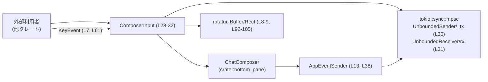
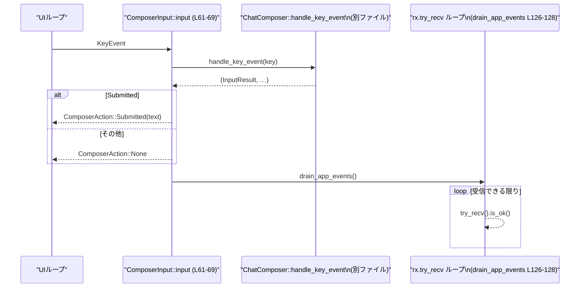
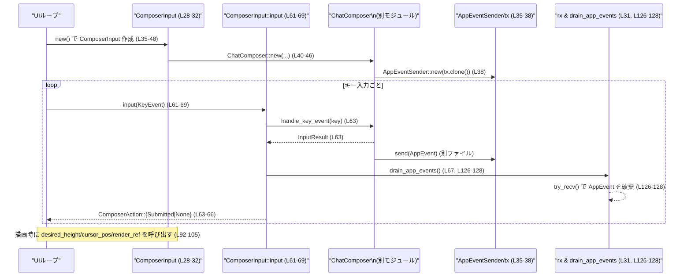

# tui/src/public_widgets/composer_input.rs

## 0. ざっくり一言

`ChatComposer` を外部クレートから安全かつ簡単に再利用するための、**最小限のテキスト入力用ラッパー**です（composer_input.rs:L1-5, L26-27）。  
Enter で送信・Shift+Enter で改行・ペーストバースト処理など、内部コンポーザの振る舞いをそのまま公開します（composer_input.rs:L39-45, L112-124）。

---

## 1. このモジュールの役割

### 1.1 概要

- このモジュールは内部の `ChatComposer` をラップし、**他クレートが依存しやすい簡素な公開 API** を提供するために存在します（composer_input.rs:L1-5, L26-32）。
- 主な機能は以下です:
  - マルチライン入力と Enter での送信／Shift+Enter で改行（composer_input.rs:L39-45）。
  - ペーストとペーストバースト（連続ペースト）処理の委譲（composer_input.rs:L71-75, L107-118）。
  - TUI 描画 (`ratatui::buffer::Buffer` / `Rect`) とカーソル位置計算の委譲（composer_input.rs:L92-105）。
  - 内部で発生する `AppEvent` を tokio の MPSC チャネルで受け取りつつ、このラッパーでは破棄する設計（composer_input.rs:L12-16, L28-32, L35-48, L126-128）。

### 1.2 アーキテクチャ内での位置づけ

このファイルは内部コンポーネント `ChatComposer` とアプリ全体のイベント／描画インフラの間に位置する「公開向けフェイス」になっています。

- 依存関係（このチャンクに現れる範囲）:
  - 入力イベント: `crossterm::event::KeyEvent`（composer_input.rs:L7, L61）。
  - 描画: `ratatui::buffer::Buffer`, `ratatui::layout::Rect`（composer_input.rs:L8-9, L92-105）。
  - 時間: `std::time::Duration`（composer_input.rs:L10, L120-124）。
  - アプリイベント系: `AppEvent`, `AppEventSender`（composer_input.rs:L12-13, L35-48）。
  - 内部コンポーザ: `ChatComposer`, `InputResult`（composer_input.rs:L14-15, L28-32, L61-66, L107-118, L120-124）。
  - 内部では `Renderabl e` トレイトがインポートされていますが、このファイル内では直接は使用していません（composer_input.rs:L16）。



### 1.3 設計上のポイント（コードから読み取れる範囲）

- **責務分割**
  - 入力の意味づけ（送信かどうか）、ペーストバースト制御、描画・カーソル位置計算といったロジックはすべて `ChatComposer` に委譲し、このラッパは API 整形とイベント排水に専念しています（composer_input.rs:L28-32, L35-48, L50-53, L55-59, L61-69, L71-75, L77-90, L92-110, L112-118, L120-124）。
- **状態管理**
  - 内部状態として `ChatComposer` と tokio の MPSC 送受信端 ( `_tx`, `rx` ) を保持します（composer_input.rs:L28-32）。
  - 送信用 `_tx` はフィールド名に `_` が付いていますが、所有していることでチャネルを閉じさせない効果があります（`UnboundedSender` はすべての Sender が Drop されるとチャネルが閉じるため）。
- **エラーハンドリング**
  - 本ラッパーの公開メソッド自身は `Result` を返さず、すべて委譲先の戻り値を単純にラップしています（composer_input.rs:L50-53, L55-59, L61-69, L71-75, L92-100, L102-110, L112-118, L120-124）。
  - ドキュメントコメントに明示的な panic 条件は記載されていません。
- **並行性**
  - `tokio::sync::mpsc::unbounded_channel` により、`ChatComposer` などから送られる `AppEvent` を `rx.try_recv()` で非ブロッキングにすべて捨てる設計になっています（composer_input.rs:L35-38, L28-32, L126-128）。
  - 本モジュール内には `async fn` や `spawn` などの非同期実行は存在せず、同期 API として振る舞います。
- **公開 API の最小化**
  - `ChatComposer` の多くの機能のうち、再利用に必要なものだけを `ComposerInput` として公開しています（例: `is_empty`, `input`, `handle_paste`, `desired_height`, `cursor_pos`, `render_ref` など; composer_input.rs:L50-53, L61-69, L71-75, L92-100, L102-105）。

---

## 2. 主要な機能一覧

このモジュールが提供する主な機能を列挙します（すべて `ComposerInput` のメソッドとして公開、または `ComposerAction` として利用されます）。

- テキスト入力の保持・編集・クリア  
  - `is_empty`, `clear` により、現在の入力が空かどうかの判定と、内容のクリアを行います（composer_input.rs:L50-53, L55-59）。
- キー入力処理と送信判定  
  - `input(KeyEvent) -> ComposerAction` によって、キーイベントを `ChatComposer` に渡し、送信されたかどうかを高レベルな `ComposerAction` で返します（composer_input.rs:L18-24, L61-69）。
- クリップボードペーストとペーストバースト処理  
  - `handle_paste`, `is_in_paste_burst`, `flush_paste_burst_if_due`, `recommended_flush_delay` により、連続ペースト時のマイクロフラッシュ制御を行います（composer_input.rs:L71-75, L107-118, L120-124）。
- ヒント表示のカスタマイズ  
  - `set_hint_items`, `clear_hint_items` により、コンポーザ下部に表示されるフッターヒントを任意のキー表示＋ラベルに置き換えできます（composer_input.rs:L77-90）。
- 描画・カーソル位置関連  
  - `desired_height`, `cursor_pos`, `render_ref` により、レイアウト計算と実際の描画、カーソル位置計算を `ChatComposer` に委譲します（composer_input.rs:L92-105）。
- 内部 AppEvent の排水  
  - `input`, `handle_paste`, `flush_paste_burst_if_due` から `drain_app_events` を呼び出すことで、`ChatComposer` が送信した `AppEvent` をすべて非ブロッキングに破棄します（composer_input.rs:L61-69, L71-75, L112-118, L126-128）。

---

## 3. 公開 API と詳細解説

### 3.1 型一覧（構造体・列挙体など）

| 名前 | 種別 | 役割 / 用途 | 定義位置 |
|------|------|-------------|----------|
| `ComposerAction` | 列挙体 (`enum`) | `input` の結果として「送信されたか／されていないか」を高レベルに表現します。送信された場合は入力テキストを含みます。 | `composer_input.rs:L18-24` |
| `ComposerInput` | 構造体 (`struct`) | 内部の `ChatComposer` をラップする公開向けテキスト入力コンポーネントです。キー入力処理・ペースト処理・描画などを提供します。 | `composer_input.rs:L28-32` |

#### `ComposerAction` のバリアント

- `Submitted(String)`  
  - ユーザが Enter などで現在のテキストを送信したときに返されます（composer_input.rs:L20-21, L63-65）。
- `None`  
  - 送信操作が発生しなかった場合に返されます（composer_input.rs:L22-23, L64-66）。  
  - ドキュメントコメントでは「UI は `needs_redraw()` が true を返した場合に再描画が必要になる」と言及していますが、このファイルには `needs_redraw` の定義はありません（composer_input.rs:L22-23）。

### 3.2 関数詳細（主要 7 件）

#### `ComposerInput::new() -> Self`  （コンストラクタ）

**概要**

`ChatComposer` と tokio の MPSC チャネルを内部に構築し、プレースホルダ `"Compose new task"` とともに、**入力フォーカスあり・Shift+Enter対応・ペーストバースト有効**なコンポーザを生成します（composer_input.rs:L35-48）。

**引数**

- なし。

**戻り値**

- `ComposerInput`  
  - 内部に `ChatComposer`, `UnboundedSender<AppEvent>`, `UnboundedReceiver<AppEvent>` を保持した新しいインスタンス（composer_input.rs:L28-32, L35-48）。

**内部処理の流れ**

1. `tokio::sync::mpsc::unbounded_channel()` で `tx`, `rx` を生成（composer_input.rs:L37）。
2. `tx.clone()` を `AppEventSender::new` に渡し、`sender` を生成（composer_input.rs:L38）。
3. `ChatComposer::new` を以下の引数で呼び出し、`inner` を構築（composer_input.rs:L40-46）。
   - `has_input_focus = true`（composer_input.rs:L41）。
   - `sender`（`AppEventSender` インスタンス; composer_input.rs:L42）。
   - `enhanced_keys_supported = true`（Shift+Enter による改行ヒント・挙動を有効化; composer_input.rs:L39-44）。
   - プレースホルダ `"Compose new task".to_string()`（composer_input.rs:L44）。
   - `disable_paste_burst = false`（ペーストバースト検知を有効化; composer_input.rs:L45）。
4. `ComposerInput { inner, _tx: tx, rx }` を返す（composer_input.rs:L47）。

**Examples（使用例）**

```rust
// モジュールパスは実際のcrate構成に合わせて調整が必要です。
use crate::public_widgets::composer_input::ComposerInput;

fn create_input() -> ComposerInput {
    // デフォルト設定の ComposerInput を生成する
    let input = ComposerInput::new(); // 内部で ChatComposer と MPSC チャネルを初期化
    input
}
```

**Errors / Panics**

- この関数は `Result` を返しておらず、コード上からは panic の可能性は読み取れません（composer_input.rs:L35-48）。
  - `unbounded_channel` や `ChatComposer::new` が内部で panic するかどうかは、このファイルからは分かりません。

**Edge cases（エッジケース）**

- 特殊な引数を取らないため、この関数単体のエッジケースは特にありません。
- `ComposerInput::default()` も `Self::new()` を呼ぶだけなので挙動は同じです（composer_input.rs:L131-135）。

**使用上の注意点**

- `AppEventSender` に渡す `tx` と `_tx` フィールドがチャネルの寿命を決定します。`ComposerInput` を `Drop` すると、所有している `UnboundedSender` と `UnboundedReceiver` もドロップされ、チャネルが閉じます（tokio MPSC の仕様に基づく挙動）。

---

#### `ComposerInput::input(&mut self, key: KeyEvent) -> ComposerAction`

**概要**

単一キーイベントを `ChatComposer` に渡し、その結果が **送信 (`InputResult::Submitted`) かどうか** を `ComposerAction` に変換して返します（composer_input.rs:L61-69）。  
処理後に、`ChatComposer` などから送信されていた `AppEvent` を全て受信・破棄します（composer_input.rs:L67, L126-128）。

**引数**

| 引数名 | 型 | 説明 |
|--------|----|------|
| `key` | `crossterm::event::KeyEvent` | キーボードイベント。TUI イベントループから供給されることが想定されます（composer_input.rs:L7, L61）。 |

**戻り値**

- `ComposerAction`（composer_input.rs:L18-24, L61-69）
  - `ComposerAction::Submitted(String)` : `ChatComposer::handle_key_event` が `InputResult::Submitted { text, .. }` を返した場合（composer_input.rs:L63-65）。
  - `ComposerAction::None` : それ以外の結果（例: 単なるカーソル移動や文字挿入など; composer_input.rs:L64-66）。

**内部処理の流れ**

1. `self.inner.handle_key_event(key)` を呼び、戻り値のタプルから 1 要素目を取得（composer_input.rs:L63）。
2. `match` で `InputResult::Submitted { text, .. }` の場合に `ComposerAction::Submitted(text)` へ変換（composer_input.rs:L63-65）。
3. それ以外の `InputResult` は全て `ComposerAction::None` とする（composer_input.rs:L64-66）。
4. `self.drain_app_events()` を呼び、`rx` から `AppEvent` を可能な限り `try_recv` で読み捨てる（composer_input.rs:L67, L126-128）。
5. `ComposerAction` を返す（composer_input.rs:L68）。

**内部フロー（シーケンス図）**



**Examples（使用例）**

```rust
use crate::public_widgets::composer_input::{ComposerInput, ComposerAction};
use crossterm::event::{self, Event, KeyEvent};

// 単純なイベントループの一部の例
fn handle_events(mut input: ComposerInput) {
    loop {
        if let Event::Key(key) = event::read().unwrap() { // crosstermからKeyEventを取得
            match input.input(key) {                      // ComposerInputに渡す (L61-69)
                ComposerAction::Submitted(text) => {
                    // ここでtextを使って何らかのタスクを実行したり、送信したりする
                    println!("submitted: {text}");
                }
                ComposerAction::None => {
                    // 送信されていない。必要に応じて再描画などを行う
                }
            }
        }
    }
}
```

**Errors / Panics**

- `ComposerInput::input` 自体は `Result` を返さず、panic も行っていません（composer_input.rs:L61-69）。
- `handle_key_event` 内部のエラー挙動や panic の有無は、このファイルだけでは分かりません。

**Edge cases（エッジケース）**

- Enter 以外の多くのキーは `ComposerAction::None` を返すと考えられますが、具体的な `InputResult` の種類は `InputResult` の定義側が担っており、このファイル単体では列挙できません（composer_input.rs:L63-66）。
- `InputResult` に未対応の新たなバリアントが追加された場合でも、現在の `match` は `_` パターンで一括して `None` にしているため、コンパイルエラーにはならず、すべて `None` にフォールバックします（composer_input.rs:L64-66）。

**使用上の注意点**

- `ComposerAction::None` は「送信していない」ことしか示しません。コメントにあるように、再描画が必要かどうかは内部の `needs_redraw()` 相当の判定に依存しますが、そのメソッドはこのファイルには存在しません（composer_input.rs:L22-23）。
- `input` を呼ぶたびに `drain_app_events` が実行されるため、`AppEvent` がこのラッパ経由で観測されることはありません（composer_input.rs:L67, L126-128）。外部で `AppEvent` を利用したい場合は、別のルートで購読する必要があります。

---

#### `ComposerInput::handle_paste(&mut self, pasted: String) -> bool`

**概要**

ペーストされたテキストを `ChatComposer` に渡し、そのペーストが内部で処理されたかどうかを `bool` で返します（composer_input.rs:L71-75）。  
処理後に `drain_app_events` を呼び、溜まっていた `AppEvent` をすべて破棄します（composer_input.rs:L73, L126-128）。

**引数**

| 引数名 | 型 | 説明 |
|--------|----|------|
| `pasted` | `String` | ペーストされたテキスト。所有権が `ComposerInput` に移動します（composer_input.rs:L71）。 |

**戻り値**

- `bool`  
  - `true` : `ChatComposer::handle_paste` が「処理した」と判定した場合（composer_input.rs:L72-75）。
  - `false` : ペーストが無視された、または処理されなかった場合。

**内部処理の流れ**

1. `self.inner.handle_paste(pasted)` を呼び、結果を `handled` に保存（composer_input.rs:L72）。
2. `self.drain_app_events()` を呼び、`AppEvent` を非ブロッキングにすべて受信・破棄（composer_input.rs:L73, L126-128）。
3. `handled` を返す（composer_input.rs:L74）。

**Examples（使用例）**

```rust
fn on_clipboard_paste(input: &mut ComposerInput, clipboard_content: String) {
    let handled = input.handle_paste(clipboard_content); // L71-75
    if handled {
        // ペースト内容が反映されたので、UIを再描画したりカーソル位置を更新したりする
    } else {
        // 何も起こらなかった場合の処理（必要なら）
    }
}
```

**Errors / Panics**

- この関数自体は `Result` を返しておらず、panic も行っていません（composer_input.rs:L71-75）。
- `ChatComposer::handle_paste` のエラー挙動はこのファイルからは分かりません。

**Edge cases（エッジケース）**

- 空文字列 `""` を渡した場合の挙動は `ChatComposer` 次第であり、本ファイルだけでは分かりません。
- 非常に長い文字列（大きなペースト）も `String` としてそのまま渡されます。メモリ使用量やペーストバーストとの相互作用は `ChatComposer` 側に依存します。

**使用上の注意点**

- `clipboard_content` の長さや形式に関する検証はこの関数では行われません。必要であれば呼び出し側で検証を行う必要があります。

---

#### `ComposerInput::flush_paste_burst_if_due(&mut self) -> bool`

**概要**

ペーストバースト（短時間に大量の文字がペーストされた状態）が有効な場合、インターキータイムアウトが経過していればペーストテキストをフラッシュします（composer_input.rs:L112-118）。  
テキストが変更された場合のみ `true` を返し、処理後に `AppEvent` を全て捨てます（composer_input.rs:L115-117, L126-128）。

**引数**

- なし。

**戻り値**

- `bool`  
  - `true` : ペーストバーストのフラッシュによってテキストが変更され、再描画が必要と考えられる場合（composer_input.rs:L115-118）。
  - `false` : まだフラッシュ時刻でない、またはペーストバーストが存在しないなどで変更が行われなかった場合。

**内部処理の流れ**

1. `self.inner.flush_paste_burst_if_due()` を呼び、その戻り値を `flushed` に保存（composer_input.rs:L115）。
2. `self.drain_app_events()` により、`AppEvent` を `try_recv` で受信し切る（composer_input.rs:L116, L126-128）。
3. `flushed` を返す（composer_input.rs:L117）。

**Examples（使用例）**

```rust
fn periodic_flush(input: &mut ComposerInput) {
    // 例えばタイマーなどから定期的に呼び出すことを想定
    if input.flush_paste_burst_if_due() { // L112-118
        // テキストが更新されたので再描画などを行う
    }
}
```

**Errors / Panics**

- この関数自体にエラー戻り値や明示的な panic はありません（composer_input.rs:L112-118）。

**Edge cases（エッジケース）**

- `is_in_paste_burst()` が `false` のとき（ペーストバーストが無い場合）に `flush_paste_burst_if_due` を呼んだ際の挙動は、このファイルだけでは分かりませんが、関数名とコメントから、単に `false` を返す挙動が想定されます（composer_input.rs:L107-110, L112-118）。  
  ※これは命名とコメントに基づく推測であり、実装は `ChatComposer` 側に依存します。

**使用上の注意点**

- ドキュメントコメントに「Recommended delay to schedule the next micro-flush frame while a paste-burst is active.」とある `recommended_flush_delay` と組み合わせて使うことが想定されています（composer_input.rs:L120-124）。
- ペーストバースト期間中に `flush_paste_burst_if_due` を呼ばない場合、ペーストされたテキストの画面への反映タイミングが遅延する可能性がありますが、具体的な影響はこのファイルからは分かりません。

---

#### `ComposerInput::recommended_flush_delay() -> Duration`

**概要**

ペーストバーストがアクティブな間に、次のマイクロフラッシュフレームをスケジュールする際の推奨遅延時間を返します（composer_input.rs:L120-123）。  
実態は `ChatComposer::recommended_paste_flush_delay()` の単純な委譲です。

**引数**

- なし（関連インスタンスも不要な `associated function`）。

**戻り値**

- `std::time::Duration`  
  - ペーストバースト時のフラッシュ間隔の推奨値（composer_input.rs:L120-124）。

**内部処理の流れ**

1. `crate::bottom_pane::ChatComposer::recommended_paste_flush_delay()` を呼び出し、そのまま返す（composer_input.rs:L123）。

**Examples（使用例）**

```rust
use std::time::Duration;

fn schedule_next_flush() {
    let delay: Duration = ComposerInput::recommended_flush_delay(); // L120-124
    // delay を用いてタイマーを設定し、そのタイマーで flush_paste_burst_if_due を呼ぶ、など
}
```

**Errors / Panics**

- この関数自体は単なる委譲であり、エラーや panic は宣言されていません（composer_input.rs:L120-124）。

**Edge cases（エッジケース）**

- `Duration::ZERO` など極端な値が返るかどうかは `ChatComposer` 側の実装に依存し、このファイルからは分かりません。

**使用上の注意点**

- インスタンスメソッドではないため、`ComposerInput` の値がなくても呼び出せます。
- 実際のスケジューリング機構（`tokio::time` など）は呼び出し側で用意する必要があります。

---

#### `ComposerInput::cursor_pos(&self, area: Rect) -> Option<(u16, u16)>`

**概要**

`ChatComposer` のカーソル位置計算をラップし、指定された描画エリア `Rect` 内でのカーソル座標を返します（composer_input.rs:L97-100）。

**引数**

| 引数名 | 型 | 説明 |
|--------|----|------|
| `area` | `ratatui::layout::Rect` | コンポーザを描画する領域。カーソル位置もこの座標系で返されます（composer_input.rs:L9, L97）。 |

**戻り値**

- `Option<(u16, u16)>`  
  - `Some((x, y))` : カーソルを表示すべき位置がある場合（composer_input.rs:L99-100）。
  - `None` : カーソルを表示しない場合、または `ChatComposer` が位置を算出できなかった場合。

**内部処理の流れ**

1. `self.inner.cursor_pos(area)` を呼び、そのまま返す（composer_input.rs:L99-100）。

**Examples（使用例）**

```rust
use ratatui::layout::Rect;

fn update_cursor(input: &ComposerInput, area: Rect) {
    if let Some((x, y)) = input.cursor_pos(area) { // L97-100
        // TUI フレームワーク側にカーソル位置 (x, y) を設定する
    }
}
```

**Errors / Panics**

- この関数は単なる委譲であり、エラーや panic は宣言されていません（composer_input.rs:L97-100）。

**Edge cases（エッジケース）**

- 非常に小さい `Rect`（高さ・幅が1行/1列など）のときの挙動は `ChatComposer` の実装に依存します。

**使用上の注意点**

- `area` は `render_ref` に渡すものと同じ矩形にするのが自然です。異なる矩形を渡した場合の挙動は、`ChatComposer` の実装に依存します。

---

#### `ComposerInput::render_ref(&self, area: Rect, buf: &mut Buffer)`

**概要**

指定された `area` に `ChatComposer` の内容を `ratatui::buffer::Buffer` へ描画します（composer_input.rs:L102-105）。  
`render_ref` という名前ですが、実態は `inner.render(area, buf)` を呼ぶシンプルな委譲です。

**引数**

| 引数名 | 型 | 説明 |
|--------|----|------|
| `area` | `ratatui::layout::Rect` | 描画領域（composer_input.rs:L9, L102）。 |
| `buf` | `&mut ratatui::buffer::Buffer` | 描画対象のバッファ。内容が上書きされます（composer_input.rs:L8, L102-105）。 |

**戻り値**

- なし（副作用として `buf` を変更）。

**内部処理の流れ**

1. `self.inner.render(area, buf)` を呼ぶだけです（composer_input.rs:L104-105）。

**Examples（使用例）**

```rust
use ratatui::{buffer::Buffer, layout::Rect};

fn draw_input(input: &ComposerInput, area: Rect, buf: &mut Buffer) {
    input.render_ref(area, buf); // L102-105
}
```

**Errors / Panics**

- この関数自体にエラー戻り値や panic はありません（composer_input.rs:L102-105）。

**Edge cases（エッジケース）**

- `area` が画面の外にはみ出している場合などの挙動は `ChatComposer` / `Renderable` 実装に依存します。
- `buf` が `area` より小さい場合にどうなるかも、このファイルからは判断できません。

**使用上の注意点**

- 描画の前に `desired_height` などを使って高さを調整し、レイアウトを確定してから呼び出す設計になることが多いと考えられます（composer_input.rs:L92-95）。

---

#### `ComposerInput::is_in_paste_burst(&self) -> bool`

**概要**

現在ペーストバースト検知がアクティブかどうかを返します（composer_input.rs:L107-110）。  
内部で `ChatComposer::is_in_paste_burst` を呼び出します。

**引数**

- なし。

**戻り値**

- `bool`  
  - `true` : ペーストバースト期間中。
  - `false` : それ以外。

**内部処理の流れ**

1. `self.inner.is_in_paste_burst()` を呼び、そのまま返します（composer_input.rs:L109-110）。

**Examples（使用例）**

```rust
fn maybe_schedule_flush(input: &ComposerInput) {
    if input.is_in_paste_burst() { // L107-110
        // recommended_flush_delay() を使ってフラッシュをスケジュールするなど
    }
}
```

**Errors / Panics**

- エラーや panic は宣言されていません（composer_input.rs:L107-110）。

**Edge cases（エッジケース）**

- ペーストバーストの判定条件は `ChatComposer` に依存し、このファイルからは分かりません。

**使用上の注意点**

- `flush_paste_burst_if_due` と組み合わせて使用することで、連続ペースト中の UI 応答性と負荷のトレードオフを制御できると考えられます（composer_input.rs:L107-118）。

---

### 3.3 その他の関数（一覧）

上記以外の補助的な／シンプルなラッパ関数です。

| 関数名 | シグネチャ | 役割（1 行） | 定義位置 |
|--------|------------|--------------|----------|
| `ComposerInput::is_empty` | `(&self) -> bool` | 内部テキストが空かどうかを `ChatComposer::is_empty` に委譲して返します。 | `composer_input.rs:L50-53` |
| `ComposerInput::clear` | `(&mut self)` | `set_text_content(String::new(), Vec::new(), Vec::new())` を呼び、入力内容と補助状態（候補など）をクリアします。 | `composer_input.rs:L55-59` |
| `ComposerInput::set_hint_items` | `(&mut self, Vec<(impl Into<String>, impl Into<String>)>)` | フッターヒントのキーとラベルを `(String, String)` に変換して `set_footer_hint_override(Some(...))` を呼びます。 | `composer_input.rs:L77-85` |
| `ComposerInput::clear_hint_items` | `(&mut self)` | `set_footer_hint_override(None)` を呼び、カスタムヒントを解除してデフォルトに戻します。 | `composer_input.rs:L87-90` |
| `ComposerInput::desired_height` | `(&self, width: u16) -> u16` | 指定幅で必要な高さ（行数）を `ChatComposer` に委譲して取得します。 | `composer_input.rs:L92-95` |
| `ComposerInput::recommended_flush_delay` | `() -> Duration` | `ChatComposer::recommended_paste_flush_delay()` の委譲。ペーストフラッシュ間隔の推奨値を返します。 | `composer_input.rs:L120-124` |
| `ComposerInput::drain_app_events` | `(&mut self)` | `rx.try_recv()` を `is_ok()` な間ループし、受信可能な `AppEvent` をすべて破棄します。 | `composer_input.rs:L126-128` |
| `impl Default for ComposerInput::default` | `() -> Self` | `ComposerInput::new()` を呼ぶだけのデフォルト実装です。 | `composer_input.rs:L131-135` |

---

## 4. データフロー

ここでは典型的なキー入力処理から描画までのデータフローを整理します。

1. UI イベントループが `crossterm` から `KeyEvent` を取得します（composer_input.rs:L7, L61）。
2. `ComposerInput::input` にキーイベントが渡されます（composer_input.rs:L61-69）。
3. `input` は内部の `ChatComposer::handle_key_event` を呼び出し、`InputResult` を取得します（composer_input.rs:L63-65）。
4. `InputResult::Submitted { text, .. }` の場合は `ComposerAction::Submitted(text)` を返し、そうでなければ `ComposerAction::None` を返します（composer_input.rs:L63-66）。
5. 同時に `ChatComposer` やその他が `AppEventSender` 経由で `AppEvent` を `tx` に送信している可能性があります（composer_input.rs:L12-13, L35-38）。
6. `ComposerInput::input` の最後で `drain_app_events` が呼ばれ、`rx.try_recv()` によって受信可能な `AppEvent` が全て破棄されます（composer_input.rs:L67, L126-128）。
7. 描画フェーズでは、`desired_height` と `cursor_pos` によりレイアウトとカーソル位置を決め、`render_ref` で `Buffer` へ描画します（composer_input.rs:L92-105）。



---

## 5. 使い方（How to Use）

### 5.1 基本的な使用方法

典型的なフローは「生成 → イベント処理 → 描画」です。

```rust
use crate::public_widgets::composer_input::{ComposerInput, ComposerAction};
use crossterm::event::{self, Event, KeyEvent};
use ratatui::{backend::CrosstermBackend, Terminal, buffer::Buffer, layout::Rect};

// 簡略化したメインループのイメージコード
fn run() -> crossterm::Result<()> {
    // 1. ComposerInput を初期化 (L35-48)
    let mut composer = ComposerInput::new();

    // 2. TUI の初期化（詳細は省略）
    let mut terminal = Terminal::new(CrosstermBackend::new(std::io::stdout()))?;

    loop {
        // 3. 入力イベントの処理
        if let Event::Key(key) = event::read()? {
            match composer.input(key) {                  // L61-69
                ComposerAction::Submitted(text) => {
                    // text を使ってタスク作成などを行う
                    println!("submitted: {text}");
                    composer.clear();                    // L55-59: 入力をクリア
                }
                ComposerAction::None => {
                    // 送信されていない。必要に応じて再描画
                }
            }
        }

        // 4. 描画
        terminal.draw(|frame| {
            let area: Rect = frame.size(); // 単純に全画面を area とする例
            let mut buf = Buffer::empty(area);
            composer.render_ref(area, &mut buf);        // L102-105
            // 実際には frame.render_widget 等で buf を描画する
        })?;
    }
}
```

### 5.2 よくある使用パターン

1. **連続ペーストに対応したフラッシュ制御**

```rust
use std::time::Instant;

fn handle_paste_burst(composer: &mut ComposerInput) {
    // ペーストされたとき
    let pasted = /* クリップボードなどから取得 */;
    composer.handle_paste(pasted);                       // L71-75

    // ペーストバースト中か確認
    if composer.is_in_paste_burst() {                    // L107-110
        let delay = ComposerInput::recommended_flush_delay(); // L120-124
        // delay後に flush_paste_burst_if_due を呼ぶようなタイマーをスケジューリング
        // （具体的なスケジューラーは呼び出し側の責務）
    }
}
```

1. **カスタムヒントの設定**

```rust
fn customize_hints(composer: &mut ComposerInput) {
    // "(キー, ラベル)" のタプルを Vec で渡す (L77-85)
    composer.set_hint_items(vec![
        ("Enter", "送信"),
        ("Shift+Enter", "改行"),
        ("Esc", "キャンセル"),
    ]);

    // デフォルトヒントに戻す場合 (L87-90)
    // composer.clear_hint_items();
}
```

### 5.3 よくある間違い（想定されるもの）

```rust
// 間違い例: ペーストバースト中にフラッシュを全く行わない
fn wrong_paste_handling(composer: &mut ComposerInput, pasted: String) {
    composer.handle_paste(pasted);
    // is_in_paste_burst や flush_paste_burst_if_due を呼ばない
    // → ペーストされたテキストがどのタイミングで反映されるか分かりにくくなる可能性
}

// 正しい例の一つ: ペースト後にフラッシュ制御を行う
fn correct_paste_handling(composer: &mut ComposerInput, pasted: String) {
    composer.handle_paste(pasted);                       // L71-75
    if composer.is_in_paste_burst() {                    // L107-110
        // 推奨遅延を使ってフラッシュをスケジュール
        let delay = ComposerInput::recommended_flush_delay(); // L120-124
        // delay 後に flush_paste_burst_if_due() を呼び出す
    }
}
```

```rust
// 間違い例: input を呼ばずに直接 ChatComposer に触ろうとする
// let action = composer.inner.handle_key_event(key); // inner は非公開フィールド

// 正しい例: 公開API input を経由する
fn handle_key(composer: &mut ComposerInput, key: KeyEvent) {
    let action = composer.input(key);                   // L61-69
    // action に応じて処理
}
```

### 5.4 使用上の注意点（まとめ）

- **AppEvent はこのラッパーでは観測されない**  
  `input`, `handle_paste`, `flush_paste_burst_if_due` のたびに `drain_app_events` が `AppEvent` をすべて破棄します（composer_input.rs:L67, L73, L116, L126-128）。  
  アプリケーションロジックで `AppEvent` を利用したい場合は、別の経路で購読する必要があります。
- **ペーストバースト制御は呼び出し側の責務を含む**  
  `is_in_paste_burst`, `flush_paste_burst_if_due`, `recommended_flush_delay` が提供されていますが、実際に「いつ」フラッシュするかのスケジュールは呼び出し側のループ設計に依存します（composer_input.rs:L107-118, L120-124）。
- **キーハンドリングでの再描画判定**  
  `ComposerAction::None` が返っても、内部状態が変化している場合があります（カーソル移動・テキスト編集など）。コメントにも「UI may need to redraw if `needs_redraw()` returned true」とあり（composer_input.rs:L22-23）、再描画の判定ロジックは別途必要です。
- **並行性上の注意**  
  - `tokio::sync::mpsc::UnboundedSender` はスレッド間でも使用できますが、このファイル内では特に `Send`/`Sync` 制約やマルチスレッドアクセス制御は行っていません（composer_input.rs:L28-32, L35-38）。
  - `ComposerInput` を複数スレッドから同時に操作する場合は、呼び出し側で `Mutex` や `RwLock` 等による同期が必要です。

---

## 6. 変更の仕方（How to Modify）

### 6.1 新しい機能を追加する場合

例として「送信前に入力テキストを検査する API」を追加したい場合を考えます。

1. **`ComposerInput` にメソッドを追加**
   - `impl ComposerInput` ブロック（composer_input.rs:L34-129）の中に、新しいメソッドを追加します。
   - 例えば `pub fn text(&self) -> String` のように内部状態を取得する場合は、`ChatComposer` に相応の API があるかを確認し、それをラップします。
2. **`ChatComposer` 側の API との整合性**
   - このファイルはほぼすべて `ChatComposer` の委譲なので、まず `crate::bottom_pane::ChatComposer` の公開メソッドを確認し、そこに存在しない機能を呼び出さないようにします（composer_input.rs:L14, L28-32, L35-48）。
3. **イベントチャネルとの関係**
   - 新しいメソッドが `ChatComposer` を通じて `AppEvent` を発生させる場合、既存のメソッドと同様に、必要に応じて最後に `drain_app_events()` を呼ぶかどうかを検討します（composer_input.rs:L67, L73, L116, L126-128）。

### 6.2 既存の機能を変更する場合

- **`input` の契約変更**
  - 例えば `InputResult` の他のバリアントも `ComposerAction` にマッピングしたい場合、`match` 文（composer_input.rs:L63-66）を修正します。
  - その際、外部コードが `ComposerAction::None` の挙動に依存している可能性があるため、影響範囲（利用箇所）を全て検索して確認する必要があります。
- **ペーストバースト関連の調整**
  - `flush_paste_burst_if_due` が返す `bool` の意味を変える場合（例えば「フラッシュしなくても `true` を返す」など）は、呼び出し側での再描画条件に影響します（composer_input.rs:L112-118）。
- **チャネル排水の挙動変更**
  - `drain_app_events` を変更して `AppEvent` を破棄せず別のハンドラに渡すようにすると、このモジュールの性質（「イベントを消費しないラッパ」）が変わります（composer_input.rs:L126-128）。
  - その場合は `ComposerInput` のドキュメントコメント（composer_input.rs:L1-5, L26-27）や、外部クレートの期待に応じた仕様変更が必要になります。

---

## 7. 関連ファイル

このモジュールと密接に関係する（とコードから分かる）ファイル・モジュールです。

| パス / モジュール | 役割 / 関係 |
|-------------------|------------|
| `crate::bottom_pane::ChatComposer` | 実際のテキスト入力・描画・ペーストバースト処理などのロジックを持つ内部コンポーザです。`ComposerInput` の `inner` として利用されます（composer_input.rs:L14, L28-32, L35-48, L61-66, L92-110, L112-118, L120-124）。 |
| `crate::bottom_pane::InputResult` | `ChatComposer::handle_key_event` の戻り値型であり、送信 (`Submitted`) などの結果を表します（composer_input.rs:L15, L63-66）。 |
| `crate::app_event::AppEvent` | `AppEventSender` 経由で送信されるアプリケーションイベント型です（composer_input.rs:L12, L30-31）。 |
| `crate::app_event_sender::AppEventSender` | `AppEvent` を tokio MPSC チャネルへ送信するためのラッパです。`ComposerInput::new` で初期化されます（composer_input.rs:L13, L35-38）。 |
| `crate::render::renderable::Renderable` | このファイルでインポートされていますが、直接の使用箇所はありません（composer_input.rs:L16）。`ChatComposer` がこのトレイトを実装している可能性がありますが、詳細はこのチャンクには現れません。 |

### テストコードについて

- このチャンクにはテストコード（`#[cfg(test)]` など）は存在しません（composer_input.rs 全体）。
- `ComposerInput` の動作検証は、主に `ChatComposer` のテストや、外部クレートからの統合テストで行われている可能性がありますが、これはコードからは断定できません。

---

### Bugs / Security についての補足（このファイルから読み取れる範囲）

- **未使用インポート**  
  `use crate::render::renderable::Renderable;` がこのファイル内では参照されていません（composer_input.rs:L16）。これはコンパイル時に未使用警告となる可能性があります。
- **Unbounded チャネルのメモリ使用**  
  `tokio::sync::mpsc::unbounded_channel` はバッファサイズに制限がありません（composer_input.rs:L37）。  
  ただし、`drain_app_events` を頻繁に呼んでいるため（`input`, `handle_paste`, `flush_paste_burst_if_due` 内; composer_input.rs:L67, L73, L116, L126-128）、通常の利用ではチャネルが過度に膨張しない設計になっています。
- **セキュリティ上の考慮**  
  本ファイルはユーザ入力テキストを扱いますが、入力をそのまま外部システムへ送信する部分は含まれていません。  
  XSS やコマンドインジェクションなどの対策は、このラッパーの外側で行う必要があります。
