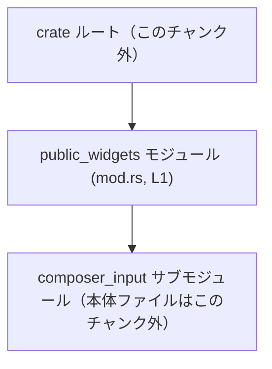

# tui/src/public_widgets/mod.rs コード解説

## 0. ざっくり一言

- `public_widgets` モジュール直下に、サブモジュール `composer_input` を crate 内に公開するためのエントリポイントです。（`tui/src/public_widgets/mod.rs:L1-1`）

---

## 1. このモジュールの役割

### 1.1 概要

- このファイルは、`public_widgets` モジュール配下に `composer_input` というサブモジュールが存在することを宣言し、その可視性を `pub(crate)`（クレート内公開）に設定しています。（`tui/src/public_widgets/mod.rs:L1-1`）
- このファイル自身には型定義や関数ロジックは含まれていません。（`tui/src/public_widgets/mod.rs:L1-1`）

### 1.2 アーキテクチャ内での位置づけ

このファイルはモジュール階層を構成する役割のみを持ちます。Rust のモジュール規則により、`mod composer_input;` があるとコンパイラは `tui/src/public_widgets/composer_input.rs` または `tui/src/public_widgets/composer_input/mod.rs` をサブモジュール本体として探索します。（Rust の言語仕様に基づく事実）



- `public_widgets` モジュール（このファイル）が、中継点として `composer_input` サブモジュールを crate 内の他のモジュールへ見えるようにしています。（`tui/src/public_widgets/mod.rs:L1-1`）

### 1.3 設計上のポイント

- **サブモジュール宣言のみ**  
  - ファイルの内容は `pub(crate) mod composer_input;` の 1 行であり、責務はモジュール構造の定義に限定されています。（`tui/src/public_widgets/mod.rs:L1-1`）
- **可視性の制御**  
  - `pub(crate)` により、`composer_input` は同一 crate 内からはアクセス可能ですが、外部クレートからは直接アクセスできません。（`tui/src/public_widgets/mod.rs:L1-1`）
- **状態やロジックを持たない**  
  - 関数・構造体・列挙体などの実行時ロジックや状態は一切定義されていません。（`tui/src/public_widgets/mod.rs:L1-1`）

---

## 2. 主要な機能一覧

このファイル単体の「機能」はモジュール定義のみです。

- `composer_input` サブモジュールの crate 内公開（`pub(crate) mod composer_input;` による宣言）（`tui/src/public_widgets/mod.rs:L1-1`）

---

## 3. 公開 API と詳細解説

### 3.1 型・モジュール一覧（コンポーネントインベントリー）

このファイルに現れるコンポーネントを一覧にします。

| 種別         | 名前               | 定義位置                                      | 公開範囲     | 役割 / 用途 |
|--------------|--------------------|-----------------------------------------------|--------------|-------------|
| サブモジュール | `composer_input`   | `tui/src/public_widgets/mod.rs:L1-1`          | `pub(crate)` | `public_widgets` 配下のサブモジュール本体を crate 内に公開するためのエイリアス／入口。中身はこのチャンクには含まれていません。 |

※ `composer_input` の中身（構造体や関数など）は、対応する `composer_input` モジュールファイル側に定義されているはずですが、このチャンクには現れません。

### 3.2 関数詳細

- このファイルには関数定義が存在しません。（`tui/src/public_widgets/mod.rs:L1-1`）
- したがって、このファイル単体で詳細解説すべき関数はありません。

### 3.3 その他の関数

- 同上：関数・メソッド・関連関数はいずれも定義されていません。（`tui/src/public_widgets/mod.rs:L1-1`）

---

## 4. データフロー

このファイルには実行時ロジックがないため、通常の意味での「データフロー」は存在しません。ただし、モジュール解決という観点での「呼び出しフロー」を示します。

### 4.1 モジュール解決の流れ

`composer_input` 内のアイテムを crate 内の別モジュールから利用する際の、名前解決の流れを示します。

```mermaid
sequenceDiagram
    participant Caller as 呼び出し元モジュール
    participant PW as public_widgets (mod.rs, L1)
    participant CI as composer_input サブモジュール

    Caller->>PW: use crate::public_widgets::composer_input;  // モジュールへのパス指定
    PW->>CI: mod composer_input; に基づきサブモジュールへ委譲 (L1)
    CI-->>Caller: 型・関数などのシンボルを解決（中身はこのチャンク外）
```

- `Caller`（呼び出し元）は `crate::public_widgets::composer_input` というパスを通じて `composer_input` モジュールにアクセスします。
- そのパスが有効であることを保証するのが、このファイル中の `pub(crate) mod composer_input;` です。（`tui/src/public_widgets/mod.rs:L1-1`）

---

## 5. 使い方（How to Use）

### 5.1 基本的な使用方法

このファイルによって、crate 内のどこからでも `crate::public_widgets::composer_input` というモジュールパスが利用可能になります。（`tui/src/public_widgets/mod.rs:L1-1`）

```rust
// crate 内の別モジュールからの利用例（パターン例）
use crate::public_widgets::composer_input; // public_widgets::mod.rs (L1) で宣言されたサブモジュールをインポート

// 実際には composer_input モジュール内に定義された型や関数をここから利用することになります。
// ただし、具体的な型名や関数名はこのチャンクには現れていません。
```

### 5.2 よくある使用パターン

- **crate 内からの参照**  
  - `pub(crate)` なので、同一 crate 内であればどのモジュールからでも `use crate::public_widgets::composer_input;` のようにインポートできます。（`tui/src/public_widgets/mod.rs:L1-1`）

- **外部クレートからは参照不可**  
  - 外部クレートから `my_crate::public_widgets::composer_input` のようにアクセスすることはできません。`pub(crate)` 可視性により制限されています。（`tui/src/public_widgets/mod.rs:L1-1`）

### 5.3 よくある間違い

このファイルの内容から想定される典型的な誤用は、可視性に関するものです。

```rust
// 誤りのパターン（別クレート側のコード例）
// use my_crate::public_widgets::composer_input;
// ↑ pub(crate) のため、外部クレートからは解決できない

// 正しいパターン（同じ crate 内側のコード例）
use crate::public_widgets::composer_input; // 同一 crate 内なら参照可能（L1 によって公開）
```

- `pub(crate)` であることを知らずに、外部から直接利用しようとするとコンパイルエラーになります。（`tui/src/public_widgets/mod.rs:L1-1`）

### 5.4 使用上の注意点（まとめ）

- **可視性の前提**  
  - `composer_input` は同じ crate 内からのみ参照可能です。外部公開が必要な場合は、可視性（`pub(crate)` → `pub`）や上位モジュールでの再公開が必要になります。（`tui/src/public_widgets/mod.rs:L1-1`）
- **実行時の安全性・エラー・並行性**  
  - このファイル自身には実行コードがないため、実行時エラーや並行性に関する挙動はありません。（`tui/src/public_widgets/mod.rs:L1-1`）
  - 実際の安全性やエラーハンドリング、並行性は `composer_input` モジュール本体側の実装に依存します（このチャンクには未掲載）。

---

## 6. 変更の仕方（How to Modify）

### 6.1 新しい機能を追加する場合

このファイルに「新しい機能（ロジック）」を直接追加するのではなく、通常はサブモジュールを増やす形になります。

- **新しいサブモジュールを追加する手順の一例**
  1. `tui/src/public_widgets/` 配下に新しいモジュールファイル（例: `foo.rs` または `foo/mod.rs`）を作成する。
  2. この `mod.rs` に `pub(crate) mod foo;` または `pub mod foo;` を追記する。
  3. crate 内の他モジュールから `crate::public_widgets::foo` を通じて利用する。

このファイルの既存行と同じ書式でサブモジュール宣言を追加するのが基本です。（`tui/src/public_widgets/mod.rs:L1-1` 参照）

### 6.2 既存の機能を変更する場合

`composer_input` サブモジュールに関して変更する場合、このファイルで行う変更は主に可視性や存在有無に関するものになります。

- **可視性を変更する場合**
  - `pub(crate) mod composer_input;` → `pub mod composer_input;`  
    - 影響：外部クレートからも `my_crate::public_widgets::composer_input` として参照可能になります。（`tui/src/public_widgets/mod.rs:L1-1`）
    - 注意点：公開 API の拡大となるため、外部互換性に影響します。

- **サブモジュール自体を削除する場合**
  - この行を削除すると、`composer_input` モジュールは `public_widgets` 以下からは利用できなくなります。（`tui/src/public_widgets/mod.rs:L1-1`）
  - 影響範囲：`crate::public_widgets::composer_input` を参照しているすべての箇所がコンパイルエラーになります。削除前に参照箇所を検索・確認する必要があります。

---

## 7. 関連ファイル

このファイルと密接に関係すると言えるのは、対応するサブモジュール本体です。

| パス候補                                             | 役割 / 関係 |
|------------------------------------------------------|------------|
| `tui/src/public_widgets/composer_input.rs`           | `mod composer_input;` に対応するサブモジュール本体ファイルである可能性があります。Rust のモジュール探索ルールにより、このパスが利用されることがあります。 |
| `tui/src/public_widgets/composer_input/mod.rs`       | 上記の代替として利用されるサブモジュール本体ファイルの候補です。どちらが実際に存在するかは、このチャンクからは分かりません。 |

※ どちらのパスが実際に使われているか、および `composer_input` の中身（構造体・関数・ウィジェット定義など）は、このチャンクには含まれていないため不明です。

---

## 付録: Bugs / Security / Contracts / Tests / 性能 などの観点

このファイル単体で確認できる範囲を整理します。

- **Bugs（バグ要因）**  
  - 1 行のみのモジュール宣言であり、典型的なロジックバグやランタイムバグの要因は含まれていません。（`tui/src/public_widgets/mod.rs:L1-1`）
  - 潜在的に問題になりうるのは、`composer_input` 本体ファイルが存在しない／パスが誤っている場合で、その場合コンパイルエラーになります。

- **Security（セキュリティ）**  
  - 実行コードや外部入力の処理がないため、このファイル単体で直接的なセキュリティ問題は発生しません。（`tui/src/public_widgets/mod.rs:L1-1`）
  - 可視性を `pub(crate)` にしている点は、外部からの直接アクセスを制限するという意味で、モジュールのカプセル化を強める方向の設定です。

- **Contracts / Edge Cases（契約・エッジケース）**  
  - 「契約」に相当するのは、「`composer_input` サブモジュールが存在し、crate 内から参照できる」という点のみです。（`tui/src/public_widgets/mod.rs:L1-1`）
  - エッジケースとしては、`composer_input` 本体が削除された／リネームされたのにこの行だけ残っている場合にコンパイルエラーとなる、などがあります。

- **Tests（テスト）**  
  - この `mod.rs` 自体に対するテストコード（例: `mod tests`）は含まれていません。（`tui/src/public_widgets/mod.rs:L1-1`）
  - 実質的なテスト対象は `composer_input` モジュール本体の振る舞いになります。

- **Performance / Scalability（性能・スケーラビリティ）**  
  - このファイルはコンパイル時のモジュール解決にのみ影響し、実行時に CPU・メモリ消費を増加させるようなロジックは持ちません。（`tui/src/public_widgets/mod.rs:L1-1`）

- **Observability（観測性）**  
  - ログ出力やメトリクス出力などは一切ありません。（`tui/src/public_widgets/mod.rs:L1-1`）
  - 観測性は `composer_input` モジュール本体の実装に依存します。
