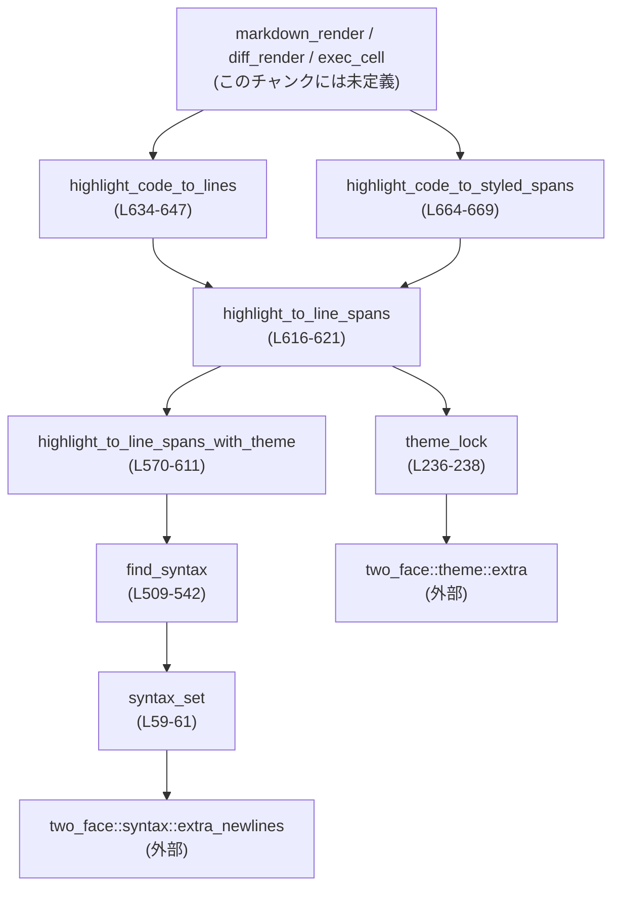
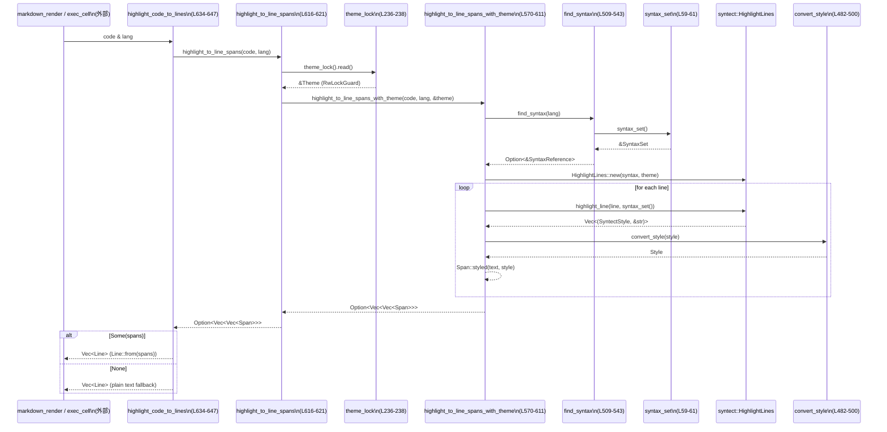

tui/src/render/highlight.rs

---

## 0. ざっくり一言

`syntect` と `two_face` を使って、ソースコードを ratatui 用の `Line` / `Span` にシンタックスハイライト付きで変換するエンジンです。  
テーマの選択・上書き・列挙と、入力サイズのガードレールもこのモジュールが担当しています  
（根拠: `tui/src/render/highlight.rs:L1-22`, `L624-669`）。

---

## 1. このモジュールの役割

### 1.1 概要

このモジュールは **TUI 上でのシンタックスハイライト付きコード表示** を行うために存在し、次の機能を提供します。

- `syntect` + `two_face` による多言語 (~250) 対応のハイライト結果を ratatui の `Line` / `Span` に変換  
  （根拠: `L24-44`, `L563-669`）
- プロセス全体で共有される `SyntaxSet` / `Theme` / テーマ上書き値 / `CODEX_HOME` のシングルトン管理  
  （根拠: `L46-51`, `L59-61`, `L236-238`）
- テーマ名の検証・解決（バンドル済み・カスタム `.tmTheme`）と利用可能テーマ一覧の構築  
  （根拠: `L70-133`, `L321-386`）
- diff 用の背景色（挿入/削除スコープ）抽出  
  （根拠: `L257-271`, `L273-292`）
- 入力サイズに対するガードレール（512KB / 10,000 行）  
  （根拠: `L545-552`, `L554-561`, `L581-586`）

### 1.2 アーキテクチャ内での位置づけ

このモジュールは、TUI レンダラと `syntect` / `two_face` / テーマ設定の橋渡しを行います。

主な依存関係とデータの流れを簡略化すると、次のようになります。



- 呼び出し側（例: `markdown_render`, `diff_render`, `exec_cell`）は `highlight_code_to_lines` / `highlight_code_to_styled_spans` を利用します（根拠: ドキュコメント `L632-633`, `L657-659`）。
- それらは内部の `highlight_to_line_spans` / `highlight_to_line_spans_with_theme` を経由し、`syntect::HighlightLines` でハイライトします（根拠: `L570-611`, `L613-621`）。
- ハイライトには `SyntaxSet` と `Theme` が必要で、`SyntaxSet` は `SYNTAX_SET` の `OnceLock`（`syntax_set`）から、`Theme` は `THEME` の `RwLock`（`theme_lock`）から取得されます（根拠: `L48-51`, `L59-61`, `L236-238`）。
- テーマセットやデフォルトテーマ名は `two_face::theme::extra` や `crate::terminal_palette::default_bg` など外部モジュールを通して決定されます（根拠: `L184-191`, `L203-224`, `L321-325`）。

### 1.3 設計上のポイント

- **プロセスグローバルなシングルトン**
  - `SyntaxSet`, `Theme`, テーマ上書き文字列、`CODEX_HOME` はすべて `OnceLock` でプロセス内共有されます（根拠: `L48-51`, `L59-61`, `L236-238`）。
  - テーマ自体は `RwLock<Theme>` で保護され、並行読み取りと排他的な切り替えが可能です（根拠: `L49`, `L236-247`）。
- **ガードレール**
  - 512KB / 10,000 行を超える入力はハイライトを行わず `None` を返すことで CPU / メモリの悪化を防ぎます（根拠: `L545-552`, `L581-586`, `L1081-1110`）。
- **エラーハンドリング**
  - テーマ取得・ファイル I/O・`syntect` の結果は `Option` / `Result` で扱い、失敗時はログまたは `None`、そしてプレーンテキストへのフォールバックで処理します（根拠: `L85`, `L116-133`, `L180-182`, `L323-335`, `L570-611`）。
  - `RwLock` のポイズン（パニック発生後）については `into_inner()` を用いて処理を継続します（根拠: `L241-245`, `L250-254`, `L617-620`）。
- **テーマ表現の設計**
  - ANSI 系テーマ (`ansi`, `base16`, `base16-256`) の色は alpha チャンネルにパレット情報を埋め込み、`convert_syntect_color` でパレット色と RGB を切り替えています（根拠: `L53-57`, `L451-460`, `L465-475`）。
  - 背景色はターミナル背景と干渉しないよう意図的に無視しています（根拠: `L488-490`）。

---

## 2. 主要な機能一覧

- テーマ上書き設定: `set_theme_override` でユーザ設定のテーマ名と `CODEX_HOME` を一度だけ記録し、必要なら即座にテーマを差し替える（`L70-101`）。
- テーマ名検証: `validate_theme_name` でバンドルテーマ / カスタム `.tmTheme` の存在と妥当性をチェックし、警告メッセージを返す（`L103-133`）。
- テーマ解決とデフォルト選択: `resolve_theme_with_override` / `adaptive_default_theme_name` などで、上書き・カスタム・背景色に応じて実際に使う `Theme` を決定する（`L184-201`, `L203-224`, `L226-234`）。
- テーマの取得・切り替え: `theme_lock`, `set_syntax_theme`, `current_syntax_theme` でグローバルテーマの初期化・書き換え・取得を行う（`L236-255`）。
- diff 背景色の抽出: `diff_scope_background_rgbs` と `diff_scope_background_rgbs_for_theme` で挿入/削除スコープの背景色を取得する（`L257-292`）。
- 利用可能テーマ一覧の構築: `list_available_themes` がバンドル32テーマと、`{codex_home}/themes/` 以下の有効な `.tmTheme` を列挙する（`L338-386`, `L388-422`）。
- シンタックス検索: `find_syntax` が言語名や拡張子から `SyntaxReference` を解決し、いくつかの別名を補正する（`L505-543`）。
- 入力サイズガード: `exceeds_highlight_limits` で合計バイト数 / 行数からハイライト実行可否を判定する（`L547-561`）。
- ハイライトエンジン: `highlight_to_line_spans_with_theme` / `highlight_to_line_spans` で `syntect` によるハイライトと ratatui スタイル変換を行う（`L565-621`）。
- 公開ハイライト API:
  - `highlight_code_to_lines` : `Vec<Line>` を返す基本 API（`L626-647`）。
  - `highlight_bash_to_lines` : bash 専用ラッパー（`L650-652`）。
  - `highlight_code_to_styled_spans` : diff 用に `Vec<Vec<Span>>` を返す API（`L655-669`）。

---

## 3. 公開 API と詳細解説

### 3.1 型一覧（構造体）

| 名前 | 種別 | 役割 / 用途 | 定義位置 |
|------|------|-------------|----------|
| `DiffScopeBackgroundRgbs` | 構造体 | diff / markup の挿入・削除スコープから抽出した背景色 (RGB) を保持する。両方 `None` の場合はテーマが色を定義していないことを示す | `tui/src/render/highlight.rs:L267-271` |
| `ThemeEntry` | 構造体 | テーマピッカーに表示する 1 件のテーマ（名前とカスタムかどうかのフラグ）を表す | `tui/src/render/highlight.rs:L338-345` |

### 3.2 関数詳細（7 件）

#### `set_theme_override(name: Option<String>, codex_home: Option<PathBuf>) -> Option<String>`

**概要**

ユーザ設定されたシンタックステーマ名と `CODEX_HOME` パスをプロセスグローバルに一度だけ保持し、必要なら現在のテーマを即時に差し替えます。テーマ名の妥当性チェック結果として、ユーザ向け警告メッセージを返します  
（根拠: `tui/src/render/highlight.rs:L70-101`）。

**引数**

| 引数名 | 型 | 説明 |
|--------|----|------|
| `name` | `Option<String>` | ユーザが設定したテーマ名（kebab-case）。`None` なら上書きなし。 |
| `codex_home` | `Option<PathBuf>` | カスタム `.tmTheme` を探すルートディレクトリ。`{codex_home}/themes/` 以下を探索。 |

**戻り値**

- `Option<String>`:  
  - `Some(warning)` … テーマが見つからない / 無効な場合など、ユーザに表示すべき警告文。  
  - `None` … 正常（バンドルテーマ、または有効なカスタムテーマが利用可能）。

**内部処理の流れ**

1. `validate_theme_name(name.as_deref(), codex_home.as_deref())` でテーマ名を検証し、警告メッセージ（`warning`）を得る（`L85`）。
2. `THEME_OVERRIDE` と `CODEX_HOME` の `OnceLock<Option<...>>` に、それぞれ `name.clone()` と `codex_home.clone()` を `set` する（`L86-87`）。
3. すでに `THEME` が初期化されている場合、`resolve_theme_with_override` で新しいテーマを解決し、`set_syntax_theme` で即座に反映する（`L88-93`）。
4. `OnceLock::set` に失敗した場合（=2回目以降の呼び出し）にはデバッグログを出すが、処理は継続する（`L94-99`）。
5. 最後に `warning` を返す（`L100`）。

**Examples（使用例）**

```rust
use std::path::PathBuf;
use tui::render::highlight::set_theme_override; // 実際のパスはこのチャンクには出ていません

fn init_syntax_theme_from_config() {
    // 設定ファイルなどから読み取った値と仮定
    let theme_name = Some("dracula".to_string());          // バンドル済みのテーマ名
    let codex_home = Some(PathBuf::from("/home/user/.codex"));

    // OnceLock にテーマ名と CODEX_HOME を保存し、必要なら即座にテーマを差し替える
    if let Some(warning) = set_theme_override(theme_name, codex_home) {
        eprintln!("config warning: {warning}");
    }
}
```

**Errors / Panics**

- `set_theme_override` 自体はパニックしません。
  - `OnceLock::set` が失敗しても `is_ok()` の結果で分岐し、失敗時はデバッグログのみ（`L86-87`, `L94-99`）。
  - テーマ更新時の `RwLock::write` は `set_syntax_theme` 内でポイズンを検知しても `into_inner()` によって処理を継続します（`L241-245`）。

**Edge cases（エッジケース）**

- `name == None` の場合
  - `validate_theme_name` は即座に `None` を返し、警告は出ません（`L105-107`, `L116-133`）。
  - `THEME_OVERRIDE` は `None` を保存するので、「上書きなし」を明示します。
- 2 回以上呼び出された場合
  - `OnceLock::set` は 2 回目以降に失敗し、ログ `"set_theme_override called more than once..."` を出すだけで、既存の値は変更されません（`L86-87`, `L94-99`）。
- `THEME` がまだ初期化されていない場合
  - テーマの即時更新は行われず、後で `theme_lock()` が呼ばれたときに `build_default_theme` を通じて解決されます（`L88-89`, `L226-234`, `L236-238`）。

**使用上の注意点**

- **想定されるライフサイクル**: ドキュコメントにある通り、「最終的な設定が確定した後、起動時に一度だけ」呼ばれることを前提にしています（`L72-80`）。
- **スレッドセーフティ**: `OnceLock` と `RwLock` によって多スレッド下でも安全ですが、2 回以上呼び出しても上書きはされない点に注意が必要です。
- **警告メッセージの扱い**: 戻り値の `Option<String>` はユーザが原因を特定できるようなメッセージなので、UI などで表示する前提で扱うとよいです（`L103-133`）。

---

#### `validate_theme_name(name: Option<&str>, codex_home: Option<&Path>) -> Option<String>`

**概要**

指定されたテーマ名が、バンドルテーマか有効なカスタム `.tmTheme` のどちらかに解決できるかを検証し、問題があればユーザに表示すべき警告メッセージを返します  
（根拠: `tui/src/render/highlight.rs:L103-133`）。

**引数**

| 引数名 | 型 | 説明 |
|--------|----|------|
| `name` | `Option<&str>` | チェック対象のテーマ名。`None` の場合は検証自体をスキップ。 |
| `codex_home` | `Option<&Path>` | カスタム `.tmTheme` を探すルートディレクトリ。 |

**戻り値**

- `None`:  
  - `name == None` の場合（「上書きなし」）  
  - バンドルテーマとして解決できる場合  
  - `codex_home` 配下に存在する `.tmTheme` が正常に読み込める場合
- `Some(warning)`:  
  - ファイルが存在しない、もしくは存在するが `.tmTheme` として無効な場合。

**内部処理の流れ**

1. `name?` によって `None` の場合は即座に `None` を返す（`L105-107`）。
2. `codex_home` を基に表示用のパス文字列 `custom_theme_path_display` を構築する（`L107-109`）。
3. `parse_theme_name` でバンドルテーマかどうかを判定し、`Some` であれば `None` を返す（警告なし）（`L110-112`）。
4. カスタムテーマの場合:
   - `codex_home` が `Some(home)` なら `custom_theme_path(name, home)` を計算（`L116-117`）。
   - そのパスが `is_file()` なら `load_custom_theme` を試み、成功 (`Some`) なら `None`（警告なし）を返す（`L118-121`）。
   - 存在するが `load_custom_theme` に失敗した場合は、「無効な .tmTheme」旨の警告を返す（`L122-125`）。
5. いずれにも該当しない（ファイルが存在しない）場合には、「テーマが見つからない」旨の警告を返す（`L128-132`）。

**Examples（使用例）**

```rust
use std::path::Path;
use tui::render::highlight::validate_theme_name;

fn check_theme_in_settings(theme_name: Option<&str>, codex_home: Option<&Path>) {
    if let Some(msg) = validate_theme_name(theme_name, codex_home) {
        // ここでログや UI に警告を出す想定
        eprintln!("Theme warning: {msg}");
    }
}
```

**Errors / Panics**

- ファイルアクセス（`custom_path.is_file()` や `load_custom_theme`）でエラーが発生しても `is_file()` / `ThemeSet::get_theme(...).ok()` 結果で判定しているのでパニックしません（`L118-121`, `L180-182`）。
- 返されるのはあくまで警告メッセージであり、関数自体はエラー型を返しません。

**Edge cases**

- `name == None`: そもそもテーマ上書きを行わないので、警告も返さず `None`（`L105-107`）。
- `codex_home == None`: カスタムパスを実際にはチェックできませんが、メッセージ中には `$CODEX_HOME/themes/{name}.tmTheme` というパスを案内として含めます（`L107-109`, `L128-132`）。
- テーマファイルが存在していても invalid な場合:
  - `.tmTheme` の内容が壊れていると `load_custom_theme` が `None` を返し、「could not be loaded (invalid .tmTheme format)」という文言を含む警告が返されます（`L119-125`）。

**使用上の注意点**

- `validate_theme_name` は I/O に依存するため、起動時や設定更新時など比較的低頻度のタイミングで呼び出す想定です。
- 実際に利用するテーマは `resolve_theme_with_override` / `resolve_theme_by_name` で解決されるため、この関数の戻り値は「ユーザ向けメッセージ」にのみ使い、テーマ適用そのものには使いません（`L203-224`, `L321-335`）。

---

#### `resolve_theme_with_override(name: Option<&str>, codex_home: Option<&Path>) -> Theme`

**概要**

現在の上書きテーマ名 / カスタムテーマ設定に基づいて、最終的に使用する `Theme` を決定します。  
バンドルテーマ > カスタム `.tmTheme` > 自動判定デフォルト（背景色に応じたテーマ）の優先順位で解決します  
（根拠: `tui/src/render/highlight.rs:L203-224`）。

**引数**

| 引数名 | 型 | 説明 |
|--------|----|------|
| `name` | `Option<&str>` | 上書きテーマ名（kebab-case）。 |
| `codex_home` | `Option<&Path>` | カスタム `.tmTheme` を探すルート。 |

**戻り値**

- `Theme`: 使用すべきシンタックステーマ。バンドルテーマ、カスタムテーマ、あるいは自動検出されたデフォルトテーマ。

**内部処理の流れ**

1. `two_face::theme::extra()` で埋め込みテーマセット（`ThemeSet` ライクな型）を取得（`L205-206`）。
2. `name` が `Some` の場合:
   - まず `parse_theme_name(name)` によってバンドルテーマ名へのマッピングを試みる（`L210-212`）。
   - 見つかった場合は `ts.get(theme_name).clone()` を返す。
   - 見つからない場合は `codex_home` が `Some(home)` かつ `load_custom_theme(name, home)` が `Some(theme)` なら、その `theme` を返す（`L214-218`）。
   - どちらにも該当しない場合はデバッグログを出してデフォルトにフォールバックする（`L219-220`）。
3. 上記のどれでもない場合（`name == None` か、解決できない場合）は、`adaptive_default_embedded_theme_name()` を使って背景色に基づくデフォルトテーマを選び、それを返す（`L223`）。

**Examples（使用例）**

```rust
use std::path::Path;
use tui::render::highlight::resolve_theme_by_name; // ランタイムで直接使うならこちら

fn load_theme(name: &str, codex_home: &Path) -> syntect::highlighting::Theme {
    resolve_theme_by_name(name, Some(codex_home))
        .unwrap_or_else(|| {
            // 見つからなければ呼び出し側でデフォルトを使うこともできる
            let (default_name, _) = crate::render::highlight::adaptive_default_theme_selection(); 
            two_face::theme::extra().get(default_name).clone()
        })
}
```

（`resolve_theme_with_override` 自体はこのファイル内からのみ呼ばれるので、外部では通常 `resolve_theme_by_name` を利用します。）

**Errors / Panics**

- バンドルテーマの取得 (`ts.get(...)`) はパニックしない前提の API です（`two_face` に依存）。このコード内ではエラーとして扱っていません。
- カスタムテーマ読み込み失敗 (`load_custom_theme`) は単に `None` として扱われ、デフォルトテーマにフォールバックされます（`L214-218`）。

**Edge cases**

- 無効な `name` かつ `codex_home` 未指定:
  - デバッグログが出るだけで、デフォルトテーマが使用されます（`L219-223`）。
- `codex_home` が存在するが `.tmTheme` ファイルが壊れている:
  - `load_custom_theme` が `None` を返し、そのままデフォルトテーマにフォールバックします（`L214-218`, `L180-182`）。

**使用上の注意点**

- この関数は `build_default_theme` の内部でのみ使用され、外部から直接呼ぶ必要はありません（`L226-234`）。
- テーマ名が不正な場合でも、必ず何らかのテーマを返すようになっているため、「ハイライト処理自体が失敗する」ことを避けています。

---

#### `theme_lock() -> &'static RwLock<Theme>`

**概要**

グローバルな `Theme` を保持する `RwLock<Theme>` を初期化し、参照を返すヘルパです。  
初回呼び出し時に `build_default_theme` を用いてテーマを構築し、以降は同じロックを返します  
（根拠: `tui/src/render/highlight.rs:L236-238`）。

**引数**

- なし。

**戻り値**

- `&'static RwLock<Theme>`: プロセス全体で共有されるテーマロックの参照。

**内部処理の流れ**

1. `THEME.get_or_init(|| RwLock::new(build_default_theme()))` を呼び出す（`L237`）。
   - `THEME` は `OnceLock<RwLock<Theme>>` であり、一度だけ初期化される（`L49`）。
   - 初回呼び出し時はクロージャが実行され、`build_default_theme` で構築された `Theme` を持つ `RwLock` が生成される（`L228-234`）。
2. 以降は同じ `RwLock` の参照が返されます。

**Examples（使用例）**

```rust
use tui::render::highlight::theme_lock;

fn snapshot_current_theme() -> syntect::highlighting::Theme {
    let guard = theme_lock().read().unwrap();
    guard.clone()
}
```

**Errors / Panics**

- `get_or_init` 自体はパニックしませんが、`build_default_theme` 内での処理がパニックする可能性は理論上あります（ただしこのコードではパニックに直結するような操作はありません）。
- 実際の読み書きは `set_syntax_theme` / `current_syntax_theme` / `highlight_to_line_spans` 内で行われ、その中で `RwLock` のポイズンを `Err(poisoned) => poisoned.into_inner()` で処理しています（`L241-245`, `L250-254`, `L617-620`）。

**Edge cases**

- `set_theme_override` より前にハイライトを行った場合:
  - `THEME_OVERRIDE` / `CODEX_HOME` はまだ `None` なので、`adaptive_default_theme_name` ベースのテーマが選択されます（`L228-234`）。

**使用上の注意点**

- 外部コードが直接 `theme_lock().write()` を呼び出すことは想定されておらず、テーマの変更は `set_syntax_theme` 経由で行うのが前提です（`L241-247`）。

---

#### `highlight_to_line_spans_with_theme(code: &str, lang: &str, theme: &Theme) -> Option<Vec<Vec<Span<'static>>>>`

**概要**

指定された `code` と `lang` を `syntect` で解析し、1 行ごとに ratatui `Span` の配列へ変換します。  
`Theme` は引数として明示的に渡され、ガードレールや未知言語などの異常時には `None` を返します  
（根拠: `tui/src/render/highlight.rs:L565-611`）。

**引数**

| 引数名 | 型 | 説明 |
|--------|----|------|
| `code` | `&str` | ハイライト対象のソースコード全体。 |
| `lang` | `&str` | 言語識別子（kebab-case、拡張子、別名など）。 |
| `theme` | `&Theme` | 使用するシンタックステーマ。 |

**戻り値**

- `Option<Vec<Vec<Span<'static>>>>`:
  - `Some(lines)` … 行ごとの `Vec<Span>`。各 `Span` には `content` と `Style` が入る。
  - `None` … 空入力 / 入力サイズ超過 / 未知言語 / `syntect` エラーなど。

**内部処理の流れ**

1. `code.is_empty()` の場合は `None` を返して早期終了（`L575-579`）。
2. `code.len()` と `code.lines().count()` を用いて、512KB / 10,000 行のガードレールを超えていないかチェック。超えていれば `None` を返す（`L581-586`）。
3. `find_syntax(lang)?` によって対応する `SyntaxReference` を取得。解決できなければ `None`（`L588`）。
4. `HighlightLines::new(syntax, theme)` を作成し、`LinesWithEndings::from(code)` で各行（行末を含む）を走査（`L589-593`）。
5. 各行に対して `h.highlight_line(line, syntax_set()).ok()?` を呼び出し、`(style, text)` の配列を得る（`L593`）。
6. 各 `(style, text)` について:
   - `text.trim_end_matches(['\n', '\r'])` で改行コードを除去し、空でなければ `convert_style(style)` を通じた `Span::styled` を `spans` に追加（`L595-603`）。
7. もし `spans` が空（すべて空文字列だった）場合は、少なくとも 1 つの空 `Span` を追加する（`L604-606`）。
8. 行ごとの `spans` を `lines` にプッシュし、最終的に `Some(lines)` を返す（`L607-610`）。

**Examples（使用例）**

テストコードに近い簡易例です（`L752-769`, `L781-795`）。

```rust
use tui::render::highlight::highlight_to_line_spans_with_theme;
use tui::render::highlight::resolve_theme_by_name;

fn preview_rust_code(code: &str) {
    let theme = resolve_theme_by_name("dracula", None)
        .expect("bundled theme dracula should exist");
    if let Some(lines) = highlight_to_line_spans_with_theme(code, "rust", &theme) {
        for (i, line) in lines.iter().enumerate() {
            // ここでは span.content を単純に連結して表示
            let text: String = line.iter().map(|s| s.content.clone()).collect();
            println!("{i:>3}: {text}");
        }
    } else {
        println!("fallback: no highlighting");
    }
}
```

**Errors / Panics**

- `find_syntax` が `None` を返すと `?` により `None` となるため、未知言語でパニックせずにフォールバックできます（`L588`, `L509-543`）。
- `h.highlight_line` が `Err` を返した場合も `.ok()?` によって `None` を返すだけです（`L593`）。
- パニックする可能性がある操作は含まれていません。

**Edge cases**

- **空文字列**: `code.is_empty()` のため `None` を返し、呼び出し側（`highlight_code_to_lines`）で 1 行の空 `Line` にフォールバックされます（`L575-579`, `L641-645`, `L829-834`）。
- **CRLF 行末**: `trim_end_matches(['\n', '\r'])` により `\r` が除去され、出力に `\r` が残らないことがテストで確認されています（`L595-599`, `L843-858`）。
- **行末にだけトークンがある場合**: すべての `text` が空になった行でも、少なくとも空の `Span` が 1 つ入るため、行数の対応は保たれます（`L604-607`）。

**使用上の注意点**

- この関数は `Theme` を明示的に渡す前提なので、通常のアプリケーションコードでは `highlight_to_line_spans` または `highlight_code_to_lines` を使うのが自然です（`L613-621`, `L626-647`）。
- `code.lines().count()` は UTF-8 文字列の行数を数えるため、巨大な入力に対しては O(n) の事前チェックコストがかかりますが、実際のハイライト処理に比べれば軽量です。

---

#### `highlight_code_to_lines(code: &str, lang: &str) -> Vec<Line<'static>>`

**概要**

シンタックスハイライト付きの `Vec<Line>` を返すメインの公開 API です。  
ハイライトに失敗（未知言語 / ガードレール / `syntect` エラー）した場合でも、常に内容は保持されたプレーンテキストの `Vec<Line>` を返します  
（根拠: `tui/src/render/highlight.rs:L626-647`）。

**引数**

| 引数名 | 型 | 説明 |
|--------|----|------|
| `code` | `&str` | ハイライト対象のテキスト。 |
| `lang` | `&str` | 言語識別子。 |

**戻り値**

- `Vec<Line<'static>>`:  
  - 通常は各 `Line` がシンタックスハイライト済みの `Span` 群を持つ。  
  - フォールバック時にはスタイルがデフォルトの `Span` だけを含む。

**内部処理の流れ**

1. `highlight_to_line_spans(code, lang)` を呼び出してハイライトを試みる（`L635`）。
2. `Some(line_spans)` の場合は `line_spans.into_iter().map(Line::from).collect()` により `Vec<Line>` に変換（`L635-636`）。
3. `None` の場合（未知言語・ガードレール超え・空入力など）は:
   - `code.lines()` で行を分割し、`Line::from(l.to_string())` によりプレーンな `Line` の配列を作る（`L641-642`）。
   - もし `result.is_empty()` なら、1 行の空 `Line` を追加する（`L643-645`）。
4. 最終的に `result` を返す（`L646`）。

**Examples（使用例）**

```rust
use tui::render::highlight::highlight_code_to_lines;
use ratatui::widgets::{Paragraph};
use ratatui::layout::Rect;
use ratatui::Terminal;

// 例: markdown のコードブロックをハイライトして表示するイメージ
fn render_code_block<B: ratatui::backend::Backend>(
    terminal: &mut Terminal<B>,
    area: Rect,
    code: &str,
    lang: &str,
) -> std::io::Result<()> {
    let lines = highlight_code_to_lines(code, lang);
    let paragraph = Paragraph::new(lines);
    terminal.draw(|f| {
        f.render_widget(paragraph, area);
    })
}
```

**Errors / Panics**

- `highlight_code_to_lines` 自体はパニックしません。
- 内部の `highlight_to_line_spans` も `Option` ベースで失敗を表現するため、すべてフォールバック経由で逃がされます（`L613-621`）。
- 空文字列に対しても必ず 1 行の `Line` が返されることがテストで確認されています（`L829-834`）。

**Edge cases**

- **未知言語**: `highlight_unknown_lang_falls_back` テストで、内容が保持されつつスタイルはすべてデフォルトになることが確認されています（`L797-812`）。
- **末尾の改行**: `fallback_trailing_newline_no_phantom_line` テストで、末尾の `\n` があっても余分な空行が生成されないことが確認されています（`L814-827`）。
- **空入力**: `highlight_empty_string` テストで、`lines.len() == 1` かつ空文字列であることが確認されています（`L829-834`）。

**使用上の注意点**

- 描画側はこの関数だけ見ていればよく、ガードレールや未知言語の違いを意識せずに済むよう設計されています。
- ハイライトの有無を明示的に知りたい場合は、代わりに `highlight_code_to_styled_spans`（`Option` 返り値）を使うこともできます（`L655-669`）。

---

#### `convert_style(syn_style: SyntectStyle) -> Style`

**概要**

`syntect` の `Style` を ratatui の `Style` に変換する関数です。  
ANSI 系テーマの alpha チャンネルを尊重しつつ、背景色・イタリック・下線は意図的に無視します  
（根拠: `tui/src/render/highlight.rs:L478-501`）。

**引数**

| 引数名 | 型 | 説明 |
|--------|----|------|
| `syn_style` | `SyntectStyle` | `syntect` が返すスタイル情報（前景色・背景色・フォントスタイルなど）。 |

**戻り値**

- `Style`: ratatui 用のスタイル。前景色と BOLD のみを設定します。

**内部処理の流れ**

1. `Style::default()` で ratatui スタイルを初期化（`L483`）。
2. `convert_syntect_color(syn_style.foreground)` を呼び出し、`Some(fg)` の場合にのみ `rt_style = rt_style.fg(fg);` として前景色を設定（`L485-487`）。
3. 背景色についてはコメントにもある通り「ターミナル背景を上書きしない」ため完全に無視（`L488-490`）。
4. `syn_style.font_style.contains(FontStyle::BOLD)` の場合のみ `Modifier::BOLD` を追加（`L492-493`）。
5. イタリックと下線はコメントの通り無視し、`rt_style` を返す（`L495-500`）。

**Examples（使用例）**

この関数は通常 `highlight_to_line_spans_with_theme` の中で呼ばれ、直接利用することはあまりありません（`L602-603`）。テストに近い例:

```rust
use syntect::highlighting::{FontStyle, Style as SyntectStyle, Color as SynColor};
use tui::render::highlight::convert_style;

fn demo_convert() {
    let syn = SyntectStyle {
        foreground: SynColor { r: 255, g: 128, b: 0, a: 255 },
        background: SynColor { r: 0, g: 0, b: 0, a: 255 },
        font_style: FontStyle::BOLD | FontStyle::ITALIC,
    };
    let rt = convert_style(syn);
    // rt.fg は Some(RtColor::Rgb(255, 128, 0))
    // rt.bg は None
    // BOLD だけが有効な Modifier
}
```

**Errors / Panics**

- パニックする可能性のある処理は含まれていません。
- 予期しない alpha 値（0,1,255 以外）も `convert_syntect_color` 側で RGB として扱われるため、安全に処理されます（`L472-475`, `L980-999`）。

**Edge cases**

- ANSI 系テーマで alpha==0 → ANSI パレット色 (`ansi_palette_color`) へ（`L467-470`）。
- alpha==1 → 「デフォルト前景色を使う」扱いで `None` を返し、`Style` には前景色を設定しません（`L471`, `L455-460`, `L960-977`）。
- alpha==255 以外の値 → すべて RGB として扱います（`L472-475`, テスト `style_conversion_unexpected_alpha_falls_back_to_rgb`）。

**使用上の注意点**

- 背景色を無視しているため、「テーマ由来の背景色でコードブロック全体を塗る」といった用途には直接使えません。その用途には `DiffScopeBackgroundRgbs` + 別のロジックが使用されています（`L257-271`）。
- イタリック・下線を強制的に抑制しているため、テーマ側でそれらを指定しても反映されません（`L495-498`, `L888-915`）。

---

#### `find_syntax(lang: &str) -> Option<&'static SyntaxReference>`

**概要**

言語識別子（名前・拡張子・別名）から `syntect` の `SyntaxReference` を解決する関数です。  
`two_face` が解決できないいくつかの別名（`csharp`, `golang` など）を補正するロジックを含みます  
（根拠: `tui/src/render/highlight.rs:L505-543`）。

**引数**

| 引数名 | 型 | 説明 |
|--------|----|------|
| `lang` | `&str` | 言語名、ファイル拡張子、またはその別名。 |

**戻り値**

- `Option<&'static SyntaxReference>`:
  - `Some(syntax)` … 解決できた場合。
  - `None` … どの候補でも解決できなかった場合。

**内部処理の流れ**

1. `syntax_set()` から `SyntaxSet` を取得（`L509-510`, `L59-61`）。
2. `match lang` による別名補正:
   - `csharp` または `c-sharp` → `"c#"`
   - `golang` → `"go"`
   - `python3` → `"python"`
   - `shell` → `"bash"`
   - それ以外 → そのまま（`L512-519`）。
3. 以下の順番で `SyntaxReference` を探す（どれかで見つかれば `Some` を返し、見つからなければ `None`）:
   - `find_syntax_by_token(patched)`（`file_extensions` 相当をケース無視で検索）（`L521-523`）。
   - `find_syntax_by_name(patched)`（`SyntaxDefinition::name` との一致）（`L525-527`）。
   - `syntaxes().iter().find(|s| ...)` によるケース無視の名前一致（`L529-536`）。
   - `find_syntax_by_extension(lang)`（元の `lang` を拡張子として扱う）（`L538-540`）。

**Examples（使用例）**

```rust
use tui::render::highlight::find_syntax;

fn supports_language(lang: &str) -> bool {
    find_syntax(lang).is_some()
}

assert!(supports_language("rust"));
assert!(supports_language("rs"));
assert!(supports_language("csharp")); // "c#" にマップされる
```

**Errors / Panics**

- `SyntaxSet` の探索 API は `Option` を返すため、パニックしません。
- 戻り値の `Option` で解決失敗を表現します。

**Edge cases**

- テスト `find_syntax_resolves_languages_and_aliases` により、多数の言語名・拡張子・別名が解決できることが確認されています（`L1113-1173`）。
- 別名補正は限定的であり、ここに記載されたケース以外は `two_face` 側の解決に委ねられます（`L512-519`）。

**使用上の注意点**

- この関数は `highlight_to_line_spans_with_theme` の内部で利用されるため、通常は直接呼び出す必要はありません（`L588`）。
- 解決できなかった場合（`None`）にはハイライトを行わず、呼び出し側はプレーンテキストにフォールバックする設計になっています。

---

### 3.3 その他の関数

#### 本体モジュール内の補助関数一覧

| 関数名 | 役割（1 行） | 定義位置 |
|--------|--------------|----------|
| `syntax_set() -> &'static SyntaxSet` | `SYNTAX_SET` を `two_face::syntax::extra_newlines` で初期化し、参照を返す | `tui/src/render/highlight.rs:L59-61` |
| `parse_theme_name(name: &str) -> Option<EmbeddedThemeName>` | kebab-case のテーマ名から `EmbeddedThemeName` へのマッピングを行う | `tui/src/render/highlight.rs:L135-172` |
| `custom_theme_path(name: &str, codex_home: &Path) -> PathBuf` | `{codex_home}/themes/{name}.tmTheme` へのパスを構築する | `tui/src/render/highlight.rs:L174-177` |
| `load_custom_theme(name: &str, codex_home: &Path) -> Option<Theme>` | `ThemeSet::get_theme` を使ってカスタム `.tmTheme` を読み込む | `tui/src/render/highlight.rs:L179-182` |
| `adaptive_default_theme_selection() -> (EmbeddedThemeName, &'static str)` | 端末背景の明るさに応じて、適切なデフォルトテーマとその名前を返す | `tui/src/render/highlight.rs:L184-191` |
| `adaptive_default_embedded_theme_name() -> EmbeddedThemeName` | 上記から `EmbeddedThemeName` のみを返す | `tui/src/render/highlight.rs:L193-195` |
| `adaptive_default_theme_name() -> &'static str` | 上記から kebab-case 名のみを返す公開 API | `tui/src/render/highlight.rs:L197-201` |
| `build_default_theme() -> Theme` | `THEME_OVERRIDE` と `CODEX_HOME` から `resolve_theme_with_override` を呼び出し、デフォルトテーマを構築する | `tui/src/render/highlight.rs:L226-234` |
| `set_syntax_theme(theme: Theme)` | `theme_lock().write()` を使ってグローバルテーマを差し替える | `tui/src/render/highlight.rs:L240-247` |
| `current_syntax_theme() -> Theme` | 読み取りロックで現在のテーマをクローンして返す | `tui/src/render/highlight.rs:L249-254` |
| `diff_scope_background_rgbs() -> DiffScopeBackgroundRgbs` | 現在のテーマから diff 用背景色を取得する公開 API | `tui/src/render/highlight.rs:L273-281` |
| `diff_scope_background_rgbs_for_theme(theme: &Theme) -> DiffScopeBackgroundRgbs` | 任意の `Theme` から diff 用背景色を抽出するテスト向けヘルパ | `tui/src/render/highlight.rs:L285-291` |
| `scope_background_rgb(highlighter: &Highlighter<'_>, scope_name: &str) -> Option<(u8,u8,u8)>` | 単一スコープの背景色を取得するヘルパ | `tui/src/render/highlight.rs:L294-299` |
| `configured_theme_name() -> String` | 永続化された上書きテーマ/カスタムテーマが解決できればその名前、できなければ自動検出デフォルト名を返す | `tui/src/render/highlight.rs:L301-319` |
| `resolve_theme_by_name(name: &str, codex_home: Option<&Path>) -> Option<Theme>` | 指定名からバンドルまたはカスタムテーマを解決する公開関数 | `tui/src/render/highlight.rs:L321-335` |
| `list_available_themes(codex_home: Option<&Path>) -> Vec<ThemeEntry>` | バンドル＋有効なカスタムテーマを列挙し、名前順にソートする | `tui/src/render/highlight.rs:L348-386` |
| `ansi_palette_color(index: u8) -> RtColor` | ANSI パレット index (0–7) を ratatui の名前付き色に、それ以外は `Indexed` にマッピング | `tui/src/render/highlight.rs:L435-448` |
| `convert_syntect_color(color: SyntectColor) -> Option<RtColor>` | `syntect` の `Color` を alpha 付きのルールに従って ratatui の `Color`/`None` に変換 | `tui/src/render/highlight.rs:L465-475` |
| `exceeds_highlight_limits(total_bytes: usize, total_lines: usize) -> bool` | 集計されたバイト数・行数がガードレールを超えるか判定する公開ヘルパ | `tui/src/render/highlight.rs:L554-561` |
| `highlight_to_line_spans(code: &str, lang: &str) -> Option<Vec<Vec<Span<'static>>>>` | グローバルテーマロックからテーマを取得し、`highlight_to_line_spans_with_theme` を呼び出す | `tui/src/render/highlight.rs:L613-621` |
| `highlight_bash_to_lines(script: &str) -> Vec<Line<'static>>` | `"bash"` を言語として `highlight_code_to_lines` を呼び出すラッパ | `tui/src/render/highlight.rs:L650-652` |
| `highlight_code_to_styled_spans(code: &str, lang: &str) -> Option<Vec<Vec<Span<'static>>>>` | diff 用に `highlight_to_line_spans` をそのまま公開する関数 | `tui/src/render/highlight.rs:L664-669` |

※ `#[cfg(test)] mod tests` 内の関数はテスト専用のため、ここでは列挙を省略し、後述のテスト説明で概要のみ触れます。

---

## 4. データフロー

### 4.1 ハイライト処理のデータフロー

典型的なコードブロックのハイライトは、次のようなシーケンスで行われます。



- 入力サイズがガードレールを超えている場合や未対応言語の場合、`highlight_to_line_spans_with_theme` で `None` が返り、フォールバックパスが取られます（`L575-586`, `L588`, `L635-647`）。
- テーマや `SyntaxSet` は `OnceLock` + `RwLock` 経由でスレッドセーフに共有されます（`L48-51`, `L59-61`, `L236-238`）。

---

## 5. 使い方（How to Use）

### 5.1 基本的な使用方法

起動時のテーマ設定と、コードブロックをハイライトして描画する基本フローの例です。

```rust
use std::path::PathBuf;
use ratatui::Terminal;
use ratatui::backend::CrosstermBackend;
use ratatui::widgets::Paragraph;
use ratatui::layout::Rect;

use tui::render::highlight::{
    set_theme_override,
    highlight_code_to_lines,
};

fn main() -> anyhow::Result<()> {
    // 1. 起動時にテーマ上書きを設定する（最終設定が確定したタイミング）
    let theme_name = Some("dracula".to_string());
    let codex_home = Some(PathBuf::from("/home/user/.codex"));
    if let Some(warning) = set_theme_override(theme_name, codex_home) {
        eprintln!("theme warning: {warning}");
    }

    // 2. 端末やフレームワークの初期化（詳細は省略）
    let backend = CrosstermBackend::new(std::io::stdout());
    let mut terminal = Terminal::new(backend)?;

    // 3. ハイライト付きの Line を取得する
    let code = "fn main() { println!(\"hello\"); }";
    let lines = highlight_code_to_lines(code, "rust"); // ガードレールや未知言語も内部で処理

    // 4. Paragraph 等のウィジェットで描画する
    terminal.draw(|f| {
        let size = f.size();
        let paragraph = Paragraph::new(lines);
        f.render_widget(paragraph, size);
    })?;

    Ok(())
}
```

### 5.2 よくある使用パターン

1. **diff 用ハイライトと背景色の組み合わせ**

```rust
use tui::render::highlight::{
    highlight_code_to_styled_spans,
    diff_scope_background_rgbs,
};

fn render_diff_hunk(code: &str, lang: &str) {
    let spans = highlight_code_to_styled_spans(code, lang);
    let diff_bg = diff_scope_background_rgbs(); // 挿入/削除用の RGB 背景色

    match spans {
        Some(lines) => {
            // 行ごとの Span と diff_bg を組み合わせてレンダリング
        }
        None => {
            // シンタックスハイライトを諦めて、diff 側の配色だけでレンダリング
        }
    }
}
```

1. **テーマピッカーの実装**

```rust
use std::path::Path;
use tui::render::highlight::{list_available_themes, set_syntax_theme, resolve_theme_by_name};

fn theme_picker(codex_home: &Path) {
    let entries = list_available_themes(Some(codex_home));
    for (i, entry) in entries.iter().enumerate() {
        println!("{i}: {}{}", entry.name, if entry.is_custom { " (custom)" } else { "" });
    }

    // ユーザが選択したテーマ名を例として "github" とする
    let selected = "github";
    if let Some(theme) = resolve_theme_by_name(selected, Some(codex_home)) {
        // ライブプレビュー用にテーマを差し替える
        set_syntax_theme(theme);
    }
}
```

### 5.3 よくある間違い

```rust
use tui::render::highlight::highlight_code_to_lines;

// 間違い例: 非常に大きな入力を per-line で個別にハイライトしてしまう
fn bad_diff_highlight(lines: &[String]) {
    for line in lines {
        // 1 行ずつなら MAX_HIGHLIGHT_BYTES を超えず、ガードレールの恩恵が減る
        let _ = highlight_code_to_lines(line, "rust");
    }
}

// 正しい例: 事前に合計サイズをチェックし、必要に応じてハイライト自体をスキップする
use tui::render::highlight::exceeds_highlight_limits;

fn good_diff_highlight(lines: &[String]) {
    let total_bytes: usize = lines.iter().map(|l| l.len()).sum();
    let total_lines = lines.len();

    if exceeds_highlight_limits(total_bytes, total_lines) {
        // シンタックスハイライトを諦め、プレーンテキスト diff で表示
        return;
    }

    for line in lines {
        let _ = highlight_code_to_lines(line, "rust");
    }
}
```

**ポイント**

- ガードレールは `highlight_to_line_spans_with_theme` 内でも行われますが（`L581-586`）、diff のように多くの行を連続して処理する場合は `exceeds_highlight_limits` で事前チェックする設計になっています（`L554-561`, `L1081-1110`）。

### 5.4 使用上の注意点（まとめ）

- **入力サイズ**
  - 512 KB / 10,000 行を超える入力はハイライトされず、プレーンテキストにフォールバックします。大きなファイルを扱う場合は `exceeds_highlight_limits` を使って事前に判断する必要があります（`L547-552`, `L581-586`）。
- **テーマ名の信頼性**
  - テーマ名は設定ファイルなどから受け取る前提のため、`validate_theme_name` でユーザにフィードバックを返す設計になっています。`name` にスラッシュや `..` を含めた場合、`PathBuf::join` の挙動次第で想定外のパスを指しうる点には注意が必要です（`L174-177`）。このチャンクだけでは上位レイヤの入力検証有無は分かりません。
- **並行性**
  - グローバルなテーマは `RwLock` で保護され、`set_syntax_theme` と `current_syntax_theme` などがロックを操作します。ポイズン状態でも `into_inner()` によって処理を継続する設計であり、「壊れたテーマ状態」になる可能性はあっても、メモリ安全性は損なわれません（`L241-245`, `L250-254`）。
- **スタイル表現**
  - 背景色・イタリック・下線は `convert_style` で意図的に無視されるため、テーマ側で設定されていてもターミナル表示には反映されません（`L488-490`, `L495-498`）。

---

## 6. 変更の仕方（How to Modify）

### 6.1 新しい機能を追加する場合

1. **新しいテーマ関連機能（例: テーマメタ情報の取得）**
   - 入口: `ThemeEntry` や `list_available_themes` 周辺を見るのが自然です（`L338-386`）。
   - 既存の `ThemeSet` / `Theme` 情報は `two_face::theme::extra()` や `resolve_theme_by_name` 経由でアクセスできます（`L205-207`, `L321-325`）。
   - 追加する関数は、可能なら `pub(crate)` で公開し、このモジュールに閉じた操作とするのが一貫した設計です。

2. **新しい言語エイリアスの追加**
   - `find_syntax` の `match lang` にパターンを追加します（`L512-519`）。
   - 追加後は `tests` モジュールの `find_syntax_resolves_languages_and_aliases` にテストケースを増やすと挙動が保証されます（`L1113-1173`）。

3. **diff 用の新しいスコープサポート**
   - `diff_scope_background_rgbs_for_theme` の `scope_background_rgb` 呼び出しに、新しいスコープ名を追加できます（`L285-291`）。
   - テスト `diff_scope_backgrounds_*` を拡張して期待される値を検証します（`L1176-1211`）。

### 6.2 既存の機能を変更する場合

- **ガードレールの閾値変更**
  - `MAX_HIGHLIGHT_BYTES` / `MAX_HIGHLIGHT_LINES` を変更し、合わせてテスト `highlight_large_input_falls_back` などの期待値も更新します（`L547-552`, `L1081-1110`）。
  - 変更によりパフォーマンスや UX が大きく変わる可能性があるため、呼び出し側（diff / markdown レンダラ）での挙動確認が必要です。

- **テーママッピングの変更**
  - バンドルテーマとのマッピングは `parse_theme_name` と `BUILTIN_THEME_NAMES` に二重で定義されているため、両方を同期して変更する必要があります（`L135-172`, `L388-422`）。
  - テスト `parse_theme_name_covers_all_variants` / `parse_theme_name_is_exhaustive` が、この同期を保証する役割を持っています（`L1249-1306`, `L1435-1495`）。

- **スタイル変換の挙動変更（例: イタリックを有効化）**
  - `convert_style` 内のコメントとテスト（`style_conversion_correctness`, `convert_style_suppresses_underline`）を合わせて変更します（`L478-500`, `L860-915`）。
  - ANSI alpha セマンティクスは `convert_syntect_color` と複数のスナップショットテストで検証されているので、互換性に注意が必要です（`L451-475`, `L917-1047`）。

---

## 7. 関連ファイル

このモジュールと密接に関わる他コンポーネント（パスはこのチャンクには現れないものも含みます）:

| パス / モジュール | 役割 / 関係 |
|-------------------|------------|
| `crate::diff_render` | diff 表示のレンダラ。`diff_scope_background_rgbs` と `highlight_code_to_styled_spans` を利用するとコメントされています（`L260-263`, `L655-663`）。実際のファイルパスはこのチャンクには現れません。 |
| `crate::terminal_palette` | 端末背景色 (`default_bg`) を提供し、デフォルトテーマ選択に用いられます（`L184-186`）。 |
| `crate::color` | 背景色が明るいかどうかを判定する `is_light` を提供します（`L185-187`）。 |
| `two_face::syntax` | `syntax_set` の初期化で使用する拡張シンタックスセットを提供します（`L59-61`）。 |
| `two_face::theme` | 埋め込みテーマセット (`extra` / `EmbeddedThemeName` / `EmbeddedLazyThemeSet`) を提供します（`L44`, `L205-207`, `L1435-1442`）。 |
| `ratatui::text` / `ratatui::style` | ハイライト結果の最終的な表現 (`Line`, `Span`, `Style`, `Color`, `Modifier`) を提供します（`L24-28`, `L424-501`, `L563-669`）。 |
| `syntect` | シンタックスハイライトエンジン (`SyntaxSet`, `HighlightLines`, `Theme`, など) を提供します（`L33-43`, `L565-611`）。 |

---

### テストの概要（補足）

`#[cfg(test)] mod tests` には、主に次の観点をカバーする多数のテストが含まれています（`L671-1495`）。

- ハイライト結果が元のテキストを損なわないこと（`reconstructed` ヘルパ、`highlight_*_preserves_content` 系テスト）。
- ガードレール（サイズ / 行数）の挙動（`highlight_large_input_falls_back`, `highlight_many_lines_*`）。
- ANSI テーマで RGB ではなくパレット色を使っていること（`ansi_family_themes_use_terminal_palette_colors_not_rgb` など）。
- diff 用スコープ背景色の解決ロジック。
- テーマ名マッピングの完全性（`parse_theme_name_*`, `parse_theme_name_is_exhaustive`）。
- カスタム `.tmTheme` ファイルの読み込み・バリデーション（`write_minimal_tmtheme`, `load_custom_theme_*`, `validate_theme_name_*`）。
- テーマ一覧の安定ソート（`list_available_themes_returns_stable_sorted_order`）。

これらのテストにより、API 契約とエッジケースの挙動が明示的に固定されています。
