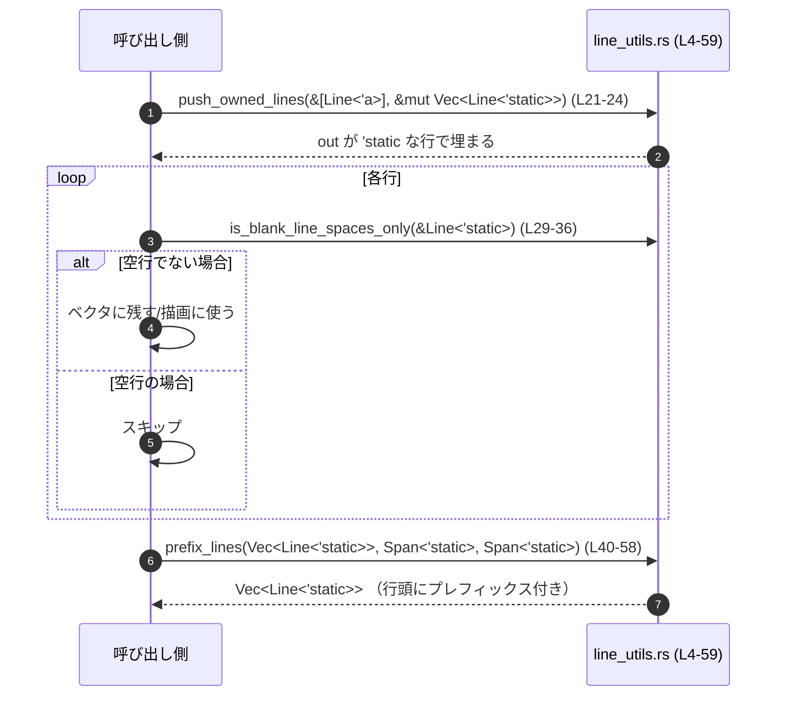

# tui/src/render/line_utils.rs コード解説

## 0. ざっくり一言

`ratatui::text::Line` / `Span` を扱うための、小さなヘルパ関数群です。  
借用中の `Line` を `'static` にクローンしたり、行の空白判定・行頭へのプレフィックス追加といった処理を行います。

---

## 1. このモジュールの役割

### 1.1 概要

このモジュールは、**TUI 描画用のテキスト行 (`Line`) を加工するためのユーティリティ関数**を提供します（根拠: `use ratatui::text::Line;` `Span;` と4つの `pub fn` が定義されているため  
`tui/src/render/line_utils.rs:L1-4,L5-59`）。

提供される主な機能は:

- 借用中の `Line<'_>` を `'static` な `Line<'static>` にクローンする
- 借用中の `Line` のスライスから `'static` な行ベクタを生成する
- 行が「空白行（スペースのみ）」かどうか判定する
- 各行の先頭に別々のプレフィックス `Span` を追加する

### 1.2 アーキテクチャ内での位置づけ

このファイル自体は、状態を持たない純粋なヘルパです。  
内部依存関係は次のとおりです。

- すべての関数は `ratatui::text::Line` / `Span` に依存します（根拠: インポートとシグネチャ  
  `tui/src/render/line_utils.rs:L1-2,L5,L21,L29,L40-44`）。
- `push_owned_lines` は内部で `line_to_static` を呼び出します（根拠: `out.push(line_to_static(l));`  
  `tui/src/render/line_utils.rs:L23`）。
- 他ファイル内の関数や型は、このチャンクには現れていません。

依存関係を簡略図で表すと次のようになります。

```mermaid
flowchart LR
  subgraph "tui/src/render/line_utils.rs (L1-59)"
    A[line_to_static (L4-18)] 
    B[push_owned_lines (L20-25)]
    C[is_blank_line_spaces_only (L27-36)]
    D[prefix_lines (L38-59)]
    B --> A
  end

  Line[ratatui::text::Line<'a>] --> A
  Line --> B
  Line --> C
  Line --> D
  Span[ratatui::text::Span<'a>] --> A
  Span --> D
```

### 1.3 設計上のポイント

コードから読み取れる設計上の特徴は次のとおりです。

- **完全にステートレス**  
  - グローバル変数や内部状態は持たず、引数と戻り値だけで完結する関数のみで構成されています  
    （根拠: すべて `pub fn` で `struct` / `static` がない  
    `tui/src/render/line_utils.rs:L4-59`）。
- **所有権とライフタイムを明示的に扱うユーティリティ**  
  - `Line<'_>` から `Line<'static>` への変換関数が中心であり、TUI 描画用のデータを長期間保持できるようにする意図が読み取れます  
    （根拠: `line_to_static(line: &Line<'_>) -> Line<'static>`  
    `tui/src/render/line_utils.rs:L5`）。
- **エラーハンドリングは不要な純粋処理**  
  - 返り値は `Result` / `Option` ではなく、panic を明示的に発生させるコードもありません  
    （根拠: 全関数シグネチャと本文  
    `tui/src/render/line_utils.rs:L5-59`）。
- **並行性に関するコードはなし**  
  - スレッドや async/await、`Send` / `Sync` など並行性に関する要素はこのチャンクには現れません。

---

## 2. 主要な機能一覧（コンポーネントインベントリー）

このファイルに登場する関数の一覧です（すべて公開 API）。

| 名前 | 種別 | 役割 / 用途 | 定義位置 |
|------|------|-------------|----------|
| `line_to_static` | 関数 | 借用中の `Line<'_>` を `'static` な `Line<'static>` にクローンする | `tui/src/render/line_utils.rs:L4-18` |
| `push_owned_lines` | 関数 | 借用中の `Line` スライスから `'static` な `Line` のベクタに追記する | `tui/src/render/line_utils.rs:L20-25` |
| `is_blank_line_spaces_only` | 関数 | 行が「空（スペースのみ）」かどうか判定する | `tui/src/render/line_utils.rs:L27-36` |
| `prefix_lines` | 関数 | 各行の先頭にプレフィックス `Span` を追加した新しい行ベクタを返す | `tui/src/render/line_utils.rs:L38-59` |

独自の構造体・列挙体はこのファイルには定義されていません。

---

## 3. 公開 API と詳細解説

### 3.1 型一覧（構造体・列挙体など）

このファイル内で直接定義された型はありませんが、使用している外部型を整理します。

| 名前 | 種別 | 役割 / 用途 | 出典 / 備考 | 使用位置 |
|------|------|-------------|-------------|----------|
| `Line<'a>` | 構造体 | テキスト行を表す。スタイル・配置・スパン列を保持する | `ratatui::text::Line`。`style`・`alignment`・`spans` フィールドを使用 | `tui/src/render/line_utils.rs:L5-11,L21,L29-35,L40-42,L45-56` |
| `Span<'a>` | 構造体 | テキスト断片（スパン）を表す。スタイルと内容を保持する | `ratatui::text::Span`。`style`・`content` フィールドを使用 | `tui/src/render/line_utils.rs:L12-15,L42-43,L49-55` |

`Line` / `Span` の内部定義そのものはこのファイルには現れないため、詳細な仕様は不明です。

---

### 3.2 関数詳細

#### `line_to_static(line: &Line<'_>) -> Line<'static>`

**概要**

借用中の `Line<'_>` を、内容をすべてクローンした `'static` ライフタイムの `Line<'static>` に変換します（根拠: シグネチャと `Span` の `content` を `Cow::Owned` で再構築している処理  
`tui/src/render/line_utils.rs:L4-16`）。

**引数**

| 引数名 | 型 | 説明 |
|--------|----|------|
| `line` | `&Line<'_>` | 借用中の行。内部の `spans` などを元に `'static` な行を作成する |

**戻り値**

- `Line<'static>`  
  入力行のスタイル・アラインメントと、内容を文字列クローンしたスパン列を持つ新しい行です（根拠: `style: line.style`, `alignment: line.alignment`, `content: Cow::Owned(s.content.to_string())`  
  `tui/src/render/line_utils.rs:L6-9,L12-15`）。

**内部処理の流れ**

1. 新しい `Line` 構造体リテラルを構築します（`Line { ... }`  
   `tui/src/render/line_utils.rs:L6-17`）。
2. `style` フィールドには `line.style` をコピーします（L7）。
3. `alignment` フィールドには `line.alignment` をコピーします（L8）。
4. `spans` フィールドは:
   - `line.spans.iter()` で各 `Span` を走査し（L10-11）、
   - 各 `Span` から `style` をコピーし（L13）、
   - `content` を `s.content.to_string()` で所有権を持つ `String` に変換し、それを `Cow::Owned` に包み直します（L14）。
   - それらを `.collect()` して新しい `Vec<Span<'static>>` として `spans` に設定します（L12-16）。

**Examples（使用例）**

```rust
use ratatui::text::{Line, Span};

fn convert_borrowed_to_static() {
    // 借用中の Line<'_> を構築する（例として &str から作成）
    let borrowed = Line::from(vec![
        Span::raw("hello"),              // 借用中の &str を含むスパン
    ]);

    // line_to_static で 'static な Line に変換する
    let owned: Line<'static> = line_to_static(&borrowed);

    // owned は 'static なので、借用元より長く保持しても安全
    // （実際には、String として内容がクローンされています）
    println!("{:?}", owned.spans.len());
}
```

**Errors / Panics**

- この関数の中で明示的に panic を発生させるコードはありません（`unwrap` 等なし  
  `tui/src/render/line_utils.rs:L5-18`）。
- 間接的には、ヒープ確保（`to_string`, `collect`）に伴うメモリ不足（OOM）時のランタイムパニックの可能性がありますが、これは Rust 標準ライブラリに共通の挙動です。

**Edge cases（エッジケース）**

- `line.spans` が空の場合  
  - `.iter().map(...).collect()` により空の `Vec` が生成され、空の `Line<'static>` になります（L10-16）。
- 各 `Span` の `content` が空文字列でも、そのまま空文字列としてクローンされます。
- 元の `content` にどのような Unicode 文字が含まれていても、`to_string()` により文字列全体がコピーされます。

**使用上の注意点**

- **コスト**  
  - すべての `Span` の内容を `String` として複製するため、大量の行や長いテキストに対してはメモリ・CPU コストが増加します。
- **ライフタイム意図**  
  - `'static` にする必要がない場合（短命なレンダリングだけの用途など）には、不要なクローンとなる可能性があります。

---

#### `push_owned_lines<'a>(src: &[Line<'a>], out: &mut Vec<Line<'static>>)`

**概要**

借用中の `Line<'a>` のスライスから、`line_to_static` を使って `'static` な `Line<'static>` に変換し、`out` ベクタに追加します（根拠: 関数シグネチャと `for` ループ内で `line_to_static` を呼び `out.push` している処理  
`tui/src/render/line_utils.rs:L20-24`）。

**引数**

| 引数名 | 型 | 説明 |
|--------|----|------|
| `src` | `&[Line<'a>]` | 借用中の `Line` のスライス。元データはこの関数では変更されない |
| `out` | `&mut Vec<Line<'static>>` | `'static` な `Line` を追加していく出力ベクタ |

**戻り値**

- なし (`()`)  
  `out` 引数に副作用として要素が追加されます。

**内部処理の流れ**

1. `for l in src { ... }` で `src` 内のすべての `Line` を順番に走査します（L22）。
2. 各 `l` に対して `line_to_static(l)` を呼び出し、`Line<'static>` に変換します（L23）。
3. 変換した行を `out.push(...)` で出力ベクタに追加します（L23）。

**Examples（使用例）**

```rust
use ratatui::text::{Line, Span};

fn collect_static_lines() {
    let borrowed_lines: Vec<Line> = vec![
        Line::from(vec![Span::raw("line 1")]),
        Line::from(vec![Span::raw("line 2")]),
    ];

    // 'static な Line を溜めておくベクタ
    let mut static_lines: Vec<Line<'static>> = Vec::new();

    // 借用中の行を 'static な行として追加する
    push_owned_lines(&borrowed_lines, &mut static_lines);

    assert_eq!(static_lines.len(), 2);
}
```

**Errors / Panics**

- 明示的な panic はありません（根拠: 本文に panic 呼び出しが無い  
  `tui/src/render/line_utils.rs:L21-24`）。
- `line_to_static` と同様、内部での文字列コピーやベクタ拡張に伴い、OOM によるパニックが起こり得ます。

**Edge cases（エッジケース）**

- `src` が空スライスの場合  
  - ループは 0 回の反復となり、`out` は変化しません（L22-24）。
- `out` にすでに要素が入っている場合  
  - その末尾に対して新しい `'static` 行が順次追加されます。

**使用上の注意点**

- 元の `src` のライフタイムやスコープが短くても、`out` に格納された行は `'static` として安全に保持できますが、その分メモリを消費します。
- 大量の行を頻繁に変換する場合は、`line_to_static` と同様にパフォーマンスコストに注意する必要があります。

---

#### `is_blank_line_spaces_only(line: &Line<'_>) -> bool`

**概要**

指定された `Line` について、**スパンが一つも無い** か、**存在するすべてのスパンの内容が空文字列またはスペース `' '` のみ** で構成されている場合に `true` を返します（根拠: コメントと実装の条件式  
`tui/src/render/line_utils.rs:L27-35`）。

**引数**

| 引数名 | 型 | 説明 |
|--------|----|------|
| `line` | `&Line<'_>` | 空白行かどうかを判定する対象の行 |

**戻り値**

- `bool`  
  - `true`: 空の行、あるいは「スペースのみ」の行  
  - `false`: それ以外（タブや他の文字が一つでも含まれている場合を含む）

**内部処理の流れ**

1. `line.spans.is_empty()` を確認し、スパンが 0 個なら即座に `true` を返します（L30-31）。
2. それ以外の場合、`line.spans.iter().all(...)` で各スパンを評価します（L33-35）。
3. 各スパン `s` について  
   - `s.content.is_empty()` ならそのスパンは「空」と見なします（L35）。
   - そうでない場合は、`s.content.chars().all(|c| c == ' ')` で、すべての文字がスペース `' '` かどうか判定します（L35）。
4. 全スパンが上記条件を満たす場合にだけ `true` を返し、1 つでも条件を満たさないスパンがあれば `false` になります。

**Examples（使用例）**

```rust
use ratatui::text::{Line, Span};

fn check_blank_lines() {
    let blank = Line::from(vec![Span::raw("   ")]);       // スペース3つ
    let non_blank = Line::from(vec![Span::raw("  x ")]);  // 途中に 'x'

    assert!(is_blank_line_spaces_only(&blank));           // true
    assert!(!is_blank_line_spaces_only(&non_blank));      // false
}
```

**Errors / Panics**

- 明示的な panic はありません（`unwrap` やインデックスアクセスは無し  
  `tui/src/render/line_utils.rs:L29-36`）。
- `chars()` など標準ライブラリのメソッドのみを利用しています。

**Edge cases（エッジケース）**

- `line.spans` が空  
  - 即座に `true` を返し、「空行」とみなします（L30-31）。
- `content` が空文字列のスパンのみを含む場合  
  - `s.content.is_empty()` が `true` となり、そのスパンは「空」とみなされます（L35）。
- タブ `\t` や改行 `\n`、他の Unicode 空白文字（全角スペース等）が含まれる場合  
  - `c == ' '` の条件を満たさないため、そのスパンは「スペースのみ」とは見なされず、結果として `false` になります（L35）。  
  - コメント文にも「no tabs/newlines」とあるため、スペース以外の空白文字は空行と見なさない設計です（L27-28）。

**使用上の注意点**

- 「空行」の定義が **ASCII スペース `' '` のみ** に限定されており、タブや全角スペースを含む行は空行になりません。入力としてどのような文字が来るかを意識する必要があります。
- 描画上、タブや他の空白も「視覚的には空」に見えてほしい場合、この関数の基準はアプリケーションの期待と異なる可能性があります。

---

#### `prefix_lines(

    lines: Vec<Line<'static>>,
    initial_prefix: Span<'static>,
    subsequent_prefix: Span<'static>,
) -> Vec<Line<'static>>`

**概要**

`lines` の各行の先頭にプレフィックス `Span` を追加した、新しい `'static` 行ベクタを返します。  
最初の行には `initial_prefix`、2 行目以降には `subsequent_prefix` を付加します（根拠: コメントと `enumerate()` による `i == 0` 判定  
`tui/src/render/line_utils.rs:L38-39,L45-55`）。

**引数**

| 引数名 | 型 | 説明 |
|--------|----|------|
| `lines` | `Vec<Line<'static>>` | 加工対象の行ベクタ。関数内で消費され、新しい行に変換される |
| `initial_prefix` | `Span<'static>` | 最初の行の先頭に挿入するプレフィックス |
| `subsequent_prefix` | `Span<'static>` | 2 行目以降の各行の先頭に挿入するプレフィックス |

**戻り値**

- `Vec<Line<'static>>`  
  各要素が、元の行に 1 つのプレフィックス `Span` を追加した新しい `Line` を表すベクタです（根拠: `.map(|(i, l)| { ... Line::from(spans).style(l.style) })` 全体  
  `tui/src/render/line_utils.rs:L45-57`）。

**内部処理の流れ（アルゴリズム）**

1. `lines.into_iter().enumerate()` により、もとのベクタを消費しながら `(index, line)` ペアを列挙します（L45-48）。
2. 各 `(i, l)` に対して以下を行います。
   1. `let mut spans = Vec::with_capacity(l.spans.len() + 1);` で、既存スパン数 + 1 の容量を持つベクタを確保します（L49）。
   2. `i == 0` なら `initial_prefix.clone()`、それ以外なら `subsequent_prefix.clone()` を `spans.push(...)` で先頭に追加します（L50-54）。
   3. `spans.extend(l.spans);` で元の行の全スパンを後ろに連結します（L55）。
   4. `Line::from(spans).style(l.style)` で、このスパン列から新しい行を作り、元の行の `style` を設定します（L56）。
3. `.collect()` により、すべての変換結果を新しい `Vec<Line<'static>>` にまとめて返します（L58）。

**Examples（使用例）**

```rust
use ratatui::text::{Line, Span};

fn add_prefix_to_lines() {
    let lines: Vec<Line<'static>> = vec![
        Line::from("first"),
        Line::from("second"),
    ];

    let first_prefix = Span::raw("▶ ");   // 最初の行だけに付けるプレフィックス
    let other_prefix = Span::raw("  ");   // 2行目以降に付けるインデント

    let prefixed = prefix_lines(lines, first_prefix, other_prefix);

    // 先頭行は "▶ first"、2行目は "  second" のような構成になります
    assert_eq!(prefixed.len(), 2);
}
```

**Errors / Panics**

- 明示的な panic はありません（根拠: 本文に panic 関数や `unwrap` がない  
  `tui/src/render/line_utils.rs:L40-59`）。
- `Vec::with_capacity` や `collect` に伴うメモリ不足によるパニックの可能性はあります。
- `initial_prefix.clone()` / `subsequent_prefix.clone()` がパニックする可能性は、`Span` の `Clone` 実装次第ですが、このチャンクからは分かりません。

**Edge cases（エッジケース）**

- `lines` が空ベクタの場合  
  - `into_iter()` の結果が空であるため、`map` は一度も実行されず、空のベクタが返ります（L45-48,L58）。
- `lines` に 1 要素だけ含まれる場合  
  - その 1 行には `initial_prefix` のみが付与されます。`subsequent_prefix` は使用されません（L50-54）。
- 元の `Line` が `spans` を持たない場合  
  - `with_capacity(0 + 1)` で 1 スパン分の容量を確保し、プレフィックスのみを含む行になります（L49-55）。
- `alignment` について  
  - 新しい `Line` を `Line::from(spans)` で生成し、その後 `style(l.style)` のみ設定しているため、**元の行の `alignment` フィールドは引き継いでいません**（根拠: `l.alignment` がどこにも参照されていない  
    `tui/src/render/line_utils.rs:L49-56`）。

**使用上の注意点**

- 元の `lines` は `into_iter()` で消費されるため、この関数呼び出し後には再利用できません。
- アラインメントを保持したい場合、この実装だけでは元の `alignment` が失われる可能性があります（`Line::from` のデフォルト値に依存）。必要であれば別途 `alignment` のコピー処理を追加する必要があります。
- プレフィックス `Span` は行数に応じて `clone` されるため、巨大なベクタに対しては `Span` 内容の複製コストがかかります。

---

### 3.3 その他の関数

このファイルに定義されている関数は、すべて上記で詳細解説済みです。  
補助的な非公開関数や単純なラッパー関数はこのチャンクには現れません。

---

## 4. データフロー

このセクションでは、4 関数を組み合わせて利用した場合の代表的なデータフロー例を示します。  
あくまで「利用例」であり、このリポジトリ全体で実際にこう使われているかどうかは、このチャンクからは分かりません。

### 4.1 代表的なシナリオ（例）

シナリオ:  
「借用中の行スライスから `'static` 行を作成し、空行をスキップしつつプレフィックスを付ける」

1. 呼び出し側が `&[Line<'_>]` を持っている。
2. `push_owned_lines` で `'static` な `Vec<Line<'static>>` を作る。
3. そのベクタから `is_blank_line_spaces_only` で空行のみをフィルタするかスキップする。
4. 最後に `prefix_lines` で先頭行・以降の行にプレフィックスを付与する。

この流れをシーケンス図で表すと次のようになります。



この図に示した呼び出し関係は、すべて `tui/src/render/line_utils.rs (L4-59)` 内の関数に基づいています。

---

## 5. 使い方（How to Use）

### 5.1 基本的な使用方法

ここでは、4 つの関数を組み合わせて使う簡単な例を示します。

```rust
use ratatui::text::{Line, Span};

// ここでは line_utils.rs が同じクレート内にあると仮定する
use crate::render::line_utils::{
    line_to_static,
    push_owned_lines,
    is_blank_line_spaces_only,
    prefix_lines,
};

fn build_prefixed_lines() -> Vec<Line<'static>> {
    // 借用中の Line をいくつか用意する
    let borrowed: Vec<Line> = vec![
        Line::from(""),                    // 空行
        Line::from("content 1"),          // 内容あり
        Line::from("   "),                // スペースのみ（空行扱い）
        Line::from("content 2"),          // 内容あり
    ];

    // 'static な Line を保持するベクタ
    let mut owned: Vec<Line<'static>> = Vec::new();

    // 借用中の行をすべて 'static にクローンして owned に追加する
    push_owned_lines(&borrowed, &mut owned);

    // 空行（スペースのみ含む行を含む）をフィルタする
    owned.retain(|l| !is_blank_line_spaces_only(l));

    // 行頭にプレフィックスを付ける
    let first_prefix = Span::raw("• ");   // 最初の行用
    let other_prefix = Span::raw("  ");   // 2 行目以降用

    let prefixed = prefix_lines(owned, first_prefix, other_prefix);

    prefixed
}
```

この例では、借用中の行から `'static` 行を作成し、空行を取り除いた上で行頭にプレフィックスを付与した結果を `Vec<Line<'static>>` として返しています。

### 5.2 よくある使用パターン

1. **短命な `Line<'_>` を `'static` に昇格させてキャッシュする**

   - `line_to_static` / `push_owned_lines` を使って `'static` な行コレクションを作り、一度計算した結果を再利用するパターンです。

   ```rust
   fn cache_lines(src: &[Line]) -> Vec<Line<'static>> {
       let mut cached = Vec::new();
       push_owned_lines(src, &mut cached);
       cached
   }
   ```

2. **プレフィックス付きの箇条書き表示を作る**

   - `prefix_lines` を使って、最初の項目だけ特別なマーカーを付け、以降をインデントするような表示が可能です。

   ```rust
   fn bullet_list(lines: Vec<Line<'static>>) -> Vec<Line<'static>> {
       let first = Span::raw("• ");
       let rest = Span::raw("  ");
       prefix_lines(lines, first, rest)
   }
   ```

### 5.3 よくある間違い

```rust
use ratatui::text::{Line, Span};
use crate::render::line_utils::prefix_lines;

// 間違い例: lines を別の場所でも使おうとしている
fn wrong_usage() {
    let lines: Vec<Line<'static>> = vec![Line::from("text")];

    let first = Span::raw("• ");
    let rest = Span::raw("  ");

    let prefixed = prefix_lines(lines, first, rest);

    // ↓ コンパイルエラー: lines は prefix_lines 内で消費されている
    // println!("{:?}", lines.len());
}

// 正しい例: prefix_lines の戻り値だけを使う
fn correct_usage() {
    let lines: Vec<Line<'static>> = vec![Line::from("text")];
    let first = Span::raw("• ");
    let rest = Span::raw("  ");

    let prefixed = prefix_lines(lines, first, rest);
    println!("{:?}", prefixed.len());
}
```

### 5.4 使用上の注意点（まとめ）

- **所有権とライフタイム**
  - `line_to_static` / `push_owned_lines` は、元の `Line<'_>` の内容をコピーして `'static` にするため、所有権とライフタイムの制約を緩和できますが、その分メモリコストがあります。
  - `prefix_lines` は `lines: Vec<Line<'static>>` を消費するため、呼び出し後に元のベクタを再利用することはできません。

- **空白行の判定基準**
  - `is_blank_line_spaces_only` は「ASCII スペースのみ」を空白とみなし、タブや全角スペースなどは空白として扱いません。

- **エラー・パニック**
  - 明示的なエラー戻り値や panic はありません。panic の可能性は、主に内部で利用している標準ライブラリ（主にヒープ確保）に依存します。

- **並行性**
  - これらの関数は共有可変状態を持たない純粋な変換であり、引数を適切にスレッド間で共有（例: 各スレッドが独自の `Vec` を持つ）している限り、特別な同期機構なしに並行呼び出しが可能な設計です。

---

## 6. 変更の仕方（How to Modify）

### 6.1 新しい機能を追加する場合

このファイルは「`Line` / `Span` に関するユーティリティ」をまとめた場所として機能しているため、類似の機能を追加する場合はこのファイルに拡張するのが自然です。

追加の観点:

1. **場所の選定**
   - `tui/src/render/line_utils.rs` 内に新しい `pub fn` を定義するのが一貫性があります。
2. **既存関数の再利用**
   - 例えば「トリミング付きのプレフィックス追加」などを実装する際には、`is_blank_line_spaces_only` や `prefix_lines` を内部で呼び出すようにすると、挙動を統一しやすくなります。
3. **ライフタイム設計**
   - `'static` を返すか、借用を維持するかなど、既存の関数と同様にライフタイムを明示して設計する必要があります。

### 6.2 既存の機能を変更する場合

変更時に注意すべき点:

- **コントラクト（前提条件・返り値の意味）**
  - `is_blank_line_spaces_only` の「空行」の定義を変更すると、この関数に依存する他コードの挙動が変わる可能性があります。
  - `prefix_lines` が元の `alignment` を保持しない点を変更する場合、既存のレイアウトに影響が出る可能性があります（根拠: `l.alignment` が現状参照されていない  
    `tui/src/render/line_utils.rs:L49-56`）。
- **影響範囲の確認**
  - どの他モジュールからこれらの関数が呼ばれているかは、このチャンクからは分かりません。リポジトリ全体の参照検索が必要です。
- **テスト**
  - このファイル内にテストコードは存在しません（このチャンクには現れないため、テストの有無は不明）。  
    変更前後の挙動を確認するためには、別途テスト追加が望まれます。

---

## 7. 関連ファイル

このチャンク内から直接参照されているのは `ratatui::text` の型のみであり、同一クレート内の他ファイルは明示的には登場しません。

| パス | 役割 / 関係 |
|------|------------|
| `(外部クレート) ratatui::text` | `Line` / `Span` 型およびそれに関連するメソッド（`Line::from`, `Span::raw` など）を提供する。`line_utils.rs` の全関数がこれらの型に依存している（根拠: `use ratatui::text::Line; use ratatui::text::Span;` `tui/src/render/line_utils.rs:L1-2`）。 |

同一リポジトリ内の他の TUI レンダリング関連ファイル（例: `tui/src/render/...` の他ファイル）との関係は、このチャンクには現れず不明です。
