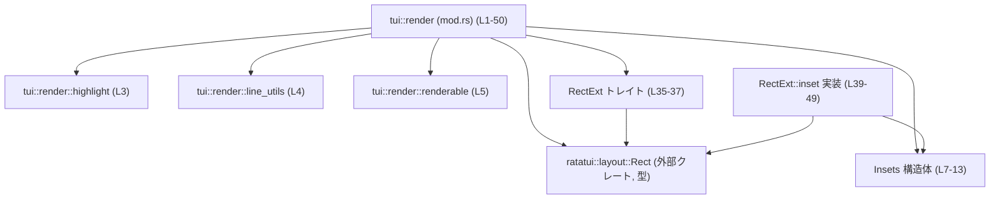
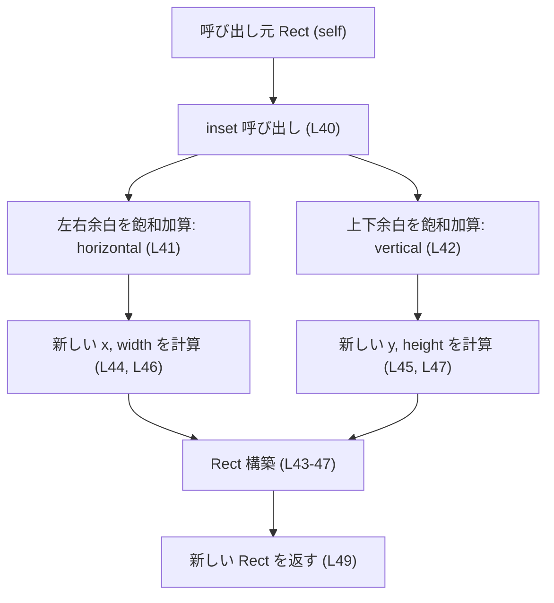
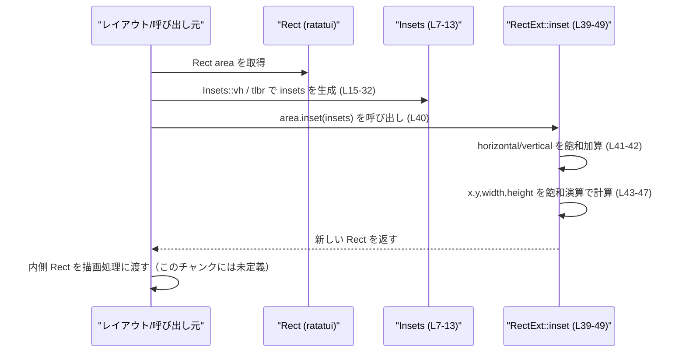

# tui/src/render/mod.rs コード解説

## 0. ざっくり一言

このモジュールは、`ratatui::layout::Rect` に対して「余白（インセット）」を適用するためのユーティリティを提供し、描画領域の内側にサブ領域を安全に計算するための拡張トレイトと補助構造体を定義しています（`tui/src/render/mod.rs:L1-50`）。

---

## 1. このモジュールの役割

### 1.1 概要

- このモジュールは **TUI レイアウトで使用する矩形（Rect）の内側に余白を取った矩形を計算する** ために存在します。
- 具体的には、余白を表す `Insets` 構造体（`tui/src/render/mod.rs:L7-13`）と、`Rect` に `inset` メソッドを追加する拡張トレイト `RectExt`（`tui/src/render/mod.rs:L35-37`）を提供します。
- 併せて、描画関連のサブモジュール `highlight`, `line_utils`, `renderable` を公開しています（`tui/src/render/mod.rs:L3-5`）。

### 1.2 アーキテクチャ内での位置づけ

このファイルが担う役割と依存関係を簡単な図で表します。



- `mod.rs` は `ratatui::layout::Rect` に依存し（`use ratatui::layout::Rect;`、`tui/src/render/mod.rs:L1`）、その型に対して拡張トレイトを実装します（`tui/src/render/mod.rs:L39-49`）。
- `highlight`, `line_utils`, `renderable` はサブモジュールとして宣言されていますが、このチャンクには定義が含まれていません（`tui/src/render/mod.rs:L3-5`）。役割の詳細は不明です。

### 1.3 設計上のポイント

コードから読み取れる設計上の特徴は次のとおりです。

- **余白情報を構造体にまとめる**
  - 余白を左右上下の 4 方向に分けた `Insets` 構造体を用意し、矩形操作の引数を一つにまとめています（`tui/src/render/mod.rs:L7-13`）。
- **コンストラクタを用途別に提供**
  - 上下左右を個別に指定する `tlbr` と、垂直方向・水平方向をまとめて指定する `vh` という 2 種類のコンストラクタを提供しています（`tui/src/render/mod.rs:L15-32`）。
- **拡張トレイトによる API 拡張**
  - 外部型 `Rect` に対して、`RectExt` というトレイトを実装することで `inset` メソッドを追加しています（`tui/src/render/mod.rs:L35-37`, `L39-49`）。呼び出し側からは `rect.inset(...)` のような自然な記法になります。
- **飽和演算による安全な整数計算**
  - `saturating_add` / `saturating_sub` を用いており、オーバーフロー／アンダーフロー時にもパニックせず 0 か最大値に「飽和」します（`tui/src/render/mod.rs:L41-47`）。これにより、インセットが大きすぎる場合でも panic ではなく幅・高さ 0 の矩形などで表現されます。
- **状態を持たない純粋関数**
  - `inset` は与えられた `Rect` と `Insets` から新しい `Rect` を計算する純粋な処理であり、グローバル状態や内部状態を持ちません（`tui/src/render/mod.rs:L40-48`）。並行実行時にも追加の同期は不要です。

---

## 2. 主要な機能一覧（コンポーネントインベントリー）

### 2.1 コンポーネント一覧

このチャンクに現れる型・トレイト・関数・モジュールの一覧です。

#### モジュール

| 名前 | 種別 | 役割 / 用途 | 定義位置 |
|------|------|-------------|----------|
| `highlight` | サブモジュール宣言 | レンダリングの「ハイライト」関連（名称から）と推測されますが、このチャンクには定義がなく詳細は不明です。 | `tui/src/render/mod.rs:L3` |
| `line_utils` | サブモジュール宣言 | 行描画・行処理用ユーティリティ（名称から）と推測されますが、このチャンクには定義がなく詳細は不明です。 | `tui/src/render/mod.rs:L4` |
| `renderable` | サブモジュール宣言 | 描画可能オブジェクトに関する機能（名称から）と推測されますが、このチャンクには定義がなく詳細は不明です。 | `tui/src/render/mod.rs:L5` |

※役割の説明はモジュール名からの推測であり、**コード上の根拠はこのチャンクには存在しません**。

#### 型・トレイト

| 名前 | 種別 | 役割 / 用途 | 定義位置 |
|------|------|-------------|----------|
| `Insets` | 構造体 | 矩形の上下左右の余白量を `u16` で保持する（left, top, right, bottom）。 | `tui/src/render/mod.rs:L7-13` |
| `RectExt` | トレイト | `Rect` に `inset` メソッドを追加する拡張トレイト。 | `tui/src/render/mod.rs:L35-37` |

#### 関数・メソッド

| 名前 | 所属 | シグネチャ | 役割 / 用途 | 定義位置 |
|------|------|------------|-------------|----------|
| `Insets::tlbr` | `impl Insets` | `pub fn tlbr(top: u16, left: u16, bottom: u16, right: u16) -> Self` | 上・左・下・右を個別に指定して `Insets` を生成する。 | `tui/src/render/mod.rs:L15-23` |
| `Insets::vh` | `impl Insets` | `pub fn vh(v: u16, h: u16) -> Self` | 垂直方向（上下）と水平方向（左右）で余白をまとめて指定して `Insets` を生成する。 | `tui/src/render/mod.rs:L25-32` |
| `RectExt::inset`（trait） | `RectExt` | `fn inset(&self, insets: Insets) -> Rect` | `Rect` に余白を適用した内側の `Rect` を返す。 | `tui/src/render/mod.rs:L35-36` |
| `RectExt::inset`（impl） | `impl RectExt for Rect` | `fn inset(&self, insets: Insets) -> Rect` | 実際の余白計算ロジック。飽和演算を使って新しい `Rect` を構築する。 | `tui/src/render/mod.rs:L39-49` |

---

## 3. 公開 API と詳細解説

### 3.1 型一覧（構造体・トレイト）

| 名前 | 種別 | フィールド / メソッド概要 | 定義位置 |
|------|------|---------------------------|----------|
| `Insets` | 構造体 | `left`, `top`, `right`, `bottom` の 4 つの `u16` フィールドを持つ。`Clone`, `Copy`, `Debug`, `PartialEq`, `Eq` を derive 済み。 | `tui/src/render/mod.rs:L7-13` |
| `RectExt` | トレイト | `fn inset(&self, insets: Insets) -> Rect` を定義する。`Rect` 型に対して実装されている。 | `tui/src/render/mod.rs:L35-37`, `L39-49` |

#### `Insets` のフィールド詳細

- `left: u16` – 左方向の余白（`tui/src/render/mod.rs:L9`）
- `top: u16` – 上方向の余白（`tui/src/render/mod.rs:L10`）
- `right: u16` – 右方向の余白（`tui/src/render/mod.rs:L11`）
- `bottom: u16` – 下方向の余白（`tui/src/render/mod.rs:L12`）

`#[derive(Clone, Copy, Debug, PartialEq, Eq)]` が付与されており（`tui/src/render/mod.rs:L7`）、値コピーや比較が容易です。

---

### 3.2 関数詳細

#### `Insets::tlbr(top: u16, left: u16, bottom: u16, right: u16) -> Insets`

**概要**

上下左右をそれぞれ個別の値で指定して `Insets` を生成するコンストラクタです（`tui/src/render/mod.rs:L15-23`）。

**引数**

| 引数名 | 型 | 説明 |
|--------|----|------|
| `top` | `u16` | 上方向の余白量。 |
| `left` | `u16` | 左方向の余白量。 |
| `bottom` | `u16` | 下方向の余白量。 |
| `right` | `u16` | 右方向の余白量。 |

**戻り値**

- `Insets` – 与えられた 4 つの値を `top`, `left`, `bottom`, `right` にそれぞれセットした新しい `Insets` インスタンス（`tui/src/render/mod.rs:L17-21`）。

**内部処理の流れ**

1. `Self { top, left, bottom, right }` でフィールドに引数をそのまま代入して `Insets` を構築します（`tui/src/render/mod.rs:L17-21`）。
2. 追加の検証や変換は行っていません。

**Examples（使用例）**

```rust
use crate::render::Insets; // Insets構造体をインポートする

fn create_insets() -> Insets {              // Insetsを生成して返す関数
    let insets = Insets::tlbr(1, 2, 3, 4);  // 上1, 左2, 下3, 右4の余白を持つInsetsを作成する
    insets                                  // そのまま返す
}
```

**エラー / パニック**

- この関数は単に構造体を構築するだけであり、`Result` を返さず、panic するコードも含まれていません（`tui/src/render/mod.rs:L16-23`）。

**Edge cases（エッジケース）**

- `u16` の範囲内であればどのような値でも受け付けます。値に対する検証（例えば極端に大きい余白を制限する等）は行っていません。
- `0` を渡せばその方向に余白がないことを意味します。

**使用上の注意点**

- 意味的には「ピクセル」や「セル数」など UI の単位として解釈されることが多いと考えられますが、このチャンクには単位に関する情報はありません。
- 実際の `Rect` の幅・高さを超えるような大きな余白値を指定しても構文的には問題ありませんが、その結果は `RectExt::inset` 側の飽和演算に依存します（詳細は後述）。

---

#### `Insets::vh(v: u16, h: u16) -> Insets`

**概要**

垂直方向（上下）と水平方向（左右）の余白をそれぞれまとめて指定して `Insets` を生成するコンストラクタです（`tui/src/render/mod.rs:L25-32`）。

**引数**

| 引数名 | 型 | 説明 |
|--------|----|------|
| `v` | `u16` | 垂直方向の余白量。上と下の両方に適用されます。 |
| `h` | `u16` | 水平方向の余白量。左と右の両方に適用されます。 |

**戻り値**

- `Insets` – `top` と `bottom` に `v`、`left` と `right` に `h` を設定した `Insets`（`tui/src/render/mod.rs:L26-30`）。

**内部処理の流れ**

1. `Self { top: v, left: h, bottom: v, right: h }` で各フィールドに対応する値を代入します（`tui/src/render/mod.rs:L26-30`）。
2. 検証ロジックはありません。

**Examples（使用例）**

```rust
use crate::render::Insets; // Insetsをインポートする

fn uniform_insets() -> Insets {             // 上下左右に一定の余白を付ける例
    let insets = Insets::vh(1, 2);          // 上下1, 左右2の余白を持つInsetsを作成する
    insets                                  // そのまま返す
}
```

**エラー / パニック**

- `tlbr` 同様、エラーや panic を発生させるコードは含まれていません（`tui/src/render/mod.rs:L25-32`）。

**Edge cases**

- `v` や `h` が 0 の場合、対応する方向の余白は 0 になります。
- 極端に大きい値を指定した場合も、そのまま `Insets` に保存されます。実際の描画への影響は `RectExt::inset` の挙動に依存します。

**使用上の注意点**

- 上下左右で対称な余白を付けたいケースで簡便に使えるコンストラクタです。
- 左右・上下で異なる値を指定したい場合は `tlbr` を使用します。

---

#### `RectExt::inset(&self, insets: Insets) -> Rect`

**概要**

`Rect` に対して `Insets` で指定した上下左右の余白を適用し、内側の矩形（Rect）を計算して返します。元の `Rect` は変更せず、新しい `Rect` を返します（`tui/src/render/mod.rs:L39-49`）。

**引数**

| 引数名 | 型 | 説明 |
|--------|----|------|
| `&self` | `&Rect` | 余白を適用したい元の矩形。フィールド `x`, `y`, `width`, `height` を持つことがコードから読み取れます（`tui/src/render/mod.rs:L44-47`）。 |
| `insets` | `Insets` | 適用する余白。左右・上下の量を持つ構造体（`tui/src/render/mod.rs:L40-42`）。 |

**戻り値**

- `Rect` – `self` の位置・サイズから `Insets` 分だけ内側に縮めた矩形。左上座標と幅・高さが飽和演算で計算されます（`tui/src/render/mod.rs:L43-47`）。

**内部処理の流れ（アルゴリズム）**

1. 左右の余白の合計を計算  
   `let horizontal = insets.left.saturating_add(insets.right);`  
   （`tui/src/render/mod.rs:L41`）

2. 上下の余白の合計を計算  
   `let vertical = insets.top.saturating_add(insets.bottom);`  
   （`tui/src/render/mod.rs:L42`）

3. 新しい `Rect` を構築  

   ```rust
   Rect {
       x: self.x.saturating_add(insets.left),
       y: self.y.saturating_add(insets.top),
       width: self.width.saturating_sub(horizontal),
       height: self.height.saturating_sub(vertical),
   }
   ```

   （`tui/src/render/mod.rs:L43-47`）

   - 左上座標 `x` は元の `x` に左余白 `insets.left` を飽和加算します。
   - 左上座標 `y` は元の `y` に上余白 `insets.top` を飽和加算します。
   - `width` は元の幅から左右合計の余白 `horizontal` を飽和減算します。
   - `height` は元の高さから上下合計の余白 `vertical` を飽和減算します。

4. 飽和演算（`saturating_add` / `saturating_sub`）により、計算途中でオーバーフロー・アンダーフローが起きる場合は、値が 0 または型の最大値にクランプされます（Rust の整数型に共通の仕様）。

**簡易フローチャート**



**Examples（使用例）**

`Rect` から左右2セル・上下1セルの余白を引いた内側の矩形を得る例です。

```rust
use ratatui::layout::Rect;           // ratatuiのRect型をインポートする（tui/src/render/mod.rs:L1と同じ）
use crate::render::{Insets, RectExt}; // 同じクレートのInsetsとRectExtトレイトをインポートする

fn inset_example(area: Rect) -> Rect {         // 与えられた描画領域から内側領域を計算する関数
    let insets = Insets::vh(1, 2);             // 上下1, 左右2セル分の余白を指定する（L25-32）
    let inner = area.inset(insets);            // RectExt::insetで余白分だけ内側のRectを取得する（L39-49）
    inner                                      // 計算したRectを返す
}
```

**エラー / パニック**

- 関数内で `saturating_add` / `saturating_sub` しか使用しておらず（`tui/src/render/mod.rs:L41-47`）、これらは整数型で panic しない設計のため、通常入力に対して panic は発生しません。
- `Result` を返さないため、エラーは戻り値として表現されません。代わりに幅・高さが 0 になるなどの形で「表示不可なサイズ」を返す可能性があります（`tui/src/render/mod.rs:L46-47`）。

**Edge cases（エッジケース）**

- **余白合計が元の幅・高さ以上**  
  - 例えば `width = 10` の `Rect` に対して左右合計 `horizontal = 20` を指定すると、`self.width.saturating_sub(horizontal)` は 0 になります（`tui/src/render/mod.rs:L41, L46`）。
  - 同様に、余白合計が高さ以上の場合、`height` は 0 になります（`tui/src/render/mod.rs:L42, L47`）。
  - 結果として「幅 0 」「高さ 0」の `Rect` になる可能性があります。これはエラー扱いにはなっていません。

- **座標のオーバーフロー**  
  - `self.x` と `insets.left` の合計が型の最大値を超える場合、`saturating_add` により上限値にクランプされます（`tui/src/render/mod.rs:L44`）。
  - `self.y` についても同様です（`tui/src/render/mod.rs:L45`）。
  - 座標が意図した位置からずれる可能性はありますが、panic や wrap-around は避けられます。

- **余白が 0 の場合**  
  - 全ての余白が 0 の場合、元の `Rect` と同じ値が返ります（`tui/src/render/mod.rs:L41-47` から自明）。

**使用上の注意点**

- 余白の合計が元の `Rect` の幅・高さを超えた場合でもエラーにはならず、幅・高さが 0 になった `Rect` が返る点に注意が必要です。  
  → 0 サイズの `Rect` を描画コードがどう扱うかは別の箇所に依存し、このチャンクからは分かりません。
- 飽和演算を用いているため、座標やサイズが「静かに」補正される設計です。  
  → オーバーフロー／アンダーフローによる panic や wrap-around を避ける一方で、意図しない値に気づきにくい可能性があります。必要なら呼び出し側でチェックすることが推奨されます。
- 関数は純粋であり、グローバル状態に依存しないため、複数スレッドから同時に呼び出しても追加の同期は要りません（`tui/src/render/mod.rs:L40-48` のローカル変数のみを使用）。

---

### 3.3 その他の関数

- このチャンクには、上記以外の補助関数や単純なラッパー関数は定義されていません。

---

## 4. データフロー

ここでは、典型的な処理シナリオとして「レイアウトで割り当てられた `Rect` から、描画に使う内側の `Rect` を計算する」流れを示します。

1. レイアウトフェーズで、描画領域として `Rect`（例: `area`）が決定されます。
2. 呼び出し側で必要な余白量を `Insets`（`tlbr` または `vh`）で生成します。
3. `area.inset(insets)` を呼び出し、内側の `Rect` を取得します。
4. 得られた `Rect` を描画処理が使用します（描画処理はこのチャンクには現れません）。



この流れから分かるように、本モジュールは「**レイアウト結果と描画処理の間の橋渡しとして、余白込みの描画領域を計算する役割**」を担っています。

---

## 5. 使い方（How to Use）

### 5.1 基本的な使用方法

`RectExt` トレイトと `Insets` を使って、レイアウトで得た `Rect` から内側の矩形を計算する典型的なコード例です。

```rust
use ratatui::layout::Rect;              // ratatuiからRect型をインポートする（tui/src/render/mod.rs:L1）
use crate::render::{Insets, RectExt};   // 同じクレートのInsetsとRectExtをインポートする

fn inner_area(area: Rect) -> Rect {     // レイアウト済みのareaから内側のRectを計算する関数
    let insets = Insets::vh(1, 2);      // 上下1, 左右2の余白を指定する（L25-32）
    let inner = area.inset(insets);     // RectExt::insetで余白分を内側に縮めたRectを得る（L39-49）
    inner                               // 計算したRectを返す
}
```

- `RectExt` はトレイトなので、`Rect` に対して `inset` メソッドを使うには、このトレイトをスコープにインポートする必要があります（`use crate::render::RectExt;`）。
- `Insets` は値型であり `Copy` なので、複数回使い回しても所有権の問題は発生しません（`tui/src/render/mod.rs:L7` の `Copy` derive より）。

### 5.2 よくある使用パターン

1. **一定の余白を全てのウィジェットに適用する**

```rust
use ratatui::layout::Rect;             // Rect型をインポートする
use crate::render::{Insets, RectExt};  // InsetsとRectExtをインポートする

fn widget_area(area: Rect) -> Rect {   // ウィジェット用の描画領域を計算する関数
    let insets = Insets::vh(1, 1);     // 上下左右すべて1セル分の余白を取る
    area.inset(insets)                 // 余白を適用したRectを返す
}
```

1. **左右・上下で異なる余白を与える**

```rust
use ratatui::layout::Rect;             // Rect型をインポートする
use crate::render::{Insets, RectExt};  // InsetsとRectExtをインポートする

fn header_area(area: Rect) -> Rect {      // ヘッダ領域用のRectを計算する関数
    let insets = Insets::tlbr(1, 2, 0, 2); // 上1, 左右2, 下0の余白を取る
    area.inset(insets)                    // 余白適用後のRectを返す
}
```

### 5.3 よくある間違い（起こりうる誤用）

このチャンクだけから「実際によくあるか」は分かりませんが、設計から想定される誤用例とその修正例を示します。

```rust
use ratatui::layout::Rect;
use crate::render::{Insets, RectExt};

// 誤り例: 余白が元のRectのサイズを大きく超えている
fn wrong(area: Rect) -> Rect {
    let insets = Insets::vh(1000, 1000);  // 非常に大きな余白を指定している
    area.inset(insets)                    // width, heightが0になり描画に使えない可能性がある
}

// 正しい例: Rectのサイズに見合った余白を指定する
fn correct(area: Rect) -> Rect {
    let insets = Insets::vh(1, 2);        // 現実的な余白を指定する
    area.inset(insets)                    // 有効なサイズのRectが得られる可能性が高い
}
```

- `inset` はエラーを返さないため、余白が大きすぎても一見「正常に動いているように見える」点に注意が必要です。
- 呼び出し側で、結果の `Rect` の幅・高さが 0 でないことなどをチェックすることが望ましいケースがあります。

### 5.4 使用上の注意点（まとめ）

- **前提条件**
  - `RectExt::inset` は `Rect` のフィールド `x`, `y`, `width`, `height` が整数型であることを前提にしています（`saturating_add` / `saturating_sub` を呼び出しているため、`tui/src/render/mod.rs:L41-47`）。
  - 余白値は `u16` であり、負の値は取りません（`tui/src/render/mod.rs:L9-12`）。

- **安全性（Rust特有の観点）**
  - 所有権・借用に関して: `inset` は `&self` を取り、`self` の所有権を奪いません（`tui/src/render/mod.rs:L40`）。同じ `Rect` を何度も借用して呼び出せます。
  - `Insets` は `Copy` なので、所有権移動を意識せず値渡しが可能です（`tui/src/render/mod.rs:L7`）。
  - 飽和演算により、整数オーバーフローによる未定義動作や panic は避けられます。

- **並行性**
  - `inset` は純粋関数であり、グローバル状態や内部可変状態を持ちません（ローカル変数のみ使用、`tui/src/render/mod.rs:L40-48`）。複数スレッドから同時に呼ぶ場合でもデータ競合は発生しません。
  - このチャンクには `Send` / `Sync` に関する明示的な境界や属性はありませんが、少なくともこの関数のロジック自体は並行使用に対して特別な配慮を必要としません。

- **パフォーマンス**
  - 演算は整数の加算・減算と構造体の生成のみで O(1) です（`tui/src/render/mod.rs:L41-47`）。大量の呼び出しでもオーバーヘッドは非常に小さいと考えられます。

---

## 6. 変更の仕方（How to Modify）

### 6.1 新しい機能を追加する場合

このファイルに新しい矩形操作や余白操作の機能を追加する場合の自然な拡張ポイントです。

1. **余白の表現を拡張したい場合**
   - `Insets` に新しいフィールドやメソッドを追加することが考えられます（`tui/src/render/mod.rs:L7-13`, `L15-32`）。
   - 例: 外側だけでなく、内側パディングやマージン種別を区別したい場合など。
   - ただしフィールド追加は既存コードとの互換性に影響するため、このチャンクだけでは影響範囲を判断できません。

2. **新しい `Rect` 操作を追加したい場合**
   - `RectExt` トレイトに新しいメソッドを追加し（`tui/src/render/mod.rs:L35-37`）、`Rect` への `impl RectExt for Rect` ブロックに実装を追加するのが一貫した設計になります（`tui/src/render/mod.rs:L39-49`）。
   - 例: `fn center(&self, size: (u16, u16)) -> Rect` のような中心寄せを行うメソッドなど（これはあくまで例であり、このチャンクには存在しません）。

3. **描画全体の仕組みと連携させたい場合**
   - `highlight`, `line_utils`, `renderable` などのサブモジュールと連携する可能性がありますが、このチャンクにはそれらの内容がないため、具体的な手順は不明です（`tui/src/render/mod.rs:L3-5`）。

### 6.2 既存の機能を変更する場合

1. **`Insets::tlbr` / `vh` の仕様変更**
   - 例えば、特定の最大余白値を超えた場合に clamp したいなどの要件がある場合、`impl Insets` ブロック内にバリデーションを追加します（`tui/src/render/mod.rs:L15-32`）。
   - 既存コードが「大きな余白でも許容される」前提で書かれている可能性があるため、変更前に `Insets` の利用箇所を検索する必要があります（このチャンクには利用箇所はありません）。

2. **`RectExt::inset` の計算方法変更**
   - 飽和演算をやめて、代わりに `Result` を返す形にしたい場合など、シグネチャの変更が絡むと大きな影響があります（`tui/src/render/mod.rs:L35-36`, `L39-49`）。
   - 例えば、余白が大きすぎるときに `Err` を返したいといった仕様変更は、呼び出し側すべてのエラーハンドリングに波及します。

3. **契約・前提条件の維持**
   - 現在の実装は「どんな `Insets` でも必ず `Rect` を返す」という契約になっています（`Result` ではなく `Rect` のみを返す、`tui/src/render/mod.rs:L36, L40`）。
   - この契約を変更すると、呼び出し側での想定（エラーが起きない前提）が崩れるため、変更前に契約を明文化する・ドキュメント更新を行うことが重要です。

---

## 7. 関連ファイル

このモジュールと密接に関係すると考えられるファイル・ディレクトリです（このチャンクに現れる情報のみをもとに列挙します）。

| パス | 役割 / 関係 |
|------|------------|
| `tui/src/render/highlight.rs`（想定） | `pub(crate) mod highlight;` に対応する実装ファイルと思われますが、このチャンクには定義がなく詳細は不明です（`tui/src/render/mod.rs:L3`）。 |
| `tui/src/render/line_utils.rs`（想定） | 行描画・行処理関連のユーティリティである可能性がありますが、このチャンクには実装が無く不明です（`tui/src/render/mod.rs:L4`）。 |
| `tui/src/render/renderable.rs`（想定） | 「描画可能」なオブジェクトやトレイトに関する機能を持つ可能性がありますが、やはりこのチャンクには定義がありません（`tui/src/render/mod.rs:L5`）。 |
| `ratatui` クレート | `ratatui::layout::Rect` 型の定義元です（`tui/src/render/mod.rs:L1`）。Rect の具体的な仕様は、このチャンクだけからは分かりません。 |

---

### Bugs / Security / テスト / 観測性について（このチャンクから言える範囲）

- **潜在的なバグの種**
  - 大きすぎる余白を指定してもエラーにならず、幅や高さが 0 の `Rect` が返ることが、上位ロジックで適切に扱われない場合、意図しない UI になる可能性があります（仕様上の注意点であり、実装バグとは限りません）。
- **セキュリティ**
  - このファイルは整数演算と構造体生成のみで構成されており、IO や外部入力とのやり取りはありません（`tui/src/render/mod.rs:L1-50`）。このチャンクから読み取れる範囲では、直接的なセキュリティリスクは見当たりません。
- **テスト**
  - このチャンクにはテストコードや `#[cfg(test)]` ブロックは含まれていません。  
    典型的には、`inset` のエッジケース（余白が幅・高さを超える場合、0 になることなど）を確認するユニットテストを用意できる箇所です。
- **観測性（ログ等）**
  - ログ出力やメトリクス収集などのコードは含まれていません。  
    `inset` の結果を検証するには、呼び出し側で `Rect` の値を出力するなどの手段が必要です。

以上が、このチャンク（`tui/src/render/mod.rs:L1-50`）から読み取れる範囲での公開 API とコアロジック、および安全性・エッジケース・データフローの整理です。
