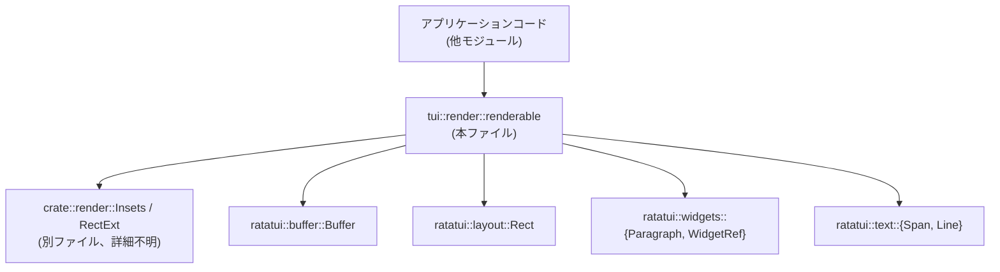
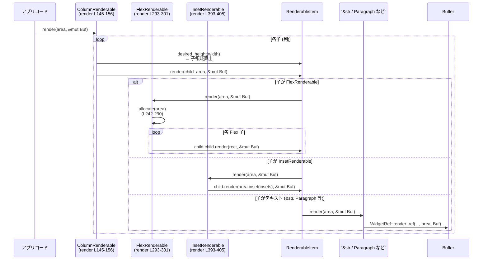

# tui/src/render/renderable.rs コード解説

---

## 0. ざっくり一言

ratatui の `Buffer`/`Rect` を前提に、共通トレイト `Renderable` と、その実装（テキスト・段落・縦横レイアウト・Flex レイアウト・インセット）を提供する描画レイアウト用モジュールです。  
アプリ側はこのトレイトを実装／利用することで、ratatui に依存しすぎないレイアウト記述ができます。

---

## 1. このモジュールの役割

### 1.1 概要

このモジュールは **「TUI コンポーネントの共通インターフェースと簡易レイアウトコンテナ」** を提供します。

- `Renderable` トレイトで「描画」「必要高さ」「カーソル位置」を統一的に扱う（L13-19）。
- 文字列や ratatui の `Span` / `Line` / `Paragraph` を `Renderable` として扱えるようにする（L71-114）。
- 複数の `Renderable` を縦方向 (`ColumnRenderable`)・横方向 (`RowRenderable`)・Flex 配分 (`FlexRenderable`)・余白付き (`InsetRenderable`) にレイアウトするコンテナを提供する（L141-213, L214-316, L318-386, L388-415）。
- ラッパートレイト `RenderableExt` により、任意の `Renderable` を簡単にインセット付きに変換する（L417-429）。

### 1.2 アーキテクチャ内での位置づけ

このモジュールは、外部ライブラリ ratatui と、クレート内の `render` モジュールの一部として動作します。

- 依存:
  - `ratatui::buffer::Buffer`, `ratatui::layout::Rect`, テキスト／ウィジェット型（L3-8）
  - `crate::render::Insets`, `crate::render::RectExt`（L10-11）
- 提供:
  - 他モジュールが使う描画インターフェース `Renderable`
  - レイアウトコンテナ群 `ColumnRenderable` など

依存関係のイメージ:



※ `Insets` や `RectExt` の定義はこのチャンクには現れません（L10-11）。

### 1.3 設計上のポイント

- インターフェース統一  
  - `Renderable` トレイトで「描画 (`render`)」「高さ計算 (`desired_height`)」「カーソル位置 (`cursor_pos`)」を統一（L13-19）。
- コンポジション（合成）重視  
  - `ColumnRenderable`, `RowRenderable`, `FlexRenderable`, `InsetRenderable` といったコンテナが、子の `Renderable` を保持し、合成してレイアウト（L141-143, L219-221, L318-320, L388-391）。
- 動的ディスパッチ  
  - `Box<dyn Renderable>` と `RenderableItem` による trait object ベースのコンポーネント管理（L21-24, L49-62）。
- 所有／借用の両対応  
  - `RenderableItem::Owned`（Box）と `Borrowed`（`&dyn Renderable`）で、所有・借用のどちらも子として扱える（L21-24, L185-212, L368-386）。
- 安全性／エラー方針  
  - `render` はすべて `&self` と `&mut Buffer` だけを取り、副作用はバッファへの書き込みに限定。
  - 多くの整数演算で `saturating_sub` を用い、領域をはみ出す際のアンダーフローを防止（例: L326, L337, L347）。
  - ただし、`InsetRenderable::desired_height` では素の `-` を使っており、幅がインセット合計より小さいと panic の可能性がある（L397-401）。

---

## 2. 主要な機能一覧

- `Renderable` トレイト: すべての描画コンポーネントの共通インターフェース（L13-19）。
- `RenderableItem<'a>`: 所有／借用の両方の `Renderable` を扱うラッパー（L21-24）。
- 文字列／テキスト系の `Renderable` 実装: `&str`, `String`, `Span<'a>`, `Line<'a>`, `Paragraph<'a>` の描画と高さ算出（L71-114）。
- コンテナ:
  - `ColumnRenderable<'a>`: 子を縦に並べて描画（L141-183, L185-212）。
  - `FlexRenderable<'a>`: Flex 値に応じて縦方向に空間を配分（L214-221, L223-316）。
  - `RowRenderable<'a>`: 子を横に並べて描画（L318-386）。
  - `InsetRenderable<'a>`: 子に上下左右の余白（インセット）を適用（L388-415）。
- ラッパー・ユーティリティ:
  - `Renderable` のための `Option<R>` と `Arc<R>` 実装（L116-139）。
  - `RenderableExt<'a>` トレイトと `inset` 拡張メソッド（L417-429）。
  - `ColumnRenderable::with`, `push`, `push_ref` 等の子追加ヘルパー（L185-212）。
  - `FlexRenderable::new`, `push`（L227-237）。
  - `RowRenderable::new`, `push`, `push_ref`（L368-385）。
  - `InsetRenderable::new`（L408-414）。

---

## 3. 公開 API と詳細解説

### 3.1 型一覧（構造体・列挙体など）

| 名前 | 種別 | 公開 | 行範囲 | 役割 / 用途 |
|------|------|------|--------|-------------|
| `Renderable` | トレイト | `pub` | `tui/src/render/renderable.rs:L13-19` | 描画コンポーネント共通インターフェース。領域への描画、必要高さ、カーソル位置を定義。 |
| `RenderableItem<'a>` | 列挙体 | `pub` | `L21-24` | `Renderable` の所有版（`Box`) と借用版（`&dyn Renderable`）を統一的に扱うラッパー。 |
| `ColumnRenderable<'a>` | 構造体 | `pub` | `L141-143, L185-212` | 子 `Renderable` を縦方向に積み上げるコンテナ。 |
| `FlexChild<'a>` | 構造体 | `pub` | `L214-217` | `FlexRenderable` 内の 1 子要素。flex 値と `RenderableItem` を保持。 |
| `FlexRenderable<'a>` | 構造体 | `pub` | `L219-221, L223-290, L293-316` | Flex 値に応じて縦方向に空き領域を分配するコンテナ。 |
| `RowRenderable<'a>` | 構造体 | `pub` | `L318-320, L368-386` | 横方向に子を並べ、固定幅ごとに描画するコンテナ。 |
| `InsetRenderable<'a>` | 構造体 | `pub` | `L388-391, L393-405, L408-414` | 子の周囲にインセット（余白）を設けるコンテナ。 |
| `RenderableExt<'a>` | トレイト | `pub` | `L417-419, L421-429` | 任意の `Renderable` に対して `.inset(...)` メソッドを提供する拡張トレイト。 |

主なトレイト実装（抜粋）:

| 対象型 | 実装トレイト | 行範囲 | 概要 |
|--------|--------------|--------|------|
| `RenderableItem<'a>` | `Renderable` | `L26-47` | 内部の具体的な `Renderable` に委譲。 |
| `()` | `Renderable` | `L64-69` | 何もしない / 高さ 0 のダミー。 |
| `&str`, `String`, `Span<'a>`, `Line<'a>`, `Paragraph<'a>` | `Renderable` | `L71-114` | ratatui テキスト系ウィジェットをそのまま描画。 |
| `Option<R>` | `Renderable` | `L116-130` | `Some` の場合のみ描画。 |
| `Arc<R>` | `Renderable` | `L132-138` | 共有所有の `Renderable` のラッパー。 |
| `ColumnRenderable<'_>` | `Renderable` | `L145-183` | 縦レイアウトの描画・高さ計算・カーソル位置探索。 |
| `FlexRenderable<'a>` | `Renderable` | `L293-316` | Flex レイアウトの描画・高さ計算・カーソル位置探索。 |
| `RowRenderable<'_>` | `Renderable` | `L322-366` | 横レイアウトの描画・高さ計算・カーソル位置探索。 |
| `InsetRenderable<'a>` | `Renderable` | `L393-405` | インセット適用後の領域で子を描画。 |

### 3.2 関数詳細（主要 7 件）

#### 1. `Renderable::render(&self, area: Rect, buf: &mut Buffer)`

**概要**

`Renderable` を実装するすべての型が、指定された矩形領域 `area` に対して ratatui の `Buffer` に描画するためのインターフェースです（L13-15）。

**引数**

| 引数名 | 型 | 説明 |
|--------|----|------|
| `area` | `Rect` | 描画対象領域。左上座標と幅・高さを含む。 |
| `buf`  | `&mut Buffer` | 描画先バッファ。セル単位で文字やスタイルを書き込む。 |

**戻り値**

- なし。副作用として `buf` に描画します。

**内部処理**

- トレイト側には実装はなく、各実装型が具体的な描画処理を提供します（例: `&str` は `self.render_ref(...)` を呼ぶ: L71-74）。

**エラー / パニック**

- 本トレイト自体はエラーを返しません。
- 各実装側で panic する可能性があるかは、個々の実装と依存ライブラリ（ratatui）に依存します。

**使用上の注意点**

- `area` が空（幅または高さが 0）の場合でも、実装によっては何らかの処理を行う可能性があるため、必要に応じて呼び出し側で空判定を行う設計もあり得ます。
- 並行性: `&mut Buffer` を取るため、同時に複数スレッドから同じ `Buffer` に描画することはコンパイル時に防がれます（Rust の借用規則により）。

---

#### 2. `ColumnRenderable::render(&self, area: Rect, buf: &mut Buffer)`

`tui/src/render/renderable.rs:L145-156`

**概要**

子 `Renderable` を、上から順に縦方向に積み上げて描画します。各子の高さは `desired_height` の結果に基づきます。

**引数・戻り値**

- 引数／戻り値は `Renderable::render` と同じ役割です。

**内部処理の流れ**

1. 現在の描画 Y 座標を `y = area.y` として初期化（L147）。
2. 子ごとに:
   - 子の高さを `child.desired_height(area.width)` で求め、その高さで `Rect::new(area.x, y, area.width, height)` を作成（L149）。
   - それを親の `area` と `intersection` して実際の描画領域 `child_area` を求める（L149-150）。
   - `child_area` が空でなければ `child.render(child_area, buf)` を実行（L151-153）。
   - `y` に `child_area.height` を加算して次の子の開始位置を更新（L154）。
3. すべての子を処理。

**エラー / パニック**

- 明示的なエラー処理はありません。
- `Rect::new` や `intersection` は ratatui / `RectExt` 側の実装に依存し、このチャンクからは panic の有無は分かりません。

**Edge cases（エッジケース）**

- 子の `desired_height` が 0 の場合:
  - `Rect::new(..., height=0)` になり、`intersection` 後に `is_empty()` で弾かれ、描画されません（L149-152）。
- 全子の高さ合計が `area` より大きい場合:
  - 下側の子ほど `intersection` で高さが 0 になり、描画されないか、一部だけ描画されます。
- `area.height == 0` の場合:
  - 最初の `child_area` からすべて空になり、何も描画されません。

**使用上の注意点**

- `desired_height` を正しく実装しておかないと、子が重なったり切れたりする可能性があります。
- 1 つの子だけ高さが極端に大きい場合、その子が `area` のほとんどを占め、後続の子が描画されないことがあります。

---

#### 3. `FlexRenderable::allocate(&self, area: Rect) -> Vec<Rect>`

`tui/src/render/renderable.rs:L242-290`（private だがコアロジック）

**概要**

Flex 値つきの子を持つ縦方向レイアウトにおいて、各子に割り当てる矩形を計算します。Flex 値 0 の子は固定高さ（`desired_height`）で、Flex > 0 の子は残り高さを Flex 比率で分配されます。

**引数**

| 引数名 | 型 | 説明 |
|--------|----|------|
| `area` | `Rect` | 親コンテナの縦方向レイアウト対象領域。 |

**戻り値**

- `Vec<Rect>`: 各子に対応する縦長のサブ矩形。順番は `self.children` と同じ。

**内部処理の流れ**

1. `allocated_rects`（返り値）、`child_sizes`（各子の高さ）、`allocated_size`（固定子の合計）、`total_flex`（Flex 合計）を初期化（L243-247）。
2. 非 Flex 子（`flex <= 0`）の高さを先に確定:
   - `max_size = area.height`（L249）。
   - 子ごとに:
     - `flex > 0` の場合: `total_flex` に加算し、`last_flex_child_idx` を更新（L251-255）。
     - それ以外: `child.desired_height(area.width)` を `max_size - allocated_size` でクリップして `child_sizes[i]` に設定し、`allocated_size` に加算（L256-260）。
3. 残り高さ `free_space = max_size - allocated_size` を計算（L262）。
4. Flex 子に残り高さを比例配分:
   - `total_flex > 0` の場合のみ処理（L265）。
   - `space_per_flex = free_space / total_flex as u16` とし（L266）、各 Flex 子に `space_per_flex * flex` だけ高さを割り当てる。ただし最後の Flex 子は余りをすべて受け取る（L267-275）。
   - 各子の高さは `child.desired_height(area.width)` で上限クリップ（L276-278）。
5. 最終的に `child_sizes` をもとに、`y` を順次増加させながら `Rect::new(area.x, y, area.width, size)` を作成して `allocated_rects` に push（L283-288）。

**エラー / パニック**

- `free_space / total_flex as u16`:
  - `total_flex > 0` の場合にのみ実行されるため、ゼロ除算はありません（L265-266）。
  - ただし `total_flex` が `i32` から `u16` にキャストされており、`total_flex > u16::MAX` の場合は値がラップします（Rust の仕様）。この結果、割り当てが意図しないものになる可能性がありますが、panic にはつながりません。
- それ以外にこの関数内の明示的な panic 要因は見えません。

**Edge cases**

- `area.height` が非 Flex 子の合計高さより小さい:
  - `saturating_sub` を使っていないものの、`max_size.saturating_sub(allocated_size)` を使っているため、固定子は高さがクリップされます（L257-259）。
  - 一部の固定子の高さが 0 になる場合があります。
- `free_space < total_flex`:
  - `space_per_flex` が 0 になり、最後の Flex 子だけが `free_space` をすべて受け取る（L266-275）。
- `free_space == 0`:
  - Flex 子はすべて高さ 0 になります（ループ内で `max_child_extent = 0` → `child_size = 0`）。
- Flex 子の `desired_height` が割り当て高さより小さい:
  - 実際には `desired_height` でクリップされ、残り高さが未使用になります（L276-278）。

**使用上の注意点**

- Flex 値は実質的に「相対比率」であり、絶対値そのものには意味がありません。ただし極端に大きな Flex 値の合計は `u16` キャストのラップを招き得ます。
- 各子の `desired_height` が大きすぎると、Flex による割り当てよりも `desired_height` が優先されるため、空間が均等に分配されないことがあります。

---

#### 4. `FlexRenderable::render(&self, area: Rect, buf: &mut Buffer)`

`tui/src/render/renderable.rs:L293-301`

**概要**

`allocate` で計算した矩形に基づき、Flex レイアウトの各子を描画します。

**内部処理**

1. `self.allocate(area)` で各子の `Rect` を取得（L295）。
2. `into_iter()` と `self.children.iter()` を `zip` して、Rect と `FlexChild` をペアにする（L295-297）。
3. 各ペアに対して `child.child.render(rect, buf)` を実行（L298-300）。

**エラー / パニック**

- `allocate` の挙動に依存しますが、本メソッド自体で追加の panic の可能性は見えません。

**Edge cases**

- `self.children` が空の場合:
  - `allocate` が空の `Vec` を返し、何も描画されません。
- `allocate` が 0 高さの Rect を返す場合:
  - 子の実装によっては何も描画しないことが想定されます。

**使用上の注意点**

- Flex レイアウトの結果は `allocate` によって決まるため、高さ計算などのバグがあると描画にもそのまま反映されます。
- `desired_height` を使った上限クリップの影響を理解しておく必要があります。

---

#### 5. `RowRenderable::render(&self, area: Rect, buf: &mut Buffer)`

`tui/src/render/renderable.rs:L322-334`

**概要**

子要素を左から右へ横方向に並べて描画します。各子には固定幅 `width` を割り当て、親領域からはみ出したところで描画を打ち切ります。

**内部処理**

1. 現在の X 座標を `x = area.x` で初期化（L324）。
2. 各 `(width, child)` について:
   - `available_width = area.width.saturating_sub(x - area.x)` で残り幅を計算（L326）。
   - `child_area = Rect::new(x, area.y, min(*width, available_width), area.height)` を作る（L327）。
   - `child_area.is_empty()` ならループ終了（L328-330）。
   - `child.render(child_area, buf)` を呼ぶ（L331）。
   - `x = x.saturating_add(*width)` で次の子の開始 X を更新（L332）。

**エラー / パニック**

- `saturating_sub` / `saturating_add` を使用しているため、X 方向座標でのアンダーフロー／オーバーフローによる panic はありません（L326, L332）。
- `Rect::new` の挙動は ratatui 依存で、このチャンクから panic の有無は分かりません。

**Edge cases**

- `width` が 0 の子:
  - `child_area` が幅 0 となり、`is_empty()` が true ならこの子以降の描画を打ち切ります（L328-330）。
- `area.width` よりも `width` が大きい:
  - 最初の子でも `available_width` でクリップされます。
- 子の累計幅が `area` を超えた場合:
  - ある子で `available_width == 0` になり、そこで描画終了。

**使用上の注意点**

- `width` は「希望幅」であり、実際の幅は `area` の残り幅でクリップされます。
- 高さ方向はすべての子で `area.height` を共有するため、高さは `desired_height` で判定される際に重要です（`desired_height` 実装は L335-349）。

---

#### 6. `InsetRenderable::desired_height(&self, width: u16) -> u16`

`tui/src/render/renderable.rs:L397-401`

**概要**

インセット付きコンテナ全体の高さを計算します。子の必要高さ＋上下インセットの合計を返します。

**引数**

| 引数名 | 型 | 説明 |
|--------|----|------|
| `width` | `u16` | 親から見た利用可能幅。 |

**戻り値**

- `u16`: インセット込みの推奨高さ。

**内部処理**

1. 有効コンテンツ幅を `width - self.insets.left - self.insets.right` と計算（L399）。
2. その幅で `self.child.desired_height(...)` を呼び、子の高さを取得（L399）。
3. 結果に `self.insets.top + self.insets.bottom` を足して返す（L400-401）。

**エラー / パニック**

- `width - self.insets.left - self.insets.right` は `u16` の通常の減算であり、結果が負になる場合は **panic** します（Rust のデフォルト挙動）。  
  → 幅が `left + right` 未満のときに panic の可能性があります（L399）。
- `Insets` の型定義はこのチャンクにはありませんが、減算演算子が使われていることから、`u16` 等に変換可能な整数型と考えられます。

**Edge cases**

- `width` がちょうど `left + right` の場合:
  - コンテンツ幅は 0。子の `desired_height(0)` の戻り値に上下インセットを足した高さになります。
- `width < left + right`:
  - 前述の通り panic の可能性があります。

**使用上の注意点**

- 呼び出し側は、`width >= left + right` が成り立つ状況でこのメソッドを使う前提で設計されていると考えられます。
- 実運用で安全に使うためには、インセット設定値と実際の描画領域幅の整合性を確保する必要があります。

---

#### 7. `RenderableExt::inset(self, insets: Insets) -> RenderableItem<'a>`

`tui/src/render/renderable.rs:L417-419, L421-429`

**概要**

任意の `Renderable` をインセット付きの `RenderableItem` に変換する拡張メソッドです。メソッドチェーンで簡潔にレイアウトを構築できます。

**引数**

| 引数名 | 型 | 説明 |
|--------|----|------|
| `self` | `R` (`Renderable + 'a`) | インセットを適用したい描画コンポーネント。所有権はこのメソッドにムーブされる。 |
| `insets` | `Insets` | 上下左右の余白。 |

**戻り値**

- `RenderableItem<'a>`: `InsetRenderable` で `self` を包んだ `RenderableItem`。

**内部処理**

1. `self` を `Box<dyn Renderable + 'a>` に包んで `RenderableItem::Owned` に変換（L426-427）。
2. それを `InsetRenderable { child, insets }` でさらに包み、再び `RenderableItem::Owned(Box::new(...))` に包んで返します（L428）。

**エラー / パニック**

- メソッド自体にはエラーや panic の要因は見えません。

**使用上の注意点**

- `self` の所有権が移動するため、呼び出し後に元の値は使えなくなります（Rust の所有権ルール）。
- `Insets` の値が大きすぎると、前述の `InsetRenderable::desired_height` で panic を起こす条件に近づくため注意が必要です。

---

### 3.3 その他の関数

補助的なコンストラクタ・ヘルパー関数をまとめます。

| 関数名 | 所属 | 行範囲 | 役割（1 行） |
|--------|------|--------|--------------|
| `RenderableItem::from(Box<dyn Renderable>)` | `impl From` | `L49-52` | `Box<dyn Renderable>` を Owned variant に変換。 |
| `Box<dyn Renderable>::from(R)` | `impl<'a, R> From<R>` | `L55-62` | 任意の `Renderable` を Box 化して trait object に変換。 |
| `ColumnRenderable::new()` | `impl<'a> ColumnRenderable<'a>` | `L185-188` | 空の縦レイアウトコンテナを生成。 |
| `ColumnRenderable::with<I,T>(children)` | 同上 | `L190-197` | イテレータから子をまとめて初期化。 |
| `ColumnRenderable::push(child)` | 同上 | `L200-202` | 子を Owned として追加。 |
| `ColumnRenderable::push_ref(child)` | 同上 | `L205-211` | 子を Borrowed として追加（dead_code マーク付き）。 |
| `FlexRenderable::new()` | `impl<'a> FlexRenderable<'a>` | `L227-230` | 空の Flex レイアウトコンテナを生成。 |
| `FlexRenderable::push(flex, child)` | 同上 | `L232-237` | flex 値つきの子を追加。 |
| `RowRenderable::new()` | `impl<'a> RowRenderable<'a>` | `L368-371` | 空の横レイアウトコンテナを生成。 |
| `RowRenderable::push(width, child)` | 同上 | `L373-376` | 固定幅つきの子を Owned として追加。 |
| `RowRenderable::push_ref(width, child)` | 同上 | `L378-384` | 固定幅つきの子を Borrowed として追加。 |
| `InsetRenderable::new(child, insets)` | `impl<'a> InsetRenderable<'a>` | `L408-414` | 子とインセット値からインセットコンテナを生成。 |

---

## 4. データフロー

ここでは、典型的なシナリオ「アプリコードが ColumnRenderable に複数のテキストコンポーネントを追加し、Flex レイアウトとインセットを組み合わせて描画する」を例に、呼び出しの流れを示します。

### 処理シナリオの概要

1. アプリコードが `ColumnRenderable` を作成し、ヘッダ行・Flex ベースのメインビュー・フッタ行を子として追加。
2. 各子は `InsetRenderable` や `FlexRenderable` 経由でさらに子を持つ。
3. 最終的に `ColumnRenderable::render` が呼ばれ、ネストされた構造をたどって各 `Renderable` の `render` が呼ばれ、ratatui の `Buffer` に書き込まれる。

### シーケンス図（ColumnRenderable::render, FlexRenderable::render, InsetRenderable::render）



※ `WidgetRef::render_ref` や `area.inset(self.insets)` の具体的な挙動は、それぞれ ratatui と `RectExt` の実装に依存し、このチャンクには現れません（L100-101, L395, L404）。

---

## 5. 使い方（How to Use）

### 5.1 基本的な使用方法

「ヘッダ・メイン・フッタ」を縦に並べ、メイン部分を Flex で拡張するレイアウトの例です。

```rust
use std::sync::Arc;
use ratatui::buffer::Buffer;
use ratatui::layout::Rect;
use crate::render::renderable::{
    Renderable, RenderableExt, ColumnRenderable, FlexRenderable,
};
use crate::render::Insets;

// 任意のメインビュー。Renderable を実装していると仮定する。          // ここでは仮の型とする
struct MainView;                                                          // メインビュー用の構造体

impl Renderable for MainView {                                            // MainView に Renderable を実装
    fn render(&self, area: Rect, buf: &mut Buffer) {                      // 描画処理
        // ...                                                            // 実際の描画はアプリ側で定義
    }
    fn desired_height(&self, _width: u16) -> u16 { 5 }                    // 仮に高さ 5 とする
}

// レイアウトを構築して描画する関数
fn draw_ui(area: Rect, buf: &mut Buffer, main: Arc<MainView>) {           // メインビューは Arc<MainView> として受け取る
    // Flex レイアウト: メインビューを flex=1 で配置                      // Flex コンテナを作成
    let mut flex = FlexRenderable::new();                                 // FlexRenderable::new() (L227-230)
    flex.push(1, main.clone());                                          // flex=1 の子として MainView を追加 (L232-237)

    // カラムレイアウト                                                       // 縦方向コンテナを作成
    let mut col = ColumnRenderable::new();                                // ColumnRenderable::new() (L185-188)

    // 上部ヘッダ（1 行テキスト、上に 1 行の余白）                           // &str は Renderable (L71-78)
    let header_insets = Insets { top: 1, bottom: 0, left: 0, right: 0 };  // Insets の定義は別ファイル（L10）
    col.push("Header".inset(header_insets));                              // RenderableExt::inset で InsetRenderable 化 (L417-429)

    // メインビュー（上下に 1 行ずつ余白）                                  // Flex コンテナ全体にインセットを付与
    let main_insets = Insets { top: 1, bottom: 1, left: 0, right: 0 };
    col.push(flex.inset(main_insets));                                    // flex コンテナをインセット付きで追加

    // 下部フッタ（1 行テキスト）                                            // そのままテキストを追加
    col.push("Footer");                                                   // &str -> Box<dyn Renderable> 経由で Owned として格納 (L55-62, L200-202)

    // 最終的な描画                                                          // ColumnRenderable::render がネストを辿って描画
    col.render(area, buf);                                                // (L145-156)
}
```

この例では:

- アプリ側は `Renderable` のみを意識し、それ以外はレイアウトコンテナに委ねられています。
- `RenderableExt::inset` により、任意の `Renderable` をインセット付きの `RenderableItem` に変換しています（L417-429）。
- `main` は `Arc<MainView>` として共有され、`Renderable for Arc<R>` 実装によってそのまま描画に利用できます（L132-138）。

### 5.2 よくある使用パターン

1. **オプションのコンポーネント**

   `impl Renderable for Option<R>` を利用して、存在する場合だけ描画する。

   ```rust
   let maybe_help: Option<&str> = if show_help { Some("Help: q to quit") } else { None }; // 条件により Some/None
   let mut col = ColumnRenderable::new();                                             // カラムコンテナ作成
   col.push("Title");                                                                 // タイトル行
   col.push(maybe_help);                                                              // Option<&str> も Renderable (L116-130)
   ```

2. **複数列の横並びレイアウト**

   ```rust
   let mut row = RowRenderable::new();                 // 横方向コンテナ (L368-371)
   row.push(20, "Left panel");                         // 左パネル幅 20 (L373-376)
   row.push(40, "Right panel");                        // 右パネル幅 40
   row.render(area, buf);                              // RowRenderable::render (L322-334)
   ```

### 5.3 よくある間違い（想定されるもの）

```rust
// 間違い例: インセットが幅より大きい可能性を考慮していない
let area_width = 10;
let insets = Insets { left: 8, right: 8, top: 0, bottom: 0 };
// この後で InsetRenderable::desired_height(area_width) を呼ぶと
// width - left - right で panic する可能性がある (L397-401)

// 正しい例: インセット合計を幅以下に抑える、または事前チェックする
let safe_insets = Insets { left: 3, right: 3, top: 0, bottom: 0 };
let inset_item = "Content".inset(safe_insets);      // RenderableExt::inset (L417-429)
// 呼び出し側で width >= left + right を満たすレイアウトにする
```

### 5.4 使用上の注意点（まとめ）

- **インセットと幅の関係**  
  - `InsetRenderable::desired_height` は `width - left - right` を行うため、`width >= left + right` を満たす前提で設計する必要があります（L397-401）。
- **Flex 値のスケール**  
  - `FlexRenderable::allocate` は `total_flex` を `u16` にキャストして割り算しており、理論上 `total_flex > u16::MAX` でラップが起こる可能性があります（L266）。実用上は小さな整数を用いることが想定されます。
- **Option/Arc の扱い**  
  - `Option<R>` は `Some` のときのみ描画され、`None` の場合は高さ 0 として扱われます（L116-130）。
  - `Arc<R>` の `Renderable` 実装は単に `as_ref()` で中身へ委譲するだけであり（L132-138）、スレッド安全性は `R` 側の実装と `Arc` の通常の選択に依存します。
- **並行性**  
  - すべての `render` メソッドは `&mut Buffer` を引数に取るため、同一 `Buffer` への同時書き込みはコンパイル時に防がれます。
  - 本モジュール内でスレッド生成や同期プリミティブは使用されていません。

---

## 6. 変更の仕方（How to Modify）

### 6.1 新しい機能を追加する場合

1. **新しい描画コンポーネント型を追加したい場合**
   - 新しい構造体／列挙体を定義し、`Renderable` トレイトを実装する（`render`, `desired_height`, 必要なら `cursor_pos`）（L13-19）。
   - 既存のコンテナ (`ColumnRenderable`, `RowRenderable`, `FlexRenderable`, `InsetRenderable`) は `Renderable` トレイトだけを前提としているため、そのまま利用可能です。

2. **新しいレイアウトコンテナを追加したい場合**
   - 本ファイル内の `ColumnRenderable` や `RowRenderable` のように、子を `RenderableItem<'a>` のベクタとして保持する構造体を定義（L141-143, L318-320, L388-391）。
   - `Renderable` を実装し、`render` / `desired_height` / `cursor_pos` を実装する。
   - 所有／借用双方に対応する場合は `push` / `push_ref` のようなヘルパーを用意する（L200-211, L373-384）。

3. **インセット以外の修飾コンテナ（例: ボーダー付き）を追加する場合**
   - `InsetRenderable` と同様に「子 `RenderableItem` と付加情報」を保持する構造体を定義（L388-391）。
   - `render` でまず装飾を描画し、その内側で子の `render` を呼び出す。

### 6.2 既存の機能を変更する場合

- **影響範囲の確認**
  - `Renderable` トレイトのシグネチャを変更すると、すべての実装に影響します（L13-19, L26-47, L64-139, L145-405, L421-429）。
  - `FlexRenderable::allocate` のアルゴリズム変更は、`render`, `desired_height`, `cursor_pos` の結果に直接影響します（L242-290, L293-316）。

- **契約（前提条件・返り値）の確認**
  - `desired_height` は「与えられた幅で描画する際の推奨高さ」という契約で統一されていると解釈できます（各実装: L64-69, L71-87, L89-114, L116-130, L132-138, L158-163, L303-308, L335-349, L397-401）。
  - `cursor_pos` は「コンポーネント内でカーソルを表示すべき位置」を返し、通常は 0〜1 個だけが `Some` となる前提でコンテナが組まれています（`ColumnRenderable::cursor_pos` のコメント L165-168）。

- **テスト・使用箇所の再確認**
  - このファイル内にはテストコードは含まれていません。  
    変更時には、クレート全体のテストや呼び出し側コードを確認する必要があります（このチャンクではテストの所在は不明）。

---

## 7. 関連ファイル

このモジュールが依存している他ファイル／外部クレートです（ファイルパスはチャンクから特定できるもののみ記載します）。

| パス / モジュール | 役割 / 関係 |
|-------------------|------------|
| `crate::render::Insets` | インセット（上下左右の余白）を表す型。`InsetRenderable` と `RenderableExt::inset` で使用（L10, L388-401, L408-414, L417-429）。定義ファイルはこのチャンクには現れません。 |
| `crate::render::RectExt` | `Rect` へ拡張メソッド（`intersection`, `inset`, `bottom` など）を提供するトレイトとして使用（L11, L149-150, L172-173, L304-307, L395, L404）。定義はこのチャンクには現れません。 |
| `ratatui::buffer::Buffer` | 画面バッファ。すべての `render` メソッドが書き込む対象（L3, L14, L27, ほか多数）。 |
| `ratatui::layout::Rect` | 画面上の矩形領域。レイアウト計算に使用（L4, ほか多数）。 |
| `ratatui::text::{Span, Line}` | テキスト行・スパンを表す型。`Renderable` 実装が用意されている（L5-6, L89-105）。 |
| `ratatui::widgets::{Paragraph, WidgetRef}` | 段落ウィジェットと、`render_ref` を提供するトレイト。テキスト描画に使用（L7-8, L98-101, L107-113）。 |

以上が、`tui/src/render/renderable.rs` に含まれる公開 API とコアロジック、およびデータフローと使用方法の概要です。このチャンクに現れない型・関数については、ここで記載した以外の情報は分かりません。
