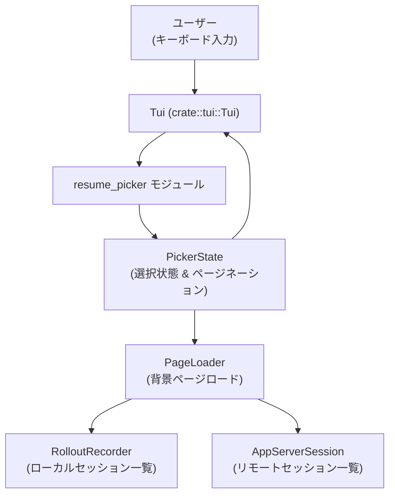
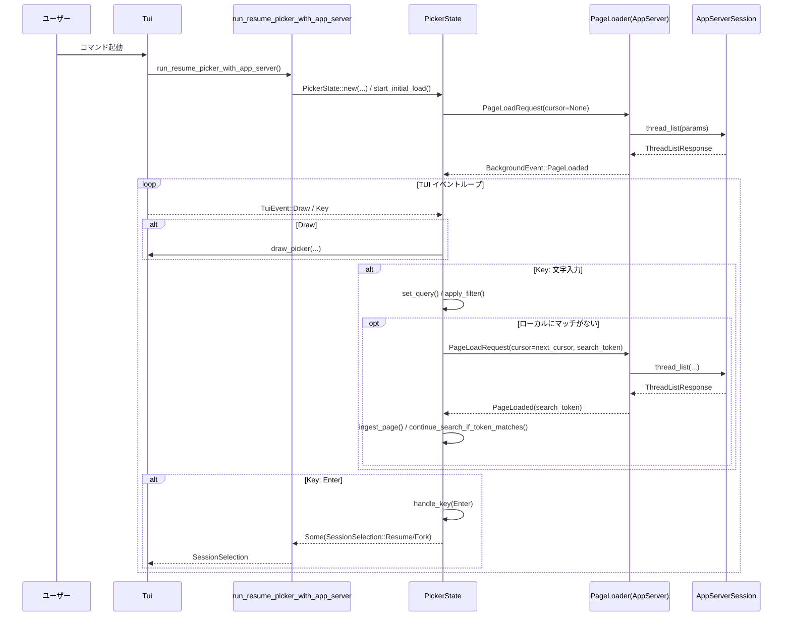

tui/src/resume_picker.rs コード解説
==================================

※この回答ではコード断片には行番号情報が含まれていないため、指定形式 `ファイル名:L開始-終了` での**正確な行番号は付与できません**。根拠は「関数名・型名とその実装内容」に基づいて記述します。

---

## 0. ざっくり一言

- ローカル／リモートに保存された過去セッション（スレッド）を、TUI 上で検索・スクロールしながら **再開（Resume）またはフォーク（Fork）するためのインタラクティブなセッションピッカー**を実装したモジュールです。
- ページネーションと簡易検索、プロバイダ／カレントディレクトリ（cwd）によるフィルタ、作成時刻／更新時刻ソート切り替えを備えています。

---

## 1. このモジュールの役割

### 1.1 概要

- このモジュールは「Codex CLI / TUI で過去の対話セッションを選び直す」という問題を解決するために存在し、次の機能を提供します。
  - ローカルの rollout ファイル (`RolloutRecorder::list_threads`) やリモートのアプリサーバ (`AppServerSession::thread_list`) から、スレッド一覧を非同期にページロードする。
  - ロードされたスレッドを TUI のテーブルとして描画し、カーソル移動・検索・ソート切り替え・Enter による決定を扱う。
  - 選択結果を `SessionSelection` として呼び出し元に返し、「新規開始／既存セッション再開／フォーク／アプリ終了」のいずれかを表現する。

### 1.2 アーキテクチャ内での位置づけ

このモジュールは TUI 層とセッションストレージ層（ローカルファイル or App Server）の「橋渡し」を行います。



- `run_*_picker*` 関数がエントリポイントとなり、TUI イベントループと `PickerState` を組み立てます。
- `PageLoader` は `Arc<dyn Fn(PageLoadRequest)>` として抽象化され、実体としてローカル (`spawn_rollout_page_loader`)／リモート (`spawn_app_server_page_loader`) が差し替えられます。
- 背景タスクは `BackgroundEvent::PageLoaded` を `mpsc::UnboundedSender` 経由で TUI スレッドへ返し、`PickerState::handle_background_event` が状態を更新します。

### 1.3 設計上のポイント

- **責務分割**
  - 公開 API：`run_resume_picker*` / `run_fork_picker_with_app_server` が「どのバックエンドをどう使うか」を決める。
  - 状態管理：`PickerState` がスクロール位置・選択行・検索クエリ・ページネーションなど UI ロジックを集中管理。
  - データモデル：`Row` が1行分の表示データ、`PickerPage` が1ページ分の結果を表現。
  - UI 描画：`draw_picker` / `render_list` / `render_column_headers` などが純粋に描画を担当。
- **状態とエラーハンドリング**
  - 非同期ページロードの状態を `PaginationState` と `LoadingState`（`Idle` / `Pending`）で明示的に管理し、**同時に複数のロードリクエストが走らないように制御**しています。
  - `request_token` と `search_token` によるトークン制御で、古いリクエストから返ってきた `PageLoaded` イベントを無視し、**レースコンディションを回避**しています。
  - エラーは `color_eyre::Result` で呼び出し元へ伝播しつつ、行単位の問題（メタデータが読めない等）は `inline_error` として画面内に表示します。
- **並行性**
  - `tokio::spawn` でページロードを別タスクにし、メインの TUI ループは `tokio::select!` で TUI イベントと背景イベントを同時に待機します。
  - App Server 用ローダは `mpsc::unbounded_channel<PageLoadRequest>` 経由で順次リクエストを送り、専用タスク内で `&mut AppServerSession` を単一スレッドで扱うことで安全性を保っています。
- **UX**
  - ソートキー（作成／更新）は `Tab` で切り替え可能で、切り替え時はバックエンドのソートをやり直すためにフルリロード。
  - 端末幅に応じてカラム表示を自動調整し（`ColumnVisibility`）、狭い場合は現在のソートキーに対応するタイムスタンプだけを表示します。
  - `SearchState` を持ち、ローカルにマッチが見つかるまで追加ページをロードしつつ検索を継続する設計です。

---

## 2. 主要な機能一覧

- セッションターゲット表現: `SessionTarget` / `SessionSelection` による「再開／フォーク／新規／終了」の選択結果の表現。
- ローカルセッションピッカー: `run_resume_picker` による rollout ファイルからのセッション再開 UI。
- リモートセッションピッカー（再開）: `run_resume_picker_with_app_server` による App Server からのスレッド再開 UI。
- リモートセッションピッカー（フォーク）: `run_fork_picker_with_app_server` による既存スレッドからのフォーク UI。
- ページネーション & 検索: `PickerState` + `PageLoader` によるページ単位ロードとクエリによるクライアントサイド検索。
- ローカル cwd フィルタ: ローカルピッカー時に、現在の作業ディレクトリに属するセッションのみを表示（`row_matches_filter`）。
- カラム幅計算と動的レイアウト: `calculate_column_metrics` / `column_visibility` で Unicode 幅に基づいたカラム表示を決定。
- スレッド名の補完: `update_thread_names` による `session_index.jsonl` からのローカル名読み込みと UI 上の名称更新。

---

## 3. 公開 API と詳細解説

### 3.1 型一覧（構造体・列挙体など）

#### 公開型

| 名前 | 種別 | 役割 / 用途 | 公開範囲 | 根拠 |
|------|------|-------------|----------|------|
| `SessionTarget` | 構造体 | 選択されたセッションを表す。ファイルパス（ローカル rollout ファイル）と `ThreadId` を保持。 | `pub` | フィールド `pub path: Option<PathBuf>`, `pub thread_id: ThreadId` と `display_label` 実装より |
| `SessionSelection` | 列挙体 | ピッカーからの最終選択結果を表す。`StartFresh` / `Resume(SessionTarget)` / `Fork(SessionTarget)` / `Exit` の4ケース。 | `pub` | 列挙子の定義と `run_*` 関数の戻り値型より |
| `SessionPickerAction` | 列挙体 | ピッカーが「再開」モードか「フォーク」モードかを表す。UI テキストや `SessionSelection` の生成に利用。 | `pub` | `title`, `action_label`, `selection` メソッドでの使用より |

#### 内部型（主要なもの）

| 名前 | 種別 | 役割 / 用途 |
|------|------|-------------|
| `PickerState` | 構造体 | 一覧データ・選択位置・検索状態・ページネーション状態など、ピッカー全体の UI 状態を保持し、キー入力・背景イベントを処理する中心的な型です。 |
| `Row` | 構造体 | 一覧の1行分のデータ（パス、プレビュー、スレッドID、名前、作成／更新日時、cwd、git ブランチ）を保持します。 |
| `PickerPage` | 構造体 | 1ページ分の `Row` と、次ページのためのカーソルやスキャン済みファイル数を保持します。 |
| `PageCursor` | 列挙体 | バックエンドごとのページネーションカーソル（`Rollout(Cursor)` / `AppServer(String)`）を表します。 |
| `PaginationState` | 構造体 | `next_cursor`／`num_scanned_files`／`reached_scan_cap`／`loading` をまとめたページネーション状態です。 |
| `LoadingState` | 列挙体 | ロード状態（`Idle` / `Pending(PendingLoad)`）を表し、重複リクエストを防ぎます。 |
| `SearchState` | 列挙体 | 検索状態（検索中かどうかと、アクティブな検索トークン）を表します。 |
| `ProviderFilter` | 列挙体 | モデルプロバイダのフィルタ条件（指定なし / デフォルトプロバイダ一致）を表します。 |
| `ColumnMetrics` | 構造体 | カラムごとの最大幅と各行のラベル（created/updated/branch/cwd）を事前計算したもの。描画レイアウトに使用。 |
| `ColumnVisibility` | 構造体 | 表示可能な端末幅に対して、どのカラムを表示するかを保持します。 |

### 3.2 関数詳細（主要7件）

#### `run_resume_picker(tui: &mut Tui, config: &Config, show_all: bool) -> Result<SessionSelection>`

**概要**

- ローカルの rollout セッションファイルを対象に、過去セッション一覧から **再開対象を選ぶ TUI ピッカー**を起動します。
- App Server を使わないローカル専用版です（内部的に `spawn_rollout_page_loader` を使用）。

**引数**

| 引数名 | 型 | 説明 |
|--------|----|------|
| `tui` | `&mut Tui` | 既存の TUI ハンドル。alt-screen 切り替えやイベントストリーム取得に使用します。 |
| `config` | `&Config` | Codex の設定。`codex_home` や `model_provider_id` などを使用します。 |
| `show_all` | `bool` | `true` の場合すべてのセッションを表示、`false` の場合はカレントディレクトリ配下のセッションに絞り込みます。 |

**戻り値**

- `Result<SessionSelection>`  
  - `Ok(SessionSelection::Resume(target))`：既存セッションの再開が選択された場合。
  - `Ok(SessionSelection::StartFresh)`：Esc で新規開始が選ばれた場合や、イベントストリーム終了時のフォールバック。
  - `Ok(SessionSelection::Exit)`：Ctrl+C が押された場合。
  - `Err(..)`：TUI 操作やページロード処理中に致命的なエラーが生じた場合。

**内部処理の流れ**

1. `mpsc::unbounded_channel()` で `BackgroundEvent` 用の送受信チャネルを生成。
2. `spawn_rollout_page_loader(config, bg_tx)` でローカルセッション用の `PageLoader` を構築。
3. `run_session_picker_with_loader` を `is_remote = false` かつ上記 `PageLoader` で呼び出し、TUI ループを実行。
4. `run_session_picker_with_loader` の戻り値（`SessionSelection`）をそのまま返却。

**Examples（使用例）**

```rust
use crate::tui::Tui;
use crate::legacy_core::config::Config;
use crate::tui::resume_picker::run_resume_picker;

#[tokio::main]
async fn main() -> color_eyre::Result<()> {
    let mut tui = Tui::new()?;                   // 既存の TUI 初期化手段を利用
    let config: Config = /* Config を構築 */;

    let selection = run_resume_picker(&mut tui, &config, /*show_all*/ false).await?;
    match selection {
        SessionSelection::Resume(target) => {
            println!("Resuming thread {}", target.thread_id);
        }
        SessionSelection::StartFresh => {
            println!("Starting a new session");
        }
        SessionSelection::Exit => {
            println!("Exiting");
        }
        SessionSelection::Fork(_) => {
            // run_resume_picker からは Fork は返らない想定
        }
    }
    Ok(())
}
```

**Errors / Panics**

- `run_session_picker_with_loader` 内での TUI 操作（`tui.enter_alt_screen`, `tui.draw` 等）や描画処理中に `std::io::Error` が発生した場合、`Err` として伝播されます。
- 明示的な `panic!` 呼び出しはありません。

**Edge cases（エッジケース）**

- セッションが1件も存在しない場合: 画面下部に `"No sessions yet"` が表示され、Enter しても選択結果は得られません（Esc 等で抜ける）。
- イベントストリームが途切れた場合: ループ終了後 `SessionSelection::StartFresh` を返します。

**使用上の注意点**

- `async fn` のため、**Tokio 等の非同期ランタイムの中で `.await` する必要**があります。
- `Tui` は alt-screen に入った状態から確実に復帰するため、エラー時にも `AltScreenGuard` により自動で解除されます。
- `show_all = false` の場合、現在のプロセスの `cwd` を取得できないと cwd フィルタが無効になります（`std::env::current_dir().ok()`）。

---

#### `run_resume_picker_with_app_server(tui: &mut Tui, config: &Config, show_all: bool, include_non_interactive: bool, app_server: AppServerSession) -> Result<SessionSelection>`

**概要**

- App Server 上のスレッド一覧から、過去セッションを再開するためのピッカーを起動します。
- リモートセッションでは `cwd` フィルタを基本的にサーバ側に任せ、プロバイダフィルタも `ProviderFilter::Any` として扱います。

**引数**

| 引数名 | 型 | 説明 |
|--------|----|------|
| `tui` | `&mut Tui` | TUI ハンドル。 |
| `config` | `&Config` | 設定。`model_provider_id` はローカル用のみに利用されます。 |
| `show_all` | `bool` | `true` の場合、`cwd_filter` を付けずに thread/list を呼びます。`false` の場合は `remote_cwd_override()` があればその値でフィルタします。 |
| `include_non_interactive` | `bool` | `true` なら GUI 由来など非インタラクティブなスレッドも含める（`source_kinds = None`）。`false` なら CLI / VSCode などに絞ります。 |
| `app_server` | `AppServerSession` | App Server へのセッション接続。内部タスクにムーブされます。 |

**戻り値**

- `Result<SessionSelection>`（意味は `run_resume_picker` と同様）。

**内部処理の流れ**

1. `mpsc::unbounded_channel()` で背景イベントチャネルを作成。
2. `app_server.is_remote()` でリモートかどうか判定（ここでは remote 前提で `ProviderFilter::Any` が利用されます）。
3. `cwd_filter` を、`show_all` が false の場合は `app_server.remote_cwd_override()` の戻り値に基づいて設定。
4. `spawn_app_server_page_loader(app_server, cwd_filter, include_non_interactive, bg_tx)` により `PageLoader` を構築。
5. `run_session_picker_with_loader` を呼び出してイベントループを実行。

**Examples（使用例）**

```rust
use crate::tui::Tui;
use crate::legacy_core::config::Config;
use crate::app_server_session::AppServerSession;
use crate::tui::resume_picker::run_resume_picker_with_app_server;

async fn pick_remote_session(
    tui: &mut Tui,
    config: &Config,
    app_server: AppServerSession,
) -> color_eyre::Result<SessionSelection> {
    run_resume_picker_with_app_server(
        tui,
        config,
        /*show_all*/ true,
        /*include_non_interactive*/ false,
        app_server,
    ).await
}
```

**Errors / Panics**

- App Server への `thread_list` 呼び出しエラーは `std::io::Error::other` にラップされ、`BackgroundEvent::PageLoaded` 内で `Err` として返ります。その後 `handle_background_event` で `color_eyre::Report` に変換され、最終的に `Err` として呼び出し元に伝播します。
- `app_server.shutdown().await` の失敗は `warn!` ログを出すだけで、ピッカーの戻り値には影響しません。

**Edge cases**

- App Server から返される `Thread.id` が不正な UUID の場合、該当行は `row_from_app_server_thread` で `warn!` を出した上でスキップされ、UI には表示されません。
- `include_non_interactive = true` の場合、`thread_list_params` にて `source_kinds` は `None` となり、サーバ側が全スレッドを返すことが想定されています。

**使用上の注意点**

- `app_server` は内部タスクにムーブされ、ピッカー終了時に `shutdown()` されます。呼び出し元では同じインスタンスを再利用しない前提で設計されています。
- リモートの場合、ローカルの `cwd` は意味を持たないため、cwd フィルタはサーバ側の `thread_list` パラメータにのみ適用されます。

---

#### `run_fork_picker_with_app_server(tui: &mut Tui, config: &Config, show_all: bool, app_server: AppServerSession) -> Result<SessionSelection>`

**概要**

- App Server 上の既存スレッドから **フォークする元を選択**するためのピッカーを起動します。
- `SessionPickerAction::Fork` を使用し、Enter で `SessionSelection::Fork(SessionTarget)` を返します。

**引数**

| 引数名 | 型 | 説明 |
|--------|----|------|
| `tui` | `&mut Tui` | TUI ハンドル。 |
| `config` | `&Config` | 設定。 |
| `show_all` | `bool` | リモートスレッドの cwd フィルタ有無。 |
| `app_server` | `AppServerSession` | App Server 接続。 |

**戻り値**

- `Result<SessionSelection>`。Enter でフォーク元を選んだ場合は `SessionSelection::Fork` になります。

**内部処理の流れ**

- `run_resume_picker_with_app_server` とほぼ同様ですが、`SessionPickerAction::Fork` と `include_non_interactive = false` 固定で `run_session_picker_with_loader` を呼び出します。

**使用上の注意点**

- フォークピッカーなので、`include_non_interactive` は強制的に `false` で、CLI / VSCode などのインタラクティブなセッションのみが対象になります。

---

#### `run_session_picker_with_loader(...) -> Result<SessionSelection>`

**概要**

- すべてのピッカー実装（ローカル／リモート／Resume／Fork）が最終的に呼び出す、共通の **TUI イベントループ本体**です。
- Alt スクリーンへの入退と、TUI イベント／背景イベントの `tokio::select!` ループを管理します。

**主な引数**

| 引数名 | 型 | 説明 |
|--------|----|------|
| `tui` | `&mut Tui` | TUI ハンドル。alt-screen の管理に使われます。 |
| `config` | `&Config` | 設定（特に `codex_home`, `model_provider_id`）。 |
| `show_all` | `bool` | cwd フィルタ有無。 |
| `action` | `SessionPickerAction` | Resume / Fork モード。 |
| `is_remote` | `bool` | リモートモードかどうか（プロバイダフィルタと cwd フィルタに影響）。 |
| `page_loader` | `PageLoader` | 背景ページロード用の関数オブジェクト。 |
| `bg_rx` | `mpsc::UnboundedReceiver<BackgroundEvent>` | 背景イベント受信用チャネル。 |

**内部処理の流れ**

1. `AltScreenGuard::enter(tui)` で alt-screen に入り、ガードを得る（`Drop` で自動復帰）。
2. `is_remote` に応じて `ProviderFilter` を設定。
3. ローカルかつ `show_all == false` の場合は `std::env::current_dir()` を使って `filter_cwd` を設定。
4. `PickerState::new(...)` で状態を初期化し、`start_initial_load()` で最初のページロードを開始。
5. `alt.tui.event_stream().fuse()` と `UnboundedReceiverStream::new(bg_rx).fuse()` を `tokio::select!` で同時待ち：
   - `TuiEvent::Key`：`PickerState::handle_key` を呼び出し、`Some(SessionSelection)` が返れば終了。
   - `TuiEvent::Draw`：端末サイズから描画行数を計算し、`update_view_rows` / `ensure_minimum_rows_for_view` / `draw_picker` を呼んで画面更新。
   - `BackgroundEvent::PageLoaded`：`handle_background_event` でページ取り込み・検索継続・スレッド名更新を行う。
6. いずれのストリームも枯渇した場合、`SessionSelection::StartFresh` を返して終了。

**並行性の観点**

- `tokio::select!` により TUI 入力と背景ロード結果を **単一タスク内で順次処理**するため、`PickerState` は `&mut self` を安全に使用できます。
- 背景ロード自体は別タスクで実行され、`BackgroundEvent` を通じて結果のみ渡されます。

**Errors / Panics**

- 描画や背景イベント処理でエラーが発生した場合、`Result::Err` として呼び出し元へ返されます。
- 明示的な `panic!` はありません。

**使用上の注意点**

- `AltScreenGuard` はスコープを抜けると自動的に `leave_alt_screen` を呼ぶため、**途中で `return` / エラーが発生しても端末状態が元に戻る**設計です。
- `bg_rx` が閉じても TUI イベントが継続する限り UI は動作しますが、新しいページはロードされません。

---

#### `PickerState::handle_key(&mut self, key: KeyEvent) -> Result<Option<SessionSelection>>`

**概要**

- キー入力1回ごとに呼ばれ、状態の更新と選択確定（`SessionSelection` の生成）を行うメインハンドラです。
- `async` なのは、Enter 時に `resolve_session_thread_id` を非同期で呼び出す可能性があるためです。

**主なキーと挙動**

- `Esc`: `Ok(Some(SessionSelection::StartFresh))` を返して即時終了。
- `Ctrl+C`: `Ok(Some(SessionSelection::Exit))` を返して即時終了。
- `Enter`:
  - 現在選択中の `Row` を取得。
  - `Row.thread_id` が `Some` ならそれを利用。
  - `None` かつ `path` がある場合は `crate::resolve_session_thread_id(path, None).await` でメタデータから ID を解決。
  - ID 解決に成功した場合は `self.action.selection(path, thread_id)` を返却。
  - 失敗した場合は `inline_error` にエラーメッセージを設定し、`Ok(None)` を返す（画面上に赤文字で表示）。
- `Up` / `Down`: `selected` を前後に移動し、`ensure_selected_visible` でスクロール位置を調整。`Down` では必要に応じて `maybe_load_more_for_scroll` を呼ぶ。
- `PageUp` / `PageDown`: `view_rows` をベースにページ単位で `selected` を増減。
- `Tab`: `toggle_sort_key()` を呼び、ソートキーを切り替えつつフルリロード。
- `Backspace` / 文字キー: `query` を編集し、`set_query` でフィルタや検索状態を更新。

**Examples（使用イメージ）**

テストでは次のようなケースが確認されています（擬似コード）:

```rust
let mut state = PickerState::new(/* ... */);
state.all_rows = vec![Row { path: Some("/tmp/missing.jsonl".into()), /* ... */ }];
state.filtered_rows = state.all_rows.clone();

// Enter キーで、スレッド ID が解決できない場合 inline_error がセットされる
let result = state.handle_key(KeyEvent::new(KeyCode::Enter, KeyModifiers::NONE)).await?;
assert!(result.is_none());
assert_eq!(
    state.inline_error,
    Some("Failed to read session metadata from /tmp/missing.jsonl".into())
);
```

**Errors / Panics**

- `resolve_session_thread_id` の呼び出しでエラーが返ってきた場合は `None` として扱うため、`handle_key` 自体は `Ok(None)` を返し、UI 上のエラーメッセージに反映されます。
- その他の内部メソッドは通常 `panic` しません。

**Edge cases**

- `filtered_rows` が空の状態で `Enter` を押した場合: 何も起きず、`Ok(None)` を返します。
- `PageDown` でリスト末尾を超える場合: 最終行にクランプされます。
- `Char(c)` で Control / Alt 修飾付きの場合: 検索文字としては無視されます。

**使用上の注意点**

- 戻り値が `Some(SessionSelection)` の場合のみ、呼び出し側 (`run_session_picker_with_loader`) はピッカーを終了します。
- `inline_error` は `handle_key` 冒頭で毎回クリアされるため、**ユーザーが1回キー入力するとエラー表示は消える**仕様です。

---

#### `PickerState::start_initial_load(&mut self)`

**概要**

- ピッカー起動時やソート切り替え時に呼ばれ、ページネーション状態をリセットし、最初のページロードを開始します。

**内部処理の流れ**

1. `relative_time_reference = Some(Utc::now())` をセット（以降の `human_time_ago` 表示の基準）。
2. `reset_pagination()` でページネーションを初期化。
3. `all_rows` / `filtered_rows` / `seen_rows` をクリアし、`selected = 0` にリセット。
4. `query` が空かどうかで `search_state` を決定し、必要であれば `search_token` を割り当て。
5. `allocate_request_token()` でリクエストトークンを確保し、`pagination.loading = Pending` に設定。
6. `request_frame()` で再描画をスケジュール。
7. `page_loader` を呼び出し、`cursor: None` で1ページ目のロードを非同期で開始。

**使用上の注意点**

- `toggle_sort_key` からも呼ばれるため、ソート切り替え時には **既存の行は一旦破棄され、新しい並び順で再取得**されます。
- `search_state` は `query` と `filtered_rows` の状態によって変化するため、検索中にソートを切り替えると検索トークンもリセットされます。

---

#### `load_app_server_page(app_server: &mut AppServerSession, cursor: Option<String>, cwd_filter: Option<&Path>, provider_filter: ProviderFilter, sort_key: ThreadSortKey, include_non_interactive: bool) -> std::io::Result<PickerPage>`

**概要**

- App Server に対して `/thread/list` 相当の API を呼び出し、そのレスポンスを `PickerPage` に変換する関数です。

**引数**

| 引数名 | 型 | 説明 |
|--------|----|------|
| `app_server` | `&mut AppServerSession` | スレッド一覧 API を提供するセッション。単一タスク内で `&mut` として利用。 |
| `cursor` | `Option<String>` | 次ページを指すカーソル文字列。`None` なら最初のページ。 |
| `cwd_filter` | `Option<&Path>` | サーバ側での cwd フィルタ。リモートピッカーで `show_all == false` の場合に使用。 |
| `provider_filter` | `ProviderFilter` | モデルプロバイダのフィルタ条件。`ThreadListParams::model_providers` に反映。 |
| `sort_key` | `ThreadSortKey` | 作成／更新のどちらでソートするか。サーバ側に伝達。 |
| `include_non_interactive` | `bool` | 非インタラクティブなセッションを含めるか。`source_kinds` に反映。 |

**戻り値**

- `Ok(PickerPage)`：App Server からのレスポンスを `Row` に変換し、`next_cursor` 等をセットしたページ。
- `Err(std::io::Error)`：`thread_list` 呼び出しが失敗した場合。

**内部処理の流れ**

1. `thread_list_params(...)` で `ThreadListParams` を組み立て。
2. `app_server.thread_list(params).await` を呼び出し、エラーは `std::io::Error::other` に変換。
3. `response.data.len()` を `num_scanned_files` として記録。
4. `response.data` の各 `Thread` を `row_from_app_server_thread` で `Row` に変換（ID パースに失敗した行はスキップ）。
5. `PickerPage` を構築して返却。

**使用上の注意点**

- `AppServerSession` は `&mut` として受け取るため、**同じセッションを複数タスクから同時に使わないことが前提**になっています（実際には `spawn_app_server_page_loader` が1タスクで逐次処理）。
- `Thread.created_at` / `updated_at` は Unix epoch 秒として渡され、`DateTime::from_timestamp` で `Option<DateTime>` に変換されます。範囲外の値は `None` となり、UI 上では `"-"` 表示になります。

---

### 3.3 その他の関数（インベントリー抜粋）

すべてを列挙すると長くなるため、主要な補助関数のみ一覧します。

| 関数名 / メソッド名 | 役割（1 行） |
|---------------------|--------------|
| `SessionTarget::display_label` | `path` があればそのパス、なければ `"thread {id}"` をラベルとして返します。 |
| `SessionPickerAction::title` | ヘッダに表示するタイトル文字列（"Resume a previous session" / "Fork a previous session"）を返します。 |
| `SessionPickerAction::action_label` | ヒント行などに使用する短いラベル（"resume" / "fork"）を返します。 |
| `spawn_rollout_page_loader` | ローカル `RolloutRecorder::list_threads` を非同期タスクで呼び出す `PageLoader` を生成します。 |
| `spawn_app_server_page_loader` | `PageLoadRequest` を受け取り `load_app_server_page` を呼ぶバックグラウンドタスクと、それにリクエストを送る `PageLoader` を生成します。 |
| `picker_page_from_rollout_page` | `ThreadsPage`（ローカル側）を共通の `PickerPage` に変換します。 |
| `rows_from_items` / `head_to_row` | `ThreadItem` を `Row` に変換するヘルパ。テストで「バックエンドの順序を保つ」ことが確認されています。 |
| `row_from_app_server_thread` | App Server の `Thread` を `Row` に変換し、不正な ID の行を `warn!` してスキップします。 |
| `thread_list_params` | `ThreadListParams` を `PAGE_SIZE`, `sort_key`, `provider_filter`, `cwd_filter`, `include_non_interactive` から構築します。 |
| `paths_match` | `path_utils::paths_match_after_normalization` を呼び出す単純なラッパ。cwd フィルタに利用。 |
| `draw_picker` | ヘッダ／検索行／カラムヘッダ／リスト／ヒント行をまとめて描画します。 |
| `render_list` | `Row` と `ColumnMetrics` を元に、選択マーカーやカラムを描画します。 |
| `render_empty_state_line` | 検索中・ロード中・セッションなし等の状態に応じて適切なメッセージを返します。 |
| `human_time_ago` | 秒差から `"42 seconds ago"`, `"3 days ago"` といった相対時間文字列を生成します。 |
| `calculate_column_metrics` | 各行の created / updated / branch / cwd ラベルを整形し、最大幅を計算します。 |
| `column_visibility` | 端末幅とカラム幅から、どのカラムを表示するかを決定します（狭い場合はソートキーに対応する日付列のみ）。 |

---

## 4. データフロー

ここでは、リモートセッションの再開ピッカーで、ユーザーが検索しつつスクロールし、Enter で選択する典型的な流れを示します。

### 4.1 全体のシーケンス



**要点**

- 検索クエリに対してローカル（既にロード済みのページ）でマッチが見つからない場合、`SearchState::Active` となり、`next_cursor` がある限りページロードを続けます。
- 各 `PageLoadRequest` には `request_token` / `search_token` が付き、`handle_background_event` が戻り値のトークンを検証することで、**キャンセル済み検索や古いリクエストの結果を無視**します。
- Enter が押された時点で、`PickerState::handle_key` が `SessionSelection` を生成し、イベントループを抜けます。

---

## 5. 使い方（How to Use）

### 5.1 基本的な使用方法

#### ローカルセッションの再開ピッカー

```rust
use crate::tui::Tui;
use crate::legacy_core::config::Config;
use crate::tui::resume_picker::{run_resume_picker, SessionSelection};

#[tokio::main]
async fn main() -> color_eyre::Result<()> {
    let mut tui = Tui::new()?;                  // TUI を構築
    let config: Config = /* Config を読み込む */;

    let selection = run_resume_picker(&mut tui, &config, /*show_all*/ false).await?;

    match selection {
        SessionSelection::Resume(target) => {
            // target.path と target.thread_id を使ってセッションを再開
        }
        SessionSelection::StartFresh => {
            // 新しいセッションを開始
        }
        SessionSelection::Exit => {
            // CLI を終了
        }
        SessionSelection::Fork(_) => {
            // この経路では通常到達しない
        }
    }

    Ok(())
}
```

#### リモートセッションの再開ピッカー

```rust
use crate::app_server_session::AppServerSession;
use crate::tui::resume_picker::{run_resume_picker_with_app_server, SessionSelection};

async fn pick_remote(
    tui: &mut Tui,
    config: &Config,
    app_server: AppServerSession,
) -> color_eyre::Result<SessionSelection> {
    run_resume_picker_with_app_server(
        tui,
        config,
        /*show_all*/ true,
        /*include_non_interactive*/ false,
        app_server,
    ).await
}
```

### 5.2 よくある使用パターン

- **Resume vs Fork**
  - 既存セッションをそのまま続けたい場合：`run_resume_picker*` を利用（`SessionSelection::Resume` が返る）。
  - 既存セッションの履歴を元に新しいセッションを派生させたい場合：`run_fork_picker_with_app_server` を利用（`SessionSelection::Fork`）。

- **ローカルのみ / リモートのみ**
  - App Server を使わない CLI ツールの場合：`run_resume_picker` のみで十分です。
  - App Server に状態を集約している場合：`run_resume_picker_with_app_server` / `run_fork_picker_with_app_server` を中心に使います。

- **cwd フィルタ**
  - プロジェクトごとにセッションを分けたい場合：ローカルで `show_all = false` にしておくと、カレントディレクトリ配下のセッションだけがリストされます。
  - リモートでは `cwd` はサーバ上のパスになるため、クライアント側の `cwd` とは無関係です（`show_all` の意味は「サーバ側 cwd フィルタを付けるかどうか」になります）。

### 5.3 よくある間違い

```rust
// 間違い例: Tokio ランタイムの外で await している
fn main() {
    let mut tui = Tui::new().unwrap();
    let config = /* ... */;
    // コンパイルエラー: async fn をブロッキングコンテキストから呼んでいる
    let selection = run_resume_picker(&mut tui, &config, false).await;
}

// 正しい例: #[tokio::main] などでランタイムを起動する
#[tokio::main]
async fn main() -> color_eyre::Result<()> {
    let mut tui = Tui::new()?;
    let config = /* ... */;
    let selection = run_resume_picker(&mut tui, &config, false).await?;
    // ...
    Ok(())
}
```

```rust
// 間違い例: run_resume_picker_with_app_server に同じ AppServerSession を再利用しようとする

let app_server = AppServerSession::connect(/*...*/).await?;
let selection1 = run_resume_picker_with_app_server(&mut tui, &config, true, false, app_server).await?;
// ここで app_server は移動済みかつ内部で shutdown 済みの可能性があり、再利用はできない

// 正しい例: 必要に応じて新たに AppServerSession を確立して渡す
let app_server1 = AppServerSession::connect(/*...*/).await?;
let selection1 = run_resume_picker_with_app_server(&mut tui, &config, true, false, app_server1).await?;
let app_server2 = AppServerSession::connect(/*...*/).await?;
let selection2 = run_resume_picker_with_app_server(&mut tui, &config, true, false, app_server2).await?;
```

### 5.4 使用上の注意点（まとめ）

- **非同期ランタイム**: すべての公開ピッカー関数は `async fn` なので、Tokio などのランタイム内で使用する必要があります。
- **セッション ID 解決**: ローカル rollout 行で `thread_id` が埋まっていない場合、`resolve_session_thread_id` によるメタデータ読取が失敗すると、行を選択してもエラー表示になるだけで先に進みません。
- **検索のコスト**: 検索クエリがマッチするまでページを次々にロードするため、非常に多くのセッションがある場合は `SearchState` によるロード継続が I/O を増やす可能性があります（ただし `reached_scan_cap` で上限がかかります）。
- **メモリ使用**: `PageLoader` は `mpsc::unbounded_channel` を使っていますが、セッション数やページサイズが固定であるため、このモジュール単体で無制限にメモリを消費する設計にはなっていません。

---

## 6. 変更の仕方（How to Modify）

### 6.1 新しい機能を追加する場合

例: セッションの「状態」（Idle / Running など）を新しいカラムとして追加したい場合。

1. **データモデルにフィールド追加**
   - `Row` に `status: Option<ThreadStatus>` などのフィールドを追加。
   - `head_to_row` / `row_from_app_server_thread` でバックエンドからの値をセットする処理を追加。

2. **カラムメトリクスの拡張**
   - `ColumnMetrics` に `max_status_width` と `status` ラベルを追加。
   - `calculate_column_metrics` 内で幅計算とラベル生成を行う。

3. **描画処理の拡張**
   - `render_column_headers` に "Status" カラムを追加。
   - `render_list` で `status_span` を追加し、`preview_width` の計算にも反映。

4. **表示条件の調整**
   - 端末幅が狭いときに status カラムを省略する場合は、`ColumnVisibility` に新フィールドを追加して制御。

5. **テスト追加 / 更新**
   - 既存のスナップショットテスト（`resume_table_snapshot` など）を更新し、新カラムが期待通りに表示されるか検証します。

### 6.2 既存の機能を変更する場合

- **ページサイズを変えたい**
  - `const PAGE_SIZE: usize = 25;` を変更し、App Server / Rollout 両方の `ThreadListParams.limit` に反映されることを確認します。
- **検索の挙動を変えたい（例: プレビューだけでなく cwd も検索対象に含める）**
  - `Row::matches_query` に条件を追加し、`row.cwd` なども `to_lowercase()` で部分一致するか確認するロジックを加えます。
  - 追加した条件に対するテストを書いておくと、意図しない挙動変更を防ぐことができます。
- **ソートキーの追加**
  - `ThreadSortKey` / `AppServerThreadSortKey` に新しいキーを追加した場合、`sort_key_label` / `thread_list_params` / `column_visibility` 等での扱いを整合させる必要があります。

変更時には以下を確認すると安全です。

- `PickerState` 内で参照しているフィールドが一貫して更新されているか。
- 検索トークン（`search_token`）やリクエストトークン（`request_token`）の扱いが壊れていないか（テスト `set_query_loads_until_match_and_respects_scan_cap` などを参照）。
- スナップショットテスト（`resume_picker_table` / `resume_picker_thread_names` など）が期待通りに更新されているか。

---

## 7. 関連ファイル

| パス | 役割 / 関係 |
|------|------------|
| `crate::legacy_core::RolloutRecorder` | ローカルの rollout セッションファイルからスレッド一覧（`ThreadsPage`）を非同期に返すコンポーネント。`spawn_rollout_page_loader` から呼ばれます。 |
| `crate::legacy_core::ThreadsPage` / `ThreadItem` / `ThreadSortKey` | ローカルセッション一覧のモデル。`picker_page_from_rollout_page` と `head_to_row` で `Row` に変換されています。 |
| `crate::legacy_core::find_thread_names_by_ids` | `session_index.jsonl` からスレッド名を検索する非同期関数。`PickerState::update_thread_names` で使用されます。 |
| `crate::legacy_core::path_utils` | `paths_match_after_normalization` を提供し、cwd フィルタ時のパス比較に利用されています。 |
| `crate::app_server_session::AppServerSession` | App Server との通信を管理する型。`thread_list` / `shutdown` を通じてスレッド一覧取得とクリーンアップが行われます。 |
| `codex_app_server_protocol::Thread` / `ThreadListParams` / `ThreadSourceKind` | App Server 側のスレッド情報とリスト API のパラメータ型。`row_from_app_server_thread` / `thread_list_params` で使用されます。 |
| `crate::tui::{Tui, TuiEvent, FrameRequester}` | TUI のイベントループと描画要求を抽象化するモジュール。`run_session_picker_with_loader` と `PickerState` がこれに依存します。 |
| `crate::diff_render::display_path_for` | cwd カラムに表示するパス文字列を生成するユーティリティ。`calculate_column_metrics` 内で使用されます。 |
| `crate::text_formatting::truncate_text` | プレビュー文字列を端末幅に収まるようにトリミングする関数。`render_list` で利用されています。 |
| `crate::key_hint` | キーボードショートカットを見やすく装飾した `Span` を生成するモジュール。ヘッダのヒント表示に使用されています。 |
| `crate::custom_terminal` / `crate::test_backend::VT100Backend` | テスト用の仮想ターミナル環境。描画のスナップショットテストで使用されています。 |

---

## 補足：バグ・セキュリティ・テスト・性能の観点（簡略）

- **バグ/セキュリティ**
  - 不正な App Server の `Thread.id` は `row_from_app_server_thread` で検出され、`warn!` のログのみを出して UI から除外します。これにより、壊れたデータが UI をクラッシュさせることを防いでいます。
  - `DateTime::from_timestamp` の結果が `None` 場合は `"-"` 表示となり、パニックしません。
  - `unbounded_channel` 利用による DoS 的なメモリ消費は、このモジュール単体では起こりづらい設計です（ページサイズ固定・リクエスト数制御あり）。

- **契約 / エッジケース**
  - 「検索中に更に検索する」「ソートキー切り替え中に背景ロードが返ってくる」といったケースは `request_token` / `search_token` で正しく処理されることが、複数のテスト (`set_query_loads_until_match_and_respects_scan_cap`, `toggle_sort_key_reloads_with_new_sort` 等) によって検証されています。
  - パスレススレッド（App Server 起源）は `thread_id` のみで識別し、`enter_on_pathless_thread_uses_thread_id` テストで挙動が保証されています。

- **テスト**
  - プレビュー選択ロジック・並び順・ページング・検索・カラム表示・ソート切り替え・エラー時の UI 表示など、多数のユニットテスト＋スナップショットテストが実装されています。
  - これにより、UI の変更やバックエンドの挙動変更に対するリグレッション検出が可能になっています。

- **性能 / スケーラビリティ**
  - ページサイズ (`PAGE_SIZE`) と「近づいたら追加ロードするしきい値」 (`LOAD_NEAR_THRESHOLD`) により、**必要なデータのみを逐次ロード**する設計です。
  - `SearchState` と `reached_scan_cap` によって検索のスキャン範囲が制限され、非常に大量のセッションがある場合でも処理が無制限に走り続けないようになっています。
