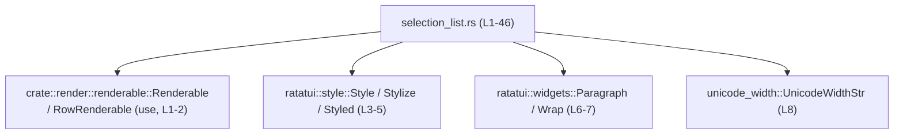
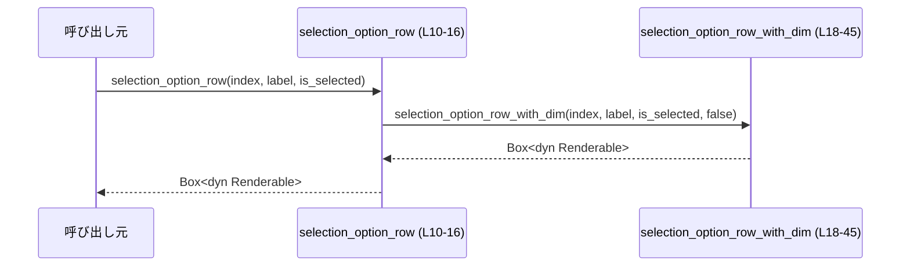
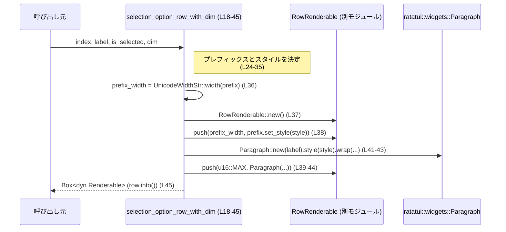
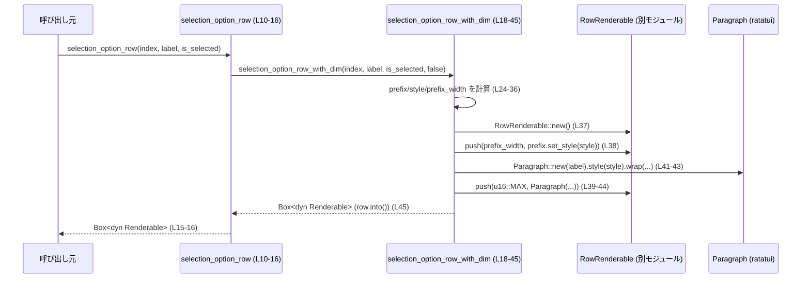

tui/src/selection_list.rs の解説です。

---

## 0. ざっくり一言

- 選択リストの「1 行分」の見た目（インデックス番号＋ラベルの行）を `ratatui` のウィジェットとして組み立て、`Box<dyn Renderable>` として返すヘルパー関数を提供するモジュールです。  
  （関数定義と戻り値 `Box<dyn Renderable>` より [selection_list.rs:L10-16][selection_list.rs:L18-23]）

---

## 1. このモジュールの役割

### 1.1 概要

- このモジュールは、TUI 上の選択肢一覧に表示する「行」を構築するための関数群を提供します。  
  `selection_option_row` / `selection_option_row_with_dim` が行を作成し、`RowRenderable` を通じて `Box<dyn Renderable>` に変換しています [selection_list.rs:L10-16][selection_list.rs:L18-23][selection_list.rs:L37-45]。
- 行は「インデックス＋ドット＋スペース＋ラベル」の形式で表示され、選択状態や「dim（淡色）」フラグに応じてスタイル（色／明度）が変化します [selection_list.rs:L24-35]。
- インデックス部分の文字幅は `unicode_width::UnicodeWidthStr` で計算され、行内レイアウトの幅として `RowRenderable` に渡されます [selection_list.rs:L8][selection_list.rs:L36-38]。

### 1.2 アーキテクチャ内での位置づけ

このファイルは、TUI レンダリング層内で「行レベル」の UI コンポーネント（Renderable）を構築する位置づけにあります。

依存関係は以下のとおりです。

- 内部モジュール:
  - `crate::render::renderable::Renderable`（返り値のトレイト）[selection_list.rs:L1]
  - `crate::render::renderable::RowRenderable`（行コンテナ）[selection_list.rs:L2][selection_list.rs:L37-38]
- 外部クレート:
  - `ratatui::widgets::Paragraph`, `Wrap`（テキスト表示ウィジェット）[selection_list.rs:L6-7][selection_list.rs:L40-43]
  - `ratatui::style::{Style, Styled, Stylize}`（スタイル設定）[selection_list.rs:L3-5][selection_list.rs:L29-32][selection_list.rs:L38][selection_list.rs:L42]
  - `unicode_width::UnicodeWidthStr`（Unicode 文字幅計算）[selection_list.rs:L8][selection_list.rs:L36]



### 1.3 設計上のポイント

- **ステートレスなヘルパー関数**  
  - モジュール内に状態（構造体やグローバル変数）はなく、すべての処理は引数のみから行を構築する純粋な関数として実装されています [selection_list.rs:L10-16][selection_list.rs:L18-45]。
- **選択状態・dim フラグに基づくスタイル分岐**  
  - `is_selected` が `true` の場合はシアン色 (`Style::default().cyan()`) を使用し、そうでない場合に `dim` が `true` なら淡色 (`Style::default().dim()`)、それ以外は標準スタイル (`Style::default()`) を使用します [selection_list.rs:L29-35]。
- **プレフィックスとラベルの 2 カラム構成**  
  - 行は「インデックス＋記号」のプレフィックス部分と、残りのラベル部分の 2 つの要素から構成されます。プレフィックスには実際の文字幅を元にした固定幅、ラベルには `u16::MAX`（実質的に残り幅いっぱい）が割り当てられています [selection_list.rs:L24-28][selection_list.rs:L36-41]。
- **Unicode 幅対応**  
  - `UnicodeWidthStr::width` により、プレフィックスの表示幅を Unicode 幅として計算し、それをカラム幅として使用しています [selection_list.rs:L36-38]。これは絵文字など、1 文字が 2 桁幅を取るケースを考慮した設計と解釈できます（ただし意図はコードから推測にとどまります）。
- **レンダリング抽象化 (`Renderable` トレイト)**  
  - 具体的な `ratatui` のウィジェット構成を `RowRenderable` に包み、外部には `Box<dyn Renderable>` として返しています [selection_list.rs:L37-45]。これにより呼び出し側は共通の `Renderable` 抽象で扱えるようになっています。

---

## 2. 主要な機能一覧（コンポーネントインベントリー）

このモジュールで定義される関数（コンポーネント）の一覧です。

| 名前 | 種別 | 定義位置 | 説明 |
|------|------|----------|------|
| `selection_option_row` | 関数 | `selection_list.rs:L10-16` | 選択状態のみを指定して、通常の（非 dim）行を生成するヘルパー。内部で `selection_option_row_with_dim` を `dim = false` で呼び出します。 |
| `selection_option_row_with_dim` | 関数 | `selection_list.rs:L18-45` | インデックス・ラベル・選択状態・dim フラグから、インデックス付きの 1 行分の `Box<dyn Renderable>` を構築します。 |

機能の要約（用途の観点）:

- 選択済み行の生成: 選択中の行をシアン色で強調表示する [selection_list.rs:L24-31]。
- 非選択行の生成（通常 or dim）: 選択されていない行を通常スタイルか淡色スタイルで表示する [selection_list.rs:L29-35]。
- インデックス付き表示: `"› 1. "`, `"  2. "` のようなインデックス付きプレフィックスを自動生成する [selection_list.rs:L24-28]。
- Unicode 対応の列幅計算: プレフィックス部分に対して、表示幅に応じたカラム幅を設定する [selection_list.rs:L36-38]。

---

## 3. 公開 API と詳細解説

### 3.1 型一覧（構造体・列挙体など）

このファイル内で新たに定義される型（構造体・列挙体など）はありません。

- 使用している型はすべて外部モジュールからのインポート（`Renderable`, `RowRenderable`, `Style`, `Paragraph`, `Wrap` など）または標準プリミティブ（`usize`, `bool`, `String`, `u16`）です [selection_list.rs:L1-8][selection_list.rs:L10-13][selection_list.rs:L18-22][selection_list.rs:L36-42]。

### 3.2 関数詳細

#### `selection_option_row(index: usize, label: String, is_selected: bool) -> Box<dyn Renderable>`

**概要**

- 選択リストの 1 行を生成する簡易ヘルパー関数です [selection_list.rs:L10-16]。
- `dim` フラグは常に `false` とし、選択状態のみでスタイルを切り替えたい場合に利用されます [selection_list.rs:L15]。

**引数**

| 引数名 | 型 | 説明 |
|--------|----|------|
| `index` | `usize` | 表示するインデックス番号（0 始まり想定）。`index + 1` が `"1."` のように表示されます [selection_list.rs:L11][selection_list.rs:L25-27]。 |
| `label` | `String` | 行に表示するラベル文字列。所有権がこの関数チェーン内に移動します [selection_list.rs:L12][selection_list.rs:L41]。 |
| `is_selected` | `bool` | 行が現在選択されているかどうか。`true` の場合はシアン色で表示されます [selection_list.rs:L13][selection_list.rs:L29-31]。 |

**戻り値**

- `Box<dyn Renderable>`  
  - `RowRenderable` を `Renderable` トレイトオブジェクトとしてボックス化したものです [selection_list.rs:L37-45]。
  - 呼び出し側はこの戻り値を TUI レンダリングパイプラインに渡すことで、該当行の描画を行うことができます（具体的な描画方法はこのチャンクには現れません）。

**内部処理の流れ**

- 実装は 1 行のみで、`selection_option_row_with_dim` に処理を委譲しています [selection_list.rs:L15]。

  1. `selection_option_row_with_dim(index, label, is_selected, /*dim*/ false)` を呼び出します [selection_list.rs:L15]。
  2. 戻り値（`Box<dyn Renderable>`）をそのまま返します [selection_list.rs:L15-16]。



**Examples（使用例）**

`selection_option_row` を利用して、選択リストの 1 行を生成する例です（同一モジュール内から呼び出すことを想定しています）。

```rust
use crate::render::renderable::Renderable;                  // Renderable トレイトをインポートする
// use crate::tui::selection_list::selection_option_row;    // 実際のモジュールパスはプロジェクト構成によります

fn build_selected_row() -> Box<dyn Renderable> {            // 1 行分の Renderable を返す関数
    let index = 0;                                          // 0 始まりのインデックス
    let label = String::from("最初の選択肢");               // 表示ラベル（所有権をこの関数で持つ）
    let is_selected = true;                                 // この行を選択状態にする

    selection_option_row(index, label, is_selected)         // selection_option_row を呼び出し
}                                                           // Box<dyn Renderable> が呼び出し元に返る
```

このコードでは、インデックス 1 として `"› 1. 最初の選択肢"` のような行がシアン色で描画される行を構築します [selection_list.rs:L24-31]。

**エラー / パニックの可能性**

- 関数自体は `Result` を返さず、明示的なエラー分岐はありません [selection_list.rs:L10-16]。
- 内部で呼び出される `selection_option_row_with_dim` 内には、次のような潜在的な注意点があります（詳細は後述関数の説明を参照）。
  - `index + 1` の計算が `usize::MAX` のときにオーバーフローする可能性があります [selection_list.rs:L25-27]。
    - Rust の挙動として、デバッグビルドではパニック、最適化ビルドではラップアラウンドとなります（言語仕様）。
  - プレフィックス幅を `usize` から `u16` にキャストしており、非常に長いプレフィックス文字列の場合には幅が切り捨てられますが、これはパニックは発生しない挙動です [selection_list.rs:L36]。

**Edge cases（エッジケース）**

- `index` が非常に大きい場合  
  - `index + 1` が `usize` の範囲外になると、先述のようにオーバーフロー挙動となります [selection_list.rs:L25-27]。
- `label` が空文字列の場合  
  - プレフィックスのみが表示され、ラベル部分は空になります。ラベル部分の `Paragraph` 自体は生成されます [selection_list.rs:L41-43]。
- `label` に幅の大きい Unicode 文字（絵文字など）が含まれる場合  
  - プレフィックスについては Unicode 幅で計算されていますが、ラベル部分の幅は `u16::MAX` で指定されているため、ラベル内での折返しや表示幅は `Paragraph` と `ratatui` の実装に委ねられます [selection_list.rs:L36-42]。

**使用上の注意点**

- `index` は通常 0 始まりの連番として扱うことが自然です。すでに 1 始まりの値を渡すと、表示が `2.` から始まるなどのずれが生じます [selection_list.rs:L25-27]。
- `label` の所有権はこの関数に移動するため、呼び出し側で同じ文字列を再利用したい場合は事前に `clone()` するなどの考慮が必要です [selection_list.rs:L12][selection_list.rs:L41]。
- 高頻度で大量の行を描画する場合、毎回 `String` と `Box<dyn Renderable>` を生成するコストが発生します。パフォーマンス要件が厳しい場合は、キャッシュ戦略などを別途検討する必要があります（このファイル内にはそのような最適化はありません）。

---

#### `selection_option_row_with_dim(index: usize, label: String, is_selected: bool, dim: bool) -> Box<dyn Renderable>`

**概要**

- インデックス、ラベル、選択状態、および dim フラグから 1 行分の `Renderable` を構築するコア関数です [selection_list.rs:L18-23]。
- プレフィックス `"› 1. "` / `"  2. "` とラベルを持つ 2 カラムの行を作成し、それぞれに適切なスタイルを適用します [selection_list.rs:L24-28][selection_list.rs:L29-43]。

**引数**

| 引数名 | 型 | 説明 |
|--------|----|------|
| `index` | `usize` | 行のインデックス番号。表示上は `index + 1` として `"1."` のように出力されます [selection_list.rs:L19][selection_list.rs:L25-27]。 |
| `label` | `String` | 行に表示するラベル。`Paragraph::new(label)` によって消費されます [selection_list.rs:L20][selection_list.rs:L41]。 |
| `is_selected` | `bool` | 行が選択されているかどうか。`true` の場合、プレフィックス頭に選択記号 `›` が付き、スタイルがシアン色になります [selection_list.rs:L21][selection_list.rs:L24-31]。 |
| `dim` | `bool` | 行を淡色表示するかどうか。`is_selected` が `false` の場合のみこのフラグが考慮され、`true` なら `Style::default().dim()` が適用されます [selection_list.rs:L22][selection_list.rs:L29-35]。 |

**戻り値**

- `Box<dyn Renderable>`  
  - `RowRenderable` インスタンスを `into()` で `Box<dyn Renderable>` に変換したものです [selection_list.rs:L37-38][selection_list.rs:L45]。
  - 返された値は呼び出し側でレンダリングキューなどに載せることを想定していると解釈できます（呼び出し側はこのチャンクには現れません）。

**内部処理の流れ（アルゴリズム）**

1. **プレフィックス文字列の生成**  
   - `is_selected` が `true` の場合: `"› {}. "` フォーマットを使用します [selection_list.rs:L24-25]。  
   - `false` の場合: 空白 2 つ＋インデックス `"  {}. "` を使用します [selection_list.rs:L26-27]。  
   - どちらも `index + 1` を挿入して 1 始まりの番号表示にしています [selection_list.rs:L25-27]。

2. **スタイルの決定**  
   - `is_selected == true` なら `Style::default().cyan()`（シアン色） [selection_list.rs:L29-31]。
   - それ以外で `dim == true` なら `Style::default().dim()`（淡色） [selection_list.rs:L31-32]。
   - 上記どちらでもない場合は `Style::default()`（デフォルトスタイル） [selection_list.rs:L33-35]。

3. **プレフィックス幅の計算**  
   - `UnicodeWidthStr::width(prefix.as_str())` でプレフィックスの表示幅（桁数）を計算し、`u16` にキャストします [selection_list.rs:L36]。

4. **`RowRenderable` の構築**  
   - `RowRenderable::new()` で行コンテナを生成します [selection_list.rs:L37]。
   - プレフィックスを第 1 カラムとして `row.push(prefix_width, prefix.set_style(style))` で追加します [selection_list.rs:L38]。
     - `set_style` は `Styled` トレイトのメソッドで、文字列にスタイルを付与します [selection_list.rs:L4][selection_list.rs:L38]。
   - ラベルを第 2 カラムとして `row.push(u16::MAX, Paragraph::new(label).style(style).wrap(Wrap { trim: false }))` で追加します [selection_list.rs:L39-44]。
     - `Paragraph::new(label)` でラベルテキストウィジェットを生成し [selection_list.rs:L41]、
     - `.style(style)` で同じスタイルを適用し [selection_list.rs:L42]、
     - `.wrap(Wrap { trim: false })` で折返し設定を行います（空白をトリムしない）[selection_list.rs:L7][selection_list.rs:L43]。

5. **`Renderable` への変換**  
   - `row.into()` により `RowRenderable` を `Box<dyn Renderable>` に変換し [selection_list.rs:L37-38][selection_list.rs:L45]、そのまま返却します [selection_list.rs:L45-46]。



**Examples（使用例）**

選択状態・dim 状態の違いを含めた例です。

```rust
use crate::render::renderable::Renderable;                  // Renderable トレイト
// use crate::tui::selection_list::selection_option_row_with_dim;

fn build_menu_rows(labels: Vec<String>, selected_idx: usize) -> Vec<Box<dyn Renderable>> {
    let mut rows: Vec<Box<dyn Renderable>> = Vec::new();    // 行を蓄積するベクタ

    for (idx, label) in labels.into_iter().enumerate() {    // 0 始まりのインデックスで反復
        let is_selected = idx == selected_idx;              // 現在選択中かどうかを判定
        let dim = !is_selected && idx > 5;                  // 例えば 6 行目以降を淡色にする

        let row = selection_option_row_with_dim(            // 1 行分の Renderable を構築
            idx,                                           // インデックス (0 始まり)
            label,                                         // 行ラベル（所有権移動）
            is_selected,                                   // 選択状態
            dim,                                           // dim フラグ
        );
        rows.push(row);                                     // ベクタに追加
    }

    rows                                                    // 全ての行を返す
}
```

この例では、選択行はシアン色、6 行目以降の非選択行は淡色、それ以外は通常色になるような行群を生成します [selection_list.rs:L24-35]。

**エラー / パニックの可能性**

- 明示的な `panic!` や `unwrap` はなく、直接的なパニック要因は見当たりません [selection_list.rs:L18-45]。
- 間接的な注意点:
  - `index + 1` のオーバーフロー  
    - `index` が `usize::MAX` の場合にオーバーフローが発生します [selection_list.rs:L25-27]。
  - `prefix_width` の `u16` へのキャスト  
    - `UnicodeWidthStr::width` の戻り値が `u16::MAX` より大きい場合、「切り捨て」が起こりますが、`as` キャストはパニックしません [selection_list.rs:L36]。
  - メモリ割り当て  
    - `String` や `Paragraph`、`RowRenderable` の内部でヒープ確保が行われます。極端なメモリ不足時はランタイムレベルのパニックがありえますが、これは一般的な Rust プログラムに共通の挙動であり、このモジュール固有ではありません。

**Edge cases（エッジケース）**

- `is_selected = true, dim = true` の場合  
  - スタイルは `is_selected` が優先され、`Style::default().cyan()` になります。`dim` は無視されます [selection_list.rs:L29-31]。
- `is_selected = false, dim = true` の場合  
  - スタイルは `Style::default().dim()` になります [selection_list.rs:L31-32]。
- `is_selected = false, dim = false` の場合  
  - スタイルは `Style::default()` になります [selection_list.rs:L33-35]。
- 非常に長い `index` プレフィックス  
  - 通常の使用では起こりにくいですが、極端に大きな `index` で文字列長が大きくなった場合、`prefix_width` の `u16` へのキャストで幅が切り捨てられ、表示上のレイアウトが崩れる可能性があります [selection_list.rs:L36-38]。
- 空の `label`  
  - ラベルは空だが `Paragraph` は生成されるため、プレフィックスのみの行になります [selection_list.rs:L41-43]。

**使用上の注意点**

- `index` は 0 始まりを前提とした実装になっています（`index + 1` が表示されるため）[selection_list.rs:L25-27]。
- `dim` は「非選択行の視認性を下げる」用途に向いており、選択行では無視されることを前提に設計されています [selection_list.rs:L29-32]。
- `label` は `String` 所有型で受け取るため、呼び出し側で `&str` しか持っていない場合は `to_string()` 等による変換が必要です [selection_list.rs:L20][selection_list.rs:L41]。
- この関数は純粋に UI 用のデータ構築を行うだけで、副作用（ログ出力、I/O、グローバル状態の変更など）はありません [selection_list.rs:L18-45]。
- 並行性やスレッドセーフティに関して、このモジュール内ではスレッドや非同期処理は扱っていません。`Box<dyn Renderable>` のスレッド間共有可否は `Renderable` の実装に依存し、このチャンクからは判断できません。

---

### 3.3 その他の関数

- このファイル内で定義されている関数は `selection_option_row` と `selection_option_row_with_dim` の 2 つのみです [selection_list.rs:L10-16][selection_list.rs:L18-45]。
- 補助的なヘルパー関数やラッパー関数は他には存在しません。

---

## 4. データフロー

代表的なシナリオとして、「呼び出し元が `selection_option_row` を用いて行を構築する流れ」を示します。

1. 呼び出し元が `selection_option_row(index, label, is_selected)` を呼び出す [selection_list.rs:L10-15]。
2. `selection_option_row` が `selection_option_row_with_dim(index, label, is_selected, false)` を呼び出し、処理を委譲する [selection_list.rs:L15]。
3. `selection_option_row_with_dim` 内でプレフィックスとスタイル、プレフィックス幅を計算する [selection_list.rs:L24-36]。
4. `RowRenderable::new()` により行コンテナを作成し、プレフィックスとラベルの 2 つのカラムを `push` で追加する [selection_list.rs:L37-44]。
5. `row.into()` により `Box<dyn Renderable>` に変換され、`selection_option_row_with_dim` → `selection_option_row` → 呼び出し元へと返されます [selection_list.rs:L45-46][selection_list.rs:L15-16]。



このデータフローから分かるポイント:

- 呼び出し元が扱うのは `Box<dyn Renderable>` のみであり、`RowRenderable` や `Paragraph` の詳細は隠蔽されています。
- 関数チェーンは同期的で、外部 I/O や非同期処理は行っていません [selection_list.rs:L10-45]。

---

## 5. 使い方（How to Use）

### 5.1 基本的な使用方法

典型的なコードフローは「インデックスとラベルの一覧から、`Renderable` な行一覧を生成する」です。

```rust
use crate::render::renderable::Renderable;
// use crate::tui::selection_list::{selection_option_row}; // 実際のモジュールパスはプロジェクト依存

fn build_selection_list(labels: Vec<String>, selected_idx: usize) -> Vec<Box<dyn Renderable>> {
    let mut rows: Vec<Box<dyn Renderable>> = Vec::new();      // 行のコレクション

    for (idx, label) in labels.into_iter().enumerate() {      // 0 始まりで列挙
        let is_selected = idx == selected_idx;                // 選択行を判定
        let row = selection_option_row(idx, label, is_selected); // dim なしで行を生成

        rows.push(row);                                       // ベクタに追加
    }

    rows                                                      // 呼び出し元に返す
}
```

このようにして生成した `rows` を、上位のレンダリングレイヤーで描画に回す形になります（描画処理自体はこのモジュールには含まれません）。

### 5.2 よくある使用パターン

1. **選択行のみ強調表示するシンプルなリスト**

   - `selection_option_row` を使い、`is_selected` だけでスタイルを切り替えます。

   ```rust
   fn simple_menu(labels: Vec<String>, selected_idx: usize) -> Vec<Box<dyn Renderable>> {
       labels
           .into_iter()
           .enumerate()
           .map(|(idx, label)| selection_option_row(idx, label, idx == selected_idx))
           .collect()
   }
   ```

2. **スクロールアウトした行を dim で表示**

   - ビューポート外または無効な行を `dim = true` で淡色表示します。

   ```rust
   fn menu_with_dim(
       labels: Vec<String>,
       selected_idx: usize,
       visible_range: std::ops::Range<usize>,
   ) -> Vec<Box<dyn Renderable>> {
       labels
           .into_iter()
           .enumerate()
           .map(|(idx, label)| {
               let is_selected = idx == selected_idx;       // 選択判定
               let dim = !visible_range.contains(&idx);     // 可視範囲外を dim にする
               selection_option_row_with_dim(idx, label, is_selected, dim)
           })
           .collect()
   }
   ```

### 5.3 よくある間違い

```rust
// 間違い例: 1 始まりの index をそのまま渡してしまう
fn wrong_index_usage() -> Box<dyn Renderable> {
    let label = String::from("項目 1");
    let one_based_index = 1;                                // 1 始まり
    selection_option_row(one_based_index, label, true)      // 表示は "2." からになってしまう
}

// 正しい例: 0 始まりで渡し、表示だけ 1 始まりになる
fn correct_index_usage() -> Box<dyn Renderable> {
    let label = String::from("項目 1");
    let zero_based_index = 0;                               // 0 始まり
    selection_option_row(zero_based_index, label, true)     // 表示は "1." になる
}
```

```rust
// 間違い例: dim を使っても選択行に効くと誤解している
fn wrong_dim_assumption() -> Box<dyn Renderable> {
    let label = String::from("選択行");
    // is_selected = true なので dim は無視され、シアン色になる
    selection_option_row_with_dim(0, label, true, true)
}
```

### 5.4 使用上の注意点（まとめ）

- インデックスは 0 始まりで渡す前提の実装です [selection_list.rs:L25-27]。
- `dim` は非選択行にのみ効果があり、選択行では無視されます [selection_list.rs:L29-32]。
- `label` の所有権は関数に移動するため、同じ文字列を別でも使う必要がある場合は事前に複製が必要です [selection_list.rs:L20][selection_list.rs:L41]。
- 並行処理は関数内に存在せず、副作用もありません。安全性に関しては、通常の Rust の所有権規則に従う純粋な計算です [selection_list.rs:L18-45]。

---

## 6. 変更の仕方（How to Modify）

### 6.1 新しい機能を追加する場合

例として、「選択行に太字や逆転色を追加する」ような拡張を考えます。

1. **スタイル拡張の追加**  
   - `style` を決定する部分（`let style = if is_selected { ... }`）を修正し、`ratatui::style` が提供する他のメソッド（例: `.bold()` など）をチェーンすることができます [selection_list.rs:L29-35]。
2. **条件分岐の整理**  
   - 新しい状態（例: 無効状態）を追加したい場合は、`dim` に代わるフラグを追加し、条件分岐を増やします [selection_list.rs:L18-22][selection_list.rs:L29-35]。
3. **レイアウトの拡張**  
   - 例えばアイコンやサブテキストを表示したい場合、`RowRenderable` に対する `push` 呼び出しを追加し、カラム数を増やす形で拡張できます [selection_list.rs:L37-44]。
   - ただし、`RowRenderable` の API や想定レイアウトについてはこのチャンクには定義が無いため、別途 `crate::render::renderable` モジュールを確認する必要があります [selection_list.rs:L2][selection_list.rs:L37-38]。

### 6.2 既存の機能を変更する場合

- **プレフィックス表記を変更したい場合**
  - `"› {}. "` や `"  {}. "` の部分を修正します [selection_list.rs:L24-27]。
  - 変更後も `UnicodeWidthStr::width` による幅計算が期待通りになるかを確認する必要があります [selection_list.rs:L36]。
- **スタイルポリシーを変更したい場合**
  - `Style::default().cyan()`, `.dim()`, `.default()` のいずれを使用しているかを確認し、必要に応じて別の色・属性に置き換えます [selection_list.rs:L29-35]。
- **影響範囲の確認**
  - これらの関数は `pub(crate)` であり、クレート内の他のモジュールから呼び出される可能性があります [selection_list.rs:L10][selection_list.rs:L18]。
  - 変更後は、クレート全体で `selection_option_row` および `selection_option_row_with_dim` の使用箇所を検索し、表示やスタイルが期待通りかを確認することが望ましいです（呼び出し箇所はこのチャンクには現れません）。

---

## 7. 関連ファイル / モジュール

このモジュールと密接に関連するモジュール・外部クレートは以下のとおりです。

| パス / モジュール名 | 役割 / 関係 |
|---------------------|------------|
| `crate::render::renderable::Renderable` | このモジュールの戻り値として使用されるトレイト。`Box<dyn Renderable>` を介して UI コンポーネントを抽象化しています [selection_list.rs:L1][selection_list.rs:L14][selection_list.rs:L23]。 |
| `crate::render::renderable::RowRenderable` | 行内に複数のウィジェット（プレフィックスとラベル）をカラムとして格納するコンテナとして使用されています [selection_list.rs:L2][selection_list.rs:L37-38]。 |
| `ratatui::style::{Style, Styled, Stylize}` | スタイル（色・属性）を表現し、文字列やウィジェットにスタイルを付与するために使用されています [selection_list.rs:L3-5][selection_list.rs:L29-32][selection_list.rs:L38][selection_list.rs:L42]。 |
| `ratatui::widgets::Paragraph` | ラベル部分のテキストウィジェットとして使用されます [selection_list.rs:L6][selection_list.rs:L41-43]。 |
| `ratatui::widgets::Wrap` | `Paragraph` の折返し設定に使用されます [selection_list.rs:L7][selection_list.rs:L43]。 |
| `unicode_width::UnicodeWidthStr` | プレフィックス文字列の Unicode 表示幅を計算するために使用されています [selection_list.rs:L8][selection_list.rs:L36]。 |

テストコードやこの関数群を実際に使用している箇所は、このチャンクには含まれていません。そのため、具体的な描画やイベントハンドリングとの連携については、クレート内の他モジュールを別途参照する必要があります。
