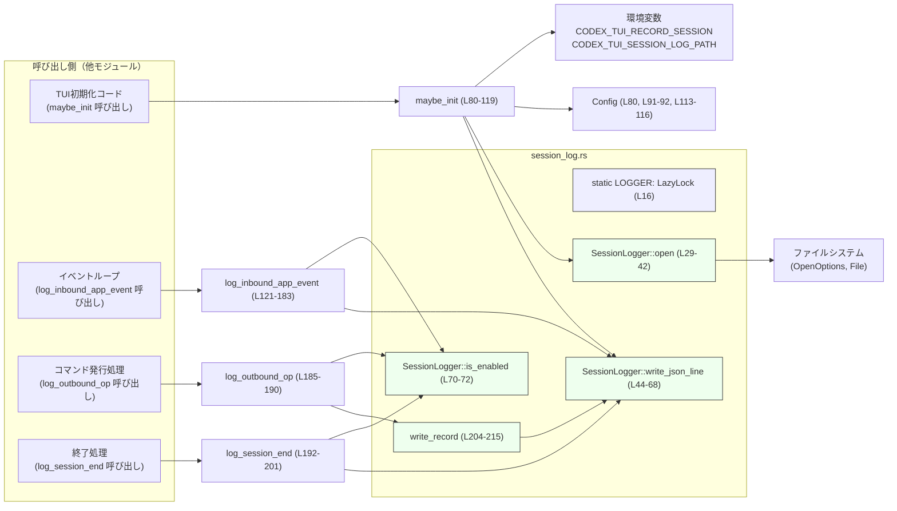

# tui/src/session_log.rs

## 0. ざっくり一言

TUI セッション中のイベントやコマンドを JSON Lines 形式のファイルに記録する、スレッド安全なセッションロガーです（`SessionLogger` と一連のラッパ関数）。  
根拠: `session_log.rs:L16-20,L80-119,L121-183,L185-202,L204-215`

---

## 1. このモジュールの役割

### 1.1 概要

- このモジュールは **TUI セッションの開始・終了・イベント・コマンドをファイルに記録する** ために存在し、JSONL（1 行 1 レコードの JSON）形式でログを書き出します。  
- ログ記録は環境変数で有効化・パス指定され、クレート内の他モジュールからは `maybe_init`, `log_inbound_app_event`, `log_outbound_op`, `log_session_end` を通じて利用されます。  
根拠: `session_log.rs:L16-20,L29-42,L80-119,L121-183,L185-202,L204-215`

### 1.2 アーキテクチャ内での位置づけ

このモジュールは、TUI アプリケーションの他コンポーネントから呼び出され、ファイルシステムにセッションログを書き出します。外部の依存先として `Config`, `AppEvent`, `AppCommand` などを利用します。



### 1.3 設計上のポイント

- **グローバルなロガーインスタンス**
  - `static LOGGER: LazyLock<SessionLogger>` により、ロガーは 1 度だけ遅延初期化される構造になっています。  
  根拠: `session_log.rs:L16,L22-27`
- **ファイルハンドルの一度きりの初期化**
  - `SessionLogger` は `OnceLock<Mutex<File>>` を内部に持ち、`open` が最初に成功した時点でファイルとミューテックスを登録し、それ以降は同じファイルを使い続けます。  
  根拠: `session_log.rs:L18-20,L29-42`
- **スレッド安全な書き込み**
  - 複数スレッドから同時にログを書けるよう、`Mutex<File>` でファイルアクセスを保護しています。ロックの毒化（パニック後の状態）に対しては `into_inner` で継続します。  
  根拠: `session_log.rs:L18-20,L44-51`
- **環境変数による有効化**
  - `CODEX_TUI_RECORD_SESSION` が特定の値（`"1"`, `"true"`, `"TRUE"`, `"yes"`, `"YES"`）の場合のみログ機能を有効化します。  
  根拠: `session_log.rs:L80-86`
- **ファイルパスの決定ロジック**
  - `CODEX_TUI_SESSION_LOG_PATH` があればそれを使用し、なければ `log_dir(config)` の結果か、失敗時にはテンポラリディレクトリに `"session-YYYYMMDDTHHMMSSZ.jsonl"` を作成します。  
  根拠: `session_log.rs:L88-101`
- **JSON Lines 形式 & 即時フラッシュ**
  - 各ログは 1 行の JSON にシリアライズされ、`write_all` と `flush` によって即時にディスクへ書き出されます。  
  根拠: `session_log.rs:L52-64,L196-201,L208-214`
- **UNIX でのファイルパーミッション**
  - Unix 環境ではログファイルのモードを `0o600`（所有ユーザのみ読み書き可）に設定します。  
  根拠: `session_log.rs:L33-37`

---

## 2. 主要な機能一覧

- セッションログの初期化: 環境変数と `Config` を元にログファイルを開き、セッション開始メタ情報を記録する（`maybe_init`）。  
- TUI への入力イベントのロギング: `AppEvent` を受け取り、種類に応じた JSON レコードを `to_tui` 方向として記録する（`log_inbound_app_event`）。  
- TUI からの操作コマンドのロギング: `AppCommand` を JSON として `from_tui` 方向に記録する（`log_outbound_op`）。  
- セッション終了のロギング: セッション終了のメタ情報を記録する（`log_session_end`）。  
- 共通レコード書き込みヘルパ: 任意の `Serialize` なオブジェクトを `payload` として JSON Lines に書く（`write_record`）。  
- ファイルのオープンと書き込み処理: 内部ロガー `SessionLogger` によるファイルオープンと JSON 行の書き込み（`SessionLogger::open`, `SessionLogger::write_json_line`）。  

根拠: `session_log.rs:L29-42,L44-72,L80-119,L121-183,L185-202,L204-215`

---

## 3. 公開 API と詳細解説

### 3.1 型一覧（構造体・定数など）

| 名前 | 種別 | 可視性 | 役割 / 用途 | 定義位置 |
|------|------|--------|-------------|----------|
| `SessionLogger` | 構造体 | モジュール内限定（private） | ログファイルの `File` を `OnceLock<Mutex<_>>` 経由で保持し、書き込みのロック管理を行う | `session_log.rs:L18-20` |
| `LOGGER` | `static` 変数 | モジュール内限定（実体は private だが関数経由で利用） | `LazyLock<SessionLogger>` によるグローバルなセッションロガーのインスタンス | `session_log.rs:L16` |

※ `Config`, `AppEvent`, `AppCommand` は他ファイルで定義されており、このチャンクには定義が現れません。

---

### 3.2 関数詳細（重要な 7 件）

#### `SessionLogger::open(&self, path: PathBuf) -> std::io::Result<()>`

**概要**

- 指定パスにログファイルを作成または開き、`OnceLock` に `Mutex<File>` として登録します。  
- 既にファイルが登録されている場合は新しい `File` は破棄され、既存のファイルが使われます。  

**根拠**

- `session_log.rs:L29-42`

**引数**

| 引数名 | 型 | 説明 |
|--------|----|------|
| `self` | `&SessionLogger` | グローバルロガーインスタンスへの参照 |
| `path` | `PathBuf` | 開く/作成するログファイルのパス |

**戻り値**

- `std::io::Result<()>`  
  - 成功時は `Ok(())`。  
  - 失敗時は `Err(e)` として OS 由来の I/O エラーが返ります。

**内部処理の流れ**

1. `OpenOptions::new()` でオプションを構築し、`create(true).truncate(true).write(true)` を設定（存在しなければ作成し、常にトランケートし書き込みモード）。  
   根拠: `session_log.rs:L29-31`
2. Unix の場合のみ、`OpenOptionsExt::mode(0o600)` でファイルモードを設定。  
   根拠: `session_log.rs:L33-37`
3. `opts.open(path)?` でファイルを開く（失敗時はここで `Err` を返して終了）。  
   根拠: `session_log.rs:L39`
4. `self.file.get_or_init(|| Mutex::new(file));` により、`OnceLock` 未初期化なら `Mutex<File>` を保存。すでに初期化済みならクロージャは実行されず、新しい `file` は破棄されます。  
   根拠: `session_log.rs:L40`
5. `Ok(())` を返す。  
   根拠: `session_log.rs:L41-42`

**Errors / Panics**

- **Errors**
  - パスが無効、ディレクトリが存在しない、権限不足などにより `open` が失敗すると `Err(std::io::Error)` を返します。  
- **Panics**
  - この関数内には `unwrap` 等はなく、標準ライブラリの I/O 呼び出し以外ではパニックを発生させません。

**Edge cases（エッジケース）**

- 同じ `SessionLogger` に対して複数回 `open` を呼び出した場合:
  - 2 回目以降も `opts.open(path)` は実行され、**ファイルは毎回トランケートされます**（OS の仕様上、`O_TRUNC` に相当）。  
  - しかし `OnceLock` は既に初期化済みのため、**最初に登録された `File` のまま** 使用されます。  
  - 結果として、**2 回目以降の `open` 呼び出しはログファイルを空にした上で、そのファイルを使い続ける**挙動になります。  
  根拠: `session_log.rs:L31,L39-L40`
- `OnceLock` は一度初期化されると別のファイルに切り替えられません。

**使用上の注意点**

- 実際の利用では、`LOGGER.open` を呼ぶのは 1 回にとどめることが前提と考えられます。このチャンクでは呼び出し側は `maybe_init` のみです。  
  根拠: `session_log.rs:L103`
- アプリケーションのライフサイクル中に何度も `maybe_init`/`open` を呼ぶと、**ログが途中で消える可能性がある**点に注意が必要です（2 回目以降の `open` がファイルをトランケートするため）。  
- Unix 環境ではファイルパーミッションが `0o600` になるため、ログには機密情報を含めても OS レベルでは所有ユーザ以外から読み取られにくい構造です。

---

#### `SessionLogger::write_json_line(&self, value: serde_json::Value)`

**概要**

- 事前に開かれたログファイルに対して、1 行の JSON テキストとして書き込み、`flush` します。  
- ファイルが開かれていない場合は何も行いません。

**根拠**

- `session_log.rs:L44-68`

**引数**

| 引数名 | 型 | 説明 |
|--------|----|------|
| `self` | `&SessionLogger` | ロガーインスタンス |
| `value` | `serde_json::Value` | 書き込む JSON 値 |

**戻り値**

- 戻り値はなく、失敗時は `tracing::warn!` ログを出して黙って終了します。

**内部処理の流れ**

1. `self.file.get()` で `OnceLock` にファイルが登録されているか確認。なければ（`None`）即 return。  
   根拠: `session_log.rs:L45-47`
2. `Mutex<File>` を `lock()` し、成功時はガードを取得。`Err(poisoned)` の場合でも `poisoned.into_inner()` で内部の `File` を取り出して処理を継続。  
   根拠: `session_log.rs:L48-51`
3. `serde_json::to_string(&value)` で JSON 文字列にシリアライズ。  
   - 成功時:  
     - `write_all(serialized.as_bytes())` → 失敗時は `tracing::warn!` を出して return。  
     - `write_all(b"\n")` で改行を書き込み（失敗時も同様に warn & return）。  
     - `flush()` を呼んでディスクにフラッシュ（失敗時は warn を出すが return はしない）。  
   - 失敗時:  
     - `tracing::warn!` でシリアライズエラーを通知。  
   根拠: `session_log.rs:L52-67`

**Errors / Panics**

- **Errors**
  - シリアライズエラー (`serde_json::to_string`) や `write_all`/`flush` の I/O エラーはすべて `tracing::warn!` で記録されますが、呼び出し元には伝播されません。
- **Panics**
  - `lock()` が `Err` を返すケース（毒化されたロック）でも `into_inner()` を使ってパニックを起こさないようになっています。  
  - この関数自身はパニックを発生させません。

**Edge cases**

- `LOGGER.open` が一度も呼ばれていない場合、`self.file.get()` が `None` を返し、何も書きません。  
  → `log_inbound_app_event` などから見ても「ログ機能が無効」の状態になります。  
  根拠: `session_log.rs:L45-47,L70-72`
- ロックが毒化されている場合でもログ書き込みを試みるため、1 スレッドでのパニック後もログ処理が継続されます。

**使用上の注意点**

- ログ書き込み失敗をアプリケーションロジックには反映していないため、「ログが確実に記録されたか」を呼び出し側で検知することはできません。  
- 各レコードごとに `flush()` を呼ぶため、大量のログを高頻度に書くと I/O 負荷が高くなります（パフォーマンス上の注意点）。

---

#### `maybe_init(config: &Config)`

**概要**

- 環境変数の設定に応じてセッションログを有効化し、ログファイルを開いてヘッダレコード（セッション開始情報）を書き込みます。  
- ログ機能が無効な場合は何も行いません。

**根拠**

- `session_log.rs:L80-119`

**引数**

| 引数名 | 型 | 説明 |
|--------|----|------|
| `config` | `&Config` | アプリケーションの設定。カレントディレクトリやモデル情報などをヘッダに埋め込みます |

**戻り値**

- 戻り値はありません。エラーは `tracing::error!` のみで通知されます。

**内部処理の流れ**

1. `CODEX_TUI_RECORD_SESSION` を `std::env::var` で取得し、`"1"`, `"true"`, `"TRUE"`, `"yes"`, `"YES"` のいずれかであれば `enabled = true`。  
   - 取得失敗（未設定）やそれ以外の値の場合は `enabled = false`。  
   根拠: `session_log.rs:L80-83`
2. `enabled` が `false` なら即 return し、以降の処理は行わない。  
   根拠: `session_log.rs:L84-86`
3. ログファイルのパスを決定:
   - `CODEX_TUI_SESSION_LOG_PATH` が設定されていればその値を `PathBuf::from`。  
     根拠: `session_log.rs:L88-90`
   - なければ、`log_dir(config)` を呼び出し、成功すればそのディレクトリ、失敗すれば `std::env::temp_dir()` を使用。  
     根拠: `session_log.rs:L91-94`
   - ファイル名を `"session-YYYYMMDDTHHMMSSZ.jsonl"` 形式で生成し、そのパスを使う。  
     根拠: `session_log.rs:L95-101`
4. `LOGGER.open(path.clone())` を呼び、失敗すれば `tracing::error!` を出して return。  
   根拠: `session_log.rs:L103-106`
5. ヘッダレコードを JSON オブジェクトとして作成し、`LOGGER.write_json_line(header)` で書き込む。  
   - 内容: `ts`, `dir: "meta"`, `kind: "session_start"`, `cwd`, `model`, `model_provider_id`, `model_provider_name`。  
   根拠: `session_log.rs:L108-118`

**Errors / Panics**

- **Errors**
  - ログファイルが開けない場合（パス不正、権限不足など）は `tracing::error!` で通知し、ログ機能は有効化されません。
- **Panics**
  - `chrono::Utc::now()` や `format!`、`log_dir(config)` は通常パニックしません。  
  - この関数内には `unwrap` などはなく、直接的なパニック要因はありません。

**Edge cases**

- 環境変数が未設定または対象外の値の場合、ログ機能は完全に無効のままです（以降の `log_*` 関数は何も書きません）。  
- `log_dir(config)` が失敗した場合、テンポラリディレクトリにログファイルが作成されます。  
  → ログの保存場所が想定と異なる場合があり得ます。  
- `config` が指すフィールド（`cwd`, `model`, `model_provider_id`, `model_provider.name`）は必須であり、ここで直接参照していますが、このチャンクには `Config` の定義がないため、`Option` 等であるかどうかは不明です。  
  根拠: `session_log.rs:L113-116`

**使用上の注意点**

- アプリケーションの起動時など、**セッション開始前に 1 回だけ** 呼び出す前提の設計です。複数回呼ぶと `SessionLogger::open` の挙動によりログが消える可能性があります（前述）。  
- ログを有効にしたい場合は、**プロセス開始前に環境変数を設定**しておく必要があります。

**使用例**

```rust
// 仮の Config 型（実際の定義はこのチャンクには現れません）
use crate::legacy_core::config::Config;
use crate::tui::session_log::maybe_init;

fn main() {
    let config = load_config();                 // 設定を読み込む（別処理）
    // 環境変数 CODEX_TUI_RECORD_SESSION が "1" などの値ならログを開始
    maybe_init(&config);

    // 以降、アプリケーション本体の処理…
}
```

---

#### `log_inbound_app_event(event: &AppEvent)`

**概要**

- TUI 側に渡されるアプリケーションイベント（`AppEvent`）を、方向 `"to_tui"` のログとして JSON Lines に記録します。  
- 一部のイベントは詳細情報（行数、クエリ文字列など）も記録し、それ以外はバリアント名（または debug 表現）だけを記録します。

**根拠**

- `session_log.rs:L121-183`

**引数**

| 引数名 | 型 | 説明 |
|--------|----|------|
| `event` | `&AppEvent` | ログ対象のアプリイベント |

**戻り値**

- 戻り値はありません。

**内部処理の流れ**

1. `LOGGER.is_enabled()` を呼び、ログ機能が有効になっていなければ return。  
   根拠: `session_log.rs:L123-125,L70-72`
2. `match event` で `AppEvent` のバリアントに応じて JSON オブジェクトを作成し、`LOGGER.write_json_line` で書き込み。  
   - `NewSession` → `"kind": "new_session"`。  
     根拠: `session_log.rs:L128-135`
   - `ClearUi` → `"kind": "clear_ui"`。  
     根拠: `session_log.rs:L136-143`
   - `InsertHistoryCell(cell)` → `"kind": "insert_history_cell"`, `lines`: `cell.transcript_lines(u16::MAX).len()`。  
     根拠: `session_log.rs:L144-151`
   - `StartFileSearch(query)` → `"kind": "file_search_start"`, `query` をそのまま格納。  
     根拠: `session_log.rs:L153-160`
   - `FileSearchResult { query, matches }` → `"kind": "file_search_result"`, `query` と `matches.len()` を格納。  
     根拠: `session_log.rs:L162-170`
   - その他すべて (`other`) → `"kind": "app_event"`, `variant`: `format!("{other:?}")` の結果を `'('` で split し、先頭要素を使用（なければ `"app_event"`）。  
     根拠: `session_log.rs:L172-180`

**Errors / Panics**

- `cell.transcript_lines(u16::MAX)` の実装はこのチャンクにはありませんが、ここでは `len()` を呼ぶだけです。パニック条件はその実装に依存します。  
- JSON 作成・書き込みエラーはすべて `SessionLogger::write_json_line` 内で処理され、ここには伝播しません。  
- `format!("{other:?}")` および `split('(').next().unwrap_or("app_event")` は `'('` が存在しない場合でも `next()` は `Some(…)` を返すため、`unwrap_or` が `None` を処理するケースは想定されません（結果として `variant` が debug 文字列全体になることがあります）。

**Edge cases**

- `LOGGER.is_enabled()` が `false` のとき、`AppEvent` は一切記録されません。  
- `"その他"` のバリアントについては、コメントでは「variant only」と書かれていますが、struct バリアントの debug 表現には `'('` が含まれないことが多いため、**実際にはフィールド値を含む debug 文字列全体が `variant` に入る可能性**があります。  
  根拠: `session_log.rs:L172-180`

**使用上の注意点**

- `log_inbound_app_event` を呼ぶ前に `maybe_init` が呼ばれていない場合、`is_enabled` が常に `false` となりログは一切出力されません。  
- `AppEvent` の新しいバリアントを追加した場合、ここで個別ロジックを足さないと `"kind": "app_event"` で一括扱いになります。

**使用例**

```rust
use crate::app_event::AppEvent;
use crate::tui::session_log::log_inbound_app_event;

fn handle_event(event: AppEvent) {
    // ログ記録（ログが有効な場合のみファイルに出力される）
    log_inbound_app_event(&event);

    // 実際のイベント処理…
}
```

---

#### `log_outbound_op(op: &AppCommand)`

**概要**

- TUI から外部へ発行する操作（`AppCommand`）を `"from_tui"` 方向かつ `"kind": "op"` のログとして JSON Lines に記録します。

**根拠**

- `session_log.rs:L185-190`

**引数**

| 引数名 | 型 | 説明 |
|--------|----|------|
| `op` | `&AppCommand` | ログ記録対象のコマンド |

**戻り値**

- なし。

**内部処理の流れ**

1. `LOGGER.is_enabled()` が `false` なら即 return。  
   根拠: `session_log.rs:L186-187`
2. `write_record("from_tui", "op", op)` を呼び出し、共通フォーマットでレコードを書き込み。  
   根拠: `session_log.rs:L189-190,L204-215`

**Errors / Panics**

- エラー処理はすべて `write_record` → `write_json_line` 内部に閉じています。  
- `AppCommand` が `Serialize` を実装していない場合はコンパイルエラーになります（関数シグネチャ上の制約ではなく、`write_record` 呼び出し時の型制約）。

**Edge cases**

- ログ無効化時には何も記録されません。

**使用上の注意点**

- `AppCommand` の内容が `payload` としてそのまま JSON にシリアライズされるため、機密情報を含むフィールドには注意が必要です（ログファイルは Unix では `0o600` ですが、ファイルへのアクセス権があるユーザからは見えます）。

**使用例**

```rust
use crate::app_command::AppCommand;
use crate::tui::session_log::log_outbound_op;

fn send_command(cmd: AppCommand) {
    // 送信前にログを残す
    log_outbound_op(&cmd);

    // 実際の送信処理…
}
```

---

#### `log_session_end()`

**概要**

- セッション終了時に `"kind": "session_end"` のメタレコードを `"meta"` ディレクションで記録します。

**根拠**

- `session_log.rs:L192-201`

**引数 / 戻り値**

- 引数なし、戻り値なし。

**内部処理の流れ**

1. `LOGGER.is_enabled()` が `false` なら return。  
   根拠: `session_log.rs:L193-195`
2. `json!` で `"ts"`, `"dir": "meta"`, `"kind": "session_end"` を持つ JSON オブジェクトを生成し、`LOGGER.write_json_line(value)` に渡す。  
   根拠: `session_log.rs:L196-201`

**使用上の注意点**

- `maybe_init` が呼ばれていない場合は何も記録されません。  
- セッションの終了点が複数パスに分かれている場合、`log_session_end` が複数回呼ばれうる点に注意が必要です（ログとしては単純に複数の `session_end` レコードになります）。

---

#### `write_record<T>(dir: &str, kind: &str, obj: &T) where T: Serialize`

**概要**

- 任意の `Serialize` 実装型を `payload` フィールドに格納した JSON レコードを作成し、`LOGGER.write_json_line` で書き込みます。  
- `log_outbound_op` などの共通ヘルパとして利用されています。

**根拠**

- `session_log.rs:L204-215`

**引数**

| 引数名 | 型 | 説明 |
|--------|----|------|
| `dir` | `&str` | `"from_tui"` など、ログの方向を表す文字列 |
| `kind` | `&str` | `"op"` など、レコードの種別 |
| `obj` | `&T` | `Serialize` 実装型のログ対象オブジェクト |

**戻り値**

- なし。

**内部処理の流れ**

1. `json!` マクロで `ts`, `dir`, `kind`, `payload` を持つ JSON 値を生成。  
   根拠: `session_log.rs:L208-213`
2. `LOGGER.write_json_line(value)` に渡して書き込み。  
   根拠: `session_log.rs:L214-215`

**使用上の注意点**

- `LOGGER.is_enabled()` のチェックは行わないため、呼び出し側で事前にチェックする必要があります（`log_outbound_op` はこれを行っています）。  
  根拠: `session_log.rs:L185-189`
- `T: Serialize` 制約により、シリアライズ不能な型はコンパイル時に弾かれます。

---

### 3.3 その他の関数・メソッド

| 関数名 | 種別 | 役割（1 行） | 定義位置 |
|--------|------|--------------|----------|
| `SessionLogger::new() -> Self` | メソッド | `OnceLock<Mutex<File>>` を未初期化状態で持つ `SessionLogger` を生成 | `session_log.rs:L22-27` |
| `SessionLogger::is_enabled(&self) -> bool` | メソッド | ファイルが `OnceLock` に登録済みかどうかで、ログ機能の有効/無効を判定 | `session_log.rs:L70-72` |
| `now_ts() -> String` | 関数 | 現在時刻をミリ秒精度の RFC3339 フォーマット文字列に変換 | `session_log.rs:L75-78` |

---

## 4. データフロー

このモジュールの典型的なデータフローは、「セッション開始 → イベント/コマンドの逐次記録 → セッション終了」という流れです。

```mermaid
sequenceDiagram
    participant Main as TUIメイン\n(maybe_init 呼び出し L80-119)
    participant Loop as イベントループ\n(L121-183,L185-190,L192-201)
    participant Log as LOGGER: SessionLogger\n(L16-20,L22-72,L204-215)
    participant FS as ファイルシステム

    Main->>Main: 環境変数 CODEX_TUI_RECORD_SESSION を確認
    alt ログ有効
        Main->>Log: open(path) (L103)
        Log->>FS: ファイルを open (L29-39)
        Log->>Log: OnceLock に Mutex<File> 保存 (L40)
        Main->>Log: write_json_line(session_start) (L118)
        Log->>FS: JSON1行 + flush (L52-64)
    else ログ無効
        Main->>Main: 何もしない
    end

    loop セッション中
        Loop->>Log: is_enabled() (L123,L186,L193)
        alt enabled == true
            Loop->>Log: write_json_line(...) または write_record(...) (L134-181,L189,L200,L214)
            Log->>FS: JSON1行 + flush (L52-64)
        else
            Loop->>Loop: ログはスキップ
        end
    end

    Main->>Log: log_session_end() (L192-201)
    Log->>FS: session_end レコード書き込み
```

- すべてのログレコードは、`now_ts()` によるタイムスタンプ付き JSON オブジェクトとしてファイルに蓄積されます。  
- ログ機能が有効かどうかは、「`LOGGER.file` が初期化済みか」で判定され、これは `maybe_init` → `SessionLogger::open` 成功に依存します。

---

## 5. 使い方（How to Use）

### 5.1 基本的な使用方法

以下は、セッションログを有効にして TUI セッションを記録する典型的な流れの例です。

```rust
use crate::legacy_core::config::Config;          // 実際の定義はこのチャンクには現れません
use crate::app_event::AppEvent;
use crate::app_command::AppCommand;
use crate::tui::session_log::{
    maybe_init,
    log_inbound_app_event,
    log_outbound_op,
    log_session_end,
};

fn run_tui(config: Config) {
    // 1. 起動前に環境変数を設定しておく:
    //    CODEX_TUI_RECORD_SESSION=1
    //    （必要なら CODEX_TUI_SESSION_LOG_PATH=/path/to/log.jsonl も設定）
    //
    // 2. セッション開始時に一度だけ初期化を呼ぶ
    maybe_init(&config);

    // 3. イベントループ内で、TUI へ渡すイベントを記録
    loop {
        let event = receive_app_event();               // AppEvent をどこかから受信（仮の処理）

        // ログ（有効な場合のみファイルに書かれる）
        log_inbound_app_event(&event);

        // イベントに応じてコマンドを生成・送信
        if let Some(cmd) = make_command_from_event(&event) {
            // 送信前にログ
            log_outbound_op(&cmd);

            send_command(cmd);
        }

        if should_exit(&event) {
            break;
        }
    }

    // 4. 終了時に session_end を記録
    log_session_end();
}
```

### 5.2 よくある使用パターン

1. **環境変数でパスのみ切り替える**
   - プロダクション環境では `/var/log/...`、開発環境では相対パスなど、`CODEX_TUI_SESSION_LOG_PATH` だけで保存先を変える運用が可能です。  
   根拠: `session_log.rs:L88-90`
2. **簡易トレース用途での一時ログ**
   - `log_dir(config)` が失敗した場合はテンポラリディレクトリに書かれるため、権限の厳しい環境でも一時的なログとして利用できます。  
   根拠: `session_log.rs:L91-94`
3. **イベント種別ごとの集計**
   - `log_inbound_app_event` は `"kind"` を `new_session`, `clear_ui`, `file_search_start` などに分けているため、ログ解析で種別ごとの頻度や期間を調べることができます。  
   根拠: `session_log.rs:L129-170`

### 5.3 よくある間違い（起こり得る誤用）

コードの構造から、以下のような誤用が起こる可能性があります。

```rust
use crate::tui::session_log::{maybe_init, log_inbound_app_event};
use crate::app_event::AppEvent;

fn main() {
    // 間違い例: maybe_init を呼んでいない
    let event = AppEvent::NewSession;
    log_inbound_app_event(&event);  // is_enabled() が false になり、ログが一切出ない

    // 正しい例: 事前に初期化を行う
    let config = load_config();
    maybe_init(&config);            // この時点で LOGGER.open が呼ばれ、ファイルがセットされる
    log_inbound_app_event(&event);  // ログが書き込まれる
}
```

別の例:

```rust
use crate::tui::session_log::maybe_init;

fn main() {
    let config = load_config();

    // 推奨されない: 何度も maybe_init を呼ぶ
    loop {
        maybe_init(&config);  // 内部で LOGGER.open を毎回呼び出す

        // ...
    }
}
```

- この場合、`SessionLogger::open` が毎回 `truncate(true)` でファイルを開くため、**ログファイルが繰り返し空にされる**可能性があります。  
  根拠: `session_log.rs:L29-31,L39-40`

### 5.4 使用上の注意点（まとめ）

- **前提条件**
  - ログを取りたい場合は、プロセス起動前に `CODEX_TUI_RECORD_SESSION` を適切な値に設定しておく必要があります。  
  - `maybe_init` はセッション開始時に 1 回だけ呼ぶ前提で設計されています。
- **スレッド安全性**
  - 書き込みは `Mutex<File>` で保護されており、複数スレッドからの同時ログ呼び出しは安全です。  
  根拠: `session_log.rs:L18-20,L44-51`
- **パフォーマンス**
  - 各ログごとに `flush()` を呼ぶため、イベントの発生頻度が高い場合にはディスク I/O がボトルネックになる可能性があります。  
  根拠: `session_log.rs:L62-64`
- **セキュリティ**
  - Unix 系 OS ではファイルモード `0o600` に設定され、所有ユーザ以外から読み取りにくくなっています。  
  - ログには `cwd`, `model`, `model_provider_id` などの情報が含まれるため、環境に応じてログの扱いに注意が必要です。  
  根拠: `session_log.rs:L33-37,L108-117`
- **障害時の挙動**
  - 書き込み失敗やシリアライズ失敗は `tracing::warn!` で通知されるだけで、アプリケーションの主処理には影響を与えません。  
  根拠: `session_log.rs:L54-67`

---

## 6. 変更の仕方（How to Modify）

### 6.1 新しい機能を追加する場合

例: 新しい `AppEvent` バリアントに対して、より詳細なログを書きたい場合。

1. **イベントバリアントの追加**
   - `crate::app_event::AppEvent` に新しいバリアントを追加（このチャンクには定義がないため、別ファイルを確認する必要があります）。
2. **`log_inbound_app_event` の `match` に分岐を追加**
   - 対応する `match` アームを追加し、`json!` で必要なフィールドを含むレコードを作成します。  
   根拠: `session_log.rs:L127-182`
3. **必要であれば共通ヘルパを活用**
   - 複雑なペイロードを持つ場合は、`write_record` パターンを参考に、`payload` フィールドにシリアライズされたデータを入れる形に変更することも可能です。  

### 6.2 既存の機能を変更する場合

- **ログフォーマットを変更する場合**
  - `maybe_init`, `log_inbound_app_event`, `log_outbound_op`, `log_session_end`, `write_record` 内の `json!` 呼び出しを検索し、フィールドの追加/削除/名称変更の影響範囲を確認します。  
  根拠: `session_log.rs:L108-118,L129-170,L175-180,L196-201,L208-213`
- **ログパスの決定ロジックを変更する場合**
  - `maybe_init` 内のパス決定部分（環境変数と `log_dir(config)`）を修正します。環境変数名の変更や追加を行う際は、既存利用者への互換性に注意します。  
  根拠: `session_log.rs:L88-101`
- **エラー処理を厳格にしたい場合**
  - 現状は `write_json_line` でエラーをログに書くだけですが、`Result` を返す形に変更すると、呼び出し側でリトライやフォールバック処理を実装できます。  
  - この変更は関数シグネチャに影響するため、すべての呼び出し元（本ファイル内および他ファイル）を確認する必要があります。

---

## 7. 関連ファイル

| パス | 役割 / 関係 | 根拠 |
|------|------------|------|
| `crate::legacy_core::config::Config` | セッションログのヘッダに含める `cwd`, `model`, `model_provider_id`, `model_provider.name`、および `log_dir(config)` によるログディレクトリ決定に利用される設定構造体 | `session_log.rs:L10,L91-94,L113-116` |
| `crate::legacy_core::config::log_dir`（推測される関数名） | ログディレクトリを返す関数。失敗時は `temp_dir()` にフォールバック | `session_log.rs:L91-94` |
| `crate::app_event::AppEvent` | `log_inbound_app_event` でログ対象となるアプリイベント列挙体。`NewSession`, `ClearUi`, `InsertHistoryCell`, `StartFileSearch`, `FileSearchResult` などのバリアントが存在する | `session_log.rs:L14,L127-170` |
| `crate::app_command::AppCommand` | `log_outbound_op` で `payload` としてシリアライズされるコマンド型 | `session_log.rs:L9,L185-190` |
| `tracing` クレート | ログ書き込みやシリアライズ失敗時の警告・エラーログ出力に使用 | `session_log.rs:L54-56,L59-60,L62-63,L66,L103-104` |
| `chrono` クレート | タイムスタンプ生成（RFC3339 形式）に使用 | `session_log.rs:L75-78,L95-98` |
| `serde` / `serde_json` クレート | JSON シリアライズ (`Serialize`, `serde_json::json`, `serde_json::to_string`) に使用 | `session_log.rs:L11-12,L52-67,L108-118,L129-170,L175-180,L196-201,L208-213` |

このチャンクにはテストコードやユニットテストモジュールは含まれていません。テストの有無や内容は他ファイルを確認する必要があります。
