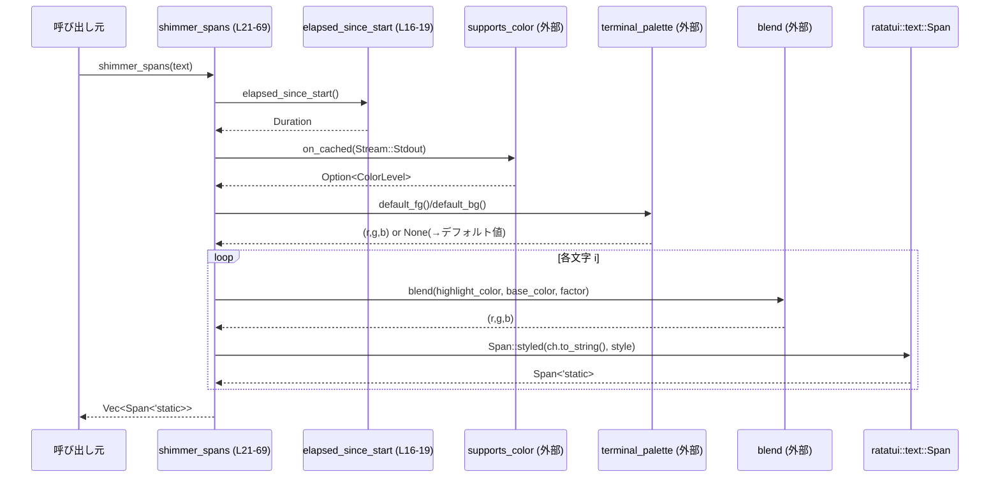

# tui/src/shimmer.rs コード解説

## 0. ざっくり一言

- 端末の色サポートと現在時刻に基づいて、テキストに「シマー（光の帯が流れる）」エフェクトを付けた `ratatui::text::Span` のリストを生成するモジュールです（`tui/src/shimmer.rs:L21-69`）。

---

## 1. このモジュールの役割

### 1.1 概要

- このモジュールは、TUI 上のテキストに動的なハイライト効果を与えるために存在し、時間と端末のカラーレベルに応じてスタイルを変化させた `Span<'static>` のベクタを生成します（`shimmer_spans`）。
- 真の RGB (16m 色) に対応している端末では滑らかな色のグラデーションを使い、そうでない場合は太字／減光といった属性のみで「帯」が見えるように調整します（`tui/src/shimmer.rs:L33-36, L52-65, L71-79`）。

### 1.2 アーキテクチャ内での位置づけ

このファイル内の依存関係と外部モジュールとの関係を図示します。

```mermaid
graph TD
    subgraph "tui::shimmer (tui/src/shimmer.rs:L1-80)"
        PS[PROCESS_START<br/>OnceLock&lt;Instant&gt; (L14)]
        Elapsed[elapsed_since_start() (L16-19)]
        Shimmer[shimmer_spans() (L21-69)]
        ColorLevel[color_for_level() (L71-79)]
    end

    Shimmer --> Elapsed
    Shimmer --> ColorLevel
    Shimmer --> Blend[crate::color::blend (定義は別ファイル)]
    Shimmer --> PaletteFg[crate::terminal_palette::default_fg (別ファイル)]
    Shimmer --> PaletteBg[crate::terminal_palette::default_bg (別ファイル)]
    Shimmer --> SupportsColor[supports_color::on_cached (外部クレート)]
    Shimmer --> RatatuiSpan[ratatui::text::Span]
    Shimmer --> RatatuiStyle[ratatui::style::Style/Color/Modifier]
```

- `shimmer_spans` が中心で、タイミング取得 (`elapsed_since_start`)、色判定 (`supports_color`)、パレット取得 (`default_fg` / `default_bg`)、スタイル決定 (`color_for_level`) を統合しています。

### 1.3 設計上のポイント

- **時間基準のエフェクト**  
  - プロセス起動後の経過時間を `OnceLock<Instant>` で初期化された開始時刻から計算します（`tui/src/shimmer.rs:L14-19`）。
- **端末能力に応じたフォールバック**  
  - RGB 真色対応端末では `Color::Rgb` を使ったグラデーション（`blend` 関数）を用い、非対応端末では `Modifier::DIM/BOLD` のみで変化を表現します（`tui/src/shimmer.rs:L33-36, L52-65, L71-79`）。
- **状態を持たない API**  
  - 公開関数 `shimmer_spans` は引数の文字列以外に状態を持たず、内部のグローバル状態は `PROCESS_START`（開始時刻）だけです（`tui/src/shimmer.rs:L14-19, L21-69`）。
- **スレッド安全性**  
  - `PROCESS_START` は `OnceLock` によって一度だけ初期化されるため、複数スレッドから `shimmer_spans` を呼び出してもデータ競合なく共有されます（`tui/src/shimmer.rs:L14, L16-18`）。
- **エラー非発生設計**  
  - 端末パレット取得やカラーサポート判定は `unwrap_or` / `map` で扱われており、`Result` や `Option` の `unwrap` によるパニックを避けています（`tui/src/shimmer.rs:L33-35, L38-40`）。

---

## 2. 主要な機能一覧 ＆ コンポーネントインベントリー

### 2.1 機能一覧

- `shimmer_spans`: 与えられた文字列を、時間ベースのシマーエフェクト付き `Vec<Span<'static>>` に変換します（`tui/src/shimmer.rs:L21-69`）。
- `elapsed_since_start`: プロセス開始（初回呼び出し時の `Instant`）からの経過時間を返します（`tui/src/shimmer.rs:L14-19`）。
- `color_for_level`: 0.0〜1.0 の強度に応じて、フォールバック用の `Style` を決定します（`tui/src/shimmer.rs:L71-79`）。

### 2.2 コンポーネントインベントリー

| 名前 | 種別 | 公開範囲 | 定義場所 | 役割 / 用途 |
|------|------|----------|----------|-------------|
| `PROCESS_START` | `static OnceLock<Instant>` | モジュール内 | `tui/src/shimmer.rs:L14` | プロセス起動時刻（正確には初回アクセス時刻）を一度だけ保持し、後続の経過時間計算の基準にします。 |
| `elapsed_since_start()` | 関数 | モジュール内 | `tui/src/shimmer.rs:L16-19` | `PROCESS_START` を初期化・参照し、基準時刻からの `Duration` を返します。 |
| `shimmer_spans(text: &str)` | 関数 | `pub(crate)` | `tui/src/shimmer.rs:L21-69` | 文字列をシマーエフェクト付きの `Vec<Span<'static>>` に変換するメイン API です。 |
| `color_for_level(intensity: f32)` | 関数 | モジュール内 | `tui/src/shimmer.rs:L71-79` | 非 RGB 環境で `intensity` に応じた太字／減光スタイルを返すフォールバック関数です。 |

---

## 3. 公開 API と詳細解説

### 3.1 型一覧（構造体・列挙体など）

- このファイル内で新規に定義される構造体・列挙体・トレイトはありません。
- 代わりに、重要な外部型の利用のみがあります（定義はこのチャンクには現れません）:
  - `ratatui::text::Span<'a>`: 表示テキストとスタイルを持つ 1 セグメント（`tui/src/shimmer.rs:L8, L21, L38, L66`）。
  - `ratatui::style::Style`, `Color`, `Modifier`: 表示スタイル（色・属性）を表す型（`tui/src/shimmer.rs:L5-7, L52-62, L71-79`）。
  - `std::sync::OnceLock<T>`: スレッド安全な一度きり初期化用コンテナ（`tui/src/shimmer.rs:L1, L14`）。
  - `std::time::Instant`, `Duration`: 時刻と時間差（`tui/src/shimmer.rs:L2-3, L14, L16-18`）。

### 3.2 関数詳細

#### `pub(crate) fn shimmer_spans(text: &str) -> Vec<Span<'static>>`  

**概要**

- 入力文字列を 1 文字ずつ `Span` に分解し、時間経過とともに移動する「ハイライト帯」を色・スタイルの変化として表現する関数です（`tui/src/shimmer.rs:L21-69`）。
- 端末が真の RGB をサポートしていれば色のグラデーション、そうでなければ太字／減光の切り替えで帯を表現します。

**引数**

| 引数名 | 型 | 説明 |
|--------|----|------|
| `text` | `&str` | シマーエフェクトを適用する文字列。UTF-8 文字列であり、1 文字単位で処理されます（`tui/src/shimmer.rs:L21-22`）。 |

**戻り値**

- `Vec<Span<'static>>`  
  - `text` の各文字に対応する `Span<'static>` を格納したベクタです（`tui/src/shimmer.rs:L38, L41, L66-68`）。
  - 各 `Span` には、シマーの位置に応じた色・スタイル（太字／減光）が設定されます。

**内部処理の流れ（アルゴリズム）**

1. **文字列を文字配列に変換し、空なら早期リターン**  
   - `text.chars().collect()` で `Vec<char>` を得て、空なら空ベクタを返します（`tui/src/shimmer.rs:L22-25`）。
2. **時間に基づく帯の中心位置を決定**  
   - `elapsed_since_start().as_secs_f32()` で経過秒数を取得し、一定周期 (`sweep_seconds = 2.0`) でループさせます（`tui/src/shimmer.rs:L29-31`）。
   - 文字列の長さに両側のパディング (`padding = 10`) を加えた `period` にスケーリングし、帯の中心位置 `pos` を `usize` で求めます（`tui/src/shimmer.rs:L27-32`）。
3. **端末の真色対応を判定**  
   - `supports_color::on_cached(Stream::Stdout)` で標準出力の色サポートを取得し、16m 色対応かどうかを `has_true_color` として bool で持ちます（`tui/src/shimmer.rs:L33-35`）。
4. **基本色とハイライト色を決定**  
   - `default_fg()` / `default_bg()` から前景色／背景色を取得し、得られない場合は `(128,128,128)`（グレー）、 `(255,255,255)`（白）をデフォルトにします（`tui/src/shimmer.rs:L38-40`）。
5. **各文字ごとに距離と強度を計算**  
   - 各文字のインデックス `i` にパディングを加えた `i_pos` と、帯中心 `pos` の差分から距離 `dist` を計算します（`tui/src/shimmer.rs:L41-44`）。
   - `band_half_width` の範囲内で余弦波（cosine）を使って滑らかな強度 `t ∈ [0,1]` を算出し、それ以外は 0 にします（`tui/src/shimmer.rs:L36, L46-51`）。
6. **スタイルを決定**  
   - 真色対応 (`has_true_color == true`) の場合:
     - `t` を [0,1] にクランプして `highlight` とし、`highlight * 0.9` を重みとして `blend(highlight_color, base_color, ...)` で RGB 色を補間します（`tui/src/shimmer.rs:L52-55`）。  
     - `Style::default().fg(Color::Rgb(...)).add_modifier(Modifier::BOLD)` で太字かつ補間色のスタイルを生成します（`tui/src/shimmer.rs:L59-62`）。  
       - そのため RGB 環境では常に BOLD が付き、色の違いで帯が表現されます。
   - 真色非対応の場合:
     - `color_for_level(t)` で、`t` に応じて DIM / 通常 / BOLD いずれかのスタイルを返します（`tui/src/shimmer.rs:L63-65`）。
7. **Span を蓄積**  
   - `Span::styled(ch.to_string(), style)` で 1 文字単位の `Span` を生成し、`spans` ベクタに push します（`tui/src/shimmer.rs:L66`）。
8. **生成した Vec<Span> を返却**  
   - すべての文字の処理が終わったら `spans` を返します（`tui/src/shimmer.rs:L67-68`）。

**Examples（使用例）**

> 注意: ここでの `Paragraph` や `Frame` は ratatui の一般的なウィジェット／フレームの例であり、このリポジトリ内に同名のコードが存在するかどうかはこのチャンクからは分かりません。

```rust
use ratatui::widgets::Paragraph;
use ratatui::text::Line;

// シマー付きタイトルを描画するイメージ例
fn render_title(frame: &mut ratatui::Frame, area: ratatui::layout::Rect) {
    // "My App" というタイトルにシマーエフェクトを適用する
    let spans = shimmer_spans("My App");           // シマー付きの Span ベクタを取得
    let line = Line::from(spans);                  // 1 行分のテキスト行に変換

    let widget = Paragraph::new(line);             // Paragraph ウィジェットとして包む
    frame.render_widget(widget, area);             // 指定エリアに描画する
}
```

- 実際にはレンダリングループ（毎フレーム）内で `shimmer_spans` を呼ぶことで、時間とともに光の帯が流れるような見た目になります。

**Errors / Panics**

- この関数内には `unwrap()` や `panic!`、`?` 演算子は使用されていません（`tui/src/shimmer.rs:L21-69`）。
- `default_fg()` / `default_bg()` は `unwrap_or` で安全にフォールバックしており、パニックは発生しません（`tui/src/shimmer.rs:L38-40`）。
- `supports_color::on_cached` の戻り値は `map` と `unwrap_or(false)` で処理されており、色判定の失敗もパニックではなく「真色非対応」として扱われます（`tui/src/shimmer.rs:L33-35`）。
- 数値演算に関しても、`period` は `usize` → `f32` に変換された後、`pos_f` を `usize` にキャストしており、負数にはなりません（`tui/src/shimmer.rs:L27-32`）。

**Edge cases（エッジケース）**

- **空文字列**  
  - `text` が空の場合、`chars.is_empty()` によって即座に `Vec::new()` を返し、以降の計算は行いません（`tui/src/shimmer.rs:L22-25`）。
- **非常に長い文字列**  
  - 文字数 `n` に対して O(n) で `Span` を生成します。`Vec::with_capacity(chars.len())` で必要容量を一度に確保するため、再確保は抑えられています（`tui/src/shimmer.rs:L38, L41-67`）。
  - 極端に長い文字列ではループが重くなりますが、オーバーフロー等の挙動はコードからは確認されません。
- **非 RGB 端末**  
  - `has_true_color == false` の場合、`color_for_level(t)` による DIM/通常/BOLD の 3 段階で帯が表現されます（`tui/src/shimmer.rs:L33-36, L63-65, L71-79`）。
- **RGB 端末**  
  - 全文字に `Modifier::BOLD` が付与され、帯部分は `highlight_color` に近い色、その他は `base_color` に近い色として表示されます（`tui/src/shimmer.rs:L52-62`）。

**使用上の注意点**

- **再計算が必要**  
  - シマーは時間に依存するため、アニメーションさせるには描画ごと（フレームごと）に `shimmer_spans` を再度呼び出す必要があります。
- **スレッド安全性**  
  - 内部の `PROCESS_START` は `OnceLock` によりスレッド安全に初期化されるため、複数スレッドから `shimmer_spans` を呼び出してもデータ競合は発生しない設計です（`tui/src/shimmer.rs:L14-19`）。
- **ライフタイム `'static` の意味**  
  - `Span<'static>` ですが、これは内部で文字列を所有 (`String`) していることによるものであり、グローバルな静的データという意味ではありません。  
    各呼び出しで新しい `Span` と文字列が生成されます（`tui/src/shimmer.rs:L66`）。
- **パフォーマンス**  
  - 毎フレーム大量のテキストに対して呼ぶと、文字数に比例してコストが増えます。必要な範囲に限定して使用する方が効率的です。

---

#### `fn elapsed_since_start() -> Duration`

**概要**

- `PROCESS_START` に保持された基準時刻からの経過時間を返す、時間計測用のヘルパー関数です（`tui/src/shimmer.rs:L16-19`）。

**引数**

- なし。

**戻り値**

- `std::time::Duration`  
  - 基準時刻から現在時刻までの経過時間です（`tui/src/shimmer.rs:L16-19`）。

**内部処理の流れ**

1. `PROCESS_START.get_or_init(Instant::now)` で、`PROCESS_START` にすでに値があればそれを返し、未初期化なら現在時刻 `Instant::now()` で初期化します（`tui/src/shimmer.rs:L16-17`）。
2. 取得した `start` に対して `start.elapsed()` を呼び出し、`Duration` を返します（`tui/src/shimmer.rs:L18`）。

**Examples（使用例）**

```rust
// 経過時間（秒）を取得してログなどに使う例
let elapsed = elapsed_since_start();     // Duration
let secs = elapsed.as_secs_f32();        // f32 秒に変換して利用
```

**Errors / Panics**

- `OnceLock::get_or_init` と `Instant::now`、`Instant::elapsed` は標準ライブラリの API であり、このコード内ではパニック条件はありません（`tui/src/shimmer.rs:L16-18`）。
- 返される `Duration` が負になることはありません（`Instant` は単調増加とみなされるため）。

**Edge cases**

- 初回呼び出し時に `PROCESS_START` が現在時刻で初期化され、それ以降は同じ値が再利用されます（`tui/src/shimmer.rs:L14, L16-17`）。
- マルチスレッド環境で別スレッドから同時に呼ばれても、`OnceLock` により 1 回だけの初期化に収束します。

**使用上の注意点**

- この関数は「プロセス起動時刻」ではなく、「このモジュールが初めて時間計測に使われた時刻」を基準とします（実際の起動時刻との差はこのチャンクからは不明です）。
- 長時間稼働するプロセスでも、`Duration` は内部で適切に扱われる設計です。

---

#### `fn color_for_level(intensity: f32) -> Style`

**概要**

- 真色 (RGB) 非対応の端末向けに、強度 `intensity` に応じて DIM / 通常 / BOLD のいずれかのスタイルを返すフォールバック関数です（`tui/src/shimmer.rs:L71-79`）。

**引数**

| 引数名 | 型 | 説明 |
|--------|----|------|
| `intensity` | `f32` | シマーの強度（0.0 に近いほど弱く、1.0 に近いほど強い）。`shimmer_spans` 内では 0〜1 の範囲で使われます（`tui/src/shimmer.rs:L46-51, L63-65`）。 |

**戻り値**

- `ratatui::style::Style`  
  - 強度に応じたテキストスタイル（DIM / 通常 / BOLD）のいずれかを表します（`tui/src/shimmer.rs:L73-79`）。

**内部処理の流れ**

1. `intensity < 0.2` の場合、`Style::default().add_modifier(Modifier::DIM)` を返します（`tui/src/shimmer.rs:L73-74`）。
2. `0.2 ≤ intensity < 0.6` の場合、`Style::default()`（スタイル無し）を返します（`tui/src/shimmer.rs:L75-76`）。
3. `intensity ≥ 0.6` の場合、`Style::default().add_modifier(Modifier::BOLD)` を返します（`tui/src/shimmer.rs:L77-78`）。

**Examples（使用例）**

```rust
let low = color_for_level(0.1);   // DIM になる（弱いシマー）
let mid = color_for_level(0.4);   // 通常スタイル（中間）
let high = color_for_level(0.9);  // BOLD になる（強いシマー）
```

**Errors / Panics**

- この関数は純粋な条件分岐のみで、パニックとなるコードは含まれていません（`tui/src/shimmer.rs:L71-79`）。

**Edge cases**

- `intensity` が 0 未満または 1 より大きい値でも、閾値比較のみのため、以下の 3 区分に割り当てられます（`tui/src/shimmer.rs:L73-78`）。
  - `< 0.2` → DIM
  - `0.2 ≤ intensity < 0.6` → 通常
  - `≥ 0.6` → BOLD  
  `shimmer_spans` から渡される値は 0〜1 にクランプされているため（`tui/src/shimmer.rs:L52-54`）、通常はこの範囲のみを取り扱います。

**使用上の注意点**

- `intensity` が 0.0 に近い場合も完全に何も表示しないわけではなく、「減光 (DIM)」になります。完全にオフにしたい場合は、呼び出し側で `intensity` によるフィルタリングを行う必要があります。

### 3.3 その他の関数

- このファイルにおいて、上記 3 関数以外の関数は定義されていません。

---

## 4. データフロー

シマーエフェクト付きテキストを生成する典型的な流れを示します。

1. 呼び出し元が `shimmer_spans(text)` を呼び出す。
2. `shimmer_spans` が内部で経過時間 (`elapsed_since_start`) を取得し、現在のシマー帯位置を計算する。
3. 端末の色サポート (`supports_color`) を確認し、RGB グラデーションかフォールバック属性かを選択する。
4. 端末パレット (`default_fg`, `default_bg`) とブレンド関数 (`blend`) を使ってスタイルを決定する。
5. 1 文字ごとに `Span` を生成し、`Vec<Span>` として返す。



- このフロー図は `tui/src/shimmer.rs:L16-19, L21-69` の処理に対応します。
- 外部モジュール (`supports_color`, `terminal_palette`, `blend`) の内部実装はこのチャンクには現れません。

---

## 5. 使い方（How to Use）

### 5.1 基本的な使用方法

典型的には、TUI の描画ループ内でタイトルやテキストを描画する際に `shimmer_spans` を呼び出して使用します。

```rust
use ratatui::widgets::Paragraph;
use ratatui::text::Line;
use ratatui::Frame;
use ratatui::layout::Rect;

// フレームごとに呼び出される描画関数のイメージ
fn draw_title(frame: &mut Frame, area: Rect) {
    // シマー付きテキストを生成
    let spans = shimmer_spans("Loading...");        // L21-69: シマーエフェクト計算

    // ratatui の Line と Paragraph に変換して描画
    let line = Line::from(spans);                   // 1 行分のテキスト
    let widget = Paragraph::new(line);              // Paragraph ウィジェット化

    frame.render_widget(widget, area);              // 指定領域に描画
}
```

- フレーム毎に `shimmer_spans` を再実行することで、時間経過に応じて帯が移動するアニメーションになります。

### 5.2 よくある使用パターン

1. **タイトルやローディング表示に利用**  
   - 短い文字列 (`"Loading..."`、アプリ名など) に対してシマーを適用し、ユーザーの視線を引き付ける用途。

2. **選択中メニューの強調**  
   - 現在選択中のメニュー項目にのみ `shimmer_spans` を適用し、他は通常のスタイルにするなど。

3. **カラー環境に依存しない演出**  
   - 真色対応／非対応端末の両方でそれなりに見えるよう設計されているため、特別な分岐なしに `shimmer_spans` を呼ぶだけで運用できます。

### 5.3 よくある間違い

```rust
// 間違い例: 初回だけ shimmer_spans を呼び出し、その結果を使い回す
let spans = shimmer_spans("Title");
// ... 以降のフレームでもずっと同じ spans を再利用してしまう
```

- この場合、シマーの位置は変化せず、静的な太字／色付きのテキストにしか見えません。

```rust
// 正しい例: 各フレームで shimmer_spans を呼び直す
fn draw(frame: &mut Frame, area: Rect) {
    let spans = shimmer_spans("Title");   // フレームごとに再計算
    let line = Line::from(spans);
    let widget = Paragraph::new(line);
    frame.render_widget(widget, area);
}
```

### 5.4 使用上の注意点（まとめ）

- **フレームごとに再計算すること**  
  - シマーは経過時間に依存するため、アニメーションさせる場合は毎フレーム呼び出す必要があります。
- **コストの意識**  
  - 文字数に比例してコストが増えるため、非常に長いテキストへの適用は描画性能に影響する可能性があります。
- **端末能力の違い**  
  - 真色対応端末と非対応端末で見え方が異なりますが、コード側で特別な分岐は不要です。
- **スレッドからの呼び出し**  
  - `OnceLock` により、どのスレッドから呼び出しても基準時刻は共有されます。並列描画などを行う場合でも、開始時刻が不整合になることはありません（`tui/src/shimmer.rs:L14-19`）。

---

## 6. 変更の仕方（How to Modify）

### 6.1 新しい機能を追加する場合

シマー挙動を変えたりバリエーションを増やしたい場合の典型的な入口をまとめます。

1. **帯の幅や速度を変える**
   - 帯半幅: `band_half_width` を変更（`tui/src/shimmer.rs:L36`）。
   - スイープ周期: `sweep_seconds` を変更（`tui/src/shimmer.rs:L29`）。
   - これにより、帯が細く・太く、速く・遅く移動するように調整できます。

2. **強度カーブを変える**
   - 現在は余弦波 (`cos`) を使った平滑なカーブです（`tui/src/shimmer.rs:L46-49`）。  
     ガウシアン風のカーブなどに変えたい場合は、この部分の数式を変更します。

3. **フォールバックスタイルのバリエーション**
   - `color_for_level` を拡張して、`UNDERLINED` や `ITALIC` など他の `Modifier` を追加することができます（`tui/src/shimmer.rs:L71-79`）。

4. **別のシマー関数を追加**
   - 例えば「逆向き」や「複数の帯」を持つバリエーションを追加する場合は、新しい `fn shimmer_spans_variant(...)` を定義し、`elapsed_since_start` と同様の時間計算ロジックを再利用するとよいです。

### 6.2 既存の機能を変更する場合

- **影響範囲の確認**
  - `shimmer_spans` は `pub(crate)` なので、同クレート内の複数モジュールから呼ばれている可能性があります。変更前にリポジトリ全体での使用箇所を検索するのが安全です（使用箇所はこのチャンクには現れません）。
- **契約・前提条件**
  - 引数 `text` が空なら空ベクタを返す、という挙動（`tui/src/shimmer.rs:L22-25`）は、呼び出し側が依存している可能性があります。
  - `Span<'static>` を返す点も、呼び出し側のライフタイム制約を緩くする契約になっています。`'static` を短いライフタイムに変更すると、コンパイルエラーが広範囲に発生する可能性があります。
- **スタイル変更時の注意**
  - `Color::Rgb` → 他の色表現への変更や、`Modifier::BOLD` の削除などは、視認性に影響します。真色対応／非対応環境での見え方を確認する必要があります。
- **テスト**
  - このチャンクにはテストコードは現れません。実際に変更する際は、レンダリング結果を目視確認するか、必要に応じてスナップショットテスト等を別途用意する必要があります。

---

## 7. 関連ファイル

このモジュールと密接に関係するコード（モジュールパスベースで記載）をまとめます。

| パス / モジュール | 役割 / 関係 |
|-------------------|------------|
| `crate::color::blend` | 2 つの RGB 色と重みを受け取り、中間色を計算する関数として使用されています（実装はこのチャンクには現れません）。`tui/src/shimmer.rs:L10, L52-55` |
| `crate::terminal_palette::default_fg` | 端末のデフォルト前景色を `(u8,u8,u8)` のタプルとして返す関数とみなされます（実装は不明）。`tui/src/shimmer.rs:L12, L38-39` |
| `crate::terminal_palette::default_bg` | 端末のデフォルト背景色を取得します（`default_fg` と同様に `unwrap_or` でフォールバック）。`tui/src/shimmer.rs:L11, L38-40` |
| `supports_color` クレート | 端末の色サポートレベルを判定するために使用されています。`Stream::Stdout` の情報から 16m 色対応かどうかを確認します（内部実装はこのチャンクには現れません）。`tui/src/shimmer.rs:L33-35` |
| `ratatui::text::Span` | シマーエフェクトの結果を表現する基本ユニット。`shimmer_spans` の戻り値の要素型です。`tui/src/shimmer.rs:L8, L21, L38, L66` |
| `ratatui::style::{Style, Color, Modifier}` | テキストの色とスタイル（太字・減光など）を表す型群として使用されています。`tui/src/shimmer.rs:L5-7, L52-62, L71-79` |

- 上記関連モジュールの具体的な実装はこのチャンクには現れず、不明です。  
  ただし、`shimmer.rs` の挙動を理解・変更する際には、`terminal_palette` と `color::blend` の実装が影響する点に注意が必要です。
