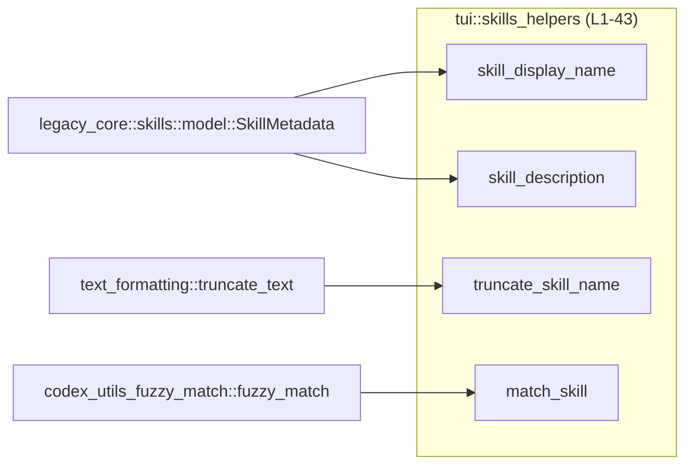
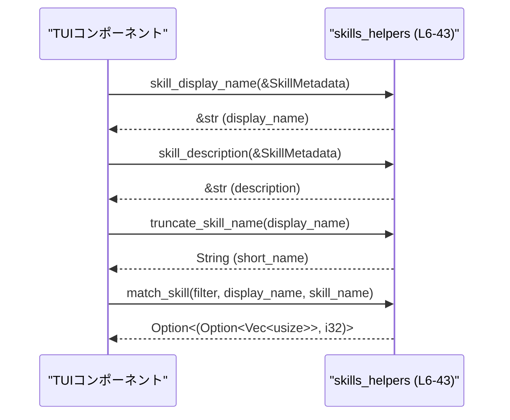

# tui/src/skills_helpers.rs コード解説

## 0. ざっくり一言

Skill（スキル）のメタデータから **表示用の名前と説明文を取り出し・整形し、さらにあいまい検索用のマッチ処理を提供する TUI 用ヘルパーモジュール**です。  
（根拠: `SkillMetadata` を受け取る関数群と `fuzzy_match` 呼び出しが定義されているため  
skills_helpers.rs:L1-2, L8-23, L29-43）

---

## 1. このモジュールの役割

### 1.1 概要

このモジュールは次の問題を解決するために存在し、以下の機能を提供します。

- Skill のメタデータから、UI に表示する「表示名」「説明文」を適切な優先順位で選択する  
  （根拠: `skill_display_name`, `skill_description` が `&SkillMetadata` から `&str` を返す  
  skills_helpers.rs:L8-23）
- 表示用に Skill 名を一定の長さで切り詰める  
  （根拠: `SKILL_NAME_TRUNCATE_LEN` と `truncate_skill_name`  
  skills_helpers.rs:L6, L25-27）
- フィルター文字列に対して Skill の表示名／内部名をあいまいマッチし、スコアと強調用インデックスを返す  
  （根拠: `match_skill` が `fuzzy_match` を 2 回呼び出し、`Option<(Option<Vec<usize>>, i32)>` を返す  
  skills_helpers.rs:L2, L29-43）

### 1.2 アーキテクチャ内での位置づけ

このモジュールは、主に次のコンポーネントに依存しています。

- ドメインモデル: `crate::legacy_core::skills::model::SkillMetadata`  
  （根拠: use 文と関数引数  
  skills_helpers.rs:L1, L8, L16）
- 文字列整形ユーティリティ: `crate::text_formatting::truncate_text`  
  （根拠: use 文と `truncate_skill_name` 内の呼び出し  
  skills_helpers.rs:L4, L25-26）
- あいまいマッチライブラリ: `codex_utils_fuzzy_match::fuzzy_match`  
  （根拠: use 文と `match_skill` 内の呼び出し  
  skills_helpers.rs:L2, L34, L38）

依存関係を簡略図で示すと次のようになります。



### 1.3 設計上のポイント

- **完全にステートレスなヘルパー群**  
  すべての関数は引数のみを読み取り、内部状態やグローバル変数を保持しません。  
  （根拠: const と 4 つの関数のみが定義されており、いずれも可変静的変数やフィールドを持たない  
  skills_helpers.rs:L6-43）
- **Option を用いた安全なフォールバック選択**  
  インターフェース側の display/short_description が無い場合に、Skill 本体の name/description に安全にフォールバックする構造になっています。  
  （根拠: `and_then(...).unwrap_or(&skill.name)` / `... .or(skill.short_description.as_deref()).unwrap_or(&skill.description)`  
  skills_helpers.rs:L12-13, L20-22）
- **エラーではなく「None」やフォールバックで扱う方針**  
  入力に応じて panic や Result 型エラーは発生させず、デフォルト値や `Option` で表現しています。  
  （根拠: どの関数も `Result` を返さず、`unwrap` も使用していない  
  skills_helpers.rs:L8-43）
- **並行性上の懸念が少ない純粋関数**  
  共有可変状態に触れず、引数は不変参照または値渡しのみのため、関数自体はスレッド安全なヘルパーとして扱いやすい構造です。  
  （根拠: 全引数が `&SkillMetadata` または `&str` か値型であり、`static mut` などが存在しない  
  skills_helpers.rs:L8, L16, L25, L29-33）

---

## 2. 主要な機能一覧（コンポーネントインベントリー）

このファイルが提供する主なコンポーネントと役割です。

| 名前 | 種別 | 役割 / 用途 | 根拠 |
|------|------|-------------|------|
| `SKILL_NAME_TRUNCATE_LEN` | `const usize` | Skill 名を表示するときの最大長（切り詰め長） | skills_helpers.rs:L6 |
| `skill_display_name` | 関数 | Skill の表示名を、インターフェース情報を優先して取得する | skills_helpers.rs:L8-14 |
| `skill_description` | 関数 | Skill の短い説明文を、複数の候補から優先順位付きで取得する | skills_helpers.rs:L16-23 |
| `truncate_skill_name` | 関数 | Skill 名を `SKILL_NAME_TRUNCATE_LEN` 文字に収まるように切り詰めた `String` を生成する | skills_helpers.rs:L25-27 |
| `match_skill` | 関数 | フィルタ文字列と表示名／内部名をあいまいマッチし、スコアと強調位置を返す | skills_helpers.rs:L29-43 |

---

## 3. 公開 API と詳細解説

### 3.1 型・定数一覧

このファイル内で定義・利用される主要な型・定数です。

| 名前 | 種別 | 役割 / 用途 | 定義 / 利用位置 |
|------|------|-------------|-----------------|
| `SkillMetadata` | 構造体（別モジュール） | Skill のメタデータ。少なくとも `name`, `description`, `short_description`, `interface` フィールドを持つ | 利用: skills_helpers.rs:L1, L8, L16 |
| `interface` フィールド | 構造体フィールド（型は不明） | UI 用インターフェース情報。少なくとも `display_name`, `short_description` を持つ | 利用: skills_helpers.rs:L10, L18, L20 |
| `SKILL_NAME_TRUNCATE_LEN` | 定数 (`usize`) | Skill 名の切り詰め長（21） | 定義: skills_helpers.rs:L6 |

> `interface.display_name`, `interface.short_description`, `skill.short_description` の型は、`as_deref` と `or` の使い方から、それぞれ `Option<String>` に類する型であると読み取れます。  
> （根拠: `as_deref` は通常 `Option<String>` → `Option<&str>` に使う; `or` は `Option` 同士の結合に使う  
> skills_helpers.rs:L12, L20-21）

### 3.2 関数詳細

#### `skill_display_name(skill: &SkillMetadata) -> &str`

**概要**

- Skill の表示名を取得します。
- `interface.display_name` が存在すればそれを優先し、なければ `skill.name` を返します。  
  （根拠: `and_then(...display_name.as_deref()).unwrap_or(&skill.name)`  
  skills_helpers.rs:L12-13）

**引数**

| 引数名 | 型 | 説明 |
|--------|----|------|
| `skill` | `&SkillMetadata` | 表示名を取得したい Skill のメタデータ |

**戻り値**

- `&str` — Skill の表示名。`skill` 内部のどこかの `String` から借用されたスライス（所有権は移動しません）。  
  （根拠: 戻り値が `&str` であり、`as_deref` や `&skill.name` から借用している  
  skills_helpers.rs:L8-13）

**内部処理の流れ**

1. `skill.interface` を参照として取り出す（`as_ref`）  
   （skills_helpers.rs:L10-11）
2. その中の `display_name` フィールドを `Option<&str>` として取り出す  
   （`and_then(|interface| interface.display_name.as_deref())`  
   skills_helpers.rs:L12）
3. `display_name` が `Some` であればその値（`&str`）を返す。
4. `display_name` が `None` であれば、フォールバックとして `&skill.name` を返す。  
   （skills_helpers.rs:L13）

**Examples（使用例）**

```rust
use crate::legacy_core::skills::model::SkillMetadata;
use crate::tui::skills_helpers::skill_display_name;

// SkillMetadata をどこかから取得している前提の例
fn print_skill_display_name(skill: &SkillMetadata) {
    // interface.display_name があればそれを、
    // なければ skill.name を &str として取得する
    let name: &str = skill_display_name(skill);

    println!("Skill: {}", name);
}
```

**Errors / Panics**

- `Result` や `Option` でエラーを返さず、`unwrap` も使っていないため、この関数自身がエラーや panic を発生させる経路はコードからは確認できません。  
  （根拠: `unwrap_or` は panic せず、デフォルト値を返すメソッドです  
  skills_helpers.rs:L13）

**Edge cases（エッジケース）**

- `skill.interface` が `None` の場合: `skill.name` が返されます。  
  （skills_helpers.rs:L10-13）
- `interface.display_name` が `None` の場合: 同様に `skill.name` が返されます。  
- `skill.name` が空文字列でも、そのまま返されます（空でも特別扱いは行っていません）。  
  （特別な条件分岐が無いため  
  skills_helpers.rs:L8-13）

**使用上の注意点**

- 返り値は `skill` から借用した `&str` なので、`skill` のライフタイムを超えて保持することはできません（Rust の所有権・借用ルールに従います）。  
- 表示用の名前が常に存在する前提で UI を組んでも問題ありませんが、実際には `skill.name` が空である可能性は排除されていないため、その場合の UI 表示は別途考慮が必要です。

---

#### `skill_description(skill: &SkillMetadata) -> &str`

**概要**

- Skill の短い説明文を取得します。
- 優先順位は以下の通りです。  
  1. `interface.short_description`  
  2. `skill.short_description`  
  3. `skill.description`（フォールバック）  
  （根拠: `and_then(...short_description...) .or(skill.short_description.as_deref()) .unwrap_or(&skill.description)`  
  skills_helpers.rs:L20-22）

**引数**

| 引数名 | 型 | 説明 |
|--------|----|------|
| `skill` | `&SkillMetadata` | 説明文を取得したい Skill のメタデータ |

**戻り値**

- `&str` — 優先順位に従って選ばれた説明文。`skill` またはその内部オブジェクトから借用されます。  
  （skills_helpers.rs:L16-22）

**内部処理の流れ**

1. `skill.interface` を参照として取り出す（`as_ref`）。  
   （skills_helpers.rs:L18-19）
2. その中の `short_description` フィールドを `Option<&str>` として取得する。  
   （skills_helpers.rs:L20）
3. もし `interface.short_description` が `None` であれば、`skill.short_description.as_deref()` を使って Skill 本体側の短い説明を試す。  
   （skills_helpers.rs:L21）
4. それも `None` なら、最終的なフォールバックとして `&skill.description` を返す。  
   （skills_helpers.rs:L22）

**Examples（使用例）**

```rust
use crate::legacy_core::skills::model::SkillMetadata;
use crate::tui::skills_helpers::skill_description;

fn show_skill_description(skill: &SkillMetadata) {
    // interface.short_description → skill.short_description → description
    // の順に選択された &str が返ってくる
    let desc: &str = skill_description(skill);

    println!("Description: {}", desc);
}
```

**Errors / Panics**

- `unwrap` ではなく `unwrap_or` を用いているため、panic する経路はありません。  
  （skills_helpers.rs:L22）
- `Result` を返さないため、エラー情報が伝搬することもありません。

**Edge cases（エッジケース）**

- `skill.interface` が `None` かつ `skill.short_description` も `None` の場合: `skill.description` が返されます。  
  （skills_helpers.rs:L20-22）
- どの候補も空文字列であっても、そのまま返却されます。
- 改行や長すぎる文字列について、特別な処理はこの関数内では行っていません。

**使用上の注意点**

- 返り値は長さに関する制約がないため、UI で表示する際には別途行数や文字数制限を設ける必要がある場合があります。
- `skill_description` も `skill_display_name` と同様に、`skill` のライフタイムに束縛される借用データを返す点に注意が必要です。

---

#### `truncate_skill_name(name: &str) -> String`

**概要**

- 与えられた Skill 名を `SKILL_NAME_TRUNCATE_LEN` 文字に収まるように短縮し、新しい `String` として返します。  
  （根拠: `truncate_text(name, SKILL_NAME_TRUNCATE_LEN)` と定数 21  
  skills_helpers.rs:L6, L25-26）

**引数**

| 引数名 | 型 | 説明 |
|--------|----|------|
| `name` | `&str` | 切り詰め対象の Skill 名 |

**戻り値**

- `String` — 必要に応じて切り詰められた文字列。元の `name` の所有権は移動せず、新しい所有権を持つ `String` が返されます。

**内部処理の流れ**

1. `SKILL_NAME_TRUNCATE_LEN`（21）を最大長として、`truncate_text` に `name` とともに渡します。  
   （skills_helpers.rs:L6, L25-26）
2. `truncate_text` の戻り値（`String`）をそのまま返します。

`truncate_text` の具体的な挙動（マルチバイト文字、全角文字、サフィックスに "…" を付けるかどうか等）は、このチャンクには定義がないため不明です。  
（根拠: `truncate_text` は他モジュールに定義されており、ここではシグネチャと呼び出しのみ確認できる  
skills_helpers.rs:L4, L26）

**Examples（使用例）**

```rust
use crate::tui::skills_helpers::{truncate_skill_name, SKILL_NAME_TRUNCATE_LEN};

fn label_for_skill(name: &str) -> String {
    // 長い名前を UI ラベル用に短縮する
    let short = truncate_skill_name(name);

    assert!(short.len() <= SKILL_NAME_TRUNCATE_LEN);
    short
}
```

> 上記の `assert!` は、「バイト長に関しては最大長以下であることを期待する」という利用イメージの例です。  
> 実際に文字数（グリフ数）なのかバイト数なのかは `truncate_text` の実装がこのチャンクには現れないため断定できません。

**Errors / Panics**

- この関数内では `unwrap` などを用いておらず、`truncate_text` の実装もこのファイルにはないため、この関数が直接 panic する根拠はありません。  
- ただし、`truncate_text` の内部が panic するかどうかはこのチャンクからは不明です。

**Edge cases（エッジケース）**

- `name` が `SKILL_NAME_TRUNCATE_LEN` 以下の場合: おそらく元の文字列と同じ内容が返ると考えられますが、`truncate_text` の仕様がこのチャンクには現れないため断定はできません。
- `name` が空文字列の場合: 空の `String` が返る可能性が高いですが、同様に仕様は不明です。

**使用上の注意点**

- 新しい `String` を返すため、頻繁に呼び出すとヒープ確保によるオーバーヘッドが発生する可能性があります。
- 多バイト文字（日本語など）の切り詰め単位が「バイト長」か「文字数」かは `truncate_text` の実装に依存し、このチャンクからは分かりません。

---

#### `match_skill(filter: &str, display_name: &str, skill_name: &str) -> Option<(Option<Vec<usize>>, i32)>`

**概要**

- フィルタ文字列 `filter` を、まず Skill の `display_name` に対してあいまいマッチし、マッチすればインデックスとスコアを返します。
- `display_name` にマッチしない場合は、`skill_name` に対して再度マッチを試みます。このときはインデックスを返さず、スコアのみを返します。  
  （根拠: 1 回目の `fuzzy_match` では `Some(indices)` を返却し、2 回目では `None` を返却  
  skills_helpers.rs:L34-35, L38-40）

**引数**

| 引数名 | 型 | 説明 |
|--------|----|------|
| `filter` | `&str` | ユーザーからの検索フィルタ文字列 |
| `display_name` | `&str` | Skill の表示名（UI 上に見せる名前） |
| `skill_name` | `&str` | Skill の内部名・識別子的な名前 |

**戻り値**

- `Option<(Option<Vec<usize>>, i32)>`  
  - `None`: どちらの名前にもマッチしなかった場合  
  - `Some((Some(indices), score))`: `display_name` にマッチし、その位置情報 `indices` とスコア `score` が返された場合  
  - `Some((None, score))`: `display_name` にはマッチしなかったが、`skill_name` にマッチし、スコアのみ返す場合（ハイライト位置は無し）  

  （根拠: `Some((Some(indices), score))` と `Some((None, score))` を返している  
  skills_helpers.rs:L34-35, L38-40）

`indices` は `Vec<usize>` であり、`fuzzy_match` の戻り値から得ています。  
ただし、その意味（文字インデックスか、バイトオフセットか）は、このチャンクには定義がありません。  
（根拠: `fuzzy_match` の定義は外部クレートにあり、ここでは型しか分からない  
skills_helpers.rs:L2, L34, L38）

**内部処理の流れ**

1. `fuzzy_match(display_name, filter)` を呼び出す。  
   （skills_helpers.rs:L34）
2. もし `Some((indices, score))` が返れば、`Some((Some(indices), score))` を返して処理終了。  
   - この場合、ハイライト用のインデックスが保持されます。  
   （skills_helpers.rs:L34-35）
3. そうでなければ、`display_name != skill_name` かどうかを比較する。  
   - 同じであれば、`skill_name` に対するマッチを試みる必要がないため、そのまま次へ進みます。  
   （skills_helpers.rs:L37）
4. `display_name != skill_name` であれば、`fuzzy_match(skill_name, filter)` を呼び出す。  
   （skills_helpers.rs:L37-38）
5. もし `Some((_indices, score))` が返れば、`Some((None, score))` を返す。  
   - このとき、インデックスは `_indices` として破棄されます。  
   （skills_helpers.rs:L38-40）
6. 上記いずれにもマッチしなければ `None` を返す。  
   （skills_helpers.rs:L42）

```mermaid
flowchart TD
    A["match_skill (L29-43)"] --> B{"fuzzy_match(display_name, filter)"}
    B -->|Some(indices, score)| C["return Some(Some(indices), score)"]
    B -->|None| D{"display_name != skill_name?"}
    D -->|No| G["return None"]
    D -->|Yes| E{"fuzzy_match(skill_name, filter)"}
    E -->|Some(_indices, score)| F["return Some(None, score)"]
    E -->|None| G
```

**Examples（使用例）**

```rust
use crate::tui::skills_helpers::match_skill;

// display_name でマッチする例
fn filter_skill(filter: &str, display_name: &str, skill_name: &str) {
    match match_skill(filter, display_name, skill_name) {
        Some((Some(indices), score)) => {
            // display_name にマッチしたケース
            println!("Matched display_name with score {}", score);
            println!("Highlight positions: {:?}", indices); // ハイライト候補
        }
        Some((None, score)) => {
            // skill_name にのみマッチしたケース
            println!("Matched skill_name only with score {}", score);
        }
        None => {
            // どちらにもマッチしない
            println!("No match");
        }
    }
}
```

**Errors / Panics**

- この関数自体は `Result` を返さず、`unwrap` も使用していません。  
- `fuzzy_match` が panic するかどうかは、このチャンクには実装が無いため不明です。  
  （根拠: `fuzzy_match` の呼び出しのみが存在し、エラーハンドリングを行っていない  
  skills_helpers.rs:L34, L38）

**Edge cases（エッジケース）**

- `display_name` と `skill_name` が同じ文字列の場合:
  - 1 回目の `fuzzy_match(display_name, filter)` が `None` のとき、`display_name != skill_name` が偽のため、2 回目の `fuzzy_match` は呼ばれません。  
    （skills_helpers.rs:L37）
- `filter` が空文字列のとき:
  - どのようなスコアやマッチ結果になるかは `fuzzy_match` の仕様に依存し、このチャンクからは分かりません。
- 非 ASCII 文字（日本語など）を含む場合:
  - `indices` が文字インデックスかバイトオフセットかは不明なので、UI 側でハイライトに使う場合には `fuzzy_match` の仕様を確認する必要があります。

**使用上の注意点**

- `indices` が `None` のケースでは、ハイライト用の位置情報が存在しない前提で UI を組む必要があります（skill_name にのみマッチしたケース）。  
  （根拠: `Some((None, score))` を返す  
  skills_helpers.rs:L38-40）
- `display_name != skill_name` の条件によって、同じ文字列の場合は 2 回目のマッチを行わないため、無駄な計算を避ける設計になっています。  
  （skills_helpers.rs:L37）
- 並行性の観点では、関数内に共有可変状態はないため、安全に複数スレッドから呼び出すことができます（ただし `fuzzy_match` の内部実装には依存します）。

### 3.3 その他の関数

- このファイルには、上記 4 つ以外の関数は定義されていません。  
  （根拠: ファイル末尾までの定義を確認しても他の関数が見当たらない  
  skills_helpers.rs:L6-43）

---

## 4. データフロー

ここでは、このモジュールの関数を TUI から利用する代表的なシナリオのデータフローを説明します。  
（実際の呼び出し元の実装はこのチャンクには現れないため、あくまで典型的な利用イメージです。）

1. TUI 層で `SkillMetadata` の一覧を取得する。
2. 各 Skill について `skill_display_name` と `skill_description` を呼び出し、表示用の文字列を得る。  
   （skills_helpers.rs:L8-23）
3. 一覧表示の際には `truncate_skill_name` で表示名を短くする。  
   （skills_helpers.rs:L25-27）
4. ユーザーが入力したフィルタ文字列に対して `match_skill` を呼び出し、スコアに応じて絞り込みや並び替えを行う。  
   （skills_helpers.rs:L29-43）

これを sequence diagram で表すと次のようになります。



---

## 5. 使い方（How to Use）

### 5.1 基本的な使用方法

Skill 一覧をフィルタ付きで表示するような場面での、典型的な利用イメージです。

```rust
use crate::legacy_core::skills::model::SkillMetadata;
use crate::tui::skills_helpers::{
    skill_display_name,
    skill_description,
    truncate_skill_name,
    match_skill,
};

fn show_skill_in_list(skill: &SkillMetadata, filter: &str) {
    // 1. 表示名と説明文を取得（いずれも &str の借用）
    let display_name = skill_display_name(skill);        // interface.display_name → name
    let description  = skill_description(skill);         // interface.short_description → skill.short_description → description

    // 2. 一覧用に名前を短縮
    let short_name = truncate_skill_name(display_name);  // String として所有権を持つ

    println!("* {} - {}", short_name, description);

    // 3. フィルターにマッチするか確認
    if let Some((highlight, score)) = match_skill(filter, display_name, &skill.name) {
        println!("  matched with score {}", score);
        if let Some(indices) = highlight {
            println!("  highlight positions in display_name: {:?}", indices);
        } else {
            println!("  matched only by internal skill_name");
        }
    }
}
```

> 上記例では `skill.name` フィールドに直接アクセスしていますが、実際にこのフィールドが公開されているかどうかはこのチャンクには現れないため、ここではあくまで利用イメージです。  
> `SkillMetadata` の公開インターフェースに応じて書き換える必要があります。

### 5.2 よくある使用パターン

- **TUI の一覧表示での利用**
  - `skill_display_name` → `truncate_skill_name` の順で呼び出し、列幅に収まる名前を表示する。
- **検索機能での利用**
  - フィルタ文字列と組み合わせて `match_skill` を呼び出し、スコアに応じて並び替えや表示／非表示を制御する。
- **詳細ビューでの利用**
  - `skill_description` をそのまま詳細画面に表示し、短い説明を示す。

### 5.3 よくある間違い

このチャンクのコードから推測できる範囲で、起こりそうな誤用例です。

```rust
use crate::tui::skills_helpers::match_skill;

// 誤り例: display_name と skill_name を逆に渡している
fn wrong_usage(filter: &str, display_name: &str, skill_name: &str) {
    // NG: 第1引数に filter を渡してしまっている
    let _ = match_skill(display_name, filter, skill_name);
}

// 正しい例: シグネチャ通りの順序で渡す
fn correct_usage(filter: &str, display_name: &str, skill_name: &str) {
    let _ = match_skill(filter, display_name, skill_name);
}
```

```rust
use crate::tui::skills_helpers::skill_display_name;

// 誤り例: 返り値の &str を skill より長く保持しようとする
fn wrong_lifetime<'a>(skill: &'a SkillMetadata) -> &'static str {
    let name = skill_display_name(skill);
    // NG: &'a str を &'static str に暗黙に伸ばすことはできない（コンパイルエラー）
    name
}
```

### 5.4 使用上の注意点（まとめ）

- 文字列参照を返す関数（`skill_display_name`, `skill_description`）は、いずれも `SkillMetadata` からの借用であり、`SkillMetadata` のライフタイムを超えて保持することはできません。
- `truncate_skill_name` は `String` を返すため、ループ内で多数回呼び出すとヒープ確保のコストがかかる可能性があります。
- `match_skill` の `indices` の意味（文字インデックスかバイトオフセットか）は `fuzzy_match` の仕様に依存し、このチャンクからは分かりません。UI でハイライトに用いる場合は注意が必要です。
- どの関数も共有可変状態を持たないため、並行に呼び出してもこのモジュール自身が競合状態を引き起こすことはありません。

---

## 6. 変更の仕方（How to Modify）

### 6.1 新しい機能を追加する場合

Skill 関連の TUI ヘルパーを追加する場合の、一般的な手順です。

1. **このファイルに新しい関数を追加**  
   - 例: `fn skill_long_description(...)` など、SkillMetadata から別の表示用情報を取り出す関数を追加する。
2. **既存のパターンに倣う**  
   - `skill_display_name` / `skill_description` と同様に、`Option` と `unwrap_or` でフォールバックの優先順位を表現すると、コードの一貫性が保たれます。  
     （参照: skills_helpers.rs:L12-13, L20-22）
3. **必要なら他モジュールからの依存を追加**  
   - 文字列整形や別のあいまいマッチが必要であれば、`use` 文を追加してユーティリティを呼び出します。  
     （既存の `truncate_text`, `fuzzy_match` の使い方を参考にする  
     skills_helpers.rs:L2, L4, L26, L34, L38）

### 6.2 既存の機能を変更する場合

- **影響範囲の確認**
  - `skill_display_name` / `skill_description` の仕様変更（フォールバックの順序など）は、TUI 全体で表示される文言に影響する可能性があります。
  - `match_skill` の戻り値の形（`Option<(Option<Vec<usize>>, i32)>`）を変更すると、呼び出し側のマッチング・ハイライトロジックすべてに変更が波及します。
- **契約（前提条件・返却値の意味）の維持**
  - `match_skill` が「display_name にマッチした場合は indices を返し、skill_name の場合は None を返す」という契約を前提に UI を組んでいる可能性があります。これを変える場合は呼び出し側も合わせて見直す必要があります。  
    （根拠: 現在の実装で display_name のインデックスのみ維持している  
    skills_helpers.rs:L34-35, L38-40）
- **テスト・使用箇所の確認**
  - このチャンクにはテストコードは含まれていないため、実際のリポジトリでは `tui` や `legacy_core` 周辺のテストを検索し、`skill_display_name` / `skill_description` / `match_skill` を直接または間接的に検証している箇所を確認するのが望ましいです（このチャンクにはテストは現れません）。

---

## 7. 関連ファイル

このモジュールと密接に関係するファイル・モジュール（このチャンクから分かる範囲）です。

| パス / モジュール | 役割 / 関係 | 根拠 |
|------------------|------------|------|
| `crate::legacy_core::skills::model::SkillMetadata` | Skill のメタデータ定義。表示名・説明文取得の元となる構造体 | use 文と関数引数から推測可能 skills_helpers.rs:L1, L8, L16 |
| `codex_utils_fuzzy_match::fuzzy_match` | 文字列同士のあいまいマッチを行い、インデックスとスコアを返す関数。`match_skill` から呼び出される | use 文と `match_skill` 内の呼び出し skills_helpers.rs:L2, L34, L38 |
| `crate::text_formatting::truncate_text` | 文字列を指定長に切り詰めるユーティリティ関数。`truncate_skill_name` から呼び出される | use 文と関数呼び出し skills_helpers.rs:L4, L26 |

> これ以外の関連ファイル（TUI の呼び出し側、テストコードなど）は、このチャンクには現れないため、コードからは直接は特定できません。
