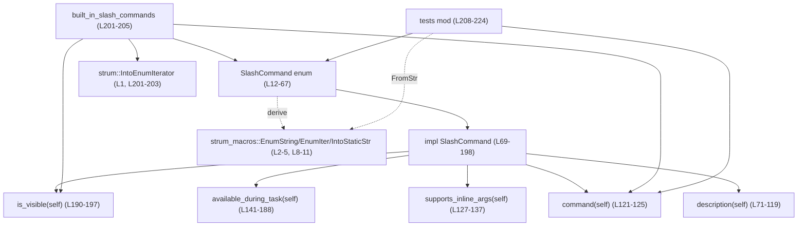
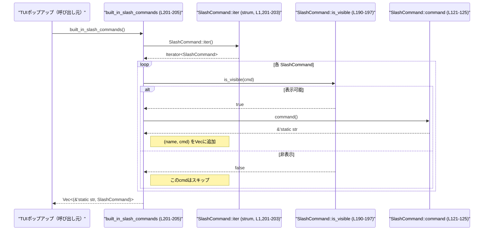

# tui/src/slash_command.rs コード解説

## 0. ざっくり一言

ターミナル UI で使われる「`/review`」のようなスラッシュコマンドを、列挙体とメタ情報（説明文・使用可否・OS 依存の可視性）として定義し、ポップアップ候補一覧などに渡すためのモジュールです。`strum` のマクロを使って文字列との相互変換や列挙を自動化しています（`tui/src/slash_command.rs:L1-5, L8-12`）。

---

## 1. このモジュールの役割

### 1.1 概要

- このモジュールは **TUI で利用できるスラッシュコマンドの一覧と、その振る舞いのメタデータ** を提供します（`tui/src/slash_command.rs:L12-67`）。
- コマンド名（`"review"` など）、ユーザー向け説明文、インライン引数を受け付けるか、タスク実行中に利用可能か、OS/ビルド設定による可視性などを、型安全に管理します（`tui/src/slash_command.rs:L69-197`）。
- すべての組み込みコマンドを `(コマンド文字列, 列挙値)` のペアとして列挙する関数 `built_in_slash_commands` を提供し、UI 側がポップアップなどで利用できるようにしています（`tui/src/slash_command.rs:L200-205`）。

### 1.2 アーキテクチャ内での位置づけ

主な依存関係と役割を図示します。



- `SlashCommand` 列挙体がコアとなり、その `impl` ブロック内でメタ情報や判定ロジックを提供しています（`tui/src/slash_command.rs:L69-198`）。
- `strum` 系の derive マクロにより、列挙体から
  - すべての値を列挙する `SlashCommand::iter()`（`IntoEnumIterator`、`tui/src/slash_command.rs:L1, L201-203`）
  - 文字列との相互変換（`EnumString`, `IntoStaticStr`、`tui/src/slash_command.rs:L2-5, L8-11`）
  などの機能が自動生成されています。
- `tests` モジュールは、`Stop` コマンドの **正準名** と **エイリアス** の挙動を検証しています（`tui/src/slash_command.rs:L208-224`）。

### 1.3 設計上のポイント

- **列挙体によるコマンドの型安全な管理**  
  すべてのスラッシュコマンドを `SlashCommand` の列挙子として定義し、文字列の書き間違いなどをコンパイル時に防いでいます（`tui/src/slash_command.rs:L12-67`）。

- **表示順と列挙順の一致**  
  「アルファベット順に並べないこと」というコメントがあり、列挙順がポップアップでの表示順として利用される前提になっています（`tui/src/slash_command.rs:L13-14`）。  
  `SlashCommand::iter()` は宣言順で列挙するため、この設計と整合します（`tui/src/slash_command.rs:L1, L201-203`）。

- **説明・可否判定を集中管理**  
  説明文（`description`）、インライン引数対応（`supports_inline_args`）、タスク実行中の利用可否（`available_during_task`）、可視性（`is_visible`）をすべて `impl SlashCommand` 内に集約し、UI 側に散らさない構造になっています（`tui/src/slash_command.rs:L69-197`）。

- **OS / ビルド設定に応じた可視化制御**  
  `cfg!(target_os = "...")` や `cfg!(debug_assertions)` を使い、一部コマンドを特定 OS やデバッグビルド限定でポップアップに表示する設計です（`tui/src/slash_command.rs:L190-197`）。

- **安全性・並行性**  
  列挙体は `Copy + Clone + 'static` であり（`tui/src/slash_command.rs:L8-9`）、関数はすべて純粋にデータを返すだけで外部副作用がありません。`unsafe` や共有可変状態は無く、マルチスレッド環境でも同時読み出しに関して追加の同期は不要です（`tui/src/slash_command.rs:L69-205`）。

---

## 2. 主要な機能一覧

### 2.1 コンポーネントインベントリー（型・関数）

このチャンクに現れる型・関数の一覧と、定義位置です。

#### 型一覧

| 名前 | 種別 | 役割 / 用途 | 定義位置 |
|------|------|-------------|----------|
| `SlashCommand` | `enum` | 利用可能なすべてのスラッシュコマンドを表現する列挙体。`strum` マクロで文字列との相互変換・列挙を提供。 | `tui/src/slash_command.rs:L12-67` |

#### 関数一覧（メソッド含む）

| 名前 | 種別 | 概要 | 定義位置 |
|------|------|------|----------|
| `SlashCommand::description(self)` | メソッド（pub） | コマンドのユーザー向け説明文を返す。 | `tui/src/slash_command.rs:L71-119` |
| `SlashCommand::command(self)` | メソッド（pub） | 先頭の `/` を除いたコマンド文字列（正準名）を返す。 | `tui/src/slash_command.rs:L121-125` |
| `SlashCommand::supports_inline_args(self)` | メソッド（pub） | コマンドがインライン引数 `/review ...` をサポートするか判定する。 | `tui/src/slash_command.rs:L127-137` |
| `SlashCommand::available_during_task(self)` | メソッド（pub） | 何らかの「タスク」実行中にこのコマンドを受け付けるかを判定する。 | `tui/src/slash_command.rs:L141-188` |
| `SlashCommand::is_visible(self)` | メソッド（private） | OS やデバッグビルド条件に応じて、ポップアップ等に表示するかを判定する。 | `tui/src/slash_command.rs:L190-197` |
| `built_in_slash_commands()` | 関数（pub） | すべての組み込みコマンドを `(コマンド文字列, SlashCommand)` のペアで列挙する。 | `tui/src/slash_command.rs:L201-205` |
| `tests::stop_command_is_canonical_name()` | テスト関数 | `Stop` コマンドの正準名が `"stop"` であることを確認する。 | `tui/src/slash_command.rs:L215-218` |
| `tests::clean_alias_parses_to_stop_command()` | テスト関数 | `"clean"` という文字列から `Stop` コマンドに正しくパースできることを確認する。 | `tui/src/slash_command.rs:L220-223` |

### 2.2 機能の概要リスト

- スラッシュコマンド列挙: すべてのコマンドを `SlashCommand` 列挙体として定義し、表示順もここで決める（`tui/src/slash_command.rs:L12-67`）。
- コマンドの説明取得: `SlashCommand::description` で、ポップアップなどに表示する説明文を取得する（`tui/src/slash_command.rs:L71-119`）。
- コマンド文字列取得: `SlashCommand::command` で、`/` を除いたコマンド名を `'static` 文字列として取得する（`tui/src/slash_command.rs:L121-125`）。
- インライン引数サポート判定: `SlashCommand::supports_inline_args` で、`/review ...` のような追加テキストを許可するかを判定する（`tui/src/slash_command.rs:L127-137`）。
- タスク実行中の利用可否判定: `SlashCommand::available_during_task` で、バックグラウンドの「タスク」実行中に使用できるかを判定する（`tui/src/slash_command.rs:L141-188`）。
- OS/ビルド条件での表示制御: `SlashCommand::is_visible` により、一部コマンドを Windows 限定やデバッグビルド限定にする（`tui/src/slash_command.rs:L190-197`）。
- 全コマンド一覧生成: `built_in_slash_commands` で、可視なコマンドの `(文字列, 列挙値)` ペアのベクタを生成する（`tui/src/slash_command.rs:L201-205`）。

---

## 3. 公開 API と詳細解説

### 3.1 型一覧（構造体・列挙体など）

| 名前 | 種別 | 役割 / 用途 | 主要な関連メソッド / 特徴 |
|------|------|-------------|----------------------------|
| `SlashCommand` | 列挙体 | スラッシュコマンドの種類を表す。派生トレイトにより、文字列との相互変換・列挙・表示などを自動生成。 | `description`, `command`, `supports_inline_args`, `available_during_task`, `is_visible`。`EnumString`, `EnumIter`, `AsRefStr`, `IntoStaticStr` を derive（`tui/src/slash_command.rs:L8-11`）。 |

- 列挙子は利用頻度順に並べるようコメントされています（`tui/src/slash_command.rs:L13-14`）。
- 特定の列挙子には、カスタムシリアライズ名や別名が付与されています（例: `ElevateSandbox`, `SandboxReadRoot`, `Stop`、`tui/src/slash_command.rs:L19-22, L53-54, L60-61`）。

### 3.2 関数詳細（重要な 6 件）

#### `SlashCommand::description(self) -> &'static str`

**概要**

- 各スラッシュコマンドに対応する **ユーザー向け説明文（英語）** を返します（`tui/src/slash_command.rs:L71-119`）。
- ポップアップやヘルプテキストなどで利用されることが想定されます（呼び出し元はこのチャンクには現れません）。

**引数**

| 引数名 | 型 | 説明 |
|--------|----|------|
| `self` | `SlashCommand` | 説明を取得したいコマンド列挙値。`Copy` なのでムーブではなくコピーです（`tui/src/slash_command.rs:L8-9`）。 |

**戻り値**

- 型: `&'static str`  
- コマンドの用途を説明する英語の短文です（例: `/review` なら `"review my current changes and find issues"`、`tui/src/slash_command.rs:L77`）。

**内部処理の流れ**

- `match self` で全列挙子をパターンマッチし、それぞれ固定の文字列リテラルを返します（`tui/src/slash_command.rs:L72-118`）。
- すべての列挙子に対して個別の文が定義されており、ワイルドカード分岐 `_` は使われていません。そのため、新しい列挙子を追加するとコンパイルエラーになり、説明文の追加漏れを防ぎます（`tui/src/slash_command.rs:L72-118`）。

**Examples（使用例）**

```rust
use std::str::FromStr;                         // FromStr トレイトをインポートする
use tui::slash_command::SlashCommand;          // モジュールパスは仮。実際のクレート構成はこのチャンクには現れません。

fn show_description_from_str(cmd: &str) {      // 文字列からコマンド説明を表示する関数
    if let Ok(sc) = SlashCommand::from_str(cmd) { // EnumString の derive により FromStr 実装が生成されている（L2-5, L8-11）
        println!("{}", sc.description());      // 対応する説明文を表示
    } else {
        println!("unknown command: {}", cmd);  // 未知のコマンド
    }
}
```

※ `SlashCommand::from_str` は `EnumString` 派生によって提供される `FromStr` 実装です（`tui/src/slash_command.rs:L2-5, L8-11`）。

**Errors / Panics**

- この関数自体はエラーもパニックも発生させません。すべての分岐で文字列リテラルを返すだけです（`tui/src/slash_command.rs:L72-118`）。

**Edge cases（エッジケース）**

- 新しい列挙子が追加された場合、`match` が非網羅的になりコンパイルエラーとなるため、説明文の未定義状態でリリースされることはありません（`tui/src/slash_command.rs:L72-118`）。

**使用上の注意点**

- 戻り値は英語固定です。ローカライズを行う場合は、ここを差し替えるか別レイヤーで翻訳テーブルを用意する必要があります。
- 戻り値は `'static` なのでライフタイム管理上の制約はありませんが、内容はコンパイル時固定で動的に変更できません。

---

#### `SlashCommand::command(self) -> &'static str`

**概要**

- 先頭の `/` を除いたコマンドの **正準的な文字列名** を返します（`tui/src/slash_command.rs:L121-125`）。
- 既存コードとの互換性のため `command()` という名前にしているとコメントされています（`tui/src/slash_command.rs:L121-122`）。

**引数**

| 引数名 | 型 | 説明 |
|--------|----|------|
| `self` | `SlashCommand` | コマンド名を取得したい列挙値。 |

**戻り値**

- 型: `&'static str`  
- `/` を除いたコマンド名。例:
  - `SlashCommand::Review.command()` → `"review"`
  - `SlashCommand::Stop.command()` → `"stop"`（テストで検証、`tui/src/slash_command.rs:L215-218`）。

**内部処理の流れ**

- `self.into()` を呼び出しています（`tui/src/slash_command.rs:L124`）。
- `IntoStaticStr` 派生（`#[derive(IntoStaticStr)]`）により、`SlashCommand` から `&'static str` への `Into` 実装が自動生成されており、その実装に委譲しています（`tui/src/slash_command.rs:L2-5, L8-11`）。
- 列挙体レベルの `#[strum(serialize_all = "kebab-case")]` により、特に個別指定がない列挙子は **kebab-case**（`Model` → `"model"`, `Fast` → `"fast"` 等）に変換されます（`tui/src/slash_command.rs:L11-12`）。
- 特定の列挙子では `#[strum(to_string = "...")]` で正準名が上書きされています（`Stop`、`tui/src/slash_command.rs:L53-54`）。

**Examples（使用例）**

```rust
use tui::slash_command::SlashCommand;         // パスは仮（このチャンクにクレートルート情報はありません）

fn print_all_commands() {
    for (name, cmd) in tui::slash_command::built_in_slash_commands() { // 可視コマンドを列挙（L201-205）
        println!("/{} - {}", name, cmd.description());                 // /name と説明文を表示
    }
}
```

**Errors / Panics**

- `self.into()` は `SlashCommand` → `&'static str` への単純変換であり、エラーやパニックは発生しません（`tui/src/slash_command.rs:L124-125`）。

**Edge cases**

- `Stop` コマンドは `to_string = "stop"` と `serialize = "clean"` を持ちます（`tui/src/slash_command.rs:L53-54`）。  
  - `command()` は常に `"stop"` を返します（テストで確認、`tui/src/slash_command.rs:L215-218`）。
  - `"clean"` という文字列からは `FromStr` 実装経由で `Stop` にパースできますが（`tui/src/slash_command.rs:L220-223`）、`built_in_slash_commands` で列挙される名前は `"stop"` のみです（`tui/src/slash_command.rs:L201-205`）。

**使用上の注意点**

- ユーザーに見せる正準コマンド名として利用する場合、エイリアス（例 `"clean"`）は `command()` からは得られない点に注意が必要です。
- 文字列を表示順に並べたい場合は、`SlashCommand::iter()` ではなく `built_in_slash_commands()` を使うと、OS/ビルド条件で非表示のコマンドが除外されます（`tui/src/slash_command.rs:L201-205`）。

---

#### `SlashCommand::supports_inline_args(self) -> bool`

**概要**

- コマンドが `/review <args>` のように **インライン引数を受け付けるか** を判定します（`tui/src/slash_command.rs:L127-137`）。

**引数**

| 引数名 | 型 | 説明 |
|--------|----|------|
| `self` | `SlashCommand` | 判定対象のコマンド。 |

**戻り値**

- 型: `bool`  
- インライン引数を受け付けるコマンドであれば `true`、そうでなければ `false`。

**内部処理の流れ**

- マクロ `matches!` を使い、特定の列挙子の集合に含まれるかどうかをパターンマッチで判定しています（`tui/src/slash_command.rs:L129-137`）。
- 現在 `true` になるのは以下のコマンドです（`tui/src/slash_command.rs:L131-137`）:
  - `Review`
  - `Rename`
  - `Plan`
  - `Fast`
  - `Resume`
  - `SandboxReadRoot`
- 上記以外のコマンドは `_` 分岐として `false` になります（`matches!` の展開による）。

**Examples（使用例）**

```rust
fn parse_after_command(cmd: SlashCommand, rest: &str) {
    if cmd.supports_inline_args() {                     // インライン引数を許可しているか確認（L127-137）
        println!("extra args: {}", rest);              // 残りの入力を引数として扱う
    } else {
        println!("command {:?} ignores extra input", cmd);
    }
}
```

**Errors / Panics**

- この関数は純粋なパターンマッチのみであり、エラーやパニックは発生しません（`tui/src/slash_command.rs:L129-137`）。

**Edge cases**

- 新しいコマンドを `SlashCommand` に追加しても、ここに明示的に列挙しない限りデフォルトで `false` になります（`matches!` の `_` 分岐）。  
  そのため「インライン引数には対応しない」という安全側のデフォルトになります。

**使用上の注意点**

- 解析側で「どのコマンドでも後続のテキストを必ず引数として扱う」という前提は置けません。`supports_inline_args` を必ず確認する必要があります。
- 新しいコマンドでインライン引数をサポートしたい場合、この関数に列挙子を追加する必要があります（`tui/src/slash_command.rs:L131-137`）。

---

#### `SlashCommand::available_during_task(self) -> bool`

**概要**

- 何らかのタスク（おそらくバックグラウンドのモデル実行など）が進行中の状態で、このコマンドを **受付可能かどうか** を判定します（`tui/src/slash_command.rs:L140-188`）。
- UI 側で、タスク進行中に特定コマンドを無効化・グレーアウトする判断材料として利用されることが想定されます（呼び出し元はこのチャンクには現れません）。

**引数**

| 引数名 | 型 | 説明 |
|--------|----|------|
| `self` | `SlashCommand` | 判定対象のコマンド。 |

**戻り値**

- 型: `bool`  
- タスク進行中でも受け付けるなら `true`、受け付けないなら `false`。

**内部処理の流れ**

- `match self` によって、列挙子ごとに `true` / `false` を返します（`tui/src/slash_command.rs:L142-187`）。
- 最初のパターンで **タスク中に無効** とするコマンドを `|` 区切りで列挙し、`false` を返します（`tui/src/slash_command.rs:L143-162`）。例:
  - `New`, `Resume`, `Fork`, `Init`, `Compact`, `Model`, `Fast`, `Approvals`, `Permissions`, `ElevateSandbox`, `SandboxReadRoot`, `Experimental`, `Review`, `Plan`, `Clear`, `Logout`, `MemoryDrop`, `MemoryUpdate` など。
- 次のパターンで **タスク中も有効** なコマンドを列挙し、`true` を返します（`tui/src/slash_command.rs:L163-177`）。
- さらに個別に `Rollout`, `TestApproval`, `Realtime`, `Settings`, `Collab`, `Agent`, `MultiAgents`, `Statusline`, `Theme`, `Title` などを `true` / `false` として分岐させています（`tui/src/slash_command.rs:L178-187`）。
- 最後まで `_` パターンが無いため、すべての列挙子を網羅する必要があり、新しいコマンド追加時に分類漏れがコンパイルエラーで検知されます（`tui/src/slash_command.rs:L142-187`）。

**Examples（使用例）**

```rust
fn can_run_now(cmd: SlashCommand, task_running: bool) -> bool {
    if task_running {
        cmd.available_during_task()                  // タスク中の可否を参照（L141-188）
    } else {
        true                                         // タスクが止まっていれば常に許可
    }
}
```

**Errors / Panics**

- 単純な `match` であり、エラーやパニックは発生しません（`tui/src/slash_command.rs:L142-187`）。

**Edge cases**

- 新しいコマンドを追加した場合、ここに分類を追加しないと `match` が非網羅的になり、コンパイルエラーになります（`tui/src/slash_command.rs:L142-187`）。
- `Statusline`, `Theme`, `Title` は末尾で `false` と明示されており、タスク中には利用不可として扱われます（`tui/src/slash_command.rs:L184-186`）。

**使用上の注意点**

- どのコマンドがタスク中に無効化されるかは、仕様に直結する重要な契約です。外部仕様を変更する場合は、この関数と UI の振る舞いを同時に見直す必要があります。
- 長期的にコマンドが増えるとここが大きくなるため、分類ロジックを整理する場合は注意深くテストを行う必要があります（このチャンクには追加テストは現れていません）。

---

#### `SlashCommand::is_visible(self) -> bool`（private）

**概要**

- コマンドが現在のビルドターゲット（OS・ビルドモード）で **UI に表示されるべきか** を判定します（`tui/src/slash_command.rs:L190-197`）。
- `built_in_slash_commands` でのフィルタ条件として使われています（`tui/src/slash_command.rs:L201-204`）。

**引数**

| 引数名 | 型 | 説明 |
|--------|----|------|
| `self` | `SlashCommand` | 判定対象のコマンド。 |

**戻り値**

- 型: `bool`  
- 現在のビルド設定でポップアップに表示してよいなら `true`、非表示にしたいなら `false`。

**内部処理の流れ**

- `match self` で分岐し、特定のコマンドに対してのみ `cfg!` マクロを使った条件付きの値を返します（`tui/src/slash_command.rs:L191-195`）。
  - `SandboxReadRoot` → `cfg!(target_os = "windows")`  
    Windows ビルドでのみ `true` となり、それ以外の OS では `false` になります（`tui/src/slash_command.rs:L192`）。
  - `Copy` → `!cfg!(target_os = "android")`  
    Android ビルド以外で `true`、Android では `false`（`tui/src/slash_command.rs:L193`）。
  - `Rollout` および `TestApproval` → `cfg!(debug_assertions)`  
    デバッグビルド（`debug_assertions` 有効）でのみ `true`（`tui/src/slash_command.rs:L194`）。
  - その他すべて → `true`（`tui/src/slash_command.rs:L195-196`）。
- `cfg!` はコンパイルターゲットに応じて **コンパイル時計算される定数ブール値** を返しますが、記述上は通常の関数呼び出しと同じ形です。

**Examples（使用例）**

- 直接呼び出す例はこのチャンクには現れず、`built_in_slash_commands()` のフィルタ条件としてのみ使われています（`tui/src/slash_command.rs:L201-204`）。

**Errors / Panics**

- `cfg!` マクロはエラーを返さず、常に `true` または `false` です。関数全体としてもエラーやパニックは発生しません（`tui/src/slash_command.rs:L191-196`）。

**Edge cases**

- 新しいコマンドはデフォルトで `true`（可視）扱いとなります。特定条件で隠したい場合は、この `match` に明示的な分岐を追加する必要があります（`tui/src/slash_command.rs:L191-196`）。

**使用上の注意点**

- OS やビルドフラグに依存するため、プラットフォームを跨いで UI の挙動が異なります。  
  例えば、`/sandbox-add-read-dir` は非 Windows 環境では候補に出ず、ユーザーが入力しても候補補完できない可能性があります。
- `cfg!(...)` はビルド時に固定されるため、実行時に OS を切り替えるような環境には対応しません（通常の CLI/TUI では問題になりません）。

---

#### `built_in_slash_commands() -> Vec<(&'static str, SlashCommand)>`

**概要**

- すべてのスラッシュコマンドのうち、`is_visible()` が `true` のものを `(コマンド名, 列挙値)` のペアとして列挙し、`Vec` で返します（`tui/src/slash_command.rs:L200-205`）。
- TUI のポップアップや補完機能で利用される、**表示候補一覧の生成関数** です（呼び出し元はこのチャンクには現れません）。

**引数**

- なし。

**戻り値**

- 型: `Vec<(&'static str, SlashCommand)>`  
- 要素は `(name, cmd)` というタプルで、`name` は `SlashCommand::command()` で得られる正準コマンド名、`cmd` は対応する列挙値です（`tui/src/slash_command.rs:L203-204`）。
- `Vec` の順序は `SlashCommand` 列挙子の宣言順を保ちます（`SlashCommand::iter()` は宣言順で列挙、`tui/src/slash_command.rs:L1, L201-203`）。

**内部処理の流れ**

1. `SlashCommand::iter()` を呼び出し、すべての列挙値を宣言順でイテレートします（`tui/src/slash_command.rs:L201-203`）。
2. `.filter(|command| command.is_visible())` により、`is_visible()` が `true` のコマンドのみ残します（`tui/src/slash_command.rs:L203`）。
3. `.map(|c| (c.command(), c))` で各コマンドを `(コマンド名, 列挙値)` のタプルに変換します（`tui/src/slash_command.rs:L204`）。
4. `.collect()` により、それらを `Vec` にまとめて返します（`tui/src/slash_command.rs:L205`）。

**Examples（使用例）**

```rust
use tui::slash_command::{SlashCommand, built_in_slash_commands};

fn print_popup_candidates() {
    for (name, cmd) in built_in_slash_commands() {     // すべての可視コマンドを取得（L201-205）
        println!("/{} - {}", name, cmd.description()); // コマンドと説明を表示
    }
}
```

**Errors / Panics**

- イテレータ操作と `Vec` への収集のみであり、エラーやパニックは発生しません（`tui/src/slash_command.rs:L201-205`）。
- ヒープメモリ確保（`Vec`）が失敗した場合のパニック可能性はありますが、これは Rust 全般に共通する挙動であり、このモジュール固有のものではありません。

**Edge cases**

- OS やビルドモードにより結果の `Vec` の要素数や内容が変わります。
  - 非 Windows では `SandboxReadRoot` が含まれません（`tui/src/slash_command.rs:L192`）。
  - Android では `Copy` が含まれません（`tui/src/slash_command.rs:L193`）。
  - リリースビルドでは `Rollout` と `TestApproval` が含まれません（`tui/src/slash_command.rs:L194`）。
- 新しいコマンドを追加すると、デフォルトで `is_visible()` が `true` となるため、自動的に一覧に追加されます（`tui/src/slash_command.rs:L191-196`）。

**使用上の注意点**

- この関数は **表示候補** の一覧生成に特化しており、パース可能なすべての文字列を列挙しているわけではありません。  
  例: `"clean"` は `Stop` のエイリアスとしてパース可能ですが、`built_in_slash_commands` の結果には登場しません（`tui/src/slash_command.rs:L53-54, L201-205`）。
- 表示順を変更したい場合は列挙体の定義順序を変更する必要があります（`tui/src/slash_command.rs:L13-14`）。

---

### 3.3 その他の関数

補助的およびテスト用関数の一覧です。

| 関数名 | 種別 | 役割（1 行） | 定義位置 |
|--------|------|--------------|----------|
| `tests::stop_command_is_canonical_name()` | テスト関数 | `SlashCommand::Stop.command()` が `"stop"` を返すことを検証する。 | `tui/src/slash_command.rs:L215-218` |
| `tests::clean_alias_parses_to_stop_command()` | テスト関数 | `"clean"` が `SlashCommand::Stop` にパースされることを検証する。 | `tui/src/slash_command.rs:L220-223` |

これらのテストにより、`Stop` コマンドの **正準名** と **文字列エイリアス** の契約が保たれているかを継続的に確認できます。

---

## 4. データフロー

ここでは、**ポップアップ候補一覧の生成** という代表的なシナリオにおけるデータフローを説明します。

1. TUI 側（呼び出し元。コードはこのチャンクには現れません）が `built_in_slash_commands()` を呼び出します（`tui/src/slash_command.rs:L201-205`）。
2. `built_in_slash_commands` は `SlashCommand::iter()` により全列挙値を取得します（`tui/src/slash_command.rs:L201-203`）。
3. 各コマンドについて `is_visible()` を実行し、OS/ビルド設定に応じて表示可否を判定します（`tui/src/slash_command.rs:L190-197`）。
4. 可視なコマンドに対して `command()` を呼び、正準名の文字列を取得します（`tui/src/slash_command.rs:L121-125`）。
5. `(コマンド名, 列挙値)` のタプルを `Vec` に収集し、呼び出し元に返します（`tui/src/slash_command.rs:L201-205`）。

### シーケンス図



このように、**型安全な列挙体** と **`strum` のイテレータ/文字列変換機能** によって、表示候補一覧の生成が簡潔に実装されています。

---

## 5. 使い方（How to Use）

### 5.1 基本的な使用方法

#### 例1: コマンド一覧を表示する

```rust
use tui::slash_command::{SlashCommand, built_in_slash_commands}; // 実際のパスはこのチャンクには現れません

fn print_commands() {
    // 可視なすべてのスラッシュコマンドを取得する（L201-205）
    for (name, cmd) in built_in_slash_commands() {
        // /コマンド名 と 説明 を表示する（L121-125, L71-119）
        println!("/{} - {}", name, cmd.description());
    }
}
```

- `built_in_slash_commands()` は OS / ビルド条件に応じて非表示のコマンドを自動的に除外します（`tui/src/slash_command.rs:L190-197, L201-205`）。

#### 例2: 文字列からコマンドをパースして動作を分岐

```rust
use std::str::FromStr;                             // FromStr トレイト
use tui::slash_command::SlashCommand;

fn handle_command(input: &str, task_running: bool) {
    // 先頭の '/' を取り除く（前処理はここでは簡略化）
    let cmd_str = input.strip_prefix('/').unwrap_or(input);

    // EnumString 派生により SlashCommand::from_str が利用可能（L2-5, L8-11）
    match SlashCommand::from_str(cmd_str) {
        Ok(cmd) => {
            if task_running && !cmd.available_during_task() {  // タスク中の利用可否をチェック（L141-188）
                println!("command /{} is disabled while task is running", cmd_str);
                return;
            }

            // インライン引数を処理するかどうか（L127-137）
            if cmd.supports_inline_args() {
                println!("command {:?} accepts extra args", cmd);
            } else {
                println!("command {:?} ignores extra args", cmd);
            }
        }
        Err(_) => {
            println!("unknown command: /{}", cmd_str);
        }
    }
}
```

### 5.2 よくある使用パターン

- **補完・ポップアップ候補生成**  
  `built_in_slash_commands()` を呼び、`name` からプレフィックスマッチで候補を絞り込む。説明文は `description()` を使って表示（`tui/src/slash_command.rs:L71-119, L200-205`）。

- **タスク中の無効化制御**  
  コマンドが入力された際に `available_during_task()` を参照し、タスク実行状態に応じて拒否/許可を決定（`tui/src/slash_command.rs:L141-188`）。

- **インライン引数のパース制御**  
  `/review foo` のような入力を処理する際、`supports_inline_args()` が `true` のときだけ余剰テキストを解析し、それ以外のコマンドでは警告や無視を行う（`tui/src/slash_command.rs:L127-137`）。

### 5.3 よくある間違い

```rust
use tui::slash_command::SlashCommand;

// 間違い例: すべてのコマンドがインライン引数を受け付ける前提で書いてしまう
fn wrong_parse_inline(cmd: SlashCommand, rest: &str) {
    // supports_inline_args を確認していない
    println!("args: {}", rest);
}

// 正しい例: supports_inline_args で条件分岐する
fn correct_parse_inline(cmd: SlashCommand, rest: &str) {
    if cmd.supports_inline_args() {             // この判定を挟む（L127-137）
        println!("args: {}", rest);
    } else {
        println!("command {:?} does not accept inline args", cmd);
    }
}
```

別の誤用例として、`built_in_slash_commands()` の結果に `"clean"` が含まれると期待してしまうことが挙げられます。実際には `Stop` の正準名 `"stop"` のみが返り、`"clean"` はパース時のエイリアスです（`tui/src/slash_command.rs:L53-54, L201-205`）。

### 5.4 使用上の注意点（まとめ）

- **文字列エイリアスと正準名の違い**  
  - `Stop` は `"stop"` が正準名、`"clean"` がエイリアスです（`tui/src/slash_command.rs:L53-54`）。  
  - `command()` や `built_in_slash_commands()` は正準名のみを扱い、エイリアスは FromStr のみが受け付けます（`tui/src/slash_command.rs:L121-125, L201-205, L220-223`）。

- **OS / ビルド依存の可視性**  
  - 一部コマンドは OS やビルドモードによって一覧から除外されます（`tui/src/slash_command.rs:L190-197`）。  
  - 表示されないが、パース自体は可能な場合（このチャンクには具体例は現れません）があり得るため、パース側ロジックと UI の一貫性に注意が必要です。

- **並行性**  
  - すべての関数は読み取り専用であり、グローバル状態を持ちません。複数スレッドから同時に呼び出しても問題ありません（`tui/src/slash_command.rs:L69-205`）。

- **パフォーマンス**  
  - `built_in_slash_commands()` はコマンド数分の `Vec` を毎回生成しますが、列挙子数は限定的であり、通常の TUI アプリケーションで問題になる規模ではありません（`tui/src/slash_command.rs:L12-67, L201-205`）。

---

## 6. 変更の仕方（How to Modify）

### 6.1 新しい機能（コマンド）を追加する場合

1. **列挙子の追加**  
   `SlashCommand` に新しい列挙子を追加します。頻度や優先度に応じて適切な位置に挿入します（`tui/src/slash_command.rs:L12-67`）。  
   必要なら `#[strum(serialize = "...", to_string = "...")]` 属性で文字列名やエイリアスを指定します（`tui/src/slash_command.rs:L19-22, L53-54`）。

2. **説明文の追加**  
   `description()` の `match` に新しい列挙子の分岐を追加し、説明文を定義します（`tui/src/slash_command.rs:L72-118`）。  
   追加しないと `match` が非網羅的になりコンパイルエラーとなるため、漏れは検出されます。

3. **インライン引数サポートの指定**  
   新コマンドがインライン引数を受け付ける場合、`supports_inline_args()` 内の `matches!` パターンに列挙子を追加します（`tui/src/slash_command.rs:L131-137`）。  
   追加しなければ、デフォルトで `false` になります。

4. **タスク中の利用可否の指定**  
   `available_during_task()` の `match` に新しい列挙子を `true` または `false` のどちらかに分類して追加します（`tui/src/slash_command.rs:L142-187`）。  
   分類を忘れると非網羅的 `match` になりコンパイルエラーになるため、ここも漏れに気付きやすくなっています。

5. **可視性（OS / ビルド条件）の指定（必要な場合のみ）**  
   OS やビルド条件で表示を制御したい場合、`is_visible()` の `match` に分岐を追加します（`tui/src/slash_command.rs:L191-196`）。  
   制御が不要であれば `_ => true` により自動的に可視になります。

6. **テストの追加（任意）**  
   例えば `FromStr` の文字列エイリアスを追加した場合は、既存の `clean_alias_parses_to_stop_command` と同様にテストを追加すると契約を保ちやすくなります（`tui/src/slash_command.rs:L220-223`）。

### 6.2 既存の機能を変更する場合

- **コマンド名（文字列）の変更**  
  - `command()` の結果を変えたい場合は、`strum` の `to_string` / `serialize` 属性を変更します（`tui/src/slash_command.rs:L11, L53-54`）。  
  - 既存クライアントが古い文字列を使っている可能性がある場合、古い名前を `serialize = "old-name"` としてエイリアスに残す方法もあります。

- **タスク中の利用可否の変更**  
  - `available_during_task()` での分類を変更します（`tui/src/slash_command.rs:L142-187`）。  
  - これは仕様上の意味が大きいため、UI 側の挙動やドキュメントとの整合性を確認する必要があります。

- **OS / ビルド条件の変更**  
  - `is_visible()` 内の `cfg!(...)` 条件を変更します（`tui/src/slash_command.rs:L191-195`）。  
  - 例えばあるコマンドを Android でも使えるようにする場合 `SlashCommand::Copy => !cfg!(target_os = "android")` を見直します。

- **バグ・セキュリティ観点**  
  - 現状、このモジュールは文字列と列挙体のマッピングとフラグ判定のみであり、直接的なセキュリティ・バグ要因（ファイルアクセス、外部プロセス実行など）は含まれていません（`tui/src/slash_command.rs:L69-205`）。  
  - ただし、権限関連コマンド（`Approvals`, `Permissions`, `ElevateSandbox` 等）の扱いは UI/バックエンド側の実装に依存するため、そちらのコードと合わせてレビューする必要があります（ここでは定義のみ、`tui/src/slash_command.rs:L17-22, L105-108`）。

---

## 7. 関連ファイル

このチャンクに現れるのは `tui/src/slash_command.rs` 単体のみであり、他モジュールとの具体的な呼び出し関係は示されていません。

| パス | 役割 / 関係 |
|------|------------|
| `tui/src/slash_command.rs` | 本モジュール。スラッシュコマンドの列挙・メタ情報・コマンド一覧生成・テストを含む（`tui/src/slash_command.rs:L1-224`）。 |
| （不明） | `built_in_slash_commands` や `SlashCommand::description` などを呼び出す TUI の入力量/補完 UI は、このチャンクには現れません。「tui」というディレクトリ名から TUI コンポーネントとの関連が想定されますが、具体的なファイル名や呼び出し元は不明です。 |

このファイル単体を理解しておけば、「どのコマンドが存在し、どのような条件でユーザーに提示され、タスク中に使用できるか」という仕様の中心部分を把握することができます。
