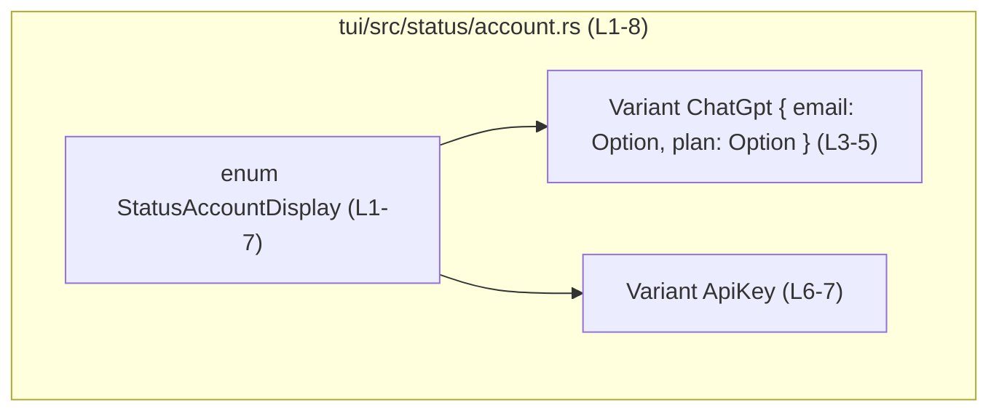
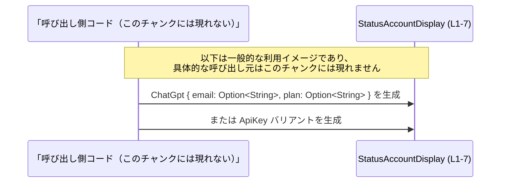

# tui/src/status/account.rs

## 0. ざっくり一言

`StatusAccountDisplay` という列挙体を 1 つ定義し、アカウントに関する表示用と思われる情報を表現するためのデータ型を提供するモジュールです。（根拠: `tui/src/status/account.rs:L1-8`）

---

## 1. このモジュールの役割

### 1.1 概要

- このモジュールは、`StatusAccountDisplay` 列挙体を定義します。（根拠: `tui/src/status/account.rs:L1-2`）
- 列挙体には 2 つのバリアントがあり、`ChatGpt` バリアントは `email` と `plan` という 2 つの `Option<String>` フィールドを持ち、`ApiKey` バリアントはフィールドを持たないユニット型バリアントです。（根拠: `tui/src/status/account.rs:L3-7`）
- ファイルパス `status/account.rs` と型名 `StatusAccountDisplay` から、アカウント関連のステータス表示に用いるデータ型であると推測できますが、実際の利用箇所はこのチャンクには現れません。

### 1.2 アーキテクチャ内での位置づけ

このチャンクには、この型を利用する他モジュールや関数の情報は一切含まれていません。そのため、実際の依存関係は不明です。

このファイル内で確実に分かる構造だけを図示すると、次のようになります。



※ 図のとおり、本チャンクの範囲ではこの列挙体以外のコンポーネントは登場しません。

### 1.3 設計上のポイント

- `StatusAccountDisplay` には `Debug` と `Clone` が自動導出されています。  
  これにより、`{:?}` でのデバッグ表示と `.clone()` による複製が利用できます。（根拠: `tui/src/status/account.rs:L1`）
- 可視性は `pub(crate)` であり、同一 crate 内の他モジュールから利用できる API です。（根拠: `tui/src/status/account.rs:L2`）
- 列挙体（enum）として、アカウント表示に関する 2 つの状態（`ChatGpt` / `ApiKey`）を区別できるようになっています。（根拠: `tui/src/status/account.rs:L2-7`）
- `ChatGpt` バリアントには `Option<String>` フィールドが使われており、`email` や `plan` の値が存在する場合と存在しない場合の両方を明示的に表現できます。（根拠: `tui/src/status/account.rs:L3-5`）
- このファイルには関数・メソッド・`impl` ブロック・`unsafe` コードは存在せず、データ型定義のみです。（根拠: `tui/src/status/account.rs:L1-8`）

---

## 2. 主要な機能一覧

このモジュールは型 1 つを提供するだけですが、その型が表現できる「機能」を整理すると次のようになります。

- `StatusAccountDisplay::ChatGpt`:  
  2 つの `Option<String>` フィールド `email` と `plan` を持ち、それぞれ文字列情報が存在する/しない状態を表現できます。（根拠: `tui/src/status/account.rs:L3-5`）
- `StatusAccountDisplay::ApiKey`:  
  フィールドを持たないユニット型バリアントであり、`ChatGpt` とは別の状態であることだけを区別できます。（根拠: `tui/src/status/account.rs:L6-7`）

---

## 3. 公開 API と詳細解説

### 3.1 型一覧（構造体・列挙体など）

このチャンクに現れる公開 API（crate 内公開）は 1 つだけです。

| 名前 | 種別 | 可視性 | 役割 / 用途 |
|------|------|--------|-------------|
| `StatusAccountDisplay` | 列挙体（enum） | `pub(crate)` | アカウント関連の 2 種類の状態（`ChatGpt` と `ApiKey`）を区別し、`ChatGpt` 状態では `email` と `plan` の有無を保持できるデータ型です。（根拠: `tui/src/status/account.rs:L2-7`） |

#### `StatusAccountDisplay` の詳細

**バリアント一覧**

| バリアント名 | 形態 | フィールド | 説明 |
|--------------|------|------------|------|
| `ChatGpt` | 構造体形式バリアント | `email: Option<String>`, `plan: Option<String>` | 2 つの `Option<String>` を持つバリアントです。各フィールドが `Some` か `None` かで、対応する文字列情報の有無を表現します。（根拠: `tui/src/status/account.rs:L3-5`） |
| `ApiKey` | ユニット型バリアント | なし | 追加フィールドを持たず、「`ApiKey` という別の状態」であることのみを表すバリアントです。（根拠: `tui/src/status/account.rs:L6-7`） |

**導出トレイト**

- `Debug`: `println!("{:?}", value)` のようにデバッグ出力できます。（根拠: `tui/src/status/account.rs:L1`）
- `Clone`: `let b = a.clone();` のように値の複製ができます。（根拠: `tui/src/status/account.rs:L1`）

**並行性（Rust 特有の観点）**

- フィールド型は `Option<String>` のみであり、`String` と `Option<T>` は標準ライブラリで `Send` + `Sync` を満たします。そのため、`StatusAccountDisplay` も同様に `Send` + `Sync` な型になります（一般的な Rust の型システムの性質から導かれます）。  
  これにより、`Arc<StatusAccountDisplay>` のようにしてスレッド間共有する設計を取りやすい型です。

**エラーハンドリング**

- この型自身は関数やメソッドを持たず、`Result` や `Option` を返す API も定義しません。  
  エラー表現は、`email` / `plan` のフィールドが `Option` であることにより、「値がない」という状態を `None` として表現するだけです。（根拠: `tui/src/status/account.rs:L3-5`）

### 3.2 関数詳細（最大 7 件）

このファイルには、関数・メソッド・`impl` ブロックは一切定義されていません。（根拠: `tui/src/status/account.rs:L1-8`）

そのため、「関数詳細テンプレート」に従って説明すべき対象関数はありません。

### 3.3 その他の関数

- 該当なし（このチャンクには関数定義が存在しません）。（根拠: `tui/src/status/account.rs:L1-8`）

---

## 4. データフロー

このファイルには処理ロジックや関数呼び出しはなく、純粋なデータ型定義だけが記述されています。（根拠: `tui/src/status/account.rs:L1-8`）

そのため、「本ファイル内だけ」で完結するデータフローは次の一点に集約されます。

- 呼び出し側コード（このチャンクには現れない）が `StatusAccountDisplay` のバリアントを生成し、`email` / `plan` に `Some(String)` または `None` を設定して保持する。

これを、概念的な利用者を置いたシーケンス図として表現すると、次のようになります。



※ 実際にどこからどのように生成・利用されているかは、このチャンクだけからは分かりません。

---

## 5. 使い方（How to Use）

ここでは、このファイルに定義されている型を「同じモジュール内」で利用することを想定した例を示します。  
（呼び出し側コードはこのチャンクには含まれていませんが、一般的な Rust コードとしての利用例です。）

### 5.1 基本的な使用方法

`StatusAccountDisplay` の両バリアントを生成し、`Debug` で出力する簡単な例です。

```rust
// 同じモジュール内で StatusAccountDisplay を使う例
fn main() {
    // ChatGpt バリアントを生成する。email は Some で設定し、plan は None（未設定）にする
    let chat_gpt_display = StatusAccountDisplay::ChatGpt {
        email: Some("user@example.com".to_string()), // 文字列を所有権付き String に変換して Some で包む
        plan: None,                                   // 情報がないことを None で表現する
    };

    // ApiKey バリアントを生成する。フィールドを持たないユニット型バリアント
    let api_key_display = StatusAccountDisplay::ApiKey;

    // Debug トレイトが導出されているため、{:?} で内容をデバッグ表示できる
    println!("chat_gpt_display = {:?}", chat_gpt_display);
    println!("api_key_display  = {:?}", api_key_display);

    // Clone トレイトが導出されているため、clone で複製できる
    let cloned = chat_gpt_display.clone();
    println!("cloned = {:?}", cloned);
}
```

### 5.2 よくある使用パターン

#### パターンマッチでバリアントごとに処理を分ける

`enum` らしい使い方として、`match` でバリアントごとに処理を分岐する例です。

```rust
fn show_status(display: &StatusAccountDisplay) {
    match display {
        // ChatGpt バリアントの場合、email / plan の Option を参照する
        StatusAccountDisplay::ChatGpt { email, plan } => {
            // email があれば表示、なければプレースホルダを表示
            let email_str = email.as_deref().unwrap_or("<no email>");
            let plan_str  = plan.as_deref().unwrap_or("<no plan>");
            println!("ChatGpt: email={}, plan={}", email_str, plan_str);
        }
        // ApiKey バリアントの場合の処理
        StatusAccountDisplay::ApiKey => {
            println!("ApiKey");
        }
    }
}
```

- `email` / `plan` は `Option<String>` なので、`as_deref()` + `unwrap_or` などで `None` 時の表示方法を決める必要があります。（根拠: `tui/src/status/account.rs:L3-5`）

### 5.3 よくある間違い

#### 1. 構造体形式バリアントのフィールドを省略する

```rust
// 間違い例: フィールドを指定せずに ChatGpt を生成しようとする
// let x = StatusAccountDisplay::ChatGpt; // コンパイルエラー: フィールド email, plan が必須

// 正しい例: 必要なフィールドをすべて指定する
let x = StatusAccountDisplay::ChatGpt {
    email: None,
    plan: None,
};
```

- `ChatGpt` は構造体形式バリアントであり、`email` / `plan` の両フィールドを指定する必要があります。（根拠: `tui/src/status/account.rs:L3-5`）

#### 2. `match` でバリアントを網羅しない

```rust
fn handle(display: StatusAccountDisplay) {
    // 間違い例（イメージ）: ChatGpt だけを扱い、ApiKey を忘れる
    /*
    match display {
        StatusAccountDisplay::ChatGpt { .. } => { ... }
        // StatusAccountDisplay::ApiKey が抜けているとコンパイルエラー
    }
    */

    // 正しい例: すべてのバリアントを扱う
    match display {
        StatusAccountDisplay::ChatGpt { .. } => { /* ... */ }
        StatusAccountDisplay::ApiKey => { /* ... */ }
    }
}
```

- Rust の `match` は列挙体の全バリアントを網羅する必要があり、抜けがあるとコンパイルエラーになります。

### 5.4 使用上の注意点（まとめ）

- `Option<String>` フィールドの扱い  
  - `email` と `plan` は `Option<String>` なので、呼び出し側は `Some` / `None` の両ケースを考慮する必要があります。（根拠: `tui/src/status/account.rs:L3-5`）
  - 値が必須である前提の処理を書いてしまうと、`None` を想定していないロジック上のバグになる可能性があります。
- デバッグ出力の内容  
  - `Debug` が導出されているため、`println!("{:?}", value)` でフィールドの内容がそのまま出力されます。（根拠: `tui/src/status/account.rs:L1`）
  - 一般論として、フィールドが秘密情報を含む可能性がある場合はログ出力に注意が必要です。このチャンクから具体的な機密性は判断できません。
- 複製（`Clone`）のコスト  
  - `Clone` すると内部の `String` もコピーされるため、文字列が大きい場合はコストがかかることがあります。（根拠: `tui/src/status/account.rs:L1, L3-5`）
- スレッド間共有  
  - フィールド型が `Option<String>` のみであることから、この型は `Send` + `Sync` です。  
    `Arc<StatusAccountDisplay>` などでスレッド間共有する設計も可能ですが、実際にどのように使われているかはこのチャンクには現れません。

---

## 6. 変更の仕方（How to Modify）

### 6.1 新しい機能を追加する場合

このファイルは 1 つの列挙体だけから成るため、「新しい機能」は主にバリアントやフィールドの追加として現れます。

- **新しいバリアントを追加する場合**
  - `StatusAccountDisplay` に新しいバリアントを追加します。  
    例: `OtherType { ... }` のような構造体形式バリアントを追加する、など。
  - 影響範囲:
    - 他ファイルでの `match` や `if let` による分岐があれば、全てに新バリアントを追加する必要があります（ただし、そのようなコードはこのチャンクには現れません）。
- **`ChatGpt` バリアントにフィールドを追加する場合**
  - `ChatGpt { ... }` のフィールドリストに新フィールドを追加します。（根拠: `tui/src/status/account.rs:L3-5`）
  - 構造体形式バリアントのため、そのバリアントを生成している全ての箇所で新フィールドの指定が必要になります（このチャンクには生成コードはありませんが、Rust の仕様上の一般的な影響です）。

### 6.2 既存の機能を変更する場合

- **フィールド型を変更する**
  - 例えば、`Option<String>` を `String` に変えると、「値がない状態 (`None`)」を表現できなくなります。（根拠: `tui/src/status/account.rs:L3-5`）
  - それに依存するロジック（`None` 判定など）が存在すれば、すべて修正が必要です。このチャンクではそのようなロジックは確認できません。
- **可視性を変更する**
  - `pub(crate)` を `pub` に変更すると、crate の外からも利用可能な公開 API になります。（根拠: `tui/src/status/account.rs:L2`）
  - 公開範囲の拡大は API の安定性や互換性の観点で影響が大きくなるため、設計上の判断が必要です。
- **バリアントの名称変更や削除**
  - `ChatGpt` や `ApiKey` の名前を変更・削除すると、すべての利用箇所がコンパイルエラーになります。（根拠: `tui/src/status/account.rs:L3-7`）
  - 影響範囲の特定には、`ripgrep` などで列挙体名・バリアント名を検索するのが一般的です。

### 6.3 テストとの関係

- このファイル内にはテストコード（`#[cfg(test)] mod tests { ... }` 等）は存在しません。（根拠: `tui/src/status/account.rs:L1-8`）
- 列挙体の利用ロジックに対するテストは、利用側のモジュールに置かれている可能性がありますが、このチャンクには現れません。

---

## 7. 関連ファイル

このチャンクから確実に分かるのは、このファイル自身のみです。他ファイルとの関係はここからは読み取れません。

| パス | 役割 / 関係 |
|------|------------|
| `tui/src/status/account.rs` | `StatusAccountDisplay` 列挙体を定義するファイル（本ドキュメントの対象）。（根拠: `tui/src/status/account.rs:L1-8`） |

- `StatusAccountDisplay` を利用するモジュール（例: ステータス表示 UI コンポーネントなど）が存在するかどうかは、このチャンクには現れません。

---

## 付録: 安全性 / Bugs / Security / Edge Cases のまとめ

- **安全性（Rust 特有）**
  - このファイルには `unsafe` コードはありません。（根拠: `tui/src/status/account.rs:L1-8`）
  - 使っているのは標準ライブラリの安全な型（`Option`, `String`）のみです。（根拠: `tui/src/status/account.rs:L3-5`）
- **Bugs の観点**
  - このファイル単体には実行時ロジックがないため、ここだけを見て発生するランタイムバグはありません。
  - ただし、利用側が `Option` の `None` を考慮しないロジックを書くと、意図しない動作を招く可能性があります。
- **Security の観点**
  - `String` がどのような情報を保持するかは不明ですが、一般論として秘密情報を保持している場合には、`Debug` 出力やログへの書き出しに注意が必要です。（根拠: `tui/src/status/account.rs:L1, L3-5`）
- **Contracts / Edge Cases**
  - 契約:
    - `ChatGpt` バリアントは常に `email` と `plan` の 2 フィールドを持ち、両方とも `Option<String>` である。（根拠: `tui/src/status/account.rs:L3-5`）
    - `ApiKey` バリアントはフィールドを持たない。（根拠: `tui/src/status/account.rs:L6-7`）
  - エッジケース:
    - `email` / `plan` が共に `None` のケース: 情報が一切設定されていない状態を表現できます。
    - `email` のみ `Some` / `plan` のみ `Some` / 両方 `Some` の 4 パターンを取りうるため、利用側は必要に応じてすべての組み合わせを考慮する必要があります。

このように、`tui/src/status/account.rs` は小さいファイルですが、アカウント関連の状態表現の「中心となるデータ型」を提供していることが分かります。
