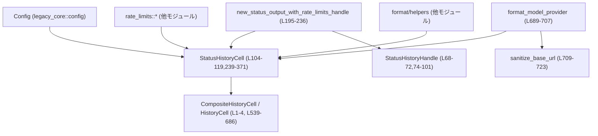
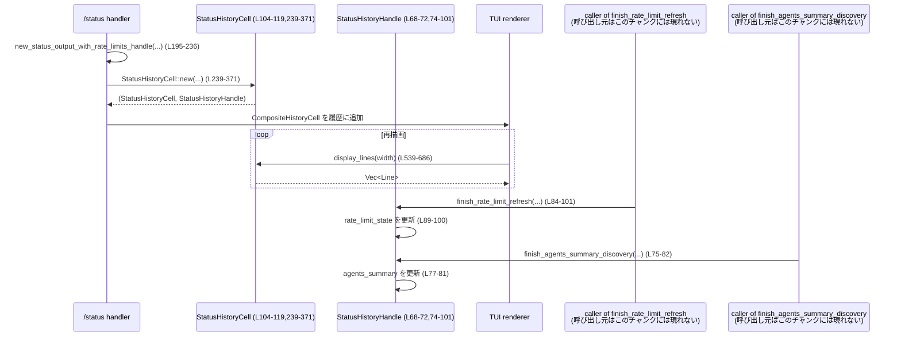

# tui/src/status/card.rs

## 0. ざっくり一言

`/status` コマンドの結果として表示する **ステータスカード用の履歴セル** を構築し、  
モデル・ディレクトリ・権限・トークン使用量・レートリミットなどを整形して TUI に描画するモジュールです (tui/src/status/card.rs:L104-119, L239-371, L539-686)。

---

## 1. このモジュールの役割

### 1.1 概要

- このモジュールは、TUI における `/status` コマンドの出力を 1 枚の「カード」として表示するための履歴セル (`StatusHistoryCell`) を定義します (L104-119)。
- 併せて、カード生成時点では未決の情報（エージェント要約、レートリミット情報）を後から更新できる **ハンドル** (`StatusHistoryHandle`) を提供します (L68-72, L74-101)。
- モデルや権限設定、トークン使用量、レートリミットなどを整形し、`HistoryCell` トレイトの `display_lines` 実装を通じて TUI 用の `Vec<Line>` に変換します (L539-686)。

### 1.2 アーキテクチャ内での位置づけ

主な依存関係と流れを簡略化すると次のようになります。



- 外部からは主に `new_status_output_with_rate_limits_handle` が呼ばれ、`CompositeHistoryCell` と `StatusHistoryHandle` を返します (L195-236)。
- `StatusHistoryCell::new` 内で `Config` やレートリミット情報などを集約し、内部状態を初期化します (L239-371)。
- 描画時には `HistoryCell` トレイトの `display_lines` が呼ばれ、内部状態＋共有状態 (`Arc<RwLock<...>>`) から実際の行を生成します (L539-686)。
- レートリミットやエージェント要約の更新は `StatusHistoryHandle` のメソッドを通じて行われ、`RwLock` 経由で `StatusHistoryCell` と共有されます (L68-72, L74-101, L344-369)。

### 1.3 設計上のポイント

- **データと更新の分離**  
  - 表示用データ構造 `StatusHistoryCell` と、その一部のフィールドを後から更新するための `StatusHistoryHandle` が明確に分離されています (L104-119, L68-72, L344-369)。
- **共有状態の同期**  
  - `agents_summary` と `rate_limit_state` は `Arc<RwLock<...>>` で共有され、複数の呼び出し元から安全に更新できるようになっています (L68-72, L104-111, L117-118, L344-369)。
- **書式責務の分割**  
  - ラベル幅の整形や折り返しなどのフォーマット処理は `FieldFormatter` や `adaptive_wrap_lines` など外部ヘルパーに委譲し、本モジュールは「何を表示するか」に集中しています (L25-33, L40-43, L610-626)。
- **状態に応じたメッセージ分岐**  
  - レートリミットの状態（Available / Stale / Unavailable / Missing）に応じて異なる説明文を表示するなど、ステータスに応じたメッセージを持つ設計です (L413-455)。
- **エラー処理方針**  
  - `RwLock` 取得には `expect` を使い、ロックが poison 状態になった場合には即座に `panic` します (L75-81, L95-100, L573-577, L579-583)。  
    例外ではなく「致命的エラー」とみなす方針です。
- **セキュリティ考慮**  
  - モデルプロバイダの base URL を表示する際、`sanitize_base_url` でユーザ名・パスワード・クエリ・フラグメントを削除し、秘匿情報が UI に出ないよう配慮しています (L689-707, L709-722)。

---

## 2. 主要な機能一覧

- ステータスカード生成: `/status` コマンドに対応する `CompositeHistoryCell` と更新用ハンドルを生成します (L195-236)。
- トークン使用量集約: `TokenUsage` / `TokenUsageInfo` から合計・入力・出力・コンテキストウィンドウ情報を集約します (L322-338, L373-389, L391-405)。
- レートリミット表示: `StatusRateLimitData` から進捗バー・説明文・警告文を組み立てます (L407-509)。
- エージェント要約とレートリミットの非同期更新: 生成済みカードに対し、別のコンテキストから要約・レートリミット情報を更新できます (L68-72, L74-101)。
- TUI 行の描画: `HistoryCell::display_lines` 実装として、タイトル行・利用案内・主要フィールド・トークン使用量・レートリミット行を生成します (L539-686)。
- モデルプロバイダ表示: `Config` 内のモデルプロバイダ設定と URL を整形して表示用文字列にします (L689-707, L709-723)。

---

## 3. 公開 API と詳細解説

### 3.1 型一覧（構造体・列挙体など）

| 名前 | 種別 | 可視性 | 行範囲 | 役割 / 用途 |
|------|------|--------|--------|-------------|
| `StatusContextWindowData` | 構造体 | private | tui/src/status/card.rs:L47-52 | モデルコンテキストウィンドウに対する、残りパーセント・使用トークン数・ウィンドウサイズを保持します。 |
| `StatusTokenUsageData` | 構造体 | `pub(crate)` | L54-60 | 合計・入力・出力トークン数およびオプションのコンテキストウィンドウ情報をまとめた表示用データです。 |
| `StatusRateLimitState` | 構造体 | private | L62-66 | 現在のレートリミット情報 (`StatusRateLimitData`) と「再取得中かどうか」のフラグを保持します。`Arc<RwLock<...>>` で共有されます。 |
| `StatusHistoryHandle` | 構造体 | `pub(crate)` | L68-72 | エージェント要約とレートリミット状態への書き込み専用ハンドルです。TUI 本体とは別のコンテキストから更新するために使われます。 |
| `StatusHistoryCell` | 構造体 | private | L104-119 | ステータスカード 1 枚分の表示情報を保持し、`HistoryCell` として描画を担当します。 |

### 3.2 関数詳細（主要 7 件）

#### `new_status_output_with_rate_limits_handle(...) -> (CompositeHistoryCell, StatusHistoryHandle)`

**シグネチャ**

```rust
#[allow(clippy::too_many_arguments)]
pub(crate) fn new_status_output_with_rate_limits_handle(
    config: &Config,
    account_display: Option<&StatusAccountDisplay>,
    token_info: Option<&TokenUsageInfo>,
    total_usage: &TokenUsage,
    session_id: &Option<ThreadId>,
    thread_name: Option<String>,
    forked_from: Option<ThreadId>,
    rate_limits: &[RateLimitSnapshotDisplay],
    _plan_type: Option<PlanType>,
    now: DateTime<Local>,
    model_name: &str,
    collaboration_mode: Option<&str>,
    reasoning_effort_override: Option<Option<ReasoningEffort>>,
    agents_summary: String,
    refreshing_rate_limits: bool,
) -> (CompositeHistoryCell, StatusHistoryHandle)
```

(tui/src/status/card.rs:L195-236)

**概要**

- `/status` コマンドに対応する履歴セルの束 (`CompositeHistoryCell`) と、後から状態を更新するための `StatusHistoryHandle` を生成します。
- `/status` コマンド文字列とステータスカード (`StatusHistoryCell`) を 1 つの `CompositeHistoryCell` にまとめます (L213-235)。

**引数**

| 引数名 | 型 | 説明 |
|--------|----|------|
| `config` | `&Config` | 現在の設定。作業ディレクトリやモデル設定・権限などを含みます (L241-269)。 |
| `account_display` | `Option<&StatusAccountDisplay>` | アカウント情報の表示用構造体。メールアドレスやプランなど (L242, L555-565)。 |
| `token_info` | `Option<&TokenUsageInfo>` | モデル固有のトークン情報とコンテキストウィンドウサイズ (L243, L322-331)。 |
| `total_usage` | `&TokenUsage` | セッション全体のトークン使用量 (L244, L333-337)。 |
| `session_id` | `&Option<ThreadId>` | スレッド ID（あれば表示）。`String` に変換されます (L245, L320-321)。 |
| `thread_name` | `Option<String>` | スレッド名（空文字は非表示） (L246, L572-573)。 |
| `forked_from` | `Option<ThreadId>` | フォーク元スレッド ID（セッション ID がある場合のみ表示）(L247, L321, L660-663)。 |
| `rate_limits` | `&[RateLimitSnapshotDisplay]` | レートリミットスナップショットの配列。0,1,複数件いずれも許容されます (L248, L339-343)。 |
| `_plan_type` | `Option<PlanType>` | プラン種別。現状このファイル内では未使用です (L249)。 |
| `now` | `DateTime<Local>` | 「現在時刻」。レートリミットの残り時間などの計算に使用されます (L250, L339-343)。 |
| `model_name` | `&str` | モデル名（例: `"gpt-4.1"`）。表示と model-specific 設定に利用します (L251, L257-283)。 |
| `collaboration_mode` | `Option<&str>` | コラボレーションモード文字列。表示用に `String` 化されます (L252, L356-357)。 |
| `reasoning_effort_override` | `Option<Option<ReasoningEffort>>` | 推論強度の明示的指定（Responses API 利用時のみ活用）(L253, L270-275)。 |
| `agents_summary` | `String` | 初期表示時の Agents.md 要約。後からハンドル経由で更新可能です (L210, L348-349, L645)。 |
| `refreshing_rate_limits` | `bool` | レートリミット更新要求中であることを示すフラグ (L211, L346-347, L424-436, L444-453)。 |

**戻り値**

- `CompositeHistoryCell`:  
  - `/status` コマンド文字列セルと `StatusHistoryCell` を含む複合セルです (L213-235)。
- `StatusHistoryHandle`:  
  - Agents 要約およびレートリミット状態を後から更新するためのハンドルです (L214-235, L366-369)。

**内部処理の流れ**

1. `/status` というコマンドを表す `PlainHistoryCell` を作成します (L213)。
2. `StatusHistoryCell::new` を呼び出し、表示用データ構造とハンドルを生成します (L214-230)。
3. `command` と `card` を `CompositeHistoryCell::new` で束ねて返します (L232-235)。

**Examples（使用例）**

```rust
use chrono::Local;
use codex_protocol::protocol::TokenUsage;
use tui::status::card::new_status_output_with_rate_limits_handle;

// 前提: Config や StatusAccountDisplay などは別途構築済みとする
fn build_status_cell(config: &Config) {
    let total_usage = TokenUsage::default();           // トークン使用量が無い場合の初期値
    let session_id = None;
    let thread_name = None;
    let forked_from = None;
    let rate_limits: [RateLimitSnapshotDisplay; 0] = []; // レートリミット情報がまだ無いケース

    let (cell, handle) = new_status_output_with_rate_limits_handle(
        config,
        None,                      // account_display
        None,                      // token_info
        &total_usage,
        &session_id,
        thread_name,
        forked_from,
        &rate_limits,
        None,                      // _plan_type（未使用）
        Local::now(),
        "gpt-4.1",
        None,                      // collaboration_mode
        None,                      // reasoning_effort_override
        String::from("<none>"),    // agents_summary 初期値
        false,                     // refreshing_rate_limits
    );

    // `cell` は HistoryCell として描画キューに載せる
    // `handle` は後続の非同期処理から更新に使用できる
}
```

**Errors / Panics**

- この関数自体は `Result` を返さず、内部で `unwrap` なども使っていません。
- ただし、呼び出し先の `StatusHistoryCell::new` 内で `Arc<RwLock>` の初期化等は行われますが、ここでは `expect` は使用されていません (L344-369)。

**Edge cases（エッジケース）**

- `rate_limits` が `[]` の場合: `StatusRateLimitData::Missing` 相当の状態が生成されるかどうかは `compose_rate_limit_data(_many)` の実装依存です。このファイルからは分かりません (L339-343)。
- `agents_summary` が空文字列でも許容され、そのまま RwLock に格納されます (L348-349)。

**使用上の注意点**

- 引数が多いため、テスト用にはラッパー関数 `new_status_output` / `new_status_output_with_rate_limits` が定義されています (L121-155, L157-193)。
- 共有状態にアクセスするのは返り値の `StatusHistoryHandle` 経由のみとする設計です。`StatusHistoryCell` 内部の `Arc<RwLock<...>>` へ直接アクセスするべきではありません (L344-369)。

---

#### `StatusHistoryCell::new(...) -> (Self, StatusHistoryHandle)`

(tui/src/status/card.rs:L239-371)

**概要**

- `Config` やトークン情報、レートリミット情報をもとに、`StatusHistoryCell` の内部状態を構築します。
- 同時に、エージェント要約とレートリミット状態を共有する `StatusHistoryHandle` を生成します。

**主な引数と役割**

- 引数は `new_status_output_with_rate_limits_handle` とほぼ同じで、表示用データを組み立てるために使われます (L241-256)。
- `agents_summary` と `refreshing_rate_limits` は共有状態の初期値として使用されます (L255-256, L344-349)。

**内部処理の流れ**

1. `config` からモデル・プロバイダ・権限設定などを `config_entries` にまとめます (L257-269)。
   - Responses API 利用時には推論強度や要約設定も追加します (L270-283)。
2. `compose_model_display` で `model_name` と詳細表示文のリストに変換します (L284-285)。
3. `config_entries` から `approval` 値を抽出し、`sandbox_policy` と組み合わせて `permissions` 表示用文字列を構築します (L285-317)。
4. `format_model_provider` でモデルプロバイダ表示を生成します (L318-318)。
5. アカウント情報・セッション ID・フォーク元 ID を表示用の `Option<String>` に変換します (L319-321)。
6. `TokenUsageInfo` と `TokenUsage` から `StatusTokenUsageData` を組み立てます (L322-338)。
7. レートリミットスナップショット配列から `StatusRateLimitData` を合成し、`StatusRateLimitState` を初期化します (L339-347)。
8. `Arc<RwLock<...>>` で `agents_summary` と `rate_limit_state` を共有可能な形にし、`StatusHistoryCell` と `StatusHistoryHandle` にそれぞれ格納して返します (L344-369)。

**Errors / Panics**

- この関数内ではロック取得時の `expect` は使っておらず、`Arc<RwLock>` の初期化のみです (L344-369)。
- `SandboxPolicy::new_workspace_write_policy()` 等の呼び出しが失敗する可能性は、このファイルからは確認できません。

**Edge cases**

- `token_info` が `None` の場合、`TokenUsage::default()` と `config.model_context_window` を使うフォールバックロジックがあります (L322-326)。
- `config.model_provider.wire_api` が `WireApi::Responses` の場合のみ、`reasoning_effort` や `model_reasoning_summary` 関連のフィールドが `config_entries` に追加されます (L270-283)。
- `asks_for_approval == OnRequest` 且つ `sandbox_policy == new_workspace_write_policy()` の場合 "Default"、`AskForApproval::Never` かつ `DangerFullAccess` の場合 "Full Access"、その他は "Custom (...)" として表示されます (L306-317)。

**使用上の注意点**

- `StatusHistoryCell::new` は `impl` 内の private 関数であり、外部コードからは直接呼び出さず、必ず `new_status_output_with_rate_limits_handle` 経由で利用します (L238-239, L214-230)。
- `StatusHistoryCell` は `HistoryCell` として描画されることを前提としており、フィールドの追加・変更時は `display_lines` 実装とラベルリストの整合性を保つ必要があります (L567-606, L639-665)。

---

#### `impl HistoryCell for StatusHistoryCell { fn display_lines(&self, width: u16) -> Vec<Line<'static>> }`

(tui/src/status/card.rs:L539-686)

**概要**

- `StatusHistoryCell` を TUI 上で表示するための行 (`Vec<Line<'static>>`) に変換します。
- 全体の幅 `width` に応じてラベル列・値列の幅を決定し、必要に応じて折り返し・切り詰め・枠線付けを行います。

**引数**

| 引数名 | 型 | 説明 |
|--------|----|------|
| `self` | `&StatusHistoryCell` | 表示対象となるステータスカードの内部状態。 |
| `width` | `u16` | 描画可能な全幅。枠線分を差し引いた内部幅を計算します (L550-553)。 |

**戻り値**

- `Vec<Line<'static>>`:  
  - 枠線込みの最終的な行のリストです。各行は `ratatui::text::Line` で、ラベルと値、色・スタイルが設定されています (L678-685)。

**内部処理の流れ**

1. ヘッダ行として `"OpenAI Codex (vXX)"` を表示し、空行を 1 行挿入します (L541-548)。
2. `width` から左右のマージン分 (`4`) を引いた内部幅 `available_inner_width` を求め、0 の場合は何も描画しません (L550-553)。
3. アカウント種別に基づき、アカウント表示文を組み立てます (L555-565)。
4. 初期ラベル `"Model"`, `"Directory"`, `"Permissions"`, `"Agents.md"` をセットし (L567-571)、スレッド名やセッション ID、コラボレーションモードなどの有無に応じてラベルを追加します (L585-606)。
5. レートリミットのラベルは `collect_rate_limit_labels` を通じて追加されます (L608-608)。
6. ラベルセットから `FieldFormatter` を構築し、値列の幅を計算します (L610-611)。
7. レートリミットとクレジット情報へのリンク（2 行）を `adaptive_wrap_lines` で折り返しながら追加します (L613-627)。
8. モデル名と詳細、ディレクトリ、権限、Agents.md 要約、アカウント、スレッド名・セッション・フォーク元、コラボレーションモードなどを順に `formatter.line` で追加します (L630-665)。
9. ChatGPT サブスクライバ以外の場合のみ、「Token usage」行を表示します (L667-670)。
10. コンテキストウィンドウ情報があれば「Context window」行を追加します (L672-673)。
11. レートリミット情報行を `rate_limit_lines` から追加します (L675-676)。
12. これまでに作成した行のうち最大幅を計算し、それと `available_inner_width` の小さい方を最終的な内部幅とし、`truncate_line_to_width` で各行をその幅に収めます (L678-683)。
13. `with_border_with_inner_width` を使って枠線付きのカードに仕上げます (L685)。

**Examples（使用例）**

```rust
fn render_status_card(cell: &StatusHistoryCell, width: u16) {
    let lines = cell.display_lines(width);   // 必要な幅に応じた行を生成
    for line in lines {
        // ratatui のフレームやバッファに描画するコンテキストに合わせて表示する
        // ここでは具体的な描画コードは省略
        println!("{:?}", line);
    }
}
```

**Errors / Panics**

- `rate_limit_state.read()` および `agents_summary.read()` が `expect` を使っているため、過去にロック保持中にパニックが発生してロックが poison 状態になっていると、ここで `panic` します (L573-583)。
- それ以外は基本的に安全な操作のみです。`TokenUsage` や `StatusRateLimitData` はすべて値として扱われており、`unwrap` 等は使用していません。

**Edge cases**

- `width <= 4` の場合、`available_inner_width` が 0 になり、空の `Vec` を返すため、カードは描画されません (L550-553)。
- `thread_name` が空文字列の場合、`filter(|name| !name.is_empty())` により非表示になります (L572-573)。
- ChatGPT サブスクリプション利用時 (`StatusAccountDisplay::ChatGpt`) はトークン使用量表示が完全に非表示になります (L555-561, L667-670)。

**使用上の注意点**

- 表示内容を増やしたい場合は、`StatusHistoryCell` のフィールドと `display_lines` 内のラベル／行生成ロジックを同時に変更する必要があります。
- `FieldFormatter::from_labels` に渡すラベルの順序と、実際に行を生成する順序を揃えることが重要です (L567-606, L639-665)。

---

#### `StatusHistoryHandle::finish_agents_summary_discovery(&self, agents_summary: String)`

(tui/src/status/card.rs:L74-82)

**概要**

- Agents.md の内容などから生成されたエージェント要約テキストを、カードに共有されている `agents_summary` に書き込みます。

**引数**

| 引数名 | 型 | 説明 |
|--------|----|------|
| `agents_summary` | `String` | 新しいエージェント要約テキスト。 |

**内部処理の流れ**

1. `Arc<RwLock<String>>` で保持されている `agents_summary` への書き込みロックを取得します (L77-80)。
2. ロック取得に失敗（poison）した場合、`expect("status history agents summary state poisoned")` で `panic` します (L77-80)。
3. `*current = agents_summary;` で値を上書きします (L81)。

**Errors / Panics**

- ロックが poison 状態の場合に `panic` します (L77-80)。

**使用上の注意点**

- 長い計算や I/O をロック保持中に行わず、完成した `String` を引数として渡す設計になっています。
- 呼び出し側は `agents_summary` の生成中にパニックを起こさないよう注意することで、ロックの poison を避けるべきです。

---

#### `StatusHistoryHandle::finish_rate_limit_refresh(&self, rate_limits: &[RateLimitSnapshotDisplay], now: DateTime<Local>)`

(tui/src/status/card.rs:L84-101)

**概要**

- 新たに取得したレートリミットスナップショット群から `StatusRateLimitData` を再構成し、`StatusRateLimitState` に保存します。
- 更新後は `refreshing_rate_limits` フラグを `false` に設定します。

**内部処理の流れ**

1. `rate_limits.len()` に応じて `compose_rate_limit_data` または `compose_rate_limit_data_many` を呼び、`StatusRateLimitData` に変換します (L89-93)。
2. `rate_limit_state` の書き込みロックを取得し、`expect` で poison を検知して `panic` する方針です (L95-99)。
3. `state.rate_limits` を新しい値で上書きし、`state.refreshing_rate_limits = false` にセットします (L99-100)。

**Errors / Panics**

- ロックが poison 状態の場合に `panic` します (L95-99)。

**Edge cases**

- `rate_limits` が 0 個または 1 個の場合と、それ以上の場合で 呼び出す compose 関数が変わります (L89-93)。実際の挙動は外部モジュールに依存します。

**使用上の注意点**

- このメソッドは「更新完了通知」として使われ、`refreshing_rate_limits` はここで必ず `false` に戻されます。開始側で `true` にしておく必要があります（開始側は本チャンクには現れません）。
- 更新前後で UI を再描画する必要がある場合は、呼び出し元でトリガーする必要があります。このファイルには再描画トリガー処理はありません。

---

#### `StatusHistoryCell::rate_limit_lines(&self, state: &StatusRateLimitState, available_inner_width: usize, formatter: &FieldFormatter)`

(tui/src/status/card.rs:L407-456)

**概要**

- 現在のレートリミット状態 `StatusRateLimitState` から、UI に表示するレートリミット関連行の `Vec<Line>` を生成します。

**内部処理の流れ**

1. `state.rate_limits` のバリアントごとに場合分けします (L413-455)。
   - `Available(rows_data)`:
     - `rows_data` が空なら `"Limits: not available for this account"` を 1 行表示 (L414-421)。
     - そうでなければ `rate_limit_row_lines` に処理を委譲 (L422-423)。
   - `Stale(rows_data)`:
     - 上記と同様に `rate_limit_row_lines` で行を生成し、その下に `"Warning: ..."` 行を追加 (L424-436)。
     - 文面は `refreshing_rate_limits` が `true` かどうかで切り替わります (L429-433)。
   - `Unavailable`:
     - `"Limits: not available for this account"` のみを表示 (L438-443)。
   - `Missing`:
     - `"refresh requested; run /status again shortly."` または `"data not available yet"` のいずれかを `"Limits"` ラベルの行として表示 (L444-453)。
2. 最終的な `Vec<Line>` を返します (L455)。

**使用上の注意点**

- レートリミットの状態バリアントを増やした場合は、この関数と `collect_rate_limit_labels` の両方を更新する必要があります (L517-535)。
- 行幅制御は `rate_limit_row_lines` に委譲されており、`available_inner_width` を超える場合に折り返しを行います (L487-494)。

---

#### `format_model_provider(config: &Config) -> Option<String>`

(tui/src/status/card.rs:L689-707)

**概要**

- `Config` のモデルプロバイダ設定から、UI 表示用のプロバイダ名文字列を生成します。
- デフォルトの OpenAI プロバイダ（base_url なし）の場合は `None` を返し、UI 上で行自体を省略します (L697-701)。

**内部処理の流れ**

1. `config.model_provider` の `name` を取り出し、空でなければそれを優先し、空なら `model_provider_id` を使うプロバイダ名とします (L689-696)。
2. `provider.base_url` が設定されていれば `sanitize_base_url` で整形します (L697-698)。
3. `provider.is_openai()` が `true` かつ base_url が `None` の場合、`is_default_openai` と判定し `None` を返します (L698-701)。
4. それ以外の場合、`Some("{provider_name} - {base_url}")` または `Some(provider_name)` を返します (L703-706)。

**Security / Privacy 観点**

- `sanitize_base_url` によって、ベーシック認証のユーザ名・パスワード、クエリパラメータ、フラグメントが削除されるため、秘匿情報が UI に露出しないようになっています (L709-722)。

---

#### `sanitize_base_url(raw: &str) -> Option<String>`

(tui/src/status/card.rs:L709-723)

**概要**

- 生の URL 文字列から不要・危険な要素（認証情報・クエリ・フラグメント）を除去し、末尾のスラッシュも削ったベース URL を返します。

**内部処理の流れ**

1. `raw.trim()` で前後の空白を除去し、空なら `None` を返します (L710-713)。
2. `Url::parse(trimmed)` に成功した場合のみ処理を続け、失敗したら `None` (L715-716)。
3. `set_username("")` および `set_password(None)` で認証情報を削除します (L718-719)。
4. `set_query(None)` と `set_fragment(None)` でクエリ文字列とフラグメントを削除します (L720-721)。
5. `to_string()` の結果から末尾の `'/'` を削り、空でなければ `Some` を返します (L722)。

**使用上の注意点**

- 無効な URL や空文字列の場合は `None` を返すため、その場合は「カスタム URL を表示しない」という扱いになります。
- `Url::parse` に依存するため、スキームのない URL などは受け付けない可能性があります。

---

### 3.3 その他の関数

| 関数名 | 行範囲 | 役割（1 行） |
|--------|--------|--------------|
| `new_status_output` | L121-155 | テスト用: 単一の `RateLimitSnapshotDisplay` からラッパーを通じてステータスカードを生成します（`refreshing_rate_limits = false` 固定）。 |
| `new_status_output_with_rate_limits` | L157-193 | テスト用: 複数レートリミットスナップショットを受け取り、`agents_summary` を `"<none>"` としてカードを生成します。 |
| `StatusHistoryCell::token_usage_spans` | L373-389 | トークン使用量 (`StatusTokenUsageData`) から `"X total (Y input + Z output)"` 形式のスパン列を生成します。 |
| `StatusHistoryCell::context_window_spans` | L391-405 | コンテキストウィンドウ情報があれば `"P% left (U used / W)"` 形式のスパン列を生成します。 |
| `StatusHistoryCell::rate_limit_row_lines` | L458-509 | 各レートリミット行（ラベル＋バー＋要約＋必要なら resets 文）の `Vec<Line>` を生成します。 |
| `StatusHistoryCell::collect_rate_limit_labels` | L511-535 | レートリミット状態に応じて必要なラベル名（`Limits`, `Warning`, 各 row.label）を `labels` に追加します。 |

---

## 4. データフロー

ここでは `/status` コマンドが実行され、カードを描画しつつレートリミット情報などが後から更新される典型的なシナリオを説明します。

1. TUI の `/status` ハンドラが `new_status_output_with_rate_limits_handle` を呼び、`CompositeHistoryCell` と `StatusHistoryHandle` を取得します (L195-236)。
2. 内部で `StatusHistoryCell::new` が呼ばれ、`Config`・トークン情報・レートリミット情報から表示用レコードが構築されます (L239-371)。
3. ヒストリービューは `CompositeHistoryCell` を履歴リストに追加し、必要に応じて `display_lines` で描画します (L539-686)。
4. 別のタスク／スレッドがレートリミットや Agents.md 情報を取得した後、`StatusHistoryHandle::finish_rate_limit_refresh` や `finish_agents_summary_discovery` を呼びます (L74-101)。
5. 次回 `display_lines` が呼ばれた際には、更新後の共有状態が UI に反映されます (L573-583, L675-676, L645)。

概念的なシーケンス図:



> RLCaller / AgentsCaller の具体的な正体（どのモジュールが呼ぶか）は、このチャンクには現れません。

---

## 5. 使い方（How to Use）

### 5.1 基本的な使用方法

典型的な呼び出しフローは次のようになります。

```rust
use chrono::Local;
use codex_protocol::protocol::TokenUsage;
use tui::status::card::new_status_output_with_rate_limits_handle;

fn show_status(config: &Config) {
    let total_usage = TokenUsage::default();
    let session_id = None;
    let thread_name = None;
    let forked_from = None;
    let rate_limits: [RateLimitSnapshotDisplay; 0] = [];

    // ステータスカードと更新ハンドルを生成する
    let (composite_cell, handle) = new_status_output_with_rate_limits_handle(
        config,
        None,                  // account_display
        None,                  // token_info
        &total_usage,
        &session_id,
        thread_name,
        forked_from,
        &rate_limits,
        None,                  // _plan_type
        Local::now(),
        "gpt-4.1",
        None,                  // collaboration_mode
        None,                  // reasoning_effort_override
        String::from("<none>"),
        false,                 // refreshing_rate_limits
    );

    // composite_cell を履歴リストに追加し、HistoryCell::display_lines 経由で描画する
    // handle は後続の更新に使う
}
```

- `CompositeHistoryCell` から実際の `display_lines` をどう呼ぶかは、このチャンクには現れませんが、`StatusHistoryCell` 自体は `HistoryCell` を実装しているため、`display_lines` で描画できることが分かります (L539-686)。

### 5.2 よくある使用パターン

1. **レートリミット取得後の更新**

   ```rust
   fn on_rate_limits_fetched(handle: &StatusHistoryHandle,
                             snapshots: Vec<RateLimitSnapshotDisplay>) {
       use chrono::Local;

       // 新しいスナップショット群で UI 状態を更新
       handle.finish_rate_limit_refresh(&snapshots, Local::now());
       // この後、画面再描画を行うのは呼び出し元の責務
   }
   ```

2. **Agents.md 要約の更新**

   ```rust
   fn on_agents_summary_ready(handle: &StatusHistoryHandle, summary: String) {
       // Agents.md の内容を解析して得た要約を UI に反映
       handle.finish_agents_summary_discovery(summary);
   }
   ```

### 5.3 よくある間違い

```rust
// 誤り例: ロックを取ったまま重い処理を行う
fn wrong_update(handle: &StatusHistoryHandle) {
    // ここで read / write ロックを直接取ると、
    // 長時間ロック保持＋パニック時に poison を引き起こしやすい
    // （StatusHistoryHandle 経由での更新を想定した設計）
}

// 正しい例: 事前に計算を済ませてからハンドルメソッドを呼ぶ
fn correct_update(handle: &StatusHistoryHandle) {
    let summary = compute_agents_summary();   // 重い計算はここで実行
    handle.finish_agents_summary_discovery(summary);  // ロック保持区間は短い
}
```

### 5.4 使用上の注意点（まとめ）

- **ロックの扱い**  
  - `StatusHistoryHandle` 内の RwLock は `expect` 付きで取得されるため、ロック保持中のパニックにより **以後のすべての描画・更新が panic する** 可能性があります (L77-81, L95-100, L573-583)。
- **幅ゼロの扱い**  
  - `display_lines` は内部幅が 0 の場合に空ベクタを返します。極端に狭い幅ではカードが描画されない点に留意が必要です (L550-553)。
- **ChatGPT サブスクライバのトークン非表示**  
  - `StatusAccountDisplay::ChatGpt` の場合、トークン使用量は意図的に隠されます (L555-561, L667-670)。
- **モデルプロバイダの表示**  
  - デフォルト OpenAI（base_url 未設定）の場合は `Model provider` 行自体が表示されません (L689-707, L585-587, L639-642)。

---

## 6. 変更の仕方（How to Modify）

### 6.1 新しい機能を追加する場合

**例: 新しいフィールド「Organization」を表示したい場合**

1. `StatusHistoryCell` にフィールドを追加する。  
   例: `organization: Option<String>,` (L104-119 付近)。
2. `StatusHistoryCell::new` で `Config` などから値を取り出し、そのフィールドを初期化する (L239-371)。
3. `display_lines` で:
   - 初期ラベルのリストに `"Organization"` を追加する (L567-571)。
   - 条件付きでラベルに追加するなら `push_label` と `BTreeSet` を使うパターンに倣う (L585-606)。
   - 実際の行生成ロジックで `formatter.line("Organization", vec![Span::from(...)])` を追加する (L639-665 のパターンを踏襲)。
4. ラベル一覧と行生成の順序を揃え、`FieldFormatter` による幅計算が想定通りになるよう確認します (L610-611)。

### 6.2 既存の機能を変更する場合

- **レートリミット表示スタイルを変えたい場合**
  - 進捗バーや要約文の変更は `render_status_limit_progress_bar` や `format_status_limit_summary` の実装側になりますが、行折り返しの判定は `rate_limit_row_lines` 内で行っているため (L472-495)、文字列の長さ変化が折り返し条件に与える影響も確認する必要があります。
- **権限ラベルの条件を変えたい場合**
  - `permissions` の文字列生成ロジックは `StatusHistoryCell::new` の中にまとまっているため (L306-317)、ここを安全に変更します。
  - 変更により `"Default"` や `"Full Access"` の定義が変わる場合、ドキュメントやユーザ想定との整合性も確認します。
- **Contracts（前提条件）**
  - `StatusHistoryHandle` のメソッドが「非同期処理の完了後に呼ばれる」ことを前提に設計されているように見えますが、呼び出しタイミングに関する制約はコードからは明示されていません。このチャンクからは呼び出し元側の契約は分かりません。

---

## 7. 関連ファイル

| パス / モジュール | 役割 / 関係 |
|-------------------|------------|
| `crate::history_cell` | `CompositeHistoryCell`, `HistoryCell`, `PlainHistoryCell`, `with_border_with_inner_width` を提供し、履歴セルの共通インターフェースと枠線描画ロジックを担います (L1-4, L213-235, L539-686)。 |
| `crate::legacy_core::config::Config` | 作業ディレクトリ、モデル設定、権限設定 (`SandboxPolicy`, `AskForApproval` 等) を提供し、ステータスカードの内容の基礎になります (L5, L241-269, L306-317, L689-696)。 |
| `super::account::StatusAccountDisplay` | アカウントの種類・メールアドレス・プラン情報の表示モデル。`compose_account_display` がこれを生成します (L25, L113, L319, L555-565)。 |
| `super::format` | `FieldFormatter`, `line_display_width`, `push_label`, `truncate_line_to_width` など、ラベルと値の整列や幅計算・切り詰めロジックを提供します (L26-29, L610-611, L678-683)。 |
| `super::helpers` | モデル表示 (`compose_model_display`)、ディレクトリ表示 (`format_directory_display`)、トークン数フォーマット (`format_tokens_compact`) など、文字列整形ヘルパーを提供します (L30-33, L284-285, L333-337, L373-389, L637-638)。 |
| `super::rate_limits` | レートリミット情報のモデル (`StatusRateLimitData`, `StatusRateLimitRow`, `StatusRateLimitValue`) と整形ロジック (`compose_rate_limit_data(_many)`, `format_status_limit_summary`, `render_status_limit_progress_bar`) を提供します (L34-41, L62-66, L339-347, L407-509)。 |
| `crate::wrapping` | `RtOptions`, `adaptive_wrap_lines` により、TUI 行のラップ処理を提供します (L42-43, L613-627)。 |
| `codex_protocol::{TokenUsage, TokenUsageInfo, ThreadId, PlanType, ReasoningEffort}` | トークン使用量やスレッド ID、プラン種別、推論設定など、プロトコル側のドメイン型を提供します (L10-17, L54-60, L322-338)。 |
| `codex_utils_sandbox_summary::summarize_sandbox_policy` | `SandboxPolicy` から権限設定の要約文を生成します (L18, L265-268)。 |
| `url::Url` | `sanitize_base_url` 内で URL を安全にパース・正規化するために使用されます (L23, L709-722)。 |

このファイル内にテスト関数 (`#[test] fn ...`) の定義は現れていませんが、ステータスカード生成用のテスト向けラッパー関数 (`new_status_output`, `new_status_output_with_rate_limits`) が `#[cfg(test)]` で定義されています (tui/src/status/card.rs:L121-155, L157-193)。
