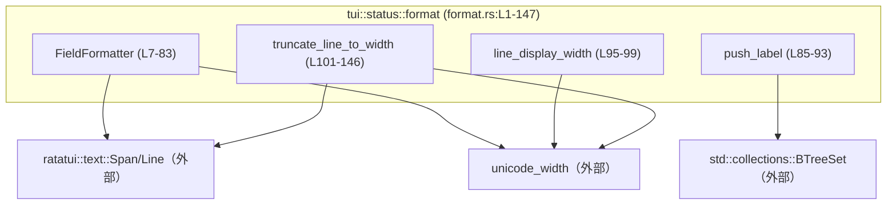
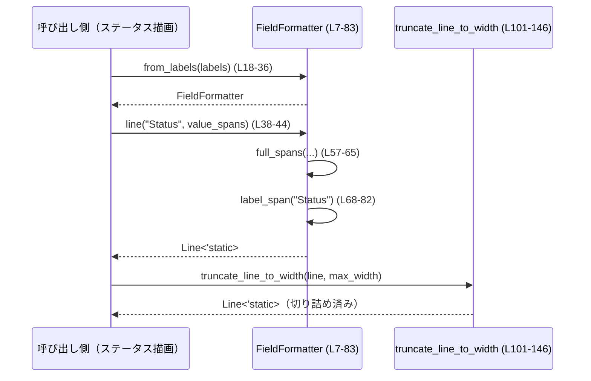

# tui/src/status/format.rs コード解説

## 0. ざっくり一言

- このモジュールは、`ratatui` の `Span` / `Line` を用いて、**ラベル付きのテキスト行を Unicode の表示幅に基づいて整形・折り返し／切り詰めするユーティリティ**を提供します（`FieldFormatter` と補助関数群）（format.rs:L7-13, L18-55, L95-146）。
- ステータス表示などで、ラベルと値をきれいに揃えた行を描画する用途を想定した構造になっています（format.rs:L18-36, L68-82, L101-146）。

---

## 1. このモジュールの役割

### 1.1 概要

- このモジュールは **ラベルと値を並べて表示するときの整形処理**を担当し、次の機能を提供します。
  - ラベル群から必要なインデント・値開始位置を計算する `FieldFormatter`（format.rs:L7-13, L18-36）。
  - その設定に基づいて、ラベル＋値の `Line<'static>` を生成するメソッド群（format.rs:L38-55, L57-82）。
  - 行全体の表示幅計測と、幅制限に合わせた Unicode-aware な切り詰め（format.rs:L95-99, L101-146）。
  - ラベル集合の重複を排除しながらラベル一覧を構築するユーティリティ（format.rs:L85-93）。

### 1.2 アーキテクチャ内での位置づけ

- このファイル単体では他の自前モジュールは登場せず、**外部ライブラリと標準ライブラリにのみ依存する純粋なフォーマット層**になっています（format.rs:L1-5）。
  - 表示要素：`ratatui::prelude::*`（`Span`, `Line` 等）（format.rs:L1-2）。
  - 文字幅計算：`unicode_width::{UnicodeWidthChar, UnicodeWidthStr}`（format.rs:L4-5）。
  - ラベル重複管理：`std::collections::BTreeSet`（format.rs:L3, L85-93）。

依存関係のイメージです（このチャートは format.rs:L1-147 に対応します）。



- このチャンクからは「どのモジュールから呼ばれているか」は分かりませんが、TUI のステータス行や情報パネルの描画ロジックから利用される設計と考えられます。ただし、呼び出し元はこのチャンクには現れません。

### 1.3 設計上のポイント

コードから読み取れる特徴です。

- **Unicode の表示幅ベースの整形**  
  - ラベル幅や値の幅計算に `UnicodeWidthStr::width` を使用し、全角・半角や多バイト文字の実際の表示幅を考慮しています（format.rs:L24-25, L27, L75-76, L96-98, L112, L131）。
- **ラベルと値のきれいな整列**  
  - 最大ラベル幅とインデントから `value_offset` を計算し、値の開始位置を揃えています（format.rs:L22-29, L68-82）。
- **状態をほとんど持たないレイアウトオブジェクト**  
  - `FieldFormatter` はインデント文字列とオフセット・事前計算済みのインデント文字列のみを保持し、各行の生成時は副作用なく `Span` / `Line` を構築します（format.rs:L7-13, L30-35, L38-55）。
- **重複ラベルを排除するヘルパー**  
  - `push_label` は `BTreeSet<String>` でラベルの重複を防ぎつつ、`Vec<String>` へも追加する二重構造になっています（format.rs:L85-93）。
- **エラーではなく「丸め」や「切り捨て」で扱う方針**  
  - 幅不足や空ラベル集合などのケースでも `Result` ではなく、`saturating_sub` 等で丸めたり空行にしたりする実装になっています（format.rs:L26, L53-55, L101-104）。
- **安全性・並行性**  
  - このファイルには `unsafe` ブロックは存在せず（format.rs:L1-147）、共有ミュータブル状態も持たないため、メモリ安全性やスレッドセーフティの観点で特別な注意点はありません。

---

## 2. 主要な機能一覧

このモジュールが提供する主な機能です。

- ラベル群からレイアウト（最大ラベル幅・値開始位置）を計算する `FieldFormatter::from_labels`（format.rs:L18-36）。
- ラベル＋値スパンから 1 行の `Line<'static>` を生成する `FieldFormatter::line`（format.rs:L38-44）。
- 値部分が改行で続く場合の行（継続行）を生成する `FieldFormatter::continuation`（format.rs:L46-51）。
- 利用可能な幅から「値に使える幅」を計算する `FieldFormatter::value_width`（format.rs:L53-55）。
- ラベルと値のスパンを結合する `FieldFormatter::full_spans`（format.rs:L57-65）。
- ラベル表示用の `Span` を作成する `FieldFormatter::label_span`（format.rs:L68-82）。
- ラベル一覧に、重複しないようにラベルを追加する `push_label`（format.rs:L85-93）。
- 1 行の実表示幅（Unicode ベース）を計算する `line_display_width`（format.rs:L95-99）。
- `Line` を指定した最大幅に収まるよう Unicode ベースで切り詰める `truncate_line_to_width`（format.rs:L101-146）。

### コンポーネントインベントリー（構造体・関数一覧）

| 名前 | 種別 | 行範囲 | 役割 / 用途 |
|------|------|--------|-------------|
| `FieldFormatter` | 構造体 | format.rs:L7-13 | ラベル幅とインデント情報を持ち、ラベル＋値の `Line` を整形するためのフォーマッタ |
| `FieldFormatter::INDENT` | 関連定数 | format.rs:L16 | 行頭インデントとして使う固定文字列（デフォルトは半角スペース 1 文字） |
| `FieldFormatter::from_labels` | 関連関数 | format.rs:L18-36 | ラベル群から最大ラベル幅と値開始位置を計算し、`FieldFormatter` を構築 |
| `FieldFormatter::line` | メソッド | format.rs:L38-44 | ラベルと値スパンから 1 行分の `Line<'static>` を生成 |
| `FieldFormatter::continuation` | メソッド | format.rs:L46-51 | 値が次行に続く場合の継続行 `Line<'static>` を生成 |
| `FieldFormatter::value_width` | メソッド | format.rs:L53-55 | 与えられた内部幅から値部分に使える幅を計算 |
| `FieldFormatter::full_spans` | メソッド | format.rs:L57-65 | ラベル `Span` と値スパン列を結合した `Span` ベクタを返却 |
| `FieldFormatter::label_span` | メソッド（非公開） | format.rs:L68-82 | インデント＋ラベル＋コロン＋パディングからラベル表示用の `Span` を生成 |
| `push_label` | 関数 | format.rs:L85-93 | `Vec<String>` にラベルを追加しつつ、`BTreeSet<String>` で重複を防ぐ |
| `line_display_width` | 関数 | format.rs:L95-99 | `Line<'static>` の内容の Unicode 表示幅の合計を返す |
| `truncate_line_to_width` | 関数 | format.rs:L101-146 | `Line<'static>` を最大表示幅までに切り詰める |

---

## 3. 公開 API と詳細解説

### 3.1 型一覧（構造体）

| 名前 | 種別 | 行範囲 | フィールド / 説明 |
|------|------|--------|--------------------|
| `FieldFormatter` | 構造体 | format.rs:L7-13 | `indent: &'static str`（行頭インデント）、`label_width: usize`（ラベル最大幅）、`value_offset: usize`（値の開始位置）、`value_indent: String`（値継続行用のインデント文字列） |

- `#[derive(Debug, Clone)]` により、デバッグ出力とクローンが可能です（format.rs:L7）。

### 3.2 関数詳細（7 件）

#### `FieldFormatter::from_labels<S>(labels: impl IntoIterator<Item = S>) -> Self`（format.rs:L18-36）

**概要**

- ラベル文字列の集合から最大ラベル幅を求め、行頭インデントと組み合わせて「値の開始位置」と継続行用インデントを計算し、`FieldFormatter` を構築します（format.rs:L22-35）。

**引数**

| 引数名 | 型 | 説明 |
|--------|----|------|
| `labels` | `impl IntoIterator<Item = S>` | ラベル文字列群。後続で `S: AsRef<str>` によって `&str` として参照されます（format.rs:L18-21）。 |

**戻り値**

- `Self`（`FieldFormatter`）：計算された `indent`, `label_width`, `value_offset`, `value_indent` を持つインスタンスです（format.rs:L30-35）。

**内部処理の流れ**

1. ラベル群をイテレートし、`UnicodeWidthStr::width(label.as_ref())` で各ラベルの表示幅を計算します（format.rs:L22-25）。
2. その最大値を `label_width` として取得します。ラベルが 1 つもない場合は `unwrap_or(0)` により 0 になります（format.rs:L25-26）。
3. `INDENT` の表示幅を `indent_width` として取得します（format.rs:L27）。
4. `value_offset = indent_width + label_width + 1 + 3` として、インデント＋ラベル＋コロン＋スペース 3 文字分のオフセットを計算します（format.rs:L28）。
5. 上記の値と `" ".repeat(value_offset)` を `value_indent` として `FieldFormatter` を構築します（format.rs:L30-35）。

**Examples（使用例）**

```rust
// ラベル集合から FieldFormatter を初期化する例
let labels = vec!["Name", "Status", "Details"];          // ラベル候補
let formatter = FieldFormatter::from_labels(labels);     // 最大ラベル幅に基づき、値の開始位置が決まる
// 以降、formatter.line(...) などで揃ったレイアウトの行を生成できる
```

**Errors / Panics**

- この関数は `Result` を返さず、パニックを発生させるような `unwrap` も利用していません（`unwrap_or(0)` のみ）（format.rs:L26）。
- 失敗する可能性があるのはメモリアロケーション失敗など、Rust プログラム共通の例外的状況のみです。

**Edge cases（エッジケース）**

- ラベル集合が空の場合  
  - `label_width` は 0 になり、`value_offset` は `indent_width + 0 + 1 + 3`（INDENT が 1 文字なら 5）になります（format.rs:L25-28）。
- 非 ASCII のラベル  
  - `UnicodeWidthStr::width` を使うため、全角日本語なども適切に幅計算されます（format.rs:L24-25）。

**使用上の注意点**

- 整列を正しく行うためには、**実際に使用するラベルと同じ集合**を `labels` に渡す必要があります。  
  ここに含まれないラベルを `line` で使うと、そのラベルだけ値の位置がずれる可能性があります（format.rs:L22-28, L75-77）。
- この関数自体は共有状態を持たず、どのスレッドから呼んでも同じ結果を返します。

---

#### `FieldFormatter::line(&self, label: &'static str, value_spans: Vec<Span<'static>>) -> Line<'static>`（format.rs:L38-44）

**概要**

- ラベル用テキストと値の `Span` 群を受け取り、ラベル＋値を 1 行に並べた `Line<'static>` を生成します（format.rs:L38-44）。

**引数**

| 引数名 | 型 | 説明 |
|--------|----|------|
| `&self` | `&FieldFormatter` | 事前に計算されたラベル幅や値オフセットを参照します。 |
| `label` | `&'static str` | 行の先頭に表示するラベル文字列（format.rs:L39-41）。 |
| `value_spans` | `Vec<Span<'static>>` | ラベルの右側に表示する値のスパン列（format.rs:L41）。 |

**戻り値**

- `Line<'static>`：ラベル `Span` と値スパン列を結合した 1 行です（format.rs:L42-44）。

**内部処理の流れ**

1. `self.full_spans(label, value_spans)` を呼び出し、ラベル `Span` を先頭に持つ `Span` ベクタを得ます（format.rs:L42-43, L57-65）。
2. それを `Line::from(...)` で `Line<'static>` に変換します（format.rs:L42）。

**Examples（使用例）**

```rust
// FieldFormatter が既に初期化されている前提
let formatter = FieldFormatter::from_labels(vec!["Name", "Status"]); // ラベル集合から生成

// 値部分のスパンを作成
let value_spans = vec![
    Span::raw("Alice"),                                      // 値 "Alice" のスパン
];

// ラベル＋値から Line を生成
let line = formatter.line("Name", value_spans);              // " Name: Alice" のような行になる
```

**Errors / Panics**

- 独自のエラー処理は行っておらず、通常はパニックしません（format.rs:L38-44）。
- `Span` や `Line` のコンストラクタでパニックする可能性も通常はありません。

**Edge cases（エッジケース）**

- `value_spans` が空の場合  
  - ラベルのみの行が生成されます（format.rs:L57-65）。
- `label` に `from_labels` で考慮していないラベルを渡した場合  
  - `self.label_width` より長いラベルは追加のパディングが付かず、行全体の整列が崩れる可能性があります（format.rs:L75-77）。

**使用上の注意点**

- ラベル引数は `'static` な文字列リテラル前提です（format.rs:L39-41）。動的なラベルを使う場合は `'static` な領域に置くなど呼び出し側で注意が必要です。
- このメソッドは `&self` で、内部状態を変更しません（format.rs:L38-44）。複数スレッドから同じ `FieldFormatter` を共有して呼ぶ場合もデータ競合は発生しません。

---

#### `FieldFormatter::continuation(&self, spans: Vec<Span<'static>>) -> Line<'static>`（format.rs:L46-51）

**概要**

- 値が複数行にわたる場合に、**ラベル位置は空けつつ値だけを表示する継続行**を生成します（format.rs:L46-51）。

**引数**

| 引数名 | 型 | 説明 |
|--------|----|------|
| `&self` | `&FieldFormatter` | 継続行用のインデント文字列 `value_indent` を参照します。 |
| `spans` | `Vec<Span<'static>>` | 継続行に表示する値部分のスパン列です（format.rs:L46）。 |

**戻り値**

- `Line<'static>`：値部分のみ表示され、ラベルの代わりに空間インデントを持つ継続行です（format.rs:L47-51）。

**内部処理の流れ**

1. `spans.len() + 1` の容量を持つ `all_spans` ベクタを作成します（format.rs:L47）。
2. 先頭に `value_indent`（空白文字列）から作った `Span` を dim スタイルで追加します（format.rs:L48）。
3. 残りの `spans` を `all_spans` に append します（format.rs:L49）。
4. `Line::from(all_spans)` を返します（format.rs:L50）。

**Examples（使用例）**

```rust
// 1 行目はラベル付きの行
let first = formatter.line("Details", vec![Span::raw("Line 1")]);

// 2 行目以降は継続行としてラベル位置を空ける
let second = formatter.continuation(vec![Span::raw("Line 2")]);
// 表示イメージ:
// " Details: Line 1"
// "         Line 2"  // ラベル分の幅が value_indent によって空けられる
```

**Errors / Panics**

- 独自のパニック条件はありません（format.rs:L46-51）。

**Edge cases（エッジケース）**

- `spans` が空の場合  
  - `value_indent` のみを含む 1 スパンの行（空白だけの行）が生成されます（format.rs:L47-50）。

**使用上の注意点**

- 継続行のインデント幅は `from_labels` 時点で決まるため、ラベル集合を変えた後に同じ `FieldFormatter` を使うと整合性が取れない可能性があります（format.rs:L30-35, L48）。

---

#### `FieldFormatter::value_width(&self, available_inner_width: usize) -> usize`（format.rs:L53-55）

**概要**

- レイアウト全体で利用可能な内部幅から、ラベル・インデント部分を差し引いた「値に利用できる最大幅」を返します（format.rs:L53-55）。

**引数**

| 引数名 | 型 | 説明 |
|--------|----|------|
| `available_inner_width` | `usize` | ボックス内など、ラベル＋値を含めた全体の内部幅。 |

**戻り値**

- `usize`：値部分に使用できる最大幅。`available_inner_width.saturating_sub(self.value_offset)` で計算されます（format.rs:L54）。

**内部処理の流れ**

1. `available_inner_width` から `self.value_offset` を減算します（format.rs:L54）。
2. `saturating_sub` を用いているため、結果が負になる場合でも 0 になります（format.rs:L54）。

**Examples（使用例）**

```rust
// 例えば、ボックスの内部幅が 40 桁の場合
let inner_width = 40;
let value_width = formatter.value_width(inner_width);     // 値部分に使える幅
// ここで value_width を truncate_line_to_width の max_width として利用できる
```

**Errors / Panics**

- `saturating_sub` によってオーバーフローを防いでおり、パニックは発生しません（format.rs:L54）。

**Edge cases（エッジケース）**

- `available_inner_width < self.value_offset` の場合  
  - `0` が返り、値部分に一切幅を割り当てられないという解釈になります（format.rs:L54）。

**使用上の注意点**

- 戻り値が 0 の場合は、後続で `truncate_line_to_width` に渡すと完全に空行が返る動作になる点に注意が必要です（format.rs:L101-104, L146）。

---

#### `push_label(labels: &mut Vec<String>, seen: &mut BTreeSet<String>, label: &str)`（format.rs:L85-93）

**概要**

- ラベルの重複を避けつつ、`Vec<String>` にラベルを追加するための補助関数です。  
  `seen` セットを使って「既に追加済みか」を判定します（format.rs:L85-93）。

**引数**

| 引数名 | 型 | 説明 |
|--------|----|------|
| `labels` | `&mut Vec<String>` | 表示順にラベルを格納するベクタ（format.rs:L85）。 |
| `seen` | `&mut BTreeSet<String>` | すでに追加されたラベルを管理する集合（format.rs:L85）。 |
| `label` | `&str` | 追加候補のラベル文字列（format.rs:L85）。 |

**戻り値**

- なし（`()`）。

**内部処理の流れ**

1. `seen.contains(label)` で既に存在するラベルかを確認し、存在すれば何もせず戻ります（format.rs:L86-87）。
2. `label.to_string()` で `String` に変換し、ローカル変数 `owned` に保持します（format.rs:L90）。
3. `seen.insert(owned.clone())` で集合にも追加し（format.rs:L91）、`labels.push(owned)` でベクタに追加します（format.rs:L92）。

**Examples（使用例）**

```rust
let mut labels = Vec::new();                             // 表示順を保持
let mut seen = BTreeSet::new();                         // 重複管理

push_label(&mut labels, &mut seen, "Name");
push_label(&mut labels, &mut seen, "Status");
push_label(&mut labels, &mut seen, "Name");             // 2 回目は無視される

assert_eq!(labels, vec!["Name".to_string(), "Status".to_string()]);
```

**Errors / Panics**

- 通常の使用でパニックする要素はありません（format.rs:L85-93）。

**Edge cases（エッジケース）**

- `label` が空文字列 `""` の場合  
  - 特別扱いはなく、空文字列も 1 つのラベルとして扱われます（format.rs:L90-92）。
- 大量のラベル  
  - `BTreeSet` と `Vec` の両方に保存されるためメモリ使用量が増えますが、アルゴリズム的には問題ありません。

**使用上の注意点**

- `seen` には常に `labels` に追加したすべてのラベルを入れる前提の設計になっています。  
  手動で `seen` をクリアしたりすると、重複が防げなくなります。
- 関数内部でのみ `labels` と `seen` を変更しており、グローバル状態には依存しません。並行実行する場合は、呼び出し側で `&mut` 参照の競合を防ぐ必要があります。

---

#### `line_display_width(line: &Line<'static>) -> usize`（format.rs:L95-99）

**概要**

- `Line<'static>` に含まれるすべての `Span` のテキスト部分の Unicode 表示幅の合計を返します（format.rs:L95-99）。

**引数**

| 引数名 | 型 | 説明 |
|--------|----|------|
| `line` | `&Line<'static>` | 表示幅を計算したい行（format.rs:L95）。 |

**戻り値**

- `usize`：行全体の表示幅。各 `Span` の `span.content.as_ref()` に対して `UnicodeWidthStr::width` を適用し、合計したものです（format.rs:L96-98）。

**内部処理の流れ**

1. `line.iter()` で全スパンをイテレートします（format.rs:L96）。
2. 各スパンについて `span.content.as_ref()` を取り出し（`Cow<str>` の中身）、その表示幅を `UnicodeWidthStr::width` で求めます（format.rs:L97）。
3. `sum()` で合計を返します（format.rs:L98）。

**Examples（使用例）**

```rust
let line = Line::from(vec![
    Span::raw("Name: "),
    Span::raw("Alice"),
]);
let width = line_display_width(&line);                   // "Name: Alice" の表示幅
```

**Errors / Panics**

- パニック要因はなく、メモリアロケーションに失敗しない限り安全に動作します（format.rs:L95-99）。

**Edge cases（エッジケース）**

- 行が空（スパン数 0）の場合  
  - `sum()` の結果は 0 になります（format.rs:L96-98）。
- ゼロ幅文字や結合文字を含む場合  
  - `unicode_width` クレートの実装に従い、幅 0 として扱われる可能性があります（format.rs:L4-5, L97）。

**使用上の注意点**

- スタイル（色や太字など）は width 計算に影響しません。ANSI シーケンスは `Span` 内に含まれない前提で計算されています（format.rs:L97）。
- 単純な幅チェックや、`truncate_line_to_width` の前処理として利用できます。

---

#### `truncate_line_to_width(line: Line<'static>, max_width: usize) -> Line<'static>`（format.rs:L101-146）

**概要**

- `Line<'static>` を `max_width` 以内に収まるよう、**Unicode 表示幅ベースで先頭から順に切り詰める関数**です（format.rs:L101-146）。
- 行内の複数 `Span` を順に処理し、必要に応じて最後のスパンを文字単位で切り詰めます。

**引数**

| 引数名 | 型 | 説明 |
|--------|----|------|
| `line` | `Line<'static>` | 切り詰め対象の行。所有権を消費します（format.rs:L101）。 |
| `max_width` | `usize` | 行の最大表示幅（0 の場合は常に空行が返ります）（format.rs:L101-104）。 |

**戻り値**

- `Line<'static>`：`max_width` を超えないように切り詰めた行です（format.rs:L146）。

**内部処理の流れ**

1. `max_width == 0` のときは、空の `Span` ベクタからなる行を即座に返します（format.rs:L101-104）。
2. `used = 0`、`spans_out = Vec::new()` を初期化します（format.rs:L106-107）。
3. 元の行の `line.spans` を順に処理します（format.rs:L109）。
   - `span.content.into_owned()` でテキストを取り出し、`span.style` も保持します（format.rs:L110-111）。
   - テキストの幅を `UnicodeWidthStr::width(text.as_str())` で計算します（format.rs:L112）。
4. スパン幅が 0 の場合  
   - そのスパンは幅に影響しないため、そのまま `spans_out` に追加し、次のスパンに進みます（format.rs:L114-117）。
5. すでに `used >= max_width` の場合はループを終了します（format.rs:L119-121）。
6. `used + span_width <= max_width`（スパン全体が入る）場合  
   - `used += span_width`、スパン全体を `spans_out` に追加し、次へ進みます（format.rs:L123-126）。
7. それ以外（このスパンの途中で幅上限を超える）場合  
   - 空の `String` を `truncated` として作成し、`text.chars()` を順に処理します（format.rs:L129-130）。
   - 各文字の幅を `UnicodeWidthChar::width(ch).unwrap_or(0)` で取得し、`used + ch_width > max_width` なら break（format.rs:L131-133）。
   - そうでなければ `truncated.push(ch)` し、`used` に幅を加算します（format.rs:L135-136）。
   - `truncated` が空でなければそのスパンを `spans_out` に追加し、ループを終了します（format.rs:L139-143）。
8. 最終的に `Line::from(spans_out)` を返します（format.rs:L146）。

**Examples（使用例）**

```rust
// 10 桁に収まるよう行を切り詰める例
let line = Line::from(vec![
    Span::raw("Status: "),
    Span::raw("Very Long Value"),
]);

let truncated = truncate_line_to_width(line, 10);
// 表示幅 10 桁以内に収まるように "Status: V" 等に切り詰められる
```

**Errors / Panics**

- `UnicodeWidthChar::width(ch).unwrap_or(0)` を使用しているため、幅が不明な文字でも 0 として扱われ、パニックは発生しません（format.rs:L131）。
- それ以外にパニックする明示的なコードはありません（format.rs:L101-146）。

**Edge cases（エッジケース）**

- `max_width == 0`  
  - 常に空の `Line` を返します（format.rs:L101-104）。
- 行にゼロ幅スパン（空文字列等）が含まれる場合  
  - 幅カウンタには影響せず、そのまま `spans_out` にコピーされます（format.rs:L114-117）。
- `max_width` が元の行幅より大きい場合  
  - 行は変更されず、そのまま返ります（format.rs:L119-127）。
- 結合文字やサロゲートペア等を含む場合  
  - 文字単位で切り詰めるため、**表示上は 1 グラフェムの途中で切れて見える可能性**があります（format.rs:L129-137）。

**使用上の注意点**

- この関数は **グラフェムクラスタではなく Unicode スカラ値単位で切り詰める**ため、一部の多文字グリフでは見た目が崩れる可能性があります。これは表示上の問題であり、メモリ安全性には影響しません（format.rs:L129-137）。
- 行を所有権ごと受け取り、その場で切り詰めた新しい `Line` を返します。元の `Line` は再利用できません（format.rs:L101, L146）。
- 関数内部に共有状態はなく、どのスレッドから呼んでも同じ入力に対して同じ出力になります。

---

### 3.3 その他の関数・メソッド

補助的な関数／メソッドです。

| 関数名 | 行範囲 | 役割（1 行） |
|--------|--------|--------------|
| `FieldFormatter::full_spans` | format.rs:L57-65 | ラベル `Span` と値スパン列を結合し、`Vec<Span<'static>>` を返します。`line` から利用されます。 |
| `FieldFormatter::label_span` | format.rs:L68-82 | インデント＋ラベル＋コロン＋パディングを 1 つの dim スタイル `Span` に整形します。 |

---

## 4. データフロー

### 4.1 代表的な処理シナリオ

典型的な使用シナリオは次のようになります（format.rs:L18-36, L38-44, L57-65, L68-82, L101-146）。

1. ラベル集合から `FieldFormatter::from_labels` でレイアウト情報を作る。
2. 各レコード（行）について、`FieldFormatter::line` でラベル＋値の行を作る。
3. 値が長い場合は、`FieldFormatter::continuation` で 2 行目以降を作る。
4. 最後に、描画領域の幅に応じて `truncate_line_to_width` で行を切り詰める。

これをシーケンス図で表します。



- ラベル集合と描画幅だけを入力として、**純粋関数的に整形済みラインが得られる**データフローになっています。
- 途中で共有状態や I/O は発生せず、このモジュールの責務はあくまで「整形ロジック」に限定されています。

---

## 5. 使い方（How to Use）

### 5.1 基本的な使用方法

以下は、複数レコードのステータスを整形して描画する場合の基本フロー例です。

```rust
use ratatui::text::{Span, Line};                     // ratatui の型
use std::collections::BTreeSet;

// 1. ラベル集合を用意する
let mut labels_vec = Vec::new();                      // ラベルの順序を保持
let mut seen = BTreeSet::new();                       // 重複ラベルの管理

push_label(&mut labels_vec, &mut seen, "Name");
push_label(&mut labels_vec, &mut seen, "Status");

// 2. FieldFormatter を初期化する
let formatter = FieldFormatter::from_labels(
    labels_vec.iter().map(|s| s.as_str())             // &str としてラベルを渡す
);

// 3. 1 レコード分の行を作る
let line = formatter.line(
    "Name",
    vec![Span::raw("Alice")],                         // 値の部分
);

// 4. 描画領域の幅に合わせて切り詰める
let max_width = 40;                                   // 例: 内部幅 40 桁
let display_width = formatter.value_width(max_width); // 値に使える幅を計算
let truncated_line = truncate_line_to_width(line, max_width);
// truncated_line をウィジェットに渡して描画する
```

### 5.2 よくある使用パターン

1. **同じレイアウトで多数のレコードを表示する**

   - 一度 `FieldFormatter::from_labels` でフォーマッタを作り、複数の行で再利用します（format.rs:L18-36, L38-44）。
   - これによりラベル列がきれいに縦に揃います。

   ```rust
   let formatter = FieldFormatter::from_labels(vec!["Name", "Status"]);

   let line1 = formatter.line("Name",   vec![Span::raw("Alice")]);
   let line2 = formatter.line("Status", vec![Span::raw("Running")]);
   ```

2. **長い値の複数行表示**

   - 1 行目は `line`、2 行目以降は `continuation` で生成します（format.rs:L46-51）。

   ```rust
   let first = formatter.line("Details", vec![Span::raw("Line 1")]);
   let second = formatter.continuation(vec![Span::raw("Line 2")]);
   ```

3. **描画幅に合わせた最終的なトリミング**

   - 一度 `Line` を構築し、その後 `truncate_line_to_width` で幅制限をかけます（format.rs:L101-146）。

   ```rust
   let line = formatter.line("Status", vec![Span::raw("Very Long Value")]);
   let line = truncate_line_to_width(line, 30);  // 30 桁に収める
   ```

### 5.3 よくある間違い

```rust
// 間違い例: from_labels に実際に使うラベルすべてを渡していない
let formatter = FieldFormatter::from_labels(vec!["Name"]); // "Status" が含まれていない
let line = formatter.line("Status", vec![Span::raw("OK")]);
// => "Status" のラベル幅が想定より大きく、他ラベルと値の位置が揃わない可能性

// 正しい例: 実際に使用するラベルすべてを渡す
let formatter = FieldFormatter::from_labels(vec!["Name", "Status"]);
let line = formatter.line("Status", vec![Span::raw("OK")]);
```

```rust
// 間違い例: truncate_line_to_width に 0 を渡してしまう
let line = formatter.line("Name", vec![Span::raw("Alice")]);
let line = truncate_line_to_width(line, 0);         // max_width == 0
// => 常に空行になる（format.rs:L101-104）

// 正しい例: value_width や描画領域幅に応じた適切な値を渡す
let inner_width = 40;
let max_width = formatter.value_width(inner_width);
let line = truncate_line_to_width(line, max_width);
```

### 5.4 使用上の注意点（まとめ）

- **前提条件**
  - `FieldFormatter::from_labels` には、実際に使用するラベルの集合をすべて渡すと、整列が安定します（format.rs:L22-28, L75-77）。
  - `FieldFormatter::line` に渡す `label` は `'static` である必要があります（format.rs:L39-41）。
- **エッジケースに関する注意**
  - 描画領域より `value_offset` が大きい場合、`value_width` は 0 となり、値が一切表示されないことがあります（format.rs:L53-55）。
  - `truncate_line_to_width` は文字単位で切り詰めるため、一部の結合文字などで見た目が乱れる可能性があります（format.rs:L129-137）。
- **パフォーマンス**
  - すべての幅計算に `unicode_width` を使用しているため、**行長に比例した時間**がかかりますが、TUI の通常の行長ではほとんど問題にならない程度です（format.rs:L24-25, L96-98, L112, L131）。
- **並行性 / 安全性**
  - このモジュールには `unsafe` コードやグローバル状態がなく、各関数は入力にだけ依存する純粋関数的な実装です（format.rs:L1-147）。
  - ただし、`push_label` は `&mut` 参照を受け取るため、並行実行時には呼び出し側で排他制御が必要になります（format.rs:L85-93）。
- **観測性（ログなど）**
  - このモジュールにはログ出力やメトリクス送信といった観測機能は含まれていません（format.rs:L1-147）。挙動の確認は呼び出し側で行う必要があります。

---

## 6. 変更の仕方（How to Modify）

### 6.1 新しい機能を追加する場合

例として、「末尾に省略記号 `…` を付けるトリミング」を追加したいケースを考えます。

1. **切り詰めロジックの拡張**
   - 文字単位のトリミング処理は `truncate_line_to_width` に集中しているため（format.rs:L129-137）、ここに省略記号付与のロジックを追加するのが自然です。
2. **API 追加**
   - 既存の `truncate_line_to_width` の挙動を変えたくない場合は、新しい関数（例: `truncate_line_to_width_with_ellipsis`）を同じファイル内に追加し、内部で既存のロジックを再利用する形にできます。
3. **呼び出し元からの利用**
   - このファイルは `pub(crate)` API を提供しているため、同じクレート内から新しい関数を呼び出すことができます（format.rs:L7, L16, L18, L38, L46, L53, L57, L85, L95, L101）。

### 6.2 既存の機能を変更する場合

- **影響範囲の確認**
  - `FieldFormatter` のフィールドや `value_offset` の計算ロジックを変更する場合（format.rs:L7-13, L22-29）は、これに依存する `label_span`, `continuation` の生成するレイアウトも影響を受けます（format.rs:L48, L68-82）。
- **契約の維持**
  - `truncate_line_to_width` は「表示幅が `max_width` を超えないようにする」という契約を暗黙に持っています（format.rs:L101-146）。  
    ここを変える場合は、呼び出し側が想定している挙動（特に「決して長くならない」）が崩れないか注意する必要があります。
- **テストの有無**
  - このファイル内にはテストコードは含まれていません（format.rs:L1-147）。  
    変更時には、別ファイルのテストや、必要であれば新しいテストを追加することが望ましいです。
- **表示崩れのリスク**
  - 幅計算ロジックを変更する際は、全角／半角、結合文字、絵文字などを含む文字列をテストケースとして用意すると挙動確認に役立ちます。

---

## 7. 関連ファイル

このチャンクから分かる範囲での関連を整理します。

| パス / モジュール | 役割 / 関係 |
|------------------|------------|
| `ratatui::prelude::*` | `Span<'static>` や `Line<'static>` など、TUI 表示用の基本型を提供し、本モジュールの主要な入出力型として使われています（format.rs:L1-2）。 |
| `unicode_width` クレート | Unicode 文字列・文字の表示幅計算を提供し、ラベル幅・行幅・切り詰め処理の中心的な依存先です（format.rs:L4-5, L24-25, L27, L75-76, L96-98, L112, L131）。 |
| `std::collections::BTreeSet` | ラベルの重複管理に使用されます（format.rs:L3, L85-93）。 |
| 同一クレート内の他ファイル | このチャンクには参照が現れないため、どのモジュールから呼ばれているかは不明です。 |

このファイル自体は「フォーマット用のユーティリティ」として自己完結しており、呼び出し元は TUI のステータス表示ロジックなど、上位レイヤーのモジュールになると考えられますが、具体的なファイル名やモジュール名はこのチャンクからは特定できません。
