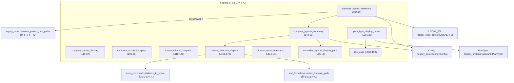
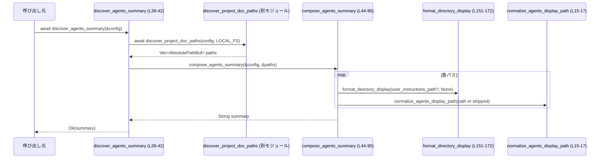

# tui/src/status/helpers.rs

## 0. ざっくり一言

TUI のステータス表示用に、モデル名・アカウント情報・トークン数・パス・タイムスタンプなどを人間が読みやすい文字列に整形するヘルパー関数群です。（tui/src/status/helpers.rs:L19-181）

---

## 1. このモジュールの役割

### 1.1 概要

- このモジュールは、**内部状態（Config・PlanType・ファイルパス等）を TUI の表示用テキストに変換する**ためのフォーマット関数を提供します。（L19-181）
- ファイルシステムに依存するエージェント（プロジェクトドキュメント）パスの発見と、その要約文字列の生成も担当します。（L39-42, L44-90）
- 表示ロジックは純粋関数として分離されており、テストで振る舞いが検証されています。（L195-291）

### 1.2 アーキテクチャ内での位置づけ

このモジュールは TUI の「ステータス表示レイヤー」に属し、コアロジックや設定情報から渡された値を整形する役割です。外部への I/O は `discover_agents_summary` 内で `discover_project_doc_paths` を介して行われます。（L39-42）



※ 呼び出し元（TUI のステータス描画コード等）はこのチャンクには現れないため不明です。

### 1.3 設計上のポイント

- **責務の分割**
  - ファイルシステムアクセスは `discover_agents_summary` のみが行い、文字列整形は `compose_agents_summary` や各フォーマッタ関数に切り出されています。（L39-42, L44-90, L98-181）
- **状態を持たない純粋関数中心**
  - すべての公開関数は引数のみを入力として取り、副作用を持たない（戻り値の生成のみ）設計です。例外は `discover_agents_summary` が非同期で FS を読む点です。（L39-42）
- **エラーハンドリング**
  - I/O を伴う関数 `discover_agents_summary` は `io::Result<String>` を返し、`?` 演算子で下位の I/O エラーを呼び出し元へ伝播します。（L39-42）
  - それ以外の関数はパニックを起こしうる操作を避けており、正常系では panic を発生させません。（L19-37, L44-181, L183-193）
- **並行性**
  - 共有可変状態は使われておらず（`static` への書き込み等も無し）、`discover_agents_summary` も `&Config` の読み取りのみのため、このモジュールの範囲ではデータ競合の要因はありません。（L39-42, L44-90）
- **表示幅への配慮**
  - パス表示には `UnicodeWidthStr::width` を用いて全角文字を含む幅を考慮し、必要に応じて中央付近で省略する `center_truncate_path` に委譲しています。（L151-172, L166-168）

---

## 2. 主要な機能一覧

- モデル設定表示の構築: `compose_model_display` がモデル名と設定エントリから、詳細情報リストを生成します。（L19-37）
- エージェント（プロジェクトドキュメント）パスの探索と要約: `discover_agents_summary` / `compose_agents_summary` が `Config` と発見されたパスから要約文字列を生成します。（L39-42, L44-90）
- アカウント表示の複製: `compose_account_display` がオプションのアカウント表示情報をクローンします。（L92-96）
- プラン種別の表示名変換: `plan_type_display_name` が `PlanType` をユーザ向けのラベルへ変換します。（L98-108）
- トークン数の compact 表記: `format_tokens_compact` が数値を `1.2K`, `3.4M` などの短縮表記に変換します。（L110-149）
- ディレクトリパス表示: `format_directory_display` がホームディレクトリ相対や幅制限付きのパス文字列を生成します。（L151-172）
- リセット時刻表示: `format_reset_timestamp` が基準日時と比較して「今日なら時刻のみ」「別日なら日付付き」で表示します。（L174-181）

### 2.1 関数・コンポーネント一覧（コンポーネントインベントリー）

#### 本番コード

| 名称 | 種別 | 公開範囲 | 概要 | 位置 |
|------|------|----------|------|------|
| `normalize_agents_display_path` | 関数 | private | エージェント用パスを `dunce::simplified` で簡略化し文字列化 | `tui/src/status/helpers.rs:L15-17` |
| `compose_model_display` | 関数 | `pub(crate)` | モデル名と key-value エントリから詳細表示用の `(名前, 詳細リスト)` を構成 | `tui/src/status/helpers.rs:L19-37` |
| `discover_agents_summary` | async 関数 | `pub(crate)` | `Config` からプロジェクトドキュメントのパスを非同期に探索し、その要約文字列を返す | `tui/src/status/helpers.rs:L39-42` |
| `compose_agents_summary` | 関数 | `pub(crate)` | `Config` とパス一覧をもとに、相対表現やホーム相対を用いた要約文字列を生成 | `tui/src/status/helpers.rs:L44-90` |
| `compose_account_display` | 関数 | `pub(crate)` | `Option<&StatusAccountDisplay>` をクローンして独立した `Option<StatusAccountDisplay>` を返す | `tui/src/status/helpers.rs:L92-96` |
| `plan_type_display_name` | 関数 | `pub(crate)` | `PlanType` を "Business" / "Enterprise" / "Pro Lite" 等の表示名にマッピング | `tui/src/status/helpers.rs:L98-108` |
| `format_tokens_compact` | 関数 | `pub(crate)` | トークン数を `K/M/B/T` 単位の短縮表記にフォーマット | `tui/src/status/helpers.rs:L110-149` |
| `format_directory_display` | 関数 | `pub(crate)` | ホーム相対・幅制限付きのディレクトリ表示文字列を生成 | `tui/src/status/helpers.rs:L151-172` |
| `format_reset_timestamp` | 関数 | `pub(crate)` | キャプチャ時刻と比較して時刻/日付付き時刻の文字列を生成 | `tui/src/status/helpers.rs:L174-181` |
| `title_case` | 関数 | private | 先頭文字のみ大文字、それ以外を ASCII 小文字にするタイトルケース変換 | `tui/src/status/helpers.rs:L183-193` |

#### テスト・補助コード（`#[cfg(test)]`）

| 名称 | 種別 | 公開範囲 | 概要 | 位置 |
|------|------|----------|------|------|
| `test_config` | async 関数 | private (tests) | テスト用に `ConfigBuilder` から `Config` を構築 | `tui/src/status/helpers.rs:L205-212` |
| `plan_type_display_name_remaps_display_labels` | テスト関数 | private (tests) | `PlanType` と表示名のマッピングを検証 | `tui/src/status/helpers.rs:L214-234` |
| `discover_agents_summary_includes_global_agents_path` | テスト関数 | private (tests) | グローバルエージェントファイルが要約に含まれることを検証 | `tui/src/status/helpers.rs:L236-248` |
| `discover_agents_summary_names_global_agents_override` | テスト関数 | private (tests) | ローカル override ファイルがグローバル設定を上書きすることを検証 | `tui/src/status/helpers.rs:L250-267` |
| `discover_agents_summary_orders_global_before_project_agents` | テスト関数 | private (tests) | グローバルエージェントがプロジェクトエージェントより先に表示される順序を検証 | `tui/src/status/helpers.rs:L269-291` |

---

## 3. 公開 API と詳細解説

### 3.1 型一覧（構造体・列挙体など）

このファイル内で **新規に定義される型はありません**。（L15-193）

他モジュールから利用している主な型:

| 名前 | 種別 | 役割 / 用途 | 根拠 |
|------|------|-------------|------|
| `Config` | 構造体 | 設定値（`codex_home`, `cwd`, `user_instructions_path` など）を保持し、パス探索に利用 | `use crate::legacy_core::config::Config;`（L2）, `config.user_instructions_path`, `config.cwd`（L46-47, L56, L59） |
| `StatusAccountDisplay` | 構造体（推定） | アカウント情報の表示用データ。`Clone` 実装がある前提で `cloned()` を利用 | `use crate::status::StatusAccountDisplay;`（L4）, `account_display.cloned()`（L95） |
| `PlanType` | enum | 課金プラン種別を表し、表示名変換に利用 | `use codex_protocol::account::PlanType;`（L9）, `plan_type_display_name`（L98-108）, テスト（L215-229） |
| `AbsolutePathBuf` | 構造体 | エージェントファイルの絶対パスを保持 | `use codex_utils_absolute_path::AbsolutePathBuf;`（L10）, `paths: &[AbsolutePathBuf]`（L44） |

### 3.2 関数詳細（主要 7 件）

#### `compose_model_display(model_name: &str, entries: &[(&str, String)]) -> (String, Vec<String>)`

**概要**

- モデル名と設定エントリ（キーと値のペア）から、ステータス表示用の「モデル名」と「詳細設定のリスト」を返します。（L19-37）
- 現在は `"reasoning effort"` と `"reasoning summaries"` の 2 種類のエントリのみを特別扱いします。（L24-33）

**引数**

| 引数名 | 型 | 説明 |
|--------|----|------|
| `model_name` | `&str` | モデルの名称。戻り値の 1 要素目としてそのまま文字列化されます。（L19-22, L36） |
| `entries` | `&[(&str, String)]` | 設定エントリの配列。キーは `&str`、値は `String` です。（L20-22） |

**戻り値**

- `(String, Vec<String>)`
  - 第 1 要素: `model_name.to_string()` の結果。（L36）
  - 第 2 要素: 詳細設定文字列（例: `"reasoning medium"`, `"summaries brief"`）を格納したベクタ。（L23-35）

**内部処理の流れ**

1. 空の `details: Vec<String>` を生成します。（L23）
2. `entries` からキー `"reasoning effort"` を持つ最初のエントリを検索し（`iter().find`）、見つかった場合は値を ASCII 小文字化して `"reasoning {value}"` として `details` に追加します。（L24-25）
3. 同様に `"reasoning summaries"` を持つエントリを検索します。（L27）
   - 値を `trim()` し（前後の空白を削除）、大文字小文字を無視して `"none"` または `"off"` の場合は `"summaries off"` を追加します。（L28-30）
   - それ以外で非空文字列の場合は、小文字化して `"summaries {value}"` を追加します。（L31-32）
4. 最後に `(model_name.to_string(), details)` を返します。（L36）

**Examples（使用例）**

```rust
// モデル設定エントリを用意する
let entries = vec![
    ("reasoning effort", "High".to_string()),
    ("reasoning summaries", "Brief".to_string()),
];

// 表示用のモデル名と詳細を取得
let (name, details) = compose_model_display("gpt-4.1", &entries);

// name == "gpt-4.1"
// details == ["reasoning high", "summaries brief"]
```

**Errors / Panics**

- この関数は `Result` を返さず、内部で panic を起こしうる操作も行っていません（インデックスアクセスなどは無し）。（L23-36）

**Edge cases（エッジケース）**

- 対象キーが存在しない場合: `details` は空のまま返されます。（L24, L27）
- `"reasoning summaries"` の値が `"none"`, `"off"`（大文字小文字無視）または空白だけの場合:
  - `"none"` / `"off"` → `"summaries off"` を 1 要素追加。（L28-30）
  - 空文字列（トリム後） → 何も追加されません。（L28, L31-32）
- 同じキーが複数存在する場合: `.find()` により **最初の 1 件のみ** 使用されます。（L24, L27）

**使用上の注意点**

- `entries` に他のキーを追加しても現状無視されます。新しいキーに基づく表示を行いたい場合は、この関数の条件分岐を拡張する必要があります。（L24-33）
- 文字列処理は ASCII のみ小文字化しており、非 ASCII 文字はケース変換されません。（`to_ascii_lowercase` 使用, L25, L32）

---

#### `discover_agents_summary(config: &Config) -> io::Result<String>`

**概要**

- 非同期にプロジェクトドキュメント（エージェント）ファイルのパス一覧を取得し、それを `compose_agents_summary` で表示用の要約文字列に変換します。（L39-42）
- ファイルシステムおよび設定に依存するため、`io::Result` で I/O エラーを呼び出し元に返します。（L39-41）

**引数**

| 引数名 | 型 | 説明 |
|--------|----|------|
| `config` | `&Config` | プロジェクト設定。`discover_project_doc_paths` や `compose_agents_summary` に渡されます。（L39-41） |

**戻り値**

- `io::Result<String>`
  - `Ok(summary)`: エージェントファイルの要約文字列（例: `"~/codex/docs.md, ../project/docs.md"`）。（L41）
  - `Err(e)`: プロジェクトドキュメント探索中に発生した I/O エラーなど。（L40-41）

**内部処理の流れ**

1. `discover_project_doc_paths(config, LOCAL_FS.as_ref()).await?` を呼び、非同期にエージェントファイルの絶対パス一覧を取得します。（L40）
   - `LOCAL_FS` は `codex_exec_server` からインポートされたローカルファイルシステム実装です。（L8）
   - `?` により、失敗時にはここで早期リターンし `Err` をそのまま呼び出し元に伝播します。（L40）
2. 取得した `paths` と `config` を `compose_agents_summary(config, &paths)` に渡し、表示用の文字列を作成します。（L41）
3. `Ok(summary)` として返します。（L41）

**Examples（使用例）**

```rust
// 非同期コンテキスト（tokio など）内での使用例
async fn show_agents(config: &Config) -> io::Result<()> {
    let summary = discover_agents_summary(config).await?; // I/O エラーはここで?により伝播
    println!("Agents: {summary}");
    Ok(())
}
```

**Errors / Panics**

- `discover_project_doc_paths` から返されるエラー（`io::Error` など）がそのまま `Err` として返ります。（L40-41）
- 関数本体では panic を起こしうる操作を行っていません。

**並行性（Concurrency）**

- 関数は `&Config` とローカル変数のみを扱うため、この関数自体はスレッドセーフに扱える設計です。（L39-41）
- ただし、`LOCAL_FS` や `discover_project_doc_paths` のスレッドセーフ性はこのチャンクには現れないため不明です。

**Edge cases**

- エージェントファイルが存在しない場合の挙動は `discover_project_doc_paths` の実装に依存し、このチャンクからは分かりません。ただし後続の `compose_agents_summary` はパス配列が空の場合 `"<none>"` を返すため、最終的な表示は `"<none>"` になりえます。（L44-90）

**使用上の注意点**

- 非同期関数のため、`tokio` などの非同期ランタイム内で `.await` して利用する必要があります。（L39）
- I/O エラーをそのまま伝播するため、呼び出し側で `Result` を適切に処理する必要があります（リトライ・エラーメッセージ表示など）。

---

#### `compose_agents_summary(config: &Config, paths: &[AbsolutePathBuf]) -> String`

**概要**

- `Config` と、事前に探索されたエージェントファイルの絶対パス一覧をもとに、ユーザに見やすいエージェントパスの要約文字列を生成します。（L44-90）
- ホームディレクトリ相対表現やカレントディレクトリとの相対パスを用いて、なるべく短く分かりやすい表示を目指しています。（L46-83）

**引数**

| 引数名 | 型 | 説明 |
|--------|----|------|
| `config` | `&Config` | `cwd` や `user_instructions_path` を参照して表示パスを決定するために使用します。（L46-47, L56-59） |
| `paths` | `&[AbsolutePathBuf]` | すでに探索済みのエージェントファイルの絶対パス一覧。（L44, L50） |

**戻り値**

- `String`: エージェントファイルの表示名を `", "` 区切りで連結した文字列。要素が 1 つも無い場合は `"<none>"`。（L85-89）

**内部処理の流れ**

1. 空の `rels: Vec<String>` を用意します。（L45）
2. `config.user_instructions_path` が設定されていれば、そのパスを `format_directory_display(path, None)` で文字列化し `rels` に追加します。（L46-48）
3. `paths` の各要素 `p` に対してループし、次のように表示文字列 `display` を決定します。（L50-82）
   1. `file_name` を `p.file_name()` から取得し、`OsStr` を lossy に `String` へ変換。取得できない場合は `"<unknown>"` を用います。（L51-54）
   2. `p.parent()` が存在する場合:
      - `parent == config.cwd` のときは `file_name` のみ（カレントディレクトリ直下のファイル）。（L55-58）
      - それ以外の場合、`config.cwd` の親方向へたどって `parent` に到達するまで `ups` をカウントすることで `../` を何回付加するか決定します。（L59-69）
        - 到達できた (`reached == true`) 場合: `"../"` を `ups` 回繰り返し、末尾に `file_name` を付けて表示します（例: `"../docs.md"`）。 （L70-73）
        - 到達できず、かつ `p.strip_prefix(&config.cwd)` が成功する場合: `config.cwd` からの相対パスを `normalize_agents_display_path` で整形して表示します。（L73-75）
        - いずれでもない場合: `normalize_agents_display_path(p)` を用いて絶対パスを簡略化して表示します。（L75-77）
   3. 親ディレクトリが存在しない場合（ルート等）は `normalize_agents_display_path(p)` を用います。（L79-81）
   4. 得られた `display` を `rels` に追加します。（L82）
4. 最後に `rels` が空なら `"<none>"` を返し、そうでなければ `", "` で join した文字列を返します。（L85-89）

**Examples（使用例）**

```rust
// 仮の Config とパス一覧（実際には discover_project_doc_paths の結果を渡す）
let config: Config = /* 既存コードで構築 */;
let paths: Vec<AbsolutePathBuf> = vec![
    /* 例: /home/user/project/.codex/project.md など */
];

let summary = compose_agents_summary(&config, &paths);
// 例: "~/project/.codex/project.md, ../global.md" のような文字列
println!("Agents: {summary}");
```

**Errors / Panics**

- この関数は `Result` を返さず、内部でも panic を発生させる可能性のある操作は行っていません。（L44-90）
- パス操作はすべて `Option` や `Result` を通じて安全に扱っています（`file_name()`, `parent()`, `strip_prefix()` など）。失敗時はフォールバックの表示に切り替わります。（L51-54, L55-81）

**Edge cases**

- `paths` が空かつ `user_instructions_path` も `None` の場合: `rels` は空で、戻り値は `"<none>"` になります。（L45-47, L85-87）
- `p.file_name()` が `None` の場合: `" <unknown>"` というファイル名で表示されます。（L51-54）
- `config.cwd` がパス `p` の祖先ディレクトリである場合:
  - `p` が `cwd` 直下 → ファイル名のみ。（L55-58）
  - それ以外の子孫 → `p.strip_prefix(&config.cwd)` により相対パス表示。（L73-75）
- `parent` が `cwd` より上位のディレクトリにある場合（例: `p` が `cwd` の親の配下）:
  - 祖先探索で `reached == true` となり、`"../"` を複数回付与した表示になります。（L59-73）
- OS に依存するセパレータ:
  - `std::path::MAIN_SEPARATOR` を用いているため、Windows では `\`, Unix では `/` が使用されます。（L71）

**使用上の注意点**

- 表示の短さ・分かりやすさを優先するため、実際のファイルシステム上の相対パスとは異なる形式になる可能性があります（`dunce::simplified` の挙動などはこのチャンクでは不明）。（L15-17, L71-77）
- パスの順序は `user_instructions_path`（あれば先頭）→ `paths` の順に保たれます。テストから、グローバルエージェントがプロジェクトエージェントより前に来ることが確認されています。（L46-48, L50-83, L269-291）

---

#### `plan_type_display_name(plan_type: PlanType) -> String`

**概要**

- 内部の課金プラン識別子 `PlanType` を、ユーザ向けの表示ラベルにマッピングします。（L98-108）
- 一部のプランはまとめて "Business" や "Enterprise" と表示されます。（L99-103）

**引数**

| 引数名 | 型 | 説明 |
|--------|----|------|
| `plan_type` | `PlanType` | 課金プラン種別を表す enum 値。（L98） |

**戻り値**

- `String`: 表示用のプラン名（例: `"Free"`, `"Pro Lite"`, `"Business"`, `"Enterprise"`）。 （L99-107）

**内部処理の流れ**

1. `plan_type.is_team_like()` が真なら `"Business"` を返します。（L99-100）
2. それ以外で `plan_type.is_business_like()` が真なら `"Enterprise"` を返します。（L101-102）
3. さらに `plan_type == PlanType::ProLite` の場合は `"Pro Lite"` を返します。（L103-104）
4. 上記どれにも当てはまらない場合は `format!("{plan_type:?}")` でデバッグ表現を取得し、それを `title_case()` に渡してタイトルケース化した結果を返します。（L105-107, L183-193）

**Examples（使用例）**

```rust
use codex_protocol::account::PlanType;

assert_eq!(plan_type_display_name(PlanType::Free), "Free");
assert_eq!(plan_type_display_name(PlanType::Team), "Business");
assert_eq!(plan_type_display_name(PlanType::Business), "Enterprise");
assert_eq!(plan_type_display_name(PlanType::ProLite), "Pro Lite");
```

上記はテストでも検証されています。（L215-233）

**Errors / Panics**

- エラーも panic も発生しない純粋関数です。（L98-108）

**Edge cases**

- 未知のプラン種別が追加された場合:
  - その `PlanType` に対する `Debug` 表現（例: `"NewPlan"`）をタイトルケースにした文字列（例: `"Newplan"`）が返されます。（L105-107, L183-193）
- 既存の `PlanType::Unknown` に対しては、テストから `"Unknown"` が返ることが確認されています。（L228-229, L231-233）

**使用上の注意点**

- 表示ラベルをユーザ指向で変更したい場合（例: "Business" を "Team" と表示したい）は、この関数を変更する必要があります。
- `is_team_like` / `is_business_like` の実装（どのプランを含むか）はこのチャンクには現れないため、挙動を変えたい場合は `PlanType` の定義側も確認する必要があります。（L99-102）

---

#### `format_tokens_compact(value: i64) -> String`

**概要**

- トークン数を `K`, `M`, `B`, `T` の単位を用いた短縮表記に変換する関数です。（L110-149）
- 例: 1,234 → `"1.23K"`, 1_000_000 → `"1M"` のような表示になります。（挙動はコードから推測, L119-148）

**引数**

| 引数名 | 型 | 説明 |
|--------|----|------|
| `value` | `i64` | トークン数。負値の場合は 0 として扱われます。（L110-112） |

**戻り値**

- `String`: 短縮表記されたトークン数の文字列。（L112-117, L148）

**内部処理の流れ**

1. `value.max(0)` により負値は 0 に切り上げます。（L111）
2. 0 の場合は `"0"` を返します。（L112-114）
3. 1,000 未満の場合は整数をそのまま文字列化して返します。（L115-117）
4. それ以外の場合は `f64` に変換し、次のルールでスケーリングします。（L119-128）
   - `>= 1_000_000_000_000` → 値 / 1e12, suffix `"T"`。（L120-121）
   - `>= 1_000_000_000` → 値 / 1e9, suffix `"B"`。（L122-123）
   - `>= 1_000_000` → 値 / 1e6, suffix `"M"`。（L124-125）
   - それ以外（>=1_000） → 値 / 1e3, suffix `"K"`。（L126-127）
5. 小数点以下の桁数はスケーリング後の値に応じて決定されます。（L130-136）
   - `< 10.0` → 2 桁
   - `< 100.0` → 1 桁
   - その他 → 0 桁
6. `format!("{scaled:.decimals$}")` で小数桁数に応じた文字列を生成し、末尾の 0 と `.` を除去します。（L138-146）
7. 最後に suffix を連結して返します。（L148）

**Examples（使用例）**

```rust
assert_eq!(format_tokens_compact(0), "0");
assert_eq!(format_tokens_compact(999), "999");
assert_eq!(format_tokens_compact(1_200), "1.2K");
assert_eq!(format_tokens_compact(1_250_000), "1.25M");
assert_eq!(format_tokens_compact(-100), "0"); // 負値は0として扱われる
```

**Errors / Panics**

- 浮動小数点へのキャストと文字列整形のみを行っており、通常の入力で panic は発生しません。（L119-148）

**Edge cases**

- 非常に大きな値（`i64::MAX` 等）の場合:
  - `f64` への変換時に丸め誤差が生じる可能性がありますが、短縮表記という用途上、許容されていると解釈できます。（L119-128）
- 999_999 のような境界付近:
  - `999_999 / 1000.0 ≈ 999.999` → 小数桁 0 → `"1000K"` となり、1M に「切り上がる」ことがあります。（L119-136）

**使用上の注意点**

- 単位変換は 1000 ベースで行われており、2 進ベース（1024）ではない点に注意が必要です。（L119-128）
- 厳密な値よりも概算表示を目的としているため、丸め誤差や境界値での変換について許容できる UI 向けに利用するのが前提と考えられます。

---

#### `format_directory_display(directory: &Path, max_width: Option<usize>) -> String`

**概要**

- ディレクトリパスをホームディレクトリ相対（`~`）表記とし、必要なら表示幅を制限した文字列に変換します。（L151-172）
- 幅制限時には、全角文字を含む文字幅を `UnicodeWidthStr::width` で計算し、`center_truncate_path` で中央を省略します。（L162-168）

**引数**

| 引数名 | 型 | 説明 |
|--------|----|------|
| `directory` | `&Path` | 表示対象のディレクトリパス。（L151） |
| `max_width` | `Option<usize>` | 表示幅の最大値（文字幅）。`None` の場合は制限なし。0 の場合は空文字列を返します。（L151, L162-165） |

**戻り値**

- `String`: 整形されたパス文字列。（L151-160, L162-171）

**内部処理の流れ**

1. `relativize_to_home(directory)` を呼び出し、自分のホームディレクトリからの相対パスを取得しようとします。（L151-153）
   - `Some(rel)` の場合:
     - `rel` が空（ホームディレクトリ自体）のときは `"~"` を返します。（L153-155）
     - それ以外は `"~/<rel>"` 形式で返します（セパレータは OS 依存）。 （L155-157）
   - `None` の場合は、`directory.display().to_string()` をそのまま使用します。（L158-160）
2. `max_width` が `Some(width)` の場合は幅制限処理を行います。（L162-169）
   - `width == 0` → 空文字列を返します。（L163-165）
   - そうでなければ `UnicodeWidthStr::width(&formatted)` を計算し、`width` を超えていれば `text_formatting::center_truncate_path(&formatted, width)` でトリミングします。（L166-168）
3. 制限不要または制限内なら、先ほどの `formatted` をそのまま返します。（L170-171）

**Examples（使用例）**

```rust
use std::path::Path;

let home_docs = Path::new("/home/user/docs");
let s = format_directory_display(home_docs, Some(10));
// 例: "~/docs" など。長い場合は中央付近が "…"(実装依存) で省略される可能性あり。

let s2 = format_directory_display(home_docs, Some(0));
// s2 == ""
```

**Errors / Panics**

- `relativize_to_home` と `center_truncate_path` の実装によりますが、この関数内では `unwrap` 等を使用していないため、直接の panic 要因は見当たりません。（L151-172）

**Edge cases**

- `max_width == 0` の場合: どのような `directory` であっても空文字列を返します。（L163-165）
- `relativize_to_home` が `None` を返す場合:
  - ホーム外のパスなどは絶対パス表示になります。（L158-160）
- 非 UTF-8 パス要素:
  - `display()` を使用しているため、プラットフォーム依存の文字列化が行われますが、詳細は標準ライブラリに依存します。（L158-160）

**使用上の注意点**

- 表示幅は `UnicodeWidthStr::width` に基づくため、全角文字を含むパスでも視覚的な幅をある程度反映できますが、フォントによる差異などは考慮されません。（L166-168）
- 別の UI コンポーネントと幅を合わせる場合は、同じ `max_width` 設定を共有する必要があります。

---

#### `format_reset_timestamp(dt: DateTime<Local>, captured_at: DateTime<Local>) -> String`

**概要**

- `dt` が `captured_at` と同じ日であれば `HH:MM` 形式、異なる日であれば `HH:MM on d Mon` 形式の文字列を返します。（L174-181）

**引数**

| 引数名 | 型 | 説明 |
|--------|----|------|
| `dt` | `DateTime<Local>` | 表示対象の時刻。（L174-175） |
| `captured_at` | `DateTime<Local>` | 比較対象の基準時刻（通常は「現在のステータスを取得した時刻」）。（L174, L176） |

**戻り値**

- `String`: 時刻のみまたは日付付き時刻の文字列。（L175, L177-180）

**内部処理の流れ**

1. `time = dt.format("%H:%M").to_string()` でローカル時刻の時刻部分を `HH:MM` 形式に変換します。（L175）
2. `dt.date_naive() == captured_at.date_naive()` を比較し、同じ日であれば `time` をそのまま返します。（L176-177）
3. 異なる日であれば、`"{time} on {%-d %b}"` 形式で日付を付加した文字列を返します。（L179-180）

**Examples（使用例）**

```rust
use chrono::{Local, TimeZone};

let captured_at = Local.ymd(2024, 5, 10).and_hms(12, 0, 0);
let same_day = Local.ymd(2024, 5, 10).and_hms(18, 30, 0);
let diff_day = Local.ymd(2024, 5, 11).and_hms(9, 15, 0);

assert_eq!(format_reset_timestamp(same_day, captured_at), "18:30");
let s = format_reset_timestamp(diff_day, captured_at);
// 例: "09:15 on 11 May"（ロケールはフォーマット指定に依存）
```

**Errors / Panics**

- `chrono` のフォーマット機能のみを使用しており、通常の範囲の日時であればエラー・panic は発生しません。（L175-180）

**Edge cases**

- タイムゾーンは `Local` 固定のため、UTC との比較などを行いたい場合は呼び出し側で変換する必要があります。（L174）
- `dt` と `captured_at` が異なるタイムゾーンから変換されている場合でも、両者とも `Local` であれば日付比較はローカルタイム基準です。（L176）

**使用上の注意点**

- 日付表記のフォーマット（`"%-d %b"`）は英語月名ベース (`Jan`, `Feb`, …) になっているため、ローカライズを行いたい場合はこの関数のフォーマット文字列を変更する必要があります。（L179-180）

---

### 3.3 その他の関数

| 関数名 | 役割（1 行） | 位置 |
|--------|--------------|------|
| `normalize_agents_display_path(path: &Path) -> String` | `dunce::simplified(path)` を通したパスの表示文字列を返す簡易ラッパー | `tui/src/status/helpers.rs:L15-17` |
| `compose_account_display(account_display: Option<&StatusAccountDisplay>) -> Option<StatusAccountDisplay>` | `Option<&T>` を `Option<T>` にクローンするシンプルなヘルパー | `tui/src/status/helpers.rs:L92-96` |
| `title_case(s: &str) -> String` | 先頭文字を大文字、それ以外を ASCII 小文字にするタイトルケース変換 | `tui/src/status/helpers.rs:L183-193` |

---

## 4. データフロー

ここでは、エージェント要約文字列を取得する典型的なフローを示します。

1. 呼び出し元から `discover_agents_summary(&config).await` が呼ばれます。（L39-42）
2. `discover_project_doc_paths(config, LOCAL_FS.as_ref())` が呼び出され、エージェントファイルの `AbsolutePathBuf` リストが返されます。（L40）
3. `compose_agents_summary(config, &paths)` が呼ばれ、`format_directory_display` や `normalize_agents_display_path` を通じてパスが整形されます。（L41, L44-90, L151-172, L15-17）
4. 最終的な `String` が `Ok(...)` として呼び出し元に返ります。（L41）



※ `discover_project_doc_paths` や `LOCAL_FS` の実装はこのチャンクには現れないため、内部のファイル探索ロジックは不明です。

---

## 5. 使い方（How to Use）

### 5.1 基本的な使用方法

ステータスビューでエージェント情報とモデル設定を表示する例です。

```rust
use std::io;
use crate::legacy_core::config::Config;
use crate::status::StatusAccountDisplay;
use crate::tui::status::helpers::{
    discover_agents_summary,
    compose_model_display,
    plan_type_display_name,
    format_tokens_compact,
};

async fn render_status(config: &Config, account: Option<&StatusAccountDisplay>) -> io::Result<()> {
    // エージェント要約
    let agents = discover_agents_summary(config).await?; // I/O エラーは?で上位に伝播

    // モデル設定表示（例として固定値を使用）
    let (model_name, model_details) = compose_model_display(
        "gpt-4.1",
        &[
            ("reasoning effort", "Medium".to_string()),
            ("reasoning summaries", "Brief".to_string()),
        ],
    );

    // プラン表示
    // let plan_type = account.as_ref().map(|a| a.plan_type).unwrap_or(PlanType::Free);
    // 仮に PlanType::Free とする
    let plan_label = plan_type_display_name(codex_protocol::account::PlanType::Free);

    // トークン数表示
    let tokens_str = format_tokens_compact(125_000);

    println!("Model: {} ({})", model_name, model_details.join(", "));
    println!("Plan: {plan_label}");
    println!("Agents: {agents}");
    println!("Tokens used: {tokens_str}");

    Ok(())
}
```

### 5.2 よくある使用パターン

- **TUI のステータスバー表示**
  - `discover_agents_summary` で要約を取得し、`format_directory_display` の幅制限付き表示を使い回すことで、狭いステータスバーに情報を収めることができます。（L39-42, L151-172）
- **設定パネルでのプラン表示**
  - `plan_type_display_name` を用いてプラン名を一貫したラベルで表示します。（L98-108）

### 5.3 よくある間違い（想定）

```rust
// 間違い例: 非同期関数を同期コンテキストで直接呼び出している
// let summary = discover_agents_summary(&config); // コンパイルエラー: Future が返る

// 正しい例: 非同期ランタイム内で .await する
#[tokio::main]
async fn main() -> std::io::Result<()> {
    let config: Config = /* 構築 */;
    let summary = discover_agents_summary(&config).await?;
    println!("{summary}");
    Ok(())
}
```

```rust
// 間違い例: max_width=0 を意図せず指定し、パスが表示されない
let s = format_directory_display(Path::new("/home/user"), Some(0));
// s == ""

// 正しい例: 最低でも1以上の幅を指定する
let s = format_directory_display(Path::new("/home/user"), Some(20));
```

### 5.4 使用上の注意点（まとめ）

- **エラー処理**
  - `discover_agents_summary` は I/O エラーを `io::Result` として返すため、呼び出し側で必ず `Result` を処理する必要があります。（L39-42）
- **並行性**
  - このモジュールの関数は共有可変状態にアクセスせず、`Config` への参照読み取りのみであるため、複数タスクから同時に呼び出してもこの関数群の範囲では競合は発生しません。（L39-90）
- **表示ロジックの前提**
  - `compose_agents_summary` および `format_directory_display` は、表示の簡潔さと可読性を優先しており、常に実ファイルシステムの相対パスと一致するとは限りません。（L44-90, L151-172）
- **ロケール依存**
  - `format_reset_timestamp` の日付表記は英語の略称月名に固定されており、ローカライズが必要な場合は変更が必要です。（L179-180）

---

## 6. 変更の仕方（How to Modify）

### 6.1 新しい機能を追加する場合

例: モデル詳細に `"max tokens"` の情報を追加したい場合。

1. **エントリの扱いを追加**
   - `compose_model_display` 内で `"max tokens"` キーを検索し、`details` に `"max {value} tokens"` といった文字列を追加するロジックを追加します。（変更箇所: L24-33 付近）
2. **テストの追加**
   - `#[cfg(test)] mod tests` に、新しいキーを含む `entries` を渡したときの期待出力を検証するテストを追加します。（L195-234 付近）

例: エージェント要約にファイル数のみを表示する関数を追加したい場合。

1. `compose_agents_summary` のロジックを再利用するか、`paths.len()` を用いる新しい関数 `compose_agents_count_summary(config, paths)` をこのファイルに追加します。（L44-90 のデータを参照）

### 6.2 既存の機能を変更する場合

- **影響範囲の確認**
  - `plan_type_display_name` を変更する場合:
    - 既存テスト `plan_type_display_name_remaps_display_labels`（L214-234）を確認・更新します。
    - 他モジュールでこの関数の戻り値をハードコードされた文字列と比較していないか確認する必要があります（このチャンクには現れないため、別ファイル検索が必要）。
  - `compose_agents_summary` の表示形式を変える場合:
    - エージェント関連のテスト 3 つ（L236-291）が影響を受けるため、期待値を更新するか、新しい仕様に沿ったテストを追加します。

- **前提条件・契約の維持**
  - `compose_agents_summary` は「パスが無ければ `"<none>"` を返す」という契約を暗黙的に持っています（L85-87）。この値に依存する呼び出し元がいる可能性があるため、変更する場合は慎重に検討する必要があります。
  - `format_tokens_compact` は 1000 ベースでの単位変換を行っています（L119-128）。ここを 1024 ベースに変えると UI の印象が変わるため、仕様変更として扱う必要があります。

- **テストの再確認**
  - 既存のテスト（L214-291）を必ず実行し、失敗した場合は新しい仕様に合わせて期待値を更新する必要があります。

---

## 7. 関連ファイル

このモジュールと密接に関係するモジュール・シンボルは以下のとおりです。

| パス / モジュール | 役割 / 関係 | 根拠 |
|-------------------|------------|------|
| `crate::exec_command::relativize_to_home` | パスをホームディレクトリ相対の `PathBuf` に変換するユーティリティ。`format_directory_display` から呼び出されます。 | `use crate::exec_command::relativize_to_home;`（L1）, `relativize_to_home(directory)`（L151-153） |
| `crate::legacy_core::config::Config` | 設定値（`codex_home`, `cwd`, `user_instructions_path` 等）を提供し、エージェントパス探索と表示に利用されます。 | `use crate::legacy_core::config::Config;`（L2）, `config.user_instructions_path`, `config.cwd`（L46-47, L56, L59） |
| `crate::legacy_core::discover_project_doc_paths` | プロジェクトドキュメント（エージェントファイル）のパス一覧を非同期に探索する関数。 | `use crate::legacy_core::discover_project_doc_paths;`（L3）, `discover_project_doc_paths(config, LOCAL_FS.as_ref()).await?`（L40） |
| `codex_exec_server::LOCAL_FS` | ローカルファイルシステム実装。`discover_project_doc_paths` の引数として使用されます。 | `use codex_exec_server::LOCAL_FS;`（L8）, `LOCAL_FS.as_ref()`（L40） |
| `crate::status::StatusAccountDisplay` | アカウント情報の表示用構造体。`compose_account_display` の引数・戻り値として使用。 | `use crate::status::StatusAccountDisplay;`（L4）, `Option<&StatusAccountDisplay>`（L93） |
| `crate::text_formatting` | パスの中央省略などの文字列フォーマットユーティリティを提供。 | `use crate::text_formatting;`（L5）, `text_formatting::center_truncate_path`（L167-168） |
| `codex_protocol::account::PlanType` | 課金プランを表す enum。`plan_type_display_name` の入力として使用。 | `use codex_protocol::account::PlanType;`（L9）, `PlanType` 利用（L98-108, L215-229） |
| `crate::legacy_core::DEFAULT_PROJECT_DOC_FILENAME` / `LOCAL_PROJECT_DOC_FILENAME` | デフォルト/ローカルのプロジェクトドキュメントファイル名。テストでエージェントパスの挙動検証に使用されています。 | `use crate::legacy_core::DEFAULT_PROJECT_DOC_FILENAME;`（L198）, `LOCAL_PROJECT_DOC_FILENAME;`（L199）, テスト（L236-291） |

---

### Bugs / Security（このチャンクから読み取れる範囲）

- 現時点で明確なバグは読み取れませんが、以下の仕様は注意点として挙げられます（いずれも仕様かどうかは外部設計次第です）。
  - `format_tokens_compact` の境界値（例: 999,999 → "1000K"）が意図通りかは仕様を確認する必要があります。（L119-136）
  - パス表示に `to_string_lossy`（間接的に `display()` 経由）を用いているため、非 UTF-8 パスは代替文字に置き換えられる可能性がありますが、これは通常の挙動です。（L51-54, L158-160）
- セキュリティ上、このモジュールはパスやプラン名を **表示するだけ** であり、外部入力を直接実行するような処理はありません。そのため、このファイル単体から重大なセキュリティリスクは読み取れません。
