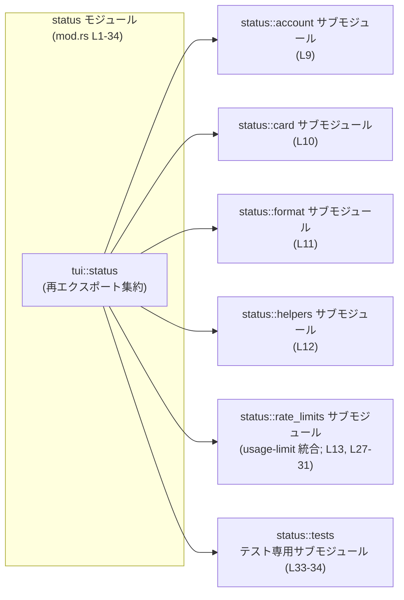

# tui/src/status/mod.rs コード解説

## 0. ざっくり一言

このモジュールは、TUI の `/status` 画面やフッターに表示する状態情報のために、**プロトコルレベルのスナップショットを「表示用の安定した構造」に変換するサブモジュール群の入口**となる集約モジュールです（根拠: `tui/src/status/mod.rs:L1-8`）。

---

## 1. このモジュールの役割

### 1.1 概要

- モジュールコメントによると、このモジュールは **プロトコルレベルのスナップショットを、TUI `/status` 出力やフッター／ステータスライン用の安定した表示構造に変換する役割**を持ちます（`L1-5`）。
- 実際の処理ロジックやデータ構造は `account`, `card`, `format`, `helpers`, `rate_limits` サブモジュールに分割されており、本ファイルはそれらを `pub(crate) use` で再エクスポートして **「ステータス表示用 API の窓口」**を提供しています（`L9-13`, `L15-31`）。
- コメントによると、`rate_limits` サブモジュールは使用量制限（usage-limit）のステータスライン表示に関する **主な統合ポイント**であり、「ウィンドウスナップショットをローカル時間ラベルに変換し、データの有無／陳腐化／欠損を分類する」処理を担うと説明されています（`L7-8`）。

### 1.2 アーキテクチャ内での位置づけ

このモジュールは、ざっくり言うと次の位置づけになります（コードから読み取れる範囲）。

- 上流: 「トランスポート向けコード」から渡される **プロトコルレベルのスナップショット**（コメント中の表現）を受け取る側にあります（`L3-4`）。
- 中央: `account`, `card`, `helpers`, `rate_limits` などのサブモジュールがそれぞれの責務（アカウント表示、履歴カード、ヘルパー関数、レート制限表示など）を担い、本ファイルはその窓口です（`L9-13`, `L15-31`）。
- 下流: 変換された「安定した表示構造」は `/status` 出力やフッター／ステータスラインのヘルパから利用されます（`L3-5`）。

モジュール間の依存関係（このチャンクから読み取れる範囲）を図示すると次のようになります。



> 実際のファイル名（`account.rs` / `account/mod.rs` 等）や他モジュールとの関係は、このチャンクには現れないため不明です。

### 1.3 設計上のポイント

コードから読み取れる設計上の特徴は次のとおりです。

- **責務ごとのサブモジュール分割**  
  - `account`, `card`, `format`, `helpers`, `rate_limits` といったモジュールに責務が分割され、本ファイルはそれらを束ねています（`L9-13`）。
- **表示ロジックとトランスポート層の分離**  
  - コメントで「レンダリングの関心事をトランスポート向けコードから切り離す」と明示されており、表示のための整形や分類はこの `status` 階層で完結させる設計になっています（`L3-5`）。
- **crate 内部向け API としての公開範囲**  
  - すべての再エクスポートが `pub(crate)` で定義されており、この API は **同一 crate 内だけから利用される内部 API** であることが分かります（`L15-31`）。
- **テスト専用ヘルパの明示的な再エクスポート**  
  - `#[cfg(test)]` 付きの `pub(crate) use` が複数あり、テストコードから使うためのビルダー／ヘルパが `card` や `rate_limits` から再エクスポートされています（`L17-22`, `L29-30`, `L33-34`）。
- **このファイル自身にはビジネスロジックが存在しない**  
  - 関数定義や構造体定義はなく、モジュール宣言と `use` しかないため、**エラー処理・並行性・所有権管理などのコアなロジックはすべてサブモジュール側にあります**（`L9-13`, `L15-31`）。

エラー処理・並行処理・セキュリティ上の注意点についても、このファイル単体には該当するロジックが存在しないため、本チャンクからは何も読み取れません。

---

## 2. 主要な機能一覧（コンポーネントインベントリー）

このファイルで再エクスポートされている主なコンポーネント（型／関数）は次のとおりです。

- `StatusAccountDisplay`（`account` 由来）  
  - アカウントのステータス表示用コンポーネント（名称と doc コメントからの推測を含む）。  
  - 根拠: `pub(crate) use account::StatusAccountDisplay;`（`L15`）
- `StatusHistoryHandle`（`card` 由来）  
  - ステータス履歴表示と関わるハンドル的コンポーネントと推測されます。  
  - 根拠: `pub(crate) use card::StatusHistoryHandle;`（`L16`）
- `RateLimitSnapshotDisplay`, `RateLimitWindowDisplay`（`rate_limits` 由来）  
  - 使用量制限（レートリミット）情報のスナップショット／ウィンドウを表示するための構造（doc コメントより「usage-limit items」の表示に関連）（`L7-8`, `L27-28`）。
- ヘルパ関数群（`helpers` 由来）
  - `discover_agents_summary`（`L23`）  
  - `format_directory_display`（`L24`）  
  - `format_tokens_compact`（`L25`）  
  - `plan_type_display_name`（`L26`）  
  → いずれも表示用の文字列整形やサマリ生成に関わるヘルパと推測されますが、シグネチャや詳細はこのチャンクには現れません。
- テスト用ヘルパ（`card`, `rate_limits` 由来）
  - `new_status_output`（`L17-18`）  
  - `new_status_output_with_rate_limits`（`L19-20`）  
  - `new_status_output_with_rate_limits_handle`（`L21-22`）  
  - `rate_limit_snapshot_display`（`L29-30`）  
  → いずれも `#[cfg(test)]` 付きで再エクスポートされており、テストコードから利用されるビルダ／コンストラクタと考えられます。

> これらコンポーネントの**定義本体・シグネチャ・内部処理**はすべてサブモジュール側にあり、このチャンクだけでは確認できません。

---

## 3. 公開 API と詳細解説

### 3.1 型一覧（構造体・列挙体など）

このファイルに実体定義はありませんが、命名規則（CamelCase）から「型」である可能性が高い公開アイテムを整理します。種別はあくまで推測が含まれるため、その旨を明記します。

| 名前 | 種別（推定を含む） | 役割 / 用途（このチャンクから分かる範囲） | 根拠 |
|------|--------------------|-------------------------------------------|------|
| `StatusAccountDisplay` | 不明（CamelCase 名のため型である可能性が高い） | アカウントに関するステータス情報を表示するための構造であると考えられます。モジュールの説明「status output formatting and display adapters」（`L1-5`）と、`account` サブモジュールからの再エクスポート（`L15`）に基づく推測です。 | `tui/src/status/mod.rs:L1-5,15` |
| `StatusHistoryHandle` | 不明（同上） | ステータス履歴（history）に関わる表示や管理を行うハンドル的な型である可能性がありますが、詳細は不明です。`card` サブモジュールからの再エクスポートのみ確認できます。 | `tui/src/status/mod.rs:L10,16` |
| `RateLimitSnapshotDisplay` | 不明（同上） | usage-limit に関連するスナップショットの表示用構造であると読み取れます。モジュールコメント「`rate_limits` is the main integration point for status-line usage-limit items」（`L7-8`）と再エクスポート（`L27`）による推測です。 | `tui/src/status/mod.rs:L7-8,13,27` |
| `RateLimitWindowDisplay` | 不明（同上） | usage-limit のウィンドウ単位（一定期間）を表示するための構造であると考えられますが、具体的なフィールドや振る舞いは不明です。 | `tui/src/status/mod.rs:L7-8,13,28` |

> 種別（構造体 / 列挙体 / トレイトなど）は、このチャンク内には現れないため**断定できません**。

### 3.2 関数詳細（テンプレート適用可能性について）

この `mod.rs` には**関数定義が存在せず**、`helpers` や `card`, `rate_limits` などのサブモジュールからの再エクスポートのみが記述されています（`L15-31`）。  
したがって、関数シグネチャ（引数・戻り値）や具体的なアルゴリズムをこのチャンクから読み取ることはできません。

代表として `discover_agents_summary` について、テンプレートを最低限の形で適用しておきます。

#### `discover_agents_summary(...)`

**概要**

- `helpers` サブモジュールから再エクスポートされているヘルパです（`L12`, `L23`）。
- 名前からは「エージェントのサマリを発見／生成する」処理が想像されますが、**処理内容・入力・出力はこのチャンクには現れません**。

**引数**

| 引数名 | 型 | 説明 |
|--------|----|------|
| （不明） | （不明） | 関数の定義が別ファイルにあり、このチャンクからは引数情報を取得できません。 |

**戻り値**

- 型・意味ともに、このチャンクからは不明です。

**内部処理の流れ（アルゴリズム）**

- 実装がこのファイルに存在しないため、内部処理は不明です。

**Examples（使用例）**

- 実際のシグネチャが不明なため、正確なコード例を提示することはできません。
- 利用する際は、`helpers` サブモジュール側（または自動生成ドキュメント）に記載されているシグネチャを参照する必要があります。

**Errors / Panics**

- `Result` を返すかどうかも含め、エラー条件はこのチャンクからは判別できません。

**Edge cases（エッジケース）**

- 不明です。

**使用上の注意点**

- このモジュールでは単に `pub(crate) use helpers::discover_agents_summary;` と再エクスポートしているだけなので（`L23`）、**契約（前提条件）やエラーは helpers 側の定義に従います**。

> 他の再エクスポート関数（`format_directory_display`, `format_tokens_compact`, `plan_type_display_name`, およびテスト用関数群）についても、同様に**シグネチャとロジックはこのチャンクからは取得できません**。詳細を知るには、それぞれのサブモジュールの実装を見る必要があります。

### 3.3 その他の関数（再エクスポートのみ確認できるもの）

| 関数名 | 由来モジュール | 役割（1 行・推測を含む） | テスト専用か | 根拠 |
|--------|----------------|---------------------------|-------------|------|
| `format_directory_display` | `helpers` | ディレクトリパスなどを表示用に整形するヘルパと推測されますが、実装は不明です。 | いいえ | `tui/src/status/mod.rs:L12,24` |
| `format_tokens_compact` | `helpers` | トークン量などをコンパクトな文字列表現に変換するヘルパと考えられますが、詳細は不明です。 | いいえ | `tui/src/status/mod.rs:L12,25` |
| `plan_type_display_name` | `helpers` | 料金プランやプラン種別の表示名を決定するヘルパと推測されます。 | いいえ | `tui/src/status/mod.rs:L12,26` |
| `new_status_output` | `card` | ステータス出力を生成するテスト用ビルダー的関数と考えられますが、シグネチャは不明です。 | はい（`#[cfg(test)]`） | `tui/src/status/mod.rs:L10,17-18` |
| `new_status_output_with_rate_limits` | `card` | レート制限情報を含むステータス出力をテスト用に生成すると推測されます。 | はい | `tui/src/status/mod.rs:L10,19-20` |
| `new_status_output_with_rate_limits_handle` | `card` | 上記に加え、何らかのハンドルを返すバリアントと考えられます。 | はい | `tui/src/status/mod.rs:L10,21-22` |
| `rate_limit_snapshot_display` | `rate_limits` | レート制限スナップショットのテスト用表示構造を得るためのヘルパと推測されます。 | はい | `tui/src/status/mod.rs:L13,29-30` |
| `rate_limit_snapshot_display_for_limit` | `rate_limits` | 特定の制限項目に対するスナップショット表示を得るヘルパと考えられますが、不明点が多いです。 | いいえ（本体は不明） | `tui/src/status/mod.rs:L13,31` |

> いずれも **再エクスポートの存在だけが確認でき、内部ロジックはこのチャンクには現れません**。

---

## 4. データフロー

このファイルにロジックはありませんが、モジュールコメントと再エクスポートされた型名から、**ステータス表示に関する概念的なデータフロー**を説明できます。

1. 上位レイヤ（「トランスポート向けコード」）が、プロトコルレベルのステータススナップショットを生成する（`L3-4`）。
2. それらのスナップショットが、`status` 階層の各サブモジュールに渡され、TUI 向けの **安定した表示構造**に変換される（`L1-5`）。
3. usage-limit に関する情報は `rate_limits` サブモジュールでローカル時間ラベルなどに変換され、利用可能／陳腐／欠損などに分類される（`L7-8`, `L27-31`）。
4. 変換された表示構造やヘルパ関数は、この `mod.rs` から再エクスポートされ、`/status` 出力やステータスライン用ヘルパが利用する（`L3-5`, `L15-31`）。

この流れを sequence diagram で表すと次のようになります。

```mermaid
sequenceDiagram
    participant Transport as "トランスポート層コード\n(別モジュール; docより)"
    participant StatusMod as "tui::status モジュール\n(mod.rs L1-34)"
    participant RateLimits as "status::rate_limits サブモジュール\n(usage-limit 処理; L7-8,13)"
    participant TuiView as "TUI `/status` ビュー/フッター\n(別モジュール; docより)"

    Transport->>StatusMod: プロトコルレベルのスナップショットを渡す\n(モジュールコメントより; L3-4)
    StatusMod->>RateLimits: ウィンドウスナップショットを渡す\n(usage-limit 関連; L7-8)
    RateLimits-->>StatusMod: RateLimit*Display 構造に変換\n(再エクスポート; L27-31)
    StatusMod-->>TuiView: 安定した表示用構造 & ヘルパを提供\n(`/status` 出力/フッター用; L1-5, L15-26)
```

> 上図はあくまでコメントと再エクスポートから読み取れる**概念レベル**の流れであり、具体的な関数呼び出し経路はサブモジュールの実装を見る必要があります。

---

## 5. 使い方（How to Use）

### 5.1 基本的な使用方法

この `mod.rs` 自体はロジックを持たず、**crate 内部からのインポート窓口**として利用されます。

ステータス表示まわりのコードからの基本的な利用イメージは次のようになります（具体的な関数呼び出しは、このチャンクでは不明なため省略します）。

```rust
// crate 内のどこか（例: TUI レイアウトコード）からの利用例
use crate::tui::status::{
    StatusAccountDisplay,
    StatusHistoryHandle,
    discover_agents_summary,
    format_directory_display,
    format_tokens_compact,
    plan_type_display_name,
    RateLimitSnapshotDisplay,
    RateLimitWindowDisplay,
};

// 上記の型・関数の具体的な使い方（コンストラクタ・メソッド・引数など）は
// status::account, status::card, status::helpers, status::rate_limits それぞれの
// 実装に依存し、このファイルからは分かりません。
```

> この例は「どの識別子をどのモジュールからインポートできるか」を示す目的のみであり、**関数の呼び出し方までは示せません**。

### 5.2 よくある使用パターン（概念レベル）

実装がこのチャンクにないため、概念レベルでのパターンのみ記述します。

- **ステータス行の構築**
  1. 上位レイヤから受け取ったスナップショットを、`StatusAccountDisplay` / `StatusHistoryHandle` などの表示用構造に変換する。
  2. usage-limit 情報は `RateLimitSnapshotDisplay` / `RateLimitWindowDisplay` を通じて TUI 向けに整形される。
  3. 文言や数値のフォーマットには `format_directory_display`, `format_tokens_compact`, `plan_type_display_name` などのヘルパが使われる。
- **テストコードからの利用**
  - `new_status_output*` や `rate_limit_snapshot_display*` を使って、テストに必要なステータス表示構造を簡潔に構築する（`#[cfg(test)]` 再エクスポート; `L17-22`, `L29-30`）。

いずれも、具体的な API 形状はサブモジュールに依存しており、このチャンクからは読み取れません。

### 5.3 よくある間違い（想定されるもの）

このファイルから推測できる、起こりがちな誤解を挙げます。

- **`pub(crate)` と `pub` の取り違え**  
  - すべての再エクスポートが `pub(crate)` であるため（`L15-31`）、**crate 外部からはインポートできません**。  
  - 外部 crate から `use my_crate::tui::status::StatusAccountDisplay;` のようにインポートしようとするとコンパイルエラーになります。
- **テスト用 API を本番コードで使おうとする**  
  - `new_status_output*` や `rate_limit_snapshot_display` は `#[cfg(test)]` 付きであり（`L17-22`, `L29-30`, `L33-34`）、本番ビルドには含まれません。  
  - 本番コード（`cfg(test)` でガードされていない部分）からこれらを参照すると、シンボル未定義でコンパイルエラーになります。

### 5.4 使用上の注意点（まとめ）

- **このファイル自体にはロジックがない**  
  - エラー処理・パニック・スレッド安全性などは、このファイルでは一切扱われておらず、**すべてサブモジュール側の実装に依存**します（`L9-13`, `L15-31`）。
- **crate 内部 API であること**  
  - `pub(crate)` により、外部公開 API の一部ではありません（`L15-31`）。このため、crate 内部でのリファクタリングの自由度が比較的高い一方、他 crate からの依存は想定されていません。
- **テストヘルパのスコープ**  
  - `#[cfg(test)]` 付きの再エクスポートはテストビルドのみに有効であることを前提に使う必要があります（`L17-22`, `L29-30`, `L33-34`）。

---

## 6. 変更の仕方（How to Modify）

### 6.1 新しい機能を追加する場合

この `mod.rs` は **サブモジュールの登録と再エクスポートの場**なので、新機能を追加する場合の基本的な流れは次のようになります。

1. **適切なサブモジュールを選ぶか新設する**  
   - 既存の責務に合うなら `account`, `card`, `helpers`, `rate_limits` のいずれかに新しい型・関数を追加します（`L9-13`）。  
   - まったく新しい責務なら、新しい `mod foo;` をここに追加し（`L9-13` の形式に倣う）、対応するファイルを作成します。
2. **サブモジュール側に実装を書く**  
   - 実際のロジック・エラー処理・並行性制御などは、そのサブモジュールに実装します（このチャンクにはその例がありません）。
3. **crate 内から使いたいものを再エクスポートする**  
   - crate 内の他のモジュールから簡単にアクセスしたい場合、本ファイルに `pub(crate) use foo::NewItem;` のような行を追加して再エクスポートします（`L15-31` を参考）。
4. **テスト用のビルダなどを追加する場合**  
   - テストからのみ使いたい場合、`#[cfg(test)] pub(crate) use foo::new_...;` のように `#[cfg(test)]` を付けて再エクスポートします（`L17-22`, `L29-30`, `L33-34`）。

### 6.2 既存の機能を変更する場合

- **影響範囲の確認**
  - 例えば `StatusAccountDisplay` のシグネチャや振る舞いを変える場合、  
    - その定義があるサブモジュール（`account`）  
    - ここでの再エクスポート（`L15`）  
    - それを利用している crate 内のコード  
    をすべて確認する必要があります。
- **契約（前提条件・返り値の意味）の尊重**
  - この `mod.rs` からは契約内容を読み取れないため、各サブモジュール側のドキュメントやテストを確認し、既存の呼び出し側が期待している挙動を崩さないように変更する必要があります。
- **テストの更新**
  - テスト専用のビルダ (`new_status_output*`, `rate_limit_snapshot_display*`) に手を入れた場合、`status::tests` サブモジュール（`L33-34`）や、他のテストコードの修正が必要になる可能性があります。

---

## 7. 関連ファイル

この `mod.rs` と密接に関係するモジュールは次のとおりです（ファイルパスそのものは、このチャンクからは特定できないためモジュールパスで記載します）。

| パス / モジュール | 役割 / 関係 |
|-------------------|------------|
| `crate::tui::status::account` | `StatusAccountDisplay` など、アカウントに関するステータス表示のための型・関数を定義しているサブモジュールと読み取れます（`L9`, `L15`）。 |
| `crate::tui::status::card` | `StatusHistoryHandle` や `new_status_output*` 系テストヘルパを提供するサブモジュールです（`L10`, `L16-22`）。ステータス履歴や「カード」形式の表示に関係していると推測されます。 |
| `crate::tui::status::format` | `mod format;` のみが宣言されており（`L11`）、内部的なフォーマット処理を担うサブモジュールと考えられますが、このチャンクには API が現れません。 |
| `crate::tui::status::helpers` | `discover_agents_summary`, `format_directory_display`, `format_tokens_compact`, `plan_type_display_name` などの表示ヘルパ関数を提供するサブモジュールです（`L12`, `L23-26`）。 |
| `crate::tui::status::rate_limits` | usage-limit 情報を TUI ステータスラインに統合する処理を持つサブモジュールであり、`RateLimitSnapshotDisplay` / `RateLimitWindowDisplay` やテスト用ヘルパがここから再エクスポートされています（`L7-8`, `L13`, `L27-31`）。 |
| `crate::tui::status::tests` | `#[cfg(test)] mod tests;` により、ステータス表示のテストをまとめたテスト専用サブモジュールが存在することが分かります（`L33-34`）。 |

> これらのモジュールの内部実装・具体的なファイル構成は、このチャンクには含まれていないため不明です。
