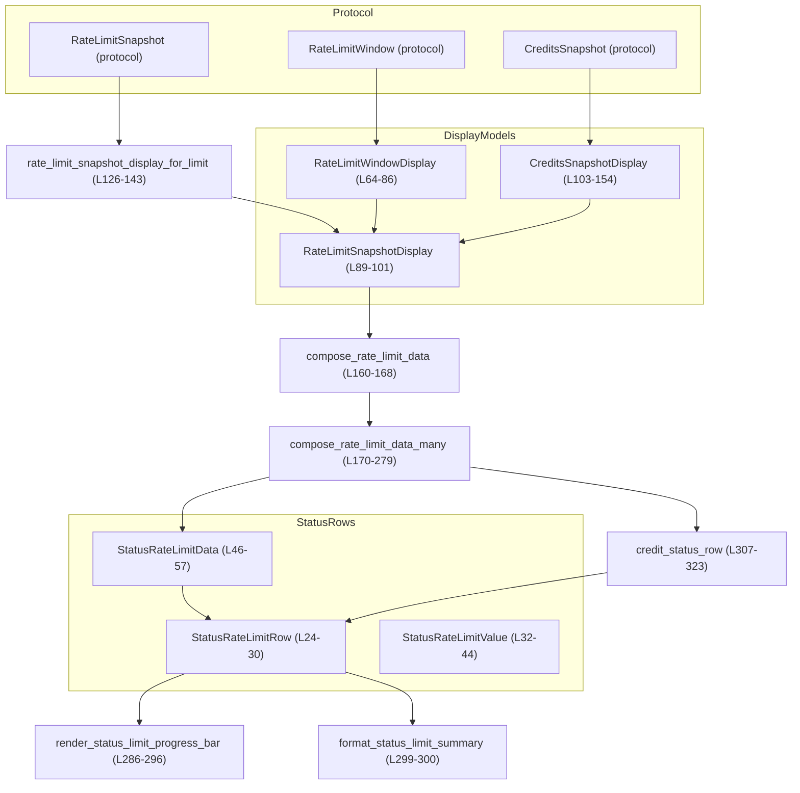
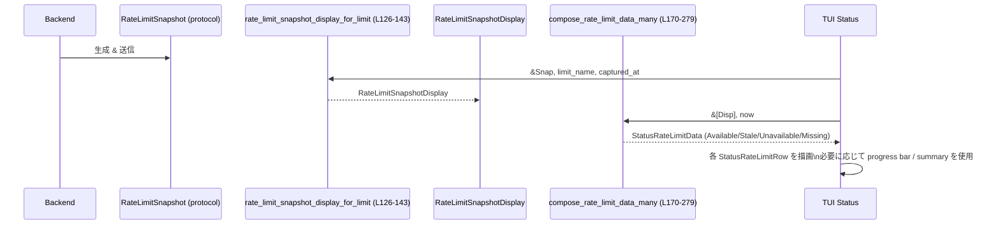

# tui/src/status/rate_limits.rs コード解説

## 0. ざっくり一言

`RateLimitSnapshot` / クレジット情報（`CreditsSnapshot`）を、TUI の `/status` 画面やステータスラインで表示しやすい「行データ（ラベル＋値）」に変換し、利用状況バーやクレジット残高テキストを生成するモジュールです（`tui/src/status/rate_limits.rs:L1-7, L156-163`）。

---

## 1. このモジュールの役割

### 1.1 概要

- バックエンドから受け取るプロトコル型 `RateLimitSnapshot` / `RateLimitWindow` / `CreditsSnapshot` を、TUI 表示専用の構造体群（`RateLimitSnapshotDisplay` など）に変換します（`tui/src/status/rate_limits.rs:L62-71, L89-112, L126-143`）。
- 複数スナップショットから「行ラベル＋値」の一覧（`StatusRateLimitRow`）を組み立て、利用率ウィンドウ・クレジット行・データの鮮度状態（Available/Stale/Unavailable/Missing）を判定します（`tui/src/status/rate_limits.rs:L24-30, L46-57, L170-279`）。
- パーセント値から固定幅の進捗バー文字列と簡易テキストサマリを生成します（`tui/src/status/rate_limits.rs:L282-301`）。

### 1.2 アーキテクチャ内での位置づけ

依存関係の概要です。

- 入力:
  - `codex_protocol::protocol::RateLimitSnapshot` / `RateLimitWindow` / `CreditsSnapshot`（プロトコル層）（`tui/src/status/rate_limits.rs:L16-18`）
- 表示用中間モデル:
  - `RateLimitWindowDisplay`, `RateLimitSnapshotDisplay`, `CreditsSnapshotDisplay`（`tui/src/status/rate_limits.rs:L62-71, L89-112`）
- 行データ:
  - `StatusRateLimitRow`, `StatusRateLimitValue`, `StatusRateLimitData`（`tui/src/status/rate_limits.rs:L24-30, L32-44, L46-57`）
- 補助関数:
  - `get_limits_duration`（`crate::chatwidget`）: 分数を `"5h"` や `"1h"` といった文字列に変換（と推測されるが実装はこのチャンクには現れません）（`tui/src/status/rate_limits.rs:L8, L191-195, L201-205`）
  - `capitalize_first`（`crate::text_formatting`）: 先頭文字の大文字化（と読めます）（`tui/src/status/rate_limits.rs:L9, L196, L206`）
  - `format_reset_timestamp`（`super::helpers`）: リセット時刻をローカル時刻＋相対表現に整形（と解釈できます）（`tui/src/status/rate_limits.rs:L11, L79`）



### 1.3 設計上のポイント

- **プロトコル層と表示層の分離**  
  - 生のプロトコル型（`RateLimitSnapshot` 等）から、表示専用の `RateLimitSnapshotDisplay` / `RateLimitWindowDisplay` / `CreditsSnapshotDisplay` に変換することで、UI 側コードからプロトコル依存のフォーマット処理を切り離しています（`tui/src/status/rate_limits.rs:L62-71, L89-112, L126-143`）。
- **スナップショットの鮮度判定**  
  - 現在時刻 `now` とスナップショットの `captured_at` の差分が 15 分を超えるかで `Available` / `Stale` を切り替えます（`tui/src/status/rate_limits.rs:L59-60, L181-183, L273-279`）。
- **ラベル合成ロジック**  
  - `codex` 以外の limit 名について、単一ウィンドウのときは `"codex-other 5h limit"` のように limit 名＋ウィンドウ種別を 1 行にまとめ、複数ウィンドウのときは `"codex-other limit"` 行の下にウィンドウ別行を並べるルールになっています（`tui/src/status/rate_limits.rs:L185-210, L211-264`）。
- **クレジット表示の条件付き出力**  
  - クレジットが有効で `unlimited` なら `"Credits: Unlimited"`、そうでなければ残高が正の値のときだけ `"42 credits"` と表示し、ゼロ以下やパース不能な場合は行を出力しません（`tui/src/status/rate_limits.rs:L103-112, L307-345`）。
- **安全性・エラー処理**  
  - `Option` とパース結果のチェックで不正値を無視する方針で、`panic` や `unwrap` は使っていません（`tui/src/status/rate_limits.rs:L73-86, L307-345`）。
- **並行性**  
  - グローバルな可変状態を持たない純粋なデータ変換ロジックであり、スレッド間で共有しても（`DateTime` や `String` の通常の Rust の意味において）安全に利用できる構造になっています。このチャンクには同期原語や async は現れません。

---

## 2. 主要な機能とコンポーネント一覧

### 2.1 コンポーネントインベントリー（型・定数）

| 名前 | 種別 | 公開範囲 | 役割 / 用途 | 定義位置 |
|------|------|----------|-------------|----------|
| `STATUS_LIMIT_BAR_SEGMENTS` | `const usize` | モジュール内 | 進捗バーのセグメント数（20 固定） | `tui/src/status/rate_limits.rs:L20` |
| `STATUS_LIMIT_BAR_FILLED` | `const &str` | モジュール内 | バーの「使用中」部分の文字（`"█"`） | `tui/src/status/rate_limits.rs:L21` |
| `STATUS_LIMIT_BAR_EMPTY` | `const &str` | モジュール内 | バーの「残り」部分の文字（`"░"`） | `tui/src/status/rate_limits.rs:L22` |
| `RATE_LIMIT_STALE_THRESHOLD_MINUTES` | `pub(crate) const i64` | クレート内 | スナップショットが Stale とみなされるまでの分数（15 分） | `tui/src/status/rate_limits.rs:L59-60` |
| `StatusRateLimitRow` | `struct` | `pub(crate)` | 1 行分の表示（ラベル＋値） | `tui/src/status/rate_limits.rs:L24-30` |
| `StatusRateLimitValue` | `enum` | `pub(crate)` | 行の値の種類（ウィンドウ使用率 or テキスト） | `tui/src/status/rate_limits.rs:L32-44` |
| `StatusRateLimitData` | `enum` | `pub(crate)` | ステータス表示用のデータ有無・鮮度状態 | `tui/src/status/rate_limits.rs:L46-57` |
| `RateLimitWindowDisplay` | `struct` | `pub(crate)` | 1 ウィンドウ分の使用率とリセット表示 | `tui/src/status/rate_limits.rs:L62-71` |
| `RateLimitSnapshotDisplay` | `struct` | `pub(crate)` | 1 limit（例: codex）分の表示用スナップショット | `tui/src/status/rate_limits.rs:L89-101` |
| `CreditsSnapshotDisplay` | `struct` | `pub(crate)` | クレジット状態の表示用スナップショット | `tui/src/status/rate_limits.rs:L103-112` |

### 2.2 コンポーネントインベントリー（関数・メソッド）

| 名前 | 種別 | 公開範囲 | 役割 / 用途 | 定義位置 |
|------|------|----------|-------------|----------|
| `RateLimitWindowDisplay::from_window` | メソッド | モジュール内 | `RateLimitWindow` から表示用ウィンドウに変換 | `tui/src/status/rate_limits.rs:L73-86` |
| `rate_limit_snapshot_display` | 関数 | `pub(crate)`（`#[cfg(test)]`） | テスト用: `RateLimitSnapshot` を `"codex"` 用の表示スナップショットに変換 | `tui/src/status/rate_limits.rs:L114-124` |
| `rate_limit_snapshot_display_for_limit` | 関数 | `pub(crate)` | 任意の limit 名向けに `RateLimitSnapshotDisplay` を構築 | `tui/src/status/rate_limits.rs:L126-143` |
| `impl From<&CoreCreditsSnapshot> for CreditsSnapshotDisplay::from` | メソッド | `pub(crate)` | プロトコルのクレジット情報を表示用にコピー | `tui/src/status/rate_limits.rs:L146-153` |
| `compose_rate_limit_data` | 関数 | `pub(crate)` | 単一スナップショットを `StatusRateLimitData` に変換 | `tui/src/status/rate_limits.rs:L156-168` |
| `compose_rate_limit_data_many` | 関数 | `pub(crate)` | 複数スナップショットから行リストと鮮度を構築 | `tui/src/status/rate_limits.rs:L170-279` |
| `render_status_limit_progress_bar` | 関数 | `pub(crate)` | 残りパーセンテージから固定幅のバー文字列を生成 | `tui/src/status/rate_limits.rs:L282-296` |
| `format_status_limit_summary` | 関数 | `pub(crate)` | 残りパーセンテージから `"80% left"` 形式のテキストを生成 | `tui/src/status/rate_limits.rs:L298-300` |
| `credit_status_row` | 関数 | モジュール内 | クレジット情報から 1 行の `StatusRateLimitRow` を生成 | `tui/src/status/rate_limits.rs:L303-323` |
| `format_credit_balance` | 関数 | モジュール内 | 生文字列の残高を丸めて表示用整数文字列に変換 | `tui/src/status/rate_limits.rs:L325-345` |
| `tests::window` | 関数 | テスト | テスト用の `RateLimitWindowDisplay` ヘルパ | `tui/src/status/rate_limits.rs:L357-363` |
| `tests::non_codex_single_limit_renders_combined_row` | テスト関数 | テスト | 非 codex・単一ウィンドウのラベル結合挙動を検証 | `tui/src/status/rate_limits.rs:L365-407` |
| `tests::non_codex_multi_limit_keeps_group_row` | テスト関数 | テスト | 非 codex・複数ウィンドウのグループ行挙動を検証 | `tui/src/status/rate_limits.rs:L409-441` |

### 2.3 主要な機能一覧（概要）

- レートリミットウィンドウの表示用変換: `RateLimitWindowDisplay::from_window`
- スナップショット全体の表示用変換: `rate_limit_snapshot_display_for_limit`
- ステータス表示行の組み立て＋鮮度判定: `compose_rate_limit_data` / `compose_rate_limit_data_many`
- 残りパーセンテージの進捗バー生成: `render_status_limit_progress_bar`
- 残りパーセンテージのテキストサマリ生成: `format_status_limit_summary`
- クレジット残高行の生成と数値パース: `credit_status_row` / `format_credit_balance`

---

## 3. 公開 API と詳細解説

### 3.1 型一覧（構造体・列挙体）

| 名前 | 種別 | 役割 / 用途 | 主なフィールド | 根拠 |
|------|------|-------------|----------------|------|
| `StatusRateLimitRow` | 構造体 | ステータス表示の 1 行 | `label: String`, `value: StatusRateLimitValue` | `tui/src/status/rate_limits.rs:L24-30` |
| `StatusRateLimitValue` | 列挙体 | 行の値（ウィンドウ型 or テキスト） | `Window { percent_used, resets_at }`, `Text(String)` | `tui/src/status/rate_limits.rs:L32-44` |
| `StatusRateLimitData` | 列挙体 | データ有無と鮮度 | `Available(Vec<StatusRateLimitRow>)`, `Stale(Vec<...>)`, `Unavailable`, `Missing` | `tui/src/status/rate_limits.rs:L46-57` |
| `RateLimitWindowDisplay` | 構造体 | 1 ウィンドウの使用率とリセット表示 | `used_percent: f64`, `resets_at: Option<String>`, `window_minutes: Option<i64>` | `tui/src/status/rate_limits.rs:L62-71` |
| `RateLimitSnapshotDisplay` | 構造体 | 1 limit ごとの表示用スナップショット | `limit_name`, `captured_at`, `primary`, `secondary`, `credits` | `tui/src/status/rate_limits.rs:L89-101` |
| `CreditsSnapshotDisplay` | 構造体 | クレジット表示用スナップショット | `has_credits`, `unlimited`, `balance` | `tui/src/status/rate_limits.rs:L103-112` |

### 3.2 重要関数の詳細

#### `RateLimitWindowDisplay::from_window(window: &RateLimitWindow, captured_at: DateTime<Local>) -> Self`

**概要**

- プロトコルの `RateLimitWindow` を、ローカルタイムゾーンと UI 向けフォーマットに合わせた `RateLimitWindowDisplay` に変換します（`tui/src/status/rate_limits.rs:L73-86`）。

**引数**

| 引数名 | 型 | 説明 |
|--------|----|------|
| `window` | `&RateLimitWindow` | プロトコル側のレートリミットウィンドウ。`used_percent` / `resets_at` / `window_minutes` フィールドを使用します（`tui/src/status/rate_limits.rs:L75-77, L82, L84`）。 |
| `captured_at` | `DateTime<Local>` | スナップショット取得時刻（ローカル）。リセット時刻表示の相対基準に用います（`tui/src/status/rate_limits.rs:L74, L79`）。 |

**戻り値**

- `RateLimitWindowDisplay`  
  - `used_percent`: `window.used_percent` をそのままコピー。  
  - `resets_at`: `window.resets_at` があれば UTC 秒からローカル日時へ変換し、`format_reset_timestamp` で文字列化したもの。なければ `None`。  
  - `window_minutes`: `window.window_minutes` をコピー（`tui/src/status/rate_limits.rs:L75-85`）。

**内部処理の流れ**

1. `window.resets_at`（おそらく epoch 秒）から、`DateTime::<Utc>::from_timestamp` で UTC の日時を生成（失敗時は `None`）（`tui/src/status/rate_limits.rs:L75-77`）。
2. その UTC 日時を `.with_timezone(&Local)` でローカルタイムに変換（`tui/src/status/rate_limits.rs:L78`）。
3. `format_reset_timestamp(dt, captured_at)` に渡し、ローカルなリセット表示テキストを得る（`tui/src/status/rate_limits.rs:L79`）。
4. `used_percent` と `window_minutes` をコピーして `Self` を構築（`tui/src/status/rate_limits.rs:L81-85`）。

**Errors / Panics**

- `from_timestamp` が `None` を返した場合（範囲外など）は `resets_at` が `None` になり、パニックは発生しません（`tui/src/status/rate_limits.rs:L75-79`）。
- この関数内に `unwrap` や `expect` はなく、エラーはすべて `Option` の形で無視されています。

**Edge cases（エッジケース）**

- `window.resets_at` が `None` または不正な値: `resets_at` は `None` になり、UI 側ではリセット時刻を表示できない状態になります。
- `window.window_minutes` が `None`: 後段のラベル生成でデフォルト値（`"5h"` や `"weekly"`）が使われます（`tui/src/status/rate_limits.rs:L191-195, L201-205`）。
- `used_percent` が 0 や 100 を超えていても、本メソッドでは特に制限していません（チェックは別途 UI 側や呼び出し側の責務です）。

**使用上の注意点**

- `captured_at` には、その `RateLimitWindow` を含むスナップショットが実際に取得された時刻を渡すことが前提です。古い or 未来の時刻を渡すと、`format_reset_timestamp` による相対表示（例: `"in 3h"` 等）が不正確になります（`tui/src/status/rate_limits.rs:L6-7, L79`）。

---

#### `rate_limit_snapshot_display_for_limit(snapshot: &RateLimitSnapshot, limit_name: String, captured_at: DateTime<Local>) -> RateLimitSnapshotDisplay`

**概要**

- プロトコルの `RateLimitSnapshot` を、指定された `limit_name` 用の `RateLimitSnapshotDisplay` に変換します（`tui/src/status/rate_limits.rs:L126-143`）。
- primary / secondary ウィンドウとクレジット情報を、それぞれ表示用構造体に変換して束ねます。

**引数**

| 引数名 | 型 | 説明 |
|--------|----|------|
| `snapshot` | `&RateLimitSnapshot` | バックエンドからのスナップショット。`primary` / `secondary` / `credits` を参照します（`tui/src/status/rate_limits.rs:L135-142`）。 |
| `limit_name` | `String` | このスナップショットに対応する limit 識別子（例: `"codex"`, `"codex-other"`）。表示ラベルのプレフィックスとして使用します（`tui/src/status/rate_limits.rs:L131-132, L185-186`）。 |
| `captured_at` | `DateTime<Local>` | この表示スナップショットの取得時刻。鮮度判定に利用されます（`tui/src/status/rate_limits.rs:L133`）。 |

**戻り値**

- `RateLimitSnapshotDisplay`  
  - `primary`: `snapshot.primary` が `Some` なら `RateLimitWindowDisplay::from_window` で変換した結果。  
  - `secondary`: 同様に `snapshot.secondary` を変換。  
  - `credits`: `snapshot.credits` が `Some` なら `CreditsSnapshotDisplay::from` で変換（`tui/src/status/rate_limits.rs:L135-143`）。

**内部処理の流れ**

1. `limit_name` と `captured_at` をそのまま構造体フィールドにセット（`tui/src/status/rate_limits.rs:L131-134`）。
2. `snapshot.primary.as_ref().map(|w| RateLimitWindowDisplay::from_window(w, captured_at))` で primary ウィンドウを変換（`tui/src/status/rate_limits.rs:L135-137`）。
3. `snapshot.secondary` も同様に変換（`tui/src/status/rate_limits.rs:L138-141`）。
4. `snapshot.credits.as_ref().map(CreditsSnapshotDisplay::from)` でクレジット情報をコピー（`tui/src/status/rate_limits.rs:L142`）。

**Errors / Panics**

- `Option::map` を使っており、値が `None` の場合はそのまま `None` に変換されるだけで、パニックは発生しません（`tui/src/status/rate_limits.rs:L135-143`）。

**Edge cases**

- `primary` / `secondary` / `credits` いずれも `None` の場合: `RateLimitSnapshotDisplay` 自体は作られますが、後段で行が 1 つも生成されず `StatusRateLimitData::Unavailable` になる可能性があります（`tui/src/status/rate_limits.rs:L170-179, L273-275`）。

**使用上の注意点**

- `limit_name` は後続の `compose_rate_limit_data_many` におけるラベリング仕様に影響します。`"codex"`（大文字小文字無視）だけが特別扱いされ、それ以外はプレフィックスとして表示されます（`tui/src/status/rate_limits.rs:L185-187, L219-225, L241-248`）。

---

#### `compose_rate_limit_data(snapshot: Option<&RateLimitSnapshotDisplay>, now: DateTime<Local>) -> StatusRateLimitData`

**概要**

- 単一の `RateLimitSnapshotDisplay` から、行リストと鮮度状態を含む `StatusRateLimitData` を構築するシンプルなラッパーです（`tui/src/status/rate_limits.rs:L156-168`）。

**引数**

| 引数名 | 型 | 説明 |
|--------|----|------|
| `snapshot` | `Option<&RateLimitSnapshotDisplay>` | ステータス表示に使うスナップショット。`None` の場合はデータ無しとして扱います（`tui/src/status/rate_limits.rs:L161-167`）。 |
| `now` | `DateTime<Local>` | レンダリング時刻。鮮度判定に使用します（`tui/src/status/rate_limits.rs:L160-163`）。 |

**戻り値**

- `StatusRateLimitData`  
  - `Some(snapshot)` の場合: `compose_rate_limit_data_many` を 1 要素スライスで呼び出した結果。  
  - `None` の場合: `StatusRateLimitData::Missing`（`tui/src/status/rate_limits.rs:L164-167`）。

**内部処理の流れ**

1. `match snapshot` で `Some` と `None` を分岐（`tui/src/status/rate_limits.rs:L164-167`）。
2. `Some` なら `std::slice::from_ref(snapshot)` で長さ 1 のスライスを作り、`compose_rate_limit_data_many` に委譲。

**Errors / Panics**

- この関数内でパニックの可能性はありません。

**Edge cases**

- `snapshot` が `None`: 直接 `StatusRateLimitData::Missing` を返します。行リスト自体は構築されません（`tui/src/status/rate_limits.rs:L165-167`）。

**使用上の注意点**

- 単一の limit のみを扱う場合のエントリポイントであり、複数 limit（例: `"codex"` と `"codex-other"`）をまとめて表示する場合は `compose_rate_limit_data_many` を直接用いる必要があります。

---

#### `compose_rate_limit_data_many(snapshots: &[RateLimitSnapshotDisplay], now: DateTime<Local>) -> StatusRateLimitData`

**概要**

- 複数の `RateLimitSnapshotDisplay` から、表示用の行リスト（`Vec<StatusRateLimitRow>`）と、データの鮮度（Available / Stale / Unavailable / Missing）を判定して `StatusRateLimitData` を返します（`tui/src/status/rate_limits.rs:L170-279`）。

**引数**

| 引数名 | 型 | 説明 |
|--------|----|------|
| `snapshots` | `&[RateLimitSnapshotDisplay]` | 1 つ以上の limit に対応する表示用スナップショット配列。空配列は Missing とみなされます（`tui/src/status/rate_limits.rs:L171-176`）。 |
| `now` | `DateTime<Local>` | レンダリング時刻。スナップショットの `captured_at` と比較して鮮度を判定します（`tui/src/status/rate_limits.rs:L172-173, L181-183`）。 |

**戻り値**

- `StatusRateLimitData`  
  - 行が 1 行以上生成された場合: `Available(rows)` または `Stale(rows)`。  
  - 行が 0 行だった場合: `Unavailable`。  
  - `snapshots` が空だった場合: `Missing`（`tui/src/status/rate_limits.rs:L174-176, L273-279`）。

**内部処理の流れ**

1. `snapshots.is_empty()` なら即 `Missing` を返す（`tui/src/status/rate_limits.rs:L174-176`）。
2. 行ベクタ `rows` を、スナップショット数の約 3 倍キャパシティで確保し、`stale` フラグを `false` で初期化（`tui/src/status/rate_limits.rs:L178-179`）。
3. 各 `snapshot` に対してループし、以下を行う（`tui/src/status/rate_limits.rs:L181-271`）:
   - `stale` フラグを、現在の `stale` OR `now - captured_at > 15 分` で更新（`tui/src/status/rate_limits.rs:L181-183`）。
   - `limit_bucket_label` と `show_limit_prefix`（`limit_name != "codex"`）を計算（`tui/src/status/rate_limits.rs:L185-187`）。
   - primary / secondary のウィンドウラベルを生成: `window_minutes` があれば `get_limits_duration` → `capitalize_first`、なければ `"5h"` / `"weekly"` のデフォルト（`tui/src/status/rate_limits.rs:L187-206`）。
   - primary / secondary の存在数から `window_count` を算出し、非 codex かつ 1 ウィンドウのみなら `combine_non_codex_single_limit` を true にする（`tui/src/status/rate_limits.rs:L207-209`）。
   - 非 codex で複数ウィンドウまたはウィンドウなしの場合、`"{limit_name} limit"` というグループ見出し行を追加（値は空文字列）（`tui/src/status/rate_limits.rs:L211-216`）。
   - primary があれば、`combine_non_codex_single_limit` に応じて `"5h limit"` または `"codex-other 5h limit"` をラベルとし、`StatusRateLimitValue::Window` 行を追加（`tui/src/status/rate_limits.rs:L218-238`）。
   - secondary も同様にラベルを作って行を追加（`tui/src/status/rate_limits.rs:L240-263`）。
   - `credits` があれば `credit_status_row` で行を生成し、`Some(row)` の場合だけ `rows` に追加（`tui/src/status/rate_limits.rs:L266-270`）。
4. ループ後、`rows` が空なら `Unavailable`、そうでなければ `stale` フラグに応じて `Stale(rows)` または `Available(rows)` を返す（`tui/src/status/rate_limits.rs:L273-279`）。

**Errors / Panics**

- 空スライス等の入力は `Missing` として扱われ、パニックにはなりません。
- すべての分岐で `unwrap`・`expect` などは使用されていません。

**Edge cases**

- `snapshots` が空: `StatusRateLimitData::Missing`（`tui/src/status/rate_limits.rs:L174-176`）。
- すべての `snapshot` がウィンドウもクレジットも持たない: `rows` が空になり `StatusRateLimitData::Unavailable`（`tui/src/status/rate_limits.rs:L273-275`）。
- 任意の 1 つの `snapshot` が 15 分超の古さであれば、**すべての行が `Stale` 扱い** になります（`stale` フラグが OR で集計されるため）（`tui/src/status/rate_limits.rs:L181-183, L275-277`）。
- `"codex"` という limit 名は大小無視で特別扱いされ、プレフィックス行は付かず `"5h limit"` などだけが表示されます（`tui/src/status/rate_limits.rs:L185-187, L211-216, L365-407` テスト参照）。

**使用上の注意点**

- `now` はレンダリング時点の現在時刻（`Local::now()`）を渡すことが想定されており、キャッシュされた古い時刻を渡すと、最新データが誤って `Stale` 判定される可能性があります（`tui/src/status/rate_limits.rs:L158-159`）。
- 複数 limit を渡した場合、**どれか一つでも古ければ全体が Stale** になる仕様であることに注意が必要です。

---

#### `render_status_limit_progress_bar(percent_remaining: f64) -> String`

**概要**

- 残りパーセンテージ（0〜100）から、固定幅 20 セグメントの進捗バー文字列（例: `"[████░░░░░░░░░░░░░]"`）を生成します（`tui/src/status/rate_limits.rs:L282-296`）。

**引数**

| 引数名 | 型 | 説明 |
|--------|----|------|
| `percent_remaining` | `f64` | 残りパーセンテージ。0〜100 を想定し、それ以外はクランプされます（`tui/src/status/rate_limits.rs:L284-285`）。 |

**戻り値**

- `String`  
  - `"[" + filled("█") + empty("░") + "]"` という形式のバー文字列（`tui/src/status/rate_limits.rs:L291-295`）。

**内部処理の流れ**

1. `percent_remaining / 100.0` を `0.0..=1.0` にクランプして比率 `ratio` を得る（`tui/src/status/rate_limits.rs:L287`）。
2. `ratio * STATUS_LIMIT_BAR_SEGMENTS` を四捨五入して整数にし、filled セグメント数とする（`tui/src/status/rate_limits.rs:L288`）。
3. `filled` を最大 `STATUS_LIMIT_BAR_SEGMENTS` に制限し、`empty` を `STATUS_LIMIT_BAR_SEGMENTS.saturating_sub(filled)` で計算（`tui/src/status/rate_limits.rs:L289-290`）。
4. `"[" + "█".repeat(filled) + "░".repeat(empty) + "]"` を `format!` で組み立てる（`tui/src/status/rate_limits.rs:L291-295`）。

**Errors / Panics**

- 通常の数値 (`f64`) についてはパニックしません。`NaN` が渡された場合の挙動は、このコードからは明示されておらず、Rust の標準キャスト規則に従います。

**Edge cases**

- `percent_remaining < 0.0`: `ratio` が 0 にクランプされ、全て empty セグメントになります（`tui/src/status/rate_limits.rs:L287`）。
- `percent_remaining > 100.0`: `ratio` が 1 にクランプされ、全て filled セグメントになります。
- 途中の小数値: 四捨五入で filled セグメント数が決まるため、50% で 10 セグメント、2.5% で 1 セグメントなどとなります。

**使用上の注意点**

- ドキュメントコメントにもある通り、「**残り**パーセンテージ」を渡す前提です。**使用済みパーセンテージ**を渡すと、バーの意味が反転します（`tui/src/status/rate_limits.rs:L282-285`）。

---

#### `format_status_limit_summary(percent_remaining: f64) -> String`

**概要**

- 残りパーセンテージを `"80% left"` のような短いテキストに整形します（`tui/src/status/rate_limits.rs:L298-300`）。

**引数**

| 引数名 | 型 | 説明 |
|--------|----|------|
| `percent_remaining` | `f64` | 残りパーセンテージ。0〜100 を想定しています。 |

**戻り値**

- `String`  
  - `"{percent_remaining:.0}% left"`、つまり四捨五入された整数パーセンテージ＋ `" left"`（`tui/src/status/rate_limits.rs:L299-300`）。

**Errors / Panics**

- パニックする経路はありません。

**Edge cases**

- 小数値: `.0` フォーマットにより四捨五入されます（`tui/src/status/rate_limits.rs:L299`）。
- 0 未満または 100 超: そのまま表示されます（クランプは行いません）。

**使用上の注意点**

- `render_status_limit_progress_bar` と同様、「残り」を渡す想定です。意味を一致させるため、呼び出し側で used→remaining の変換を揃える必要があります。

---

#### `credit_status_row(credits: &CreditsSnapshotDisplay) -> Option<StatusRateLimitRow>`

**概要**

- クレジット情報が有効かつ表示可能な場合に、 `"Credits"` 行を 1 行生成します（`tui/src/status/rate_limits.rs:L303-323`）。
- クレジットが無効・ゼロ・不正フォーマットの場合は `None` を返し、行を作成しません。

**引数**

| 引数名 | 型 | 説明 |
|--------|----|------|
| `credits` | `&CreditsSnapshotDisplay` | クレジット状態（有効フラグ・unlimited フラグ・残高文字列） |

**戻り値**

- `Option<StatusRateLimitRow>`  
  - `Some(row)` の場合: `"Credits"` ラベルの `StatusRateLimitRow`。  
  - `None` の場合: 行を表示しないことを意味します。

**内部処理の流れ**

1. `credits.has_credits` が `false` の場合、`None` を返す（`tui/src/status/rate_limits.rs:L307-310`）。
2. `credits.unlimited` が `true` の場合、`"Credits"` / `"Unlimited"` 行を `Some` で返す（`tui/src/status/rate_limits.rs:L311-315`）。
3. それ以外の場合、`credits.balance.as_ref()?` でバランス文字列を取得できなければ `None`（`?` により早期 return）（`tui/src/status/rate_limits.rs:L317`）。
4. `format_credit_balance(balance)?` で正の整数文字列に整形できなければ `None`（`tui/src/status/rate_limits.rs:L318`）。
5. 整形された数値を `"{} credits"` に埋め込んだ `StatusRateLimitRow` を `Some` で返す（`tui/src/status/rate_limits.rs:L319-322`）。

**Errors / Panics**

- すべて `Option` で扱っており、パニックしません。

**Edge cases**

- `has_credits == false`: クレジット行は一切表示されません（`tui/src/status/rate_limits.rs:L308-310`）。
- `unlimited == true`: 残高文字列に関係なく `"Unlimited"` と表示されます（`tui/src/status/rate_limits.rs:L311-315`）。
- `balance` が空文字・空白のみ・ゼロ以下・パース不能な文字列: `format_credit_balance` が `None` を返し、この関数も `None` を返します（`tui/src/status/rate_limits.rs:L317-318, L325-345`）。

**使用上の注意点**

- 「クレジット = 0」のような状況でも行がスキップされる仕様であるため、UI に「0 credits」と明示したい場合は仕様レベルの変更が必要です（コード上は 0 を表示しません）。

---

### 3.3 その他の関数

| 関数名 | 役割（1 行） | 定義位置 |
|--------|--------------|----------|
| `rate_limit_snapshot_display` | テスト用ヘルパ。`RateLimitSnapshot` を `"codex"` limit の `RateLimitSnapshotDisplay` に変換 | `tui/src/status/rate_limits.rs:L114-124` |
| `format_credit_balance` | 生文字列の残高をトリムし、整数優先・小数は四捨五入で整数文字列に変換し、正の値のときだけ `Some` を返す | `tui/src/status/rate_limits.rs:L325-345` |
| `impl From<&CoreCreditsSnapshot> for CreditsSnapshotDisplay::from` | プロトコルのクレジット情報を表示用構造体にコピーするシンプルな変換 | `tui/src/status/rate_limits.rs:L146-153` |

---

## 4. データフロー

### 4.1 典型的な処理シナリオ

1. バックエンドが `RateLimitSnapshot` を返します（別モジュールの責務）。
2. 呼び出し側が `RateLimitSnapshot` と `limit_name`、`captured_at` を `rate_limit_snapshot_display_for_limit` に渡し、`RateLimitSnapshotDisplay` を得ます（`tui/src/status/rate_limits.rs:L126-143`）。
3. 複数 limit 分の `RateLimitSnapshotDisplay` を配列にまとめ、`compose_rate_limit_data_many` に `now` とともに渡します（`tui/src/status/rate_limits.rs:L170-173`）。
4. `StatusRateLimitData::Available` または `Stale` の場合、`Vec<StatusRateLimitRow>` を取り出し、各行に対して任意の UI コンポーネント（テキスト、バーなど）を描画します。
5. 残りパーセンテージを計算した上で `render_status_limit_progress_bar` や `format_status_limit_summary` を利用し、利用状況バーやテキストサマリを表示します。



※ この図は `tui/src/status/rate_limits.rs` 全体（L1-441）内で定義される処理の流れを表します。

---

## 5. 使い方（How to Use）

### 5.1 基本的な使用方法（単一 limit）

以下は、このモジュール内または同一クレート内から、単一 limit のステータスを描画するまでの典型的な流れの例です。

```rust
use chrono::Local;
// このモジュール内で定義されている型・関数をそのまま利用する例です。

fn render_single_limit_status(snapshot_display: &RateLimitSnapshotDisplay) {
    // 現在時刻を取得（鮮度判定用）                         // now は必ず「今」の時刻
    let now = Local::now();

    // 単一スナップショットから StatusRateLimitData を生成   // Option<&RateLimitSnapshotDisplay> を渡す
    let status = compose_rate_limit_data(Some(snapshot_display), now);

    match status {
        StatusRateLimitData::Available(rows)
        | StatusRateLimitData::Stale(rows) => {
            // Available / Stale の違いで色付けなどを変えることができます
            for row in rows {
                match &row.value {
                    StatusRateLimitValue::Window { percent_used, resets_at } => {
                        // 使用率から「残り」を計算（例: 100 - used）  // used→remaining 変換は呼び出し側の責務
                        let remaining = (100.0 - percent_used).max(0.0);
                        let bar = render_status_limit_progress_bar(remaining);
                        let summary = format_status_limit_summary(remaining);
                        println!("{}: {} {} ({:?})", row.label, bar, summary, resets_at);
                    }
                    StatusRateLimitValue::Text(text) => {
                        println!("{}: {}", row.label, text);
                    }
                }
            }
        }
        StatusRateLimitData::Unavailable => {
            println!("Rate-limit data is unavailable");
        }
        StatusRateLimitData::Missing => {
            println!("Rate-limit snapshot is missing");
        }
    }
}
```

### 5.2 複数 limit（codex / codex-other）の表示

`compose_rate_limit_data_many` を利用して複数 limit をまとめて表示する例です。テストの期待結果と同様のラベリングになります（`tui/src/status/rate_limits.rs:L365-407`）。

```rust
use chrono::Local;

fn render_multi_limit_status(snapshots: &[RateLimitSnapshotDisplay]) {
    let now = Local::now();

    let status = compose_rate_limit_data_many(snapshots, now);

    if let StatusRateLimitData::Available(rows)
        | StatusRateLimitData::Stale(rows) = status
    {
        for row in rows {
            println!("{}: {:?}", row.label, row.value);
        }
    }
}
```

### 5.3 よくある誤用パターン

```rust
// 誤り例: 「使用済みパーセント」を進捗バーに渡している
let used = 80.0;
let bar = render_status_limit_progress_bar(used); // 「20% 残り」のバーとして表示されてしまう

// 正しい例: 残りパーセントを計算してから渡す
let used = 80.0;
let remaining = (100.0 - used).max(0.0);
let bar = render_status_limit_progress_bar(remaining);
```

```rust
// 誤り例: 古い now を再利用して鮮度判定している
let captured_at = Local::now();
// ... 数分後に描画するが captured_at をそのまま now として使う ...
let status = compose_rate_limit_data(Some(&snapshot_display), captured_at); // 鮮度判定が狂う可能性

// 正しい例: 描画タイミングごとに Local::now() を取得して渡す
let status = compose_rate_limit_data(Some(&snapshot_display), Local::now());
```

### 5.4 使用上の注意点（まとめ）

- **captured_at / now の一貫性**  
  - `RateLimitSnapshotDisplay.captured_at` はスナップショット取得時刻、`compose_rate_limit_data(_many)` の `now` は描画時刻という前提です。ここがずれると `Stale` 判定やリセット表示が不自然になります（`tui/src/status/rate_limits.rs:L89-95, L156-163, L181-183`）。
- **残り vs 使用済みパーセント**  
  - `render_status_limit_progress_bar` / `format_status_limit_summary` は残りパーセントを期待します。使用済みから残りへ変換する責務は呼び出し側にあります（`tui/src/status/rate_limits.rs:L282-285, L298-300`）。
- **クレジット残高の扱い**  
  - `credit_status_row` は 0 以下・不正な残高文字列・ `has_credits == false` の場合は行を出さない仕様です。0 クレジットを明示したい UI には適さないため、その場合は呼び出し側または仕様を調整する必要があります（`tui/src/status/rate_limits.rs:L307-323, L325-345`）。
- **鮮度判定の集約**  
  - 複数スナップショットを渡したとき、1 つでも 15 分超の古さがあれば全体が `Stale` になる仕様です（`tui/src/status/rate_limits.rs:L181-183, L273-279`）。
- **並行性**  
  - どの関数もグローバルな可変状態を持たず、引数と戻り値による純粋な変換だけを行います。そのため、複数スレッドから同時に呼び出してもデータ競合は発生しない構造になっています。

---

## 6. 変更の仕方（How to Modify）

### 6.1 新しい機能を追加する場合

例: 新しいウィンドウ種別（例: 月次 limit）を表示したい場合。

1. **プロトコル層の確認**  
   - `RateLimitSnapshot` / `RateLimitWindow` に新しいウィンドウ情報が追加されているか確認します（このチャンクには定義がないため、別ファイルを参照する必要があります）。
2. **表示用モデルの拡張**  
   - 必要に応じて `RateLimitSnapshotDisplay` に新しいフィールドを追加します（例: `tertiary: Option<RateLimitWindowDisplay>`）。  
   - それに応じて `rate_limit_snapshot_display_for_limit` 内で新フィールドを設定します（`tui/src/status/rate_limits.rs:L126-143`）。
3. **ラベルロジックの拡張**  
   - `compose_rate_limit_data_many` で新ウィンドウのラベルと行追加ロジックを追加します（`tui/src/status/rate_limits.rs:L187-210, L218-263`）。
4. **テストの追加**  
   - 現在のテストはラベル合成挙動を確認しているため、新しいケース用のテストを `mod tests` に追加するのが自然です（`tui/src/status/rate_limits.rs:L347-441`）。

### 6.2 既存機能を変更する場合の注意点

- **ラベル仕様の変更**  
  - `"codex"` とその他の limit 名の扱いはテストで明示的に検証されています。ラベル仕様を変える場合は、`non_codex_single_limit_renders_combined_row` / `non_codex_multi_limit_keeps_group_row` の期待値も合わせて更新する必要があります（`tui/src/status/rate_limits.rs:L365-441`）。
- **鮮度閾値の変更**  
  - `RATE_LIMIT_STALE_THRESHOLD_MINUTES` を変更するだけで鮮度判定に反映されますが、UI 側の文言（「15 分以上前」など）があれば合わせて更新する必要があります（`tui/src/status/rate_limits.rs:L59-60, L181-183`）。
- **クレジット表示ポリシーの変更**  
  - 現状は 0 / 不正値を非表示にするポリシーです。0 を表示したい場合は `format_credit_balance` の `> 0` 判定や、`credit_status_row` の `None` 処理を見直す必要があります（`tui/src/status/rate_limits.rs:L331-333, L337-339`）。
- **安全性・セキュリティ観点**  
  - 入力値はすべて `Option`・パース結果チェックを通しており、入力が不正でもパニックは起きません。その代わり「何も表示されない」形でフェイルします。ユーザに必ず状態を知らせたい場合は、この挙動を仕様として再検討する必要があります。

---

## 7. 関連ファイル・モジュール

| パス / モジュール | 役割 / 関係 |
|------------------|------------|
| `crate::chatwidget::get_limits_duration` | `window_minutes: i64` を `"5h"` や `"1h"` などの短い期間文字列に変換するユーティリティと解釈できます（`tui/src/status/rate_limits.rs:L8, L191-195, L201-205`）。具体的な実装はこのチャンクには現れません。 |
| `crate::text_formatting::capitalize_first` | 文字列の先頭文字を大文字にするために使用されています（`"weekly"` → `"Weekly"` など）（`tui/src/status/rate_limits.rs:L9, L196, L206`）。 |
| `super::helpers::format_reset_timestamp` | UTC 秒＋`captured_at` から、「ローカルリセット時刻」の文字列を生成するヘルパと解釈できます（`tui/src/status/rate_limits.rs:L11, L79`）。 |
| `codex_protocol::protocol::RateLimitSnapshot` | バックエンドからのレートリミットスナップショットのプロトコル型。このモジュールはそれを `RateLimitSnapshotDisplay` に変換して利用します（`tui/src/status/rate_limits.rs:L16-18, L126-143`）。 |
| `codex_protocol::protocol::RateLimitWindow` | `RateLimitSnapshot` 内のウィンドウ情報。`RateLimitWindowDisplay::from_window` で表示用に変換されます（`tui/src/status/rate_limits.rs:L18, L73-86`）。 |
| `codex_protocol::protocol::CreditsSnapshot` | クレジット情報のプロトコル型。`CreditsSnapshotDisplay` への `From` 実装でコピーされます（`tui/src/status/rate_limits.rs:L16, L146-153`）。 |

このチャンク内には、これら外部モジュール・型の実装コードは含まれていないため、詳細な挙動は別ファイルを参照する必要があります。
